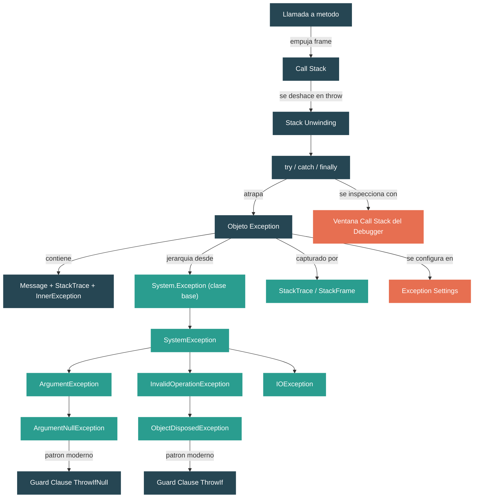

# Nivel 1: Fundamentos -- Flujo de Control, Excepciones y el Call Stack

> **Perfil objetivo:** Desarrollador que usa try/catch pero no entiende la maquinaria de excepciones
> **Esfuerzo estimado:** 3 horas
> **Prerrequisitos:** [Modulos 1.1--1.3](01-foundations-ecosystem-overview.md)
> [English version](../en/01-foundations-control-flow.md)

---

## Objetivos de Aprendizaje

Al final de este modulo, vas a poder:

1. Explicar como las llamadas a metodos construyen y deshacen el call stack, frame por frame.
2. Navegar la jerarquia de clases de `System.Exception` en el codigo fuente de `dotnet/runtime`.
3. Describir las propiedades clave que toda exception lleva: `Message`, `StackTrace`, `InnerException`, `HResult`.
4. Distinguir entre familias de excepciones (`ArgumentException`, `InvalidOperationException`, `IOException`) y saber cuando usar cada una.
5. Trazar el flujo de un `throw` a traves de bloques `try`/`catch`/`finally` y predecir el orden de ejecucion.
6. Usar los patrones modernos de guard clauses con `ThrowIf` (`ArgumentNullException.ThrowIfNull`, `ObjectDisposedException.ThrowIf`).
7. Explicar por que las excepciones son costosas comparadas con el flujo de control normal e identificar alternativas.
8. Leer un stack trace para localizar el origen de un error tanto en tu codigo como en codigo del framework.
9. Usar la ventana de Exception Settings y la ventana de Call Stack de Visual Studio para diagnosticar excepciones durante la depuracion.

---

## Mapa Conceptual



**Leyenda:** Teal oscuro = concepto, Verde = archivo/clase en el codigo fuente, Coral = herramienta

---

## Leccion 1: El Call Stack -- Que Es y Como Funciona

### Que vas a aprender

Como las llamadas a metodos crean una cadena de stack frames, y por que esta cadena importa para entender las excepciones.

### El concepto

Cada vez que llamas a un metodo en C#, el runtime empuja un **stack frame** al **call stack**. Un stack frame contiene:

- La direccion de retorno (a donde volver cuando el metodo termine)
- Las variables locales del metodo
- Los parametros del metodo
- Valores temporales usados durante la computacion

El call stack es una estructura Last-In-First-Out (LIFO). Cuando el metodo `A` llama al metodo `B`, que llama al metodo `C`, el stack se ve asi:

```
Tope del stack
+-----------+
|  Frame C  |  <-- ejecutandose actualmente
+-----------+
|  Frame B  |
+-----------+
|  Frame A  |
+-----------+
|   Main    |
+-----------+
Base del stack
```

Cuando `C` termina (retorna), su frame se **desapila** del stack, y la ejecucion se reanuda en `B`. Este proceso se repite hasta que vuelvas al punto de entrada.

Si el call stack crece demasiado profundo -- por ejemplo, un metodo que se llama a si mismo recursivamente sin un caso base -- agotas el espacio disponible del stack y obtenes un `StackOverflowException`. Esta es una de las pocas excepciones que **no podes atrapar** en .NET: el runtime termina el proceso.

### En el codigo fuente

Abri `src/libraries/System.Private.CoreLib/src/System/StackOverflowException.cs`. Nota lo compacto que es:

```csharp
public sealed class StackOverflowException : SystemException
{
    public StackOverflowException()
        : base(SR.Arg_StackOverflowException)
    {
        HResult = HResults.COR_E_STACKOVERFLOW;
    }
}
```

Observaciones clave:
- Es `sealed` -- no podes derivar de ella. El runtime controla cuando se lanza esta exception.
- Hereda de `SystemException`, que hereda de `Exception`. Esta es la jerarquia estandar.
- Establece un `HResult`, que es un codigo de error de la era COM. Cada tipo de exception tiene uno.

Ahora abri `src/libraries/System.Private.CoreLib/src/System/Diagnostics/StackFrame.cs`. La clase `StackFrame` representa un unico frame en el call stack:

```csharp
public partial class StackFrame
{
    private MethodBase? _method;       // En que metodo esta este frame
    private int _nativeOffset;         // Offset dentro del codigo nativo (compilado por el JIT)
    private int _ilOffset;             // Offset dentro del codigo IL
    private string? _fileName;         // Archivo fuente (si hay info de debug disponible)
    private int _lineNumber;           // Numero de linea del fuente
    private int _columnNumber;         // Numero de columna del fuente
}
```

Cada `StackFrame` almacena exactamente la informacion que ves cuando lees un stack trace: el metodo, el archivo y el numero de linea.

### Ejercicio practico

1. Crea una app de consola con tres metodos que se llamen entre si: `Main` -> `MethodA` -> `MethodB`.
2. En `MethodB`, agrega: `Console.WriteLine(Environment.StackTrace);`
3. Ejecuta la app y lee la salida. Identifica cada stack frame. Cuantos frames hay mas alla de tus tres metodos?
4. Pone un breakpoint en `MethodB` y abri la ventana de **Call Stack** en tu debugger. Compara con la salida de texto.

### Conclusion clave

El call stack es un registro vivo de "como llegue aca?" Cada llamada a metodo empuja un frame; cada retorno desapila uno. Cuando algo sale mal, esta cadena es la que te cuenta la historia.

### Error comun

> "El call stack y el heap son lo mismo."

Son areas de memoria completamente diferentes. El stack contiene frames de metodos (variables locales, direcciones de retorno) y se gestiona automaticamente a medida que los metodos entran y salen. El heap contiene objetos creados con `new` y es gestionado por el garbage collector. Exploraste el heap en el Modulo 1.3; el call stack es su contraparte para el flujo de ejecucion.

---

## Leccion 2: System.Exception -- Anatomia de un Error

### Que vas a aprender

Que informacion lleva un objeto exception y como esta estructurada la clase base `Exception` en el codigo fuente del runtime.

### El concepto

Cuando algo sale mal, .NET representa el error como un **objeto exception** -- una instancia de `System.Exception` o una de sus subclases. Toda exception lleva estas propiedades clave:

| Propiedad | Tipo | Que te dice |
|---|---|---|
| `Message` | `string` | Una descripcion legible de que salio mal |
| `StackTrace` | `string?` | El call stack en el punto donde se lanzo la exception |
| `InnerException` | `Exception?` | Una exception de nivel inferior envuelta (la causa original) |
| `Source` | `string?` | El nombre del assembly donde se origino la exception |
| `HResult` | `int` | Un codigo de error numerico compatible con COM |
| `Data` | `IDictionary` | Un diccionario de clave-valor arbitrario para contexto extra |
| `TargetSite` | `MethodBase?` | El metodo que lanzo la exception |

La propiedad `StackTrace` **no se puebla cuando creas la exception** -- se llena cuando haces `throw`. Este es un detalle importante: construir una exception es solo crear un objeto; lanzarla activa la maquinaria de recorrido del stack del runtime.

### En el codigo fuente

Abri `src/libraries/System.Private.CoreLib/src/System/Exception.cs`. Mira los constructores (lineas 20-41):

```csharp
public Exception()
{
    _HResult = HResults.COR_E_EXCEPTION;
}

public Exception(string? message)
    : this()
{
    _message = message;
}

// Crea una nueva Exception. Todas las clases derivadas deberian
// proveer este constructor.
// Nota: el stack trace no se inicia hasta que la exception
// es lanzada
public Exception(string? message, Exception? innerException)
    : this()
{
    _message = message;
    _innerException = innerException;
}
```

Nota el comentario: *"the stack trace is not started until the exception is thrown."* Esto confirma que la construccion y el lanzamiento son operaciones separadas.

Ahora mira la propiedad `StackTrace` (linea 208):

```csharp
public virtual string? StackTrace
{
    get
    {
        string? stackTraceString = _stackTraceString;
        string? remoteStackTraceString = _remoteStackTraceString;

        // si no hay stack trace, intentar obtener uno
        if (stackTraceString != null)
        {
            return remoteStackTraceString + stackTraceString;
        }
        // ...
    }
}
```

Y el metodo `ToString()` (linea 124) que arma el texto completo que ves en los logs:

```csharp
public override string ToString()
{
    string className = GetClassName();
    string? message = Message;
    string innerExceptionString = _innerException?.ToString() ?? "";
    // ...construye: "ClassName: Message ---> InnerException\n   --- End ---\nStackTrace"
}
```

El prefijo `" ---> "` para inner exceptions esta definido como constante:

```csharp
private protected const string InnerExceptionPrefix = " ---> ";
```

Este es el string literal que ves en la salida de excepciones cuando hay inner exceptions presentes.

### Ejercicio practico

1. Escribi este codigo y predeci que va a imprimir cada `Console.WriteLine` antes de ejecutarlo:

```csharp
var ex = new InvalidOperationException("Algo se rompio");
Console.WriteLine(ex.StackTrace is null);  // Que esperas?

try
{
    throw ex;
}
catch (Exception caught)
{
    Console.WriteLine(caught.StackTrace is null);  // Y ahora?
    Console.WriteLine(caught.Message);
    Console.WriteLine(caught.GetType().FullName);
}
```

2. Ahora modifica el codigo para envolver una inner exception:

```csharp
try
{
    try
    {
        int.Parse("no-es-un-numero");
    }
    catch (FormatException fe)
    {
        throw new InvalidOperationException("Fallo al parsear configuracion", fe);
    }
}
catch (Exception ex)
{
    Console.WriteLine(ex.ToString());
}
```

Lee la salida con cuidado. Encontra el separador `" ---> "` e identifica ambos stack traces.

### Conclusion clave

Una exception es un objeto C# regular con propiedades bien definidas. El stack trace se captura en el momento del `throw`, no en el momento de la construccion. La cadena de `InnerException` te permite preservar la causa original cuando envuelves y relanzas.

---

## Leccion 3: La Jerarquia de Excepciones -- Elegir la Exception Correcta

### Que vas a aprender

Como las excepciones estan organizadas en una jerarquia de clases, y como elegir el tipo de exception correcto cuando escribis tu propio codigo.

### El concepto

Las excepciones de .NET forman un arbol de herencia con raiz en `System.Exception`:

```
Exception
  +-- SystemException
  |     +-- ArgumentException
  |     |     +-- ArgumentNullException
  |     |     +-- ArgumentOutOfRangeException
  |     +-- InvalidOperationException
  |     |     +-- ObjectDisposedException
  |     +-- IOException
  |     |     +-- FileNotFoundException
  |     |     +-- DirectoryNotFoundException
  |     +-- NullReferenceException
  |     +-- IndexOutOfRangeException
  |     +-- StackOverflowException
  |     +-- OutOfMemoryException
  |     +-- NotSupportedException
  |     +-- NotImplementedException
  +-- ApplicationException  (historica; evitar en codigo nuevo)
```

Las familias clave y cuando usarlas:

| Familia | Cuando lanzarla | Ejemplo |
|---|---|---|
| `ArgumentException` / subclases | Un metodo recibio un argumento invalido | `ThrowIfNull`, valor fuera del rango esperado |
| `InvalidOperationException` | El objeto esta en un estado donde esta operacion no tiene sentido | Llamar a `Start()` en un timer ya iniciado |
| `ObjectDisposedException` | Llamaste a un metodo en un objeto que fue disposed | Usar un `Stream` despues de llamar a `Dispose()` |
| `IOException` / subclases | Una operacion de I/O fallo | Archivo no encontrado, disco lleno, error de red |
| `NotSupportedException` | La operacion es inherentemente no soportada | Llamar a `Write()` en un stream de solo lectura |
| `NotImplementedException` | El codigo todavia no fue escrito (placeholder) | Un stub de TODO en desarrollo |

**Regla general:** Elige el tipo de exception mas especifico que describa el problema con precision. Atrapa el tipo mas general que puedas manejar de forma significativa.

### En el codigo fuente

Abri `src/libraries/System.Private.CoreLib/src/System/ArgumentException.cs`. Nota el campo adicional `_paramName` (linea 18):

```csharp
public class ArgumentException : SystemException
{
    private readonly string? _paramName;
```

Este campo existe porque las excepciones de argumentos deberian decirte *cual* parametro fue el problematico. La propiedad `Message` (linea 73) lo agrega:

```csharp
public override string Message
{
    get
    {
        SetMessageField();
        string s = base.Message;
        if (!string.IsNullOrEmpty(_paramName))
        {
            s += " " + SR.Format(SR.Arg_ParamName_Name, _paramName);
        }
        return s;
    }
}
```

Ahora abri `src/libraries/System.Private.CoreLib/src/System/InvalidOperationException.cs`. Es mucho mas simple -- solo los tres constructores estandar y un `HResult`:

```csharp
public class InvalidOperationException : SystemException
{
    public InvalidOperationException()
        : base(SR.Arg_InvalidOperationException)
    {
        HResult = HResults.COR_E_INVALIDOPERATION;
    }
}
```

Compara con `src/libraries/System.Private.CoreLib/src/System/ObjectDisposedException.cs`. Hereda de `InvalidOperationException` (no directamente de `SystemException`) y agrega un campo `_objectName`:

```csharp
public class ObjectDisposedException : InvalidOperationException
{
    private readonly string? _objectName;
```

Esto significa que `catch (InvalidOperationException)` tambien atrapara `ObjectDisposedException` -- la jerarquia de herencia importa para los bloques catch.

### Ejercicio practico

1. Abri los tres archivos mencionados arriba en tu editor. Traza la cadena de herencia desde `ObjectDisposedException` hasta `Exception`. Escribila: `ObjectDisposedException` -> `InvalidOperationException` -> `SystemException` -> `Exception`.

2. Escribi un metodo que valide sus entradas y lance los tipos de exception apropiados:

```csharp
public static decimal CalculateDiscount(string productName, decimal price, decimal discountPercent)
{
    // Validar: productName no null/vacio, price > 0, discountPercent 0-100
    // Usa el tipo de exception correcto para cada caso
}
```

3. Escribi un test con dos bloques catch:

```csharp
try
{
    // llamar a CalculateDiscount con argumentos invalidos
}
catch (ArgumentNullException ex)
{
    Console.WriteLine($"Argumento null: {ex.ParamName}");
}
catch (ArgumentException ex)
{
    Console.WriteLine($"Argumento invalido: {ex.ParamName} - {ex.Message}");
}
```

Por que importa el orden de los bloques catch? Que pasa si los intercambias?

### Conclusion clave

La jerarquia de excepciones es un arbol. Los bloques catch matchean de mas especifico a mas general. Cuando lanzas, elegi el tipo mas especifico. Cuando atrapas, atrapa el tipo mas amplio que puedas manejar de forma significativa.

---

## Leccion 4: try/catch/finally y Stack Unwinding

### Que vas a aprender

Que pasa exactamente en el runtime cuando se lanza una exception, y como interactuan `try`/`catch`/`finally`.

### El concepto

Cuando se ejecuta una sentencia `throw`, el runtime comienza el **stack unwinding** -- un proceso de dos fases:

**Fase 1: Encontrar un handler**
El runtime recorre el call stack hacia arriba, frame por frame, buscando un bloque `catch` cuyo tipo de exception coincida (o sea una clase base de) la exception lanzada. Si no se encuentra ningun handler en todo el stack, el runtime llama a `Environment.FailFast` y termina el proceso.

**Fase 2: Deshacer hasta el handler**
Una vez que se encuentra un handler que matchea, el runtime deshace el stack desde el punto del throw hasta el handler. Durante el unwinding:
- Cada bloque `finally` en el camino se ejecuta, en orden de mas interno a mas externo
- Las variables locales en los frames deshechos se vuelven inalcanzables (elegibles para el GC)
- La variable del bloque `catch` recibe el objeto exception

Este es el orden de ejecucion para un throw:

```csharp
void MethodA()
{
    try
    {
        Console.WriteLine("1: Antes de la llamada");
        MethodB();
        Console.WriteLine("2: Despues de la llamada");     // SE SALTA
    }
    catch (Exception ex)
    {
        Console.WriteLine("5: Atrapado en A");
    }
    finally
    {
        Console.WriteLine("6: Finally en A");
    }
}

void MethodB()
{
    try
    {
        Console.WriteLine("3: Antes del throw");
        throw new InvalidOperationException("boom");
        Console.WriteLine("NUNCA: Despues del throw"); // INALCANZABLE
    }
    finally
    {
        Console.WriteLine("4: Finally en B");
    }
}
```

Orden de ejecucion: 1 -> 3 -> 4 -> 5 -> 6. Los puntos "2" y "NUNCA" nunca se alcanzan.

Reglas clave:
- Los bloques `finally` **siempre** se ejecutan (excepto si el proceso es matado o se llama a `Environment.FailFast`).
- Podes tener `try`/`finally` sin un `catch` -- util para codigo de limpieza.
- Podes relanzar con `throw;` (preserva el stack trace original) vs `throw ex;` (resetea el stack trace -- casi siempre incorrecto).
- Los filtros `when` en bloques catch te permiten manejar condicionalmente: `catch (IOException ex) when (ex.HResult == -2147024864)`.

### En el codigo fuente

Mira `src/coreclr/System.Private.CoreLib/src/System/Environment.CoreCLR.cs` (linea 39):

```csharp
[DoesNotReturn]
public static void FailFast(string? message)
{
    // Nota: el codigo de bucketizacion Watson del CLR mira al caller
    // para asignar culpa por crashes.
```

`Environment.FailFast` es la "opcion nuclear" -- termina el proceso inmediatamente sin ejecutar bloques `finally`. Se usa cuando la aplicacion detecta un estado tan corrupto que continuar es peligroso.

Nota tambien el atributo `[DoesNotReturn]` -- le dice al compilador que cualquier codigo despues de una llamada a `FailFast` es inalcanzable, lo que previene advertencias falsas sobre variables no inicializadas.

### Ejercicio practico

1. Predeci la salida de este codigo, luego ejecutalo para verificar:

```csharp
static void Main()
{
    try
    {
        Console.WriteLine("A");
        try
        {
            Console.WriteLine("B");
            throw new InvalidOperationException();
        }
        catch (ArgumentException)  // NO matchea
        {
            Console.WriteLine("C");
        }
        finally
        {
            Console.WriteLine("D");
        }
        Console.WriteLine("E");
    }
    catch (Exception)
    {
        Console.WriteLine("F");
    }
    finally
    {
        Console.WriteLine("G");
    }
    Console.WriteLine("H");
}
```

2. Ahora modifica el catch interno para usar `catch (InvalidOperationException)`. Como cambia la salida?

3. Experimenta con el relanzamiento. Agrega esto dentro del catch interno:

```csharp
catch (InvalidOperationException ex)
{
    Console.WriteLine("Atrapado interno");
    throw;  // vs: throw ex;  vs: throw new Exception("envuelto", ex);
}
```

Observa las diferencias en el stack trace para cada enfoque.

### Conclusion clave

El stack unwinding es ordenado: el runtime encuentra el handler primero, luego deshace frame por frame, ejecutando bloques `finally` en el camino. Usa `throw;` (no `throw ex;`) para preservar el stack trace original. Usa `finally` para limpieza que debe ocurrir sin importar si hubo exito o fallo.

### Error comun

> "`catch (Exception)` atrapa todo."

Casi. Atrapa todas las excepciones managed. Pero `StackOverflowException` y algunas excepciones nativas (access violations, por ejemplo) pueden terminar el proceso antes de que tu bloque catch se ejecute. El runtime las trata como **corrupted state exceptions** y no las entrega a bloques `catch` managed por defecto.

---

## Leccion 5: Patrones Modernos -- ThrowIf y Guard Clauses

### Que vas a aprender

El patron moderno de .NET para validacion de entradas usando metodos estaticos `ThrowIf`, por que existe, y como reduce el tamano del codigo.

### El concepto

Una **guard clause** es una validacion al inicio de un metodo que rechaza entradas invalidas tempranamente:

```csharp
// Guard clause tradicional
public void Process(string name)
{
    if (name is null)
        throw new ArgumentNullException(nameof(name));

    // ... logica principal
}
```

A partir de .NET 6, la BCL introdujo metodos estaticos `ThrowIf` en tipos de exception comunes:

```csharp
// Guard clause moderna
public void Process(string name)
{
    ArgumentNullException.ThrowIfNull(name);

    // ... logica principal
}
```

Por que el cambio? Tres razones:

1. **Menos codigo en el call site.** El metodo `ThrowIfNull` es una verificacion pequena (`if (argument is null) Throw(paramName)`) que el JIT puede hacer inline. El path de `throw new ...` se mantiene en un metodo separado no-inlined. Esto importa porque metodos que contienen sentencias `throw` son mas dificiles de optimizar para el JIT.

2. **Nombres de parametro automaticos.** El atributo `[CallerArgumentExpression]` captura automaticamente el nombre del argumento que pasaste, asi que no necesitas `nameof()`.

3. **Consistencia.** Cada metodo en la BCL usa el mismo patron, haciendo el codebase uniforme y facil de auditar.

### En el codigo fuente

Abri `src/libraries/System.Private.CoreLib/src/System/ArgumentNullException.cs` (lineas 54-61):

```csharp
[Intrinsic] // Intrinseco de Tier0 para evitar boxing redundante en generics
public static void ThrowIfNull(
    [NotNull] object? argument,
    [CallerArgumentExpression(nameof(argument))] string? paramName = null)
{
    if (argument is null)
    {
        Throw(paramName);
    }
}
```

Nota estos atributos:
- `[Intrinsic]` -- El JIT reconoce este metodo y puede optimizarlo especialmente en la compilacion de Tier 0.
- `[NotNull]` -- Despues de que `ThrowIfNull` retorna, el compilador sabe que `argument` no es null (analisis de flujo).
- `[CallerArgumentExpression]` -- El compilador llena `paramName` con el texto de lo que pasaste como `argument`. Si escribis `ThrowIfNull(myVar)`, `paramName` se convierte en `"myVar"` automaticamente.

El throw real esta en un metodo separado (linea 96):

```csharp
[DoesNotReturn]
internal static void Throw(string? paramName) =>
    throw new ArgumentNullException(paramName);
```

El atributo `[DoesNotReturn]` le dice al compilador que este metodo nunca retorna normalmente. Separar el throw en su propio metodo es intencional: mantiene el fast path (el argumento no es null) pequeno e inlineable.

Ahora abri `src/libraries/System.Private.CoreLib/src/System/ObjectDisposedException.cs` (lineas 56-63):

```csharp
[StackTraceHidden]
public static void ThrowIf([DoesNotReturnIf(true)] bool condition, object instance)
{
    if (condition)
    {
        ThrowHelper.ThrowObjectDisposedException(instance);
    }
}
```

Nota el atributo `[StackTraceHidden]`. Esto significa que el metodo `ThrowIf` en si no aparecera en el stack trace -- el trace mostrara el metodo que llamo a `ThrowIf`, que es exactamente donde esta el problema.

Nota tambien que `ArgumentException` (lineas 104-110) provee `ThrowIfNullOrEmpty` y `ThrowIfNullOrWhiteSpace`:

```csharp
public static void ThrowIfNullOrEmpty(
    [NotNull] string? argument,
    [CallerArgumentExpression(nameof(argument))] string? paramName = null)
{
    if (string.IsNullOrEmpty(argument))
    {
        ThrowNullOrEmptyException(argument, paramName);
    }
}
```

### El patron ThrowHelper

Abri `src/libraries/System.Private.CoreLib/src/System/ThrowHelper.cs`. Lee el comentario al inicio del archivo (lineas 5-31):

```
// Este archivo define una clase estatica interna usada para lanzar excepciones en codigo de la BCL.
// El proposito principal es reducir el tamano del codigo.
//
// La forma vieja de lanzar una exception genera bastante codigo IL y codigo assembly.
// El siguiente es un ejemplo:
//     Codigo C#
//          throw new ArgumentNullException(nameof(key), SR.ArgumentNull_Key);
//     Codigo IL:
//          IL_0003:  ldstr      "key"
//          IL_0008:  ldstr      "ArgumentNull_Key"
//          IL_000d:  call       string System.Environment::GetResourceString(string)
//          IL_0012:  newobj     instance void System.ArgumentNullException::.ctor(string,string)
//          IL_0017:  throw
//    que son 21 bytes en IL.
//
// Asi que queremos deshacernos del ldstr y la llamada a Environment.GetResource en IL.
// ...
// El codigo IL sera de 7 bytes.
```

La clase `ThrowHelper` esta marcada con `[StackTraceHidden]` para que nunca aparezca en stack traces. Este es un patron de optimizacion interna -- lo vas a ver usado intensivamente a lo largo de la BCL.

### Ejercicio practico

1. Refactoriza este metodo para usar guard clauses modernas:

```csharp
public void SendEmail(string to, string subject, string body)
{
    if (to == null) throw new ArgumentNullException(nameof(to));
    if (string.IsNullOrEmpty(subject)) throw new ArgumentException("El subject no puede ser vacio", nameof(subject));
    if (body == null) throw new ArgumentNullException(nameof(body));

    // ...logica de envio
}
```

2. Escribi una clase con un campo `bool _disposed` y un metodo que use `ObjectDisposedException.ThrowIf`:

```csharp
public class MyResource : IDisposable
{
    private bool _disposed;

    public void DoWork()
    {
        ObjectDisposedException.ThrowIf(_disposed, this);
        // ...trabajo
    }

    public void Dispose()
    {
        _disposed = true;
    }
}
```

Llama a `DoWork()` despues de `Dispose()` y lee el mensaje de la exception. Que dice? A donde apunta el stack trace?

3. En el codigo fuente de `dotnet/runtime`, busca usos de `ArgumentNullException.ThrowIfNull` en `Exception.cs` mismo (pista: mira el constructor de serializacion en la linea 47). Por que hasta la clase `Exception` usa este patron?

### Conclusion clave

El patron `ThrowIf` no es solo azucar sintactica -- es un diseno deliberado para rendimiento (IL mas pequeno en los call sites, mejor inlining del JIT) y correctitud (nombres de parametro automaticos, analisis de flujo de null-state). Cuando escribas codigo de validacion, preferi estos metodos estaticos sobre `if`/`throw` manual.

---

## Guia de Lectura de Codigo Fuente

Estos archivos estan ordenados de mas facil a mas complejo. Empeza con los marcados con una sola estrella.

| Archivo | Dificultad | Que vas a aprender |
|---|---|---|
| `src/libraries/System.Private.CoreLib/src/System/InvalidOperationException.cs` | * | La clase de exception mas simple -- solo constructores y un HResult |
| `src/libraries/System.Private.CoreLib/src/System/StackOverflowException.cs` | * | Una exception `sealed` que lanza el runtime -- no podes hacer subclases |
| `src/libraries/System.Private.CoreLib/src/System/SystemException.cs` | * | La clase base entre `Exception` y la mayoria de las excepciones del framework |
| `src/libraries/System.Private.CoreLib/src/System/ArgumentNullException.cs` | ** | El patron `ThrowIfNull` con `[CallerArgumentExpression]` e `[Intrinsic]` |
| `src/libraries/System.Private.CoreLib/src/System/ArgumentException.cs` | ** | La propiedad `ParamName` y `ThrowIfNullOrEmpty` |
| `src/libraries/System.Private.CoreLib/src/System/ObjectDisposedException.cs` | ** | `ThrowIf` con `[StackTraceHidden]`, herencia de `InvalidOperationException` |
| `src/libraries/System.Private.CoreLib/src/System/Exception.cs` | ** | La clase exception raiz: `Message`, `StackTrace`, `InnerException`, `ToString()` |
| `src/libraries/System.Private.CoreLib/src/System/Diagnostics/StackFrame.cs` | ** | Que datos contiene un unico stack frame |
| `src/libraries/System.Private.CoreLib/src/System/Diagnostics/StackTrace.cs` | ** | Como se construye un stack trace desde un array de objetos `StackFrame` |
| `src/libraries/System.Private.CoreLib/src/System/Diagnostics/StackTraceHiddenAttribute.cs` | * | Pequeno atributo que oculta metodos de los stack traces |
| `src/libraries/System.Private.CoreLib/src/System/ThrowHelper.cs` | ** | El patron de reduccion de tamano de IL usado en toda la BCL (lee el comentario del header) |

### Estrategia de lectura

1. Empeza con `InvalidOperationException.cs` -- con ~40 lineas, es una clase de exception completa que podes entender en 2 minutos.
2. Despues lee `Exception.cs` enfocandote en los constructores, `Message`, `StackTrace`, `InnerException` y `ToString()`. Saltea el codigo de serializacion.
3. Compara `ArgumentException.cs` y `ArgumentNullException.cs` para ver como la jerarquia agrega propiedades (`ParamName`) y comportamiento (`ThrowIfNull`).
4. Lee el comentario del header en `ThrowHelper.cs` para entender la motivacion de reduccion de tamano de IL.

---

## Herramientas de Diagnostico

En este nivel, necesitas tres habilidades del debugger:

### 1. La Ventana de Call Stack (Visual Studio / VS Code)

Cuando llegas a un breakpoint, la ventana de **Call Stack** muestra la cadena actual de llamadas a metodos. Cada linea es un stack frame.

- **Como abrirla:** Menu Debug > Windows > Call Stack (o Ctrl+Alt+C en Visual Studio)
- **Que buscar:** Los frames de tu codigo (en texto normal) vs frames del framework (en gris). Hace doble clic en cualquier frame para navegar a ese punto en el codigo.
- **Tip:** Clic derecho y selecciona "Show External Code" para ver frames del framework que normalmente no ves.

### 2. Exception Settings

La ventana de **Exception Settings** te permite controlar que excepciones rompen en el debugger.

- **Como abrirla:** Menu Debug > Windows > Exception Settings (o Ctrl+Alt+E)
- **First-chance exceptions:** Por defecto, el debugger solo frena cuando una exception es *unhandled*. Si marcas un tipo de exception especifico en Exception Settings, el debugger frena *cuando la exception se lanza*, incluso si hay un bloque catch. Esto se llama un break por **first-chance exception**.
- **Cuando usarlo:** Sospechas que una exception se esta lanzando y atrapando silenciosamente en algun lugar. Habilita el break por first-chance para ese tipo y encontra el sitio del throw.

### 3. Leer el Exception Helper

Cuando una exception frena en el debugger, Visual Studio muestra un popup de **Exception Helper** con:
- El tipo de exception y el mensaje
- La inner exception (si hay) -- clic para expandir
- Un boton "Copy Details" que copia la salida completa de `ToString()`

**Practica:** Lanza deliberadamente una exception en un bloque try/catch, configura un break por first-chance para ese tipo de exception, y examina las tres herramientas.

---

## Autoevaluacion

### Verificacion de conocimiento

1. **Que datos contiene un stack frame?** Nombra al menos cuatro piezas de informacion almacenadas en un `StackFrame`.

2. **Cuando se puebla la propiedad `StackTrace` de una exception?** En el momento de la construccion o en el momento del throw? Que evidencia en el codigo fuente lo confirma?

3. **Cual es la cadena de herencia desde `ObjectDisposedException` hasta `Exception`?** Escribi todas las clases en la cadena.

4. **Que pasa con los bloques `finally` durante el stack unwinding?** Estan garantizados de ejecutarse? Cuando podrian NO ejecutarse?

5. **Cual es la diferencia entre `throw;` y `throw ex;`?** Cual preserva el stack trace original?

6. **Por que `ThrowIfNull` es un metodo estatico en `ArgumentNullException` en lugar de un helper standalone?** Nombra al menos dos beneficios (pista: pensa en descubribilidad y tamano de IL).

7. **Que hace el atributo `[StackTraceHidden]`?** Nombra una clase en la BCL que lo use.

### Desafio practico

Escribi una clase `SafeFileReader` que:

1. Tome un file path en el constructor y lo valide con `ArgumentException.ThrowIfNullOrEmpty`.
2. Tenga un metodo `ReadAllText()` que:
   - Verifique el estado disposed con `ObjectDisposedException.ThrowIf`
   - Envuelva `File.ReadAllText` en un try/catch
   - Si ocurre un `FileNotFoundException`, lo envuelva en una `InvalidOperationException` con un mensaje util y la exception original como `InnerException`
3. Implemente `IDisposable`.
4. Escribi un caller que ejercite todos los paths de error e imprima los detalles de la exception (tipo, mensaje, inner exception, stack trace).

Verifica que:
- El `ParamName` es correcto cuando pasas null
- La cadena de inner exception se preserva cuando el archivo no existe
- El mensaje de `ObjectDisposedException` incluye el nombre de tu clase
- El stack trace NO incluye frames de `ThrowIf` o `ThrowHelper`

---

## Conexiones

| Direccion | Modulo | Relacion |
|---|---|---|
| Anterior | [1.3 El Sistema de Tipos](01-foundations-type-system.md) | Las excepciones son reference types alocados en el heap -- aprendiste sobre ese modelo de alocacion en 1.3 |
| Siguiente | [1.5 Assemblies, Namespaces y el Loader](01-foundations-assemblies.md) | La propiedad `Source` de una exception te dice que assembly la lanzo -- 1.5 explica como funcionan los assemblies |
| Mas profundo | [4.8 Maquinaria de Manejo de Excepciones](../en/04-internals-exceptions.md) | El Nivel 4 cubre la implementacion nativa: SEH en Windows, PAL en Unix, como el runtime realmente recorre el stack |

---

## Glosario

| Termino | Definicion |
|---|---|
| **Call stack** | La cadena de frames de metodos que representa el camino de ejecucion actual. Estructura LIFO: el metodo llamado mas recientemente esta en el tope. |
| **Stack frame** | Una entrada en el call stack, correspondiente a una unica invocacion de metodo. Contiene variables locales, parametros y la direccion de retorno. |
| **Exception** | Un objeto (instancia de `System.Exception` o una subclase) que representa una condicion de error. Lleva un mensaje, stack trace y opcionalmente una inner exception. |
| **Stack unwinding** | El proceso de recorrer el call stack hacia atras cuando se lanza una exception, ejecutando bloques `finally` y desapilando frames hasta encontrar un `catch` que matchee. |
| **First-chance exception** | Un evento del debugger que se dispara *cuando se lanza una exception*, antes de que el runtime busque un handler. Util para encontrar throws ocultos. |
| **Inner exception** | Una exception almacenada en la propiedad `InnerException` de otra exception, representando la causa original que fue envuelta. |
| **Guard clause** | Una verificacion de validacion al inicio de un metodo que rechaza entradas invalidas tempranamente, tipicamente usando metodos `ThrowIf` o patrones `if`/`throw`. |
| **HResult** | Un codigo de error entero de 32 bits heredado de COM. Cada tipo de exception de .NET tiene un valor `HResult` por defecto. |
| **`[DoesNotReturn]`** | Un atributo que le dice al compilador que un metodo nunca retorna normalmente (siempre lanza). Previene advertencias falsas sobre variables no inicializadas. |
| **`[StackTraceHidden]`** | Un atributo que causa que un metodo o clase sea omitido de los stack traces, produciendo salida mas limpia para metodos helper/infraestructura. |
| **`[CallerArgumentExpression]`** | Un atributo que causa que el compilador pase el texto fuente de un argumento como un parametro string, habilitando la captura automatica del nombre del parametro. |

---

## Referencias

| Recurso | Tipo | Relevancia |
|---|---|---|
| [Codigo fuente de la clase Exception](https://source.dot.net/#System.Private.CoreLib/src/libraries/System.Private.CoreLib/src/System/Exception.cs) | Codigo fuente | La clase exception raiz con todas las propiedades |
| [Codigo fuente de ArgumentNullException.ThrowIfNull](https://source.dot.net/#System.Private.CoreLib/src/libraries/System.Private.CoreLib/src/System/ArgumentNullException.cs) | Codigo fuente | El patron moderno de guard clauses |
| [Comentario header de ThrowHelper.cs](https://source.dot.net/#System.Private.CoreLib/src/libraries/System.Private.CoreLib/src/System/ThrowHelper.cs) | Codigo fuente | Explica la motivacion de tamano de IL para throw helpers centralizados |
| [Manejo de excepciones en .NET -- Microsoft Learn](https://learn.microsoft.com/dotnet/csharp/fundamentals/exceptions/) | Documentacion | Guia oficial de try/catch/finally |
| [Mejores practicas para excepciones -- Microsoft Learn](https://learn.microsoft.com/dotnet/standard/exceptions/best-practices-for-exceptions) | Documentacion | Cuando lanzar, que atrapar, guias de manejo de errores |
| [SharpLab](https://sharplab.io/) | Herramienta | Pega un snippet con try/catch y ve el IL generado para ver como el runtime implementa el manejo de excepciones |
| [Book of the Runtime -- Exception Handling](https://github.com/dotnet/runtime/blob/main/docs/design/coreclr/botr/exceptions.md) | Documento de diseno | Inmersion profunda en la maquinaria nativa de manejo de excepciones (preview del Nivel 4) |

---

*Ultima actualizacion: 2026-04-14*
