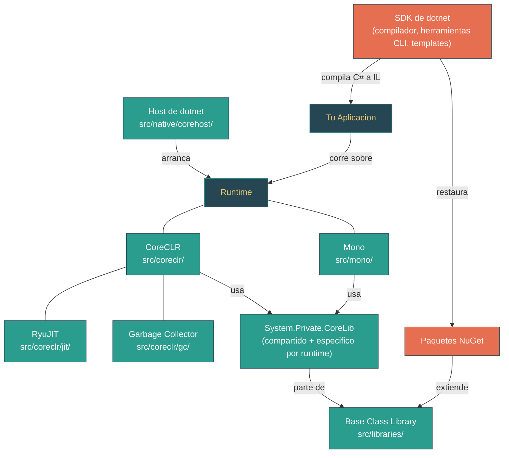

# Nivel 1: Fundamentos -- Panorama del Ecosistema .NET

> **Perfil objetivo:** Desarrollador nuevo en .NET o que viene de otro ecosistema de lenguaje
> **Esfuerzo estimado:** 2 horas
> **Prerrequisitos:** Conocimientos basicos de programacion en cualquier lenguaje
> [English version](../en/01-foundations-ecosystem-overview.md)

---

## Objetivos de Aprendizaje

Al completar este modulo, vas a poder:

1. **Explicar** la relacion entre el SDK de .NET, el runtime y la Base Class Library (BCL).
2. **Identificar** que componente -- CoreCLR, Mono o Libraries -- es responsable de una funcionalidad dada.
3. **Describir** el viaje del codigo fuente C# desde archivo de texto hasta proceso en ejecucion (pipeline de compilacion).
4. **Navegar** la estructura de directorios de primer nivel del repositorio `dotnet/runtime`.
5. **Localizar** el codigo fuente de tipos fundamentales como `System.Object` y `System.String`.
6. **Distinguir** entre CoreCLR y Mono y explicar cuando se usa cada runtime.
7. **Usar** comandos basicos del CLI de `dotnet` (`new`, `build`, `run`, `--info`) y entender que invoca cada uno.
8. **Leer** un archivo fuente simple de la BCL e identificar su rol dentro del ecosistema.

---

## Mapa Conceptual



---

## Curriculum

### Leccion 1.1.1: Que es .NET? -- Tres Piezas, Una Plataforma

**Lo que vas a aprender:** La plataforma .NET consiste en tres componentes distintos -- el SDK, el runtime y la Base Class Library -- cada uno con una responsabilidad clara.

**El concepto:**

Pensa en .NET como un restaurante. El **SDK** es la cocina: contiene las herramientas (compilador, templates de proyecto, gestor de paquetes) que transforman tu receta (codigo fuente) en un plato terminado (aplicacion compilada). El **runtime** es la infraestructura del salon: las mesas, sillas, iluminacion y aire acondicionado que hacen posible servir el plato. La **Base Class Library (BCL)** es el menu: un catalogo enorme de funcionalidad pre-construida (colecciones, networking, I/O de archivos, criptografia) disponible para cada aplicacion.

Asi se mapean los tres a conceptos concretos:

| Componente | Que es | Analogia | Donde vive |
|---|---|---|---|
| **SDK** | El CLI de `dotnet`, el compilador Roslyn de C#, MSBuild, templates de proyecto, cliente de NuGet | La cocina y sus herramientas | Se instala via scripts `dotnet-install`; este repo construye la porcion del *runtime* |
| **Runtime** | El motor de ejecucion que carga y ejecuta codigo IL compilado. .NET tiene *dos* runtimes: CoreCLR y Mono | La infraestructura del salon | `src/coreclr/` y `src/mono/` |
| **BCL** | Las libraries de clases gestionadas (`System.*`, `Microsoft.Extensions.*`) que vienen con .NET | El menu | `src/libraries/` |

La version que ves cuando ejecutas `dotnet --version` refleja la version del SDK. La version del runtime es separada. Podes verificar ambas ejecutando `dotnet --info`.

**En el codigo fuente:**
- La version del runtime esta definida en `eng/Versions.props` -- busca `<ProductVersion>11.0.0</ProductVersion>` y `<MajorVersion>11</MajorVersion>`.
- La version del SDK referenciada por este repositorio esta en `global.json` -- actualmente `"version": "11.0.100-preview.3.26170.106"`.

**Ejercicio practico:**

1. Abri una terminal y ejecuta:
   ```bash
   dotnet --info
   ```
2. Identifica tres cosas en la salida: la version del SDK, la(s) version(es) del runtime instaladas, y el RID (Runtime Identifier) de tu sistema operativo (como `win-x64` o `linux-arm64`).
3. Ahora ejecuta:
   ```bash
   dotnet new console -n HelloEcosystem
   cd HelloEcosystem
   dotnet run
   ```
4. Acabas de usar el SDK (para crear el scaffolding y compilar), el runtime (para ejecutar), y la BCL (`System.Console.WriteLine` viene de las libraries).

**Conclusion clave:** El SDK *compila* tu codigo, el runtime lo *ejecuta*, y la BCL *provee* las APIs fundamentales. Se desarrollan y versionan de forma independiente, aunque se distribuyen juntos.

**Concepcion erronea comun:** "El SDK y el runtime son lo mismo." No lo son. Podes tener el SDK 11.0.100 instalado junto con el runtime 10.0.x y 9.0.x. El SDK *apunta* a una version especifica del runtime, pero multiples runtimes pueden coexistir en la misma maquina.

---

### Leccion 1.1.2: CoreCLR vs Mono -- Dos Runtimes, Una BCL

**Lo que vas a aprender:** .NET incluye dos motores de ejecucion optimizados para escenarios diferentes, pero comparten la misma class library.

**El concepto:**

Tener dos runtimes puede parecer redundante, pero cada uno esta optimizado para restricciones diferentes:

| | CoreCLR | Mono |
|---|---|---|
| **Optimizado para** | Servidor, desktop, workloads en la nube | Mobile (iOS/Android), WebAssembly, entornos restringidos |
| **Compilador JIT** | RyuJIT -- altamente optimizador, tiered compilation | Mini JIT -- mas liviano, soporta interpretacion AOT |
| **GC** | Generacional, basado en regiones, modos server/workstation | SGen -- mas simple, ajustado para heaps mas chicos |
| **Lenguaje** | Principalmente C/C++ | Principalmente C |
| **Ubicacion en el codigo** | `src/coreclr/` | `src/mono/` |

La clave es que ambos runtimes comparten la misma Base Class Library. Cuando escribis `new List<int>()`, la implementacion de `List<T>` en `src/libraries/System.Collections/` funciona identicamente en CoreCLR y en Mono. Los runtimes difieren en *como ejecutan el IL*, no en *que APIs estan disponibles*.

El puente entre la BCL compartida y el comportamiento especifico del runtime es **System.Private.CoreLib** -- un assembly especial que contiene los tipos mas fundamentales (`Object`, `String`, `Array`, `Type`). Tiene tres ubicaciones:

- **Codigo compartido:** `src/libraries/System.Private.CoreLib/src/` -- implementaciones agnosticas al runtime
- **Especifico de CoreCLR:** `src/coreclr/System.Private.CoreLib/src/` -- implementaciones que llaman a la VM de CoreCLR
- **Especifico de Mono:** `src/mono/System.Private.CoreLib/src/` -- implementaciones que llaman al runtime de Mono

**En el codigo fuente:**

Compara como se implementa `System.Object` en estas ubicaciones:

1. **Parte compartida** (`src/libraries/System.Private.CoreLib/src/System/Object.cs`):
   - Define la `partial class Object` con `ToString()`, `Equals()`, `GetHashCode()`
   - Estas funcionan igual en cualquier runtime

2. **Parte CoreCLR** (`src/coreclr/System.Private.CoreLib/src/System/Object.CoreCLR.cs`):
   - Implementa `GetType()` llamando a `RuntimeHelpers.GetMethodTable(this)` -- un internal especifico de CoreCLR
   - Implementa `MemberwiseClone()` usando `RuntimeHelpers.AllocateUninitializedClone`

3. **Parte Mono** (`src/mono/System.Private.CoreLib/src/System/Object.Mono.cs`):
   - Implementa `GetType()` con `[MethodImplAttribute(MethodImplOptions.InternalCall)]` -- delegando directamente al runtime C de Mono
   - Mucho mas corto -- Mono maneja mas logica del lado nativo

**Ejercicio practico:**

1. Abri `src/libraries/System.Private.CoreLib/src/System/Object.cs` y lee el comentario de la clase en la linea 11. Nota que dice "the root class for all objects in the CLR System."
2. Abri `src/coreclr/System.Private.CoreLib/src/System/Object.CoreCLR.cs`. Observa como `GetType()` usa `RuntimeHelpers.GetMethodTable(this)` -- esto llama al sistema de tipos C++ de CoreCLR.
3. Abri `src/mono/System.Private.CoreLib/src/System/Object.Mono.cs`. Observa el `[MethodImplAttribute(MethodImplOptions.InternalCall)]` -- esto le dice a Mono que resuelva el metodo en su runtime C.
4. Reflexiona: el mismo `object.GetType()` que llamas en C# llega a *codigo nativo completamente diferente* dependiendo de que runtime ejecuta tu app.

**Conclusion clave:** CoreCLR es el caballo de batalla para servidores y desktops; Mono impulsa mobile y WebAssembly. Comparten la BCL, pero los tipos de mas bajo nivel tienen implementaciones especificas del runtime en System.Private.CoreLib.

---

### Leccion 1.1.3: La Base Class Library -- Tu Kit de Herramientas Integrado

**Lo que vas a aprender:** La BCL es una vasta coleccion de libraries gestionadas organizadas por namespace, y podes leer su codigo fuente directamente.

**El concepto:**

La Base Class Library es todo lo que esta bajo `src/libraries/`. Actualmente contiene mas de 200 proyectos de libraries individuales. Cada vez que usas `List<T>`, `HttpClient`, `JsonSerializer`, `File.ReadAllText` o `Console.WriteLine`, estas llamando codigo de la BCL que vive en este repositorio.

Las libraries estan organizadas por namespace, y cada una sigue una estructura de directorios consistente:

```
src/libraries/System.Collections/
    ref/         -- Assembly de referencia (solo la superficie de API publica)
    src/         -- Implementacion real
    tests/       -- Tests unitarios y de integracion
```

Estas son algunas de las libraries que vas a usar con mas frecuencia:

| Library | Que provee | Ruta en el codigo |
|---|---|---|
| `System.Collections` | `SortedDictionary`, `LinkedList`, `Stack`, `Queue`, `PriorityQueue` | `src/libraries/System.Collections/` |
| `System.Net.Http` | `HttpClient`, soporte para HTTP/2 y HTTP/3 | `src/libraries/System.Net.Http/` |
| `System.Text.Json` | Serializacion JSON de alto rendimiento | `src/libraries/System.Text.Json/` |
| `System.Console` | `Console.ReadLine`, `Console.WriteLine` | `src/libraries/System.Console/` |
| `System.IO.FileSystem` | `File`, `Directory`, I/O de archivos | `src/libraries/System.IO.FileSystem/` |
| `Microsoft.Extensions.DependencyInjection` | Contenedor de DI | `src/libraries/Microsoft.Extensions.DependencyInjection/` |

Despues esta **System.Private.CoreLib**, la library especial que contiene tipos tan fundamentales que el runtime mismo depende de ellos: `Object`, `String`, `Int32`, `Array`, `Type`, `Exception`, `Task`. CoreLib *no* es una library normal -- debe compilarse junto con el runtime porque el runtime y CoreLib tienen una dependencia bidireccional.

**En el codigo fuente:**

- `src/libraries/System.Console/src/System/Console.cs` -- Abri este archivo y mira la linea 16: `public static class Console`. Esta es la implementacion real de `Console.WriteLine` que tus programas llaman. Nota la constante `ReadBufferSize` en la linea 23 y el comentario que explica por que es de 4096 bytes.
- `src/libraries/System.Collections/src/System/Collections/Generic/` -- Este directorio contiene implementaciones de `SortedDictionary.cs`, `Stack.cs`, `PriorityQueue.cs` y mas. Estas son las estructuras de datos exactas que usas en tu codigo C#.
- `src/libraries/System.Private.CoreLib/src/System/String.cs` -- La linea 18 tiene el comentario: "The String class represents a static string of characters." Nota que `String` es `sealed partial class` -- el `partial` permite agregar partes especificas del runtime por CoreCLR o Mono.

**Ejercicio practico:**

1. Crea un programa simple que use tres libraries diferentes de la BCL:
   ```csharp
   using System.Collections.Generic;
   using System.Text.Json;

   var names = new PriorityQueue<string, int>();
   names.Enqueue("Alice", 2);
   names.Enqueue("Bob", 1);
   names.Enqueue("Charlie", 3);

   while (names.TryDequeue(out var name, out var priority))
   {
       Console.WriteLine($"{priority}: {name}");
   }

   var json = JsonSerializer.Serialize(new { greeting = "Hello from the BCL!" });
   Console.WriteLine(json);
   ```
2. Ejecutalo con `dotnet run`. Acabas de usar `System.Collections` (PriorityQueue), `System.Text.Json` (JsonSerializer) y `System.Console` (Console.WriteLine).
3. Abri `src/libraries/System.Collections/src/System/Collections/Generic/PriorityQueue.cs` y ojea las primeras 50 lineas. Estas leyendo el codigo exacto que acaba de correr en tu maquina.

**Conclusion clave:** La BCL no es una caja negra. Cada tipo que usas en .NET tiene codigo fuente legible en `src/libraries/`. Aprender a navegar este codigo es una de las habilidades mas valiosas que un desarrollador .NET puede desarrollar.

---

### Leccion 1.1.4: El CLI de dotnet y el Host -- Del Comando al Proceso

**Lo que vas a aprender:** Que pasa realmente cuando escribis `dotnet run`, y como el host nativo arranca el runtime.

**El concepto:**

Cuando escribis `dotnet run` en tu terminal, se desencadena una cadena de eventos sorprendentemente profunda:

1. **El host nativo** (ejecutable `dotnet`) arranca. Su codigo fuente vive en `src/native/corehost/dotnet/`. Es un programa C++ pequeno -- no codigo .NET gestionado.

2. **hostfxr** (Host Framework Resolver) se carga. Ubicado en `src/native/corehost/fxr/`, resuelve que version del runtime usar leyendo la configuracion de tu proyecto y los runtimes instalados. Los archivos clave aca son `fx_muxer.cpp` (el multiplexor de frameworks) y `sdk_resolver.cpp`.

3. **hostpolicy** se carga despues, desde `src/native/corehost/hostpolicy/`. Carga el runtime real (CoreCLR o Mono), resuelve todas las dependencias de assemblies y configura el runtime. Mira `hostpolicy.cpp` y `deps_resolver.cpp`.

4. **El runtime arranca**, cargando System.Private.CoreLib y los assemblies de tu aplicacion, compilando con JIT tu metodo `Main()` y ejecutandolo.

Este diseno en capas permite que multiples versiones de .NET coexistan en la misma maquina. El host actua como un controlador de trafico, dirigiendo cada aplicacion al runtime correcto.

```
dotnet run
    |
    v
dotnet (ejecutable nativo)              src/native/corehost/dotnet/
    |
    v
hostfxr (resolutor de frameworks)       src/native/corehost/fxr/
    |
    v
hostpolicy (cargador del runtime)       src/native/corehost/hostpolicy/
    |
    v
CoreCLR o Mono (motor del runtime)      src/coreclr/ o src/mono/
    |
    v
Tu metodo Main() se ejecuta
```

**En el codigo fuente:**

- `src/native/corehost/dotnet/` -- Contiene `dotnet.ico`, `dotnet.manifest` y el build de CMake para el ejecutable principal `dotnet`. Este es el punto de entrada para cada comando `dotnet`.
- `src/native/corehost/fxr/fx_muxer.cpp` -- El "mux" (multiplexor) que decide: el usuario esta ejecutando un comando del SDK (`dotnet build`) o una app (`dotnet myapp.dll`)?
- `src/native/corehost/fxr/sdk_resolver.cpp` -- Descubre que SDK esta instalado y selecciona el correcto.
- `src/native/corehost/hostpolicy/deps_resolver.cpp` -- Resuelve el grafo de dependencias de los assemblies de tu aplicacion.
- `src/native/corehost/hostpolicy/coreclr.cpp` -- El puente que llama a CoreCLR para arrancar el runtime.

**Ejercicio practico:**

1. Ejecuta el siguiente comando para ver exactamente que runtime usa tu sistema:
   ```bash
   dotnet --info
   ```
   Busca la seccion "Host" -- muestra la version del host y el hash del commit.

2. Ejecuta una app simple con salida de diagnostico:
   ```bash
   dotnet new console -n HostDemo
   cd HostDemo
   COREHOST_TRACE=1 dotnet run 2>&1 | head -50
   ```
   (En Windows, configura `set COREHOST_TRACE=1` antes de ejecutar, o usa PowerShell: `$env:COREHOST_TRACE=1`)

   La salida del trace muestra la secuencia exacta: el host arrancando, hostfxr cargandose, la resolucion del runtime, y finalmente tu app ejecutandose.

3. Busca en la salida del trace lineas que contengan "hostfxr" y "hostpolicy" -- podes ver la carga en capas en accion.

**Conclusion clave:** El comando `dotnet` es un launcher nativo liviano. El trabajo real lo hacen hostfxr (eligiendo el runtime correcto) y hostpolicy (cargandolo). Este diseno habilita instalaciones side-by-side de runtimes.

---

### Leccion 1.1.5: El Mapa del Repositorio -- Navegando dotnet/runtime

**Lo que vas a aprender:** Como orientarte en el repositorio `dotnet/runtime` y encontrar el codigo fuente de cualquier pieza de .NET que te genere curiosidad.

**El concepto:**

El repositorio `dotnet/runtime` es uno de los proyectos open-source mas grandes del mundo. Puede sentirse abrumador al principio, pero su estructura sigue un patron claro y logico. Aca esta tu mapa mental:

```
dotnet/runtime/
|
|-- src/
|   |-- coreclr/           -- El motor del runtime CoreCLR
|   |   |-- jit/           -- Compilador RyuJIT (C++)
|   |   |-- gc/            -- Garbage collector (C++)
|   |   |-- vm/            -- Maquina virtual: sistema de tipos, carga de clases, threads (C++)
|   |   |-- debug/         -- Soporte de depuracion gestionada
|   |   |-- interpreter/   -- Interprete experimental del CLR
|   |   |-- nativeaot/     -- Compilacion ahead-of-time NativeAOT
|   |   |-- pal/           -- Platform Abstraction Layer (portabilidad de SO)
|   |   |-- interop/       -- Soporte de interop nativo
|   |   |-- System.Private.CoreLib/  -- Partes de CoreLib especificas de CoreCLR
|   |
|   |-- mono/              -- El runtime Mono
|   |   |-- mono/          -- Implementacion C del runtime Mono
|   |   |-- wasm/          -- Herramientas especificas de WebAssembly
|   |   |-- browser/       -- Piezas del runtime especificas del browser
|   |   |-- System.Private.CoreLib/  -- Partes de CoreLib especificas de Mono
|   |
|   |-- libraries/         -- Todas las libraries gestionadas (la BCL)
|   |   |-- System.Collections/
|   |   |-- System.Net.Http/
|   |   |-- System.Text.Json/
|   |   |-- System.Console/
|   |   |-- System.Private.CoreLib/  -- Codigo compartido de CoreLib
|   |   |-- Microsoft.Extensions.*/  -- Libraries de extensiones
|   |   |-- Common/        -- Archivos fuente compartidos entre libraries
|   |   `-- ...200+ mas
|   |
|   `-- native/
|       `-- corehost/      -- Host nativo (ejecutable dotnet)
|           |-- dotnet/    -- El launcher de dotnet
|           |-- fxr/       -- hostfxr (resolutor de frameworks)
|           `-- hostpolicy/ -- hostpolicy (cargador del runtime)
|
|-- docs/
|   |-- design/            -- Documentos de diseno
|   |   |-- coreclr/botr/  -- Book of the Runtime (documentacion profunda del CLR)
|   |   |-- mono/          -- Documentos de diseno de Mono
|   |   `-- libraries/     -- Documentos de diseno de libraries
|   |-- workflow/           -- Workflows de build y test
|   `-- coding-guidelines/ -- Convenciones de codigo
|
|-- eng/                   -- Ingenieria de build (MSBuild props, versionado)
|   |-- Versions.props     -- Numeros de version del producto
|   `-- Version.Details.xml -- Detalles de versiones de dependencias
|
|-- global.json            -- Version del SDK fijada para este repo
|-- build.sh / build.cmd   -- Scripts de build de nivel superior
`-- CLAUDE.md              -- Guia para asistente de IA (lo estas usando ahora!)
```

**La regla general para encontrar codigo fuente:**

- **"Donde esta la implementacion de `System.Foo.Bar`?"** -- Busca en `src/libraries/System.Foo/src/`
- **"Donde esta la implementacion a nivel del runtime?"** -- Busca en `src/coreclr/vm/` (CoreCLR) o `src/mono/mono/` (Mono)
- **"Donde esta el JIT?"** -- `src/coreclr/jit/`
- **"Donde esta el GC?"** -- `src/coreclr/gc/`
- **"Donde esta el tipo fundamental `X`?"** -- `src/libraries/System.Private.CoreLib/src/System/X.cs`

**En el codigo fuente:**

- `docs/design/coreclr/botr/` -- El "Book of the Runtime" es una excelente coleccion de documentos profundos escritos por ingenieros del runtime. Empeza con `intro-to-clr.md` de Vance Morrison, que abre con: *"The Common Language Runtime (CLR) is a complete, high level virtual machine designed to support a broad variety of programming languages and interoperation among them."*
- `eng/Versions.props` -- Define la version del producto (actualmente `11.0.0`), el esquema mayor/menor/patch y la etiqueta de prerelease (`preview`).
- `global.json` -- Fija la version del SDK con la que se compila el repositorio (`11.0.100-preview.3.26170.106`).

**Ejercicio practico:**

1. Abri el repositorio en tu editor o explorador de archivos. Navega a `src/libraries/` y conta aproximadamente cuantas carpetas `System.*` ves. (Hay mas de 150!)
2. Elegi tres tipos que uses frecuentemente (por ejemplo, `List<T>`, `HttpClient`, `Task`). Trata de encontrar sus archivos fuente usando el patron de nombres de arriba.
   - Pista: `List<T>` esta en `src/libraries/System.Private.CoreLib/src/System/Collections/Generic/List.cs` (esta en CoreLib porque es un tipo fundamental).
   - `HttpClient` esta en `src/libraries/System.Net.Http/src/System/Net/Http/HttpClient.cs`.
3. Abri `docs/design/coreclr/botr/intro-to-clr.md` y lee los primeros tres parrafos. Este documento es tu puerta de entrada para entender el CLR a un nivel mas profundo cuando estes listo.

**Conclusion clave:** El repositorio tiene una estructura predecible: `src/coreclr/` para el motor del runtime, `src/libraries/` para las APIs gestionadas, `src/mono/` para el runtime alternativo y `src/native/corehost/` para el launcher. Una vez que internalices este mapa, podes encontrar el codigo fuente de cualquier feature de .NET.

---

## Guia de Lectura de Codigo Fuente

Empeza con estos archivos para construir tu comprension. Leelos en orden -- cada uno se apoya en el anterior.

| Orden | Archivo | En que enfocarte | Dificultad |
|---|---|---|---|
| 1 | `src/libraries/System.Private.CoreLib/src/System/Object.cs` | La raiz de cada tipo .NET. Lee el comentario de la clase y los metodos `ToString()`, `Equals()` y `GetHashCode()`. | :star: |
| 2 | `src/coreclr/System.Private.CoreLib/src/System/Object.CoreCLR.cs` | La implementacion de `GetType()` especifica de CoreCLR. Nota `RuntimeHelpers.GetMethodTable(this)`. | :star: |
| 3 | `src/mono/System.Private.CoreLib/src/System/Object.Mono.cs` | Compara con la version de CoreCLR. Nota `[MethodImplAttribute(MethodImplOptions.InternalCall)]`. | :star: |
| 4 | `src/libraries/System.Private.CoreLib/src/System/String.cs` | La clase `String` -- `sealed partial class`. Lee el comentario de la clase sobre inmutabilidad. | :star: |
| 5 | `src/libraries/System.Console/src/System/Console.cs` | La clase `Console`. Nota las constantes `ReadBufferSize` y `WriteBufferSize` y por que difieren. | :star::star: |
| 6 | `global.json` | El fijado de version del SDK. Entende por que el repo necesita una version especifica del SDK. | :star: |
| 7 | `eng/Versions.props` | Versionado del producto. Lee `ProductVersion`, `MajorVersion` y `PreReleaseVersionLabel`. | :star::star: |
| 8 | `docs/design/coreclr/botr/intro-to-clr.md` | La introduccion al CLR de Vance Morrison. Lee al menos las primeras tres secciones. | :star::star: |

---

## Herramientas de Diagnostico y Comandos

En este nivel, concentrate en dominar estos comandos fundamentales:

| Comando | Que hace | Cuando usarlo |
|---|---|---|
| `dotnet --info` | Muestra version del SDK, runtimes instalados, RID del SO y arquitectura | Lo primero a ejecutar en cualquier maquina nueva o al depurar problemas de versiones |
| `dotnet --list-sdks` | Lista todas las versiones de SDK instaladas | Cuando necesitas verificar que SDKs estan disponibles |
| `dotnet --list-runtimes` | Lista todas las versiones de runtime instaladas | Cuando necesitas verificar que runtimes estan disponibles |
| `dotnet new console -n MyApp` | Genera el scaffolding de una nueva aplicacion de consola | Al empezar un proyecto nuevo desde cero |
| `dotnet build` | Compila el proyecto (C# a IL) | Despues de hacer cambios, para verificar errores de compilacion |
| `dotnet run` | Compila y ejecuta el proyecto | Para ejecutar tu aplicacion |
| `dotnet publish` | Produce una salida lista para despliegue | Al preparar para hacer deploy |
| `COREHOST_TRACE=1 dotnet run` | Ejecuta con tracing del host habilitado | Cuando queres ver la secuencia de carga del host |

---

## Autoevaluacion

Pone a prueba tu comprension con estas preguntas. Intenta responder antes de revelar la respuesta.

### Pregunta 1: Cuales son los tres componentes principales de la plataforma .NET?

<details>
<summary>Mostrar respuesta</summary>

Los tres componentes son:
1. **El SDK** -- herramientas para compilar (compilador, CLI, templates, cliente de NuGet)
2. **El Runtime** -- el motor de ejecucion (CoreCLR o Mono) que ejecuta codigo IL compilado
3. **La Base Class Library (BCL)** -- libraries gestionadas (`System.*`, `Microsoft.Extensions.*`) que proveen APIs fundamentales

</details>

### Pregunta 2: Si quisieras leer el codigo fuente de `System.Text.Json.JsonSerializer`, en que directorio buscarias?

<details>
<summary>Mostrar respuesta</summary>

`src/libraries/System.Text.Json/src/` -- siguiendo la convencion de nombres donde `System.Text.Json` se mapea al directorio de la library del mismo nombre.

</details>

### Pregunta 3: Por que System.Private.CoreLib existe en tres ubicaciones diferentes?

<details>
<summary>Mostrar respuesta</summary>

System.Private.CoreLib contiene tipos tan fundamentales (`Object`, `String`, `Type`) que el runtime mismo depende de ellos. El codigo compartido vive en `src/libraries/System.Private.CoreLib/`, pero algunos metodos necesitan implementaciones especificas del runtime:
- `src/coreclr/System.Private.CoreLib/` contiene codigo especifico de CoreCLR (llama a la VM de CoreCLR via `RuntimeHelpers`)
- `src/mono/System.Private.CoreLib/` contiene codigo especifico de Mono (usa `[MethodImpl(MethodImplOptions.InternalCall)]` para llamar al runtime C de Mono)

Este patron de `partial class` permite que la misma API publica tenga implementaciones internas diferentes por runtime.

</details>

### Pregunta 4: Cual es la diferencia entre hostfxr y hostpolicy?

<details>
<summary>Mostrar respuesta</summary>

**hostfxr** (Host Framework Resolver) resuelve que version del runtime y del SDK usar. Lee la configuracion del proyecto y descubre los runtimes instalados. Fuente: `src/native/corehost/fxr/`.

**hostpolicy** carga el runtime elegido (CoreCLR o Mono), resuelve todas las dependencias de assemblies e inicializa el runtime. Fuente: `src/native/corehost/hostpolicy/`.

El flujo es: `dotnet` (launcher) -> hostfxr (elige versiones) -> hostpolicy (carga el runtime) -> CoreCLR/Mono (ejecuta el codigo).

</details>

### Pregunta 5: Cuando usarias Mono en lugar de CoreCLR?

<details>
<summary>Mostrar respuesta</summary>

Mono se usa para:
- **Apps mobile** (iOS, Android via .NET MAUI) -- Mono soporta compilacion AOT requerida por iOS
- **WebAssembly** (Blazor WASM) -- Mono tiene un backend de WASM en `src/mono/wasm/`
- **Entornos restringidos** donde se necesita un footprint de runtime mas liviano

CoreCLR se usa para servidores, desktops, la nube y cualquier escenario donde el throughput maximo y la optimizacion JIT importan.

</details>

### Pregunta 6: Que controla `global.json` en este repositorio?

<details>
<summary>Mostrar respuesta</summary>

`global.json` fija la version exacta del SDK usada para compilar el repositorio (actualmente `11.0.100-preview.3.26170.106`). Esto asegura que todos los contribuidores y builds de CI usen el mismo SDK, previniendo problemas de "funciona en mi maquina" causados por diferencias de version del SDK. El setting `"rollForward": "major"` permite avanzar a un SDK de version mayor mas nueva si la version exacta no esta instalada.

</details>

### Desafio Practico (30-60 minutos)

**Construi una hoja de referencia "Buscador de Componentes":**

1. Crea una nueva app de consola con `dotnet new console -n ComponentFinder`.
2. Escribi un programa que use al menos un tipo de cada uno de estos namespaces:
   - `System` (por ejemplo, `Console`, `Environment`)
   - `System.Collections.Generic` (por ejemplo, `Dictionary<TKey, TValue>`)
   - `System.IO` (por ejemplo, `File`, `Path`)
   - `System.Text.Json` (por ejemplo, `JsonSerializer`)
3. Para cada tipo que usaste, encontra su archivo fuente en el repositorio `dotnet/runtime`. Anota la ruta del archivo.
4. Para cada archivo fuente, nota si vive en `src/libraries/System.Private.CoreLib/` (tipo fundamental) o en un directorio de library separado bajo `src/libraries/` (tipo de library estandar).
5. Bonus: Abri `src/libraries/System.Private.CoreLib/src/System/Environment.cs` y encontra que metodo retorna el SO actual. Verificalo llamandolo en tu programa.

---

## Conexiones

| Direccion | Modulo | Tema |
|---|---|---|
| **Siguiente** | [1.2: Estructura de Proyectos y el Sistema de Build](01-foundations-project-structure.md) | Que pasa cuando ejecutas `dotnet build`? Que son todos los archivos generados? |
| **Relacionado (futuro)** | [1.7: Tu Primera Lectura del Codigo Fuente del Runtime](01-foundations-first-source-reading.md) | Un recorrido guiado del repositorio para lectores de codigo fuente primerizos |
| **Anterior** | Ninguno | Este es el primer modulo de la ruta de aprendizaje |
| **Indice** | [Indice de la Ruta de Aprendizaje](00-index.md) | Listado completo de modulos y autoevaluacion |

---

## Glosario

| Termino (ES) | Term (EN) | Definicion |
|---|---|---|
| **CLR** (Common Language Runtime) | CLR (Common Language Runtime) | La maquina virtual que ejecuta programas .NET. Provee servicios como garbage collection, seguridad de tipos y compilacion JIT. |
| **BCL** (Biblioteca de Clases Base) | BCL (Base Class Library) | El conjunto de libraries gestionadas (`System.*`) que vienen con .NET, proveyendo APIs fundamentales para colecciones, I/O, networking y mas. |
| **SDK** (Kit de Desarrollo de Software) | SDK (Software Development Kit) | El conjunto de herramientas para compilar aplicaciones .NET: incluye el compilador (Roslyn), el CLI (`dotnet`), MSBuild y templates de proyecto. |
| **CoreCLR** | CoreCLR | El runtime principal de .NET, optimizado para workloads de servidor, desktop y nube. Contiene RyuJIT, el GC y el sistema de tipos. |
| **Mono** | Mono | El runtime alternativo de .NET, optimizado para mobile (iOS/Android), WebAssembly y entornos restringidos. |
| **JIT** (compilacion Just-In-Time) | JIT (Just-In-Time compilation) | El proceso de compilar IL (Lenguaje Intermedio) a codigo maquina nativo en tiempo de ejecucion, justo antes de ejecutarse. |
| **IL** (Lenguaje Intermedio) | IL (Intermediate Language) | El bytecode independiente de CPU que produce el compilador C#. Tambien llamado CIL (Common Intermediate Language) o MSIL. |
| **NuGet** | NuGet | El gestor de paquetes para .NET. Las libraries se distribuyen como paquetes NuGet (archivos `.nupkg`) y se restauran durante el build. |
| **TFM** (Target Framework Moniker) | TFM (Target Framework Moniker) | Un token estandarizado (por ejemplo, `net11.0`) que identifica que version de .NET apunta una library o aplicacion. |

---

## Referencias

| Recurso | Tipo | Que cubre |
|---|---|---|
| [Documentacion de .NET](https://learn.microsoft.com/es-es/dotnet/) | Documentacion oficial | Guias completas, tutoriales y referencia de APIs |
| [Book of the Runtime (BotR)](https://github.com/dotnet/runtime/tree/main/docs/design/coreclr/botr) | Documentos de diseno | Profundizaciones en internals del CLR -- empeza con `intro-to-clr.md` |
| [.NET Source Browser](https://source.dot.net/) | Herramienta | Vista indexada y buscable de todo el codigo fuente del runtime |
| [SharpLab](https://sharplab.io/) | Herramienta | Ve instantaneamente el IL, el assembly del JIT y el C# lowered de cualquier snippet de codigo |
| [README de dotnet/runtime](https://github.com/dotnet/runtime/blob/main/README.md) | Vista general | Introduccion oficial al repositorio e instrucciones de build |
| [.NET Runtime Design Docs](https://github.com/dotnet/runtime/tree/main/docs/design) | Documentos de diseno | Decisiones de arquitectura y especificaciones de features |
| [Stephen Toub -- Performance Improvements in .NET (serie anual)](https://devblogs.microsoft.com/dotnet/) | Blog | Changelog detallado de rendimiento anual con links directos al codigo fuente |
| [Documentacion del CLI de .NET](https://learn.microsoft.com/es-es/dotnet/core/tools/) | Documentacion oficial | Referencia completa de comandos del CLI de `dotnet` |

---

*Ultima actualizacion: 2026-04-14*
