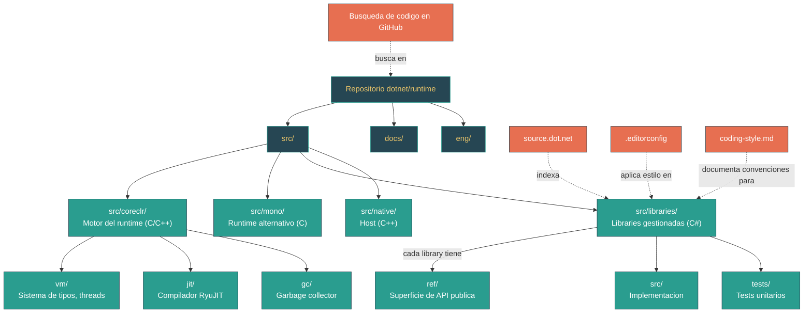

# Nivel 1: Fundamentos -- Tu Primera Lectura del Codigo Fuente del Runtime

> **Perfil objetivo:** Desarrollador que nunca navegó un codebase grande de un runtime open-source
> **Esfuerzo estimado:** 2 horas
> **Prerrequisitos:** [Modulos 1.1--1.6](01-foundations-ecosystem-overview.md)
> [English version](../en/01-foundations-first-source-reading.md)

---

## Objetivos de Aprendizaje

Al completar este modulo, vas a poder:

1. **Navegar** la estructura del repositorio `dotnet/runtime` con confianza, sabiendo que contiene cada directorio de nivel superior.
2. **Leer** un archivo fuente de la BCL (como `List<T>`) y entender su organizacion: header de licencia, directivas using, namespace, declaracion de clase, campos, constructores y metodos.
3. **Identificar** la convencion `ref/src/tests` usada por cada proyecto de library y saber en que directorio buscar para la superficie de API publica, la implementacion y los tests.
4. **Usar** [source.dot.net](https://source.dot.net/) y la busqueda de codigo de GitHub para encontrar implementaciones rapidamente sin clonar el repositorio.
5. **Reconocer** las convenciones de codigo -- nombres de campos (`_camelCase`, prefijo `s_`), llaves estilo Allman, uso de `partial class` -- que se usan en todo el codebase.
6. **Distinguir** entre tipos que viven en `System.Private.CoreLib` (tipos fundamentales de los que depende el runtime) y tipos que viven en proyectos de library independientes.
7. **Localizar** los archivos `.editorconfig` y `docs/coding-guidelines/coding-style.md` que definen las reglas que vas a ver aplicadas en cada archivo fuente.
8. **Leer** las primeras 50 lineas de un archivo fuente desconocido y extraer informacion significativa sobre el proposito, diseño y restricciones del tipo.

---

## Mapa Conceptual



---

## Curriculum

### Leccion 1.7.1: El Mapa del Repositorio -- Un Tour de Nivel Superior

**Lo que vas a aprender:** Como esta organizado el repositorio `dotnet/runtime` a nivel superior, y que contiene cada directorio principal.

**El concepto:**

El repositorio `dotnet/runtime` contiene mas de 300.000 archivos. Suena aterrador, pero no necesitas conocerlos todos. Necesitas un mapa mental con mas o menos una docena de puntos de referencia. Aca esta el mapa:

```
dotnet/runtime/
|
|-- src/                        -- TODO el codigo fuente vive aca
|   |-- coreclr/                -- Motor del runtime CoreCLR
|   |   |-- vm/                 -- Maquina virtual (sistema de tipos, class loader, threads)
|   |   |-- jit/                -- Compilador just-in-time RyuJIT
|   |   |-- gc/                 -- Garbage collector
|   |   |-- debug/              -- Infraestructura de depuracion
|   |   |-- interpreter/        -- Interprete experimental del CLR
|   |   |-- nativeaot/          -- Compilador y runtime NativeAOT
|   |   |-- pal/                -- Platform Abstraction Layer (portabilidad de SO)
|   |   `-- System.Private.CoreLib/  -- Partes de CoreLib especificas de CoreCLR
|   |
|   |-- mono/                   -- Runtime alternativo Mono
|   |   |-- mono/               -- Implementacion del runtime Mono en C
|   |   |-- wasm/               -- Herramientas para WebAssembly
|   |   `-- System.Private.CoreLib/  -- Partes de CoreLib especificas de Mono
|   |
|   |-- libraries/              -- 200+ class libraries gestionadas (la BCL)
|   |   |-- System.Collections/
|   |   |-- System.Net.Http/
|   |   |-- System.Text.Json/
|   |   |-- System.Private.CoreLib/  -- Codigo de CoreLib compartido (agnostico al runtime)
|   |   `-- ...
|   |
|   `-- native/corehost/        -- Host nativo (ejecutable dotnet)
|
|-- docs/                       -- Documentacion
|   |-- design/coreclr/botr/    -- Book of the Runtime (documentos profundos del CLR)
|   |-- workflow/building/       -- Instrucciones de build
|   `-- coding-guidelines/       -- Convenciones de codigo
|
|-- eng/                        -- Ingenieria de build (versionado, CI)
|-- .editorconfig               -- Aplicacion de estilo de codigo
|-- build.sh / build.cmd        -- Scripts de build de nivel superior
`-- global.json                 -- Pin de version del SDK
```

La regla es simple: todo lo que vas a querer leer como desarrollador .NET empieza en `src/`. Si buscas una API gestionada, anda a `src/libraries/`. Si buscas como funciona el runtime internamente, anda a `src/coreclr/` o `src/mono/`.

**En el codigo fuente:**

Solo el directorio `src/coreclr/vm/` contiene mas de 200 archivos C/C++. Aca hay una muestra de lo que vive ahi:

| Archivo | Proposito |
|---|---|
| `object.h` / `object.cpp` | Define el layout nativo de los objetos gestionados |
| `appdomain.cpp` | Gestion de application domains |
| `assembly.cpp` | Carga de assemblies |
| `methodtable.cpp` | La estructura MethodTable (representacion de tipos en runtime) |
| `gchelpers.cpp` | Helpers para alocar objetos en el heap gestionado |
| `jitinterface.cpp` | La interfaz entre la VM y el compilador JIT |
| `threads.cpp` | Implementacion de threads gestionados |
| `castcache.cpp` | Verificacion rapida de type-cast |

No necesitas entender estos archivos ahora. El punto es: existen, son legibles, y cuando estes listo (Nivel 4), vas a saber exactamente donde buscar.

**Ejercicio practico:**

1. Abri el repositorio en tu editor o explorador de archivos. Navega a `src/` y lista los directorios de nivel superior. Confirma que ves `coreclr/`, `mono/`, `libraries/`, `native/`, y algunos otros (`installer/`, `tests/`, `tools/`).
2. Navega a `src/coreclr/vm/` y escanea los nombres de archivos. No necesitas abrirlos -- solo nota el patron de nombres: minusculas, descriptivos, a menudo coincidiendo con un concepto del CLR (ej., `methodtable.cpp`, `assembly.cpp`, `threads.cpp`).
3. Navega a `src/libraries/` y recorre la lista de carpetas. Nota como cada carpeta lleva el nombre de un namespace de .NET (`System.Collections`, `System.Net.Http`, `System.Text.Json`, etc.).
4. Conta aproximadamente cuantas carpetas `System.*` ves. Hay mas de 150.

**Conclusion clave:** El repositorio es grande pero esta logicamente organizado. `src/libraries/` es donde vas a pasar la mayor parte del tiempo como desarrollador .NET leyendo codigo fuente. `src/coreclr/vm/` es el corazon C++ del runtime. Conocer estos dos puntos de referencia es suficiente para empezar.

---

### Leccion 1.7.2: Leyendo Tu Primer Archivo BCL -- List&lt;T&gt;

**Lo que vas a aprender:** Como abrir un archivo fuente real de la BCL, entender su estructura y extraer informacion util.

**El concepto:**

Todo desarrollador .NET usa `List<T>`. Es la coleccion mas comun en C#. Abramos su implementacion y leamosla juntos. El archivo es:

```
src/libraries/System.Private.CoreLib/src/System/Collections/Generic/List.cs
```

Nota que `List<T>` vive en `System.Private.CoreLib`, no en `System.Collections`. Esto es porque `List<T>` se considera un tipo fundamental -- el runtime mismo lo usa internamente, asi que tiene que ser parte de CoreLib.

Aca esta la anatomia de las primeras 40 lineas de `List.cs`:

```csharp
// Licensed to the .NET Foundation under one or more agreements.       // <-- Header de licencia (todos los archivos)
// The .NET Foundation licenses this file to you under the MIT license.

using System.Collections.ObjectModel;                                  // <-- Directivas using (alfabeticas)
using System.Diagnostics;
using System.Diagnostics.CodeAnalysis;
using System.Runtime.CompilerServices;

namespace System.Collections.Generic                                   // <-- Declaracion de namespace
{
    // Implements a variable-size List that uses an array of objects    // <-- Comentario a nivel de clase
    // to store the elements. A List has a capacity, which is the
    // allocated length of the internal array.
    //
    [DebuggerTypeProxy(typeof(ICollectionDebugView<>))]                // <-- Atributos
    [DebuggerDisplay("Count = {Count}")]
    [Serializable]
    [TypeForwardedFrom("mscorlib, Version=4.0.0.0, ...")]
    public class List<T> : IList<T>, IList, IReadOnlyList<T>           // <-- Declaracion de clase + interfaces
    {
        private const int DefaultCapacity = 4;                         // <-- Constantes primero

        internal T[] _items;                                           // <-- Campos despues (_camelCase)
        internal int _size;
        internal int _version;

        private static readonly T[] s_emptyArray = new T[0];           // <-- Campo estatico (prefijo s_)

        public List()                                                  // <-- Constructores
        {
            _items = s_emptyArray;
        }
```

Desarmemos los patrones:

1. **Header de licencia** -- Cada archivo en el repositorio empieza con estas dos lineas. Sin excepciones.
2. **Directivas using** -- Fuera del namespace, ordenadas alfabeticamente, con `System.*` primero.
3. **Comentario a nivel de clase** -- Un comentario `//` plano (no XML doc) explicando el proposito. Muchas clases de la BCL tienen estos comentarios historicos que datan del .NET Framework original.
4. **Atributos** -- `[DebuggerDisplay]` mejora la experiencia de depuracion. `[Serializable]` marca soporte de serializacion legacy. `[TypeForwardedFrom]` habilita compatibilidad binaria con assemblies viejos de mscorlib.
5. **Campos al principio** -- Segun las guias de estilo, los campos se declaran antes que cualquier metodo. Nota los nombres: `_items` (instancia privada, prefijo guion bajo), `s_emptyArray` (estatico privado, prefijo `s_`).
6. **Detalle interesante** -- `DefaultCapacity = 4`. Esto significa que la primera vez que agregas un elemento a una `List<T>` vacia, se aloca un array de 4 elementos. Cuando se llena, se duplica. Este es un detalle real de implementacion que solo podes aprender leyendo el codigo fuente.

**En el codigo fuente:**

- `_items` tiene el comentario "Do not rename (binary serialization)" -- este nombre de campo esta grabado en datos serializados a lo largo de todo el ecosistema .NET. Cambiarlo romperia la compatibilidad hacia atras.
- `s_emptyArray` usa `new T[0]` en vez de `Array.Empty<T>()` con un `#pragma warning disable` -- el comentario explica que esto evita una instanciacion generica extra para `Array.Empty<T>()`, lo cual es una optimizacion para el sistema de tipos.
- El constructor `List(IEnumerable<T> collection)` (alrededor de la linea 61) verifica si la entrada es `ICollection<T>` primero, y si lo es, copia directamente usando `CopyTo` en vez de iterar uno por uno. Esta es una optimizacion de rendimiento que nunca conocerias sin leer el codigo fuente.

**Ejercicio practico:**

1. Abri `src/libraries/System.Private.CoreLib/src/System/Collections/Generic/List.cs`.
2. Encontra la constante `DefaultCapacity`. Que valor tiene? (Respuesta: 4.)
3. Lee el metodo `Add`. Encontra donde ocurre el crecimiento de capacidad -- busca el metodo `Grow` o `EnsureCapacity`. Como decide la lista la nueva capacidad? (Respuesta: duplica la capacidad actual, o usa `DefaultCapacity` si el array esta vacio.)
4. Encontra el metodo `Sort()`. Nota como delega a `Array.Sort` -- `List<T>` no implementa su propio algoritmo de ordenamiento.
5. Mira el struct `Enumerator` al final del archivo. Nota que es un `struct`, no una `class` -- esta es una optimizacion deliberada para evitar alocacion en el heap al iterar con `foreach`.

**Conclusion clave:** Los archivos fuente de la BCL siguen una estructura consistente: licencia, usings, namespace, comentarios, atributos, declaracion de clase, campos, constructores, propiedades, metodos. Una vez que ves este patron en un archivo, lo vas a reconocer en todos lados.

---

### Leccion 1.7.3: La Convencion ref/src/tests -- Tres Proyectos, Una Library

**Lo que vas a aprender:** Por que cada library en `src/libraries/` tiene tres subdirectorios, que contiene cada uno, y en cual buscar cuando queres entender el comportamiento.

**El concepto:**

Abri `src/libraries/System.Collections/` y vas a ver:

```
System.Collections/
    ref/             -- Assembly de referencia (superficie de API publica)
    src/             -- Codigo fuente de implementacion
    tests/           -- Proyectos de test
```

Este es el patron universal para cada library en el repositorio. Entender que hace cada directorio te va a ahorrar tiempo:

**`ref/` -- El contrato de API:**

El directorio `ref/` contiene un "assembly de referencia" -- un archivo que declara cada tipo y miembro publico pero no tiene implementaciones reales. Los cuerpos de los metodos estan reemplazados con `throw null;`. Asi se ve en `System.Collections/ref/System.Collections.cs`:

```csharp
namespace System.Collections.Generic
{
    public sealed partial class LinkedListNode<T>
    {
        public LinkedListNode(T value) { }
        public System.Collections.Generic.LinkedList<T>? List { get { throw null; } }
        public System.Collections.Generic.LinkedListNode<T>? Next { get { throw null; } }
    }
}
```

Cada metodo retorna `throw null;`. Este archivo existe solamente para definir la superficie de API publica. Cuando el equipo de .NET revisa una propuesta de nueva API, el archivo `ref/` es lo que cambia primero. Si queres ver "que miembros publicos tiene este tipo?" -- busca en `ref/`.

El assembly `ref/` tambien contiene un comentario al principio:

```csharp
// Changes to this file must follow the https://aka.ms/api-review process.
```

Esto significa que agregar una nueva API publica a .NET requiere una revision de API oficial. El archivo `ref/` es el guardian.

**`src/` -- La implementacion real:**

Aca es donde vive la logica real. Cuando queres entender *como* funciona algo -- como `SortedDictionary` mantiene el orden, como `PriorityQueue` gestiona su heap -- buscas en `src/`.

Para `System.Collections`, el directorio `src/` contiene:

```
src/System/Collections/Generic/
    LinkedList.cs
    OrderedDictionary.cs
    PriorityQueue.cs
    SortedDictionary.cs
    SortedList.cs
    SortedSet.cs
    Stack.cs
```

**`tests/` -- Como el equipo verifica la correctitud:**

El directorio `tests/` contiene proyectos de test con xUnit. Estos tests son un excelente recurso de aprendizaje -- te muestran exactamente como se espera que se use un tipo, incluyendo casos borde.

**Donde encaja `List<T>`?**

Tal vez notaste que `List<T>` *no* esta en `src/libraries/System.Collections/src/`. Esta en `src/libraries/System.Private.CoreLib/src/System/Collections/Generic/List.cs`. Los tipos que son lo suficientemente fundamentales como para que el runtime dependa de ellos viven en CoreLib. Los tipos en `System.Collections` son las colecciones "extendidas": `SortedDictionary`, `LinkedList`, `PriorityQueue`, etc.

Aca esta la division:

| En System.Private.CoreLib | En System.Collections |
|---|---|
| `List<T>`, `Dictionary<TKey,TValue>` | `SortedDictionary<TKey,TValue>` |
| `Queue<T>`, `HashSet<T>` | `SortedList<TKey,TValue>` |
| `Stack<T>` (el generico) | `SortedSet<T>`, `LinkedList<T>` |
| `KeyValuePair<TKey,TValue>` | `PriorityQueue<TElement,TPriority>` |

**En el codigo fuente:**

- `src/libraries/System.Collections/ref/System.Collections.cs` empieza con el comentario de revision de API en la linea 4, seguido de un guard `#if !BUILDING_CORELIB_REFERENCE` -- esto previene incluir accidentalmente tipos de CoreLib en el assembly de referencia.
- `src/libraries/System.Collections/tests/` tiene subdirectorios para `Generic/` y `BitArray/`, mas un archivo `.csproj` que lista todos los archivos de test.

**Ejercicio practico:**

1. Navega a `src/libraries/System.Collections/ref/System.Collections.cs`. Abrilo y busca `PriorityQueue`. Nota que cada metodo tiene `{ throw null; }` -- este es el contrato de API, no la implementacion.
2. Ahora navega a `src/libraries/System.Collections/src/System/Collections/Generic/PriorityQueue.cs`. Esta es la implementacion real. Abrilo y encontra el campo privado que almacena la estructura de datos del heap.
3. Navega a `src/libraries/System.Collections/tests/Generic/` y encontra el archivo de test de PriorityQueue. Abrilo y lee dos o tres metodos de test. Nota como cada test demuestra un comportamiento especifico.
4. Repeti esta exploracion ref/src/tests para `SortedDictionary` o `LinkedList`.

**Conclusion clave:** `ref/` define lo que el publico ve, `src/` contiene como funciona, y `tests/` demuestra que funciona correctamente. Cuando queres entender el comportamiento, siempre anda a `src/`. Cuando queres ver la API completa de un vistazo, revisa `ref/`.

---

### Leccion 1.7.4: Herramientas para la Navegacion del Codigo Fuente

**Lo que vas a aprender:** Tres herramientas practicas para encontrar y leer codigo fuente del runtime de .NET sin perderte.

**El concepto:**

No tenes que clonar el repositorio y hacer grep en 300.000 archivos para encontrar lo que necesitas. El ecosistema .NET provee herramientas especializadas para navegacion del codigo fuente.

**Herramienta 1: source.dot.net**

[https://source.dot.net/](https://source.dot.net/) es una vista indexada y buscable de todo el codigo fuente de `dotnet/runtime`. Es la forma mas rapida de encontrar un tipo o metodo.

Como usarlo:
- Escribi un nombre de tipo en el cuadro de busqueda: `List<T>`, `Dictionary`, `HttpClient`
- Hace clic en un resultado para ver el archivo fuente completo con resaltado de sintaxis
- Hace clic en cualquier referencia a un tipo o metodo para saltar a su definicion (como "Go to Definition" en un IDE)
- Usa el panel izquierdo para navegar por namespace

Esta herramienta es mantenida por el equipo de .NET y se mantiene actualizada con el codigo fuente mas reciente. Es la mejor herramienta individual para exploracion casual del codigo fuente.

**Herramienta 2: Busqueda de codigo en GitHub**

La busqueda de codigo de GitHub funciona bien para el repositorio `dotnet/runtime`. Navega a [https://github.com/dotnet/runtime](https://github.com/dotnet/runtime) y presiona `/` para abrir el cuadro de busqueda, o usa la barra de busqueda directamente.

Patrones de busqueda utiles:
- `repo:dotnet/runtime path:src/libraries List.cs` -- Encontrar archivos llamados `List.cs` en libraries
- `repo:dotnet/runtime "DefaultCapacity" path:*.cs` -- Encontrar donde se define `DefaultCapacity`
- `repo:dotnet/runtime language:csharp "public class Dictionary"` -- Encontrar declaraciones de la clase Dictionary

**Herramienta 3: Tu IDE con Source Link**

Si usas Visual Studio o Rider, Source Link te permite entrar al codigo fuente del framework mientras depuras. Cuando presionas F12 ("Go to Definition") en un tipo de la BCL como `List<T>`, el IDE descarga el archivo fuente real del paquete NuGet y lo abre.

Para habilitarlo en Visual Studio:
1. Anda a Tools > Options > Debugging > General
2. Marca "Enable Source Link support"
3. Desmarca "Enable Just My Code" (para que el depurador pueda entrar en el codigo del framework)

Ahora cuando depures un programa que llame `list.Add(item)`, podes entrar al metodo `List<T>.Add` y ver la implementacion real del runtime.

**En el codigo fuente:**

Proba usar source.dot.net ahora mismo:
1. Anda a [https://source.dot.net/](https://source.dot.net/)
2. Busca `Math.Abs`
3. Deberias llegar a `src/libraries/System.Private.CoreLib/src/System/Math.cs` -- el mismo archivo en la linea 48 donde `Abs(short)` esta definido con `[MethodImpl(MethodImplOptions.AggressiveInlining)]`
4. Hace clic en `ThrowNegateTwosCompOverflow` para ver donde esta definido el helper de excepcion

**Ejercicio practico:**

1. Abri [source.dot.net](https://source.dot.net/) y busca `Console.WriteLine`. Hace clic hasta llegar a la implementacion. Cuantas sobrecargas de `WriteLine` hay?
2. En GitHub, busca `repo:dotnet/runtime "private const int DefaultCapacity" path:List.cs`. Confirma que retorna el archivo `List.cs` con valor 4.
3. Si tenes Visual Studio, crea una app de consola, pone un breakpoint en una llamada a `List<T>.Add()`, y entra en ella (F11). Deberias ver el codigo fuente real de `List<T>`.
4. En source.dot.net, busca `PriorityQueue`. Hace clic hasta llegar al codigo fuente. Encontra el metodo `Enqueue` y lee como funciona la operacion "sift up" del heap.

**Conclusion clave:** No necesitas clonar el repositorio para leer codigo fuente del runtime. [source.dot.net](https://source.dot.net/) es la herramienta mas rapida para explorar, la busqueda de GitHub es buena para consultas especificas, y Source Link en tu IDE te permite entrar al codigo del framework mientras depuras.

---

### Leccion 1.7.5: Convenciones de Codigo de un Vistazo

**Lo que vas a aprender:** Las reglas de estilo de codigo que se aplican en todo el repositorio, para que puedas leer codigo fuente con fluidez y reconocer patrones instantaneamente.

**El concepto:**

El repositorio `dotnet/runtime` tiene convenciones de codigo estrictas y consistentes. Una vez que las aprendas, cada archivo fuente en el repositorio te va a resultar familiar. Las reglas estan documentadas en dos lugares:

1. `.editorconfig` en la raiz del repositorio -- reglas de formato aplicables por maquina
2. `docs/coding-guidelines/coding-style.md` -- guia de estilo legible por humanos

Aca estan las convenciones que vas a encontrar con mas frecuencia:

**Llaves e indentacion:**

```csharp
// Estilo Allman -- cada llave en su propia linea, siempre
public int Count
{
    get => _size;
}

if (index < 0)
{
    ThrowHelper.ThrowArgumentOutOfRangeException(...);
}
```

Cuatro espacios, sin tabs. Cada llave va en su propia linea. Esto se llama "estilo Allman" y es innegociable en este repositorio.

**Nombres de campos:**

```csharp
private T[] _items;              // Campo de instancia privado: _camelCase
private static readonly T[] s_emptyArray;  // Campo estatico: s_camelCase
[ThreadStatic]
private static int t_count;      // Campo ThreadStatic: t_camelCase
public int Count { get; }        // Propiedad publica: PascalCase
```

Esta convencion de nombres es tan consistente que cuando ves `s_` en cualquier archivo, instantaneamente sabes que es un campo estatico. Cuando ves `_`, sabes que es un campo de instancia.

**La visibilidad siempre es explicita:**

```csharp
private string _name;       // Bien: private explicito
internal int _size;          // Bien: internal explicito
public bool IsEmpty { get; } // Bien: public explicito
```

Nunca vas a ver un campo sin un modificador de visibilidad. El estilo de codigo requiere la visibilidad como primer modificador.

**Usar keywords del lenguaje, no tipos de la BCL:**

```csharp
int count = 0;       // Bien: keyword del lenguaje
string name = "";    // Bien: keyword del lenguaje
// Int32 count = 0;  // Mal: nombre de tipo BCL
// String name = ""; // Mal: nombre de tipo BCL
```

**Las verificaciones de null usan pattern matching:**

```csharp
if (collection is null)              // Bien: pattern matching
    ThrowHelper.ThrowArgumentNullException(...);

if (comparer is not null)            // Bien: pattern matching
    _comparer = comparer;

// if (collection == null)           // Se evita: igualdad con operador
```

**El archivo `.editorconfig`:**

El `.editorconfig` en la raiz del repositorio empieza con:

```ini
root = true

[*]
insert_final_newline = true
indent_style = space
indent_size = 4
trim_trailing_whitespace = true

[*.cs]
csharp_new_line_before_open_brace = all
csharp_new_line_before_else = true
csharp_new_line_before_catch = true
csharp_preferred_modifier_order = public,private,protected,internal,...
dotnet_style_qualification_for_field = false:suggestion
```

Este archivo es captado por Visual Studio, VS Code, Rider y otros editores automaticamente. Asegura que todos los que tocan el codebase sigan las mismas reglas de formato.

**En el codigo fuente:**

Abri cualquiera de los archivos que leiste hasta ahora y verifica estas convenciones:

- `List.cs`: `_items`, `_size`, `_version` (campos de instancia), `s_emptyArray` (campo estatico), `DefaultCapacity` (constante PascalCase)
- `Dictionary.cs`: `_buckets`, `_entries`, `_count`, `_freeList`, `_freeCount`, `_version`, `_comparer`, no se usa `s_` porque no hay campos estaticos aca, pero mira `StartOfFreeList` (constante, PascalCase)
- `Object.cs`: usa el estilo de verificacion `is null` (visible en `Equals(object? objA, object? objB)` donde se usa `objA == null` -- nota que esto es codigo legacy anterior a la convencion)
- `Math.cs`: `maxRoundingDigits` y `doubleRoundLimit` usan camelCase porque son `private const` -- pero espera, eso contradice la regla de PascalCase para constantes! Este es un ejemplo de la regla 9 del estilo de codigo: "Si un archivo difiere en estilo de estas guias, el estilo existente en ese archivo tiene precedencia."

**Ejercicio practico:**

1. Abri `.editorconfig` en la raiz del repositorio. Encontra la regla para "evitar this." -- es `dotnet_style_qualification_for_field = false:suggestion`.
2. Abri `docs/coding-guidelines/coding-style.md`. Lee las reglas 1 a 5. Son las mas importantes.
3. Abri `src/libraries/System.Private.CoreLib/src/System/Collections/Generic/Dictionary.cs`. Identifica:
   - Tres campos de instancia con prefijo `_`
   - Una constante con nombres PascalCase
   - El uso de `is not null` en la linea 78 (o cerca)
4. Abri `src/libraries/System.Private.CoreLib/src/System/Object.cs`. Nota que `Equals(object? objA, object? objB)` en la linea 53 usa `==` en vez de `is null` -- esto es aceptable porque la convencion se establecio despues de que este codigo fue escrito, y la regla 9 dice que el estilo existente tiene precedencia.

**Conclusion clave:** Las convenciones de codigo son estrictas y consistentes: llaves Allman, cuatro espacios, `_camelCase` para campos, `s_` para estaticos, visibilidad explicita, keywords del lenguaje en vez de tipos BCL. Aprender estos patrones te permite leer cualquier archivo del repositorio con fluidez.

---

## Guia de Lectura de Codigo Fuente -- Tu Kit de Inicio

La guia de lectura de este modulo es una coleccion curada de los archivos mas accesibles del repositorio. Son archivos que podes abrir ahora mismo, leer de principio a fin, y entender. Estan ordenados de mas simple a mas complejo.

| Orden | Archivo | En que enfocarte | Por que es accesible | Dificultad |
|---|---|---|---|---|
| 1 | `src/libraries/System.Private.CoreLib/src/System/Object.cs` | La raiz de todo tipo .NET. Solo 88 lineas. Lee `ToString()`, `Equals()`, `GetHashCode()`. Nota `partial class` -- las partes especificas del runtime estan en archivos separados. | Archivo diminuto, concepto fundamental | :star: |
| 2 | `src/coreclr/System.Private.CoreLib/src/System/Object.CoreCLR.cs` | La mitad especifica de CoreCLR de `Object`. Ve como `GetType()` llama a `RuntimeHelpers.GetMethodTable(this)` y como `MemberwiseClone()` copia bytes crudos con write barriers. | Archivo corto (47 lineas), muestra el patron partial class en accion | :star: |
| 3 | `src/libraries/System.Private.CoreLib/src/System/Math.cs` | Constantes (`E`, `PI`, `Tau`), la tabla de lookup `RoundPower10Double`, y las sobrecargas de `Abs()`. Nota `[MethodImpl(MethodImplOptions.AggressiveInlining)]`. | Metodos estaticos, sin estado que rastrear, operaciones matematicas familiares | :star: |
| 4 | `src/libraries/System.Private.CoreLib/src/System/Collections/Generic/List.cs` | `DefaultCapacity = 4`, el array `_items`, el metodo `Add` y la estrategia de crecimiento. El struct `Enumerator` al final. | Todos usan `List<T>` -- ahora ve como funciona | :star::star: |
| 5 | `src/libraries/System.Private.CoreLib/src/System/String.cs` | `sealed partial class String`, `MaxLength = 0x3FFFFFDF`, los campos `_stringLength` y `_firstChar`, el comentario sobre EE StringObject. | Usas strings todos los dias -- ve por que son especiales | :star::star: |
| 6 | `src/libraries/System.Private.CoreLib/src/System/Collections/Generic/Dictionary.cs` | El struct `Entry`, los arrays `_buckets` y `_entries`, la estrategia de colision de hash, y `_fastModMultiplier` para plataformas de 64 bits. Lee el comentario del constructor sobre la optimizacion del comparer para tipos por referencia vs tipos por valor. | Mas complejo, pero la estructura de datos es familiar | :star::star::star: |
| 7 | `docs/coding-guidelines/coding-style.md` | Las 20 reglas de estilo. Leelas todas -- son cortas y practicas. | No es codigo, pero es esencial para leer todos los demas archivos | :star: |
| 8 | `.editorconfig` | Reglas aplicables por maquina: estilo de llaves, indentacion, orden de modificadores, evitar `this.`, preferencias de `var`. | Archivo de configuracion, facil de escanear | :star: |

**Estrategia de lectura:** Para los archivos 1-6, segui este patron para cada archivo:

1. Lee el header de licencia (confirma que es la licencia MIT estandar de dos lineas).
2. Escanea las directivas `using` -- te dicen de que subsistemas depende el tipo.
3. Lee el comentario de clase y la linea de declaracion de clase -- esto te dice el proposito y que interfaces implementa.
4. Lee los campos -- revelan la estructura de datos interna.
5. Lee los constructores -- muestran como el tipo se inicializa.
6. Ojea los metodos publicos -- elegi uno o dos y lee la implementacion.

---

## Herramientas de Diagnostico y Comandos

A este nivel, tus "herramientas de diagnostico" son herramientas de navegacion de codigo fuente. Aca esta tu toolkit:

| Herramienta | Que hace | Cuando usarla |
|---|---|---|
| [source.dot.net](https://source.dot.net/) | Vista indexada y buscable de todo el codigo fuente del runtime. Navegacion con clic como un IDE. | Cuando queres encontrar y leer rapidamente el codigo fuente de cualquier tipo .NET |
| [Busqueda de codigo en GitHub](https://github.com/dotnet/runtime) | Busqueda de texto completo en el repositorio. Soporta filtros de ruta de archivo, filtros de lenguaje y regex. | Cuando necesitas encontrar un string especifico, constante o patron en el codebase |
| **"Go to Definition" del IDE + Source Link** | F12 en Visual Studio o Rider. Descarga y muestra el codigo fuente real de los paquetes NuGet. | Cuando estas depurando y queres entrar al codigo del framework |
| `grep` / `rg` (ripgrep) en un clon local | Busqueda local rapida en todos los archivos. `rg "DefaultCapacity" src/libraries/` | Cuando tenes el repositorio clonado y necesitas busquedas rapidas y repetidas |
| [SharpLab](https://sharplab.io/) | Muestra el IL, el assembly del JIT y el C# lowered para cualquier snippet de codigo. | Cuando queres ver que genera el compilador para una expresion C# especifica |

**Buscando efectivamente en source.dot.net:**

- Buscar por nombre de tipo: `Dictionary<TKey, TValue>`
- Buscar por nombre de miembro: `List<T>.Add`
- Buscar por ruta de archivo: usa el panel de navegacion izquierdo para explorar por namespace
- Tip pro: busca `partial class TuTipo` para encontrar todos los archivos parciales que componen un tipo

**Buscando efectivamente en GitHub:**

```
repo:dotnet/runtime path:src/libraries "public class Stack"
repo:dotnet/runtime path:src/coreclr/vm "MethodTable"
repo:dotnet/runtime language:csharp "ThrowHelper.Throw"
```

---

## Autoevaluacion

Pone a prueba tu comprension con estas preguntas. Intenta responder antes de revelar la respuesta.

### Pregunta 1: Queres encontrar como funciona `HashSet<T>.Contains()`. En que directorio buscas?

<details>
<summary>Mostrar respuesta</summary>

`HashSet<T>` es una coleccion fundamental, asi que vive en CoreLib: `src/libraries/System.Private.CoreLib/src/System/Collections/Generic/HashSet.cs`. Buscarias el metodo `Contains` en ese archivo. Tambien lo podes encontrar instantaneamente en [source.dot.net](https://source.dot.net/) buscando `HashSet<T>.Contains`.

</details>

### Pregunta 2: Cual es la diferencia entre los directorios `ref/` y `src/` en un proyecto de library?

<details>
<summary>Mostrar respuesta</summary>

- `ref/` contiene el **assembly de referencia** -- declara la superficie de API publica (todos los tipos y miembros publicos) con cuerpos de metodo `throw null;`. Define *que* esta disponible. Los cambios a `ref/` requieren una revision de API oficial.
- `src/` contiene la **implementacion** -- el codigo real que funciona con cuerpos de metodo reales. Define *como* funcionan las cosas.

Cuando queres entender el comportamiento, busca en `src/`. Cuando queres ver la API publica completa de un vistazo, revisa `ref/`.

</details>

### Pregunta 3: Un campo llamado `s_defaultComparer` -- que podes inferir sobre el solo por el nombre?

<details>
<summary>Mostrar respuesta</summary>

El prefijo `s_` te dice que es un campo **estatico**. El `_` despues del prefijo y el camelCase te dicen que es **private o internal** (no publico). El nombre `defaultComparer` te dice que almacena alguna instancia de comparer por defecto. Segun las convenciones de codigo, un campo estatico **publico** usaria PascalCase sin prefijo.

</details>

### Pregunta 4: Por que `List<T>` vive en `System.Private.CoreLib` en vez de `System.Collections`?

<details>
<summary>Mostrar respuesta</summary>

`List<T>` es un tipo fundamental del que el runtime mismo depende internamente. Los tipos que son esenciales para el runtime tienen que ser parte de CoreLib porque CoreLib se carga como parte de la inicializacion del runtime, antes que cualquier otro assembly. `System.Collections` contiene colecciones "extendidas" como `SortedDictionary`, `LinkedList` y `PriorityQueue` que el runtime mismo no necesita.

</details>

### Pregunta 5: Que hace el atributo `[TypeForwardedFrom("mscorlib, Version=4.0.0.0, ...")]` en `List<T>`?

<details>
<summary>Mostrar respuesta</summary>

Este atributo habilita la compatibilidad hacia atras con datos serializados del viejo .NET Framework. En .NET Framework, `List<T>` vivia en un assembly llamado `mscorlib`. En .NET moderno, vive en `System.Private.CoreLib`. El atributo `TypeForwardedFrom` le dice al deserializador: "Si encontras datos serializados como `mscorlib.List<T>`, ese es el mismo tipo que este." Sin el, los datos serializados viejos fallarian al deserializar.

</details>

### Pregunta 6: Ves `#if TARGET_64BIT` en `Dictionary.cs`. Que significa esto?

<details>
<summary>Mostrar respuesta</summary>

Esto es una directiva de compilacion condicional. El codigo dentro del bloque `#if TARGET_64BIT` solo se compila cuando se construye para plataformas de 64 bits (x64, arm64). En `Dictionary.cs`, esto se usa para `_fastModMultiplier`, que es una optimizacion para computar indices de buckets de hash que solo esta disponible en plataformas de 64 bits. En plataformas de 32 bits, se usa una operacion de modulo diferente (mas lenta).

</details>

### Desafio Practico (30-60 minutos)

**Explora un tipo que uses todos los dias:**

1. Elegi un tipo de la BCL que uses regularmente en tu codigo. Algunas sugerencias: `StringBuilder`, `FileStream`, `Stopwatch`, `CancellationToken`, `Guid`, `TimeSpan`, `Regex`, `Channel<T>`.
2. Encontra su archivo fuente en el repositorio. Usa [source.dot.net](https://source.dot.net/) o la busqueda de GitHub. Anota la ruta completa del archivo.
3. Abri el archivo y lee las primeras 60 lineas. Identifica:
   - El header de licencia
   - Las directivas using (de que subsistemas depende este tipo?)
   - La declaracion de clase (es `sealed`? `partial`? Que interfaces implementa?)
   - Los campos (cual es la representacion interna de datos?)
4. Encontra un metodo publico que uses frecuentemente. Lee su implementacion. Hubo algo sorprendente?
5. Escribi un parrafo resumiendo algo que aprendiste sobre este tipo que no sabias antes.

Este es el ejercicio mas importante del modulo. El objetivo es demostrarte a vos mismo que *podes* leer codigo fuente del runtime, que no es magia, y que hacerlo te enseña cosas que no podes aprender de ninguna otra forma.

---

## Conexiones

| Direccion | Modulo | Tema |
|---|---|---|
| **Anterior** | [1.6: I/O Basico: Archivos, Consola y Streams](01-foundations-basic-io.md) | Como hace `Console.WriteLine` para escribir en la terminal? |
| **Siguiente** | [2.1: Generics: De la Sintaxis a la Especializacion en Runtime](02-practitioner-generics.md) | Por que `List<int>` puede ser mas rapido que `ArrayList`? Ahora que podes leer `List.cs`, estas listo para entender como funcionan los generics a nivel del runtime. |
| **Relacionado** | [1.1: Panorama del Ecosistema .NET](01-foundations-ecosystem-overview.md) | Este modulo se construye directamente sobre el mapa del repositorio de la Leccion 1.1.5. |
| **Indice** | [Indice de la Ruta de Aprendizaje](00-index.md) | Listado completo de modulos y autoevaluacion |

**Completaste el Nivel 1 -- Fundamentos.**

Ahora tenes un modelo mental solido del ecosistema .NET, el pipeline de compilacion, el sistema de tipos y la estructura del repositorio. Mas importante aun, abriste archivos fuente reales, leiste implementaciones reales, y aprendiste cosas que no podes aprender solo de la documentacion.

El Nivel 2 va a construir sobre esta base. Vas a empezar a leer codigo fuente regularmente -- no como un ejercicio especial, sino como una parte natural de entender como funciona .NET. La transicion de "se como usar List<T>" a "se como funciona List<T>" es lo que separa a un desarrollador capaz de un experto.

---

## Glosario

| Termino (EN) | Termino (ES) | Definicion |
|---|---|---|
| **BCL** (Base Class Library) | BCL (Biblioteca de Clases Base) | El conjunto de libraries gestionadas (`System.*`) que se distribuyen con .NET, proveyendo APIs fundamentales para colecciones, I/O, networking y mas. |
| **CoreLib** (System.Private.CoreLib) | CoreLib (System.Private.CoreLib) | El assembly especial que contiene tipos tan fundamentales (`Object`, `String`, `List<T>`) que el runtime mismo depende de ellos. Dividido en tres ubicaciones: compartida, especifica de CoreCLR y especifica de Mono. |
| **Reference assembly** | Assembly de referencia | Un assembly especial que declara la superficie de API publica (directorio `ref/`) sin implementaciones reales. Usado por el compilador para verificar tu codigo contra la API disponible sin necesitar la implementacion completa. |
| **Source Link** | Source Link | Una tecnologia que permite a los depuradores (Visual Studio, Rider) descargar y mostrar el codigo fuente original de los paquetes NuGet, habilitandote a entrar al codigo del framework durante la depuracion. |
| **.editorconfig** | .editorconfig | Un archivo de configuracion estandarizado que define reglas de estilo de codigo (indentacion, estilo de llaves, convenciones de nombres) y es captado automaticamente por la mayoria de los editores e IDEs. |
| **Partial class** | Clase parcial | Una feature de C# que permite que la definicion de una clase se divida en multiples archivos. Usada extensivamente en el runtime para separar codigo compartido de implementaciones especificas del runtime (ej., `Object.cs` + `Object.CoreCLR.cs`). |
| **Platform-specific file** | Archivo especifico de plataforma | Un archivo fuente que contiene codigo para un SO o arquitectura especifica, tipicamente nombrado con un sufijo como `.Windows.cs`, `.Unix.cs`, o `.CoreCLR.cs`. |
| **API review** | Revision de API | El proceso formal (`https://aka.ms/api-review`) requerido antes de que cualquier nueva API publica pueda ser agregada a la BCL. El assembly `ref/` es el artefacto que captura los cambios de API aprobados. |
| **Type forwarding** | Reenvio de tipos | Un mecanismo (`[TypeForwardedFrom]`) que redirige busquedas de tipos desde un nombre de assembly viejo a uno nuevo, habilitando compatibilidad hacia atras cuando los tipos se mueven entre assemblies. |

---

## Referencias

| Recurso | Tipo | Que cubre |
|---|---|---|
| [.NET Source Browser (source.dot.net)](https://source.dot.net/) | Herramienta | Vista indexada y buscable de todo el codigo fuente del runtime. El mejor punto de partida para cualquier exploracion del codigo fuente. |
| [GitHub: dotnet/runtime](https://github.com/dotnet/runtime) | Repositorio | El repositorio oficial. Usa la busqueda de codigo de GitHub para consultas especificas. |
| [SharpLab](https://sharplab.io/) | Herramienta | Ve IL, assembly del JIT y C# lowered para cualquier snippet de codigo. |
| [docs/coding-guidelines/coding-style.md](https://github.com/dotnet/runtime/blob/main/docs/coding-guidelines/coding-style.md) | Guia de codigo | Las 20 reglas de estilo de codigo usadas en todo el repositorio. |
| [.editorconfig](https://github.com/dotnet/runtime/blob/main/.editorconfig) | Archivo de configuracion | Reglas de formato aplicables por maquina captadas por todos los editores principales. |
| [Proceso de revision de API](https://github.com/dotnet/runtime/blob/main/docs/project/api-review-process.md) | Documento de proceso | Como se proponen, revisan y aprueban nuevas APIs publicas. |
| [Book of the Runtime (BotR)](https://github.com/dotnet/runtime/tree/main/docs/design/coreclr/botr) | Documentos de diseño | Inmersiones profundas en los internals del CLR. Empeza con `intro-to-clr.md`. |
| [Stephen Toub -- Performance Improvements in .NET (serie anual)](https://devblogs.microsoft.com/dotnet/) | Blog | Posts anuales con links detallados al codigo fuente mostrando optimizaciones de rendimiento. Excelentes para ver como evoluciona el codigo de la BCL. |
| [src/libraries/README.md](https://github.com/dotnet/runtime/blob/main/src/libraries/README.md) | Panorama general | Explica la barra de contribucion y expectativas para cambios en libraries. |

---

*Ultima actualizacion: 2026-04-14*
