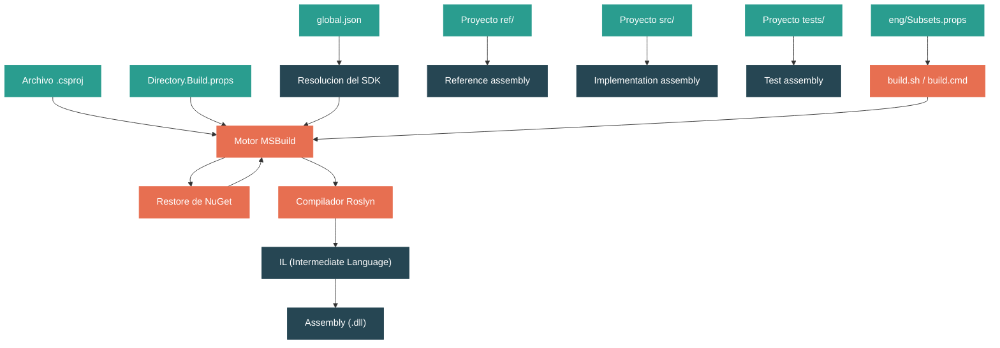

# Nivel 1: Fundamentos -- Estructura de Proyectos y el Sistema de Build

> **Perfil objetivo:** Desarrollador que puede crear proyectos .NET pero no entiende el pipeline de build
> **Esfuerzo estimado:** 3 horas
> **Prerrequisitos:** [Modulo 1.1: Panorama del Ecosistema .NET](01-foundations-ecosystem-overview.md)
> [English version](../en/01-foundations-project-structure.md)

---

## Objetivos de Aprendizaje

Al finalizar este modulo vas a poder:

1. Explicar que controla un archivo `.csproj` y como MSBuild lo procesa.
2. Describir la convencion de layout `ref/`, `src/`, `tests/` que usa cada library del repositorio.
3. Trazar que sucede cuando ejecutas `dotnet build` -- desde el restore de NuGet hasta la compilacion con Roslyn y el assembly de salida.
4. Identificar el rol de `Directory.Build.props` y explicar como fluye la herencia de propiedades desde la raiz del repositorio hasta los proyectos individuales.
5. Leer `global.json` y explicar por que el repositorio fija una version especifica del SDK.
6. Distinguir entre un **reference assembly** y un **implementation assembly**, y explicar por que existen ambos.
7. Usar `build.sh` / `build.cmd` con flags de subset para compilar componentes especificos del repositorio.
8. Inspeccionar la salida del build usando verbosidad diagnostica y el preprocesador de MSBuild.

---

## Mapa Conceptual



**Como leer este mapa:** Tu codigo fuente C# vive en proyectos `.csproj`. MSBuild orquesta todo el build: lee el archivo de proyecto, hereda propiedades de los archivos `Directory.Build.props` subiendo por el arbol de directorios, restaura paquetes NuGet y luego invoca al compilador Roslyn. Roslyn produce **IL** (Intermediate Language), que se empaqueta en un **assembly** (`.dll`). En el repositorio `dotnet/runtime`, cada library tiene tres proyectos relacionados -- `ref/` (superficie de API), `src/` (implementacion) y `tests/` -- cada uno produciendo un tipo diferente de assembly.

---

## Curriculum

### Leccion 1.2.1: El Archivo .csproj Decodificado

**Lo que vas a aprender:** Que significa cada elemento en un archivo `.csproj` y como MSBuild lo interpreta.

**El concepto:**

Un archivo `.csproj` es un documento XML que le dice a MSBuild todo lo que necesita saber para compilar tu proyecto. *No* es solo una lista de archivos -- es un script de build completo. Estos son los elementos clave:

| Elemento | Proposito |
|----------|-----------|
| `<Project Sdk="Microsoft.NET.Sdk">` | Declara el SDK, que importa cientos de targets y props por defecto |
| `<TargetFramework>` | Contra que version de .NET (o .NET Framework) compilar |
| `<OutputType>` | `Library` (por defecto) o `Exe` -- determina si obtienes un `.dll` o un punto de entrada |
| `<PropertyGroup>` | Define propiedades de build (configuracion clave-valor) |
| `<ItemGroup>` | Declara inputs: archivos fuente (`<Compile>`), paquetes (`<PackageReference>`), referencias a proyectos (`<ProjectReference>`) |
| `<AllowUnsafeBlocks>` | Habilita codigo `unsafe` de C# (aritmetica de punteros) |

En el repositorio `dotnet/runtime`, vas a notar algo inusual: los proyectos usan `$(NetCoreAppCurrent)` en lugar de un target framework hardcodeado como `net11.0`. Esta es una propiedad de MSBuild definida centralmente, de modo que cuando se libera una nueva version de .NET, solo hay que cambiar un lugar.

**En el codigo fuente:**

Abri `src/libraries/System.Collections/src/System.Collections.csproj`:

```xml
<Project Sdk="Microsoft.NET.Sdk">
  <PropertyGroup>
    <TargetFramework>$(NetCoreAppCurrent)</TargetFramework>
    <AllowUnsafeBlocks>true</AllowUnsafeBlocks>
    <IsPartialFacadeAssembly>true</IsPartialFacadeAssembly>
    <DefineConstants>SYSTEM_COLLECTIONS;$(DefineConstants)</DefineConstants>
  </PropertyGroup>

  <ItemGroup>
    <Compile Include="System\Collections\ThrowHelper.cs" />
    <Compile Include="$(CoreLibSharedDir)System\Collections\Generic\DebugViewDictionaryItem.cs"
             Link="Common\System\Collections\Generic\DebugViewDictionaryItem.cs" />
    <!-- ... mas archivos ... -->
  </ItemGroup>

  <ItemGroup>
    <ProjectReference Include="$(CoreLibProject)" />
  </ItemGroup>
</Project>
```

Nota varias cosas:

- **`$(NetCoreAppCurrent)`** -- una variable, no un TFM literal. MSBuild la resuelve desde un archivo `.props` mas arriba en el arbol.
- **`<Compile Include="...">`** -- cada archivo fuente se lista explicitamente. El repo `dotnet/runtime` establece `<EnableDefaultItems>false</EnableDefaultItems>` (en `src/libraries/Directory.Build.props`, linea 34), lo que desactiva la inclusion automatica de archivos del SDK. Esto da control preciso sobre que se compila.
- **`$(CoreLibSharedDir)`** -- una variable que apunta al codigo fuente compartido de CoreLib. Los archivos de otros directorios se pueden incluir con el atributo `Link`, que le dice a Visual Studio como mostrarlos en el Solution Explorer.
- **`<ProjectReference Include="$(CoreLibProject)" />`** -- este proyecto depende de `System.Private.CoreLib`, la library fundacional que contiene tipos como `object`, `string` e `int`.

**Ejercicio practico:**

1. Abri `src/libraries/System.Collections/src/System.Collections.csproj` en tu editor.
2. Conta cuantos items `<Compile>` referencian archivos fuera del directorio propio del proyecto (pista: busca `$(CoreLibSharedDir)` y `$(CommonPath)`).
3. Ahora abri un proyecto pequeno que hayas creado con `dotnet new classlib`. Compara los dos archivos `.csproj`. Que obtiene el proyecto SDK-style "gratis" que el proyecto del runtime especifica explicitamente?

**Conclusion clave:** Un archivo `.csproj` es un script de build, no solo una lista de archivos. En `dotnet/runtime`, los proyectos desactivan la inclusion automatica de archivos y listan cada archivo fuente explicitamente para maximo control. Propiedades como `$(NetCoreAppCurrent)` se definen centralmente para evitar duplicar versiones.

**Error comun:** "El archivo `.csproj` solo lista mis archivos fuente." En realidad, el atributo `Sdk` importa cientos de targets y propiedades. Tu archivo de proyecto es la *punta* de un arbol de evaluacion de MSBuild mucho mas grande. Ejecutar `dotnet msbuild -pp` te revelara el proyecto completo evaluado -- a menudo miles de lineas.

---

### Leccion 1.2.2: MSBuild -- El Motor Detras de `dotnet build`

**Lo que vas a aprender:** Como MSBuild orquesta todo el proceso de build, y como funcionan los targets y las propiedades.

**El concepto:**

Cuando ejecutas `dotnet build`, el CLI de `dotnet` delega a **MSBuild**, el motor de build. MSBuild funciona evaluando un arbol de archivos XML (`.csproj`, `.props`, `.targets`) y ejecutando **targets** en un orden de dependencias. Este es el flujo simplificado:

```
dotnet build
    |
    v
MSBuild carga el .csproj
    |
    v
Importa los props del Sdk (Microsoft.NET.Sdk)
    |
    v
Sube por el arbol de directorios, importando Directory.Build.props en cada nivel
    |
    v
Evalua todos los elementos PropertyGroup / ItemGroup
    |
    v
Ejecuta targets en orden:
    Restore --> Build --> (Compile) --> (CopyFilesToOutputDirectory)
```

Terminologia clave de MSBuild:

- **Property**: Un valor string con nombre, como `<TargetFramework>net11.0</TargetFramework>`. Las propiedades se definen en bloques `<PropertyGroup>` y se referencian como `$(NombrePropiedad)`.
- **Item**: Una coleccion con nombre de inputs, como `<Compile Include="*.cs" />`. Los items viven en bloques `<ItemGroup>` y se referencian como `@(NombreItem)`.
- **Target**: Un bloque con nombre de pasos de build (tasks). Los targets declaran dependencias entre si. Por ejemplo, el target `Build` depende de `Compile`, que depende de `ResolveReferences`.
- **Archivo Props** (`.props`): Se importa *antes* del cuerpo del proyecto -- establece valores por defecto.
- **Archivo Targets** (`.targets`): Se importa *despues* del cuerpo del proyecto -- define la logica de build.

La distincion entre `.props` y `.targets` es importante: las propiedades establecidas en `.props` pueden ser sobreescritas por el proyecto, mientras que `.targets` se ejecuta despues de que las propiedades del proyecto estan finalizadas.

**En el codigo fuente:**

Mira `eng/Versions.props` (lineas 1-20). Este archivo define la version del producto, numeros major/minor/patch y etiquetas de prerelease para todo el repositorio:

```xml
<PropertyGroup>
    <ProductVersion>11.0.0</ProductVersion>
    <MajorVersion>11</MajorVersion>
    <MinorVersion>0</MinorVersion>
    <PatchVersion>0</PatchVersion>
    <PreReleaseVersionLabel>preview</PreReleaseVersionLabel>
    <PreReleaseVersionIteration>4</PreReleaseVersionIteration>
</PropertyGroup>
```

Cada proyecto en el repositorio hereda estos valores automaticamente. Cuando el equipo incrementa la version para un nuevo preview, lo cambia en *un solo* lugar.

**Ejercicio practico:**

1. Abri una terminal en el directorio de cualquier library, por ejemplo `src/libraries/System.Collections/src/`.
2. Ejecuta: `dotnet msbuild -pp:fullproject.xml System.Collections.csproj` (esto "preprocesa" el proyecto, expandiendo todos los imports en un solo archivo).
3. Abri `fullproject.xml` y busca `TargetFramework`. Vas a ver la cadena de imports que lleva al valor final resuelto.
4. Busca `NetCoreAppCurrent` para encontrar donde se define la variable del TFM.

**Conclusion clave:** MSBuild es un motor de evaluacion de propiedades y targets. El archivo `.csproj` es solo el punto de entrada a un arbol de archivos `.props` y `.targets`. Entender esta jerarquia es esencial para navegar un repo grande como `dotnet/runtime`.

---

### Leccion 1.2.3: La Convencion ref/src/tests

**Lo que vas a aprender:** Por que cada library en `dotnet/runtime` tiene tres proyectos separados, y que rol cumple cada uno.

**El concepto:**

Mira dentro de cualquier directorio de library bajo `src/libraries/`. Vas a encontrar (como minimo) tres subdirectorios:

```
src/libraries/System.Collections/
    ref/                 -- Proyecto de reference assembly
    src/                 -- Proyecto de implementacion
    tests/               -- Proyecto de tests
    Directory.Build.props
    System.Collections.slnx
```

Cada uno tiene un proposito diferente:

| Directorio | Que produce | Proposito |
|------------|------------|-----------|
| `ref/` | **Reference assembly** | Define la *superficie publica de la API* -- los tipos, metodos y sus firmas. Los cuerpos de los metodos son todos `throw null;`. Este assembly es contra el que otros proyectos compilan. |
| `src/` | **Implementation assembly** | Contiene el codigo real que se ejecuta en tiempo de ejecucion. |
| `tests/` | **Test assembly** | Proyectos de tests con xUnit que validan la implementacion. |

**Por que separar ref y src?**

Los reference assemblies resuelven varios problemas:

1. **Cumplimiento del contrato de API**: El ref assembly es la unica fuente de verdad para lo que es publico. Los cambios al ref assembly pasan por API review.
2. **Velocidad de compilacion**: Los proyectos downstream compilan contra el ref assembly minusculo (solo firmas), no contra la implementacion completa.
3. **Compatibilidad binaria**: El runtime puede enviar diferentes implementaciones para distintas plataformas, pero todas deben coincidir con el mismo contrato del ref assembly.

**En el codigo fuente:**

Compara el proyecto ref y el proyecto src para System.Collections:

**`src/libraries/System.Collections/ref/System.Collections.csproj`:**
```xml
<Project Sdk="Microsoft.NET.Sdk">
  <PropertyGroup>
    <TargetFramework>$(NetCoreAppCurrent)</TargetFramework>
  </PropertyGroup>
  <ItemGroup>
    <Compile Include="System.Collections.cs" />
    <Compile Include="System.Collections.Forwards.cs" />
  </ItemGroup>
  <ItemGroup>
    <ProjectReference Include="..\..\System.Runtime\ref\System.Runtime.csproj" />
  </ItemGroup>
</Project>
```

El proyecto ref compila solo dos archivos. Ahora mira lo que contiene `System.Collections.cs` (el fuente del ref):

```csharp
namespace System.Collections.Generic
{
    public sealed partial class LinkedListNode<T>
    {
        public LinkedListNode(T value) { }
        public System.Collections.Generic.LinkedList<T>? List { get { throw null; } }
        public System.Collections.Generic.LinkedListNode<T>? Next { get { throw null; } }
        // ... todos los metodos hacen throw null
    }
}
```

Cada getter y cuerpo de metodo es `{ throw null; }`. Esto es intencional -- el ref assembly solo necesita informacion de tipos y firmas. Nada de logica real.

Mientras tanto, `src/System.Collections.csproj` incluye docenas de archivos de implementacion real como `LinkedList.cs`, `SortedDictionary.cs`, `PriorityQueue.cs`, etc.

**Ejercicio practico:**

1. Abri `src/libraries/System.Collections/ref/System.Collections.cs` y elegi cualquier tipo (por ejemplo, `LinkedList<T>`).
2. Encontra el archivo de implementacion correspondiente en `src/libraries/System.Collections/src/` (pista: mira los items `<Compile>` en el `.csproj` de src).
3. Compara los dos: cuantos metodos se listan en el archivo ref? Hay algun metodo `internal` o `private` en el archivo ref? (Spoiler: no deberia haber.)
4. Mira `src/libraries/System.Collections/tests/System.Collections.Tests.csproj` y observa como los tests referencian infraestructura compartida de tests desde `$(CommonTestPath)`.

**Conclusion clave:** La convencion de tres proyectos (`ref/src/tests`) separa el contrato de API de la implementacion. Este patron habilita la gobernanza de API review, compilacion mas rapida para consumidores e implementaciones especificas por plataforma detras de un unico contrato.

---

### Leccion 1.2.4: Directory.Build.props y la Herencia de Propiedades

**Lo que vas a aprender:** Como la configuracion compartida fluye desde la raiz del repositorio hasta los proyectos individuales a traves de una jerarquia de archivos `.props`.

**El concepto:**

MSBuild tiene una convencion especial: antes de evaluar cualquier `.csproj`, automaticamente sube por el arbol de directorios buscando archivos llamados `Directory.Build.props`. Cada uno que encuentra se importa, el mas interno al final (para que los archivos mas cercanos puedan sobreescribir a los lejanos). Esto crea una cadena de herencia de propiedades:

```
Directory.Build.props                    (raiz del repo)
  |
  +-- src/libraries/Directory.Build.props  (configuracion de libraries)
        |
        +-- src/libraries/System.Collections/Directory.Build.props  (especifica de la library)
              |
              +-- src/libraries/System.Collections/src/System.Collections.csproj
```

Cada nivel agrega o sobreescribe propiedades. Asi es como el repositorio aplica configuracion consistente a cientos de proyectos sin repetir configuracion.

**En el codigo fuente:**

**Raiz del repositorio -- `Directory.Build.props`** (lineas 1-18):

Este archivo establece propiedades fundamentales para *todo* el repositorio:
- `ImportDirectoryBuildProps` se establece en `false` para prevenir doble importacion.
- Se definen versiones minimas de plataforma (por ejemplo, `<iOSVersionMin>13.0</iOSVersionMin>`, `<macOSVersionMin>14.0</macOSVersionMin>`).
- El archivo importa `eng/OSArch.props` para detectar el sistema operativo y la arquitectura actual.

**Nivel libraries -- `src/libraries/Directory.Build.props`** (lineas 1-50):

Este archivo configura todos los proyectos de libraries:
- `<DisableArcadeTestFramework>true</DisableArcadeTestFramework>` -- desactiva el framework de tests por defecto del Arcade SDK.
- `<EnableDefaultItems>false</EnableDefaultItems>` (linea 34) -- fuerza el listado explicito de archivos en cada `.csproj`.
- `<Nullable>enable</Nullable>` para proyectos fuente, `annotations` para tests.
- `<IsAotCompatible>` esta habilitado para proyectos src y ref por defecto.
- `<StrongNameKeyId>Open</StrongNameKeyId>` -- clave de firma por defecto.
- Importa `NetCoreAppLibrary.props`, que define la lista de libraries que se envian como parte del shared framework.

**Especifica de la library -- `src/libraries/System.Collections/Directory.Build.props`:**

```xml
<Project>
  <Import Project="..\Directory.Build.props" />
  <PropertyGroup>
    <StrongNameKeyId>Microsoft</StrongNameKeyId>
  </PropertyGroup>
</Project>
```

Esto sobreescribe la clave de firma a `Microsoft` (porque `System.Collections` es un assembly del framework core que requiere la clave de nombre fuerte de Microsoft).

**Ejercicio practico:**

1. Abri `src/libraries/Directory.Build.props` y encontra la linea que establece `<EnableDefaultItems>false</EnableDefaultItems>`.
2. Ahora hace una prueba: abri el `.csproj` de cualquier library y trata de *quitar* un item `<Compile>`. Que pasaria? (El archivo ya no se compilaria, porque la inclusion automatica esta desactivada.)
3. Encontra `<Nullable>` en `src/libraries/Directory.Build.props`. Que valor recibe para proyectos de test vs proyectos fuente?
4. Traza la cadena de imports: `System.Collections.csproj` --> su `Directory.Build.props` --> `src/libraries/Directory.Build.props` --> `../../Directory.Build.props` (raiz del repo). Cuantos niveles son?

**Conclusion clave:** Los archivos `Directory.Build.props` crean un sistema de configuracion en cascada. La raiz del repo establece valores por defecto globales, `src/libraries/` agrega convenciones para todas las libraries, y las libraries individuales pueden sobreescribir propiedades especificas. Asi es como cientos de proyectos se mantienen consistentes.

---

### Leccion 1.2.5: Del Codigo Fuente al Assembly -- El Pipeline de Compilacion

**Lo que vas a aprender:** Que sucede entre tu codigo fuente C# y el archivo assembly `.dll` final.

**El concepto:**

Cuando MSBuild llega al paso de compilacion, invoca al compilador **Roslyn** (`csc.dll`). Esto es lo que hace Roslyn:

```
Archivos fuente C# (.cs)
        |
        v
    Compilador Roslyn (csc)
        |
        +-- Parsea C# en un arbol de sintaxis
        +-- Realiza analisis semantico (chequeo de tipos, resolucion de overloads)
        +-- Emite IL (Intermediate Language)
        |
        v
    Assembly (.dll)
        |
        +-- Header PE (formato Portable Executable)
        +-- Metadata (tipos, metodos, firmas, referencias)
        +-- Codigo IL (cuerpos de metodos en bytecode basado en stack)
        +-- Recursos (strings embebidos, imagenes, etc.)
```

**IL (Intermediate Language)** es un bytecode independiente de la plataforma. *No* es codigo maquina -- no puede ejecutarse directamente en la CPU. Cuando ejecutas una aplicacion .NET, el **compilador JIT** del runtime (RyuJIT en CoreCLR) convierte IL a codigo maquina nativo al vuelo. Por eso las aplicaciones .NET son "compilar una vez, ejecutar en cualquier lugar" en las plataformas soportadas.

Un **assembly** es la unidad de deployment en .NET. Un solo archivo `.dll` contiene:
- **Metadata**: Una descripcion completa de cada tipo, metodo, campo y sus relaciones. Esto es lo que hace posible la reflection.
- **Codigo IL**: Las implementaciones reales de los metodos en forma de bytecode.
- **Identidad del assembly**: Nombre, version, cultura, token de clave publica.

**En el codigo fuente:**

La salida de compilar `System.Collections` termina en:
```
artifacts/bin/System.Collections/Debug/net11.0/System.Collections.dll
```

El directorio `artifacts/` en la raiz del repositorio es donde va toda la salida del build. La estructura de rutas refleja la configuracion:
```
artifacts/
    bin/            -- assemblies compilados
    obj/            -- archivos intermedios del build
    log/            -- logs del build
    packages/       -- paquetes NuGet
```

**Ejercicio practico:**

1. Si tenes el SDK de .NET instalado, crea una app de consola simple:
   ```bash
   dotnet new console -n PipelineDemo
   cd PipelineDemo
   ```
2. Compilala con verbosidad diagnostica:
   ```bash
   dotnet build -v diag > build.log
   ```
3. Abri `build.log` y busca `Csc` -- este es el task del compilador Roslyn. Mira los argumentos de linea de comandos que se le pasan. Vas a ver `-target:exe`, `-out:...`, y cada archivo `.cs` listado.
4. (Opcional) Si tenes `ildasm` o ILSpy, abri el `.dll` de salida y navega el IL. Busca un metodo simple como `Main` y lee las instrucciones IL (`ldstr`, `call`, `ret`).

**Conclusion clave:** Roslyn compila C# en IL (Intermediate Language), que se almacena en archivos assembly `.dll` junto con metadata. El assembly no es codigo maquina -- es un formato intermedio que el compilador JIT del runtime convierte a codigo nativo en tiempo de ejecucion.

---

### Leccion 1.2.6: Scripts de Build y Subsets

**Lo que vas a aprender:** Como `build.sh` / `build.cmd` orquestan la compilacion de todo el repositorio `dotnet/runtime`, y que son los "subsets".

**El concepto:**

El repositorio `dotnet/runtime` es enorme. Contiene el runtime CoreCLR (C/C++), el runtime Mono (C), las libraries gestionadas (C#), el host nativo (C/C++), instaladores e infraestructura de tests. Compilar *todo* desde cero toma 30-40 minutos. Rara vez queres hacer eso.

El repositorio usa un sistema de **subsets** para permitirte compilar solo lo que necesitas. Los puntos de entrada son:

- **`build.sh`** (Linux/macOS) -- un script shell ligero que delega a `eng/build.sh`
- **`build.cmd`** (Windows) -- un script batch ligero que delega a `eng/build.ps1`

Ambos finalmente invocan MSBuild con el archivo `eng/Subsets.props`, que define como se divide el repositorio en unidades compilables.

**En el codigo fuente:**

Mira `build.sh` en la raiz del repositorio (las primeras 33 lineas). Es notablemente simple -- resuelve symlinks y luego llama a `eng/build.sh` pasando todos los argumentos:

```bash
if is_cygwin_or_mingw; then
  "$scriptroot/build.cmd" "$@"
else
  "$scriptroot/eng/build.sh" "$@"
fi
```

La logica real vive en `eng/Subsets.props`. Abrilo y mira la linea 72:

```xml
<DefaultSubsets>clr+mono+libs+tools+host+packs</DefaultSubsets>
```

Esto es lo que se compila cuando ejecutas `./build.sh` sin argumentos -- *todo*. El delimitador `+` separa nombres de subsets. Cada subset se expande en sub-subsets:

| Subset | Que compila |
|--------|------------|
| `clr` | Runtime CoreCLR (JIT, GC, sistema de tipos, codigo nativo) |
| `mono` | Runtime Mono |
| `libs` | Libraries gestionadas (BCL) |
| `host` | Host nativo (ejecutable `dotnet`, `hostfxr`, `hostpolicy`) |
| `tools` | Herramientas de build (IL linker, cDAC) |
| `packs` | Paquetes NuGet e instaladores |

Comandos de build comunes:

```bash
# Compilar CoreCLR + libraries + host (tipico para desarrollo de libraries)
./build.sh clr+libs+host

# Compilar solo libraries en Release
./build.sh libs -lc release

# Compilar Mono + libraries (para mobile/WASM)
./build.sh mono+libs
```

Flags de configuracion:
- `-rc` / `-runtimeConfiguration`: Config de CoreCLR (`Debug`, `Checked`, `Release`)
- `-lc` / `-librariesConfiguration`: Config de libraries (`Debug`, `Release`)
- `-c` / `-configuration`: Valor por defecto para todos si no se especifica lo contrario

**En el codigo fuente:**

`global.json` en la raiz del repositorio fija la version exacta del SDK:

```json
{
  "sdk": {
    "version": "11.0.100-preview.3.26170.106",
    "allowPrerelease": true,
    "rollForward": "major"
  },
  "msbuild-sdks": {
    "Microsoft.DotNet.Arcade.Sdk": "11.0.0-beta.26210.111",
    "Microsoft.DotNet.Helix.Sdk": "11.0.0-beta.26210.111"
  }
}
```

Esto asegura que cada desarrollador y maquina de CI use la *exacta misma* version del SDK. La configuracion `"rollForward": "major"` significa que aceptara versiones major mas altas si la fijada no esta instalada, pero en la practica los scripts de CI instalan la version fijada.

La seccion `msbuild-sdks` declara SDKs personalizados usados por el sistema de build:
- **Arcade SDK**: La infraestructura de build compartida de Microsoft para todos los repos `dotnet/*`.
- **Helix SDK**: Integracion con la infraestructura de tests Helix para ejecutar tests en CI.

**Ejercicio practico:**

1. Abri `eng/Subsets.props` y encontra la propiedad `<DefaultSubsets>`. Que subsets se incluyen por defecto para `TargetsMobile`?
2. Lee la ayuda de uso ejecutando `./build.sh -h` (o `build.cmd -?` en Windows). Identifica los flags para establecer la configuracion del runtime y de las libraries por separado.
3. Mira `global.json`. Que version del SDK esta fijada? Que version del Arcade SDK esta usando?
4. (Avanzado) Abri `eng/build.sh` y lee las primeras 50 lineas. Encontra donde define el argumento `--subset`.

**Conclusion clave:** El sistema de build de `dotnet/runtime` usa subsets para hacer factibles los builds incrementales. Seleccionas que compilar (`clr`, `libs`, `mono`, etc.) y la configuracion para cada componente. `global.json` fija versiones exactas de herramientas, y `eng/Subsets.props` define como se particiona el repositorio.

---

## Guia de Lectura de Codigo Fuente

Estos archivos se recomiendan como lectura para este modulo, ordenados de mas facil a mas complejo:

| Archivo | Dificultad | Que vas a aprender |
|---------|-----------|-------------------|
| `src/libraries/System.Collections/src/System.Collections.csproj` | Facil | Anatomia de un `.csproj` real en el repo |
| `src/libraries/System.Collections/ref/System.Collections.csproj` | Facil | Como difiere un proyecto de ref assembly de uno de implementacion |
| `src/libraries/System.Collections/ref/System.Collections.cs` | Facil | Como luce un archivo fuente de reference assembly (cuerpos `throw null;`) |
| `global.json` | Facil | Fijacion de SDK y declaraciones de MSBuild SDKs personalizados |
| `src/libraries/System.Collections/Directory.Build.props` | Facil | Como una library individual sobreescribe propiedades compartidas |
| `src/libraries/Directory.Build.props` | Medio | Configuracion compartida de libraries (50+ lineas de convenciones) |
| `Directory.Build.props` | Medio | Propiedades de la raiz del repositorio (versiones de plataforma, directorios de salida) |
| `eng/Subsets.props` | Medio | Como el sistema de build divide el repo en subsets compilables |

---

## Herramientas de Diagnostico y Comandos

Estos comandos te ayudan a entender que esta haciendo MSBuild:

### `dotnet build -v diag`
Verbosidad diagnostica -- imprime cada evaluacion de propiedad, invocacion de target y ejecucion de task. La salida es muy grande (miles de lineas), asi que redirigila a un archivo:
```bash
dotnet build -v diag > build.log
```
Busca en el log `Csc` para encontrar la invocacion del compilador, o un nombre de propiedad para ver donde se establecio.

### `dotnet msbuild -pp:<archivo-salida>`
Preprocesa el proyecto, expandiendo todos los imports en un solo archivo XML. Esto te muestra el proyecto evaluado *completo*, incluyendo todo lo heredado de `Directory.Build.props`, props del SDK y targets del SDK:
```bash
dotnet msbuild -pp:full.xml src/libraries/System.Collections/src/System.Collections.csproj
```

### `dotnet build --no-incremental`
Fuerza un rebuild completo, ignorando las caches de build incremental. Util cuando sospechas que hay salidas obsoletas.

### `dotnet build -bl`
Produce un log binario (`msbuild.binlog`). Podes verlo con el [MSBuild Structured Log Viewer](https://msbuildlog.com/) para una vista rica, buscable y con estructura de arbol del build.

### `ildasm` / ILSpy
Desensambla un `.dll` compilado para inspeccionar su codigo IL y metadata:
```bash
# Usando el ildasm del SDK
ildasm artifacts/bin/System.Collections/Debug/net11.0/System.Collections.dll
```
O usa [ILSpy](https://github.com/icsharpcode/ILSpy) para una vista con GUI y decompilacion a C#.

---

## Autoevaluacion

Pone a prueba tu comprension de este modulo:

### Chequeos de Conocimiento

<details>
<summary>1. A que se resuelve <code>$(NetCoreAppCurrent)</code>, y por que el repositorio no usa un TFM hardcodeado como <code>net11.0</code>?</summary>

`$(NetCoreAppCurrent)` se resuelve al TFM actual de .NET (por ejemplo, `net11.0`). El repositorio usa una variable para que cuando se libere una nueva version, el TFM solo necesite cambiar en un archivo `.props` central en lugar de en cientos de archivos `.csproj` individuales.
</details>

<details>
<summary>2. Por que el proyecto <code>ref/</code> de una library tiene cuerpos de metodo que dicen <code>throw null;</code>?</summary>

Los reference assemblies definen solo la superficie publica de la API -- nombres de tipos, firmas de metodos y su visibilidad. Los cuerpos de los metodos son irrelevantes porque nadie *ejecuta* un reference assembly nunca. El `throw null;` es un cuerpo valido minimo que satisface al compilador. Los proyectos downstream compilan contra el ref assembly para chequeo de tipos, pero en tiempo de ejecucion usan el implementation assembly de `src/`.
</details>

<details>
<summary>3. Cual es la diferencia entre un archivo <code>.props</code> y un archivo <code>.targets</code>?</summary>

Los archivos `.props` se importan *antes* del cuerpo del proyecto y establecen valores de propiedades por defecto que el proyecto puede sobreescribir. Los archivos `.targets` se importan *despues* del cuerpo del proyecto y definen logica de build (targets y tasks) que se ejecuta durante el build. La convencion es: usa `.props` para configuracion, `.targets` para comportamiento.
</details>

<details>
<summary>4. Si ejecutas <code>./build.sh libs -lc release</code>, que compila y en que configuracion?</summary>

Compila solo el subset de **libraries** (class libraries gestionadas / BCL) en configuracion **Release**. El flag `-lc release` establece la configuracion de libraries en Release. No compila el runtime CLR, Mono, host ni otros subsets.
</details>

<details>
<summary>5. Por que <code>src/libraries/Directory.Build.props</code> establece <code>EnableDefaultItems</code> en <code>false</code>?</summary>

Con `EnableDefaultItems` en `true` (el valor por defecto del SDK), MSBuild incluye automaticamente todos los archivos `.cs` en el directorio del proyecto. El repo `dotnet/runtime` desactiva esto para que cada archivo fuente deba listarse explicitamente en el `.csproj`. Esto da control preciso sobre que se compila -- esencial en un repo grande donde los archivos podrian incluirse condicionalmente para plataformas especificas o compartirse entre multiples proyectos.
</details>

### Desafio Practico

**Mapea la cadena de herencia de propiedades para `System.Collections`:**

1. Comenzando desde `src/libraries/System.Collections/src/System.Collections.csproj`, traza cada archivo `Directory.Build.props` que se importa hasta la raiz del repositorio.
2. Para cada archivo, anota 2-3 propiedades clave que establece.
3. Encontra donde se define finalmente `$(NetCoreAppCurrent)` (pista: esta en el directorio `eng/`).
4. Dibuja la cadena de imports como un diagrama simple con flechas.

Este ejercicio deberia tomar unos 20 minutos y te va a dar un modelo mental concreto de como funciona la herencia de propiedades de MSBuild en este repositorio.

---

## Conexiones

| Direccion | Modulo | Relacion |
|-----------|--------|----------|
| Anterior | [1.1: Panorama del Ecosistema .NET](01-foundations-ecosystem-overview.md) | El Modulo 1.1 presento los componentes (SDK, runtime, BCL). Este modulo muestra como esos componentes se organizan en el arbol de fuentes y como el sistema de build los conecta. |
| Siguiente | [1.3: El Sistema de Tipos](01-foundations-type-system.md) | Ahora que entendes como se compila el codigo en assemblies, el Modulo 1.3 explora que sucede cuando esos assemblies se cargan y los tipos se usan en tiempo de ejecucion. |
| Relacionado | [1.5: Assemblies, Namespaces y el Loader](01-foundations-assemblies.md) | Profundiza el concepto de assemblies introducido aca -- como se cargan, resuelven y versionan. |
| Relacionado | [1.7: Tu Primera Lectura del Codigo Fuente del Runtime](01-foundations-first-source-reading.md) | Aplica el conocimiento de estructura de proyectos de este modulo a una lectura guiada de codigo fuente real del runtime. |

---

## Glosario

| Termino | Definicion |
|---------|-----------|
| **MSBuild** | El motor de build que procesa archivos `.csproj`, evalua propiedades y orquesta la compilacion. Se invoca mediante `dotnet build`. |
| **csproj** | Un archivo de proyecto XML (proyecto C#) que declara propiedades de build, archivos fuente, dependencias y configuracion para MSBuild. |
| **TFM (Target Framework Moniker)** | Un string como `net11.0` o `netstandard2.0` que identifica contra que version de .NET apunta un proyecto. Determina que APIs estan disponibles. |
| **Reference assembly** | Un assembly que contiene solo firmas de API publicas (sin implementacion). Se usa en tiempo de compilacion para chequeo de tipos. Los cuerpos de los metodos son tipicamente `throw null;`. |
| **Implementation assembly** | El assembly "real" con implementaciones reales de metodos. Se usa en tiempo de ejecucion. |
| **IL (Intermediate Language)** | Un bytecode independiente de plataforma, basado en stack, producido por el compilador Roslyn. Se almacena en assemblies y se convierte a codigo nativo por el JIT en tiempo de ejecucion. |
| **Roslyn** | La plataforma del compilador de C# (y VB.NET). Produce IL a partir de codigo fuente C#. Tambien provee APIs para analisis y generacion de codigo. |
| **NuGet** | El gestor de paquetes de .NET. Restaura paquetes de dependencias antes de la compilacion y empaqueta libraries para distribucion. |
| **Archivo Props (.props)** | Un archivo de MSBuild importado *antes* del cuerpo del proyecto. Se usa para establecer valores de propiedades por defecto. |
| **Archivo Targets (.targets)** | Un archivo de MSBuild importado *despues* del cuerpo del proyecto. Se usa para definir targets y tasks de build. |
| **Subset** | Un grupo con nombre de proyectos en `dotnet/runtime` que puede compilarse independientemente (por ejemplo, `clr`, `libs`, `mono`). Definido en `eng/Subsets.props`. |
| **Arcade SDK** | La infraestructura de build compartida de Microsoft usada en todos los repositorios `dotnet/*`. Provee targets comunes, versionado e integracion de CI. |
| **global.json** | Un archivo en la raiz del repositorio que fija la version exacta del SDK de .NET y declara MSBuild SDKs personalizados. |

---

## Referencias

| Recurso | Tipo | Por que es relevante |
|---------|------|---------------------|
| [Documentacion de MSBuild](https://learn.microsoft.com/en-us/visualstudio/msbuild/msbuild) | Docs oficiales | Referencia completa de propiedades, items y targets de MSBuild |
| [Propiedades de proyecto del SDK de .NET](https://learn.microsoft.com/en-us/dotnet/core/project-sdk/msbuild-props) | Docs oficiales | Todas las propiedades de proyectos SDK-style explicadas |
| [docs/workflow/building/libraries/](https://github.com/dotnet/runtime/tree/main/docs/workflow/building/libraries) | Docs del repo | Como compilar el subset de libraries |
| [docs/workflow/building/coreclr/](https://github.com/dotnet/runtime/tree/main/docs/workflow/building/coreclr) | Docs del repo | Como compilar el subset de CoreCLR |
| [Reference assemblies (concepto)](https://learn.microsoft.com/en-us/dotnet/standard/assembly/reference-assemblies) | Docs oficiales | Explicacion profunda de que son los reference assemblies y por que existen |
| [MSBuild Structured Log Viewer](https://msbuildlog.com/) | Herramienta | Visualizar archivos `.binlog` para analisis detallado del build |
| [SharpLab](https://sharplab.io/) | Herramienta | Ver la salida IL para cualquier snippet de C# -- genial para entender la compilacion |
| [`eng/Subsets.props`](https://github.com/dotnet/runtime/blob/main/eng/Subsets.props) | Fuente | El archivo que define todos los subsets de build para el repositorio |

---

*Este modulo es parte de la [Ruta de Aprendizaje del Runtime de .NET](00-index.md). Ultima actualizacion: 2026-04-14.*
