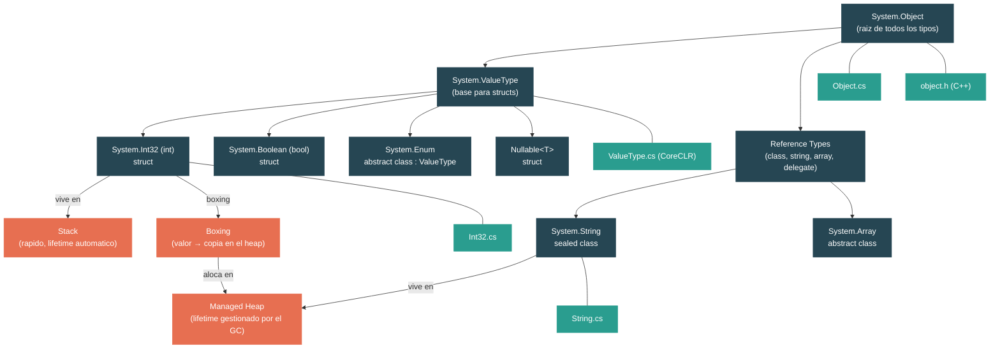

# Nivel 1: Fundamentos — El Sistema de Tipos: Valores, Referencias y el Heap

> **Perfil objetivo:** Desarrollador que usa clases y structs pero no comprende del todo las implicaciones de memoria
> **Esfuerzo estimado:** 4 horas
> **Prerrequisitos:** [Modulo 1.1](01-foundations-ecosystem-overview.md), [Modulo 1.2](01-foundations-project-structure.md)
> [English version](../en/01-foundations-type-system.md)

---

## Objetivos de Aprendizaje

Al finalizar este modulo vas a poder:

1. Explicar la diferencia entre value types y reference types a nivel de memoria (stack vs heap).
2. Identificar donde esta definido `System.Object` en el codigo fuente del runtime y describir los cuatro metodos que provee a todo objeto .NET.
3. Trazar la cadena de herencia desde `int` pasando por `System.Int32`, `System.ValueType`, hasta `System.Object`.
4. Describir el layout de memoria nativo de cualquier objeto en el managed heap (object header + puntero a MethodTable + campos).
5. Explicar que pasa en memoria cuando se hace boxing de un value type y por que implica una alocacion en el heap.
6. Describir por que `System.String` es inmutable y que significa string interning.
7. Explicar la estructura de `Nullable<T>` y por que es en si mismo un value type.
8. Leer y navegar los archivos fuente relevantes de CoreLib que definen estos tipos fundamentales.

---

## Mapa Conceptual



---

## Curriculum

### Leccion 1 — Todo Hereda de Object

#### Que vas a aprender

Cada tipo en .NET — `int`, `string`, tus clases, incluso los arrays — hereda de una sola clase: `System.Object`. En esta leccion vas a ver exactamente que provee esa clase raiz.

#### El concepto

`System.Object` define cuatro metodos de instancia virtuales que todo objeto .NET hereda:

| Metodo | Proposito |
|---|---|
| `ToString()` | Retorna una representacion en string. La implementacion por defecto retorna el nombre completo del tipo. |
| `Equals(object?)` | Prueba igualdad de valor. El default para reference types es igualdad de referencia (`this == obj`). |
| `GetHashCode()` | Retorna un codigo hash. El default esta basado en el sync block index del objeto (esencialmente su identidad). |
| `~Object()` (Finalizer) | Llamado por el GC antes de reclamar la memoria. El slot virtual del finalizer esta hardcodeado en el runtime. |

Tambien hay dos metodos estaticos importantes:

- `ReferenceEquals(object?, object?)` — prueba si dos referencias apuntan al mismo objeto.
- `Equals(object?, object?)` — un wrapper null-safe que llama al `Equals` de instancia.

Cada tipo .NET puede sobreescribir `ToString()`, `Equals()` y `GetHashCode()` porque estan definidos aca en la raiz.

#### En el codigo fuente

Abri `src/libraries/System.Private.CoreLib/src/System/Object.cs`. Esta es la definicion compartida (agnostica al runtime):

```csharp
// Object es la clase raiz para todos los objetos en el CLR.
// Object es la super clase para todos los otros objetos del CLR y provee
// un conjunto de metodos y servicios de bajo nivel a las subclases.
public partial class Object
{
    [NonVersionable]
    public Object() { }

    // Permite a un objeto liberar recursos antes de ser reclamado por el GC.
    // El numero de slot virtual de este metodo esta hardcodeado en los runtimes.
    // No agregar ningun metodo virtual antes de este.
    [NonVersionable]
    ~Object() { }

    public virtual string? ToString()
    {
        return GetType().ToString();
    }

    public virtual bool Equals(object? obj)
    {
        return this == obj;
    }

    public virtual int GetHashCode()
    {
        return RuntimeHelpers.GetHashCode(this);
    }
}
```

Nota el comentario en el finalizer: *"This method's virtual slot number is hardcoded in runtimes. Do not add any virtual methods ahead of this."* Esto te dice que el runtime (escrito en C++) depende de la posicion exacta de este metodo en la vtable. El codigo managed en C# y el codigo nativo en C++ tienen que coincidir.

Tambien nota que `Object` es una `partial class`. Las otras partes viven en directorios especificos del runtime (`src/coreclr/System.Private.CoreLib/` y `src/mono/System.Private.CoreLib/`) y agregan metodos como `GetType()` y `MemberwiseClone()` que requieren implementaciones especificas del runtime.

#### Ejercicio practico

1. Abri el archivo `src/libraries/System.Private.CoreLib/src/System/Object.cs` en tu editor.
2. Conta los metodos virtuales. Hay exactamente tres metodos de instancia virtuales mas el finalizer.
3. Busca en el repositorio otras definiciones parciales de `Object` usando `grep -r "partial class Object" src/coreclr/System.Private.CoreLib/` — vas a encontrar la mitad especifica del runtime que define `GetType()`.
4. Escribi un programa simple:
   ```csharp
   object o = new object();
   Console.WriteLine(o.ToString());        // "System.Object"
   Console.WriteLine(o.GetHashCode());     // algun entero
   Console.WriteLine(o.Equals(o));         // True
   Console.WriteLine(o.Equals(new object())); // False — instancia diferente
   ```

#### Conclusion clave

`System.Object` es pequeno a proposito. Define el contrato minimo que todo objeto .NET debe satisfacer: identidad (`GetHashCode`, `Equals`), descripcion (`ToString`) y gestion de ciclo de vida (finalizer). Todo lo demas se construye encima.

#### Concepto erroneo comun

> *"`GetType()` esta definido en Object.cs"*
>
> No exactamente. La firma del metodo es parte de `System.Object`, pero la implementacion es especifica del runtime. Vive en `src/coreclr/System.Private.CoreLib/src/System/Object.CoreCLR.cs` para CoreCLR y en un archivo diferente para Mono. Este es el patron de "partial class" usado en todo CoreLib.

---

### Leccion 2 — Value Types: Viviendo en el Stack

#### Que vas a aprender

Los value types (`struct`) almacenan sus datos directamente en la variable — tipicamente en el stack o inline dentro del objeto que los contiene. Vas a ver como `System.ValueType` y `System.Int32` estan definidos en el codigo fuente del runtime.

#### El concepto

En .NET, todos los tipos caen en dos categorias:

| | Value Types | Reference Types |
|---|---|---|
| **Keyword** | `struct`, `enum` | `class`, `interface`, `delegate`, `record class` |
| **Almacenamiento** | Datos almacenados directamente en la variable | La variable contiene un puntero (referencia) a datos en el heap |
| **Asignacion** | Copia los datos | Copia la referencia (ambas variables apuntan al mismo objeto) |
| **Default** | Todos los bits en cero (ej: `0` para `int`, `false` para `bool`) | `null` |
| **Herencia** | No puede heredar de otros structs | Jerarquia completa de herencia simple |
| **Clase base** | Hereda implicitamente de `System.ValueType` | Hereda de `System.Object` (o de otra clase) |

La cadena de herencia de `int` es:

```
int  (alias de C#)
  → System.Int32  (el struct real)
    → System.ValueType  (abstract class — sobreescribe Equals/GetHashCode)
      → System.Object  (raiz de todo)
```

Esto es paradojico: `Int32` es un *struct* pero su clase base `ValueType` esta declarada como *class*. Este es un caso especial que el runtime maneja. No podes crear tu propia clase que herede de `ValueType` — solo la keyword `struct` puede hacer eso.

#### En el codigo fuente

**`System.ValueType`** esta definido en la parte de CoreLib especifica de CoreCLR en `src/coreclr/System.Private.CoreLib/src/System/ValueType.cs`:

```csharp
// Proposito: Clase base para todas las clases de valor.
public abstract partial class ValueType
{
    public override unsafe bool Equals([NotNullWhen(true)] object? obj)
    {
        if (null == obj) return false;
        if (GetType() != obj.GetType()) return false;

        // si no hay referencias del GC en este objeto podemos evitar reflection
        // y hacer un memcmp rapido
        if (CanCompareBitsOrUseFastGetHashCode(RuntimeHelpers.GetMethodTable(obj)))
        {
            return SpanHelpers.SequenceEqual(
                ref RuntimeHelpers.GetRawData(this),
                ref RuntimeHelpers.GetRawData(obj),
                RuntimeHelpers.GetMethodTable(this)->GetNumInstanceFieldBytes());
        }

        // Fallback a comparacion campo por campo via reflection
        FieldInfo[] thisFields = GetType().GetFields(...);
        // ...compara cada campo...
    }
}
```

Insight clave: `ValueType.Equals()` tiene dos caminos:
1. **Camino rapido** — si el struct no tiene campos de tipo referencia, hace una comparacion de memoria cruda (`SequenceEqual` sobre los bytes). Esto es muy rapido.
2. **Camino lento** — si el struct contiene referencias, cae a reflection, comparando campo por campo. Por eso siempre deberias sobreescribir `Equals()` en tus propios structs.

**`System.Int32`** esta definido en `src/libraries/System.Private.CoreLib/src/System/Int32.cs`:

```csharp
[StructLayout(LayoutKind.Sequential)]
public readonly struct Int32
    : IComparable, IConvertible, ISpanFormattable,
      IComparable<int>, IEquatable<int>,
      IBinaryInteger<int>, IMinMaxValue<int>, ...
{
    private readonly int m_value; // No renombrar (serializacion binaria)

    public const int MaxValue = 0x7fffffff;
    public const int MinValue = unchecked((int)0x80000000);
}
```

Fijate: `Int32` es un `readonly struct` con un solo campo `m_value`. El struct entero son exactamente 4 bytes de datos. No hay overhead — sin object header, sin puntero a MethodTable. Cuando vive en el stack, es literalmente solo esos 4 bytes.

#### Ejercicio practico

1. Escribi un programa que demuestre la semantica de copia de los value types:
   ```csharp
   int a = 42;
   int b = a;    // copia el valor
   b = 99;
   Console.WriteLine(a); // sigue siendo 42 — a y b son copias independientes
   ```
2. Ahora proba lo mismo con un struct custom:
   ```csharp
   struct Point { public int X; public int Y; }

   Point p1 = new Point { X = 1, Y = 2 };
   Point p2 = p1;  // copia todos los campos
   p2.X = 99;
   Console.WriteLine(p1.X); // sigue siendo 1
   ```
3. Verifica el tamano: `Console.WriteLine(sizeof(int));` imprime `4`. Proba `sizeof(double)` (8), `sizeof(bool)` (1).

#### Conclusion clave

Los value types almacenan datos directamente. Asignarlos o pasarlos crea una copia. Esto los hace baratos para datos pequenos (sin alocacion en el heap, sin presion del GC) pero potencialmente costosos para structs grandes (copiar muchos bytes).

#### Concepto erroneo comun

> *"Los value types siempre viven en el stack."*
>
> No es cierto. Un value type vive en el stack solo cuando es una variable local o parametro. Si un value type es un campo de una clase (reference type), vive en el heap como parte de ese objeto. Si es capturado por una lambda o usado en un metodo async, el compilador puede moverlo al heap. "Value type" describe *semantica de copia*, no *ubicacion de almacenamiento*.

---

### Leccion 3 — Reference Types: El Heap y el Garbage Collector

#### Que vas a aprender

Los reference types viven en el managed heap. Una variable de tipo referencia contiene un puntero a los datos reales. Vas a ver el layout de memoria nativo que el runtime usa para cada objeto en el heap.

#### El concepto

Cuando escribis `var list = new List<int>();`, se crean dos cosas:

1. **La variable `list`** — en el stack, conteniendo un puntero (tipicamente 8 bytes en un sistema de 64-bit).
2. **El objeto** — en el managed heap, conteniendo un object header, un puntero a MethodTable y los campos del objeto.

El layout nativo de cada objeto en el heap esta definido en C++ en `src/coreclr/vm/object.h`:

```
┌─────────────────────────┐  ← offset negativo desde el puntero del objeto
│  Object Header          │     (sync block index, estado de lock, bits del GC)
│  (OBJHEADER_SIZE)       │     8 bytes en 64-bit (4-byte align pad + 4-byte sync block)
├─────────────────────────┤  ← aca es donde la referencia del objeto realmente apunta
│  MethodTable* m_pMethTab│     8 bytes en 64-bit — puntero a metadata del tipo
├─────────────────────────┤
│  Campos de instancia... │     varia segun el tipo
│                         │
└─────────────────────────┘
```

Cada objeto en el heap tiene al menos:
- **Object Header** (en un offset negativo) — usado para sincronizacion (`lock`), marcado del GC y almacenamiento del hash code.
- **Puntero a MethodTable** — le dice al runtime que tipo es este objeto. Asi es como funciona `GetType()`: el runtime lee este puntero y retorna el objeto `Type` correspondiente.

El tamano minimo de un objeto en el heap esta definido en `object.h`:

```cpp
#define MIN_OBJECT_SIZE     (2*TARGET_POINTER_SIZE + OBJHEADER_SIZE)
```

En un sistema de 64-bit esto es `2*8 + 8 = 24 bytes`. Incluso una clase vacia ocupa 24 bytes en el heap. Este es el costo de ser un reference type.

#### En el codigo fuente

Abri `src/coreclr/vm/object.h` y mira la clase `Object` en C++:

```cpp
// code:Object es la representacion de un objeto managed en el heap del GC.
class Object
{
  protected:
    PTR_MethodTable m_pMethTab;
    // ...
  public:
    MethodTable *RawGetMethodTable() const
    {
        return m_pMethTab;
    }
};
```

El unico campo obligatorio es `m_pMethTab` — el puntero a MethodTable. El object header esta *antes* de este puntero en memoria (en un offset negativo). Este diseno permite que el GC y el runtime naveguen objetos de forma extremadamente eficiente.

El comentario al inicio de `object.h` muestra la jerarquia completa del modelo de objetos del CLR:

```
Object              ← base comun para todos los objetos del CLR
 ├── StringObject   ← especializado para almacenamiento de strings (UTF-16)
 ├── ArrayBase      ← base para todos los arrays (tiene NumComponents)
 │    ├── I1Array, I2Array, ...
 │    └── PtrArray  ← array de referencias a objetos
 └── ...
```

#### Ejercicio practico

1. Demostra la semantica de referencia:
   ```csharp
   var a = new List<int> { 1, 2, 3 };
   var b = a;       // copia la referencia, no la lista
   b.Add(4);
   Console.WriteLine(a.Count); // 4 — ambas variables apuntan al mismo objeto
   ```
2. Prueba igualdad de referencia vs igualdad de valor:
   ```csharp
   string s1 = new string("hello".ToCharArray());
   string s2 = new string("hello".ToCharArray());
   Console.WriteLine(ReferenceEquals(s1, s2)); // False — objetos diferentes
   Console.WriteLine(s1 == s2);                // True — string sobreescribe ==
   Console.WriteLine(s1.Equals(s2));           // True — igualdad de valor
   ```
3. Usa `typeof()` y `GetType()` para inspeccionar la conexion con la MethodTable:
   ```csharp
   object o = 42;
   Console.WriteLine(o.GetType().Name);          // "Int32"
   Console.WriteLine(typeof(int) == o.GetType()); // True
   ```

#### Conclusion clave

Cada objeto de reference type en el heap lleva overhead: un object header y un puntero a MethodTable. Este es el precio que pagas por polimorfismo, sincronizacion y garbage collection. Los value types evitan este overhead — hasta que se les hace boxing.

---

### Leccion 4 — Boxing y Unboxing

#### Que vas a aprender

Cuando un value type necesita ser tratado como `System.Object` (o una interfaz), el runtime crea una copia de el en el heap en un proceso llamado *boxing*. La operacion inversa — extraer el valor de vuelta — se llama *unboxing*. Esta leccion explica la mecanica y el costo de rendimiento.

#### El concepto

Considera este codigo:

```csharp
int number = 42;
object boxed = number;  // boxing ocurre aca
int unboxed = (int)boxed; // unboxing ocurre aca
```

**Que hace el boxing paso a paso:**

1. Aloca un nuevo objeto en el managed heap (minimo 24 bytes en 64-bit, incluso para un `int` de 4 bytes).
2. Escribe el object header (sync block index).
3. Escribe el puntero a MethodTable para `System.Int32`.
4. Copia los 4 bytes del valor `42` al area de campos del objeto.
5. Retorna una referencia a este nuevo objeto en el heap.

**Que hace el unboxing:**

1. Verifica que la MethodTable del objeto coincida con el tipo esperado (`Int32`). Lanza `InvalidCastException` si no coincide.
2. Retorna un puntero a los datos del valor dentro del objeto boxeado.
3. Copia el valor desde el heap a la variable en el stack.

El costo de rendimiento no es trivial:
- **Boxing** aloca en el heap, lo que significa eventual garbage collection.
- **Unboxing** requiere una verificacion de tipo y una copia.
- En un loop cerrado, boxing repetido puede crear presion significativa en el GC.

#### En el codigo fuente

Ya sabes por `object.h` que cada objeto en el heap tiene un header + MethodTable + campos. Un `int` boxeado en el heap se ve asi:

```
┌───────────────────────┐
│  Object Header (8 B)  │  ← sync block, bits del GC
├───────────────────────┤
│  MethodTable* (8 B)   │  ← apunta a la MethodTable de Int32
├───────────────────────┤
│  valor int (4 B)      │  ← los datos reales: 42
├───────────────────────┤
│  padding (4 B)        │  ← alineacion a MIN_OBJECT_SIZE
└───────────────────────┘
   Total: 24 bytes para un valor de 4 bytes
```

El metodo `ValueType.Equals()` en `src/coreclr/System.Private.CoreLib/src/System/ValueType.cs` es relevante aca porque boxing es lo que hace posible `ValueType.Equals(object?)` — el parametro es `object?`, asi que pasar un struct requiere hacer boxing del argumento (a menos que el JIT pueda optimizarlo).

#### Ejercicio practico

1. Ve boxing en accion con una lista que usa `object`:
   ```csharp
   // Esto causa boxing en cada llamada a Add
   var list = new System.Collections.ArrayList();
   for (int i = 0; i < 1000; i++)
   {
       list.Add(i); // boxing: int → object
   }

   // Esto NO hace boxing — List<int> generico almacena ints directamente
   var typedList = new List<int>();
   for (int i = 0; i < 1000; i++)
   {
       typedList.Add(i); // sin boxing
   }
   ```
2. Detecta boxing mirando el IL. Usa [SharpLab](https://sharplab.io/) para pegar este codigo y buscar la instruccion IL `box`:
   ```csharp
   int x = 42;
   object o = x;  // IL va a mostrar: box [System.Runtime]System.Int32
   ```
3. El dispatch de interfaces tambien puede causar boxing:
   ```csharp
   int x = 42;
   IComparable c = x;  // boxing! int tiene que convertirse en un objeto en el heap para ser una referencia IComparable
   ```

#### Conclusion clave

Boxing convierte un valor barato alocado en el stack en un objeto caro alocado en el heap. Los generics (`List<int>` en vez de `ArrayList`) fueron introducidos especificamente para eliminar boxing. Cada vez que ves un value type siendo asignado a `object` o una interfaz, esta pasando boxing.

#### Concepto erroneo comun

> *"El JIT siempre optimiza el boxing."*
>
> El JIT puede eliminar boxing en algunos patrones especificos (ej: chequeos `typeof(T)` en metodos genericos), pero en general, si escribis `object o = myInt;`, boxing va a ocurrir. La mejor estrategia es evitar el patron por completo — usa generics en vez de `object`.

---

### Leccion 5 — Strings: Reference Types Inmutables

#### Que vas a aprender

`System.String` es un reference type, pero se comporta diferente de la mayoria de las clases: es inmutable, sealed, y el runtime lo trata con cuidado especial. Vas a ver como estan dispuestos los strings en memoria y que significa interning.

#### El concepto

Los strings en .NET tienen estas propiedades especiales:

1. **Inmutables** — una vez creado, los caracteres de un string nunca pueden cambiar. Cada "modificacion" (concatenacion, `Replace`, `ToUpper`) crea un nuevo string.
2. **Sealed** — no podes heredar de `String`. Esto permite al runtime hacer suposiciones sobre el layout.
3. **Longitud variable** — a diferencia de la mayoria de los objetos, el tamano de un string depende de su contenido. Los caracteres se almacenan inline en el objeto (no como un array separado).
4. **Interned** — el runtime mantiene una tabla de intern de string literals. Dos string literals identicos en tu codigo pueden apuntar al exacto mismo objeto.

Un objeto string en memoria se ve asi:

```
┌───────────────────────────┐
│  Object Header (8 B)      │
├───────────────────────────┤
│  MethodTable* (8 B)       │  ← apunta a la MethodTable de String
├───────────────────────────┤
│  _stringLength (4 B)      │  ← numero de caracteres
├───────────────────────────┤
│  _firstChar (2 B)         │  ← primer caracter UTF-16
│  ... caracteres rest. ... │  ← caracteres siguientes, inline
│  '\0' (2 B)               │  ← terminador null (para interop)
└───────────────────────────┘
```

Los strings tienen tanto prefijo de longitud (`_stringLength`) *como* terminador null (para interop facil con APIs estilo C). Los caracteres se almacenan como UTF-16 (`char` = 2 bytes cada uno).

#### En el codigo fuente

Abri `src/libraries/System.Private.CoreLib/src/System/String.cs`:

```csharp
// La clase String representa un string estatico de caracteres. Muchos de
// los metodos de string realizan algun tipo de transformacion en la instancia
// actual y retornan el resultado como un nuevo string. Como con los arrays,
// las posiciones de caracteres (indices) son zero-based.
public sealed partial class String
    : IComparable, IEnumerable, IConvertible, IEnumerable<char>,
      IComparable<string?>, IEquatable<string?>, ICloneable, ISpanParsable<string>
{
    /// <summary>Longitud maxima permitida para un string.</summary>
    /// <remarks>Mantener sincronizado con AllocateString en gchelpers.cpp.</remarks>
    internal const int MaxLength = 0x3FFFFFDF;

    // Estos campos mapean directamente a los campos en un EE StringObject.
    // Ver object.h para el layout.
    [NonSerialized] private readonly int _stringLength;
    [NonSerialized] private char _firstChar;
}
```

Cosas clave a notar:

1. El comentario dice *"These fields map directly onto the fields in an EE StringObject. See object.h for the layout."* — el orden de los campos managed tiene que coincidir con el layout nativo en C++ exactamente.
2. `_firstChar` no es un array. Los caracteres restantes lo siguen en memoria, accedidos con aritmetica de punteros por el runtime. Esto evita el overhead de una alocacion separada de array.
3. `MaxLength` es `0x3FFFFFDF` (alrededor de 1 billon de caracteres). Esto esta coordinado con el codigo de alocacion nativo en `gchelpers.cpp`.
4. `String.Empty` es inicializado por el execution engine durante el startup y tratado como intrinsic por el JIT.

#### Ejercicio practico

1. Demostra la inmutabilidad:
   ```csharp
   string s = "Hello";
   string s2 = s.Replace("H", "J");
   Console.WriteLine(s);   // "Hello" — original sin cambios
   Console.WriteLine(s2);  // "Jello" — nuevo string creado
   ```
2. Demostra string interning:
   ```csharp
   string a = "hello";
   string b = "hello";
   Console.WriteLine(ReferenceEquals(a, b)); // True — mismo objeto interned

   string c = new string("hello".ToCharArray());
   Console.WriteLine(ReferenceEquals(a, c)); // False — 'c' es un nuevo objeto

   string d = string.Intern(c);
   Console.WriteLine(ReferenceEquals(a, d)); // True — Intern retorna la copia interned
   ```
3. Revisa la diferencia de tamano: un `string` con 10 caracteres usa aproximadamente `26 + 10*2 = 46` bytes (header + MethodTable + longitud + 10 chars + terminador null), redondeado para alineacion.

#### Conclusion clave

`System.String` es un reference type con soporte especial del runtime para almacenamiento de caracteres inline, inmutabilidad e interning. Entender esto explica por que la concatenacion de strings en un loop es costosa (cada `+` crea un nuevo objeto en el heap) y por que existe `StringBuilder`.

---

### Leccion 6 — Arrays y Nullable

#### Que vas a aprender

`System.Array` es la clase base para todos los tipos de array en .NET. `Nullable<T>` es un struct que envuelve value types para permitir valores null. Ambos son bloques fundamentales con propiedades interesantes del sistema de tipos.

#### El concepto: Arrays

Los arrays son reference types con un layout de memoria especial. A diferencia de objetos regulares, los arrays tienen un **conteo de componentes** almacenado justo despues del puntero a MethodTable:

```
┌───────────────────────────┐
│  Object Header (8 B)      │
├───────────────────────────┤
│  MethodTable* (8 B)       │  ← apunta al tipo de array especifico (ej: int[])
├───────────────────────────┤
│  NumComponents (4 B)      │  ← el Length del array
├───────────────────────────┤
│  padding (4 B)            │  ← alineacion en 64-bit
├───────────────────────────┤
│  element[0]               │  ← los datos del array empiezan aca
│  element[1]               │
│  ...                      │
│  element[N-1]             │
└───────────────────────────┘
```

Este layout esta definido en `object.h`:

```cpp
#define ARRAYBASE_SIZE  (OBJECT_SIZE + sizeof(DWORD) /* m_NumComponents */ + sizeof(DWORD) /* pad */)
```

Propiedades importantes de los arrays:
- `System.Array` es una `abstract class` — no podes instanciarla directamente. Usas `new int[10]` o `Array.CreateInstance()`.
- Los arrays siempre son zero-indexed.
- El runtime hace bounds checking en cada acceso (el JIT a veces puede eliminarlo).
- Los arrays de value types almacenan elementos inline (sin boxing). Un `int[]` de 100 elementos almacena 100 enteros contiguos de 4 bytes.
- Los arrays de reference types almacenan referencias a objetos (punteros).

#### El concepto: Nullable<T>

`Nullable<T>` resuelve el problema de "necesito un `int` que tambien pueda ser null." Es un struct con solo dos campos:

```csharp
public struct Nullable<T> where T : struct
{
    private readonly bool hasValue;
    internal T value;
}
```

Como `Nullable<T>` es en si mismo un struct, vive en el stack igual que `T`. El sufijo `?` de C# es azucar sintactico: `int?` es `Nullable<int>`.

La parte ingeniosa es el comportamiento de boxing. El runtime tiene soporte especial: cuando haces boxing de un `Nullable<T>`, NO crea un `Nullable<T>` boxeado. En cambio:
- Si `hasValue` es `true`, boxea solo el valor interno `T`.
- Si `hasValue` es `false`, el resultado es `null` (ninguna alocacion en absoluto).

Por eso el comentario en `Nullable.cs` dice:

> *"Because we have special type system support that says a boxed Nullable<T> can be used where a boxed T is used, Nullable<T> can not implement any interfaces at all (since T may not)."*

#### En el codigo fuente

**`System.Array`** en `src/libraries/System.Private.CoreLib/src/System/Array.cs`:

```csharp
public abstract partial class Array : ICloneable, IList, IStructuralComparable, IStructuralEquatable
{
    // Este ctor existe unicamente para evitar que C# genere un .ctor protected
    // que viole la superficie del API.
    private protected Array() { }
}
```

Fijate: el constructor es `private protected` — solo el runtime mismo puede crear instancias de array.

**`Nullable<T>`** en `src/libraries/System.Private.CoreLib/src/System/Nullable.cs`:

```csharp
public partial struct Nullable<T> where T : struct
{
    private readonly bool hasValue;
    internal T value;

    public Nullable(T value)
    {
        this.value = value;
        hasValue = true;
    }

    public readonly bool HasValue => hasValue;

    public readonly T Value
    {
        get
        {
            if (!hasValue)
                ThrowHelper.ThrowInvalidOperationException_InvalidOperation_NoValue();
            return value;
        }
    }

    public override bool Equals(object? other)
    {
        if (!hasValue) return other == null;
        if (other == null) return false;
        return value.Equals(other);
    }

    public override int GetHashCode() => hasValue ? value.GetHashCode() : 0;

    public override string? ToString() => hasValue ? value.ToString() : "";
}
```

Detalles clave:
- `value` es `internal` (no private) — otras partes del runtime necesitan accederlo.
- El metodo `Equals` tiene logica especial: un `Nullable<T>` sin valor es igual a `null`.
- `ToString()` retorna `""` (string vacio, no `"null"`) cuando no hay valor.
- No se implementan interfaces — el comentario explica por que esto es necesario para la optimizacion de boxing.

#### Ejercicio practico

1. Semantica de referencia en arrays:
   ```csharp
   int[] arr1 = { 1, 2, 3 };
   int[] arr2 = arr1;     // copia la referencia, no el array
   arr2[0] = 99;
   Console.WriteLine(arr1[0]); // 99 — mismo objeto array
   ```
2. Comportamiento de boxing con nullable:
   ```csharp
   int? a = 42;
   int? b = null;

   object boxedA = a;  // boxea como Int32, no como Nullable<Int32>
   object boxedB = b;  // se convierte en null, sin alocacion

   Console.WriteLine(boxedA.GetType().Name); // "Int32" — no "Nullable`1"
   Console.WriteLine(boxedB is null);         // True
   ```
3. Comparacion de tamanos:
   ```csharp
   // Nullable<int> son 8 bytes: 4 para bool (+ padding) + 4 para int
   Console.WriteLine(System.Runtime.InteropServices.Marshal.SizeOf<int?>());
   // int son 4 bytes
   Console.WriteLine(sizeof(int));
   ```

#### Conclusion clave

Los arrays son reference types con un layout inline especial que hace rapido el acceso a elementos. `Nullable<T>` es un wrapper de value type con magia del runtime para boxing. Ambos demuestran como el sistema de tipos de .NET provee abstracciones poderosas mientras el runtime maneja los detalles complicados.

---

## Guia de Lectura de Codigo Fuente

Estos son los archivos clave para este modulo. Las calificaciones de dificultad reflejan la complejidad conceptual para un lector de Nivel 1.

| # | Archivo | Dificultad | Que buscar |
|---|---|---|---|
| 1 | `src/libraries/System.Private.CoreLib/src/System/Object.cs` | Una estrella | Los cuatro metodos virtuales. El comentario sobre el slot virtual del finalizer. |
| 2 | `src/coreclr/System.Private.CoreLib/src/System/ValueType.cs` | Dos estrellas | El camino rapido vs camino lento en `Equals()`. El uso de `CanCompareBitsOrUseFastGetHashCode`. |
| 3 | `src/libraries/System.Private.CoreLib/src/System/Int32.cs` | Una estrella | `readonly struct`, el campo `m_value`, la lista de interfaces. |
| 4 | `src/libraries/System.Private.CoreLib/src/System/String.cs` | Dos estrellas | Los campos `_stringLength` y `_firstChar`. El comentario sobre coincidir con el layout de `StringObject`. |
| 5 | `src/libraries/System.Private.CoreLib/src/System/Nullable.cs` | Una estrella | Los dos campos, el comentario de boxing al inicio, la implementacion de `Equals`. |
| 6 | `src/libraries/System.Private.CoreLib/src/System/Array.cs` | Una estrella | El constructor `private protected`. Las interfaces `ICloneable` e `IList`. |
| 7 | `src/libraries/System.Private.CoreLib/src/System/Enum.cs` | Dos estrellas | `Enum : ValueType` — como encajan los enums en la jerarquia de tipos. |
| 8 | `src/coreclr/vm/object.h` | Dos estrellas | El comentario `#ObjectModel`, `OBJHEADER_SIZE`, `MIN_OBJECT_SIZE`, la clase C++ `Object` con `m_pMethTab`. |

**Estrategia de lectura**: Empeza con los archivos 1, 3 y 5 (una estrella). Son cortos y directos. Despues pasa a los archivos 2 y 4 (dos estrellas), donde vas a ver detalles de implementacion especificos del runtime. Deja `object.h` (archivo 8) para el final — es C++, pero los comentarios son excelentes y la estructura mapea directamente a lo que aprendiste en las lecciones.

---

## Herramientas de Diagnostico y Comandos

En el Nivel 1, todavia no necesitas herramientas avanzadas de profiling. Aca estan las herramientas que te ayudan a explorar el sistema de tipos:

| Herramienta / Tecnica | Que muestra | Como usarla |
|---|---|---|
| `typeof(T)` | El objeto `System.Type` para un tipo en tiempo de compilacion | `Console.WriteLine(typeof(int));` muestra `System.Int32` |
| `obj.GetType()` | El tipo en runtime de un objeto (lee la MethodTable) | `object o = 42; Console.WriteLine(o.GetType());` muestra `System.Int32` |
| `sizeof(T)` | Tamano en bytes de un value type (compile-time para primitivos) | `Console.WriteLine(sizeof(int));` muestra `4` |
| `Marshal.SizeOf<T>()` | Tamano marshalled de un tipo | Util para ver el tamano de `Nullable<int>` |
| Ventana Watch del debugger | Inspeccionar tipo del objeto, campos y referencias | Pone un breakpoint, pasa el mouse sobre variables, expande propiedades |
| Ventana Memory de Visual Studio | Ver bytes crudos en memoria | Debug > Windows > Memory para ver el layout del objeto |
| [SharpLab](https://sharplab.io/) | Ver IL, ASM del JIT y C# lowered | Pega codigo, selecciona output IL o JIT ASM para ver instrucciones `box`/`unbox` |
| Operadores `is` / `as` | Verificacion de tipo en runtime | `if (obj is int i) { ... }` — patron de unboxing seguro |

---

## Autoevaluacion

Proba tu comprension con estas preguntas. Intenta responderlas antes de verificar las respuestas.

### Preguntas

1. **Cuales son los cuatro metodos de instancia virtuales definidos en `System.Object`?** Que hace cada uno por defecto?

2. **Por que `ValueType` esta declarado como `abstract class` si todos los value types son structs?** Podes crear tu propia clase que herede de `ValueType`?

3. **Tenes un `struct` con dos campos `int` y un campo `string`. Como compara `ValueType.Equals()` dos instancias de este struct** (asumiendo que no sobreescribiste `Equals`)?

4. **Cuantos bytes ocupa un `int` boxeado en el heap (sistema de 64-bit)?** Desglosa los componentes.

5. **Por que `Nullable<T>` no puede implementar ninguna interfaz?** Que pasa cuando boxeas un `Nullable<int>` que tiene valor? Y uno sin valor?

6. **Cual es la diferencia entre `string.Empty` y `""`?** Podes pensar en un escenario donde `ReferenceEquals(string.Empty, "")` podria retornar `true`?

### Desafio Practico

Escribi un programa que demuestre los tres escenarios de almacenamiento para value types:

1. Un `struct Point { public int X; public int Y; }` como variable local (stack).
2. El mismo `Point` como campo de una clase (heap, inline en el objeto).
3. El `Point` asignado a una variable `object` (boxeado en el heap).

Para cada caso, usa `GetType()` y el debugger para verificar el tipo. Para el caso boxeado, demostra que modificar el `Point` original NO afecta la copia boxeada.

<details>
<summary>Pista</summary>

```csharp
struct Point { public int X; public int Y; }

class Container { public Point Location; }

// Caso 1: Stack
Point p = new Point { X = 1, Y = 2 };

// Caso 2: Heap (dentro de una clase)
var c = new Container { Location = new Point { X = 3, Y = 4 } };

// Caso 3: Boxing
object boxed = p;

p.X = 99;
Console.WriteLine(((Point)boxed).X); // Sigue siendo 1 — boxed es una copia independiente
```
</details>

---

## Conexiones

| Direccion | Modulo | Relacion |
|---|---|---|
| **Anterior** | [1.2 — Estructura de Proyectos y el Sistema de Build](01-foundations-project-structure.md) | Ahora sabes donde estan definidos los tipos; el Modulo 1.2 te enseno como los archivos de proyecto los referencian. |
| **Siguiente** | [1.4 — Flujo de Control, Excepciones y el Call Stack](01-foundations-control-flow.md) | Entender stack vs heap de este modulo es esencial para entender el call stack y el unwinding de excepciones. |
| **Relacionado** | [1.5 — Assemblies, Namespaces y el Loader](01-foundations-assemblies.md) | Los tipos estan organizados en assemblies; el loader los resuelve en runtime. |
| **Profundizacion** | [2.1 — Generics: De la Sintaxis a la Especializacion en Runtime](../en/02-practitioner-generics.md) | Los generics son la solucion del sistema de tipos al problema de boxing que aprendiste aca. |
| **Profundizacion** | [3.1 — Modelo de Memoria: Stack, Heap, Span y Memory](../en/03-advanced-memory-model.md) | Un tratamiento detallado de la gestion de memoria construido sobre los fundamentos de aca. |

---

## Glosario

| Termino | Definicion |
|---|---|
| **Value type** | Un tipo cuyos datos se almacenan directamente en la variable. Declarado con `struct` o `enum` en C#. Hereda de `System.ValueType`. |
| **Reference type** | Un tipo cuya variable contiene un puntero (referencia) a datos en el managed heap. Declarado con `class`, `interface`, `delegate` o `record class`. |
| **Stack** | Una region de memoria LIFO (last-in, first-out) usada para variables locales, parametros de metodos y direcciones de retorno. La alocacion y dealocacion son automaticas y rapidas. |
| **Heap** | El managed heap es una region de memoria gestionada por el Garbage Collector. Los objetos de reference type viven aca. La alocacion es rapida (bump pointer) pero la dealocacion requiere GC. |
| **Boxing** | El proceso de envolver un value type en un `System.Object` alocado en el heap. Involucra alocacion de memoria y copia de datos. |
| **Unboxing** | El proceso de extraer un value type de un objeto boxeado. Involucra una verificacion de tipo y copia de datos. |
| **GC (Garbage Collector)** | El componente del runtime que reclama automaticamente memoria del heap que ya no esta referenciada. Evita la gestion manual de memoria. |
| **Inmutable** | Un objeto que no puede ser modificado despues de su creacion. `System.String` es inmutable — cada modificacion crea un nuevo string. |
| **Interning** | El proceso por el cual el runtime reutiliza una sola instancia de string para todos los string literals identicos. Reduce memoria para strings repetidos. |
| **Nullable** | `Nullable<T>` (sintaxis C#: `T?`) — un wrapper de value type que agrega un flag `hasValue`, permitiendo a los value types representar la ausencia de valor. |
| **MethodTable** | Una estructura nativa del runtime (C++) que describe un tipo: sus metodos, interfaces, tipo base, tamano, etc. Cada objeto en el heap tiene un puntero a su MethodTable. |
| **Object header** | Una estructura nativa del runtime almacenada en un offset negativo desde el puntero del objeto. Contiene el sync block index (usado para locks y hash codes) y flags del GC. |

---

## Referencias

| Recurso | Tipo | Relevancia |
|---|---|---|
| [Book of the Runtime — Type System Overview](https://github.com/dotnet/runtime/blob/main/docs/design/coreclr/botr/type-system.md) | Documento de diseno | Descripcion comprensiva de como el CLR representa tipos |
| [Book of the Runtime — Managed Object Internals](https://github.com/dotnet/runtime/blob/main/docs/design/coreclr/botr/object-layout.md) | Documento de diseno | Layout de objetos, MethodTable y detalles del sync block |
| [.NET Source Browser — System.Object](https://source.dot.net/#System.Private.CoreLib/src/System/Object.cs) | Codigo fuente | Version navegable e indexada de Object.cs |
| [SharpLab](https://sharplab.io/) | Herramienta | Ver IL y output del JIT para escenarios de boxing/unboxing |
| [Pro .NET Memory Management — Konrad Kokosa](https://prodotnetmemory.com/) | Libro | Capitulos 3-5 cubren layout de objetos, value types y el heap del GC en profundidad |
| [Stephen Toub — Performance Improvements in .NET (anual)](https://devblogs.microsoft.com/dotnet/) | Blog | Eliminacion de boxing, mejoras de structs y optimizaciones del sistema de tipos |

---

*Proximo modulo: [1.4 — Flujo de Control, Excepciones y el Call Stack](01-foundations-control-flow.md)*
