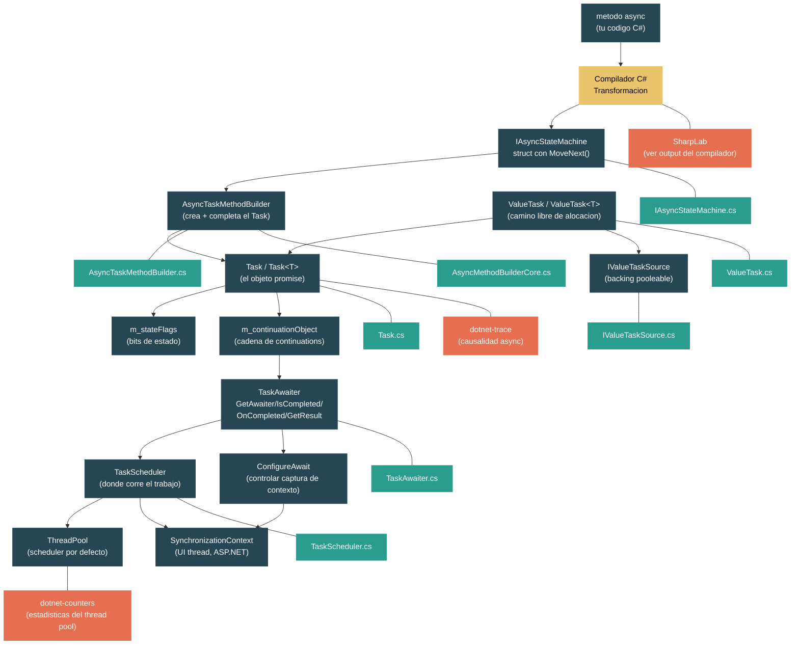

# Nivel 2: Practitioner -- Async/Await y la Maquinaria de Task

> **Perfil objetivo:** Desarrollador que usa async/await a diario pero no entiende la transformacion del compilador ni los internos de Task
> **Esfuerzo estimado:** 6 horas
> **Prerrequisitos:** [Modulo 2.1 -- Generics](02-practitioner-generics.md), [Nivel 1](01-foundations-ecosystem-overview.md)
> [English version](../en/02-practitioner-async-await.md)

---

## Objetivos de Aprendizaje

Al finalizar este modulo vas a poder:

1. Explicar como el compilador de C# transforma un metodo `async` en un struct que implementa `IAsyncStateMachine`, con un metodo `MoveNext()` y un campo `<>1__state`.
2. Describir el ciclo de vida de un objeto `Task`: sus flags de estado (`m_stateFlags`), su objeto de continuation (`m_continuationObject`), y sus `ContingentProperties`.
3. Trazar el patron awaiter -- `GetAwaiter()`, `IsCompleted`, `OnCompleted()`, `GetResult()` -- y explicar que pasa en cada keyword `await`.
4. Explicar como `TaskScheduler` y `SynchronizationContext` determinan donde corre una continuation, y por que `ConfigureAwait(false)` importa en codigo de librerias.
5. Describir cuando `Task` aloca en el heap y como `ValueTask` e `IValueTaskSource` evitan esa alocacion.
6. Identificar trampas comunes: `async void`, deadlocks por `.Result`/`.Wait()`, riesgos de fire-and-forget, y doble-await en `ValueTask`.

---

## Mapa Conceptual



---

## Curriculum

### Leccion 1 -- Que le Hace `async` a Tu Metodo

#### Que vas a aprender

La keyword `async` no hace que tu metodo corra en otro thread. Es una senal para el compilador de que debe reescribir tu metodo como una state machine. En esta leccion vas a ver exactamente que genera el compilador.

#### El concepto

Cuando escribis:

```csharp
public async Task<string> FetchDataAsync(string url)
{
    var client = new HttpClient();
    string html = await client.GetStringAsync(url);
    return html.ToUpper();
}
```

El compilador transforma esto en algo conceptualmente equivalente a:

```csharp
// El compilador genera un struct (en builds de release) implementando IAsyncStateMachine
[CompilerGenerated]
private struct <FetchDataAsync>d__0 : IAsyncStateMachine
{
    // Campo de estado: -1 = no iniciado, 0 = esperando primer await, -2 = completado
    public int <>1__state;

    // El builder que crea y completa el Task<string>
    public AsyncTaskMethodBuilder<string> <>t__builder;

    // Los parametros del metodo se convierten en campos (deben sobrevivir entre awaits)
    public string url;

    // Las variables locales que viven a traves de un await se convierten en campos
    private HttpClient <client>5__1;
    private string <html>5__2;

    // El awaiter para la operacion pendiente
    private TaskAwaiter<string> <>u__1;

    public void MoveNext()
    {
        int num = <>1__state;
        string result;
        try
        {
            TaskAwaiter<string> awaiter;
            if (num != 0)
            {
                // Primera entrada: el estado era -1
                <client>5__1 = new HttpClient();
                awaiter = <client>5__1.GetStringAsync(url).GetAwaiter();

                if (!awaiter.IsCompleted)
                {
                    // La operacion no termino todavia -- suspender
                    <>1__state = 0;
                    <>u__1 = awaiter;
                    <>t__builder.AwaitUnsafeOnCompleted(ref awaiter, ref this);
                    return; // <-- el metodo retorna aca, el Task no esta completo todavia
                }
            }
            else
            {
                // Reanudando despues del await
                awaiter = <>u__1;
                <>u__1 = default;
                <>1__state = -1;
            }

            // awaiter.GetResult() retorna el valor o lanza la excepcion
            <html>5__2 = awaiter.GetResult();
            result = <html>5__2.ToUpper();
        }
        catch (Exception ex)
        {
            <>1__state = -2;
            <>t__builder.SetException(ex);
            return;
        }

        <>1__state = -2;
        <>t__builder.SetResult(result);
    }

    void IAsyncStateMachine.SetStateMachine(IAsyncStateMachine stateMachine)
    {
        <>t__builder.SetStateMachine(stateMachine);
    }
}
```

Y el metodo original se convierte en un stub:

```csharp
public Task<string> FetchDataAsync(string url)
{
    var stateMachine = new <FetchDataAsync>d__0();
    stateMachine.url = url;
    stateMachine.<>t__builder = AsyncTaskMethodBuilder<string>.Create();
    stateMachine.<>1__state = -1;
    stateMachine.<>t__builder.Start(ref stateMachine);
    return stateMachine.<>t__builder.Task;
}
```

Observaciones clave:

1. **La state machine es un struct** (en builds de release). Esto evita una alocacion en el heap cuando el metodo se completa sincronicamente.
2. **Los parametros y variables locales que cruzan un `await` se convierten en campos** del struct. Los locales que no cruzan un boundary de `await` siguen siendo locales dentro de `MoveNext()`.
3. **El campo `<>1__state`** rastrea en que `await` esta el metodo. El valor `-1` significa "ejecutando", `0, 1, 2...` corresponden a puntos de await especificos, y `-2` significa completado.
4. **`MoveNext()` se llama una vez para la invocacion inicial**, y despues una vez mas cada vez que una operacion pendiente se completa.
5. **El metodo retorna al caller en el primer `await` incompleto**. El Task se retorna inmediatamente pero todavia no esta completado.

#### En el codigo fuente

La interfaz `IAsyncStateMachine` que el compilador usa como target esta definida en `src/libraries/System.Private.CoreLib/src/System/Runtime/CompilerServices/IAsyncStateMachine.cs`:

```csharp
public interface IAsyncStateMachine
{
    /// <summary>Moves the state machine to its next state.</summary>
    void MoveNext();
    /// <summary>Configures the state machine with a heap-allocated replica.</summary>
    void SetStateMachine(IAsyncStateMachine stateMachine);
}
```

Solo dos metodos. `MoveNext()` es el corazon de cada metodo async -- contiene toda tu logica original, reestructurada como state machine. `SetStateMachine` es un metodo legacy de antes de la optimizacion actual de evitar boxing (el comentario en el codigo fuente dice *"SetStateMachine should not be used"*).

La llamada inicial pasa por `AsyncMethodBuilderCore.Start()` en `src/libraries/System.Private.CoreLib/src/System/Runtime/CompilerServices/AsyncMethodBuilderCore.cs`:

```csharp
public static void Start<TStateMachine>(ref TStateMachine stateMachine)
    where TStateMachine : IAsyncStateMachine
{
    Thread currentThread = Thread.CurrentThread;
    ExecutionContext? previousExecutionCtx = currentThread._executionContext;
    SynchronizationContext? previousSyncCtx = currentThread._synchronizationContext;

    try
    {
        stateMachine.MoveNext();
    }
    finally
    {
        // Restaurar contextos para que no se filtren fuera del primer await
        if (previousSyncCtx != currentThread._synchronizationContext)
            currentThread._synchronizationContext = previousSyncCtx;

        ExecutionContext? currentExecutionCtx = currentThread._executionContext;
        if (previousExecutionCtx != currentExecutionCtx)
            ExecutionContext.RestoreChangedContextToThread(currentThread, previousExecutionCtx, currentExecutionCtx);
    }
}
```

Nota: `Start()` guarda y restaura tanto `ExecutionContext` como `SynchronizationContext`. Esto previene que cualquier cambio de contexto dentro de la primera porcion sincronica de tu metodo async se filtre al caller.

#### Ejercicio practico

1. Anda a [SharpLab](https://sharplab.io/) y pega:
   ```csharp
   using System.Threading.Tasks;

   public class Example
   {
       public async Task<int> AddAsync(int a, int b)
       {
           await Task.Delay(100);
           return a + b;
       }
   }
   ```
   Cambia el output a "C#" (lowered) para ver la state machine generada. Identifica el campo `<>1__state`, el metodo `MoveNext()`, y el campo awaiter.

2. Agrega un segundo `await` y observa como la state machine gana otro valor de estado y otro campo awaiter.

3. Cambia el metodo para que retorne sincronicamente (`return a + b;` sin ningun `await`). Observa que el compilador igual genera una state machine, pero el builder usa `Task.FromResult` (via `SetResult`) sin nunca suspender.

#### Conclusion clave

`async` es una feature del compilador, no del runtime. El compilador reescribe tu metodo en un struct state machine que implementa `IAsyncStateMachine`. El runtime provee `AsyncTaskMethodBuilder` y `TaskAwaiter` para manejar esta state machine. Entender esta transformacion es la clave para entender todo lo demas sobre async en .NET.

#### Concepto erroneo comun

> *"`async` hace que mi metodo corra en un thread de background."*
>
> No. La keyword `async` solo habilita la keyword `await` dentro del metodo. El metodo empieza a correr sincronicamente en el thread del caller. Solo cede el control (retorna) cuando encuentra un `await` sobre una operacion que todavia no esta completada. Si la operacion esperada ya termino (ej: `Task.FromResult`), no hay suspension en absoluto.

---

### Leccion 2 -- Task: Mas Que una Promesa

#### Que vas a aprender

`Task` es la representacion del runtime de una operacion asincronica. No es una simple promesa -- lleva flags de estado, una cadena de continuations, almacenamiento de excepciones, y soporte para cancelacion. En esta leccion vas a explorar su estructura interna.

#### El concepto

Un objeto `Task` tiene tres piezas centrales de estado:

| Campo | Tipo | Proposito |
|---|---|---|
| `m_stateFlags` | `volatile int` | Estado empaquetado en bits: started, completed, faulted, canceled, waiting for children, etc. |
| `m_continuationObject` | `volatile object?` | Puede ser null, una sola `Action`, una lista de continuations, o un sentinel de completion. |
| `m_contingentProperties` | `ContingentProperties?` | Alocado lazily: contiene `ExecutionContext`, `CancellationToken`, holder de excepciones, task padre, y evento de completion. |

El campo `m_stateFlags` empaqueta multiples cosas en un solo `int`:

```
Bits 0-15:   TaskCreationOptions (flags publicas)
Bits 16-30:  Flags de estado internas
```

Flags de estado clave de `Task.cs`:

```csharp
internal enum TaskStateFlags
{
    Started                  = 0x10000,
    DelegateInvoked          = 0x20000,
    Disposed                 = 0x40000,
    ExceptionObservedByParent= 0x80000,
    CancellationAcknowledged = 0x100000,
    Faulted                  = 0x200000,
    Canceled                 = 0x400000,
    WaitingOnChildren        = 0x800000,
    RanToCompletion          = 0x1000000,
    WaitingForActivation     = 0x2000000,
    CompletionReserved       = 0x4000000,
    CompletedMask = Canceled | Faulted | RanToCompletion,
}
```

Estas flags se mapean al enum `TaskStatus` que ves cuando llamas a `task.Status`:

| Status | Significado |
|---|---|
| `Created` | El Task existe pero no fue programado |
| `WaitingForActivation` | El Task esta esperando ser activado (comun para Tasks de async/await) |
| `WaitingToRun` | Programado pero todavia no corriendo |
| `Running` | Ejecutandose actualmente |
| `WaitingForChildrenToComplete` | Termino de ejecutar, esperando tasks hijos adjuntos |
| `RanToCompletion` | Completado exitosamente |
| `Canceled` | Reconocio cancelacion |
| `Faulted` | Completado con una excepcion no manejada |

El mecanismo de continuation es como `await` conecta las cosas. Cuando un Task no esta completo y algo llama `OnCompleted`, la continuation (una `Action` o una state machine box) se almacena en `m_continuationObject`. Cuando el Task se completa, dispara todas las continuations registradas. El comentario en el codigo fuente es revelador:

```csharp
// Can be null, a single continuation, a list of continuations, or s_taskCompletionSentinel,
// in that order. The logic around this object assumes it will never regress to a previous state.
private volatile object? m_continuationObject;
```

La clase `ContingentProperties` es una optimizacion de espacio. La mayoria de los Tasks se completan exitosamente sin necesitar tokens de cancelacion, almacenamiento de excepciones, o relaciones de padre. Al alocar `ContingentProperties` lazily solo cuando se necesita, el caso comun mantiene el objeto Task pequeno.

#### En el codigo fuente

Abri `src/libraries/System.Private.CoreLib/src/System/Threading/Tasks/Task.cs` y mira las declaraciones de campos:

```csharp
public class Task : IAsyncResult, IDisposable
{
    [ThreadStatic]
    internal static Task? t_currentTask;  // El task ejecutandose actualmente

    private static int s_taskIdCounter;

    private int m_taskId;
    internal Delegate? m_action;
    private protected object? m_stateObject;
    internal TaskScheduler? m_taskScheduler;
    internal volatile int m_stateFlags;

    private volatile object? m_continuationObject;
}
```

Nota que `m_action` almacena el delegado -- pero para Tasks de async state machine, este campo se reutiliza. La clase `AsyncStateMachineBox<TStateMachine>` (que ES un `Task<TResult>`) usa `m_action` para cachear el delegado `MoveNextAction`, y `m_stateObject` para almacenar el `ExecutionContext`.

Este es un insight critico de diseno: **el `AsyncStateMachineBox` ES el Task**. La state machine box hereda de `Task<TResult>`, asi que la box sirve tanto como contenedor de state machine como la promesa que los callers esperan con await. No hay una alocacion separada de Task -- son el mismo objeto.

De `AsyncTaskMethodBuilderT.cs`:

```csharp
private class AsyncStateMachineBox<TStateMachine> :
    Task<TResult>, IAsyncStateMachineBox
    where TStateMachine : IAsyncStateMachine
{
    public TStateMachine? StateMachine;

    public ref ExecutionContext? Context
    {
        get => ref Unsafe.As<object?, ExecutionContext?>(ref m_stateObject);
    }
}
```

#### Ejercicio practico

1. Inspeccionando transiciones de estado de Task:
   ```csharp
   var tcs = new TaskCompletionSource<int>();
   Task<int> task = tcs.Task;

   Console.WriteLine(task.Status); // WaitingForActivation

   tcs.SetResult(42);
   Console.WriteLine(task.Status); // RanToCompletion
   Console.WriteLine(task.Result); // 42
   ```

2. Ver la cadena de continuations en accion:
   ```csharp
   var tcs = new TaskCompletionSource<int>();
   Task<int> task = tcs.Task;

   // Registrar tres continuations
   task.ContinueWith(t => Console.WriteLine($"A: {t.Result}"));
   task.ContinueWith(t => Console.WriteLine($"B: {t.Result}"));
   task.ContinueWith(t => Console.WriteLine($"C: {t.Result}"));

   tcs.SetResult(42); // Las tres se disparan
   ```

3. Observar el comportamiento de excepciones:
   ```csharp
   async Task FailAsync()
   {
       await Task.Delay(10);
       throw new InvalidOperationException("Boom");
   }

   Task t = FailAsync();
   try { await t; }
   catch (InvalidOperationException ex)
   {
       Console.WriteLine(t.Status);                  // Faulted
       Console.WriteLine(t.Exception!.InnerException!.Message); // "Boom"
   }
   ```

#### Conclusion clave

Un `Task` es un objeto rico con flags de estado empaquetadas en bits, una cadena de continuations, y propiedades alocadas lazily para excepciones y cancelacion. Para metodos async, el `AsyncStateMachineBox` ES el Task mismo -- la state machine y la promesa son el mismo objeto en el heap. Asi es como el runtime evita una alocacion extra por operacion async.

#### Concepto erroneo comun

> *"Cada metodo `async` aloca un Task en el heap."*
>
> No siempre. Si el metodo se completa sincronicamente (ningun `await` suspende realmente), el builder puede retornar un Task cacheado. Para `Task` (no-generico), se retorna un singleton `s_cachedCompleted`. Para `Task<bool>`, existen Tasks cacheados de True y False. Para `Task<int>`, resultados de enteros pequenos pueden estar cacheados. La alocacion solo ocurre cuando el metodo verdaderamente se suspende.

---

### Leccion 3 -- El Patron Awaiter

#### Que vas a aprender

`await` no esta limitado a `Task`. Podes hacer `await` a cualquier tipo que siga el patron awaiter. En esta leccion vas a ver que llama realmente el compilador, y como `TaskAwaiter` implementa este contrato.

#### El concepto

Cuando el compilador ve `await someExpression`, genera codigo equivalente a:

```csharp
var awaiter = someExpression.GetAwaiter();

if (!awaiter.IsCompleted)
{
    // Suspender: registrar continuation y retornar
    <>1__state = N;
    <>u__N = awaiter;
    <>t__builder.AwaitUnsafeOnCompleted(ref awaiter, ref this);
    return;
}

// Reanudar (o nunca se suspendio): obtener el resultado
var result = awaiter.GetResult();
```

El patron awaiter requiere tres miembros:

| Miembro | Proposito |
|---|---|
| `bool IsCompleted { get; }` | Verificar si la operacion ya termino (fast path -- no se necesita suspension) |
| `void OnCompleted(Action continuation)` | Registrar un callback para invocar cuando la operacion se complete (de `INotifyCompletion`) |
| `TResult GetResult()` | Obtener el resultado o lanzar la excepcion almacenada |

Hay dos interfaces de notificacion:

- `INotifyCompletion` -- tiene `OnCompleted(Action)` que fluye el `ExecutionContext`
- `ICriticalNotifyCompletion` -- tiene `UnsafeOnCompleted(Action)` que NO fluye el `ExecutionContext` (el builder lo maneja por separado para eficiencia)

`TaskAwaiter` implementa ambas. El compilador prefiere `UnsafeOnCompleted` porque el builder tiene su propia logica de captura de `ExecutionContext`.

#### En el codigo fuente

Abri `src/libraries/System.Private.CoreLib/src/System/Runtime/CompilerServices/TaskAwaiter.cs`:

```csharp
public readonly struct TaskAwaiter : ICriticalNotifyCompletion, ITaskAwaiter
{
    internal readonly Task m_task;

    public bool IsCompleted => m_task.IsCompleted;

    public void OnCompleted(Action continuation)
    {
        OnCompletedInternal(m_task, continuation,
            continueOnCapturedContext: true, flowExecutionContext: true);
    }

    public void UnsafeOnCompleted(Action continuation)
    {
        OnCompletedInternal(m_task, continuation,
            continueOnCapturedContext: true, flowExecutionContext: false);
    }

    public void GetResult()
    {
        ValidateEnd(m_task);
    }
}
```

Observaciones clave:

1. `TaskAwaiter` es un `readonly struct` -- no hay alocacion en el heap para el awaiter en si.
2. `IsCompleted` delega directamente a `Task.IsCompleted`.
3. Tanto `OnCompleted` como `UnsafeOnCompleted` llaman al mismo metodo interno, pero con diferentes flags para el flujo de `ExecutionContext`.
4. `GetResult()` llama a `ValidateEnd` que lanza la excepcion almacenada si el Task fallo o fue cancelado. Para un Task exitoso, es un no-op (el `TaskAwaiter` no-generico no tiene valor de retorno).

El parametro `continueOnCapturedContext: true` es el comportamiento por defecto -- significa "reanudar en el `SynchronizationContext` original si se capturo uno". Esto es lo que `ConfigureAwait(false)` cambia.

Nota como el metodo `AwaitUnsafeOnCompleted` del builder tiene deteccion de fast-path para tipos de awaiter conocidos:

```csharp
// De AsyncTaskMethodBuilderT.cs
if ((null != (object?)default(TAwaiter)) && (awaiter is ITaskAwaiter))
{
    // Fast path para TaskAwaiter -- evitar dispatch virtual
    ref TaskAwaiter ta = ref Unsafe.As<TAwaiter, TaskAwaiter>(ref awaiter);
    TaskAwaiter.UnsafeOnCompletedInternal(ta.m_task, box, continueOnCapturedContext: true);
}
```

El builder usa `Unsafe.As` para reinterpretar el awaiter y llama a un metodo interno directamente, evitando el dispatch de interfaz. Esta es una micro-optimizacion que importa para el hot path de metodos async.

#### Ejercicio practico

1. Crea un tipo awaitable personalizado:
   ```csharp
   public struct DelayAwaitable
   {
       private readonly int _milliseconds;
       public DelayAwaitable(int ms) => _milliseconds = ms;

       public DelayAwaiter GetAwaiter() => new DelayAwaiter(_milliseconds);
   }

   public struct DelayAwaiter : INotifyCompletion
   {
       private readonly int _milliseconds;
       public DelayAwaiter(int ms) => _milliseconds = ms;

       public bool IsCompleted => _milliseconds <= 0;

       public void OnCompleted(Action continuation)
       {
           Task.Delay(_milliseconds).ContinueWith(_ => continuation());
       }

       public void GetResult() { } // retorno void
   }

   // Uso:
   await new DelayAwaitable(1000);
   Console.WriteLine("Listo!");
   ```

2. Verifica el fast path con [SharpLab](https://sharplab.io/). Escribi un metodo async simple que espere `Task.CompletedTask` y observa que `IsCompleted` retorna `true` y no hay suspension -- todo el metodo corre sincronicamente.

3. Intenta hacer await de algo que no es un Task:
   ```csharp
   // TimeSpan se puede hacer awaitable con un metodo de extension
   public static TaskAwaiter GetAwaiter(this TimeSpan timeSpan)
       => Task.Delay(timeSpan).GetAwaiter();

   await TimeSpan.FromSeconds(1); // Ahora esto compila y funciona!
   ```

#### Conclusion clave

`await` esta basado en patrones: llama a `GetAwaiter()`, verifica `IsCompleted`, y obtiene el resultado inmediatamente o registra una continuation via `OnCompleted`/`UnsafeOnCompleted`. `TaskAwaiter` es la implementacion mas comun, pero cualquier tipo que siga el patron puede ser awaited. El builder contiene fast paths optimizados para los tipos de awaiter comunes.

---

### Leccion 4 -- TaskScheduler, SynchronizationContext, y ConfigureAwait

#### Que vas a aprender

Cuando un `await` se suspende y despues la operacion se completa, algo tiene que decidir *donde* corre la continuation. Ese "algo" es la combinacion de `SynchronizationContext` y `TaskScheduler`. Esta leccion explica como funcionan y por que `ConfigureAwait(false)` es importante.

#### El concepto

Hay dos mecanismos de contexto:

**SynchronizationContext** es una clase que representa un "thread o entorno destino" para postear trabajo. Implementaciones importantes:

| Implementacion | Donde | Proposito |
|---|---|---|
| `null` (default) | Apps de consola, ASP.NET Core | Sin contexto especial -- las continuations corren en el thread pool |
| `DispatcherSynchronizationContext` | WPF | Postea trabajo al dispatcher thread de la UI |
| `WindowsFormsSynchronizationContext` | WinForms | Postea trabajo al message loop de la UI |

**TaskScheduler** es una clase abstracta que encola y ejecuta objetos `Task`. El `TaskScheduler.Default` usa el thread pool.

Cuando `await` captura contexto, esto es lo que pasa:

1. Antes de suspender, la infraestructura verifica `SynchronizationContext.Current`.
2. Si existe un `SynchronizationContext` no-null, la continuation se postea a el via `SynchronizationContext.Post()`.
3. Si no hay `SynchronizationContext`, la continuation busca un `TaskScheduler` no-default.
4. Si no existe ninguno, la continuation corre directamente en el thread que completo la operacion esperada (tipicamente un thread del thread pool).

**`ConfigureAwait(false)`** le dice al awaiter: "No necesito reanudar en el contexto capturado." Esto pone `continueOnCapturedContext` en `false`, lo que salta el paso 2 de arriba.

Por que importa:

```csharp
// En un handler de click de boton de WPF:
private async void Button_Click(object sender, RoutedEventArgs e)
{
    // Corriendo en el UI thread. SynchronizationContext.Current es DispatcherSynchronizationContext.

    string data = await httpClient.GetStringAsync(url);
    // Todavia en el UI thread -- la continuation fue posteada de vuelta al dispatcher.

    TextBlock.Text = data; // Seguro tocar elementos de UI.
}
```

Pero en codigo de libreria:

```csharp
// En un metodo de libreria -- no sabes que SynchronizationContext tiene el caller.
public async Task<string> GetDataAsync(string url)
{
    string raw = await httpClient.GetStringAsync(url).ConfigureAwait(false);
    // Corre en cualquier thread que haya completado el request HTTP (thread pool).
    // NO postea de vuelta al SynchronizationContext del caller.

    return ProcessData(raw);
}
```

Usar `ConfigureAwait(false)` en codigo de libreria es importante por dos razones:
1. **Rendimiento** -- evita cambios de contexto innecesarios (postear al UI thread y volver).
2. **Prevencion de deadlocks** -- si un caller hace `.Result` en un `SynchronizationContext` single-threaded, y tu libreria espera sin `ConfigureAwait(false)`, la continuation intenta postear de vuelta al thread bloqueado, causando un deadlock.

#### En el codigo fuente

Abri `src/libraries/System.Private.CoreLib/src/System/Threading/Tasks/TaskScheduler.cs`:

```csharp
public abstract class TaskScheduler
{
    protected internal abstract void QueueTask(Task task);

    protected abstract bool TryExecuteTaskInline(Task task, bool taskWasPreviouslyQueued);

    protected abstract IEnumerable<Task>? GetScheduledTasks();

    public static TaskScheduler Default => ThreadPoolTaskScheduler.s_instance;
}
```

La abstraccion clave es `QueueTask` -- asi es como un Task se envla para ejecucion. La implementacion `ThreadPoolTaskScheduler` llama a `ThreadPool.UnsafeQueueUserWorkItem`, que es como las continuations async terminan corriendo en threads del thread pool.

El comportamiento de `ConfigureAwait` se conecta a traves del flag `continueOnCapturedContext`. Mira `TaskAwaiter.OnCompletedInternal`:

```csharp
internal static void OnCompletedInternal(Task task, Action continuation,
    bool continueOnCapturedContext, bool flowExecutionContext)
```

Cuando `continueOnCapturedContext` es `true`, el metodo captura `SynchronizationContext.Current` y envuelve la continuation en un callback que postea a ese contexto. Cuando es `false`, salta la captura por completo.

El `AsyncVoidMethodBuilder` en `src/libraries/System.Private.CoreLib/src/System/Runtime/CompilerServices/AsyncVoidMethodBuilder.cs` muestra otra interaccion con el contexto:

```csharp
public static AsyncVoidMethodBuilder Create()
{
    SynchronizationContext? sc = SynchronizationContext.Current;
    sc?.OperationStarted();
    return new AsyncVoidMethodBuilder() { _synchronizationContext = sc };
}
```

Nota: los metodos `async void` llaman a `OperationStarted()` en el `SynchronizationContext` al momento de creacion y `OperationCompleted()` cuando terminan. Asi es como ASP.NET (clasico, no Core) rastreaba operaciones async pendientes. Tambien es por que `async void` interactua diferente con el manejo de errores -- las excepciones se postean al `SynchronizationContext` en vez de almacenarse en un Task.

#### Ejercicio practico

1. Observar la captura de contexto en una app de consola:
   ```csharp
   Console.WriteLine($"Antes del await: Thread {Environment.CurrentManagedThreadId}");
   await Task.Delay(100);
   Console.WriteLine($"Despues del await: Thread {Environment.CurrentManagedThreadId}");
   // En una app de consola (sin SynchronizationContext), probablemente sean threads diferentes.
   ```

2. Demostrar el escenario de deadlock (conceptual -- NO hagas esto en produccion):
   ```csharp
   // Imagina que esto corre en un UI thread con SynchronizationContext:
   // string result = GetDataAsync().Result; // DEADLOCK!
   //
   // La llamada a .Result bloquea el UI thread.
   // GetStringAsync se completa en un thread del thread pool.
   // La continuation del await quiere postear de vuelta al UI thread.
   // El UI thread esta bloqueado por .Result, asi que la continuation no puede correr.
   // El Task nunca se completa porque la continuation nunca corre.
   //
   // Solucion: usar await (no bloquear), o usar ConfigureAwait(false) dentro de GetDataAsync.
   ```

3. Verificar `SynchronizationContext.Current` en diferentes tipos de app:
   ```csharp
   // En una app de consola:
   Console.WriteLine(SynchronizationContext.Current is null); // True

   // En un handler de WPF: SynchronizationContext.Current es DispatcherSynchronizationContext
   // En ASP.NET Core: SynchronizationContext.Current es null (por diseno!)
   ```

#### Conclusion clave

`SynchronizationContext` determina donde se reanudan las continuations de `await`. En apps de UI, es el UI thread. En ASP.NET Core, no hay `SynchronizationContext` (por diseno, para rendimiento). El codigo de libreria deberia usar `ConfigureAwait(false)` para evitar capturar un contexto que no necesita. Entender este mecanismo es esencial para prevenir deadlocks y escribir codigo async eficiente.

---

### Leccion 5 -- ValueTask: Evitando Alocaciones

#### Que vas a aprender

Cada vez que un metodo async se suspende, aloca un `AsyncStateMachineBox` en el heap (que ES el `Task`). Cuando los metodos frecuentemente se completan sincronicamente, esta alocacion es un desperdicio. `ValueTask` y `ValueTask<T>` resuelven este problema. En esta leccion vas a entender cuando y por que usarlos.

#### El concepto

`ValueTask<T>` es un `readonly struct` que puede representar:

1. **Un valor `TResult` directamente** -- sin ninguna alocacion en el heap. Para completion sincronica.
2. **Un `Task<TResult>`** -- cae al respaldo estandar de alocacion de Task.
3. **Un `IValueTaskSource<TResult>`** -- un objeto backing pooleable y reutilizable.

El struct tiene estos campos:

```csharp
public readonly struct ValueTask<TResult> : IEquatable<ValueTask<TResult>>
{
    internal readonly object? _obj;    // null, Task<T>, o IValueTaskSource<T>
    internal readonly TResult? _result; // el resultado sincrono (cuando _obj es null)
    internal readonly short _token;     // token opaco para IValueTaskSource
    internal readonly bool _continueOnCapturedContext;
}
```

El insight clave es la union discriminada almacenada en `_obj`:
- Si `_obj` es `null`: el resultado esta en `_result` -- **cero alocaciones**.
- Si `_obj` es un `Task<T>`: comportamiento estandar respaldado por Task.
- Si `_obj` es un `IValueTaskSource<T>`: objeto backing pooled que puede ser reutilizado.

**Cuando usar `ValueTask<T>`:**

| Escenario | Usar `Task<T>` | Usar `ValueTask<T>` |
|---|---|---|
| El metodo usualmente completa asincronicamente | Preferido | Cualquiera funciona |
| El metodo frecuentemente completa sincronicamente | Desperdicio (aloca Task) | Preferido (cero aloc) |
| El resultado sera cacheado o awaited multiples veces | Requerido | No permitido |
| Usado con `Task.WhenAll` / `Task.WhenAny` | Requerido | Hay que llamar `.AsTask()` primero |

**`IValueTaskSource<T>`** es la interfaz de backing avanzada:

```csharp
public interface IValueTaskSource<out TResult>
{
    ValueTaskSourceStatus GetStatus(short token);
    void OnCompleted(Action<object?> continuation, object? state, short token,
        ValueTaskSourceOnCompletedFlags flags);
    TResult GetResult(short token);
}
```

El parametro `token` previene el mal uso: cada operacion obtiene un token unico. Si intentas usar un `ValueTask` viejo despues de que el backing source fue reciclado, la discrepancia de token causa una excepcion. Asi es como `Socket`, `Pipe`, y otros tipos de I/O de alto rendimiento poolean sus operaciones async sin alocar un nuevo Task por llamada.

#### En el codigo fuente

Abri `src/libraries/System.Private.CoreLib/src/System/Threading/Tasks/ValueTask.cs`:

```csharp
[AsyncMethodBuilder(typeof(AsyncValueTaskMethodBuilder))]
[StructLayout(LayoutKind.Auto)]
public readonly struct ValueTask : IEquatable<ValueTask>
{
    internal readonly object? _obj;
    internal readonly short _token;
    internal readonly bool _continueOnCapturedContext;
}
```

El atributo `[AsyncMethodBuilder]` le dice al compilador que use `AsyncValueTaskMethodBuilder` en vez de `AsyncTaskMethodBuilder` cuando el tipo de retorno del metodo es `ValueTask`. Este builder puede retornar el struct directamente desde un pool en vez de alocar un nuevo Task.

El comentario de type safety al inicio de `ValueTask.cs` vale la pena leerlo:

> *"This code uses Unsafe.As to cast _obj. This is done in order to minimize the costs associated with casting _obj to a variety of different types [...] we can rely only on the _obj field to determine how to handle it."*

Esto significa que `ValueTask` usa un unico campo `object?` como union discriminada, con el tipo real determinado por verificaciones de tipo en runtime. Esto evita el costo de un campo discriminador separado y problemas potenciales de tearing en escenarios concurrentes.

La interfaz `IValueTaskSource` en `src/libraries/System.Private.CoreLib/src/System/Threading/Tasks/Sources/IValueTaskSource.cs` define las tres operaciones necesarias para un backing pooleable: `GetStatus`, `OnCompleted`, y `GetResult`.

#### Ejercicio practico

1. Comparar alocaciones con BenchmarkDotNet (conceptualmente):
   ```csharp
   // Version Task<int> -- aloca en cada llamada
   public async Task<int> GetValueTaskBased()
   {
       if (_cache is not null) return _cache.Value; // Igual aloca Task!
       return await ComputeAsync();
   }

   // Version ValueTask<int> -- sin alocacion para el caso cacheado
   public async ValueTask<int> GetValueValueTaskBased()
   {
       if (_cache is not null) return _cache.Value; // Retorna struct, sin aloc!
       return await ComputeAsync();
   }
   ```

2. Demostrar la regla de "no hacer await dos veces":
   ```csharp
   ValueTask<int> vt = GetValueAsync();
   int result1 = await vt;  // OK
   // int result2 = await vt; // MAL! Comportamiento indefinido.
   // El IValueTaskSource backing puede haber sido reciclado.
   ```

3. Convertir `ValueTask` a `Task` cuando necesitas features de Task:
   ```csharp
   ValueTask<int> vt = GetValueAsync();
   Task<int> task = vt.AsTask(); // Ahora podes cachearlo, usar WhenAll, etc.
   ```

#### Conclusion clave

`ValueTask<T>` es un struct que evita alocaciones en el heap cuando los metodos async se completan sincronicamente. Usa una union discriminada (campo `_obj`) para contener un resultado directo, un `Task<T>`, o un `IValueTaskSource<T>` pooleable. Usalo cuando los metodos frecuentemente completan sincronicamente. No caches, no hagas await dos veces, y no uses combinadores directamente sobre un `ValueTask` -- convertilo a `Task` primero con `.AsTask()` si lo necesitas.

---

### Leccion 6 -- Trampas Comunes

#### Que vas a aprender

Async/await tiene bordes filosos que atrapan incluso a desarrolladores experimentados. Esta leccion cubre las trampas mas importantes: `async void`, deadlocks por bloqueo sincrono, riesgos de fire-and-forget, y mal uso de `ValueTask`.

#### Trampa 1: `async void`

Los metodos `async void` son peligrosos porque:

1. **Las excepciones no pueden ser atrapadas por el caller.** Una excepcion no manejada en un metodo `async void` se postea al `SynchronizationContext` (o se lanza en el thread pool como excepcion no observada), lo que tipicamente crashea la aplicacion.
2. **El caller no tiene forma de saber cuando el metodo se completa.** No hay Task para hacer await.
3. **Testear es dificil.** No podes hacer await del metodo en un test.

```csharp
// MAL -- la excepcion va a crashear la app
async void ProcessData()
{
    var data = await FetchAsync();
    Process(data); // Si esto lanza, game over
}

// BIEN -- la excepcion se captura en el Task
async Task ProcessDataAsync()
{
    var data = await FetchAsync();
    Process(data); // La excepcion puede ser atrapada por el caller via await
}
```

El UNICO caso de uso valido para `async void` son los event handlers en frameworks de UI (WPF, WinForms), porque los event handlers deben retornar `void`.

Mirando el codigo fuente, `AsyncVoidMethodBuilder.Create()` captura el `SynchronizationContext` actual y llama a `OperationStarted()`. Cuando el metodo falla, postea la excepcion a ese contexto:

```csharp
// En AsyncVoidMethodBuilder:
public void SetException(Exception exception)
{
    if (_synchronizationContext != null)
    {
        // Postear la excepcion al SynchronizationContext
        // Esto tipicamente crashea la aplicacion
    }
}
```

#### Trampa 2: Deadlocks por `.Result` y `.Wait()`

Este es el deadlock clasico de async:

```csharp
// En un thread con SynchronizationContext single-threaded (ej: UI thread de WPF):
public void ButtonClick()
{
    string result = GetDataAsync().Result; // DEADLOCK
}

private async Task<string> GetDataAsync()
{
    string data = await httpClient.GetStringAsync(url); // Quiere reanudar en el UI thread
    return data.ToUpper();
}
```

El deadlock pasa porque:
1. `.Result` bloquea el UI thread, esperando a que el Task se complete.
2. `GetStringAsync` se completa en un thread del thread pool.
3. La continuation del `await` intenta postear de vuelta al UI thread (porque no se uso `ConfigureAwait(false)`).
4. El UI thread esta bloqueado por `.Result`, asi que la continuation no puede correr.
5. El Task nunca se completa porque la continuation nunca corre.

Soluciones:
- **Siempre `await`, nunca `.Result`** en contextos async.
- Usar `ConfigureAwait(false)` en codigo de libreria.
- En ASP.NET Core no hay `SynchronizationContext`, asi que este deadlock especifico no ocurre -- pero bloquear threads del thread pool sigue siendo danino.

#### Trampa 3: Fire-and-forget

```csharp
// PELIGROSO -- la excepcion se traga silenciosamente
_ = DoWorkAsync(); // fire-and-forget

// La excepcion de DoWorkAsync no tiene a donde ir.
// Se convierte en una excepcion de Task no observada.
```

Si realmente necesitas fire-and-forget, al menos observa la excepcion:

```csharp
_ = DoWorkAsync().ContinueWith(t =>
{
    if (t.IsFaulted)
        logger.LogError(t.Exception, "El trabajo en background fallo");
}, TaskContinuationOptions.OnlyOnFaulted);
```

O crea un helper:

```csharp
public static async void SafeFireAndForget(this Task task, Action<Exception>? onError = null)
{
    try { await task.ConfigureAwait(false); }
    catch (Exception ex) { onError?.Invoke(ex); }
}
```

#### Trampa 4: Doble-await de un `ValueTask`

```csharp
ValueTask<int> vt = GetValueAsync();
int a = await vt;
int b = await vt; // COMPORTAMIENTO INDEFINIDO

// El objeto backing IValueTaskSource puede haber sido reciclado.
// Podrias obtener un resultado equivocado, una excepcion, o un hang.
```

Regla: un `ValueTask` debe ser consumido exactamente una vez. O haces `await`, o llamas `.AsTask()`, o llamas `.Result` (solo si `IsCompleted` es true). Nunca hagas mas de uno de estos.

#### Trampa 5: Wrapping innecesario de `async`/`await`

```csharp
// INNECESARIO -- agrega overhead de state machine sin beneficio
public async Task<int> GetValueAsync()
{
    return await _innerService.GetValueAsync();
}

// MEJOR -- simplemente retornar el Task directamente (sin state machine)
public Task<int> GetValueAsync()
{
    return _innerService.GetValueAsync();
}
```

Pero ten cuidado: si hay un bloque `using` o `try/catch`, DEBES mantener `async`/`await` para asegurar el disposal correcto de recursos y el manejo de excepciones.

```csharp
// ACA SI hay que mantener async para disposal correcto
public async Task<int> GetValueAsync()
{
    await using var connection = await CreateConnectionAsync();
    return await connection.QueryAsync();
}
```

#### Ejercicio practico

1. Crea un metodo `async void` que lance una excepcion y observa el comportamiento en una app de consola (la app crashea o ves un evento de excepcion no observada).

2. Escribi un test demostrando que las versiones con `Task` manejan excepciones correctamente mientras que las versiones `async void` no:
   ```csharp
   async Task ThrowsAsync()
   {
       await Task.Delay(10);
       throw new Exception("test");
   }

   // Podes atrapar esto:
   try { await ThrowsAsync(); }
   catch (Exception ex) { Console.WriteLine($"Atrapada: {ex.Message}"); }
   ```

3. Verifica si elidir async/await cambia los stack traces de excepciones -- usa [SharpLab](https://sharplab.io/) para comparar el codigo generado para ambos patrones.

#### Conclusion clave

Evita `async void` excepto para event handlers. Nunca bloquees codigo async con `.Result` o `.Wait()` en threads con `SynchronizationContext`. Siempre observa excepciones de Tasks fire-and-forget. Consume `ValueTask` exactamente una vez. Elidi `async`/`await` solo para metodos simples de pass-through sin manejo de recursos.

---

## Guia de Lectura de Codigo Fuente

Estos son los archivos clave para este modulo. Las calificaciones de dificultad reflejan la complejidad conceptual para un lector de Nivel 2.

| # | Archivo | Dificultad | Que buscar |
|---|---|---|---|
| 1 | `src/libraries/System.Private.CoreLib/src/System/Runtime/CompilerServices/IAsyncStateMachine.cs` | Una estrella | La interfaz de dos metodos: `MoveNext()` y `SetStateMachine()`. |
| 2 | `src/libraries/System.Private.CoreLib/src/System/Runtime/CompilerServices/AsyncTaskMethodBuilder.cs` | Dos estrellas | `Start()` delegando a `AsyncMethodBuilderCore`, `SetResult()` usando `s_cachedCompleted`, propiedad `Task` con init lazy. |
| 3 | `src/libraries/System.Private.CoreLib/src/System/Runtime/CompilerServices/AsyncTaskMethodBuilderT.cs` | Tres estrellas | Metodo `GetStateMachineBox()` mostrando como la struct state machine se boxea en el heap. `AsyncStateMachineBox<TStateMachine>` heredando de `Task<TResult>`. |
| 4 | `src/libraries/System.Private.CoreLib/src/System/Runtime/CompilerServices/AsyncMethodBuilderCore.cs` | Dos estrellas | `Start()` guardando/restaurando `ExecutionContext` y `SynchronizationContext`. |
| 5 | `src/libraries/System.Private.CoreLib/src/System/Threading/Tasks/Task.cs` (primeras 300 lineas) | Dos estrellas | Enum `TaskStatus`, bit flags `TaskStateFlags`, campo `m_continuationObject`, clase `ContingentProperties`. |
| 6 | `src/libraries/System.Private.CoreLib/src/System/Runtime/CompilerServices/TaskAwaiter.cs` | Dos estrellas | `IsCompleted`, `OnCompleted`, `UnsafeOnCompleted`, `GetResult`, `ValidateEnd`. |
| 7 | `src/libraries/System.Private.CoreLib/src/System/Threading/Tasks/ValueTask.cs` | Dos estrellas | El campo de union discriminada `_obj`, `AsTask()`, el comentario de type safety. |
| 8 | `src/libraries/System.Private.CoreLib/src/System/Threading/Tasks/Sources/IValueTaskSource.cs` | Una estrella | La interfaz de tres metodos con parametros `token` para seguridad de pooling. |
| 9 | `src/libraries/System.Private.CoreLib/src/System/Threading/Tasks/TaskScheduler.cs` | Una estrella | `QueueTask()`, `TryExecuteTaskInline()`, propiedad `Default`. |
| 10 | `src/libraries/System.Private.CoreLib/src/System/Runtime/CompilerServices/AsyncVoidMethodBuilder.cs` | Dos estrellas | `Create()` capturando `SynchronizationContext` y llamando a `OperationStarted()`. |

**Estrategia de lectura**: Empeza con los archivos 1 y 8 (una estrella) -- son interfaces cortas que establecen los contratos. Despues lee los archivos 2 y 4 para entender el pipeline del builder. Lee el archivo 5 para los internos de Task, despues el archivo 6 para ver como el awaiter se conecta al Task. El archivo 3 es el mas complejo -- dejalo para cuando entiendas el flujo general. Los archivos 7, 9 y 10 completan las imagenes de ValueTask y scheduling.

---

## Herramientas Diagnosticas y Comandos

| Herramienta / Tecnica | Que muestra | Como usar |
|---|---|---|
| [SharpLab](https://sharplab.io/) | La state machine generada por el compilador para cualquier metodo async | Pega tu codigo async, selecciona output "C#" para ver el codigo lowered, o "IL" para las instrucciones crudas. |
| `dotnet-counters` | Metricas del thread pool: longitud de cola, cantidad de threads, work items/seg | `dotnet-counters monitor --counters System.Runtime --process-id <pid>` |
| `dotnet-trace` | Cadena de causalidad async, eventos TPL | `dotnet-trace collect --providers System.Threading.Tasks.TplEventSource` |
| `DOTNET_JitDisasm` | Assembly generado por el JIT para metodos async | `DOTNET_JitDisasm="*MoveNext" dotnet run` |
| Visual Studio Parallel Stacks (Tasks) | Visualizar Tasks pendientes y sus continuations | Debug > Windows > Tasks (o Parallel Stacks) |
| Propiedad `Task.Status` | Etapa actual del ciclo de vida de un Task | Observar en debugger o loguear: `Console.WriteLine(task.Status)` |
| `SynchronizationContext.Current` | Si se esta capturando un contexto | `Console.WriteLine(SynchronizationContext.Current?.GetType().Name ?? "null")` |
| BenchmarkDotNet | Medir diferencia de alocacion entre Task y ValueTask | Usar `[MemoryDiagnoser]` para ver alocaciones en heap por operacion |

---

## Autoevaluacion

Proba tu comprension con estas preguntas. Intenta responderlas antes de mirar las pistas.

### Preguntas

1. **Cuales son los tres campos minimos que tiene el struct state machine generado por el compilador?** Que almacena cada uno?

2. **Cuando un metodo async se completa sincronicamente (sin suspension real), se aloca un Task en el heap?** Que optimizacion evita esto?

3. **Cuales son los tres miembros del patron awaiter?** Cual verifica el compilador primero antes de decidir si suspender?

4. **Tenes un metodo de libreria que llama a `await httpClient.GetStringAsync(url)`. Deberias usar `ConfigureAwait(false)`?** Por que si o por que no?

5. **Un `ValueTask<T>` tiene un campo `_obj` de tipo `object?`. Que tres cosas puede contener este campo?** Que significa cuando es `null`?

6. **Por que `async void` causa que las excepciones no manejadas crasheen la aplicacion?** Que hace `AsyncVoidMethodBuilder` diferente de `AsyncTaskMethodBuilder`?

### Desafio Practico

Escribi un metodo async con dos expresiones `await`. Usa [SharpLab](https://sharplab.io/) para ver el output de C# lowered. Despues anota el codigo generado, identificando:

1. El struct de state machine y su campo de estado
2. Los dos campos awaiter
3. Las transiciones de estado (-1, 0, 1, -2)
4. Donde `MoveNext()` retorna (puntos de suspension)
5. Donde se llama a `SetResult` (completion)

Despues modifica el metodo para usar `ConfigureAwait(false)` en uno de los awaits, y observa como cambia el codigo lowered (el tipo de awaiter cambia de `TaskAwaiter` a `ConfiguredTaskAwaitable.ConfiguredTaskAwaiter`).

<details>
<summary>Pista</summary>

```csharp
public async Task<string> TwoAwaitsAsync()
{
    string first = await GetFirstAsync();           // estado 0
    string second = await GetSecondAsync(first);    // estado 1
    return first + second;                          // despues SetResult
}
```

En el codigo lowered, busca `<>1__state = 0` y `<>1__state = 1` -- estos corresponden a los dos puntos de suspension.
</details>

---

## Conexiones

| Direccion | Modulo | Relacion |
|---|---|---|
| **Anterior** | [2.2 -- Collections Deep Dive](02-practitioner-collections.md) | Las colecciones frecuentemente retornan async enumerables; entender la maquinaria de Task te ayuda a entender `IAsyncEnumerable<T>`. |
| **Prerrequisito** | [2.1 -- Generics](02-practitioner-generics.md) | `Task<T>`, `ValueTask<T>`, y `AsyncTaskMethodBuilder<T>` son todos tipos genericos. Entender la especializacion generica explica por que el runtime genera codigo eficiente para cada `TResult`. |
| **Siguiente** | [2.4 -- Dependency Injection](02-practitioner-dependency-injection.md) | Los contenedores de DI resuelven servicios que frecuentemente retornan Tasks; entender lifetimes async ayuda a gestionar servicios scoped correctamente. |
| **Relacionado** | [1.4 -- Control Flow y Excepciones](01-foundations-control-flow.md) | El manejo de excepciones en metodos async se construye sobre los fundamentos de call stack del Nivel 1. El try/catch de la state machine en `MoveNext()` es como se capturan las excepciones async. |
| **Mas profundo** | [3.4 -- Threading Primitives y Sincronizacion](03-advanced-threading.md) | Profundiza en `SynchronizationContext`, `SemaphoreSlim.WaitAsync()`, e internos del thread pool. |
| **Mas profundo** | [4.7 -- Internos del Thread Pool](04-internals-threadpool.md) | Explica como el thread pool manejado decide las cantidades de threads y procesa work items. |

---

## Glosario

| Termino | Definicion |
|---|---|
| **State machine** | Un struct generado por el compilador que implementa `IAsyncStateMachine`. Contiene la logica de tu metodo async, reescrita como un metodo `MoveNext()` con un campo de estado que rastrea en que `await` esta el metodo actualmente. |
| **`IAsyncStateMachine`** | La interfaz que todas las state machines async generadas por el compilador implementan. Tiene dos metodos: `MoveNext()` y `SetStateMachine()`. |
| **`AsyncTaskMethodBuilder`** | Un struct usado por el compilador para crear el `Task` que un metodo async retorna, y para manejar la state machine. Se encarga de boxear la state machine en un `AsyncStateMachineBox` en la primera suspension. |
| **`AsyncStateMachineBox`** | Una clase interna que hereda de `Task<TResult>` y contiene la state machine, el execution context, y el delegado `MoveNext`. ES el objeto Task que los callers esperan con await. |
| **Awaiter** | Un struct que implementa el patron awaiter: `IsCompleted`, `OnCompleted(Action)`, y `GetResult()`. `TaskAwaiter` es la implementacion mas comun. |
| **`INotifyCompletion`** | Interfaz con `OnCompleted(Action)` que fluye el `ExecutionContext`. Requerida para el patron awaiter. |
| **`ICriticalNotifyCompletion`** | Extiende `INotifyCompletion` con `UnsafeOnCompleted(Action)` que NO fluye el `ExecutionContext`. Usada por el builder para eficiencia. |
| **Continuation** | El codigo que corre despues de que un `await` se completa. Se almacena en `Task.m_continuationObject` como una `Action`, una state machine box, o una lista de continuations. |
| **`SynchronizationContext`** | Una abstraccion para postear trabajo a un thread o entorno especifico. Los frameworks de UI proveen implementaciones que postean al UI thread. `null` en apps de consola y ASP.NET Core. |
| **`TaskScheduler`** | Una clase abstracta que encola y ejecuta Tasks. `TaskScheduler.Default` usa el thread pool. Schedulers personalizados pueden limitar concurrencia o apuntar a threads especificos. |
| **`ConfigureAwait(false)`** | Le dice al awaiter que NO capture ni reanude en el `SynchronizationContext` actual. Importante en codigo de libreria para evitar deadlocks y cambios de contexto innecesarios. |
| **`ValueTask<T>`** | Un `readonly struct` que puede representar un resultado sincrono (sin alocacion), un `Task<T>`, o un `IValueTaskSource<T>`. Usado para evitar alocaciones cuando los metodos frecuentemente completan sincronicamente. |
| **`IValueTaskSource<T>`** | Una interfaz para objetos backing de operaciones async pooleables. Usa un parametro `token` para detectar mal uso de objetos reciclados. |
| **`ExecutionContext`** | Captura estado ambient (ej: valores de `AsyncLocal<T>`) y lo fluye a traves de operaciones async. Restaurado por `AsyncMethodBuilderCore.Start()` despues de la primera fase sincronica. |
| **`async void`** | Un metodo async que retorna `void` en vez de `Task`. Las excepciones se postean al `SynchronizationContext` y no pueden ser atrapadas por el caller. Solo apropiado para event handlers. |
| **Task completion sentinel** | Un objeto interno (`s_taskCompletionSentinel`) almacenado en `m_continuationObject` para indicar que un Task se ha completado y no se deben registrar mas continuations. |

---

## Referencias

| Recurso | Tipo | Relevancia |
|---|---|---|
| [Stephen Toub -- How Async/Await Really Works in C#](https://devblogs.microsoft.com/dotnet/how-async-await-really-works/) | Blog post | El deep-dive definitivo sobre la transformacion del compilador y la maquinaria del runtime. Cubre todo lo de este modulo y mas. |
| [Stephen Toub -- Understanding the Whys, Whats, and Whens of ValueTask](https://devblogs.microsoft.com/dotnet/understanding-the-whys-whats-and-whens-of-valuetask/) | Blog post | Guia detallada sobre cuando usar ValueTask vs Task. |
| [David Fowler -- Async Guidance](https://github.com/davidfowl/AspNetCoreDiagnosticScenarios/blob/master/AsyncGuidanceDotNet.md) | Guia | Trampas y patrones practicos de async para ASP.NET Core. |
| [ConfigureAwait FAQ -- Stephen Toub](https://devblogs.microsoft.com/dotnet/configureawait-faq/) | Blog post | Todo lo que necesitas saber sobre ConfigureAwait. |
| [SharpLab](https://sharplab.io/) | Herramienta | Ver la state machine generada por el compilador para cualquier metodo async. |
| [.NET Source Browser -- Task.cs](https://source.dot.net/#System.Private.CoreLib/src/System/Threading/Tasks/Task.cs) | Codigo fuente | Version navegable e indexada del codigo fuente de Task. |
| [.NET Source Browser -- AsyncTaskMethodBuilder.cs](https://source.dot.net/#System.Private.CoreLib/src/System/Runtime/CompilerServices/AsyncTaskMethodBuilder.cs) | Codigo fuente | El builder que crea Tasks para metodos async. |
| [Performance Improvements in .NET (serie anual) -- Stephen Toub](https://devblogs.microsoft.com/dotnet/) | Blog posts | El post de cada ano incluye optimizaciones de async/Task con links al codigo fuente. |
| [Pro .NET Memory Management -- Konrad Kokosa](https://prodotnetmemory.com/) | Libro | Capitulo sobre alocaciones async y como minimizarlas. |

---

*Proximo modulo: [2.4 -- Dependency Injection: De Patron a Framework](02-practitioner-dependency-injection.md)*
