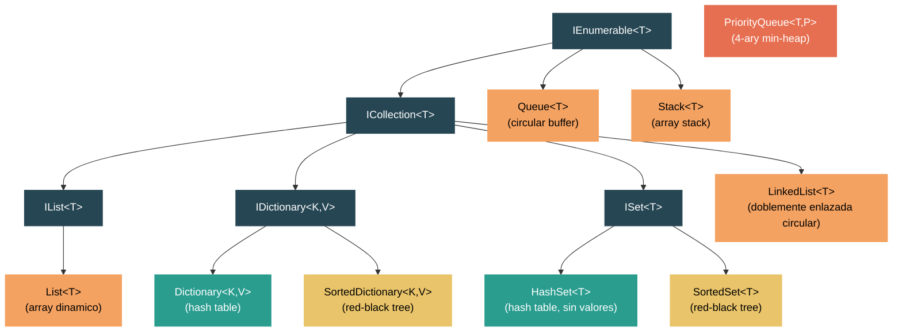

# Nivel 2: Practicante — Colecciones a Fondo

> **Perfil objetivo:** Desarrollador que usa colecciones a diario pero no conoce las estructuras de datos internas que las impulsan
> **Esfuerzo estimado:** 5 horas
> **Prerrequisitos:** [Modulo 2.1 — Generics](02-practitioner-generics.md)
> [English version](../en/02-practitioner-collections.md)

---

## Objetivos de Aprendizaje

Al finalizar este modulo vas a poder:

1. Explicar como `List<T>` usa un array interno y duplica su capacidad al crecer, logrando `Add` amortizado O(1).
2. Describir el diseno de doble array de `Dictionary<TKey, TValue>` (`_buckets` + `_entries`) y como funciona el collision chaining a traves del campo `next`.
3. Trazar una busqueda hash-based desde el computo del hash code, pasando por el indice del bucket, hasta el recorrido de la cadena de entries.
4. Comparar colecciones hash-based (`HashSet<T>`) con colecciones tree-based (`SortedSet<T>`) en terminos de garantias de orden y Big-O.
5. Explicar como `Queue<T>` implementa un circular buffer usando punteros `_head` y `_tail` dentro de un array plano.
6. Describir como `Stack<T>` usa un array simple con un puntero `_size`, y por que `Push` es amortizado O(1) mientras que `Pop` siempre es O(1).
7. Explicar la estructura de min-heap cuaternario (4-ary) que impulsa `PriorityQueue<TElement, TPriority>`.
8. Elegir la coleccion correcta para un escenario dado basandote en la complejidad de las operaciones, necesidades de orden y trade-offs de memoria.
9. Usar BenchmarkDotNet para verificar empiricamente las afirmaciones de rendimiento de las colecciones.

---

## Mapa Conceptual



---

## Curriculum

### Leccion 1 — List&lt;T&gt;: El Array Dinamico

#### Que vas a aprender

`List<T>` es la coleccion de trabajo pesado en .NET. Por debajo no es mas que un array managed (`T[]`) que crece cuando se queda sin espacio. Entender cuando y como crece es la clave para escribir codigo performante.

#### La estructura de datos

Abri `src/libraries/System.Private.CoreLib/src/System/Collections/Generic/List.cs`. Los campos centrales son:

```csharp
internal T[] _items;   // el array interno
internal int _size;    // cantidad de elementos realmente almacenados
internal int _version; // contador de mutaciones para seguridad del enumerador
```

`Capacity` es simplemente `_items.Length`. `Count` es `_size`. La diferencia entre ambos es espacio pre-alocado pero no utilizado.

#### Como funciona Add

El metodo `Add` (linea 196) es enganosamente simple:

```csharp
public void Add(T item)
{
    _version++;
    T[] array = _items;
    int size = _size;
    if ((uint)size < (uint)array.Length)
    {
        _size = size + 1;
        array[size] = item;
    }
    else
    {
        AddWithResize(item);
    }
}
```

El fast path — cuando hay espacio — es un store en el array con bounds check: **O(1)**. El slow path llama a `AddWithResize`, que a su vez llama a `Grow`.

#### La estrategia de crecimiento

`GetNewCapacity` (linea 488) implementa la estrategia de duplicacion:

```csharp
int newCapacity = _items.Length == 0 ? DefaultCapacity : 2 * _items.Length;
```

- **DefaultCapacity** es 4. Una lista vacia no aloca nada (`s_emptyArray`); el primer `Add` aloca un array de 4 elementos.
- Despues de eso, la capacidad se duplica: 4 -> 8 -> 16 -> 32 -> ...
- El tope es `Array.MaxLength` (~2 mil millones de elementos).

**Analisis amortizado:** Como cada resize copia todos los elementos existentes, un solo `Add` puede ser O(n). Pero como cada resize duplica el espacio, a lo largo de n inserciones el trabajo total de copia es n + n/2 + n/4 + ... = O(n). Dividiendo por n nos da **amortizado O(1)** por `Add`.

#### Insert es O(n)

`Insert(int index, T item)` (linea 770) tiene que desplazar elementos para hacer lugar:

```csharp
Array.Copy(_items, index, _items, index + 1, _size - index);
```

Esto siempre es O(n - index). Insertar al principio es O(n); agregar al final es O(1) — por eso `Add` existe como un fast path separado.

#### Tip de rendimiento

Si conoces el tamano final de antemano, pasalo al constructor:

```csharp
var list = new List<string>(expectedCount); // evita todos los resizes
```

#### Ejercicio de lectura de codigo fuente

1. Abri `List.cs` y busca el metodo `GrowForInsertion`. Como evita un `Array.Copy` extra comparado con un resize-y-luego-shift naive?
2. Mira el indexer (`this[int index]`). Nota el truco `(uint)index >= (uint)_size` — por que castear a `uint` elimina un range check?

---

### Leccion 2 — Dictionary&lt;TKey, TValue&gt;: Hash Tables en la Practica

#### Que vas a aprender

`Dictionary<TKey, TValue>` es la coleccion mas critica en terminos de rendimiento del BCL. Usa una hash table con chaining, pero la implementacion esta ingeniosamente empaquetada en dos arrays planos en vez de usar nodos de linked list en el heap.

#### La estructura de datos

Abri `src/libraries/System.Private.CoreLib/src/System/Collections/Generic/Dictionary.cs`. Los campos clave:

```csharp
private int[]? _buckets;       // indice hacia _entries; los valores son 1-based
private Entry[]? _entries;      // array plano de todas las entries
private int _count;             // proximo slot disponible en _entries
private int _freeList;          // cabeza de la free list (reutilizar slots eliminados)
private int _freeCount;         // cantidad de slots libres
```

El struct `Entry` (linea 1861) empaqueta todo de forma compacta:

```csharp
private struct Entry
{
    public uint hashCode;
    public int next;        // proxima entry en la cadena de colision (-1 = fin)
    public TKey key;
    public TValue value;
}
```

#### Como funciona una busqueda

Cuando llamas a `dictionary[key]`, el runtime:

1. **Computa el hash code:** `(uint)comparer.GetHashCode(key)` (o `key.GetHashCode()` para value types sin comparer custom).
2. **Encuentra el bucket:** `GetBucket(hashCode)` retorna `ref _buckets[hashCode % _buckets.Length]`. El valor en `_buckets` es 1-based (0 significa vacio).
3. **Recorre la cadena:** Empezando en `_buckets[bucket] - 1`, sigue `entries[i].next` hasta encontrar un `hashCode` que coincida Y `Equals` retorne true, o llegar a -1 (no encontrado).

Esto es **O(1) promedio**, O(n) peor caso (todas las claves hashean al mismo bucket).

#### Manejo de colisiones

Las colisiones se resuelven por chaining dentro del array `_entries`. Cuando una nueva entry colisiona con una existente:

```csharp
entry.next = bucket - 1;   // apunta a la vieja cabeza de la cadena
bucket = index + 1;         // esta entry se convierte en la nueva cabeza
```

Esto significa que la cadena de cada bucket es una singly linked list embebida en el array `_entries` — sin alocaciones de heap separadas para los nodos.

#### Resize y load factor

Cuando `_count == _entries.Length`, se llama a `Resize()` (linea 1246):

```csharp
private void Resize() => Resize(HashHelpers.ExpandPrime(_count), false);
```

El nuevo tamano es el siguiente numero primo mayor que `2 * _count`. Usar tamanos primos reduce el clustering. Todas las entries se rehashean a los nuevos buckets.

En plataformas de 64 bits, el runtime usa una multiplicacion rapida para modulo (`_fastModMultiplier`) para evitar divisiones costosas.

#### Optimizacion para claves string

Para `Dictionary<string, V>`, el runtime empieza con un `NonRandomizedStringEqualityComparer` por rendimiento. Si ocurren demasiadas colisiones (detectado por `collisionCount > HashHelpers.HashCollisionThreshold`), automaticamente cambia a un comparer randomizado para defenderse contra ataques de hash-flooding:

```csharp
if (collisionCount > HashHelpers.HashCollisionThreshold && comparer is NonRandomizedStringEqualityComparer)
{
    Resize(entries.Length, true); // rehash con comparer randomizado
}
```

#### Ejercicio de lectura de codigo fuente

1. En `TryInsert`, traza que pasa cuando `_freeCount > 0`. Como se reciclan los slots eliminados? (Pista: mira como `_freeList` y `StartOfFreeList` interactuan con el campo `next`.)
2. Busca `Initialize(int capacity)` — por que llama a `HashHelpers.GetPrime(capacity)` en vez de usar la capacidad directamente?

---

### Leccion 3 — HashSet&lt;T&gt; y SortedSet&lt;T&gt;: Sets de Dos Maneras

#### Que vas a aprender

.NET ofrece dos implementaciones de `ISet<T>`: `HashSet<T>` (hash-based, sin orden) y `SortedSet<T>` (tree-based, ordenado). Entender sus internos te ayuda a elegir el correcto.

#### HashSet&lt;T&gt; — el diccionario sin valores

Abri `src/libraries/System.Private.CoreLib/src/System/Collections/Generic/HashSet.cs`. El comentario en la linea 19 lo dice todo:

> "This uses the same array-based implementation as Dictionary<TKey, TValue>."

Los campos son casi identicos a los de `Dictionary`:

```csharp
private int[]? _buckets;
private Entry[]? _entries;
private int _count;
private int _freeList;
private int _freeCount;
```

El struct `Entry` es el mismo pero sin campo `value` — solo `hashCode`, `next` y el elemento. Toda la misma logica de bucket-indexing, chaining y resize aplica.

| Operacion | Promedio | Peor caso |
|---|---|---|
| `Add` | O(1) | O(n) |
| `Contains` | O(1) | O(n) |
| `Remove` | O(1) | O(n) |
| `UnionWith` | O(n + m) | O(n * m) |
| `IntersectWith` | O(n) | O(n * m) |

#### SortedSet&lt;T&gt; — el red-black tree

Abri `src/libraries/System.Collections/src/System/Collections/Generic/SortedSet.cs`. El comentario del header explica la estructura:

> "A binary search tree is a red-black tree if it satisfies the following red-black properties..."

Los campos centrales son:

```csharp
private Node? root;
private IComparer<T> comparer;
private int count;
```

Cada `Node` tiene referencias `left`, `right`, `parent` mas un `NodeColor` (Red o Black). Los invariantes red-black garantizan que la altura del arbol siempre es O(log n).

El metodo `AddIfNotPresent` (linea 303) recorre el arbol top-down, partiendo 4-nodes de forma proactiva (un arbol 2-3-4 top-down codificado como un BST red-black). Esto asegura que la insercion y el rebalanceo ocurran en una sola pasada.

| Operacion | Promedio | Peor caso |
|---|---|---|
| `Add` | O(log n) | O(log n) |
| `Contains` | O(log n) | O(log n) |
| `Remove` | O(log n) | O(log n) |
| `Min` / `Max` | O(log n) | O(log n) |
| Recorrido in-order | O(n) | O(n) |

#### Cuando elegir cual

| Criterio | HashSet&lt;T&gt; | SortedSet&lt;T&gt; |
|---|---|---|
| Necesitas elementos ordenados? | No | Si |
| Necesitas `Min`/`Max`? | No (scan O(n)) | Si (O(log n)) |
| Necesitas consultas por rango (`GetViewBetween`)? | No | Si |
| Te importa el peor caso por operacion? | No (amortizado O(1) esta bien) | Si (O(log n) garantizado) |
| Memoria por elemento | Menor (array plano) | Mayor (objetos nodo en el heap) |

#### Ejercicio de lectura de codigo fuente

1. En `SortedSet.cs`, busca la propiedad `Is4Node` en `Node`. Como detecta el arbol un 4-node (ambos hijos rojos)?
2. En `HashSet.cs`, mira `ShrinkThreshold` (establecido en 3). Cuando llama el constructor a `TrimExcess`, y por que?

---

### Leccion 4 — Queue&lt;T&gt; y Stack&lt;T&gt;: Simples pero Sutiles

#### Que vas a aprender

`Queue<T>` y `Stack<T>` son estructuralmente simples, pero sus implementaciones revelan micro-optimizaciones ingeniosas. `Queue<T>` usa un circular buffer; `Stack<T>` usa un array plano.

#### Queue&lt;T&gt; — el circular buffer

Abri `src/libraries/System.Private.CoreLib/src/System/Collections/Generic/Queue.cs`. Los campos internos:

```csharp
private T[] _array;
private int _head;   // indice desde donde hacer dequeue
private int _tail;   // indice donde hacer enqueue
private int _size;   // cantidad de elementos
```

El array se trata como un anillo: despues del ultimo slot, los indices vuelven a 0. El metodo `MoveNext` (linea 334) maneja esto:

```csharp
private void MoveNext(ref int index)
{
    int tmp = index + 1;
    if (tmp == _array.Length)
    {
        tmp = 0;
    }
    index = tmp;
}
```

El comentario en el fuente explica por que usa un `if` en vez de `%` (modulo): el branch se toma raramente y el JIT produce mejor codigo que con una operacion de resto.

**Enqueue** (linea 167): Escribe en `_array[_tail]`, luego avanza `_tail`. Si el array esta lleno, `Grow` realoca y linealiza los datos circulares via `SetCapacity`.

**Dequeue** (linea 194): Lee de `_array[_head]`, limpia el slot (para el GC si es reference type), luego avanza `_head`. O(1) siempre.

**Crecimiento**: Estrategia de duplicacion similar a `List<T>`, con un crecimiento minimo de 4. La parte critica es `SetCapacity` (linea 310), que tiene que manejar el wrap-around al copiar:

```csharp
if (_head < _tail)
{
    Array.Copy(_array, _head, newarray, 0, _size);
}
else
{
    Array.Copy(_array, _head, newarray, 0, _array.Length - _head);
    Array.Copy(_array, 0, newarray, _array.Length - _head, _tail);
}
```

| Operacion | Complejidad |
|---|---|
| `Enqueue` | Amortizado O(1) |
| `Dequeue` | O(1) |
| `Peek` | O(1) |
| `Contains` | O(n) |

#### Stack&lt;T&gt; — el array stack

Abri `src/libraries/System.Collections/src/System/Collections/Generic/Stack.cs`. Todavia mas simple:

```csharp
private T[] _array;
private int _size;   // funciona tambien como puntero al "tope del stack"
```

**Push** (linea 266): Escribe en `_array[_size]` e incrementa `_size`. Si esta lleno, llama a `PushWithResize` -> `Grow`, que duplica el array via `Array.Resize`.

**Pop** (linea 221): Decrementa `_size`, lee el elemento, limpia el slot. Nota el truco del bounds check:

```csharp
int size = _size - 1;
if ((uint)size >= (uint)array.Length)
{
    ThrowForEmptyStack();
}
```

Al castear a `uint`, un `size` negativo (de un stack vacio) se convierte en un numero positivo enorme que falla el length check — una sola comparacion en vez de dos.

| Operacion | Complejidad |
|---|---|
| `Push` | Amortizado O(1) |
| `Pop` | O(1) |
| `Peek` | O(1) |
| `Contains` | O(n) |

#### Ejercicio de lectura de codigo fuente

1. En `Queue.cs`, busca el metodo `Clear`. Por que necesita dos llamadas a `Array.Clear` cuando `_head >= _tail`?
2. En `Stack.cs`, compara `Contains` (usa `Array.LastIndexOf`) con como esperarias que funcione una busqueda lineal. Por que buscar desde el tope hacia abajo?

---

### Leccion 5 — PriorityQueue&lt;TElement, TPriority&gt;: El Binary Heap

#### Que vas a aprender

`PriorityQueue<TElement, TPriority>` es una de las colecciones mas nuevas de .NET (introducida en .NET 6). Implementa una cola de prioridad minima respaldada por un heap cuaternario (4-ary) almacenado en un array plano.

#### La estructura de datos

Abri `src/libraries/System.Collections/src/System/Collections/Generic/PriorityQueue.cs`. Los campos clave:

```csharp
private (TElement Element, TPriority Priority)[] _nodes;
private int _size;
private const int Arity = 4;
private const int Log2Arity = 2;
```

Esto **no** es un binary heap — es un 4-ary heap. Cada nodo tiene hasta 4 hijos en vez de 2. Las relaciones padre-hijo se computan con bit shifts:

```csharp
private static int GetParentIndex(int index) => (index - 1) >> Log2Arity;       // (i-1) / 4
private static int GetFirstChildIndex(int index) => (index << Log2Arity) + 1;   // i*4 + 1
```

Por que 4-ary en vez de binario? Un 4-ary heap tiene un arbol mas bajo (log_4(n) niveles vs log_2(n)), lo que reduce la cantidad de comparaciones durante `MoveUp` (sift-up). El trade-off es que `MoveDown` (sift-down) tiene que comparar hasta 4 hijos por nivel, pero la localidad de cache del array plano suele compensar.

#### Como funciona Enqueue

`Enqueue` (linea 193) coloca el nuevo elemento conceptualmente al final del array, luego lo sube (sift-up):

```csharp
public void Enqueue(TElement element, TPriority priority)
{
    int currentSize = _size;
    _version++;
    if (_nodes.Length == currentSize)
    {
        Grow(currentSize + 1);
    }
    _size = currentSize + 1;
    MoveUpDefaultComparer((element, priority), currentSize);
}
```

`MoveUpDefaultComparer` (linea 716) camina desde el nuevo nodo hacia la raiz, desplazando padres hacia abajo hasta restaurar la propiedad del heap:

```csharp
while (nodeIndex > 0)
{
    int parentIndex = GetParentIndex(nodeIndex);
    if (Comparer<TPriority>.Default.Compare(node.Priority, parent.Priority) < 0)
    {
        nodes[nodeIndex] = parent;  // desplaza padre hacia abajo
        nodeIndex = parentIndex;
    }
    else break;
}
nodes[nodeIndex] = node;  // coloca el nodo en su posicion final
```

Esto es una optimizacion estilo insertion sort: en vez de hacer swap en cada nivel, desplaza padres hacia abajo y escribe el nuevo nodo una sola vez en la posicion final.

#### Como funciona Dequeue

`Dequeue` (linea 239) retorna `_nodes[0]` (el minimo), luego llama a `RemoveRootNode` que toma el ultimo elemento y lo baja desde la raiz via `MoveDownDefaultComparer` (linea 781). El sift-down encuentra el hijo minimo entre hasta 4 hijos en cada nivel.

#### Complejidad

| Operacion | Complejidad |
|---|---|
| `Enqueue` | O(log_4 n) amortizado (el array puede crecer) |
| `Dequeue` | O(4 * log_4 n) = O(log n) |
| `Peek` | O(1) |
| `EnqueueDequeue` | O(log n) — un solo sift-down |

La estrategia de `Grow` (linea 624) usa un factor de 2 con un crecimiento minimo de 4, igual que `Queue<T>`.

#### Heapify: construccion masiva

Al construir desde una coleccion, `PriorityQueue` usa el clasico algoritmo de construccion de heap de Floyd (el metodo `Heapify`): empieza desde el ultimo padre y baja (sift-down) cada nodo. Esto es O(n), mas rapido que encolar n elementos uno por uno (que seria O(n log n)).

#### Ejercicio de lectura de codigo fuente

1. Busca `DequeueEnqueue` (linea 263). Por que es mas eficiente que llamar a `Dequeue()` seguido de `Enqueue()`? (Pista: evita un sift-up completo.)
2. En `Grow`, por que el factor de crecimiento es 2 con un minimo de 4, en vez de la duplicacion pura de `List<T>`?

---

### Leccion 6 — Eligiendo la Coleccion Correcta

#### Que vas a aprender

No hay una sola coleccion "mejor". La eleccion correcta depende de que operaciones dominan tu workload. Esta leccion te da un framework de decision.

#### Matriz de decision

| Necesidad | Mejor coleccion | Por que |
|---|---|---|
| Acceso indexado por posicion | `List<T>` | O(1) random access via indice de array |
| Busqueda clave-valor | `Dictionary<K,V>` | O(1) promedio, lookup hash-based |
| Elementos unicos, sin orden | `HashSet<T>` | O(1) add/contains/remove |
| Elementos unicos, ordenados | `SortedSet<T>` | O(log n) con iteracion in-order |
| Procesamiento FIFO | `Queue<T>` | O(1) enqueue/dequeue |
| Procesamiento LIFO (undo, DFS) | `Stack<T>` | O(1) push/pop |
| Procesar por prioridad | `PriorityQueue<T,P>` | O(log n) enqueue/dequeue |
| Insert/remove frecuente en posiciones arbitrarias | `LinkedList<T>` | O(1) insert/remove *dada una referencia al nodo* |
| Pares clave-valor ordenados | `SortedDictionary<K,V>` | O(log n) operaciones, iteracion in-order |

#### Errores comunes

**1. Usar `List<T>` como cola (eliminando del indice 0):**
Cada `RemoveAt(0)` desplaza todo el array — O(n). Usa `Queue<T>` en su lugar.

**2. Usar `Dictionary<K,V>` cuando necesitas orden:**
Los diccionarios no preservan el orden de insercion (las entries pueden reciclarse desde la free list). Usa `SortedDictionary<K,V>` o mantene una `List<T>` separada de claves.

**3. Usar `LinkedList<T>` para "mejor rendimiento":**
`LinkedList<T>` solo gana cuando tenes una referencia directa a `LinkedListNode<T>` y necesitas O(1) insert/remove en esa posicion. Para workloads intensivos en iteracion, el pointer-chasing y la pobre localidad de cache de una linked list van a ser mas lentos que `List<T>`, incluso con shifts O(n).

**4. No pre-dimensionar colecciones:**
Todas las colecciones respaldadas por arrays (`List<T>`, `Dictionary<K,V>`, `HashSet<T>`, `Queue<T>`, `Stack<T>`, `PriorityQueue<T,P>`) aceptan una capacidad inicial. Si sabes el tamano aproximado, pasalo para evitar copias de resize.

#### El caso especial de LinkedList&lt;T&gt;

Abri `src/libraries/System.Collections/src/System/Collections/Generic/LinkedList.cs`. Es una **lista doblemente enlazada circular**:

```csharp
internal LinkedListNode<T>? head;
```

`Last` es simplemente `head?.prev` — como es circular, el nodo antes de `head` es el tail. Las operaciones de insercion (`InternalInsertNodeBefore`, linea 377) son manipulaciones de punteros O(1):

```csharp
newNode.next = node;
newNode.prev = node.prev;
node.prev!.next = newNode;
node.prev = newNode;
```

Pero `Find` es O(n) — tenes que recorrer desde `head` para localizar un nodo. Por eso `LinkedList<T>` raramente es la mejor opcion: para obtener su beneficio de O(1) en insercion, ya tenes que tener la referencia al nodo.

#### Comparacion de overhead de memoria

| Coleccion | Overhead por elemento |
|---|---|
| `List<T>` | ~0 bytes (solo slots de array, algo de capacidad desperdiciada) |
| `Dictionary<K,V>` | ~16-20 bytes (struct Entry: hashCode + next + key + value, mas int del bucket) |
| `HashSet<T>` | ~12-16 bytes (struct Entry sin value, mas int del bucket) |
| `SortedSet<T>` | ~40+ bytes (objeto Node: refs left/right/parent + color + value + object header) |
| `LinkedList<T>` | ~40+ bytes (objeto LinkedListNode: refs next/prev/list + value + object header) |
| `PriorityQueue<T,P>` | ~0 bytes extra (slots de array de tuplas, algo de capacidad desperdiciada) |

---

## Guia de Lectura de Codigo Fuente

| Archivo | En que enfocarte |
|---|---|
| `src/libraries/System.Private.CoreLib/src/System/Collections/Generic/List.cs` | `_items`, `Add`, `GetNewCapacity`, `GrowForInsertion`, `Insert` |
| `src/libraries/System.Private.CoreLib/src/System/Collections/Generic/Dictionary.cs` | `_buckets`, `_entries`, struct `Entry`, `TryInsert`, `Resize`, `Initialize` |
| `src/libraries/System.Private.CoreLib/src/System/Collections/Generic/HashSet.cs` | Mismo diseno dual-array que Dictionary; enfocate en operaciones de set (`UnionWith`, `IntersectWith`) |
| `src/libraries/System.Collections/src/System/Collections/Generic/SortedSet.cs` | `Node`, `AddIfNotPresent`, `Is4Node`, `Split4Node`, metodos de rotacion |
| `src/libraries/System.Private.CoreLib/src/System/Collections/Generic/Queue.cs` | `_head`, `_tail`, `MoveNext`, `SetCapacity`, `Enqueue`, `Dequeue` |
| `src/libraries/System.Collections/src/System/Collections/Generic/Stack.cs` | `Push`, `PushWithResize`, `Pop`, `Grow` |
| `src/libraries/System.Collections/src/System/Collections/Generic/PriorityQueue.cs` | `_nodes`, `Arity`, `MoveUpDefaultComparer`, `MoveDownDefaultComparer`, `Heapify` |
| `src/libraries/System.Collections/src/System/Collections/Generic/LinkedList.cs` | `InternalInsertNodeBefore`, `InternalInsertNodeToEmptyList`, estructura circular |

---

## Herramientas y Tecnicas

### BenchmarkDotNet

La mejor forma de validar afirmaciones de complejidad es medir. Crea un proyecto de benchmark:

```bash
dotnet new console -n CollectionBenchmarks
cd CollectionBenchmarks
dotnet add package BenchmarkDotNet
```

Ejemplo de benchmark comparando `List<T>.Add` vs `List<T>.Insert(0, item)`:

```csharp
using BenchmarkDotNet.Attributes;
using BenchmarkDotNet.Running;

BenchmarkRunner.Run<CollectionBench>();

[MemoryDiagnoser]
public class CollectionBench
{
    [Params(100, 1_000, 10_000)]
    public int N;

    [Benchmark(Baseline = true)]
    public List<int> ListAdd()
    {
        var list = new List<int>(N);
        for (int i = 0; i < N; i++)
            list.Add(i);
        return list;
    }

    [Benchmark]
    public List<int> ListInsertAtZero()
    {
        var list = new List<int>(N);
        for (int i = 0; i < N; i++)
            list.Insert(0, i);
        return list;
    }

    [Benchmark]
    public Dictionary<int, int> DictionaryAdd()
    {
        var dict = new Dictionary<int, int>(N);
        for (int i = 0; i < N; i++)
            dict[i] = i;
        return dict;
    }

    [Benchmark]
    public Queue<int> QueueEnqueue()
    {
        var queue = new Queue<int>(N);
        for (int i = 0; i < N; i++)
            queue.Enqueue(i);
        return queue;
    }
}
```

Ejecuta con: `dotnet run -c Release`

**Que observar:**
- `ListAdd` escala linealmente con N (amortizado O(1) por operacion).
- `ListInsertAtZero` escala cuadraticamente (O(n) por operacion, O(n^2) total).
- `DictionaryAdd` escala linealmente, similar a `ListAdd`.
- `QueueEnqueue` escala linealmente, similar a `ListAdd`.

### Debugger de Visual Studio

Pone un breakpoint dentro de `Dictionary.TryInsert` y observa la variable `collisionCount`. Alimenta claves que produzcan el mismo bucket index para ver el chaining en accion.

---

## Autoevaluacion

### Verificacion de conocimiento

1. Cual es la capacidad inicial por defecto de `List<T>`? Cual es despues del primer `Add`?
2. Por que `Dictionary<TKey, TValue>` dimensiona sus arrays a numeros primos?
3. Cual es la diferencia entre `_count` y `_size` en `Dictionary`? (Pregunta trampa: `_count` es el proximo indice disponible, no la cantidad real de elementos — la cuenta real es `_count - _freeCount`.)
4. Como evita `Queue<T>` usar modulo (`%`) en su metodo `MoveNext`, y por que?
5. Cual es la aridad del heap en `PriorityQueue`? Por que no usar un binary heap?
6. Cuando elegirias `SortedSet<T>` sobre `HashSet<T>`?

### Desafios de codigo

1. **Benchmark del impacto de resize:** Crea un `List<int>` sin especificar capacidad y agrega 1 millon de elementos. Despues repeti con `new List<int>(1_000_000)`. Medi la diferencia de tiempo con `Stopwatch` o BenchmarkDotNet.

2. **Visualizar la distribucion de hash:** Escribi un programa que cree un `Dictionary<string, int>` con 1000 strings random, luego usa reflection para acceder a `_buckets` y `_entries` e imprimir la longitud de cadena de cada bucket. (Requiere `System.Reflection` para acceder a campos privados.)

3. **Queue vs List como cola:** Benchmarkea `Queue<T>.Enqueue/Dequeue` vs `List<T>.Add/RemoveAt(0)` para 10,000 operaciones. Cuantifica la diferencia.

4. **Verificacion de priority queue:** Encola 1000 enteros random con prioridades random, luego desencola todos. Verifica que salen en orden de prioridad.

---

## Conexiones

| Conexion | A donde ir |
|---|---|
| Como gestiona el GC todos esos arrays internos? | Nivel 3 — Gestion de Memoria y GC |
| Como optimiza el JIT `EqualityComparer<T>.Default.Equals`? | Nivel 3 — Compilacion JIT |
| Colecciones thread-safe (`ConcurrentDictionary`, `ConcurrentQueue`) | Nivel 2 — Concurrencia |
| `Span<T>` y `Memory<T>` como tipos adyacentes a colecciones | Nivel 2 — Span y Memory |
| Operadores LINQ que consumen estas colecciones | Nivel 2 — LINQ Internals |
| `ImmutableList<T>`, `ImmutableDictionary<K,V>` | Nivel 2 — Colecciones Inmutables |

---

## Glosario

| Termino | Definicion |
|---|---|
| **Amortizado O(1)** | Una operacion que es O(n) en el peor caso pero promedia O(1) a lo largo de una secuencia de operaciones, tipicamente porque los resizes costosos ocurren exponencialmente menos seguido. |
| **Bucket** | Un slot en una hash table que mapea a cero o mas entries que comparten el mismo hash index. En `Dictionary`, `_buckets[i]` contiene un indice 1-based hacia `_entries`. |
| **Chaining** | Estrategia de resolucion de colisiones donde entries con el mismo bucket index forman una linked list. En .NET, la cadena esta embebida en el array `_entries` via el campo `next`. |
| **Circular buffer** | Un array donde el inicio y fin logicos dan la vuelta (wrap around). Usado por `Queue<T>` para evitar desplazar elementos al hacer dequeue. |
| **Collision** | Cuando dos claves diferentes producen el mismo bucket index despues del hashing. |
| **4-ary heap** | Un heap donde cada nodo tiene hasta 4 hijos. Usado por `PriorityQueue` para mejor comportamiento de cache y menos comparaciones de sift-up que un binary heap. |
| **Free list** | Una linked list de slots de entries eliminadas en `Dictionary`/`HashSet`, reutilizados antes de alocar nuevos slots. Codificada en el campo `next` usando valores negativos. |
| **Load factor** | La relacion entre elementos almacenados y cantidad total de buckets. Load factors mas altos aumentan la probabilidad de colisiones. `Dictionary` hace resize cuando `_count == _entries.Length`. |
| **Prime sizing** | Usar numeros primos para el tamano de la hash table para distribuir hash codes mas uniformemente entre los buckets. |
| **Red-black tree** | Un BST auto-balanceado donde cada nodo esta coloreado rojo o negro. Garantiza altura O(log n). Usado por `SortedSet<T>`. |
| **Sift-up / Sift-down** | Operaciones de heap que restauran la propiedad del heap moviendo un nodo hacia la raiz (sift-up) o hacia las hojas (sift-down). Llamados `MoveUp`/`MoveDown` en el codigo fuente. |

---

## Referencias

- `src/libraries/System.Private.CoreLib/src/System/Collections/Generic/List.cs`
- `src/libraries/System.Private.CoreLib/src/System/Collections/Generic/Dictionary.cs`
- `src/libraries/System.Private.CoreLib/src/System/Collections/Generic/HashSet.cs`
- `src/libraries/System.Collections/src/System/Collections/Generic/SortedSet.cs`
- `src/libraries/System.Private.CoreLib/src/System/Collections/Generic/Queue.cs`
- `src/libraries/System.Collections/src/System/Collections/Generic/Stack.cs`
- `src/libraries/System.Collections/src/System/Collections/Generic/PriorityQueue.cs`
- `src/libraries/System.Collections/src/System/Collections/Generic/LinkedList.cs`
- [Documentacion de la API de .NET: System.Collections.Generic](https://learn.microsoft.com/en-us/dotnet/api/system.collections.generic)
- [Documentacion de BenchmarkDotNet](https://benchmarkdotnet.org/)
