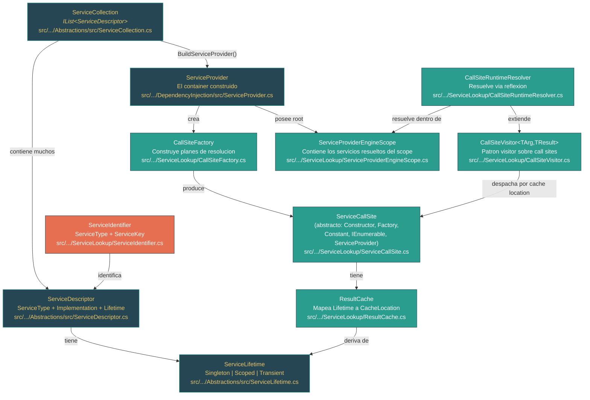

# Nivel 2: Practicante -- Dependency Injection: Del patron al framework

> **Perfil objetivo:** Desarrollador que usa dependency injection a diario pero no ha explorado como el container resuelve los servicios
> **Esfuerzo estimado:** 4 horas
> **Prerrequisitos:** Modulo 2.1 (Genericos), Nivel 1 (Fundamentos)
> [English version](../en/02-practitioner-dependency-injection.md)

---

## Objetivos de aprendizaje

Al completar este modulo, seras capaz de:

1. **Explicar** el patron de Dependency Injection (DI) de forma independiente a cualquier framework, y articular por que la inyeccion por constructor permite testabilidad y bajo acoplamiento.
2. **Describir** que contiene un `ServiceDescriptor` y como `ServiceCollection` almacena los registros como una simple lista.
3. **Rastrear** como se construye `ServiceProvider` a partir de un `ServiceCollection`, incluyendo el paso de poblacion del `CallSiteFactory` y el registro de servicios integrados.
4. **Recorrer** el pipeline de resolucion: desde `GetService()` hasta la creacion del `ServiceAccessor`, la busqueda en `CallSiteFactory` y la ejecucion en `CallSiteRuntimeResolver`.
5. **Distinguir** entre los lifetimes Singleton, Scoped y Transient a nivel de codigo fuente, identificando donde cada uno cachea sus instancias resueltas.
6. **Explicar** los keyed services (.NET 8+), la resolucion de genericos abiertos y el algoritmo de seleccion de constructores que usa el container.
7. **Diagnosticar** errores comunes de DI (dependencias cautivas, fallos de validacion de scope, dependencias circulares) entendiendo el codigo de validacion.
8. **Leer** el pipeline de ServiceLookup con confianza y localizar el codigo responsable de cualquier comportamiento de DI.

---

## Mapa conceptual



---

## Curriculo

### Leccion 2.4.1: El patron DI -- Por que inyeccion por constructor, antes del framework

**Lo que vas a aprender:** Dependency injection es un patron de diseno, no una funcionalidad del framework. Entender el patron primero hace que la implementacion del framework sea obvia.

**El concepto:**

Dependency injection significa que una clase recibe los objetos de los que depende (sus *dependencias*) desde el exterior, en vez de crearlos internamente. La forma mas comun es la **inyeccion por constructor**: las dependencias llegan como parametros del constructor.

Consideremos esto sin ningun framework:

```csharp
// Sin DI -- la clase crea su propia dependencia
public class OrderService
{
    private readonly SqlOrderRepository _repo = new SqlOrderRepository(); // Acoplamiento fuerte

    public Order GetOrder(int id) => _repo.FindById(id);
}

// Con DI -- la clase recibe su dependencia
public class OrderService
{
    private readonly IOrderRepository _repo;

    public OrderService(IOrderRepository repo)  // Inyectado desde afuera
    {
        _repo = repo;
    }

    public Order GetOrder(int id) => _repo.FindById(id);
}
```

La version con DI es mejor por tres razones:

1. **Testabilidad** -- Podes pasar un mock de `IOrderRepository` en los tests unitarios.
2. **Bajo acoplamiento** -- `OrderService` no sabe ni le importa que implementacion de `IOrderRepository` existe.
3. **Inversion de control** -- El *llamador* decide que implementacion proveer, no la clase misma.

Podes hacer DI manualmente instanciando objetos y pasandolos. Un **DI container** (tambien llamado **IoC container**) automatiza esto: registras que interfaces mapean a que implementaciones, y el container construye grafos completos de objetos por vos.

En el codigo fuente de `dotnet/runtime`, el DI container vive en dos paquetes:

- **`Microsoft.Extensions.DependencyInjection.Abstractions`** -- Define los contratos: `IServiceCollection`, `IServiceProvider`, `ServiceDescriptor`, `ServiceLifetime`. Estas son las interfaces que cualquier DI container puede implementar.
- **`Microsoft.Extensions.DependencyInjection`** -- La implementacion por defecto: `ServiceCollection`, `ServiceProvider`, y todo el pipeline de resolucion en `ServiceLookup/`.

**En el codigo fuente:**

La interfaz `IServiceCollection` (`src/libraries/Microsoft.Extensions.DependencyInjection.Abstractions/src/IServiceCollection.cs`) es notablemente simple -- es solo `IList<ServiceDescriptor>`:

```csharp
public interface IServiceCollection : IList<ServiceDescriptor>
{
}
```

Ningun metodo propio. Una service collection es literalmente una lista de descriptores. Todo lo demas -- `AddSingleton<T>()`, `AddTransient<T>()`, `AddScoped<T>()` -- son metodos de extension.

**Punto clave:** DI es un patron que podes implementar a mano. El framework automatiza el trabajo tedioso de construir grafos de objetos profundos. Las abstracciones son intencionalmente minimalistas: una lista de descriptores y un service provider.

---

### Leccion 2.4.2: ServiceCollection y ServiceDescriptor -- Registrando servicios

**Lo que vas a aprender:** Como se registran los servicios, que contiene un `ServiceDescriptor`, y por que la coleccion es solo una lista.

**El concepto:**

Cuando escribis `services.AddSingleton<IMyService, MyService>()`, estas agregando un `ServiceDescriptor` a un `List<ServiceDescriptor>`. Eso es todo lo que es el registro -- construir una lista de "recetas" para el container.

Un `ServiceDescriptor` captura cuatro piezas de informacion:

| Propiedad | Tipo | Que es |
|---|---|---|
| `ServiceType` | `Type` | La interfaz o tipo abstracto que los consumidores van a solicitar (ej., `IOrderRepository`) |
| `Lifetime` | `ServiceLifetime` | Cuanto vive la instancia resuelta: `Singleton`, `Scoped` o `Transient` |
| `ServiceKey` | `object?` | Clave opcional para registros de keyed services (.NET 8+) |
| Implementation | Una de tres | *Como* crear la instancia |

La implementacion es exactamente una de:

1. **`ImplementationType`** (`Type`) -- El container va a construir este tipo via reflexion, resolviendo sus parametros de constructor recursivamente.
2. **`ImplementationFactory`** (`Func<IServiceProvider, object>`) -- Un delegado factory que el container llama, pasandose a si mismo para que la factory pueda resolver otros servicios.
3. **`ImplementationInstance`** (`object`) -- Una instancia singleton preconstruida. El lifetime es siempre `Singleton`.

**En el codigo fuente:**

Abri `src/libraries/Microsoft.Extensions.DependencyInjection.Abstractions/src/ServiceDescriptor.cs`. El constructor privado en la linea 130 muestra los tres campos centrales:

```csharp
private ServiceDescriptor(Type serviceType, object? serviceKey, ServiceLifetime lifetime)
{
    Lifetime = lifetime;
    ServiceType = serviceType;
    ServiceKey = serviceKey;
}
```

Los tres campos de implementacion se almacenan por separado:
- `_implementationType` (linea 153)
- `_implementationInstance` (linea 185)
- `_implementationFactory` (linea 215)

Cada constructor publico asigna exactamente uno de estos. Nota la anotacion `[DynamicallyAccessedMembers(DynamicallyAccessedMemberTypes.PublicConstructors)]` sobre `_implementationType` -- esto le dice al trimmer que el container necesita reflexionar sobre los constructores publicos de cualquier tipo de implementacion registrado.

Ahora mira `ServiceCollection` (`src/libraries/Microsoft.Extensions.DependencyInjection.Abstractions/src/ServiceCollection.cs`). Envuelve un `List<ServiceDescriptor>` (linea 18) con un mecanismo de verificacion de solo lectura:

```csharp
public class ServiceCollection : IServiceCollection
{
    private readonly List<ServiceDescriptor> _descriptors = new List<ServiceDescriptor>();
    private bool _isReadOnly;
    // ...
}
```

El metodo `MakeReadOnly()` (linea 110) se llama cuando se construye el provider, previniendo modificaciones posteriores. Esto es importante porque el constructor de `ServiceProvider` toma una instantanea de los descriptores -- agregar mas despues de construir no tiene efecto.

**Ejercicio practico:**

1. Abri `src/libraries/Microsoft.Extensions.DependencyInjection.Abstractions/src/ServiceDescriptor.cs`.
2. Encontra el constructor que acepta un factory `Func<IServiceProvider, object>` (alrededor de la linea 89). Nota que almacena la factory en `_implementationFactory`.
3. Ahora encontra el constructor que acepta un `object instance` (alrededor de la linea 57). Nota que fuerza `ServiceLifetime.Singleton` -- un registro por instancia siempre tiene lifetime singleton porque el container devuelve el mismo objeto cada vez.
4. Lee la propiedad `IsKeyedService` (buscala) -- simplemente verifica si `ServiceKey` no es null.

**Punto clave:** `ServiceCollection` es un `List<ServiceDescriptor>`. Cada descriptor es una receta que dice "cuando alguien pida `ServiceType`, crealo usando este tipo de implementacion/factory/instancia, con este lifetime." El registro no crea nada -- solo construye la lista de recetas.

---

### Leccion 2.4.3: ServiceProvider -- Construyendo el container

**Lo que vas a aprender:** Que ocurre cuando se llama a `BuildServiceProvider()`, como se puebla el `CallSiteFactory`, y que servicios integrados se registran automaticamente.

**El concepto:**

Llamar a `services.BuildServiceProvider()` dispara la construccion de un `ServiceProvider`. Esta es la transicion de "lista de recetas" a "container activo." El constructor en `ServiceProvider.cs` hace cuatro cosas criticas:

1. **Crea el root scope** -- Un `ServiceProviderEngineScope` que contiene las instancias singleton.
2. **Selecciona el engine** -- Ya sea `DynamicServiceProviderEngine` (usa IL emit para performance) o `RuntimeServiceProviderEngine` (usa reflexion, para ambientes con restricciones AOT).
3. **Crea el `CallSiteFactory`** -- La factory que luego va a construir planes de resolucion (call sites) bajo demanda.
4. **Registra servicios integrados** -- Cuatro servicios que existen sin ningun registro del usuario.

**En el codigo fuente:**

Abri `src/libraries/Microsoft.Extensions.DependencyInjection/src/ServiceProvider.cs`. El constructor (linea 52) revela todo el proceso de construccion:

```csharp
internal ServiceProvider(ICollection<ServiceDescriptor> serviceDescriptors, ServiceProviderOptions options)
{
    Root = new ServiceProviderEngineScope(this, isRootScope: true);
    _engine = GetEngine();
    _createServiceAccessor = CreateServiceAccessor;
    _serviceAccessors = new ConcurrentDictionary<ServiceIdentifier, ServiceAccessor>();

    CallSiteFactory = new CallSiteFactory(serviceDescriptors);
    // Lista de servicios integrados que no son parte de la lista de descriptores
    CallSiteFactory.Add(ServiceIdentifier.FromServiceType(typeof(IServiceProvider)), new ServiceProviderCallSite());
    CallSiteFactory.Add(ServiceIdentifier.FromServiceType(typeof(IServiceScopeFactory)), new ConstantCallSite(typeof(IServiceScopeFactory), Root));
    CallSiteFactory.Add(ServiceIdentifier.FromServiceType(typeof(IServiceProviderIsService)), new ConstantCallSite(typeof(IServiceProviderIsService), CallSiteFactory));
    CallSiteFactory.Add(ServiceIdentifier.FromServiceType(typeof(IServiceProviderIsKeyedService)), new ConstantCallSite(typeof(IServiceProviderIsKeyedService), CallSiteFactory));
    // ...
}
```

Los cuatro servicios integrados son:

| Servicio integrado | A que resuelve | Tipo de call site |
|---|---|---|
| `IServiceProvider` | El scope actual | `ServiceProviderCallSite` |
| `IServiceScopeFactory` | El root scope (crea nuevos scopes) | `ConstantCallSite` |
| `IServiceProviderIsService` | El `CallSiteFactory` (sabe que esta registrado) | `ConstantCallSite` |
| `IServiceProviderIsKeyedService` | El mismo `CallSiteFactory` | `ConstantCallSite` |

Por eso siempre podes inyectar `IServiceProvider` o `IServiceScopeFactory` sin registrarlos -- se agregan automaticamente.

El constructor de `CallSiteFactory` (en `CallSiteFactory.cs`, linea 24) toma la coleccion de descriptores e inmediatamente llama a `Populate()` (linea 35), que indexa todos los descriptores en un diccionario `_descriptorLookup` con clave `ServiceIdentifier`. Este diccionario permite busquedas O(1) al resolver servicios mas adelante. Durante la poblacion, tambien valida los registros de genericos abiertos -- verificando que el tipo de implementacion tambien sea un generico abierto con aridad coincidente.

Ahora mira `ValidateOnBuild` (ServiceProvider.cs, linea 73): cuando esta opcion es `true`, el constructor itera cada descriptor y llama a `ValidateService()`, que construye ansiosamente un call site para cada servicio. Esto atrapa errores de configuracion al inicio en vez de en la primera resolucion. Esta habilitado por defecto en la ruta `Host.CreateDefaultBuilder()` para ambientes de desarrollo.

**Ejercicio practico:**

1. Lee el constructor de `ServiceProvider` desde la linea 52 a la 96.
2. Encontra `GetEngine()` (linea 297). Nota como elige entre `DynamicServiceProviderEngine` (para ambientes con JIT) y `RuntimeServiceProviderEngine` (para NativeAOT). El switch `DisableDynamicEngine` permite forzar el engine basado en reflexion.
3. Lee `CallSiteFactory.Populate()` (CallSiteFactory.cs, linea 35). Segui la validacion que hace para tipos genericos abiertos -- verifica que el tipo de implementacion tambien sea generico, no sea abstracto y tenga la misma cantidad de parametros genericos.
4. Mira el comentario en la linea 60 de ServiceProvider.cs: "keep this in sync with CallSiteFactory.IsService." Esto revela un acoplamiento de mantenimiento importante -- los servicios integrados deben ser reconocidos en dos lugares.

**Punto clave:** Construir el provider indexa todos los descriptores para busqueda rapida, registra cuatro servicios integrados, y opcionalmente valida cada registro ansiosamente. El `CallSiteFactory` es el cerebro del container -- traduce descriptores en planes de resolucion.

---

### Leccion 2.4.4: Resolucion de servicios -- El pipeline de CallSite

**Lo que vas a aprender:** El camino exacto del codigo desde `provider.GetService<T>()` hasta un objeto construido, siguiendo la llamada a traves de `ServiceAccessor`, `CallSiteFactory` y `CallSiteRuntimeResolver`.

**El concepto:**

Cuando llamas a `provider.GetService(typeof(IMyService))`, la resolucion sigue un pipeline preciso:

```
GetService(Type)
  |
  v
GetService(ServiceIdentifier, Scope)      [ServiceProvider.cs:222]
  |
  v
_serviceAccessors.GetOrAdd(id, CreateServiceAccessor)  [lazy, cacheado]
  |
  v
CreateServiceAccessor(ServiceIdentifier)   [ServiceProvider.cs:257]
  |
  v
CallSiteFactory.GetCallSite(id, chain)    [construye el plan]
  |
  v
_engine.RealizeService(callSite)           [compila el plan, o]
CallSiteRuntimeResolver.Resolve(callSite)  [interpreta el plan]
  |
  v
Objeto construido retornado
```

**Paso 1: Busqueda del ServiceAccessor.** `ServiceProvider.GetService()` (linea 222) usa un `ConcurrentDictionary<ServiceIdentifier, ServiceAccessor>` para cachear delegados de resolucion. En la primera llamada para un tipo dado, invoca `CreateServiceAccessor`.

**Paso 2: Creacion del call site.** `CreateServiceAccessor` (linea 257) llama a `CallSiteFactory.GetCallSite()`, que construye un arbol de nodos `ServiceCallSite` representando el plan de resolucion.

**Paso 3: Tipos de call site.** La factory elige entre cinco valores de `CallSiteKind` (de `CallSiteKind.cs`):

| Tipo | Cuando se usa | Clase del call site |
|---|---|---|
| `Constructor` | Descriptor tiene `ImplementationType` | `ConstructorCallSite` -- almacena `ConstructorInfo` + call sites de parametros |
| `Factory` | Descriptor tiene `ImplementationFactory` | `FactoryCallSite` -- almacena el `Func<IServiceProvider, object>` |
| `Constant` | Descriptor tiene `ImplementationInstance` | `ConstantCallSite` -- almacena el objeto preconstruido |
| `IEnumerable` | Resolviendo `IEnumerable<T>` | `IEnumerableCallSite` -- almacena array de call sites hijos |
| `ServiceProvider` | Resolviendo `IServiceProvider` mismo | `ServiceProviderCallSite` -- retorna el scope actual |

**Paso 4: Seleccion de constructor.** Para `ConstructorCallSite`, el metodo `CreateConstructorCallSite` (CallSiteFactory.cs, linea 570) usa un algoritmo especifico:

- Si hay un constructor: lo usa, resuelve todos los parametros recursivamente.
- Si hay multiples constructores: ordena por cantidad de parametros (descendente), elige el primero cuyos parametros son *todos* resolubles, verifica que sea un superconjunto de todos los demas constructores satisfacibles (para prevenir ambiguedad).

**Paso 5: Resolucion.** La clase base `CallSiteVisitor<TArgument, TResult>` (CallSiteVisitor.cs) implementa un despacho en dos niveles:

1. Primer despacho por **cache location** (`VisitCallSite`, linea 24): `Root` (singleton), `Scope` (scoped), `Dispose` (transient), o `None`.
2. Segundo despacho por **tipo de call site** (`VisitCallSiteMain`, linea 39): `Factory`, `Constructor`, `Constant`, `IEnumerable`, o `ServiceProvider`.

El `CallSiteRuntimeResolver` (CallSiteRuntimeResolver.cs) sobreescribe ambos niveles. Para `VisitConstructor` (linea 48), resuelve recursivamente todos los call sites de parametros, luego invoca `ConstructorInfo.Invoke()` con los valores resueltos.

**En el codigo fuente:**

La optimizacion de singleton en `CreateServiceAccessor` (ServiceProvider.cs, linea 266) es elegante:

```csharp
if (callSite.Cache.Location == CallSiteResultCacheLocation.Root)
{
    object? value = CallSiteRuntimeResolver.Instance.Resolve(callSite, Root);
    return new ServiceAccessor { CallSite = callSite, RealizedService = scope => value };
}
```

Para singletons, resuelve inmediatamente y crea un closure que retorna el valor cacheado directamente -- sin despacho por visitor en llamadas subsiguientes. Para no-singletons, delega al engine (que puede compilar IL para resolucion mas rapida).

**Ejercicio practico:**

1. Abri `ServiceProvider.cs` y rastrea una llamada desde `GetService(Type)` (linea 103) a traves de `GetService(ServiceIdentifier, scope)` (linea 222) hasta `CreateServiceAccessor` (linea 257).
2. Abri `CallSiteFactory.cs` y lee `CreateCallSite` (linea 178). Nota la resolucion en tres pasos: `TryCreateExact` -> `TryCreateOpenGeneric` -> `TryCreateEnumerable`. Este es el orden de prioridad -- las coincidencias exactas ganan sobre las coincidencias de genericos abiertos.
3. Lee `CallSiteVisitor.cs` completamente (son solo 88 lineas). El despacho en dos niveles es el nucleo arquitectonico del motor de resolucion.
4. En `CallSiteRuntimeResolver.cs`, lee `VisitConstructor` (linea 48). Segui como crea un array de parametros, resuelve cada parametro recursivamente, y luego llama a `ConstructorInfo.Invoke`.

**Punto clave:** La resolucion construye un arbol de nodos `ServiceCallSite` (el plan) y luego lo ejecuta con un visitor. El plan se cachea por `ServiceIdentifier`, asi que el trabajo costoso de reflexion ocurre solo una vez por tipo de servicio. Los singletons se optimizan aun mas resolviendose ansiosamente y cacheando el valor directamente.

---

### Leccion 2.4.5: Lifetimes -- Singleton, Scoped, Transient en el codigo fuente

**Lo que vas a aprender:** Como cada lifetime se mapea a una cache location, donde se almacenan las instancias, como los scopes forman una cadena de disposal, y por que las dependencias cautivas son peligrosas.

**El concepto:**

El enum `ServiceLifetime` (en `ServiceLifetime.cs`) tiene tres valores. Su comportamiento a nivel de codigo fuente esta completamente determinado por el struct `ResultCache` (en `ResultCache.cs`, linea 23):

```csharp
public ResultCache(ServiceLifetime lifetime, ServiceIdentifier serviceIdentifier, int slot)
{
    switch (lifetime)
    {
        case ServiceLifetime.Singleton:
            Location = CallSiteResultCacheLocation.Root;
            break;
        case ServiceLifetime.Scoped:
            Location = CallSiteResultCacheLocation.Scope;
            break;
        case ServiceLifetime.Transient:
            Location = CallSiteResultCacheLocation.Dispose;
            break;
    }
    Key = new ServiceCacheKey(serviceIdentifier, slot);
}
```

Este mapeo conduce todo el comportamiento de cache:

| Lifetime | Cache location | Donde se almacena | Comportamiento |
|---|---|---|---|
| **Singleton** | `Root` | `callSite.Value` (en el call site mismo) | Una instancia para todo el `ServiceProvider`. Se crea una vez, con lock via `lock(callSite)`. |
| **Scoped** | `Scope` | Diccionario `scope.ResolvedServices` | Una instancia por `ServiceProviderEngineScope`. Se crea una vez por scope. |
| **Transient** | `Dispose` | No se cachea (pero se rastrea para disposal) | Nueva instancia en cada llamada. Si es `IDisposable`, se rastrea en la lista `_disposables` del scope. |

**Resolucion Singleton** (`VisitRootCache` en CallSiteRuntimeResolver.cs, linea 80):

El valor resuelto se almacena directamente en la propiedad `ServiceCallSite.Value`, con un `lock(callSite)` para prevenir doble construccion. Un fast path (linea 82) verifica `callSite.Value is object value` antes de tomar el lock. La deteccion de dependencias circulares usa un `[ThreadStatic]` `HashSet<ServiceCallSite>` -- si el mismo call site se encuentra de nuevo en el mismo hilo durante la resolucion, lanza `CircularDependencyException`.

**Resolucion Scoped** (`VisitScopeCache`, linea 126, y `VisitCache`, linea 135):

Los servicios scoped se almacenan en `ServiceProviderEngineScope.ResolvedServices`, un `Dictionary<ServiceCacheKey, object?>`. El objeto `Sync` del scope (que es el diccionario mismo, linea 38 de ServiceProviderEngineScope.cs) se usa como lock. Nota el caso especial: si un servicio scoped se resuelve desde el root scope (linea 130), cae a `VisitRootCache` -- convirtiendose efectivamente en un singleton.

**Resolucion Transient** (`VisitDisposeCache`, linea 43):

Los servicios transient nunca se cachean, pero `CaptureDisposable` (ServiceProviderEngineScope.cs, linea 79) agrega cualquier instancia `IDisposable`/`IAsyncDisposable` a la lista `_disposables` del scope. Cuando el scope se dispone, todas las instancias transient capturadas se disponen en orden inverso.

**Disposal de scope:**

`ServiceProviderEngineScope` implementa tanto `IDisposable` como `IAsyncDisposable`. Al disponerse, itera `_disposables` en orden inverso, llamando `Dispose()` o `DisposeAsync()` en cada objeto rastreado. Esta es la "cadena de disposal" -- disponer un scope dispone todos los servicios scoped y transient resueltos dentro de el.

**Validacion de dependencias cautivas:**

El `CallSiteValidator` (CallSiteValidator.cs) detecta el anti-patron de "dependencia cautiva": un singleton que depende de un servicio scoped. En `VisitRootCache` (linea 90), establece `state.Singleton = singletonCallSite`. Luego en `VisitScopeCache` (linea 96), si encuentra un call site scoped mientras se esta resolviendo un singleton, lanza `ScopedInSingletonException`. Esto solo se ejecuta cuando `ValidateScopes` esta habilitado (tipicamente en desarrollo).

Tambien atrapa el caso de resolver un servicio scoped desde el root scope directamente (`ValidateResolution`, linea 17) -- lanzando `DirectScopedResolvedFromRootException`.

**Ejercicio practico:**

1. Abri `ResultCache.cs` y verifica el mapeo de lifetime a location en el constructor.
2. En `CallSiteRuntimeResolver.cs`, compara `VisitRootCache` (singletons), `VisitScopeCache` (scoped), y `VisitDisposeCache` (transient). Nota la simplicidad creciente: los singletons necesitan locks y verificaciones de dependencias circulares, scoped necesita busqueda en diccionario, transient solo captura para disposal.
3. Abri `ServiceProviderEngineScope.cs` y lee `CaptureDisposable` (linea 79). Nota que verifica `service is IDisposable || service is IAsyncDisposable` y agrega a `_disposables`. Luego encontra el metodo `Dispose()` y mira como itera `_disposables` en reversa.
4. Lee `CallSiteValidator.cs` de principio a fin. Son 120 lineas y usa el mismo patron visitor. Enfocate en `VisitRootCache` (marca contexto singleton) y `VisitScopeCache` (detecta scoped-en-singleton).

**Punto clave:** Los lifetimes no son magia -- son elecciones de cache location. Singleton cachea en el call site (global), Scoped cachea en el diccionario del scope (por scope), Transient nunca cachea (pero rastrea disposables). El validador atrapa combinaciones peligrosas en tiempo de construccion cuando `ValidateScopes` esta habilitado.

---

### Leccion 2.4.6: Keyed Services y patrones avanzados

**Lo que vas a aprender:** Como funcionan los keyed services de .NET 8 a nivel de codigo fuente, como la resolucion de genericos abiertos crea tipos cerrados dinamicamente, y el algoritmo de seleccion de constructores para multiples constructores.

**El concepto:**

**Keyed Services de .NET 8:**

Antes de .NET 8, el DI container identificaba servicios unicamente por `Type`. Los keyed services agregan una segunda dimension: un `ServiceKey` (cualquier `object`). Esto se implementa a traves del struct `ServiceIdentifier` (ServiceIdentifier.cs):

```csharp
internal readonly struct ServiceIdentifier : IEquatable<ServiceIdentifier>
{
    public object? ServiceKey { get; }
    public Type ServiceType { get; }
}
```

Un `ServiceIdentifier` con `ServiceKey == null` es un servicio no-keyed (tradicional). Con una clave no-nula, es un keyed service. El metodo `Equals` (linea 31) compara tanto tipo como clave -- asi que `ServiceIdentifier(typeof(ICache), "redis")` y `ServiceIdentifier(typeof(ICache), "memory")` son distintos.

El valor especial `KeyedService.AnyKey` actua como comodin durante el registro. En `TryCreateExact` (CallSiteFactory.cs, linea 209), cuando una busqueda normal falla, el codigo verifica si hay un registro con `AnyKey`:

```csharp
if (serviceIdentifier.ServiceKey != null)
{
    var catchAllIdentifier = new ServiceIdentifier(KeyedService.AnyKey, serviceIdentifier.ServiceType);
    if (_descriptorLookup.TryGetValue(catchAllIdentifier, out descriptor))
    {
        return TryCreateExact(descriptor.Last, serviceIdentifier, callSiteChain, DefaultSlot);
    }
}
```

Esto permite registrar una sola factory que maneja todas las claves para un tipo dado.

**Resolucion de genericos abiertos:**

Cuando registras `services.AddSingleton(typeof(IRepository<>), typeof(Repository<>))`, el `ServiceType` del descriptor es un generico abierto (`IRepository<>`). Cuando alguien solicita `IRepository<Order>`, el metodo `TryCreateOpenGeneric` (CallSiteFactory.cs, linea 229) detecta que el tipo solicitado es un generico *construido* cuya definicion coincide con el generico abierto registrado. Luego llama a `implementationType.MakeGenericType(genericTypeArguments)` (linea 553) para crear el tipo cerrado `Repository<Order>` en tiempo de ejecucion.

El metodo `Populate()` valida esto por adelantado: los tipos de servicio genericos abiertos deben tener implementaciones genericas abiertas con aridad coincidente. El switch `VerifyOpenGenericServiceTrimmability` (linea 65 en CallSiteFactory.cs) tambien verifica que las anotaciones de trimming sean compatibles.

**Algoritmo de seleccion de constructores:**

El metodo `CreateConstructorCallSite` (CallSiteFactory.cs, linea 570) maneja la seleccion de constructores:

1. **Cero constructores:** Lanza `NoConstructorMatch`.
2. **Un constructor:** Lo usa. Si tiene parametros, resuelve cada uno recursivamente via `CreateArgumentCallSites`.
3. **Multiples constructores:** Ordena por cantidad de parametros (descendente). Itera, llamando `CreateArgumentCallSites` con `throwIfCallSiteNotFound: false`. El primer constructor cuyos parametros sean *todos* resolubles se convierte en el candidato. Luego verifica que este candidato sea un **superconjunto** de los tipos de parametros de todos los demas constructores satisfacibles -- si otro constructor tiene un tipo de parametro que no esta en el mejor constructor, lanza una excepcion de ambiguedad.

Esto significa que el container prefiere el constructor "mas avido" -- el que tiene mas parametros -- siempre que todas sus dependencias esten registradas.

**Deteccion de dependencias circulares:**

La clase `CallSiteChain` (CallSiteChain.cs) rastrea la ruta de resolucion actual. Cada vez que `CreateCallSite` entra en un nuevo servicio, llama `callSiteChain.Add(serviceIdentifier)`. Si el mismo identificador se agrega dos veces, `CheckCircularDependency` (linea 20) lanza una excepcion. La cadena tambien se usa para construir un path legible en el mensaje de error: `A -> B(BImpl) -> C -> A`.

En tiempo de ejecucion, el `CallSiteRuntimeResolver` tiene un mecanismo separado para dependencias circulares a traves de funciones factory: un `[ThreadStatic]` `HashSet<ServiceCallSite>` llamado `t_resolving` (linea 23). Esto atrapa ciclos que solo se hacen visibles durante la resolucion (ej., Factory A resuelve B que resuelve A).

**Ejercicio practico:**

1. Abri `ServiceIdentifier.cs` y lee el metodo `Equals`. Verifica que dos identificadores son iguales solo si tanto `ServiceType` como `ServiceKey` coinciden (con manejo de clave nula).
2. En `CallSiteFactory.cs`, encontra `TryCreateOpenGeneric` (linea 229) y rastrea como se llama a `MakeGenericType` (linea 553). Ahi es donde el container crea tipos genericos cerrados dinamicamente.
3. Lee `CreateConstructorCallSite` (linea 570) y segui la seleccion de multiples constructores. Nota el `Array.Sort` en la linea 606 ordenando constructores por cantidad de parametros de forma descendente.
4. Abri `CallSiteChain.cs` y lee `CreateCircularDependencyExceptionMessage`. Nota como construye un string de ruta de resolucion para el mensaje de error.

**Punto clave:** Los keyed services extienden la identidad del servicio de `Type` a `(Type, Key)`, implementado limpiamente a traves de `ServiceIdentifier`. Los genericos abiertos usan `MakeGenericType` en tiempo de resolucion. La seleccion de constructores favorece el constructor satisfacible mas avido. Las dependencias circulares se atrapan tanto en tiempo de construccion de call sites (via `CallSiteChain`) como en tiempo de resolucion (via rastreo `[ThreadStatic]`).

---

## Guia de lectura de codigo fuente

Lee estos archivos en orden. Cada uno construye sobre el entendimiento del anterior.

| Orden | Archivo | En que enfocarse | Dificultad |
|---|---|---|---|
| 1 | `src/libraries/Microsoft.Extensions.DependencyInjection.Abstractions/src/ServiceLifetime.cs` | Los tres valores de lifetime. Enum simple -- pero conduce toda la arquitectura de cache. | :star: |
| 2 | `src/libraries/Microsoft.Extensions.DependencyInjection.Abstractions/src/IServiceCollection.cs` | Solo `IList<ServiceDescriptor>`. Aprecia el minimalismo. | :star: |
| 3 | `src/libraries/Microsoft.Extensions.DependencyInjection.Abstractions/src/ServiceDescriptor.cs` | Constructores (lineas 23-128), propiedades (lineas 140-215). Entende las tres variantes de implementacion. | :star::star: |
| 4 | `src/libraries/Microsoft.Extensions.DependencyInjection.Abstractions/src/ServiceCollection.cs` | Wrapper de `List<ServiceDescriptor>` con `MakeReadOnly()`. Lee el patron `CheckReadOnly`. | :star: |
| 5 | `src/libraries/Microsoft.Extensions.DependencyInjection/src/ServiceProvider.cs` | Constructor (lineas 52-96), `GetService` (linea 222), `CreateServiceAccessor` (linea 257). El punto de entrada a todo. | :star::star: |
| 6 | `src/libraries/Microsoft.Extensions.DependencyInjection/src/ServiceLookup/ServiceIdentifier.cs` | El struct de identidad `(ServiceKey, ServiceType)`. Lee `Equals` y `GetHashCode`. | :star: |
| 7 | `src/libraries/Microsoft.Extensions.DependencyInjection/src/ServiceLookup/ServiceCallSite.cs` | Base abstracta: `ServiceType`, `ImplementationType`, `Kind`, `Cache`, `Value`, `CaptureDisposable`. | :star: |
| 8 | `src/libraries/Microsoft.Extensions.DependencyInjection/src/ServiceLookup/ResultCache.cs` | El mapeo de lifetime a cache location. Archivo critico de 47 lineas. | :star::star: |
| 9 | `src/libraries/Microsoft.Extensions.DependencyInjection/src/ServiceLookup/CallSiteFactory.cs` | `Populate` (linea 35), `CreateCallSite` (linea 178), `CreateConstructorCallSite` (linea 570). El cerebro. | :star::star::star: |
| 10 | `src/libraries/Microsoft.Extensions.DependencyInjection/src/ServiceLookup/CallSiteVisitor.cs` | El despacho visitor en dos niveles. Solo 88 lineas -- leelo completo. | :star::star: |
| 11 | `src/libraries/Microsoft.Extensions.DependencyInjection/src/ServiceLookup/CallSiteRuntimeResolver.cs` | `Resolve`, `VisitRootCache`, `VisitScopeCache`, `VisitDisposeCache`, `VisitConstructor`. | :star::star::star: |
| 12 | `src/libraries/Microsoft.Extensions.DependencyInjection/src/ServiceLookup/CallSiteValidator.cs` | Validacion de scope: `VisitRootCache` establece contexto singleton, `VisitScopeCache` detecta dependencias cautivas. | :star::star: |
| 13 | `src/libraries/Microsoft.Extensions.DependencyInjection/src/ServiceLookup/ServiceProviderEngineScope.cs` | Diccionario `ResolvedServices`, `CaptureDisposable`, logica de disposal. | :star::star: |
| 14 | `src/libraries/Microsoft.Extensions.DependencyInjection/src/ServiceLookup/CallSiteChain.cs` | Deteccion de dependencias circulares durante la construccion de call sites. | :star::star: |
| 15 | `src/libraries/Microsoft.Extensions.DependencyInjection/src/ServiceLookup/ConstructorCallSite.cs` | `ConstructorInfo` + `ParameterCallSites[]` -- la estructura recursiva de la resolucion basada en constructores. | :star: |

---

## Herramientas de diagnostico y comandos

| Herramienta / Tecnica | Que hace | Cuando usarla |
|---|---|---|
| `ValidateOnBuild = true` | Valida ansiosamente todos los descriptores de servicio al construir el container | Siempre en desarrollo; atrapa registros faltantes al inicio |
| `ValidateScopes = true` | Detecta dependencias cautivas (scoped en singleton) y resolucion scoped desde root scope | Siempre en desarrollo; previene bugs sutiles de lifetime |
| `IServiceProviderIsService` | Verificar programaticamente si un servicio esta registrado | Debugging de problemas de registro; resolucion condicional |
| Vistas de debugger de `ServiceProvider` | `DebuggerDisplay` y `DebuggerTypeProxy` en `ServiceProvider` y `ServiceCollection` muestran descriptores y disposables | Depurar paso a paso en Visual Studio/Rider para inspeccionar registros |
| `DependencyInjectionEventSource` | Eventos ETW/EventPipe para resolucion de servicios y ciclo de vida del provider | Diagnostico en produccion; correlacionar actividad DI con `dotnet-trace` |
| `COREHOST_TRACE=1` | Muestra la carga del host incluyendo resolucion de assemblies relacionados con DI | Cuando la carga de assemblies de DI falla |
| Rastreo de disposables | Inspeccionar `scope.Disposables` en el debugger (interno, via `ServiceProviderEngineScope`) | Diagnosticar memory leaks por disposables no capturados |

---

## Autoevaluacion

### Pregunta 1: Cuales son las tres formas de proveer una implementacion en un ServiceDescriptor?

<details>
<summary>Mostrar respuesta</summary>

1. **ImplementationType** -- Un `Type` que el container va a construir via reflexion, resolviendo parametros del constructor recursivamente.
2. **ImplementationFactory** -- Un delegado `Func<IServiceProvider, object>` que el container llama, pasandose a si mismo para que la factory pueda resolver dependencias.
3. **ImplementationInstance** -- Un objeto preconstruido. El lifetime es siempre Singleton porque la misma instancia se retorna cada vez.

Estos corresponden a los tres campos privados `_implementationType`, `_implementationFactory` y `_implementationInstance` en `ServiceDescriptor.cs`.

</details>

### Pregunta 2: Que cuatro servicios se registran automaticamente al construir un ServiceProvider?

<details>
<summary>Mostrar respuesta</summary>

1. **`IServiceProvider`** -- Resuelve al scope actual (via `ServiceProviderCallSite`)
2. **`IServiceScopeFactory`** -- Resuelve al root scope (via `ConstantCallSite`)
3. **`IServiceProviderIsService`** -- Resuelve al `CallSiteFactory` (via `ConstantCallSite`)
4. **`IServiceProviderIsKeyedService`** -- Resuelve al mismo `CallSiteFactory` (via `ConstantCallSite`)

Estos se agregan en el constructor de `ServiceProvider` (lineas 63-66 de ServiceProvider.cs) despues de crear el `CallSiteFactory` a partir de los descriptores del usuario.

</details>

### Pregunta 3: Cual es el orden de prioridad de resolucion cuando CallSiteFactory intenta construir un call site?

<details>
<summary>Mostrar respuesta</summary>

En `CreateCallSite` (CallSiteFactory.cs, linea 201):

```csharp
ServiceCallSite? callSite = TryCreateExact(serviceIdentifier, callSiteChain) ??
                           TryCreateOpenGeneric(serviceIdentifier, callSiteChain) ??
                           TryCreateEnumerable(serviceIdentifier, callSiteChain);
```

1. **Coincidencia exacta** -- Un descriptor cuyo `ServiceType` es el tipo solicitado exacto
2. **Coincidencia de generico abierto** -- Un descriptor cuyo `ServiceType` es una definicion de generico abierto del tipo generico construido solicitado
3. **Enumerable** -- Si el tipo solicitado es `IEnumerable<T>`, recolectar todos los registros para `T`

Si los tres retornan null, el servicio no esta registrado y `GetService` retorna null.

</details>

### Pregunta 4: Como maneja el container multiples constructores en un tipo de implementacion?

<details>
<summary>Mostrar respuesta</summary>

El metodo `CreateConstructorCallSite` (CallSiteFactory.cs, linea 570):

1. Ordena constructores por cantidad de parametros, descendente
2. Itera a traves de ellos, intentando resolver todos los parametros para cada uno
3. El primer constructor cuyos parametros son *todos* resolubles se convierte en el "mejor" candidato
4. Para constructores resolubles subsiguientes, verifica que los tipos de parametros del mejor constructor sean un **superconjunto** de los suyos
5. Si un constructor posterior tiene un tipo de parametro no presente en el mejor constructor, lanza una excepcion de ambiguedad

El efecto neto: el container prefiere el constructor "mas avido" (mas parametros), pero rechaza casos ambiguos donde dos constructores tienen cada uno tipos de parametros unicos.

</details>

### Pregunta 5: Donde se cachean las instancias singleton vs las instancias scoped?

<details>
<summary>Mostrar respuesta</summary>

- Las **instancias singleton** se cachean en `ServiceCallSite.Value` (la propiedad `Value` del objeto call site mismo). Esto es global -- el call site se comparte entre todos los scopes. La resolucion usa `lock(callSite)` para seguridad de hilos (`VisitRootCache` en CallSiteRuntimeResolver.cs, linea 91).

- Las **instancias scoped** se cachean en `ServiceProviderEngineScope.ResolvedServices`, un `Dictionary<ServiceCacheKey, object?>` local a cada scope. La resolucion usa `Monitor.Enter(scope.Sync)` para seguridad de hilos (`VisitCache` en CallSiteRuntimeResolver.cs, linea 146).

- Las **instancias transient** no se cachean en absoluto. Si implementan `IDisposable`/`IAsyncDisposable`, se rastrean en `ServiceProviderEngineScope._disposables` para disposal posterior.

</details>

### Pregunta 6: Por que es peligroso resolver un servicio Scoped desde el root scope, y como lo detecta el container?

<details>
<summary>Mostrar respuesta</summary>

Resolver un servicio Scoped desde el root scope efectivamente lo convierte en un singleton (porque el root scope vive durante toda la vida de la aplicacion). Esto es peligroso porque los servicios scoped estan disenados para ser de vida corta (ej., por request en ASP.NET Core), y mantenerlos vivos como singletons puede causar corrupcion de estado, agotamiento de recursos y memory leaks.

La deteccion ocurre en dos lugares:

1. **`CallSiteValidator.ValidateResolution`** (linea 17): Cuando `ValidateScopes` esta habilitado, verifica si el scope es el root scope y el call site tiene una dependencia scoped. Si es asi, lanza `DirectScopedResolvedFromRootException`.

2. **`CallSiteRuntimeResolver.VisitScopeCache`** (linea 130): Si el scope actual *es* el root scope, delega a `VisitRootCache`, que almacena el valor globalmente -- convirtiendo el servicio scoped en un singleton. Este es el comportamiento "cautivo" que la validacion atrapa.

</details>

### Desafio practico (60-90 minutos)

**Rastrea un camino de resolucion real:**

1. Crea una aplicacion de consola con los siguientes servicios:
   ```csharp
   var services = new ServiceCollection();
   services.AddSingleton<ILogger, ConsoleLogger>();
   services.AddScoped<IOrderRepository, SqlOrderRepository>();
   services.AddTransient<IOrderService, OrderService>();
   // OrderService depende de ILogger y IOrderRepository via inyeccion por constructor
   ```
2. Sin ejecutar el codigo, dibuja el arbol de `ServiceCallSite` que `CallSiteFactory` construiria para `IOrderService`:
   - Raiz: `ConstructorCallSite` para `OrderService`
     - Parametro 0: `ConstructorCallSite` para `ConsoleLogger` (cache: Root)
     - Parametro 1: `ConstructorCallSite` para `SqlOrderRepository` (cache: Scope)
   - El call site raiz tiene cache location `Dispose` (Transient)
3. Ahora predeci: que pasa si resolves `IOrderService` desde el root scope con `ValidateScopes = true`? (Respuesta: va a lanzar una excepcion porque `IOrderRepository` es Scoped y se resolveria desde el root.)
4. Crea un scope y resolve desde ahi en su lugar. Verifica que el comportamiento coincide con tu prediccion.

---

## Conexiones

| Direccion | Modulo | Tema |
|---|---|---|
| **Anterior** | [2.3: Async/Await y la maquinaria de Task](02-practitioner-async-await.md) | Entender patrones async ayuda con el manejo de lifetimes scoped en flujos asincronos |
| **Siguiente** | [2.5: LINQ: De la sintaxis de query a las maquinas iteradoras](02-practitioner-linq.md) | El modelo de evaluacion lazy de LINQ contrasta con la resolucion ansiosa de singletons de DI |
| **Relacionado** | [2.10: Configuration, Options y el modelo de Hosting](02-practitioner-hosting.md) | El modelo de hosting se construye sobre DI -- `Host.CreateDefaultBuilder` configura el container |
| **Relacionado** | [2.9: El contrato IDisposable y gestion de recursos](02-practitioner-disposable.md) | La cadena de disposal de DI depende del contrato IDisposable |
| **Profundiza** | [3.7: Reflexion, Emit y Source Generators](03-advanced-reflection.md) | El `DynamicServiceProviderEngine` de DI usa IL emit para performance |
| **Indice** | [Indice del Learning Path](00-index.md) | Listado completo de modulos y autoevaluacion |

---

## Glosario

| Termino (EN) | Termino (ES) | Definicion |
|---|---|---|
| **Dependency Injection (DI)** | Dependency Injection (DI) | Un patron de diseno donde una clase recibe sus dependencias desde el exterior en vez de crearlas internamente. La forma mas comun es la inyeccion por constructor. |
| **IoC Container** | IoC Container | Un objeto que gestiona la creacion y el lifetime de servicios. Tambien llamado DI container. La implementacion de .NET es `ServiceProvider`. |
| **Service Descriptor** | Service Descriptor | Un objeto `ServiceDescriptor` que describe como crear un servicio: el tipo de servicio, la estrategia de implementacion y el lifetime. |
| **Service Collection** | Service Collection | Un `IServiceCollection` (respaldado por `List<ServiceDescriptor>`) donde se registran los descriptores de servicio antes de construir el container. |
| **Service Provider** | Service Provider | El container construido (`ServiceProvider`) que resuelve servicios bajo demanda. Se crea llamando a `BuildServiceProvider()`. |
| **Singleton** | Singleton | Un lifetime donde se crea una instancia y se comparte durante toda la vida del `ServiceProvider`. Se cachea en el root scope. |
| **Scoped** | Scoped | Un lifetime donde se crea una instancia por `IServiceScope`. En ASP.NET Core, se crea un scope por request HTTP. |
| **Transient** | Transient | Un lifetime donde se crea una nueva instancia cada vez que se solicita el servicio. Las instancias disposable son rastreadas por el scope que las resuelve. |
| **Call Site** | Call Site | Un objeto interno `ServiceCallSite` que representa el plan de resolucion de un servicio -- que construir, como obtener parametros, donde cachear. |
| **CallSiteFactory** | CallSiteFactory | La clase interna que transforma registros `ServiceDescriptor` en planes de resolucion `ServiceCallSite`. El "cerebro" del container. |
| **Captive Dependency** | Dependencia cautiva | Un servicio scoped inyectado en un singleton, causando que el servicio scoped viva tanto como el singleton (toda su vida). Detectado por `CallSiteValidator`. |
| **Keyed Service** | Keyed Service | Un servicio identificado tanto por un `Type` como por una clave `object`, permitiendo multiples implementaciones de la misma interfaz distinguidas por clave. Agregado en .NET 8. |
| **Service Identifier** | Service Identifier | Un struct `ServiceIdentifier` que combina `ServiceType` y un `ServiceKey` opcional para identificar unicamente un registro de servicio. |
| **Open Generic** | Generico abierto | Una definicion de tipo generico como `IRepository<>` registrada con el container. Se resuelve construyendo un tipo cerrado (`IRepository<Order>`) via `MakeGenericType` en tiempo de resolucion. |
| **CallSiteVisitor** | CallSiteVisitor | La clase base abstracta que implementa el patron visitor sobre arboles de call sites. Despacha primero por cache location (lifetime), luego por tipo de call site. |

---

## Referencias

| Recurso | Tipo | Que cubre |
|---|---|---|
| [Dependency injection en .NET](https://learn.microsoft.com/es-es/dotnet/core/extensions/dependency-injection) | Documentacion oficial | Guia completa para usar DI en .NET |
| [Guias de dependency injection](https://learn.microsoft.com/es-es/dotnet/core/extensions/dependency-injection-guidelines) | Documentacion oficial | Mejores practicas: lifetimes de servicio, dependencias cautivas, disposal |
| [Keyed services en .NET 8](https://learn.microsoft.com/en-us/dotnet/core/extensions/dependency-injection#keyed-services) | Documentacion oficial | Patrones de registro y resolucion de keyed services |
| [.NET Source Browser -- Microsoft.Extensions.DependencyInjection](https://source.dot.net/#Microsoft.Extensions.DependencyInjection) | Herramienta | Vista indexada y buscable del codigo fuente de DI |
| [Andrew Lock -- .NET DI Internals (serie de blog)](https://andrewlock.net/) | Blog | Analisis profundos del comportamiento del DI container con referencias al codigo fuente |
| [Steve Collins -- Exploring the code behind IHost](https://stevetalkscode.co.uk/) | Blog | Como el modelo de hosting usa DI internamente |
| [Mark Seemann -- Dependency Injection Principles, Practices, and Patterns](https://www.manning.com/books/dependency-injection-principles-practices-and-patterns) | Libro | Patrones de DI agnsoticos al framework; composition root, decoradores, interceptores |
| [SharpLab](https://sharplab.io/) | Herramienta | Inspeccionar que genera el compilador para los metodos de extension de DI |

---

*Ultima actualizacion: 2026-04-14*
