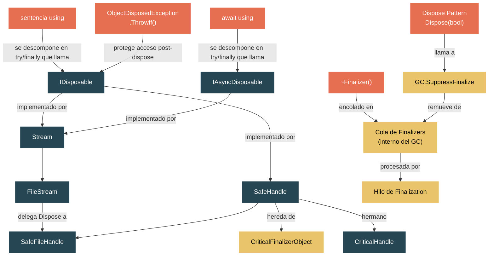

# Nivel 2: Practicante — El Contrato IDisposable y la Gestion de Recursos

> **Perfil objetivo:** Desarrollador que usa sentencias `using` pero no comprende completamente la finalization, el dispose pattern, ni SafeHandle
> **Esfuerzo estimado:** 3 horas
> **Prerrequisitos:** [Modulo 1.3 — El Sistema de Tipos](01-foundations-type-system.md), [Modulo 1.6 — I/O Basico](01-foundations-basic-io.md)
> [English version](../en/02-practitioner-disposable.md)

---

## Objetivos de Aprendizaje

Al finalizar este modulo seras capaz de:

1. **Explicar el contrato de IDisposable** y las cinco condiciones que `Dispose` debe satisfacer, tal como estan documentadas en el codigo fuente del runtime.
2. **Descomponer una sentencia `using`** en el bloque try/finally que el compilador realmente genera, e identificar por que esto importa para la seguridad ante excepciones.
3. **Implementar el dispose pattern completo** con `Dispose(bool)`, un finalizer, y `GC.SuppressFinalize` — y articular por que existe cada pieza.
4. **Describir el mecanismo de finalization** — la cola de finalizers, el hilo de finalization, y por que los finalizers son costosos y poco confiables.
5. **Trazar la cadena de dispose** desde un `using (var fs = new FileStream(...))` a traves de `Stream.Dispose`, `FileStream.Dispose(bool)`, hasta `SafeFileHandle.ReleaseHandle`.
6. **Explicar por que existe SafeHandle**, como hereda de `CriticalFinalizerObject`, y como el conteo de referencias previene ataques de reciclaje de handles.
7. **Usar `IAsyncDisposable` y `await using`** para recursos que requieren limpieza asincrona.
8. **Aplicar `ObjectDisposedException.ThrowIf`** como el patron moderno de proteccion contra objetos ya liberados.

---

## Mapa Conceptual



---

## Curriculo

### Leccion 1 — IDisposable: El Contrato

#### Que vas a aprender
Que promete la interfaz `IDisposable`, a que se compila realmente la sentencia `using`, y por que la limpieza determinista importa.

#### El concepto

La interfaz `IDisposable` es una de las mas simples en .NET — un solo metodo:

```csharp
public interface IDisposable
{
    void Dispose();
}
```

Pero el contrato detras de ese metodo es mucho mas rico que lo que la firma sugiere. El archivo fuente `IDisposable.cs` en el runtime contiene un comentario extenso (lineas 16-54) que establece las **cinco condiciones** que toda implementacion de `Dispose` debe satisfacer:

1. **Ser invocable multiples veces de forma segura.** Una segunda llamada a `Dispose()` no deberia hacer nada — jamas lanzar una excepcion.
2. **Liberar cualquier recurso asociado a la instancia.** Handles de archivos, conexiones de base de datos, memoria nativa — cualquier cosa que el garbage collector no pueda limpiar por si solo.
3. **Llamar al metodo `Dispose` de la clase base**, si existe.
4. **Suprimir la finalization** de la clase para reducir la sobrecarga del GC (menos objetos en la cola de finalization).
5. **No lanzar excepciones** excepto por errores verdaderamente catastroficos como `OutOfMemoryException`.

El comentario en el fuente tambien explica el problema fundamental: el garbage collector no ofrece ninguna forma de saber *cuando* un finalizer se ejecutara. Si tu clase posee un recurso del sistema operativo — un handle de archivo, un socket de red — no podes depender del GC para limpiarlo oportunamente. `IDisposable` resuelve esto dejando que el desarrollador elija *exactamente* cuando ocurre la limpieza.

**La sentencia `using` es azucar sintactico.** El compilador transforma:

```csharp
using (var fs = new FileStream("data.txt", FileMode.Open))
{
    // trabajar con fs
}
```

en:

```csharp
FileStream fs = new FileStream("data.txt", FileMode.Open);
try
{
    // trabajar con fs
}
finally
{
    if (fs != null)
    {
        ((IDisposable)fs).Dispose();
    }
}
```

El bloque `finally` garantiza que `Dispose()` se llama incluso si se lanza una excepcion dentro del bloque `try`. Esto es **limpieza determinista** — el recurso se libera en un punto predecible de la ejecucion, no en algun ciclo futuro del GC.

La declaracion `using` moderna de C# (sin llaves) delimita la liberacion al final del bloque contenedor:

```csharp
using var fs = new FileStream("data.txt", FileMode.Open);
// fs se libera al final de este metodo/bloque
```

El compilador genera el mismo try/finally — el limite del alcance simplemente es el metodo o bloque contenedor en lugar de un par de llaves explicito.

Nota que el comentario fuente en `IDisposable.cs` (lineas 23-26) menciona una tension de diseno interesante: las clases pueden "implementar IDisposable de forma privada y proveer un metodo Close en su lugar, si ese nombre es claramente el esperado para objetos en ese dominio (es decir, no haces Dispose de un FileStream, lo cerras — Close)." Esto es exactamente lo que hace `Stream` — como veremos en la Leccion 2.

#### En el codigo fuente

| Archivo | Que observar |
|---|---|
| `src/libraries/System.Private.CoreLib/src/System/IDisposable.cs` | El archivo completo (59 lineas) — la declaracion de la interfaz y el comentario de razonamiento de diseno que es mas largo que el codigo |
| `src/libraries/System.Private.CoreLib/src/System/IAsyncDisposable.cs` | La contraparte asincrona — `ValueTask DisposeAsync()` |

#### Ejercicio practico

1. Crea una aplicacion de consola. Escribe una clase `ResourceHolder` que implemente `IDisposable`:
   ```csharp
   public class ResourceHolder : IDisposable
   {
       private bool _disposed;

       public ResourceHolder() => Console.WriteLine("ResourceHolder creado");

       public void DoWork()
       {
           if (_disposed) throw new ObjectDisposedException(nameof(ResourceHolder));
           Console.WriteLine("Trabajando...");
       }

       public void Dispose()
       {
           if (!_disposed)
           {
               Console.WriteLine("Liberando ResourceHolder");
               _disposed = true;
           }
       }
   }
   ```
2. Usalo con `using (var r = new ResourceHolder()) { r.DoWork(); }`. Observa el orden de salida.
3. Ahora lanza una excepcion dentro del bloque `using`. Confirma que `Dispose` se sigue llamando.
4. Llama a `Dispose()` dos veces. Confirma que la segunda llamada no hace nada (condicion 1 del contrato).
5. Intenta llamar a `DoWork()` despues de `Dispose()`. Observa la `ObjectDisposedException`.

#### Punto clave

`IDisposable` es un contrato, no solo una interfaz. La sentencia `using` se compila a un try/finally que garantiza la ejecucion de `Dispose()` — dandote limpieza determinista de recursos que el garbage collector por si solo no puede proveer.

---

### Leccion 2 — El Dispose Pattern: Por Que Dispose(bool)

#### Que vas a aprender
El dispose pattern completo, por que tiene un metodo `protected virtual void Dispose(bool disposing)`, y como `GC.SuppressFinalize` une el patron.

#### El concepto

La implementacion simple de `IDisposable` de la Leccion 1 funciona para clases que solo poseen recursos managed. Pero que pasa con clases que envuelven **recursos nativos** — handles de archivo, sockets, memoria no administrada? Estas necesitan un finalizer como red de seguridad, y la interaccion entre `Dispose()` y el finalizer crea el dispose pattern completo.

Este es el patron tal como se practica en todo el runtime:

```csharp
public class MyResource : IDisposable
{
    private bool _disposed;
    private IntPtr _nativeHandle; // algun recurso del SO

    // Dispose publico — llamado por el desarrollador (o por `using`)
    public void Dispose()
    {
        Dispose(disposing: true);
        GC.SuppressFinalize(this);
    }

    // Finalizer — llamado por el GC si Dispose no fue invocado
    ~MyResource()
    {
        Dispose(disposing: false);
    }

    // Logica central — protected virtual para que subclases puedan sobreescribir
    protected virtual void Dispose(bool disposing)
    {
        if (!_disposed)
        {
            if (disposing)
            {
                // Liberar recursos MANAGED (otros objetos IDisposable)
                // Es seguro tocar otros objetos managed aqui
            }

            // Liberar recursos NATIVOS (handles, memoria no administrada)
            // NO se debe tocar otros objetos managed aqui cuando se llama desde el finalizer
            if (_nativeHandle != IntPtr.Zero)
            {
                CloseHandle(_nativeHandle);
                _nativeHandle = IntPtr.Zero;
            }

            _disposed = true;
        }
    }
}
```

**Por que el parametro `disposing`?** La distincion critica es *quien esta llamando*:

- Cuando `disposing` es `true`, el desarrollador llamo a `Dispose()`. Todos los objetos managed siguen vivos y alcanzables. Podes llamar `.Dispose()` de manera segura sobre otros objetos que posees.
- Cuando `disposing` es `false`, el **finalizer** esta llamando. Otros objetos managed pueden haber sido ya finalizados y recolectados — tocarlos es inseguro. Solo podes liberar recursos nativos.

El archivo fuente `IDisposable.cs` (lineas 49-54) explica este problema claramente: un `StreamWriter` que tiene una referencia a un `Stream` no puede escribir datos del buffer de forma segura en su finalizer, porque el GC podria haber ya finalizado y recolectado el `Stream`. Por eso `StreamWriter` no tiene finalizer — y por eso el dispose pattern separa cuidadosamente la limpieza managed de la no managed.

**`GC.SuppressFinalize` es el enlace de rendimiento.** Cuando se llama a `Dispose()` (la ruta `true`), el metodo llama a `GC.SuppressFinalize(this)` para remover el objeto de la cola de finalization. Esto significa:
- El hilo de finalization nunca tiene que procesar este objeto.
- El objeto puede ser recolectado en un solo ciclo del GC en vez de requerir dos (uno para detectar que es inalcanzable, otro despues de que el finalizer se ejecuta).

Mirando la implementacion real en `GC.CoreCLR.cs` (lineas 359-367):

```csharp
public static unsafe void SuppressFinalize(object obj)
{
    ArgumentNullException.ThrowIfNull(obj);
    MethodTable* pMT = RuntimeHelpers.GetMethodTable(obj);
    if (pMT->HasFinalizer)
    {
        SuppressFinalizeInternal(obj);
    }
}
```

Nota la optimizacion: si la `MethodTable` del objeto indica que no tiene finalizer, el metodo es un no-op. El runtime no gasta ciclos en objetos que no pueden ser finalizados.

**Como `Stream` aplica este patron.** En `Stream.cs` (lineas 156-172):

```csharp
public void Dispose() => Close();

public virtual void Close()
{
    Dispose(true);
    GC.SuppressFinalize(this);
}

protected virtual void Dispose(bool disposing)
{
    // Note: Never change this to call other virtual methods on Stream
}
```

El comentario en `Close()` (linea 160) revela una decision de diseno historica: "When initially designed, Stream required that all cleanup logic went into Close(), but this was thought up before IDisposable was added and never revisited." Entonces `Dispose()` llama a `Close()`, que llama a `Dispose(true)` y `SuppressFinalize`. El `Dispose(bool)` base esta vacio — subclases como `FileStream` lo sobreescriben.

#### En el codigo fuente

| Archivo | Que observar |
|---|---|
| `src/libraries/System.Private.CoreLib/src/System/IO/Stream.cs` | `Dispose()` (linea 156), `Close()` (linea 158), `Dispose(bool)` (linea 167) — el patron completo en la clase base |
| `src/libraries/System.Private.CoreLib/src/System/IO/FileStream.cs` | `Dispose(bool)` (linea 504): `_strategy?.DisposeInternal(disposing)` — delega a la estrategia |
| `src/libraries/System.Private.CoreLib/src/System/IO/FileStream.cs` | Finalizer `~FileStream()` (linea 136): "Preserved for compatibility since FileStream has defined a finalizer in past releases" |
| `src/coreclr/System.Private.CoreLib/src/System/GC.CoreCLR.cs` | `SuppressFinalize` (linea 359), `ReRegisterForFinalize` (linea 377) |

#### Ejercicio practico

1. Extiende el `ResourceHolder` de la Leccion 1 con el dispose pattern completo: agrega un finalizer `~ResourceHolder()` y la sobrecarga `Dispose(bool)`. Agrega llamadas a `Console.WriteLine` en ambas rutas para ver cual se ejecuta.
2. Crea un `ResourceHolder` **sin** sentencia `using` y dejalo salir de alcance. Llama a `GC.Collect()` seguido de `GC.WaitForPendingFinalizers()`. Observa como el finalizer se ejecuta.
3. Ahora envuelvelo en `using`. Observa que el finalizer **no** se ejecuta (porque `SuppressFinalize` lo removio de la cola).
4. Crea una subclase `DerivedHolder : ResourceHolder` que sobreescriba `Dispose(bool)` y llame a `base.Dispose(disposing)`. Verifica que tanto la limpieza derivada como la base se ejecuten.
5. **Pregunta para responder:** Si olvidas `GC.SuppressFinalize(this)` en el metodo `Dispose()`, que pasa? (Respuesta: el finalizer igualmente se ejecuta incluso despues de la liberacion manual, haciendo trabajo redundante y retrasando la recoleccion por un ciclo del GC.)

#### Punto clave

El patron `Dispose(bool)` existe para manejar dos llamadores — el desarrollador (via `using`) y el GC (via el finalizer). El flag `disposing` te dice en cual caso estas. `GC.SuppressFinalize` es el puente que previene que el finalizer se ejecute cuando el desarrollador ya hizo la limpieza. Toda clase que posea directamente un recurso nativo debe implementar este patron.

---

### Leccion 3 — Finalization: La Red de Seguridad

#### Que vas a aprender
Que es la cola de finalizers, como funciona el hilo de finalization, por que la finalization es costosa, y por que depender de finalizers es un error.

#### El concepto

Un **finalizer** (la sintaxis `~ClassName()` en C#, que se compila a un metodo `Finalize`) es el mecanismo del GC para darle a un objeto una ultima oportunidad de limpieza antes de que su memoria sea reclamada. Pero la finalization no es gratis — es costosa, impredecible, y puede filtrar recursos por periodos extendidos.

**El ciclo de vida de la finalization:**

1. **Registro.** Cuando un objeto con finalizer es asignado en memoria, el GC lo coloca en la **cola de finalization** — una lista especial de objetos que necesitan finalization antes de que su memoria pueda ser reclamada.
2. **Deteccion.** Cuando el GC determina que el objeto es inalcanzable (sin referencias vivas), *no* lo recolecta inmediatamente. En cambio, lo mueve de la cola de finalization a la **cola f-reachable** y **resucita** el objeto temporalmente — el objeto esta vivo de nuevo.
3. **Ejecucion.** Un **hilo de finalization** dedicado (un hilo en segundo plano manejado por el runtime) procesa la cola f-reachable. Llama al finalizer de cada objeto uno a la vez, secuencialmente.
4. **Recoleccion.** Solo despues de que el finalizer se haya ejecutado puede el objeto (y cualquier objeto que mantiene vivo) ser recolectado en un ciclo subsiguiente del GC.

**Esto significa que un objeto finalizable sobrevive al menos un ciclo extra del GC.** Si el objeto estaba en Gen0, es promovido a Gen1. Si estaba en Gen1, es promovido a Gen2. Esto se llama **promocion de grafo** — el objeto finalizable y todo lo que referencia se promueven juntos, incrementando la presion sobre el GC.

**El hilo de finalization es un cuello de botella.** Solo hay un hilo de finalization. Si un finalizer se bloquea o toma mucho tiempo, retrasa la finalization de todos los demas objetos. El runtime le da al hilo de finalization un tiempo limitado durante el cierre del proceso — si tu finalizer no completa, puede ser terminado.

**El orden no esta garantizado.** El GC puede finalizar objetos en cualquier orden. Si el objeto A referencia al objeto B y ambos tienen finalizers, el GC podria finalizar B antes que A. Este es exactamente el problema `StreamWriter`/`Stream` descrito en `IDisposable.cs` (lineas 49-54): el finalizer del `StreamWriter` no puede hacer flush al `Stream` de forma segura porque el `Stream` podria ya estar finalizado.

**`GC.ReRegisterForFinalize`** es el inverso de `SuppressFinalize`. Definido en `GC.CoreCLR.cs` (lineas 377-388), vuelve a poner un objeto en la cola de finalization. Se usa en escenarios raros de "resurreccion" — donde un finalizer intencionalmente hace que el objeto sea alcanzable de nuevo (por ejemplo, almacenando `this` en un campo estatico). El comentario en la linea 371 explica: "The other situation where calling ReRegisterForFinalize is useful is inside a finalizer that needs to resurrect itself or an object that it references."

**`CriticalFinalizerObject` provee garantias de orden.** Definido en `CriticalFinalizerObject.cs`, esta clase base abstracta asegura que los finalizers de los tipos derivados se ejecuten *despues* de todos los finalizers no criticos. El runtime garantiza este orden para que la limpieza critica (como liberar handles del SO) ocurra al final, cuando otros finalizers que podrian depender de esos recursos ya hayan completado. `SafeHandle` hereda de `CriticalFinalizerObject` — asi es como el runtime asegura que un handle de archivo no se cierre mientras otro finalizer aun esta intentando usarlo.

#### En el codigo fuente

| Archivo | Que observar |
|---|---|
| `src/libraries/System.Private.CoreLib/src/System/IDisposable.cs` | Lineas 49-54 — el problema del orden de finalization StreamWriter/Stream |
| `src/coreclr/System.Private.CoreLib/src/System/GC.CoreCLR.cs` | `SuppressFinalize` (linea 359), `ReRegisterForFinalize` (linea 377) |
| `src/libraries/System.Private.CoreLib/src/System/Runtime/ConstrainedExecution/CriticalFinalizerObject.cs` | El archivo completo — una clase base con un finalizer vacio que el runtime trata de manera especial |
| `src/libraries/System.Private.CoreLib/src/System/IO/FileStream.cs` | El finalizer `~FileStream()` (linea 136) — preservado puramente por compatibilidad con clases derivadas |

#### Ejercicio practico

1. Crea una clase con un finalizer que escriba un timestamp a una `List<string>` estatica:
   ```csharp
   public class Tracked
   {
       private readonly int _id;
       public Tracked(int id) => _id = id;
       ~Tracked() => Program.FinalizationLog.Add(
           $"Finalizado #{_id} en {DateTime.UtcNow:O}");
   }
   ```
2. Asigna 10 objetos `Tracked` en un ciclo y dejalos salir de alcance. Llama a `GC.Collect()` y `GC.WaitForPendingFinalizers()`. Imprime el log. Observa el orden — puede que no coincida con el orden de asignacion.
3. Ahora llama a `GC.SuppressFinalize` en los objetos con numero par antes de que salgan de alcance. Observa que solo los objetos con numero impar aparecen en el log.
4. Mide el tiempo entre la creacion del objeto y la finalization en un build release. Crea 100,000 objetos finalizables, dispara el GC, y mide cuanto tiempo bloquea `WaitForPendingFinalizers`.
5. **Pregunta para responder:** Por que la clase `FileStream` todavia define un finalizer (linea 136 de `FileStream.cs`) si delega toda la gestion de recursos a `SafeFileHandle`? (Respuesta: por compatibilidad hacia atras — clases derivadas pueden sobreescribir `Dispose(bool)` y depender de que el finalizer llame a `Dispose(false)` para disparar su limpieza.)

#### Punto clave

La finalization es una red de seguridad, no una estrategia. Los objetos finalizables sobreviven ciclos extra del GC, promueven todo su grafo de referencias, y compiten por un unico hilo de finalization. Siempre llama a `Dispose()` (o usa `using`) para evitar la finalization por completo. `GC.SuppressFinalize` es el puente que remueve objetos correctamente liberados de la cola de finalization.

---

### Leccion 4 — SafeHandle: Envolviendo Recursos Nativos

#### Que vas a aprender
Por que se introdujo `SafeHandle`, como extiende `CriticalFinalizerObject` para garantizar la limpieza de handles, como el conteo de referencias previene ataques de reciclaje de handles, y como `SafeFileHandle` cierra la cadena desde codigo managed hasta el SO.

#### El concepto

Antes de `SafeHandle`, los handles nativos del SO se pasaban como valores `IntPtr` crudos. Esto causaba dos problemas peligrosos:

1. **Fugas de handles.** Si una excepcion ocurria entre obtener un handle y almacenarlo en un objeto managed, el handle se perdia para siempre.
2. **Ataques de reciclaje de handles.** En una carrera entre finalizar un objeto y usar otro, el SO podia reasignar un numero de handle cerrado a un nuevo recurso. Codigo que todavia tenia el viejo `IntPtr` operaria sobre el recurso equivocado — una vulnerabilidad de seguridad.

`SafeHandle` (en `SafeHandle.cs`) resuelve ambos problemas. Su cadena de herencia es:

```
CriticalFinalizerObject
    +-- SafeHandle (abstracto)
            +-- SafeHandleZeroOrMinusOneIsInvalid (abstracto)
                    +-- SafeFileHandle (sellado)
```

**CriticalFinalizerObject** (el abuelo) asegura que el finalizer se ejecute *despues* de todos los finalizers ordinarios y se prepare al momento de la construccion para que fallas de asignacion del JIT no puedan impedir su ejecucion.

**La maquina de estados de SafeHandle.** El campo `_state` (linea 30 en `SafeHandle.cs`) empaqueta tres piezas de informacion en un solo `int`:

```
 31                                                        2  1   0
+-----------------------------------------------------------+---+---+
|                      Conteo de ref                        | D | C |
+-----------------------------------------------------------+---+---+
```

- **Bit 0 (C):** Closed — el handle ha sido (o sera en breve) liberado.
- **Bit 1 (D):** Disposed — se ha llamado a `Dispose()`.
- **Conteo de referencias (bits 2-31):** El numero de llamadas P/Invoke activas o holds manuales de `DangerousAddRef`.

Todas las transiciones usan `Interlocked.CompareExchange` para seguridad entre hilos. El handle se libera solo cuando el conteo de referencias cae a cero *y* se ha solicitado una operacion de dispose/finalize.

**El protocolo de conteo de referencias:**

1. Antes de una llamada P/Invoke, el marshaler llama a `DangerousAddRef(ref bool success)`, incrementando el conteo de referencias. Si el handle ya esta cerrado, se lanza `ObjectDisposedException`.
2. Despues de que P/Invoke retorna, el marshaler llama a `DangerousRelease()`, decrementando el conteo de referencias.
3. Cuando el conteo llega a cero y se ha solicitado un dispose/finalize, se llama a `ReleaseHandle()` — el metodo abstracto que las subclases implementan para realmente cerrar el handle del SO.
4. `Dispose()` (linea 99) llama a `Dispose(true)` y luego `GC.SuppressFinalize(this)`.
5. El finalizer (linea 79) llama a `Dispose(false)`.
6. Ambas rutas convergen en `InternalRelease(disposeOrFinalizeOperation: true)`, que establece el bit Disposed y decrementa el conteo de referencias.

**SafeFileHandle es el punto final concreto.** Declarado como `sealed partial class SafeFileHandle : SafeHandleZeroOrMinusOneIsInvalid`, provee la implementacion de `ReleaseHandle()`. En Unix (`SafeFileHandle.Unix.cs`, linea 145):

```csharp
protected override bool ReleaseHandle()
{
    // Si se solicito DeleteOnClose, eliminar el archivo ahora
    if (_deleteOnClose)
    {
        Interop.Sys.Unlink(_path);
    }
    // Liberar lock advisory si esta retenido
    if (_isLocked)
    {
        Interop.Sys.FLock(handle, Interop.Sys.LockOperations.LOCK_UN);
    }
    // Realmente cerrar el descriptor de archivo
    return Interop.Sys.Close(handle) == 0;
}
```

La propiedad `IsInvalid` se hereda de `SafeHandleZeroOrMinusOneIsInvalid` (linea 16): `handle == IntPtr.Zero || handle == new IntPtr(-1)`. Si el handle es invalido, `ReleaseHandle()` nunca se llama — no hay nada que liberar.

**El constructor tiene un diseno sutil.** En `SafeHandle.cs` (lineas 57-77):

```csharp
protected SafeHandle(IntPtr invalidHandleValue, bool ownsHandle)
{
    handle = invalidHandleValue;
    _state = StateBits.RefCountOne; // Ref count 1, no cerrado ni disposed
    _ownsHandle = ownsHandle;
    if (!ownsHandle)
    {
        GC.SuppressFinalize(this);
    }
    Volatile.Write(ref _fullyInitialized, true);
}
```

Si `ownsHandle` es `false`, la finalization se suprime inmediatamente — este SafeHandle es solo un wrapper alrededor de un handle propiedad de otro. El flag `_fullyInitialized` (escrito con `Volatile.Write` para garantizar visibilidad) asegura que el finalizer omita la limpieza si el constructor lanzo antes de completar.

**CriticalHandle — la alternativa liviana.** `CriticalHandle.cs` es un hermano de `SafeHandle` que carece de conteo de referencias. Es mas ligero pero no provee proteccion contra reciclaje de handles. El comentario del encabezado del archivo (lineas 14-42) lo deja absolutamente claro: "This lowers the overhead of using the handle considerably, but leaves the onus on the caller to protect themselves from any recycling effects." En la practica, se prefiere fuertemente `SafeHandle`.

#### En el codigo fuente

| Archivo | Que observar |
|---|---|
| `src/libraries/System.Private.CoreLib/src/System/Runtime/InteropServices/SafeHandle.cs` | Mascara de bits del estado (lineas 36-54), constructor (linea 57), `Dispose()` (linea 99), finalizer (linea 79), `DangerousAddRef` (linea 130), `InternalRelease` (linea 189), `ReleaseHandle` (linea 128) |
| `src/libraries/System.Private.CoreLib/src/Microsoft/Win32/SafeHandles/SafeHandleZeroOrMinusOneIsInvalid.cs` | La implementacion de `IsInvalid` — `handle == IntPtr.Zero || handle == new IntPtr(-1)` |
| `src/libraries/System.Private.CoreLib/src/Microsoft/Win32/SafeHandles/SafeFileHandle.cs` | Constructor (linea 36), proteccion `ObjectDisposedException.ThrowIf(IsClosed, this)` (linea 52) |
| `src/libraries/System.Private.CoreLib/src/Microsoft/Win32/SafeHandles/SafeFileHandle.Unix.cs` | `ReleaseHandle()` (linea 145) — delete-on-close, desbloquear, y `Interop.Sys.Close` |
| `src/libraries/System.Private.CoreLib/src/System/Runtime/InteropServices/CriticalHandle.cs` | Comentario del encabezado (lineas 1-45) — la justificacion de diseno para un handle sin conteo de referencias |
| `src/libraries/System.Private.CoreLib/src/System/Runtime/ConstrainedExecution/CriticalFinalizerObject.cs` | La clase base de finalizer critico |

#### Ejercicio practico

1. Abre el .NET Source Browser (source.dot.net) y navega a `SafeHandle`. Sigue la cadena de herencia: `CriticalFinalizerObject` -> `SafeHandle` -> `SafeHandleZeroOrMinusOneIsInvalid` -> `SafeFileHandle`. Lee la declaracion de cada clase.
2. En una aplicacion de consola, crea un `FileStream`, luego usa el depurador para inspeccionar su campo `_strategy`. Perfora hasta encontrar el `SafeFileHandle` — inspecciona su valor `handle` (el entero crudo del handle del SO), `_state`, y `_ownsHandle`.
3. Llama a `fileStream.SafeFileHandle.DangerousGetHandle()` para ver el `IntPtr` crudo. Entiende por que se llama "dangerous" — evita la seguridad del conteo de referencias.
4. Lee el metodo `InternalRelease` en `SafeHandle.cs` (linea 189). Traza el ciclo `Interlocked.CompareExchange` e identifica: (a) cuando `performRelease` se vuelve `true`, (b) cuando se establece el bit `Disposed`, (c) cuando se establece el bit `Closed`.
5. **Pregunta para responder:** Por que el constructor de `SafeHandle` empieza con un conteo de referencias de 1 (linea 60: `_state = StateBits.RefCountOne`)? (Respuesta: el conteo de referencias inicial de 1 representa la referencia de "dispose". Cuando `Dispose()` o el finalizer llama a `InternalRelease`, lo decrementa a 0 y cierra el handle. Cualquier llamada `DangerousAddRef` de P/Invoke agrega conteos de referencia adicionales sobre esta linea base.)

#### Punto clave

`SafeHandle` envuelve handles nativos del SO con conteo de referencias y finalization critica para garantizar la limpieza incluso ante thread aborts, excepciones asincronas, y carreras de P/Invoke. La herencia de `CriticalFinalizerObject` asegura que el finalizer se ejecute ultimo y este pre-compilado por el JIT. Siempre usa `SafeHandle` (o una clase derivada) cuando envuelvas recursos nativos — nunca pases valores `IntPtr` crudos entre codigo managed y nativo.

---

### Leccion 5 — Patrones Modernos: IAsyncDisposable y ObjectDisposedException.ThrowIf

#### Que vas a aprender
Como `IAsyncDisposable` habilita limpieza asincrona, como se descompone `await using`, y como el patron moderno `ObjectDisposedException.ThrowIf` simplifica la proteccion post-dispose.

#### El concepto

**IAsyncDisposable.** Algunos recursos requieren trabajo asincrono durante la limpieza — hacer flush de datos en buffer a un stream de red, esperar que I/O pendiente complete, o liberar un recurso en un servidor remoto. Para estos casos, `IAsyncDisposable` provee:

```csharp
public interface IAsyncDisposable
{
    ValueTask DisposeAsync();
}
```

La sentencia `await using` se descompone en:

```csharp
var resource = new AsyncResource();
try
{
    // trabajar con resource
}
finally
{
    if (resource != null)
    {
        await resource.DisposeAsync();
    }
}
```

**Como `Stream` implementa ambas interfaces.** `Stream` (linea 14) implementa `IDisposable` e `IAsyncDisposable`. Su `DisposeAsync` por defecto (linea 174) simplemente llama a `Dispose()` de forma sincrona y retorna un `ValueTask` completado:

```csharp
public virtual ValueTask DisposeAsync()
{
    try
    {
        Dispose();
        return default;
    }
    catch (Exception exc)
    {
        return new ValueTask(Task.FromException(exc));
    }
}
```

Subclases como `FileStream` sobreescriben `DisposeAsync()` (linea 506) para realizar limpieza asincrona:

```csharp
public override async ValueTask DisposeAsync()
{
    await _strategy.DisposeAsync().ConfigureAwait(false);
    if (!_strategy.IsDerived)
    {
        Dispose(false);
        GC.SuppressFinalize(this);
    }
}
```

Nota el diseno sutil: cuando `_strategy.IsDerived` es `false` (el `FileStream` no fue subclaseado), el metodo llama a `Dispose(false)` y `SuppressFinalize` directamente. Cuando el stream fue subclaseado, deja que el `DisposeAsync()` base llame a `Dispose()` en su lugar, para que la sobreescritura de `Dispose(bool)` de la clase derivada se ejecute correctamente. Este baile de compatibilidad hacia atras asegura que subclases preexistentes de `FileStream` que sobreescriben `Dispose(bool)` sigan funcionando.

**ObjectDisposedException.ThrowIf — la proteccion moderna.** Antes de que este patron existiera, las verificaciones de estado disposed lucian asi:

```csharp
if (_disposed)
    throw new ObjectDisposedException(GetType().FullName);
```

El moderno `ObjectDisposedException.ThrowIf` (en `ObjectDisposedException.cs`, linea 57) lo condensa a:

```csharp
ObjectDisposedException.ThrowIf(_disposed, this);
```

La firma del metodo:

```csharp
[StackTraceHidden]
public static void ThrowIf(
    [DoesNotReturnIf(true)] bool condition,
    object instance)
```

Dos detalles de diseno que vale la pena notar:
- `[StackTraceHidden]` asegura que el metodo `ThrowIf` en si no aparezca en el stack trace — la excepcion parece originarse desde el metodo que llama.
- `[DoesNotReturnIf(true)]` le dice al compilador que si `condition` es `true`, el metodo nunca retorna. Esto elimina advertencias de estado nulo despues de la proteccion.

Una sobrecarga basada en tipo (linea 70) acepta `Type` en vez de `object`:

```csharp
ObjectDisposedException.ThrowIf(IsClosed, typeof(SafeFileHandle));
```

`SafeFileHandle` usa este patron directamente. En `SafeFileHandle.cs` (linea 52):

```csharp
ObjectDisposedException.ThrowIf(IsClosed, this);
```

Y en `SafeHandle.cs` (linea 165), durante `DangerousAddRef`:

```csharp
ObjectDisposedException.ThrowIf((oldState & StateBits.Closed) != 0, this);
```

**Trazando la cadena completa de dispose: de `using` a la liberacion del handle del SO.**

Esta es la cadena completa cuando escribis `using var fs = new FileStream("data.txt", FileMode.Open);` y el alcance del `using` termina:

1. El bloque `finally` generado por el compilador llama a `((IDisposable)fs).Dispose()`.
2. `Stream.Dispose()` (linea 156) llama a `Close()`.
3. `Stream.Close()` (linea 158) llama a `Dispose(true)` luego `GC.SuppressFinalize(this)`.
4. `FileStream.Dispose(bool)` (linea 504) llama a `_strategy?.DisposeInternal(disposing)`.
5. La estrategia hace flush de cualquier dato en buffer, luego libera su `SafeFileHandle`.
6. `SafeHandle.Dispose()` (linea 99) llama a `Dispose(true)` luego `GC.SuppressFinalize(this)`.
7. `SafeHandle.Dispose(bool)` (linea 105) llama a `InternalRelease(disposeOrFinalizeOperation: true)`.
8. `InternalRelease` (linea 189) decrementa el conteo de referencias. Cuando llega a cero, llama a `ReleaseHandle()`.
9. `SafeFileHandle.ReleaseHandle()` llama a `Interop.Sys.Close(handle)` (Unix) o `Interop.Kernel32.CloseHandle(handle)` (Windows).
10. El descriptor de archivo del SO es liberado.

Esta cadena — de `using` a `Stream.Dispose` a `FileStream.Dispose(bool)` a `SafeFileHandle.InternalRelease` a `Interop.Sys.Close` — es la ruta que cada recurso de I/O de archivos sigue. Entenderla desmitifica lo que `using` realmente hace.

#### En el codigo fuente

| Archivo | Que observar |
|---|---|
| `src/libraries/System.Private.CoreLib/src/System/IAsyncDisposable.cs` | La interfaz completa — `ValueTask DisposeAsync()` |
| `src/libraries/System.Private.CoreLib/src/System/IO/Stream.cs` | `DisposeAsync()` (linea 174) — la implementacion por defecto sincrona-sobre-asincrona |
| `src/libraries/System.Private.CoreLib/src/System/IO/FileStream.cs` | `DisposeAsync()` (linea 506) — la sobreescritura asincrona con la verificacion `IsDerived` |
| `src/libraries/System.Private.CoreLib/src/System/ObjectDisposedException.cs` | `ThrowIf(bool, object)` (linea 57), `ThrowIf(bool, Type)` (linea 70) |
| `src/libraries/System.Private.CoreLib/src/Microsoft/Win32/SafeHandles/SafeFileHandle.cs` | Uso de `ThrowIf(IsClosed, this)` (linea 52) |

#### Ejercicio practico

1. Crea una clase que implemente ambas `IDisposable` e `IAsyncDisposable`:
   ```csharp
   public class AsyncResource : IDisposable, IAsyncDisposable
   {
       private bool _disposed;

       public void Dispose()
       {
           if (!_disposed)
           {
               Console.WriteLine("Dispose sincrono");
               _disposed = true;
               GC.SuppressFinalize(this);
           }
       }

       public async ValueTask DisposeAsync()
       {
           if (!_disposed)
           {
               await Task.Delay(100); // simular limpieza asincrona
               Console.WriteLine("Dispose asincrono");
               _disposed = true;
               GC.SuppressFinalize(this);
           }
       }
   }
   ```
2. Usalo con `using var r = new AsyncResource();` (dispose sincrono). Luego usa `await using var r = new AsyncResource();` (dispose asincrono). Observa cual ruta toma cada uno.
3. Reemplaza las verificaciones manuales `if (_disposed)` con `ObjectDisposedException.ThrowIf`:
   ```csharp
   public void DoWork()
   {
       ObjectDisposedException.ThrowIf(_disposed, this);
       Console.WriteLine("Trabajando...");
   }
   ```
4. Captura la `ObjectDisposedException` e inspecciona su propiedad `ObjectName`. Nota que contiene el nombre completo del tipo.
5. **Desafio:** Traza la cadena de dispose en un `FileStream` real. Coloca breakpoints en `Stream.Dispose`, `Stream.Close`, y (si usas Source Link) `FileStream.Dispose(bool)`. Recorre paso a paso y confirma que el orden de llamadas coincide con la cadena de 10 pasos descrita arriba.

#### Punto clave

`IAsyncDisposable` extiende el contrato de dispose a escenarios asincronos. `ObjectDisposedException.ThrowIf` es el patron moderno y conciso de proteccion. La cadena completa de dispose — de `using` a traves de `Stream.Dispose` hasta `SafeFileHandle.ReleaseHandle` hasta el SO — es una secuencia concreta de llamadas a metodos, no magia. Entender esta cadena es la clave para razonar sobre tiempos de vida de recursos en .NET.

---

## Guia de Lectura del Codigo Fuente

Estos archivos estan ordenados para lectura progresiva. Empieza con los archivos de una estrella, luego progresa a dos estrellas.

| # | Archivo | Dificultad | Que aprenderas |
|---|---|---|---|
| 1 | `src/libraries/System.Private.CoreLib/src/System/IDisposable.cs` | Estrella | La interfaz en si es una linea; el comentario de razonamiento de diseno es el contenido real — cinco condiciones del contrato |
| 2 | `src/libraries/System.Private.CoreLib/src/System/IAsyncDisposable.cs` | Estrella | La contraparte asincrona — `ValueTask DisposeAsync()` |
| 3 | `src/libraries/System.Private.CoreLib/src/System/IO/Stream.cs` | Estrella | `Dispose()` -> `Close()` -> `Dispose(true)` + `SuppressFinalize` — el patron en la practica |
| 4 | `src/libraries/System.Private.CoreLib/src/System/ObjectDisposedException.cs` | Estrella | `ThrowIf` con los atributos `[StackTraceHidden]` y `[DoesNotReturnIf(true)]` |
| 5 | `src/libraries/System.Private.CoreLib/src/System/IO/FileStream.cs` | Estrella-Estrella | Finalizer (linea 136), `Dispose(bool)` (linea 504), `DisposeAsync` (linea 506), `SuppressFinalize` en ruta de error del constructor (linea 57) |
| 6 | `src/libraries/System.Private.CoreLib/src/System/Runtime/ConstrainedExecution/CriticalFinalizerObject.cs` | Estrella | Archivo completo (22 lineas) — el finalizer vacio que el runtime trata como critico |
| 7 | `src/libraries/System.Private.CoreLib/src/System/Runtime/InteropServices/SafeHandle.cs` | Estrella-Estrella | Mascara de bits del estado, conteo de referencias, `InternalRelease`, `ReleaseHandle` — el nucleo de la seguridad de recursos nativos |
| 8 | `src/libraries/System.Private.CoreLib/src/Microsoft/Win32/SafeHandles/SafeFileHandle.cs` | Estrella | El handle concreto — constructor, proteccion `ObjectDisposedException.ThrowIf` |
| 9 | `src/libraries/System.Private.CoreLib/src/Microsoft/Win32/SafeHandles/SafeFileHandle.Unix.cs` | Estrella-Estrella | `ReleaseHandle()` — delete-on-close, desbloquear lock advisory, `Interop.Sys.Close` |
| 10 | `src/coreclr/System.Private.CoreLib/src/System/GC.CoreCLR.cs` | Estrella-Estrella | `SuppressFinalize` y `ReRegisterForFinalize` — la implementacion nativa con verificacion de `MethodTable` |

---

## Herramientas de Diagnostico

En el Nivel 2, estas herramientas te ayudan a observar el comportamiento de dispose y finalization:

| Herramienta | Que te ayuda a ver |
|---|---|
| **Depurador (Visual Studio / VS Code + Source Link)** | Recorrer paso a paso `Stream.Dispose` -> `Close` -> `Dispose(true)` -> cadena de dispose de la estrategia |
| **`GC.Collect()` + `GC.WaitForPendingFinalizers()`** | Forzar finalization en programas de prueba para observar la ejecucion de finalizers |
| **`dotnet-counters`** | Monitorear `gen-0-gc-count`, `gen-1-gc-count`, `gen-2-gc-count` para ver como los objetos finalizables se promueven entre generaciones |
| **`dotnet-dump` / `dumpheap -type Tracked`** | Inspeccionar objetos en la cola de finalization en un volcado de memoria |
| **Process Explorer / `lsof`** | Ver handles de archivo abiertos para tu proceso — verificar que los handles se liberan despues del dispose |
| **`ObjectDisposedException` en stack traces** | El atributo `[StackTraceHidden]` en `ThrowIf` significa que la excepcion parece originarse desde tu codigo, no desde el metodo de proteccion |

**Tip:** Para ver el hilo de finalization en Visual Studio, abre la ventana **Threads** (Debug > Windows > Threads). El hilo de finalization se llama ".NET Finalizer" y se ejecuta con prioridad superior a la normal.

---

## Autoevaluacion

### Verificacion de conocimiento

1. **Lista las cinco condiciones** que una implementacion de `Dispose` debe satisfacer, tal como estan documentadas en el archivo fuente `IDisposable.cs`.

2. **Descompone el siguiente codigo** en el try/finally que el compilador genera:
   ```csharp
   using var conn = new SqlConnection(connString);
   conn.Open();
   // usar conn
   ```

3. **Explica por que `Dispose(bool)` toma un parametro booleano.** Cuales son los dos contextos de llamada, y que es inseguro hacer en cada uno?

4. **Una clase tiene un finalizer pero el desarrollador siempre llama a `Dispose()`.** Que pasaria si se removiera `GC.SuppressFinalize(this)` del metodo `Dispose()`?

5. **Por que `SafeHandle` usa conteo de referencias?** Describe el ataque de reciclaje de handles que el conteo de referencias previene.

6. **Traza la cadena completa de dispose** desde `using var fs = new FileStream(...)` hasta que el handle del SO es liberado. Nombra cada llamada a metodo en orden.

7. **Que garantiza `CriticalFinalizerObject`** sobre el orden de ejecucion de finalizers? Por que `SafeHandle` necesita esto?

8. **Cuando deberias usar `await using` vs `using`?** Da un ejemplo concreto donde `Dispose` sincrono seria insuficiente.

### Desafio practico

Escribe una clase `ManagedTempFile` que:
1. En su constructor, cree un archivo temporal usando `Path.GetTempFileName()` y lo abra como un `FileStream`.
2. Implemente `IDisposable` con el dispose pattern completo (incluyendo un finalizer).
3. En `Dispose(bool disposing)`:
   - Cuando `disposing` es `true`: cierre el `FileStream`, luego elimine el archivo temporal.
   - Cuando `disposing` es `false`: solo asegure que el `SafeFileHandle` del `FileStream` este cerrado (no eliminar el archivo — el estado del sistema de archivos es incierto durante la finalization).
4. Use `ObjectDisposedException.ThrowIf` para proteger metodos publicos.
5. Pase esta prueba:
   ```csharp
   string path;
   using (var tmp = new ManagedTempFile())
   {
       path = tmp.Path;
       tmp.Write(Encoding.UTF8.GetBytes("hello"));
       Assert.True(File.Exists(path));
   }
   Assert.False(File.Exists(path)); // archivo eliminado al hacer dispose
   ```

---

## Conexiones

| Direccion | Modulo | Relacion |
|---|---|---|
| **Anterior** | [2.8 — Serializacion: Internos de System.Text.Json](02-practitioner-json.md) | Los serializadores JSON pueden trabajar con patrones de dispose basados en `Stream` |
| **Siguiente** | [2.10 — Configuracion, Options y el Modelo de Hosting](02-practitioner-hosting.md) | El `IHost` del modelo de hosting implementa `IAsyncDisposable` |
| **Atras** | [1.6 — I/O Basico: Archivos, Consola y Streams](01-foundations-basic-io.md) | Introdujo `Stream`, `FileStream`, y el patron `using` — este modulo explica por que funcionan como funcionan |
| **Atras** | [1.3 — El Sistema de Tipos](01-foundations-type-system.md) | Tipos por referencia, el heap, y fundamentos del GC — prerrequisitos para entender la finalization |
| **Adelante** | [3.1 — Modelo de Memoria: Stack, Heap, Span y Memory](03-advanced-memory-model.md) | Span/Memory interactuan con recursos en pool que usan patrones de dispose personalizados |
| **Adelante** | [3.2 — Garbage Collection: Generaciones, Modos y Ajuste](03-advanced-gc.md) | Inmersion profunda en colas de finalization, promocion de grafo, y mecanica del GC |
| **Adelante** | [3.10 — Interop Nativo: P/Invoke y LibraryImport](03-advanced-native-interop.md) | El rol de SafeHandle en el marshaling de P/Invoke — como el marshaler llama a DangerousAddRef/DangerousRelease |

---

## Glosario

| Termino | Definicion |
|---|---|
| **IDisposable** | Interfaz con un unico metodo `Dispose()` para limpieza determinista de recursos. La sentencia `using` automatiza las llamadas a `Dispose`. |
| **Dispose pattern** | La implementacion canonica: `Dispose()` llama a `Dispose(true)` + `GC.SuppressFinalize`; un finalizer llama a `Dispose(false)`. El parametro `bool` distingue limpieza segura-managed vs solo-finalizer. |
| **Finalizer** | Un metodo `~ClassName()` llamado por el GC antes de reclamar la memoria de un objeto. Se ejecuta en un hilo dedicado, en orden impredecible. Costoso — causa que los objetos sobrevivan ciclos extra del GC. |
| **Cola de finalization** | Una lista interna del GC de todos los objetos asignados que tienen finalizers. Los objetos se mueven a la cola f-reachable cuando el GC determina que son inalcanzables. |
| **GC.SuppressFinalize** | Remueve un objeto de la cola de finalization. Se llama durante `Dispose()` para prevenir que el finalizer se ejecute cuando el desarrollador ya hizo la limpieza. |
| **GC.ReRegisterForFinalize** | Vuelve a agregar un objeto a la cola de finalization despues de que fue suprimido. Se usa en escenarios raros de resurreccion. |
| **CriticalFinalizerObject** | Clase base abstracta cuyos finalizers se garantiza que se ejecuten despues de todos los finalizers no criticos. Usada por `SafeHandle` y `CriticalHandle`. |
| **SafeHandle** | Clase abstracta que envuelve un handle del SO (`IntPtr`) con conteo de referencias, finalization critica, y gestion de estado thread-safe. Previene fugas de handles y ataques de reciclaje de handles. |
| **CriticalHandle** | Hermano liviano de `SafeHandle` sin conteo de referencias. Mas rapido pero no provee proteccion contra reciclaje de handles. |
| **SafeFileHandle** | `SafeHandle` concreto para descriptores de archivo. Hereda de `SafeHandleZeroOrMinusOneIsInvalid`. Su `ReleaseHandle()` llama a `close(2)` en Unix o `CloseHandle` en Windows. |
| **IAsyncDisposable** | Interfaz con `ValueTask DisposeAsync()` para recursos que requieren limpieza asincrona. Se usa con `await using`. |
| **ObjectDisposedException** | Excepcion lanzada al acceder a un objeto ya liberado. `ThrowIf(bool, object)` es el patron moderno de proteccion. |
| **Ataque de reciclaje de handles** | Una vulnerabilidad de seguridad donde un numero de handle cerrado es reasignado por el SO, y codigo obsoleto opera sobre el nuevo (incorrecto) recurso. El conteo de referencias de SafeHandle previene esto. |
| **Promocion de grafo** | Cuando un objeto finalizable sobrevive un ciclo del GC (esperando finalization), el y todos los objetos que referencia son promovidos a la siguiente generacion, incrementando la presion sobre el GC. |

---

## Referencias

| Recurso | Tipo | Relevancia |
|---|---|---|
| [.NET Source Browser — IDisposable](https://source.dot.net/#System.Private.CoreLib/src/libraries/System.Private.CoreLib/src/System/IDisposable.cs) | Fuente | La interfaz con su comentario de razonamiento de diseno |
| [.NET Source Browser — SafeHandle](https://source.dot.net/#System.Private.CoreLib/src/libraries/System.Private.CoreLib/src/System/Runtime/InteropServices/SafeHandle.cs) | Fuente | Implementacion completa con comentarios de la maquina de estados |
| [Microsoft Docs — Implementar un metodo Dispose](https://learn.microsoft.com/es-es/dotnet/standard/garbage-collection/implementing-dispose) | Documentacion | Guia oficial sobre el dispose pattern |
| [Microsoft Docs — Limpieza de recursos no administrados](https://learn.microsoft.com/es-es/dotnet/standard/garbage-collection/unmanaged) | Documentacion | Vision general de finalizers e IDisposable |
| [Stephen Toub — ConfigureAwait FAQ](https://devblogs.microsoft.com/dotnet/configureawait-faq/) | Blog | Cubre el comportamiento de `await using` con `ConfigureAwait(false)` |
| [Joe Duffy — SafeHandle (notas de diseno originales)](https://joeduffyblog.com/) | Blog | Contexto sobre por que SafeHandle reemplazo los patrones basados en IntPtr |
| [Konrad Kokosa — Pro .NET Memory Management](https://prodotnetmemory.com/) | Libro | Capitulos sobre finalization, cola f-reachable, y promocion de grafo |
| [Book of the Runtime — Finalization](https://github.com/dotnet/runtime/tree/main/docs/design/coreclr/botr) | Documentacion profunda | Internos del runtime del subsistema de finalization |

---

*Ultima actualizacion: 2026-04-14*
