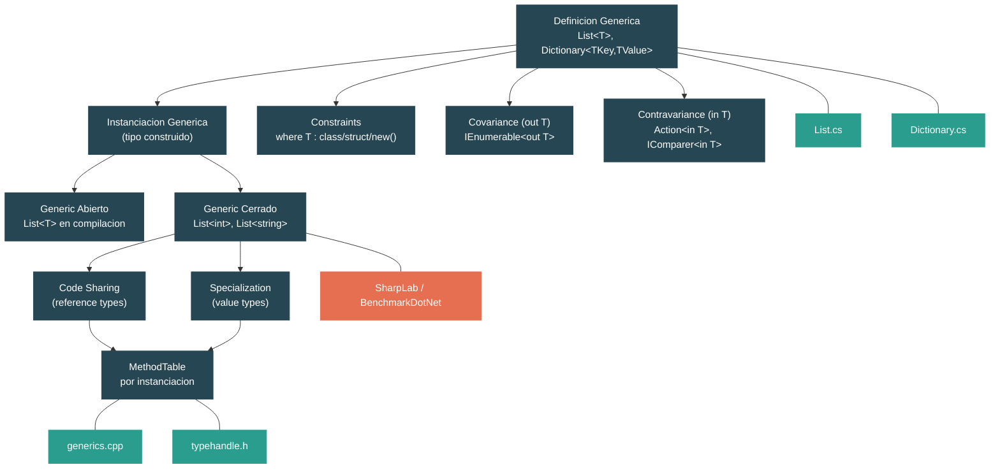

# Nivel 2: Practicante — Generics: Del Sintaxis a la Especializacion en Runtime

> **Perfil objetivo:** Desarrollador que usa generics a diario pero no sabe como el runtime los especializa
> **Esfuerzo estimado:** 4 horas
> **Prerrequisitos:** [Nivel 1 completo](01-foundations-type-system.md) (especialmente 1.3 Sistema de Tipos)
> [English version](../en/02-practitioner-generics.md)

---

## Objetivos de Aprendizaje

Al finalizar este modulo vas a poder:

1. Explicar por que se introdujeron los generics en .NET 2.0 y que problemas resuelven comparados con `ArrayList` y APIs basadas en `object`.
2. Leer definiciones de tipos genericos en el codigo fuente del runtime e identificar como los type parameters fluyen a traves de campos, metodos e interfaces.
3. Describir los seis tipos de constraints genericos (`where T : class`, `struct`, `new()`, `notnull`, clase base e interfaz) y explicar que habilita cada uno en tiempo de compilacion y runtime.
4. Distinguir covariance (`out T`) de contravariance (`in T`) e identificar que interfaces del BCL usan cada una.
5. Explicar como el runtime de CoreCLR comparte codigo nativo para instanciaciones de reference types pero genera codigo especializado para cada instanciacion de value types.
6. Trazar el camino desde una definicion de tipo generico hasta un `MethodTable` construido en el codigo fuente del runtime (`generics.cpp`, `typehandle.h`).
7. Describir como se resuelven y despachan los metodos genericos y delegates genericos (`Func<T>`, `Action<T>`).
8. Identificar escenarios de performance donde los generics eliminan boxing y habilitan devirtualization del JIT.

---

## Mapa Conceptual



---

## Curriculum

### Leccion 1 — Por Que Existen los Generics

#### Que vas a aprender

Antes de .NET 2.0, toda coleccion de proposito general almacenaba `object`. Esto significaba boxing de cada value type al insertar y casts inseguros al recuperar. Los generics resolvieron ambos problemas. En esta leccion vas a entender el costo del mundo pre-generico y por que `List<T>` reemplazo a `ArrayList`.

#### El concepto

Considera el viejo `System.Collections.ArrayList`:

```csharp
var numbers = new ArrayList();
numbers.Add(42);        // boxing: int -> object (alocacion en el heap)
numbers.Add("hello");   // sin error del compilador -- se pierde type safety
int n = (int)numbers[0]; // cast manual requerido; puede tirar excepcion en runtime
```

Tres problemas a la vez:

| Problema | Causa | Costo |
|---|---|---|
| **Boxing** | `Add(object)` fuerza los value types al heap | Alocacion extra + presion de GC por elemento |
| **Sin type safety** | `ArrayList` acepta cualquier `object` | Bugs detectados solo en runtime, no en compilacion |
| **Overhead de casting** | Cada recuperacion requiere `(int)numbers[i]` | Chequeo de tipo en runtime + posible `InvalidCastException` |

Ahora compara con el generico `List<T>`:

```csharp
var numbers = new List<int>();
numbers.Add(42);         // sin boxing: se almacena directamente como int
// numbers.Add("hello"); // error de compilacion: no se puede convertir string a int
int n = numbers[0];      // sin cast necesario, retorna int
```

Los generics proveen **type safety en compilacion**, **cero boxing para value types**, y **codigo mas limpio sin casts**.

#### En el codigo fuente

Abri `src/libraries/System.Private.CoreLib/src/System/Collections/Generic/List.cs`. La declaracion de la clase cuenta la historia:

```csharp
public class List<T> : IList<T>, IList, IReadOnlyList<T>
{
    internal T[] _items;
    internal int _size;
```

El almacenamiento interno es `T[]` — un array tipado. Cuando `T` es `int`, el runtime crea un `int[]` donde cada elemento ocupa exactamente 4 bytes sin object headers, sin punteros a MethodTable, sin boxing. Compara esto mentalmente con `ArrayList`, que usa `object[]` — cada `int` almacenado ahi seria un objeto boxeado de 24 bytes en un sistema de 64 bits.

Nota tambien el campo estatico:

```csharp
private static readonly T[] s_emptyArray = new T[0];
```

El campo `static` es por instanciacion: `List<int>` tiene su propio `s_emptyArray` distinto del de `List<string>`. Esto es una consecuencia de como el runtime crea estado separado para cada instanciacion generica.

#### Ejercicio practico

1. Escribi un micro-benchmark que agregue 1 millon de enteros a un `ArrayList` vs un `List<int>`:
   ```csharp
   var arrayList = new System.Collections.ArrayList();
   var genericList = new List<int>();
   var sw = System.Diagnostics.Stopwatch.StartNew();
   for (int i = 0; i < 1_000_000; i++) arrayList.Add(i);
   Console.WriteLine($"ArrayList: {sw.ElapsedMilliseconds}ms");
   sw.Restart();
   for (int i = 0; i < 1_000_000; i++) genericList.Add(i);
   Console.WriteLine($"List<int>: {sw.ElapsedMilliseconds}ms");
   ```
2. Usa [SharpLab](https://sharplab.io/) para compilar `new ArrayList().Add(42)` y `new List<int>().Add(42)`. Busca la instruccion IL `box` en la version de `ArrayList` y su ausencia en la version de `List<int>`.
3. Intenta hacer `Add("hello")` a un `List<int>` — confirma que el compilador lo rechaza.

#### Conclusion clave

Los generics no son solo azucar sintactico. Cambian lo que pasa a nivel de IL y a nivel del runtime. `List<int>` almacena enteros crudos en un `int[]` contiguo con cero overhead por elemento. Por eso los generics fueron una de las funcionalidades mas impactantes jamas agregadas a .NET.

#### Concepcion erronea comun

> *"Los generics son como los templates de C++ — solo sustitucion de texto."*
>
> No. Los templates de C++ se expanden en tiempo de compilacion en codigo completamente separado por instanciacion. Los generics de .NET son un concepto de primera clase en el sistema de tipos y el IL. El JIT decide en runtime si compartir codigo (para reference types) o especializar (para value types). La definicion de tipo generico existe como una sola entidad de metadata; los templates no.

---

### Leccion 2 — Constraints e Interfaces

#### Que vas a aprender

Los constraints de type parameters le dicen al compilador (y al runtime) que capacidades debe tener `T`. Sin constraints, `T` se trata como `object` — no podes llamar ningun metodo mas alla de `ToString`, `Equals` y `GetHashCode`. En esta leccion vas a ver como los constraints desbloquean algoritmos y como el BCL usa interfaces genericas como `IComparer<T>` e `IEquatable<T>`.

#### El concepto

Las seis categorias de constraints:

| Constraint | Sintaxis | Que habilita |
|---|---|---|
| **Reference type** | `where T : class` | `T` puede ser `null`, puede usarse como referencia |
| **Value type** | `where T : struct` | Sin boxing para `T`, `default(T)` es zero-init, no puede ser `null` |
| **Constructor** | `where T : new()` | Podes escribir `new T()` dentro del metodo generico |
| **Not-null** | `where T : notnull` | Excluye nullable reference types y nullable value types |
| **Clase base** | `where T : SomeClass` | Acceso a miembros de `SomeClass` sin casting |
| **Interfaz** | `where T : IComparable<T>` | Llamar metodos de la interfaz directamente sobre `T` |

Los constraints se verifican en compilacion y se validan en tiempo de JIT. Si un constraint dice `where T : struct`, el runtime sabe que `T` nunca sera null y siempre sera un value type, permitiendole generar codigo mas ajustado.

#### En el codigo fuente

**`Dictionary<TKey, TValue>`** en `src/libraries/System.Private.CoreLib/src/System/Collections/Generic/Dictionary.cs` demuestra el constraint `notnull`:

```csharp
public class Dictionary<TKey, TValue> : ...
    where TKey : notnull
```

Este constraint previene que `Dictionary<string?, int>` compile — keys null romperian el lookup basado en hash.

Dentro del constructor podes ver como el constraint interactua con la performance:

```csharp
// Para reference types, siempre queremos almacenar una instancia de comparer...
// Para value types, si no se provee comparer... preferimos usar
// EqualityComparer<TKey>.Default.Equals en cada uso, habilitando al JIT
// a devirtualizar y posiblemente inlinear la operacion.
if (!typeof(TKey).IsValueType)
{
    _comparer = comparer ?? EqualityComparer<TKey>.Default;
}
```

Este chequeo `typeof(TKey).IsValueType` se evalua por el JIT en tiempo de instanciacion — se convierte en una constante `true` o `false`, y la rama muerta se elimina completamente. Este es un patron poderoso: codigo generico que bifurca segun el type parameter, con cero costo en runtime porque el JIT remueve la rama no tomada.

**`IComparer<T>`** en `src/libraries/System.Private.CoreLib/src/System/Collections/Generic/IComparer.cs`:

```csharp
public interface IComparer<in T> where T : allows ref struct
{
    int Compare(T? x, T? y);
}
```

Nota la keyword `in` (contravariance — lo cubrimos en la Leccion 3) y el anti-constraint `allows ref struct` que permite que tipos `ref struct` como `Span<T>` se usen como `T`.

**`IEquatable<T>`** en `src/libraries/System.Private.CoreLib/src/System/IEquatable.cs`:

```csharp
public interface IEquatable<T> where T : allows ref struct
{
    bool Equals(T? other);
}
```

Cuando un struct implementa `IEquatable<T>`, provee un metodo tipado `Equals(T?)` que evita boxing. Sin esto, el unico `Equals` disponible es `Equals(object?)`, que boxea el argumento. Por eso los comentarios del codigo fuente en `Dictionary.cs` hablan de devirtualization — cuando el JIT conoce el `T` concreto, puede inlinear `IEquatable<T>.Equals` directamente.

#### Ejercicio practico

1. Escribi un metodo generico que requiera `IComparable<T>`:
   ```csharp
   static T Max<T>(T a, T b) where T : IComparable<T>
       => a.CompareTo(b) >= 0 ? a : b;

   Console.WriteLine(Max(3, 7));       // 7
   Console.WriteLine(Max("apple", "banana")); // "banana"
   ```
2. Intenta remover el constraint y llamar `a.CompareTo(b)` — observa el error del compilador.
3. Agrega un constraint `where T : struct` y confirma que `Max<string>` ya no compila.
4. Abri `Nullable.cs` y nota el constraint `where T : struct`. Intenta `Nullable<string>` — falla porque `string` es una clase.

#### Conclusion clave

Los constraints no son solo documentacion — cambian lo que el compilador permite y lo que el JIT puede optimizar. El constraint `struct` habilita garantias de cero boxing. Los constraints de interfaz habilitan devirtualization. El constraint `notnull` previene bugs relacionados con null. Siempre usa el constraint mas ajustado que tu algoritmo requiera.

#### Concepcion erronea comun

> *"Si no agrego constraints, mi codigo generico funciona con todo."*
>
> Compila, pero no puede hacer mucho. Sin constraints, `T` se trata como `object`: no podes llamar ningun metodo especifico del tipo, no podes usar operadores (`+`, `<`), y no podes garantizar non-null. Generics sin constraints solo son utiles para almacenamiento (como `List<T>`) y operaciones de identidad.

---

### Leccion 3 — Covariance y Contravariance

#### Que vas a aprender

La varianza determina si un tipo generico puede sustituirse cuando el type argument cambia a lo largo de una jerarquia de herencia. `IEnumerable<Dog>` puede usarse donde se espera `IEnumerable<Animal>` (covariance), mientras que `Action<Animal>` puede usarse donde se espera `Action<Dog>` (contravariance). Esta leccion explica las reglas, los ejemplos del BCL, y por que los arrays son un caso de advertencia.

#### El concepto

**Covariance** (`out T`): El type parameter aparece solo en posiciones de *salida* (tipos de retorno). Si `Dog : Animal`, entonces `IEnumerable<Dog>` es asignable a `IEnumerable<Animal>`.

```csharp
IEnumerable<Dog> dogs = GetDogs();
IEnumerable<Animal> animals = dogs; // legal: covariance
```

**Contravariance** (`in T`): El type parameter aparece solo en posiciones de *entrada* (parametros). Si `Dog : Animal`, entonces `Action<Animal>` es asignable a `Action<Dog>`.

```csharp
Action<Animal> feedAnimal = a => a.Feed();
Action<Dog> feedDog = feedAnimal; // legal: contravariance
```

La intuicion:
- **Covariance** es segura para *productores*: si solo estas leyendo valores de `T`, un `T` mas derivado siempre es seguro.
- **Contravariance** es segura para *consumidores*: si solo estas aceptando valores de `T`, un `T` menos derivado siempre es seguro.

Interfaces clave del BCL:

| Interfaz | Varianza | Direccion | Por que |
|---|---|---|---|
| `IEnumerable<out T>` | Covariante | Produce valores `T` | `GetEnumerator()` retorna `T`, nunca lo acepta |
| `IReadOnlyList<out T>` | Covariante | Produce `T` via indexer | `this[int]` retorna `T` |
| `IComparer<in T>` | Contravariante | Consume valores `T` | `Compare(T, T)` solo toma `T` como entrada |
| `Action<in T>` | Contravariante | Consume `T` | `void Action(T obj)` |
| `Func<out TResult>` | Covariante | Produce `TResult` | `TResult Func()` |
| `Func<in T, out TResult>` | Ambas | `T` entrada, `TResult` salida | La entrada es contravariante, la salida covariante |

**Arrays: covariance rota.** En .NET, `Dog[]` es asignable a `Animal[]`. Fue una decision de diseno de .NET 1.0 (antes de que existieran los generics) para soportar patrones tipo Java. Es inseguro:

```csharp
Dog[] dogs = new Dog[10];
Animal[] animals = dogs;    // compila — array covariance
animals[0] = new Cat();     // compila — pero tira ArrayTypeMismatchException en runtime!
```

El runtime debe chequear cada escritura de elemento del array para asegurar type safety. Este es el "impuesto de array covariance" — un chequeo en runtime por cada escritura que `IList<T>` generico (que es invariante) evita completamente.

#### En el codigo fuente

**`IEnumerable<out T>`** en `src/libraries/System.Private.CoreLib/src/System/Collections/Generic/IEnumerable.cs`:

```csharp
public interface IEnumerable<out T> : IEnumerable
    where T : allows ref struct
{
    new IEnumerator<T> GetEnumerator();
}
```

La keyword `out` en `T` es lo que hace covariante a esta interfaz. Restringe la interfaz para que `T` solo pueda aparecer en posiciones de retorno. Si alguien intentara agregar un metodo `void Add(T item)` a esta interfaz, el compilador lo rechazaria — `T` no puede aparecer como tipo de parametro en una interfaz covariante.

**`IComparer<in T>`** en `src/libraries/System.Private.CoreLib/src/System/Collections/Generic/IComparer.cs`:

```csharp
public interface IComparer<in T> where T : allows ref struct
{
    int Compare(T? x, T? y);
}
```

La keyword `in` hace a `T` contravariante. `T` aparece solo como tipos de parametro, nunca como tipo de retorno. Esto significa que un `IComparer<Animal>` puede comparar dos animales cualesquiera — incluyendo perros — asi que es asignable de forma segura a `IComparer<Dog>`.

**`Action<in T>`** en `src/libraries/System.Private.CoreLib/src/System/Action.cs`:

```csharp
public delegate void Action<in T>(T obj)
    where T : allows ref struct;
```

Cada sobrecarga de `Action` marca todos los type parameters como `in` — son todos contravariantes porque todos aparecen solo como entradas (los parametros del delegate).

**`IList<T>`** (invariante) en `src/libraries/System.Private.CoreLib/src/System/Collections/Generic/IList.cs`:

```csharp
public interface IList<T> : ICollection<T>
{
    T this[int index] { get; set; }
    // ...
}
```

Nota: sin `in` ni `out` en `T`. `IList<T>` es *invariante* porque `T` aparece tanto en posiciones de entrada (`set`) como de salida (`get`). Un `IList<Dog>` NO es asignable a `IList<Animal>` — si lo fuera, podrias insertar un `Cat` a traves de la referencia `Animal`. Este es el diseno correcto que evita el problema de array covariance.

#### Ejercicio practico

1. Proba covariance con `IEnumerable`:
   ```csharp
   IEnumerable<string> strings = new List<string> { "a", "b" };
   IEnumerable<object> objects = strings; // funciona: covariance
   foreach (object o in objects) Console.WriteLine(o);
   ```
2. Proba contravariance con `Action`:
   ```csharp
   Action<object> printObj = o => Console.WriteLine(o);
   Action<string> printStr = printObj; // funciona: contravariance
   printStr("hello");
   ```
3. Demostra el problema de array covariance:
   ```csharp
   string[] strings = { "a", "b", "c" };
   object[] objects = strings; // compila (array covariance)
   try { objects[0] = 42; }   // compila pero tira excepcion en runtime
   catch (ArrayTypeMismatchException) { Console.WriteLine("Atrapado!"); }
   ```
4. Confirma que `IList` es invariante:
   ```csharp
   // IList<string> strList = new List<string>();
   // IList<object> objList = strList; // NO compila
   ```

#### Conclusion clave

La varianza es sobre sustituibilidad de tipos. Covariance (`out`) es para productores, contravariance (`in`) es para consumidores, e invariance es para tipos que hacen ambas cosas. Los arrays tienen covariance insegura incorporada de la era pre-generics. Las interfaces genericas arreglan esto haciendo la varianza explicita y verificada por el compilador.

#### Concepcion erronea comun

> *"Covariance y contravariance funcionan en clases, no solo en interfaces."*
>
> En C#, las anotaciones de varianza (`in`/`out`) solo se permiten en *interfaces* y *delegates*. No podes hacer una `class MyList<out T>`. Esto es porque las clases pueden tener campos mutables de tipo `T`, lo que romperia la garantia de seguridad. Las interfaces y delegates restringen como se puede usar `T`, haciendo la varianza demostrablemente segura.

---

### Leccion 4 — Como el Runtime Maneja los Generics

#### Que vas a aprender

Esta es la leccion central del modulo. Cuando escribis `List<int>` y `List<string>`, el runtime hace cosas muy diferentes por debajo. Para reference types, *comparte* un unico cuerpo de metodo compilado usando una representacion canonica. Para value types, *especializa* — generando un cuerpo de codigo nativo distinto para cada tipo. Vas a trazar esta logica en el codigo fuente de CoreCLR.

#### El concepto

La implementacion de generics del CLR sigue un **modelo hibrido**:

**Los reference types comparten codigo.** `List<string>`, `List<object>` y `List<Stream>` usan todos el mismo codigo nativo. Esto es posible porque todos los reference types tienen el mismo tamano (un puntero) y siguen la misma convencion de llamada. El runtime usa una *forma canonica* — `__Canon` — para representar "cualquier reference type." Solo se compila un `MethodTable` para la forma canonica, y todas las instanciaciones de reference types apuntan sus cuerpos de metodo a ella.

**Los value types obtienen codigo especializado.** `List<int>`, `List<double>` y `List<Guid>` obtienen cada uno su propio codigo nativo. Esto es necesario porque:
1. Los value types tienen tamanos diferentes (4 bytes para `int`, 8 para `double`, 16 para `Guid`).
2. Los value types se almacenan inline — el layout del array `T[]` cambia con cada `T`.
3. El JIT puede optimizar codigo especializado — por ejemplo, usando instrucciones SIMD para comparaciones de `int`.

Cada instanciacion distinta obtiene su propia `MethodTable`:

```
List<string>  → MethodTable #1 (comparte codigo con todos los List<> de reference type)
List<object>  → MethodTable #2 (comparte codigo con MethodTable #1)
List<int>     → MethodTable #3 (codigo especializado unico)
List<double>  → MethodTable #4 (codigo especializado unico)
```

Cada `MethodTable` tambien lleva un *generic dictionary* — una tabla de informacion especifica del tipo (type handles, method handles, direcciones de campos estaticos) que el codigo compartido consulta cuando necesita hacer trabajo especifico del tipo.

#### En el codigo fuente

La logica de forma canonica vive en `src/coreclr/vm/generics.cpp`. La funcion `CanonicalizeGenericArg` es el corazon de la decision de compartir:

```cpp
TypeHandle ClassLoader::CanonicalizeGenericArg(TypeHandle thGenericArg)
{
    CorElementType et = thGenericArg.GetSignatureCorElementType();

    // Los reference types comparten via la MethodTable canonica
    if (CorTypeInfo::IsObjRef_NoThrow(et))
        RETURN(TypeHandle(g_pCanonMethodTableClass));

    // Los value types NO se comparten — cada uno obtiene su propia instanciacion
    if (et == ELEMENT_TYPE_VALUETYPE)
    {
        RETURN(TypeHandle(thGenericArg.GetCanonicalMethodTable()));
    }

    RETURN(thGenericArg);
}
```

La variable clave es `g_pCanonMethodTableClass` — este es el tipo `__Canon`, el centinela que significa "cualquier reference type." Cuando el runtime verifica si dos instanciaciones pueden compartir codigo, canonicaliza cada type argument: `string` se convierte en `__Canon`, `object` se convierte en `__Canon`, pero `int` queda como `int`.

La funcion `IsSharableInstantiation` verifica si al menos un type argument puede compartirse:

```cpp
BOOL ClassLoader::IsSharableInstantiation(Instantiation inst)
{
    for (DWORD i = 0; i < inst.GetNumArgs(); i++)
    {
        if (CanonicalizeGenericArg(inst[i]).IsCanonicalSubtype())
            return TRUE;
    }
    return FALSE;
}
```

Cuando se solicita una instanciacion no canonica (por ej., `List<string>`), `CreateTypeHandleForNonCanonicalGenericInstantiation` crea una nueva `MethodTable` *copiando la canonica* y parcheando su generic dictionary:

```cpp
// Crear una instanciacion no canonica de un tipo generico,
// copiando la method table de la instanciacion canonica
TypeHandle ClassLoader::CreateTypeHandleForNonCanonicalGenericInstantiation(...)
{
    // Cargar la instanciacion canonica
    canonType = ClassLoader::LoadCanonicalGenericInstantiation(pTypeKey, ...);
    MethodTable* pOldMT = canonType.AsMethodTable();

    // Alocar una nueva MethodTable
    // Copiar entradas del vtable de la MT canonica
    // Configurar el generic dictionary con los type args de esta instanciacion
}
```

En `src/coreclr/vm/typehandle.h`, podes ver el comentario de diseno que conecta todo:

```cpp
// Las instanciaciones de tipos genericos (en sintaxis C#: C<ty_1,...,ty_n>) se representan
// mediante MethodTables, es decir, se aloca una nueva MethodTable para cada instanciacion.
// Las entradas en estas tablas (es decir, el codigo), sin embargo, frecuentemente se comparten.
```

Este es el insight fundamental: cada tipo generico cerrado obtiene su propia `MethodTable` (identidad), pero el *codigo* al que apuntan esas tablas puede ser compartido (eficiencia).

#### Ejercicio practico

1. Usa `typeof()` para inspeccionar la identidad de tipos genericos:
   ```csharp
   Console.WriteLine(typeof(List<string>) == typeof(List<object>)); // False
   Console.WriteLine(typeof(List<string>).GetGenericTypeDefinition()
                  == typeof(List<object>).GetGenericTypeDefinition()); // True
   Console.WriteLine(typeof(List<>)); // List`1 — la definicion de tipo generico abierto
   ```
2. Inspeciona direcciones de MethodTable con el debugger. En un build Debug, pone un breakpoint y usa la ventana Immediate:
   ```csharp
   var a = new List<string>();
   var b = new List<object>();
   var c = new List<int>();
   // En el debugger, inspecciona RuntimeHelpers.GetMethodTable(a) vs b vs c
   // a y b tienen MethodTables diferentes (identidad diferente)
   // pero sus direcciones de codigo de metodo pueden superponerse (compartido)
   // c tiene codigo de metodo completamente diferente (especializado)
   ```
3. En SharpLab, compila `List<int>.Add(42)` y `List<string>.Add("x")` — examina el JIT ASM. Para `int`, vas a ver el valor almacenado directamente en el array. Para `string`, vas a ver una asignacion de referencia a traves de un write barrier (tracking del GC).

#### Conclusion clave

La implementacion de generics del CLR es hibrida: code sharing para reference types (porque todas las referencias son del tamano de un puntero) y specialization para value types (porque difieren en tamano y layout). Esto te da lo mejor de ambos mundos — codigo compacto para reference types y performance maxima para value types. La forma canonica (`__Canon`) es el mecanismo que hace posible el sharing.

---

### Leccion 5 — Metodos Genericos y Delegates

#### Que vas a aprender

Los generics no se limitan a tipos. Los metodos y delegates tambien pueden ser genericos, y el runtime los maneja con el mismo modelo de sharing/specialization. En esta leccion vas a examinar `Func<T>`, `Action<T>`, y la resolucion de metodos genericos.

#### El concepto

**Metodos genericos** introducen sus propios type parameters, independientes de cualquier tipo generico contenedor:

```csharp
// Un metodo generico en una clase no generica
public static T Identity<T>(T value) => value;

// Uso — el compilador infiere T del argumento
int n = Identity(42);        // T inferido como int
string s = Identity("hello"); // T inferido como string
```

El JIT aplica las mismas reglas de sharing que para tipos:
- `Identity<string>` e `Identity<object>` comparten codigo nativo.
- `Identity<int>` e `Identity<double>` obtienen codigo nativo separado.

**Delegates genericos** son la base de la programacion funcional en .NET:

```csharp
Func<int, string> converter = n => n.ToString();
Action<string> printer = Console.WriteLine;
```

`Func<T, TResult>` y `Action<T>` son simplemente tipos delegate parametrizados por sus tipos de entrada y salida.

#### En el codigo fuente

**`Action<T>`** en `src/libraries/System.Private.CoreLib/src/System/Action.cs`:

```csharp
public delegate void Action<in T>(T obj)
    where T : allows ref struct;
```

El archivo define 16 sobrecargas de `Action` (desde `Action<T>` hasta `Action<T1,...,T16>`), cada una con todos los parametros marcados `in` para contravariance. El anti-constraint `allows ref struct` (agregado en versiones recientes de .NET) permite pasar `Span<T>` y otros ref structs a estos delegates.

Tambien en el mismo archivo, nota otros delegates genericos:

```csharp
public delegate int Comparison<in T>(T x, T y)
    where T : allows ref struct;

public delegate TOutput Converter<in TInput, out TOutput>(TInput input)
    where TInput : allows ref struct
    where TOutput : allows ref struct;

public delegate bool Predicate<in T>(T obj)
    where T : allows ref struct;
```

Estos son los bloques de construccion usados en todo LINQ y la biblioteca de colecciones. `Comparison<T>` es la version delegate de `IComparer<T>.Compare`. `Predicate<T>` se usa en `List<T>.FindAll`, `Array.FindAll`, etc.

**Generic virtual methods (GVM)** son un caso especial que presenta desafios. Cuando un metodo virtual es tambien generico, el runtime no puede simplemente buscar un slot en la vtable — necesita encontrar la especializacion correcta en tiempo de dispatch. CoreCLR maneja esto a traves del *generic dictionary* adjunto a cada `MethodTable`, que cachea instanciaciones de metodos resueltos.

#### Ejercicio practico

1. Escribi un metodo generico e inspecciona el output del JIT:
   ```csharp
   static T Max<T>(T a, T b) where T : IComparable<T>
       => a.CompareTo(b) >= 0 ? a : b;

   Console.WriteLine(Max(3, 7));         // especializacion de value type
   Console.WriteLine(Max("abc", "xyz")); // codigo compartido de reference type
   ```
2. Usa `Func<T>` y `Action<T>` con diferentes type arguments:
   ```csharp
   Func<int, bool> isPositive = n => n > 0;
   Func<string, bool> isNonEmpty = s => s.Length > 0;

   Console.WriteLine(isPositive(42));      // True
   Console.WriteLine(isNonEmpty("hello")); // True
   ```
3. Verifica varianza de delegates:
   ```csharp
   // Func<out TResult> — covariante en TResult
   Func<string> getString = () => "hello";
   Func<object> getObject = getString; // funciona: covariance

   // Action<in T> — contravariante en T
   Action<object> actOnObj = o => Console.WriteLine(o);
   Action<string> actOnStr = actOnObj; // funciona: contravariance
   ```

#### Conclusion clave

Los metodos genericos y delegates siguen las mismas reglas que los tipos genericos: el JIT comparte codigo para instanciaciones de reference types y especializa para value types. Los delegates genericos con anotaciones de varianza (`Func<out T>`, `Action<in T>`) proveen programacion de orden superior type-safe que elimina la necesidad de casts manuales.

---

### Leccion 6 — Implicaciones de Performance

#### Que vas a aprender

Los generics no son solo sobre type safety — son una herramienta de performance. En esta leccion vas a examinar como los generics eliminan boxing, habilitan devirtualization, y permiten abstracciones de costo cero basadas en structs.

#### El concepto

**1. Eliminacion de boxing.** Este es el beneficio mas visible. Cuando almacenas un `int` en un `List<int>`, no ocurre boxing. El `int` va directamente al array `int[]` de respaldo. Compara:

| Operacion | `ArrayList` | `List<int>` |
|---|---|---|
| Agregar 1M de ints | 1M de alocaciones en el heap (boxing) | 0 alocaciones en el heap |
| Memoria por int | ~24 bytes (objeto boxeado) | 4 bytes (int crudo) |
| Presion de GC | Alta | Ninguna |

**2. Devirtualization e inlining.** Cuando el JIT compila una instanciacion de value type, conoce el tipo exacto de `T`. Esto le permite:
- Reemplazar llamadas virtuales con llamadas directas (devirtualization).
- Inlinear metodos pequenos como `IEquatable<T>.Equals`.
- Remover ramas muertas (por ej., `typeof(T).IsValueType` se convierte en una constante).

El constructor de `Dictionary<TKey, TValue>` demuestra esto explicitamente:

```csharp
if (!typeof(TKey).IsValueType)
{
    _comparer = comparer ?? EqualityComparer<TKey>.Default;
}
else if (comparer is not null && comparer != EqualityComparer<TKey>.Default)
{
    _comparer = comparer;
}
```

Para `Dictionary<int, string>`, el JIT ve `typeof(int).IsValueType` como `true`, elimina la primera rama, y para el caso comun donde no se provee comparer personalizado, elimina el acceso al campo `_comparer` completamente — llamando a `EqualityComparer<int>.Default.Equals` directamente, que puede entonces devirtualizar e inlinear.

**3. Struct generics como abstracciones de costo cero.** Cuando un type parameter generico es un struct, el JIT frecuentemente puede eliminar todo el overhead de abstraccion. Un patron clasico:

```csharp
public struct StructComparer : IComparer<int>
{
    public int Compare(int x, int y) => x.CompareTo(y);
}

// Usando un struct como type argument generico
void Sort<TComparer>(int[] array, TComparer comparer) where TComparer : IComparer<int>
{
    // Cuando TComparer es un struct, el JIT:
    // 1. Genera codigo especializado para StructComparer
    // 2. Devirtualiza comparer.Compare() a una llamada directa
    // 3. Inlinea el cuerpo del metodo Compare
    // Resultado neto: la abstraccion cuesta cero en runtime
}
```

Este patron se usa intensivamente en las implementaciones de sorting del BCL (ver `ArraySortHelper<T>`) para lograr performance equivalente a codigo de comparacion escrito a mano mientras se mantiene flexibilidad generica.

**4. Campos estaticos por instanciacion.** Cada tipo generico cerrado tiene su propia copia de campos estaticos. `List<int>` y `List<string>` tienen instancias separadas de `s_emptyArray`. Esto no es un truco de performance — es un requerimiento de correctitud — pero significa que los tipos genericos pueden cachear datos especificos del tipo sin sincronizacion entre instanciaciones.

#### En el codigo fuente

El codigo de `Nullable<T>` en `src/libraries/System.Private.CoreLib/src/System/Nullable.cs` muestra el constraint `struct` en accion:

```csharp
public partial struct Nullable<T> where T : struct
```

Porque `T : struct`, el JIT sabe:
- `T` tiene un tamano fijo y conocido en tiempo de instanciacion.
- No se necesita boxing al almacenar o recuperar `T`.
- `default(T)` es todo ceros, sin puntero null.
- Todo el `Nullable<T>` puede vivir en el stack.

Los metodos helper estaticos `Nullable.Compare<T>` y `Nullable.Equals<T>` usan `Comparer<T>.Default` y `EqualityComparer<T>.Default` — patrones singleton genericos que el JIT puede devirtualizar para `T` concreto.

#### Ejercicio practico

1. Usa BenchmarkDotNet para comparar performance de boxing vs generics:
   ```csharp
   [Benchmark]
   public int SumArrayList()
   {
       var list = new ArrayList();
       for (int i = 0; i < 1000; i++) list.Add(i);
       int sum = 0;
       for (int i = 0; i < list.Count; i++) sum += (int)list[i];
       return sum;
   }

   [Benchmark]
   public int SumGenericList()
   {
       var list = new List<int>();
       for (int i = 0; i < 1000; i++) list.Add(i);
       int sum = 0;
       for (int i = 0; i < list.Count; i++) sum += list[i];
       return sum;
   }
   ```
2. En SharpLab, compara el JIT ASM de ambos metodos y observa:
   - La version `ArrayList` tiene IL `box`/`unbox` y llamadas de alocacion de heap en el ASM.
   - La version `List<int>` trabaja directamente con `int[]` y no contiene alocaciones de heap en el loop.
3. Proba el patron de optimizacion `typeof(T).IsValueType`:
   ```csharp
   static string Describe<T>(T value)
   {
       if (typeof(T).IsValueType)
           return $"Value type: {value}, el tamano importa";
       else
           return $"Reference type: {value}";
   }
   // En SharpLab, compila Describe<int>(42) — confirma que solo queda una rama en el ASM
   ```

#### Conclusion clave

Los generics transforman la performance de .NET de tres maneras: eliminan boxing para value types, habilitan al JIT a devirtualizar e inlinear a traves de interfaces genericas, y permiten que type parameters basados en structs creen abstracciones de costo cero. El codigo fuente de `Dictionary<TKey, TValue>` es una clase magistral en explotar estas propiedades — leelo cuidadosamente.

---

## Guia de Lectura de Codigo Fuente

Estos son los archivos clave para este modulo. Las calificaciones de dificultad reflejan la complejidad conceptual para un lector de Nivel 2.

| # | Archivo | Dificultad | Que buscar |
|---|---|---|---|
| 1 | `src/libraries/System.Private.CoreLib/src/System/Collections/Generic/List.cs` | Dos estrellas | Almacenamiento `T[]`, `s_emptyArray` por instanciacion, como `T` fluye por todos los metodos |
| 2 | `src/libraries/System.Private.CoreLib/src/System/Collections/Generic/Dictionary.cs` | Tres estrellas | `where TKey : notnull`, la logica de comparer para value type vs reference type, uso de `IEqualityComparer<TKey>` |
| 3 | `src/libraries/System.Private.CoreLib/src/System/Collections/Generic/IEnumerable.cs` | Dos estrellas | Anotacion de covariance `out T`, el anti-constraint `allows ref struct` |
| 4 | `src/libraries/System.Private.CoreLib/src/System/Collections/Generic/IComparer.cs` | Dos estrellas | Anotacion de contravariance `in T`, como habilita algoritmos de sorting |
| 5 | `src/libraries/System.Private.CoreLib/src/System/Nullable.cs` | Dos estrellas | Constraint `where T : struct`, comportamiento especial de boxing, por que no tiene interfaces |
| 6 | `src/libraries/System.Private.CoreLib/src/System/Action.cs` | Dos estrellas | Las 16 sobrecargas de `Action`, `in` en cada parametro, `Comparison<T>`, `Predicate<T>`, `Converter<TInput, TOutput>` |
| 7 | `src/coreclr/vm/generics.cpp` | Tres estrellas | `CanonicalizeGenericArg`, `IsSharableInstantiation`, `CreateTypeHandleForNonCanonicalGenericInstantiation` |
| 8 | `src/coreclr/vm/typehandle.h` | Tres estrellas | El comentario de la clase `TypeHandle` explicando la representacion de instanciacion generica via MethodTables |

**Estrategia de lectura**: Empieza con los archivos 1 y 3 (colecciones C# familiares). Despues lee los archivos 5 y 6 (constraints y varianza en accion). Para los internos del runtime (archivos 7 y 8), lee los comentarios primero — explican las decisiones de diseno. El codigo en si es C++ pero la logica mapea directamente a los conceptos de la Leccion 4.

---

## Herramientas de Diagnostico y Comandos

| Herramienta / Tecnica | Que muestra | Como usarla |
|---|---|---|
| [SharpLab](https://sharplab.io/) | IL y JIT ASM para codigo generico vs no generico | Pega ambas versiones lado a lado; busca instrucciones IL `box`/`unbox` y targets de llamada en ASM |
| [BenchmarkDotNet](https://benchmarkdotnet.org/) | Comparacion precisa de performance | Compara `ArrayList` vs `List<T>`, medi alocaciones con `[MemoryDiagnoser]` |
| `typeof(T)` / `Type.GetGenericTypeDefinition()` | Identidad y relaciones de tipos genericos | `typeof(List<int>).GetGenericTypeDefinition() == typeof(List<>)` |
| `Type.MakeGenericType()` | Construir tipos cerrados en runtime | `typeof(List<>).MakeGenericType(typeof(int))` |
| Debugger de Visual Studio | Inspeccionar direcciones de MethodTable por instanciacion | Pone un breakpoint, usa ventana Watch en `RuntimeHelpers.GetMethodTable(obj)` |
| `dotnet dump` / SOS | Ver estructuras reales de MethodTable en un proceso en ejecucion | `dumpmt -md <address>` muestra method descriptors; compara shared vs specialized |
| Variable de entorno `DOTNET_JitDisasm` | Ver output del JIT para metodos especificos | `DOTNET_JitDisasm="List`1:Add"` muestra el ASM que produjo el JIT para `List<T>.Add` |

---

## Autoevaluacion

### Preguntas

1. **Por que `List<int>` evita boxing mientras `ArrayList` no?** Describe que pasa en memoria cuando llamas `Add(42)` en cada uno.

2. **Que constraint pone `Dictionary<TKey, TValue>` sobre `TKey`, y por que?** Que pasaria sin ese constraint?

3. **Explica por que `IEnumerable<Dog>` puede asignarse a `IEnumerable<Animal>` pero `IList<Dog>` no puede asignarse a `IList<Animal>`.** Cual es el problema de seguridad con `IList`?

4. **En `generics.cpp`, `CanonicalizeGenericArg` retorna `g_pCanonMethodTableClass` para reference types. Cual es la consecuencia practica?** Como afecta esto a `List<string>` vs `List<object>` en runtime?

5. **Por que el JIT genera codigo nativo separado para `List<int>` y `List<double>` pero comparte codigo entre `List<string>` y `List<object>`?** Que propiedad de los value types hace imposible el sharing?

6. **Explica el chequeo `typeof(TKey).IsValueType` en el constructor de `Dictionary`.** Por que no es una rama de runtime normal? Que hace el JIT con el?

7. **Cual es la diferencia entre un tipo generico abierto y un tipo generico cerrado?** Da un ejemplo de cada uno y explica cuando existe cada uno.

### Desafio Practico

Escribi una clase generica `Cache<TKey, TValue>` que demuestre tres conceptos de este modulo:

1. Usa un constraint `where TKey : notnull` (como `Dictionary`).
2. Acepta un parametro `IEqualityComparer<TKey>` y usa el patron `typeof(TKey).IsValueType` de `Dictionary` para optimizar el almacenamiento del comparer.
3. Escribi un metodo `GetOrAdd(TKey key, Func<TKey, TValue> factory)` que retorne el valor cacheado o cree y cachee uno nuevo.

Probalo con keys de value type y reference type. Usa SharpLab para inspeccionar el IL y confirmar que no ocurre boxing con keys de tipo `int`.

<details>
<summary>Pista</summary>

```csharp
public class Cache<TKey, TValue> where TKey : notnull
{
    private readonly Dictionary<TKey, TValue> _store;

    public Cache(IEqualityComparer<TKey>? comparer = null)
    {
        // El constructor de Dictionary ya hace la optimizacion IsValueType
        _store = new Dictionary<TKey, TValue>(comparer);
    }

    public TValue GetOrAdd(TKey key, Func<TKey, TValue> factory)
    {
        if (!_store.TryGetValue(key, out TValue? value))
        {
            value = factory(key);
            _store[key] = value;
        }
        return value;
    }
}

// Probar con key de value type (especializado, sin boxing)
var intCache = new Cache<int, string>();
Console.WriteLine(intCache.GetOrAdd(42, k => k.ToString())); // "42"

// Probar con key de reference type (codigo compartido)
var stringCache = new Cache<string, int>();
Console.WriteLine(stringCache.GetOrAdd("hello", k => k.Length)); // 5
```
</details>

---

## Conexiones

| Direccion | Modulo | Relacion |
|---|---|---|
| **Anterior** | [1.3 — El Sistema de Tipos](01-foundations-type-system.md) | Aprendiste sobre value types, reference types y boxing. Los generics son la respuesta del sistema de tipos al problema del boxing. |
| **Siguiente** | [2.2 — Collections a Fondo](02-practitioner-collections.md) | Con los generics comprendidos, podes explorar como `Dictionary`, `HashSet` y `Span<T>` los usan internamente. |
| **Relacionado** | [2.5 — LINQ: De Extension Methods a Expression Trees](02-practitioner-linq.md) | LINQ esta construido completamente sobre interfaces genericas (`IEnumerable<T>`) y delegates (`Func<T, TResult>`). |
| **Mas profundo** | [4.2 — Internos del Sistema de Tipos](04-expert-type-system.md) | Como funcionan MethodTables, EEClasses y generic dictionaries a nivel nativo. |

---

## Glosario

| Termino | Definicion |
|---|---|
| **Generic type definition** | Un tipo con uno o mas type parameters que aun no estan especificados. Ejemplo: `List<T>`, `Dictionary<TKey, TValue>`. En reflection: `typeof(List<>)`. |
| **Constructed type (closed generic)** | Un tipo generico con todos los type parameters especificados. Ejemplo: `List<int>`, `Dictionary<string, object>`. Cada tipo cerrado tiene su propia `MethodTable`. |
| **Open generic** | Un tipo generico donde al menos un type parameter sigue sin enlazar. `List<T>` dentro de un metodo generico es abierto. Los open generics no pueden instanciarse directamente. |
| **Type parameter** | El placeholder (`T`, `TKey`, `TValue`) declarado en una definicion generica. Reemplazado por un type argument cuando el generico se cierra. |
| **Constraint** | Una clausula `where` que restringe que tipos pueden usarse como type argument: `class`, `struct`, `new()`, `notnull`, interfaz o clase base. |
| **Covariance** | Un type parameter marcado `out` que permite conversion implicita de `G<Derived>` a `G<Base>`. Solo en interfaces y delegates, y solo en posiciones de salida. |
| **Contravariance** | Un type parameter marcado `in` que permite conversion implicita de `G<Base>` a `G<Derived>`. Solo en interfaces y delegates, y solo en posiciones de entrada. |
| **Specialization** | El proceso por el cual el JIT genera codigo nativo separado para una instanciacion de value type. `List<int>` obtiene sus propios cuerpos de metodo compilados distintos de `List<double>`. |
| **Code sharing** | El proceso por el cual el JIT reutiliza el mismo codigo nativo para todas las instanciaciones de reference type de un generico. `List<string>` y `List<object>` comparten el mismo codigo compilado. |
| **Forma canonica (`__Canon`)** | El tipo interno del runtime usado para representar "cualquier reference type" al determinar code sharing. Todos los argumentos de reference type se reemplazan con `__Canon` para la instanciacion compartida. |
| **Generic dictionary** | Una estructura de datos por instanciacion adjunta a una `MethodTable` que almacena informacion especifica del tipo (type handles, method handles) necesaria para el codigo generico compartido. |
| **MethodTable** | La estructura nativa del runtime que representa un tipo en runtime. Cada instanciacion generica cerrada tiene su propia `MethodTable`, incluso si el codigo subyacente es compartido. |

---

## Referencias

| Recurso | Tipo | Relevancia |
|---|---|---|
| [Book of the Runtime — Type System Overview](https://github.com/dotnet/runtime/blob/main/docs/design/coreclr/botr/type-system.md) | Doc de diseno | Cubre instanciacion generica, formas canonicas y code sharing |
| [Book of the Runtime — Type Loader](https://github.com/dotnet/runtime/blob/main/docs/design/coreclr/botr/type-loader.md) | Doc de diseno | Como se cargan los tipos genericos y se construyen MethodTables |
| [ECMA-335 Standard, Section II.9 — Generics](https://www.ecma-international.org/publications-and-standards/standards/ecma-335/) | Especificacion | La definicion formal de generics en el CLI |
| [SharpLab](https://sharplab.io/) | Herramienta | Ver IL y JIT ASM para comparar codigo generico vs no generico |
| [BenchmarkDotNet](https://benchmarkdotnet.org/) | Herramienta | Medir costos de boxing y mejoras de performance de generics |
| [Stephen Toub — Performance Improvements in .NET](https://devblogs.microsoft.com/dotnet/) | Serie de blog | Posts anuales cubriendo optimizaciones de generics, devirtualization e inlining |
| [Jan Kotas — Design of Generics in .NET](https://github.com/dotnet/runtime/blob/main/docs/design/coreclr/botr/generics.md) | Doc de diseno | Decisiones de diseno interno para la implementacion de generics en CoreCLR |
| [Andrew Kennedy & Don Syme — Design and Implementation of Generics for the .NET CLR](https://www.microsoft.com/en-us/research/publication/design-and-implementation-of-generics-for-the-net-common-language-runtime/) | Paper de investigacion | El paper original de 2001 describiendo el modelo hibrido de sharing/specialization |

---

*Siguiente modulo: [2.2 — Collections a Fondo](02-practitioner-collections.md)*
