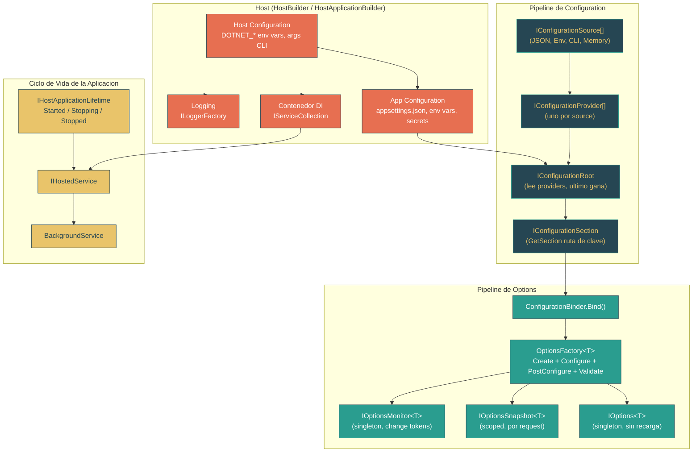

# Nivel 2: Practicante -- Configuration, Options y el Modelo de Hosting

> **Perfil objetivo:** Desarrollador que usa `Host.CreateDefaultBuilder` o `HostApplicationBuilder` pero quiere entender como se combinan las fuentes de configuration, como funciona el binding de options, y como el host conecta todo
> **Esfuerzo estimado:** 4 horas
> **Prerequisitos:** Modulo 2.4 (Inyeccion de Dependencias), Nivel 1 (Fundamentos)
> [English version](../en/02-practitioner-hosting.md)

---

## Objetivos de Aprendizaje

Al completar este modulo, vas a poder:

1. **Trazar** el pipeline completo de configuration desde archivos JSON y variables de entorno a traves de providers hasta `IConfiguration`.
2. **Explicar** el modelo de capas con sobreescritura y predecir que valor gana cuando multiples fuentes proveen la misma clave.
3. **Comparar** `HostBuilder` y `HostApplicationBuilder` y elegir el correcto para tu escenario.
4. **Distinguir** entre `IOptions<T>`, `IOptionsSnapshot<T>` e `IOptionsMonitor<T>` y seleccionar el correcto segun los requisitos de recarga.
5. **Describir** como `OptionsFactory<T>` crea, configura, post-configura y valida instancias de options.
6. **Mapear** el pipeline de logging por defecto desde la configuration del host a traves de `ILoggerFactory` hasta `ILogger<T>`.
7. **Implementar** `IHostedService` y `BackgroundService` y explicar el ciclo de vida del shutdown graceful.
8. **Navegar** los archivos de codigo fuente relevantes en `dotnet/runtime` y leerlos con confianza.

---

## Mapa Conceptual



---

## Curriculo

### Leccion 2.10.1: El Pipeline de Configuration -- Sources, Providers y el Modelo de Capas

**Lo que vas a aprender:** Configuration en .NET no es un simple lector de archivos -- es un pipeline de sources que producen providers, que se consultan en orden, donde el ultimo gana.

**El concepto:**

Imagina una pila de transparencias superpuestas, como las de un retroproyector. Cada transparencia representa un configuration source: una para `appsettings.json`, otra para `appsettings.Development.json`, otra para variables de entorno, otra para argumentos de linea de comandos. Cuando miras hacia abajo a traves de la pila, el valor no-transparente mas alto es el que ves. Ese es el modelo de sobreescritura **el-ultimo-gana**.

El pipeline tiene tres abstracciones clave:

| Abstraccion | Rol | Archivo fuente |
|---|---|---|
| `IConfigurationSource` | Describe *como* crear un provider (ej., "lee este archivo JSON") | Varios por paquete de provider |
| `IConfigurationProvider` | Lee y almacena pares clave-valor en un `Dictionary<string, string?>` plano | Cada paquete de provider (`JsonConfigurationProvider`, etc.) |
| `IConfigurationRoot` | Agrega todos los providers, los consulta en orden inverso (el ultimo agregado gana) | `src/libraries/Microsoft.Extensions.Configuration/src/ConfigurationRoot.cs` |

La interfaz `IConfiguration` es el contrato publico para consumir configuration:

```
src/libraries/Microsoft.Extensions.Configuration.Abstractions/src/IConfiguration.cs
```

Expone:
- `string? this[string key]` -- obtener/establecer un valor por clave
- `GetSection(string key)` -- navegar a una subseccion (ej., `"Logging:LogLevel:Default"`)
- `GetChildren()` -- enumerar las subsecciones hijas inmediatas
- `GetReloadToken()` -- observar cuando la configuration se recarga

**El proceso de construccion (`ConfigurationBuilder`):**

`ConfigurationBuilder` es la version simple, de construccion unica. Recolecta sources y luego llama a `Build()` para producir un `IConfigurationRoot`:

```csharp
// src/libraries/Microsoft.Extensions.Configuration/src/ConfigurationBuilder.cs
public IConfigurationRoot Build()
{
    var providers = new List<IConfigurationProvider>();
    foreach (IConfigurationSource source in _sources)
    {
        IConfigurationProvider provider = source.Build(this);
        providers.Add(provider);
    }
    return new ConfigurationRoot(providers);
}
```

Cada llamada a `IConfigurationSource.Build()` crea y carga un provider. El `ConfigurationRoot` resultante mantiene la lista ordenada y los consulta del ultimo al primero.

**La version en vivo (`ConfigurationManager`):**

`HostApplicationBuilder` usa `ConfigurationManager` en su lugar -- una clase que es *simultaneamente* un `IConfigurationBuilder` y un `IConfigurationRoot`. Cuando agregas un source, inmediatamente construye el provider y hace disponibles sus valores:

```
src/libraries/Microsoft.Extensions.Configuration/src/ConfigurationManager.cs
```

Esto significa que podes leer valores de configuration mientras todavia estas agregando sources -- util durante el inicio del host cuando la deteccion del environment depende de configuration ya cargada.

**Jerarquia de claves: dos puntos como separadores de ruta**

Las claves de configuration usan `:` como separador de ruta. Un archivo JSON como:

```json
{
  "Logging": {
    "LogLevel": {
      "Default": "Information"
    }
  }
}
```

produce la clave plana `Logging:LogLevel:Default` con valor `"Information"`. Las variables de entorno usan `__` (doble guion bajo) como separador seguro para plataformas, asi que `Logging__LogLevel__Default=Warning` sobreescribe la misma clave.

**Ejercicio de exploracion del codigo fuente:**

1. Abri `src/libraries/Microsoft.Extensions.Configuration/src/ConfigurationBuilder.cs` y lee el metodo `Build()`. Nota como itera los sources y llama a `source.Build(this)`.
2. Abri `src/libraries/Microsoft.Extensions.Configuration/src/ConfigurationManager.cs` y observa como implementa *tanto* `IConfigurationBuilder` como `IConfigurationRoot`. Nota el `ReferenceCountedProviderManager` que permite lecturas thread-safe mientras se modifican los sources.
3. Abri `src/libraries/Microsoft.Extensions.Configuration.Abstractions/src/IConfiguration.cs` y lee los cuatro miembros. Este es el contrato con el que interactua el codigo de tu aplicacion.

**Punto clave:** Configuration no es "leer un archivo." Es un pipeline ordenado de providers donde los sources posteriores sobreescriben a los anteriores, y `ConfigurationManager` hace que este pipeline sea vivo y mutable durante el inicio.

---

### Leccion 2.10.2: HostBuilder y HostApplicationBuilder -- Como el Host Conecta DI, Config y Logging

**Lo que vas a aprender:** El host es el orquestador que ensambla el pipeline de configuration, el contenedor DI y el sistema de logging en un `IHost` coherente dentro del cual corre tu aplicacion.

**El concepto:**

Pensa en el host como un contratista general construyendo una casa. El contratista no pone ladrillos ni cablea enchufes directamente -- coordina especialistas (configuration, DI, logging) en el orden correcto y se asegura de que la casa terminada tenga la plomeria funcionando antes de que alguien se mude.

.NET provee dos APIs de host builder:

| API | Estilo | Cuando usarlo |
|---|---|---|
| `HostBuilder` (basado en callbacks) | Registras lambdas que se ejecutan despues durante `Build()` | Codigo legacy, setup complejo multi-etapa |
| `HostApplicationBuilder` (imperativo) | Accedes directamente a las propiedades `.Configuration`, `.Services`, `.Logging` | Codigo nuevo (.NET 7+), mas simple y descubrible |

**El modelo de ejecucion diferida de HostBuilder:**

```
src/libraries/Microsoft.Extensions.Hosting/src/HostBuilder.cs
```

`HostBuilder` almacena listas de callbacks:
- `_configureHostConfigActions` -- configurar la configuration a nivel de host
- `_configureAppConfigActions` -- configurar la configuration a nivel de aplicacion
- `_configureServicesActions` -- registrar servicios

Cuando se llama a `Build()`, los ejecuta en un orden preciso:

```csharp
// Secuencia de HostBuilder.Build():
InitializeHostConfiguration();    // 1. Construir host config (vars DOTNET_*, args CLI)
InitializeHostingEnvironment();   // 2. Determinar environment desde host config
InitializeHostBuilderContext();   // 3. Crear contexto con environment + host config
InitializeAppConfiguration();     // 4. Construir app config (appsettings, env vars, etc.)
InitializeServiceProvider();      // 5. Registrar todos los servicios, construir contenedor DI
```

Este orden importa: la app configuration puede referenciar el nombre del environment (para cargar `appsettings.Development.json`), y los servicios pueden referenciar la configuration terminada.

**El modelo inmediato de HostApplicationBuilder:**

```
src/libraries/Microsoft.Extensions.Hosting/src/HostApplicationBuilder.cs
```

`HostApplicationBuilder` usa `ConfigurationManager`, asi que los sources estan vivos tan pronto como se agregan. El constructor hace la mayor parte del trabajo:

1. Crea una instancia de `ConfigurationManager`
2. Agrega variables de entorno `DOTNET_`
3. Llama a `Initialize()` que configura el hosting environment y llena los servicios base
4. Si los defaults no estan deshabilitados, llama a `ApplyDefaultAppConfiguration()` y `AddDefaultServices()`

**El orden de configuration sources por defecto (lo que te dan `CreateDefaultBuilder` / los defaults):**

```
src/libraries/Microsoft.Extensions.Hosting/src/HostingHostBuilderExtensions.cs
```

El metodo `ApplyDefaultAppConfiguration` agrega sources en este orden:

1. `appsettings.json` (opcional, recarga al cambiar)
2. `appsettings.{Environment}.json` (opcional, recarga al cambiar)
3. `{ApplicationName}.settings.json` (opcional, recarga al cambiar)
4. `{ApplicationName}.settings.{Environment}.json` (opcional, recarga al cambiar)
5. User Secrets (solo en environment Development)
6. Variables de entorno (todas, sin filtro de prefijo)
7. Argumentos de linea de comandos

Porque los sources posteriores sobreescriben a los anteriores, los argumentos de linea de comandos le ganan a las variables de entorno, que le ganan a los user secrets, que le ganan a los archivos JSON. Esta es la **piramide de sobreescritura** -- el source mas especifico/dinamico gana.

**Lo que registra `AddDefaultServices`:**

El host tambien registra defaults de logging:

```csharp
// De HostingHostBuilderExtensions.AddDefaultServices()
services.AddLogging(logging =>
{
    logging.AddConfiguration(hostingContext.Configuration.GetSection("Logging"));
    logging.AddConsole();
    logging.AddDebug();
    logging.AddEventSourceLogger();
});
```

Y registra `IHostApplicationLifetime`, `IHostEnvironment`, `IConfiguration` como singleton, `IOptions<HostOptions>`, y servicios de logging/metrics.

**El contenedor DI se construye de ultimo, con validacion en Development:**

```csharp
// De HostBuilder.PopulateServiceCollection()
services.AddOptions().Configure<HostOptions>(options =>
    { options.Initialize(hostBuilderContext.Configuration); });
services.AddLogging();
services.AddMetrics();
```

En modo Development, el host habilita `ValidateScopes` y `ValidateOnBuild` en las `ServiceProviderOptions`, detectando registros DI mal configurados tempranamente.

**Ejercicio de exploracion del codigo fuente:**

1. Abri `src/libraries/Microsoft.Extensions.Hosting/src/HostBuilder.cs` y lee el metodo `Build()` (alrededor de la linea 152). Segui las cinco llamadas `Initialize*`.
2. Abri `src/libraries/Microsoft.Extensions.Hosting/src/HostApplicationBuilder.cs` y lee el constructor. Nota como `ConfigurationManager` se crea en la linea 89 y los sources se agregan inmediatamente.
3. Abri `src/libraries/Microsoft.Extensions.Hosting/src/HostingHostBuilderExtensions.cs` y busca `ApplyDefaultAppConfiguration()`. Ahi es donde se define el orden de los archivos JSON.
4. En el mismo archivo, busca `AddDefaultServices()` para ver los logging providers por defecto.

**Punto clave:** El host es el punto de ensamblaje. Ya sea que uses `HostBuilder` (diferido) o `HostApplicationBuilder` (inmediato), el resultado final es el mismo: un `IHost` configurado con configuration, DI, logging y gestion de ciclo de vida, todo conectado en el orden correcto.

---

### Leccion 2.10.3: IOptions\<T\>, IOptionsSnapshot\<T\>, IOptionsMonitor\<T\> -- Binding de Configuration a Objetos Tipados

**Lo que vas a aprender:** El patron Options hace de puente entre el mundo plano de clave-valor de `IConfiguration` y el mundo fuertemente tipado de las clases de configuracion de tu aplicacion. Las tres interfaces sirven para diferentes escenarios de recarga.

**El concepto:**

Pensa en `IConfiguration` como un diccionario de strings. Tu aplicacion no deberia esparcir `config["SmtpServer:Host"]` por todos lados -- eso es fragil y dificil de refactorizar. En cambio, definis una clase POCO:

```csharp
public class SmtpOptions
{
    public string Host { get; set; } = "localhost";
    public int Port { get; set; } = 25;
}
```

Luego la vinculas:

```csharp
services.Configure<SmtpOptions>(configuration.GetSection("Smtp"));
```

Esto registra un `IConfigureOptions<SmtpOptions>` que llama a `ConfigurationBinder.Bind()` sobre tu seccion. Cuando tu servicio pide `IOptions<SmtpOptions>`, el framework crea una instancia, aplica todos los `IConfigureOptions<T>`, luego todos los `IPostConfigureOptions<T>`, y finalmente ejecuta todos los `IValidateOptions<T>`.

**Las tres interfaces y cuando usar cada una:**

| Interfaz | Lifetime en DI | Comportamiento de recarga | Cuando usarla |
|---|---|---|---|
| `IOptions<T>` | Singleton | Nunca recarga -- lee valores una vez | Settings que nunca cambian en runtime |
| `IOptionsSnapshot<T>` | Scoped | Re-lee en cada limite de scope (cada request HTTP en ASP.NET Core) | Settings por request que deben reflejar cambios de config |
| `IOptionsMonitor<T>` | Singleton | Monitorea activamente change tokens y dispara callbacks | Servicios de larga vida que necesitan reaccionar a cambios de config inmediatamente |

**Como `OptionsFactory<T>` construye una instancia de options:**

```
src/libraries/Microsoft.Extensions.Options/src/OptionsFactory.cs
```

El metodo `Create(string name)` sigue un pipeline estricto:

```csharp
public TOptions Create(string name)
{
    TOptions options = CreateInstance(name);         // 1. new T() via Activator
    foreach (var setup in _setups)                   // 2. Aplicar IConfigureOptions<T>
    {
        if (setup is IConfigureNamedOptions<T> namedSetup)
            namedSetup.Configure(name, options);
        else if (name == Options.DefaultName)
            setup.Configure(options);
    }
    foreach (var post in _postConfigures)            // 3. Aplicar IPostConfigureOptions<T>
        post.PostConfigure(name, options);

    // 4. Validar
    foreach (var validate in _validations)
    {
        ValidateOptionsResult result = validate.Validate(name, options);
        if (result.Failed)
            failures.AddRange(result.Failures);
    }
    if (failures.Count > 0)
        throw new OptionsValidationException(name, typeof(T), failures);

    return options;
}
```

Las cuatro etapas son: **Create -> Configure -> PostConfigure -> Validate**.

**Named options:**

El parametro `name` permite multiples configuraciones del mismo tipo. Por ejemplo, podrias tener dos clientes HTTP con diferentes settings de reintentos. `IConfigureNamedOptions<T>` recibe el nombre y puede aplicarse condicionalmente. `Options.DefaultName` es `string.Empty`.

**Como `IOptionsMonitor<T>` detecta cambios:**

```
src/libraries/Microsoft.Extensions.Options/src/OptionsMonitor.cs
```

En su constructor, `OptionsMonitor<T>` itera todos los `IOptionsChangeTokenSource<T>` y registra un callback en cada change token:

```csharp
IDisposable registration = ChangeToken.OnChange(
    source.GetChangeToken,
    InvokeChanged,
    source.Name);
```

Cuando un change token se dispara (ej., el file watcher detecta una modificacion en el JSON), `InvokeChanged` desaloja el valor cacheado y re-crea las options via el factory:

```csharp
private void InvokeChanged(string? name)
{
    name ??= Options.DefaultName;
    _cache.TryRemove(name);                    // desalojar valor obsoleto
    TOptions options = Get(name);              // re-crear via factory
    _onChange?.Invoke(options, name);           // notificar suscriptores
}
```

**Como difiere `IOptions<T>` internamente:**

`IOptions<T>` esta respaldado por `UnnamedOptionsManager<T>`, que cachea el valor en un campo `volatile` y nunca lo desaloja. Una vez creado, queda congelado por el tiempo de vida de la aplicacion. Por eso `IOptions<T>` no puede recargar.

`IOptionsSnapshot<T>` esta respaldado por `OptionsManager<T>`, que usa un `OptionsCache<T>` privado. Como `IOptionsSnapshot<T>` esta registrado como scoped, se crea una nueva instancia por scope, y el cache empieza vacio, asi que re-lee desde el factory (que re-lee desde la configuration actual).

**Ejercicio de exploracion del codigo fuente:**

1. Abri `src/libraries/Microsoft.Extensions.Options/src/OptionsFactory.cs` y lee el metodo `Create()`. Segui las cuatro etapas.
2. Abri `src/libraries/Microsoft.Extensions.Options/src/OptionsMonitor.cs` y lee el constructor. Entende como funciona el registro de change tokens.
3. Abri `src/libraries/Microsoft.Extensions.Options/src/Options.cs` y nota que `DefaultName` es `string.Empty`.
4. Abri `src/libraries/Microsoft.Extensions.Options/src/UnnamedOptionsManager.cs` y comparalo con `OptionsManager.cs` para entender la diferencia de cache singleton vs. scoped.

**Punto clave:** `IOptions<T>` esta congelado, `IOptionsSnapshot<T>` se refresca por scope, e `IOptionsMonitor<T>` se refresca inmediatamente al cambiar. Los tres usan el mismo pipeline de `OptionsFactory<T>`: Create -> Configure -> PostConfigure -> Validate.

---

### Leccion 2.10.4: Configuration Providers -- JSON, Variables de Entorno y Linea de Comandos

**Lo que vas a aprender:** Cada configuration source tiene un provider especializado que lee datos de un medio especifico y los aplana al modelo clave-valor. Entender los providers te ayuda a depurar "de donde vino este valor?"

**El concepto:**

**JSON Provider:**

```
src/libraries/Microsoft.Extensions.Configuration.Json/src/JsonConfigurationProvider.cs
```

`JsonConfigurationProvider` extiende `FileConfigurationProvider`, que maneja el file watching y la recarga. El metodo `Load(Stream)` parsea JSON y aplana el arbol en claves separadas por dos puntos:

```csharp
public override void Load(Stream stream)
{
    Data = JsonConfigurationFileParser.Parse(stream);
}
```

`JsonConfigurationFileParser` recorre el arbol JSON y produce entradas como:

| Ruta JSON | Clave plana |
|---|---|
| `{ "Logging": { "LogLevel": { "Default": "Information" } } }` | `Logging:LogLevel:Default` = `"Information"` |
| `{ "AllowedHosts": "*" }` | `AllowedHosts` = `"*"` |
| `{ "Kestrel": { "Endpoints": { "Https": { "Url": "https://+:5001" } } } }` | `Kestrel:Endpoints:Https:Url` = `"https://+:5001"` |

Los arrays usan indices numericos: `"Items": ["a", "b"]` se convierte en `Items:0` = `"a"`, `Items:1` = `"b"`.

Los providers basados en archivos soportan `reloadOnChange: true`, que usa `IFileProvider` y `FileSystemWatcher` internamente. Cuando el archivo cambia, el provider re-lee y dispara un change token que se propaga a `IOptionsMonitor<T>`.

**Environment Variables Provider:**

`EnvironmentVariablesConfigurationProvider` lee todas las variables de entorno (o un conjunto filtrado por prefijo). La transformacion de claves:

- `__` (doble guion bajo) se reemplaza por `:` para soportar claves jerarquicas
- Si se especifica un prefijo (como `DOTNET_`), solo se incluyen las variables que coinciden, y el prefijo se elimina

Asi que `DOTNET_ENVIRONMENT=Production` se convierte en clave `ENVIRONMENT` con valor `Production` en la host configuration.

Para la app configuration (sin prefijo), `Logging__LogLevel__Default=Warning` se convierte en `Logging:LogLevel:Default` = `Warning`.

**Command Line Provider:**

`CommandLineConfigurationProvider` parsea pares `--key=value` o `--key value`. Los switch mappings permiten flags cortos:

```csharp
var switchMappings = new Dictionary<string, string>
{
    { "-e", "Environment" },
    { "--env", "Environment" }
};
```

**La piramide de sobreescritura visualizada:**

```
Prioridad (la mas alta gana)
    ^
    |  7. Argumentos de linea de comandos    --Logging:LogLevel:Default=Error
    |  6. Variables de entorno               Logging__LogLevel__Default=Warning
    |  5. User Secrets (solo dev)            (sobreescrituras locales de dev)
    |  4. {App}.settings.{env}.json          (por app, por environment)
    |  3. {App}.settings.json                (por app, base)
    |  2. appsettings.{env}.json             appsettings.Development.json
    |  1. appsettings.json                   (defaults base)
    +-------------------------------------------------->
```

**Depurando configuration:**

Cuando un valor de configuration no es el que esperas, pensa en terminos de la piramide de sobreescritura. El problema mas comun es una variable de entorno que silenciosamente sobreescribe un valor JSON. Podes enumerar todos los providers en runtime:

```csharp
if (config is IConfigurationRoot root)
{
    foreach (var provider in root.Providers)
    {
        if (provider.TryGet("Logging:LogLevel:Default", out string? value))
        {
            Console.WriteLine($"{provider}: {value}");
        }
    }
}
```

**Ejercicio de exploracion del codigo fuente:**

1. Abri `src/libraries/Microsoft.Extensions.Configuration.Json/src/JsonConfigurationProvider.cs`. Lee el archivo entero -- es pequeno. Segui `JsonConfigurationFileParser.Parse()` para entender el aplanamiento.
2. Busca `EnvironmentVariablesConfigurationProvider` en `src/libraries/Microsoft.Extensions.Configuration.EnvironmentVariables/src/`. Lee como maneja la transformacion de `__` a `:`.
3. Busca `CommandLineConfigurationProvider` en `src/libraries/Microsoft.Extensions.Configuration.CommandLine/src/`. Lee como parsea `--key=value`.

**Punto clave:** Todos los providers aplanan sus datos al mismo modelo `Dictionary<string, string?>`. Los anidamientos JSON se convierten en claves separadas por dos puntos, las variables de entorno usan `__` como separador, y los argumentos de linea de comandos usan `--key=value`. El ultimo provider agregado al builder gana cuando las claves colisionan.

---

### Leccion 2.10.5: Integracion de Logging -- Como ILoggerFactory e ILogger\<T\> se Conectan a Traves del Host

**Lo que vas a aprender:** El host conecta logging para que `ILogger<T>` sea inyectable en todas partes, la configuration de logging venga de la seccion `"Logging"` de `IConfiguration`, y multiples logging providers (console, debug, event source) funcionen en paralelo.

**El concepto:**

Logging en .NET es un sistema de dos capas:

1. **`ILoggerFactory`** -- un singleton que crea instancias de `ILogger`. Mantiene referencias a todos los objetos `ILoggerProvider` registrados (console, debug, event source, terceros).
2. **`ILogger<T>`** -- un wrapper liviano que enruta las llamadas de log a traves del factory hacia todos los providers.

Cuando inyectas `ILogger<MyService>`, el contenedor DI llama a `loggerFactory.CreateLogger("MyApp.MyService")` y devuelve un logger cuyo nombre de categoria es el nombre de tipo completamente calificado.

**Como lo conecta el host:**

En `HostingHostBuilderExtensions.AddDefaultServices()`:

```csharp
services.AddLogging(logging =>
{
    logging.AddConfiguration(hostingContext.Configuration.GetSection("Logging"));
    logging.AddConsole();
    logging.AddDebug();
    logging.AddEventSourceLogger();
});
```

`AddConfiguration()` vincula la seccion `"Logging"` a `LoggerFilterOptions`, que controla los niveles minimos de log por categoria. Una configuration tipica:

```json
{
  "Logging": {
    "LogLevel": {
      "Default": "Information",
      "Microsoft.AspNetCore": "Warning",
      "System.Net.Http": "Information"
    },
    "Console": {
      "LogLevel": {
        "Default": "Debug"
      }
    }
  }
}
```

El `LogLevel` en el nivel raiz establece defaults para todos los providers. Las secciones especificas de provider (como `Console`) pueden sobreescribir estos para providers individuales.

**Pipeline de filtrado de logs:**

Cuando se hace una llamada de log, el filtro evalua:

1. Regla especifica del provider (ej., `Logging:Console:LogLevel:Microsoft` para el provider de consola y categorias `Microsoft.*`)
2. Default especifico del provider (ej., `Logging:Console:LogLevel:Default`)
3. Regla global de categoria (ej., `Logging:LogLevel:Microsoft`)
4. Default global (ej., `Logging:LogLevel:Default`)

La primera regla que coincide gana.

**EventSource logging:**

`AddEventSourceLogger()` es el puente a ETW (Event Tracing for Windows) y EventPipe (multiplataforma). Esto permite que `dotnet-trace`, `dotnet-counters` y otras herramientas de diagnostico capturen salida de log estructurada de tu aplicacion sin ningun cambio de codigo.

**Ejercicio de exploracion del codigo fuente:**

1. En `src/libraries/Microsoft.Extensions.Hosting/src/HostingHostBuilderExtensions.cs`, busca `AddDefaultServices()` y lee el bloque de setup de logging.
2. En `src/libraries/Microsoft.Extensions.Logging/src/`, explora `LoggerFactory.cs` para ver como crea loggers y distribuye llamadas de log a los providers.
3. Busca `LoggerFilterOptions` para entender como las reglas de filtrado se construyen desde la configuration.

**Punto clave:** El host configura logging con un pipeline de filtrado basado en configuration y multiples providers. `ILogger<T>` es el punto de inyeccion, `ILoggerFactory` es el coordinador singleton, y la seccion `"Logging"` de configuration controla que se loguea y donde.

---

### Leccion 2.10.6: Hosted Services y Ciclo de Vida de la Aplicacion -- IHostedService, BackgroundService y Shutdown Graceful

**Lo que vas a aprender:** El host gestiona servicios de larga duracion a traves de `IHostedService` y provee un ciclo de vida estructurado con soporte de shutdown graceful.

**El concepto:**

Un `IHostedService` es cualquier servicio gestionado por el host con dos metodos de ciclo de vida:

```
src/libraries/Microsoft.Extensions.Hosting.Abstractions/src/IHostedService.cs
```

```csharp
public interface IHostedService
{
    Task StartAsync(CancellationToken cancellationToken);
    Task StopAsync(CancellationToken cancellationToken);
}
```

El host inicia todas las instancias registradas de `IHostedService` en orden de registro durante el startup y las detiene en orden inverso durante el shutdown.

**BackgroundService -- la clase base conveniente:**

```
src/libraries/Microsoft.Extensions.Hosting.Abstractions/src/BackgroundService.cs
```

`BackgroundService` implementa `IHostedService` y provee un modelo mas simple: sobreescribi `ExecuteAsync(CancellationToken stoppingToken)` con tu logica de larga duracion.

El detalle clave de implementacion en `StartAsync`:

```csharp
public virtual Task StartAsync(CancellationToken cancellationToken)
{
    _stoppingCts = CancellationTokenSource.CreateLinkedTokenSource(cancellationToken);
    _executeTask = Task.Run(() => ExecuteAsync(_stoppingCts.Token), _stoppingCts.Token);
    return Task.CompletedTask;  // retorna inmediatamente -- no bloquea el startup
}
```

Nota: `StartAsync` retorna `Task.CompletedTask` inmediatamente. El trabajo en background corre en un thread del pool via `Task.Run()`. Esto significa que el host no espera a que tu trabajo en background se complete antes de iniciar el siguiente hosted service.

Durante el shutdown:

```csharp
public virtual async Task StopAsync(CancellationToken cancellationToken)
{
    if (_executeTask == null) return;
    _stoppingCts!.Cancel();     // senalizar cancelacion
    await _executeTask.WaitAsync(cancellationToken).ConfigureAwait(...);
}
```

El host cancela el `stoppingToken`, luego espera a que `ExecuteAsync` termine (hasta el timeout de shutdown).

**IHostApplicationLifetime -- el coordinador de ciclo de vida:**

```
src/libraries/Microsoft.Extensions.Hosting.Abstractions/src/IHostApplicationLifetime.cs
```

Esta interfaz expone tres propiedades `CancellationToken`:

| Token | Cuando se dispara |
|---|---|
| `ApplicationStarted` | Todas las llamadas a `IHostedService.StartAsync` se completaron |
| `ApplicationStopping` | Se solicito el shutdown (Ctrl+C, SIGTERM, o `StopApplication()`) pero los servicios siguen corriendo |
| `ApplicationStopped` | Todas las llamadas a `IHostedService.StopAsync` se completaron |

Podes registrar callbacks en estos tokens para limpieza o coordinacion:

```csharp
lifetime.ApplicationStopping.Register(() =>
{
    // Drenar cola de mensajes, cerrar conexiones, etc.
});
```

**La secuencia completa del ciclo de vida:**

```
1. Host.StartAsync()
   a. Para cada IHostedService (en orden de registro):
      - Llamar StartAsync(cancellationToken)
   b. Disparar token ApplicationStarted

2. Host corre (esperando senal de shutdown)

3. Senal de shutdown recibida (Ctrl+C, SIGTERM, StopApplication())
   a. Disparar token ApplicationStopping
   b. Para cada IHostedService (en orden inverso de registro):
      - Llamar StopAsync(cancellationToken)
   c. Disparar token ApplicationStopped
   d. Dispose IServiceProvider (dispone todos los singletons IDisposable)
```

**HostOptions controla el timeout:**

El host tiene un `ShutdownTimeout` configurable (default: 30 segundos en .NET 8+, 5 segundos en versiones anteriores). Si los servicios no se detienen dentro de esta ventana, el host procede de todas formas. Esto se configura a traves del patron options:

```csharp
services.Configure<HostOptions>(options =>
{
    options.ShutdownTimeout = TimeSpan.FromSeconds(60);
});
```

**Patrones comunes:**

1. **Procesador de cola:** `BackgroundService` que desencola items de un `Channel<T>` y los procesa. En shutdown, drenar el canal.
2. **Poller de health checks:** `BackgroundService` con un loop periodico de `Task.Delay` que verifica dependencias externas.
3. **Inicializador de startup:** `IHostedService` donde `StartAsync` hace inicializacion unica (migracion de base de datos, calentamiento de cache) antes de que la aplicacion acepte requests.

**Ejercicio de exploracion del codigo fuente:**

1. Lee `src/libraries/Microsoft.Extensions.Hosting.Abstractions/src/BackgroundService.cs` completo. Nota el `Task.Run` en `StartAsync` y el flujo de cancelacion en `StopAsync`.
2. Lee `src/libraries/Microsoft.Extensions.Hosting.Abstractions/src/IHostApplicationLifetime.cs`. Nota los tres tokens.
3. En `src/libraries/Microsoft.Extensions.Hosting/src/Internal/Host.cs`, busca `StartAsync` y `StopAsync` para ver como el host itera los hosted services.

**Punto clave:** `IHostedService` provee el contrato de ciclo de vida, `BackgroundService` simplifica el trabajo de larga duracion, e `IHostApplicationLifetime` te da hooks en la secuencia de startup/shutdown. El host gestiona todo esto con timeouts configurables y shutdown en orden inverso.

---

## Ejercicios Practicos

### Ejercicio 1: Trazar un Valor de Configuration

**Objetivo:** Dado una clave de configuration como `Logging:LogLevel:Default`, trazar de donde viene el valor a traves de la pila de providers.

1. Crea una aplicacion de consola con `Host.CreateDefaultBuilder(args)`.
2. Agrega `appsettings.json` con `"Logging": { "LogLevel": { "Default": "Information" } }`.
3. Establece la variable de entorno `Logging__LogLevel__Default=Warning`.
4. Ejecuta con `--Logging:LogLevel:Default=Error` en la linea de comandos.
5. En tu `IHostedService`, resolvele `IConfiguration` e imprime el valor. Luego castea a `IConfigurationRoot` y enumera providers para ver cual provee el valor ganador.

**Resultado esperado:** El valor de linea de comandos (`Error`) gana porque se agrega de ultimo.

### Ejercicio 2: Comparar IOptions, IOptionsSnapshot e IOptionsMonitor

**Objetivo:** Observar la diferencia de comportamiento de recarga entre las tres interfaces de options.

1. Crea una aplicacion ASP.NET Core con una clase `FeatureOptions` vinculada a la seccion `"Features"`.
2. Registrala con `services.Configure<FeatureOptions>(config.GetSection("Features"))`.
3. Crea tres endpoints, cada uno inyectando una interfaz diferente (`IOptions<FeatureOptions>`, `IOptionsSnapshot<FeatureOptions>`, `IOptionsMonitor<FeatureOptions>`).
4. Mientras la app esta corriendo, modifica `appsettings.json` y llama a cada endpoint.
5. Observa: `IOptions` retorna el valor viejo, `IOptionsSnapshot` retorna el nuevo valor en el proximo request, e `IOptionsMonitor` retorna el nuevo valor inmediatamente.

### Ejercicio 3: Construir un BackgroundService con Shutdown Graceful

**Objetivo:** Implementar un background service que procese items y se apague limpiamente.

1. Crea un `BackgroundService` que haga un loop, procesando items mock con un `Task.Delay`.
2. Respeta el `stoppingToken` -- sali del loop cuando se solicite cancelacion.
3. Registra un callback `ApplicationStopping` via `IHostApplicationLifetime` que loguee "Shutdown iniciado."
4. Ejecuta la app y presiona Ctrl+C. Observa la secuencia de shutdown en los logs.

### Ejercicio 4: Recorrido por el Codigo Fuente

**Objetivo:** Construir tu modelo mental leyendo la implementacion real.

1. Abri `HostBuilder.Build()` y dibuja los cinco pasos de inicializacion como un diagrama de secuencia.
2. Abri `OptionsFactory<T>.Create()` y anota cada etapa (Create, Configure, PostConfigure, Validate).
3. Abri el constructor de `OptionsMonitor<T>` y traza como `ChangeToken.OnChange` conecta file watchers con la eviccion de cache.

---

## Referencia de Archivos Fuente Clave

| Archivo | Que buscar |
|---|---|
| `src/libraries/Microsoft.Extensions.Configuration/src/ConfigurationBuilder.cs` | `Build()` -- sources a providers a root |
| `src/libraries/Microsoft.Extensions.Configuration/src/ConfigurationManager.cs` | Implementacion dual `IConfigurationBuilder` + `IConfigurationRoot` |
| `src/libraries/Microsoft.Extensions.Configuration/src/ConfigurationRoot.cs` | Logica de consulta last-wins de providers |
| `src/libraries/Microsoft.Extensions.Configuration.Abstractions/src/IConfiguration.cs` | El contrato de cuatro miembros |
| `src/libraries/Microsoft.Extensions.Configuration.Json/src/JsonConfigurationProvider.cs` | Carga y aplanamiento de JSON |
| `src/libraries/Microsoft.Extensions.Hosting/src/HostBuilder.cs` | Secuencia de `Build()`, `PopulateServiceCollection` |
| `src/libraries/Microsoft.Extensions.Hosting/src/HostApplicationBuilder.cs` | Modelo de configuration inmediata |
| `src/libraries/Microsoft.Extensions.Hosting/src/HostingHostBuilderExtensions.cs` | Orden de sources por defecto, servicios por defecto |
| `src/libraries/Microsoft.Extensions.Options/src/OptionsFactory.cs` | Pipeline Create -> Configure -> PostConfigure -> Validate |
| `src/libraries/Microsoft.Extensions.Options/src/OptionsMonitor.cs` | Suscripcion a change tokens y eviccion de cache |
| `src/libraries/Microsoft.Extensions.Options/src/UnnamedOptionsManager.cs` | Implementacion singleton de `IOptions<T>` |
| `src/libraries/Microsoft.Extensions.Options/src/OptionsManager.cs` | Implementacion scoped de `IOptionsSnapshot<T>` |
| `src/libraries/Microsoft.Extensions.Hosting.Abstractions/src/IHostedService.cs` | Contrato de ciclo de vida de dos metodos |
| `src/libraries/Microsoft.Extensions.Hosting.Abstractions/src/BackgroundService.cs` | `Task.Run` en `StartAsync`, cancelacion en `StopAsync` |
| `src/libraries/Microsoft.Extensions.Hosting.Abstractions/src/IHostApplicationLifetime.cs` | Tokens Started/Stopping/Stopped |

---

## Lista de Auto-Evaluacion

- [ ] Puedo dibujar el pipeline de configuration desde sources a traves de providers hasta `IConfigurationRoot`.
- [ ] Puedo predecir que valor de configuration gana cuando la misma clave existe en `appsettings.json`, una variable de entorno y un argumento de linea de comandos.
- [ ] Puedo explicar la diferencia entre `HostBuilder` (diferido) y `HostApplicationBuilder` (inmediato).
- [ ] Conozco el orden de sources por defecto agregado por `CreateDefaultBuilder` / los defaults de `HostApplicationBuilder`.
- [ ] Puedo elegir entre `IOptions<T>`, `IOptionsSnapshot<T>` e `IOptionsMonitor<T>` segun los requisitos de recarga.
- [ ] Puedo describir las cuatro etapas de `OptionsFactory<T>.Create()`.
- [ ] Entiendo como `OptionsMonitor<T>` usa change tokens para detectar cambios de configuration.
- [ ] Puedo explicar como la configuration de logging en la seccion `"Logging"` se mapea a reglas de filtrado.
- [ ] Puedo implementar `BackgroundService` y manejar shutdown graceful correctamente.
- [ ] Conozco el orden de los tokens de `IHostApplicationLifetime` durante startup y shutdown.

---

## Que Sigue

Con el modelo de hosting entendido, estas listo para explorar:
- **Modulo 2.11:** HTTP Pipeline y Middleware (como ASP.NET Core se construye sobre el host)
- **Modulo 2.12:** Patrones Avanzados de DI (keyed services, patron decorator, registros factory)
- **Modulo 3.x:** Deep dives a nivel de contribuidor en el codigo fuente de configuration y options
