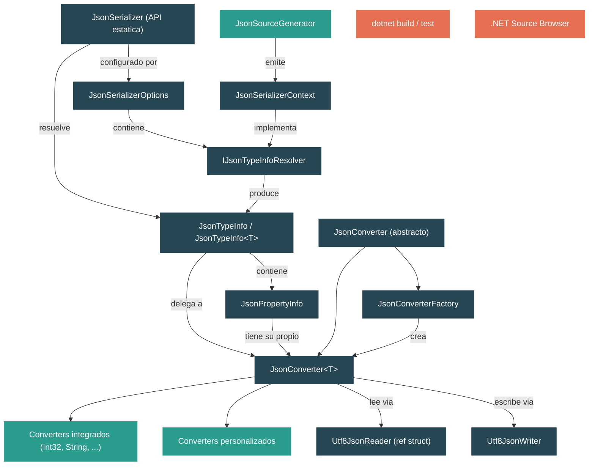

# Nivel 2: Practicante -- Serialization: Internos de System.Text.Json

> **Perfil objetivo:** Desarrollador que usa `JsonSerializer.Serialize`/`Deserialize` pero no entiende el pipeline de converter, el sistema de metadata de tipos, ni los source generators
> **Esfuerzo estimado:** 4 horas
> **Prerequisitos:** [Nivel 1](01-foundations-ecosystem-overview.md), [Modulo 2.1](02-practitioner-json.md)
> [English version](../en/02-practitioner-json.md)

---

## Objetivos de Aprendizaje

Al final de este modulo vas a poder:

1. **Usar `Utf8JsonReader` y `Utf8JsonWriter` directamente** y explicar por que la biblioteca esta disenada alrededor de bytes UTF-8 en lugar de `string`.
2. **Rastrear una llamada a `JsonSerializer.Deserialize<T>`** desde la API publica a traves de `JsonTypeInfo`, el pipeline de converter, y hasta `Utf8JsonReader`.
3. **Explicar el contrato de `JsonConverter<T>`** incluyendo los metodos `Read`/`Write`, el modelo de continuacion `TryRead`/`TryWrite`, y el patron `JsonConverterFactory`.
4. **Describir como funciona `JsonTypeInfo`** como el hub central de metadata que vincula un tipo .NET con sus propiedades, constructor y converter.
5. **Implementar un `JsonConverter<T>` personalizado** para un tipo que los converters integrados no manejan.
6. **Explicar lo que el source generator (`JsonSourceGenerator`) produce** y por que elimina la reflexion y habilita trimming/AOT.
7. **Aplicar mejores practicas de rendimiento** como reutilizar `JsonSerializerOptions`, usar las sobrecargas de bytes UTF-8, y hacer streaming de payloads grandes.

---

## Mapa Conceptual



---

## Contenido

### Leccion 1 -- Utf8JsonReader y Utf8JsonWriter: Los Cimientos de Bajo Nivel

#### Lo que vas a aprender
Como los dos tipos de bajo nivel procesan JSON como bytes UTF-8 crudos, por que este diseno evita el overhead de transcodificacion, y como toda API de nivel superior en la biblioteca termina delegando a ellos.

#### El concepto

System.Text.Json esta construido sobre una decision de diseno fundamental: **el JSON se procesa como bytes UTF-8, no como `string` (UTF-16)**. Esto importa porque el JSON en la red -- en respuestas HTTP, archivos y colas de mensajes -- es casi siempre UTF-8. Al operar directamente sobre `byte[]` / `ReadOnlySpan<byte>`, la biblioteca evita un paso completo de transcodificacion a UTF-16 que `Newtonsoft.Json` (y las APIs JSON mas viejas de .NET) tenian que realizar.

**`Utf8JsonReader`** es un `ref struct` que provee acceso de solo lectura, solo hacia adelante, a JSON codificado en UTF-8. Caracteristicas clave del codigo fuente:

- Mantiene un `ReadOnlySpan<byte> _buffer` para entrada de un solo segmento o un `ReadOnlySequence<byte> _sequence` para entrada multi-segmento (pipelined).
- Rastrea `_lineNumber`, `_bytePositionInLine`, `_consumed`, y un `BitStack _bitStack` para validacion de profundidad de anidamiento.
- Al ser un `ref struct`, no puede ser boxeado ni almacenado en el heap -- esto significa cero allocations para el reader en si.
- Soporta reentrada para datos incompletos: podes leer JSON parcial, guardar el `JsonReaderState`, obtener mas bytes, y continuar.

**`Utf8JsonWriter`** es una `sealed class` (no un `ref struct`) que escribe JSON en UTF-8 hacia un `IBufferWriter<byte>` o `Stream`. Caracteristicas clave:

- Mantiene `BytesPending` (escritos pero no flusheados) y `BytesCommitted` (flusheados al output).
- Rastrea un `_currentDepth` con un truco de bit-flag: el bit de mayor orden indica si se necesita un separador de lista antes del proximo valor.
- Por defecto produce output compatible con RFC 8259 y lanza `InvalidOperationException` si intentas escribir JSON estructuralmente invalido (a menos que la validacion este deshabilitada via `JsonWriterOptions`).

Cuando llamas a `JsonSerializer.Serialize<T>(value)` con tipo de retorno `string`, el metodo interno `WriteString` hace esto:

1. Alquila un `Utf8JsonWriter` y un `PooledByteBufferWriter` de un cache interno (`Utf8JsonWriterCache`).
2. Llama a `jsonTypeInfo.Serialize(writer, value)` -- que delega al pipeline de converter.
3. Transcodifica los bytes UTF-8 resultantes de vuelta a un `string` via `JsonReaderHelper.TranscodeHelper`.

Por eso la documentacion XML advierte repetidamente: *"Usar un `string` no es tan eficiente como usar los metodos UTF-8 ya que la implementacion internamente usa UTF-8."*

#### En el codigo fuente

| Archivo | Que mirar |
|---|---|
| `src/libraries/System.Text.Json/src/System/Text/Json/Reader/Utf8JsonReader.cs` | La declaracion `ref partial struct`, `_buffer`, `_sequence`, `BytesConsumed`, `TokenStartIndex` |
| `src/libraries/System.Text.Json/src/System/Text/Json/Writer/Utf8JsonWriter.cs` | La `sealed partial class`, `_output` (IBufferWriter), `_stream`, `BytesPending`, `BytesCommitted`, `_currentDepth` |
| `src/libraries/System.Text.Json/src/System/Text/Json/Serialization/JsonSerializer.Write.String.cs` | `WriteString<TValue>` -- alquila writer, llama a `jsonTypeInfo.Serialize`, transcodifica a string |
| `src/libraries/System.Text.Json/src/System/Text/Json/Serialization/JsonSerializer.Read.String.cs` | `ReadFromSpan<TValue>(ReadOnlySpan<char>, ...)` -- transcodifica UTF-16 a UTF-8, luego delega al path basado en bytes |

#### Ejercicio practico

1. Crea una aplicacion de consola y escribi un benchmark simple que serialice un objeto `Person` 10.000 veces usando tanto `JsonSerializer.Serialize<Person>(person)` (retorna `string`) como `JsonSerializer.SerializeToUtf8Bytes<Person>(person)` (retorna `byte[]`). Compara los tiempos con `Stopwatch`. Deberias ver que el path UTF-8 es mas rapido porque se saltea el paso final de transcodificacion.

2. Escribi un programa que use `Utf8JsonWriter` directamente para producir este JSON:
   ```json
   {"name":"Ada","scores":[100,98,95]}
   ```
   Usa `writer.WriteStartObject()`, `writer.WriteString(...)`, `writer.WriteStartArray(...)`, `writer.WriteNumberValue(...)`, etc. Despues leelo de vuelta con `Utf8JsonReader`, avanzando token por token con `reader.Read()` e imprimiendo cada `reader.TokenType`.

3. **Pregunta para responder:** En `Utf8JsonWriter`, que representa el bit de mayor orden de `_currentDepth`? (Pista: mira el comentario en la linea ~75 de `Utf8JsonWriter.cs`.)

#### Idea clave
Toda operacion JSON en System.Text.Json fluye ultimamente a traves de `Utf8JsonReader` (para deserialization) y `Utf8JsonWriter` (para serialization). Las APIs basadas en string son wrappers de conveniencia que transcodifican a/desde UTF-8 internamente. Cuando el rendimiento importa, usa las sobrecargas de `ReadOnlySpan<byte>` / `byte[]` directamente.

---

### Leccion 2 -- JsonSerializer: La API de Alto Nivel

#### Lo que vas a aprender
Como los metodos publicos `JsonSerializer.Serialize` y `Deserialize` orquestan el pipeline completo de serialization resolviendo `JsonTypeInfo`, configurando el reader/writer, y delegando a los converters.

#### El concepto

`JsonSerializer` es una `static partial class` dividida en muchos archivos, uno por tipo de entrada/salida: `JsonSerializer.Read.String.cs`, `JsonSerializer.Read.Span.cs`, `JsonSerializer.Read.Stream.cs`, `JsonSerializer.Write.String.cs`, etc. A pesar de las muchas sobrecargas, el patron es siempre el mismo:

**Pipeline de deserialization (Read):**

1. **Resolver `JsonTypeInfo<TValue>`**: La sobrecarga llama a `GetTypeInfo<TValue>(options)` que le pide al `JsonSerializerOptions.TypeInfoResolver` que produzca un `JsonTypeInfo` para el tipo objetivo. Aca es donde se conecta el descubrimiento basado en reflexion o la metadata generada por source generation.
2. **Transcodificar si es necesario**: Si la entrada es `string` o `ReadOnlySpan<char>`, el metodo `ReadFromSpan` transcodifica a bytes UTF-8. Para payloads chicos usa `stackalloc`; para medianos, `ArrayPool<byte>.Shared.Rent`; para grandes, una allocacion directa. Los umbrales estan definidos en `JsonConstants.StackallocByteThreshold` y `JsonConstants.ArrayPoolMaxSizeBeforeUsingNormalAlloc`.
3. **Crear `Utf8JsonReader` y `ReadStack`**: Se construye un `JsonReaderState` a partir de la configuracion del reader en las options. Se inicializa un `ReadStack` desde el `JsonTypeInfo` -- este stack rastrea objetos anidados durante la deserialization.
4. **Delegar a `JsonTypeInfo.Deserialize`**: Este metodo a su vez llama al `TryRead` del converter raiz, que procesa tokens JSON y rellena el grafo de objetos.

**Pipeline de serialization (Write):**

1. **Resolver `JsonTypeInfo<TValue>`**: Igual que arriba.
2. **Alquilar un writer**: `Utf8JsonWriterCache.RentWriterAndBuffer` provee un `Utf8JsonWriter` y `PooledByteBufferWriter` del pool.
3. **Delegar a `JsonTypeInfo.Serialize`**: Llama al `TryWrite` del converter raiz, que produce tokens JSON via `Utf8JsonWriter`.
4. **Producir el output**: Para sobrecargas de `string`, transcodifica desde el buffer UTF-8 del writer. Para sobrecargas de `byte[]`, copia directamente. Para sobrecargas de `Stream`/`PipeWriter`, flushea incrementalmente.

Las sobrecargas de tres argumentos que aceptan `JsonSerializerContext` se saltean la reflexion completamente: llaman a `GetTypeInfo(context, returnType)` que resuelve metadata del contexto pre-generado.

#### En el codigo fuente

| Archivo | Que mirar |
|---|---|
| `src/libraries/System.Text.Json/src/System/Text/Json/Serialization/JsonSerializer.Read.String.cs` | `Deserialize<TValue>(string, options)` -- llama a `GetTypeInfo<TValue>`, luego `ReadFromSpan` |
| `src/libraries/System.Text.Json/src/System/Text/Json/Serialization/JsonSerializer.Read.Span.cs` | `ReadFromSpan<TValue>(ReadOnlySpan<byte>, ...)` -- crea `Utf8JsonReader`, inicializa `ReadStack`, llama a `jsonTypeInfo.Deserialize` |
| `src/libraries/System.Text.Json/src/System/Text/Json/Serialization/JsonSerializer.Write.String.cs` | `Serialize<TValue>(value, options)` -- llama a `GetTypeInfo<TValue>`, luego `WriteString` que alquila writer y llama a `jsonTypeInfo.Serialize` |
| `src/libraries/System.Text.Json/src/System/Text/Json/Serialization/JsonSerializer.Read.Stream.cs` | Deserialization asincrona de stream -- usa lectura basada en continuacion |

#### Ejercicio practico

1. Abri `JsonSerializer.Read.String.cs` en el .NET Source Browser. Rastrea la llamada desde `Deserialize<TValue>(string json, JsonSerializerOptions? options)`:
   - Que metodo se llama inmediatamente? (`GetTypeInfo<TValue>`)
   - Que hace `ReadFromSpan` con los bytes transcodificados?
   - Encontra la linea donde se construye `Utf8JsonReader` -- a que esta configurado `isFinalBlock` y por que?

2. Crea un programa que deserialice el mismo string JSON 1000 veces. Primero pasa `null` para options (internamente se crea uno nuevo cada vez). Despues crea una unica instancia de `JsonSerializerOptions` y reutilizala. Medi la diferencia. El primer enfoque es mas lento porque `JsonSerializerOptions` debe ser configurado y su cache de resolver poblado cada vez.

3. **Pregunta para responder:** En `ReadFromSpan<TValue>(ReadOnlySpan<char>, ...)`, bajo que condicion el metodo usa `stackalloc` vs `ArrayPool` vs una allocacion normal? (Mira la expresion condicional de tres vias.)

#### Idea clave
`JsonSerializer` es un orquestador, no un serializador. Resuelve metadata (`JsonTypeInfo`), gestiona memoria (pooling de writers y buffers de transcodificacion), y delega el trabajo real de lectura/escritura al pipeline de converter. Entender esta separacion es la clave para personalizar el comportamiento en la capa correcta.

---

### Leccion 3 -- El Pipeline de Converter

#### Lo que vas a aprender
Como `JsonConverter<T>` es la unidad fundamental de logica de serialization, como funciona el contrato `Read`/`Write`, que hace `JsonConverterFactory`, y como escribir tu propio converter.

#### El concepto

La jerarquia de converter tiene tres niveles:

1. **`JsonConverter`** (base abstracta): Define el protocolo interno -- `ConverterStrategy`, `TryReadAsObject`, `TryWriteAsObject`, etc. No puede ser heredada directamente por codigo de usuario porque su constructor es `internal`.

2. **`JsonConverter<T>`** (generica abstracta): El punto de extension publico. La heredas e implementas:
   - `T? Read(ref Utf8JsonReader reader, Type typeToConvert, JsonSerializerOptions options)` -- consume tokens JSON y retorna un `T`.
   - `void Write(Utf8JsonWriter writer, T value, JsonSerializerOptions options)` -- produce tokens JSON a partir de un `T`.

3. **`JsonConverterFactory`** (abstracta): Un patron para crear converters para tipos genericos abiertos. Por ejemplo, `NullableConverterFactory` maneja `Nullable<T>` para cualquier `T`, y `EnumConverterFactory` maneja cualquier `enum`. Una factory sobreescribe `CanConvert(Type)` y `CreateConverter(Type, JsonSerializerOptions)`.

**Como se invoca un converter durante la deserialization:**

El metodo interno `JsonConverter<T>.TryRead` (en `JsonConverterOfT.cs`) es el punto de entrada. El:

1. Verifica `JsonTokenType.Null` -- si el token es null y el converter no maneja null, retorna `default(T)` (o lanza para value types no-nullables).
2. Si `ConverterStrategy == ConverterStrategy.Value` (valores simples como `int`, `string`, `bool`), llama a `Read(ref reader, typeToConvert, options)` directamente.
3. Para converters internos, saltea la validacion por rendimiento. Para converters externos (del usuario), registra el tipo de token, profundidad y bytes consumidos antes de llamar a `Read`, y despues llama a `VerifyRead` para detectar converters que dejan el reader en un estado invalido.
4. Para converters de objetos/colecciones (`ConverterStrategy.Object`), llama a `OnTryRead` que soporta continuacion -- el metodo puede retornar `false` para indicar que necesita mas datos (usado durante deserialization asincrona de stream).

**Los converters integrados** viven bajo `Serialization/Converters/Value/`. Cada uno es minimalista. Por ejemplo, `Int32Converter`:

```csharp
public override int Read(ref Utf8JsonReader reader, Type typeToConvert, JsonSerializerOptions options)
{
    return reader.GetInt32();
}

public override void Write(Utf8JsonWriter writer, int value, JsonSerializerOptions options)
{
    writer.WriteNumberValue((long)value);
}
```

El converter simplemente llama un metodo del reader o writer. El `ObjectDefaultConverter<T>` es mucho mas complejo: lee `StartObject`, itera los nombres de propiedades, busca cada propiedad en el `JsonTypeInfo`, y recursivamente llama al converter de cada propiedad.

#### En el codigo fuente

| Archivo | Que mirar |
|---|---|
| `src/libraries/System.Text.Json/src/System/Text/Json/Serialization/JsonConverter.cs` | Base abstracta: `ConverterStrategy`, `CanUseDirectReadOrWrite`, `RequiresReadAhead`, `ShouldFlush` |
| `src/libraries/System.Text.Json/src/System/Text/Json/Serialization/JsonConverterOfT.cs` | `JsonConverter<T>`: metodos abstractos `Read`/`Write`, `TryRead` (linea ~148), `OnTryRead`/`OnTryWrite` |
| `src/libraries/System.Text.Json/src/System/Text/Json/Serialization/JsonConverterFactory.cs` | Patron factory: `CreateConverter`, `GetConverterInternal` |
| `src/libraries/System.Text.Json/src/System/Text/Json/Serialization/Converters/Value/Int32Converter.cs` | Ejemplo minimalista de converter de valor |
| `src/libraries/System.Text.Json/src/System/Text/Json/Serialization/Converters/Object/ObjectDefaultConverter.cs` | Converter de objetos complejo: `OnTryRead` con fast path y soporte de continuacion |

#### Ejercicio practico

1. Escribi un `JsonConverter<DateOnly>` personalizado que serialice `DateOnly` como `"YYYY-MM-DD"` (fecha ISO 8601 sin hora). Sobreescribi `Read` para parsear el string con `DateOnly.ParseExact` y `Write` para llamar a `writer.WriteStringValue(value.ToString("yyyy-MM-dd"))`. Registralo via `JsonSerializerOptions.Converters.Add(new DateOnlyIsoConverter())` y verifica el round-trip.

2. Escribi una `JsonConverterFactory` que maneje cualquier tipo `enum` serializandolo como un string en minusculas. Sobreescribi `CanConvert` para verificar `typeToConvert.IsEnum`, y `CreateConverter` para construir un `LowercaseEnumConverter<T>` generico via reflexion (usando `Activator.CreateInstance`).

3. Abri `ObjectDefaultConverter.cs` y lee el metodo `OnTryRead`. Identifica:
   - Donde llama a `jsonTypeInfo.CreateObject()` para instanciar el tipo objetivo?
   - Donde llama a `PopulatePropertiesFastPath` vs el path mas lento basado en continuacion?
   - Que condicion distingue los dos paths?

4. **Pregunta para responder:** En `JsonConverterFactory`, cada override de `Read`/`Write`/`TryRead`/`TryWrite` llama a `Debug.Fail("We should never get here.")`. Por que? (Pista: la factory siempre se resuelve a un `JsonConverter<T>` concreto antes de que la serialization comience.)

#### Idea clave
El converter es donde los bytes se convierten en objetos y los objetos en bytes. `JsonConverter<T>` es un contrato limpio de dos metodos para value types, pero `ObjectDefaultConverter<T>` revela la complejidad debajo de la deserialization de objetos -- busqueda de propiedades, parametros de constructor, continuacion para streams asincronos, y soporte de metadata. `JsonConverterFactory` es el mecanismo para manejar generics abiertos como `List<T>` y `Nullable<T>`.

---

### Leccion 4 -- JsonTypeInfo y Metadata: Como el Serializador Conoce Tus Tipos

#### Lo que vas a aprender
Como `JsonTypeInfo` sirve como el descriptor central de metadata para un tipo durante la serialization, que representa `JsonPropertyInfo`, y como la abstraccion `IJsonTypeInfoResolver` te permite intercambiar entre reflexion y source generation.

#### El concepto

Cuando el serializador encuentra un tipo por primera vez, necesita responder varias preguntas: Que propiedades tiene este tipo? Cuales son sus nombres en JSON? Que converter maneja cada propiedad? Tiene el tipo un constructor con parametros? Hay propiedades requeridas?

Todas estas respuestas estan encapsuladas en **`JsonTypeInfo`** (y su forma generica `JsonTypeInfo<T>`). Esta clase es el contrato entre el serializador y el proveedor de metadata.

**Miembros clave de `JsonTypeInfo`:**

- `Type` -- el `System.Type` de .NET que esta metadata describe.
- `Converter` -- el `JsonConverter` que manejara el read/write de este tipo.
- `Kind` -- un enum `JsonTypeInfoKind`: `None` (primitivo/valor), `Object`, `Enumerable`, o `Dictionary`.
- `CreateObject` -- un delegado `Func<object>` que construye una nueva instancia para deserialization. Para metadata basada en reflexion, esto envuelve una llamada al constructor por defecto. Para metadata generada por source generation, es una llamada directa a `new T()`.
- `Properties` -- una coleccion de objetos `JsonPropertyInfo`, uno por propiedad/campo serializable.
- `OnSerializing` / `OnSerialized` / `OnDeserializing` / `OnDeserialized` -- callbacks de ciclo de vida.
- `ElementType` / `KeyType` -- para colecciones y diccionarios.

**`JsonPropertyInfo`** describe una sola propiedad:

- El nombre de la propiedad JSON (pre-codificado como `JsonEncodedText` para comparacion rapida).
- El `JsonConverter` para el tipo de esa propiedad.
- Delegados getter/setter.
- Condiciones de ignore, estado de requerido, ordenamiento.

**`IJsonTypeInfoResolver`** es la interfaz enchufable que produce instancias de `JsonTypeInfo`:

- **`DefaultJsonTypeInfoResolver`** usa reflexion en tiempo de ejecucion para descubrir propiedades, constructores y atributos.
- **`JsonSerializerContext`** (generado por source generation) implementa `IJsonTypeInfoResolver` y retorna instancias pre-construidas de `JsonTypeInfo` sin reflexion.

El pipeline de resolucion:

1. `JsonSerializer.Deserialize<T>(json, options)` llama a `GetTypeInfo<T>(options)`.
2. Este le pide a `options.TypeInfoResolver.GetTypeInfo(typeof(T), options)`.
3. El resolver retorna un `JsonTypeInfo<T>` (creandolo si es necesario, luego cacheandolo).
4. Se llama a `EnsureConfigured()` para finalizar la metadata (resolver converters, construir caches de propiedades, congelar la instancia para que no pueda ser modificada).

#### En el codigo fuente

| Archivo | Que mirar |
|---|---|
| `src/libraries/System.Text.Json/src/System/Text/Json/Serialization/Metadata/JsonTypeInfo.cs` | Constructor (linea ~44): recibe `type`, `converter`, `options`. `Kind`, `CreateObject`, `ElementType`, `KeyType` |
| `src/libraries/System.Text.Json/src/System/Text/Json/Serialization/Metadata/JsonPropertyInfo.cs` | Metadata de propiedades: nombre, converter, getter/setter |
| `src/libraries/System.Text.Json/src/System/Text/Json/Serialization/JsonSerializerContext.cs` | Metodo abstracto `GetTypeInfo(Type)`, propiedad `Options`, `IsCompatibleWithOptions` |
| `src/libraries/System.Text.Json/src/System/Text/Json/Serialization/Metadata/DefaultJsonTypeInfoResolver.cs` | Resolver basado en reflexion |

#### Ejercicio practico

1. Escribi un programa que construya manualmente un `JsonTypeInfo<T>` usando el metodo factory `JsonTypeInfo.CreateJsonTypeInfo<T>`. Agrega propiedades manualmente con `jsonTypeInfo.CreateJsonPropertyInfo(typeof(string), "name")`. Usa esta type info personalizada para serializar un objeto. Este ejercicio revela que `JsonTypeInfo` no es magico -- es data que podes construir vos mismo.

2. En un programa que use `JsonSerializer.Deserialize<T>`, agrega un `JsonSerializerOptions` con un `IJsonTypeInfoResolver` personalizado que envuelva a `DefaultJsonTypeInfoResolver` pero agregue logging. Para cada tipo resuelto, imprime el nombre del tipo, el `Kind`, y la cantidad de propiedades. Esto te muestra exactamente lo que el serializador descubre.

3. Abri `JsonTypeInfo.cs` y localiza el constructor. Nota como `Kind` se determina por `GetTypeInfoKind(type, converter)` -- mapea la estrategia del converter a un `JsonTypeInfoKind`. **Pregunta para responder:** Que `Kind` obtiene `int`? Y `List<string>`? Y un POCO personalizado?

#### Idea clave
`JsonTypeInfo` es el puente entre tus tipos .NET y el entendimiento que el serializador tiene de ellos. Cada nombre de propiedad, cada binding de converter, cada estrategia de constructor vive aca. La abstraccion `IJsonTypeInfoResolver` es lo que hace posible intercambiar entre reflexion (conveniente, pero lento en startup e incompatible con trimming) y source generation (rapido, seguro para trimming, pero requiere setup en tiempo de compilacion).

---

### Leccion 5 -- Source Generators: Serialization en Tiempo de Compilacion

#### Lo que vas a aprender
Como el `JsonSourceGenerator` analiza tus tipos en tiempo de compilacion para emitir subclases de `JsonSerializerContext`, por que esto elimina la reflexion y habilita AOT/trimming, y como se ve realmente el codigo generado.

#### El concepto

El path basado en reflexion (`DefaultJsonTypeInfoResolver`) tiene dos problemas fundamentales:

1. **Costo de startup**: La primera vez que serializas un tipo, el resolver debe usar reflexion para descubrir propiedades, constructores, atributos, y construir el grafo de metadata. Para jerarquias de tipos complejas, esto puede tomar decenas de milisegundos.
2. **Incompatibilidad con trimming/AOT**: El IL trimmer no puede determinar estaticamente que tipos y miembros seran accedidos via reflexion, asi que o preserva todo (inflando el binario) o recorta demasiado agresivamente (causando fallas en runtime). La compilacion Native AOT enfrenta el mismo problema.

El **source generator** (`JsonSourceGenerator`) resuelve ambos problemas haciendo todo el analisis en tiempo de compilacion. Declaras una clase partial que hereda de `JsonSerializerContext` y la anotas con `[JsonSerializable(typeof(MiTipo))]`:

```csharp
[JsonSerializable(typeof(WeatherForecast))]
internal partial class MyJsonContext : JsonSerializerContext { }
```

En tiempo de compilacion, el generador:

1. **Parsea** tus tipos usando APIs de Roslyn (`JsonSourceGenerator.Parser.cs`). Recorre cada tipo con atributo `[JsonSerializable]`, descubre propiedades, constructores y atributos, y construye un modelo `TypeGenerationSpec`.
2. **Emite** codigo fuente C# (`JsonSourceGenerator.Emitter.cs`) que crea instancias de `JsonTypeInfo` con metadata de propiedades hardcodeada, delegados getter/setter pre-compilados, y constructores directos `new T()`.
3. Genera un **serialize handler** para cada tipo -- un metodo que llama directamente a `Utf8JsonWriter.WriteString`, `WriteNumber`, etc., sin pasar por el pipeline de converter en absoluto. Este es el fast path definitivo.

La clase de contexto generada sobreescribe `GetTypeInfo(Type)` con una tabla de busqueda:

```csharp
public override JsonTypeInfo? GetTypeInfo(Type type)
{
    if (type == typeof(WeatherForecast)) return WeatherForecast;
    // ... mas tipos
    return null;
}
```

Cada propiedad getter como `WeatherForecast` crea lazily el `JsonTypeInfo<WeatherForecast>` con toda la metadata pre-poblada.

**Verificacion de compatibilidad** (`IsCompatibleWithOptions`): El contexto generado verifica si las `JsonSerializerOptions` de runtime coinciden con las options hardcodeadas en tiempo de compilacion. Si el usuario agrego converters personalizados, cambio el number handling, o configuro un reference handler, el fast path no puede usarse y el serializador cae de vuelta al pipeline de converter.

#### En el codigo fuente

| Archivo | Que mirar |
|---|---|
| `src/libraries/System.Text.Json/gen/JsonSourceGenerator.Parser.cs` | La clase `Parser`: descubre tipos `[JsonSerializable]`, recorre propiedades, construye `TypeGenerationSpec` |
| `src/libraries/System.Text.Json/gen/JsonSourceGenerator.Emitter.cs` | La clase `Emitter`: genera codigo fuente de la subclase `JsonSerializerContext`. Nota los muchos campos `const string` para referencias de tipos |
| `src/libraries/System.Text.Json/gen/Model/TypeGenerationSpec.cs` | El modelo que representa la forma de serialization de un tipo |
| `src/libraries/System.Text.Json/gen/Model/PropertyGenerationSpec.cs` | El modelo para una sola propiedad |
| `src/libraries/System.Text.Json/src/System/Text/Json/Serialization/JsonSerializerContext.cs` | La clase base: `GetTypeInfo(Type)`, `Options`, `GeneratedSerializerOptions`, `IsCompatibleWithOptions` |

#### Ejercicio practico

1. Crea un proyecto con un contexto `[JsonSerializable(typeof(Person))]`. Construi el proyecto y encontra los archivos fuente generados en `obj/Debug/net*/generated/System.Text.Json.SourceGeneration/`. Lee el codigo generado:
   - Encontra el override de `GetTypeInfo` -- es un switch/if-chain sobre tipos.
   - Encontra el metodo `CreateJsonTypeInfo` para tu tipo -- nota la metadata de propiedades pre-construida.
   - Encontra el serialize handler -- escribe JSON directamente sin dispatch de converter.

2. Agrega una propiedad de tipo `Dictionary<string, List<int>>` a tu tipo. Reconstrui y observa como el generador maneja tipos genericos anidados. Cada instanciacion generica obtiene su propio `JsonTypeInfo`.

3. Experimenta con `IsCompatibleWithOptions`: Crea un `JsonSerializerOptions` con `PropertyNamingPolicy = JsonNamingPolicy.CamelCase` pero genera el contexto sin `[JsonSourceGenerationOptions(PropertyNamingPolicy = ...)]`. Observa que pasa cuando pasas estas options a `JsonSerializer.Serialize(value, typeof(Person), myContext)`.

4. **Pregunta para responder:** En `JsonSerializerContext.IsCompatibleWithOptions`, que condiciones causan que el fast path (serialize handler pre-generado) sea rechazado? Lista al menos tres.

#### Idea clave
El source generator no es un motor de serialization separado -- produce las mismas abstracciones `JsonTypeInfo` y `JsonConverter` que el runtime usa. La diferencia es que la metadata se computa en tiempo de compilacion en lugar de descubrirse via reflexion, y un handler de fast path opcional bypasea el pipeline de converter completamente para maximo throughput. Entender ambos paths es esencial porque vas a encontrar situaciones donde el source generator no puede manejar un tipo (converters personalizados, edge cases de polimorfismo), y necesitas saber que hace el fallback.

---

### Leccion 6 -- Patrones de Rendimiento y Mejores Practicas

#### Lo que vas a aprender
Patrones practicos para obtener el mejor rendimiento de System.Text.Json, incluyendo cacheo de options, eleccion de la superficie de API correcta, serialization por streaming, y evitar errores comunes.

#### El concepto

**1. Reutiliza `JsonSerializerOptions`**

Cada instancia de `JsonSerializerOptions` construye un cache interno de objetos `JsonTypeInfo`. Si creas un nuevo `JsonSerializerOptions` por llamada, pagas el costo completo de reflexion/resolucion cada vez. La solucion:

```csharp
// MAL: options nuevas en cada llamada
string json = JsonSerializer.Serialize(data, new JsonSerializerOptions { PropertyNamingPolicy = JsonNamingPolicy.CamelCase });

// BIEN: options estaticas reutilizables
private static readonly JsonSerializerOptions s_options = new()
{
    PropertyNamingPolicy = JsonNamingPolicy.CamelCase
};
string json = JsonSerializer.Serialize(data, s_options);
```

La instancia de options se vuelve de solo lectura despues del primer uso (`MakeReadOnly()`), por eso no podes modificarla despues de la serialization. Esto es por diseno -- el estado congelado habilita acceso concurrente thread-safe al cache de type info.

**2. Preferi las APIs UTF-8 cuando sea posible**

Como vimos en la Leccion 1, las APIs basadas en `string` transcodifican a/desde UTF-8 internamente. Si tu fuente ya son bytes UTF-8 (por ejemplo, del body de una respuesta HTTP), usa las sobrecargas de `ReadOnlySpan<byte>` o `Stream`:

```csharp
// Desde respuesta HTTP
byte[] utf8Bytes = await response.Content.ReadAsByteArrayAsync();
var result = JsonSerializer.Deserialize<T>(utf8Bytes, s_options);

// O mejor aun -- streaming directo
using Stream stream = await response.Content.ReadAsStreamAsync();
var result = await JsonSerializer.DeserializeAsync<T>(stream, s_options);
```

**3. Usa streaming para payloads grandes**

Para payloads JSON grandes, evita cargar el documento entero en memoria. `SerializeAsync`/`DeserializeAsync` con `Stream` usan un enfoque incremental:

- **Escritura**: El serializador flushea al stream cuando el buffer interno excede un umbral (`FlushThreshold`), determinado por `JsonConverter.ShouldFlush`.
- **Lectura**: El reader procesa datos en chunks, usando el modelo de continuacion de `ReadStack` para pausar y reanudar entre limites de buffer.

**4. Usa source generation en produccion**

Para aplicaciones desplegadas con AOT o paths criticos de latencia, source generation elimina el overhead de reflexion. Incluso en .NET regular, los serialize handlers generados producen codigo mas rapido porque se saltean el dispatch de converter y escriben tokens JSON en una secuencia lineal.

**5. Evita errores comunes**

- **Capturar `Utf8JsonReader` en un lambda o metodo async**: Es un `ref struct` y no puede almacenarse en el heap. Si necesitas pasar estado del reader a traves de limites async, usa `JsonReaderState` en su lugar.
- **Modificar options despues del primer uso**: Esto lanza `InvalidOperationException`. Configura todo antes de la primera llamada de serialization.
- **Ignorar `HandleNull`**: Converters personalizados que necesitan manejar tokens JSON null deben sobreescribir la propiedad `HandleNull`. Por defecto, `null` es manejado por el framework antes de llamar a tu converter.
- **Olvidar `[RequiresUnreferencedCode]`**: Si tu codigo usa las sobrecargas basadas en reflexion `Deserialize<T>(json, options)`, no es seguro para trimming. Usa las sobrecargas de `JsonTypeInfo<T>` o source generation para codigo seguro para trimming.

#### En el codigo fuente

| Archivo | Que mirar |
|---|---|
| `src/libraries/System.Text.Json/src/System/Text/Json/Serialization/JsonSerializer.Write.String.cs` | Metodo `WriteString`: el patron de pooling `Utf8JsonWriterCache.RentWriterAndBuffer` / `ReturnWriterAndBuffer` |
| `src/libraries/System.Text.Json/src/System/Text/Json/Serialization/JsonSerializer.Read.String.cs` | `ReadFromSpan`: la estrategia de memoria de tres niveles (`stackalloc` / `ArrayPool` / `new byte[]`) |
| `src/libraries/System.Text.Json/src/System/Text/Json/Serialization/JsonConverter.cs` | `ShouldFlush`: como el converter senaliza que el stream debe ser flusheado |
| `src/libraries/System.Text.Json/src/System/Text/Json/Serialization/JsonSerializer.Read.Stream.cs` | Lectura asincrona de stream con continuacion |

#### Ejercicio practico

1. **Benchmark de cacheo de options**: Escribi un benchmark que deserialice un array JSON de 100 objetos. En la variante A, crea `new JsonSerializerOptions()` por llamada. En la variante B, reutiliza una instancia estatica. Medi la diferencia sobre 1000 iteraciones. La primera variante sera dramaticamente mas lenta por la resolucion repetida de metadata.

2. **Ejercicio de streaming**: Crea un archivo JSON con 10.000 elementos en un array. Deserializalo de dos formas: (a) `File.ReadAllText` + `Deserialize<List<T>>`, y (b) `File.OpenRead` + `DeserializeAsync<List<T>>`. Medi el pico de memoria con `GC.GetTotalMemory(forceFullCollection: true)` antes y despues. El path de streaming deberia usar significativamente menos memoria pico.

3. **Fast path de source-gen**: Crea un `JsonSerializerContext` para un tipo simple. Serializa 100.000 instancias usando (a) `JsonSerializer.Serialize(value, options)` con reflexion, y (b) `JsonSerializer.Serialize(value, MyContext.Default.MyType)` con source generation. Compara el throughput.

4. **Pregunta para responder:** Abri `JsonSerializer.Read.String.cs` y mira el bloque `finally` en `ReadFromSpan`. Por que llama a `utf8.Clear()` antes de retornar el array al pool? (Pista: los datos JSON podrian contener informacion sensible.)

#### Idea clave
El rendimiento en System.Text.Json viene de tres capas: (1) la base nativa UTF-8 evita transcodificacion, (2) el cacheo de options/metadata evita reflexion repetida, y (3) source generation evita la reflexion por completo. El error de rendimiento mas comun es crear nuevas `JsonSerializerOptions` por llamada -- este unico cambio puede mejorar el throughput entre 10-100x para serialization repetida de los mismos tipos.

---

## Resumen del Modulo

La biblioteca System.Text.Json esta organizada en cuatro capas, cada una construyendo sobre la anterior:

| Capa | Tipos | Responsabilidad |
|---|---|---|
| **I/O de bytes** | `Utf8JsonReader`, `Utf8JsonWriter` | Leer/escribir tokens JSON como bytes UTF-8 |
| **Converters** | `JsonConverter<T>`, `JsonConverterFactory` | Puente entre tokens JSON y tipos .NET |
| **Metadata** | `JsonTypeInfo`, `JsonPropertyInfo`, `IJsonTypeInfoResolver` | Describir como los tipos se mapean a estructura JSON |
| **Orquestacion** | `JsonSerializer`, `JsonSerializerOptions` | Conectar todo, gestionar memoria, proveer la API publica |

Source generation (`JsonSourceGenerator`) reemplaza el resolver basado en reflexion de la capa de metadata con codigo en tiempo de compilacion y opcionalmente bypasea la capa de converter completamente con serialize handlers directos.

La idea mas importante: **`JsonSerializer` no es donde ocurre la serialization**. Es el coordinador. El trabajo real lo hacen los converters leyendo de `Utf8JsonReader` y escribiendo a `Utf8JsonWriter`, guiados por metadata en `JsonTypeInfo`.

---

## Lectura Adicional

- `docs/design/features/system-text-json-source-generator.md` -- Documento de diseno del source generator
- `src/libraries/System.Text.Json/tests/` -- La suite de tests, excelente para entender casos borde
- [Microsoft Learn: Panorama de System.Text.Json](https://learn.microsoft.com/dotnet/standard/serialization/system-text-json/overview)
- [Microsoft Learn: Como escribir converters personalizados](https://learn.microsoft.com/dotnet/standard/serialization/system-text-json/converters-how-to)
- [Microsoft Learn: Source generation](https://learn.microsoft.com/dotnet/standard/serialization/system-text-json/source-generation)

---

## Lista de Autoevaluacion

- [ ] Puedo explicar por que System.Text.Json opera sobre bytes UTF-8 y cual es la implicacion de rendimiento para APIs basadas en `string`.
- [ ] Puedo rastrear una llamada a `Deserialize<T>` a traves de las cuatro capas: orquestacion, resolucion de metadata, dispatch de converter, y lectura de bytes.
- [ ] Puedo escribir un `JsonConverter<T>` personalizado y una `JsonConverterFactory` y registrarlos correctamente.
- [ ] Puedo explicar que contiene `JsonTypeInfo` y como `IJsonTypeInfoResolver` conecta metadata de reflexion o generada por source generation.
- [ ] Se lo que el source generator produce y puedo encontrar el codigo generado en el directorio `obj/` de mi proyecto.
- [ ] Conozco los tres principales errores de rendimiento (options nuevas por llamada, usar APIs de string innecesariamente, no hacer streaming de payloads grandes) y como solucionarlos.
