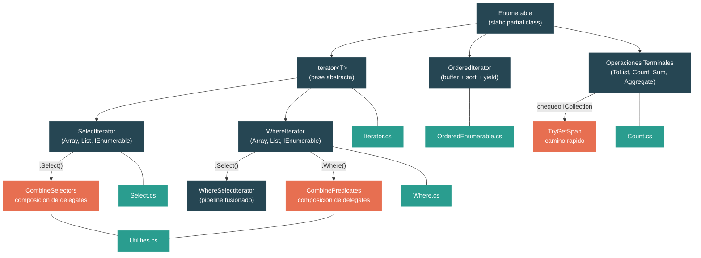

# Nivel 2: Practitioner — LINQ: De la Sintaxis de Query a las Maquinas de Iteradores

> **Perfil objetivo:** Desarrollador que usa LINQ a diario pero no sabe como funciona la evaluacion lazy o que generan `Select`/`Where` internamente
> **Esfuerzo estimado:** 4 horas
> **Prerrequisitos:** [Modulo 2.1](02-practitioner-generics.md), [Modulo 2.2](02-practitioner-collections.md)
> [English version](../en/02-practitioner-linq.md)

---

## Objetivos de Aprendizaje

Al finalizar este modulo vas a poder:

1. Explicar por que llamar a `.Select()` o `.Where()` no ejecuta ningun codigo, e identificar el punto exacto en el fuente donde la ejecucion comienza.
2. Trazar la maquina de estados dentro de `IEnumerableSelectIterator.MoveNext()` y explicar como `_state` controla el ciclo de vida del iterator.
3. Describir como LINQ fusiona llamadas consecutivas de `Where().Select()` en un solo `WhereSelectIterator` para evitar alocaciones intermedias.
4. Explicar como `CombineSelectors` y `CombinePredicates` componen delegates sin crear iteradores intermedios.
5. Describir la estrategia de buffering usada por `OrderBy` — por que debe materializar toda la fuente antes de devolver un solo elemento.
6. Identificar los caminos rapidos en `Count()` (atajo de ICollection) y `Sum()` (vectorizacion basada en spans) que evitan la enumeracion por completo.
7. Articular el costo de alocacion de un pipeline LINQ y tomar decisiones informadas sobre cuando LINQ no es la herramienta correcta.
8. Navegar el arbol fuente de `System.Linq` y entender la relacion entre `Iterator<T>`, sus especializaciones y los archivos `SpeedOpt` de clases parciales.

---

## Mapa Conceptual



---

## Curriculum

### Leccion 1 — Deferred Execution: Por Que LINQ es Lazy

#### Que vas a aprender

Cuando escribis `source.Where(x => x > 5).Select(x => x * 2)`, no pasa nada. Ningun predicado se evalua. Ninguna multiplicacion ocurre. La cadena construye una estructura de datos — un objeto iterator — que describe lo que *va a pasar* cuando alguien finalmente enumere el resultado. Esta leccion explica el mecanismo.

#### El concepto

Los operadores LINQ caen en dos categorias:

| Categoria | Comportamiento | Ejemplos |
|---|---|---|
| **Deferred** (lazy) | Retorna un objeto iterator. Ningun elemento se procesa. | `Select`, `Where`, `OrderBy`, `Take`, `Skip`, `Distinct` |
| **Terminal** (eager) | Enumera la fuente inmediatamente. Retorna un resultado concreto. | `ToList`, `ToArray`, `Count`, `Sum`, `First`, `Aggregate` |

Deferred execution significa que el pipeline es una *descripcion* de trabajo, no el trabajo en si. El trabajo ocurre solo cuando:
- Iteras con `foreach`
- Llamas a un operador terminal como `ToList()` o `Count()`
- Llamas manualmente a `GetEnumerator()` seguido de `MoveNext()`

Esto es posible porque cada operador deferred retorna un objeto que implementa `IEnumerable<T>` pero no enumera la fuente durante la construccion. En cambio, el constructor almacena la fuente y el delegate (predicado o selector) como campos.

#### En el codigo fuente

Abri `src/libraries/System.Linq/src/System/Linq/Select.cs`. Mira el metodo principal `Select` (linea 13):

```csharp
public static IEnumerable<TResult> Select<TSource, TResult>(
    this IEnumerable<TSource> source, Func<TSource, TResult> selector)
{
    // ... chequeos de null ...

    if (source is TSource[] array)
    {
        if (array.Length == 0)
        {
            return [];
        }
        return new ArraySelectIterator<TSource, TResult>(array, selector);
    }

    if (source is List<TSource> list)
    {
        return new ListSelectIterator<TSource, TResult>(list, selector);
    }

    return new IEnumerableSelectIterator<TSource, TResult>(source, selector);
}
```

Fijate lo que este metodo NO hace: nunca llama a `GetEnumerator()`, nunca llama a `MoveNext()`, nunca invoca el `selector`. Solo crea un nuevo objeto iterator y lo retorna. El selector se almacena en un campo — va a ser llamado despues, un elemento a la vez, cuando alguien enumere.

Ahora mira la clase base `Iterator<T>` en `src/libraries/System.Linq/src/System/Linq/Iterator.cs`:

```csharp
private abstract partial class Iterator<TSource> : IEnumerable<TSource>, IEnumerator<TSource>
{
    private readonly int _threadId = Environment.CurrentManagedThreadId;
    private protected int _state;
    private protected TSource _current = default!;

    public Iterator<TSource> GetEnumerator()
    {
        Iterator<TSource> enumerator =
            _state == 0 && _threadId == Environment.CurrentManagedThreadId
                ? this
                : Clone();
        enumerator._state = 1;
        return enumerator;
    }
}
```

Decisiones de diseno clave:
1. El iterator es tanto `IEnumerable<T>` como `IEnumerator<T>` — el mismo objeto sirve como la descripcion de la coleccion y como el enumerador.
2. `_state` empieza en `0`. Cuando se llama a `GetEnumerator()`, transiciona a `1`. Este es el disparador que le dice a `MoveNext()` que empiece a trabajar.
3. Si `GetEnumerator()` se llama en el mismo thread que creo el iterator (el caso comun), retorna `this` — sin alocacion. Si se llama desde otro thread o una segunda vez, llama a `Clone()` para crear una copia fresca.

#### Ejercicio practico

1. Escribi este codigo y predeci cuando se imprime "Evaluating":
   ```csharp
   var numbers = new[] { 1, 2, 3, 4, 5 };

   var query = numbers.Select(x =>
   {
       Console.WriteLine($"Evaluating {x}");
       return x * 2;
   });

   Console.WriteLine("Query created. Nothing printed yet.");

   foreach (var n in query)
   {
       Console.WriteLine($"Got {n}");
   }
   ```
   Vas a ver que "Evaluating" se imprime intercalado con "Got" — cada elemento se transforma bajo demanda.

2. Enumera la misma query dos veces. Verifica que el selector se ejecuta de nuevo ambas veces — LINQ no cachea resultados.

3. Pone un breakpoint dentro del metodo `Select` en `Select.cs`. Confirma que retorna inmediatamente sin tocar los datos de la fuente.

#### Conclusion clave

Operadores LINQ como `Select` y `Where` son metodos fabrica. Fabrican objetos iterator que describen una transformacion. Ningun dato fluye hasta que empezas a enumerar. Esto es deferred execution.

#### Concepto erroneo comun

> *"Llamar a `.Select()` itera a traves de la coleccion una vez para construir el resultado."*
>
> No lo hace. `Select` aloca un solo objeto pequeno (el iterator) y retorna instantaneamente. Si nunca enumeras el resultado, la lambda del selector nunca se llama — ni una sola vez. Por eso podes construir cadenas LINQ complejas sin costo de rendimiento hasta que realmente necesites los datos.

---

### Leccion 2 — Select y Where: Los Operadores Centrales

#### Que vas a aprender

Vas a trazar la implementacion real de `MoveNext()` de `IEnumerableSelectIterator` e `IEnumerableWhereIterator` para entender exactamente como los iteradores producen elementos uno a la vez usando una maquina de estados.

#### El concepto

El metodo `MoveNext()` de un iterator es una maquina de estados escrita a mano. El campo `_state` rastrea donde el iterator quedo entre llamadas. Es el mismo patron que el compilador de C# genera para metodos con `yield return`, pero LINQ lo implementa manualmente por rendimiento.

Las transiciones de estado son:

```
Estado 0: Creado (todavia no enumerado)
Estado 1: GetEnumerator() llamado — listo para empezar
Estado 2: Enumerando (procesando elementos)
Estado -1: Disposed (terminado)
```

#### En el codigo fuente

**Maquina de estados de Select** — `IEnumerableSelectIterator<TSource, TResult>.MoveNext()` en `Select.cs`:

```csharp
public override bool MoveNext()
{
    switch (_state)
    {
        case 1:
            _enumerator = _source.GetEnumerator();  // primera llamada: obtener el enumerador fuente
            _state = 2;
            goto case 2;
        case 2:
            if (_enumerator.MoveNext())              // avanzar la fuente
            {
                _current = _selector(_enumerator.Current);  // transformar el elemento
                return true;                          // devolverlo al llamador
            }
            Dispose();                               // fuente agotada
            break;
    }
    return false;
}
```

Recorre esto paso a paso:
1. Primera llamada a `MoveNext()`: `_state` es `1`. El iterator llama a `_source.GetEnumerator()` para obtener el enumerador subyacente. Lo almacena en `_enumerator`, transiciona al estado `2` y cae al siguiente case.
2. En el estado `2`, llama a `_enumerator.MoveNext()`. Si hay un elemento, aplica el selector y almacena el resultado en `_current`. Retorna `true`.
3. Cada llamada subsiguiente a `MoveNext()` entra directamente en `case 2` — solo avanza la fuente y transforma el siguiente elemento.
4. Cuando la fuente se agota (`MoveNext()` retorna `false`), llama a `Dispose()` que pone `_state = -1`.

**Maquina de estados de Where** — `IEnumerableWhereIterator<TSource>.MoveNext()` en `Where.cs`:

```csharp
public override bool MoveNext()
{
    switch (_state)
    {
        case 1:
            _enumerator = _source.GetEnumerator();
            _state = 2;
            goto case 2;
        case 2:
            while (_enumerator.MoveNext())            // avanzar hasta que el predicado coincida
            {
                TSource item = _enumerator.Current;
                if (_predicate(item))                  // probar el predicado
                {
                    _current = item;
                    return true;                       // devolver el elemento que coincide
                }
            }
            Dispose();
            break;
    }
    return false;
}
```

La diferencia critica: `Where` usa un loop `while` dentro del estado `2`. Sigue avanzando el enumerador fuente hasta encontrar un elemento que satisfaga el predicado — o se queda sin elementos. Los elementos que no pasan el predicado se saltan silenciosamente.

**Iteradores especializados para arrays y listas**: LINQ provee `ArraySelectIterator`, `ListSelectIterator`, `ArrayWhereIterator` y `ListWhereIterator`. Estos evitan la alocacion del `IEnumerator` iterando directamente con un indice o un `List<T>.Enumerator` (un struct, evitando alocacion en el heap). Por ejemplo, `ArraySelectIterator.MoveNext()`:

```csharp
public override bool MoveNext()
{
    TSource[] source = _source;
    int index = _state - 1;
    if ((uint)index < (uint)source.Length)
    {
        _state++;
        _current = _selector(source[index]);
        return true;
    }
    Dispose();
    return false;
}
```

Aca `_state` funciona como el indice (con offset de 1). No se crea ningun objeto enumerador.

#### Ejercicio practico

1. Abri `Where.cs` y busca `ArrayWhereIterator.MoveNext()`. Trazalo con una fuente de `[1, 2, 3, 4, 5]` y un predicado de `x => x % 2 == 0`. Anota el valor de `_state` y `_current` despues de cada llamada a `MoveNext()`.

2. Escribi codigo que demuestre que Where saltea elementos:
   ```csharp
   var evens = new[] { 1, 2, 3, 4, 5 }.Where(x =>
   {
       Console.WriteLine($"Testing {x}");
       return x % 2 == 0;
   });

   foreach (var e in evens)
   {
       Console.WriteLine($"Got {e}");
   }
   // Output: Testing 1, Testing 2, Got 2, Testing 3, Testing 4, Got 4, Testing 5
   ```

3. Compara los tipos retornados por `Select` cuando se llama sobre un array vs un `List<T>` vs un `IEnumerable<T>` generico:
   ```csharp
   int[] arr = { 1, 2, 3 };
   List<int> list = new() { 1, 2, 3 };
   IEnumerable<int> seq = Enumerable.Range(1, 3);

   Console.WriteLine(arr.Select(x => x).GetType().Name);   // ArraySelectIterator
   Console.WriteLine(list.Select(x => x).GetType().Name);  // ListSelectIterator
   Console.WriteLine(seq.Select(x => x).GetType().Name);   // IEnumerableSelectIterator o similar
   ```

#### Conclusion clave

`MoveNext()` es el corazon de cada operador LINQ. Cada llamada avanza exactamente una posicion: extrae un elemento de la fuente, aplica la transformacion o filtro, y devuelve el resultado. El campo `_state` es una maquina de estados simple pero efectiva que gestiona la inicializacion, iteracion y limpieza.

#### Concepto erroneo comun

> *"Where evalua el predicado en todos los elementos antes de retornar ningun resultado."*
>
> No. Where evalua el predicado un elemento a la vez, en respuesta a cada llamada a `MoveNext()`. Si llamas a `First()` sobre una secuencia filtrada, Where va a dejar de probar elementos apenas encuentre la primera coincidencia.

---

### Leccion 3 — Encadenamiento y Fusion de Pipeline

#### Que vas a aprender

Cuando escribis `.Where(p).Select(s)`, LINQ no crea dos iteradores separados que pasan elementos entre si. En cambio, los fusiona en un solo `WhereSelectIterator` que aplica tanto el predicado como el selector en una sola llamada a `MoveNext()`. Esta leccion examina como funciona esta fusion y cuando aplica.

#### El concepto

Considera este pipeline:

```csharp
var result = source.Where(x => x > 0).Select(x => x * 2);
```

Sin fusion, esto crearia dos objetos iterator, y cada `MoveNext()` en el iterator externo (Select) llamaria a `MoveNext()` en el iterator interno (Where). Eso es dos llamadas virtuales por elemento, mas dos objetos enumeradores separados.

LINQ optimiza esto sobreescribiendo el metodo `Select` en `WhereIterator` para retornar un `WhereSelectIterator` fusionado:

```csharp
// Dentro de IEnumerableWhereIterator
public override IEnumerable<TResult> Select<TResult>(Func<TSource, TResult> selector) =>
    new IEnumerableWhereSelectIterator<TSource, TResult>(_source, _predicate, selector);
```

El iterator fusionado contiene tanto el predicado como el selector, y los aplica en un solo loop:

```csharp
// Dentro de IEnumerableWhereSelectIterator.MoveNext()
while (_enumerator.MoveNext())
{
    TSource item = _enumerator.Current;
    if (_predicate(item))
    {
        _current = _selector(item);
        return true;
    }
}
```

De manera similar, llamadas consecutivas a `Where` se fusionan usando `CombinePredicates`, y llamadas consecutivas a `Select` se fusionan usando `CombineSelectors`.

#### En el codigo fuente

Abri `src/libraries/System.Linq/src/System/Linq/Utilities.cs`:

```csharp
public static Func<TSource, bool> CombinePredicates<TSource>(
    Func<TSource, bool> predicate1, Func<TSource, bool> predicate2) =>
    x => predicate1(x) && predicate2(x);

public static Func<TSource, TResult> CombineSelectors<TSource, TMiddle, TResult>(
    Func<TSource, TMiddle> selector1, Func<TMiddle, TResult> selector2) =>
    x => selector2(selector1(x));
```

Estas son composiciones simples de delegates. Cuando encadenas `.Where(p1).Where(p2)`, LINQ crea un solo `WhereIterator` con el predicado combinado `x => p1(x) && p2(x)`. La segunda llamada a `Where` detecta que la fuente ya es un `WhereIterator` y usa `CombinePredicates` en vez de envolverlo:

```csharp
// Dentro de IEnumerableWhereIterator
public override IEnumerable<TSource> Where(Func<TSource, bool> predicate) =>
    new IEnumerableWhereIterator<TSource>(_source, CombinePredicates(_predicate, predicate));
```

Nota que el `_source` del nuevo iterator es la fuente *original*, no el `WhereIterator` intermedio. La cadena se aplana.

Lo mismo aplica para Selects consecutivos. En `IEnumerableSelectIterator`:

```csharp
public override IEnumerable<TResult2> Select<TResult2>(Func<TResult, TResult2> selector) =>
    new IEnumerableSelectIterator<TSource, TResult2>(_source, CombineSelectors(_selector, selector));
```

Dos selectores `f` y `g` se componen en `x => g(f(x))`. Solo un iterator envuelve la fuente original.

#### La matriz de fusion

Esto es lo que cada tipo de iterator produce cuando encadenas otro operador:

| Iterator inicial | `.Where(p)` | `.Select(s)` |
|---|---|---|
| `ArrayWhereIterator` | Nuevo `ArrayWhereIterator` con predicado combinado | `ArrayWhereSelectIterator` (fusionado) |
| `ListWhereIterator` | Nuevo `ListWhereIterator` con predicado combinado | `ListWhereSelectIterator` (fusionado) |
| `IEnumerableWhereIterator` | Nuevo `IEnumerableWhereIterator` con predicado combinado | `IEnumerableWhereSelectIterator` (fusionado) |
| `ArraySelectIterator` | Cae al `WhereIterator` generico | Nuevo `ArraySelectIterator` con selector combinado |
| `ListSelectIterator` | Cae al `WhereIterator` generico | Nuevo `ListSelectIterator` con selector combinado |
| `IEnumerableSelectIterator` | Cae al `WhereIterator` generico | Nuevo `IEnumerableSelectIterator` con selector combinado |

#### Ejercicio practico

1. Verifica la fusion chequeando tipos:
   ```csharp
   var arr = new[] { 1, 2, 3, 4, 5 };

   // Dos Wheres separados — se fusionaran?
   var q1 = arr.Where(x => x > 1).Where(x => x < 5);
   Console.WriteLine(q1.GetType().Name); // ArrayWhereIterator — fusionado en uno

   // Where luego Select — se fusionaran?
   var q2 = arr.Where(x => x > 1).Select(x => x * 2);
   Console.WriteLine(q2.GetType().Name); // ArrayWhereSelectIterator — fusionado
   ```

2. Conta las alocaciones. Una cadena de `source.Where(p1).Where(p2).Select(s1).Select(s2)` crearia naivamente 4 objetos iterator. Traza el fuente para determinar cuantos se crean realmente.

3. Abri `Where.cs` y busca las tres clases `WhereSelectIterator` (`Array`, `List`, `IEnumerable`). Verifica que cada una contiene tanto un campo `_predicate` como un campo `_selector`, y los aplica en el mismo loop de `MoveNext()`.

#### Conclusion clave

LINQ es mas inteligente de lo que parece. Llamadas consecutivas a `Where` se combinan en un solo predicado. Llamadas consecutivas a `Select` se combinan en un solo selector. Cadenas `Where().Select()` se fusionan en un solo `WhereSelectIterator`. Esto reduce tanto el numero de objetos alocados como el numero de llamadas virtuales por elemento.

#### Concepto erroneo comun

> *"Cada operador LINQ en la cadena crea un enumerador separado que extrae del anterior."*
>
> Este es el modelo naive, y era cierto en implementaciones tempranas de LINQ. El LINQ moderno de .NET fusiona operadores agresivamente. Sin embargo, la fusion solo funciona para patrones especificos — insertar un `OrderBy` o `Distinct` en el medio va a romper la cadena, porque esos operadores deben almacenar toda la fuente en buffer.

---

### Leccion 4 — Operaciones Terminales: ToList, Count, Aggregate

#### Que vas a aprender

Las operaciones terminales son donde el pipeline finalmente se ejecuta. Consumen el iterator llamando a `MoveNext()` en un loop. Pero no todas las operaciones terminales enumeran elemento por elemento — muchas tienen caminos rapidos que evitan el iterator por completo.

#### El concepto

Las operaciones terminales se pueden dividir por su estrategia:

| Estrategia | Operaciones | Como funcionan |
|---|---|---|
| **Enumerar todo** | `ToList`, `ToArray`, `Aggregate`, `Sum` | Recorren cada elemento |
| **Enumerar algo** | `First`, `Any`, `Take(n).ToList()` | Se detienen al encontrar la respuesta |
| **Saltar enumeracion** | `Count()` sobre ICollection, `TryGetNonEnumeratedCount` | Usan metadata, nunca enumeran |

La optimizacion mas importante en las operaciones terminales de LINQ es el **chequeo de interfaces**. Antes de enumerar, muchas operaciones verifican si la fuente implementa `ICollection<T>` o `ICollection`, que provee una propiedad `Count` gratis.

#### En el codigo fuente

**`Count()`** en `src/libraries/System.Linq/src/System/Linq/Count.cs`:

```csharp
public static int Count<TSource>(this IEnumerable<TSource> source)
{
    if (source is ICollection<TSource> collectionoft)
    {
        return collectionoft.Count;         // O(1) — sin enumeracion
    }

    if (source is Iterator<TSource> iterator)
    {
        return iterator.GetCount(onlyIfCheap: false);  // el iterator puede saber su count
    }

    if (source is ICollection collection)
    {
        return collection.Count;            // O(1) — coleccion no generica
    }

    // Fallback: enumerar todo
    int count = 0;
    using IEnumerator<TSource> e = source.GetEnumerator();
    checked
    {
        while (e.MoveNext()) { count++; }
    }
    return count;
}
```

Esto es una cascada de chequeos de tipo. Si llamas `Count()` sobre un `List<int>`, entra en la primera rama y retorna en O(1). Si lo llamas sobre un iterator LINQ (ej: `source.Where(...).Count()`), le pregunta al iterator via `GetCount(onlyIfCheap: false)`, que va a enumerar. Solo si todos los atajos fallan cae al fallback de enumeracion manual.

El metodo `TryGetNonEnumeratedCount` es la variante de "espiar sin ejecutar":

```csharp
public static bool TryGetNonEnumeratedCount<TSource>(this IEnumerable<TSource> source, out int count)
{
    if (source is ICollection<TSource> collectionoft)
    {
        count = collectionoft.Count;
        return true;
    }

    if (source is Iterator<TSource> iterator)
    {
        int c = iterator.GetCount(onlyIfCheap: true);  // solo retornar si es barato
        if (c >= 0) { count = c; return true; }
    }
    // ...
}
```

Con `onlyIfCheap: true`, el iterator solo retorna un count si puede hacerlo sin enumerar (ej: un `Select` sobre un array conoce su count por el largo del array).

**`ToArray()`** en `src/libraries/System.Linq/src/System/Linq/ToCollection.cs`:

```csharp
public static TSource[] ToArray<TSource>(this IEnumerable<TSource> source)
{
    if (!IsSizeOptimized && source is Iterator<TSource> iterator)
    {
        return iterator.ToArray();  // camino rapido especifico del iterator
    }

    if (source is ICollection<TSource> collection)
    {
        return ICollectionToArray(collection);  // pre-alocar tamano exacto
    }

    return EnumerableToArray(source);  // fallback: hacer crecer un buffer
}
```

El camino de ICollection pre-aloca un array del tamano exacto y copia elementos con `CopyTo`. El fallback usa un `SegmentedArrayBuilder` que crece dinamicamente mientras enumera — esto evita el viejo patron de duplicar arrays y copiar.

**`Sum()`** en `src/libraries/System.Linq/src/System/Linq/Sum.cs` tiene la optimizacion mas agresiva. Cuando la fuente es un array o `List<T>`, extrae un `ReadOnlySpan<T>` y usa suma vectorizada con SIMD:

```csharp
private static TResult Sum<TSource, TResult>(this IEnumerable<TSource> source)
{
    if (source.TryGetSpan(out ReadOnlySpan<TSource> span))
    {
        return Sum<TSource, TResult>(span);  // camino vectorizado
    }

    TResult sum = TResult.Zero;
    foreach (TSource value in source)
    {
        checked { sum += TResult.CreateChecked(value); }
    }
    return sum;
}
```

El metodo `TryGetSpan` (en `Enumerable.cs`) usa chequeos de tipo exactos para extraer un span de `T[]` o `List<T>`:

```csharp
internal static bool TryGetSpan<TSource>(this IEnumerable<TSource> source, out ReadOnlySpan<TSource> span)
{
    if (source.GetType() == typeof(TSource[]))
    {
        span = Unsafe.As<TSource[]>(source);
    }
    else if (source.GetType() == typeof(List<TSource>))
    {
        span = CollectionsMarshal.AsSpan(Unsafe.As<List<TSource>>(source));
    }
    else
    {
        span = default;
        return false;
    }
    return true;
}
```

**`Aggregate()`** en `src/libraries/System.Linq/src/System/Linq/Aggregate.cs` tambien usa `TryGetSpan`:

```csharp
public static TSource Aggregate<TSource>(this IEnumerable<TSource> source, Func<TSource, TSource, TSource> func)
{
    if (source.TryGetSpan(out ReadOnlySpan<TSource> span))
    {
        result = span[0];
        for (int i = 1; i < span.Length; i++)
        {
            result = func(result, span[i]);
        }
    }
    else
    {
        // fallback basado en IEnumerator
    }
}
```

Cuando la fuente es un array o lista, `Aggregate` puede iterar sobre un span — evitando la alocacion del enumerador y el dispatch virtual de `MoveNext()`.

#### Ejercicio practico

1. Medi el costo de `Count()` en diferentes fuentes:
   ```csharp
   var list = Enumerable.Range(0, 1_000_000).ToList();
   var where = list.Where(x => x > 0);

   // Esto es O(1) — list implementa ICollection<int>
   Console.WriteLine(list.Count());

   // Esto enumera todos los 1M de elementos — el iterator de Where no tiene atajo de count
   Console.WriteLine(where.Count());
   ```

2. Usa `TryGetNonEnumeratedCount` para chequear antes de enumerar:
   ```csharp
   IEnumerable<int> query = Enumerable.Range(0, 100).Where(x => x > 50);
   if (query.TryGetNonEnumeratedCount(out int count))
       Console.WriteLine($"Count conocido: {count}");
   else
       Console.WriteLine("Count no disponible sin enumerar");
   ```

3. Abri `Select.SpeedOpt.cs` y busca `IEnumerableSelectIterator.GetCount(bool onlyIfCheap)`. Nota que cuando `onlyIfCheap` es false, igual ejecuta el selector en cada elemento — porque alguien podria depender de que los efectos secundarios del selector se disparen al llamar `Count()`.

#### Conclusion clave

Las operaciones terminales no son todas iguales. `Count()` sobre un `List<T>` es gratis. `Sum()` sobre un array usa SIMD. `ToArray()` sobre un `ICollection` pre-aloca exactamente. Pero `Count()` sobre un pipeline `.Where()` debe enumerar cada elemento. Entender estos caminos rapidos te ayuda a estructurar codigo para aprovecharlos.

---

### Leccion 5 — OrderBy y Sorting

#### Que vas a aprender

`OrderBy` es fundamentalmente diferente de `Select` y `Where`. No puede ser lazy por elemento — debe ver cada elemento antes de poder decirte el primero. Esta leccion examina como LINQ ordena: almacena toda la fuente en buffer, computa un mapa de ordenamiento y luego devuelve elementos via el mapa.

#### El concepto

Cuando escribis `source.OrderBy(x => x.Name)`, LINQ:

1. **Almacena en buffer** — Copia todos los elementos de la fuente a un array.
2. **Computa keys** — Aplica el key selector a cada elemento, almacenando keys en un array paralelo.
3. **Ordena** — Ordena un mapa de indices (no los elementos en si) usando las keys computadas.
4. **Devuelve** — Cuando enumeras, devuelve `buffer[map[i]]` para cada `i` en orden.

Esto significa que `OrderBy`:
- Siempre enumera toda la fuente (es "buffered deferred" — diferido hasta que empezas a enumerar, pero entonces consume todo de una vez).
- Aloca al menos dos arrays: uno para los elementos, uno para el mapa de ordenamiento (indices).
- Si usa `OrderBy` con un key selector, aloca un tercer array para las keys computadas.

#### En el codigo fuente

Abri `src/libraries/System.Linq/src/System/Linq/OrderedEnumerable.cs`. El metodo `OrderedIterator<TElement, TKey>.MoveNext()`:

```csharp
public override bool MoveNext()
{
    int state = _state;

    Initialized:
    if (state > 1)
    {
        int[] map = _map;
        int i = state - 2;
        if ((uint)i < (uint)map.Length)
        {
            _current = _buffer[map[i]];  // devolver elemento en posicion ordenada
            _state++;
            return true;
        }
    }
    else if (state == 1)
    {
        TElement[] buffer = _source.ToArray();  // almacenar TODO en buffer
        if (buffer.Length != 0)
        {
            _map = SortedMap(buffer);           // computar indices de ordenamiento
            _buffer = buffer;
            _state = state = 2;
            goto Initialized;
        }
    }

    Dispose();
    return false;
}
```

La primera llamada a `MoveNext()` (estado 1) llama a `_source.ToArray()` — este es el momento en que todo el pipeline anterior se evalua. Luego `SortedMap(buffer)` crea el array de indices ordenados. Las llamadas subsiguientes (estado > 1) usan el mapa para devolver elementos en orden.

El metodo `SortedMap` delega a `EnumerableSorter<TElement>`, que:

```csharp
internal int[] Sort(TElement[] elements, int count)
{
    int[] map = ComputeMap(elements, count);  // [0, 1, 2, ..., n-1]
    QuickSort(map, 0, count - 1);            // ordenar los indices
    return map;
}
```

`ComputeMap` primero llama a `ComputeKeys`, que extrae keys:

```csharp
internal override void ComputeKeys(TElement[] elements, int count)
{
    var keys = new TKey[count];
    for (int i = 0; i < keys.Length; i++)
    {
        keys[i] = _keySelector(elements[i]);
    }
    _keys = keys;
}
```

Luego `QuickSort` ordena el *array de indices* comparando las *keys*. El sort es estable — cuando dos keys son iguales, el orden original se preserva comparando indices:

```csharp
internal override int CompareAnyKeys(int index1, int index2)
{
    int c = _comparer.Compare(keys[index1], keys[index2]);
    if (c == 0)
    {
        if (_next is null)
            return index1 - index2;  // estabilidad: preservar orden original
        return _next.CompareAnyKeys(index1, index2);  // cadena: ThenBy
    }
    return (_descending != (c > 0)) ? 1 : -1;
}
```

**ThenBy** funciona encadenando sorters. `OrderBy` crea un `EnumerableSorter` con `_next = null`. `ThenBy` crea un nuevo `OrderedIterator` cuyo padre es el original, y el `GetEnumerableSorter` del padre construye una cadena enlazada de sorters. Al comparar, si la key primaria es igual, delega a `_next` para el desempate.

**ImplicitlyStableOrderedIterator** es una optimizacion especial para tipos donde la estabilidad no importa (como `int`, `long`, `char`). Como dos valores `int` que se comparan como iguales son bit-identicos, no hay diferencia observable entre un sort estable e inestable. Para estos tipos, LINQ se salta el mapa de indices por completo y ordena el buffer directamente usando `Span.Sort()`:

```csharp
private static void Sort(Span<TElement> span, bool descending)
{
    if (descending)
        span.Sort(static (a, b) => Comparer<TElement>.Default.Compare(b, a));
    else
        span.Sort();
}
```

#### Ejercicio practico

1. Visualiza el comportamiento de buffering:
   ```csharp
   var sorted = Enumerable.Range(1, 5)
       .Select(x => { Console.WriteLine($"Select: {x}"); return x; })
       .OrderBy(x => { Console.WriteLine($"OrderBy key: {x}"); return -x; });

   Console.WriteLine("--- Empezando enumeracion ---");
   foreach (var item in sorted)
   {
       Console.WriteLine($"Got: {item}");
   }
   ```
   Todos los mensajes "Select" se imprimen antes de cualquier mensaje "Got" — OrderBy fuerza la evaluacion completa del pipeline upstream.

2. Abri `OrderedEnumerable.cs` y busca `TypeIsImplicitlyStable<T>()` (esta en `OrderBy.cs`). Chequea tipos integrales donde valores iguales son bit-identicos. Agrega `string` mentalmente a la lista — por que NO esta incluido? (Porque dos objetos string diferentes pueden compararse como iguales pero tener identidad de referencia diferente, observable en un sort estable.)

3. Medi el impacto en memoria de ordenar una coleccion grande vs filtrarla:
   ```csharp
   var data = Enumerable.Range(0, 1_000_000);
   // Esto no aloca nada mas alla del iterator:
   var filtered = data.Where(x => x % 2 == 0);
   // Esto aloca un buffer de 1M elementos + keys + mapa:
   var sorted = data.OrderBy(x => x);
   ```

#### Conclusion clave

`OrderBy` es el operador LINQ comun mas costoso. Almacena toda la fuente en buffer, aloca arrays paralelos para keys y mapas de ordenamiento, y realiza un sort completo — todo en la primera llamada a `MoveNext()`. Esto es inevitable: no podes saber el elemento mas pequeno sin ver todos los elementos. Usa `OrderBy` deliberadamente, especialmente en datasets grandes.

#### Concepto erroneo comun

> *"OrderBy es deferred, asi que es gratis agregarlo a un pipeline."*
>
> OrderBy es *deferred* en el sentido de que no hace nada hasta que enumeras. Pero una vez que empezas a enumerar, inmediatamente consume todo el pipeline upstream y ordena. "Deferred" no significa "barato."

---

### Leccion 6 — Consideraciones de Rendimiento

#### Que vas a aprender

LINQ es expresivo y seguro, pero tiene costos: invocaciones de delegates, alocaciones de iteradores, dispatch virtual y perdida de optimizaciones basadas en spans. Esta leccion cuantifica esos costos y te ayuda a decidir cuando LINQ es la herramienta correcta y cuando un loop manual es mejor.

#### El concepto

Cada pipeline LINQ paga estos costos:

| Costo | Fuente | Impacto |
|---|---|---|
| **Alocacion de iterator** | Cada operador crea un `new XyzIterator(...)` | Un objeto pequeno en el heap por operador. Las cadenas fusionadas reducen esto. |
| **Alocacion de delegate** | Cada lambda se convierte en un delegate | Una alocacion por lambda (cacheado para lambdas estaticas en .NET moderno). |
| **Invocacion de delegate** | `_selector(item)` / `_predicate(item)` por elemento | No puede ser inlineado por el JIT (el target del delegate es desconocido en tiempo de JIT). |
| **Dispatch virtual** | `_enumerator.MoveNext()` y `.Current` | Cuando la fuente es `IEnumerable<T>`, cada MoveNext es una llamada virtual/de interfaz. |
| **Sin acceso a span** | Los iteradores LINQ implementan `IEnumerable<T>`, no `ReadOnlySpan<T>` | Una vez que entras al pipeline LINQ, perdes la capacidad de trabajar con memoria contigua. |
| **Presion del GC** | Objetos iterator + enumerador + delegate en el heap | En loops calientes, esto puede disparar colecciones Gen0. |

#### Cuando LINQ gana

- **Legibilidad**: `items.Where(x => x.IsActive).Select(x => x.Name)` comunica intencion mejor que un loop manual con `if` y `Add`.
- **Composabilidad**: Podes construir queries dinamicamente, pasar `IEnumerable<T>` a otros metodos y encadenar operadores.
- **Correccion**: Deferred execution evita copias accidentales de toda la coleccion. Los operadores terminales manejan casos borde (colecciones vacias, chequeos de null).
- **Prototipado y logica de negocio**: Cuando el dataset es pequeno o la operacion no esta en un camino caliente, el overhead de LINQ es negligible.

#### Cuando preferir loops manuales

- **Caminos calientes**: Si el profiling muestra una cadena LINQ en un camino caliente, reemplazarla con un loop `for` sobre un span puede eliminar todo el overhead de delegates y enumeradores.
- **Procesamiento basado en spans**: `Span<T>` y `ReadOnlySpan<T>` no implementan `IEnumerable<T>`. No podes usar LINQ sobre spans (aunque `MemoryExtensions` provee algunas alternativas nativas para spans).
- **Output de tamano conocido**: Cuando sabes el tamano del output, pre-alocar un array y llenarlo con un loop `for` evita la estrategia de crecimiento de `SegmentedArrayBuilder` usada por `ToArray()`.
- **Evitar closures**: Lambdas que capturan variables locales alocan un objeto closure en cada invocacion. En loops cerrados, esto importa.

#### Analisis de alocacion de un pipeline real

Considera este pipeline:

```csharp
int[] data = GetData();
var result = data
    .Where(x => x > 0)        // 1. ArrayWhereIterator (1 alocacion)
    .Select(x => x * 2)       // 2. Fusionado en ArrayWhereSelectIterator (0 extra — fusion!)
    .OrderBy(x => x)          // 3. ImplicitlyStableOrderedIterator (1 alocacion)
    .ToList();                 // 4. Fuerza enumeracion
```

Alocaciones durante `ToList()`:
- El `ArrayWhereSelectIterator` (ya alocado)
- `OrderBy` crea el `ImplicitlyStableOrderedIterator` (ya alocado)
- En el primer `MoveNext()` de OrderBy: `ToArray()` sobre el pipeline upstream aloca un buffer
- `Span.Sort()` ordena in-place (sin array extra para este camino)
- `ToList()` crea el `List<int>` final

Total: 2 objetos iterator + 1 buffer intermedio + 1 List final. Compara esto con un enfoque manual:

```csharp
int[] data = GetData();
var result = new List<int>(data.Length);
foreach (int x in data)
{
    if (x > 0)
    {
        result.Add(x * 2);
    }
}
result.Sort();
```

Esto aloca solo el `List<int>` (pre-dimensionado) y hace el sort in-place. Sin iteradores, sin delegates, sin buffers intermedios.

#### El switch `IsSizeOptimized`

El fuente de LINQ contiene un feature switch:

```csharp
[FeatureSwitchDefinition("System.Linq.Enumerable.IsSizeOptimized")]
internal static bool IsSizeOptimized { get; }
```

Cuando esta habilitado (comun en Native AOT), LINQ evita los `ArraySelectIterator`, `ListSelectIterator`, etc. especializados, cayendo a menos tipos de iterator mas generales. Esto reduce el numero de instanciaciones de tipos genericos (binario mas chico) a costa de iteracion menos optima. Entender este switch te ayuda a interpretar resultados de benchmarks que difieren entre escenarios JIT y AOT.

#### Ejercicio practico

1. Usa BenchmarkDotNet para comparar LINQ vs loop manual:
   ```csharp
   [Benchmark]
   public int LinqSum()
   {
       return data.Where(x => x > 0).Select(x => x * 2).Sum();
   }

   [Benchmark]
   public int ManualSum()
   {
       int sum = 0;
       foreach (int x in data)
       {
           if (x > 0) sum += x * 2;
       }
       return sum;
   }
   ```
   El loop manual tipicamente va a ser 3-10x mas rapido para arrays grandes porque: sin llamadas a delegates, sin dispatch virtual, y el JIT puede vectorizar la aritmetica.

2. Examina que pasa cuando reemplazas `ToList()` con `ToArray()` en un pipeline LINQ donde el tamano de la fuente es conocido. Revisa `ToCollection.cs` para ver si `ToArray` puede pre-alocar.

3. Chequea si tu lambda LINQ captura una variable:
   ```csharp
   int threshold = 5;
   // Esta lambda captura 'threshold' — alocacion de closure por invocacion
   var query = data.Where(x => x > threshold);
   ```
   Compara con una lambda estatica (sin captura): `data.Where(static x => x > 0)`.

#### Conclusion clave

El costo de LINQ no es cero, pero esta bien optimizado en .NET moderno a traves de fusion de iteradores, caminos rapidos basados en spans e iteradores especializados para arrays y listas. Usa LINQ libremente en logica de negocio y caminos frios. Hace profiling antes de reemplazar LINQ en caminos calientes — las optimizaciones de fusion y caminos rapidos frecuentemente hacen el overhead mas chico de lo que esperas.

#### Concepto erroneo comun

> *"LINQ siempre es lento; el codigo real nunca deberia usarlo."*
>
> Esto era mas cierto en .NET Framework. El LINQ moderno de .NET ha sido fuertemente optimizado: iteradores fusionados, extraccion de spans, Sum vectorizado, ToArray pre-dimensionado para fuentes ICollection. Para la mayoria del codigo de aplicacion, la ventaja de legibilidad de LINQ supera ampliamente su overhead. Reserva loops manuales para codigo que el profiling identifica como cuello de botella.

---

## Guia de Lectura de Codigo Fuente

Estos son los archivos clave para este modulo, listados en orden de lectura recomendado.

| # | Archivo | Dificultad | Que buscar |
|---|---|---|---|
| 1 | `src/libraries/System.Linq/src/System/Linq/Iterator.cs` | Una estrella | La clase base `Iterator<T>`: `_state`, `_current`, logica de `GetEnumerator()` reusar-o-clonar, metodos virtuales `Select`/`Where`. |
| 2 | `src/libraries/System.Linq/src/System/Linq/Select.cs` | Dos estrellas | El punto de entrada `Select` con chequeos de tipo (array, list, IList). Maquina de estados `IEnumerableSelectIterator.MoveNext()`. El override de `Select` que llama a `CombineSelectors`. |
| 3 | `src/libraries/System.Linq/src/System/Linq/Where.cs` | Dos estrellas | `IEnumerableWhereIterator.MoveNext()` con el loop `while`. Clases de fusion `WhereSelectIterator`. Override de `Where` que llama a `CombinePredicates`. |
| 4 | `src/libraries/System.Linq/src/System/Linq/Utilities.cs` | Una estrella | `CombinePredicates` y `CombineSelectors` — pequenos pero esenciales para entender la fusion. |
| 5 | `src/libraries/System.Linq/src/System/Linq/Enumerable.cs` | Una estrella | Feature switch `IsSizeOptimized`. `TryGetSpan` para arrays y listas. Chequeo `IsEmptyArray`. |
| 6 | `src/libraries/System.Linq/src/System/Linq/Count.cs` | Una estrella | La cascada `ICollection<T>` / `ICollection` / `Iterator` / fallback. `TryGetNonEnumeratedCount`. |
| 7 | `src/libraries/System.Linq/src/System/Linq/ToCollection.cs` | Dos estrellas | `ToArray` y `ToList` con camino rapido de `ICollection` y fallback de `SegmentedArrayBuilder`. |
| 8 | `src/libraries/System.Linq/src/System/Linq/OrderedEnumerable.cs` | Tres estrellas | Patron buffer-sort-yield de `OrderedIterator.MoveNext()`. Cadena de `EnumerableSorter` para ThenBy. Logica de estabilidad en `CompareAnyKeys`. |
| 9 | `src/libraries/System.Linq/src/System/Linq/Sum.cs` | Dos estrellas | `TryGetSpan` para camino vectorizado. Deteccion de overflow con SIMD usando `Vector<T>`. |
| 10 | `src/libraries/System.Linq/src/System/Linq/Aggregate.cs` | Una estrella | Camino rapido basado en span vs fallback con IEnumerator. Tres overloads de generalidad creciente. |

**Estrategia de lectura**: Empeza con `Iterator.cs` (archivo 1) — es corto y define el contrato que todo iterator debe seguir. Despues lee `Select.cs` y `Where.cs` (archivos 2-3) juntos, enfocandote en las implementaciones de `MoveNext()` y los metodos de fusion. Lee `Utilities.cs` (archivo 4) para entender la composicion de delegates. Luego explora las operaciones terminales (archivos 6-7, 9-10). Deja `OrderedEnumerable.cs` (archivo 8) para el final — es el mas complejo, con la cadena de sorters y el yielding basado en mapas.

---

## Herramientas de Diagnostico y Comandos

| Herramienta / Tecnica | Que muestra | Como usarla |
|---|---|---|
| `GetType().Name` sobre una query LINQ | El tipo de iterator real (revela fusion) | `Console.WriteLine(query.GetType().Name)` |
| Step-through del debugger | La maquina de estados `MoveNext()` en accion | Poner breakpoint en `MoveNext()`, avanzar paso a paso por `foreach` |
| `TryGetNonEnumeratedCount()` | Si un count esta disponible sin enumerar | `source.TryGetNonEnumeratedCount(out int c)` |
| BenchmarkDotNet | Comparacion de alocaciones y throughput | Comparar implementaciones LINQ vs loop manual |
| [SharpLab](https://sharplab.io/) | Ver el codigo lowered para metodos con `yield return` | Pegar un metodo con `yield return`, seleccionar output C# para ver la maquina de estados generada |
| dotnet-counters | Tasas de coleccion del GC durante cargas de trabajo pesadas en LINQ | `dotnet-counters monitor --counters System.Runtime` |
| dotMemory / VS Allocation Tracking | Alocaciones en el heap por llamada LINQ | Hacer profiling y buscar objetos iterator/delegate/closure |
| `[MethodImpl(MethodImplOptions.NoInlining)]` | Forzar un limite de metodo para profiling | Agregar a un metodo que consume LINQ para verlo en call trees del profiler |

---

## Autoevaluacion

### Preguntas

1. **Que pasa cuando llamas a `.Select(x => x * 2)` sobre un array?** Recorre los chequeos de tipo en `Select.cs` e identifica que clase de iterator se instancia.

2. **Traza `IEnumerableWhereIterator.MoveNext()` con una fuente de `[1, 2, 3]` y un predicado de `x => x == 2`.** Cuales son los valores de `_state` y `_current` despues de cada llamada a `MoveNext()`?

3. **Por que `.Where(p).Select(s)` produce un `WhereSelectIterator` en vez de dos iteradores separados?** Que metodo en el `WhereIterator` es responsable de esta fusion?

4. **Cual es la diferencia de alocacion entre `list.Count()` y `list.Where(x => x > 0).Count()`**, donde `list` es un `List<int>`?

5. **Por que `OrderBy` almacena toda la fuente en buffer en la primera llamada a `MoveNext()`?** Podria implementarse de forma lazy? Por que si o por que no?

6. **Que retorna `CombineSelectors`?** Si encadenas tres llamadas consecutivas a `.Select()`, cuantos objetos iterator se crean?

### Desafio Practico

Escribi un metodo que procese un dataset grande (1M+ elementos) de dos formas:

1. Un pipeline LINQ: `data.Where(pred).Select(transform).OrderBy(key).ToList()`
2. Una implementacion manual usando arrays, loops `for` y `Array.Sort`

Medi y compara:
- Tiempo de ejecucion
- Alocaciones de memoria (usa `[MemoryDiagnoser]` de BenchmarkDotNet)
- Legibilidad del codigo (subjetivo)

Despues proba eliminar `OrderBy` de ambas versiones y medi de nuevo. Cuanto del overhead de LINQ se debia al sorting vs la cadena Where/Select?

<details>
<summary>Pista</summary>

Para la version manual:
```csharp
// Contar elementos que coinciden primero para pre-alocar
int count = 0;
for (int i = 0; i < data.Length; i++)
{
    if (pred(data[i])) count++;
}

// Alocar y llenar
var result = new int[count];
int idx = 0;
for (int i = 0; i < data.Length; i++)
{
    if (pred(data[i]))
    {
        result[idx++] = transform(data[i]);
    }
}

Array.Sort(result);
return new List<int>(result);
```

La version LINQ va a ser mas lenta principalmente por el buffering de `OrderBy`. La porcion `Where().Select()` se beneficia de la fusion y agrega relativamente poco overhead.
</details>

---

## Conexiones

| Direccion | Modulo | Relacion |
|---|---|---|
| **Anterior** | [2.1 — Generics: De la Sintaxis a la Especializacion en Runtime](02-practitioner-generics.md) | LINQ esta construido sobre generics — cada operador es `<TSource>` o `<TSource, TResult>`. Entender la especializacion generica explica por que `ArraySelectIterator` es mas rapido que `IEnumerableSelectIterator`. |
| **Anterior** | [2.2 — Collections: Como Funcionan Internamente List, Dictionary y HashSet](02-practitioner-collections.md) | Los caminos rapidos de LINQ dependen de reconocer `ICollection<T>`, `List<T>` y `T[]` — los tipos que estudiaste en el Modulo 2.2. |
| **Relacionado** | [1.3 — El Sistema de Tipos: Valores, Referencias y el Heap](01-foundations-type-system.md) | Los objetos iterator son reference types en el heap. Las alocaciones de delegates involucran conceptos de boxing del Modulo 1.3. |
| **Profundizacion** | [3.1 — Modelo de Memoria: Stack, Heap, Span y Memory](03-advanced-memory-model.md) | La optimizacion `TryGetSpan` en Sum/Aggregate conecta LINQ con el procesamiento basado en spans. |
| **Profundizacion** | [3.x — Expression Trees e IQueryable](03-advanced-expression-trees.md) | LINQ-to-Objects (este modulo) evalua delegates. LINQ-to-SQL/EF usa expression trees para traducir queries a SQL — un mecanismo fundamentalmente diferente. |

---

## Glosario

| Termino | Definicion |
|---|---|
| **Deferred execution** | El patron donde un operador LINQ retorna un objeto iterator inmediatamente sin procesar ningun elemento. La ejecucion ocurre solo cuando el resultado se enumera. |
| **Terminal operation** | Un metodo LINQ que fuerza la enumeracion del pipeline y retorna un resultado concreto (`ToList`, `Count`, `Sum`, `First`, `Aggregate`). |
| **Iterator** | Un objeto que implementa tanto `IEnumerable<T>` como `IEnumerator<T>`, produciendo elementos uno a la vez via `MoveNext()` y `Current`. En LINQ, la clase base `Iterator<T>` en `Iterator.cs`. |
| **State machine** (maquina de estados) | Un patron donde el comportamiento de un metodo depende de un campo `_state` que transiciona entre valores. Usado en `MoveNext()` para rastrear las fases de inicializacion, enumeracion y disposicion. |
| **Pipeline fusion** (fusion de pipeline) | La optimizacion donde operadores LINQ consecutivos se combinan en un solo iterator. `Where().Select()` se convierte en `WhereSelectIterator`. `Where().Where()` combina predicados. |
| **CombineSelectors** | Una utilidad en `Utilities.cs` que compone dos selectores `f` y `g` en un solo delegate `x => g(f(x))`, habilitando fusion Select-Select. |
| **CombinePredicates** | Una utilidad que compone dos predicados `p1` y `p2` en `x => p1(x) && p2(x)`, habilitando fusion Where-Where. |
| **Sort map** (mapa de ordenamiento) | Un array de indices usado por `OrderBy`. En vez de mover elementos, LINQ ordena el array de indices y devuelve `buffer[map[i]]`. Esto evita copiar elementos grandes. |
| **TryGetSpan** | Un metodo en `Enumerable` que intenta extraer un `ReadOnlySpan<T>` de arrays y listas, habilitando caminos rapidos basados en spans en operaciones terminales como `Sum` y `Aggregate`. |
| **IsSizeOptimized** | Un feature switch (`System.Linq.Enumerable.IsSizeOptimized`) que, cuando esta habilitado, reduce el numero de tipos de iterator especializados para minimizar el tamano del binario (usado en Native AOT). |
| **Stable sort** (sort estable) | Un sort que preserva el orden relativo de elementos con keys iguales. El `OrderBy` de LINQ es estable (garantizado por el desempate `index1 - index2` en `CompareAnyKeys`). |

---

## Referencias

| Recurso | Tipo | Relevancia |
|---|---|---|
| [Fuente de System.Linq — .NET Source Browser](https://source.dot.net/#System.Linq/System/Linq/) | Codigo fuente | Version navegable e indexada de todos los archivos fuente de LINQ |
| [Stephen Toub — Performance Improvements in .NET 8](https://devblogs.microsoft.com/dotnet/performance-improvements-in-net-8/) | Blog | Cubre optimizaciones de LINQ incluyendo Sum basado en spans, SegmentedArrayBuilder para ToArray |
| [Jon Skeet — Reimplementing LINQ to Objects](https://codeblog.jonskeet.uk/category/edulinq/) | Serie de blogs | Reimplementacion educativa que construye cada operador desde cero |
| [BenchmarkDotNet](https://benchmarkdotnet.org/) | Herramienta | La libreria estandar de micro-benchmarking para .NET para comparar LINQ vs enfoques manuales |
| [SharpLab](https://sharplab.io/) | Herramienta | Ver maquinas de estado lowered de `yield return` y output del JIT para lambdas LINQ |
| [.NET Design Docs — LINQ Optimization](https://github.com/dotnet/runtime/tree/main/docs/design) | Documentos de diseno | Decisiones de diseno internas para mejoras de rendimiento de LINQ |

---

*Proximo modulo: [2.6 — Async/Await: De Task a la Maquina de Estados](02-practitioner-async-await.md)*
