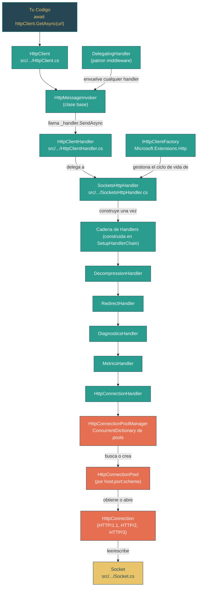

# Nivel 2: Practicante -- Fundamentos de Networking: HttpClient y Sockets

> **Perfil objetivo:** Desarrollador que usa HttpClient pero no entiende la gestion de conexiones ni el pipeline de handlers
> **Esfuerzo estimado:** 5 horas
> **Prerrequisitos:** Nivel 1 completo, Modulo 2.3 (Patrones Async/Await)
> [English version](../en/02-practitioner-networking.md)

---

## Objetivos de Aprendizaje

Al completar este modulo, vas a poder:

1. **Rastrear** un request HTTP desde `HttpClient.GetAsync` a traves de la cadena de handlers hasta llegar a un `Socket`.
2. **Explicar** por que `HttpClient` debe reutilizarse y que pasa internamente cuando lo dispones.
3. **Describir** el patron middleware de `DelegatingHandler` y construir un handler personalizado que se integre al pipeline.
4. **Identificar** como `SocketsHttpHandler` gestiona pools de conexiones, timeouts de inactividad y tiempos de vida de conexiones.
5. **Navegar** la clase `System.Net.Sockets.Socket` y explicar su rol como fundamento de todo el networking en .NET.
6. **Articular** por que existe `IHttpClientFactory` y como resuelve los problemas de rotacion de DNS y tiempo de vida de handlers.
7. **Describir** que sucede en las capas de DNS, TLS y TCP cuando se realiza un request HTTP.
8. **Leer** codigo real de connection pooling y cadenas de handlers en el fuente de `dotnet/runtime` y entender las decisiones de diseno detras.

---

## Mapa Conceptual



---

## Curriculum

### Leccion 2.7.1: HttpClient -- Mucho Mas que un Wrapper

**Lo que vas a aprender:** `HttpClient` es una capa de conveniencia liviana sobre un pipeline de handlers. Entender su estructura real explica por que reutilizarlo importa y por que disponerlo descuidadamente causa problemas.

**El concepto:**

La mayoria de los desarrolladores piensan en `HttpClient` como "la cosa que hace requests HTTP." En realidad, hace muy poco trabajo por si mismo. Mira su declaracion de clase en el fuente:

```csharp
// src/libraries/System.Net.Http/src/System/Net/Http/HttpClient.cs, linea 14
public partial class HttpClient : HttpMessageInvoker
```

`HttpClient` hereda de `HttpMessageInvoker`, que mantiene una unica instancia de `HttpMessageHandler`. Cada metodo de conveniencia -- `GetAsync`, `PostAsync`, `PutAsync`, `DeleteAsync` -- termina llamando `base.SendAsync(request, cts.Token)` en el invoker, que llama `_handler.SendAsync(request, cancellationToken)` en el handler.

Esta es la cadena de propiedad cuando usas el constructor por defecto:

1. `new HttpClient()` llama a `new HttpClient(new HttpClientHandler())` (linea 138)
2. `HttpClientHandler` crea un `SocketsHttpHandler` como `_underlyingHandler` (linea 75, via el alias de tipo `HttpHandlerType`)
3. En el primer request, `SocketsHttpHandler.SetupHandlerChain()` construye el pipeline interno completo

Lo que `HttpClient` agrega por encima del handler:
- **Headers por defecto** (`DefaultRequestHeaders`) aplicados a cada request
- **Direccion base** (`BaseAddress`) para resolver URIs relativos
- **Timeout** (por defecto: 100 segundos) aplicado via `CancellationTokenSource`
- **Telemetria** con eventos start/stop para `HttpTelemetry`
- **Soporte de cancelacion** via `_pendingRequestsCts`

**Por que reutilizar importa:** Cuando creas un `HttpClient` con `new`, creas un nuevo `SocketsHttpHandler`, que crea un nuevo `HttpConnectionPoolManager`, que mantiene su propio conjunto de conexiones TCP. Si creas y dispones instancias de `HttpClient` por cada request:
- Descartas conexiones calientes (TCP + TLS ya negociados)
- Dejas conexiones en estado `TIME_WAIT` (el SO mantiene el socket hasta 240 segundos)
- Podes agotar los puertos efimeros bajo carga ("socket exhaustion")

**En el codigo fuente:**
- `src/libraries/System.Net.Http/src/System/Net/Http/HttpClient.cs` -- La clase completa. Nota el flag `_operationStarted` (linea 24): una vez que se hace un request, los setters de propiedades como `Timeout` lanzan `InvalidOperationException`. Esto es deliberado: la cadena de handlers se construye de forma lazy y se vuelve inmutable despues del primer uso.
- `src/libraries/System.Net.Http/src/System/Net/Http/HttpMessageInvoker.cs` -- La clase base que realmente invoca el handler. Las lineas 67-78 muestran `SendAsync` llamando `_handler.SendAsync`.

**Ejercicio practico:**

1. Abri `src/libraries/System.Net.Http/src/System/Net/Http/HttpClient.cs` y busca el constructor sin parametros. Segui la cadena de constructores para confirmar que crea un `HttpClientHandler`.
2. Busca el metodo `CheckDisposedOrStarted()`. Lista todas las propiedades que lo llaman. Por que `DefaultRequestHeaders` no lo llama?
3. Abri `HttpMessageInvoker.cs` y lee el metodo `SendAsync`. Nota la bifurcacion de telemetria: `ShouldSendWithTelemetry(request)`. Que trabajo adicional hace la ruta de telemetria?
4. Escribi un programa pequeno que cree una unica instancia de `HttpClient` en un campo `static readonly` y haga 10 requests concurrentes. Compara esto con crear un nuevo `HttpClient` para cada request. Observa la diferencia en reutilizacion de conexiones usando `netstat` o `ss -tnp`.

**Conclusion clave:** `HttpClient` es una fachada liviana. El trabajo real ocurre en la cadena de handlers que envuelve. Reutiliza instancias de `HttpClient` para reutilizar el pool de conexiones subyacente.

---

### Leccion 2.7.2: La Cadena de Handlers -- DelegatingHandler y el Patron Middleware

**Lo que vas a aprender:** El stack HTTP de .NET usa una lista enlazada de handlers (similar al middleware en ASP.NET Core) para componer funcionalidades transversales como redireccion, descompresion, diagnosticos y autenticacion.

**El concepto:**

El patron se basa en dos clases abstractas:

```
HttpMessageHandler          (base abstracta -- define SendAsync)
    |
    +-- DelegatingHandler   (abstracta -- envuelve un InnerHandler, reenvía llamadas)
    |       |
    |       +-- RedirectHandler
    |       +-- DecompressionHandler
    |       +-- DiagnosticsHandler
    |       +-- MetricsHandler
    |       +-- Tus handlers personalizados
    |
    +-- SocketsHttpHandler  (handler terminal -- realmente envia bytes)
```

`DelegatingHandler` es la abstraccion clave. Lee todo su fuente en `src/libraries/System.Net.Http/src/System/Net/Http/DelegatingHandler.cs` -- son solo 99 lineas. El metodo critico:

```csharp
// DelegatingHandler.cs, linea 53
protected internal override Task<HttpResponseMessage> SendAsync(
    HttpRequestMessage request, CancellationToken cancellationToken)
{
    ArgumentNullException.ThrowIfNull(request);
    SetOperationStarted();
    return _innerHandler!.SendAsync(request, cancellationToken);
}
```

Cada `DelegatingHandler` hace algo antes o despues de llamar `_innerHandler.SendAsync`. Este es el clasico patron cadena de responsabilidad. Podes insertar cualquier comportamiento -- logging, reintentos, cache, inyeccion de headers -- subclaseando `DelegatingHandler`.

**Como se construye la cadena interna:** Cuando se ejecuta `SocketsHttpHandler.SetupHandlerChain()` (lineas 518-562 de `SocketsHttpHandler.cs`), compone la cadena de abajo hacia arriba:

1. `HttpConnectionHandler` (envuelve `HttpConnectionPoolManager`) -- la capa mas interna
2. `MetricsHandler` -- registra metricas de `http.request.duration`
3. `DiagnosticsHandler` -- propaga contexto de tracing distribuido
4. `RedirectHandler` -- sigue redirects 3xx (si `AllowAutoRedirect` es true)
5. `DecompressionHandler` -- maneja descompresion gzip/brotli/zstd (si esta habilitada)

El handler mas externo es lo que `SocketsHttpHandler.SendAsync` llama. Un request fluye hacia adentro a traves de la cadena; el response fluye de vuelta hacia afuera.

**En el codigo fuente:**
- `src/libraries/System.Net.Http/src/System/Net/Http/DelegatingHandler.cs` -- La clase base middleware completa. Nota el flag `_operationStarted` (linea 17) y el patron `CheckDisposedOrStarted()`: una vez que se dispara el primer request, no podes cambiar `InnerHandler`.
- `src/libraries/System.Net.Http/src/System/Net/Http/SocketsHttpHandler/SocketsHttpHandler.cs` lineas 518-562 -- `SetupHandlerChain()` muestra el orden exacto de composicion. El `Interlocked.CompareExchange` en la linea 556 asegura que exactamente una cadena se construya incluso bajo concurrencia.

**Ejercicio practico:**

1. Lee el archivo completo `DelegatingHandler.cs`. Dibuja la jerarquia de clases: `HttpMessageHandler` -> `DelegatingHandler` -> handlers concretos.
2. Escribi un `DelegatingHandler` personalizado que loguee el URI del request y el tiempo transcurrido:
   ```csharp
   public class TimingHandler : DelegatingHandler
   {
       protected override async Task<HttpResponseMessage> SendAsync(
           HttpRequestMessage request, CancellationToken cancellationToken)
       {
           var sw = Stopwatch.StartNew();
           HttpResponseMessage response = await base.SendAsync(request, cancellationToken);
           sw.Stop();
           Console.WriteLine($"{request.Method} {request.RequestUri} -> {(int)response.StatusCode} en {sw.ElapsedMilliseconds}ms");
           return response;
       }
   }
   ```
3. Usalo: `new HttpClient(new TimingHandler { InnerHandler = new HttpClientHandler() })`.
4. Abri `SetupHandlerChain()` en `SocketsHttpHandler.cs` y rastrea que pasa cuando `AllowAutoRedirect` es `false` y `AutomaticDecompression` es `None`. Que tan corta es la cadena?

**Conclusion clave:** La cadena de handlers es un pipeline de comportamientos componibles. `DelegatingHandler` hace que cada funcionalidad transversal sea un modulo enchufable. La cadena interna se construye de forma lazy y se bloquea despues del primer uso.

---

### Leccion 2.7.3: SocketsHttpHandler -- Connection Pooling

**Lo que vas a aprender:** `SocketsHttpHandler` gestiona un pool de conexiones TCP organizadas por endpoint. Entender este pool explica las caracteristicas de rendimiento, el comportamiento de DNS y por que `PooledConnectionLifetime` es la configuracion clave.

**El concepto:**

Cuando un request llega al fondo de la cadena de handlers, alcanza `HttpConnectionHandler`, que delega a `HttpConnectionPoolManager`. El pool manager es un `ConcurrentDictionary<HttpConnectionKey, HttpConnectionPool>` -- un pool por cada combinacion unica de scheme + host + port.

El comentario al inicio de `HttpConnectionPoolManager.cs` (lineas 15-29) documenta el flujo completo:

```
(1) HttpConnectionPoolManager.SendAsync:       Busqueda de proxy
(2) HttpConnectionPoolManager.SendAsyncCore:   Buscar o crear pool de conexiones
(3) HttpConnectionPool.SendAsync:              Manejar autenticacion basic/digest del request
(4) HttpConnectionPool.SendWithProxyAuthAsync: Manejar autenticacion basic/digest del proxy
(5) HttpConnectionPool.SendWithRetryAsync:     Obtener conexion del pool o crear nueva;
                                               reintentar en fallas de conexion reutilizada
(6) HttpConnection.SendAsync:                  Manejar autenticacion negotiate/ntlm
(7) HttpConnection.SendWithNtProxyAuthAsync:   Manejar autenticacion negotiate/ntlm del proxy
(8) HttpConnection.SendAsyncCore:              Escribir request, leer response
```

**Configuraciones del ciclo de vida de conexiones en `SocketsHttpHandler`:**

| Propiedad | Valor por defecto | Que controla |
|---|---|---|
| `PooledConnectionIdleTimeout` | 1 minuto | Cuanto tiempo una conexion inactiva permanece en el pool antes de cerrarse |
| `PooledConnectionLifetime` | `Infinite` | Tiempo de vida maximo total de una conexion (inactiva o activa). **Configura esto para rotar DNS.** |
| `MaxConnectionsPerServer` | `int.MaxValue` | Conexiones concurrentes maximas por endpoint |
| `ConnectTimeout` | `Infinite` | Timeout para establecer una nueva conexion TCP |

**El problema del DNS:** Con la configuracion por defecto, `PooledConnectionLifetime` es infinito. Una vez que se establece una conexion a la IP `1.2.3.4`, permanece abierta para siempre, incluso si el DNS para ese hostname ahora resuelve a `5.6.7.8`. Esto importa para servicios en la nube detras de balanceadores de carga. Configurar `PooledConnectionLifetime = TimeSpan.FromMinutes(2)` fuerza el reciclaje de conexiones, disparando nueva resolucion de DNS.

**Limpieza de conexiones:** El pool manager ejecuta un timer de limpieza (`_cleaningTimer` en `HttpConnectionPoolManager.cs`, lineas 97-111). Su frecuencia se deriva de `PooledConnectionIdleTimeout` dividido por 4, con un minimo de 1 segundo. El callback del timer llama a `RemoveStalePools()`, que recorre todos los pools y elimina conexiones expiradas.

El patron `WeakReference<HttpConnectionPoolManager>` (linea 102) previene que el timer mantenga vivo al pool manager despues de que el handler se dispone -- un detalle sutil pero importante para evitar fugas de memoria.

**En el codigo fuente:**
- `src/libraries/System.Net.Http/src/System/Net/Http/SocketsHttpHandler/HttpConnectionPoolManager.cs` -- El pool manager. Las lineas 15-29 son una vista arquitectonica que debes leer. Las lineas 60-139 muestran la inicializacion: configuracion de proxy, configuracion del timer y el patron de weak reference.
- `src/libraries/System.Net.Http/src/System/Net/Http/SocketsHttpHandler/HttpConnectionHandler.cs` -- El handler mas delgado de la cadena: 36 lineas en total. Simplemente reenvía a `_poolManager.SendAsync`.
- `src/libraries/System.Net.Http/src/System/Net/Http/SocketsHttpHandler/SocketsHttpHandler.cs` lineas 213-241 -- Las declaraciones de propiedades `PooledConnectionLifetime` y `PooledConnectionIdleTimeout`.

**Ejercicio practico:**

1. Abri `HttpConnectionPoolManager.cs` y lee el bloque de comentarios en las lineas 15-29. Dibuja el flujo de 8 pasos como diagrama.
2. Busca el codigo de configuracion del timer (lineas 97-111). Por que usa un `WeakReference`? Que pasaria si usara una referencia directa?
3. Calcula la frecuencia del timer de limpieza para estas configuraciones:
   - `PooledConnectionIdleTimeout = 2 minutos` -> el timer se dispara cada ??? segundos
   - `PooledConnectionIdleTimeout = 2 segundos` -> el timer se dispara cada ??? segundos
   - `PooledConnectionIdleTimeout = Infinite` -> el timer se dispara cada ??? segundos
4. Abri `HttpConnectionHandler.cs` y lee el archivo entero. Por que la verificacion de autenticacion se hace aca (`_doRequestAuth && !request.IsAuthDisabled()`) en lugar de mas profundo en el stack?
5. Escribi un programa que configure `SocketsHttpHandler` directamente:
   ```csharp
   var handler = new SocketsHttpHandler
   {
       PooledConnectionLifetime = TimeSpan.FromMinutes(2),
       PooledConnectionIdleTimeout = TimeSpan.FromMinutes(1),
       MaxConnectionsPerServer = 10
   };
   var client = new HttpClient(handler);
   ```

**Conclusion clave:** El connection pooling es por endpoint, gestionado por `HttpConnectionPoolManager`. La configuracion `PooledConnectionLifetime` es critica para escenarios sensibles a DNS. El timer de limpieza usa weak references para evitar fugas de memoria cuando los handlers se reemplazan.

---

### Leccion 2.7.4: Socket -- El Fundamento

**Lo que vas a aprender:** Cada conexion HTTP en ultima instancia descansa sobre un `System.Net.Sockets.Socket`. Entender esta clase revela la capa de abstraccion de plataforma debajo de la API HTTP de alto nivel.

**El concepto:**

`Socket` implementa la interfaz de sockets de Berkeley para .NET. Su declaracion:

```csharp
// src/libraries/System.Net.Sockets/src/System/Net/Sockets/Socket.cs, linea 21
public partial class Socket : IDisposable
```

La keyword `partial` es la primera pista de que esta clase tiene implementaciones especificas por plataforma. El codigo compartido define la superficie de la API, mientras que archivos especificos de plataforma (por ejemplo, `Socket.Unix.cs`, `Socket.Windows.cs`) proveen la conexion con el sistema operativo.

**Campos clave del fuente (lineas 23-70):**

| Campo | Proposito |
|---|---|
| `_handle` (`SafeSocketHandle`) | El descriptor de socket del SO, envuelto para disposal seguro |
| `_rightEndPoint` | El endpoint local despues de `Bind()` -- `null` si no esta enlazado |
| `_remoteEndPoint` | El endpoint remoto despues de `Connect()` |
| `_isConnected` / `_isDisconnected` | Seguimiento del estado de conexion |
| `_willBlock` / `_willBlockInternal` | Modo bloqueante: deseado vs. actual |
| `_addressFamily` | IPv4 (`InterNetwork`), IPv6 (`InterNetworkV6`), o Unix |
| `_socketType` | Stream (TCP), Dgram (UDP), Raw, etc. |
| `_protocolType` | TCP, UDP, etc. |

**Sockets de modo dual:** El constructor por defecto (linea 72) crea un socket de modo dual cuando el SO soporta IPv6:

```csharp
public Socket(SocketType socketType, ProtocolType protocolType)
    : this(OSSupportsIPv6 ? AddressFamily.InterNetworkV6 : AddressFamily.InterNetwork, ...)
{
    if (OSSupportsIPv6DualMode) DualMode = true;
}
```

Modo dual significa que un unico socket maneja conexiones tanto IPv4 como IPv6. Asi es como .NET evita necesitar sockets separados para las dos familias de direcciones en SOs modernos.

**El patron asincrono:** `Socket` ha evolucionado a traves de multiples patrones asincronos en la historia de .NET:
1. **APM** (Begin/End) -- el patron original de .NET Framework
2. **EAP** (SocketAsyncEventArgs) -- el patron de alto rendimiento para servidores
3. **TAP** (basado en Task) -- el patron moderno: `ConnectAsync`, `SendAsync`, `ReceiveAsync` retornando `ValueTask`

Los metodos TAP son los que `SocketsHttpHandler` usa internamente cuando establece conexiones y transfiere datos.

**Diferencias de plataforma:** WASI (WebAssembly System Interface) no puede hacer operaciones bloqueantes, por eso la linea 48 establece `_willBlock = !OperatingSystem.IsWasi()`. Este es un ejemplo concreto de como el runtime se adapta a las restricciones de la plataforma a nivel de socket.

**En el codigo fuente:**
- `src/libraries/System.Net.Sockets/src/System/Net/Sockets/Socket.cs` -- La implementacion compartida. Las lineas 23-80 definen el estado que cada socket lleva.
- El wrapper `SafeSocketHandle` asegura que el socket del SO se cierre correctamente incluso si el objeto `Socket` es finalizado sin ser dispuesto.
- `s_IPAddressAnyMapToIPv6` (linea 25) -- Una direccion mapeada pre-computada usada para binding en modo dual. `IPAddress.Any.MapToIPv6()` mapea `0.0.0.0` a `::ffff:0.0.0.0`.

**Ejercicio practico:**

1. Abri `Socket.cs` e identifica todos los marcadores `partial`. Estos indican que codigo especifico de plataforma vive en archivos companeros.
2. Busca `Socket.Unix.cs` y `Socket.Windows.cs` en la library `System.Net.Sockets`. Compara como `ConnectAsync` o `SendAsync` se implementan en cada plataforma.
3. Escribi un cliente TCP echo minimo usando `Socket` directo:
   ```csharp
   using var socket = new Socket(SocketType.Stream, ProtocolType.Tcp);
   await socket.ConnectAsync(new DnsEndPoint("example.com", 80));
   byte[] request = "GET / HTTP/1.0\r\nHost: example.com\r\n\r\n"u8.ToArray();
   await socket.SendAsync(request);
   var buffer = new byte[4096];
   int received = await socket.ReceiveAsync(buffer);
   Console.WriteLine(Encoding.UTF8.GetString(buffer, 0, received));
   ```
4. Compara esto con `await new HttpClient().GetStringAsync("http://example.com")`. Conta cuantas capas de abstraccion hay entre las dos.

**Conclusion clave:** `Socket` es donde .NET se encuentra con el sistema operativo. Es una `partial class` con implementaciones especificas por plataforma, maneja tanto IPv4 como IPv6 via modo dual, y ha evolucionado a traves de tres patrones asincronos. Todo en `System.Net.Http` en ultima instancia lee y escribe bytes a traves de un `Socket`.

---

### Leccion 2.7.5: IHttpClientFactory -- Gestionando Tiempos de Vida

**Lo que vas a aprender:** `IHttpClientFactory` resuelve dos problemas que el uso directo de `HttpClient` crea: agotamiento de sockets por disposal frecuente y DNS desactualizado por instancias de larga vida.

**El concepto:**

Ahora entendes dos verdades que tiran en direcciones opuestas:

1. **No crees/dispongas `HttpClient` por request** -- vas a agotar sockets (Leccion 2.7.1)
2. **No mantengas `HttpClient` vivo para siempre** -- nunca vas a re-resolver DNS (Leccion 2.7.3)

`IHttpClientFactory`, definido en `Microsoft.Extensions.Http`, navega entre ambos problemas. Su contrato es un solo metodo:

```csharp
// src/libraries/Microsoft.Extensions.Http/src/IHttpClientFactory.cs, linea 36
HttpClient CreateClient(string name);
```

Cada llamada retorna una **nueva instancia de `HttpClient`**, pero el `HttpMessageHandler` subyacente es **compartido y pooled**. El `DefaultHttpClientFactory` (en `DefaultHttpClientFactory.cs`) mantiene:

- `_activeHandlers`: Un `ConcurrentDictionary<string, Lazy<ActiveHandlerTrackingEntry>>` -- un handler por cliente nombrado
- `_expiredHandlers`: Un `ConcurrentQueue<ExpiredHandlerTrackingEntry>` -- handlers esperando ser recolectados y dispuestos

**Ciclo de vida de rotacion de handlers:**

1. Llamas `factory.CreateClient("github")` -- la factory retorna un nuevo `HttpClient` envolviendo un handler compartido de `_activeHandlers`.
2. Despues de que el tiempo de vida del handler expira (por defecto: 2 minutos), se mueve de `_activeHandlers` a `_expiredHandlers`. Nuevas llamadas a `CreateClient("github")` obtienen un handler fresco.
3. Un timer de limpieza (cada 10 segundos) verifica `_expiredHandlers`. Si ninguna instancia de `HttpClient` referencia al handler viejo (detectado via `WeakReference`), se dispone.
4. Las conexiones del handler viejo se drenan de forma gradual -- los requests en vuelo existentes se completan normalmente.

Este diseno significa:
- **Las instancias de `HttpClient` son baratas** -- podes crearlas y descartarlas libremente
- **Los handlers son costosos y compartidos** -- la factory gestiona su ciclo de vida
- **El DNS rota** -- porque los handlers se reciclan cada 2 minutos
- **No hay agotamiento de sockets** -- porque los handlers se pooled, no se crean por cliente

**En el codigo fuente:**
- `src/libraries/Microsoft.Extensions.Http/src/IHttpClientFactory.cs` -- La interfaz. El comentario XML (lineas 25-30) dice explicitamente: "Generalmente no es necesario disponer el HttpClient."
- `src/libraries/Microsoft.Extensions.Http/src/DefaultHttpClientFactory.cs` -- La implementacion. Las lineas 46-59 muestran las colecciones `_activeHandlers` y `_expiredHandlers`. La linea 34 define el intervalo de limpieza de 10 segundos.

**Ejercicio practico:**

1. Lee `IHttpClientFactory.cs` completamente. Nota la documentacion XML que explica el modelo de disposal.
2. Abri `DefaultHttpClientFactory.cs` y busca:
   - El diccionario `_activeHandlers` (linea 51)
   - La cola `_expiredHandlers` (linea 59)
   - El `DefaultCleanupInterval` de 10 segundos (linea 34)
3. Rastrea que pasa cuando registras clientes nombrados:
   ```csharp
   services.AddHttpClient("github", client =>
   {
       client.BaseAddress = new Uri("https://api.github.com/");
   });
   ```
   Busca donde se define `AddHttpClient` y como configura `HttpClientFactoryOptions`.
4. Compara estos tres enfoques y ranquealos por correccion:
   - `static readonly HttpClient _client = new();` -- Bueno, pero DNS nunca rota
   - `using var client = new HttpClient(); ...` -- Malo, agotamiento de sockets
   - `IHttpClientFactory.CreateClient("name")` -- Mejor, rota DNS y poolea handlers

**Conclusion clave:** `IHttpClientFactory` desacopla el tiempo de vida de `HttpClient` del tiempo de vida del handler. Creas/descartas instancias de `HttpClient` libremente; la factory gestiona los handlers costosos y sus pools de conexiones por debajo, reciclandolos para respetar cambios de DNS.

---

### Leccion 2.7.6: DNS, TLS y Ciclo de Vida de Conexiones -- Anatomia de un Request

**Lo que vas a aprender:** Que realmente sucede cuando llamas `await httpClient.GetAsync("https://api.example.com/data")` -- desde la resolucion DNS pasando por el handshake TLS hasta el response HTTP fluyendo de vuelta a traves de la cadena de handlers.

**El concepto:**

Rastreemos un request HTTPS completo a traves de cada capa. Asumimos que este es el primer request a `api.example.com`:

**Fase 1: Recorrido de la cadena de handlers (salida)**

```
HttpClient.GetAsync("https://api.example.com/data")
  -> Crea HttpRequestMessage
  -> HttpClient.SendAsync
    -> HttpMessageInvoker.SendAsync (envuelve con telemetria)
      -> SocketsHttpHandler.SendAsync
        -> [Cadena de handlers construida en primer request via SetupHandlerChain]
        -> DecompressionHandler.SendAsync (si esta habilitado -- envuelve Accept-Encoding)
          -> RedirectHandler.SendAsync (si esta habilitado -- seguira 3xx despues)
            -> DiagnosticsHandler.SendAsync (inicia Activity para tracing distribuido)
              -> MetricsHandler.SendAsync (inicia medicion de tiempo)
                -> HttpConnectionHandler.SendAsync
                  -> HttpConnectionPoolManager.SendAsync
```

**Fase 2: Adquisicion de conexion**

```
HttpConnectionPoolManager.SendAsyncCore
  -> Busca pool para clave {https, api.example.com, 443}
  -> El pool no existe -> crea nuevo HttpConnectionPool
    -> HttpConnectionPool.SendWithRetryAsync
      -> No hay conexion idle disponible -> crear nueva conexion
```

**Fase 3: Establecimiento TCP + TLS**

```
Crear nueva conexion:
  1. Resolucion DNS: resolver "api.example.com" -> 93.184.216.34
  2. Creacion de Socket: new Socket(SocketType.Stream, ProtocolType.Tcp)
  3. Conexion TCP: socket.ConnectAsync(93.184.216.34, 443)
     -> SYN -> SYN-ACK -> ACK (three-way handshake)
  4. Handshake TLS: SslStream envuelve el NetworkStream del socket
     -> ClientHello (con SNI: api.example.com)
     -> ServerHello + Certificado
     -> Intercambio de claves
     -> Finished
  5. Negociacion ALPN determina la version HTTP (h2 para HTTP/2, http/1.1 para HTTP/1.1)
```

**Fase 4: Request/Response HTTP**

```
HttpConnection.SendAsyncCore:
  -> Escribe headers del request al stream
  -> Escribe body del request (si hay)
  -> Lee linea de estado del response
  -> Lee headers del response
  -> Retorna HttpResponseMessage (el body stream es lazy)
```

**Fase 5: Recorrido de la cadena de handlers (retorno)**

```
  HttpResponseMessage fluye de vuelta hacia arriba:
    MetricsHandler: registra http.request.duration
    DiagnosticsHandler: detiene Activity
    RedirectHandler: si es 3xx, inicia un NUEVO request al header Location
    DecompressionHandler: envuelve response stream con GZipStream/BrotliStream
  -> HttpClient recibe el response
  -> Tu codigo obtiene el resultado awaited
```

**Fase 6: Retorno de conexion al pool**

```
Despues de que el body del response se lee completamente:
  -> La conexion se retorna a HttpConnectionPool
  -> Permanece idle hasta el proximo request o hasta que expire PooledConnectionIdleTimeout
  -> Si se excede PooledConnectionLifetime, se marca para disposal en el proximo escaneo
```

**En un request subsiguiente al mismo host**, las Fases 2-3 se saltan completamente. El pool manager encuentra el pool existente, el pool encuentra una conexion idle, y el request reutiliza la conexion TCP+TLS ya abierta. Por eso la reutilizacion de conexiones mejora dramaticamente la latencia -- te saltas DNS, TCP handshake (1 RTT) y TLS handshake (1-2 RTTs).

**En el codigo fuente:**
- `src/libraries/System.Net.Http/src/System/Net/Http/SocketsHttpHandler/HttpConnectionPoolManager.cs` lineas 15-29 -- El comentario canonico del flujo de 8 pasos.
- `src/libraries/System.Net.Http/src/System/Net/Http/SocketsHttpHandler/SocketsHttpHandler.cs` lineas 518-562 -- Ensamblaje de la cadena de handlers.
- `src/libraries/System.Net.Http/src/System/Net/Http/SocketsHttpHandler/HttpConnectionHandler.cs` -- El puente de la cadena de handlers al pool manager.

**Ejercicio practico:**

1. Usando el flujo de 8 pasos de `HttpConnectionPoolManager.cs` y la cadena de handlers de `SocketsHttpHandler.cs`, dibuja un diagrama de secuencia completo de un request HTTPS GET desde `HttpClient.GetAsync` hasta bytes en un socket.
2. Calcula la diferencia de latencia entre:
   - **Request frio** (sin conexion existente): DNS + TCP handshake + TLS handshake + round-trip HTTP
   - **Request caliente** (conexion pooled): solo round-trip HTTP
   - Asumi: DNS = 50ms, TCP = 30ms (1 RTT), TLS 1.3 = 30ms (1 RTT), HTTP = 30ms (1 RTT). Cuanto mas rapido es el camino caliente?
3. Habilita logging de networking de .NET configurando `DOTNET_SYSTEM_NET_HTTP_SOCKETSHTTPHANDLER_LOG` (o usando listeners de `DiagnosticSource`) y hace un request. Observa los eventos de DNS, conexion y TLS.
4. Lee el metodo `SetupHandlerChain()` y determina: en que orden un redirect 302 con compresion gzip fluye a traves de los handlers? La descompresion ocurre antes o despues del redirect? Por que importa esto?

**Conclusion clave:** Un request HTTP recorre 6+ capas entre tu codigo y la red. En el primer request, DNS + TCP + TLS agrega 3+ round-trips de latencia. El connection pooling elimina este overhead para requests subsiguientes. La cadena de handlers procesa el request de salida y el response de entrada, con cada handler agregando un comportamiento especifico.

---

## Guia de Lectura de Codigo Fuente

Lee estos archivos en orden. Cada uno construye comprension de la siguiente capa hacia abajo.

| Orden | Archivo | En que enfocarse | Dificultad |
|---|---|---|---|
| 1 | `src/libraries/System.Net.Http/src/System/Net/Http/HttpClient.cs` | Cadena de constructores (lineas 138-151), patron `CheckDisposedOrStarted()`, como los metodos de conveniencia delegan a `base.SendAsync` | :star::star: |
| 2 | `src/libraries/System.Net.Http/src/System/Net/Http/HttpMessageInvoker.cs` | `SendAsync` (lineas 67-78): el unico punto donde se llama `_handler.SendAsync`. Bifurcacion de telemetria. | :star: |
| 3 | `src/libraries/System.Net.Http/src/System/Net/Http/DelegatingHandler.cs` | El archivo completo (99 lineas). Propiedad `InnerHandler`, `SetOperationStarted()`, inmutabilidad despues del primer uso. | :star: |
| 4 | `src/libraries/System.Net.Http/src/System/Net/Http/HttpClientHandler.cs` | El alias `HttpHandlerType` (lineas 16-23): como la plataforma selecciona `SocketsHttpHandler` vs `BrowserHttpHandler`. | :star::star: |
| 5 | `src/libraries/System.Net.Http/src/System/Net/Http/SocketsHttpHandler/SocketsHttpHandler.cs` | `SetupHandlerChain()` (lineas 518-562): el ensamblaje de la cadena de handlers. `SendAsync` (lineas 605-635): la inicializacion lazy de la cadena. | :star::star::star: |
| 6 | `src/libraries/System.Net.Http/src/System/Net/Http/SocketsHttpHandler/HttpConnectionPoolManager.cs` | El comentario del flujo (lineas 15-29). Constructor (lineas 60-139): configuracion del timer, weak references, resolucion de proxy. | :star::star::star: |
| 7 | `src/libraries/System.Net.Http/src/System/Net/Http/SocketsHttpHandler/HttpConnectionHandler.cs` | El archivo entero (36 lineas). El handler mas delgado -- solo hace puente al pool manager. | :star: |
| 8 | `src/libraries/System.Net.Sockets/src/System/Net/Sockets/Socket.cs` | Campos de estado (lineas 23-70), constructor de modo dual (lineas 72-79), adaptaciones para WASI. | :star::star: |
| 9 | `src/libraries/Microsoft.Extensions.Http/src/IHttpClientFactory.cs` | La interfaz y su documentacion XML. Nota la guia de disposal. | :star: |
| 10 | `src/libraries/Microsoft.Extensions.Http/src/DefaultHttpClientFactory.cs` | `_activeHandlers`, `_expiredHandlers`, timer de limpieza. Lineas 1-100 para la arquitectura. | :star::star::star: |

---

## Herramientas de Diagnostico y Comandos

| Comando / Herramienta | Que hace | Cuando usarlo |
|---|---|---|
| `netstat -an \| grep ESTABLISHED` | Muestra conexiones TCP activas | Verificar que el connection pooling funciona -- deberias ver conexiones persistentes a tu host destino |
| `netstat -an \| grep TIME_WAIT` | Muestra conexiones en estado TIME_WAIT | Diagnosticar agotamiento de sockets -- muchas entradas TIME_WAIT significa que estas disponiendo conexiones muy agresivamente |
| `DOTNET_SYSTEM_NET_HTTP_USESOCKETSHTTPHANDLER=0` | Cae al handler HTTP de la plataforma | Debugging de problemas especificos de SocketsHttpHandler |
| `dotnet-counters monitor -n MiApp --counters System.Net.Http` | Metricas HTTP de conexion en vivo | Monitorear tamano del pool de conexiones, tasas de requests y profundidad de cola en tiempo real |
| `dotnet-trace collect -n MiApp --providers System.Net.Http` | Recopilar tracing HTTP detallado | Capturar tiempos de resolucion DNS, duraciones de handshake TLS, tasas de reutilizacion de conexiones |
| `curl -v https://example.com` | Muestra la negociacion HTTP completa | Comparar lo que ves en .NET con un intercambio HTTP crudo: DNS, TCP, TLS, headers |

---

## Autoevaluacion

Proba tu comprension con estas preguntas. Intenta responder antes de revelar la respuesta.

### Pregunta 1: De que clase hereda HttpClient, y que hace realmente esa clase base?

<details>
<summary>Mostrar respuesta</summary>

`HttpClient` hereda de `HttpMessageInvoker`. La clase base mantiene una referencia a un `HttpMessageHandler` y provee metodos `SendAsync`/`Send` que delegan a `_handler.SendAsync(request, cancellationToken)`. Tambien maneja eventos de telemetria start/stop. `HttpClient` agrega metodos de conveniencia (`GetAsync`, `PostAsync`), headers por defecto, direccion base y soporte de timeout por encima.

</details>

### Pregunta 2: Cuando llamas `new HttpClient()`, que cadena de handlers se crea?

<details>
<summary>Mostrar respuesta</summary>

`new HttpClient()` llama a `new HttpClient(new HttpClientHandler())`. `HttpClientHandler` crea un `SocketsHttpHandler` como su handler subyacente (en plataformas que no son browser/WASI). En el primer request, `SocketsHttpHandler.SetupHandlerChain()` construye lazily la cadena interna:

1. `HttpConnectionHandler` (mas interno -- envuelve `HttpConnectionPoolManager`)
2. `MetricsHandler` (si esta habilitado globalmente)
3. `DiagnosticsHandler` (si la propagacion de actividad esta habilitada)
4. `RedirectHandler` (si `AllowAutoRedirect` es true -- lo es por defecto)
5. `DecompressionHandler` (si `AutomaticDecompression` esta configurado -- `None` por defecto)

</details>

### Pregunta 3: Por que es importante PooledConnectionLifetime en ambientes cloud?

<details>
<summary>Mostrar respuesta</summary>

En ambientes cloud, los servicios frecuentemente estan detras de balanceadores de carga que usan DNS para distribuir trafico. Con el `PooledConnectionLifetime` por defecto de `Infinite`, una conexion TCP pooled permanece abierta para siempre, anclada a la direccion IP resuelta cuando la conexion se establecio por primera vez. Si el registro DNS cambia (por ejemplo, se desplego una nueva instancia, o se esta rebalanceando trafico), la conexion vieja nunca ve la nueva IP.

Configurar `PooledConnectionLifetime = TimeSpan.FromMinutes(2)` fuerza el reciclaje periodico de conexiones. Cuando una conexion reciclada se reemplaza, DNS se re-resuelve, recogiendo cualquier cambio. Por eso `IHttpClientFactory` configura un tiempo de vida de handler por defecto.

</details>

### Pregunta 4: Cual es la diferencia entre DelegatingHandler y HttpMessageHandler?

<details>
<summary>Mostrar respuesta</summary>

`HttpMessageHandler` es la clase base abstracta que define `SendAsync(HttpRequestMessage, CancellationToken)`. Es el contrato de interfaz para cualquier cosa que pueda procesar un request HTTP.

`DelegatingHandler` extiende `HttpMessageHandler` y agrega la propiedad `InnerHandler` -- una referencia al siguiente handler en la cadena. Su implementacion por defecto de `SendAsync` simplemente reenvía a `_innerHandler.SendAsync(...)`. Las subclases sobrescriben `SendAsync` para agregar comportamiento antes/despues de llamar `base.SendAsync(...)`.

`HttpMessageHandler` es para handlers terminales (como `SocketsHttpHandler`) que realmente envian bytes. `DelegatingHandler` es para middleware que envuelve otro handler.

</details>

### Pregunta 5: Como evita IHttpClientFactory tanto el agotamiento de sockets como el DNS desactualizado?

<details>
<summary>Mostrar respuesta</summary>

`IHttpClientFactory` separa el tiempo de vida de `HttpClient` del tiempo de vida del handler:

- **Se evita el agotamiento de sockets** porque el `HttpMessageHandler` subyacente (y su pool de conexiones) es compartido entre todas las instancias de `HttpClient` para el mismo cliente nombrado. Podes crear y descartar instancias de `HttpClient` libremente -- los handlers estan pooleados.
- **Se evita el DNS desactualizado** porque los handlers se rotan despues de un tiempo de vida configurable (por defecto: 2 minutos). Cuando un handler expira, nuevas llamadas a `CreateClient` obtienen un handler fresco con un pool de conexiones nuevo. El handler viejo se mantiene vivo hasta que todos los requests en vuelo se completan, luego se dispone.

El `DefaultHttpClientFactory` rastrea handlers activos en `_activeHandlers` y handlers expirados pero aun en uso en `_expiredHandlers`, con un timer de limpieza cada 10 segundos verificando si los handlers expirados pueden disponerse de forma segura.

</details>

### Pregunta 6: Cuales son los costos aproximados de latencia de un request HTTPS frio vs. caliente?

<details>
<summary>Mostrar respuesta</summary>

**Request frio** (sin conexion existente):
1. Resolucion DNS: ~50ms (varia ampliamente)
2. TCP three-way handshake: 1 RTT (~30ms para servidores cercanos)
3. TLS 1.3 handshake: 1 RTT (~30ms)
4. Request/response HTTP: 1 RTT (~30ms)
- **Total: ~140ms minimo** (3+ round-trips + DNS)

**Request caliente** (conexion pooled con TCP + TLS establecidos):
1. Request/response HTTP: 1 RTT (~30ms)
- **Total: ~30ms** (1 round-trip)

El connection pooling puede reducir la latencia en 70-80% para requests subsiguientes al mismo host. Para HTTP/2, el multiplexing permite multiples requests concurrentes sobre una unica conexion, reduciendo aun mas el overhead.

</details>

### Desafio Practico (60-90 minutos)

**Construi un "Rastreador de Requests" que visualice el pipeline de handlers:**

1. Crea tres clases `DelegatingHandler` personalizadas: `LoggingHandler`, `RetryHandler` y `TimingHandler`.
2. Encadenalas con un `HttpClientHandler`:
   ```
   LoggingHandler -> RetryHandler -> TimingHandler -> HttpClientHandler
   ```
3. Cada handler debe imprimir un mensaje antes y despues de llamar `base.SendAsync`, mostrando el request fluyendo hacia abajo y el response fluyendo de vuelta hacia arriba.
4. Hace requests a `https://httpbin.org/status/200` y `https://httpbin.org/status/500` (para disparar reintentos).
5. Observa el orden de ejecucion de handlers tanto en el camino de exito como en el de error.
6. Bonus: Mira como `SocketsHttpHandler.SetupHandlerChain()` construye su cadena interna. Podes replicar el mismo patron (construyendo de abajo hacia arriba) en tu codigo?

---

## Conexiones

| Direccion | Modulo | Tema |
|---|---|---|
| **Prerrequisitos** | Modulo 2.3: Patrones Async/Await | Comprender `Task`, `ValueTask`, `ConfigureAwait` y maquinas de estado async |
| **Siguiente** | Modulo 2.8: Serializacion -- Internals de System.Text.Json | Como la serializacion JSON se integra con `HttpContent` y streaming |
| **Relacionado** | Modulo 3.x: Networking Avanzado -- HTTP/2 y HTTP/3 | Multiplexing de streams, QUIC y `HttpVersionPolicy` |
| **Relacionado** | Modulo 2.5: Fundamentos de Inyeccion de Dependencias | Comprender `IServiceCollection` y el contenedor DI que potencia `IHttpClientFactory` |
| **Indice** | [Indice del Learning Path](00-index.md) | Listado completo de modulos y autoevaluacion |

---

## Glosario

| Term (EN) | Termino (ES) | Definicion |
|---|---|---|
| **HttpClient** | HttpClient | Clase de alto nivel para enviar requests HTTP. Hereda de `HttpMessageInvoker`. Debe reutilizarse, no crearse por request. |
| **HttpMessageHandler** | HttpMessageHandler | Clase base abstracta para componentes que envian requests HTTP. Define `SendAsync`. |
| **DelegatingHandler** | DelegatingHandler | Un handler que envuelve otro handler (`InnerHandler`), formando una cadena middleware. Sobrescribi `SendAsync` para agregar comportamiento. |
| **SocketsHttpHandler** | SocketsHttpHandler | El handler HTTP por defecto en plataformas no-browser. Gestiona pools de conexiones, TLS, cookies y la cadena interna de handlers. |
| **HttpConnectionPoolManager** | HttpConnectionPoolManager | Clase interna que mantiene un `ConcurrentDictionary` de instancias `HttpConnectionPool`, una por endpoint (scheme + host + port). |
| **HttpConnectionPool** | HttpConnectionPool | Gestiona un conjunto de conexiones HTTP a un unico endpoint. Maneja reutilizacion, creacion y retiro de conexiones. |
| **Connection pooling** | Connection pooling | Reutilizar conexiones TCP entre multiples requests HTTP para evitar el overhead de handshakes TCP/TLS. |
| **PooledConnectionLifetime** | PooledConnectionLifetime | Tiempo de vida maximo total de una conexion pooled. Fuerza re-resolucion de DNS cuando las conexiones se reciclan. |
| **PooledConnectionIdleTimeout** | PooledConnectionIdleTimeout | Cuanto tiempo una conexion sin usar permanece en el pool antes de cerrarse. |
| **IHttpClientFactory** | IHttpClientFactory | Una factory que crea instancias de `HttpClient` con handlers pooled, resolviendo agotamiento de sockets y DNS desactualizado. |
| **Socket** | Socket | La primitiva de networking de nivel mas bajo en .NET, implementando la interfaz de sockets de Berkeley via partial classes especificas por plataforma. |
| **TIME_WAIT** | TIME_WAIT | Un estado TCP donde el puerto de una conexion cerrada permanece reservado por el SO hasta 240 segundos, previniendo reutilizacion inmediata. |
| **TLS** (Transport Layer Security) | TLS (Transport Layer Security) | El protocolo de encriptacion que asegura conexiones HTTPS. Se negocia despues de la conexion TCP, antes de que fluyan datos HTTP. |
| **ALPN** (Application-Layer Protocol Negotiation) | ALPN (Application-Layer Protocol Negotiation) | Una extension TLS que negocia el protocolo de aplicacion (HTTP/1.1, h2, h3) durante el handshake TLS. |
| **Socket de modo dual** | Socket de modo dual | Un unico socket que maneja conexiones tanto IPv4 como IPv6 mapeando direcciones IPv4 al formato IPv6. |
| **SNI** (Server Name Indication) | SNI (Server Name Indication) | Una extension TLS que envia el hostname destino durante el handshake, permitiendo multiples sitios HTTPS en una misma IP. |

---

## Referencias

| Recurso | Tipo | Que cubre |
|---|---|---|
| [Guias de HttpClient](https://learn.microsoft.com/es-es/dotnet/fundamentals/networking/http/httpclient-guidelines) | Docs oficiales | Mejores practicas para el uso de `HttpClient`, incluyendo patrones de factory |
| [Documentacion de IHttpClientFactory](https://learn.microsoft.com/es-es/dotnet/core/extensions/httpclient-factory) | Docs oficiales | Guia completa para usar `IHttpClientFactory` en aplicaciones .NET |
| [Telemetria de networking en .NET](https://learn.microsoft.com/es-es/dotnet/fundamentals/networking/networking-telemetry) | Docs oficiales | Como monitorear conexiones HTTP, DNS y TLS usando EventSource y metricas |
| [Steve Gordon -- Serie HttpClient Internals](https://www.stevejgordon.co.uk/) | Blog | Inmersiones profundas en `SocketsHttpHandler`, connection pooling y cadenas de handlers |
| [HttpConnectionPoolManager.cs fuente](https://source.dot.net/#System.Net.Http/System/Net/Http/SocketsHttpHandler/HttpConnectionPoolManager.cs) | Fuente | El comentario anotado del flujo (lineas 15-29) es la mejor vista arquitectonica del stack HTTP |
| [Stephen Toub -- Mejoras de rendimiento en .NET (serie anual)](https://devblogs.microsoft.com/dotnet/) | Blog | Cubre mejoras de rendimiento de networking con links a PRs relevantes |
| [RFC 9110 -- Semantica HTTP](https://www.rfc-editor.org/rfc/rfc9110) | Estandar | La especificacion autoritativa para semantica HTTP |
| [Programacion de sockets en .NET](https://learn.microsoft.com/es-es/dotnet/fundamentals/networking/sockets/socket-services) | Docs oficiales | Guia de programacion de sockets de bajo nivel |
