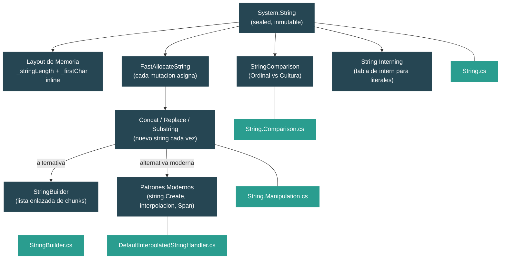

# Nivel 2: Practicante — Manejo de Strings y Procesamiento de Texto

> **Perfil objetivo:** Desarrollador que usa strings constantemente pero no comprende los internos de inmutabilidad ni los patrones optimos
> **Esfuerzo estimado:** 3 horas
> **Prerrequisitos:** [Modulo 1.3 — El Sistema de Tipos](01-foundations-type-system.md)
> [English version](../en/02-practitioner-strings.md)

---

## Objetivos de Aprendizaje

Al finalizar este modulo seras capaz de:

1. Describir el layout de memoria interno de un objeto `System.String`, incluyendo por que los caracteres se almacenan inline en lugar de en un array separado.
2. Explicar por que cada llamada a `Concat`, `Replace`, `Substring` y `Split` asigna un nuevo string, referenciando el codigo fuente real del runtime.
3. Articular por que la concatenacion de strings en un bucle es un patron O(n^2) y demostrarlo trazando la implementacion de `string.Concat(string, string)`.
4. Explicar la arquitectura de lista enlazada de chunks de `StringBuilder` y cuando supera en rendimiento a la concatenacion.
5. Elegir el modo correcto de `StringComparison` para un escenario dado y explicar los riesgos de correccion de usar el incorrecto.
6. Usar patrones modernos que evitan allocations: `string.Create`, interpolated string handlers y operaciones con `Span<char>`.

---

## Mapa de Conceptos



---

## Curriculo

### Leccion 1 — Internos del String: Inmutable por Diseno

#### Lo que vas a aprender

Como `System.String` esta organizado en memoria, por que es sealed e inmutable, y que hace el string interning. Vas a leer los campos reales que el runtime usa para almacenar cada string en tu programa.

#### El concepto

Un string en .NET no es un wrapper alrededor de un `char[]`. Los caracteres se almacenan *inline* en el propio objeto, justo despues del campo de longitud. Esto significa que crear un string requiere exactamente una asignacion en el heap, no dos (una para el objeto, otra para un array).

El layout de memoria de un string "Hi" en un sistema de 64 bits:

```
+---------------------------+
|  Object Header   (8 B)    |  sync block, bits del GC
+---------------------------+
|  MethodTable*    (8 B)    |  puntero a los metadatos de tipo de String
+---------------------------+
|  _stringLength   (4 B)    |  valor: 2
+---------------------------+
|  _firstChar      (2 B)    |  'H'
|  char[1]         (2 B)    |  'i'
|  '\0'            (2 B)    |  terminador null (para interop con C)
+---------------------------+
|  padding         (2 B)    |  alineacion
+---------------------------+
  Total: ~28 bytes
```

Los strings tienen tanto **prefijo de longitud** (`_stringLength`) como **terminador null** (para interop con APIs nativas de estilo C). Los caracteres se almacenan como UTF-16 (`char` = 2 bytes cada uno).

Tres decisiones de diseno hacen que esto funcione:

1. **Sealed** -- ninguna subclase puede cambiar el layout, asi que el runtime puede confiar en las posiciones de los campos.
2. **Inmutable** -- como los caracteres estan inline y el runtime comparte referencias libremente, la mutacion corromperia estado compartido. La inmutabilidad es una garantia de seguridad.
3. **`MaxLength = 0x3FFFFFDF`** -- aproximadamente mil millones de caracteres, coordinado con el allocator nativo del GC en `gchelpers.cpp`.

#### En el codigo fuente

Abri `src/libraries/System.Private.CoreLib/src/System/String.cs`:

```csharp
[Serializable]
[NonVersionable] // This only applies to field layout
public sealed partial class String
    : IComparable, IEnumerable, IConvertible, IEnumerable<char>,
      IComparable<string?>, IEquatable<string?>, ICloneable, ISpanParsable<string>
{
    internal const int MaxLength = 0x3FFFFFDF;

    // These fields map directly onto the fields in an EE StringObject.
    // See object.h for the layout.
    [NonSerialized] private readonly int _stringLength;
    [NonSerialized] private char _firstChar;
}
```

El comentario es critico: *"These fields map directly onto the fields in an EE StringObject. See object.h for the layout."* El orden de los campos del C# administrado debe coincidir exactamente con la estructura nativa de C++. `_firstChar` no es un array -- los caracteres restantes lo siguen en memoria, accedidos mediante aritmetica de punteros por metodos como `Concat`, `Replace` y `Substring`.

Tambien nota que `String.Empty` es inicializado por el motor de ejecucion al inicio y es tratado como un intrinsic por el JIT:

```csharp
[Intrinsic]
public static readonly string Empty;
```

**El string interning** es manejado por el runtime. En CoreCLR, los metodos `Intern` e `IsInterned` viven en `src/coreclr/System.Private.CoreLib/src/System/String.CoreCLR.cs`:

```csharp
public static string Intern(string str)
{
    ArgumentNullException.ThrowIfNull(str);
    Intern(new StringHandleOnStack(ref str!));
    return str;
}
```

La tabla de intern real esta implementada en codigo nativo via un QCall. Los string literales en tu codigo fuente son automaticamente internados por el runtime -- dos literales identicos en diferentes partes de tu codigo apuntan al mismo objeto.

#### Ejercicio practico

1. Verifica el comportamiento del interning:
   ```csharp
   string a = "hello";
   string b = "hello";
   Console.WriteLine(ReferenceEquals(a, b)); // True -- mismo objeto internado

   string c = new string("hello".ToCharArray());
   Console.WriteLine(ReferenceEquals(a, c)); // False -- 'c' es un objeto nuevo

   string d = string.Intern(c);
   Console.WriteLine(ReferenceEquals(a, d)); // True -- Intern devuelve la copia internada
   ```

2. Verifica `string.Empty`:
   ```csharp
   string e = "";
   Console.WriteLine(ReferenceEquals(e, string.Empty)); // True en runtimes modernos
   ```

3. Abri `src/libraries/System.Private.CoreLib/src/System/String.cs` y busca el campo `_firstChar`. Nota que esta declarado como un solo `char`, no `char[]`. Luego busca `FastAllocateString` -- este es el metodo que asigna exactamente la cantidad correcta de memoria para el string mas sus caracteres inline.

#### Conclusion clave

Los strings almacenan caracteres inline en el objeto. La inmutabilidad no es una restriccion arbitraria -- es un requisito de seguridad porque el runtime comparte referencias a strings libremente (a traves del interning, a traves del operador `+` devolviendo referencias, etc.). Toda operacion que "modifica" un string debe asignar uno nuevo.

#### Concepcion erronea comun

> *"Los strings internamente estan respaldados por un `char[]`."*
>
> No desde la creacion de .NET. El campo `_firstChar` es un unico `char`, y los caracteres adicionales lo siguen en memoria a traves de la asignacion especial del runtime. No hay indireccion a un array separado. Esto es mas eficiente en memoria (una asignacion en lugar de dos) y mas amigable con la cache (los caracteres son adyacentes a los metadatos del objeto).

---

### Leccion 2 — Operaciones con Strings: Que Asigna Memoria?

#### Lo que vas a aprender

Cada "modificacion" de un string crea un nuevo string en el heap. En esta leccion vas a trazar el codigo fuente de `Concat`, `Replace`, `Substring` y `Split` para ver exactamente donde ocurren las asignaciones y por que la concatenacion en bucles es un desastre O(n^2).

#### El concepto

Como los strings son inmutables, cada operacion que produce un string diferente debe:

1. Calcular la longitud del resultado.
2. Llamar a `FastAllocateString(length)` para asignar un nuevo string en el heap.
3. Copiar caracteres al nuevo string.
4. Devolver el nuevo string.

Esto significa que `string result = a + b;` se compila en `string.Concat(a, b)`, que asigna un nuevo string de longitud `a.Length + b.Length` y copia ambos conjuntos de caracteres.

**Por que la concatenacion en bucles es O(n^2):** Considera construir un string a partir de 1,000 palabras:

```csharp
string result = "";
for (int i = 0; i < 1000; i++)
{
    result += words[i]; // llama a string.Concat(result, words[i]) en cada iteracion
}
```

En cada iteracion, `Concat` asigna un nuevo string y copia *todos* los caracteres acumulados hasta ahora mas la nueva palabra. Si cada palabra tiene `w` caracteres:

- Iteracion 1: copia `w` caracteres
- Iteracion 2: copia `2w` caracteres
- Iteracion 3: copia `3w` caracteres
- ...
- Iteracion n: copia `nw` caracteres

Total de caracteres copiados: `w * (1 + 2 + 3 + ... + n) = w * n*(n+1)/2 = O(n^2 * w)`.

Para 1,000 palabras de 10 caracteres cada una, son aproximadamente 5 millones de copias de caracteres y 1,000 asignaciones en el heap -- todas se convierten en basura inmediatamente excepto la ultima.

#### En el codigo fuente

Abri `src/libraries/System.Private.CoreLib/src/System/String.Manipulation.cs` y mira `Concat(string?, string?)`:

```csharp
public static string Concat(string? str0, string? str1)
{
    if (IsNullOrEmpty(str0))
    {
        if (IsNullOrEmpty(str1))
        {
            return Empty;
        }
        return str1;
    }

    if (IsNullOrEmpty(str1))
    {
        return str0;
    }

    int str0Length = str0.Length;
    int totalLength = str0Length + str1.Length;

    string result = FastAllocateString(totalLength);   // <-- NUEVA asignacion
    CopyStringContent(result, 0, str0);                // <-- copia todo str0
    CopyStringContent(result, str0Length, str1);        // <-- copia todo str1

    return result;
}
```

Cada llamada a este metodo asigna un string fresco via `FastAllocateString` y copia *ambas* entradas completamente via `CopyStringContent` (que llama a `Buffer.Memmove`). En un bucle, el primer argumento (`result`) crece en cada iteracion, lo que significa que re-copias todo lo que has construido hasta ahora.

**`Substring`** sigue el mismo patron. Abri el mismo archivo y busca `InternalSubString`:

```csharp
private string InternalSubString(int startIndex, int length)
{
    string result = FastAllocateString(length);

    Buffer.Memmove(
        elementCount: (uint)length,
        destination: ref result._firstChar,
        source: ref Unsafe.Add(ref _firstChar, (nint)(uint)startIndex));

    return result;
}
```

Cada llamada a `Substring` asigna un nuevo string, incluso si estas extrayendo un pedazo pequeno de un string grande. Por eso `ReadOnlySpan<char>` (via `.AsSpan()`) es preferible cuando solo necesitas leer una porcion.

**`Replace(string, string)`** rastrea los indices de reemplazo en el stack usando `ValueListBuilder`, y luego asigna un solo string resultado:

```csharp
public string Replace(string oldValue, string? newValue)
{
    ArgumentException.ThrowIfNullOrEmpty(oldValue);
    newValue ??= Empty;

    var replacementIndices = new ValueListBuilder<int>(stackalloc int[StackallocIntBufferSizeLimit]);
    // ... encuentra todas las ocurrencias, luego construye un string resultado ...
}
```

Esto es mas inteligente que hacer reemplazos repetidos -- encuentra todas las coincidencias primero, luego hace una sola asignacion. Pero aun asi asigna un nuevo string para el resultado.

**`Split`** devuelve un `string[]`, lo que significa que asigna el array *y* un nuevo string por cada segmento.

#### Ejercicio practico

1. Conta las asignaciones mentalmente. Cuantas asignaciones de string causa este codigo?
   ```csharp
   string name = "World";
   string greeting = "Hello, " + name + "!";
   ```
   Respuesta: El compilador convierte esto en `string.Concat("Hello, ", name, "!")` (el overload de 3 argumentos), que hace **1** asignacion. El compilador es lo suficientemente inteligente para agrupar estas.

2. Ahora conta esto:
   ```csharp
   string result = "";
   for (int i = 0; i < 5; i++)
   {
       result += i.ToString();
   }
   ```
   Respuesta: Cada `i.ToString()` asigna (5 strings). Cada `+=` llama a `Concat` y asigna (5 strings). Mas el `""` inicial es internado (sin asignacion). Total: **10** asignaciones, de las cuales 9 se convierten en basura.

3. Abri `String.Manipulation.cs` y busca el overload `Concat(string?, string?, string?)`. Nota como delega a la version de 2 argumentos cuando alguna entrada es null o vacia -- esto evita asignaciones innecesarias para los casos degenerados.

#### Conclusion clave

Cada operacion de string que produce un resultado diferente llama a `FastAllocateString` y copia caracteres. Una sola concatenacion esta bien. La concatenacion en un bucle es O(n^2) porque cada iteracion re-copia todo lo construido hasta ahora. La solucion es `StringBuilder`, `string.Create` o `string.Join`.

#### Concepcion erronea comun

> *"El compilador/JIT optimiza la concatenacion de strings en bucles."*
>
> No lo hace. El compilador optimizara `"a" + "b"` en `"ab"` en tiempo de compilacion (constant folding), y agrupara operaciones `+` adyacentes en una llamada `Concat` de multiples argumentos. Pero no puede optimizar un bucle porque el numero de iteraciones no se conoce en tiempo de compilacion. Tenes que usar `StringBuilder` o `string.Join` explicitamente.

---

### Leccion 3 — StringBuilder: Mutacion por Chunks

#### Lo que vas a aprender

`StringBuilder` evita el problema de concatenacion O(n^2) usando una lista enlazada de buffers de caracteres (chunks). Vas a ver la estructura de datos real y entender cuando `StringBuilder` es la herramienta correcta.

#### El concepto

`StringBuilder` es internamente una **lista enlazada de chunks**, donde cada chunk es un `char[]`. Cuando llamas a `Append`, escribe caracteres en el chunk actual. Cuando ese chunk se llena, asigna un nuevo chunk y los enlaza.

```
StringBuilder (chunk actual)
   m_ChunkChars:  [H|e|l|l|o|,| |W|o|r|l|d|_|_|_|_]  (16 chars, 12 usados)
   m_ChunkLength: 12
   m_ChunkOffset: 26
   m_ChunkPrevious ──→  (chunk anterior)
                           m_ChunkChars:  [T|h|i|s| |i|s| |a| |l|o|n|g|e|r|...]
                           m_ChunkLength: 26
                           m_ChunkOffset: 0
                           m_ChunkPrevious ──→ null
```

Cuando llamas a `ToString()`, recorre la lista enlazada desde el final hasta el principio, asigna un unico string resultado, y copia los caracteres de cada chunk a la posicion correcta.

La ventaja clave: **`Append` no re-copia los caracteres existentes**. Solo escribe los caracteres nuevos en el chunk actual (o asigna un nuevo chunk si es necesario). Esto hace que construir un string incrementalmente sea O(n) en lugar de O(n^2).

#### En el codigo fuente

Abri `src/libraries/System.Private.CoreLib/src/System/Text/StringBuilder.cs`:

```csharp
public sealed partial class StringBuilder : ISerializable
{
    // A StringBuilder is internally represented as a linked list of blocks
    // each of which holds a chunk of the string.
    internal char[] m_ChunkChars;
    internal StringBuilder? m_ChunkPrevious;
    internal int m_ChunkLength;
    internal int m_ChunkOffset;
    internal int m_MaxCapacity;

    internal const int DefaultCapacity = 16;
    internal const int MaxChunkSize = 8000;
}
```

Los comentarios son reveladores. `MaxChunkSize = 8000` mantiene los arrays de chunks por debajo del umbral del Large Object Heap (~85,000 bytes / ~40,000 chars), asegurando que sean recolectados por el GC de Gen 0/1 en lugar del mas costoso Gen 2.

El metodo `Append(string?)` delega a un `Append(ref char, int)` privado que hace el trabajo real:

```csharp
private void Append(ref char value, int valueCount)
{
    if (valueCount != 0)
    {
        char[] chunkChars = m_ChunkChars;
        int chunkLength = m_ChunkLength;

        // Camino rapido: cabe en el chunk actual
        if (((uint)chunkLength + (uint)valueCount) <= (uint)chunkChars.Length)
        {
            // Copia directamente en el chunk actual
            Buffer.Memmove(ref destination, ref value, (nuint)valueCount);
            m_ChunkLength = chunkLength + valueCount;
        }
        else
        {
            AppendWithExpansion(ref value, valueCount);
        }
    }
}
```

Dos caminos:
1. **Camino rapido** -- los datos nuevos caben en el chunk actual. Solo `Memmove` los caracteres y actualiza `m_ChunkLength`. Sin asignacion.
2. **Camino lento** (`AppendWithExpansion`) -- llena el resto del chunk actual, luego asigna un nuevo chunk y copia el resto.

El metodo `ToString()` recorre la lista enlazada hacia atras:

```csharp
public override string ToString()
{
    if (Length == 0) return string.Empty;

    string result = string.FastAllocateString(Length);
    StringBuilder? chunk = this;
    do
    {
        if (chunk.m_ChunkLength > 0)
        {
            Buffer.Memmove(
                ref Unsafe.Add(ref result.GetRawStringData(), chunk.m_ChunkOffset),
                ref MemoryMarshal.GetArrayDataReference(chunk.m_ChunkChars),
                (nuint)chunk.m_ChunkLength);
        }
        chunk = chunk.m_ChunkPrevious;
    }
    while (chunk != null);

    return result;
}
```

Una sola asignacion para el string final, luego copia cada chunk a la posicion correcta usando el `m_ChunkOffset` almacenado.

#### Ejercicio practico

1. Compara el rendimiento:
   ```csharp
   // MAL: O(n^2)
   string result = "";
   for (int i = 0; i < 10_000; i++)
       result += "x";

   // BIEN: O(n)
   var sb = new StringBuilder();
   for (int i = 0; i < 10_000; i++)
       sb.Append('x');
   string result2 = sb.ToString();
   ```
   Medi ambos con `System.Diagnostics.Stopwatch`. La version con `StringBuilder` deberia ser ordenes de magnitud mas rapida para conteos de iteracion grandes.

2. Pre-dimensiona el builder si conoces la longitud aproximada:
   ```csharp
   var sb = new StringBuilder(capacity: 10_000);
   ```
   Esto evita la expansion de chunks completamente si tus datos caben en la capacidad inicial.

3. Abri `StringBuilder.cs` y busca `MaxChunkSize = 8000`. Calcula: `8000 chars * 2 bytes/char = 16,000 bytes`, muy por debajo del umbral de 85,000 bytes del LOH. Esto es deliberado -- mantiene los arrays de chunks en el small object heap para un GC mas rapido.

#### Conclusion clave

`StringBuilder` reemplaza el re-copiado O(n^2) con appending O(n) usando una lista enlazada de chunks. Usalo cuando estes construyendo un string incrementalmente en un bucle o a traves de muchas llamadas a metodos. Para casos simples (2-4 concatenaciones en una linea), `string.Concat` o `+` esta bien -- el compilador ya las agrupa.

#### Concepcion erronea comun

> *"`StringBuilder` siempre es mas rapido que `+`."*
>
> No para un numero pequeno y fijo de concatenaciones. `string.Concat("Hello, ", name, "!")` hace una sola asignacion y es mas rapido que crear un `StringBuilder`, hacer append tres veces, y llamar a `ToString()`. El punto de cruce es tipicamente alrededor de 4-6 concatenaciones, o cualquier vez que estes concatenando en un bucle.

---

### Leccion 4 — Comparacion y Cultura

#### Lo que vas a aprender

La comparacion de strings es una de las fuentes mas comunes de bugs sutiles. Vas a aprender la diferencia entre comparacion ordinal y con reconocimiento cultural, ver como el runtime despacha cada modo de `StringComparison`, y entender por que elegir el incorrecto puede causar corrupcion de datos o vulnerabilidades de seguridad.

#### El concepto

.NET ofrece seis modos de comparacion a traves del enum `StringComparison`:

| Valor | Comportamiento | Usar cuando... |
|---|---|---|
| `Ordinal` | Comparacion byte a byte de UTF-16 | Comparando identificadores, claves, rutas de archivos, tokens de protocolo |
| `OrdinalIgnoreCase` | Byte a byte con plegado de mayusculas ASCII | Comparaciones tecnicas sin distincion de mayusculas (headers HTTP, tags XML) |
| `CurrentCulture` | Comparacion linguistica usando la cultura actual del hilo | Mostrando datos ordenados a usuarios |
| `CurrentCultureIgnoreCase` | Linguistica, sin distincion de mayusculas | Busqueda sin distincion de mayusculas para el usuario |
| `InvariantCulture` | Comparacion linguistica usando `CultureInfo.InvariantCulture` | Datos persistidos que deben ser consistentes entre maquinas |
| `InvariantCultureIgnoreCase` | Invariante, sin distincion de mayusculas | Lo mismo, pero sin distincion de mayusculas |

**La regla critica:** Usa `Ordinal` o `OrdinalIgnoreCase` para todo lo tecnico (claves de diccionario, nombres de archivos, URLs, strings de protocolo). Usa comparacion con reconocimiento cultural solo para texto dirigido al usuario.

Por que esto importa:

- En la cultura turca, `"FILE".ToLower()` produce `"fıle"` (con una i sin punto), no `"file"`. Una comparacion ordinal de `"file"` y `"FILE"` usando `ToLower()` en un locale turco va a fallar.
- La eszett alemana: `"strasse" == "straße"` es `true` bajo `InvariantCulture` pero `false` bajo `Ordinal`.
- El orden de clasificacion varia entre culturas: el sueco ordena la "a" con anillo despues de "z", mientras que el ingles la ordena cerca de "a".

#### En el codigo fuente

Abri `src/libraries/System.Private.CoreLib/src/System/String.Comparison.cs` y mira `Compare(string?, string?, StringComparison)`:

```csharp
public static int Compare(string? strA, string? strB, StringComparison comparisonType)
{
    if (ReferenceEquals(strA, strB))
    {
        CheckStringComparison(comparisonType);
        return 0;
    }

    if (strA == null) { CheckStringComparison(comparisonType); return -1; }
    if (strB == null) { CheckStringComparison(comparisonType); return 1; }

    switch (comparisonType)
    {
        case StringComparison.CurrentCulture:
        case StringComparison.CurrentCultureIgnoreCase:
            return CultureInfo.CurrentCulture.CompareInfo.Compare(strA, strB,
                GetCaseCompareOfComparisonCulture(comparisonType));

        case StringComparison.InvariantCulture:
        case StringComparison.InvariantCultureIgnoreCase:
            return CompareInfo.Invariant.Compare(strA, strB,
                GetCaseCompareOfComparisonCulture(comparisonType));

        case StringComparison.Ordinal:
            return CompareOrdinalHelper(strA, strB);

        case StringComparison.OrdinalIgnoreCase:
            return Ordinal.CompareStringIgnoreCase(
                ref strA.GetRawStringData(), strA.Length,
                ref strB.GetRawStringData(), strB.Length);
    }
}
```

Nota el despacho claro: ordinal va a `CompareOrdinalHelper` (comparacion rapida byte a byte), mientras que los modos con reconocimiento cultural delegan a `CompareInfo.Compare` (que invoca ICU o NLS dependiendo de la plataforma).

El camino rapido ordinal en `CompareOrdinalHelper` esta altamente optimizado:

```csharp
private static int CompareOrdinalHelper(string strA, string strB)
{
    if (strA._firstChar != strB._firstChar) goto DiffOffset0;
    if (Unsafe.Add(ref strA._firstChar, 1) != Unsafe.Add(ref strB._firstChar, 1)) goto DiffOffset1;
    // ... luego cae a SpanHelpers.SequenceCompareTo optimizado con SIMD
}
```

Verifica los primeros dos caracteres manualmente (para cortocircuitar rapidamente casos comunes), luego delega a una comparacion vectorizada para el resto del string.

El metodo `Contains(string)` muestra otra optimizacion. En `String.Searching.cs`:

```csharp
public bool Contains(string value)
{
    if (RuntimeHelpers.IsKnownConstant(value) && value.Length == 1)
    {
        return Contains(value[0]);  // evita busqueda de substring para constantes de un caracter
    }
    return SpanHelpers.IndexOf(ref _firstChar, Length, ref value._firstChar, value.Length) >= 0;
}
```

Cuando el JIT puede probar que el argumento es un string constante de un solo caracter (como `str.Contains("x")`), reescribe la llamada al overload mas barato `Contains(char)`.

#### Ejercicio practico

1. Demostra el problema de la I turca:
   ```csharp
   var turkish = new System.Globalization.CultureInfo("tr-TR");
   string upper = "FILE";
   string lower = upper.ToLower(turkish);
   Console.WriteLine(lower);                    // "fıle" (i sin punto!)
   Console.WriteLine(lower == "file");           // False
   Console.WriteLine(string.Equals(upper, "file",
       StringComparison.OrdinalIgnoreCase));      // True -- ordinal es seguro
   ```

2. Usa la comparacion correcta para claves de diccionario:
   ```csharp
   // CORRECTO: comparer ordinal para claves tecnicas
   var headers = new Dictionary<string, string>(StringComparer.OrdinalIgnoreCase);
   headers["Content-Type"] = "text/html";
   Console.WriteLine(headers["content-type"]); // "text/html"
   ```

3. Abri `String.Comparison.cs` y busca el metodo `EqualsHelper`. Nota que llama a `SpanHelpers.SequenceEqual` sobre los bytes crudos -- esta es la verificacion de igualdad mas rapida posible, comparando memoria directamente sin ninguna interpretacion a nivel de caracteres.

#### Conclusion clave

Siempre especifica explicitamente `StringComparison` al comparar strings. Los overloads sin parametros de `Equals`, `Compare`, `IndexOf`, `Contains`, `StartsWith` y `EndsWith` usan `CurrentCulture` por defecto, que casi nunca es lo que queres para comparaciones tecnicas. Usa `Ordinal` o `OrdinalIgnoreCase` para identificadores, claves y strings de protocolo.

#### Concepcion erronea comun

> *"Puedo simplemente usar `.ToLower()` y comparar con `==` para comparacion sin distincion de mayusculas."*
>
> Esto esta mal por dos razones: (1) `ToLower()` asigna un nuevo string innecesariamente, y (2) usa la cultura actual, que puede producir resultados inesperados (el problema de la I turca). Usa `string.Equals(a, b, StringComparison.OrdinalIgnoreCase)` en su lugar.

---

### Leccion 5 — Patrones Modernos: string.Create, Interpolacion y Span

#### Lo que vas a aprender

El .NET moderno proporciona formas de construir strings con menos asignaciones: `string.Create<TState>`, compiled interpolated string handlers, y operaciones basadas en `Span<char>`. Vas a ver como funcionan a nivel del codigo fuente y cuando usar cada uno.

#### El concepto

**`string.Create<TState>`** te permite asignar un string de longitud conocida y luego llenarlo via un callback `SpanAction<char, TState>`. El string se crea una vez, escribis en el, y el resultado es inmutable desde ese punto:

```csharp
string result = string.Create(10, 42, (span, state) =>
{
    // 'span' es un Span<char> escribible respaldado por la memoria del nuevo string
    // 'state' es el 42 que pasaste
    for (int i = 0; i < span.Length; i++)
        span[i] = (char)('0' + (state + i) % 10);
});
// result ahora es "2345678901"
```

Esto evita asignaciones intermedias completamente -- escribis directamente en el buffer del string.

**Interpolated string handlers** (C# 10+) son el reemplazo moderno de `string.Format`. Cuando escribis `$"Hello, {name}!"`, el compilador genera codigo usando `DefaultInterpolatedStringHandler` en lugar de crear strings intermedios o llamar a `string.Format`:

```csharp
// Lo que escribis:
string greeting = $"Hello, {name}! You are {age} years old.";

// Lo que el compilador genera (aproximadamente):
var handler = new DefaultInterpolatedStringHandler(literalLength: 27, formattedCount: 2);
handler.AppendLiteral("Hello, ");
handler.AppendFormatted(name);
handler.AppendLiteral("! You are ");
handler.AppendFormatted(age);
handler.AppendLiteral(" years old.");
string greeting = handler.ToStringAndClear();
```

**`ReadOnlySpan<char>` y `AsSpan()`** te permiten trabajar con substrings sin asignar:

```csharp
string path = "/api/users/42/profile";

// MAL: asigna un nuevo string
string segment = path.Substring(5, 5);  // "users"

// BIEN: sin asignacion, solo una vista del string original
ReadOnlySpan<char> segment2 = path.AsSpan(5, 5);  // "users" como un span
```

#### En el codigo fuente

**`string.Create<TState>`** en `src/libraries/System.Private.CoreLib/src/System/String.cs`:

```csharp
public static string Create<TState>(int length, TState state, SpanAction<char, TState> action)
    where TState : allows ref struct
{
    if (action is null)
        ThrowHelper.ThrowArgumentNullException(ExceptionArgument.action);

    if (length <= 0)
    {
        if (length == 0)
            return Empty;
        throw new ArgumentOutOfRangeException(...);
    }

    string result = FastAllocateString(length);
    action(new Span<char>(ref result.GetRawStringData(), length), state);
    return result;
}
```

Nota: asigna el string *primero* via `FastAllocateString`, luego pasa un `Span<char>` escribible al callback. El callback escribe directamente en el buffer de caracteres del string. Una vez que el callback retorna, el string es tratado como inmutable. Esto es seguro porque el `Span` es stack-only y no puede escapar del callback.

**`DefaultInterpolatedStringHandler`** en `src/libraries/System.Private.CoreLib/src/System/Runtime/CompilerServices/DefaultInterpolatedStringHandler.cs`:

```csharp
public ref struct DefaultInterpolatedStringHandler
{
    private const int GuessedLengthPerHole = 11;
    private const int MinimumArrayPoolLength = 256;

    private readonly IFormatProvider? _provider;
    private char[]? _arrayToReturnToPool;
    private Span<char> _chars;
    private int _pos;
}
```

Alquila un `char[]` de `ArrayPool<char>.Shared` en lugar de asignar uno, y lo devuelve cuando se llama a `ToStringAndClear()`. Esto significa que los strings interpolados en caminos calientes producen muy poca presion de GC -- el buffer se reutiliza entre llamadas.

El constructor pre-dimensiona el buffer:

```csharp
public DefaultInterpolatedStringHandler(int literalLength, int formattedCount)
{
    _chars = _arrayToReturnToPool = ArrayPool<char>.Shared.Rent(
        GetDefaultLength(literalLength, formattedCount));
    // donde GetDefaultLength = literalLength + formattedCount * GuessedLengthPerHole
}
```

**Conversion implicita a span** en `String.cs`:

```csharp
[Intrinsic]
public static implicit operator ReadOnlySpan<char>(string? value) =>
    value != null ? new ReadOnlySpan<char>(ref value.GetRawStringData(), value.Length) : default;
```

Esto esta marcado como `[Intrinsic]` -- el JIT puede hacer inline de esta conversion a costo esencialmente cero. Cuando pasas un `string` a un metodo que acepta `ReadOnlySpan<char>`, no ocurre ninguna asignacion ni copia. Obtenes una vista directa a los datos de caracteres del string.

#### Ejercicio practico

1. Usa `string.Create` para construir un string hexadecimal sin asignaciones intermedias:
   ```csharp
   byte[] data = { 0xDE, 0xAD, 0xBE, 0xEF };
   string hex = string.Create(data.Length * 2, data, (span, bytes) =>
   {
       for (int i = 0; i < bytes.Length; i++)
       {
           span[i * 2] = "0123456789ABCDEF"[bytes[i] >> 4];
           span[i * 2 + 1] = "0123456789ABCDEF"[bytes[i] & 0xF];
       }
   });
   Console.WriteLine(hex); // "DEADBEEF"
   ```

2. Preferi `AsSpan()` sobre `Substring()` cuando solo necesitas leer:
   ```csharp
   string csv = "Alice,30,Engineer";
   // En lugar de:
   // string name = csv.Substring(0, csv.IndexOf(','));
   // Usa:
   ReadOnlySpan<char> name = csv.AsSpan(0, csv.IndexOf(','));
   Console.WriteLine(name.ToString()); // "Alice" -- asigna solo cuando necesitas el string
   ```

3. Usa `string.Join` en lugar de `StringBuilder` manual para casos simples:
   ```csharp
   string[] words = { "Hello", "World", "!" };
   string joined = string.Join(' ', words); // una sola asignacion
   ```

4. Abri `DefaultInterpolatedStringHandler.cs` y busca `MinimumArrayPoolLength = 256`. Esto significa que incluso un string interpolado pequeno alquila un buffer de 256 chars del pool. El `GuessedLengthPerHole = 11` significa que el handler estima que cada `{expression}` producira aproximadamente 11 caracteres.

#### Conclusion clave

El .NET moderno proporciona un espectro de herramientas para la construccion de strings. Para casos simples, `+` y `$""` estan bien (el compilador los optimiza). Para bucles, usa `StringBuilder`. Para codigo critico en rendimiento donde conoces la longitud de salida, usa `string.Create`. Para acceso de substrings de solo lectura, usa `AsSpan()`. El hilo comun es: reducir asignaciones escribiendo directamente en el buffer final o evitando copias por completo.

#### Concepcion erronea comun

> *"Los strings interpolados (`$""`) son solo azucar sintactico para `string.Format` y son igualmente lentos."*
>
> Desde C# 10, los strings interpolados usan `DefaultInterpolatedStringHandler`, que alquila un buffer de `ArrayPool` y evita el boxing de argumentos de tipo valor. Es significativamente mas rapido que `string.Format` y produce menos presion de GC. El viejo camino de `string.Format` solo se usa cuando llamas explicitamente a `string.Format(...)`.

---

## Guia de Lectura de Codigo Fuente

Estos son los archivos clave para este modulo. Las calificaciones de dificultad reflejan la complejidad conceptual para un lector de Nivel 2.

| # | Archivo | Dificultad | Que buscar |
|---|---|---|---|
| 1 | `src/libraries/System.Private.CoreLib/src/System/String.cs` | Una estrella | Los campos `_stringLength` y `_firstChar`. `MaxLength`. `FastAllocateString`. El metodo `string.Create<TState>`. La conversion implicita a `ReadOnlySpan<char>`. |
| 2 | `src/libraries/System.Private.CoreLib/src/System/String.Manipulation.cs` | Dos estrellas | `Concat(string?, string?)` -- traza la asignacion. `InternalSubString`. `Replace(string, string?)` -- el patron de `ValueListBuilder`. `Split` y sus muchos overloads. |
| 3 | `src/libraries/System.Private.CoreLib/src/System/String.Searching.cs` | Una estrella | `Contains(string)` -- la optimizacion `IsKnownConstant` del JIT. `IndexOf(char)` delegando a `SpanHelpers.IndexOfChar`. |
| 4 | `src/libraries/System.Private.CoreLib/src/System/String.Comparison.cs` | Dos estrellas | `Compare(string?, string?, StringComparison)` -- el switch de seis caminos. `CompareOrdinalHelper` -- el camino rapido de los primeros dos caracteres. `EqualsHelper` usando `SequenceEqual`. |
| 5 | `src/libraries/System.Private.CoreLib/src/System/Text/StringBuilder.cs` | Dos estrellas | Los cuatro campos de chunk (`m_ChunkChars`, `m_ChunkPrevious`, `m_ChunkLength`, `m_ChunkOffset`). `DefaultCapacity = 16`. `MaxChunkSize = 8000`. El camino rapido de `Append` vs `AppendWithExpansion`. `ToString()` recorriendo la lista enlazada. |
| 6 | `src/libraries/System.Private.CoreLib/src/System/Runtime/CompilerServices/DefaultInterpolatedStringHandler.cs` | Dos estrellas | `GuessedLengthPerHole = 11`. `ArrayPool<char>.Shared.Rent`. El diseno `ref struct` que previene la asignacion en heap del handler mismo. |
| 7 | `src/coreclr/System.Private.CoreLib/src/System/String.CoreCLR.cs` | Una estrella | `Intern` e `IsInterned` -- el puente QCall a la tabla nativa de intern. |

**Estrategia de lectura**: Comienza con el archivo 1 (String.cs) para entender el layout. Luego lee el archivo 2 (String.Manipulation.cs) para ver como funcionan `Concat` y `Substring` -- ahi es donde el problema O(n^2) se vuelve visceral. El archivo 5 (StringBuilder.cs) muestra la solucion. Los archivos 4 y 6 son inmersiones profundas independientes en comparacion y patrones modernos.

---

## Herramientas de Diagnostico y Comandos

| Herramienta / Tecnica | Que muestra | Como usarla |
|---|---|---|
| `dotnet-counters monitor` | Tasa de asignacion de GC en vivo | `dotnet-counters monitor --process-id <pid> System.Runtime` -- observa `gc-heap-size` subir durante concatenacion en bucles |
| BenchmarkDotNet | Comparacion precisa de asignaciones y tiempos | Compara `string +=`, `StringBuilder` y `string.Create` con `[MemoryDiagnoser]` |
| [SharpLab](https://sharplab.io/) | Ve el C# lowered para strings interpolados | Pega `$"Hello, {name}!"` y ve el codigo generado de `DefaultInterpolatedStringHandler` |
| Visual Studio Memory Profiler | Asignaciones de objetos por tipo | Perfila una concatenacion en bucle para ver miles de objetos `String` de corta vida |
| `DOTNET_JitDisasm` | Desensamblado del JIT | `DOTNET_JitDisasm=Contains` para ver el tratamiento del JIT de la optimizacion `IsKnownConstant` |
| `string.IsInterned()` | Verifica si un string esta en la tabla de intern | `Console.WriteLine(string.IsInterned(myString) is not null)` |

---

## Autoevaluacion

### Preguntas

1. **Dibuja el layout de memoria del string `"OK"` en un sistema de 64 bits.** Incluye el object header, puntero a MethodTable, `_stringLength`, `_firstChar`, caracteres subsiguientes, y terminador null. Cuantos bytes totales ocupa?

2. **Explica por que `result += word` en un bucle de N iteraciones causa O(N^2) copias de caracteres.** Referencia la linea especifica en `String.Manipulation.cs` donde ocurre la asignacion.

3. **Un colega escribe `if (input.ToLower() == "file") { ... }`. Nombra dos problemas con este codigo.** Que deberia escribir en su lugar?

4. **Por que `StringBuilder` usa una lista enlazada de chunks en lugar de un unico array redimensionable?** Que ventaja tiene esto para el GC? (Pista: que es `MaxChunkSize` y por que se eligio ese valor?)

5. **Cuando elegirias `string.Create<TState>` sobre `StringBuilder`?** Cuando `StringBuilder` seguiria siendo mejor?

6. **Que usa `DefaultInterpolatedStringHandler` en lugar de asignar un `char[]` en el heap?** Por que es esto importante en caminos calientes?

### Desafio Practico

Escribe un metodo `FormatFileSizes` que tome un `long[]` de conteos de bytes y devuelva un unico string como `"1.5 KB, 3.2 MB, 512 B"`. Implementalo de tres formas:

1. Usando `string.Join` y LINQ.
2. Usando `StringBuilder`.
3. Usando `string.Create` (necesitaras calcular la longitud exacta primero, o usar un enfoque de dos pasadas).

Hace benchmarks de los tres con BenchmarkDotNet y `[MemoryDiagnoser]`. Cual asigna menos? Cual es mas rapido para 10 items? Para 10,000 items?

<details>
<summary>Pista</summary>

```csharp
// Enfoque 1: LINQ + Join (mas simple, pero asigna strings intermedios)
string result1 = string.Join(", ", sizes.Select(FormatSize));

// Enfoque 2: StringBuilder (bueno para arrays grandes)
var sb = new StringBuilder();
for (int i = 0; i < sizes.Length; i++)
{
    if (i > 0) sb.Append(", ");
    sb.Append(FormatSize(sizes[i]));
}
string result2 = sb.ToString();

// Enfoque 3: string.Create (menos asignaciones pero mas complejo)
// Primera pasada: calcula la longitud total
// Segunda pasada: escribe en el span
```

</details>

---

## Conexiones

| Direccion | Modulo | Relacion |
|---|---|---|
| **Anterior** | [1.3 -- El Sistema de Tipos](01-foundations-type-system.md) | La Leccion 5 de ese modulo introdujo el layout de strings; este modulo profundiza en operaciones y rendimiento. |
| **Relacionado** | 2.1 -- Generics | El rendimiento de `Dictionary<string, T>` depende del comparer de strings que elijas (Leccion 4). |
| **Relacionado** | 2.3 -- Colecciones | `string.Split` devuelve arrays; `string.Join` consume enumerables; entender la asignacion importa para pipelines de colecciones. |
| **Mas profundo** | 3.1 -- Modelo de Memoria: Span y Memory | `ReadOnlySpan<char>` de la Leccion 5 es una puerta de entrada al ecosistema mas amplio de Span/Memory. |
| **Mas profundo** | 3.x -- Globalizacion e ICU | La comparacion con reconocimiento cultural (Leccion 4) despacha a ICU en .NET moderno; un modulo mas profundo cubriria el pipeline completo de globalizacion. |

---

## Glosario

| Termino | Definicion |
|---|---|
| **Inmutable** | Un objeto que no puede ser modificado despues de su creacion. `System.String` es inmutable -- cada "modificacion" crea un nuevo string. |
| **`FastAllocateString`** | Un metodo interno del runtime que asigna un string de una longitud dada en el heap administrado. Llamado por cada operacion que produce strings. |
| **String interning** | El proceso por el cual el runtime mantiene una tabla de instancias unicas de string. Los string literales identicos comparten el mismo objeto, reduciendo memoria. |
| **Comparacion ordinal** | Comparacion byte a byte de unidades de codigo UTF-16. Rapida, determinista, independiente de la cultura. Usar para identificadores tecnicos. |
| **Comparacion con reconocimiento cultural** | Comparacion que respeta reglas linguisticas (ej: plegado de mayusculas, equivalencia de caracteres, orden de clasificacion). Varia por locale. Usar para texto dirigido al usuario. |
| **StringBuilder** | Un constructor de strings mutable que usa una lista enlazada de chunks de `char[]`. Evita el costo O(n^2) de la concatenacion repetida. |
| **Chunk** | Un buffer `char[]` dentro de un `StringBuilder`. Cada chunk contiene hasta `MaxChunkSize` (8,000) caracteres y esta enlazado al chunk anterior. |
| **`DefaultInterpolatedStringHandler`** | Un `ref struct` usado por el compilador de C# para implementar strings interpolados. Alquila buffers de `ArrayPool` para minimizar asignaciones. |
| **`ReadOnlySpan<char>`** | Una vista stack-only sobre una region contigua de caracteres. Puede apuntar a un string sin copiar, habilitando operaciones de substring con cero asignaciones. |
| **`string.Create<TState>`** | Un metodo que asigna un string y te permite escribir directamente en su buffer de caracteres via un callback de `Span<char>`. Una sola asignacion, sin copias intermedias. |
| **`SpanHelpers`** | Una clase interna que contiene helpers altamente optimizados (a menudo vectorizados con SIMD) para buscar y comparar secuencias de caracteres. |

---

## Referencias

| Recurso | Tipo | Relevancia |
|---|---|---|
| [.NET Source Browser -- System.String](https://source.dot.net/#System.Private.CoreLib/src/System/String.cs) | Codigo fuente | Version navegable e indexada de los archivos fuente de string |
| [Stephen Toub -- Performance Improvements in .NET 7 (seccion de String)](https://devblogs.microsoft.com/dotnet/performance_improvements_in_net_7/#strings) | Blog | Recorrido detallado de optimizaciones de string con benchmarks |
| [Stephen Toub -- String Interpolation in C# 10 and .NET 6](https://devblogs.microsoft.com/dotnet/string-interpolation-in-c-10-and-net-6/) | Blog | Inmersion profunda en el diseno y rendimiento de `DefaultInterpolatedStringHandler` |
| [.NET API Guidelines -- String Usage](https://learn.microsoft.com/en-us/dotnet/standard/base-types/best-practices-strings) | Documentacion | Guia oficial sobre la seleccion de `StringComparison` |
| [Pro .NET Memory Management -- Konrad Kokosa](https://prodotnetmemory.com/) | Libro | Capitulo sobre internos de string, interning y comportamiento de memoria de `StringBuilder` |
| [BenchmarkDotNet](https://benchmarkdotnet.org/) | Herramienta | La herramienta estandar para medir el rendimiento de operaciones con strings |

---

*Siguiente modulo: 2.7 -- Internos de LINQ y Trampas de Rendimiento*
