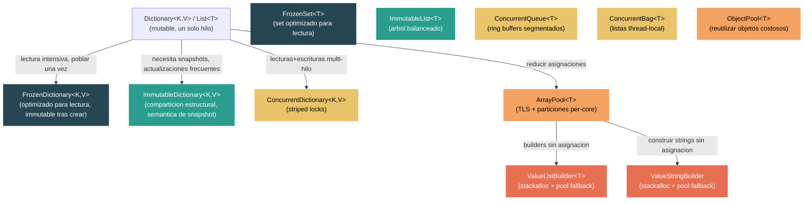

# Nivel 3: Avanzado — Colecciones de Alto Rendimiento y Pooling

> **Perfil objetivo:** Desarrollador que optimiza hot paths y necesita elegir entre estrategias de colecciones frozen, immutable, concurrent y pooled
> **Esfuerzo estimado:** 5 horas
> **Prerrequisitos:** [Modulo 2.2 — Colecciones a Fondo](02-practitioner-collections.md), [Modulo 3.1 — Modelo de Memoria](03-advanced-memory-model.md)
> [English version](../en/03-advanced-collections-perf.md)

---

## Objetivos de Aprendizaje

Al finalizar este modulo seras capaz de:

1. Explicar como `FrozenDictionary<TKey, TValue>` analiza las claves en tiempo de construccion para seleccionar estrategias especializadas de busqueda, y por que esto hace las lecturas significativamente mas rapidas que `Dictionary<TKey, TValue>`.
2. Describir el modelo de comparticion estructural de `ImmutableDictionary<TKey, TValue>` (arbol de nodos sorted int32 + hash buckets) y contrastarlo con el layout plano y optimizado para lectura de `FrozenDictionary`.
3. Trazar una lectura y escritura concurrente a traves de `ConcurrentDictionary<TKey, TValue>` y explicar su esquema de striped locking con arrays de locks que crecen.
4. Explicar la arquitectura de segmentos tipo ring buffer de `ConcurrentQueue<T>` y sus fast paths lock-free para enqueue/dequeue.
5. Describir el esquema de cache por niveles de `SharedArrayPool<T>` — thread-local storage, particiones per-core y bucket sizing — y explicar por que importa devolver los arrays rapidamente.
6. Implementar el patron `stackalloc` + fallback a `ArrayPool` usando `ValueListBuilder<T>` y `ValueStringBuilder`.
7. Elegir la coleccion de alto rendimiento correcta para una carga de trabajo dada segun la relacion lectura/escritura, requisitos de concurrencia y presion de asignacion.

---

## Mapa Conceptual



---

## Curriculo

### Leccion 1 — FrozenDictionary y FrozenSet: Colecciones Optimizadas para Lectura

#### Lo que vas a aprender

`FrozenDictionary<TKey, TValue>` y `FrozenSet<T>` son colecciones disenadas para un escenario especifico y comun: se puebla la coleccion una sola vez y luego se lee muchas veces. La idea clave es que al invertir mas tiempo en la construccion, el runtime puede armar una estructura de datos dramaticamente mas rapida para busquedas.

#### El pipeline de creacion

Abri `src/libraries/System.Collections.Immutable/src/System/Collections/Frozen/FrozenDictionary.cs`. El metodo estatico `Create` acepta un `ReadOnlySpan<KeyValuePair<TKey, TValue>>` y un comparador opcional:

```csharp
public static FrozenDictionary<TKey, TValue> Create<TKey, TValue>(
    IEqualityComparer<TKey>? comparer,
    params ReadOnlySpan<KeyValuePair<TKey, TValue>> source)
    where TKey : notnull
```

Los datos primero pasan a un `Dictionary<TKey, TValue>` estandar (para deduplicar claves), y luego `CreateFromDictionary` analiza las claves para seleccionar la mejor implementacion especializada.

#### Especializacion por tipo de clave

Aca es donde `FrozenDictionary` obtiene su velocidad. Mira `CreateFromDictionary` (alrededor de la linea 157). El metodo se bifurca segun el tipo de clave y la cantidad de elementos:

**Claves de tipo valor con comparador por defecto:**
- **Claves integrales densas** (`DenseIntegralFrozenDictionary`): Si las claves son enteros en un rango denso, usa indexacion directa en un array — O(1) sin ningun hashing.
- **Colecciones pequenas de tipos valor** (10 o menos elementos): Usa `SmallValueTypeComparableFrozenDictionary` o `SmallValueTypeDefaultComparerFrozenDictionary`, que hacen busquedas lineales que superan al hashing gracias a efectos de cache de CPU.
- **Claves Int32**: `Int32FrozenDictionary` reutiliza el almacenamiento de claves como almacenamiento de hashes, eliminando una indireccion.
- **Tipos valor generales**: `ValueTypeDefaultComparerFrozenDictionary` habilita la devirtualizacion de `Equals`/`GetHashCode`.

**Claves string con comparadores ordinales:**
- **Diccionarios agrupados por longitud**: Agrupa strings por longitud, asi las busquedas primero verifican la longitud (una sola comparacion de enteros) antes de hacer cualquier comparacion de strings.
- **Diccionarios con hashing de substrings**: `KeyAnalyzer.Analyze` examina todas las claves para encontrar el substring minimo que las distingue de forma unica. En vez de hacer hash de todo el string, hace hash de solo unos pocos caracteres.

```csharp
// El analizador encuentra la posicion y longitud optima del substring
KeyAnalyzer.AnalysisResults analysis = KeyAnalyzer.Analyze(
    keys,
    ReferenceEquals(stringComparer, StringComparer.OrdinalIgnoreCase),
    minLength, maxLength);
```

Este analisis considera substrings justificados a la izquierda vs. a la derecha, sensibilidad a mayusculas/minusculas, y si todos los caracteres son ASCII (habilitando paths optimizados con SIMD).

#### Por que las lecturas son mas rapidas que Dictionary

| Optimizacion | Dictionary | FrozenDictionary |
|---|---|---|
| Funcion hash | Generica, clave completa | Puede hacer hash solo de un substring |
| Busqueda en bucket | Operacion modulo | Puede usar indice directo en array |
| Manejo de colisiones | Recorrido de cadena enlazada | Colisiones minimizadas por diseno |
| Dispatch virtual | Llamadas a interfaz del comparador | Devirtualizado, potencialmente inlined |
| Layout de memoria | Array de entries + array de buckets | Layout plano especializado |

#### Cuando usar FrozenDictionary

- Tablas de configuracion que se pueblan al inicio
- Tablas de rutas en frameworks web
- Mapeos de enums a strings
- Cualquier escenario "construir una vez, leer millones de veces"

#### Cuando NO usar FrozenDictionary

- Datos que cambian despues de la construccion (es verdaderamente immutable)
- Diccionarios muy pequenos y de vida corta (el costo de construccion no se amortiza)
- Cuando necesitas escritores concurrent (usa `ConcurrentDictionary` en su lugar)

#### Ejercicio de lectura de codigo

1. Abri `FrozenDictionary.cs` y segui el metodo `CreateFromDictionary`. Para claves string, segui el camino a traves de `KeyAnalyzer.Analyze` y nota cuantas implementaciones especializadas distintas existen.
2. Abri `SmallValueTypeComparableFrozenDictionary.cs`. Como usa el rango min/max de claves para descartar rapidamente valores sin ningun hashing?

---

### Leccion 2 — Colecciones Immutable: Comparticion Estructural y Semantica de Snapshot

#### Lo que vas a aprender

`ImmutableDictionary<TKey, TValue>` y sus hermanos ofrecen una propuesta de valor fundamentalmente diferente a `FrozenDictionary`. Donde las colecciones frozen optimizan para velocidad de lectura al costo de mutabilidad, las colecciones immutable optimizan para crear nuevas versiones de manera eficiente a traves de comparticion estructural.

#### La estructura de datos

Abri `src/libraries/System.Collections.Immutable/src/System/Collections/Immutable/ImmutableDictionary_2.cs`. Los campos principales revelan la arquitectura:

```csharp
private readonly int _count;
private readonly SortedInt32KeyNode<HashBucket> _root;
private readonly Comparers _comparers;
```

El diccionario es un **arbol ordenado de hash buckets**:
1. Las claves se hashean a valores `int`.
2. Esos valores hash se almacenan en un `SortedInt32KeyNode` — un arbol binario de busqueda balanceado tipo AVL, ordenado por codigo hash.
3. Cada nodo contiene un `HashBucket` que guarda todos los pares clave-valor con ese codigo hash.

Abri `ImmutableDictionary_2.HashBucket.cs` para ver la estructura del bucket:

```csharp
internal readonly struct HashBucket
{
    private readonly KeyValuePair<TKey, TValue> _firstValue;
    private readonly ImmutableList<KeyValuePair<TKey, TValue>>.Node _additionalElements;
}
```

El primer valor se almacena inline (caso comun: sin colisiones), con un nodo de arbol `ImmutableList` para el overflow.

#### Como funciona la comparticion estructural

Cuando llamas a `dictionary.Add(key, value)`:
1. Se computa el hash de `key`.
2. Se recorre el arbol hasta el nodo del hash bucket correspondiente.
3. Se crea un **nuevo camino** desde la raiz hasta el nodo modificado — todos los demas nodos se comparten con la version anterior.
4. Se devuelve un nuevo `ImmutableDictionary` con la nueva raiz.

Esto significa que para un diccionario con N hash buckets, una operacion `Add` crea aproximadamente O(log N) nuevos nodos del arbol. Todos los demas nodos se comparten entre la version vieja y la nueva. Ambas versiones siguen siendo validas y utilizables.

#### El compromiso de rendimiento

| Operacion | Dictionary | ImmutableDictionary | FrozenDictionary |
|---|---|---|---|
| Busqueda | O(1) promedio | O(log N) + O(bucket) | O(1), mas rapido que Dictionary |
| Agregar | O(1) amortizado | O(log N) — nueva version | N/A (immutable) |
| Memoria por version | N/A | Nodos compartidos | Copia completa |
| Seguridad de hilos | Ninguna | Total (immutable) | Total (immutable) |

#### Patron Builder para construccion masiva

Construir un `ImmutableDictionary` elemento por elemento es costoso porque cada `Add` crea un arbol nuevo. Usa el `Builder` para operaciones masivas:

```csharp
// Mal: O(n log n) total, n arboles intermedios asignados
var dict = ImmutableDictionary<string, int>.Empty;
foreach (var kvp in source)
    dict = dict.Add(kvp.Key, kvp.Value);

// Bien: O(n) amortizado, un solo freeze final
var builder = ImmutableDictionary.CreateBuilder<string, int>();
foreach (var kvp in source)
    builder.Add(kvp.Key, kvp.Value);
ImmutableDictionary<string, int> dict = builder.ToImmutable();
```

El `Builder` usa estructuras mutables internas (como un diccionario regular) y las congela en una sola pasada cuando llamas a `ToImmutable()`.

#### ImmutableDictionary vs FrozenDictionary — cuando usar cual

| Escenario | Usar |
|---|---|
| Poblar una vez al inicio, leer para siempre | `FrozenDictionary` |
| Actualizaciones frecuentes produciendo nuevas versiones | `ImmutableDictionary` |
| Necesidad de comparar/diffear versiones viejas y nuevas | `ImmutableDictionary` |
| Maximo throughput de lectura como objetivo | `FrozenDictionary` |
| Arquitectura funcional / event-sourced | `ImmutableDictionary` |

#### Ejercicio de lectura de codigo

1. En `ImmutableDictionary_2.cs`, busca donde se usa `s_FreezeBucketAction`. Que hace "congelar" un bucket y cuando sucede?
2. Abri `ImmutableDictionary_2.Builder.cs`. Como rastrea el builder si su estado interno fue compartido con una instancia immutable?

---

### Leccion 3 — Colecciones Concurrent: ConcurrentDictionary y ConcurrentQueue

#### Lo que vas a aprender

El namespace `System.Collections.Concurrent` proporciona colecciones disenadas para acceso multi-hilo sin requerir locking externo. Estas colecciones sacrifican algo de rendimiento en un solo hilo a cambio de acceso concurrent seguro y escalable.

#### ConcurrentDictionary: striped locking

Abri `src/libraries/System.Private.CoreLib/src/System/Collections/Concurrent/ConcurrentDictionary.cs`. El diseno se construye alrededor de la clase interna `Tables`:

```csharp
private sealed class Tables
{
    internal readonly IEqualityComparer<TKey>? _comparer;
    internal readonly VolatileNode[] _buckets;
    internal readonly ulong _fastModBucketsMultiplier;
    internal readonly object[] _locks;       // array de locks striped
    internal readonly int[] _countPerLock;   // conteo de elementos por lock
}
```

Las decisiones de diseno clave:

**Striped locking:** En vez de un lock para todo el diccionario, `ConcurrentDictionary` usa un array de locks. Cada lock protege un rango de buckets. Esto permite que hilos operando en buckets distintos procedan en paralelo.

```csharp
private const int MaxLockNumber = 1024;
private static int DefaultConcurrencyLevel => Environment.ProcessorCount;
```

El nivel de concurrencia por defecto es igual a la cantidad de procesadores, y el array de locks puede crecer hasta 1024 a medida que el diccionario crece (controlado por `_growLockArray`).

**Referencia volatile de tables:** El campo `_tables` es `volatile`:

```csharp
private volatile Tables _tables;
```

Al redimensionar, se crea un objeto `Tables` completamente nuevo y se publica atomicamente. Los lectores que capturaron la referencia anterior siguen trabajando de forma segura contra la tabla vieja.

**Redimensionamiento basado en presupuesto:** Cada lock rastrea la cantidad de elementos en su rango via `_countPerLock`. Un redimensionamiento se dispara cuando el conteo de cualquier lock individual excede `_budget`, no cuando se supera un factor de carga global. Esto evita adquirir todos los locks solo para verificar si se necesita redimensionar.

#### Camino de lectura: mayormente lock-free

Leer de `ConcurrentDictionary` NO adquiere un lock. El metodo `TryGetValue`:
1. Lee la referencia volatile `_tables`.
2. Computa el hash y el indice del bucket.
3. Recorre la cadena del bucket usando `Volatile.Read` en cada referencia de nodo.

Esto significa que las lecturas escalan linealmente con la cantidad de hilos lectores — sin contencion.

#### Camino de escritura: adquirir un solo lock

Una escritura a `ConcurrentDictionary`:
1. Computa el hash y determina que lock adquirir.
2. Adquiere solo ese unico lock.
3. Modifica la cadena del bucket.
4. Verifica si el conteo del lock excede el presupuesto; si es asi, dispara un redimensionamiento (que adquiere todos los locks).

#### ConcurrentQueue: ring buffers segmentados

Abri `src/libraries/System.Private.CoreLib/src/System/Collections/Concurrent/ConcurrentQueue.cs`. El comentario de arquitectura (linea 24) es lectura esencial:

```
// Esta implementacion provee una cola unbounded, multi-productor multi-consumidor
// que soporta las operaciones estandar Enqueue/TryDequeue...
// Se compone de una lista enlazada de ring buffers acotados, cada uno con un
// indice head y tail, aislados entre si para minimizar false sharing.
```

Constantes clave:
```csharp
private const int InitialSegmentLength = 32;
private const int MaxSegmentLength = 1024 * 1024;
```

Cada segmento es un ring buffer de tamano fijo. Cuando un segmento se llena:
1. Se "congela" — no se permiten mas enqueues.
2. Se enlaza un segmento nuevo y mas grande desde el anterior.
3. La referencia volatile `_tail` se actualiza para apuntar al nuevo segmento.

Cuando un segmento se desencola completamente, la referencia `_head` avanza al siguiente segmento y el viejo se convierte en basura para el GC.

**Por que segmentos en vez de un solo array?** Esto evita el redimensionamiento que detiene todo, que afecta a `Queue<T>`. Enqueues y dequeues en segmentos distintos proceden sin ninguna contencion.

#### Enumeracion con snapshot

`ConcurrentQueue` soporta enumeracion con snapshot:
- Todos los segmentos actuales se congelan para enqueues y se preservan para observacion.
- Los nuevos enqueues van a segmentos nuevos.
- Los dequeues continuan desde los segmentos existentes sin sobreescribir datos.

Esto te permite enumerar la cola de forma segura mientras otros hilos la modifican, al costo de asignar nuevos segmentos para enqueues concurrent.

#### Cuando usar colecciones concurrent

| Escenario | Coleccion | Por que |
|---|---|---|
| Cache compartido, muchos lectores, escritores ocasionales | `ConcurrentDictionary` | Lecturas lock-free, escrituras striped |
| Pipeline productor-consumidor | `ConcurrentQueue` | Basado en segmentos, contencion minima |
| Work stealing / items de trabajo thread-local | `ConcurrentBag` | Listas thread-local, sin contencion cross-thread al agregar |
| Lectura intensiva, datos que nunca cambian | `FrozenDictionary` | Lecturas mas rapidas, sin overhead de locking |

#### Ejercicio de lectura de codigo

1. En `ConcurrentDictionary.cs`, busca el metodo `TryGetValueInternal`. Confirma que no adquiere locks. Como lee la cadena del bucket de forma segura?
2. En `ConcurrentQueue.cs`, busca el metodo `Enqueue`. Como maneja la transicion de un segmento lleno a uno nuevo?

---

### Leccion 4 — ArrayPool y Object Pooling: Semantica de Alquiler

#### Lo que vas a aprender

Asignar y recolectar arrays en hot paths crea presion sobre el GC que degrada el throughput y aumenta la latencia en la cola. `ArrayPool<T>` soluciona esto permitiendote alquilar y devolver arrays, evitando asignaciones por completo en los caminos de ejecucion estables.

#### La arquitectura de cache por niveles

Abri `src/libraries/System.Private.CoreLib/src/System/Buffers/SharedArrayPool.cs`. El comentario de la clase describe los tres niveles:

```
// La implementacion usa un esquema de cache por niveles, con un pequeno cache
// por hilo para cada tamano de array, seguido de un cache por tamano de array
// compartido por todos los hilos, dividido en stacks per-core para ser usados
// por hilos ejecutandose en ese core.
```

**Nivel 1 — Thread-Local Storage (TLS):**
```csharp
[ThreadStatic]
private static SharedArrayPoolThreadLocalArray[]? t_tlsBuckets;
```

Cada hilo tiene un array cacheado por bucket (clase de tamano). Se verifica primero en `Rent` y se puebla primero en `Return`. No se necesita locking porque el thread-local storage es inherentemente thread-safe.

**Nivel 2 — Particiones Per-Core:**
```csharp
private readonly SharedArrayPoolPartitions?[] _buckets = new SharedArrayPoolPartitions[NumBuckets];
```

Si TLS no tiene un array, el pool verifica las particiones per-core. Son stacks protegidos por locks, pero la contencion es baja porque los hilos en el mismo core tienden a compartir una particion.

**Nivel 3 — Nueva asignacion:**
Si ambos niveles estan vacios, se asigna un array nuevo. Para tipos primitivos (excepto `bool`), se usa `GC.AllocateUninitializedArray<T>` para evitar los costos de inicializacion a cero:

```csharp
buffer = typeof(T).IsPrimitive && typeof(T) != typeof(bool) ?
    GC.AllocateUninitializedArray<T>(minimumLength) :
    new T[minimumLength];
```

#### Tamano de los buckets

El pool usa 27 buckets, empezando desde longitud 16 y duplicando hasta ~1 billon:

```csharp
private const int NumBuckets = 27; // 16, 32, 64, ..., 1073741824
```

Cuando llamas a `Rent(100)`, obtenes un array de longitud 128 (la siguiente potencia de dos). Esto es critico: **el array devuelto siempre es al menos tan grande como lo solicitado, pero puede ser mas grande**. Siempre usa la longitud solicitada, no `array.Length`, al procesar el resultado.

#### El camino de Return

En `Return`, el array pasa por los niveles en prioridad inversa:

1. **A TLS:** El array devuelto reemplaza lo que estaba cacheado en TLS. Si TLS ya tenia un array, ese array mas viejo se empuja hacia la particion per-core.
2. **A la particion per-core:** Si la particion esta llena, el array simplemente se descarta (no se devuelve). El pool prefiere perder un array antes que crecer sin limites.

```csharp
ref SharedArrayPoolThreadLocalArray tla = ref tlsBuckets[bucketIndex];
Array? prev = tla.Array;
tla = new SharedArrayPoolThreadLocalArray(array);
if (prev is not null)
{
    SharedArrayPoolPartitions partitionsForArraySize =
        _buckets[bucketIndex] ?? CreatePerCorePartitions(bucketIndex);
    returned = partitionsForArraySize.TryPush(prev);
}
```

#### Semantica de alquiler: las reglas

1. **Siempre devuelve lo que alquilas.** No devolver arrays degrada el rendimiento del pool (tiene que asignar nuevos).
2. **Nunca uses el array despues de devolverlo.** Otro hilo puede recibirlo de `Rent` inmediatamente.
3. **Usa `clearArray: true` en Return** si el array contenia datos sensibles o tipos referencia que deberian ser recolectados.
4. **Nunca asumas que el array esta en ceros** al hacer Rent. Los contenidos son indeterminados.
5. **Registra la longitud solicitada, no `array.Length`.** El pool puede darte un array mas grande.

#### El patron try/finally

```csharp
byte[] buffer = ArrayPool<byte>.Shared.Rent(minimumSize);
try
{
    // Usar buffer[0..minimumSize]
    ProcessData(buffer.AsSpan(0, minimumSize));
}
finally
{
    ArrayPool<byte>.Shared.Return(buffer);
}
```

#### ObjectPool (Microsoft.Extensions.ObjectPool)

Para objetos mas complejos que arrays, `Microsoft.Extensions.ObjectPool` proporciona un patron de alquiler/devolucion similar. Se usa comunmente en ASP.NET Core para instancias de `StringBuilder` y objetos reutilizables similares. El patron es el mismo: alquilar, usar, devolver.

La diferencia clave con `ArrayPool`:
- `ArrayPool` hace pool de arrays por bucket de tamano.
- `ObjectPool` hace pool de objetos arbitrarios y requiere una factory (`IPooledObjectPolicy<T>`) que sabe como crearlos y resetearlos.

#### Ejercicio de lectura de codigo

1. En `SharedArrayPool.cs`, segui el metodo `Rent` de inicio a fin. Conta cuantas veces se adquiere un lock en el mejor caso (hit de TLS) vs. el peor caso (asignacion).
2. Busca el registro del callback de trimming (`_trimCallbackCreated`). Que dispara que el pool libere arrays cacheados de vuelta al GC?

---

### Leccion 5 — Builders con Asignacion en Stack: ValueListBuilder y ValueStringBuilder

#### Lo que vas a aprender

Cuando se construye una lista o string en un hot path, incluso alquilar de `ArrayPool` introduce overhead (la busqueda en el pool, la devolucion, el `try/finally`). Para salidas pequenas y de tamano acotado, el runtime usa builders `ref struct` que empiezan en el stack y caen a `ArrayPool` solo si se excede la capacidad inicial.

#### ValueListBuilder&lt;T&gt;

Abri `src/libraries/Common/src/System/Collections/Generic/ValueListBuilder.cs`. Es un `internal ref partial struct`:

```csharp
internal ref partial struct ValueListBuilder<T>
{
    private Span<T> _span;
    private T[]? _arrayFromPool;
    private int _pos;
}
```

El patron:
1. Construir con un span de `stackalloc` para el caso comun.
2. Si los datos exceden el buffer del stack, `Grow` alquila de `ArrayPool`.
3. `Dispose` devuelve cualquier array alquilado.

```csharp
// Patron de uso a lo largo del runtime:
var vlb = new ValueListBuilder<char>(stackalloc char[256]);
// ... append items ...
ReadOnlySpan<char> result = vlb.AsSpan();
// ... usar result ...
vlb.Dispose();
```

**El metodo Grow** (linea 206) implementa la estrategia de duplicacion:

```csharp
int nextCapacity = Math.Max(
    _span.Length != 0 ? _span.Length * 2 : 4,
    _pos + additionalCapacityBeyondPos);
T[] array = ArrayPool<T>.Shared.Rent(nextCapacity);
_span.CopyTo(array);
```

Al crecer, copia desde el span actual (que puede ser memoria del stack) al array alquilado. El array alquilado anterior (si lo habia) se devuelve al pool, y `_span` se reasigna al nuevo array.

**Disposicion con limpieza de referencias:** Para tipos que contienen referencias, el array viejo se limpia antes de devolverlo al pool, evitando que el pool mantenga referencias a objetos involuntariamente:

```csharp
if (RuntimeHelpers.IsReferenceOrContainsReferences<T>())
{
    ArrayPool<T>.Shared.Return(toReturn, pos);
}
else
{
    ArrayPool<T>.Shared.Return(toReturn);
}
```

#### ValueStringBuilder

Abri `src/libraries/Common/src/System/Text/ValueStringBuilder.cs`. Sigue el mismo patron, especializado para `char`:

```csharp
internal ref partial struct ValueStringBuilder
{
    private char[]? _arrayToReturnToPool;
    private Span<char> _chars;
    private int _pos;
}
```

Caracteristicas clave:
- **`ToString()` dispone automaticamente:** Llamar a `ToString()` crea el string y llama a `Dispose()`, haciendolo seguro para usar en una sola expresion.
- **Referencia pinnable:** `GetPinnableReference()` habilita `fixed (char* c = builder)` para escenarios de interop.
- **`NullTerminate()`** agrega un caracter NUL sin avanzar `_pos`, util para pasar a codigo nativo.

#### El patron stackalloc + fallback a ArrayPool

Este patron aparece cientos de veces a lo largo del runtime. Aca esta la forma general:

```csharp
// Elegir un tamano de stack que cubra el caso comun
const int StackBufferSize = 256;

// stackalloc para pequeno, ArrayPool para grande
char[]? rentedArray = null;
Span<char> buffer = inputLength <= StackBufferSize
    ? stackalloc char[StackBufferSize]
    : (rentedArray = ArrayPool<char>.Shared.Rent(inputLength));

try
{
    // Trabajar con buffer
    int written = FormatInto(buffer);
    ProcessResult(buffer.Slice(0, written));
}
finally
{
    if (rentedArray is not null)
    {
        ArrayPool<char>.Shared.Return(rentedArray);
    }
}
```

Esto te da:
- **Cero asignaciones** para el caso comun (inputs pequenos se quedan en el stack).
- **Sin presion del GC** para el caso poco comun (inputs grandes usan arrays del pool).
- **Sin crecimiento ilimitado del stack** (el tamano del `stackalloc` es constante).

#### Por que importa ref struct

Tanto `ValueListBuilder<T>` como `ValueStringBuilder` son `ref struct`. Esto significa:
- Pueden contener campos `Span<T>` (que apuntan a memoria del stack).
- No pueden ser boxeados, almacenados en campos, ni capturados por lambdas/metodos `async`.
- El compilador garantiza que viven en el stack, haciendolo seguro referenciar memoria de `stackalloc`.

#### Ejercicio de lectura de codigo

1. Busca `new ValueListBuilder<` en `src/libraries/System.Private.CoreLib/src`. Elige dos call sites y nota el tamano de `stackalloc` elegido. Que heuristica determina el tamano del buffer en stack?
2. En `ValueStringBuilder.cs`, mira el metodo `ToString()`. Por que llama a `Dispose()` despues de crear el string? Que pasaria si no lo hiciera?

---

### Leccion 6 — Elegir Colecciones de Alto Rendimiento: Matriz de Decision

#### Lo que vas a aprender

El runtime de .NET proporciona muchos tipos de colecciones que se solapan en funcionalidad pero difieren dramaticamente en caracteristicas de rendimiento. Esta leccion sintetiza las cinco anteriores en un framework practico de decision.

#### Matriz de decision por escenario

| Escenario | Mejor opcion | Por que |
|---|---|---|
| Configuracion cargada al inicio, leida en cada request | `FrozenDictionary` | Estrategias de busqueda especializadas, sin overhead de locking |
| Tabla de rutas / mapeo de enums, conocido en tiempo de compilacion | `FrozenDictionary` / `FrozenSet` | La estructura de claves analizada habilita hashing de substrings |
| Estado event-sourced, necesita versiones vieja + nueva | `ImmutableDictionary` | Comparticion estructural, O(log N) por mutacion |
| Pipeline funcional pasando estado a traves de transformaciones | `ImmutableList` / `ImmutableArray` | Semantica de snapshot, sin copias defensivas |
| Cache compartido, alto volumen de lectura, escrituras ocasionales | `ConcurrentDictionary` | Lecturas lock-free, escrituras striped |
| Cola de trabajo productor-consumidor | `ConcurrentQueue` | Basado en segmentos, contencion minima, memoria acotada |
| Items de trabajo thread-local con stealing | `ConcurrentBag` | Listas por hilo, sin contencion al agregar |
| Buffer temporal en hot path, tamano acotado | `stackalloc` + `Span<T>` | Cero asignaciones, velocidad del stack |
| Buffer temporal, tamano desconocido pero usualmente chico | `ValueListBuilder` / `ValueStringBuilder` | Inicia en stack, fallback a pool |
| Asignacion repetida de arrays de tamanos similares | `ArrayPool<T>.Shared.Rent` | Evita presion del GC, cache por niveles |

#### Arbol de decision

```
Necesitas una coleccion?
|
+-- Los datos cambian despues de crearla?
|   |
|   +-- SI: Necesitas seguridad de hilos?
|   |   |
|   |   +-- SI: ConcurrentDictionary / ConcurrentQueue / ConcurrentBag
|   |   |
|   |   +-- NO: Necesitas versiones anteriores?
|   |       |
|   |       +-- SI: ImmutableDictionary / ImmutableList
|   |       |
|   |       +-- NO: Dictionary / List (mutable estandar)
|   |
|   +-- NO: FrozenDictionary / FrozenSet
|
Necesitas un buffer temporal?
|
+-- Tamano conocido y chico (< 512 bytes)?
|   +-- stackalloc + Span<T>
|
+-- Tamano usualmente chico, ocasionalmente grande?
|   +-- ValueListBuilder / ValueStringBuilder
|
+-- Tamano siempre grande o impredecible?
    +-- ArrayPool<T>.Shared.Rent/Return
```

#### Comparacion de caracteristicas de rendimiento

| Coleccion | Lectura | Escritura | Overhead de memoria | Presion GC | Seguridad de hilos |
|---|---|---|---|---|---|
| `Dictionary<K,V>` | O(1) | O(1) amortizado | Bajo | Asignaciones al redimensionar | Ninguna |
| `FrozenDictionary<K,V>` | O(1), mas rapido | N/A | Bajo-medio | Solo en construccion | Total (immutable) |
| `ImmutableDictionary<K,V>` | O(log N) | O(log N) por version | Mayor (nodos de arbol) | Por mutacion | Total (immutable) |
| `ConcurrentDictionary<K,V>` | O(1), sin lock | O(1), un lock | Medio (array de locks) | Asignaciones al redimensionar | Total (basado en locks) |
| `ConcurrentQueue<T>` | O(1), lock-free | O(1), lock-free | Medio (segmentos) | Asignaciones de segmentos | Total (lock-free) |

#### Errores comunes

1. **Usar `ImmutableDictionary` cuando `FrozenDictionary` alcanza.** Si los datos se pueblan una vez y nunca se modifican, las lecturas de `FrozenDictionary` son un orden de magnitud mas rapidas (O(1) vs O(log N)).

2. **Usar `ConcurrentDictionary` para datos de solo lectura.** `FrozenDictionary` no tiene overhead de locking y usa funciones hash especializadas. `ConcurrentDictionary` aun paga por lecturas volatile y la infraestructura de striped locks incluso cuando no hay escrituras.

3. **Construir `ImmutableDictionary` elemento por elemento.** Siempre usa el patron `Builder` para construccion masiva. Cada `Add` en un `ImmutableDictionary` crea una nueva raiz de arbol.

4. **Olvidarse de devolver arrays del pool.** Arrays perdidos degradan el rendimiento de `ArrayPool`. Usa `try/finally` o el patron `ValueListBuilder` que maneja la devolucion automaticamente.

5. **Asumir que los arrays del pool estan en ceros.** No lo estan (a menos que el arrendatario anterior haya pasado `clearArray: true`). Siempre sobreescribi o hace slice a la longitud exacta que necesitas.

6. **Usar `stackalloc` con tamanos no acotados.** Esto arriesga un stack overflow. Siempre limita el tamano del `stackalloc` y usa fallback a `ArrayPool` para inputs mas grandes.

7. **Usar `ConcurrentDictionary.Count` en hot paths.** `Count` debe agregar `_countPerLock` a traves de todos los locks. Usa `IsEmpty` para verificar si esta vacio.

#### Guia de benchmarking

Cuando decidas entre estas colecciones para tu carga de trabajo, medi con BenchmarkDotNet:

```csharp
[MemoryDiagnoser]
public class CollectionLookupBenchmarks
{
    private Dictionary<string, int> _dict;
    private FrozenDictionary<string, int> _frozen;
    private ConcurrentDictionary<string, int> _concurrent;
    private ImmutableDictionary<string, int> _immutable;

    [GlobalSetup]
    public void Setup()
    {
        var data = Enumerable.Range(0, 1000)
            .Select(i => KeyValuePair.Create($"key_{i}", i))
            .ToArray();

        _dict = new Dictionary<string, int>(data);
        _frozen = data.ToFrozenDictionary();
        _concurrent = new ConcurrentDictionary<string, int>(data);
        _immutable = data.ToImmutableDictionary();
    }

    [Benchmark(Baseline = true)]
    public int Dictionary() => _dict["key_500"];

    [Benchmark]
    public int Frozen() => _frozen["key_500"];

    [Benchmark]
    public int Concurrent() => _concurrent["key_500"];

    [Benchmark]
    public int Immutable() => _immutable["key_500"];
}
```

Resultados tipicos (relativo a `Dictionary` = 1.0x):
- `FrozenDictionary`: ~0.5-0.7x (mas rapido)
- `ConcurrentDictionary`: ~1.2-1.5x (ligeramente mas lento por lecturas volatile)
- `ImmutableDictionary`: ~3-5x (mas lento por recorrido del arbol)

#### Ejercicio de lectura de codigo

1. Escribi un benchmark que compare `ArrayPool<byte>.Shared.Rent(1024)` + `Return` vs. `new byte[1024]` en un loop cerrado. Medi tanto throughput como colecciones `Gen0`.
2. Crea un `FrozenDictionary` con 100 claves string e inspeccionalo con un debugger. Que tipo concreto fue seleccionado? Intenta de nuevo con claves `int` — que tipo se selecciona?

---

## Resumen

Este modulo cubrio el panorama de colecciones de alto rendimiento en .NET:

- **FrozenDictionary/FrozenSet** intercambian tiempo de construccion por lecturas dramaticamente mas rapidas a traves del analisis de claves e implementaciones especializadas. Usalas para cualquier escenario de poblar una vez, leer muchas veces.
- **ImmutableDictionary** y sus hermanos proporcionan semantica de snapshot a traves de comparticion estructural. Brillan en arquitecturas funcionales donde necesitas comparar versiones o pasar estado a traves de transformaciones.
- **ConcurrentDictionary** usa striped locking y lecturas lock-free para escalar entre cores. **ConcurrentQueue** usa ring buffers segmentados para patrones productor-consumidor con contencion minima.
- **ArrayPool** elimina la presion de asignacion a traves de un esquema de cache por niveles TLS + per-core. Siempre devolve lo que alquilas.
- **ValueListBuilder** y **ValueStringBuilder** combinan `stackalloc` con fallback a `ArrayPool` para builders sin asignacion en hot paths.

El error mas comun es elegir una coleccion basandose en su interfaz en vez de su perfil de rendimiento. Usa la matriz de decision de la Leccion 6 para emparejar tu carga de trabajo con la coleccion correcta, y siempre valida con benchmarks.

---

## Lectura Adicional

- Codigo fuente: `src/libraries/System.Collections.Immutable/src/System/Collections/Frozen/` — todas las implementaciones de colecciones frozen
- Codigo fuente: `src/libraries/System.Collections.Immutable/src/System/Collections/Immutable/` — estructuras de arbol de colecciones immutable
- Codigo fuente: `src/libraries/System.Private.CoreLib/src/System/Collections/Concurrent/` — implementaciones de colecciones concurrent
- Codigo fuente: `src/libraries/System.Private.CoreLib/src/System/Buffers/SharedArrayPool.cs` — el cache por niveles del pool
- Codigo fuente: `src/libraries/Common/src/System/Collections/Generic/ValueListBuilder.cs` — el patron stackalloc + pool
- Codigo fuente: `src/libraries/Common/src/System/Text/ValueStringBuilder.cs` — construccion de strings sin asignacion
- Documentacion: `docs/coding-guidelines/` — convenciones de codigo usadas en las implementaciones
