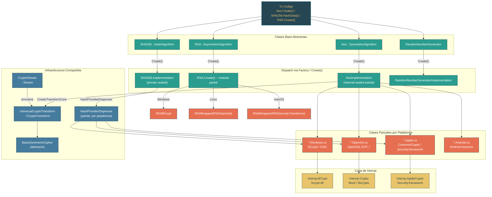

# Nivel 3: Avanzado -- Criptografia y Primitivas de Seguridad

> **Perfil objetivo:** Desarrollador que usa APIs de crypto (AES, SHA256, RSA, X509Certificate2) pero no entiende como .NET abstrae los backends nativos de criptografia segun la plataforma
> **Esfuerzo estimado:** 4 horas
> **Prerrequisitos:** Nivel 2 completo, Modulo 3.10 (Native Interop / conocimiento basico de P/Invoke)
> [English version](../en/03-advanced-cryptography.md)

---

## Objetivos de Aprendizaje

Al completar este modulo, vas a poder:

1. **Explicar** el patron de clase base abstracta + factory que se usa en toda `System.Security.Cryptography` y por que `Aes.Create()` devuelve un tipo concreto diferente en cada plataforma.
2. **Rastrear** una llamada desde `Aes.Create()` a traves de `AesImplementation` hasta las clases parciales especificas de cada plataforma que invocan CNG (Windows), OpenSSL (Linux) o Apple CommonCrypto (macOS).
3. **Describir** las capas `Interop.BCrypt`, `Interop.Crypto` e `Interop.AppleCrypto` y como usan `LibraryImport` para llamar a bibliotecas nativas.
4. **Articular** el pipeline de CryptoStream / ICryptoTransform para encryption simetrica en streaming y como `UniversalCryptoTransform` actua como puente entre todas las plataformas.
5. **Explicar** como `SHA256.HashData` llega a `HashProviderDispenser`, que rutea a `HashProviderCng` (Windows) o al `EVP_Digest` de OpenSSL (Linux).
6. **Describir** como `Rfc2898DeriveBytes` y `Pbkdf2Implementation` delegan a `BCryptKeyDerivation` de BCrypt (Windows) o `PKCS5_PBKDF2_HMAC` de OpenSSL (Linux).
7. **Navegar** la clase `X509Certificate2` y entender como los certificate stores se abstraen por plataforma.
8. **Leer** el patron de dispatch por plataforma de RSA (`RSA.Create()` devolviendo `RSABCrypt` en Windows vs `RSAWrapper(RSAOpenSsl())` en Linux) y aplicar el patron a otros algoritmos.

---

## Mapa Conceptual



---

## Plan de Estudios

### Leccion 3.8.1: La Arquitectura Cripto -- Clases Base Abstractas y Dispatch por Plataforma

**Lo que vas a aprender:** La criptografia en .NET esta construida sobre un patron donde las clases base abstractas definen la superficie de API publica y los metodos factory estaticos `Create()` devuelven implementaciones especificas de cada plataforma. La misma llamada compila y corre en todos los sistemas operativos, pero el backend cripto nativo es completamente diferente.

**El concepto:**

Cada algoritmo cripto principal en .NET sigue el mismo patron estructural:

```
AbstractAlgorithm (superficie de API publica)
    |
    +-- Create() metodo factory devuelve...
    |
    +-- InternalImplementation (internal sealed partial class)
            |
            +-- InternalImplementation.Windows.cs  -> BCrypt / CNG
            +-- InternalImplementation.OpenSsl.cs  -> OpenSSL libcrypto
            +-- InternalImplementation.Apple.cs    -> CommonCrypto
            +-- InternalImplementation.Android.cs  -> Android Keystore
```

Empeza con `Aes`. La clase publica es abstracta y define el contrato:

```csharp
// src/libraries/System.Security.Cryptography/src/System/Security/Cryptography/Aes.cs, linea 12
public abstract class Aes : SymmetricAlgorithm
{
    protected Aes()
    {
        LegalBlockSizesValue = s_legalBlockSizes.CloneKeySizesArray();
        LegalKeySizesValue = s_legalKeySizes.CloneKeySizesArray();

        BlockSizeValue = 128;
        FeedbackSizeValue = 8;
        KeySizeValue = 256;
        ModeValue = CipherMode.CBC;
    }

    [UnsupportedOSPlatform("browser")]
    public static new Aes Create()
    {
        return new AesImplementation();
    }
```

El metodo `Create()` devuelve `AesImplementation`, una `internal sealed partial class`. La palabra "partial" es la clave -- la clase esta dividida en multiples archivos, uno por plataforma:

- `AesImplementation.cs` -- logica compartida (gestion de keys, `CreateEncryptor`, `CreateDecryptor`)
- `AesImplementation.Windows.cs` -- llama a BCrypt via `BasicSymmetricCipherBCrypt`
- `AesImplementation.OpenSsl.cs` -- llama a OpenSSL via `OpenSslCipher`
- `AesImplementation.Apple.cs` -- llama a CommonCrypto via `AppleCCCryptor`
- `AesImplementation.Android.cs` -- llama a OpenSSL (Android incluye su propio OpenSSL)

Solo un archivo de plataforma se compila por target, controlado por condiciones de MSBuild en el `.csproj`. Esto significa que el `AesImplementation.cs` compartido puede llamar a `CreateTransformCore(...)` sin saber que variante de plataforma lo provee -- el compilador lo resuelve en tiempo de build.

El mismo patron aplica al hashing. `SHA256` es abstracta y su metodo `Create()` devuelve una clase anidada privada `Implementation`:

```csharp
// src/libraries/System.Security.Cryptography/src/System/Security/Cryptography/SHA256.cs, linea 43
public static new SHA256 Create() => new Implementation();
```

La clase `Implementation` delega a `HashProviderDispenser`, que es a su vez una clase parcial con archivos especificos por plataforma:

```csharp
// SHA256.cs, linea 193
private sealed class Implementation : SHA256
{
    private readonly HashProvider _hashProvider;

    public Implementation()
    {
        _hashProvider = HashProviderDispenser.CreateHashProvider(HashAlgorithmNames.SHA256);
    }
```

Para los algoritmos asimetricos, el patron usa metodos parciales. `RSA.Create()` se declara como `public static new partial RSA Create();` -- cada plataforma provee el cuerpo:

```csharp
// RSA.Create.Windows.cs
public static new partial RSA Create()
{
    return new RSABCrypt();
}

// RSA.Create.OpenSsl.cs
public static new partial RSA Create()
{
    return new RSAWrapper(new RSAOpenSsl());
}
```

**Por que este patron?** La criptografia es un dominio donde no podes permitirte un fallback managed. Cada SO provee una biblioteca cripto validada por FIPS y acelerada por hardware. Al despachar en el nivel del factory, .NET puede:
1. Usar la implementacion certificada del SO (importante para compliance)
2. Acceder a aceleracion por hardware (AES-NI via CNG, OpenSSL, etc.)
3. Evitar distribuir primitivas cripto en codigo managed (riesgo de seguridad)
4. Soportar almacenamiento de keys especifico del SO (Windows Certificate Store, macOS Keychain, etc.)

**En el codigo fuente:**
- `src/libraries/System.Security.Cryptography/src/System/Security/Cryptography/Aes.cs` -- Clase base abstracta con factory `Create()`
- `src/libraries/System.Security.Cryptography/src/System/Security/Cryptography/AesImplementation.cs` -- Clase parcial compartida con gestion de keys
- `src/libraries/System.Security.Cryptography/src/System/Security/Cryptography/AesImplementation.Windows.cs` -- `CreateTransformCore` de Windows usando BCrypt
- `src/libraries/System.Security.Cryptography/src/System/Security/Cryptography/AesImplementation.OpenSsl.cs` -- `CreateTransformCore` de OpenSSL
- `src/libraries/System.Security.Cryptography/src/System/Security/Cryptography/AesImplementation.Apple.cs` -- `CreateTransformCore` de Apple (CommonCrypto)
- `src/libraries/System.Security.Cryptography/src/System/Security/Cryptography/RSA.cs` -- Clase abstracta parcial con declaracion de `partial Create()`
- `src/libraries/System.Security.Cryptography/src/System/Security/Cryptography/RSA.Create.Windows.cs` -- Devuelve `RSABCrypt`
- `src/libraries/System.Security.Cryptography/src/System/Security/Cryptography/RSA.Create.OpenSsl.cs` -- Devuelve `RSAWrapper(RSAOpenSsl())`

**Ejercicio practico:**

1. Abri `Aes.cs` y confirma que `Create()` devuelve `new AesImplementation()`. Despues abri los cinco archivos `AesImplementation.*.cs` lado a lado. Nota que cada uno define el mismo metodo `CreateTransformCore` pero envuelve un tipo de cipher nativo diferente.
2. Abri `SHA256.cs`, busca la clase anidada `Implementation` y rastrea como delega a `HashProviderDispenser.CreateHashProvider`. Despues abri `HashProviderDispenser.Windows.cs` y `HashProviderDispenser.OpenSsl.cs` para ver la divergencia.
3. Abri `RSA.Create.Windows.cs` y `RSA.Create.OpenSsl.cs`. Nota que Windows devuelve `RSABCrypt` directamente mientras Linux envuelve `RSAOpenSsl` en un `RSAWrapper`. Busca `RSAWrapper` para entender por que existe esta indireccion.
4. Busca en el directorio `System.Security.Cryptography` todos los archivos que matcheen `*.NotSupported.cs`. Estos son los stubs para browser/WASM que tiran `PlatformNotSupportedException`. Conta cuantos algoritmos no estan soportados en WebAssembly.

**Conclusion clave:** La criptografia en .NET usa clases base abstractas con factories `Create()` que devuelven implementaciones especificas de plataforma via clases parciales de C#. La misma superficie de API compila en todos los SOs, pero el backend cripto nativo es completamente diferente. Este es el patron de diseno central de toda la biblioteca.

---

### Leccion 3.8.2: Abstraccion de Plataforma -- CNG, OpenSSL y Apple CommonCrypto

**Lo que vas a aprender:** Cada backend criptografico de plataforma tiene diferentes capacidades, APIs y tipos de handle. La capa `Interop` mapea estas diferencias en una interfaz interna uniforme.

**El concepto:**

.NET apunta a cuatro backends cripto principales:

| Plataforma | Biblioteca Nativa | Namespace de Interop | Tipo de Handle |
|------------|------------------|----------------------|----------------|
| Windows | BCrypt.dll / NCrypt.dll (CNG) | `Interop.BCrypt`, `Interop.NCrypt` | `SafeAlgorithmHandle`, `SafeKeyHandle` |
| Linux | libcrypto (OpenSSL) | `Interop.Crypto` | `SafeEvpCipherCtxHandle`, `SafeEvpPKeyHandle` |
| macOS | Security.framework (CommonCrypto) | `Interop.AppleCrypto` | `SafeAppleCryptorHandle` |
| Android | OpenSSL incluido | `Interop.Crypto` (mismo que Linux) | Mismo que Linux |

La capa Interop vive en `src/libraries/Common/src/Interop/`, organizada por SO y biblioteca nativa:

```
Common/src/Interop/
    Windows/
        BCrypt/
            Interop.BCryptGenRandom.cs
            Interop.BCryptEncryptDecrypt.cs
            Interop.BCryptGenerateSymmetricKey.cs
            ...
    Unix/
        System.Security.Cryptography.Native/
            Interop.Crypto.cs
            Interop.EvpPkey.Rsa.cs
            ...
```

Cada archivo Interop declara un binding `LibraryImport` (P/Invoke generado por source generator). Aca esta el generador de numeros aleatorios de Windows:

```csharp
// src/libraries/Common/src/Interop/Windows/BCrypt/Interop.BCryptGenRandom.cs
internal static partial class Interop
{
    internal static partial class BCrypt
    {
        internal const int BCRYPT_USE_SYSTEM_PREFERRED_RNG = 0x00000002;

        [LibraryImport(Libraries.BCrypt)]
        internal static unsafe partial NTSTATUS BCryptGenRandom(
            IntPtr hAlgorithm, byte* pbBuffer, int cbBuffer, int dwFlags);
    }
}
```

Y la implementacion que lo llama:

```csharp
// RandomNumberGeneratorImplementation.Windows.cs
internal sealed partial class RandomNumberGeneratorImplementation
{
    private static unsafe void GetBytes(byte* pbBuffer, int count)
    {
        Interop.BCrypt.NTSTATUS status = Interop.BCrypt.BCryptGenRandom(
            IntPtr.Zero, pbBuffer, count,
            Interop.BCrypt.BCRYPT_USE_SYSTEM_PREFERRED_RNG);
        if (status != Interop.BCrypt.NTSTATUS.STATUS_SUCCESS)
            throw Interop.BCrypt.CreateCryptographicException(status);
    }
}
```

El equivalente en OpenSSL:

```csharp
// RandomNumberGeneratorImplementation.OpenSsl.cs
internal sealed partial class RandomNumberGeneratorImplementation
{
    private static unsafe void GetBytes(byte* pbBuffer, int count)
    {
        if (!Interop.Crypto.GetRandomBytes(pbBuffer, count))
        {
            throw Interop.Crypto.CreateOpenSslCryptographicException();
        }
    }
}
```

El mecanismo de clases parciales significa que `RandomNumberGeneratorImplementation` tiene un solo archivo compartido que define `GetBytes(byte[])`, `GetBytes(Span<byte>)`, etc., y cada uno llama al `GetBytes(byte*, int)` especifico de plataforma que solo existe en uno de los archivos de plataforma.

**CNG vs. OpenSSL -- diferencias fundamentales:**

CNG (Cryptography Next Generation) esta basado en handles y es stateful. Abris un proveedor de algoritmo, generas una key, y realizas operaciones contra el handle de la key:
```
BCryptOpenAlgorithmProvider -> BCryptGenerateSymmetricKey -> BCryptEncrypt/BCryptDecrypt
```

OpenSSL esta basado en contextos. Obtenes un puntero de algoritmo estatico (ej. `EVP_aes_256_cbc()`) y creas contextos de cipher:
```
EVP_CIPHER_CTX_new -> EVP_EncryptInit_ex -> EVP_EncryptUpdate -> EVP_EncryptFinal_ex
```

Apple CommonCrypto es el mas simple: creas un `CCCryptorRef` y le alimentas datos.

Las clases internas `BasicSymmetricCipherBCrypt`, `OpenSslCipher` y `AppleCCCryptor` todas extienden `BasicSymmetricCipher` (o implementan interfaces equivalentes), abstrayendo estas diferencias para que `UniversalCryptoTransform` pueda trabajar con cualquiera de ellas.

**En el codigo fuente:**
- `src/libraries/Common/src/Interop/Windows/BCrypt/Interop.BCryptGenRandom.cs` -- `LibraryImport` para BCrypt RNG
- `src/libraries/Common/src/Interop/Windows/BCrypt/Interop.BCryptEncryptDecrypt.cs` -- P/Invoke de encryption simetrica
- `src/libraries/Common/src/Interop/Unix/System.Security.Cryptography.Native/Interop.Crypto.cs` -- Interop de OpenSSL crypto
- `src/libraries/Common/src/Interop/Unix/System.Security.Cryptography.Native/Interop.EvpPkey.Rsa.cs` -- RSA via OpenSSL EVP
- `src/libraries/System.Security.Cryptography/src/System/Security/Cryptography/RandomNumberGeneratorImplementation.Windows.cs` -- Implementacion RNG de Windows
- `src/libraries/System.Security.Cryptography/src/System/Security/Cryptography/RandomNumberGeneratorImplementation.OpenSsl.cs` -- Implementacion RNG de OpenSSL
- `src/libraries/System.Security.Cryptography/src/System/Security/Cryptography/RandomNumberGeneratorImplementation.Apple.cs` -- Implementacion RNG de Apple

**Ejercicio practico:**

1. Abri `RandomNumberGeneratorImplementation.cs` (el archivo compartido). Lee el metodo `FillSpan` y rastrea como llama a `GetBytes(byte*, int)`. Despues abri los archivos `.Windows.cs` y `.OpenSsl.cs` para ver las dos implementaciones de ese metodo.
2. En el directorio `Common/src/Interop/Windows/BCrypt/`, conta la cantidad de archivos de interop de BCrypt. Cada uno mapea a una sola funcion de la API de Windows. Compara esto con `Common/src/Interop/Unix/System.Security.Cryptography.Native/` -- OpenSSL agrupa multiples funciones por archivo.
3. Abri `AesImplementation.Windows.cs` y `AesImplementation.OpenSsl.cs` lado a lado. Ambos implementan `CreateTransformCore` con la misma firma. Nota los diferentes tipos de cipher: `BasicSymmetricCipherBCrypt` vs `OpenSslCipher`. Segui a cualquiera hasta su clase base `BasicSymmetricCipher`.
4. Busca `SafeAlgorithmHandle` (Windows) y `SafeEvpCipherCtxHandle` (OpenSSL) para entender como cada plataforma gestiona el ciclo de vida de handles nativos. Ambos heredan de `SafeHandle`, que llama a la funcion `Free`/`Destroy` apropiada al disponerse.

**Conclusion clave:** La capa Interop es la costura donde la API cripto managed de .NET se encuentra con la implementacion nativa del SO. Cada plataforma tiene sus propios tipos de handle, ciclo de vida y convenciones de API, pero el mecanismo de clases parciales y la abstraccion `BasicSymmetricCipher` ocultan estas diferencias de los algoritmos cripto que estan arriba.

---

### Leccion 3.8.3: Encryption Simetrica -- Aes, CryptoStream y el Pipeline de Transformacion

**Lo que vas a aprender:** La encryption simetrica en .NET fluye a traves de un pipeline por capas: `Aes` crea un `ICryptoTransform`, que `CryptoStream` envuelve para proveer una interfaz de streaming. El `UniversalCryptoTransform` actua como puente entre los modos de padding y los ciphers especificos de plataforma.

**El concepto:**

El pipeline de encryption simetrica tiene cuatro capas:

```
CryptoStream (adaptador de Stream)
    |
    +-- ICryptoTransform (interfaz de transformacion a nivel de bloque)
            |
            +-- UniversalCryptoTransform (padding + gestion de bloques)
                    |
                    +-- BasicSymmetricCipher (abstracto, especifico por plataforma)
                            |
                            +-- BasicSymmetricCipherBCrypt  (Windows)
                            +-- OpenSslCipher               (Linux)
                            +-- AppleCCCryptor              (macOS)
```

**CryptoStream** es el punto de entrada que usan la mayoria de los desarrolladores. Envuelve cualquier `Stream` y un `ICryptoTransform`:

```csharp
// src/libraries/System.Security.Cryptography/src/System/Security/Cryptography/CryptoStream.cs, linea 14
public class CryptoStream : Stream, IDisposable
{
    private readonly Stream _stream;
    private readonly ICryptoTransform _transform;
    private byte[] _inputBuffer;   // lee de _stream antes de _Transform
    private int _inputBufferIndex;
    private readonly int _inputBlockSize;
    private byte[] _outputBuffer;  // salida buffereada de _Transform
    private int _outputBufferIndex;
    private readonly int _outputBlockSize;
```

CryptoStream lee (o escribe) datos en bloques. Llena `_inputBuffer` con `_inputBlockSize` bytes, llama a `_transform.TransformBlock` y almacena el resultado en `_outputBuffer`. Cuando el stream termina, `_transform.TransformFinalBlock` maneja el ultimo bloque parcial (aplicando o removiendo el padding PKCS7).

**ICryptoTransform** es una interfaz simple con dos metodos clave:
- `TransformBlock(byte[] inputBuffer, int inputOffset, int inputCount, byte[] outputBuffer, int outputOffset)` -- procesa un bloque completo
- `TransformFinalBlock(byte[] inputBuffer, int inputOffset, int inputCount)` -- procesa el ultimo bloque con padding

**UniversalCryptoTransform** implementa `ICryptoTransform` y maneja los modos de padding (PKCS7, Zeros, ANSIX923, ISO10126, None). Delega el trabajo de cipher real a `BasicSymmetricCipher`:

```csharp
// El factory Create en UniversalCryptoTransform selecciona encrypt o decrypt:
UniversalCryptoTransform.Create(paddingMode, cipher, encrypting);
```

Cada plataforma implementa `CreateTransformCore` para instanciar el cipher correcto. Aca esta la version de Windows:

```csharp
// AesImplementation.Windows.cs
private static UniversalCryptoTransform CreateTransformCore(
    CipherMode cipherMode, PaddingMode paddingMode,
    ReadOnlySpan<byte> key, byte[]? iv,
    int blockSize, int paddingSize, int feedbackSize,
    bool encrypting)
{
    SafeAlgorithmHandle algorithm = AesBCryptModes.GetSharedHandle(cipherMode, feedbackSize);
    BasicSymmetricCipher cipher = new BasicSymmetricCipherBCrypt(
        algorithm, cipherMode, blockSize, paddingSize, key, false, iv, encrypting);
    return UniversalCryptoTransform.Create(paddingMode, cipher, encrypting);
}
```

Y la version de OpenSSL:

```csharp
// AesImplementation.OpenSsl.cs
private static UniversalCryptoTransform CreateTransformCore(
    CipherMode cipherMode, PaddingMode paddingMode,
    ReadOnlySpan<byte> key, byte[]? iv,
    int blockSize, int paddingSize, int feedback,
    bool encrypting)
{
    IntPtr algorithm = GetAlgorithm(key.Length * 8, feedback * 8, cipherMode);
    BasicSymmetricCipher cipher = new OpenSslCipher(
        algorithm, cipherMode, blockSize, paddingSize, key, iv, encrypting);
    return UniversalCryptoTransform.Create(paddingMode, cipher, encrypting);
}
```

Observa la firma identica y el tipo de retorno. La unica diferencia es el tipo de cipher que envuelve el handle nativo.

**AES-GCM: un camino diferente.** La encryption autenticada (GCM, CCM) no usa `ICryptoTransform` ni `CryptoStream` -- procesa el mensaje completo de una vez porque el authentication tag cubre todo el ciphertext. `AesGcm` tiene sus propios archivos especificos por plataforma:

- `AesGcm.cs` -- API compartida (`Encrypt`, `Decrypt` con nonce, tag y AAD)
- `AesGcm.OpenSsl.cs` -- usa el `EVP_aead` o contexto de cipher de OpenSSL
- `AesGcm.Apple.cs` -- usa el soporte AEAD de CommonCrypto

**Ciphers "Lite":** Las versiones recientes de .NET agregaron variantes `*CipherLite` (`OpenSslCipherLite`, `BasicSymmetricCipherLiteBCrypt`, `AppleCCCryptorLite`) para las APIs de one-shot basadas en span (`Aes.EncryptCbc`, `Aes.DecryptCbc`). Estas evitan el overhead de `ICryptoTransform` cuando tenes todos los datos disponibles de antemano.

**En el codigo fuente:**
- `src/libraries/System.Security.Cryptography/src/System/Security/Cryptography/CryptoStream.cs` -- El wrapper completo de stream. Lee los metodos `Read` y `Write` para ver el buffering de bloques en accion.
- `src/libraries/System.Security.Cryptography/src/System/Security/Cryptography/AesImplementation.cs` -- Parcial compartido: `CreateEncryptor` / `CreateDecryptor` delegan a `CreateTransformCore`
- `src/libraries/System.Security.Cryptography/src/System/Security/Cryptography/AesImplementation.Windows.cs` -- `CreateTransformCore` de Windows con BCrypt
- `src/libraries/System.Security.Cryptography/src/System/Security/Cryptography/AesImplementation.OpenSsl.cs` -- `CreateTransformCore` de OpenSSL
- `src/libraries/System.Security.Cryptography/src/System/Security/Cryptography/AesImplementation.Apple.cs` -- `CreateTransformCore` de Apple
- `src/libraries/System.Security.Cryptography/src/System/Security/Cryptography/AesGcm.cs` -- AES-GCM (AEAD sin streaming)

**Ejercicio practico:**

1. Abri `CryptoStream.cs`. Lee el constructor para entender como determina el modo lectura vs escritura. Despues busca el metodo `ReadAsync` o `Read` y rastrea el loop donde llama a `_transform.TransformBlock`. Donde se llama a `TransformFinalBlock`?
2. Abri `AesImplementation.cs` y busca `CreateEncryptor()` (el overload sin parametros). Rastrea como llama a `GetKey().UseKey(...)` para pasar la key a `CreateTransform`, que llama a `CreateTransformCore`. Este es el puente entre la clase compartida y la parcial especifica de plataforma.
3. Compara las implementaciones de `CreateTransformCore` en las tres plataformas. Las tres toman los mismos parametros y devuelven `UniversalCryptoTransform`. Hace una tabla de las diferencias: tipo de handle nativo, clase de cipher, y como se resuelve el algoritmo.
4. Abri `AesGcm.cs` y compara su API con `Aes`. Nota que `AesGcm.Encrypt` toma `nonce`, `plaintext`, `ciphertext`, `tag` y `associatedData` opcional -- no hay `ICryptoTransform`, no hay `CryptoStream`. Por que? (Porque GCM requiere un ciphertext completo para computar el authentication tag.)

**Conclusion clave:** El pipeline de ICryptoTransform / CryptoStream esta disenado para encryption CBC/CFB/ECB en streaming donde los datos se pueden procesar bloque a bloque. AES-GCM y otros modos AEAD bypasean este pipeline completamente. La clase `UniversalCryptoTransform` es el pegamento que aplica padding y delega al `BasicSymmetricCipher` especifico de plataforma.

---

### Leccion 3.8.4: Hashing y Derivacion de Keys -- SHA256, HMAC, PBKDF2 y Hashing Incremental

**Lo que vas a aprender:** El hashing en .NET usa el `HashProviderDispenser` para rutear a implementaciones especificas de plataforma. Las APIs modernas como `SHA256.HashData` bypasean completamente el patron de instancias. Las funciones de derivacion de keys (PBKDF2) siguen el mismo patron de dispatch por plataforma.

**El concepto:**

Hay tres formas de hashear datos en .NET, reflejando la evolucion de la API:

**1. Basado en instancias (patron clasico):**
```csharp
using SHA256 sha = SHA256.Create();
byte[] hash = sha.ComputeHash(data);
```

El metodo `Create()` devuelve una clase anidada `Implementation` que envuelve un `HashProvider` obtenido de `HashProviderDispenser`:

```csharp
// SHA256.cs, linea 191-195
private sealed class Implementation : SHA256
{
    private readonly HashProvider _hashProvider;

    public Implementation()
    {
        _hashProvider = HashProviderDispenser.CreateHashProvider(HashAlgorithmNames.SHA256);
    }
```

`HashProviderDispenser` es una clase parcial con un archivo por plataforma:

| Archivo de plataforma | Devuelve |
|---|---|
| `HashProviderDispenser.Windows.cs` | `HashProviderCng` (usa `Interop.BCrypt.BCryptCreateHash`) |
| `HashProviderDispenser.OpenSsl.cs` | Proveedor basado en OpenSSL (usa `Interop.Crypto.EvpDigest*`) |
| `HashProviderDispenser.Apple.cs` | Proveedor basado en CommonCrypto |
| `HashProviderDispenser.Browser.cs` | SubtleCrypto (Web Crypto API) |

**2. One-shot estatico (moderno, preferido):**
```csharp
byte[] hash = SHA256.HashData(data);
```

Esto es mas eficiente -- evita alocar una instancia `HashAlgorithm` reutilizable y puede usar llamadas nativas de "one-shot" optimizadas. Internamente usa `HashStatic<HashTrait>`, un helper generico que despacha a la funcion de hash one-shot de la plataforma.

**3. Hashing incremental:**
```csharp
using IncrementalHash hash = IncrementalHash.CreateHash(HashAlgorithmName.SHA256);
hash.AppendData(chunk1);
hash.AppendData(chunk2);
byte[] result = hash.GetCurrentHash();
```

`IncrementalHash` envuelve un `HashProvider` y soporta agregar datos a lo largo de multiples llamadas, util para escenarios de streaming donde no tenes todos los datos de una vez.

**HMAC (Hash-based Message Authentication Code):**

`HMACSHA256` sigue el mismo patron de `HashProviderDispenser` pero llama a `CreateMacProvider` en vez de `CreateHashProvider`. La variante de Windows usa `BCryptCreateHash` con el flag `BCRYPT_ALG_HANDLE_HMAC_FLAG`; OpenSSL usa `HMAC_Init_ex`.

**PBKDF2 / Rfc2898DeriveBytes:**

La derivacion de keys basada en password la maneja `Pbkdf2Implementation`, otra clase parcial:

```csharp
// Pbkdf2Implementation.Windows.cs -- usa BCryptKeyDerivation
FillKeyDerivation(password, salt, iterations, hashAlgorithmName, destination);
// ... llama a Interop.BCrypt.BCryptGenerateSymmetricKey + BCryptKeyDerivation

// Pbkdf2Implementation.OpenSsl.cs -- usa PKCS5_PBKDF2_HMAC
IntPtr evpHashType = Interop.Crypto.HashAlgorithmToEvp(hashAlgorithmName.Name);
int result = Interop.Crypto.Pbkdf2(password, salt, iterations, evpHashType, destination);
```

Observa la diferencia dramatica en complejidad. La implementacion de Windows son ~100 lineas manejando buffer descriptors de CNG y pseudo-handles. La implementacion de OpenSSL son 10 lineas llamando a `Interop.Crypto.Pbkdf2` directamente. Esto refleja la API ceremoniosa de CNG vs las llamadas directas de OpenSSL.

La API publica `Rfc2898DeriveBytes.Pbkdf2(...)` es el punto de entrada estatico moderno. El patron de instancias viejo `new Rfc2898DeriveBytes(password, salt, iterations)` todavia existe por compatibilidad pero delega a la misma `Pbkdf2Implementation`.

**En el codigo fuente:**
- `src/libraries/System.Security.Cryptography/src/System/Security/Cryptography/SHA256.cs` -- Clase abstracta con `HashData` e `Implementation` anidada
- `src/libraries/System.Security.Cryptography/src/System/Security/Cryptography/HashProviderDispenser.Windows.cs` -- Ruteo de hash en Windows (CNG)
- `src/libraries/System.Security.Cryptography/src/System/Security/Cryptography/HashProviderDispenser.OpenSsl.cs` -- Ruteo de hash en OpenSSL
- `src/libraries/System.Security.Cryptography/src/System/Security/Cryptography/IncrementalHash.cs` -- Soporte de hash/HMAC incremental
- `src/libraries/System.Security.Cryptography/src/System/Security/Cryptography/Pbkdf2Implementation.Windows.cs` -- PBKDF2 via BCrypt
- `src/libraries/System.Security.Cryptography/src/System/Security/Cryptography/Pbkdf2Implementation.OpenSsl.cs` -- PBKDF2 via OpenSSL

**Ejercicio practico:**

1. Abri `SHA256.cs` y busca tanto `HashData(ReadOnlySpan<byte>)` (linea 64) como `Create()` (linea 43). El metodo estatico es mas nuevo y evita alocaciones. Rastrea `HashData` hasta `HashStatic<HashTrait>.HashData` y entende la interfaz `IHashStatic`.
2. Abri `HashProviderDispenser.Windows.cs`. Nota la linea 20: `CreateHashProvider` devuelve `new HashProviderCng(hashAlgorithmId, null)`. Busca `HashProviderCng` para encontrar su implementacion. Como llama a BCrypt para computar un hash?
3. Compara `Pbkdf2Implementation.Windows.cs` (unas 200 lineas, manejando pseudo-handles, buffer descriptors y generacion de keys) con `Pbkdf2Implementation.OpenSsl.cs` (unas 30 lineas). Que te dice esto sobre la complejidad relativa de las dos APIs nativas?
4. Abri `IncrementalHash.cs` y lee como funcionan `AppendData` y `GetCurrentHash`. Nota que `GetCurrentHash` llama a `_hash.FinalizeHashAndReset` -- el proveedor computa el hash final y resetea el estado para reutilizacion.
5. Escribi un pequeno test que hashee los mismos datos de tres formas: `SHA256.HashData(data)`, `SHA256.Create().ComputeHash(data)` e `IncrementalHash`. Confirma que los tres producen el mismo resultado.

**Conclusion clave:** El hashing usa el mismo patron de dispatch por plataforma que la encryption simetrica, pero con `HashProviderDispenser` como la capa de ruteo. Preferi `SHA256.HashData()` para operaciones de one-shot e `IncrementalHash` para streaming. PBKDF2 muestra el contraste mas marcado entre la API verbosa de Windows CNG y la concisa de OpenSSL.

---

### Leccion 3.8.5: Certificates y Cripto Asimetrica -- X509Certificate2, RSA y ECDSA

**Lo que vas a aprender:** La criptografia asimetrica y los certificates traen complejidad adicional de plataforma porque involucran almacenamiento de keys, certificate stores y modelos de confianza especificos del SO. `X509Certificate2` es la API unificadora, pero su implementacion varia mas que cualquier otra clase cripto.

**El concepto:**

**RSA -- el patron de dispatch:**

`RSA.Create()` es un metodo parcial con cuerpos especificos por plataforma:

```csharp
// RSA.Create.Windows.cs
public static new partial RSA Create()
{
    return new RSABCrypt();
}

// RSA.Create.OpenSsl.cs
public static new partial RSA Create()
{
    return new RSAWrapper(new RSAOpenSsl());
}

// RSA.Create.AppleCrypto.cs (macOS)
public static new partial RSA Create()
{
    return new RSAWrapper(new RSASecurityTransforms());
}
```

En Windows, `RSABCrypt` habla directamente con BCrypt. En Linux, `RSAOpenSsl` envuelve un `EVP_PKEY` de OpenSSL. En macOS, `RSASecurityTransforms` envuelve el framework Security de Apple.

El `RSAWrapper` en plataformas que no son Windows existe para manejar conversion de formatos (PKCS#1, PKCS#8, XML) en codigo managed mientras delega las operaciones criptograficas reales a la clase especifica de plataforma.

Tambien hay clases publicas especificas de plataforma para escenarios avanzados:
- `RSACng` -- especifico de Windows, da acceso directo a propiedades de keys de CNG
- `RSAOpenSsl` -- especifico de Linux, permite pasar un handle `EVP_PKEY` raw de OpenSSL
- `DSACng`, `ECDsaCng`, `ECDsaOpenSsl`, etc. -- patrones similares

**ECDSA sigue el mismo patron** -- `ECDsa.Create()` devuelve `ECDsaCng` en Windows, `ECDsaWrapper(ECDsaOpenSsl())` en Linux, `ECDsaWrapper(ECDsaSecurityTransforms())` en macOS.

**X509Certificate2:**

`X509Certificate2` es la clase principal de certificates. Envuelve los datos publicos de un certificate (subject, issuer, extensiones) y opcionalmente una key privada:

```csharp
// X509Certificate2.cs -- campos lazy-loaded
public class X509Certificate2 : X509Certificate
{
    private Oid? _lazySignatureAlgorithm;
    private X500DistinguishedName? _lazySubjectName;
    private X500DistinguishedName? _lazyIssuerName;
    private PublicKey? _lazyPublicKey;
    private AsymmetricAlgorithm? _lazyPrivateKey;
    private X509ExtensionCollection? _lazyExtensions;
```

Los certificate stores son el area mas divergente entre plataformas:

| Operacion | Windows | Linux | macOS |
|---|---|---|---|
| Trust store del sistema | Windows Certificate Store | `/etc/ssl/certs/` (basado en archivos) | Keychain |
| Store del usuario | `CurrentUser\My` | Tipicamente `~/.dotnet/corefx/cryptography/x509stores/` | Keychain |
| Almacenamiento de key privada | CNG Key Storage Provider | PFX/PKCS#12 en memoria o archivo | Keychain |
| Keys de hardware (HSM/TPM) | CNG + KSP | PKCS#11 (via engine de OpenSSL) | Secure Enclave |

En Windows, `X509Certificate2` puede referenciar una key almacenada en CNG sin nunca exponer el material de la key -- la key nunca sale del proveedor CNG. En Linux, las keys privadas tipicamente se importan de archivos PFX y se mantienen en memoria managed. Esta diferencia fundamental afecta como funciona `.GetRSAPrivateKey()` en cada plataforma.

**Flujo de firma y verificacion:**

```csharp
// Crear un par de keys
using RSA rsa = RSA.Create(2048);

// Firmar datos
byte[] signature = rsa.SignData(data, HashAlgorithmName.SHA256, RSASignaturePadding.Pkcs1);

// Verificar
bool valid = rsa.VerifyData(data, signature, HashAlgorithmName.SHA256, RSASignaturePadding.Pkcs1);
```

Internamente, `SignData` llama a `HashData` (usando `SHA256.HashData` internamente) y despues a `SignHash`, que llama a la funcion de firma de la plataforma:
- Windows: `Interop.BCrypt.BCryptSignHash`
- Linux: `Interop.Crypto.RsaSignHash` (envolviendo `EVP_DigestSign`)
- macOS: `Interop.AppleCrypto.GenerateSignature`

**PEM e importacion de keys:**

El .NET moderno soporta PEM directamente:
```csharp
RSA rsa = RSA.Create();
rsa.ImportFromPem(pemString);

X509Certificate2 cert = X509Certificate2.CreateFromPem(certPem, keyPem);
```

El parseo de PEM es codigo managed, pero la importacion de keys despacha a la plataforma. `ImportRSAPrivateKey` en Windows llama a la importacion de keys de BCrypt; en Linux llama a la construccion de `EVP_PKEY` de OpenSSL.

**En el codigo fuente:**
- `src/libraries/System.Security.Cryptography/src/System/Security/Cryptography/RSA.cs` -- Base abstracta con `SignData`, `VerifyData`, `ImportFromPem`
- `src/libraries/System.Security.Cryptography/src/System/Security/Cryptography/RSA.Create.Windows.cs` -- Devuelve `RSABCrypt`
- `src/libraries/System.Security.Cryptography/src/System/Security/Cryptography/RSA.Create.OpenSsl.cs` -- Devuelve `RSAWrapper(RSAOpenSsl())`
- `src/libraries/System.Security.Cryptography/src/System/Security/Cryptography/RSACng.cs` -- RSA especifico de Windows CNG
- `src/libraries/System.Security.Cryptography/src/System/Security/Cryptography/RSAOpenSsl.cs` -- RSA especifico de Linux OpenSSL
- `src/libraries/System.Security.Cryptography/src/System/Security/Cryptography/X509Certificates/X509Certificate2.cs` -- Clase de certificate
- `src/libraries/Common/src/Interop/Windows/BCrypt/Interop.BCryptSignHash.cs` -- P/Invoke de firma en Windows
- `src/libraries/Common/src/Interop/Unix/System.Security.Cryptography.Native/Interop.EvpPkey.Rsa.cs` -- Interop RSA de OpenSSL

**Ejercicio practico:**

1. Abri `RSA.Create.Windows.cs` y `RSA.Create.OpenSsl.cs`. Nota los diferentes tipos de retorno. Despues busca `RSABCrypt` y `RSAOpenSsl` para encontrar sus definiciones de clase completas. Como implementa cada uno `SignHash`?
2. Abri `X509Certificate2.cs` y mira los campos lazy. Llama mentalmente a `GetRSAPrivateKey()`: devuelve una instancia de `RSA`. Que tipo concreto devolveria en Windows vs Linux? (Pista: busca `GetRSAPrivateKey` en el codebase.)
3. Abri `Interop.BCryptSignHash.cs` e `Interop.EvpPkey.Rsa.cs`. Compara las firmas de las funciones nativas. Cuantos parametros toma cada llamada de firma? Que te dice esto sobre la filosofia de diseno de cada API?
4. Busca `X509Certificate2.CreateFromPem`. Rastrea como se parsea el PEM (codigo managed) y despues como se importa la key a la implementacion RSA/ECDSA especifica de plataforma.
5. Busca todos los archivos que matcheen `ECDsa.Create.*.cs`. Confirma que ECDSA sigue exactamente el mismo patron de dispatch por plataforma que RSA. Cuantas plataformas estan soportadas?

**Conclusion clave:** La cripto asimetrica y los certificates son el area mas divergente por plataforma de la criptografia en .NET. La API abstracta (`RSA`, `ECDsa`, `X509Certificate2`) provee una interfaz uniforme limpia, pero por debajo, cada plataforma tiene modelos fundamentalmente diferentes de almacenamiento de keys, APIs de firma y arquitecturas de confianza. Entender estas diferencias es esencial para construir aplicaciones que manejen certificates y keys correctamente entre plataformas.

---

## Resumen: El Patron de Abstraccion de Plataforma

Toda la biblioteca `System.Security.Cryptography` esta construida sobre un principio arquitectonico: **misma API managed, diferente backend nativo por plataforma**. El mecanismo de implementacion es:

1. **Clase base abstracta** define la API publica (`Aes`, `SHA256`, `RSA`, `RandomNumberGenerator`)
2. **Factory estatico `Create()`** devuelve un tipo concreto especifico de plataforma
3. **Clases parciales de C#** dividen la implementacion en archivos `*.Windows.cs`, `*.OpenSsl.cs`, `*.Apple.cs`, `*.Android.cs`
4. **Capa de P/Invoke `Interop.*`** usa `LibraryImport` para llamar a la biblioteca cripto nativa
5. **Condiciones de MSBuild** aseguran que solo el archivo de plataforma correcto se compile

Este patron se repite para cada algoritmo: encryption simetrica, hashing, derivacion de keys, generacion de numeros aleatorios, cripto asimetrica y gestion de certificates. Una vez que lo reconoces, podes navegar cualquier algoritmo en la biblioteca encontrando su factory `Create()` y sus archivos parciales especificos de plataforma.

```
Codigo de usuario:  Aes.Create().CreateEncryptor()
                        |
Abstracto:          Aes : SymmetricAlgorithm
                        |
Factory:            new AesImplementation()
                        |
Compartido:         AesImplementation.cs (CreateEncryptor -> CreateTransformCore)
                        |
Plataforma:         AesImplementation.Windows.cs  -->  Interop.BCrypt.*  -->  bcrypt.dll
                    AesImplementation.OpenSsl.cs  -->  Interop.Crypto.*  -->  libcrypto.so
                    AesImplementation.Apple.cs    -->  Interop.AppleCrypto.* --> Security.framework
```

---

## Exploracion Adicional

- **Criptografia post-cuantica:** Busca archivos `MLDsa` y `MLKem` en el directorio cripto. .NET esta agregando ML-DSA (Module-Lattice Digital Signature Algorithm) y ML-KEM (Module-Lattice Key Encapsulation Mechanism) con el mismo patron de dispatch por plataforma.
- **SLH-DSA:** Busca `SlhDsa` -- Stateless Hash-Based Digital Signature Algorithm, otra adicion post-cuantica.
- **`ChaCha20Poly1305`:** Una alternativa AEAD a AES-GCM. Compara `ChaCha20Poly1305.OpenSsl.cs` con `AesGcm.OpenSsl.cs`.
- **HKDF (HMAC-based Key Derivation Function):** `HKDF.cs` y sus archivos de plataforma muestran un patron de derivacion de keys mas simple.
- **`CryptoConfig`:** El mecanismo legacy de factory-by-name (los overloads obsoletos `Create(string)`). Lee `CryptoConfig.cs` para entender por que fue deprecado en favor de `Create()` directo.
- **Soporte Browser/WASM:** Abri `AesImplementation.NotSupported.cs` y `HashProviderDispenser.Browser.cs` para ver como se maneja WebAssembly -- SubtleCrypto para hashing, `PlatformNotSupportedException` para la mayoria de la encryption simetrica.
