# Nivel 3: Avanzado -- Diagnostics: dotnet-trace, Counters y EventPipe

> **Perfil objetivo:** Desarrollador que necesita perfilar y diagnosticar aplicaciones .NET en produccion, entender la infraestructura de diagnosticos del runtime e implementar instrumentacion personalizada
> **Esfuerzo estimado:** 5 horas
> **Prerrequisitos:** [Nivel 2](02-practitioner-async-await.md), [Modulo 3.1 -- Modelo de Memoria](03-advanced-memory-model.md)
> [English version](../en/03-advanced-diagnostics.md)

---

## Objetivos de Aprendizaje

Al finalizar este modulo vas a poder:

1. Explicar el panorama de diagnosticos de .NET -- los roles distintos de `EventSource`, `DiagnosticSource`, `Activity` y la API `System.Diagnostics.Metrics` -- y cuando usar cada uno.
2. Escribir un `EventSource` personalizado con eventos fuertemente tipados, y explicar como EventPipe captura eventos fuera del proceso sin inyectar un profiler.
3. Usar `dotnet-counters` para monitorear metrics built-in y personalizados de `EventCounter` / `IncrementingEventCounter` en tiempo real.
4. Recolectar traces con `dotnet-trace`, convertirlos para PerfView o Speedscope, y diagnosticar problemas comunes de CPU, alocaciones y contention.
5. Instrumentar codigo con `ActivitySource` y `Activity` para distributed tracing, y explicar como los headers W3C TraceContext propagan spans entre procesos.
6. Crear `Meter`, `Counter<T>`, `Histogram<T>` e instrumentos observables personalizados, y conectarlos a exporters de OpenTelemetry.

---

## Mapa Conceptual

```mermaid
graph TD
    classDef concept fill:#264653,stroke:#264653,color:#ffffff
    classDef source fill:#2a9d8f,stroke:#2a9d8f,color:#ffffff
    classDef tool fill:#e76f51,stroke:#e76f51,color:#ffffff
    classDef external fill:#e9c46a,stroke:#e9c46a,color:#000000

    ES["EventSource<br/>(eventos estructurados ETW/EventPipe)"]:::concept
    EL["EventListener<br/>(suscriptor in-process)"]:::concept
    EP["EventPipe<br/>(transporte out-of-process)"]:::concept
    EC["EventCounter /<br/>IncrementingEventCounter"]:::concept
    NR["NativeRuntimeEventSource<br/>(eventos de GC, JIT, ThreadPool)"]:::concept

    DS["DiagnosticSource<br/>(objetos ricos in-process)"]:::concept
    DL["DiagnosticListener<br/>(suscriptor IObservable)"]:::concept

    AS["ActivitySource<br/>(crea spans)"]:::concept
    ACT["Activity<br/>(un span / operacion)"]:::concept
    W3C["W3C TraceContext<br/>(header traceparent)"]:::external

    METER["Meter<br/>(fabrica de instrumentos)"]:::concept
    CTR["Counter&lt;T&gt;<br/>(sumar valores no-negativos)"]:::concept
    HIST["Histogram&lt;T&gt;<br/>(registrar distribuciones)"]:::concept
    GAUGE["ObservableGauge&lt;T&gt;<br/>(callback de snapshot)"]:::concept
    ML["MeterListener<br/>(suscripcion in-process)"]:::concept

    ES_CS["EventSource.cs"]:::source
    EC_CS["EventCounter.cs"]:::source
    NR_CS["NativeRuntimeEventSource.cs"]:::source
    DS_CS["DiagnosticSource.cs"]:::source
    DL_CS["DiagnosticListener.cs"]:::source
    AS_CS["ActivitySource.cs"]:::source
    ACT_CS["Activity.cs"]:::source
    METER_CS["Meter.cs"]:::source
    CTR_CS["Counter.cs"]:::source
    HIST_CS["Histogram.cs"]:::source
    EPD_CS["EventPipeEventDispatcher.cs"]:::source

    COUNTERS["dotnet-counters"]:::tool
    TRACE["dotnet-trace"]:::tool
    PERFVIEW["PerfView / Speedscope"]:::tool
    OTEL["OpenTelemetry SDK"]:::external

    ES --> EL
    ES --> EP
    ES --> EC
    NR --> EP
    DS --> DL
    AS --> ACT
    ACT --> W3C
    METER --> CTR
    METER --> HIST
    METER --> GAUGE
    METER --> ML

    EP --> TRACE
    EC --> COUNTERS
    TRACE --> PERFVIEW
    METER --> OTEL
    AS --> OTEL

    ES --- ES_CS
    EC --- EC_CS
    NR --- NR_CS
    DS --- DS_CS
    DL --- DL_CS
    AS --- AS_CS
    ACT --- ACT_CS
    METER --- METER_CS
    CTR --- CTR_CS
    HIST --- HIST_CS
    EP --- EPD_CS
```



---

## Curriculum

### Leccion 1 -- El Panorama de Diagnosticos

#### Que vas a aprender

.NET tiene cuatro subsistemas de diagnosticos distintos que evolucionaron en diferentes releases. Cada uno cumple un proposito diferente, y las aplicaciones de produccion tipicamente usan varios de ellos juntos. Esta leccion te da un mapa mental de que hace cada uno y cuando usarlo.

#### El concepto

| Subsistema | Proposito | Introducido | Tipo clave | Audiencia |
|---|---|---|---|---|
| **EventSource / EventPipe** | Eventos estructurados de alto volumen con schema. Captura out-of-process via EventPipe o ETW. | .NET Framework 4.5 / .NET Core 2.1 | `EventSource` | Equipos de infraestructura y runtime |
| **DiagnosticSource** | Notificaciones in-process con objetos ricos, no serializados. | .NET Core 1.0 | `DiagnosticSource` | Autores de middleware de frameworks |
| **Activity / Distributed Tracing** | Tracing basado en spans con propagacion W3C TraceContext. | .NET Core 2.0 (rediseñado en .NET 5) | `ActivitySource`, `Activity` | Desarrolladores de aplicaciones y microservicios |
| **System.Diagnostics.Metrics** | API moderna de metrics (Counter, Histogram, Gauge). Diseñada para OpenTelemetry. | .NET 6 (estable en .NET 8) | `Meter`, `Counter<T>`, `Histogram<T>` | Todos |

**Como se relacionan:**

- `DiagnosticSource` es **solo in-process**. Pasa objetos C# vivos entre productor y suscriptor. El suscriptor tiene que estar en el mismo proceso -- el pipeline de middleware de ASP.NET Core lo usa para que las librerias intercepten requests HTTP antes de la serializacion.
- Los eventos de `EventSource` son **serializables** y cruzan la frontera del proceso via EventPipe (Linux/macOS/Windows) o ETW (Windows). `dotnet-trace` y `dotnet-counters` se conectan a EventPipe.
- `Activity` y `ActivitySource` manejan **distributed tracing** -- crean spans con trace IDs que se propagan a traves de llamadas HTTP. Son la implementacion .NET de W3C TraceContext.
- `System.Diagnostics.Metrics` es el **reemplazo moderno** de `EventCounter`. Fue diseñado desde el inicio para integrarse con OpenTelemetry y soporta dimensional tagging.

#### En el codigo fuente

Abri `src/libraries/System.Diagnostics.DiagnosticSource/src/System/Diagnostics/DiagnosticSource.cs`:

```csharp
/// This is the basic API to 'hook' parts of the framework. It is like an EventSource
/// (which can also write object), but is intended to log complex objects that can't be serialized.
public abstract partial class DiagnosticSource
{
    public abstract void Write(string name, object? value);
    public abstract bool IsEnabled(string name);
}
```

Observacion clave: `Write` acepta `object?` -- cualquier objeto CLR. Esto es intencional. A diferencia de `EventSource` (que serializa a bytes), `DiagnosticSource` pasa objetos vivos. El trade-off es que solo funciona in-process.

Ahora compara con `EventSource` en `src/libraries/System.Private.CoreLib/src/System/Diagnostics/Tracing/EventSource.cs`, que usa `WriteEvent(int eventId, ...)` con parametros primitivos que pueden serializarse a un stream de eventos.

#### Conclusion clave

Elegi el subsistema correcto para tu escenario: `EventSource` para tracing estructurado de alto volumen capturado out-of-process; `DiagnosticSource` para intercepcion de middleware in-process con objetos ricos; `Activity` para distributed tracing entre servicios; `Meter`/`Counter`/`Histogram` para metrics con tags dimensionales.

#### Concepcion erronea comun

> *"EventSource y DiagnosticSource hacen lo mismo."*
>
> Sirven propositos muy diferentes. `DiagnosticSource` pasa objetos no serializados in-process -- un suscriptor puede leer propiedades de `HttpRequestMessage` directamente. `EventSource` serializa tipos de datos primitivos a un stream de eventos que puede ser capturado por herramientas externas. De hecho, existe una clase puente (`DiagnosticSourceEventSource`) que escucha eventos de `DiagnosticSource` y los re-publica como eventos de `EventSource` para captura out-of-process.

---

### Leccion 2 -- EventSource y EventPipe

#### Que vas a aprender

`EventSource` es la base del sistema de eventos estructurados de .NET. EventPipe es el transporte cross-platform que captura esos eventos desde fuera del proceso sin requerir un profiler ni ETW. En esta leccion vas a escribir un `EventSource` personalizado y entender como los eventos fluyen desde tu codigo hasta `dotnet-trace`.

#### El concepto

Un `EventSource` personalizado es una clase que hereda de `System.Diagnostics.Tracing.EventSource`. Cada evento es un metodo decorado con `[Event(id)]`:

```csharp
[EventSource(Name = "MyCompany-MyApp-Orders")]
public sealed class OrderEventSource : EventSource
{
    public static readonly OrderEventSource Log = new();

    [Event(1, Level = EventLevel.Informational, Keywords = Keywords.Checkout)]
    public void OrderPlaced(int orderId, double totalAmount)
    {
        if (IsEnabled(EventLevel.Informational, Keywords.Checkout))
        {
            WriteEvent(1, orderId, totalAmount);
        }
    }

    [Event(2, Level = EventLevel.Warning, Keywords = Keywords.Checkout)]
    public void OrderFailed(int orderId, string reason)
    {
        if (IsEnabled(EventLevel.Warning, Keywords.Checkout))
        {
            WriteEvent(2, orderId, reason);
        }
    }

    public static class Keywords
    {
        public const EventKeywords Checkout = (EventKeywords)0x0001;
        public const EventKeywords Inventory = (EventKeywords)0x0002;
    }
}
```

Convencion de nombres: usa un nombre jerarquico con guiones (`CompanyName-Product-Component`). Este nombre es lo que pasas a `dotnet-trace --providers`.

**Como funciona EventPipe:**

1. Tu proceso arranca con una sesion de EventPipe inactiva.
2. Una herramienta externa (`dotnet-trace`, `dotnet-counters`, o un `DiagnosticsClient` personalizado) se conecta al proceso via un canal IPC de diagnosticos (Unix domain socket en Linux, named pipe en Windows).
3. La herramienta envia un comando para habilitar providers especificos a niveles/keywords especificos.
4. EventPipe crea un buffer circular en la memoria del proceso objetivo.
5. Las llamadas a `WriteEvent` serializan datos del evento en ese buffer.
6. Un thread en background transmite el contenido del buffer a la herramienta conectada.
7. No hay inyeccion de codigo, no hay profiler attach -- solo un buffer de memoria compartida y un transporte.

#### En el codigo fuente

Las notas de diseño al inicio de `src/libraries/System.Private.CoreLib/src/System/Diagnostics/Tracing/EventSource.cs` explican la arquitectura:

```
// PRINCIPLE: EventSource - ETW decoupling
//
// Conceptually an EventSource is something that takes event logging data from the source methods
// to the EventListener that can subscribe to them. Note that CONCEPTUALLY EVENTSOURCES DON'T
// KNOW ABOUT ETW!
```

El `EventPipeEventDispatcher` en `src/libraries/System.Private.CoreLib/src/System/Diagnostics/Tracing/EventPipeEventDispatcher.cs` conecta las sesiones de EventPipe con las suscripciones de `EventListener`:

```csharp
internal sealed partial class EventPipeEventDispatcher
{
    internal static readonly EventPipeEventDispatcher Instance = new EventPipeEventDispatcher();
    private readonly Dictionary<EventListener, EventListenerSubscription> m_subscriptions = new();
    private ulong m_sessionID;
}
```

El `NativeRuntimeEventSource` en `src/libraries/System.Private.CoreLib/src/System/Diagnostics/Tracing/NativeRuntimeEventSource.cs` es como el runtime publica sus propios eventos (GC, JIT, thread pool). Lleva el GUID `E13C0D23-CCBC-4E12-931B-D9CC2EEE27E4` y el nombre de provider `Microsoft-Windows-DotNETRuntime`:

```csharp
[EventSource(Guid = "E13C0D23-CCBC-4E12-931B-D9CC2EEE27E4", Name = EventSourceName)]
internal sealed partial class NativeRuntimeEventSource : EventSource
{
    internal const string EventSourceName = "Microsoft-Windows-DotNETRuntime";
    public static readonly NativeRuntimeEventSource Log = new NativeRuntimeEventSource();
}
```

#### Ejercicio practico

1. Crea una app de consola con el `OrderEventSource` de arriba. Usa un `EventListener` in-process para verificar que los eventos se disparan:

   ```csharp
   using System.Diagnostics.Tracing;

   var listener = new OrderEventListener();
   OrderEventSource.Log.OrderPlaced(1, 99.95);
   OrderEventSource.Log.OrderFailed(2, "Payment declined");

   class OrderEventListener : EventListener
   {
       protected override void OnEventSourceCreated(EventSource eventSource)
       {
           if (eventSource.Name == "MyCompany-MyApp-Orders")
               EnableEvents(eventSource, EventLevel.Verbose);
       }

       protected override void OnEventWritten(EventWrittenEventArgs eventData)
       {
           Console.WriteLine($"[{eventData.EventName}] {string.Join(", ", eventData.Payload!)}");
       }
   }
   ```

2. Ahora captura los mismos eventos out-of-process. Inicia tu app (agrega un `Console.ReadLine()` para mantenerla viva), luego en otra terminal:

   ```bash
   dotnet-trace collect --process-id <PID> --providers MyCompany-MyApp-Orders
   ```

   Detene con Ctrl+C y abri el archivo `.nettrace` en PerfView o convertilo a formato Speedscope:

   ```bash
   dotnet-trace convert trace.nettrace --format Speedscope
   ```

3. Proba filtrar por keyword. Cambia la especificacion del provider para solo recolectar eventos de `Checkout` (keyword `0x0001`):

   ```bash
   dotnet-trace collect --process-id <PID> --providers "MyCompany-MyApp-Orders:0x0001:4"
   ```

   El formato es `ProviderName:Keywords:Level`. Level 4 es `Informational`.

#### Conclusion clave

`EventSource` provee eventos fuertemente tipados, con schema, y con cero overhead cuando estan deshabilitados (el check `IsEnabled` cortocircuita antes de cualquier serializacion de argumentos). EventPipe captura estos eventos out-of-process a traves de un buffer circular y transporte IPC -- sin profiler, sin dependencia de ETW, y funciona en toda plataforma que .NET soporte.

---

### Leccion 3 -- dotnet-counters y EventCounters

#### Que vas a aprender

`EventCounter` e `IncrementingEventCounter` se adjuntan a un `EventSource` y publican metrics agregados periodicamente. `dotnet-counters` es la herramienta de linea de comandos que se suscribe a estos counters en tiempo real. El runtime publica docenas de counters a traves del EventSource `System.Runtime`.

#### El concepto

Un `EventCounter` agrega valores numericos sobre un intervalo de tiempo y reporta min, max, media, count y desviacion estandar. Un `IncrementingEventCounter` reporta una tasa (count por intervalo).

```csharp
[EventSource(Name = "MyCompany-MyApp-Orders")]
public sealed class OrderEventSource : EventSource
{
    public static readonly OrderEventSource Log = new();

    private readonly EventCounter _orderAmountCounter;
    private readonly IncrementingEventCounter _ordersPlacedCounter;

    private OrderEventSource()
    {
        _orderAmountCounter = new EventCounter("order-amount", this)
        {
            DisplayName = "Order Amount",
            DisplayUnits = "USD"
        };
        _ordersPlacedCounter = new IncrementingEventCounter("orders-placed", this)
        {
            DisplayName = "Orders Placed",
            DisplayRateTimeScale = TimeSpan.FromSeconds(1)
        };
    }

    public void RecordOrder(double amount)
    {
        _orderAmountCounter.WriteMetric(amount);
        _ordersPlacedCounter.Increment();
    }
}
```

**Counters built-in del runtime** son publicados por el EventSource `System.Runtime`. Estos incluyen:

| Counter | Que mide |
|---|---|
| `cpu-usage` | Utilizacion de CPU del proceso (%) |
| `working-set` | Working set del proceso (MB) |
| `gc-heap-size` | Tamaño del heap del GC (MB) |
| `gen-0-gc-count` | Colecciones Gen 0 por intervalo |
| `gen-1-gc-count` | Colecciones Gen 1 por intervalo |
| `gen-2-gc-count` | Colecciones Gen 2 por intervalo |
| `threadpool-thread-count` | Numero de threads del thread pool |
| `threadpool-queue-length` | Work items encolados en el thread pool |
| `exception-count` | Excepciones lanzadas por intervalo |
| `monitor-lock-contention-count` | Contentions de locks por intervalo |
| `alloc-rate` | Bytes alocados por intervalo |
| `assembly-count` | Numero de assemblies cargados |
| `active-timer-count` | Instancias activas de Timer |

#### En el codigo fuente

Abri `src/libraries/System.Private.CoreLib/src/System/Diagnostics/Tracing/EventCounter.cs`:

```csharp
public partial class EventCounter : DiagnosticCounter
{
    public EventCounter(string name, EventSource eventSource) : base(name, eventSource)
    {
        _min = double.PositiveInfinity;
        _max = double.NegativeInfinity;
        // Inicializa el array de valores buffereados
        Publish();
    }

    public void WriteMetric(float value) => Enqueue((double)value);
    public void WriteMetric(double value) => Enqueue(value);
}
```

Observaciones clave:
1. `EventCounter` hereda de `DiagnosticCounter`, que se registra con su `EventSource` padre.
2. Los valores se bufferean en un ring buffer (`_bufferedValues`) y se flushean periodicamente.
3. El counter reporta estadisticas agregadas (min, max, media, count, desviacion estandar) -- no valores individuales.
4. `Publish()` en el constructor hace visible el counter para herramientas externas.

#### Ejercicio practico

1. Monitorea los counters built-in del runtime para cualquier proceso .NET:

   ```bash
   # Encontra tu proceso
   dotnet-counters ps

   # Monitorea counters de System.Runtime con refresh de 1 segundo
   dotnet-counters monitor --process-id <PID> --counters System.Runtime --refresh-interval 1
   ```

   Vas a ver un dashboard en tiempo real con uso de CPU, conteos de GC, estadisticas del thread pool, y mas.

2. Monitorea multiples providers simultaneamente:

   ```bash
   dotnet-counters monitor --process-id <PID> \
       --counters System.Runtime,Microsoft.AspNetCore.Hosting,System.Net.Http
   ```

3. Agrega counters personalizados a tu aplicacion usando el ejemplo de `OrderEventSource` de arriba, luego monitorealos:

   ```bash
   dotnet-counters monitor --process-id <PID> --counters MyCompany-MyApp-Orders
   ```

4. Exporta counters a CSV para analisis posterior:

   ```bash
   dotnet-counters collect --process-id <PID> \
       --counters System.Runtime \
       --format csv \
       --output runtime-counters.csv
   ```

5. Diagnostica un escenario real -- crea una app de consola que aloque mucho y observa como responden `alloc-rate` y `gc-heap-size`:

   ```csharp
   while (true)
   {
       var list = new List<byte[]>();
       for (int i = 0; i < 1000; i++)
           list.Add(new byte[1024]);
       await Task.Delay(100);
   }
   ```

#### Conclusion clave

`EventCounter` provee metrics livianos y agregados que siempre estan disponibles en produccion -- el overhead es cercano a cero cuando ninguna herramienta esta escuchando. `dotnet-counters` es la primera herramienta de diagnostico a la que deberias recurrir: no requiere cambios de codigo, no requiere profiler attach, y te da visibilidad instantanea de CPU, memoria, GC, thread pool y metrics personalizados de la aplicacion.

#### Concepcion erronea comun

> *"EventCounters son lo mismo que la nueva API de Metrics."*
>
> No lo son. `EventCounter` es el mecanismo viejo, fuertemente acoplado a `EventSource`. La API `System.Diagnostics.Metrics` (`Meter`, `Counter<T>`, `Histogram<T>`) es el reemplazo moderno, diseñado para metrics dimensionales e integracion con OpenTelemetry. El codigo nuevo deberia preferir la API de Metrics. `dotnet-counters` soporta ambos, pero `dotnet-monitor` y los exporters de OpenTelemetry funcionan mejor con la nueva API de Metrics.

---

### Leccion 4 -- dotnet-trace y Profiling

#### Que vas a aprender

`dotnet-trace` captura traces detallados de eventos de un proceso .NET en ejecucion. A diferencia de `dotnet-counters` (que muestra metrics agregados), `dotnet-trace` captura eventos individuales -- cada GC, cada compilacion JIT, cada request HTTP. Esta leccion cubre los flujos de recoleccion, conversion y analisis.

#### El concepto

**Perfiles de recoleccion:**

`dotnet-trace` viene con perfiles predefinidos que seleccionan combinaciones utiles de providers:

| Perfil | Que captura | Caso de uso |
|---|---|---|
| `cpu-sampling` | Muestreo de CPU a ~1000 Hz | Encontrar metodos calientes que consumen CPU |
| `gc-verbose` | Eventos detallados de GC incluyendo alocaciones | Diagnosticar presion de memoria |
| `gc-collect` | Eventos de coleccion de GC (mas liviano que verbose) | Rastrear pausas de GC |
| `none` | Sin providers por defecto (agrega los tuyos) | Tracing personalizado |

**Flujos de trabajo de diagnostico comunes:**

**1. Profiling de CPU:**

```bash
# Recolectar muestras de CPU por 30 segundos
dotnet-trace collect --process-id <PID> --profile cpu-sampling --duration 00:00:30

# Convertir para Speedscope (visor de flamegraph en el browser)
dotnet-trace convert trace.nettrace --format Speedscope

# Abrir en el browser
# Subi el archivo .speedscope.json a https://www.speedscope.app/
```

**2. Investigacion de GC:**

```bash
# Recolectar eventos de GC
dotnet-trace collect --process-id <PID> \
    --providers Microsoft-Windows-DotNETRuntime:0x1:5

# Keyword 0x1 = eventos de GC, Level 5 = Verbose
```

**3. Analisis de contention:**

```bash
# Recolectar eventos de contention de threads
dotnet-trace collect --process-id <PID> \
    --providers "Microsoft-Windows-DotNETRuntime:0x4000:4"

# Keyword 0x4000 = ContentionKeyword
```

**4. Recoleccion combinada personalizada:**

```bash
# Recolectar muestras de CPU + GC + tu EventSource personalizado
dotnet-trace collect --process-id <PID> \
    --profile cpu-sampling \
    --providers "Microsoft-Windows-DotNETRuntime:0x1:5,MyCompany-MyApp-Orders"
```

**Formato de especificacion de provider:**

```
ProviderName:Keywords:Level:FilterData
```

- `Keywords`: Bitmask (hex) seleccionando categorias de eventos
- `Level`: 1=Critical, 2=Error, 3=Warning, 4=Informational, 5=Verbose
- `FilterData`: Pares clave-valor para el provider (ej., `EventCounterIntervalSec=1`)

#### En el codigo fuente

El archivo `NativeRuntimeEventSource.Threading.cs` revela los keywords usados por el provider del runtime para eventos de threading:

```csharp
public static partial class Keywords
{
    public const EventKeywords ContentionKeyword = (EventKeywords)0x4000;
    public const EventKeywords ThreadingKeyword = (EventKeywords)0x10000;
    public const EventKeywords ThreadTransferKeyword = (EventKeywords)0x80000000;
    public const EventKeywords WaitHandleKeyword = (EventKeywords)0x40000000000;
}
```

Estos keywords son los que pasas en la especificacion de provider a `dotnet-trace`. Los keywords comunes de `Microsoft-Windows-DotNETRuntime` incluyen:

| Keyword hex | Nombre | Eventos |
|---|---|---|
| `0x1` | GC | Todos los eventos de garbage collection |
| `0x10` | JIT | Eventos de compilacion JIT de metodos |
| `0x100` | Exception | Eventos de throw de excepciones |
| `0x4000` | Contention | Eventos de contention de monitor locks |
| `0x10000` | Threading | Eventos de ajuste del thread pool |

#### Ejercicio practico

1. **Diagnostico de hotspot de CPU.** Crea una app de consola con un cuello de botella intencional de CPU:

   ```csharp
   static string SlowHash(string input)
   {
       string result = input;
       for (int i = 0; i < 100_000; i++)
           result = Convert.ToBase64String(
               System.Security.Cryptography.SHA256.HashData(
                   System.Text.Encoding.UTF8.GetBytes(result)));
       return result;
   }
   ```

   Recolecta un trace de CPU, convertilo a Speedscope, y encontra `SlowHash` en el flamegraph. Medi que porcentaje del tiempo de CPU consume.

2. **Diagnostico de presion de GC.** Crea una app que aloque muchos objetos de vida corta y recolecta un trace de GC verbose. Busca:
   - Cuantas colecciones Gen 0 ocurren por segundo
   - Si estan ocurriendo colecciones Gen 2 (no deberian para objetos de vida corta)
   - Las duraciones de las pausas

3. **Diagnostico de contention.** Crea una app con contention de locks:

   ```csharp
   object lockObj = new();
   Parallel.For(0, Environment.ProcessorCount, _ =>
   {
       for (int i = 0; i < 1_000_000; i++)
       {
           lock (lockObj) { /* simular trabajo */ Thread.SpinWait(100); }
       }
   });
   ```

   Recolecta un trace de contention y medi cuantos eventos de contention se disparan por segundo.

4. **Flujo de trabajo real.** Conecta `dotnet-trace` a una app ASP.NET Core bajo carga (usa `bombardier` o `hey` para generar trafico), recolecta muestras de CPU, e identifica los 5 metodos mas calientes.

#### Conclusion clave

`dotnet-trace` es un profiler no-invasivo que se conecta a tu proceso de produccion a traves de EventPipe. El sistema de provider/keyword/level te da control preciso sobre que eventos se capturan y el overhead asociado. Siempre empeza con un perfil pre-definido (`cpu-sampling` o `gc-collect`), y solo agrega providers personalizados cuando necesites datos mas especificos.

---

### Leccion 5 -- Activity y Distributed Tracing

#### Que vas a aprender

Cuando un request fluye a traves de multiples servicios, necesitas una forma de correlacionar trabajo entre fronteras de procesos. `ActivitySource` y `Activity` son los tipos .NET que crean y propagan spans conforme al estandar W3C TraceContext. Esta leccion cubre la API y como los spans se propagan.

#### El concepto

Una `Activity` representa una unidad de trabajo individual (un "span" en terminologia OpenTelemetry). Cada Activity tiene:

- **TraceId**: un identificador de 128 bits compartido por todas las Activities en el mismo trace distribuido
- **SpanId**: un identificador de 64 bits para esta Activity especifica
- **ParentSpanId**: vincula a la Activity padre
- **Tags**: metadata clave-valor (ej., `http.method=GET`, `http.url=...`)
- **Events**: entradas de log con timestamp dentro del span
- **Status**: OK, Error, o Unset
- **Duration**: cuanto tardo la operacion

Un `ActivitySource` es la fabrica que crea Activities. Creas uno por componente logico:

```csharp
// Un ActivitySource por libreria/componente -- tipicamente un campo static
private static readonly ActivitySource s_activitySource = new("MyCompany.Orders", "1.0.0");

public async Task<Order> PlaceOrderAsync(OrderRequest request)
{
    // StartActivity retorna null si ningun listener esta interesado
    using Activity? activity = s_activitySource.StartActivity("PlaceOrder");
    activity?.SetTag("order.customer_id", request.CustomerId);
    activity?.SetTag("order.item_count", request.Items.Count);

    try
    {
        Order order = await ProcessOrderAsync(request);
        activity?.SetTag("order.id", order.Id);
        activity?.SetStatus(ActivityStatusCode.Ok);
        return order;
    }
    catch (Exception ex)
    {
        activity?.SetStatus(ActivityStatusCode.Error, ex.Message);
        throw;
    }
}
```

**Propagacion W3C TraceContext:**

Cuando `HttpClient` envia un request, automaticamente inyecta un header `traceparent`:

```
traceparent: 00-0af7651916cd43dd8448eb211c80319c-b7ad6b7169203331-01
              ^^-^^^^^^^^^^^^^^^^^^^^^^^^^^^^^^^^-^^^^^^^^^^^^^^^^-^^
              ver  trace-id (32 hex)              parent-id (16 hex) flags
```

El servicio receptor extrae este header y crea una Activity hija con el mismo TraceId pero un SpanId nuevo. Asi es como obtenes traces end-to-end que abarcan multiples servicios.

**ActivityListener** es como te suscribis a Activities. El SDK de OpenTelemetry lo usa internamente:

```csharp
var listener = new ActivityListener
{
    ShouldListenTo = source => source.Name == "MyCompany.Orders",
    Sample = (ref ActivityCreationOptions<ActivityContext> options) =>
        ActivitySamplingResult.AllDataAndRecorded,
    ActivityStarted = activity => Console.WriteLine($"Inicio: {activity.DisplayName}"),
    ActivityStopped = activity => Console.WriteLine($"Fin: {activity.DisplayName} ({activity.Duration})")
};
ActivitySource.AddActivityListener(listener);
```

#### En el codigo fuente

Abri `src/libraries/System.Diagnostics.DiagnosticSource/src/System/Diagnostics/ActivitySource.cs`:

```csharp
public sealed class ActivitySource : IDisposable
{
    private static readonly SynchronizedList<ActivitySource> s_activeSources = new();
    private static readonly SynchronizedList<ActivityListener> s_allListeners = new();
    private SynchronizedList<ActivityListener>? _listeners;
```

Observaciones clave de diseño:
1. Hay una lista global (`s_activeSources`) de todas las instancias de ActivitySource. Cuando se agrega un listener, se matchea contra todos los sources existentes via `ShouldListenTo`.
2. Cada ActivitySource mantiene su propia lista de listeners interesados (`_listeners`) para evitar escanear la lista global en cada llamada a `StartActivity`.
3. El constructor itera todos los listeners existentes y registra interes -- asi es como sources registrados tarde siguen siendo detectados por listeners registrados temprano.

La clase `Activity` en `src/libraries/System.Diagnostics.DiagnosticSource/src/System/Diagnostics/Activity.cs` usa `AsyncLocal<Activity?>` para rastrear el span actual:

```csharp
public partial class Activity : IDisposable
{
    private static readonly AsyncLocal<Activity?> s_current = new();
    private static readonly ActivitySource s_defaultSource = new(string.Empty);
```

Esto es critico: `Activity.Current` fluye a traves de las fronteras de `await` via `AsyncLocal`, asi que las operaciones hijas automaticamente heredan el span padre.

#### Ejercicio practico

1. Crea una jerarquia de Activity de dos niveles:

   ```csharp
   var source = new ActivitySource("Demo.App");
   ActivitySource.AddActivityListener(new ActivityListener
   {
       ShouldListenTo = _ => true,
       Sample = (ref ActivityCreationOptions<ActivityContext> _) =>
           ActivitySamplingResult.AllDataAndRecorded,
       ActivityStopped = a =>
           Console.WriteLine($"  {a.DisplayName}: TraceId={a.TraceId}, SpanId={a.SpanId}, " +
                             $"ParentSpanId={a.ParentSpanId}, Duration={a.Duration}")
   });

   using (Activity? parent = source.StartActivity("HandleRequest"))
   {
       parent?.SetTag("http.method", "GET");

       using (Activity? child = source.StartActivity("QueryDatabase"))
       {
           child?.SetTag("db.system", "postgresql");
           await Task.Delay(50); // Simular consulta a DB
       }

       using (Activity? child = source.StartActivity("CallExternalApi"))
       {
           child?.SetTag("http.url", "https://api.example.com");
           await Task.Delay(30); // Simular llamada externa
       }
   }
   ```

   Verifica que ambos hijos comparten el TraceId del padre.

2. Propagacion de trace con HttpClient. Correr dos ASP.NET Core minimal APIs en puertos diferentes. Hacer que el primero llame al segundo via `HttpClient`. Inspeccionar el header `traceparent` que llega al segundo servicio y verificar que el TraceId coincide.

3. Conectar a OpenTelemetry. Agregar el paquete `OpenTelemetry.Exporter.Console` y configurarlo para exportar tus Activities:

   ```csharp
   builder.Services.AddOpenTelemetry()
       .WithTracing(tracing => tracing
           .AddSource("Demo.App")
           .AddConsoleExporter());
   ```

#### Conclusion clave

`ActivitySource`/`Activity` es la implementacion .NET de distributed tracing. Las Activities se propagan automaticamente via `AsyncLocal` y a traves de fronteras HTTP via headers W3C TraceContext. La API esta diseñada para tener costo cero cuando no hay listener conectado -- `StartActivity` retorna `null` y no se aloca ningun objeto Activity.

#### Concepcion erronea comun

> *"Necesitas OpenTelemetry para usar distributed tracing en .NET."*
>
> La API `ActivitySource`/`Activity` esta incluida en el runtime -- no se necesita ningun paquete de terceros para crear y propagar spans. OpenTelemetry provee los *exporters* que envian tus traces a backends (Jaeger, Zipkin, OTLP), pero la infraestructura central de tracing esta en `System.Diagnostics`.

---

### Leccion 6 -- API de Metrics (.NET 8+)

#### Que vas a aprender

La API `System.Diagnostics.Metrics` es el sistema moderno de metrics diseñado para compatibilidad con OpenTelemetry. Reemplaza a `EventCounter` con un modelo mas rico que soporta tags dimensionales, multiples tipos de instrumentos, y agregacion estandarizada. Esta leccion cubre `Meter`, los tipos de instrumentos, y como conectarlos a exporters.

#### El concepto

**El Meter es la fabrica:**

```csharp
var meter = new Meter("MyCompany.Orders", "1.0.0");
```

Un `Meter` crea instrumentos. Como `ActivitySource`, el nombre deberia ser jerarquico y tipicamente mapea a una libreria o componente.

**Tipos de instrumentos:**

| Instrumento | Patron de uso | Ejemplo |
|---|---|---|
| `Counter<T>` | Llamar `Add(value)` para valores monotonicamente crecientes | Conteo de requests, bytes enviados |
| `UpDownCounter<T>` | Llamar `Add(value)` donde value puede ser negativo | Conexiones activas, profundidad de cola |
| `Histogram<T>` | Llamar `Record(value)` para analisis de distribucion | Latencia de requests, tamaño de payload |
| `ObservableCounter<T>` | Proveer un callback; polled periodicamente | Tiempo de CPU del proceso, total de bytes leidos |
| `ObservableGauge<T>` | Proveer un callback; polled periodicamente | Temperatura, uso de memoria actual |
| `ObservableUpDownCounter<T>` | Proveer un callback; polled periodicamente | Items en un cache (basado en callback) |

**Ejemplo completo con tags:**

```csharp
public class OrderService
{
    private static readonly Meter s_meter = new("MyCompany.Orders", "1.0.0");
    private static readonly Counter<long> s_ordersPlaced = s_meter.CreateCounter<long>(
        "orders.placed",
        unit: "{orders}",
        description: "Numero de ordenes realizadas");
    private static readonly Histogram<double> s_orderDuration = s_meter.CreateHistogram<double>(
        "orders.duration",
        unit: "ms",
        description: "Tiempo para procesar una orden");

    public async Task<Order> PlaceOrderAsync(OrderRequest request)
    {
        long startTimestamp = Stopwatch.GetTimestamp();
        try
        {
            Order order = await ProcessAsync(request);

            // Los tags proveen dimensiones para filtrado y agrupacion
            s_ordersPlaced.Add(1,
                new KeyValuePair<string, object?>("order.type", request.Type),
                new KeyValuePair<string, object?>("order.region", request.Region));

            return order;
        }
        finally
        {
            double elapsedMs = Stopwatch.GetElapsedTime(startTimestamp).TotalMilliseconds;
            s_orderDuration.Record(elapsedMs,
                new KeyValuePair<string, object?>("order.type", request.Type));
        }
    }
}
```

**Instrumentos observables** usan callbacks:

```csharp
static readonly ObservableGauge<long> s_memoryGauge = s_meter.CreateObservableGauge(
    "process.memory.usage",
    () => GC.GetTotalMemory(forceFullCollection: false),
    unit: "By",
    description: "Uso de memoria del proceso");
```

El callback se invoca solo cuando un listener pide una medicion -- cero overhead de otra forma.

#### En el codigo fuente

Abri `src/libraries/System.Diagnostics.DiagnosticSource/src/System/Diagnostics/Metrics/Meter.cs`:

```csharp
public class Meter : IDisposable
{
    private static readonly List<Meter> s_allMeters = new List<Meter>();
    private List<Instrument> _instruments = new List<Instrument>();
```

Observaciones clave:
1. Como `ActivitySource`, hay una lista global (`s_allMeters`) para descubrimiento.
2. `_instruments` rastrea todos los instrumentos creados por este Meter.
3. El feature switch `IsSupported` permite eliminar todo el sistema de metrics para escenarios AOT.

Abri `src/libraries/System.Diagnostics.DiagnosticSource/src/System/Diagnostics/Metrics/Counter.cs`:

```csharp
public sealed class Counter<T> : Instrument<T> where T : struct
{
    public void Add(T delta) => RecordMeasurement(delta);
    public void Add(T delta, KeyValuePair<string, object?> tag) => RecordMeasurement(delta, tag);
}
```

El `Counter<T>` es un wrapper delgado que delega a `Instrument<T>.RecordMeasurement`. La agregacion real sucede en el listener (ej., `MeterListener` o el SDK de OpenTelemetry).

**Escuchando metrics in-process** con `MeterListener`:

```csharp
var listener = new MeterListener();
listener.InstrumentPublished = (instrument, meterListener) =>
{
    if (instrument.Meter.Name == "MyCompany.Orders")
        meterListener.EnableMeasurementEvents(instrument);
};
listener.SetMeasurementEventCallback<long>((instrument, measurement, tags, state) =>
{
    Console.WriteLine($"{instrument.Name}: {measurement}");
});
listener.Start();
```

#### Ejercicio practico

1. Crea los tres tipos principales de instrumentos (Counter, Histogram, ObservableGauge) y monitorealos con `dotnet-counters`:

   ```bash
   dotnet-counters monitor --process-id <PID> --counters MyCompany.Orders
   ```

   `dotnet-counters` soporta la nueva API de Metrics ademas de los EventCounters legacy.

2. Agrega tags dimensionales y observa como aparecen en la salida. Usa diferentes valores de `order.type` y fijate que aparecen counters separados por dimension.

3. Conecta a OpenTelemetry con un exporter de consola:

   ```csharp
   builder.Services.AddOpenTelemetry()
       .WithMetrics(metrics => metrics
           .AddMeter("MyCompany.Orders")
           .AddConsoleExporter());
   ```

4. Crea un `ObservableGauge` que reporte el numero de items en un `ConcurrentDictionary`. Agrega y elimina items y observa como cambia el gauge.

5. Usa `Histogram` para registrar latencias de requests y examina la salida agregada. Los Histograms reportan min, max, sum, count y limites de buckets por defecto.

6. **Avanzado:** Usa `MeterListener` para construir un dashboard simple de metrics in-process que imprima counters cada 5 segundos a la consola.

#### Conclusion clave

La API `System.Diagnostics.Metrics` es la forma recomendada de agregar metrics a aplicaciones .NET. Soporta tags dimensionales (a diferencia de `EventCounter`), multiples tipos de instrumentos para diferentes patrones de medicion, y es la implementacion .NET nativa de la especificacion de metrics de OpenTelemetry. Los instrumentos estan diseñados para ser campos static -- crealos una vez y usalos durante toda la vida de la aplicacion.

---

## Guia de Lectura de Codigo Fuente

Estos son los archivos clave para este modulo. Los ratings de dificultad reflejan la complejidad conceptual para un lector de Nivel 3.

| # | Archivo | Dificultad | Que buscar |
|---|---|---|---|
| 1 | `src/libraries/System.Diagnostics.DiagnosticSource/src/System/Diagnostics/DiagnosticSource.cs` | Una estrella | Los metodos abstractos `Write` e `IsEnabled`. Comparar con `WriteEvent` de EventSource. |
| 2 | `src/libraries/System.Diagnostics.DiagnosticSource/src/System/Diagnostics/DiagnosticListener.cs` | Dos estrellas | El patron `IObservable<KeyValuePair<string, object?>>`. Propiedad estatica `AllListeners` para descubrimiento. |
| 3 | `src/libraries/System.Private.CoreLib/src/System/Diagnostics/Tracing/EventSource.cs` | Tres estrellas | Las notas de diseño al inicio son lectura esencial. Overloads de `WriteEvent`, serializacion manifest vs. self-describing. |
| 4 | `src/libraries/System.Private.CoreLib/src/System/Diagnostics/Tracing/EventCounter.cs` | Dos estrellas | `WriteMetric` encolando en `_bufferedValues`. Como funciona la agregacion de min/max/mean. |
| 5 | `src/libraries/System.Private.CoreLib/src/System/Diagnostics/Tracing/NativeRuntimeEventSource.cs` | Dos estrellas | El dispatcher `ProcessEvent`. Como los eventos nativos del runtime se convierten en eventos de EventSource manejados. |
| 6 | `src/libraries/System.Private.CoreLib/src/System/Diagnostics/Tracing/NativeRuntimeEventSource.Threading.cs` | Dos estrellas | Definiciones de Keywords, Tasks y Opcodes. Estos mapean directamente a las specs de provider de `dotnet-trace`. |
| 7 | `src/libraries/System.Private.CoreLib/src/System/Diagnostics/Tracing/EventPipeEventDispatcher.cs` | Dos estrellas | El puente entre sesiones de EventPipe y suscripciones de EventListener. Manejo de sesiones. |
| 8 | `src/libraries/System.Diagnostics.DiagnosticSource/src/System/Diagnostics/ActivitySource.cs` | Dos estrellas | Lista global `s_activeSources`, matching de listeners en el constructor, `StartActivity` retornando null cuando no esta sampleado. |
| 9 | `src/libraries/System.Diagnostics.DiagnosticSource/src/System/Diagnostics/Activity.cs` | Tres estrellas | `AsyncLocal<Activity?>` para el span actual. Generacion de TraceId/SpanId. El `s_defaultIdFormat` para W3C vs. jerarquico. |
| 10 | `src/libraries/System.Diagnostics.DiagnosticSource/src/System/Diagnostics/Metrics/Meter.cs` | Dos estrellas | Lista global `s_allMeters`. Metodos factory `CreateCounter`/`CreateHistogram`. Feature switch `IsSupported`. |
| 11 | `src/libraries/System.Diagnostics.DiagnosticSource/src/System/Diagnostics/Metrics/Counter.cs` | Una estrella | Wrapper delgado: `Add` delega a `RecordMeasurement`. Overloads de tags para 1, 2, 3 tags mas `ReadOnlySpan`. |
| 12 | `src/libraries/System.Diagnostics.DiagnosticSource/src/System/Diagnostics/Metrics/Histogram.cs` | Una estrella | Mismo patron que Counter pero con `Record` en vez de `Add`. |

**Estrategia de lectura**: Empeza con el archivo 1 (DiagnosticSource) -- es corto y establece el patron de "objetos ricos". Luego lee las notas de diseño del archivo 3 (primeras 100 lineas de EventSource.cs) para el patron de "eventos serializables". Los archivos 8-9 cubren distributed tracing. Los archivos 10-12 cubren la API moderna de metrics. Los archivos 5-7 son la fontaneria que conecta todo con EventPipe y herramientas externas.

---

## Herramientas y Comandos de Diagnostico

| Herramienta / Tecnica | Que muestra | Como usar |
|---|---|---|
| `dotnet-counters ps` | Listar procesos .NET en ejecucion | `dotnet-counters ps` |
| `dotnet-counters monitor` | Dashboard de counters en tiempo real | `dotnet-counters monitor --process-id <PID> --counters System.Runtime` |
| `dotnet-counters collect` | Exportar counters a CSV/JSON | `dotnet-counters collect --process-id <PID> --format csv -o metrics.csv` |
| `dotnet-trace collect` | Capturar trace de eventos a archivo .nettrace | `dotnet-trace collect --process-id <PID> --profile cpu-sampling` |
| `dotnet-trace convert` | Convertir .nettrace a formato Speedscope/Chromium | `dotnet-trace convert trace.nettrace --format Speedscope` |
| `dotnet-trace list-profiles` | Mostrar perfiles de recoleccion predefinidos | `dotnet-trace list-profiles` |
| PerfView | Analizar archivos .nettrace o .etl (Windows) | Abrir .nettrace, usar vista "Events" para eventos crudos o "CPU Stacks" para flamegraph |
| [Speedscope](https://www.speedscope.app/) | Visor de flamegraph en el browser | Subir archivo .speedscope.json |
| `DOTNET_EnableEventPipe=1` | Habilitar EventPipe al inicio (sin herramienta necesaria) | Setear variable de entorno antes de iniciar el proceso |
| `DOTNET_EventPipeConfig` | Configurar providers para tracing al inicio | `DOTNET_EventPipeConfig="Microsoft-Windows-DotNETRuntime:0x1:5"` |
| `dotnet-monitor` | API HTTP de diagnosticos para produccion | Deployar junto a tu app en containers |

---

## Autoevaluacion

Evalua tu comprension con estas preguntas. Intenta responderlas antes de mirar las pistas.

### Preguntas

1. **Cuales son los cuatro subsistemas principales de diagnosticos en .NET, y cuando usarias cada uno?** Da un caso de uso de una oracion para cada uno.

2. **Por que `DiagnosticSource.Write` acepta `object?` mientras que `EventSource.WriteEvent` acepta primitivos?** Cual es el trade-off arquitectonico?

3. **Cual es el formato de especificacion de provider para `dotnet-trace --providers`?** Escribe la spec para recolectar eventos de GC a nivel Verbose del provider del runtime.

4. **Que pasa cuando llamas `ActivitySource.StartActivity()` y ningun `ActivityListener` ha registrado interes?** Por que es esto importante para performance?

5. **Cual es la diferencia entre `Counter<T>` y `ObservableCounter<T>`?** Cuando usarias uno sobre el otro?

6. **Como se propaga `Activity.Current` a traves de las fronteras de `await`?** Que mecanismo del CLR hace que esto funcione?

### Desafio Practico

Construi una aplicacion de consola que:

1. Cree un `EventSource` personalizado con dos eventos (Start y Stop) y un `EventCounter` para latencia.
2. Cree un `ActivitySource` que envuelva cada operacion en un span.
3. Cree un `Meter` con un `Counter<long>` para conteo de operaciones y un `Histogram<double>` para latencia.
4. Ejecute 100 operaciones simuladas, registrando datos en los tres subsistemas.
5. Use un `EventListener` y `MeterListener` in-process para imprimir datos resumidos.

Luego, en una terminal separada, usa `dotnet-trace` y `dotnet-counters` para observar los eventos y metrics desde fuera del proceso.

<details>
<summary>Pista</summary>

La estructura clave es:

```csharp
for (int i = 0; i < 100; i++)
{
    using Activity? activity = s_source.StartActivity("DoWork");
    MyEventSource.Log.WorkStarted(i);

    long start = Stopwatch.GetTimestamp();
    await Task.Delay(Random.Shared.Next(10, 100)); // trabajo simulado

    double elapsedMs = Stopwatch.GetElapsedTime(start).TotalMilliseconds;
    s_counter.Add(1);
    s_histogram.Record(elapsedMs);
    MyEventSource.Log.WorkCompleted(i, elapsedMs);
}
```

Vas a tener tres vistas paralelas de las mismas operaciones: eventos de EventSource en `dotnet-trace`, agregados de counters en `dotnet-counters`, y spans de Activity visibles para cualquier exporter de OpenTelemetry.
</details>

---

## Conexiones

| Direccion | Modulo | Relacion |
|---|---|---|
| **Anterior** | [3.1 -- Modelo de Memoria](03-advanced-memory-model.md) | Entender los internos del GC ayuda a interpretar los eventos de GC capturados por `dotnet-trace` y los counters de memoria mostrados por `dotnet-counters`. |
| **Prerrequisito** | [2.3 -- Async/Await](02-practitioner-async-await.md) | `Activity.Current` se propaga via `AsyncLocal`, que es parte de la maquinaria async. Trazar operaciones async requiere entender como fluyen las continuations. |
| **Relacionado** | [2.8 -- Networking](02-practitioner-networking.md) | `HttpClient` automaticamente propaga contexto de `Activity` via headers W3C TraceContext. Entender el stack de networking te ayuda a trazar llamadas distribuidas. |
| **Relacionado** | [2.7 -- Dependency Injection](02-practitioner-dependency-injection.md) | `Meter` y `ActivitySource` se registran tipicamente en DI como singletons. Entender el manejo de lifetimes de DI es importante para un setup correcto de diagnosticos. |
| **Mas profundo** | [3.4 -- Primitivas de Threading](03-advanced-threading.md) | Los eventos de contention del thread pool capturados por `dotnet-trace` se relacionan directamente con las primitivas de sincronizacion cubiertas en el modulo de threading. |

---

## Glosario

| Termino | Definicion |
|---|---|
| **EventSource** | Una clase base para definir eventos estructurados y fuertemente tipados. Los eventos son serializables y pueden ser capturados por `EventListener` in-process o herramientas out-of-process via EventPipe/ETW. |
| **EventPipe** | El transporte de eventos cross-platform y out-of-process incluido en el runtime .NET. Usa IPC (Unix domain sockets o named pipes) para transmitir eventos desde un buffer circular a herramientas externas. |
| **EventListener** | Un suscriptor in-process para eventos de `EventSource`. Se sobreescriben `OnEventSourceCreated` y `OnEventWritten` para recibir eventos. |
| **EventCounter** | Un counter agregador adjunto a un `EventSource`. Reporta min, max, media, count y desviacion estandar sobre un intervalo configurable. |
| **IncrementingEventCounter** | Como `EventCounter` pero reporta una tasa (incrementos por intervalo) en vez de estadisticas agregadas. |
| **DiagnosticSource** | Una clase abstracta para publicar notificaciones in-process con payloads de objetos ricos y no serializados. Usada por middleware de frameworks para intercepcion. |
| **DiagnosticListener** | Un `DiagnosticSource` concreto que implementa `IObservable<KeyValuePair<string, object?>>`. `AllListeners` provee descubrimiento de todos los listeners activos. |
| **ActivitySource** | Una fabrica para crear instancias de `Activity` (spans). Cada source tiene nombre y version. `StartActivity` retorna null cuando ningun listener esta sampleando. |
| **Activity** | Representa un solo span/operacion en un trace distribuido. Lleva TraceId, SpanId, tags, events y duration. Almacenada en `AsyncLocal` como `Activity.Current`. |
| **W3C TraceContext** | El estandar W3C para propagar contexto de trace entre fronteras de servicios via headers HTTP `traceparent` y `tracestate`. |
| **ActivityListener** | Un suscriptor basado en callbacks para eventos del ciclo de vida de `Activity`. Controla decisiones de sampling via el delegate `Sample`. |
| **Meter** | Una fabrica para crear instrumentos de metrics (`Counter`, `Histogram`, `Gauge`). Nombrado jerarquicamente, tipicamente uno por libreria/componente. |
| **Counter\<T\>** | Un instrumento de metrics que registra valores monotonicamente crecientes via `Add()`. La mayoria de los visores lo muestran como una tasa. |
| **Histogram\<T\>** | Un instrumento de metrics que registra valores arbitrarios para analisis de distribucion via `Record()`. Reporta min, max, sum, count y percentiles. |
| **ObservableGauge\<T\>** | Un instrumento de metrics que reporta valores point-in-time via un callback. El callback solo se invoca cuando un listener hace polling. |
| **MeterListener** | Un suscriptor in-process para instrumentos de `Meter`. Habilita callbacks de medicion para instrumentos especificos. |
| **NativeRuntimeEventSource** | El EventSource manejado que expone eventos nativos del runtime (GC, JIT, thread pool) a EventPipe y EventListeners. Nombre del provider: `Microsoft-Windows-DotNETRuntime`. |
| **Especificacion de provider** | El formato usado por `dotnet-trace` para seleccionar event sources: `ProviderName:Keywords:Level:FilterData`. |

---

## Referencias

| Recurso | Tipo | Relevancia |
|---|---|---|
| [Documentacion de diagnosticos .NET](https://learn.microsoft.com/es-es/dotnet/core/diagnostics/) | Docs oficiales | Referencia completa para todas las herramientas y APIs de diagnostico. |
| [Guia de usuarios de EventSource](https://github.com/dotnet/runtime/blob/main/src/libraries/System.Diagnostics.Tracing/documentation/EventCounterTutorial.md) | Tutorial | Tutorial paso a paso de EventCounter del repo dotnet/runtime. |
| [Guia de usuarios de DiagnosticSource](https://github.com/dotnet/runtime/blob/main/src/libraries/System.Diagnostics.DiagnosticSource/src/DiagnosticSourceUsersGuide.md) | Guia | Guia detallada de patrones de uso de DiagnosticSource, referenciada en el codigo fuente. |
| [Documentacion de dotnet-trace](https://learn.microsoft.com/es-es/dotnet/core/diagnostics/dotnet-trace) | Docs oficiales | Referencia completa para comandos, providers y perfiles de dotnet-trace. |
| [Documentacion de dotnet-counters](https://learn.microsoft.com/es-es/dotnet/core/diagnostics/dotnet-counters) | Docs oficiales | Referencia para comandos de dotnet-counters y providers de counters built-in. |
| [Resumen de System.Diagnostics.Metrics](https://learn.microsoft.com/es-es/dotnet/core/diagnostics/metrics) | Docs oficiales | Guia de la API moderna de metrics con ejemplos. |
| [Distributed tracing en .NET](https://learn.microsoft.com/es-es/dotnet/core/diagnostics/distributed-tracing) | Docs oficiales | Guia de uso de Activity y ActivitySource. |
| [OpenTelemetry .NET](https://opentelemetry.io/docs/languages/dotnet/) | Docs externos | Guia de integracion para conectar diagnosticos .NET a exporters de OpenTelemetry. |
| [Tutorial de PerfView](https://github.com/microsoft/perfview/blob/main/documentation/Vance.Presentations/) | Presentaciones | Presentaciones de Vance Morrison sobre uso de PerfView para analisis de performance .NET. |
| [Adam Sitnik -- Diagnosticando apps .NET con dotnet-trace](https://adamsitnik.com/ETW-EventCounters-dotnet-trace/) | Blog post | Walkthrough practico de flujos de trabajo con dotnet-trace. |
| [.NET Source Browser -- EventSource.cs](https://source.dot.net/#System.Private.CoreLib/src/System/Diagnostics/Tracing/EventSource.cs) | Codigo fuente | Version navegable e indexada del codigo fuente de EventSource. |
| [Especificacion W3C Trace Context](https://www.w3.org/TR/trace-context/) | Estandar | El estandar W3C implementado por Activity para propagacion de traces distribuidos. |

---

*Siguiente modulo: [3.4 -- Primitivas de Threading y Sincronizacion](03-advanced-threading.md)*
