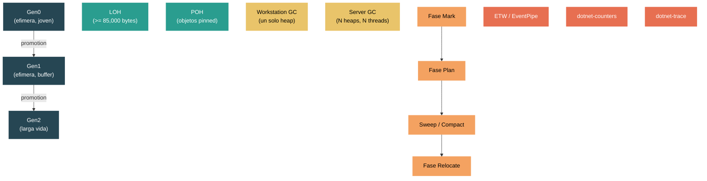

# Nivel 3: Avanzado — Garbage Collection: Generaciones, Modos y Tuning

> **Perfil objetivo:** Desarrollador que necesita optimizar el comportamiento del GC, diagnosticar problemas de memoria y entender los internos del manejo de memoria del runtime
> **Esfuerzo estimado:** 6 horas
> **Prerrequisitos:** [Modulo 3.1](03-advanced-jit.md), modulos de Nivel 2
> [English version](../en/03-advanced-gc.md)

---

## Objetivos de Aprendizaje

Al finalizar este modulo vas a poder:

1. Explicar la hipotesis generacional y como impulsa el diseno Gen0/Gen1/Gen2 de .NET, incluyendo allocation budgets y promotion.
2. Identificar los triggers que causan un garbage collection y describir cada fase del GC: mark, plan, sweep/compact y relocate.
3. Comparar Workstation GC y Server GC en terminos de cantidad de threads, estructura del heap y caracteristicas de pausa.
4. Describir el Large Object Heap (LOH) y el Pinned Object Heap (POH), incluyendo el threshold de 85,000 bytes y los riesgos de fragmentacion.
5. Configurar el comportamiento del GC usando variables de entorno `DOTNET_*`, `GCSettings.LatencyMode` y propiedades de runtimeconfig.json.
6. Diagnosticar problemas del GC usando eventos ETW, `dotnet-counters` y `dotnet-trace`, reconociendo patrones como Gen2 storms, fragmentacion del LOH y presion de finalizacion.

---

## Mapa Conceptual



---

## Curriculum

### Leccion 1 — La Hipotesis Generacional

#### Que vas a aprender

El GC de .NET esta construido sobre una observacion fundamental en ciencias de la computacion: la mayoria de los objetos mueren jovenes. Esta "hipotesis generacional" impulsa el diseno completo del garbage collector. En lugar de escanear cada objeto en cada recoleccion, el GC divide los objetos en generaciones y recolecta los objetos jovenes con mucha mas frecuencia que los viejos.

#### Generaciones en el codigo fuente

Abri `src/coreclr/gc/gc.h`. El enum de generaciones en la linea 109 define la jerarquia completa:

```cpp
enum gc_generation_num
{
    soh_gen0 = 0,
    soh_gen1 = 1,
    soh_gen2 = 2,
    max_generation = soh_gen2,

    loh_generation = 3,
    poh_generation = 4,

    uoh_start_generation = loh_generation,
    total_generation_count = poh_generation + 1,  // 5 en total
};
```

Hay cinco "generaciones" logicas -- tres para el Small Object Heap (SOH) y dos para los Upper Object Heaps (UOH): LOH y POH. Las generaciones del SOH (0, 1, 2) son las que siguen la hipotesis generacional.

#### Como funcionan los allocation budgets

Cada generacion tiene un **budget** -- la cantidad de allocation permitida antes de que se dispare una recoleccion. Esto se rastrea en `gcpriv.h` a traves de la estructura `dynamic_data`:

```cpp
ptrdiff_t new_allocation;       // budget restante para esta generacion
ptrdiff_t gc_new_allocation;    // snapshot tomado al inicio del GC
```

Cuando asignas un nuevo objeto, el runtime resta del `new_allocation` de Gen0. Cuando este budget se agota, se dispara una recoleccion de Gen0. El GC entonces calcula un nuevo budget basado en tasas de supervivencia -- si la mayoria de los objetos sobrevivieron, el budget aumenta; si la mayoria murio, el budget se reduce.

La funcion `desired_new_allocation` en `gcpriv.h` (linea 3185) es responsable de computar el siguiente budget despues de cada recoleccion:

```cpp
PER_HEAP_METHOD size_t desired_new_allocation(dynamic_data* dd, size_t out, ...);
```

#### Promotion

Los objetos que sobreviven una recoleccion de Gen0 son **promovidos** a Gen1. Los objetos que sobreviven una recoleccion de Gen1 son promovidos a Gen2. Una vez en Gen2, los objetos permanecen ahi hasta que una recoleccion completa (Gen2) los reclame.

La estructura `gc_mechanisms` en `gcpriv.h` rastrea si hubo promotion:

```cpp
class gc_mechanisms
{
public:
    BOOL promotion;        // hubo promotion?
    BOOL demotion;         // hubo demotion? (modo regions)
    int condemned_generation;  // que generacion se esta recolectando
    // ...
};
```

**Demotion** es lo inverso -- en modo regions, el GC puede degradar objetos de vuelta a una generacion mas joven si determina que es poco probable que sean de larga vida. Esto se indica con el flag `RI_DEMOTED` en los metadatos de la region.

#### Idea clave

Las recolecciones de Gen0 son rapidas porque solo escanean una pequena cantidad de memoria. Las recolecciones de Gen2 son costosas porque escanean todo el heap. Tu objetivo principal de tuning es minimizar las recolecciones de Gen2 mientras mantenes las de Gen0/Gen1 eficientes.

#### Ejercicio de exploracion del codigo fuente

1. Abri `src/coreclr/gc/gc.h` y lee el enum `gc_generation_num`. Nota como `max_generation` es `soh_gen2` (valor 2), que es lo que `GC.MaxGeneration` retorna en codigo managed.
2. Abri `src/coreclr/gc/gcpriv.h` y busca `dynamic_data`. Observa el campo `new_allocation` -- este es el contador de budget que dispara las recolecciones.
3. Abri `src/coreclr/System.Private.CoreLib/src/System/GC.CoreCLR.cs` y encontra `GetMaxGeneration()` -- hace de puente entre los mundos managed y nativo.

---

### Leccion 2 — Triggers y Fases del GC

#### Que vas a aprender

Un garbage collection no sucede al azar. Se dispara por condiciones especificas, y una vez iniciado, avanza a traves de fases bien definidas. Entender estas fases te ayuda a interpretar las pausas del GC y darle sentido a los datos de diagnostico.

#### Que dispara un GC

El comentario de entrada en `src/coreclr/gc/gc.cpp` (linea 12-13) nos dice el trigger mas comun:

```
// The most common case for a GC to be triggered is from the allocator code.
// See code:#try_allocate_more_space where it calls GarbageCollectGeneration.
```

El conjunto completo de razones del GC esta definido en `gc.h` a partir de la linea 60:

```cpp
enum gc_reason
{
    reason_alloc_soh = 0,       // budget de Gen0 agotado
    reason_induced = 1,         // se llamo a GC.Collect()
    reason_lowmemory = 2,       // el OS reporta poca memoria
    reason_empty = 3,           // sin uso
    reason_alloc_loh = 4,       // allocation en LOH disparo el GC
    reason_oos_soh = 5,         // sin segmentos (SOH)
    reason_oos_loh = 6,         // sin segmentos (LOH)
    reason_induced_noforce = 7, // GC.Collect con modo Optimized
    reason_lowmemory_blocking = 9,
    reason_induced_compacting = 10,
    reason_lowmemory_host = 11,
    reason_pm_full_gc = 12,     // modo provisional solicita GC completo
    reason_induced_aggressive = 17,  // GCCollectionMode.Aggressive
    reason_max
};
```

Las mas importantes para el dia a dia:
- **`reason_alloc_soh`**: Budget de allocation de Gen0 agotado. Este es el trigger normal y saludable.
- **`reason_induced`**: Alguien llamo a `GC.Collect()`. Generalmente una bandera roja -- evitalo a menos que tengas una razon especifica.
- **`reason_alloc_loh`**: Una allocation de objeto grande causo una recoleccion de Gen2. Las allocations en LOH siempre disparan un GC de Gen2 si se excede el budget.
- **`reason_lowmemory`**: El OS senalo presion de memoria. El GC se vuelve mas agresivo.

#### Las fases del GC

Una vez disparado, el GC avanza a traves de fases distintas. Las declaraciones de metodos en `gcpriv.h` las presentan:

```cpp
PER_HEAP_METHOD void mark_phase(int condemned_gen_number);
PER_HEAP_METHOD void plan_phase(int condemned_gen_number);
PER_HEAP_METHOD void relocate_phase(int condemned_gen_number, ...);
PER_HEAP_METHOD void compact_phase(int condemned_gen_number, ...);
```

Estas fases estan implementadas en archivos fuente separados: `src/coreclr/gc/mark_phase.cpp` y `src/coreclr/gc/plan_phase.cpp`, mas el `gc.cpp` principal.

**Fase 1 -- Mark**: El GC recorre todas las raices (variables de stack, campos estaticos, GC handles) y marca recursivamente cada objeto alcanzable. Los objetos no alcanzables se consideran basura.

**Fase 2 -- Plan**: El GC decide que hacer con la generacion condenada. Determina si hacer **sweep** (dejar los objetos en su lugar, construir una free list con los huecos) o **compact** (deslizar los objetos supervivientes juntos para eliminar la fragmentacion). La decision se basa en metricas de fragmentacion y el flag `gc_mechanisms.compaction`.

**Fase 3a -- Sweep**: Si se hace sweep, el GC construye free lists a partir de los huecos dejados por objetos muertos. Es mas rapido que compact pero puede causar fragmentacion.

**Fase 3b -- Compact + Relocate**: Si se hace compact, el GC primero computa nuevas direcciones para todos los objetos supervivientes, luego actualiza todas las referencias (relocate), y finalmente copia los objetos a sus nuevas ubicaciones (compact). Compact elimina la fragmentacion pero es mas costoso.

#### Background GC (BGC)

Para recolecciones de Gen2, el GC puede ejecutarse **concurrentemente** con los threads de tu aplicacion. Esto es Background GC (BGC), habilitado por defecto. La estructura `gc_mechanisms` lo rastrea:

```cpp
uint32_t concurrent;     // es un GC concurrente?
BOOL background_p;       // esta corriendo background GC?
bgc_state b_state;       // estado actual del BGC
```

BGC tiene dos breves pausas STW (stop-the-world): una al inicio para el marking inicial, y una al final para el marking final. Entre estas pausas, tu aplicacion sigue corriendo mientras el GC traza el heap en segundo plano.

#### Ejercicio de exploracion del codigo fuente

1. En `src/coreclr/gc/gc.h`, lee el enum `gc_reason`. Mapea cada razon a un escenario que podrias encontrar.
2. En `src/coreclr/gc/gc.cpp`, mira el comentario en la linea 12 describiendo la ruta del trigger de allocation.
3. En `src/coreclr/gc/gcpriv.h`, encontra las declaraciones de las cuatro fases (`mark_phase`, `plan_phase`, `relocate_phase`, `compact_phase`).

---

### Leccion 3 — Workstation vs Server GC

#### Que vas a aprender

El runtime de .NET viene con dos implementaciones del GC compiladas desde el mismo codigo fuente. La eleccion entre ellas afecta fundamentalmente las caracteristicas de throughput y latencia de tu aplicacion.

#### Un codigo fuente, dos binarios

Mira la parte superior de `src/coreclr/gc/gc.cpp` (lineas 61-65):

```cpp
#ifdef SERVER_GC
namespace SVR {
#else // SERVER_GC
namespace WKS {
#endif // SERVER_GC
```

Todo el GC se compila dos veces -- una vez en el namespace `WKS` (Workstation) y otra en `SVR` (Server). El define de compilacion clave es `FEATURE_SVR_GC`, y el define `MULTIPLE_HEAPS` en `gcpriv.h` controla la arquitectura del heap:

```cpp
#ifdef MULTIPLE_HEAPS
#define PER_HEAP_FIELD            // campo de instancia en gc_heap
#else
#define PER_HEAP_FIELD static     // unica instancia estatica
#endif
```

En modo Workstation, hay un unico `gc_heap` con campos estaticos. En modo Server, hay N instancias de `gc_heap` -- una por procesador logico (o segun se configure con `GCHeapCount`).

#### Caracteristicas de Workstation GC

- **Un heap del GC**, un thread del GC
- El GC corre en el thread que disparo la allocation
- Disenado para aplicaciones **interactivas/desktop** donde la baja latencia importa
- Es el defecto para aplicaciones que no optan por Server GC
- Background GC habilitado por defecto (recolecciones concurrentes de Gen2)

#### Caracteristicas de Server GC

- **N heaps del GC**, N threads dedicados (uno por procesador logico por defecto)
- Cada thread tiene afinidad a un procesador para localidad NUMA
- Los threads del GC corren con `THREAD_PRIORITY_HIGHEST`
- Disenado para **cargas de servidor** (ASP.NET, servicios gRPC) donde el throughput importa
- Cada heap tiene su propio Gen0/Gen1/Gen2/LOH/POH
- Las pausas del GC afectan a todos los threads simultaneamente -- todos los heaps se recolectan en paralelo

#### Elegir entre ambos

| Factor | Workstation | Server |
|--------|-------------|--------|
| Cantidad de heaps | 1 | N (uno por core) |
| Threads del GC | 0 dedicados | N dedicados |
| Uso de memoria | Menor | Mayor (N heaps) |
| Throughput | Menor | Mayor |
| Tiempos de pausa | Pausas individuales mas cortas | Mas largas pero menos frecuentes |
| Mejor para | Desktop, mobile, containers con pocos cores | Web servers, APIs, procesamiento batch |

#### Configuracion

En tu `.csproj` o `runtimeconfig.json`:

```json
{
  "runtimeOptions": {
    "configProperties": {
      "System.GC.Server": true,
      "System.GC.Concurrent": true
    }
  }
}
```

O via variables de entorno:

```bash
export DOTNET_gcServer=1
export DOTNET_gcConcurrent=1
```

Estos mapean a las entradas de `gcconfig.h`:

```cpp
BOOL_CONFIG(ServerGC,    "gcServer",    "System.GC.Server",    false, ...)
BOOL_CONFIG(ConcurrentGC,"gcConcurrent","System.GC.Concurrent",true,  ...)
```

#### Controlar la cantidad de heaps

Por defecto, Server GC crea un heap por procesador logico. Podes sobreescribir esto con `GCHeapCount`:

```bash
export DOTNET_GCHeapCount=4   # usar exactamente 4 heaps
```

Esto es critico en entornos de containers donde el container tiene acceso a muchos cores pero esta limitado en CPU. La entrada de configuracion del GC en `gcconfig.h`:

```cpp
INT_CONFIG(HeapCount, "GCHeapCount", "System.GC.HeapCount", 0,
           "Specifies the number of server GC heaps")
```

Un valor de 0 significa "auto-detectar del conteo de procesadores".

#### Ejercicio de exploracion del codigo fuente

1. En `src/coreclr/gc/gc.cpp`, observa la division de namespaces con `#ifdef SERVER_GC`.
2. En `src/coreclr/gc/gcpriv.h`, busca `MULTIPLE_HEAPS` y ve como los campos per-heap se vuelven estaticos en modo Workstation.
3. En `src/coreclr/gc/gcconfig.h`, encontra las entradas `ServerGC`, `ConcurrentGC` y `HeapCount`.

---

### Leccion 4 — LOH y POH

#### Que vas a aprender

No todos los objetos pasan por la jerarquia generacional. Los objetos que son grandes o estan pinned reciben tratamiento especial en heaps dedicados, cada uno con sus propias caracteristicas de allocation y recoleccion.

#### El Large Object Heap (LOH)

Cualquier objeto cuyo tamano sea >= 85,000 bytes va directamente al LOH, saltandose Gen0/Gen1/Gen2 por completo. Este threshold esta definido en `src/coreclr/gc/gc.h`:

```cpp
#define LARGE_OBJECT_SIZE ((size_t)(85000))
```

Y se inicializa en `gc.cpp`:

```cpp
size_t loh_size_threshold = LARGE_OBJECT_SIZE;
```

Podes ajustar este threshold (solo hacia arriba) via la configuracion `GCLOHThreshold`:

```cpp
INT_CONFIG(LOHThreshold, "GCLOHThreshold", "System.GC.LOHThreshold",
           LARGE_OBJECT_SIZE, "Specifies the size that will make objects go on LOH")
```

La validacion en `interface.cpp` asegura que no se pueda bajar de 85,000:

```cpp
loh_size_threshold = max(loh_size_threshold, LARGE_OBJECT_SIZE);
```

#### Por que el LOH es especial

Los objetos del LOH se recolectan con Gen2 -- cada GC de Gen2 tambien escanea el LOH. Sin embargo, por defecto el LOH **no se compacta**. Los objetos muertos dejan huecos que forman una free list, y los nuevos objetos grandes se asignan en estos huecos. Esto puede causar **fragmentacion**: muchos huecos pequenos que no pueden satisfacer una allocation grande, aunque el espacio libre total sea suficiente.

#### Compactacion del LOH

Podes solicitar compactacion del LOH a traves de la API managed en `src/libraries/System.Private.CoreLib/src/System/Runtime/GCSettings.cs`:

```csharp
public enum GCLargeObjectHeapCompactionMode
{
    Default = 1,      // no compactar el LOH
    CompactOnce = 2   // compactar el LOH en el proximo GC completo bloqueante, luego revertir
}
```

Establecelo antes de disparar un GC completo:

```csharp
GCSettings.LargeObjectHeapCompactionMode = GCLargeObjectHeapCompactionMode.CompactOnce;
GC.Collect();
```

El GC tambien considera la compactacion basandose en el setting `GCConserveMem`, como se ve en `plan_phase.cpp`:

```cpp
dprintf(GTC_LOG, ("compacting LOH due to GCConserveMem setting"));
```

#### El Pinned Object Heap (POH) -- .NET 5+

Hacer pinning de objetos (por ejemplo, para interop con codigo nativo) previene que el GC los mueva, lo cual fragmenta el SOH. El POH resuelve esto proveyendo un heap dedicado para objetos que nacen pinned.

El POH es la generacion 4 en la jerarquia interna:

```cpp
poh_generation = 4,
```

Se asigna directamente al POH usando:

```csharp
byte[] buffer = GC.AllocateArray<byte>(4096, pinned: true);
```

En `src/coreclr/System.Private.CoreLib/src/System/GC.CoreCLR.cs`, esto mapea a:

```csharp
internal enum GC_ALLOC_FLAGS
{
    GC_ALLOC_NO_FLAGS = 0,
    GC_ALLOC_ZEROING_OPTIONAL = 16,
    GC_ALLOC_PINNED_OBJECT_HEAP = 64,
};
```

#### POH vs pinning en SOH

| Aspecto | `fixed` / GCHandle pinning | `GC.AllocateArray(pinned: true)` |
|---------|---------------------------|-----------------------------------|
| Heap | SOH (Gen0/1/2) | POH |
| Riesgo de fragmentacion | Alto -- fragmenta la generacion | Ninguno -- el POH esta disenado para eso |
| Tiempo de vida | Solo la duracion del pin | Toda la vida del objeto |
| Mejor para | Pins de corta vida | Buffers de larga vida (I/O, interop) |

#### Tipos de segmentos ETW

Los eventos ETW distinguen tipos de heap en `gc.h`:

```cpp
enum gc_etw_segment_type
{
    gc_etw_segment_small_object_heap = 0,
    gc_etw_segment_large_object_heap = 1,
    gc_etw_segment_read_only_heap = 2,
    gc_etw_segment_pinned_object_heap = 3
};
```

#### Ejercicio de exploracion del codigo fuente

1. En `src/coreclr/gc/gc.h`, encontra `LARGE_OBJECT_SIZE` y el enum `gc_etw_segment_type`.
2. En `src/coreclr/gc/gcconfig.h`, encontra la entrada de configuracion `LOHThreshold`.
3. En `src/libraries/System.Private.CoreLib/src/System/Runtime/GCSettings.cs`, lee el enum `GCLargeObjectHeapCompactionMode`.
4. En `src/coreclr/System.Private.CoreLib/src/System/GC.CoreCLR.cs`, encontra `GC_ALLOC_PINNED_OBJECT_HEAP`.

---

### Leccion 5 — Perillas de Configuracion del GC

#### Que vas a aprender

El GC expone docenas de perillas de tuning a traves de variables de entorno y propiedades de `runtimeconfig.json`. Entender las mas impactantes te permite optimizar para tu carga de trabajo especifica sin cambiar codigo.

#### Arquitectura del sistema de configuracion

Toda la configuracion del GC esta definida en `src/coreclr/gc/gcconfig.h` a traves de un sistema basado en macros. Cada entrada sigue un patron:

```cpp
INT_CONFIG(Nombre, "DOTNET_VarEntorno", "System.GC.NombrePropiedad", defecto, "descripcion")
```

Esto genera un metodo `GCConfig::GetNombre()` que el GC llama durante la inicializacion. El runtime verifica (en orden): variables de entorno (`DOTNET_*`), propiedades de `runtimeconfig.json`, y luego cae al valor por defecto.

#### Perillas de configuracion esenciales

**Modos de latencia** (`GCSettings.LatencyMode`):

La API managed expone cinco modos, definidos en `src/libraries/System.Private.CoreLib/src/System/Runtime/GCSettings.cs`:

```csharp
public enum GCLatencyMode
{
    Batch = 0,                 // maximizar throughput, pausas largas OK
    Interactive = 1,           // balancear throughput y tiempos de pausa (defecto)
    LowLatency = 2,            // minimizar pausas, evitar Gen2 salvo necesidad
    SustainedLowLatency = 3,   // evitar GCs bloqueantes de Gen2 por completo
    NoGCRegion = 4             // sin GC (se establece via GC.TryStartNoGCRegion)
}
```

Estos mapean directamente al enum nativo `gc_pause_mode` en `gcpriv.h`:

```cpp
enum gc_pause_mode
{
    pause_batch = 0,
    pause_interactive = 1,
    pause_low_latency = 2,
    pause_sustained_low_latency = 3,
    pause_no_gc = 4
};
```

**Conservacion de memoria** (`GCConserveMemory`):

```cpp
INT_CONFIG(GCConserveMem, "GCConserveMemory", "System.GC.ConserveMemory", 0,
           "Specifies how hard GC should try to conserve memory - values 0-9")
```

Valores 0-9. Valores mas altos hacen que el GC sea mas agresivo devolviendo memoria al OS, a costa de recolecciones mas frecuentes y compactacion del LOH.

**Limites estrictos del heap**:

```cpp
INT_CONFIG(GCHeapHardLimit, "GCHeapHardLimit", "System.GC.HeapHardLimit", 0,
           "Specifies a hard limit for the GC heap")
INT_CONFIG(GCHeapHardLimitPercent, "GCHeapHardLimitPercent",
           "System.GC.HeapHardLimitPercent", 0,
           "Specifies the GC heap usage as a percentage of the total memory")
```

Podes establecer limites absolutos en bytes o porcentajes. Incluso podes establecer limites por tipo de heap:

```cpp
INT_CONFIG(GCHeapHardLimitSOH, ...)  // limite especifico para SOH
INT_CONFIG(GCHeapHardLimitLOH, ...)  // limite especifico para LOH
INT_CONFIG(GCHeapHardLimitPOH, ...)  // limite especifico para POH
```

**Threshold de memoria alta**:

```cpp
INT_CONFIG(GCHighMemPercent, "GCHighMemPercent", "System.GC.HighMemoryPercent", 0,
           "The percent for GC to consider as high memory")
```

Cuando el uso de memoria fisica excede este porcentaje, el GC entra en modo "high memory" y se vuelve mas agresivo con las recolecciones. El defecto es 90% en la mayoria de los sistemas.

**Adaptacion Dinamica (DATAS)**:

```cpp
INT_CONFIG(GCDynamicAdaptationMode, "GCDynamicAdaptationMode",
           "System.GC.DynamicAdaptationMode", 1,
           "Enable the GC to dynamically adapt to application sizes.")
```

DATAS (Dynamic Adaptation To Application Sizes) permite que el GC ajuste automaticamente la cantidad de heaps y los budgets de generacion basandose en las caracteristicas de la carga de trabajo. Habilitado por defecto desde .NET 8+.

#### Regions vs Segments

.NET moderno (8+) usa **regions** en lugar del viejo modelo de **segments**. Las regions son bloques de memoria mas pequenos y de tamano fijo que pueden asignarse independientemente a cualquier generacion. Esto se controla con el define de compilacion `USE_REGIONS` en `gcpriv.h`:

```cpp
#define USE_REGIONS
```

Las regions habilitan funcionalidades como demotion (mover objetos de vuelta a generaciones mas jovenes) y manejo de memoria mas flexible. Las perillas de configuracion de regions:

```cpp
INT_CONFIG(GCRegionRange, "GCRegionRange", "System.GC.RegionRange", 0, ...)
INT_CONFIG(GCRegionSize,  "GCRegionSize",  "System.GC.RegionSize",  0, ...)
```

#### Configuracion optimizada para containers

Para cargas de trabajo en containers, considera este conjunto de configuracion:

```json
{
  "runtimeOptions": {
    "configProperties": {
      "System.GC.Server": true,
      "System.GC.HeapCount": 4,
      "System.GC.HeapHardLimitPercent": 75,
      "System.GC.ConserveMemory": 5,
      "System.GC.Concurrent": true
    }
  }
}
```

Variables de entorno equivalentes:

```bash
export DOTNET_gcServer=1
export DOTNET_GCHeapCount=4
export DOTNET_GCHeapHardLimitPercent=75
export DOTNET_GCConserveMemory=5
export DOTNET_gcConcurrent=1
```

#### Perillas adicionales que vale la pena conocer

| Perilla | Variable de Entorno | Proposito |
|---------|-------------------|-----------|
| `RetainVM` | `DOTNET_GCRetainVM` | Mantener segmentos descomisionados en standby en vez de liberar al OS |
| `NoAffinitize` | `DOTNET_GCNoAffinitize` | Deshabilitar afinidad de CPU para threads de Server GC |
| `GCLargePages` | `DOTNET_GCLargePages` | Usar large pages del OS (2MB) para el heap del GC |
| `GCCpuGroup` | `DOTNET_GCCpuGroup` | Habilitar awareness de grupos de CPU (maquinas con >64 cores) |
| `GCNumaAware` | `DOTNET_GCNumaAware` | Allocation con awareness de NUMA (habilitado por defecto) |

#### Ejercicio de exploracion del codigo fuente

1. Abri `src/coreclr/gc/gcconfig.h` y lee todo el macro `GC_CONFIGURATION_KEYS`. Conta cuantas perillas existen.
2. En `src/libraries/System.Private.CoreLib/src/System/Runtime/GCSettings.cs`, segui como el setter de `LatencyMode` valida y aplica el modo.
3. En `src/coreclr/gc/gcpriv.h`, busca `USE_REGIONS` para ver como las regions difieren del viejo modelo de segments.

---

### Leccion 6 — Diagnosticando Problemas del GC

#### Que vas a aprender

Incluso con configuracion optima, los problemas de rendimiento relacionados con el GC ocurren. Esta leccion te ensena a identificar, diagnosticar y corregir las patologias mas comunes del GC usando herramientas de diagnostico integradas.

#### Herramienta 1: dotnet-counters (monitoreo en tiempo real)

```bash
dotnet-counters monitor --process-id <PID> \
    --counters System.Runtime[gc-heap-size,gen-0-gc-count,gen-1-gc-count,gen-2-gc-count,gen-0-size,gen-1-size,gen-2-size,loh-size,poh-size,time-in-gc,alloc-rate]
```

Metricas clave a vigilar:
- **`time-in-gc`**: Porcentaje de tiempo pasado en el GC. Por encima de 10-15% es preocupante.
- **`gen-2-gc-count`**: Conteos de Gen2 aumentando rapidamente indican un "Gen2 storm".
- **`alloc-rate`**: Tasas de allocation altas impulsan ciclos de GC frecuentes.
- **`loh-size`**: LOH creciendo sin recolecciones de Gen2 correspondientes sugiere fragmentacion del LOH.

#### Herramienta 2: dotnet-trace (captura detallada ETW/EventPipe)

```bash
dotnet-trace collect --process-id <PID> \
    --providers Microsoft-Windows-DotNETRuntime:0x1:5
```

La mascara de keyword del GC `0x1` captura eventos del GC. Eventos clave a buscar:

- **GCStart / GCEnd**: Te dice que generacion se recolecto, la razon y la duracion.
- **GCHeapStats**: Tamanos del heap post-GC para todas las generaciones.
- **GCAllocationTick**: Eventos de allocation muestreados (cada ~100KB) mostrando que tipos se estan asignando.
- **GCCreateSegment**: Cuando el GC adquiere nuevos segmentos de memoria -- mapea a los tipos de segmentos ETW de `gc.h`:

```cpp
enum gc_etw_segment_type
{
    gc_etw_segment_small_object_heap = 0,
    gc_etw_segment_large_object_heap = 1,
    gc_etw_segment_read_only_heap = 2,
    gc_etw_segment_pinned_object_heap = 3
};
```

La razon del GC en eventos ETW mapea directamente al enum `gc_reason`. Si ves `reason_alloc_loh` (4) disparando recolecciones de Gen2, tus allocations en LOH estan causando GCs completos.

#### Patologia comun 1: Gen2 storms

**Sintomas**: `gen-2-gc-count` aumentando rapidamente, `time-in-gc` alto.

**Causa**: Demasiados objetos sobreviviendo hasta Gen2 (object pools que no devuelven objetos, caches creciendo sin limite, closures de larga vida capturando grafos grandes).

**Diagnostico**:
```bash
dotnet-counters monitor --counters System.Runtime[gen-0-gc-count,gen-2-gc-count,time-in-gc]
```
Si `gen-2-gc-count` es mas de 1/10 de `gen-0-gc-count`, tenes un problema.

**Soluciones**:
- Revisa los tiempos de vida de objetos -- usa `dotnet-trace` con `GCAllocationTick` para encontrar las rutas de allocation calientes
- Considera `GCSettings.LatencyMode = SustainedLowLatency` para evitar GCs bloqueantes de Gen2
- Usa `ArrayPool<T>` y `MemoryPool<T>` para reducir allocations
- Verifica que no haya objetos finalizables que se esten promoviendo inadvertidamente

#### Patologia comun 2: Fragmentacion del LOH

**Sintomas**: `loh-size` es grande, se lanza `OutOfMemoryException` a pesar de haber memoria disponible, LOH creciendo sin limite.

**Causa**: Allocation y deallocation frecuente de objetos grandes de tamanos variables. El allocator de free-list no puede encontrar espacio contiguo.

**Diagnostico**: Captura un trace y examina los eventos GCHeapStats. Si la fragmentacion del LOH es alta, vas a ver el tamano del LOH creciendo aunque haya espacio fragmentado disponible.

**Soluciones**:
- Usa `ArrayPool<byte>.Shared` para arrays de bytes grandes
- Asigna arrays grandes en tamanos de potencia de 2 para que la reutilizacion de la free-list sea mas probable
- Compacta el LOH periodicamente:
```csharp
GCSettings.LargeObjectHeapCompactionMode = GCLargeObjectHeapCompactionMode.CompactOnce;
GC.Collect();
```
- Aumenta `GCConserveMemory` para fomentar la compactacion del LOH:
```bash
export DOTNET_GCConserveMemory=7
```

#### Patologia comun 3: Presion de finalizacion

**Sintomas**: Objetos con finalizers son promovidos a Gen2 porque no pueden ser recolectados hasta que el finalizer se ejecute. El thread de finalizacion se convierte en un cuello de botella.

**Causa**: Tipos que implementan finalizers (o `IDisposable` sin llamar a `GC.SuppressFinalize`). Cada objeto finalizable requiere un ciclo extra del GC para ser recolectado -- primero se marca para finalizacion y se coloca en la cola f-reachable, luego el thread de finalizacion lo procesa, y solo en el siguiente GC de Gen2 se libera realmente la memoria.

**Diagnostico**: Usa `dotnet-counters` para monitorear `finalization-queue-length`. Si esta creciendo, los finalizers no estan alcanzando.

**Soluciones**:
- Siempre llama a `Dispose()` y `GC.SuppressFinalize(this)` en el patron Dispose
- Evita finalizers donde sea posible -- usa `SafeHandle` en su lugar
- Considera `GC.WaitForPendingFinalizers()` en casos extremos

#### Patologia comun 4: Overhead de GC inducido

**Sintomas**: Muchos GCs con `reason_induced` en los datos del trace.

**Causa**: Codigo llamando a `GC.Collect()` explicitamente. Cada GC inducido dispara una recoleccion completa bloqueante por defecto.

**Diagnostico**: Busca en tu codebase `GC.Collect()`. Revisa tambien las bibliotecas de terceros.

**Soluciones**:
- Elimina las llamadas explicitas a `GC.Collect()` salvo que sea absolutamente necesario
- Si tenes que inducir un GC, usa `GC.Collect(generation, GCCollectionMode.Optimized)` para dejar que el GC decida si la recoleccion es realmente necesaria

#### Flujo de trabajo de diagnostico (checklist)

1. **Empieza con `dotnet-counters`** -- obtene una vision general en tiempo real de tamanos de heap, conteos de GC y time-in-GC.
2. **Identifica la generacion** -- cual generacion se esta recolectando con demasiada frecuencia?
3. **Captura un trace** con `dotnet-trace` para obtener eventos del GC con razones y duraciones.
4. **Analiza las allocations** -- usa eventos `GCAllocationTick` para encontrar rutas de allocation calientes.
5. **Verifica la configuracion** -- el modo del GC (Workstation/Server) es apropiado para tu carga de trabajo?
6. **Aplica correcciones dirigidas** -- poolea allocations, ajusta el modo de latencia, o afina los limites del heap.
7. **Medi de nuevo** -- verifica que tus cambios realmente mejoraron la situacion.

#### Informacion del GC desde codigo managed

La API `GC.GetGCMemoryInfo()` provee estadisticas detalladas del GC sin herramientas externas:

```csharp
GCMemoryInfo info = GC.GetGCMemoryInfo(GCKind.FullBlocking);
Console.WriteLine($"Tamano del heap: {info.HeapSizeBytes}");
Console.WriteLine($"Fragmentacion: {info.FragmentedBytes}");
Console.WriteLine($"Duracion de pausa: {info.PauseDurations[0]}");
Console.WriteLine($"Concurrente: {info.Concurrent}");
Console.WriteLine($"Compactado: {info.Compacted}");
```

#### Ejercicio de exploracion del codigo fuente

1. En `src/coreclr/gc/gc.h`, revisa el enum completo `gc_reason` y el enum `gc_etw_type` (NGC/BGC/FGC).
2. En `src/coreclr/System.Private.CoreLib/src/System/GC.CoreCLR.cs`, encontra `GetGCMemoryInfo` y segui como hace puente con el codigo nativo.
3. En `src/coreclr/gc/gcpriv.h`, encontra la clase `gc_mechanisms` y nota los campos `entry_memory_load` / `exit_memory_load` -- estos son lo que reportan las herramientas de diagnostico.

---

## Preguntas de Autoevaluacion

1. Por que el GC tiene tres generaciones SOH en vez de solo dos (joven/vieja)?
2. Cual es la diferencia entre sweep y compact, y cuando elige cada uno el GC?
3. Desplegaste una Web API en un container de 4 cores con 2GB de RAM. Con que configuracion del GC empezarias?
4. El tamano del LOH de una aplicacion sigue creciendo aunque los objetos del LOH son de corta vida. Que esta pasando y como lo solucionas?
5. Ves `time-in-gc` al 35%. Tu conteo de Gen2 esta aumentando a 10 recolecciones/segundo. Cuales son tus proximos pasos de diagnostico?
6. Por que se introdujo el Pinned Object Heap en .NET 5? Que problema resuelve que los `fixed` statements no resuelven?
7. Que hace `GCConserveMemory=9` diferente al defecto, y cuando lo usarias?

---

## Mapa de Archivos Fuente Clave

| Archivo | Que contiene |
|---------|-------------|
| `src/coreclr/gc/gc.cpp` | Implementacion principal del GC (~8,800 lineas), entry points de allocation |
| `src/coreclr/gc/gc.h` | Enums publicos: `gc_reason`, `gc_generation_num`, `LARGE_OBJECT_SIZE` |
| `src/coreclr/gc/gcpriv.h` | Estructuras internas: `gc_heap`, `gc_mechanisms`, `dynamic_data`, declaraciones de fases del GC |
| `src/coreclr/gc/gcconfig.h` | Todas las perillas de configuracion del GC via el macro `GC_CONFIGURATION_KEYS` |
| `src/coreclr/gc/gcinterface.h` | Interfaz `IGCHeap` entre el GC y el runtime (version 5.8) |
| `src/coreclr/gc/mark_phase.cpp` | Implementacion de la fase mark |
| `src/coreclr/gc/plan_phase.cpp` | Implementacion de la fase plan (incluye decision de compactacion/sweep) |
| `src/coreclr/gc/env/gcenv.os.h` | Abstraccion de memoria del OS (`GCToOSInterface`, memoria virtual, NUMA) |
| `src/coreclr/System.Private.CoreLib/src/System/GC.CoreCLR.cs` | Clase managed `System.GC` que hace puente con el GC nativo |
| `src/libraries/System.Private.CoreLib/src/System/Runtime/GCSettings.cs` | `GCLatencyMode`, `GCLargeObjectHeapCompactionMode` |

---

## Lectura Adicional

- [Documento de Diseno del GC (BOTR)](docs/design/coreclr/botr/garbage-collection.md) -- el documento de diseno canonico referenciado al inicio de `gc.cpp`
- [Configuracion del GC](https://learn.microsoft.com/en-us/dotnet/core/runtime-config/garbage-collector) -- documentacion oficial de todos los settings del GC
- [Posts del blog de Maoni Stephens](https://devblogs.microsoft.com/dotnet/author/maoni0/) -- de la desarrolladora lider del GC
- [Internos del GC de .NET (profiling de rendimiento)](https://learn.microsoft.com/en-us/dotnet/standard/garbage-collection/) -- referencia MSDN
