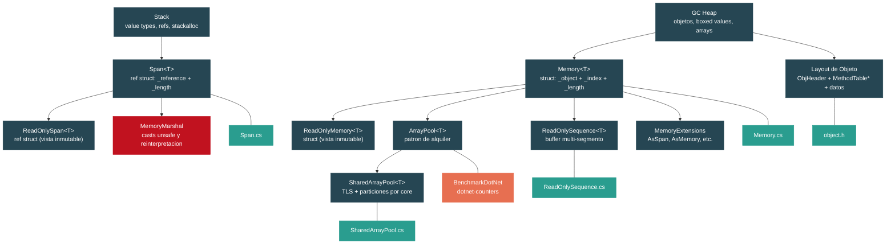

# Nivel 3: Avanzado — Modelo de Memoria: Stack, Heap, Span y Memory

> **Perfil objetivo:** Desarrollador que optimiza hot paths, profilea alocaciones y lee el codigo fuente del framework para entender el layout de memoria
> **Esfuerzo estimado:** 6 horas
> **Prerrequisitos:** [Nivel 2 completo](02-practitioner-generics.md) (especialmente 2.1 Generics y [2.9 IDisposable](02-practitioner-disposable.md))
> [English version](../en/03-advanced-memory-model.md)

---

## Objetivos de Aprendizaje

Al finalizar este modulo vas a poder:

1. Explicar exactamente que va en el stack versus el heap en .NET, incluyendo value types capturados por closures, value types boxeados y buffers asignados con `stackalloc`.
2. Describir el layout interno de un objeto managed en el GC heap (ObjHeader + puntero a MethodTable + datos de instancia) leyendo `src/coreclr/vm/object.h`.
3. Explicar por que `Span<T>` es un `ref struct` (dos campos: `ref T _reference` + `int _length`) y que significa "no puede vivir en el heap" en la practica.
4. Usar `Memory<T>` en contextos async donde `Span<T>` esta prohibido, y explicar el triple `_object` / `_index` / `_length` que lo hace funcionar.
5. Implementar patrones correctos de alquiler con `ArrayPool<T>.Shared`, entendiendo el cache escalonado TLS-luego-particiones-por-core en `SharedArrayPool<T>`.
6. Recorrer segmentos de `ReadOnlySequence<T>` para procesar buffers discontiguos de `System.IO.Pipelines`.
7. Usar `MemoryMarshal` para castear spans, reinterpretar memoria y leer structs desde bytes crudos -- y articular cuando esto es seguro versus comportamiento indefinido.
8. Perfilar hot paths de alocacion con `[MemoryDiagnoser]` de BenchmarkDotNet, `dotnet-counters` y eventos ETW `GC/AllocationTick`.

---

## Mapa Conceptual



---

## Curriculum

### Leccion 1 -- Stack vs Heap: Revision Profunda

#### Que vas a aprender

La mayoria de los desarrolladores C# saben que "los value types van al stack, los reference types van al heap," pero la realidad es mas matizada. En esta leccion vas a aprender las reglas reales de alocacion que sigue el CLR, como `stackalloc` provee alocacion explicita en el stack, y como identificar alocaciones en el heap que parecen deberian ser en el stack.

#### El concepto

El CLR toma decisiones de alocacion basandose en **lifetime y escape analysis**, no simplemente en la categoria del tipo:

| Escenario | Ubicacion | Por que |
|---|---|---|
| Local `int x = 42;` | Stack | Value type, no escapa del metodo |
| `int[] arr = new int[10];` | Heap | Los arrays son siempre reference types |
| `object boxed = 42;` | Heap | Boxing envuelve el valor en un objeto en el heap |
| Struct local en un lambda | Heap | Capturado por la clase closure (escapa) |
| `Span<byte> buf = stackalloc byte[256];` | Stack | Alocacion explicita en el stack |
| `string s = "hello";` | Heap (interned) | Los strings son reference types |

**stackalloc** te da un bloque contiguo de memoria en el stack frame del metodo actual. La memoria se libera automaticamente cuando el metodo retorna -- sin participacion del GC. Sin embargo, hay que tener cuidado con el tamanio: un `stackalloc` grande puede causar `StackOverflowException`.

```csharp
// Patron seguro: verificar el tamanio, fallback a ArrayPool
const int StackAllocThreshold = 256;

Span<byte> buffer = inputLength <= StackAllocThreshold
    ? stackalloc byte[StackAllocThreshold]
    : new byte[inputLength];
```

**Layout de objetos en el heap** -- cada objeto managed en el GC heap tiene este layout (de `object.h`):

```
 ┌───────────────────────┐  ← offset negativo
 │  ObjHeader            │     indice de SyncBlock (4 bytes, +4 bytes padding en 64-bit)
 ├───────────────────────┤  ← direccion a la que apunta la referencia (offset 0)
 │  MethodTable*         │     puntero a metadatos del tipo (8 bytes en 64-bit)
 ├───────────────────────┤
 │  Campos de instancia  │     datos reales
 └───────────────────────┘
```

El tamanio minimo de un objeto es `2 * sizeof(pointer) + ObjHeader` = 24 bytes en 64-bit. Esto significa que hasta una clase `class Empty { }` vacia ocupa 24 bytes en el heap.

#### En el codigo fuente

Abri `src/coreclr/vm/object.h`. Las lineas 86-93 definen las constantes de layout:

```cpp
#define OBJHEADER_SIZE      (sizeof(DWORD) /* m_alignpad */ + sizeof(DWORD) /* m_SyncBlockValue */)
#define OBJECT_SIZE         TARGET_POINTER_SIZE /* m_pMethTab */
#define OBJECT_BASESIZE     (OBJHEADER_SIZE + OBJECT_SIZE)
```

Y la clase `Object` (linea 126) tiene un unico campo:

```cpp
class Object
{
  protected:
    PTR_MethodTable m_pMethTab;
};
```

Las lineas 104-107 imponen el minimo:

```cpp
#define MIN_OBJECT_SIZE     (2*TARGET_POINTER_SIZE + OBJHEADER_SIZE)
```

Esto significa que cada objeto en el heap tiene overhead: el ObjHeader para sincronizacion y el puntero a MethodTable para identidad de tipo. Entender este overhead es clave para saber cuando evitar alocaciones importa.

#### Ejercicio practico

Crea un proyecto BenchmarkDotNet que compare tres enfoques para sumar un array de 1000 enteros:

1. Alocar `new int[1000]` dentro del metodo del benchmark.
2. Usar `stackalloc int[1000]` con un `Span<int>`.
3. Alquilar de `ArrayPool<int>.Shared`.

Usa `[MemoryDiagnoser]` para observar la columna `Allocated`. Las versiones con `stackalloc` y `ArrayPool` deberian mostrar 0 bytes alocados.

```csharp
[MemoryDiagnoser]
public class AllocationBenchmarks
{
    [Benchmark(Baseline = true)]
    public int HeapAllocated()
    {
        int[] arr = new int[1000];
        for (int i = 0; i < arr.Length; i++) arr[i] = i;
        int sum = 0;
        foreach (int n in arr) sum += n;
        return sum;
    }

    [Benchmark]
    public int StackAllocated()
    {
        Span<int> arr = stackalloc int[1000];
        for (int i = 0; i < arr.Length; i++) arr[i] = i;
        int sum = 0;
        foreach (int n in arr) sum += n;
        return sum;
    }

    [Benchmark]
    public int Pooled()
    {
        int[] arr = ArrayPool<int>.Shared.Rent(1000);
        try
        {
            for (int i = 0; i < arr.Length; i++) arr[i] = i;
            int sum = 0;
            for (int i = 0; i < 1000; i++) sum += arr[i];
            return sum;
        }
        finally
        {
            ArrayPool<int>.Shared.Return(arr);
        }
    }
}
```

#### Punto clave

La alocacion en el stack es gratis (sin GC), pero limitada en tamanio y scope. La alocacion en el heap es flexible pero cuesta presion de GC. El arte real esta en saber que alocaciones estan en tu hot path y si se pueden eliminar.

#### Concepcion erronea comun

> "Todos los structs viven en el stack."

Falso. Un struct capturado por un lambda se convierte en un campo de la clase closure generada por el compilador, que vive en el heap. Un struct almacenado como campo de una clase vive en el heap dentro de ese objeto. Un struct boxeado tambien vive en el heap. El stack solo se usa cuando el lifetime del struct esta estrictamente limitado al metodo.

---

### Leccion 2 -- Span\<T\>: La Vista Universal de Buffer

#### Que vas a aprender

`Span<T>` es el tipo mas importante en codigo .NET moderno de alto rendimiento. Vas a aprender su representacion interna, por que es un `ref struct`, que restricciones impone eso, y como el slicing funciona sin copiar memoria.

#### El concepto

`Span<T>` provee una vista type-safe y memory-safe sobre una region contigua de memoria. Puede apuntar a:

- Arrays managed
- Memoria nativa (unmanaged)
- Memoria alocada en el stack (`stackalloc`)

La clave es que `Span<T>` almacena una **referencia managed** directamente, no una referencia a objeto. Esto es lo que lo hace universal -- y lo que lo hace un `ref struct`.

**Por que ref struct?** Un `ref struct` solo puede vivir en el stack. No puede ser:

- Campo de una clase (lo pondria en el heap)
- Boxeado (boxing crea un objeto en el heap)
- Usado en metodos `async` (la state machine es una clase/struct en el heap)
- Usado como type argument para generics que no son ref struct

Estas restricciones existen porque el GC no puede rastrear la referencia interior (`ref T _reference`) si el `Span<T>` estuviera almacenado en el heap. La referencia managed puede apuntar al medio de un array -- si el GC moviera ese array durante compactacion, necesitaria actualizar la referencia, pero solo sabe como actualizar referencias que estan en el stack o en campos de objetos de tipos conocidos.

**El slicing es gratis** -- crear un sub-span solo ajusta la referencia y el length. No se copia memoria:

```csharp
int[] array = { 0, 1, 2, 3, 4, 5, 6, 7, 8, 9 };
Span<int> full = array;
Span<int> middle = full.Slice(3, 4); // apunta a {3, 4, 5, 6}, cero copias
middle[0] = 99;                      // array[3] ahora es 99
```

#### En el codigo fuente

Abri `src/libraries/System.Private.CoreLib/src/System/Span.cs`. La declaracion en la linea 28 muestra todo:

```csharp
public readonly ref struct Span<T>
{
    /// <summary>A byref or a native ptr.</summary>
    internal readonly ref T _reference;
    /// <summary>The number of elements this Span contains.</summary>
    private readonly int _length;
```

Dos campos. Eso es todo. En un runtime de 64-bit, un `Span<T>` ocupa exactamente 16 bytes: 8 bytes para la referencia managed y 4 bytes para el length (mas 4 bytes de padding por alineacion).

El constructor desde un array (linea 42) usa `MemoryMarshal.GetArrayDataReference` para obtener una referencia managed al primer elemento, pasando por alto el header del objeto array:

```csharp
_reference = ref MemoryMarshal.GetArrayDataReference(array);
_length = array.Length;
```

El constructor desde un puntero (linea 110) hace un simple cast:

```csharp
public unsafe Span(void* pointer, int length)
{
    if (RuntimeHelpers.IsReferenceOrContainsReferences<T>())
        ThrowHelper.ThrowArgument_TypeContainsReferences(typeof(T));
    _reference = ref *(T*)pointer;
    _length = length;
}
```

Nota la guarda: no podes crear un `Span<T>` sobre memoria unmanaged cuando `T` contiene referencias de GC. Esto previene que el GC pierda el rastro de objetos.

Ahora abri `src/libraries/System.Private.CoreLib/src/System/ReadOnlySpan.cs`. Es estructuralmente identico (linea 29):

```csharp
public readonly ref struct ReadOnlySpan<T>
{
    internal readonly ref T _reference;
    private readonly int _length;
```

La diferencia es puramente en la superficie del API: `ReadOnlySpan<T>` no expone setter en el indexador ni metodos mutables. Es un contrato de compile-time, no una distincion de runtime -- ambos tipos tienen el mismo layout de memoria.

#### Ejercicio practico

Escribi un metodo que parsee enteros separados por comas desde un `ReadOnlySpan<char>` sin alocar ningun string:

```csharp
static int[] ParseCsvInts(ReadOnlySpan<char> input)
{
    var result = new List<int>();
    while (!input.IsEmpty)
    {
        int commaIndex = input.IndexOf(',');
        ReadOnlySpan<char> token = commaIndex >= 0
            ? input.Slice(0, commaIndex)
            : input;

        result.Add(int.Parse(token));

        input = commaIndex >= 0
            ? input.Slice(commaIndex + 1)
            : default;
    }
    return result.ToArray();
}
```

Benchmarkea esto contra una version con `string.Split(',')` + `int.Parse()`. Usa `[MemoryDiagnoser]` para observar la diferencia de alocaciones. La version basada en span deberia alocar solo los internos del `List<int>`, no los strings intermedios.

#### Punto clave

`Span<T>` te da rendimiento de punteros con seguridad de memoria completa. Su representacion de dos campos hace que el slicing sea una operacion de tiempo constante. La restriccion `ref struct` es el precio que pagas por esta seguridad -- mantiene la referencia managed rastreable por el GC.

#### Concepcion erronea comun

> "Span<T> es siempre mas rapido que los arrays."

No exactamente. `Span<T>` es una *vista* sobre memoria. Para acceso secuencial simple de un array que ya tenes, el JIT genera codigo identico para `array[i]` y `span[i]`. Span brilla cuando necesitas evitar alocaciones (slicing sin copias) o escribir codigo que sea polimorfico sobre la fuente de memoria (array, nativa, stack).

---

### Leccion 3 -- Memory\<T\>: El Hermano Async-Safe de Span

#### Que vas a aprender

`Span<T>` no puede cruzar limites de `await` porque es un `ref struct`. `Memory<T>` resuelve esto almacenando una referencia a objeto en lugar de una referencia managed, haciendolo seguro para almacenar en el heap. Vas a aprender como funciona `Memory<T>` internamente, como `IMemoryOwner<T>` habilita el manejo de lifetime, y como funciona `Pin()` para interop.

#### El concepto

Considera este escenario: queres leer datos de un socket asincrónicamente y procesar slices del buffer. No podes usar `Span<T>` porque los metodos `async` almacenan su estado local en una state machine alocada en el heap.

```csharp
// Esto NO compila:
async Task ProcessAsync(Span<byte> data) // error: ref struct no puede ser parametro de metodo async
{
    await Task.Delay(1);
    Process(data);
}

// Esto SI funciona:
async Task ProcessAsync(Memory<byte> data)
{
    await Task.Delay(1);
    Process(data.Span); // obtene un Span<T> cuando lo necesites
}
```

`Memory<T>` es un `struct` regular (no un `ref struct`), asi que puede ser almacenado en campos, pasado a metodos async y boxeado. Lo logra usando una representacion interna diferente.

**Layout interno** -- `Memory<T>` almacena tres campos:

| Campo | Tipo | Proposito |
|---|---|---|
| `_object` | `object?` | El backing store: un `T[]`, un `string` (para `Memory<char>`), o un `MemoryManager<T>` |
| `_index` | `int` | Offset de inicio (bit alto indica pre-pinned) |
| `_length` | `int` | Numero de elementos |

Cuando llamas `.Span`, `Memory<T>` reconstruye un `Span<T>` obteniendo una referencia del objeto de respaldo. Esto es ligeramente mas costoso que usar un `Span<T>` directamente (un virtual dispatch o type check), pero es seguro a traves de limites de `await`.

**IMemoryOwner\<T\>** define un contrato de ownership: quien tenga el `IMemoryOwner<T>` es responsable de disponer la memoria subyacente. Esto es critico cuando usas memoria de un pool:

```csharp
using IMemoryOwner<byte> owner = MemoryPool<byte>.Shared.Rent(4096);
Memory<byte> memory = owner.Memory;
// Usa memory...
// Disponer 'owner' devuelve el buffer al pool
```

**Pinning** -- `Memory<T>.Pin()` retorna un `MemoryHandle` que previene que el GC mueva la memoria subyacente mientras codigo nativo la accede. El campo `_index` usa su bit mas alto para indicar si el array ya estaba pinned, evitando una alocacion redundante de `GCHandle`.

#### En el codigo fuente

Abri `src/libraries/System.Private.CoreLib/src/System/Memory.cs`. La declaracion del struct en la linea 21 muestra los tres campos:

```csharp
public readonly struct Memory<T> : IEquatable<Memory<T>>
{
    // The highest order bit of _index is used to discern whether _object is a pre-pinned array.
    private readonly object? _object;
    private readonly int _index;
    private readonly int _length;
```

Las lineas 23-26 contienen un comentario importante explicando el truco del bit alto de `_index`:

```csharp
// (_index < 0) => _object is a pre-pinned array, so Pin() will not allocate a new GCHandle
//       (else) => Pin() needs to allocate a new GCHandle to pin the object.
```

El constructor desde un `MemoryManager<T>` (linea 121) almacena el manager como `_object`:

```csharp
internal Memory(MemoryManager<T> manager, int length)
{
    _object = manager;
    _index = 0;
    _length = length;
}
```

Ahora compara con `src/libraries/System.Private.CoreLib/src/System/ReadOnlyMemory.cs` (linea 21):

```csharp
public readonly struct ReadOnlyMemory<T> : IEquatable<ReadOnlyMemory<T>>
{
    internal readonly object? _object;
    internal readonly int _index;
    internal readonly int _length;
    internal const int RemoveFlagsBitMask = 0x7FFFFFFF;
```

El `RemoveFlagsBitMask` en la linea 30 quita el bit alto de `_index` para obtener el offset real. Esta mascara se usa cuando se convierte el indice almacenado de vuelta a un offset real del array.

#### Ejercicio practico

Construi un lector async de archivos que lea en chunks de 4 KB usando `Memory<byte>` e `IMemoryOwner<byte>`:

```csharp
static async Task<long> CountBytesAsync(string path, byte target)
{
    long count = 0;
    using var owner = MemoryPool<byte>.Shared.Rent(4096);
    Memory<byte> buffer = owner.Memory.Slice(0, 4096);

    await using var stream = File.OpenRead(path);
    int bytesRead;
    while ((bytesRead = await stream.ReadAsync(buffer)) > 0)
    {
        ReadOnlySpan<byte> span = buffer.Span.Slice(0, bytesRead);
        foreach (byte b in span)
        {
            if (b == target) count++;
        }
    }
    return count;
}
```

Compara esto con una version que aloca `new byte[4096]` por iteracion. Usa `dotnet-counters` para monitorear `gc-heap-size` y `gen-0-gc-count` durante la ejecucion.

#### Punto clave

`Memory<T>` existe porque `Span<T>` no puede vivir en el heap. Usa `Span<T>` para hot paths sincronicos; usa `Memory<T>` cuando el buffer debe sobrevivir a traves de `await` o ser almacenado en un campo. Siempre preferi `Span<T>` cuando puedas -- tiene menos overhead.

#### Concepcion erronea comun

> "Memory<T> es solo un Span<T> mas lento."

No exactamente. `Memory<T>` y `Span<T>` sirven propositos diferentes. `Memory<T>` es un tipo de ownership/almacenamiento -- responde "quien es duenio de este buffer y donde vive?" `Span<T>` es un tipo de acceso -- responde "dejame leer/escribir esta region contigua ahora mismo." En codigo bien disenado, almacenas `Memory<T>` y producis `Span<T>` en el punto de uso.

---

### Leccion 4 -- ArrayPool\<T\>: Alquilar en Vez de Alocar

#### Que vas a aprender

Alocar y descartar arrays en hot paths crea presion de GC que degrada el throughput y las latencias de cola. `ArrayPool<T>` te permite alquilar arrays de un pool compartido y devolverlos cuando terminas. Vas a aprender la arquitectura de cache escalonada dentro de `SharedArrayPool<T>` y los patrones correctos de alquiler.

#### El concepto

`ArrayPool<T>.Shared` es un pool singleton que cachea arrays por bucket de tamanio. Cuando llamas `Rent(minimumLength)`, el pool retorna un array que es **al menos** tan grande como lo solicitado (redondea al siguiente power-of-two). Cuando llamas `Return(array)`, el pool reclama el array para uso futuro.

```csharp
byte[] buffer = ArrayPool<byte>.Shared.Rent(1000);
try
{
    // buffer.Length puede ser 1024 (siguiente potencia de dos)
    // USA SOLO los primeros 1000 elementos!
    ProcessData(buffer.AsSpan(0, 1000));
}
finally
{
    ArrayPool<byte>.Shared.Return(buffer, clearArray: true);
}
```

Reglas criticas:

1. **Siempre devolver** -- no devolver no causa un crash, pero el pool debe alocar un nuevo array la proxima vez, derrotando el proposito.
2. **Usa solo el length solicitado** -- el array devuelto puede ser mas grande. Nunca asumas `buffer.Length == minimumLength`.
3. **Limpia datos sensibles** -- pasa `clearArray: true` para poner en cero el buffer antes de devolverlo. Esto previene fugas de datos al siguiente inquilino.
4. **No devolver dos veces** -- devolver el mismo array dos veces corrompe el pool.
5. **No usar despues de devolver** -- el pool puede entregar el mismo array a otro thread inmediatamente.

**La arquitectura escalonada** de `SharedArrayPool<T>`:

```
Tier 1: Thread-Local Storage (TLS)
  - Un array por bucket por thread
  - Cero contention -- el camino mas rapido

Tier 2: Particiones Por Core
  - SharedArrayPoolPartitions por bucket
  - Protegido con lock, pero la contention es rara
    porque los threads tienden a quedarse en el mismo core

Tier 3: Nueva Alocacion
  - Si ambos tiers estan vacios, alocar un nuevo array
  - El array sera pooleado cuando se devuelva
```

#### En el codigo fuente

Abri `src/libraries/System.Private.CoreLib/src/System/Buffers/ArrayPool.cs`. La linea 23 revela el tipo concreto:

```csharp
private static readonly SharedArrayPool<T> s_shared = new SharedArrayPool<T>();
```

El campo esta tipado como `SharedArrayPool<T>` (no `ArrayPool<T>`) para que el JIT pueda devirtualizar las llamadas cuando se usa `ArrayPool<T>.Shared`.

Ahora abri `src/libraries/System.Private.CoreLib/src/System/Buffers/SharedArrayPool.cs`. Los tiers de cache son visibles en los campos (lineas 24-36):

```csharp
private const int NumBuckets = 27; // cubre arrays hasta ~1 GB

[ThreadStatic]
private static SharedArrayPoolThreadLocalArray[]? t_tlsBuckets;

private readonly SharedArrayPoolPartitions?[] _buckets = new SharedArrayPoolPartitions[NumBuckets];
```

El metodo `Rent` (linea 50) implementa la busqueda escalonada:

1. **Chequeo TLS** (linea 60): Buscar en `t_tlsBuckets[bucketIndex]` un array cacheado. Este es el camino mas rapido -- no se necesita sincronizacion.
2. **Particiones por core** (linea 76): Si TLS esta vacio, intentar `_buckets[bucketIndex].TryPop()`. Esto usa un lock pero esta particionado entre cores para reducir contention.
3. **Nueva alocacion** (linea 95): Si ambos caches estan vacios, alocar un nuevo array con el tamanio canonico del bucket: `Utilities.GetMaxSizeForBucket(bucketIndex)`.

27 buckets cubren tamanios desde 16 hasta ~1 billon, con cada bucket duplicando el tamanio anterior (16, 32, 64, 128, ..., 1073741824).

#### Ejercicio practico

Escribi un benchmark que simule un servidor web procesando requests HTTP. Cada "request" necesita un buffer temporal de 8 KB:

```csharp
[MemoryDiagnoser]
[ThreadingDiagnoser]
public class PoolBenchmarks
{
    [Benchmark(Baseline = true)]
    public int AllocateEveryTime()
    {
        byte[] buffer = new byte[8192];
        buffer[0] = 1;
        return buffer[0];
    }

    [Benchmark]
    public int UseArrayPool()
    {
        byte[] buffer = ArrayPool<byte>.Shared.Rent(8192);
        try
        {
            buffer[0] = 1;
            return buffer[0];
        }
        finally
        {
            ArrayPool<byte>.Shared.Return(buffer);
        }
    }
}
```

Ejecuta con multiples threads (`--job short --threads 8`). Observa que la version con `ArrayPool` muestra ~0 alocaciones y menores tiempos de pausa del GC.

Despues, intencionalmente "perdé" buffers alquilados comentando la llamada a `Return` y observa como crece `gc-heap-size` en `dotnet-counters`.

#### Punto clave

`ArrayPool<T>.Shared` elimina la presion de GC en hot paths reutilizando arrays entre llamadas. La arquitectura escalonada TLS-luego-particiones asegura que el caso comun (rent/return en el mismo thread) tiene cero overhead de sincronizacion.

#### Concepcion erronea comun

> "Deberia usar ArrayPool para cada array que creo."

No. ArrayPool tiene overhead: la busqueda del alquiler, el redondeo de tamanio (podes desperdiciar memoria), y el requisito de siempre devolver. Para arrays pequenios de corta vida en cold paths, `new T[]` es mas simple y el GC lo maneja eficientemente. Reserva ArrayPool para hot paths donde el profiling muestre presion significativa del GC por alocaciones de arrays.

---

### Leccion 5 -- ReadOnlySequence\<T\>: Buffers Multi-Segmento

#### Que vas a aprender

Las operaciones de red y archivo frecuentemente producen datos en chunks no contiguos. `ReadOnlySequence<T>` de `System.Buffers` representa una secuencia logica de segmentos `ReadOnlyMemory<T>`, permitiendote procesar datos fragmentados sin copiarlos a un solo buffer contiguo.

#### El concepto

`System.IO.Pipelines` esta construido alrededor de la idea de que los datos llegan en segmentos. Cuando lees de un `PipeReader`, obtenes un `ReadOnlySequence<byte>` que puede abarcar multiples buffers:

```
Segmento 1: [H, e, l, l]  →  Segmento 2: [o, , W, o]  →  Segmento 3: [r, l, d]
```

En lugar de copiar todos los segmentos en un array, iteras sobre ellos:

```csharp
static long CountOccurrences(ReadOnlySequence<byte> sequence, byte target)
{
    long count = 0;

    if (sequence.IsSingleSegment)
    {
        // Camino rapido: no se necesita recorrer segmentos
        foreach (byte b in sequence.FirstSpan)
        {
            if (b == target) count++;
        }
    }
    else
    {
        // Recorrer cada segmento
        foreach (ReadOnlyMemory<byte> memory in sequence)
        {
            foreach (byte b in memory.Span)
            {
                if (b == target) count++;
            }
        }
    }
    return count;
}
```

El fast path de `IsSingleSegment` es importante -- la mayoria de las lecturas caben en un solo buffer, y verificar esto evita el overhead del enumerador de segmentos.

**SequencePosition** es un marcador opaco dentro de la secuencia, usado para decirle al `PipeReader` cuantos datos consumiste:

```csharp
ReadResult result = await reader.ReadAsync();
ReadOnlySequence<byte> buffer = result.Buffer;

// Encontrar el fin de una linea
SequencePosition? newline = buffer.PositionOf((byte)'\n');
if (newline.HasValue)
{
    ProcessLine(buffer.Slice(0, newline.Value));
    reader.AdvanceTo(buffer.GetPosition(1, newline.Value));
}
else
{
    reader.AdvanceTo(buffer.Start, buffer.End);
}
```

#### En el codigo fuente

Abri `src/libraries/System.Memory/src/System/Buffers/ReadOnlySequence.cs`. El struct en la linea 15 almacena pares `SequencePosition` deconstruidos:

```csharp
public readonly partial struct ReadOnlySequence<T>
{
    private readonly object? _startObject;
    private readonly object? _endObject;
    private readonly int _startInteger;
    private readonly int _endInteger;
```

`_startObject` y `_endObject` pueden ser nodos `ReadOnlySequenceSegment<T>`, arrays o instancias de `MemoryManager<T>`. Los integers codifican tanto el indice de posicion como flags de tipo usando manipulacion de bits.

La propiedad `IsSingleSegment` (linea 44) es una simple comparacion de referencias:

```csharp
public bool IsSingleSegment
{
    get => _startObject == _endObject;
}
```

Este es el chequeo mas barato posible -- si tanto el inicio como el fin refieren al mismo objeto de segmento, la secuencia es contigua.

#### Ejercicio practico

Construi un pipeline simple de conteo de lineas:

1. Crea un `Pipe` de `System.IO.Pipelines`.
2. Escribi el contenido de un archivo en el `PipeWriter` en chunks de 512 bytes.
3. Lee del `PipeReader`, manejando `ReadOnlySequence<byte>` que puede abarcar multiples segmentos.
4. Conta newlines, teniendo cuidado de manejar el caso donde `\n` cae en el limite entre dos segmentos.

Usa `SequenceReader<byte>` (de `System.Buffers`) para simplificar el manejo de limites:

```csharp
var reader = new SequenceReader<byte>(sequence);
long lineCount = 0;
while (reader.TryAdvanceTo((byte)'\n'))
{
    lineCount++;
}
```

#### Punto clave

`ReadOnlySequence<T>` evita el antipatron de copiar-todo-a-un-buffer. Siempre verifica `IsSingleSegment` primero para el fast path. Usa `SequenceReader<T>` cuando necesites parsear a traves de limites de segmento -- maneja la complejidad por vos.

#### Concepcion erronea comun

> "Siempre deberia copiar un ReadOnlySequence a un array antes de procesar."

Esto derrota el proposito entero. La secuencia existe precisamente para que no tengas que alocar un buffer contiguo. Solo copia a un array contiguo cuando el API que estas llamando demanda `Span<T>` o `T[]` y la secuencia es multi-segmento (y aun asi, preferi `SequenceReader<T>` o procesar segmento por segmento).

---

### Leccion 6 -- Territorio Unsafe: MemoryMarshal y Unsafe

#### Que vas a aprender

A veces las APIs seguras no son suficientes. `MemoryMarshal` y `System.Runtime.CompilerServices.Unsafe` te permiten castear spans entre tipos, leer structs crudos de buffers de bytes, y acceder a los internos de `Memory<T>`. Vas a aprender cuando estas operaciones son validas y cuando invocan comportamiento indefinido.

#### El concepto

**Castear spans** -- `MemoryMarshal.Cast<TFrom, TTo>(Span<TFrom>)` reinterpreta los bytes de un span como otro tipo:

```csharp
Span<int> ints = stackalloc int[] { 1, 2, 3, 4 };
Span<byte> bytes = MemoryMarshal.AsBytes(ints);
// bytes.Length == 16 (4 ints * 4 bytes cada uno)
// bytes[0] == 1, bytes[4] == 2, etc. (little-endian)
```

Esto es zero-cost: no se copia memoria. El span solo reinterpreta la misma memoria. Sin embargo:

- Ambos tipos deben ser unmanaged (sin referencias de GC).
- El length debe ser divisible uniformemente al castear a un tipo mas grande.
- El endianness importa -- el patron de bytes depende de la arquitectura de CPU.

**Leer structs de bytes** -- `MemoryMarshal.Read<T>(ReadOnlySpan<byte>)` lee un struct directamente de un span de bytes:

```csharp
ReadOnlySpan<byte> data = /* desde red/archivo */;
int header = MemoryMarshal.Read<int>(data);
// Equivalente a *(int*)&data[0], pero con bounds-check
```

**Obtener referencias** -- `MemoryMarshal.GetReference(Span<T>)` retorna un `ref T` al primer elemento, incluso para spans vacios (donde el indexado tiraria excepcion):

```csharp
ref byte first = ref MemoryMarshal.GetReference(span);
// Usa Unsafe.Add(ref first, i) para acceso estilo aritmetica de punteros
```

**Cuando la seguridad se rompe:**

| Operacion | Riesgo |
|---|---|
| Castear `Span<A>` a `Span<B>` donde los tamanios difieren | Buffer overrun si `sizeof(B) > sizeof(A) * length` |
| `Unsafe.As<TFrom, TTo>(ref x)` en tipos no relacionados | Comportamiento indefinido, corrupcion del GC si TTo tiene refs |
| `MemoryMarshal.CreateSpan(ref x, 1)` en un campo de objeto en el heap | El span puede sobrevivir al objeto |
| Pasar un span de `ref struct` a codigo nativo sin pinning | El GC puede mover el buffer a mitad de la llamada |

#### En el codigo fuente

Abri `src/libraries/System.Private.CoreLib/src/System/Runtime/InteropServices/MemoryMarshal.cs`. El metodo `AsBytes` (linea 31) muestra el patron:

```csharp
public static unsafe Span<byte> AsBytes<T>(Span<T> span)
    where T : struct
{
    if (RuntimeHelpers.IsReferenceOrContainsReferences<T>())
        ThrowHelper.ThrowArgument_TypeContainsReferences(typeof(T));

    return new Span<byte>(
        ref Unsafe.As<T, byte>(ref GetReference(span)),
        checked(span.Length * sizeof(T)));
}
```

La guarda `IsReferenceOrContainsReferences<T>()` es critica: previene que veas referencias a objetos como bytes crudos, lo que permitiria corromper punteros rastreados por el GC.

Tambien abri `src/libraries/System.Private.CoreLib/src/System/MemoryExtensions.cs`. La extension `AsSpan` (linea 26) es como los arrays se convierten a spans:

```csharp
public static Span<T> AsSpan<T>(this T[]? array, int start)
{
    // ... chequeo de limites ...
    return new Span<T>(
        ref Unsafe.Add(ref MemoryMarshal.GetArrayDataReference(array),
            (nint)(uint)start),
        array.Length - start);
}
```

Nota el cast `(nint)(uint)start`: el cast `(uint)` fuerza zero-extension (previniendo que un indice negativo sea sign-extended a una direccion enorme), mientras que `(nint)` convierte al tamanio de puntero nativo.

#### Ejercicio practico

Escribi un parser de protocolo binario que lea un header de paquete usando `MemoryMarshal`:

```csharp
[StructLayout(LayoutKind.Sequential, Pack = 1)]
readonly struct PacketHeader
{
    public readonly byte Version;
    public readonly byte Type;
    public readonly ushort Length;
    public readonly uint SequenceNumber;
}

static PacketHeader ReadHeader(ReadOnlySpan<byte> data)
{
    if (data.Length < Unsafe.SizeOf<PacketHeader>())
        throw new ArgumentException("Buffer demasiado pequenio para el header");

    return MemoryMarshal.Read<PacketHeader>(data);
}

static ReadOnlySpan<byte> ReadPayload(ReadOnlySpan<byte> data)
{
    PacketHeader header = ReadHeader(data);
    return data.Slice(Unsafe.SizeOf<PacketHeader>(), header.Length);
}
```

Despues benchmarkea esto contra una version que use `BinaryReader` con un `MemoryStream`. La version con `MemoryMarshal` deberia ser significativamente mas rapida y alocar cero bytes.

#### Punto clave

`MemoryMarshal` te da control a nivel C sobre la interpretacion de memoria mientras retiene bounds checking. La regla clave de seguridad es: nunca castees spans de tipos que contengan referencias de GC. El runtime impone esto con `IsReferenceOrContainsReferences<T>()`, pero los metodos de `Unsafe` pueden eludirlo -- usa esos solo cuando hayas probado la correctitud.

#### Concepcion erronea comun

> "MemoryMarshal.Cast y Unsafe son lo mismo que casts de punteros en C."

No exactamente. `MemoryMarshal.Cast<TFrom, TTo>` todavia realiza un bounds check (el nuevo length se calcula como `sourceLength * sizeof(TFrom) / sizeof(TTo)`). Tambien rechaza tipos con referencias de GC. La aritmetica de punteros real via `Unsafe` se salta incluso estos chequeos -- es genuinamente unsafe, y un error puede corromper el heap del GC o causar vulnerabilidades de seguridad.

---

## Guia de Lectura del Codigo Fuente

| # | Archivo | Dificultad | Que buscar |
|---|---|---|---|
| 1 | `src/libraries/System.Private.CoreLib/src/System/Span.cs` | ★★★ | Declaracion `ref struct`, campos `_reference` + `_length`, metodo `Slice`, patrones de bounds-checking |
| 2 | `src/libraries/System.Private.CoreLib/src/System/Memory.cs` | ★★★ | Triple `_object`/`_index`/`_length`, constructor con `MemoryManager<T>`, metodo `Pin()`, truco del bit alto en `_index` |
| 3 | `src/libraries/System.Private.CoreLib/src/System/Buffers/SharedArrayPool.cs` | ★★★★ | Cache escalonado: TLS buckets -> particiones por core -> alocacion de fallback, logica de `Rent`/`Return` |
| 4 | `src/libraries/System.Private.CoreLib/src/System/Runtime/InteropServices/MemoryMarshal.cs` | ★★★ | `AsBytes`, `Cast`, `GetReference`, `TryGetMemoryManager` -- todas las operaciones de bajo nivel sobre spans |
| 5 | `src/libraries/System.Private.CoreLib/src/System/MemoryExtensions.cs` | ★★ | `AsSpan`, `AsMemory` -- metodos puente entre arrays y spans |
| 6 | `src/libraries/System.Memory/src/System/Buffers/ReadOnlySequence.cs` | ★★★★ | `SequencePosition` deconstruido, `IsSingleSegment`, codificacion de bit-flags en `_startInteger`/`_endInteger` |
| 7 | `src/coreclr/vm/object.h` | ★★★★ | Layout de objeto: `OBJHEADER_SIZE`, `OBJECT_BASESIZE`, `MIN_OBJECT_SIZE`, campo `m_pMethTab` |
| 8 | `src/libraries/System.Private.CoreLib/src/System/ReadOnlySpan.cs` | ★★ | Compara con `Span.cs` -- layout identico, superficie de API diferente |

---

## Herramientas de Diagnostico

| Herramienta | Que mide | Cuando usarla |
|---|---|---|
| **BenchmarkDotNet** `[MemoryDiagnoser]` | Alocaciones por operacion, colecciones de GC por gen | Micro-benchmarks de codigo sensible a alocaciones |
| **dotnet-counters** | `gc-heap-size`, `gen-X-gc-count`, `alloc-rate` | Monitoreo en vivo de una aplicacion en ejecucion |
| **dotnet-trace** | Eventos ETW incluyendo `GC/AllocationTick` | Captura de call stacks de alocacion en produccion |
| **VS Memory Profiler** | Tipos de objetos en el heap, caminos de retencion | Encontrar memory leaks y objetos grandes inesperados |
| **PerfView** | Eventos ETW `GCAllocationTick`, analisis de pausas de GC | Analisis profundo del comportamiento del GC |
| **dotnet-gcdump** | Snapshot del heap con estadisticas de tipos | Analizar composicion del heap sin un profiler completo |

**Inicio rapido con dotnet-counters:**

```bash
# Instalar la herramienta
dotnet tool install --global dotnet-counters

# Monitorear metricas del GC para un proceso en ejecucion
dotnet-counters monitor --process-id <PID> --counters System.Runtime[gc-heap-size,gen-0-gc-count,gen-1-gc-count,gen-2-gc-count,alloc-rate]
```

---

## Autoevaluacion

### Verificaciones de conocimiento

1. **Tenes un `Span<int>` local e intentas retornarlo de un metodo. El compilador lo rechaza. Por que?**
   <details><summary>Respuesta</summary>Un Span puede contener una referencia a memoria alocada en el stack o al interior de un objeto managed. Retornarlo permitiria al caller acceder a memoria que ya no existe (referencia colgante) o que el GC no puede rastrear. Las reglas de ref struct previenen esto.</details>

2. **Por que `Memory<T>` almacena `object? _object` en lugar de `T[]`?**
   <details><summary>Respuesta</summary>Porque Memory<T> puede envolver tres backing stores diferentes: un T[], un string (para Memory<char>), o un MemoryManager<T>. Usar object? permite que un unico struct maneje los tres sin tipos separados.</details>

3. **`ArrayPool<T>.Shared.Rent(100)` retorna un array de longitud 128. Procesas los 128 elementos. Es correcto?**
   <details><summary>Respuesta</summary>No es un crash, pero es un bug logico. Solicitaste 100 elementos, asi que solo los primeros 100 son "tuyos." Los elementos 100-127 pueden contener datos de un inquilino anterior. Siempre lleva registro del length solicitado por separado.</details>

4. **Llamas `MemoryMarshal.Cast<byte, int>(byteSpan)` en un span de longitud 7. Que pasa?**
   <details><summary>Respuesta</summary>El Span<int> resultante tiene longitud 1 (7 / 4 = 1, truncado). Los ultimos 3 bytes son inaccesibles a traves del span resultante. No se lanza excepcion.</details>

5. **Un `ReadOnlySequence<byte>` tiene `IsSingleSegment == true`. Llamas `.First.Span`. Es esto equivalente a iterar todos los segmentos?**
   <details><summary>Respuesta</summary>Si. Cuando IsSingleSegment es true, toda la secuencia esta en el primer (y unico) segmento. Usar .FirstSpan es el camino optimo y produce el mismo resultado que iterar.</details>

### Desafio practico

**Construi un parser de lineas CSV con cero alocaciones.**

Requisitos:
- Entrada: `ReadOnlySequence<byte>` (simulando datos de un `PipeReader`).
- Salida: generar cada linea como un `ReadOnlySpan<byte>` (el caller la procesa inmediatamente).
- Restricciones: cero alocaciones en el heap en el loop de parseo (sin `string`, sin `byte[]`, sin LINQ).
- Manejar el caso donde un limite de linea cae entre dos segmentos.
- Benchmarkear contra un enfoque con `StreamReader.ReadLine()` y demostrar la diferencia de alocaciones usando `[MemoryDiagnoser]`.

Pistas:
- Usa `SequenceReader<byte>` para manejar deteccion de limites entre segmentos.
- Usa `stackalloc` o `ArrayPool<byte>` si necesitas ensamblar una linea que cruza segmentos en un buffer contiguo.
- Recorda que `SequenceReader<byte>.TryReadTo(out ReadOnlySpan<byte> span, (byte)'\n')` solo retorna un span para coincidencias de segmento unico; para coincidencias multi-segmento retorna un `ReadOnlySequence<byte>`.

---

## Conexiones

| Direccion | Modulo | Relacion |
|---|---|---|
| **Anterior** | [Nivel 2: Generics](02-practitioner-generics.md) | Generics habilitan Span<T>, Memory<T>, ArrayPool<T> con type safety |
| **Anterior** | [Nivel 2: IDisposable](02-practitioner-disposable.md) | IMemoryOwner<T> implementa IDisposable para lifetime del pool |
| **Siguiente** | 3.2 Internos del Garbage Collector | Entender que pasa cuando *si* alocas en el heap |
| **Relacionado** | 3.3 Patrones de Object Pooling | ArrayPool es una instancia de una estrategia mas amplia de pooling |
| **Relacionado** | 3.5 System.IO.Pipelines | ReadOnlySequence<T> es la abstraccion central del API de Pipelines |
| **Relacionado** | 3.4 Threading y Sincronizacion | Las particiones por core de SharedArrayPool usan sincronizacion basada en locks |

---

## Glosario

| Termino | Definicion |
|---|---|
| **Span\<T\>** | Un `ref struct` que provee una vista type-safe y memory-safe sobre una region contigua de memoria arbitraria (managed, nativa o stack). Dos campos: `ref T _reference` + `int _length`. |
| **Memory\<T\>** | Un `struct` regular que envuelve una referencia a un duenio de memoria (`T[]`, `string`, o `MemoryManager<T>`). Puede almacenarse en el heap y usarse en contextos async. |
| **ref struct** | Un struct que solo puede vivir en el stack. No puede ser boxeado, almacenado en campos de clase, o usado como type argument para generics que no son ref struct. Impuesto por el compilador y el runtime. |
| **ArrayPool\<T\>** | Una clase abstracta que provee alquiler de arrays. `ArrayPool<T>.Shared` retorna un `SharedArrayPool<T>` que cachea arrays en TLS escalonado y caches de particiones por core. |
| **stackalloc** | Una keyword de C# que aloca un bloque de memoria en el stack frame. La memoria se libera cuando el metodo retorna. No puede usarse en metodos async o iteradores. |
| **pinning** | Prevenir que el GC mueva un objeto en memoria. Requerido cuando se pasa memoria managed a codigo nativo. `Memory<T>.Pin()` retorna un `MemoryHandle` que contiene un `GCHandle`. |
| **MemoryMarshal** | Una clase estatica que provee operaciones de bajo nivel: castear spans entre tipos, leer structs de spans de bytes, acceder a internos de spans. Se protege contra tipos con referencias de GC. |
| **ReadOnlySequence\<T\>** | Un struct que representa una secuencia logica de segmentos `ReadOnlyMemory<T>`. Usado por `System.IO.Pipelines` para representar buffers discontiguos sin copiar. |
| **IMemoryOwner\<T\>** | Una interfaz que extiende `IDisposable` y es duenia de un `Memory<T>`. Disponer retorna la memoria a su fuente (ej., un pool). |
| **MemoryManager\<T\>** | Una clase abstracta que provee un backing store personalizado para `Memory<T>`. Las implementaciones sobreescriben `GetSpan()`, `Pin()` y `Unpin()`. Usado para wrappers de memoria nativa. |
| **ObjHeader** | El header oculto antes de cada objeto managed en el GC heap. Contiene el indice del sync block (usado para locking, hashing e interop COM). 4 bytes en 32-bit, 8 bytes en 64-bit. |
| **MethodTable** | La estructura de datos del runtime que describe un tipo. El primer campo de tamanio puntero de cada objeto managed apunta a su MethodTable. Contiene slots de metodos virtuales, mapas de interfaces y descriptores de GC. |

---

## Referencias

1. **Archivos fuente explorados en este modulo:**
   - `src/libraries/System.Private.CoreLib/src/System/Span.cs`
   - `src/libraries/System.Private.CoreLib/src/System/ReadOnlySpan.cs`
   - `src/libraries/System.Private.CoreLib/src/System/Memory.cs`
   - `src/libraries/System.Private.CoreLib/src/System/ReadOnlyMemory.cs`
   - `src/libraries/System.Private.CoreLib/src/System/Buffers/ArrayPool.cs`
   - `src/libraries/System.Private.CoreLib/src/System/Buffers/SharedArrayPool.cs`
   - `src/libraries/System.Private.CoreLib/src/System/Runtime/InteropServices/MemoryMarshal.cs`
   - `src/libraries/System.Private.CoreLib/src/System/MemoryExtensions.cs`
   - `src/libraries/System.Memory/src/System/Buffers/ReadOnlySequence.cs`
   - `src/coreclr/vm/object.h`

2. **Documentacion de Microsoft:**
   - [Memory- and span-related types](https://learn.microsoft.com/dotnet/standard/memory-and-spans/)
   - [Memory<T> and Span<T> usage guidelines](https://learn.microsoft.com/dotnet/standard/memory-and-spans/memory-t-usage-guidelines)
   - [ArrayPool<T> class](https://learn.microsoft.com/dotnet/api/system.buffers.arraypool-1)
   - [System.IO.Pipelines](https://learn.microsoft.com/dotnet/standard/io/pipelines)

3. **Blog posts y deep dives:**
   - Adam Sitnik: [Span<T>](https://adamsitnik.com/Span/)
   - Stephen Toub: [How Span<T> and Memory<T> work](https://devblogs.microsoft.com/dotnet/)
   - Konrad Kokosa: *Pro .NET Memory Management* (Apress) -- capitulos sobre layout del GC heap y object headers

4. **Herramientas:**
   - [BenchmarkDotNet](https://benchmarkdotnet.org/) -- `[MemoryDiagnoser]`, `[ThreadingDiagnoser]`
   - [dotnet-counters](https://learn.microsoft.com/dotnet/core/diagnostics/dotnet-counters)
   - [dotnet-trace](https://learn.microsoft.com/dotnet/core/diagnostics/dotnet-trace)
   - [PerfView](https://github.com/microsoft/perfview)
