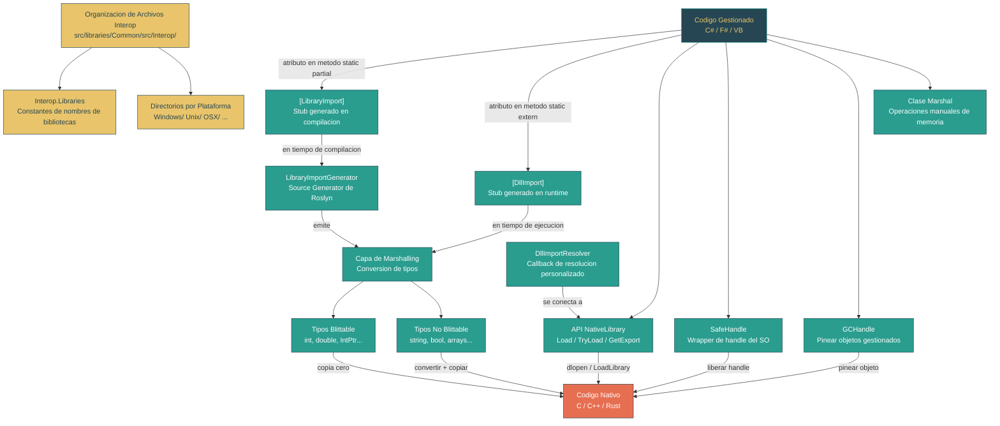

# Nivel 3: Avanzado -- Interop Nativo: P/Invoke y LibraryImport

> **Perfil objetivo:** Desarrollador que necesita llamar codigo nativo desde .NET o entender como la BCL lo hace internamente
> **Esfuerzo estimado:** 5 horas
> **Prerrequisitos:** Nivel 2 completo, Modulo 3.1 (Modelo de Memoria)
> [English version](../en/03-advanced-native-interop.md)

---

## Objetivos de Aprendizaje

Al completar este modulo, seras capaz de:

1. **Explicar** como .NET conecta codigo gestionado y nativo a traves de la capa de marshalling de P/Invoke, y trazar la ruta desde una llamada gestionada hasta el punto de entrada de la funcion nativa.
2. **Escribir** declaraciones `DllImport` correctas para APIs nativas comunes, incluyendo calling conventions, conjuntos de caracteres y manejo de errores.
3. **Migrar** de `DllImport` a `LibraryImport`, entendiendo por que el interop generado por source generators es preferible y que produce el generador.
4. **Clasificar** tipos como blittable o no blittable y elegir la estrategia de marshalling correcta para strings, structs, arrays y handles.
5. **Navegar** la organizacion de archivos Interop del repositorio `dotnet/runtime` -- el patron `Interop.Libraries`, directorios separados por plataforma y la convencion de una funcion por archivo.
6. **Usar** `NativeLibrary.Load`, `TryLoad`, `GetExport` y `SetDllImportResolver` para cargar bibliotecas nativas dinamicamente e implementar escenarios de plugins.
7. **Aplicar** `SafeHandle` y `GCHandle` correctamente para prevenir fugas de recursos y errores de pinning en codigo interop.
8. **Leer** codigo interop real en el fuente de `dotnet/runtime` y entender las decisiones de diseno detras de sus patrones.

---

## Mapa Conceptual



---

## Curriculo

### Leccion 3.10.1: La Arquitectura de Interop -- Como .NET Llama a Codigo Nativo

**Lo que vas a aprender:** La arquitectura general del sistema P/Invoke -- que ocurre cuando codigo gestionado llama a una funcion nativa, el rol de la capa de marshalling y por que existe esta frontera.

**El concepto:**

.NET ejecuta codigo gestionado dentro de un runtime (CoreCLR o Mono) que proporciona recoleccion de basura, seguridad de tipos y manejo de excepciones. El codigo nativo -- bibliotecas en C, C++, Rust, o APIs del sistema operativo -- se ejecuta fuera de este entorno gestionado. La frontera entre estos dos mundos se llama la "frontera de interop", y cruzarla requiere un protocolo preciso llamado Platform Invocation Services (P/Invoke).

Cuando llamas a una funcion nativa desde C#, el runtime debe:

1. **Localizar** la biblioteca nativa y el punto de entrada de la funcion (por nombre u ordinal).
2. **Hacer marshalling** de cada argumento, convirtiendo de su representacion gestionada a la representacion nativa que la funcion espera.
3. **Configurar el stack frame** segun la calling convention nativa (cdecl, stdcall, etc.).
4. **Transicionar** de ejecucion gestionada a nativa, pausando temporalmente el seguimiento del GC para el hilo actual.
5. **Invocar** la funcion nativa.
6. **Hacer marshalling** del valor de retorno y parametros de salida de vuelta a tipos gestionados.
7. **Capturar** codigos de error (`GetLastError` en Windows, `errno` en Unix) si se solicito.
8. **Transicionar** de vuelta a ejecucion gestionada.

Este proceso se llama el "stub de P/Invoke". Tradicionalmente, el runtime genera este stub en tiempo de ejecucion usando el compilador JIT. Con `LibraryImport`, el stub se genera en tiempo de compilacion mediante un source generator de Roslyn.

**La capa de marshalling** es la parte mas compleja. Algunos tipos -- llamados tipos **blittable** -- tienen layouts identicos en memoria gestionada y nativa: `int`, `long`, `double`, `IntPtr`, y structs compuestos solo de campos blittable. Estos pueden pasarse directamente sin copia alguna. Los tipos no blittable como `string`, `bool` (1 byte en .NET, 4 bytes como BOOL de C en Windows), y arrays de tipos por referencia requieren conversion, copia y a veces asignacion de memoria.

**Exploracion del codigo fuente:**

Abre `src/libraries/System.Private.CoreLib/src/System/Runtime/InteropServices/Marshal.cs` y observa la declaracion de la clase:

```csharp
// src/libraries/System.Private.CoreLib/src/System/Runtime/InteropServices/Marshal.cs
public static partial class Marshal
{
    /// The default character size for the system. This is always 2 because
    /// the framework only runs on UTF-16 systems.
    public static readonly int SystemDefaultCharSize = 2;
```

Nota que `SystemDefaultCharSize = 2` -- las strings de .NET siempre son UTF-16 internamente. Cada llamada interop que pasa un string a una funcion nativa esperando `char*` (ANSI) o `char8_t*` (UTF-8) debe realizar una conversion. Este unico hecho impulsa gran parte de la complejidad del marshalling.

**Punto clave:** La frontera de interop es una **frontera de confianza**. El codigo gestionado tiene garantias de seguridad de tipos; el codigo nativo no. Una declaracion P/Invoke incorrecta -- tipos de parametros equivocados, calling convention incorrecta, marshalling de strings erroneo -- no causara un error de compilacion. Causara corrupcion del stack, violaciones de acceso o corrupcion silenciosa de datos en tiempo de ejecucion. Por esto el codigo de `dotnet/runtime` es tan meticuloso con sus declaraciones interop.

<details>
<summary>Preguntas de reflexion</summary>

- Por que el runtime no puede simplemente llamar funciones nativas directamente sin una capa de marshalling?
- Que pasaria si el GC moviera un objeto gestionado mientras el codigo nativo mantiene un puntero hacia el?
- Por que .NET usa UTF-16 internamente cuando la mayoria de las APIs del SO (en Unix) usan UTF-8?

</details>

---

### Leccion 3.10.2: DllImport -- La Forma Clasica

**Lo que vas a aprender:** Como funciona `DllImport`, sus parametros y limitaciones, y por que el runtime genera el stub de interop en tiempo de ejecucion.

**El concepto:**

`DllImport` ha sido el mecanismo estandar de P/Invoke desde .NET Framework 1.0. Mira la definicion del atributo:

```csharp
// src/libraries/System.Private.CoreLib/src/System/Runtime/InteropServices/DllImportAttribute.cs
[AttributeUsage(AttributeTargets.Method, Inherited = false)]
public sealed class DllImportAttribute : Attribute
{
    public DllImportAttribute(string dllName)
    {
        Value = dllName;
    }

    public string Value { get; }

    public string? EntryPoint;
    public CharSet CharSet;
    public bool SetLastError;
    public bool ExactSpelling;
    public CallingConvention CallingConvention;
    public bool BestFitMapping;
    public bool PreserveSig;
    public bool ThrowOnUnmappableChar;
}
```

Una declaracion tipica de `DllImport` se ve asi:

```csharp
[DllImport("kernel32.dll", SetLastError = true, CharSet = CharSet.Unicode)]
static extern SafeFileHandle CreateFileW(
    string lpFileName,
    int dwDesiredAccess,
    FileShare dwShareMode,
    IntPtr lpSecurityAttributes,
    FileMode dwCreationDisposition,
    int dwFlagsAndAttributes,
    IntPtr hTemplateFile);
```

Parametros clave:

- **`EntryPoint`**: El nombre de la funcion exportada. Si se omite, se usa el nombre del metodo. En Windows, `CharSet.Unicode` agrega "W" (wide) automaticamente a menos que `ExactSpelling = true`.
- **`CharSet`**: Controla como se hace marshalling de los parametros `string`. `CharSet.Unicode` significa UTF-16, `CharSet.Ansi` significa la code page ANSI del sistema. Es un concepto legacy -- `LibraryImport` usa el enum `StringMarshalling` que es mas claro.
- **`SetLastError`**: Si es `true`, el runtime captura `GetLastError()` (Windows) o `errno` (Unix) inmediatamente despues de que retorna la llamada nativa, antes de que cualquier otro codigo pueda sobreescribirlo. Lo recuperas con `Marshal.GetLastPInvokeError()`.
- **`CallingConvention`**: Por defecto es `CallingConvention.Winapi` (que se resuelve a `StdCall` en Windows, `Cdecl` en Unix). Equivocarse en esto corrompe el stack.
- **`PreserveSig`**: Para interop COM. Cuando es `false`, el runtime transforma un valor de retorno `HRESULT` en una excepcion.

**El patron `static extern`:** Los metodos `DllImport` se declaran como `static extern` -- sin cuerpo de metodo. El compilador JIT genera el stub de marshalling en el punto de la primera llamada. Esto significa:

1. El comportamiento de marshalling no es visible en el codigo fuente.
2. El stub generado no puede ser inspeccionado, depurado o compilado AOT facilmente.
3. Las herramientas de trimming no pueden analizar lo que el stub necesita, haciendolo hostil a escenarios de trimming/NativeAOT.

**Por que `DllImport` esta siendo reemplazado:** En .NET moderno (7+), tres fuerzas impulsan la migracion:

1. **NativeAOT y trimming**: La generacion de stubs en runtime entra en conflicto con la compilacion ahead-of-time.
2. **Source generators**: Los source generators de Roslyn pueden producir los mismos stubs en tiempo de compilacion.
3. **Claridad**: `LibraryImport` hace el marshalling explicito e inspeccionable.

El codebase de `dotnet/runtime` ha sido migrado casi por completo a `LibraryImport`. Una busqueda de `[DllImport]` en `src/libraries/Common/src/Interop/` para el directorio Kernel32 no devuelve resultados -- todo ha sido convertido.

<details>
<summary>Preguntas de reflexion</summary>

- Que pasa si declaras `CallingConvention.Cdecl` pero la funcion nativa usa `StdCall`?
- Por que `DllImport` ofrece tanto `CharSet.Ansi` como `CharSet.Unicode` cuando las strings de .NET siempre son UTF-16?
- Cual es el riesgo de olvidar `SetLastError = true` en una funcion que establece el ultimo error?

</details>

---

### Leccion 3.10.3: LibraryImport -- P/Invoke Generado por Source Generator

**Lo que vas a aprender:** Como `LibraryImport` reemplaza a `DllImport` con un source generator que produce codigo de marshalling visible, recortable y compatible con AOT.

**El concepto:**

`LibraryImport` es el reemplazo moderno de `DllImport`, introducido en .NET 7. En lugar de `static extern`, escribis `static partial`:

```csharp
// src/libraries/Common/src/Interop/Windows/Kernel32/Interop.WaitForSingleObject.cs
internal static partial class Interop
{
    internal static partial class Kernel32
    {
        [LibraryImport(Libraries.Kernel32, SetLastError = true)]
        internal static partial int WaitForSingleObject(SafeWaitHandle handle, int timeout);
    }
}
```

Compara con como se declara `CreateFile`:

```csharp
// src/libraries/Common/src/Interop/Windows/Kernel32/Interop.CreateFile.cs
[LibraryImport(Libraries.Kernel32, EntryPoint = "CreateFileW",
               SetLastError = true, StringMarshalling = StringMarshalling.Utf16)]
private static unsafe partial SafeFileHandle CreateFilePrivate(
    string lpFileName,
    int dwDesiredAccess,
    FileShare dwShareMode,
    SECURITY_ATTRIBUTES* lpSecurityAttributes,
    FileMode dwCreationDisposition,
    int dwFlagsAndAttributes,
    IntPtr hTemplateFile);
```

Mira la definicion de `LibraryImportAttribute`:

```csharp
// src/libraries/System.Private.CoreLib/src/System/Runtime/InteropServices/LibraryImportAttribute.cs
public sealed class LibraryImportAttribute : Attribute
{
    public LibraryImportAttribute(string libraryName) { LibraryName = libraryName; }
    public string LibraryName { get; }
    public string? EntryPoint { get; set; }
    public StringMarshalling StringMarshalling { get; set; }
    public Type? StringMarshallingCustomType { get; set; }
    public bool SetLastError { get; set; }
}
```

Nota lo que **falta** comparado con `DllImport`:

- **No hay `CharSet`** -- reemplazado por el enum explicito `StringMarshalling` (`Utf8`, `Utf16`, `Custom`).
- **No hay `CallingConvention`** -- se usa el atributo `[UnmanagedCallConv]` en su lugar (mas flexible, soporta `SuppressGCTransition`).
- **No hay `BestFitMapping` / `ThrowOnUnmappableChar`** -- estas opciones legacy de mapeo ANSI desaparecieron.
- **No hay `ExactSpelling`** -- el nombre del metodo o `EntryPoint` siempre se usa exactamente.

**Lo que produce el generador:**

El `LibraryImportGenerator` (en `src/libraries/System.Runtime.InteropServices/gen/LibraryImportGenerator/LibraryImportGenerator.cs`) es un `IIncrementalGenerator` de Roslyn. Para cada metodo `[LibraryImport]`, emite una segunda implementacion del metodo parcial que contiene:

1. Una declaracion `[DllImport]` con parametros solo blittable (la llamada nativa "cruda").
2. Codigo de marshalling que convierte parametros gestionados a sus equivalentes blittable antes de la llamada.
3. Codigo de unmarshalling que convierte valores de retorno y parametros de salida nativos despues de la llamada.
4. Logica de captura de errores si `SetLastError = true`.
5. Logica de limpieza en bloques `finally` para memoria asignada.

Para un caso simple como `WaitForSingleObject(SafeWaitHandle, int)`, el codigo generado maneja la extraccion del `IntPtr` crudo del `SafeWaitHandle`, incrementa su conteo de referencias, hace la llamada nativa y decrementa el conteo de referencias en un bloque `finally`.

Para parametros string, el codigo generado asigna memoria en stack o heap, convierte el string a la codificacion objetivo, llama a la funcion nativa y libera la memoria.

**Por que esto es mejor:**

1. **Visible**: Podes inspeccionar el codigo generado en tu IDE (busca en el nodo Analyzers).
2. **Recortable**: El trimmer puede analizar el codigo generado y eliminar rutas de marshalling no usadas.
3. **Compatible con AOT**: No se necesita generacion de codigo en runtime.
4. **Depurable**: Podes poner breakpoints en el codigo de marshalling generado.

**Migracion desde DllImport:**

La transformacion es mecanica:
- `static extern` se convierte en `static partial`
- `[DllImport("lib")]` se convierte en `[LibraryImport("lib")]`
- `CharSet.Unicode` se convierte en `StringMarshalling = StringMarshalling.Utf16`
- `CharSet.Ansi` se convierte en `StringMarshalling = StringMarshalling.Utf8` (en Unix) o marshalling personalizado

Hay un analyzer (`SYSLIB1054`) que sugiere la migracion y un code fixer que la realiza automaticamente.

<details>
<summary>Preguntas de reflexion</summary>

- Por que el generador emite un `[DllImport]` oculto internamente? Que te dice esto sobre la relacion entre los dos mecanismos?
- Que ventaja tiene `StringMarshalling.Utf8` sobre `CharSet.Ansi`?
- Por que el generador no puede manejar metodos genericos?

</details>

---

### Leccion 3.10.4: Marshalling -- Tipos Cruzando la Frontera

**Lo que vas a aprender:** Las reglas para pasar datos entre codigo gestionado y nativo, incluyendo tipos blittable, marshalling de strings, SafeHandle, GCHandle y layout de structs.

**El concepto:**

**Tipos blittable** tienen un layout de memoria identico en codigo gestionado y no gestionado. El runtime puede pasarlos por referencia sin copiar:

| Blittable | No Blittable |
|---|---|
| `byte`, `sbyte` | `bool` (gestionado: 1 byte, BOOL de C en Windows: 4 bytes) |
| `short`, `ushort` | `char` (gestionado: 2 bytes, C: 1 byte) |
| `int`, `uint` | `string` (gestionado: objeto con prefijo de longitud) |
| `long`, `ulong` | Arrays de tipos no blittable |
| `float`, `double` | Delegates |
| `IntPtr`, `UIntPtr` | Clases |
| `nint`, `nuint` | |
| Structs de solo campos blittable | |
| Punteros (`int*`, `void*`) | |

**Marshalling de strings** es la fuente mas comun de bugs de interop. En el codebase de `dotnet/runtime`, podes ver tres enfoques:

```csharp
// UTF-16 para APIs de Windows (la mayoria de APIs Win32 usan wide strings)
[LibraryImport(Libraries.Kernel32, EntryPoint = "CreateFileW",
               StringMarshalling = StringMarshalling.Utf16)]

// UTF-8 para APIs de Unix (POSIX usa strings UTF-8/bytes)
[LibraryImport(Libraries.SystemNative, EntryPoint = "SystemNative_GetNativeIPInterfaceStatistics",
               StringMarshalling = StringMarshalling.Utf8)]

// Sin marshalling de strings necesario (solo parametros numericos/punteros)
[LibraryImport(Libraries.Kernel32, SetLastError = true)]
internal static partial int WaitForSingleObject(SafeWaitHandle handle, int timeout);
```

**SafeHandle -- la forma correcta de mantener handles nativos:**

`SafeHandle` es una clase abstracta que envuelve un handle del SO (`IntPtr`) y asegura que se libere incluso si ocurre una excepcion o el GC recolecta el objeto:

```csharp
// src/libraries/System.Private.CoreLib/src/System/Runtime/InteropServices/SafeHandle.cs
public abstract partial class SafeHandle : CriticalFinalizerObject, IDisposable
{
    protected IntPtr handle;
    private volatile int _state;  // conteo de refs + flags de cerrado/dispuesto
    private readonly bool _ownsHandle;
```

El runtime tiene conocimiento especial de `SafeHandle`. Cuando pasas un `SafeHandle` como parametro de P/Invoke, el runtime:
1. Incrementa el conteo de referencias del handle.
2. Extrae el `IntPtr` crudo para la llamada nativa.
3. Decrementa el conteo de referencias en un bloque `finally`.
4. Evita que el handle sea cerrado mientras la llamada nativa esta en curso.

Por esto el codigo de `dotnet/runtime` pasa `SafeHandle` y `SafeFileHandle` en lugar de `IntPtr` crudo donde sea posible -- mira la declaracion de `WriteFile`:

```csharp
// src/libraries/Common/src/Interop/Windows/Kernel32/Interop.WriteFile_SafeHandle_IntPtr.cs
[LibraryImport(Libraries.Kernel32, SetLastError = true)]
internal static unsafe partial int WriteFile(
    SafeHandle handle,    // No IntPtr!
    byte* bytes,
    int numBytesToWrite,
    out int numBytesWritten,
    IntPtr mustBeZero);
```

**GCHandle -- pinear objetos gestionados:**

Cuando el codigo nativo necesita un puntero a un objeto gestionado (por ejemplo, un array de bytes que se escribe a un socket), el GC no debe mover ese objeto. `GCHandle` con `GCHandleType.Pinned` previene esto:

```csharp
// src/libraries/System.Private.CoreLib/src/System/Runtime/InteropServices/GCHandle.cs
public partial struct GCHandle : IEquatable<GCHandle>
{
    private IntPtr _handle;
    // Cuatro tipos: Normal, Weak, WeakTrackResurrection, Pinned
```

- `GCHandleType.Normal`: Evita la recoleccion pero no pinea. Se usa cuando codigo nativo almacena una referencia a un callback.
- `GCHandleType.Pinned`: Evita la recoleccion Y el movimiento. Requerido cuando codigo nativo necesita un puntero estable. Solo funciona con tipos blittable y arrays.
- `GCHandleType.Weak` / `WeakTrackResurrection`: Permite la recoleccion. Se usa para caches o tablas de callbacks.

**Layout de structs:**

Para structs pasados a codigo nativo, usa `[StructLayout]` para controlar el layout en memoria:

```csharp
[StructLayout(LayoutKind.Sequential)]  // Campos en orden de declaracion (default para structs)
struct POINT { public int X; public int Y; }

[StructLayout(LayoutKind.Explicit)]    // Offsets manuales (para unions)
struct OVERLAPPED_UNION
{
    [FieldOffset(0)] public uint Offset;
    [FieldOffset(4)] public uint OffsetHigh;
    [FieldOffset(0)] public IntPtr Pointer;  // Se superpone con Offset/OffsetHigh
}
```

<details>
<summary>Preguntas de reflexion</summary>

- Por que `bool` no es blittable? Que hace el atributo `[MarshalAs(UnmanagedType.U1)]` para este tipo?
- Que pasa si pasas un `SafeHandle` a una funcion nativa que almacena el handle para uso posterior (mas alla de la duracion de la llamada)?
- Por que `GCHandle.Alloc` con `GCHandleType.Pinned` lanza una excepcion para tipos no blittable?

</details>

---

### Leccion 3.10.5: El Patron Interop en dotnet/runtime

**Lo que vas a aprender:** Como el repositorio `dotnet/runtime` organiza sus miles de declaraciones de interop nativo en una estructura mantenible y multiplataforma.

**El concepto:**

El repositorio `dotnet/runtime` llama a cientos de funciones nativas a traves de Windows, Linux, macOS, FreeBSD, Android, iOS y WebAssembly. Todas las declaraciones interop viven bajo un unico arbol de directorios:

```
src/libraries/Common/src/Interop/
    Interop.Brotli.cs              # Multiplataforma (wrappers delgados)
    Interop.zlib.cs
    Interop.Calendar.cs
    Interop.Calendar.iOS.cs        # Variante de plataforma
    Windows/
        Interop.Libraries.cs       # Constantes de nombres de bibliotecas para Windows
        Interop.BOOL.cs            # Tipos compartidos de Windows
        Interop.Errors.cs          # Constantes de errores Win32
        Kernel32/                  # Un directorio por DLL
            Interop.CreateFile.cs  # Un archivo por funcion (generalmente)
            Interop.WriteFile_SafeHandle_IntPtr.cs
            Interop.WaitForSingleObject.cs
            ...
        Advapi32/
        BCrypt/
        ...
    Unix/
        Interop.Libraries.cs       # Constantes de nombres de bibliotecas para Unix
        Interop.Errors.cs          # Constantes de errno
        System.Native/             # Un directorio por biblioteca shim
            Interop.Write.cs
            Interop.Read.cs
            ...
        System.Security.Cryptography.Native/
        ...
    OSX/
    Linux/
    Android/
    BSD/
    Browser/
    Wasi/
```

**Patron 1: Interop.Libraries -- nombres de bibliotecas centralizados.**

Cada plataforma tiene una clase parcial `Interop.Libraries` (por ejemplo, `src/libraries/Common/src/Interop/Windows/Interop.Libraries.cs`) que define constantes para todos los nombres de bibliotecas nativas:

```csharp
// src/libraries/Common/src/Interop/Windows/Interop.Libraries.cs
internal static partial class Interop
{
    internal static partial class Libraries
    {
        internal const string Kernel32 = "kernel32.dll";
        internal const string Advapi32 = "advapi32.dll";
        internal const string BCrypt = "BCrypt.dll";
        internal const string Ws2_32 = "ws2_32.dll";
        internal const string CompressionNative = "System.IO.Compression.Native";
        // ... ~50 entradas
    }
}
```

```csharp
// src/libraries/Common/src/Interop/Unix/Interop.Libraries.cs
internal static partial class Interop
{
    internal static partial class Libraries
    {
        internal const string libc = "libc";
        internal const string SystemNative = "libSystem.Native";
        internal const string CryptoNative = "libSystem.Security.Cryptography.Native.OpenSsl";
        internal const string CompressionNative = "libSystem.IO.Compression.Native";
        // ... ~10 entradas
    }
}
```

Cada declaracion P/Invoke referencia `Libraries.Kernel32` o `Libraries.SystemNative` en lugar de un literal de string. Esto hace trivial cambiar un nombre de biblioteca globalmente y previene errores tipograficos.

**Patron 2: Una funcion por archivo.**

Cada funcion interop (o pequeno grupo de sobrecargas relacionadas) obtiene su propio archivo nombrado `Interop.<NombreFuncion>.cs`. Esto tiene varios beneficios:

- **Inclusion MSBuild**: Los proyectos individuales de biblioteca incluyen solo los archivos interop que necesitan via items `<Compile Include="..." />`. Una biblioteca que llama a `CreateFile` y `WriteFile` incluye esos dos archivos; no arrastra `ReadFile` ni `DeleteFile`.
- **Code review**: Los cambios a una llamada nativa estan aislados en un archivo.
- **Referencia cruzada**: Buscar `Interop.CreateFile.cs` encuentra la declaracion instantaneamente.

**Patron 3: Clases parciales anidadas.**

Todas las declaraciones interop comparten la misma estructura de clases parciales:

```csharp
internal static partial class Interop
{
    internal static partial class Kernel32  // o Sys, Advapi32, etc.
    {
        [LibraryImport(...)]
        internal static partial TipoRetorno NombreFuncion(params...);
    }
}
```

Como todo es `partial`, una biblioteca puede incluir archivos de multiples directorios y todos se fusionan en una unica clase `Interop` en tiempo de compilacion. Por ejemplo, `System.IO.FileSystem` podria incluir:
- `Interop/Windows/Kernel32/Interop.CreateFile.cs`
- `Interop/Windows/Kernel32/Interop.WriteFile_SafeHandle_IntPtr.cs`
- `Interop/Windows/Kernel32/Interop.CloseHandle.cs`
- `Interop/Unix/System.Native/Interop.Write.cs`
- `Interop/Unix/System.Native/Interop.Open.cs`

Las condiciones de MSBuild seleccionan los archivos correctos de la plataforma.

**Patron 4: Manejo de errores especifico de plataforma.**

Los codigos de error de Windows viven en `Interop/Windows/Interop.Errors.cs` como constantes con nombre:

```csharp
// src/libraries/Common/src/Interop/Windows/Interop.Errors.cs
internal static partial class Interop
{
    internal static partial class Errors
    {
        internal const int ERROR_SUCCESS = 0x0;
        internal const int ERROR_FILE_NOT_FOUND = 0x2;
        internal const int ERROR_ACCESS_DENIED = 0x5;
        // ... ~100+ constantes
    }
}
```

Los codigos de error de Unix siguen un patron similar en `Interop/Unix/Interop.Errors.cs`.

**Patron 5: Wrapper gestionado sobre llamada nativa privada.**

A veces la llamada nativa necesita preprocesamiento. En lugar de exponer el P/Invoke crudo, el patron es hacer la llamada nativa `private` y proporcionar un wrapper gestionado:

```csharp
// src/libraries/Common/src/Interop/Windows/Kernel32/Interop.CreateFile.cs
[LibraryImport(Libraries.Kernel32, EntryPoint = "CreateFileW",
               SetLastError = true, StringMarshalling = StringMarshalling.Utf16)]
private static unsafe partial SafeFileHandle CreateFilePrivate(
    string lpFileName, int dwDesiredAccess, FileShare dwShareMode,
    SECURITY_ATTRIBUTES* lpSecurityAttributes,
    FileMode dwCreationDisposition, int dwFlagsAndAttributes, IntPtr hTemplateFile);

internal static unsafe SafeFileHandle CreateFile(
    string lpFileName, int dwDesiredAccess, FileShare dwShareMode,
    SECURITY_ATTRIBUTES* lpSecurityAttributes,
    FileMode dwCreationDisposition, int dwFlagsAndAttributes, IntPtr hTemplateFile)
{
    lpFileName = PathInternal.EnsureExtendedPrefixIfNeeded(lpFileName);
    return CreateFilePrivate(lpFileName, dwDesiredAccess, dwShareMode,
        lpSecurityAttributes, dwCreationDisposition, dwFlagsAndAttributes, hTemplateFile);
}
```

Aqui `CreateFilePrivate` es el P/Invoke crudo; `CreateFile` (la API interna) agrega el prefijo de rutas largas `\\?\` antes de llamarlo. Este patron mantiene la frontera nativa limpia mientras agrega logica gestionada necesaria.

<details>
<summary>Preguntas de reflexion</summary>

- Por que el repositorio prefiere una funcion por archivo en lugar de agrupar todas las funciones de Kernel32 en un unico archivo?
- Como permite el mecanismo de `partial class` que una unica clase `Interop.Kernel32` se distribuya en cientos de archivos?
- Por que los archivos interop estan bajo `Common/src/` en lugar de dentro del directorio `src/` de cada biblioteca?

</details>

---

### Leccion 3.10.6: NativeLibrary -- Carga Dinamica

**Lo que vas a aprender:** Como cargar bibliotecas nativas en runtime, resolver simbolos dinamicamente e implementar resolucion personalizada de bibliotecas para escenarios de plugins.

**El concepto:**

A veces no podes declarar un P/Invoke en tiempo de compilacion. La biblioteca podria no existir en todas las plataformas, su ruta podria ser configurable por el usuario, o podrias estar construyendo un sistema de plugins. La clase `NativeLibrary` proporciona la API de bajo nivel:

```csharp
// src/libraries/System.Private.CoreLib/src/System/Runtime/InteropServices/NativeLibrary.cs
public static partial class NativeLibrary
{
    // Cargar por ruta -- envuelve dlopen (Unix) / LoadLibrary (Windows)
    public static IntPtr Load(string libraryPath);
    public static bool TryLoad(string libraryPath, out IntPtr handle);

    // Cargar con logica de busqueda -- usa las rutas de sondeo del runtime
    public static IntPtr Load(string libraryName, Assembly assembly, DllImportSearchPath? searchPath);
    public static bool TryLoad(string libraryName, Assembly assembly,
                               DllImportSearchPath? searchPath, out IntPtr handle);

    // Obtener un puntero a funcion -- envuelve dlsym (Unix) / GetProcAddress (Windows)
    public static IntPtr GetExport(IntPtr handle, string name);
    public static bool TryGetExport(IntPtr handle, string name, out IntPtr address);

    // Liberar una biblioteca cargada
    public static void Free(IntPtr handle);

    // Registrar un resolver personalizado para las llamadas P/Invoke de un assembly
    public static void SetDllImportResolver(Assembly assembly, DllImportResolver resolver);
}
```

**Patron de carga dinamica:**

```csharp
// Cargar una biblioteca, obtener un puntero a funcion y llamarla
IntPtr lib = NativeLibrary.Load("mylib");
try
{
    IntPtr funcPtr = NativeLibrary.GetExport(lib, "my_function");
    // Convertir a un delegate y llamar
    var myFunction = Marshal.GetDelegateForFunctionPointer<MyFunctionDelegate>(funcPtr);
    int result = myFunction(42);
}
finally
{
    NativeLibrary.Free(lib);
}
```

**Resolucion personalizada con `SetDllImportResolver`:**

Esta es la caracteristica mas poderosa. Podes interceptar todas las cargas de bibliotecas P/Invoke para un assembly y redirigirlas:

```csharp
NativeLibrary.SetDllImportResolver(typeof(MyClass).Assembly, (name, assembly, searchPath) =>
{
    if (name == "mylib")
    {
        // Intentar una ruta personalizada primero
        if (NativeLibrary.TryLoad("/opt/mylibs/libmy.so", out IntPtr handle))
            return handle;
    }
    // Caer a la resolucion por defecto
    return IntPtr.Zero;
});
```

Esto se usa en el propio `dotnet/runtime`. La firma del delegate `DllImportResolver` coincide con:

```csharp
// src/libraries/System.Private.CoreLib/src/System/Runtime/InteropServices/NativeLibrary.cs
public delegate IntPtr DllImportResolver(string libraryName,
                                         Assembly assembly,
                                         DllImportSearchPath? searchPath);
```

**Orden de resolucion** (cuando una llamada P/Invoke dispara la carga de una biblioteca):

1. El `DllImportResolver` por assembly registrado via `SetDllImportResolver` (si existe).
2. `AssemblyLoadContext.LoadUnmanagedDll`.
3. La busqueda por defecto del cargador del SO (respetando los flags de `DllImportSearchPath`).
4. `AssemblyLoadContext.ResolvingUnmanagedDllEvent`.

**Escenario de plugins:**

```csharp
// Un host de plugins que carga diferentes backends nativos
public static class PluginHost
{
    public static void Initialize(string backendPath)
    {
        NativeLibrary.SetDllImportResolver(
            typeof(PluginHost).Assembly,
            (name, assembly, path) =>
            {
                if (name == "backend")
                {
                    return NativeLibrary.Load(
                        Path.Combine(backendPath, GetPlatformLibName("backend")));
                }
                return IntPtr.Zero;
            });
    }

    private static string GetPlatformLibName(string name) =>
        RuntimeInformation.IsOSPlatform(OSPlatform.Windows) ? $"{name}.dll" :
        RuntimeInformation.IsOSPlatform(OSPlatform.OSX) ? $"lib{name}.dylib" :
        $"lib{name}.so";
}
```

**Importante:** `SetDllImportResolver` solo puede llamarse una vez por assembly. Una segunda llamada lanza `InvalidOperationException`. La implementacion de `NativeLibrary` almacena el resolver en un `ConditionalWeakTable<Assembly, DllImportResolver>`, asi que el resolver se recolecta cuando el assembly se descarga.

<details>
<summary>Preguntas de reflexion</summary>

- Por que `NativeLibrary.Load` retorna un `IntPtr` en lugar de un `SafeHandle`?
- En que escenario usarias `TryLoad` en lugar de `Load`?
- Por que `SetDllImportResolver` esta limitado a un resolver por assembly?

</details>

---

## Preguntas de Autoevaluacion

### Pregunta 1: Cual es la diferencia fundamental entre `DllImport` y `LibraryImport` en terminos de cuando se genera el stub de marshalling?

<details>
<summary>Mostrar respuesta</summary>

`DllImport` genera el stub de marshalling en **tiempo de ejecucion** usando el compilador JIT. La primera vez que llamas a un metodo `DllImport`, el JIT crea un "stub de P/Invoke" que maneja el marshalling de argumentos, la transicion gestionado-a-nativo y la captura de errores.

`LibraryImport` genera el stub de marshalling en **tiempo de compilacion** usando el source generator `LibraryImportGenerator` de Roslyn. El codigo generado es visible en la salida del proyecto, puede depurarse, es compatible con compilacion AOT y puede ser analizado por el trimmer. Internamente, el codigo generado emite una declaracion `DllImport` con solo parametros blittable como mecanismo real de llamada nativa.

</details>

### Pregunta 2: Por que el codebase de `dotnet/runtime` usa `SafeHandle` en lugar de `IntPtr` para handles nativos en firmas P/Invoke?

<details>
<summary>Mostrar respuesta</summary>

`SafeHandle` proporciona tres garantias criticas que `IntPtr` no tiene:

1. **Proteccion con conteo de referencias durante llamadas P/Invoke**: El runtime incrementa el conteo de referencias del handle antes de la llamada nativa y lo decrementa en un bloque `finally`, evitando que el handle sea cerrado mientras la funcion nativa lo esta usando.
2. **Limpieza garantizada via el finalizador**: `SafeHandle` hereda de `CriticalFinalizerObject`, asegurando que `ReleaseHandle()` se ejecute incluso durante una excepcion no manejada o descarga de `AppDomain`.
3. **Prevencion de condiciones de carrera**: La maquina de estados (flags de cerrado/dispuesto + conteo de refs en un unico `volatile int`) previene bugs de doble liberacion y uso despues de cerrar que son comunes con `IntPtr` crudo.

</details>

### Pregunta 3: Explica el patron `Interop.Libraries` y por que existe.

<details>
<summary>Mostrar respuesta</summary>

Cada plataforma tiene una clase parcial `Interop.Libraries` (por ejemplo, `src/libraries/Common/src/Interop/Windows/Interop.Libraries.cs`) que define campos `const string` para cada nombre de biblioteca nativa:

```csharp
internal const string Kernel32 = "kernel32.dll";
internal const string SystemNative = "libSystem.Native";
```

Cada atributo `[LibraryImport]` referencia estas constantes (`Libraries.Kernel32`) en lugar de literales de string. Esto existe porque:

1. **Unica fuente de verdad**: Si un nombre de biblioteca cambia (o difiere por configuracion de build), solo un archivo necesita actualizarse.
2. **Validacion en compilacion**: Un error tipografico en `Libraries.Kerne132` falla en compilacion; un error en `"kerne132.dll"` falla en runtime.
3. **Buscabilidad**: Podes encontrar todos los llamadores de una biblioteca particular buscando el nombre de la constante.
4. **Separacion de plataformas**: Windows y Unix tienen archivos `Interop.Libraries.cs` diferentes, y MSBuild incluye el correcto. La misma constante `Libraries.CompressionNative` se resuelve a `"System.IO.Compression.Native"` en Windows y `"libSystem.IO.Compression.Native"` en Unix.

</details>

### Pregunta 4: Que hace que un tipo sea "blittable" y por que importa para el rendimiento de P/Invoke?

<details>
<summary>Mostrar respuesta</summary>

Un tipo es blittable cuando su representacion en memoria gestionada es identica a su representacion en memoria no gestionada. Esto incluye: `byte`, `sbyte`, `short`, `ushort`, `int`, `uint`, `long`, `ulong`, `float`, `double`, `nint`/`IntPtr`, `nuint`/`UIntPtr`, punteros y structs compuestos exclusivamente de campos blittable con `LayoutKind.Sequential` o `LayoutKind.Explicit`.

Los tipos blittable importan porque:

1. **Pasaje sin copia**: El runtime puede pasar un puntero directamente a los datos gestionados sin asignar ni copiar. Para un buffer `Span<byte>` o `byte*`, esto significa que la funcion nativa lee/escribe la misma memoria.
2. **Sin overhead de marshalling**: Los tipos no blittable requieren que el runtime asigne memoria nativa temporal, copie/convierta los datos, llame a la funcion nativa, luego copie/convierta de vuelta y libere la memoria.
3. **El pinning es posible**: Solo los tipos blittable pueden ser pineados con `GCHandle.Alloc(..., GCHandleType.Pinned)` o sentencias `fixed`, porque su layout de bytes es significativo para codigo nativo.

"Gotchas" comunes: `bool` no es blittable (1 byte gestionado, 4 bytes como BOOL de Windows), `char` no es blittable (2 bytes gestionado, 1 byte en ANSI C), y `string` nunca es blittable (es un objeto gestionado con header, longitud y terminador nulo en una posicion diferente a strings de C).

</details>

### Pregunta 5: Describe el orden de resolucion cuando una llamada P/Invoke necesita cargar una biblioteca nativa.

<details>
<summary>Mostrar respuesta</summary>

Cuando se llama a un metodo P/Invoke y la biblioteca nativa no ha sido cargada aun, el runtime sigue este orden de resolucion:

1. **DllImportResolver por assembly**: Si se llamo a `NativeLibrary.SetDllImportResolver` para el assembly que hace la llamada, ese callback se invoca primero. Si retorna un handle distinto de cero, la resolucion se detiene.
2. **AssemblyLoadContext.LoadUnmanagedDll**: El `AssemblyLoadContext` del assembly que hace la llamada tiene la oportunidad de cargar la biblioteca. Los ALCs personalizados pueden sobrescribir esto.
3. **Sondeo por defecto del SO**: El runtime usa el cargador del SO (`LoadLibrary` en Windows, `dlopen` en Unix) con las rutas de busqueda especificadas por atributos `DllImportSearchPath` en el metodo o assembly. Esto incluye el directorio de la aplicacion, directorios del sistema y `PATH`/`LD_LIBRARY_PATH`.
4. **AssemblyLoadContext.ResolvingUnmanagedDllEvent**: Como ultimo recurso, el runtime dispara este evento, permitiendo a cualquier suscriptor proporcionar el handle de la biblioteca.

Si los cuatro pasos fallan, se lanza una `DllNotFoundException`.

</details>

### Pregunta 6: Por que `dotnet/runtime` organiza los archivos interop como una funcion por archivo bajo `Common/src/Interop/`?

<details>
<summary>Mostrar respuesta</summary>

Esta organizacion sirve multiples propositos:

1. **Inclusion selectiva**: Cada proyecto de biblioteca (por ejemplo, `System.IO.FileSystem`) incluye solo los archivos interop especificos que necesita via items MSBuild `<Compile Include="..." />`. Una biblioteca que llama a `CreateFile` y `WriteFile` no arrastra declaraciones para `CreateProcess` o `ReadFile`. Esto minimiza el tamano del binario y evita declaraciones P/Invoke no usadas.
2. **Compartido entre bibliotecas**: Al colocar archivos interop bajo `Common/src/` en lugar de dentro de cada biblioteca, multiples bibliotecas pueden compartir las mismas declaraciones. `System.IO.FileSystem` y `System.IO.Pipes` ambos necesitan `Interop.Kernel32.CloseHandle` -- incluyen el mismo archivo.
3. **Aislamiento de plataforma**: La estructura de directorios (`Windows/Kernel32/`, `Unix/System.Native/`, `OSX/`) mantiene el codigo especifico de plataforma fisicamente separado. Las condiciones de MSBuild incluyen el arbol de directorios correcto basado en el SO objetivo.
4. **Claridad en code review**: Un PR que cambia la declaracion interop de `CreateFile` toca exactamente un archivo. Los revisores pueden ver inmediatamente que llamada nativa cambio y verificar la firma contra la documentacion de Win32.

</details>

---

### Desafio Practico (60-90 minutos)

**Construi un wrapper de interop nativo multiplataforma:**

1. **Crea una biblioteca C simple** (o usa una del sistema) con dos funciones exportadas:
   - Una funcion que toma un `int` y retorna un `int` (blittable, simple).
   - Una funcion que toma un string y retorna un string (requiere marshalling).

2. **Escribi declaraciones tanto `DllImport` como `LibraryImport`** para las mismas funciones. Compara:
   - La version `DllImport` usando `static extern` con `CharSet.Unicode`.
   - La version `LibraryImport` usando `static partial` con `StringMarshalling.Utf16`.

3. **Inspeccionaa el codigo generado**: Compila el proyecto y busca en `obj/Debug/net9.0/generated/` la salida del `LibraryImportGenerator`. Encuentra:
   - El `[DllImport]` oculto con parametros solo blittable.
   - El codigo de marshalling para conversion de strings.
   - El patron de limpieza `try/finally`.

4. **Escribi una subclase de `SafeHandle`** para tu biblioteca nativa (incluso si el handle es solo un puntero a memoria asignada):
   - Sobrescribi `ReleaseHandle()` para llamar a la funcion de limpieza de tu biblioteca.
   - Usala en una firma P/Invoke y verifica que se libera.

5. **Implementa `SetDllImportResolver`** para redirigir la carga de tu biblioteca a una ruta personalizada:
   - Registra un resolver que busque en un subdirectorio `native/`.
   - Verifica que la llamada P/Invoke tiene exito con el resolver y falla sin el (cuando la biblioteca no esta en la ruta de busqueda por defecto).

6. **Bonus**: Mira como `src/libraries/Common/src/Interop/Windows/Kernel32/Interop.CreateFile.cs` envuelve el P/Invoke crudo en un metodo gestionado. Implementa el mismo patron para una de tus funciones (por ejemplo, validar la entrada antes de llamar al codigo nativo).

---

## Conexiones

| Direccion | Modulo | Tema |
|---|---|---|
| **Prerrequisitos** | Modulo 3.1: Modelo de Memoria | Entender heap gestionado, stack, pinning, generaciones del GC |
| **Siguiente** | Modulo 3.11: Source Generators | Como funciona `LibraryImportGenerator` como generador incremental de Roslyn |
| **Relacionado** | Modulo 2.4: IDisposable y Gestion de Recursos | `SafeHandle` hereda de `CriticalFinalizerObject` e implementa `IDisposable` |
| **Relacionado** | Modulo 3.x: Codigo Unsafe y Span | Contexto `unsafe`, aritmetica de punteros, `Span<T>` en escenarios interop |
| **Relacionado** | Modulo 3.x: COM Interop | `ComInterfaceGenerator` usa la misma infraestructura de generacion de codigo fuente |
| **Indice** | [Indice del Learning Path](00-index.md) | Listado completo de modulos y autoevaluacion |

---

## Glosario

| Termino (EN) | Termino (ES) | Definicion |
|---|---|---|
| **P/Invoke** (Platform Invocation Services) | P/Invoke | El mecanismo por el cual codigo gestionado llama a funciones nativas (no gestionadas) exportadas desde bibliotecas compartidas (DLLs / .so / .dylib). |
| **Marshalling** | Marshalling | El proceso de convertir datos entre representaciones de memoria gestionada y no gestionada al cruzar la frontera de interop. |
| **Blittable type** | Tipo blittable | Un tipo cuyas representaciones de memoria gestionada y no gestionada son identicas, permitiendo pasaje sin copia a traves de la frontera de interop. |
| **Non-blittable type** | Tipo no blittable | Un tipo que requiere conversion o copia al pasarse a traves de la frontera de interop (por ejemplo, `string`, `bool`, `char`). |
| **DllImport** | DllImport | El atributo clasico para declarar metodos P/Invoke. El runtime genera el stub de marshalling en tiempo de ejecucion usando el JIT. |
| **LibraryImport** | LibraryImport | El atributo moderno (.NET 7+) para declarar metodos P/Invoke. Un source generator produce el stub de marshalling en tiempo de compilacion. |
| **LibraryImportGenerator** | LibraryImportGenerator | El source generator incremental de Roslyn que procesa atributos `[LibraryImport]` y emite codigo de marshalling. |
| **SafeHandle** | SafeHandle | Una clase abstracta que envuelve un handle nativo del SO con conteo de referencias, limpieza garantizada via `CriticalFinalizerObject` y proteccion contra condiciones de carrera. |
| **GCHandle** | GCHandle | Una struct que crea una raiz del GC hacia un objeto gestionado. `GCHandleType.Pinned` evita que el GC mueva el objeto, permitiendo a codigo nativo mantener un puntero estable. |
| **NativeLibrary** | NativeLibrary | Una clase estatica que provee APIs para cargar bibliotecas nativas (`Load`/`TryLoad`), resolver simbolos exportados (`GetExport`) y registrar resolvers personalizados (`SetDllImportResolver`). |
| **DllImportResolver** | DllImportResolver | Un tipo delegate usado con `NativeLibrary.SetDllImportResolver` para interceptar y personalizar la carga de bibliotecas nativas para un assembly. |
| **Calling convention** | Calling convention | El protocolo de como se pasan argumentos de funcion en el stack/registros y quien limpia el stack (por ejemplo, `cdecl`, `stdcall`). |
| **StringMarshalling** | StringMarshalling | Un enum (`Utf8`, `Utf16`, `Custom`) que especifica como se convierten parametros `string` para llamadas nativas en `[LibraryImport]`. |
| **Interop.Libraries** | Interop.Libraries | Una clase parcial en `dotnet/runtime` que define campos `const string` para nombres de bibliotecas nativas, usados por todas las declaraciones P/Invoke. |
| **SetLastError** | SetLastError | Una propiedad del atributo P/Invoke que le dice al runtime que capture el codigo de error nativo (`GetLastError`/`errno`) inmediatamente despues de que retorna la llamada nativa. |

---

## Referencias

| Recurso | Tipo | Que cubre |
|---|---|---|
| [Documentacion de P/Invoke](https://learn.microsoft.com/es-es/dotnet/standard/native-interop/pinvoke) | Docs oficiales | Guia completa de Platform Invocation Services |
| [Source generator de LibraryImport](https://learn.microsoft.com/es-es/dotnet/standard/native-interop/pinvoke-source-generation) | Docs oficiales | Guia de migracion de `DllImport` a `LibraryImport` |
| [Marshalling de tipos](https://learn.microsoft.com/es-es/dotnet/standard/native-interop/type-marshalling) | Docs oficiales | Reglas de como se convierten los tipos en la frontera de interop |
| [SafeHandle y CriticalHandle](https://learn.microsoft.com/es-es/dotnet/api/system.runtime.interopservices.safehandle) | Docs de API | Referencia de la clase SafeHandle y patrones de uso |
| [Clase NativeLibrary](https://learn.microsoft.com/es-es/dotnet/api/system.runtime.interopservices.nativelibrary) | Docs de API | Referencia de la API de carga dinamica de bibliotecas nativas |
| [Mejores practicas de interop](https://learn.microsoft.com/es-es/dotnet/standard/native-interop/best-practices) | Docs oficiales | Guias de rendimiento y correctitud para interop nativo |
| [Organizacion del codigo fuente de Interop](https://github.com/dotnet/runtime/tree/main/src/libraries/Common/src/Interop) | Codigo fuente | El arbol de directorios Interop discutido en la Leccion 5 |
| [Fuente del LibraryImportGenerator](https://github.com/dotnet/runtime/tree/main/src/libraries/System.Runtime.InteropServices/gen/LibraryImportGenerator) | Codigo fuente | El source generator de Roslyn que impulsa `[LibraryImport]` |
| [Stephen Toub -- Performance Improvements in .NET 7 (seccion Interop)](https://devblogs.microsoft.com/dotnet/performance_improvements_in_net_7/#interop) | Blog | Analisis profundo de los beneficios de rendimiento de LibraryImport y la migracion |
| [Adam Sitnik -- Manejo de bibliotecas nativas](https://devblogs.microsoft.com/dotnet/improvements-in-native-code-interop-in-net-5-0/) | Blog | Diseno y patrones de uso de la API NativeLibrary |
