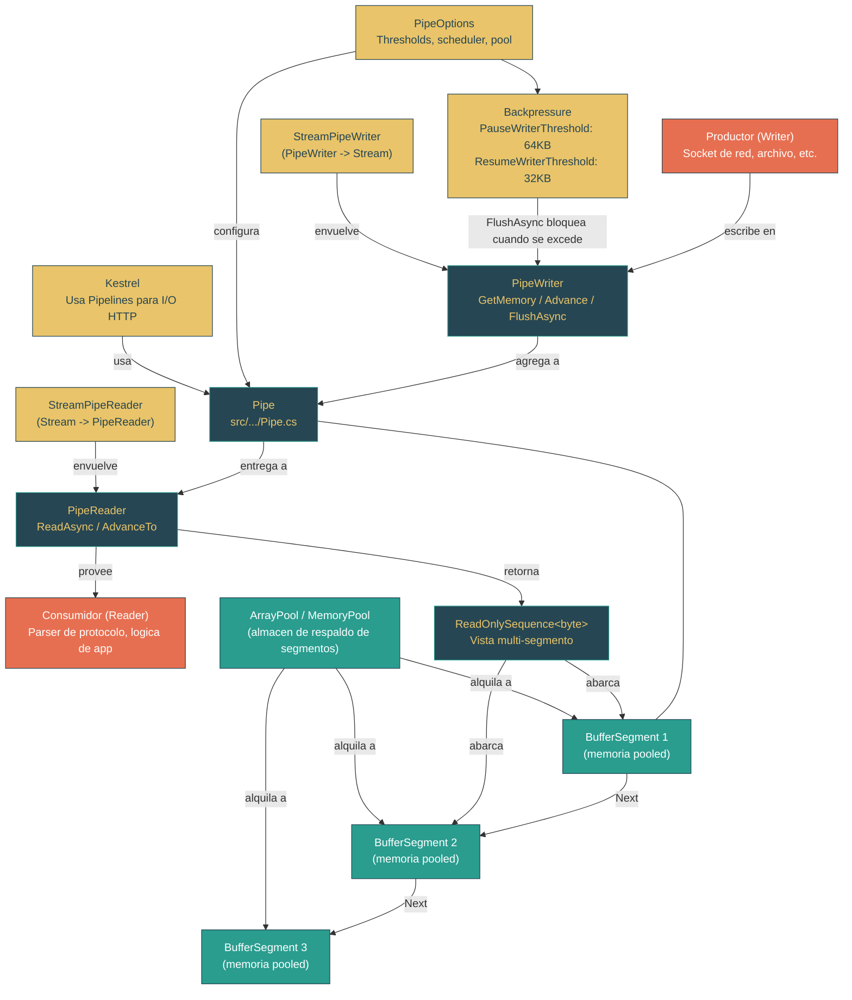

# Nivel 3: Avanzado -- System.IO.Pipelines e I/O de Alto Rendimiento

> **Perfil objetivo:** Desarrollador que construye sistemas de I/O de alto rendimiento y necesita entender como Pipelines elimina el problema de gestion de buffers
> **Esfuerzo estimado:** 5 horas
> **Prerrequisitos:** Modulo 3.1 (Modelo de Memoria: Span, Memory y Buffers), Modulo 2.7 (Fundamentos de Networking)
> [English version](../en/03-advanced-pipelines.md)

---

## Objetivos de Aprendizaje

Al completar este modulo, vas a poder:

1. **Explicar** por que el loop tradicional de `Stream.Read` fuerza un tradeoff entre tamano de buffer, desperdicio de memoria y complejidad de parsing -- y como Pipelines elimina ese tradeoff.
2. **Describir** el contrato productor-consumidor entre `PipeWriter` y `PipeReader`: `GetMemory`/`Advance`/`FlushAsync` del lado de escritura, `ReadAsync`/`AdvanceTo` del lado de lectura.
3. **Rastrear** como los nodos `BufferSegment` forman una lista enlazada de memoria pooled que permite que los datos fluyan del writer al reader sin copias.
4. **Articular** como funciona el backpressure a traves de `PauseWriterThreshold` y `ResumeWriterThreshold`, y por que los valores por defecto (64KB pausa, 32KB reanudacion) previenen tanto el agotamiento de memoria como el thrashing.
5. **Navegar** los internos de la clase `Pipe`: `_unconsumedBytes`, `_unflushedBytes`, `_readHead`, `_writingHead`, y la sincronizacion basada en locks que coordina productor y consumidor.
6. **Implementar** loops correctos de `ReadAsync`/`AdvanceTo` que distingan entre posiciones "consumed" y "examined", evitando tanto la perdida de datos como las re-lecturas infinitas.
7. **Integrar** Pipelines con codigo basado en `Stream` existente usando `StreamPipeReader` y `StreamPipeWriter`, entendiendo la capa de puente en la que Kestrel se apoya.
8. **Comparar** las caracteristicas de allocation y throughput de Pipelines versus patrones tradicionales de `Stream.Read` con razonamiento concreto de rendimiento.

---

## Mapa Conceptual



---

## Curriculum

### Leccion 3.5.1: El Problema que Pipelines Resuelve -- Por Que Stream.Read No Alcanza

**Lo que vas a aprender:** El I/O tradicional con `Stream` fuerza a los desarrolladores a elegir entre buffers grandes y desperdiciadores o un manejo complejo de lecturas parciales. Pipelines reestructura el problema separando la propiedad de los buffers de las operaciones de lectura/escritura.

**El concepto:**

Considera el patron clasico de lectura de red:

```csharp
// Loop tradicional de Stream.Read -- el "problema de gestion de buffers"
var buffer = new byte[4096];
while (true)
{
    int bytesRead = await stream.ReadAsync(buffer, 0, buffer.Length);
    if (bytesRead == 0) break;

    // Problema 1: Que pasa si nuestro mensaje abarca multiples lecturas?
    // Necesitamos acumular datos, pero en que buffer?

    // Problema 2: Que pasa si el mensaje es mas grande que 4096 bytes?
    // Necesitamos redimensionar, pero eso implica copiar datos.

    // Problema 3: Que pasa si parseamos un mensaje pero quedan bytes
    // sobrantes del siguiente? Necesitamos mover datos al frente.
}
```

Este patron tiene tres tensiones fundamentales:

**1. La propiedad del buffer es ambigua.** El caller alloca el buffer, lo pasa a `ReadAsync`, recibe datos en el, y luego tiene que decidir: mantener este buffer mientras parsea, o copiar los datos a otro lado? Si mantenes el buffer, no podes leer mas datos hasta que termine el parsing. Si copias, pagas el costo de allocation y copia.

**2. No hay mecanismo de backpressure.** Un `Stream` no tiene forma de senalar "deja de enviar, me estoy quedando atras." Un productor rapido va a llenar tu buffer, lo procesas, y el productor lo llena de nuevo -- sin coordinacion. Si el consumidor es lento, las unicas opciones son cola sin limite (explosion de memoria) o perder datos.

**3. Las lecturas parciales requieren contabilidad manual.** Los protocolos de red frecuentemente tienen mensajes que abarcan multiples lecturas. El desarrollador debe rastrear cuantos bytes se acumularon, detectar limites de mensaje, manejar el caso donde una lectura contiene el final de un mensaje y el inicio del siguiente, y gestionar los bytes sobrantes. Este es el "problema de gestion de buffers" -- y es la fuente de una enorme clase de bugs en implementaciones de protocolos de red.

Pipelines resuelve los tres problemas con una sola abstraccion:

| Problema de Stream | Solucion de Pipelines |
|---|---|
| Confusion de propiedad del buffer | El Pipe es dueno de los buffers. El Writer recibe un `Memory<byte>` donde escribir; el Reader recibe un `ReadOnlySequence<byte>` de donde leer. Ninguno alloca ni es dueno de la memoria subyacente. |
| Sin backpressure | `FlushAsync` bloquea al writer cuando los datos no consumidos exceden `PauseWriterThreshold`. El writer se reanuda cuando el reader consume lo suficiente para bajar de `ResumeWriterThreshold`. |
| Contabilidad de lecturas parciales | `AdvanceTo(consumed, examined)` le dice al Pipe exactamente que bytes fueron procesados y cuales fueron revisados pero necesitan mas datos. El Pipe mantiene los bytes no procesados disponibles para el siguiente `ReadAsync`. |

La idea clave es que Pipelines invierte la relacion de buffers. Con `Stream`, vos creas un buffer y se lo pasas al stream. Con Pipelines, el pipe crea buffers y te los da a vos. Por eso puede hacer pooling, reutilizar y gestionar los ciclos de vida de los buffers sin tu intervencion.

**En el codigo fuente:**
- `src/libraries/System.IO.Pipelines/src/System/IO/Pipelines/Pipe.cs` lineas 49-83 -- Los campos de estado centrales. Nota la separacion: `_unconsumedBytes` (flushed pero no consumidos por el reader) vs `_unflushedBytes` (escritos pero no flushed). Este rastreo en dos fases es lo que hace que el backpressure funcione con precision.
- `src/libraries/System.IO.Pipelines/src/System/IO/Pipelines/PipeWriter.cs` lineas 61-72 -- El contrato de `GetMemory`/`GetSpan`: el Pipe te da memoria donde escribir, vos le decis cuanto escribiste con `Advance`.
- `src/libraries/System.IO.Pipelines/src/System/IO/Pipelines/PipeReader.cs` lineas 29-32 -- `ReadAsync` retorna un `ValueTask<ReadResult>` que contiene un `ReadOnlySequence<byte>` -- la vista multi-segmento de todos los datos disponibles.

**Ejercicio practico:**

1. Abri `src/libraries/System.IO.Pipelines/src/System/IO/Pipelines/Pipe.cs` y ubica los campos `_unconsumedBytes` y `_unflushedBytes` (lineas 50-53). Rastrea como `_unflushedBytes` se incrementa en `AdvanceCore` (linea 358) y como se transfiere a `_unconsumedBytes` en `CommitUnsynchronized` (linea 309). Por que son contadores separados?
2. Escribi un lector de lineas basado en Stream que maneje el caso donde una linea abarca dos lecturas. Conta la cantidad de copias de buffer y allocations que necesitas. Despues considera como `ReadOnlySequence<byte>` con `AdvanceTo` las eliminaria.
3. Lee el comentario de documentacion de `PipeWriter.GetMemory` (lineas 65-71). Que pasa si llamas a `GetMemory`, escribis algunos bytes, pero nunca llamas a `Advance`? Por que es importante entender esto?
4. En `PipeOptions.cs`, encontra el `PauseWriterThreshold` por defecto (linea 48: 65536 = 64KB). Calcula cuantos segmentos de tamano por defecto (4KB cada uno, linea 12) esto representa. Por que el threshold de reanudacion es la mitad del de pausa?

**Conclusion clave:** Pipelines elimina el problema de gestion de buffers siendo dueno de los buffers, proveyendo backpressure, y rastreando posiciones consumed/examined. El desarrollador escribe datos en memoria propiedad del Pipe y lee datos de secuencias provistas por el Pipe -- nunca gestiona ciclos de vida de buffers directamente.

---

### Leccion 3.5.2: Pipe, PipeReader, PipeWriter -- El Contrato Productor-Consumidor

**Lo que vas a aprender:** La clase `Pipe` media entre un productor (PipeWriter) y un consumidor (PipeReader) a traves de un contrato asincrono cuidadosamente disenado. Entender la secuencia exacta de llamadas a metodos de cada lado es esencial para la correctitud.

**El concepto:**

Un `Pipe` es un canal productor-consumidor thread-safe y async-aware para bytes. Expone dos lados:

```
Lado del Productor (PipeWriter)    Lado del Consumidor (PipeReader)
──────────────────────────────     ─────────────────────────────────
1. GetMemory(sizeHint)             1. ReadAsync()
   -> Memory<byte>                    -> ReadResult { Buffer, IsCompleted }
2. Escribir en la Memory           2. Parsear el ReadOnlySequence<byte>
3. Advance(bytesWritten)           3. AdvanceTo(consumed, examined)
4. FlushAsync()                    4. Volver a ReadAsync()
   -> ValueTask<FlushResult>
5. Volver a GetMemory()            5. Complete() cuando termina
6. Complete() cuando termina
```

**El lado del writer** sigue el patron `IBufferWriter<byte>`. `PipeWriter` implementa esta interfaz:

```csharp
// src/libraries/System.IO.Pipelines/src/System/IO/Pipelines/PipeWriter.cs, linea 11
public abstract partial class PipeWriter : IBufferWriter<byte>
```

La secuencia critica de metodos:

1. **`GetMemory(sizeHint)`** -- El Pipe alloca (o reutiliza) un `BufferSegment` y retorna un slice `Memory<byte>` de su espacio disponible. El parametro `sizeHint` es un minimo: si el segmento actual tiene menos bytes libres, se alloca un nuevo segmento. Si `sizeHint` es 0, se retorna cualquier buffer no vacio.

2. **`Advance(bytesWritten)`** -- Le decis al Pipe cuantos de esos bytes realmente usaste. Internamente esto incrementa `_unflushedBytes` y `_writingHeadBytesBuffered`, y desliza `_writingHeadMemory` hacia adelante:

```csharp
// Pipe.cs, lineas 356-361
private void AdvanceCore(int bytesWritten)
{
    _unflushedBytes += bytesWritten;
    _writingHeadBytesBuffered += bytesWritten;
    _writingHeadMemory = _writingHeadMemory.Slice(bytesWritten);
}
```

3. **`FlushAsync()`** -- Aca es donde ocurre la magia. `FlushAsync` llama a `CommitUnsynchronized`, que transfiere `_unflushedBytes` a `_unconsumedBytes`, actualiza el `_readTail`, y decide si despertar al reader. Si `_unconsumedBytes` cruza `PauseWriterThreshold`, el awaitable del writer se marca como incompleto -- el writer se bloquea hasta que el reader se ponga al dia.

**El lado del reader** usa `ReadAsync` y `AdvanceTo`:

1. **`ReadAsync()`** -- Retorna un `ReadResult` que contiene un `ReadOnlySequence<byte>` que abarca todos los datos no consumidos. Si no hay datos disponibles y el writer no ha completado, la llamada espera asincronamente.

2. **`AdvanceTo(consumed, examined)`** -- Esta es la API mas malentendida de Pipelines. Toma dos posiciones:
   - **`consumed`**: Todo antes de esta posicion se descarta permanentemente. El Pipe devuelve los nodos `BufferSegment` consumidos al pool.
   - **`examined`**: Todo hasta esta posicion ha sido revisado. Si `examined` es igual al final del buffer, el Pipe sabe que viste todo y necesitas mas datos -- el siguiente `ReadAsync` esperara al writer.

La distincion entre consumed y examined es lo que hace que el manejo de lecturas parciales sea zero-copy:

```csharp
// Loop de lectura correcto con pipeline
while (true)
{
    ReadResult result = await reader.ReadAsync();
    ReadOnlySequence<byte> buffer = result.Buffer;

    // Intentar encontrar un mensaje completo
    if (TryParseMessage(buffer, out SequencePosition consumed, out Message message))
    {
        ProcessMessage(message);
        // consumed: todo hasta e incluyendo el mensaje
        // examined: igual a consumed (parseamos exitosamente)
        reader.AdvanceTo(consumed);
    }
    else
    {
        // No hay suficientes datos para un mensaje completo
        // consumed: buffer.Start (nada consumido)
        // examined: buffer.End (revisamos todo)
        reader.AdvanceTo(buffer.Start, buffer.End);
    }

    if (result.IsCompleted) break;
}
```

Si pasas `buffer.Start` como consumed y examined (un bug comun), el Pipe piensa que no miraste ninguno de los datos y retornara el mismo buffer inmediatamente, creando un loop infinito que quema CPU.

**En el codigo fuente:**
- `src/libraries/System.IO.Pipelines/src/System/IO/Pipelines/Pipe.cs` lineas 86-111 -- El constructor. Nota que `_writerAwaitable` arranca completado (los writers pueden escribir inmediatamente) mientras que `_readerAwaitable` arranca incompleto (los readers esperan datos).
- `src/libraries/System.IO.Pipelines/src/System/IO/Pipelines/Pipe.cs` lineas 290-334 -- `CommitUnsynchronized`. Linea 309: `_unconsumedBytes += _unflushedBytes` transfiere el conteo. Lineas 322-328: si los bytes no consumidos cruzan el threshold de pausa, `_writerAwaitable.SetUncompleted()` bloquea al writer.
- `src/libraries/System.IO.Pipelines/src/System/IO/Pipelines/Pipe.cs` lineas 453-587 -- `AdvanceReader`. Lineas 486-506: el calculo de bytes examined y la liberacion de backpressure. Cuando `_unconsumedBytes` cae por debajo de `ResumeWriterThreshold`, `_writerAwaitable.Complete()` desbloquea al writer.
- `src/libraries/System.IO.Pipelines/src/System/IO/Pipelines/PipeReader.cs` lineas 66-79 -- `ReadAtLeastAsyncCore`. Este es un wrapper de conveniencia que hace loop de `ReadAsync` hasta que al menos `minimumSize` bytes estan buffered. Nota el `AdvanceTo(buffer.Start, buffer.End)` en la linea 79: examina todo pero no consume nada, diciendole al Pipe que acumule mas datos.

**Ejercicio practico:**

1. En `Pipe.cs`, encontra el constructor (linea 93). Por que `_writerAwaitable` arranca como `completed: true` mientras que `_readerAwaitable` arranca como `completed: false`? Que pasaria si estuvieran al reves?
2. Rastrea el ciclo de vida de un solo ciclo write-flush-read-advance a traves del codigo fuente:
   - Writer llama a `GetMemory(100)` -- encontra `AllocateWriteHeadIfNeeded` (linea 161)
   - Writer llama a `Advance(50)` -- encontra `AdvanceCore` (linea 356)
   - Writer llama a `FlushAsync()` -- encontra `PrepareFlushUnsynchronized` (linea 382) y `CommitUnsynchronized` (linea 290)
   - Reader llama a `ReadAsync()` -- el reader awaitable fue completado por el flush
   - Reader llama a `AdvanceTo(consumed, examined)` -- encontra `AdvanceReader` (linea 453)
3. Escribi un loop buggy de lectura de pipeline donde se llama a `AdvanceTo(buffer.Start, buffer.Start)` cuando el parsing falla. Explica por que esto crea un busy-wait infinito.
4. En `ReadAtLeastAsyncCore` (PipeReader.cs linea 66), explica por que el metodo llama a `AdvanceTo(buffer.Start, buffer.End)` en vez de no llamar a `AdvanceTo` para nada. Que contrato se violaria?

**Conclusion clave:** El `Pipe` coordina writer y reader a traves de awaitables y contadores de bytes. El contrato del lado del writer es `GetMemory` -> escribir -> `Advance` -> `FlushAsync`. El contrato del lado del reader es `ReadAsync` -> parsear -> `AdvanceTo(consumed, examined)`. Entender bien la distincion consumed/examined es lo mas importante para usar Pipelines correctamente.

---

### Leccion 3.5.3: Gestion de Buffers -- BufferSegment y la Lista Enlazada de Memoria Pooled

**Lo que vas a aprender:** El Pipe gestiona memoria a traves de una lista enlazada de nodos `BufferSegment`, cada uno respaldado por arrays pooled. Entender esta estructura explica como los datos fluyen del writer al reader sin copias y como se recicla la memoria.

**El concepto:**

La clase `BufferSegment` es el bloque fundamental de la gestion de memoria del Pipe:

```csharp
// src/libraries/System.IO.Pipelines/src/System/IO/Pipelines/BufferSegment.cs, linea 10
internal sealed class BufferSegment : ReadOnlySequenceSegment<byte>
{
    private IMemoryOwner<byte>? _memoryOwner;
    private byte[]? _array;
    private BufferSegment? _next;
    private int _end;
    // ...
}
```

Cada `BufferSegment` contiene o un `IMemoryOwner<byte>` (de un `MemoryPool`) o un `byte[]` (de `ArrayPool<byte>.Shared`). Hereda de `ReadOnlySequenceSegment<byte>`, que provee las propiedades `Memory`, `Next` y `RunningIndex` que lo hacen parte de un `ReadOnlySequence<byte>`.

El Pipe mantiene tres punteros criticos en la lista enlazada:

```
  _readHead          _readTail / _writingHead
     |                    |
     v                    v
 [Segmento A] --> [Segmento B] --> [Segmento C]
  ^^^^^^^^^^       ^^^^^^^^^^       ^^^^^^^^^^
  consumido        no consumido     escribible
  (devuelto        (disponible      (espacio de
   al pool)         al reader)      trabajo del writer)
```

- **`_readHead` / `_readHeadIndex`**: Inicio de los datos visibles del reader. Todo antes de esto fue consumido.
- **`_readTail` / `_readTailIndex`**: Fin de los datos visibles del reader. Se actualiza cuando el writer hace flush.
- **`_writingHead` / `_writingHeadMemory`**: El segmento en el que el writer esta escribiendo actualmente.

Cuando el writer necesita mas espacio del que tiene el segmento actual, se alloca y enlaza un nuevo segmento:

```csharp
// Pipe.cs, lineas 210-214
BufferSegment newSegment = AllocateSegment(sizeHint);
_writingHead.SetNext(newSegment);
_writingHead = newSegment;
```

El metodo `SetNext` (BufferSegment.cs lineas 107-121) enlaza los segmentos y actualiza `RunningIndex` -- un total acumulado de bytes a traves de todos los segmentos previos. Este indice es lo que permite que `ReadOnlySequence<byte>` calcule su `Length` en O(1) y haga `Slice` en O(segmentos):

```csharp
// BufferSegment.cs, lineas 125-128
internal static long GetLength(BufferSegment startSegment, int startIndex,
                                BufferSegment endSegment, int endIndex)
{
    return (endSegment.RunningIndex + (uint)endIndex) -
           (startSegment.RunningIndex + (uint)startIndex);
}
```

**El pooling de segmentos** es como el Pipe evita allocations en estado estable. Cuando el reader consume un segmento y llama a `AdvanceTo`, los segmentos consumidos se devuelven a un `BufferSegmentStack`:

```csharp
// Pipe.cs, lineas 278-288
private void ReturnSegmentUnsynchronized(BufferSegment segment)
{
    if (_bufferSegmentPool.Count < _options.MaxSegmentPoolSize)
    {
        _bufferSegmentPool.Push(segment);
    }
}
```

Y cuando el writer necesita un nuevo segmento, revisa el pool primero:

```csharp
// Pipe.cs, lineas 268-276
private BufferSegment CreateSegmentUnsynchronized()
{
    if (_bufferSegmentPool.TryPop(out BufferSegment? segment))
    {
        return segment;
    }
    return new BufferSegment();
}
```

El pool tiene un maximo por defecto de 256 segmentos (PipeOptions.cs linea 45). Con segmentos de 4KB (PipeOptions.cs linea 12), eso es hasta 1MB de objetos de segmento pooled. La memoria subyacente de cada segmento viene de `ArrayPool<byte>.Shared` (o un `MemoryPool<byte>` personalizado), que tiene su propia capa de pooling.

**El ciclo de vida de Reset** de un segmento:

1. **Allocar**: `CreateSegmentUnsynchronized()` hace pop del pool o `new`
2. **Alquilar memoria**: `RentMemory()` obtiene un `byte[]` de `ArrayPool` o `IMemoryOwner` de `MemoryPool`
3. **Escribir**: El writer llena el segmento via `GetMemory`/`Advance`
4. **Leer**: El reader lee el segmento via `ReadOnlySequence<byte>`
5. **Consumir**: El reader llama a `AdvanceTo`, el segmento se consume
6. **Reset**: `BufferSegment.Reset()` libera la memoria al pool, limpia `Next` y `RunningIndex`
7. **Devolver**: El objeto segmento se pushea de vuelta a `_bufferSegmentPool` para reutilizacion

El metodo `ResetMemory` (BufferSegment.cs lineas 73-92) muestra la limpieza de doble camino:

```csharp
// BufferSegment.cs, lineas 73-92
public void ResetMemory()
{
    IMemoryOwner<byte>? memoryOwner = _memoryOwner;
    if (memoryOwner != null)
    {
        _memoryOwner = null;
        memoryOwner.Dispose();     // Devuelve al MemoryPool
    }
    else
    {
        ArrayPool<byte>.Shared.Return(_array);  // Devuelve al ArrayPool
        _array = null;
    }
    Memory = default;
    _end = 0;
    AvailableMemory = default;
}
```

**En el codigo fuente:**
- `src/libraries/System.IO.Pipelines/src/System/IO/Pipelines/BufferSegment.cs` -- El archivo completo (136 lineas). Leelo de punta a punta. Presta atencion a `End` (propiedad, linea 22) que actualiza `Memory` en cada set, y `WritableBytes` (linea 101) que computa el espacio restante.
- `src/libraries/System.IO.Pipelines/src/System/IO/Pipelines/Pipe.cs` lineas 160-266 -- El camino de allocation. `AllocateWriteHeadIfNeeded` -> `AllocateWriteHeadSynchronized` -> `AllocateSegment` -> `CreateSegmentUnsynchronized` + `RentMemory`. Este es el hot path para escrituras.
- `src/libraries/System.IO.Pipelines/src/System/IO/Pipelines/Pipe.cs` lineas 575-581 -- El camino de deallocation dentro de `AdvanceReader`. El loop `while` camina desde `returnStart` hasta `returnEnd`, llamando `Reset()` y `ReturnSegmentUnsynchronized()` en cada segmento consumido.
- `src/libraries/System.Memory/src/System/Buffers/ReadOnlySequence.cs` lineas 15-45 -- La struct `ReadOnlySequence<T>`. Nota `IsSingleSegment` (linea 44): cuando todo el buffer del Pipe cabe en un segmento, `ReadOnlySequence` optimiza a un rango de memoria simple sin recorrido de lista enlazada.

**Ejercicio practico:**

1. Abri `BufferSegment.cs` y dibuja la relacion entre `AvailableMemory`, `End`, `Memory` y `WritableBytes`. Si `AvailableMemory.Length` es 4096 y `End` es 1000, cuanto es `Memory.Length`? Cuanto es `WritableBytes`?
2. En `Pipe.cs`, rastrea que pasa cuando el writer llama a `GetMemory(8192)` pero el segmento actual solo tiene 500 bytes libres (linea 191: `bytesLeftInBuffer < sizeHint`). Segui el codigo hasta `AllocateSegment` y `SetNext`. Cuantos segmentos estan enlazados al final?
3. Lee `SetNext` en BufferSegment.cs (linea 107). Por que recorre toda la cadena para actualizar `RunningIndex`? Que se romperia si `RunningIndex` estuviera desactualizado?
4. Abri `PipeOptions.cs` y encontra `InitialSegmentPoolSize` (linea 42: 4) y `MaxSegmentPoolSize` (linea 45: 256). Con segmentos de 4KB por defecto, cual es la memoria maxima retenida por el pool de segmentos? Por que esto puede ser aceptable incluso para aplicaciones con restricciones de memoria?
5. En `Pipe.cs` linea 200, encontra la rama donde `_writingHead.Length == 0`. Esto maneja un caso borde especifico: el writer llamo a `GetMemory` pero nunca escribio bytes (o hizo advance de 0). Por que el Pipe reutiliza el mismo segmento con nueva memoria en vez de allocar un nuevo segmento?

**Conclusion clave:** La lista enlazada de nodos `BufferSegment` pooled del Pipe es lo que hace posible el I/O zero-copy. El writer agrega al final; el reader lee desde el inicio; los segmentos consumidos se reciclan de vuelta al pool. En estado estable, no ocurren allocations de memoria -- los segmentos y sus arrays de respaldo se reutilizan continuamente.

---

### Leccion 3.5.4: Backpressure y Control de Flujo -- Previniendo el Agotamiento de Memoria

**Lo que vas a aprender:** Pipelines implementa backpressure a traves de dos thresholds que coordinan las velocidades del writer y el reader. Este mecanismo previene que productores rapidos abrumen a consumidores lentos sin requerir ningun cambio de codigo del desarrollador.

**El concepto:**

Backpressure es el mecanismo por el cual un consumidor le dice a un productor "baja la velocidad." Sin backpressure, un socket de red rapido escribiendo en un parser lento va a acumular datos sin limite en memoria -- una fuente comun de crashes por falta de memoria en servidores de red.

`PipeOptions` controla el backpressure a traves de dos thresholds:

```csharp
// PipeOptions.cs, lineas 47-51
// Por defecto, throttleamos al writer a 64K de datos buffered
const int DefaultPauseWriterThreshold = 65536;

// El threshold de reanudacion es 1/2 del de pausa para prevenir thrashing en el limite
const int DefaultResumeWriterThreshold = DefaultPauseWriterThreshold / 2;
```

Los dos thresholds crean una banda de histeresis:

```
Uso de memoria
    |
64K |-------- PauseWriterThreshold --------  Writer BLOQUEADO (FlushAsync espera)
    |                                         |
    |            Banda de histeresis          |
    |            (sin cambio de estado)       |
    |                                         |
32K |-------- ResumeWriterThreshold -------  Writer DESBLOQUEADO (FlushAsync completa)
    |
 0  |_____________________________________________ tiempo
```

Por que dos thresholds en vez de uno? Con un solo threshold, imagina este escenario: el writer produce datos exactamente a la misma velocidad que el reader los consume. Cada vez que el buffer alcanza el threshold, el writer se pausa. El reader consume un byte, el writer se reanuda, escribe un byte, se pausa de nuevo. Este "thrashing" desperdicia enormes cantidades de CPU en cambios de contexto.

Con histeresis (la brecha entre pausa y reanudacion), el writer se pausa a 64KB y no se reanuda hasta que el reader haya consumido lo suficiente para llegar a 32KB. Esto le da al reader tiempo para hacer progreso significativo antes de que el writer corra de nuevo.

**Como funciona en el codigo:**

**La pausa del writer** ocurre en `CommitUnsynchronized` (Pipe.cs lineas 318-328):

```csharp
// Pipe.cs, lineas 322-328
if (PauseWriterThreshold > 0 &&
    oldLength < PauseWriterThreshold &&
    _unconsumedBytes >= PauseWriterThreshold &&
    !_readerCompletion.IsCompleted)
{
    _writerAwaitable.SetUncompleted();
}
```

Esto solo se dispara cuando `_unconsumedBytes` *cruza* el threshold (estaba debajo, ahora esta en o por encima). La llamada a `_writerAwaitable.SetUncompleted()` significa que el siguiente `FlushAsync` retornara un `ValueTask` incompleto -- el writer espera asincronamente hasta que el reader se ponga al dia.

**La reanudacion del writer** ocurre en `AdvanceReader` (Pipe.cs lineas 500-506):

```csharp
// Pipe.cs, lineas 500-506
if (oldLength >= ResumeWriterThreshold &&
    _unconsumedBytes < ResumeWriterThreshold)
{
    Debug.Assert(examinedBytes > 0);
    _writerAwaitable.Complete(out completionData);
}
```

Cuando el reader examina datos y `_unconsumedBytes` cae por debajo de `ResumeWriterThreshold`, `_writerAwaitable.Complete()` despierta al writer.

**La sutileza de bytes examined:** Nota que el backpressure se basa en bytes *examined*, no bytes consumed. En `AdvanceReader` (linea 492):

```csharp
_unconsumedBytes -= examinedBytes;
```

Esto significa que incluso si el reader no consumio los datos (podria necesitar mas datos para parsear un mensaje completo), examinarlos cuenta para aliviar el backpressure. Esto es intencional: el reader miro los datos y decidio que necesita mas. Si el backpressure solo se liberara al consumir, un reader esperando un mensaje grande podria hacer deadlock -- el writer estaria pausado, incapaz de enviar los bytes restantes que el reader necesita.

**Desactivar backpressure:** Poner `PauseWriterThreshold` en 0 desactiva el backpressure completamente -- `FlushAsync` nunca bloquea. Esto es util cuando queres buffering sin limite (ej., escribir en un pipe en memoria donde el reader esta garantizado a no quedarse atras). Pero ten cuidado: sin backpressure, un reader lento y un writer rapido van a consumir memoria sin limite.

**La proteccion contra deadlock:** El codigo en Pipe.cs linea 319 contiene una verificacion sutil pero critica:

```csharp
// Solo aplicamos backpressure si el reader no esta pausado. Esto es importante
// porque si esta bloqueado entonces esto podria causar un deadlock.
```

Si el reader esta esperando mas datos (su awaitable esta incompleto) y nosotros tambien pausamos al writer, ninguno de los dos lados puede avanzar. El codigo previene esto aplicando backpressure solo cuando el reader ha sido senalado (su awaitable esta completado, significando que tiene datos para procesar).

**En el codigo fuente:**
- `src/libraries/System.IO.Pipelines/src/System/IO/Pipelines/PipeOptions.cs` lineas 47-77 -- La logica de validacion de thresholds. Nota lineas 66-71: un `resumeWriterThreshold` de 0 se coerce a 1, porque un threshold de 0 significa que el writer nunca puede reanudarse una vez pausado.
- `src/libraries/System.IO.Pipelines/src/System/IO/Pipelines/Pipe.cs` lineas 290-334 -- `CommitUnsynchronized`. La logica de pausa del writer esta aca.
- `src/libraries/System.IO.Pipelines/src/System/IO/Pipelines/Pipe.cs` lineas 485-507 -- El calculo de bytes examined y la logica de reanudacion del writer en `AdvanceReader`.
- `src/libraries/System.IO.Pipelines/src/System/IO/Pipelines/Pipe.cs` linea 84 -- `Length` es simplemente `_unconsumedBytes`, el contador clave que impulsa el backpressure.

**Ejercicio practico:**

1. En `PipeOptions.cs`, encontra la validacion para `resumeWriterThreshold` (lineas 66-71). Por que un valor de 0 se coerce a 1? Que pasaria si se quedara en 0 y el writer estuviera pausado?
2. Rastrea `CommitUnsynchronized` (Pipe.cs linea 290) con un escenario: `_unconsumedBytes` es 60,000 y el writer hace flush de 5,000 bytes mas. El writer se pausa? Ahora rastrea al reader examinando 30,000 bytes en `AdvanceReader`. El writer se reanuda?
3. Crea un Pipe con opciones personalizadas: `new PipeOptions(pauseWriterThreshold: 1024, resumeWriterThreshold: 512)`. Escribi un productor que escribe 100 bytes a la vez y un consumidor que lee cada 100ms. Observa cuando `FlushAsync` bloquea y desbloquea. Podes detectar el bloqueo midiendo cuanto tarda `FlushAsync`.
4. Lee el comentario de proteccion contra deadlock en Pipe.cs linea 318. Construi un escenario hipotetico donde remover esta proteccion causaria un deadlock. (Pista: considera que pasa cuando `_minimumReadBytes` esta seteado y el reader esta esperando mas datos.)
5. En `PipeOptions.cs` linea 74, encontra la validacion: `resumeWriterThreshold > pauseWriterThreshold` lanza excepcion. Por que esto no tiene sentido desde una perspectiva de control de flujo? Que significaria reanudar antes de pausar?

**Conclusion clave:** El backpressure en Pipelines es automatico: si el reader se queda atras, `FlushAsync` bloquea al writer hasta que el reader se ponga al dia. La banda de histeresis entre pausa (64KB) y reanudacion (32KB) previene el thrashing. El backpressure se impulsa por bytes examined (no consumed), previniendo deadlocks cuando un reader necesita mas datos para parsear un mensaje completo.

---

### Leccion 3.5.5: Integracion con Streams y Sockets -- StreamPipeReader/Writer y Kestrel

**Lo que vas a aprender:** Pipelines no reemplaza a `Stream` -- se construye encima. `StreamPipeReader` y `StreamPipeWriter` unen los dos mundos, y el uso de Pipelines por parte de Kestrel demuestra por que esta arquitectura importa para servidores de alto rendimiento del mundo real.

**El concepto:**

La mayoria del I/O en .NET ultimamente pasa por `Stream`: `NetworkStream`, `FileStream`, `SslStream`. Pipelines provee tipos puente para envolver cualquier `Stream` como `PipeReader` o `PipeWriter`:

```csharp
// Crear un PipeReader desde cualquier Stream
PipeReader reader = PipeReader.Create(stream, new StreamPipeReaderOptions(
    bufferSize: 4096,
    minimumReadSize: 1024,
    leaveOpen: false
));

// Crear un PipeWriter desde cualquier Stream
PipeWriter writer = PipeWriter.Create(stream, new StreamPipeWriterOptions(
    minimumBufferSize: 4096,
    leaveOpen: false
));
```

**`StreamPipeReader`** (la clase interna detras de `PipeReader.Create`) envuelve un `Stream` y gestiona su propia lista enlazada de nodos `BufferSegment` -- el mismo diseno de pooling de segmentos que `Pipe`. Cuando llamas a `ReadAsync`, lee del stream subyacente a un segmento, luego presenta los datos acumulados como un `ReadOnlySequence<byte>`.

```csharp
// src/libraries/System.IO.Pipelines/src/System/IO/Pipelines/StreamPipeReader.cs, lineas 13-14
internal sealed class StreamPipeReader : PipeReader
{
    internal const int InitialSegmentPoolSize = 4; // 16K
    internal const int MaxSegmentPoolSize = 256; // 1MB
```

Nota que refleja las mismas constantes que `Pipe`. El `StreamPipeReader` tiene su propio `_bufferSegmentPool` (linea 29) y su propio tracking de `_readHead` / `_readTail` (lineas 21-24). Es esencialmente un Pipe simplificado, de solo lectura.

Una caracteristica clave de `StreamPipeReader` es la opcion `UseZeroByteReads`. Cuando esta habilitada, el reader primero emite un `ReadAsync` de cero bytes en el stream subyacente. Esto le dice al stream "despertame cuando haya datos disponibles" sin allocar un buffer. Solo despues de que la lectura de cero bytes completa es que alquila un buffer y lee datos reales. Esto es particularmente efectivo con `SslStream` y `NetworkStream`, donde una lectura de cero bytes puede esperar eficientemente a nivel del SO sin mantener un buffer pinned.

**La arquitectura de Kestrel** esta construida sobre Pipelines. En el servidor web Kestrel de ASP.NET Core, cada conexion tiene un par de `Pipe`:

```
Socket de Red
    |
    v
[Capa de Transporte]  -- lee del socket, escribe en el Transport Pipe
    |
Transport Pipe (Pipe #1)
    |
    v
[Parser de Protocolo HTTP]  -- lee del Transport Pipe, parsea frames HTTP
    |
Application Pipe (Pipe #2)
    |
    v
[Tu Middleware / Controller]
```

La capa de transporte lee bytes crudos del socket y los escribe en el transport Pipe. El parser de protocolo HTTP lee de ese Pipe, parsea headers de request y frames del body, y escribe el contenido parseado en el application Pipe. Tu codigo de aplicacion lee el body del request del application Pipe.

Este diseno le da a Kestrel varias ventajas:

1. **Parsing zero-copy**: El parser HTTP lee directamente de los segmentos del Pipe. Los valores de headers son slices de `ReadOnlySequence<byte>` que apuntan a los buffers originales de lectura del socket -- no hay allocation de strings hasta que se necesita.
2. **Backpressure natural**: Si la aplicacion lee el body del request lentamente, el application Pipe aplica backpressure al parser HTTP, que deja de leer del transport Pipe, que deja de leer del socket. La ventana TCP se llena, el cliente baja la velocidad. Todo automatico.
3. **Lectura/escritura paralela**: Los dos Pipes permiten al transporte leer y escribir simultaneamente. Mientras la aplicacion procesa un request, el transporte ya puede bufferizar el siguiente request.

**Cuando usar cada patron:**

| Escenario | Enfoque |
|---|---|
| Envolver un Stream existente para parsing estilo pipeline | `PipeReader.Create(stream)` |
| Escribir la salida del pipeline a un Stream existente | `PipeWriter.Create(stream)` |
| Construir un canal productor-consumidor entre dos operaciones async | `new Pipe()` directamente |
| Construir un servidor de red con parsing de protocolo | Par de `Pipe` (como Kestrel) |
| Lecturas simples de una sola vez | Usa `Stream` directamente -- Pipelines agrega complejidad que no necesitas |

**En el codigo fuente:**
- `src/libraries/System.IO.Pipelines/src/System/IO/Pipelines/StreamPipeReader.cs` -- El puente de `Stream` a `PipeReader`. Nota la opcion `UseZeroByteReads` (linea 56) y como emite una lectura de longitud cero antes de allocar buffers.
- `src/libraries/System.IO.Pipelines/src/System/IO/Pipelines/StreamPipeWriter.cs` -- El puente de `PipeWriter` a `Stream`. Bufferiza escrituras en segmentos y hace flush al stream subyacente en `FlushAsync`.
- `src/libraries/System.IO.Pipelines/src/System/IO/Pipelines/StreamPipeReaderOptions.cs` -- Opciones incluyendo `BufferSize`, `MinimumReadSize`, `UseZeroByteReads` y `LeaveOpen`.
- `src/libraries/System.IO.Pipelines/src/System/IO/Pipelines/StreamPipeExtensions.cs` -- Metodos de extension para `Stream` para integrar con Pipelines.
- `src/libraries/System.IO.Pipelines/src/System/IO/Pipelines/PipeReader.cs` -- El metodo factory `Create(Stream, ...)` que instancia `StreamPipeReader`.

**Ejercicio practico:**

1. Abri `StreamPipeReader.cs` y compara su estructura con `Pipe.cs`. Lista los campos que comparten (pool de segmentos, read head/tail, bytes buffered). Que campos tiene `Pipe` que `StreamPipeReader` no tiene? Por que?
2. Escribi un programa que lea un archivo grande (100MB+) usando tres enfoques y compara el comportamiento de allocations (usa `dotnet-counters` o `GC.GetAllocatedBytesForCurrentThread()`):
   - **Enfoque A**: `Stream.Read` en un buffer fijo de 4KB
   - **Enfoque B**: `StreamReader.ReadLineAsync` (alloca un string por linea)
   - **Enfoque C**: `PipeReader.Create(fileStream)` con un loop de parsing que busca nuevas lineas en el `ReadOnlySequence<byte>`
3. Lee `StreamPipeReaderOptions` y explica que controla `MinimumReadSize`. Si `MinimumReadSize` es 1024 y llamas a `AdvanceTo` dejando 800 bytes sin procesar, el siguiente `ReadAsync` emitira una lectura del stream o retornara el buffer existente?
4. Disena (en papel) la topologia de Pipes para un echo server simple: acepta una conexion TCP, lee datos de ella, y escribe los mismos datos de vuelta. Cuantos Pipes necesitas? Donde se ubica cada pipe?
5. Investiga como la clase `SocketConnection` de Kestrel (en el repositorio `aspnetcore`) crea sus Pipes a nivel de transporte. Que `PipeOptions` usa para los thresholds de backpressure? (Pista: busca `InputOptions` y `OutputOptions` en el fuente de ASP.NET Core.)

**Conclusion clave:** `StreamPipeReader` y `StreamPipeWriter` unen Streams y Pipelines, permitiendote usar parsing estilo pipeline en cualquier `Stream` existente. La arquitectura de Kestrel -- un par de Pipes por conexion con el parser de protocolo en el medio -- demuestra como Pipelines habilita parsing zero-copy, backpressure automatico y lectura/escritura concurrente. Usa `PipeReader.Create(stream)` cuando necesites parsing de pipeline; usa `Pipe` directamente cuando necesites un canal productor-consumidor.

---

## Guia de Lectura de Codigo Fuente

Lee estos archivos en orden. Cada uno construye sobre la comprension del anterior.

| Orden | Archivo | En que enfocarte | Dificultad |
|---|---|---|---|
| 1 | `src/libraries/System.IO.Pipelines/src/System/IO/Pipelines/PipeOptions.cs` | Valores de threshold por defecto (lineas 47-51), tamano de segmento (linea 12), tamanos de pool (lineas 42-45). Este es el archivo mas simple y establece todas las constantes referenciadas en otros lados. | :star: |
| 2 | `src/libraries/System.IO.Pipelines/src/System/IO/Pipelines/BufferSegment.cs` | El archivo completo (136 lineas). Enfocate en: propiedad `End` seteando `Memory` (linea 30), `WritableBytes` (linea 101), `SetNext` y actualizaciones de `RunningIndex` (lineas 107-121), limpieza de doble camino `ResetMemory` (lineas 73-92). | :star::star: |
| 3 | `src/libraries/System.IO.Pipelines/src/System/IO/Pipelines/PipeWriter.cs` | La implementacion de la interfaz `IBufferWriter<byte>`: `GetMemory` (linea 72), `GetSpan` (linea 80), `Advance` (linea 63), `FlushAsync` (linea 59). Estos son metodos abstractos -- la implementacion esta en `Pipe.cs`. | :star: |
| 4 | `src/libraries/System.IO.Pipelines/src/System/IO/Pipelines/PipeReader.cs` | `ReadAsync` (linea 32), `AdvanceTo` (implicito), `ReadAtLeastAsyncCore` (linea 66). Nota la distincion `consumed`/`examined` en `AdvanceTo`. | :star::star: |
| 5 | `src/libraries/System.IO.Pipelines/src/System/IO/Pipelines/Pipe.cs` lineas 1-120 | Campos de estado (lineas 28-83), constructor (lineas 93-111). Mapea cada campo a su rol: pool de buffers, awaitables de reader/writer, punteros head/tail, contadores de bytes. | :star::star: |
| 6 | `src/libraries/System.IO.Pipelines/src/System/IO/Pipelines/Pipe.cs` lineas 126-266 | El camino de escritura: `GetMemory` -> `AllocateWriteHeadIfNeeded` -> `AllocateWriteHeadSynchronized` -> `AllocateSegment` -> `CreateSegmentUnsynchronized` + `RentMemory`. Segui la allocation y enlace de segmentos. | :star::star::star: |
| 7 | `src/libraries/System.IO.Pipelines/src/System/IO/Pipelines/Pipe.cs` lineas 290-416 | El camino de flush: `CommitUnsynchronized` (transferencia de bytes, pausa de backpressure), `FlushAsync` -> `PrepareFlushUnsynchronized` (despertar al reader). | :star::star::star: |
| 8 | `src/libraries/System.IO.Pipelines/src/System/IO/Pipelines/Pipe.cs` lineas 448-587 | El camino de lectura/advance: `AdvanceReader` (bytes examined, reanudacion de backpressure, devolucion de segmentos). Este es el metodo mas complejo. | :star::star::star::star: |
| 9 | `src/libraries/System.IO.Pipelines/src/System/IO/Pipelines/StreamPipeReader.cs` | Lineas 1-65: constructor, opciones, `AdvanceTo`. Compara la estructura con `Pipe.cs`. Nota la optimizacion `UseZeroByteReads`. | :star::star: |
| 10 | `src/libraries/System.Memory/src/System/Buffers/ReadOnlySequence.cs` | Lineas 1-100: la struct multi-segmento. Optimizacion `IsSingleSegment` (linea 44), posiciones `Start`/`End`, el constructor basado en segmentos (linea 94). | :star::star::star: |

---

## Herramientas de Diagnostico y Comandos

| Comando / Herramienta | Que hace | Cuando usarlo |
|---|---|---|
| `dotnet-counters monitor -n MyApp --counters System.IO.Pipelines` | Metricas de Pipe en tiempo real (si se emiten EventCounters) | Monitorear throughput del pipe y bytes buffered en tiempo real |
| `dotnet-trace collect -n MyApp --providers System.Buffers.ArrayPoolEventSource` | Rastrea eventos de rent/return de ArrayPool | Verificar que los segmentos del Pipe se estan devolviendo correctamente al pool |
| `dotnet-counters monitor -n MyApp --counters System.Runtime` | Conteos de colecciones de GC y tasa de allocation | Confirmar que el codigo basado en Pipelines tiene tasas de allocation mas bajas que alternativas basadas en Stream |
| `dotnet-gcdump collect -n MyApp` | Snapshot del heap | Buscar nodos `BufferSegment` fugados que no se devolvieron al pool |
| `BenchmarkDotNet` | Micro-benchmarks con tracking de allocations | Comparar rendimiento de parsing entre Pipelines vs Stream con `[MemoryDiagnoser]` |
| `DOTNET_JitDisasm=*PipeReader*` | Desensamblado JIT para metodos de Pipe | Inspeccionar si metodos criticos como `AdvanceTo` estan siendo inlined |

---

## Autoevaluacion

Pon a prueba tu comprension con estas preguntas. Intenta responder antes de revelar la respuesta.

### Pregunta 1: Cuales son los tres problemas fundamentales de Stream.Read que Pipelines resuelve?

<details>
<summary>Mostrar respuesta</summary>

1. **Ambiguedad de propiedad del buffer**: Con `Stream.Read`, el caller alloca el buffer y debe decidir si mantenerlo durante el parsing o copiar los datos a otro lado. Pipelines es dueno de los buffers -- el writer recibe memoria del Pipe, el reader recibe una vista de solo lectura.

2. **Sin backpressure**: Un `Stream` no puede senalar al productor que baje la velocidad. Pipelines usa `PauseWriterThreshold` y `ResumeWriterThreshold` para bloquear `FlushAsync` cuando el consumidor se queda atras.

3. **Contabilidad de lecturas parciales**: Con Streams, los desarrolladores deben acumular bytes manualmente a traves de lecturas, detectar limites de mensaje y gestionar bytes sobrantes. El `AdvanceTo(consumed, examined)` de Pipelines le dice al Pipe exactamente que fue procesado y que necesita mas datos, manteniendo los bytes no procesados disponibles para el siguiente `ReadAsync`.

</details>

### Pregunta 2: Cual es la diferencia entre consumed y examined en AdvanceTo?

<details>
<summary>Mostrar respuesta</summary>

- **`consumed`**: Todos los datos antes de esta posicion se descartan permanentemente. El Pipe devuelve los nodos `BufferSegment` correspondientes al pool. Lo seteas a la posicion despues del ultimo mensaje completamente procesado.

- **`examined`**: Todos los datos hasta esta posicion fueron revisados. Si `examined` es igual al final del buffer, el Pipe sabe que necesitas mas datos y el siguiente `ReadAsync` esperara al writer. Lo seteas al final del buffer cuando no podes encontrar un mensaje completo.

El comportamiento clave: si `examined` no esta al final del buffer, `ReadAsync` retorna inmediatamente con los datos restantes. Si `examined` es igual a `buffer.End`, `ReadAsync` espera nuevos datos del writer. Setear ambos a `buffer.Start` cuando el parsing falla crea un busy-loop infinito porque el Pipe piensa que no miraste ningun dato.

</details>

### Pregunta 3: Por que PauseWriterThreshold y ResumeWriterThreshold tienen valores diferentes?

<details>
<summary>Mostrar respuesta</summary>

La brecha entre los dos thresholds crea una banda de histeresis que previene el thrashing. Si hubiera un solo threshold, el writer se pausaria, el reader consumiria un byte (cayendo debajo del threshold), el writer se reanudaria, escribiria un byte (alcanzando el threshold de nuevo), y se pausaria -- oscilando rapidamente y desperdiciando CPU en cambios de contexto.

Con thresholds separados (por defecto: 64KB pausa, 32KB reanudacion), el writer se pausa a 64KB y se queda pausado hasta que el reader reduce los bytes no consumidos a 32KB. Esto asegura que el reader haga 32KB de progreso antes de que el writer corra de nuevo, amortizando el costo del cambio de contexto.

</details>

### Pregunta 4: Como logra el pooling de BufferSegment un estado estable de cero allocations?

<details>
<summary>Mostrar respuesta</summary>

El `Pipe` mantiene un `BufferSegmentStack` que cachea hasta `MaxSegmentPoolSize` (256) objetos de segmento. Cuando el writer necesita un segmento, `CreateSegmentUnsynchronized` primero intenta hacer pop del pool antes de allocar con `new`. Cuando el reader consume un segmento, `ReturnSegmentUnsynchronized` lo pushea de vuelta al pool.

La memoria de respaldo de cada segmento viene de `ArrayPool<byte>.Shared` (o un `MemoryPool` personalizado). Cuando un segmento se resetea, su memoria se devuelve al array pool. Cuando un segmento se alquila, la memoria se obtiene del array pool.

En estado estable -- donde el writer escribe aproximadamente a la misma velocidad que el reader consume -- los mismos objetos de segmento y sus arrays de respaldo ciclan entre writer y reader sin ninguna allocation `new` ni presion de GC. Las unicas allocations ocurren durante el startup o cuando el pipe crece mas alla de la capacidad del pool.

</details>

### Pregunta 5: Cuando deberias usar PipeReader.Create(stream) versus new Pipe()?

<details>
<summary>Mostrar respuesta</summary>

**`PipeReader.Create(stream)`** es la eleccion correcta cuando tenes un `Stream` existente (ej., `NetworkStream`, `FileStream`, `SslStream`) y queres usar parsing estilo pipeline (zero-copy, `ReadOnlySequence<byte>`, tracking de consumed/examined) para procesar su salida. El `StreamPipeReader` internamente gestiona la lista de segmentos y lee del stream por vos.

**`new Pipe()`** es la eleccion correcta cuando necesitas un canal productor-consumidor entre dos operaciones async independientes. El productor escribe en `pipe.Writer` y el consumidor lee de `pipe.Reader`, posiblemente en threads diferentes. Este es el patron que usa Kestrel: un Pipe para lecturas de transporte, otro para escrituras de aplicacion, con el parser HTTP en el medio.

Regla general: si estas adaptando una fuente de datos existente, usa `PipeReader.Create`. Si estas construyendo un canal entre componentes, usa `Pipe`.

</details>

### Pregunta 6: Cual es el rol de ReadOnlySequence en la arquitectura de Pipelines?

<details>
<summary>Mostrar respuesta</summary>

`ReadOnlySequence<byte>` es el tipo de dato retornado por `PipeReader.ReadAsync()`. Representa una secuencia logicamente contigua de bytes que puede abarcar multiples nodos `BufferSegment` no contiguos en memoria.

Cuando el buffer del pipe cabe en un solo segmento, `ReadOnlySequence` se degrada a un simple wrapper de `ReadOnlyMemory<byte>` (`IsSingleSegment` retorna `true`). Cuando los datos abarcan multiples segmentos, provee un enumerador que recorre la lista enlazada de segmentos.

Este diseno es critico porque permite al reader ver todos los datos buffered como una sola secuencia logica sin copiar segmentos juntos. El codigo de parsing puede buscar delimitadores, hacer slice en limites y extraer sub-secuencias -- todo sin allocar nuevos buffers. El tipo `SequencePosition` retornado por operaciones como `PositionOf` puede pasarse directamente a `AdvanceTo` para marcar posiciones consumed/examined.

</details>

### Desafio Practico (60-90 minutos)

**Construi un parser de protocolo delimitado por lineas usando Pipelines:**

1. Crea un `Pipe` y lanza dos tareas concurrentes: un productor y un consumidor.
2. **Productor**: Escribi lineas de longitud aleatoria (10-200 bytes cada una, terminadas con `\n`) en `pipe.Writer` a una tasa de 1000 lineas por segundo. Despues de 10,000 lineas, llama a `Complete()`.
3. **Consumidor**: Lee de `pipe.Reader`, encontra limites de nueva linea en el `ReadOnlySequence<byte>`, conta lineas completas, y verifica que el total sea 10,000. Usa el patron consumed/examined correctamente:
   - `consumed` = posicion despues del ultimo `\n` encontrado
   - `examined` = `buffer.End` si no se encontro linea completa, `consumed` en caso contrario
4. Agrega backpressure: crea el pipe con `new PipeOptions(pauseWriterThreshold: 4096, resumeWriterThreshold: 2048)`. Agrega timing alrededor de `FlushAsync` en el productor para observar cuando el backpressure se activa.
5. Compara el comportamiento de allocations con una implementacion equivalente de `MemoryStream` + `StreamReader.ReadLineAsync()` usando `GC.GetAllocatedBytesForCurrentThread()`.
6. Bonus: Modifica el consumidor para introducir delay artificial (ej., `await Task.Delay(1)` por linea). Observa como el backpressure automaticamente limita la velocidad del productor.

---

## Conexiones

| Direccion | Modulo | Tema |
|---|---|---|
| **Prerrequisitos** | Modulo 3.1: Modelo de Memoria (Span, Memory y Buffers) | Entender `Span<T>`, `Memory<T>`, `MemoryPool<T>`, `ArrayPool<T>` |
| **Prerrequisitos** | Modulo 2.7: Fundamentos de Networking | Sockets, streams, y como los datos llegan a la aplicacion |
| **Siguiente** | Modulo 3.6: Channels y Productores/Consumidores Async | `System.Threading.Channels` -- la abstraccion productor-consumidor de nivel mas alto construida sobre principios similares |
| **Relacionado** | Modulo 2.3: Patrones Async/Await | `ValueTask`, awaitables personalizados, y como `PipeAwaitable` implementa `IValueTaskSource` |
| **Relacionado** | Modulo 3.x: Internos de Kestrel | Como el servidor web de ASP.NET Core usa Pipelines para parsing HTTP |
| **Indice** | [Indice de Ruta de Aprendizaje](00-index.md) | Listado completo de modulos y autoevaluacion |

---

## Glosario

| Termino (EN) | Termino (ES) | Definicion |
|---|---|---|
| **Pipe** | Pipe | La clase central que coordina un productor (PipeWriter) y consumidor (PipeReader). Gestiona una lista enlazada de segmentos de memoria, contadores de bytes y awaitables. |
| **PipeReader** | PipeReader | La abstraccion del lado consumidor. `ReadAsync` retorna un `ReadOnlySequence<byte>` de datos buffered; `AdvanceTo` marca cuanto fue consumed y examined. |
| **PipeWriter** | PipeWriter | La abstraccion del lado productor. Implementa `IBufferWriter<byte>`. `GetMemory`/`GetSpan` provee memoria escribible; `Advance` reporta bytes escritos; `FlushAsync` confirma datos y puede bloquear por backpressure. |
| **BufferSegment** | BufferSegment | Un nodo interno de lista enlazada que contiene un bloque de memoria pooled. Hereda de `ReadOnlySequenceSegment<byte>`. Los segmentos se hacen pooling y se reciclan en estado estable. |
| **ReadOnlySequence\<T\>** | ReadOnlySequence\<T\> | Una struct que representa una secuencia logicamente contigua de valores `T` que puede abarcar multiples segmentos de memoria no contiguos. Retornada por `PipeReader.ReadAsync`. |
| **SequencePosition** | SequencePosition | Una posicion opaca dentro de un `ReadOnlySequence`. Usada con `AdvanceTo` para marcar posiciones consumed y examined. |
| **Backpressure** | Backpressure | El mecanismo por el cual un consumidor le senala a un productor que baje la velocidad. En Pipelines, `FlushAsync` bloquea cuando los bytes no consumidos exceden `PauseWriterThreshold`. |
| **PauseWriterThreshold** | PauseWriterThreshold | La cantidad de bytes no consumidos en la que `FlushAsync` comienza a bloquear al writer. Por defecto: 65,536 (64KB). |
| **ResumeWriterThreshold** | ResumeWriterThreshold | La cantidad de bytes no consumidos en la que un writer pausado se desbloquea. Por defecto: 32,768 (32KB). Debe ser menor que `PauseWriterThreshold`. |
| **Histeresis** | Histeresis | La brecha entre los thresholds de pausa y reanudacion que previene la oscilacion rapida (thrashing) entre estados de pausado y corriendo. |
| **StreamPipeReader** | StreamPipeReader | Clase interna que envuelve un `Stream` como `PipeReader`, gestionando su propia lista de segmentos y leyendo del stream en `ReadAsync`. Se crea via `PipeReader.Create(stream)`. |
| **StreamPipeWriter** | StreamPipeWriter | Clase interna que envuelve un `Stream` como `PipeWriter`, buffering escrituras en segmentos y flushing al stream. Se crea via `PipeWriter.Create(stream)`. |
| **Lectura de cero bytes** | Lectura de cero bytes | Un `ReadAsync` con un buffer de longitud cero, usado para esperar disponibilidad de datos sin allocar memoria. Soportado por `StreamPipeReader` via la opcion `UseZeroByteReads`. |
| **Consumed** | Consumed | Datos que fueron completamente procesados y pueden descartarse. El primer parametro de `AdvanceTo`. |
| **Examined** | Examined | Datos que fueron revisados pero pueden necesitar mas datos para procesarse completamente. El segundo parametro de `AdvanceTo`. |

---

## Referencias

| Recurso | Tipo | Que cubre |
|---|---|---|
| [Documentacion de System.IO.Pipelines](https://learn.microsoft.com/en-us/dotnet/standard/io/pipelines) | Docs oficiales | Introduccion a Pipelines con patrones de uso y ejemplos |
| [David Fowler -- Guia de Pipelines](https://github.com/davidfowl/AspNetCoreDiagnosticScenarios/blob/master/Scenarios/Pipelines.md) | Guia | Errores comunes, mejores practicas y anti-patrones |
| [Steve Gordon -- Introduccion a System.IO.Pipelines](https://www.stevejgordon.co.uk/an-introduction-to-system-io-pipelines) | Blog | Recorrido paso a paso de conceptos de Pipelines con benchmarks |
| [Marc Gravell -- Pipelines: un recorrido guiado](https://blog.marcgravell.com/2018/07/pipe-dreams-part-1.html) | Blog | Inmersion profunda en el diseno de lista de segmentos y caracteristicas de rendimiento |
| [Codigo fuente de Pipe.cs](https://source.dot.net/#System.IO.Pipelines/System/IO/Pipelines/Pipe.cs) | Fuente | La implementacion completa de Pipe con toda la sincronizacion y gestion de estado |
| [Stephen Toub -- Mejoras de rendimiento en .NET (serie anual)](https://devblogs.microsoft.com/dotnet/) | Blog | Cubre mejoras de rendimiento de Pipelines a traves de versiones de .NET |
| [Documentacion de arquitectura de Kestrel](https://learn.microsoft.com/en-us/aspnet/core/fundamentals/servers/kestrel) | Docs oficiales | Como el servidor web de ASP.NET Core usa Pipelines para manejo de conexiones |
| [Diseno de ReadOnlySequence\<T\>](https://learn.microsoft.com/en-us/dotnet/standard/io/buffers) | Docs oficiales | Trabajar con `ReadOnlySequence<T>`, `SequenceReader<T>` y buffers multi-segmento |
