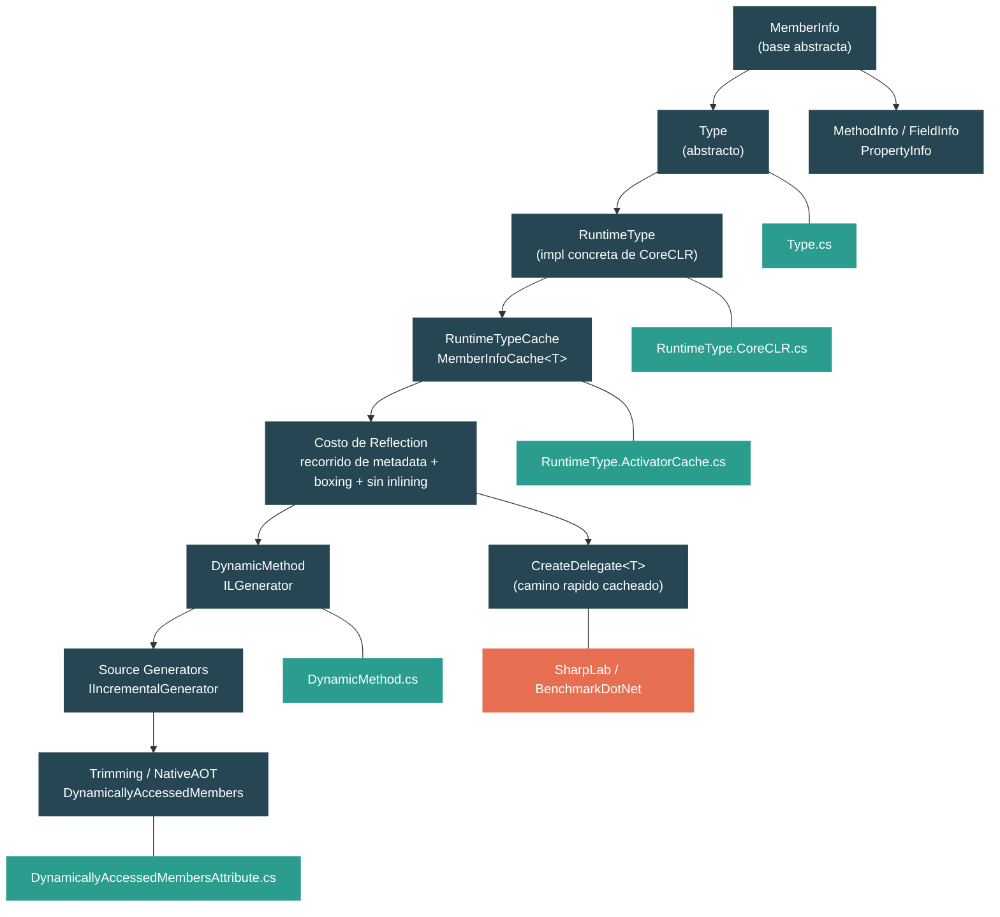

# Nivel 3: Avanzado — Reflection, Emit y Source Generators

> **Perfil objetivo:** Desarrollador que usa reflection pero quiere entender su costo y alternativas
> **Esfuerzo estimado:** 6 horas
> **Prerrequisitos:** [Nivel 2 completo](02-practitioner-generics.md) (especialmente 2.1 Generics)
> [English version](../en/03-advanced-reflection.md)

---

## Objetivos de Aprendizaje

Al finalizar este modulo vas a poder:

1. Describir la jerarquia del modelo de objetos de reflection (`MemberInfo` -> `Type`, `MethodInfo`, `PropertyInfo`, `FieldInfo`) y explicar como cada uno mapea a las tablas de metadata del CLI.
2. Trazar el camino desde `Type.GetType()` hasta el `RuntimeType` de CoreCLR y explicar por que `Type` es abstracto mientras que `RuntimeType` es la implementacion concreta que siempre recibis en runtime.
3. Explicar por que `GetMethod` y `MethodInfo.Invoke` son lentos recorriendo la maquinaria de `RuntimeTypeCache`, `MemberInfoCache<T>` y `GetMethodCandidates`.
4. Implementar y explicar estrategias de caching usando `MethodInfo.CreateDelegate<T>()` para eliminar el overhead de reflection por cada llamada.
5. Generar IL en runtime usando `DynamicMethod` e `ILGenerator`, y explicar cuando la generacion dinamica de codigo se justifica sobre otras alternativas.
6. Describir el modelo de source generators (`IIncrementalGenerator`) y explicar como reemplaza patrones basados en reflection con generacion de codigo en tiempo de compilacion.
7. Explicar por que NativeAOT y trimming rompen reflection, como `[DynamicallyAccessedMembers]` preserva metadata, y el tradeoff fundamental entre la flexibilidad de reflection y la compilacion ahead-of-time.

---

## Mapa Conceptual



---

## Curriculum

### Leccion 1 — El Modelo de Objetos de Reflection

#### Que vas a aprender

Reflection es la capacidad de inspeccionar y manipular metadata de tipos en runtime. Cada tipo, metodo, campo y propiedad en un assembly de .NET tiene un objeto de reflection correspondiente. En esta leccion vas a entender la jerarquia de clases que modela esta metadata y como se mapea a las tablas subyacentes del CLI.

#### El concepto

La jerarquia de reflection tiene su raiz en `MemberInfo`:

```
MemberInfo                       (base abstracta para toda metadata)
  +-- Type                       (abstracto: describe un tipo)
  |     +-- TypeInfo             (vista mas rica, extiende Type)
  |           +-- RuntimeType    (implementacion concreta de CoreCLR)
  +-- MethodBase                 (abstracto: metodos y constructores)
  |     +-- MethodInfo           (abstracto: describe un metodo)
  |     |     +-- RuntimeMethodInfo  (concreta de CoreCLR)
  |     +-- ConstructorInfo      (abstracto: describe un constructor)
  |           +-- RuntimeConstructorInfo
  +-- FieldInfo                  (abstracto: describe un campo)
  |     +-- RuntimeFieldInfo     (concreta de CoreCLR)
  +-- PropertyInfo               (abstracto: describe una propiedad)
  |     +-- RuntimePropertyInfo
  +-- EventInfo                  (abstracto: describe un evento)
        +-- RuntimeEventInfo
```

Cada tipo abstracto en la jerarquia define un contrato. Los tipos concretos `Runtime*` son las implementaciones que realmente recibis cuando llamas a `typeof(Foo)` o `obj.GetType()`. Nunca instancias `RuntimeType` directamente — el runtime lo crea por vos.

Cada objeto de reflection corresponde a una fila en las tablas de metadata del assembly (definidas por ECMA-335):

| Tipo de Reflection | Tabla de Metadata CLI |
|---|---|
| `Type` / `TypeInfo` | TypeDef o TypeRef |
| `MethodInfo` | MethodDef |
| `FieldInfo` | FieldDef |
| `PropertyInfo` | Property |
| `ConstructorInfo` | MethodDef (con nombre `.ctor` / `.cctor`) |
| `Assembly` | Tabla Assembly |

#### En el codigo fuente

Abri `src/libraries/System.Private.CoreLib/src/System/Type.cs`. La declaracion de la clase revela la herencia dual:

```csharp
public abstract partial class Type : MemberInfo, IReflect
{
    protected Type() { }

    public override MemberTypes MemberType => MemberTypes.TypeInfo;
```

`Type` extiende `MemberInfo` (ES un miembro — un tipo anidado es miembro de su tipo contenedor) e implementa `IReflect` (la interfaz legacy de reflection para interop COM). La clase es `abstract` y `partial` — diferentes archivos contribuyen comportamiento especifico de cada plataforma.

Observa como las consultas de tipo se implementan mediante el patron Template Method:

```csharp
public bool IsArray => IsArrayImpl();
protected abstract bool IsArrayImpl();
public bool IsByRef => IsByRefImpl();
protected abstract bool IsByRefImpl();
```

Las propiedades publicas `bool` delegan a metodos `protected abstract`. Esto permite que `RuntimeType` sobreescriba la implementacion con caminos optimizados (por ejemplo, chequeando un solo flag bit en el `MethodTable`) mientras la clase abstracta `Type` define el contrato de la API.

Abri `src/libraries/System.Private.CoreLib/src/System/Reflection/MethodInfo.cs`:

```csharp
public abstract partial class MethodInfo : MethodBase
{
    public override MemberTypes MemberType => MemberTypes.Method;

    public virtual ParameterInfo ReturnParameter => throw NotImplemented.ByDesign;
    public virtual Type ReturnType => throw NotImplemented.ByDesign;
```

`MethodInfo` extiende `MethodBase` (base compartida con `ConstructorInfo`). Los metodos `CreateDelegate` se definen aca — son la clave para escapar del overhead de reflection, como vamos a ver en la Leccion 3:

```csharp
public virtual Delegate CreateDelegate(Type delegateType) { throw new NotSupportedException(...); }
public T CreateDelegate<T>() where T : Delegate => (T)CreateDelegate(typeof(T));
```

`FieldInfo` y `PropertyInfo` siguen el mismo patron. Abri `src/libraries/System.Private.CoreLib/src/System/Reflection/FieldInfo.cs`:

```csharp
public abstract partial class FieldInfo : MemberInfo
{
    public override MemberTypes MemberType => MemberTypes.Field;
    public abstract FieldAttributes Attributes { get; }
    public abstract Type FieldType { get; }
```

Cada tipo de reflection expone los atributos de metadata de su tabla CLI (`FieldAttributes`, `MethodAttributes`, `TypeAttributes`) como propiedades computadas — `IsStatic`, `IsPublic`, `IsInitOnly` — que son todos chequeos simples de bitmask contra el valor de `Attributes`.

#### Ejercicio practico

1. Explora la jerarquia en runtime:
   ```csharp
   Type t = typeof(string);
   Console.WriteLine(t.GetType().FullName); // System.RuntimeType
   MethodInfo m = t.GetMethod("Contains", new[] { typeof(string) });
   Console.WriteLine(m.GetType().FullName); // System.Reflection.RuntimeMethodInfo
   FieldInfo f = typeof(int).GetField("MaxValue");
   Console.WriteLine(f.GetType().FullName); // System.Reflection.RuntimeFieldInfo
   ```
2. Inspeciona la clase base `MemberInfo`:
   ```csharp
   MemberInfo[] members = typeof(List<int>).GetMembers();
   foreach (var group in members.GroupBy(m => m.MemberType))
       Console.WriteLine($"{group.Key}: {group.Count()} miembros");
   ```
3. Compara `Type` y `TypeInfo`:
   ```csharp
   Type t = typeof(Dictionary<string, int>);
   TypeInfo ti = t.GetTypeInfo(); // mismo objeto, API mas rica
   Console.WriteLine(ReferenceEquals(t, ti)); // True en CoreCLR
   ```

#### Conclusion clave

El modelo de objetos de reflection es una jerarquia de clases abstractas (`Type`, `MethodInfo`, `FieldInfo`, `PropertyInfo`) que reflejan las tablas de metadata del CLI. Nunca ves las implementaciones concretas `Runtime*` directamente, pero son los unicos tipos que existen en runtime. Cada consulta de propiedad (`IsPublic`, `IsStatic`, `IsArray`) es en ultima instancia un chequeo de bitmask contra atributos de metadata.

#### Concepto erroneo comun

> *"`typeof(string)` crea un nuevo objeto `Type` cada vez."*
>
> No. `typeof(T)` siempre devuelve la instancia singleton de `RuntimeType` para ese tipo. El runtime mantiene exactamente un `RuntimeType` por tipo cargado. `typeof(string) == typeof(string)` siempre es `true`, y es una comparacion de identidad — no se necesita chequeo de igualdad profunda.

---

### Leccion 2 — RuntimeType: La Implementacion Real

#### Que vas a aprender

Cuando llamas a `Type.GetType("System.String")` o `typeof(string)`, el objeto que recibis no es `Type` — es `RuntimeType`, la clase interna sellada de CoreCLR que implementa toda la API de reflection sobre metadata viva del runtime. Esta leccion traza como funciona la resolucion de tipos y que cachea `RuntimeType` para hacer eficientes las consultas repetidas.

#### El concepto

`Type` es abstracto. El runtime no puede devolver una instancia de una clase abstracta. En cambio, el type loader de CoreCLR crea un `RuntimeType` por cada tipo que carga. Este `RuntimeType` mantiene un handle al `MethodTable` nativo (la representacion interna del tipo en el runtime) y lo usa para responder cada consulta:

```
typeof(string)
  -> [intrinseco del runtime]
  -> Localiza el MethodTable para System.String
  -> Lo envuelve en una instancia de RuntimeType (o devuelve la cacheada)
  -> Te lo devuelve como Type
```

La estructura critica de performance dentro de `RuntimeType` es el `RuntimeTypeCache`. Cachea todas las busquedas de miembros para que la segunda llamada a `GetMethods()` no recorra la metadata nuevamente:

```
RuntimeType
  -> RuntimeTypeCache (uno por RuntimeType)
       -> MemberInfoCache<RuntimeMethodInfo>     (metodos)
       -> MemberInfoCache<RuntimeConstructorInfo> (constructores)
       -> MemberInfoCache<RuntimeFieldInfo>       (campos)
       -> MemberInfoCache<RuntimePropertyInfo>    (propiedades)
       -> MemberInfoCache<RuntimeEventInfo>       (eventos)
```

Cada `MemberInfoCache<T>` se llena de forma lazy: la primera llamada a `GetMethodList()` recorre la metadata y construye el cache; las llamadas siguientes devuelven el array cacheado. El cache tambien mantiene tablas hash para busquedas por nombre case-sensitive y case-insensitive.

#### En el codigo fuente

Abri `src/coreclr/System.Private.CoreLib/src/System/RuntimeType.CoreCLR.cs`. La declaracion de la clase:

```csharp
internal sealed partial class RuntimeType : TypeInfo, ICloneable
```

Es `internal` (nunca se expone como tipo publico), `sealed` (no se puede derivar mas) y `partial` (dividida en multiples archivos). Extiende `TypeInfo`, que a su vez extiende `Type`.

Dentro de `RuntimeType`, el `RuntimeTypeCache` se define como clase anidada:

```csharp
internal sealed class RuntimeTypeCache
{
    internal enum CacheType
    {
        Method,
        Constructor,
        Field,
        Property,
        Event,
        Interface,
        NestedType
    }
```

El `MemberInfoCache<T>` anidado dentro muestra la estrategia de caching:

```csharp
private sealed class MemberInfoCache<T> where T : MemberInfo
{
    private CerHashtable<string, T[]?> m_csMemberInfos;   // case-sensitive
    private CerHashtable<string, T[]?> m_cisMemberInfos;  // case-insensitive
    private T[]? m_allMembers;
    private bool m_cacheComplete;
```

Cuando llamas `type.GetMethod("Foo")`, el flujo es:

1. `RuntimeType.GetMethodImpl()` llama a `GetMethodImplCommon()`.
2. `GetMethodImplCommon()` llama a `GetMethodCandidates()`.
3. `GetMethodCandidates()` llama a `Cache.GetMethodList(listType, name)`.
4. `GetMethodList()` delega a `GetMemberList()` que chequea el cache.
5. En cache miss, `PopulateMethods()` itera todos los metodos del tipo (y sus tipos base) usando el nativo `RuntimeTypeHandle.GetIntroducedMethods()`.
6. Cada method handle se envuelve en un `RuntimeMethodInfo` y se almacena.

La funcion `PopulateMethods` revela el costo real de la primera llamada de reflection:

```csharp
private unsafe RuntimeMethodInfo[] PopulateMethods(Filter filter)
{
    ListBuilder<RuntimeMethodInfo> list = default;
    RuntimeType declaringType = ReflectedType;

    // Recorre la jerarquia de tipos
    do
    {
        foreach (RuntimeMethodHandleInternal methodHandle
            in RuntimeTypeHandle.GetIntroducedMethods(declaringType))
        {
            // Filtra por nombre (case-sensitive o case-insensitive)
            if (filter.RequiresStringComparison())
            {
                if (!filter.Match(RuntimeMethodHandle.GetUtf8Name(methodHandle)))
                    continue;
            }

            MethodAttributes methodAttributes =
                RuntimeMethodHandle.GetAttributes(methodHandle);
            // ... computa binding flags, crea RuntimeMethodInfo, agrega a la lista
        }
    }
    while ((declaringType = declaringType.GetBaseType()!) != null);
```

Esto recorre toda la cadena de herencia, llamando a codigo nativo (`GetIntroducedMethods`, `GetAttributes`, `GetUtf8Name`) por cada metodo en cada tipo de la jerarquia. Por eso la primera llamada a `GetMethod` es costosa — y por eso existe la capa de caching.

#### Ejercicio practico

1. Verifica que `RuntimeType` es lo que recibis:
   ```csharp
   Type t = Type.GetType("System.String");
   Console.WriteLine(t.GetType().Name);     // RuntimeType
   Console.WriteLine(t.GetType().IsPublic); // False — es internal
   ```
2. Observa el caching midiendo llamadas repetidas:
   ```csharp
   var sw = System.Diagnostics.Stopwatch.StartNew();
   for (int i = 0; i < 100_000; i++)
       typeof(string).GetMethod("Contains", new[] { typeof(string) });
   Console.WriteLine($"Cacheado: {sw.ElapsedMilliseconds}ms");
   // Compara con la primera llamada que llena el cache
   ```
3. Explora los tipos de cache:
   ```csharp
   // Cada uno de estos llena un MemberInfoCache<T> diferente
   var methods = typeof(string).GetMethods();        // MemberInfoCache<RuntimeMethodInfo>
   var fields = typeof(string).GetFields();          // MemberInfoCache<RuntimeFieldInfo>
   var props = typeof(string).GetProperties();       // MemberInfoCache<RuntimePropertyInfo>
   var ctors = typeof(string).GetConstructors();     // MemberInfoCache<RuntimeConstructorInfo>
   ```

#### Conclusion clave

`RuntimeType` es la unica implementacion concreta de `Type` en CoreCLR. Envuelve un handle de `MethodTable` nativo y construye de forma lazy un `RuntimeTypeCache` que contiene `MemberInfoCache<T>` para cada tipo de miembro. La primera llamada de reflection a un tipo paga el costo de recorrer la metadata; las llamadas siguientes impactan el cache. Entender este comportamiento de dos fases es critico para codigo sensible a performance.

#### Concepto erroneo comun

> *"Cada llamada a `GetMethod()` re-escanea la metadata."*
>
> Solo la primera lo hace. Despues de que el `MemberInfoCache<RuntimeMethodInfo>` se llena, las busquedas siguientes son lookups en tablas hash contra los arrays cacheados. El costo real no es `GetMethod` en si sino lo que haces con el resultado — particularmente `Invoke`, que cubrimos a continuacion.

---

### Leccion 3 — El Costo de Reflection

#### Que vas a aprender

Reflection es lento. Pero "lento" no tiene sentido sin entender por que. En esta leccion vas a trazar el camino de `MethodInfo.Invoke`, entender las fuentes de overhead (validacion de argumentos, boxing, chequeos de seguridad, imposibilidad de inlining del JIT), y aprender estrategias de caching que reducen el costo de reflection entre 10 y 100 veces.

#### El concepto

Cuando llamas a `methodInfo.Invoke(obj, args)`, esto es lo que pasa:

1. **Validacion de argumentos**: El runtime chequea que la cantidad de argumentos coincida con la cantidad de parametros, que cada argumento sea asignable al tipo del parametro, y que el objeto destino sea del tipo correcto.
2. **Boxing**: Todos los argumentos se pasan como `object[]`. Los argumentos de value types deben ser boxeados. Los valores de retorno tambien se boxean.
3. **Chequeos de seguridad**: El runtime verifica que el llamador tenga permiso para acceder al miembro (chequeos de visibilidad, potencialmente `ReflectionPermission`).
4. **Sin optimizacion del JIT**: La llamada pasa por un camino de dispatch generico. El JIT no puede hacer inlining, no puede devirtualizar, no puede eliminar null checks, y no puede aplicar ninguna de sus optimizaciones normales.

Compara el costo de tres estrategias de llamada:

| Estrategia | Costo Relativo | Por que |
|---|---|---|
| Llamada directa `obj.Method()` | 1x (baseline) | Compilada por JIT, potencialmente inlineada |
| Delegate cacheado via `CreateDelegate<T>()` | 1-2x | Llamada a delegate type-safe, JIT puede inlinear |
| `MethodInfo.Invoke(obj, args)` | 50-100x | Boxing, validacion, sin inlining |
| `Type.InvokeMember(...)` | 100-200x | Busqueda por nombre + Invoke combinados |

La optimizacion clave es `MethodInfo.CreateDelegate<T>()`:

```csharp
// Lento: reflection invoke
MethodInfo method = typeof(string).GetMethod("Contains", new[] { typeof(string) });
bool result = (bool)method.Invoke("hello world", new object[] { "world" }); // boxing!

// Rapido: delegate cacheado
var contains = method.CreateDelegate<Func<string, string, bool>>();
bool result2 = contains("hello world", "world"); // llamada directa, sin boxing
```

`CreateDelegate` compila un delegate type-safe que llama al metodo directamente. Una vez creado, llamar al delegate es casi tan rapido como una llamada directa — el JIT puede inlinearlo, no hay boxing, y no hay validacion de argumentos en cada llamada.

Para `Activator.CreateInstance`, CoreCLR tiene un camino rapido dedicado a traves de `ActivatorCache`:

```csharp
internal sealed unsafe class ActivatorCache
{
    private readonly delegate*<void*, object?> _pfnAllocator;
    private readonly void* _allocatorFirstArg;
    private readonly delegate*<object?, void> _pfnRefCtor;
```

El `ActivatorCache` almacena punteros a funcion crudos hacia el allocator y constructor. Despues de la primera llamada, `Activator.CreateInstance<T>()` se convierte en un proceso de dos pasos: llamar al puntero de funcion del allocator para obtener memoria cruda, luego llamar al puntero de funcion del constructor sobre ella. Sin dispatch de reflection, sin `MethodInfo.Invoke` — solo instrucciones `calli` manejadas a traves de punteros a funcion cacheados.

#### En el codigo fuente

Abri `src/coreclr/System.Private.CoreLib/src/System/RuntimeType.CoreCLR.cs` y busca `GetMethodImplCommon`:

```csharp
private MethodInfo? GetMethodImplCommon(
    string? name, int genericParameterCount,
    BindingFlags bindingAttr, Binder? binder,
    CallingConventions callConv,
    Type[]? types, ParameterModifier[]? modifiers)
{
    ListBuilder<MethodInfo> candidates =
        GetMethodCandidates(name, genericParameterCount,
            bindingAttr, callConv, types, false);

    if (candidates.Count == 0)
        return null;

    if (types == null || types.Length == 0)
    {
        MethodInfo firstCandidate = candidates[0];
        if (candidates.Count == 1)
        {
            return firstCandidate;
        }
        // ... resolucion de ambiguedad
    }

    binder ??= DefaultBinder;
    return binder.SelectMethod(bindingAttr, candidates.ToArray(), types, modifiers)
        as MethodInfo;
}
```

Incluso despues de que el cache esta lleno, cada llamada a `GetMethod` debe: construir un `ListBuilder` de candidatos, aplicar filtrado (`FilterApplyMethodInfo`), manejar ambiguedad, y potencialmente invocar al `Binder`. Este es overhead que una llamada directa o un delegate cacheado se salta por completo.

Ahora abri `src/coreclr/System.Private.CoreLib/src/System/RuntimeType.ActivatorCache.cs` para ver como se optimiza `Activator.CreateInstance`:

```csharp
private ActivatorCache(RuntimeType rt)
{
    rt.CreateInstanceCheckThis();

    RuntimeTypeHandle.GetActivationInfo(rt,
        out _pfnAllocator!, out _allocatorFirstArg,
        out _pfnRefCtor!, out _pfnValueCtor!, out _ctorIsPublic);
```

`GetActivationInfo` es un QCall al runtime que extrae punteros a funcion para allocation y construction. Una vez cacheado:

```csharp
[MethodImpl(MethodImplOptions.AggressiveInlining)]
internal object? CreateUninitializedObject(RuntimeType rt)
{
    object? retVal = _pfnAllocator(_allocatorFirstArg);
    GC.KeepAlive(rt);
    return retVal;
}

[MethodImpl(MethodImplOptions.AggressiveInlining)]
internal void CallRefConstructor(object? uninitializedObject)
    => _pfnRefCtor(uninitializedObject);
```

Esto es lo mas rapido que puede ser la creacion de objetos — un `calli` manejado a un puntero a funcion, con `AggressiveInlining` para eliminar el overhead de la llamada al metodo. El `GC.KeepAlive(rt)` asegura que el tipo no sea recolectado mientras el allocator esta usando su `MethodTable*`.

#### Ejercicio practico

1. Benchmarkea las tres estrategias:
   ```csharp
   var method = typeof(int).GetMethod("CompareTo", new[] { typeof(int) });
   var del = method.CreateDelegate<Func<int, int, int>>();

   // Estrategia 1: Llamada directa
   int a = 42;
   int r1 = a.CompareTo(7);

   // Estrategia 2: Delegate cacheado
   int r2 = del(42, 7);

   // Estrategia 3: Reflection invoke
   int r3 = (int)method.Invoke(42, new object[] { 7 });
   ```
   Usa `Stopwatch` o BenchmarkDotNet para comparar 1M de iteraciones de cada una.

2. Medi `Activator.CreateInstance` vs `new`:
   ```csharp
   // Rapido: construccion directa
   var obj1 = new StringBuilder();

   // Mas lento en la primera llamada, luego cacheado:
   var obj2 = Activator.CreateInstance<StringBuilder>();
   ```

3. Explora el costo de boxing de `Invoke`:
   ```csharp
   MethodInfo m = typeof(int).GetMethod("ToString", Type.EmptyTypes);
   // Cada llamada boxea el argumento int Y el valor de retorno
   object result = m.Invoke(42, null); // 42 se boxea
   ```

#### Conclusion clave

El overhead de reflection viene de cuatro fuentes: boxing de argumentos en `object[]`, validacion de tipos en runtime, chequeos de seguridad, y la incapacidad del JIT de optimizar la llamada. La salida de emergencia es `MethodInfo.CreateDelegate<T>()`, que compila un delegate type-safe que el JIT puede optimizar como cualquier otra llamada. Para creacion de objetos, `ActivatorCache` cachea punteros a funcion crudos, haciendo que `Activator.CreateInstance` sea casi tan rapido como `new` despues de la primera llamada.

#### Concepto erroneo comun

> *"`Activator.CreateInstance` siempre es lento porque usa reflection."*
>
> En la primera llamada, si — debe resolver el constructor y construir el `ActivatorCache`. Pero las llamadas siguientes para el mismo tipo usan punteros a funcion cacheados (`delegate*<void*, object?>`) y son casi tan rapidas como `new`. El cache se almacena por tipo y persiste durante toda la vida del proceso.

---

### Leccion 4 — Reflection.Emit y DynamicMethod

#### Que vas a aprender

A veces necesitas generar codigo en runtime — no solo llamar metodos existentes a traves de reflection, sino crear metodos completamente nuevos. `System.Reflection.Emit` provee esta capacidad, y `DynamicMethod` es el punto de entrada liviano. En esta leccion vas a entender cuando la generacion de codigo en runtime es apropiada, como funciona `ILGenerator`, y que significa `[RequiresDynamicCode]` para la compatibilidad de tu biblioteca.

#### El concepto

`DynamicMethod` te permite crear un metodo en runtime emitiendo instrucciones IL directamente:

```csharp
// Crear un metodo: int Add(int a, int b) => a + b;
var dm = new DynamicMethod("Add", typeof(int), new[] { typeof(int), typeof(int) });
var il = dm.GetILGenerator();
il.Emit(OpCodes.Ldarg_0);    // push a
il.Emit(OpCodes.Ldarg_1);    // push b
il.Emit(OpCodes.Add);        // a + b
il.Emit(OpCodes.Ret);        // return

var add = dm.CreateDelegate<Func<int, int, int>>();
Console.WriteLine(add(3, 4)); // 7
```

El IL que emitis es el mismo IL que produce el compilador de C#. El JIT lo compila a codigo nativo cuando el delegate se invoca por primera vez. Despues de eso, las llamadas son tan rapidas como cualquier metodo compilado por JIT.

Casos de uso comunes para Reflection.Emit:

| Caso de Uso | Por que Emit? | Alternativa Hoy |
|---|---|---|
| Serialization (JSON/XML) | Generar readers/writers tipados por tipo | Source generators |
| ORM data binding | Generar setters de propiedades sin reflection | Source generators |
| Compilacion de expresiones | `Expression<T>.Compile()` usa Emit internamente | Source generators para formas conocidas |
| Frameworks de mocks | Generar subclases en runtime | Todavia requiere Emit |
| AOP / intercepcion | Generar clases proxy | Todavia requiere Emit |

La API mas amplia de `Reflection.Emit` incluye `AssemblyBuilder`, `ModuleBuilder`, `TypeBuilder` y `MethodBuilder` — un conjunto completo de tipos para generar assemblies enteros en runtime. `DynamicMethod` es la alternativa liviana cuando solo necesitas un unico metodo sin crear un tipo o assembly.

#### En el codigo fuente

Abri `src/libraries/System.Private.CoreLib/src/System/Reflection/Emit/DynamicMethod.cs`:

```csharp
public sealed partial class DynamicMethod : MethodInfo
{
    private static Module? s_anonymouslyHostedDynamicMethodsModule;
```

`DynamicMethod` extiende `MethodInfo` — un metodo dinamico ES un metodo en lo que respecta al sistema de reflection. Se puede introspeccionar, sus parametros se pueden consultar, y puede crear delegates. El `s_anonymouslyHostedDynamicMethodsModule` es un modulo sintetico que hospeda metodos dinamicos que no estan asociados a ningun tipo o modulo especifico.

Observa el atributo `[RequiresDynamicCode]` en cada constructor:

```csharp
[RequiresDynamicCode("Creating a DynamicMethod requires dynamic code.")]
public DynamicMethod(string name,
                     Type? returnType,
                     Type[]? parameterTypes)
```

Este atributo es el marcador de compatibilidad con trimmer/NativeAOT. Senala que esta API no puede funcionar en entornos que no soportan generacion de codigo en runtime (cubrimos esto en la Leccion 6).

Abri `src/libraries/System.Private.CoreLib/src/System/Reflection/Emit/ILGenerator.cs`:

```csharp
public abstract class ILGenerator
{
    public abstract void Emit(OpCode opcode);
    public abstract void Emit(OpCode opcode, int arg);
    public abstract void Emit(OpCode opcode, MethodInfo meth);
    // ...
    public abstract Label DefineLabel();
    public abstract void MarkLabel(Label loc);
    public abstract LocalBuilder DeclareLocal(Type localType);
```

`ILGenerator` es abstracto — la implementacion concreta depende del runtime. Provee sobrecargas de `Emit` para cada tipo de operando (ninguno, `byte`, `int`, `MethodInfo`, `Type`, etc.), mas metodos estructurales para labels, locals, y manejo de excepciones (`BeginExceptionBlock`, `BeginCatchBlock`).

La inicializacion del modulo de metodos dinamicos muestra como el runtime maneja el hosting:

```csharp
private static Module? s_anonymouslyHostedDynamicMethodsModule;
private static readonly object s_anonymouslyHostedDynamicMethodsModuleLock = new object();
```

Los metodos dinamicos necesitan un modulo para resolver referencias de token. Cuando no se provee un modulo o tipo especifico, el runtime crea un modulo anonimo compartido. Este modulo no tiene restricciones de permisos a nivel de assembly, por eso `DynamicMethod` tiene un parametro `skipVisibility` — controla si el IL generado puede acceder a miembros privados de otros tipos.

#### Ejercicio practico

1. Crea un getter de propiedad dinamico:
   ```csharp
   // En lugar de propertyInfo.GetValue(obj) (reflection invoke, boxing)
   // genera un delegate tipado

   PropertyInfo prop = typeof(string).GetProperty("Length");
   var dm = new DynamicMethod("GetLength", typeof(int),
       new[] { typeof(string) }, typeof(string).Module);

   var il = dm.GetILGenerator();
   il.Emit(OpCodes.Ldarg_0);
   il.EmitCall(OpCodes.Callvirt, prop.GetGetMethod(), null);
   il.Emit(OpCodes.Ret);

   var getLength = dm.CreateDelegate<Func<string, int>>();
   Console.WriteLine(getLength("hello")); // 5
   ```

2. Compara performance: `PropertyInfo.GetValue` vs delegate emitido:
   ```csharp
   PropertyInfo prop = typeof(string).GetProperty("Length");
   var getter = dm.CreateDelegate<Func<string, int>>();

   // Medi 1M de iteraciones de cada uno
   // prop.GetValue("test") — lento (boxing, validacion)
   // getter("test") — rapido (llamada directa, sin boxing)
   ```

3. Explora el parametro `skipVisibility`:
   ```csharp
   // Con skipVisibility: true, podes acceder a campos privados
   var dm = new DynamicMethod("ReadPrivate", typeof(object),
       new[] { typeof(object) },
       typeof(List<int>).Module, skipVisibility: true);
   ```

#### Conclusion clave

`DynamicMethod` e `ILGenerator` te permiten generar metodos compilados por JIT en runtime. Una vez que el delegate se crea, las llamadas son tan rapidas como C# compilado. Esto hace que Emit sea la solucion tradicional para escenarios de reflection criticos en performance — serializadores, ORMs, y frameworks de mocks todos lo usan. Sin embargo, Emit es incompatible con NativeAOT y trimming, por eso los source generators se prefieren cada vez mas.

#### Concepto erroneo comun

> *"Reflection.Emit es una alternativa a reflection."*
>
> Emit es un *complemento* de reflection, no un reemplazo. Tipicamente usas reflection para descubrir la estructura de un tipo (que campos tiene, que constructor llamar) y luego usas Emit para generar codigo optimizado para esa estructura. El descubrimiento sigue siendo reflection; Emit solo elimina el overhead de reflection por cada llamada.

---

### Leccion 5 — Source Generators: Metaprogramacion en Tiempo de Compilacion

#### Que vas a aprender

Los source generators mueven el trabajo que reflection y Emit hacen en runtime al tiempo de compilacion. En lugar de inspeccionar tipos y generar IL cuando tu aplicacion se ejecuta, un source generator inspecciona tipos y genera codigo fuente C# cuando el compilador se ejecuta. El resultado es codigo ordinario que el JIT puede optimizar completamente — sin reflection, sin Emit, sin costo en runtime.

#### El concepto

Un source generator es un plugin del compilador que:

1. Se ejecuta durante la compilacion (como parte de `dotnet build`).
2. Recibe los arboles de sintaxis y el modelo semantico de la compilacion.
3. Genera nuevos archivos de codigo fuente C# que se agregan a la compilacion.
4. No puede modificar codigo fuente existente — solo agregar archivos nuevos.

La API moderna es `IIncrementalGenerator` (reemplazando al viejo `ISourceGenerator`):

```csharp
[Generator]
public class MyGenerator : IIncrementalGenerator
{
    public void Initialize(IncrementalGeneratorInitializationContext context)
    {
        // Registra un pipeline que:
        // 1. Encuentra tipos marcados con [MyAttribute]
        // 2. Los transforma en un modelo
        // 3. Genera codigo fuente para cada uno

        var pipeline = context.SyntaxProvider
            .ForAttributeWithMetadataName(
                "MyNamespace.MyAttribute",
                predicate: (node, _) => node is ClassDeclarationSyntax,
                transform: (ctx, _) => /* extrae modelo del syntax/symbol */)
            .Where(m => m is not null);

        context.RegisterSourceOutput(pipeline, (spc, model) =>
        {
            spc.AddSource($"{model.Name}.g.cs", /* codigo C# generado */);
        });
    }
}
```

El diseno "incremental" significa que el generator solo se re-ejecuta cuando sus entradas cambian. Si modificas un archivo que no afecta el pipeline del generator, se saltea la regeneracion por completo.

Lo que reemplazan los source generators:

| Patron en Runtime | Equivalente con Source Generator |
|---|---|
| Loop `typeof(T).GetProperties()` | Generator emite accessors de propiedades tipados en compilacion |
| `Activator.CreateInstance(type)` | Generator emite `new ConcreteType()` en compilacion |
| Fallback de reflection de `JsonSerializer` | Source generator de `System.Text.Json` emite serializador tipado |
| Resolucion en runtime de `IServiceProvider` | Generator emite registraciones conocidas en compilacion |

El source generator de `System.Text.Json` es el ejemplo emblematico de este repositorio. En lugar de usar reflection para descubrir propiedades en runtime, genera un `JsonTypeInfo<T>` para cada tipo en compilacion, conteniendo metadata de propiedades pre-computada, getters/setters tipados, y delegates de constructores.

#### En el codigo fuente

Los source generators en el repositorio dotnet/runtime viven junto a las bibliotecas que complementan. El source generator de JSON, por ejemplo, esta en `src/libraries/System.Text.Json/gen/`. Los generators se empaquetan como analyzers y se envian como parte del paquete NuGet de la biblioteca.

La idea arquitectonica clave es que los source generators producen codigo que se ve como lo que escribirias a mano. Un serializador generado para una clase `Person` podria producir:

```csharp
// Auto-generado — no editar
internal static void Serialize(Utf8JsonWriter writer, Person value)
{
    writer.WriteStartObject();
    writer.WriteString("name", value.Name);    // acceso directo a propiedad, no reflection
    writer.WriteNumber("age", value.Age);       // sin GetProperty/GetValue
    writer.WriteEndObject();
}
```

Este codigo generado tiene cero overhead de reflection. El JIT puede inlinear los accesos a propiedades, devirtualizar las llamadas al writer, y aplicar todas sus optimizaciones normales.

#### Ejercicio practico

1. Usa el source generator de JSON en un proyecto de prueba:
   ```csharp
   [JsonSerializable(typeof(Person))]
   internal partial class PersonJsonContext : JsonSerializerContext { }

   public class Person
   {
       public string Name { get; set; }
       public int Age { get; set; }
   }

   // Usa el contexto generado en lugar de serialization basada en reflection
   string json = JsonSerializer.Serialize(
       new Person { Name = "Alice", Age = 30 },
       PersonJsonContext.Default.Person);
   ```

2. Inspeciona el codigo generado. Despues de buildear, busca en `obj/Debug/net9.0/generated/` los archivos `.g.cs` producidos por el generator. Observa los accessors de propiedades tipados — sin reflection.

3. Compara el tiempo de startup entre serialization de JSON basada en reflection y generada por source generator. La version generada evita la penalidad de cold-start del descubrimiento de tipos por reflection.

#### Conclusion clave

Los source generators mueven la metaprogramacion de runtime a tiempo de compilacion. Producen codigo C# ordinario que el JIT optimiza completamente. Para disenos de bibliotecas nuevas, preferi source generators sobre reflection cuando los tipos son conocidos en compilacion. El tradeoff: los source generators requieren mas ingenieria inicial y solo funcionan para tipos visibles durante la compilacion.

#### Concepto erroneo comun

> *"Los source generators pueden modificar codigo fuente existente."*
>
> No pueden. Los source generators son *solo aditivos* — generan archivos nuevos. Si necesitas modificar el comportamiento de una clase existente, generas una clase `partial` que la extiende. Esta restriccion es intencional: significa que los generators no pueden romper codigo existente y su output siempre es inspeccionable.

---

### Leccion 6 — Trimming y Reflection

#### Que vas a aprender

NativeAOT y IL trimming compilan tu aplicacion ahead of time, removiendo codigo no usado para producir binarios pequenos y rapidos. Pero reflection descubre miembros en runtime — el trimmer no puede saber sobre cuales metodos o propiedades vas a reflexionar. Esta tension fundamental entre reflection y compilacion ahead-of-time se resuelve a traves de anotaciones: `[DynamicallyAccessedMembers]`, `[RequiresUnreferencedCode]`, y `[RequiresDynamicCode]`. En esta leccion vas a entender los tradeoffs y aprender a escribir codigo seguro para trimming.

#### El concepto

**El problema**: Cuando el trimmer analiza tu codigo, sigue grafos de llamadas estaticos. Si ningun codigo llama a `Person.Name`, el trimmer remueve la propiedad. Pero si llamas a `typeof(Person).GetProperty("Name")`, el trimmer ve un string literal — no sabe en compilacion que este string se refiere a `Person.Name`. La propiedad se recorta, y `GetProperty` devuelve `null` en runtime.

**Las anotaciones**:

| Atributo | Significado | Se aplica a |
|---|---|---|
| `[DynamicallyAccessedMembers(types)]` | "Voy a reflexionar sobre estos tipos de miembros en este tipo" | Parametros, campos, valores de retorno de tipo `Type` o `string` |
| `[RequiresUnreferencedCode(msg)]` | "Este metodo es inseguro para trimming" | Metodos que usan reflection de formas que el trimmer no puede analizar |
| `[RequiresDynamicCode(msg)]` | "Este metodo genera codigo en runtime" | Metodos que usan `Reflection.Emit`, `Expression.Compile`, etc. |

Ejemplo de una API segura para trimming:

```csharp
// La anotacion le dice al trimmer: "preserva propiedades publicas en T"
public void PrintProperties<[DynamicallyAccessedMembers(
    DynamicallyAccessedMemberTypes.PublicProperties)] T>(T obj)
{
    foreach (var prop in typeof(T).GetProperties())
        Console.WriteLine($"{prop.Name} = {prop.GetValue(obj)}");
}
```

Sin la anotacion, el trimmer removeria las propiedades de `T` porque no ve codigo estatico accediendolas. Con la anotacion, el trimmer sabe que debe preservar todas las propiedades publicas de cualquier tipo que se pase como `T`.

**La jerarquia de seguridad para trimming**:

1. **Mejor**: Sin reflection en absoluto. Usa source generators, generacion de codigo en compilacion, o codigo directo.
2. **Bueno**: Reflection anotado. Usa `[DynamicallyAccessedMembers]` para declarar lo que necesitas.
3. **Aceptable**: `[RequiresUnreferencedCode]` — marcas el metodo como inseguro y dejas que el llamador decida.
4. **Peor**: Reflection sin anotar. El codigo se rompe silenciosamente cuando se recorta.

#### En el codigo fuente

Abri `src/libraries/System.Private.CoreLib/src/System/Diagnostics/CodeAnalysis/DynamicallyAccessedMembersAttribute.cs`:

```csharp
[AttributeUsage(
    AttributeTargets.Field | AttributeTargets.ReturnValue |
    AttributeTargets.GenericParameter | AttributeTargets.Parameter |
    AttributeTargets.Property | AttributeTargets.Method |
    AttributeTargets.Class | AttributeTargets.Interface |
    AttributeTargets.Struct,
    Inherited = false)]
public sealed class DynamicallyAccessedMembersAttribute : Attribute
{
    public DynamicallyAccessedMembersAttribute(
        DynamicallyAccessedMemberTypes memberTypes)
    {
        MemberTypes = memberTypes;
    }

    public DynamicallyAccessedMemberTypes MemberTypes { get; }
}
```

El atributo se puede aplicar a casi cualquier cosa — parametros, campos, valores de retorno, type parameters genericos. El enum `DynamicallyAccessedMemberTypes` es un flags enum con valores como `PublicMethods`, `NonPublicFields`, `PublicConstructors`, etc.

Ahora mira como el runtime usa este atributo. En `RuntimeType.CoreCLR.cs`, el override de `GetMethodImpl` esta anotado:

```csharp
[DynamicallyAccessedMembers(DynamicallyAccessedMemberTypes.PublicMethods
    | DynamicallyAccessedMemberTypes.NonPublicMethods)]
protected override MethodInfo? GetMethodImpl(
    string name, int genericParameterCount,
    BindingFlags bindingAttr, ...)
```

Esto le dice al trimmer: "cuando se llama a este metodo, preserva tanto metodos publicos como no publicos en el tipo destino." La anotacion fluye a traves del analisis de data-flow del trimmer — si llamas a `type.GetMethod("Foo")`, el trimmer sigue la anotacion `[DynamicallyAccessedMembers]` para determinar que miembros preservar.

Observa tambien como `Assembly.DefinedTypes` esta anotado:

```csharp
public virtual IEnumerable<TypeInfo> DefinedTypes
{
    [RequiresUnreferencedCode("Types might be removed")]
    get
    {
        Type[] types = GetTypes();
```

La anotacion `[RequiresUnreferencedCode]` significa: "llamar a esta propiedad puede fallar despues de trimming porque el trimmer puede haber removido tipos." Cualquier codigo que llame a esta propiedad producira un warning del trimmer, forzando al desarrollador a suprimir el warning (aceptando el riesgo) o encontrar una alternativa segura para trimming.

#### Ejercicio practico

1. Crea un metodo inseguro para trimming y observa el warning:
   ```csharp
   // Esto produce el warning del trimmer IL2026
   static void PrintType(string typeName)
   {
       Type? t = Type.GetType(typeName);
       foreach (var m in t?.GetMethods() ?? Array.Empty<MethodInfo>())
           Console.WriteLine(m.Name);
   }
   ```
   Builda con `<PublishTrimmed>true</PublishTrimmed>` y observa los warnings.

2. Arreglalo con anotaciones:
   ```csharp
   static void PrintType(
       [DynamicallyAccessedMembers(DynamicallyAccessedMemberTypes.PublicMethods)]
       Type type)
   {
       foreach (var m in type.GetMethods())
           Console.WriteLine(m.Name);
   }
   ```

3. Testa compatibilidad con NativeAOT:
   ```csharp
   // Esto funciona con NativeAOT porque el tipo se conoce estaticamente
   typeof(string).GetMethods();

   // Esto puede fallar porque el trimmer no puede saber a que resuelve typeName
   Type.GetType(someString).GetMethods();
   ```

#### Conclusion clave

Trimming y NativeAOT remueven codigo no usado en el momento de publicacion, pero reflection descubre codigo en runtime. El atributo `[DynamicallyAccessedMembers]` cierra esta brecha diciendole al trimmer que miembros preservar. `[RequiresUnreferencedCode]` marca metodos que no pueden hacerse seguros para trimming. `[RequiresDynamicCode]` marca metodos que requieren generacion de codigo en runtime (Emit, Expression.Compile). Para codigo nuevo, preferi source generators y patrones estaticos que eviten reflection por completo.

#### Concepto erroneo comun

> *"NativeAOT no soporta reflection en absoluto."*
>
> NativeAOT soporta reflection para tipos y miembros que el compilador puede determinar estaticamente que seran necesarios. `typeof(MyClass).GetProperties()` funciona si `MyClass` esta referenciada en tu codigo. Lo que NativeAOT no puede soportar es reflection *sin limites* — `Type.GetType(userInput)` para un string arbitrario, o `Assembly.LoadFrom()` cargando assemblies desconocidos. Las anotaciones existen precisamente para decirle al compilador que reflection va a realizar tu codigo.

---

## Guia de Lectura del Codigo Fuente

Estos son los archivos clave para este modulo. Las calificaciones de dificultad reflejan la complejidad conceptual para un lector de Nivel 3.

| # | Archivo | Dificultad | Que buscar |
|---|---|---|---|
| 1 | `src/libraries/System.Private.CoreLib/src/System/Type.cs` | Dos estrellas | Base abstracta, patron Template Method `IsArrayImpl`/`IsByRefImpl`, `IReflect` |
| 2 | `src/libraries/System.Private.CoreLib/src/System/Reflection/MethodInfo.cs` | Dos estrellas | `CreateDelegate<T>()` — la clave para escapar del overhead de reflection |
| 3 | `src/libraries/System.Private.CoreLib/src/System/Reflection/PropertyInfo.cs` | Dos estrellas | Sobrecargas de `GetValue`/`SetValue`, como se modelan los indexers |
| 4 | `src/libraries/System.Private.CoreLib/src/System/Reflection/FieldInfo.cs` | Dos estrellas | Propiedades de bitmask `FieldAttributes`, `RuntimeFieldHandle` |
| 5 | `src/libraries/System.Private.CoreLib/src/System/Reflection/Assembly.cs` | Dos estrellas | `DefinedTypes` con `[RequiresUnreferencedCode]`, cache `s_loadfile` |
| 6 | `src/coreclr/System.Private.CoreLib/src/System/RuntimeType.CoreCLR.cs` | Cuatro estrellas | `RuntimeTypeCache`, `MemberInfoCache<T>`, `PopulateMethods`, `GetMethodCandidates`, `GetMethodImplCommon` |
| 7 | `src/coreclr/System.Private.CoreLib/src/System/RuntimeType.ActivatorCache.cs` | Tres estrellas | Caching de punteros a funcion para `Activator.CreateInstance`, `delegate*<void*, object?>` |
| 8 | `src/libraries/System.Private.CoreLib/src/System/Reflection/Emit/DynamicMethod.cs` | Tres estrellas | `[RequiresDynamicCode]`, modulo de hosting anonimo, `skipVisibility` |
| 9 | `src/libraries/System.Private.CoreLib/src/System/Reflection/Emit/ILGenerator.cs` | Tres estrellas | Sobrecargas abstractas de `Emit`, `DefineLabel`/`MarkLabel` para flujo de control |
| 10 | `src/libraries/System.Private.CoreLib/src/System/Diagnostics/CodeAnalysis/DynamicallyAccessedMembersAttribute.cs` | Dos estrellas | La anotacion del trimmer que conecta reflection en runtime con compilacion ahead-of-time |

**Estrategia de lectura**: Empieza con los archivos 1-4 para entender la API abstracta de reflection. Luego lee el archivo 6 (el mas importante) para ver como CoreCLR la implementa — concentrate en `RuntimeTypeCache` y `PopulateMethods`. El archivo 7 muestra el camino rapido de `Activator.CreateInstance`. Los archivos 8-9 cubren Emit. El archivo 10 es corto pero critico para entender trimming.

---

## Herramientas de Diagnostico y Comandos

| Herramienta / Tecnica | Que muestra | Como usarla |
|---|---|---|
| [BenchmarkDotNet](https://benchmarkdotnet.org/) | Costo preciso de reflection vs delegates vs llamadas directas | Compara `Invoke` vs `CreateDelegate<T>()` vs llamada directa con `[MemoryDiagnoser]` para tracking de allocations |
| [SharpLab](https://sharplab.io/) | IL para llamadas de reflection vs llamadas directas | Pega ambas versiones; observa instrucciones `callvirt` vs `call` y boxing |
| `dotnet publish -p:PublishTrimmed=true` | Warnings del trimmer para reflection inseguro | Muestra warnings IL2026/IL2046/IL2075 para reflection sin anotar |
| `dotnet publish -r <rid> -p:PublishAot=true` | Compatibilidad con NativeAOT | Revela cuales patrones de reflection sobreviven la compilacion ahead-of-time |
| `ILSpy` / `ILVerify` | Inspeccionar IL emitido desde DynamicMethod | Guarda el method body emitido y decompila para verificar correctitud |
| Variable de entorno `DOTNET_JitDisasm` | Ver output del JIT para delegate vs dispatch de reflection | Compara codigo nativo para resultado de `CreateDelegate` vs `MethodInfo.Invoke` |
| `typeof(T).GetType().FullName` | Verificar tipo concreto en runtime | Confirma que siempre recibis `RuntimeType`, `RuntimeMethodInfo`, etc. |

---

## Autoevaluacion

### Preguntas

1. **Por que `Type` es abstracto si cada llamada en runtime devuelve un `RuntimeType` concreto?** Que patron de diseno representa esto, y que beneficio provee?

2. **Traza lo que pasa cuando llamas `typeof(MyClass).GetMethod("Foo")` por primera vez.** Nombra cada capa de cache y estructura de datos involucrada, desde el `RuntimeType` pasando por `RuntimeTypeCache` hasta `PopulateMethods`.

3. **Por que `MethodInfo.Invoke(obj, args)` es 50-100x mas lento que una llamada directa?** Lista al menos cuatro fuentes de overhead.

4. **Explica como `MethodInfo.CreateDelegate<Func<string, int>>()` elimina el overhead de reflection.** Que pasa a nivel del JIT cuando llamas al delegate resultante?

5. **Como hace `ActivatorCache` para que `Activator.CreateInstance` sea rapido despues de la primera llamada?** Que se almacena en `_pfnAllocator` y `_pfnRefCtor`?

6. **Que le dice `[DynamicallyAccessedMembers(DynamicallyAccessedMemberTypes.PublicProperties)]` al trimmer?** Que pasa si omitis esta anotacion y publicas con trimming habilitado?

7. **Cuando elegirias `DynamicMethod` en lugar de un source generator?** Da un escenario donde Emit es necesario y uno donde un source generator es mejor.

### Desafio Practico

Escribi un copiador de propiedades sin reflection que use tres estrategias diferentes y benchmarkealas:

1. **Reflection puro**: `foreach (var prop in type.GetProperties()) destProp.SetValue(dest, srcProp.GetValue(src))`.
2. **Delegates cacheados**: Usa `MethodInfo.CreateDelegate` para crear delegates tipados de getter/setter para cada propiedad.
3. **DynamicMethod**: Usa `ILGenerator` para emitir un metodo que copia todas las propiedades en un solo method body compilado.

```csharp
public class Person
{
    public string Name { get; set; }
    public int Age { get; set; }
    public DateTime BirthDate { get; set; }
}
```

<details>
<summary>Pista para la Estrategia 2</summary>

```csharp
var props = typeof(Person).GetProperties();
var copiers = new List<Action<Person, Person>>();
foreach (var prop in props)
{
    var getter = prop.GetGetMethod().CreateDelegate<Func<Person, object>>();
    var setter = prop.GetSetMethod().CreateDelegate<Action<Person, object>>();
    copiers.Add((src, dst) => setter(dst, getter(src)));
}
// Ahora usa copiers en un loop — mucho mas rapido que GetValue/SetValue
```

Para performance aun mejor, usa delegates fuertemente tipados por tipo de propiedad (por ejemplo, `Func<Person, string>` para `Name`, `Func<Person, int>` para `Age`) para evitar boxing de value types.
</details>

<details>
<summary>Pista para la Estrategia 3</summary>

```csharp
var dm = new DynamicMethod("CopyPerson", null,
    new[] { typeof(Person), typeof(Person) },
    typeof(Person).Module, skipVisibility: true);

var il = dm.GetILGenerator();
foreach (var prop in typeof(Person).GetProperties())
{
    il.Emit(OpCodes.Ldarg_1);                              // dest
    il.Emit(OpCodes.Ldarg_0);                              // src
    il.EmitCall(OpCodes.Callvirt, prop.GetGetMethod(), null); // src.get_Prop()
    il.EmitCall(OpCodes.Callvirt, prop.GetSetMethod(), null); // dest.set_Prop(value)
}
il.Emit(OpCodes.Ret);

var copy = dm.CreateDelegate<Action<Person, Person>>();
// copy(source, destination) — compilado, sin overhead de reflection
```
</details>

---

## Conexiones

| Direccion | Modulo | Relacion |
|---|---|---|
| **Anterior** | [2.1 — Generics](02-practitioner-generics.md) | Los generics interactuan fuertemente con reflection: `Type.MakeGenericType`, `MethodInfo.MakeGenericMethod`, y el diccionario generico todos se construyen sobre conceptos del Modulo 2.1. |
| **Relacionado** | [2.7 — System.Text.Json](02-practitioner-json.md) | El source generator de la biblioteca JSON es el mejor ejemplo de reemplazar reflection con generacion de codigo en compilacion en este repositorio. |
| **Mas profundo** | [3.8 — Internos de NativeAOT](03-advanced-nativeaot.md) | Como el compilador ahead-of-time analiza el uso de reflection y que hacen `rd.xml` / `ILLink.Substitutions.xml`. |
| **Mas profundo** | [4.2 — Internos del Sistema de Tipos](04-expert-type-system.md) | Las estructuras nativas MethodTable y EEClass que `RuntimeType` envuelve. |

---

## Glosario

| Termino | Definicion |
|---|---|
| **MemberInfo** | Clase base abstracta para todos los objetos de reflection (tipos, metodos, campos, propiedades, eventos). Cada miembro de un tipo esta representado por una subclase de `MemberInfo`. |
| **RuntimeType** | Clase interna sellada de CoreCLR que es la implementacion concreta de `Type`. Cada llamada a `typeof()` y `GetType()` devuelve una instancia de `RuntimeType`. |
| **RuntimeTypeCache** | Cache por tipo dentro de `RuntimeType` que almacena arrays de `RuntimeMethodInfo`, `RuntimeFieldInfo`, etc. Se llena de forma lazy en la primera consulta de reflection, luego se reutiliza. |
| **MemberInfoCache\<T\>** | El cache tipado dentro de `RuntimeTypeCache` que contiene miembros de un tipo especifico. Contiene tablas hash para busquedas por nombre case-sensitive y case-insensitive. |
| **CreateDelegate\<T\>()** | Metodo en `MethodInfo` que compila un delegate type-safe para el metodo reflejado. Elimina el overhead de reflection por llamada (sin boxing, sin validacion, el JIT puede inlinear). |
| **ActivatorCache** | Cache interno de CoreCLR para `Activator.CreateInstance`. Almacena punteros a funcion (`delegate*<void*, object?>`) al allocator y constructor para creacion rapida y repetida de objetos. |
| **DynamicMethod** | Subclase de `MethodInfo` que permite generar IL en runtime. Alternativa liviana al `Reflection.Emit` completo (sin necesidad de crear tipos o assemblies). |
| **ILGenerator** | La API para emitir instrucciones IL en un `DynamicMethod` o `MethodBuilder`. Provee `Emit`, `DefineLabel`, `DeclareLocal`, y metodos de manejo de excepciones. |
| **IIncrementalGenerator** | La API moderna de source generators. Un plugin del compilador que genera archivos de codigo fuente C# durante la compilacion, reemplazando reflection en runtime con generacion de codigo en compilacion. |
| **DynamicallyAccessedMembers** | Un atributo que le dice al trimmer que operaciones de reflection va a realizar un metodo, permitiendole preservar la metadata necesaria para builds trimmed/NativeAOT. |
| **RequiresUnreferencedCode** | Un atributo que marca un metodo como inseguro para trimming. Los llamadores reciben un warning del compilador, forzandolos a reconocer el riesgo de trimming. |
| **RequiresDynamicCode** | Un atributo que marca un metodo como que requiere generacion de codigo en runtime (Emit, Expression.Compile). Incompatible con NativeAOT. |
| **Trimming** | El proceso de remover codigo y metadata inalcanzables de una aplicacion publicada. Reduce el tamano del binario pero puede romper reflection que referencia miembros removidos. |
| **NativeAOT** | Compilacion ahead-of-time para .NET que produce un binario nativo sin JIT. Soporta reflection anotado pero no puede soportar carga dinamica de tipos sin limites o Emit. |

---

## Referencias

| Recurso | Tipo | Relevancia |
|---|---|---|
| [Book of the Runtime — Type System Overview](https://github.com/dotnet/runtime/blob/main/docs/design/coreclr/botr/type-system.md) | Documento de diseno | Cubre RuntimeType, MethodTable, y como reflection mapea a estructuras nativas |
| [ECMA-335 Standard, Seccion II.22 — Tablas de Metadata](https://www.ecma-international.org/publications-and-standards/standards/ecma-335/) | Especificacion | La definicion formal de tablas TypeDef, MethodDef, FieldDef que reflection expone |
| [Documentacion de Trimming](https://learn.microsoft.com/en-us/dotnet/core/deploying/trimming/trim-self-contained) | Docs oficiales | Como preparar codigo para trimming, guia de anotaciones |
| [Source Generator Cookbook](https://github.com/dotnet/roslyn/blob/main/docs/features/incremental-generators.md) | Documento de diseno | Diseno y patrones de la API IIncrementalGenerator |
| [Source Generator de System.Text.Json](https://learn.microsoft.com/en-us/dotnet/standard/serialization/system-text-json/source-generation) | Docs oficiales | Ejemplo emblematico de reemplazar reflection con source generation |
| [BenchmarkDotNet](https://benchmarkdotnet.org/) | Herramienta | Medir overhead de reflection vs delegate vs llamada directa |
| [Andrew Lock — Creating a source generator](https://andrewlock.net/series/creating-a-source-generator/) | Serie de blog | Recorrido practico de construir un incremental source generator |

---

*Proximo modulo: [3.8 — Internos de NativeAOT](03-advanced-nativeaot.md)*
