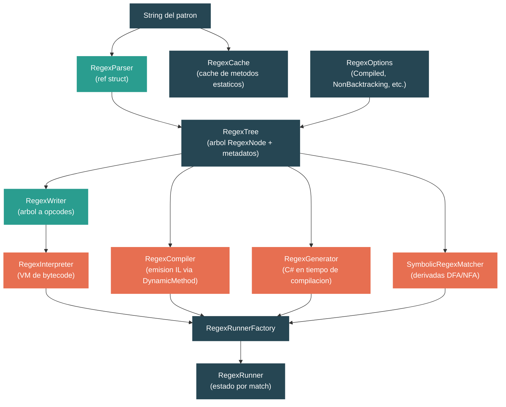

# Nivel 3: Avanzado -- Expresiones Regulares: El Motor de Compilacion

> **Perfil objetivo:** Desarrollador que usa regex pero no entiende los internos del motor -- parsing, estrategias de compilacion o cuando elegir cada motor
> **Esfuerzo estimado:** 4 horas
> **Prerrequisitos:** [Nivel 2 -- Manejo de Strings y Procesamiento de Texto](02-practitioner-strings.md)
> [English version](../en/03-advanced-regex.md)

---

## Objetivos de Aprendizaje

Al finalizar este modulo vas a poder:

1. Trazar el ciclo de vida completo de un patron regex desde el string hasta el `RegexTree` y el motor de ejecucion, identificando las clases clave en cada etapa.
2. Explicar las diferencias entre los tres motores de ejecucion: interpreter (VM de bytecode), compiler (emision de IL) y source generator (C# en tiempo de compilacion).
3. Describir como el motor NonBacktracking usa derivadas simbolicas y automatas DFA/NFA para garantizar matching en tiempo lineal, y articular sus limitaciones.
4. Leer la estructura del arbol `RegexNode` y entender como el parser transforma la sintaxis del patron en una representacion interna normalizada.
5. Tomar decisiones informadas sobre `RegexOptions`, estrategias de caching y seleccion de motor para cargas de trabajo en produccion.

---

## Mapa Conceptual



---

## Contenido

### Leccion 1 -- Arquitectura de Regex: Del Patron al Arbol de Parsing

#### Que vas a aprender

Como un string con un patron regex se parsea en un `RegexTree` que contiene objetos `RegexNode`, que optimizaciones ocurren durante el parsing, y como el arbol alimenta las diferentes estrategias de ejecucion.

#### El concepto

Toda regex en .NET pasa por el mismo front end sin importar cual motor la ejecuta finalmente:

```
string del patron
    |
    v
RegexParser  (ref struct -- asignado en el stack, una sola pasada)
    |
    v
arbol RegexNode  (AST normalizado y optimizado)
    |
    v
RegexTree  (nodo raiz + info de capturas + FindOptimizations)
    |
    +---> RegexWriter -------> RegexInterpreterCode ---> RegexInterpreter   (default)
    +---> RegexCompiler -----> IL DynamicMethod -------> CompiledRegexRunner (Compiled)
    +---> RegexGenerator ----> codigo fuente C# -------> tipo compilado     ([GeneratedRegex])
    +---> RegexNodeConverter -> SymbolicRegexNode ------> SymbolicRegexMatcher (NonBacktracking)
```

El `RegexParser` es un `ref struct` -- no puede escapar del stack, lo que previene asignaciones de memoria durante el parsing. Construye el arbol en una sola pasada, manteniendo un stack de objetos `RegexNode` para el anidamiento.

**RegexNode** es el tipo de nodo del AST. Cada nodo tiene un `Kind` (de `RegexNodeKind`), nodos hijo opcionales, y metadatos como el caracter (`Ch`), string/set (`Str`), o limites de loops (`M` y `N`). El parser realiza optimizaciones significativas durante la construccion del arbol:

- **Aplanamiento de loops**: Un loop alrededor de un solo caracter (`a*`) se convierte en un nodo `Oneloop` especializado en vez de un `Loop` generico envolviendo un nodo `One`.
- **Coalescencia de strings**: Nodos de caracteres individuales adyacentes se fusionan en un nodo `Multi` (por ejemplo, `abc` se convierte en un solo nodo, no tres).
- **Promocion atomica**: Los loops greedy que no pueden hacer backtracking (porque lo que sigue no puede coincidir con lo que el loop coincide) se promueven a loops atomicos, eliminando la sobrecarga de backtracking.

El `RegexTree` envuelve el `RegexNode` raiz con metadatos: conteo de capturas, mapeos de nombres de captura, las `RegexOptions`, y un objeto `RegexFindOptimizations` que precalcula estrategias para encontrar rapidamente donde en la entrada podria comenzar un match (anclas iniciales, prefijos requeridos, clases de caracteres en offsets fijos).

#### En el codigo fuente

El parser vive en `src/libraries/System.Text.RegularExpressions/src/System/Text/RegularExpressions/RegexParser.cs`:

```csharp
/// <summary>Builds a tree of RegexNodes from a regular expression.</summary>
internal ref struct RegexParser
{
    private RegexNode? _stack;
    private RegexNode? _group;
    private RegexNode? _alternation;
    private RegexNode? _concatenation;
    private RegexNode? _unit;

    private readonly string _pattern;
    private int _pos;
    // ...
}
```

Los campos `_stack`, `_group`, `_alternation`, `_concatenation` y `_unit` forman un stack de parsing manual. Los grupos se pushean a `_stack`, las ramas de alternacion se acumulan en `_alternation`, y los elementos concatenados se juntan en `_concatenation`. Esto evita recursion y mantiene el parser en un loop compacto y libre de asignaciones.

La clase `RegexNode` en `RegexNode.cs` almacena el arbol:

```csharp
internal sealed class RegexNode
{
    private object? Children; // null, un RegexNode, o List<RegexNode>
    public RegexNodeKind Kind { get; private set; }
    public string? Str { get; private set; }   // string de set o literal multi-caracter
    public char Ch { get; private set; }        // caracter individual
    public int M { get; private set; }          // iteraciones minimas o numero de captura
    public int N { get; private set; }          // iteraciones maximas o numero de uncapture
    public RegexOptions Options;
    public RegexNode? Parent;
}
```

El campo `Children` es polimorfico: `null` para hojas, un solo `RegexNode` para operadores unarios, o un `List<RegexNode>` para nodos multi-hijo como concatenacion y alternacion. Esto evita asignar una lista para la gran mayoria de nodos que tienen cero o un hijo.

El arbol se envuelve en `RegexTree` (en `RegexTree.cs`):

```csharp
internal sealed class RegexTree
{
    public readonly RegexOptions Options;
    public readonly RegexNode Root;
    public readonly RegexFindOptimizations FindOptimizations;
    public readonly int CaptureCount;
    public readonly CultureInfo? Culture;
    public readonly string[]? CaptureNames;
    public readonly Hashtable? CaptureNameToNumberMapping;
    public readonly Hashtable? CaptureNumberSparseMapping;
}
```

#### Conclusion clave

El parser y el arbol son infraestructura compartida. Cada motor -- interpreter, compiler, source generator y NonBacktracking -- comienza desde el mismo `RegexTree`. La seleccion del motor ocurre *despues* del parsing, en el constructor de `Regex`.

#### Archivos fuente para explorar

| Archivo | Que buscar |
|---------|-----------|
| `src/libraries/System.Text.RegularExpressions/src/System/Text/RegularExpressions/RegexParser.cs` | El loop principal `ScanRegex()`, como se manejan grupos y alternacion |
| `src/libraries/System.Text.RegularExpressions/src/System/Text/RegularExpressions/RegexNode.cs` | Los metodos `Reduce()` que optimizan el arbol, `SupportsCompilation()` |
| `src/libraries/System.Text.RegularExpressions/src/System/Text/RegularExpressions/RegexNodeKind.cs` | Los ~40 tipos de nodo: `One`, `Multi`, `Oneloop`, `Set`, `Capture`, `Alternate`, etc. |
| `src/libraries/System.Text.RegularExpressions/src/System/Text/RegularExpressions/RegexTree.cs` | Como se crea `FindOptimizations` durante la construccion |
| `src/libraries/System.Text.RegularExpressions/src/System/Text/RegularExpressions/RegexFindOptimizations.cs` | Deteccion de anclas iniciales, analisis de prefijos, escaneo basado en sets |

#### Ejercicio practico

1. Abri `RegexNodeKind.cs` y clasifica los tipos de nodo en categorias: coincidencias de caracteres (`One`, `Notone`, `Set`), loops (`Oneloop`, `Onelazy`, `Oneloopatomic`), estructura (`Concatenate`, `Alternate`, `Capture`) y aserciones (`Bol`, `Eol`, `Boundary`).
2. En `RegexNode.cs`, busca el metodo `Reduce()`. Traza que pasa cuando el parser crea un nodo `Loop` envolviendo un solo nodo `One` -- como se simplifica a `Oneloop`?
3. En `RegexParser.cs`, ubica `ScanRegex()`. Segui el flujo para el patron `(a|b)+` -- donde se crea el nodo `Capture`, y cuando se ramifica el `Alternate`?

---

### Leccion 2 -- Interpreter vs Compiled: Dos Motores con Backtracking

#### Que vas a aprender

Como funciona el interpreter como una maquina virtual de bytecode, como el compiler emite logica equivalente como MSIL via `DynamicMethod`, y las diferencias concretas entre ambos.

#### El concepto

.NET tiene dos motores con backtracking que implementan la misma semantica de matching pero con diferentes perfiles de rendimiento:

**El Interpreter** (default, sin `RegexOptions.Compiled`):

1. `RegexWriter` recorre el arbol `RegexNode` y emite un array de opcodes enteros (`RegexInterpreterCode`).
2. `RegexInterpreter` ejecuta esos opcodes en un loop de despacho basado en `switch`, manteniendo estructuras de datos explicitas para backtracking y stack.
3. Costo: tiempo de inicio cercano a cero. Cada match paga la sobrecarga de interpretacion (despacho de opcodes, verificaciones de limites por instruccion).

**El Compiler** (`RegexOptions.Compiled`):

1. `RegexLWCGCompiler` (Lightweight Code Generation Compiler) crea objetos `DynamicMethod`.
2. `RegexCompiler` emite MSIL directamente via `ILGenerator` -- traduce el arbol `RegexNode` en instrucciones IL que realizan la misma logica de matching que el interpreter, pero sin el loop de despacho.
3. El JIT compila el IL a codigo nativo en el primer uso.
4. Costo: mayor tiempo de inicio (~1-10ms por regex para emision de IL + JIT). Una vez compilado, el matching es significativamente mas rapido porque la CPU ejecuta codigo nativo sin sobrecarga de interpretacion.

Ambos motores manejan el backtracking de forma identica en terminos de correccion: usan un stack de backtracking para recordar puntos de decision y rebobinar cuando un camino falla. La diferencia es puramente en como se despachan las instrucciones.

La logica de decision en el constructor de `Regex`:

```
si la opcion NonBacktracking esta activada
    -> SymbolicRegexRunnerFactory
sino, si la opcion Compiled esta activada Y el codigo dinamico es soportado
    -> RegexLWCGCompiler emite IL -> CompiledRegexRunnerFactory
    -> cae al interpreter si la compilacion no es posible
sino
    -> RegexInterpreterFactory (VM de bytecode)
```

**Cuando usar cada uno:**

| Escenario | Motor | Por que |
|-----------|-------|---------|
| Regex usada una vez o raramente | Interpreter | Sin costo de inicio que amortizar |
| Regex usada muchas veces en un hot path | Compiled | Costo de inicio amortizado en muchos matches |
| Deploy AOT (sin JIT disponible) | Interpreter (o source generator) | `DynamicMethod` requiere JIT |
| Conocida en tiempo de compilacion | Source generator | Lo mejor de ambos mundos (ver Leccion 3) |

#### En el codigo fuente

El bytecode del interpreter es generado por `RegexWriter` en `RegexWriter.cs`:

```csharp
/// <summary>Builds a block of regular expression codes (RegexCode)
/// from a RegexTree parse tree.</summary>
internal ref struct RegexWriter
{
    // ...
    public static RegexInterpreterCode Write(RegexTree tree)
    {
        using var writer = new RegexWriter(tree, stackalloc int[EmittedSize],
                                           stackalloc int[IntStackSize]);
        // ...
    }
}
```

La salida es un `RegexInterpreterCode` que contiene el array de opcodes, una tabla de strings para clases de caracteres y un conteo de tracks:

```csharp
internal sealed class RegexInterpreterCode(
    RegexFindOptimizations findOptimizations,
    RegexOptions options,
    int[] codes,
    string[] strings,
    int trackcount)
{
    public readonly int[] Codes = codes;       // opcodes + operandos
    public readonly string[] Strings = strings; // strings de clases de caracteres
    public readonly int TrackCount = trackcount;
}
```

El interpreter en `RegexInterpreter.cs` procesa estos opcodes:

```csharp
internal sealed class RegexInterpreter : RegexRunner
{
    private readonly RegexInterpreterCode _code;
    private RegexOpcode _operator;
    private int _codepos;

    private void Advance(int i)
    {
        _codepos += i + 1;
        SetOperator((RegexOpcode)_code.Codes[_codepos]);
    }

    private void Goto(int newpos)
    {
        EnsureStorage(); // crecer el stack de backtracking si es necesario
        _codepos = newpos;
        SetOperator((RegexOpcode)_code.Codes[newpos]);
    }
}
```

El compiler en `RegexLWCGCompiler.cs` crea objetos `DynamicMethod` y delega a `RegexCompiler` para la emision de IL:

```csharp
[RequiresDynamicCode("Compiling a RegEx requires dynamic code.")]
internal sealed class RegexLWCGCompiler : RegexCompiler
{
    public RegexRunnerFactory? FactoryInstanceFromCode(
        string pattern, RegexTree regexTree, RegexOptions options, bool hasTimeout)
    {
        if (!regexTree.Root.SupportsCompilation(out _))
            return null;  // caer al interpreter

        // Crea tres DynamicMethods:
        // 1. TryFindNextPossibleStartingPosition
        // 2. TryMatchAtCurrentPosition
        // 3. Scan (el punto de entrada de nivel superior)
        DynamicMethod tryFindNextPossibleStartPositionMethod = ...;
        EmitTryFindNextPossibleStartingPosition();

        DynamicMethod tryMatchAtCurrentPositionMethod = ...;
        EmitTryMatchAtCurrentPosition();

        DynamicMethod scanMethod = ...;
        EmitScan(options, tryFindNextPossibleStartPositionMethod,
                 tryMatchAtCurrentPositionMethod);

        return new CompiledRegexRunnerFactory(scanMethod, ...);
    }
}
```

Nota el atributo `[RequiresDynamicCode]` -- este motor no puede funcionar en entornos AOT donde la generacion de codigo dinamico esta prohibida.

La decision del motor ocurre en el constructor de `Regex` en `Regex.cs`:

```csharp
internal Regex(string pattern, RegexOptions options,
               TimeSpan matchTimeout, CultureInfo? culture)
{
    RegexTree tree = Init(pattern, options, matchTimeout, ref culture);

    if ((options & RegexOptions.NonBacktracking) != 0)
    {
        factory = new SymbolicRegexRunnerFactory(tree, options, matchTimeout);
    }
    else
    {
        if (RuntimeFeature.IsDynamicCodeCompiled &&
            (options & RegexOptions.Compiled) != 0)
        {
            factory = Compile(pattern, tree, options,
                              matchTimeout != InfiniteMatchTimeout);
        }
        factory ??= new RegexInterpreterFactory(tree);
    }
}
```

#### Conclusion clave

El interpreter y el compiler producen resultados de match identicos. El interpreter es una VM de bytecode con costo de inicio minimo; el compiler emite IL de calidad nativa con mayor costo de inicio pero ejecucion mas rapida por match. El compiler puede fallar para ciertos patrones (retornando `null`), en cuyo caso el sistema cae silenciosamente al interpreter.

#### Archivos fuente para explorar

| Archivo | Que buscar |
|---------|-----------|
| `RegexWriter.cs` | Metodo `Write()`, como `RegexNodeKind` se mapea a `RegexOpcode` |
| `RegexInterpreterCode.cs` | La estructura del array de opcodes, `OpcodeBacktracks()` |
| `RegexOpcode.cs` | Todos los opcodes: `One`, `Multi`, `Oneloop`, `Lazybranch`, etc. |
| `RegexInterpreter.cs` | El loop principal de despacho `Go()`, `TrackPush`/`TrackPop` para backtracking |
| `RegexCompiler.cs` | `EmitTryMatchAtCurrentPosition()` -- misma estructura que el interpreter pero emitiendo IL |
| `RegexLWCGCompiler.cs` | `FactoryInstanceFromCode()` -- la creacion de `DynamicMethod` |
| `Regex.cs` | Lineas 87-116 del constructor -- la logica de seleccion de motor |

#### Ejercicio practico

1. Crea una regex simple como `new Regex(@"\d+")` y luego `new Regex(@"\d+", RegexOptions.Compiled)`. Usa un `Stopwatch` para medir el tiempo de construir cada una, y el tiempo de ejecutar `IsMatch` 100,000 veces en cada una. Observa la diferencia.
2. En `RegexOpcode.cs`, encontra los opcodes que corresponden a operaciones de backtracking. Compara con `RegexInterpreterCode.OpcodeBacktracks()` para confirmar cuales opcodes pushean al stack de backtracking.
3. En `RegexLWCGCompiler.cs`, encontra `FactoryInstanceFromCode`. Nota los tres objetos `DynamicMethod`. Por que hay tres metodos separados en vez de uno?

---

### Leccion 3 -- El Source Generator: Regex en Tiempo de Compilacion

#### Que vas a aprender

Como el atributo `[GeneratedRegex]` dispara un source generator de Roslyn que produce codigo C# equivalente a lo que `RegexCompiler` emitiria como IL, por que este enfoque es superior para patrones conocidos en tiempo de compilacion, y que codigo genera realmente.

#### El concepto

Introducido en .NET 7, el source generator de regex (`[GeneratedRegex]`) es el enfoque recomendado para cualquier patron regex conocido en tiempo de compilacion. Provee todos los beneficios de `RegexOptions.Compiled` sin ninguna de las desventajas:

| Aspecto | `Compiled` | `[GeneratedRegex]` |
|---------|-----------|-------------------|
| Costo de inicio | Emision de IL + JIT en runtime | Cero (codigo ya compilado) |
| Compatible con AOT | No (requiere `DynamicMethod`) | Si (codigo C# plano) |
| Debuggeable | No (blob de IL opaco) | Si (archivo `.cs` generado en tu proyecto) |
| Trimmable | Limitado (reflexion para `DynamicMethod`) | Completamente trimmable |
| Velocidad de match | Codigo nativo despues del JIT | Igual o mejor (mas oportunidades de optimizacion) |

El source generator funciona como un `IIncrementalGenerator` de Roslyn. El proceso:

1. Encuentra metodos decorados con `[GeneratedRegex(...)]`
2. Parsea el patron regex usando la misma infraestructura de `RegexParser` y `RegexTree`
3. Analiza el arbol para soporte de generacion de codigo via `SupportsCodeGeneration()`
4. Emite codigo fuente C# que implementa una clase derivada de `Regex` con un `RegexRunnerFactory` y `RegexRunner` personalizados

El codigo generado es el equivalente en C# de lo que `RegexCompiler` emite como MSIL. De hecho, el comentario al inicio de `RegexGenerator.Emitter.cs` lo hace explicito:

> *"The logic in this file is largely a duplicate of logic in RegexCompiler, emitting C# instead of MSIL."*

**Patron de uso:**

```csharp
public partial class MiValidador
{
    [GeneratedRegex(@"^[a-zA-Z0-9._%+-]+@[a-zA-Z0-9.-]+\.[a-zA-Z]{2,}$",
                    RegexOptions.IgnoreCase)]
    private static partial Regex EmailRegex();
}
```

El generator produce un archivo `RegexGenerator.g.cs` que contiene:
- Una clase derivada de `Regex` (por ejemplo, `EmailRegex_0`) dentro de `System.Text.RegularExpressions.Generated`
- Un `RegexRunnerFactory` que crea instancias de un `RegexRunner` generado
- El `RegexRunner` con `TryFindNextPossibleStartingPosition()` y `TryMatchAtCurrentPosition()` como metodos C# planos
- Utilidades helper en una `file static class Utilities`

**Lo que no puede hacer:**

Algunos patrones caen a un modo de "soporte limitado" donde el generator emite un wrapper que solo llama a `new Regex(...)` internamente. Esto pasa cuando:
- El patron contiene backreferences case-insensitive
- El arbol `RegexNode` excede un limite de profundidad de compilacion
- La version del lenguaje C# es menor a 11

Cuando se activa el soporte limitado, el generator emite un diagnostico (`SYSLIB1045`) para informar al desarrollador.

#### En el codigo fuente

El punto de entrada del generator esta en `src/libraries/System.Text.RegularExpressions/gen/RegexGenerator.cs`:

```csharp
[Generator(LanguageNames.CSharp)]
public partial class RegexGenerator : IIncrementalGenerator
{
    public void Initialize(IncrementalGeneratorInitializationContext context)
    {
        // Pipeline: encontrar metodos [GeneratedRegex] -> parsear regex -> generar codigo
        context.SyntaxProvider
            .ForAttributeWithMetadataName(
                GeneratedRegexAttributeName,
                (node, _) => node is MethodDeclarationSyntax
                          or PropertyDeclarationSyntax
                          or IndexerDeclarationSyntax
                          or AccessorDeclarationSyntax,
                GetRegexMethodDataOrFailureDiagnostic)
            .Select(/* parsear arbol, verificar soporte */)
            .Select(/* emitir implementacion de RunnerFactory */);
    }
}
```

La verificacion de soporte de generacion de codigo es explicita sobre sus limitaciones:

```csharp
private static bool SupportsCodeGeneration(
    RegexMethod method, LanguageVersion languageVersion,
    [NotNullWhen(false)] out string? reason)
{
    if (languageVersion < LanguageVersion.CSharp11)
    {
        reason = "the language version must be C# 11 or higher.";
        return false;
    }

    if (!node.SupportsCompilation(out reason))
        return false;  // misma verificacion que usa el compiler de IL

    if (HasCaseInsensitiveBackReferences(node))
    {
        reason = "the expression contains case-insensitive backreferences...";
        return false;
    }

    return true;
}
```

El emitter en `RegexGenerator.Emitter.cs` produce el codigo de matching real en C#. Espeja a `RegexCompiler` metodo por metodo, escribiendo codigo C# con `if`/`else`/`goto` en vez de instrucciones IL.

#### Conclusion clave

El source generator es la mejor opcion para cualquier patron conocido en tiempo de compilacion. Produce codigo de matching de la misma calidad que `RegexOptions.Compiled` pero con cero costo de inicio en runtime, compatibilidad total con AOT, trimmabilidad y debuggeabilidad. Usa `[GeneratedRegex]` como tu opcion predeterminada y reserva `RegexOptions.Compiled` para patrones construidos dinamicamente en runtime.

#### Archivos fuente para explorar

| Archivo | Que buscar |
|---------|-----------|
| `gen/RegexGenerator.cs` | `Initialize()` -- el pipeline del generator incremental |
| `gen/RegexGenerator.Parser.cs` | `GetRegexMethodDataOrFailureDiagnostic()` -- como extrae patron/opciones del atributo |
| `gen/RegexGenerator.Emitter.cs` | `EmitRegexDerivedTypeRunnerFactory()` -- donde la logica de matching se convierte en codigo C# |
| `gen/DiagnosticDescriptors.cs` | `SYSLIB1045` y otros diagnosticos |
| `gen/UpgradeToGeneratedRegexAnalyzer.cs` | Analyzer que sugiere actualizar `new Regex(...)` a `[GeneratedRegex]` |

#### Ejercicio practico

1. Crea un proyecto de prueba, agrega un metodo `[GeneratedRegex(@"\d{3}-\d{4}")]`, compila, y examina el archivo generado en `obj/Debug/net9.0/System.Text.RegularExpressions/System.Text.RegularExpressions.Generator/RegexGenerator.g.cs`. Lee el `TryMatchAtCurrentPosition` generado para ver como un patron de digitos simple se convierte en llamadas explicitas a `char.IsAsciiDigit()`.
2. Proba un patron que active soporte limitado (por ejemplo, una backreference case-insensitive como `@"(\w)\1"` con `RegexOptions.IgnoreCase`). Observa el diagnostico `SYSLIB1045` y examina que produce el generator en su lugar.
3. Compara el codigo C# generado para `@"abc"` con el MSIL que `RegexCompiler` produciria (podes usar herramientas como ILSpy para descompilar el `DynamicMethod`). Nota la similitud estructural.

---

### Leccion 4 -- El Motor NonBacktracking: Garantias de Tiempo Lineal

#### Que vas a aprender

Como funciona el motor `RegexOptions.NonBacktracking` de .NET 7 usando derivadas simbolicas y automatas finitos (DFA/NFA), que garantias provee, y que features sacrifica.

#### El concepto

Los motores clasicos con backtracking (interpreter y compiler) tienen complejidad temporal exponencial en el peor caso. El patron `(a+)+b` contra la entrada `aaaaaaaaaaaaaaac` causa backtracking catastrofico -- el motor prueba exponencialmente muchas formas de dividir las `a` entre los loops interno y externo antes de concluir que no hay match. Esta es la fuente de ataques ReDoS (Regular expression Denial of Service).

El motor NonBacktracking resuelve esto usando un algoritmo fundamentalmente diferente basado en **teoria de automatas**. En vez de probar un camino y hacer backtracking ante un fallo, trackea *todos los estados posibles simultaneamente*:

```
Motor con backtracking:       Motor NonBacktracking:
  Probar camino 1               Procesar char 1: estados = {s0, s1, s2}
  -> fallo, backtrack            Procesar char 2: estados = {s1, s3}
  Probar camino 2               Procesar char 3: estados = {s2}
  -> fallo, backtrack            ...
  Probar camino 3               Listo: O(n) donde n = longitud de entrada
  -> fallo, backtrack
  ...
  O(2^n) en peor caso
```

La implementacion usa **derivadas de expresiones regulares simbolicas** -- una tecnica de la teoria de lenguajes formales donde, dada una regex y un caracter, se computa una nueva regex que representa "lo que falta coincidir despues de consumir ese caracter." Los estados en el automata corresponden a estas expresiones derivadas.

**Modo DFA vs NFA:**

El motor comienza en modo DFA (Deterministic Finite Automaton), donde cada estado tiene exactamente una transicion por minterm de entrada (un conjunto de caracteres que son tratados de forma identica). Los estados DFA se computan de forma lazy y se cachean. Sin embargo, algunos patrones pueden producir una cantidad enorme de estados DFA. Cuando el numero de estados excede `NfaNodeCountThreshold` (125,000), el motor cambia a modo NFA, donde trackea multiples estados simultaneamente usando un set. El modo NFA es mas lento por caracter pero sigue garantizando procesamiento en tiempo lineal.

**Minterms:**

En vez de tener 65,536 transiciones por estado (una por cada valor posible de `char`), el motor computa **minterms** -- el conjunto minimo de clases de caracteres que la regex distingue. Por ejemplo, `\d+` tiene dos minterms: "digitos" y "todo lo demas." Cada caracter de entrada se mapea a su minterm via `MintermClassifier`, y las transiciones se definen sobre minterms. Si hay 64 minterms o menos, se representan como bit vectors `ulong`; de lo contrario se usa `BitVector`.

**Matching en tres fases:**

Para operaciones que necesitan la posicion exacta del match (no solo `IsMatch`), el motor ejecuta en tres fases:

1. **Escaneo hacia adelante con prefijo `.*`** (`_dotStarredPattern`): Encontrar *si* existe un match y donde *podria* terminar
2. **Escaneo inverso** (`_reversePattern`): Caminar hacia atras desde el final para encontrar donde *comenzo* el match
3. **Escaneo hacia adelante con patron original** (`_pattern`): Caminar hacia adelante desde el inicio para encontrar el final preciso

**Limitaciones:**

| Feature | Soportado? |
|---------|-----------|
| Backreferences (`\1`) | No |
| Lookahead / lookbehind | No |
| Grupos atomicos | No |
| Grupos de balance | No |
| Grupos de captura (numerados) | Si (desde .NET 10, soporte basico) |
| `RightToLeft` | No |
| `ECMAScript` | No |

#### En el codigo fuente

La factory esta en `Symbolic/SymbolicRegexRunnerFactory.cs`:

```csharp
internal sealed class SymbolicRegexRunnerFactory : RegexRunnerFactory
{
    internal readonly SymbolicRegexMatcher _matcher;

    public SymbolicRegexRunnerFactory(
        RegexTree regexTree, RegexOptions options, TimeSpan matchTimeout)
    {
        var charSetSolver = new CharSetSolver();
        var bddBuilder = new SymbolicRegexBuilder<BDD>(charSetSolver, charSetSolver);
        var converter = new RegexNodeConverter(bddBuilder,
                                              regexTree.CaptureNumberSparseMapping);

        // Convertir el arbol RegexNode estandar a forma simbolica
        SymbolicRegexNode<BDD> rootNode =
            converter.ConvertToSymbolicRegexNode(regexTree.Root);

        // Verificacion de seguridad: rechazar patrones demasiado complejos
        int threshold = SymbolicRegexThresholds.GetSymbolicRegexSafeSizeThreshold();
        if (threshold != int.MaxValue)
        {
            int size = rootNode.EstimateNfaSize();
            if (size > threshold)
                throw new NotSupportedException(...);
        }

        // Computar minterms y crear el matcher apropiado
        BDD[] minterms = rootNode.ComputeMinterms(bddBuilder);
        _matcher = minterms.Length > 64 ?
            SymbolicRegexMatcher<BitVector>.Create(...) :
            SymbolicRegexMatcher<ulong>.Create(...);
    }
}
```

El matcher en si en `Symbolic/SymbolicRegexMatcher.cs` mantiene los tres patrones para el algoritmo de matching en tres fases:

```csharp
internal sealed partial class SymbolicRegexMatcher<TSet> : SymbolicRegexMatcher
{
    internal readonly SymbolicRegexBuilder<TSet> _builder;
    private readonly MintermClassifier _mintermClassifier;
    internal readonly SymbolicRegexNode<TSet> _dotStarredPattern;  // fase 1
    internal readonly SymbolicRegexNode<TSet> _pattern;            // fase 3
    internal readonly SymbolicRegexNode<TSet> _reversePattern;     // fase 2
}
```

El umbral de seguridad es configurable via `REGEX_NONBACKTRACKING_MAX_AUTOMATA_SIZE`:

```csharp
internal static class SymbolicRegexThresholds
{
    internal const int NfaNodeCountThreshold = 125_000;
    internal const int DefaultSymbolicRegexSafeSizeThreshold = 10_000;
    internal const string SymbolicRegexSafeSizeThreshold_ConfigKeyName =
        "REGEX_NONBACKTRACKING_MAX_AUTOMATA_SIZE";
}
```

#### Conclusion clave

El motor NonBacktracking elimina ReDoS por construccion -- su complejidad temporal es siempre O(n * m) donde n es la longitud de la entrada y m es el numero de minterms (que esta acotado por la complejidad del patron, no por la entrada). El costo es restricciones de features (sin backreferences, sin lookaround) y un uso de memoria potencialmente mayor para patrones complejos debido al espacio de estados.

#### Archivos fuente para explorar

| Archivo | Que buscar |
|---------|-----------|
| `Symbolic/SymbolicRegexRunnerFactory.cs` | Conversion de patron, computacion de minterms, creacion del matcher |
| `Symbolic/SymbolicRegexMatcher.cs` | Los tres patrones, gestion de estados DFA/NFA |
| `Symbolic/SymbolicRegexMatcher.Automata.cs` | Creacion de estados DFA, logica de fallback a NFA |
| `Symbolic/SymbolicRegexNode.cs` | Computacion de derivadas -- el algoritmo central |
| `Symbolic/MintermClassifier.cs` | Como los caracteres se mapean a minterms |
| `Symbolic/SymbolicRegexThresholds.cs` | Umbral DFA-a-NFA y limites de seguridad |
| `Symbolic/RegexNodeConverter.cs` | Conversion de `RegexNode` estandar a `SymbolicRegexNode` |

#### Ejercicio practico

1. Crea el patron ReDoS clasico `new Regex(@"(a+)+b", RegexOptions.NonBacktracking)` y probalo contra `new string('a', 30) + "c"`. Compara el tiempo de ejecucion con el mismo patron usando `RegexOptions.Compiled`. El motor NonBacktracking deberia completar instantaneamente; el motor compiled se va a colgar.
2. Intenta usar `RegexOptions.NonBacktracking` con un patron con backreference como `@"(\w)\1"`. Observa el `ArgumentException`.
3. Mira `SymbolicRegexThresholds.cs`. El `NfaNodeCountThreshold` es 125,000. Pensa en que tipos de patrones podrian generar tantos estados y por que el motor cambia a modo NFA en vez de simplemente fallar.

---

### Leccion 5 -- Patrones de Rendimiento: Eligiendo el Motor Correcto

#### Que vas a aprender

Guias practicas para seleccionar el motor regex correcto, usar `RegexOptions` de forma efectiva, aprovechar el caching, y saber cuando evitar regex completamente.

#### El concepto

**El diagrama de decision:**

```
El patron es conocido en tiempo de compilacion?
|-- Si: Usar [GeneratedRegex] <- SIEMPRE la primera opcion
|-- No: El patron se usa repetidamente?
    |-- Si: Usar RegexOptions.Compiled (o cachear la instancia de Regex)
    |-- No: Usar el interpreter por defecto
        |-- ReDoS es una preocupacion?
            |-- Si: Usar RegexOptions.NonBacktracking
            |-- No: El interpreter por defecto esta bien
```

**Caching:**

Los metodos estaticos de `Regex` (`Regex.IsMatch(input, pattern)`) usan un `RegexCache` interno. Este cache:
- Tiene 15 entradas por defecto (`DefaultMaxCacheSize`)
- Usa un `ConcurrentDictionary` para lecturas libres de locks
- Mantiene un fast-path `s_lastAccessed` para la regex mas recientemente usada
- Puede redimensionarse via `Regex.CacheSize`

Para mejor rendimiento, preferi metodos de instancia sobre metodos estaticos: crea una instancia de `Regex` una vez y reusala. El cache estatico es una conveniencia, no una herramienta de rendimiento.

```csharp
// Mas lento: busqueda en cache en cada llamada
for (int i = 0; i < 1000; i++)
    Regex.IsMatch(inputs[i], @"\d+");

// Mas rapido: una busqueda, reusar instancia
var regex = new Regex(@"\d+", RegexOptions.Compiled);
for (int i = 0; i < 1000; i++)
    regex.IsMatch(inputs[i]);

// Mejor: generada en tiempo de compilacion, cero asignacion para el objeto Regex
[GeneratedRegex(@"\d+")]
private static partial Regex DigitRegex();
// ...
for (int i = 0; i < 1000; i++)
    DigitRegex().IsMatch(inputs[i]);
```

**Mejores practicas de RegexOptions:**

| Opcion | Cuando usarla | Notas |
|--------|--------------|-------|
| `None` | Default; patron usado raramente | Interpreter, inicio minimo |
| `Compiled` | Patron dinamico, usado muchas veces | ~10x matching mas rapido, ~10ms de inicio |
| `NonBacktracking` | Patrones no confiables, prevencion de ReDoS | Tiempo lineal, features restringidas |
| `IgnoreCase` | Matching case-insensitive | Preferir `[aA]` o `(?i:...)` para secciones pequenas |
| `CultureInvariant` | Siempre combinar con `IgnoreCase` | Evitar sorpresas sensibles a la cultura |
| `Singleline` | `.` debe coincidir con `\n` | Comun para parsing de entrada multilinea |
| `Multiline` | `^`/`$` deben coincidir por linea | Para patrones orientados a lineas |
| `ExplicitCapture` | Solo importan las capturas nombradas | Reduce la sobrecarga de captura |

**Cuando NO usar regex:**

| Tarea | Mejor alternativa |
|-------|-------------------|
| Contencion simple de string | `string.Contains()` |
| Empieza/termina con | `string.StartsWith()` / `EndsWith()` |
| Busqueda de un solo caracter | `string.IndexOf(char)` |
| Split por string fijo | `string.Split()` |
| Parsing de datos estructurados | Parsers dedicados (JSON, XML, CSV) |
| Pattern matching simple | `SearchValues<string>`, slicing con `Span<char>` |

**Matching basado en Span:**

.NET moderno provee `Regex.IsMatch(ReadOnlySpan<char>)`, `Regex.EnumerateMatches(ReadOnlySpan<char>)` y `Regex.Count(ReadOnlySpan<char>)`. Estos evitan asignar objetos `Match` / `MatchCollection` cuando solo necesitas verificar matches, contarlos, o iterar sin crear objetos en el heap.

```csharp
// Asigna objetos Match
MatchCollection matches = regex.Matches(bigString);
int count = matches.Count;

// Cero asignacion
int count = regex.Count(bigString);

// Iteracion con cero asignacion
foreach (ValueMatch m in regex.EnumerateMatches(bigString.AsSpan()))
{
    // m.Index y m.Length, sin asignacion en el heap por match
}
```

**Proteccion por timeout:**

Para cualquier regex que procese entrada no confiable, configura un `matchTimeout`:

```csharp
var regex = new Regex(pattern, RegexOptions.None, TimeSpan.FromSeconds(1));
```

Esto causa `RegexMatchTimeoutException` si el matching tarda demasiado, protegiendo contra ReDoS incluso sin el motor NonBacktracking.

#### En el codigo fuente

La implementacion del cache esta en `Regex.Cache.cs`:

```csharp
internal sealed class RegexCache
{
    private const int DefaultMaxCacheSize = 15;
    private const int MaxExamineOnDrop = 30;

    private static volatile Node? s_lastAccessed;
    private static readonly ConcurrentDictionary<Key, Node> s_cacheDictionary =
        new(concurrencyLevel: 1, capacity: 31);
}
```

Los metodos `Regex.Count` y `Regex.EnumerateMatches` (en `Regex.Count.cs` y `Regex.EnumerateMatches.cs`) usan `ReadOnlySpan<char>` para evitar asignaciones:

```csharp
// De Regex.Count.cs
public int Count(ReadOnlySpan<char> input) { ... }

// De Regex.EnumerateMatches.cs
public static ValueMatchEnumerator EnumerateMatches(
    ReadOnlySpan<char> input) { ... }
```

#### Conclusion clave

El motor regex correcto depende de tres factores: si el patron es conocido en tiempo de compilacion, con que frecuencia se usa, y si hay entrada no confiable involucrada. `[GeneratedRegex]` es la opcion predeterminada para patrones conocidos. Para patrones dinamicos, `RegexOptions.Compiled` con caching de instancia es lo mejor para hot paths, el interpreter por defecto para cold paths, y `RegexOptions.NonBacktracking` cuando se requiere proteccion contra ReDoS. Siempre considera si regex es la herramienta correcta.

#### Archivos fuente para explorar

| Archivo | Que buscar |
|---------|-----------|
| `Regex.Cache.cs` | Internos de `RegexCache`, fast path de `s_lastAccessed` |
| `Regex.Count.cs` | Conteo basado en Span sin `MatchCollection` |
| `Regex.EnumerateMatches.cs` | Struct enumerator `ValueMatchEnumerator` |
| `Regex.Timeout.cs` | `ValidateMatchTimeout()`, `InfiniteMatchTimeout` |
| `RegexRunner.cs` | Metodo base `Scan()`, verificacion de timeout via `CheckTimeout()` |

#### Ejercicio practico

1. Escribi un benchmark comparando estos cuatro enfoques para el patron `\b\w+@\w+\.\w+\b` sobre un archivo de texto grande:
   - `new Regex(pattern)` (interpreter)
   - `new Regex(pattern, RegexOptions.Compiled)`
   - `[GeneratedRegex]`
   - `new Regex(pattern, RegexOptions.NonBacktracking)`
   Medi tanto el tiempo de construccion como el tiempo de matching sobre 10,000 iteraciones.

2. Examina `Regex.Cache.cs`. Que pasa cuando llamas a `Regex.IsMatch(input, pattern)` con mas de 15 patrones diferentes? Traza la logica de desalojo.

3. Reemplaza una validacion de email basada en regex con una implementacion sin regex usando `ReadOnlySpan<char>` e `IndexOf`. Compara el rendimiento. Para patrones simples de estructura fija, el parsing manual es frecuentemente 10-100x mas rapido.

---

## Tabla Comparativa de Motores

| Caracteristica | Interpreter | Compiled | Source Generator | NonBacktracking |
|---------------|-------------|----------|-----------------|-----------------|
| **Activacion** | Default | `RegexOptions.Compiled` | `[GeneratedRegex]` | `RegexOptions.NonBacktracking` |
| **Costo de inicio** | Minimo | Medio (IL + JIT) | Cero | Medio (construccion del automata) |
| **Velocidad de match** | Lenta (despacho de opcodes) | Rapida (codigo nativo) | Rapida (codigo nativo) | Media (transiciones DFA) |
| **Peor caso** | Exponencial | Exponencial | Exponencial | **Lineal** |
| **Soporte AOT** | Si | No | Si | Si |
| **Debuggeable** | No | No | Si | No |
| **Trimmable** | Limitado | No | Si | Limitado |
| **Backreferences** | Si | Si | Si | No |
| **Lookaround** | Si | Si | Si | No |
| **Capturas** | Si | Si | Si | Basicas |
| **Mejor para** | Uso raro | Hot path dinamico | Patrones conocidos | Entrada no confiable |

---

## Lista de Autoevaluacion

Antes de avanzar, verifica que puedas:

- [ ] Dibujar el pipeline desde el string del patron a traves de `RegexParser` al `RegexTree` y a cada motor
- [ ] Explicar por que `RegexNode.Children` es polimorfico (`null` / nodo unico / lista) y que optimizacion eso sirve
- [ ] Describir los tres DynamicMethods que `RegexLWCGCompiler` crea y por que son separados
- [ ] Explicar por que `[GeneratedRegex]` es estrictamente superior a `RegexOptions.Compiled` para patrones conocidos en tiempo de compilacion
- [ ] Describir el algoritmo de matching en tres fases del motor NonBacktracking
- [ ] Explicar que son los minterms y por que reducen el espacio de estados del automata
- [ ] Dar un ejemplo concreto de backtracking catastrofico y explicar por que el motor NonBacktracking es inmune
- [ ] Elegir el motor correcto para: un parser de archivos de configuracion, un campo de busqueda de usuario, un analizador de logs procesando millones de lineas, y un firewall de aplicacion web

---

## Lectura Adicional

- `docs/design/features/regex-source-generator.md` -- Documento de diseno del source generator
- [Regular Expression Improvements in .NET 7](https://devblogs.microsoft.com/dotnet/regular-expression-improvements-in-dotnet-7/) -- Deep dive de Stephen Toub
- [Implementing Regex Features in .NET](https://devblogs.microsoft.com/dotnet/regex-performance-improvements-in-dotnet-5/) -- Evolucion del rendimiento a traves de las versiones de .NET
- `src/libraries/System.Text.RegularExpressions/tests/` -- La suite de tests de regex, excelente para entender casos limite
