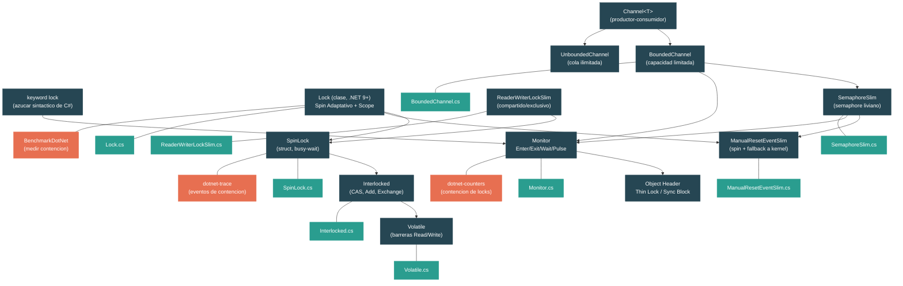

# Nivel 3: Avanzado -- Primitivas de Threading y Sincronizacion

> **Perfil objetivo:** Desarrollador que necesita entender las primitivas de sincronizacion en profundidad -- cuando usar cada una, sus tradeoffs de rendimiento, y como estan implementadas en el runtime de .NET
> **Esfuerzo estimado:** 6 horas
> **Prerrequisitos:** [Modulo 2.3 -- Async/Await](02-practitioner-async-await.md), [Nivel 2](02-practitioner-generics.md)
> [English version](../en/03-advanced-threading.md)

---

## Objetivos de Aprendizaje

Al finalizar este modulo vas a poder:

1. Explicar como el keyword `lock` se mapea a `Monitor.Enter`/`Monitor.Exit`, como funcionan los thin locks via el sync block del object header, y los costos de la inflacion de locks.
2. Describir el tipo `Lock` de .NET 9: su estrategia de spin adaptativo, el tracking de `_owningThreadId`, el patron de uso con `Scope`, y por que un tipo dedicado supera a `Monitor` en escenarios comunes.
3. Usar `SemaphoreSlim` y `ManualResetEventSlim` para senalizacion compatible con async, y explicar como hacen spin antes de caer a un kernel wait.
4. Elegir correctamente entre `SpinLock`, operaciones CAS de `Interlocked` y lecturas/escrituras `Volatile` para sincronizacion lock-free, y explicar cuando el spinning es beneficioso vs. desperdicio.
5. Aplicar `ReaderWriterLockSlim` correctamente en cargas de trabajo con muchas lecturas e identificar escenarios donde perjudica en vez de ayudar.
6. Implementar patrones productor-consumidor usando `System.Threading.Channels`, y trazar como `BoundedChannel` usa sincronizacion internamente.

---

## Mapa Conceptual



---

## Panorama de Tradeoffs de Rendimiento

Antes de sumergirnos en cada primitiva, conviene tener un modelo mental del espectro de costos:

| Primitiva | Overhead (sin contencion) | Overhead (con contencion) | Soporta async `await` | Mejor para |
|---|---|---|---|---|
| `Interlocked` / CAS | ~1 ns (una instruccion CPU) | Bajo (loop de reintento) | N/A (lock-free) | Actualizaciones atomicas de una variable |
| `Volatile.Read/Write` | ~0 ns (solo barrera de memoria) | N/A (no bloquea) | N/A | Publicar/observar flags y referencias |
| `SpinLock` | ~5-10 ns | Desperdicia ciclos de CPU | No | Secciones criticas ultra-cortas (< 1 us), locks de hoja |
| `Lock` (.NET 9) | ~10-15 ns | Spin adaptativo + kernel wait | No | Exclusion mutua de proposito general (reemplaza `lock`) |
| `Monitor` / `lock` | ~15-25 ns (thin lock) | Inflacion a sync block + kernel wait | No | Exclusion mutua de proposito general (legado) |
| `SemaphoreSlim` | ~20-30 ns | Spin + `Monitor.Wait` + cola async | Si (`WaitAsync`) | Limitar concurrencia, senalizacion async |
| `ManualResetEventSlim` | ~15-20 ns | Spin + evento kernel | No | Senalizacion de una vez o con reset |
| `ReaderWriterLockSlim` | ~30-50 ns | SpinLock + eventos kernel | No | Cargas con muchas lecturas y pocas escrituras |
| `Channel<T>` | ~50-100 ns | Backpressure via cola acotada | Si (integrado) | Pipelines productor-consumidor |

*Los tiempos son aproximados y varian segun el hardware. La idea clave es que las primitivas de nivel mas bajo son mas rapidas pero menos capaces.*

---

## Curriculum

### Leccion 1 -- Monitor y `lock`

#### Que vas a aprender

El keyword `lock` es azucar sintactico para `Monitor.Enter` y `Monitor.Exit`. Pero que pasa a nivel de CPU? En esta leccion vas a entender los thin locks, los sync blocks, y la inflacion de locks -- el mecanismo que el runtime usa para mantener los locks sin contencion rapidos mientras soporta bloqueo completo cuando es necesario.

#### El concepto

Cuando escribis:

```csharp
lock (obj)
{
    // seccion critica
}
```

El compilador lo transforma en:

```csharp
bool lockTaken = false;
try
{
    Monitor.Enter(obj, ref lockTaken);
    // seccion critica
}
finally
{
    if (lockTaken)
        Monitor.Exit(obj);
}
```

El parametro `ref bool lockTaken` es critico para la correctitud. Si un `ThreadAbortException` se dispara entre `Enter` y el `try`, el lock podria quedar tomado sin que el `finally` lo libere. El patron `ref lockTaken` asegura que el runtime sabe si realmente adquirio el lock.

Mirando el codigo fuente en `Monitor.cs`, el metodo `Enter` esta marcado `AggressiveInlining`:

```csharp
[MethodImpl(MethodImplOptions.AggressiveInlining)]
public static void Enter(object obj, ref bool lockTaken)
{
    if (lockTaken)
        ThrowLockTakenException();

    Enter(obj);
    lockTaken = true;
}
```

La adquisicion real del lock es un metodo parcial -- esta implementado de forma diferente por CoreCLR y Mono. En CoreCLR, pasa por el mecanismo de sync block del object header.

**Las tres etapas de un lock de Monitor:**

1. **Thin lock (camino rapido)**: El runtime almacena el ID del thread propietario directamente en el object header. Un solo `Interlocked.CompareExchange` es todo lo que hace falta. Costo: ~15-25 ns.

2. **Inflacion del lock**: Cuando ocurre contencion (otro thread intenta adquirir el lock), el runtime "infla" el thin lock a un sync block completo. El sync block es una estructura de datos del runtime que soporta colas de espera, `Monitor.Wait`/`Pulse`, y almacenamiento del hash code. Esta inflacion es un costo unico por objeto.

3. **Kernel wait**: Una vez inflado, los threads que esperan entran en un kernel wait (un evento del OS). Esto implica un context switch, costando miles de ciclos de CPU (~1-10 us dependiendo del OS y hardware).

**Por que `lock` requiere un tipo por referencia:**

Cada objeto en .NET tiene un header (el "object header word") que puede almacenar:
- Un thin lock (thread ID + conteo de recursion)
- Un indice de sync block (apuntando a una estructura mas rica)
- Un hash code

Estos usos son mutuamente exclusivos en el header, por lo cual usar `lock` en un objeto que tambien llama a `GetHashCode()` fuerza la alocacion inmediata del sync block. El sync block almacena el hash code, el estado del lock y las colas de espera juntos.

#### En el codigo fuente

Abri `src/libraries/System.Private.CoreLib/src/System/Threading/Monitor.cs`:

El lado managed es un wrapper delgado. `TryEnter` delega al metodo parcial:

```csharp
public static bool TryEnter(object obj, TimeSpan timeout)
    => TryEnter(obj, WaitHandle.ToTimeoutMilliseconds(timeout));
```

Los metodos `Wait`, `Pulse` y `PulseAll` tambien estan definidos aca. `Wait` esta marcado notablemente como `[UnsupportedOSPlatform("browser")]` porque WebAssembly (sin threads) no puede bloquear.

La implementacion real del lock vive en las clases parciales especificas del runtime:
- CoreCLR: `src/coreclr/System.Private.CoreLib/src/System/Threading/Monitor.CoreCLR.cs`
- Mono: `src/mono/System.Private.CoreLib/src/System/Threading/Monitor.Mono.cs`

#### Ejercicio practico

1. Demostrar el comportamiento de thin lock vs. lock inflado:
   ```csharp
   object obj = new object();

   // Thin lock -- un solo thread, sin contencion
   var sw = Stopwatch.StartNew();
   for (int i = 0; i < 10_000_000; i++)
   {
       lock (obj) { }
   }
   Console.WriteLine($"Sin contencion: {sw.ElapsedMilliseconds} ms");

   // Ahora forzar contencion con dos threads
   long count = 0;
   sw.Restart();
   var t1 = Task.Run(() => { for (int i = 0; i < 5_000_000; i++) lock (obj) count++; });
   var t2 = Task.Run(() => { for (int i = 0; i < 5_000_000; i++) lock (obj) count++; });
   Task.WaitAll(t1, t2);
   Console.WriteLine($"Con contencion: {sw.ElapsedMilliseconds} ms, count={count}");
   ```

2. Observar el efecto del hash code -- llama a `obj.GetHashCode()` antes del loop de locks y medi de nuevo. En algunos runtimes, forzar el hash code al sync block cambia el camino rapido del lock.

3. Usa `dotnet-counters` para monitorear la contencion de locks:
   ```bash
   dotnet-counters monitor --counters System.Runtime[monitor-lock-contention-count] --process-id <pid>
   ```

#### Conclusion clave

`Monitor` (y el keyword `lock`) usan una estrategia por capas: un thin lock barato para el caso sin contencion, inflando a un sync block con kernel waits cuando ocurre contencion. Esto hace que los locks sin contencion sean muy rapidos (~15-25 ns) pero significa que los locks con contencion pagan el costo de alocacion del sync block y transiciones al kernel del OS. Para codigo nuevo en .NET 9+, el tipo `Lock` (Leccion 2) mejora este diseno.

#### Concepto erroneo comun

> *"`lock` siempre involucra una llamada al kernel."*
>
> Falso. Los locks sin contencion usan un mecanismo de thin lock que es completamente en modo usuario. Solo cuando otro thread esta realmente esperando el runtime cae a sincronizacion a nivel de kernel. En la mayoria de las aplicaciones bien disenadas, la mayoria de las adquisiciones de lock no tienen contencion.

---

### Leccion 2 -- El Nuevo Tipo Lock (.NET 9)

#### Que vas a aprender

.NET 9 introdujo `System.Threading.Lock`, una clase dedicada para locks que supera a `Monitor` en escenarios comunes. En esta leccion vas a entender su estrategia de spin adaptativo, el patron de uso con `Scope`, y por que un tipo construido a proposito puede ganarle al `Monitor` de proposito general.

#### El concepto

La clase `Lock` fue introducida porque `Monitor` tiene limitaciones fundamentales:

1. **Cualquier objeto puede ser objetivo de lock**: Esto significa que cada object header debe reservar bits para locking, y previene optimizaciones que requieren conocimiento de que se usa como lock.
2. **No hay seguridad de tipos**: Nada te previene de accidentalmente hacer lock sobre un value type (que se boxea, creando un nuevo objeto cada vez -- un bug silencioso).
3. **Overhead del sync block**: El mecanismo de thin lock / inflacion del sync block es ingenioso pero agrega complejidad y limita oportunidades de optimizacion.

`Lock` resuelve esto siendo una clase dedicada con su propio estado interno:

```csharp
public sealed class Lock
{
    private int _owningThreadId;
    private uint _state;        // empaquetado en bits: flag de locked, hay waiters, conteo de spinners
    private uint _recursionCount;
    private short _spinCount;   // contador de spin adaptativo
    private AutoResetEvent? _waitEvent;  // alocado lazily para bloqueo
    // ...
}
```

Decisiones de diseno clave visibles en el codigo fuente:

**Spinning adaptativo**: El campo `_spinCount` empieza en `SpinCountNotInitialized` (= `short.MinValue`). El runtime mide si el spinning es efectivo en el hardware actual y se ajusta:

```csharp
private const short DefaultMaxSpinCount = 22;
private const short DefaultAdaptiveSpinPeriod = 100;
private const short SpinSleep0Threshold = 10;
```

Cuando `_spinCount` es positivo, los threads hacen spin esa cantidad de iteraciones antes de bloquearse. Cuando es cero, un thread prueba si el spinning seria util. Cuando es negativo, cuenta contenciones hasta que prueba spinning de nuevo. Este enfoque adaptativo significa que el lock se auto-ajusta a la carga de trabajo.

**Patron Scope**: El metodo `EnterScope()` devuelve un `ref struct Scope` que libera el lock cuando se dispone:

```csharp
[MethodImpl(MethodImplOptions.AggressiveInlining)]
public Scope EnterScope() => new Scope(this, EnterAndGetCurrentThreadId());
```

Esto habilita el patron de uso limpio:

```csharp
private readonly Lock _lock = new();

void HacerTrabajo()
{
    using (_lock.EnterScope())
    {
        // seccion critica
    }
}
```

El `Scope` es un `ref struct`, asi que no puede escapar del stack -- tiene cero alocacion en el heap.

**Camino rapido**: El metodo `TryEnter_Inlined` muestra el camino rapido:

```csharp
private int TryEnter_Inlined(int timeoutMs)
{
    int currentThreadId = ManagedThreadId.CurrentManagedThreadIdUnchecked;
    if (currentThreadId != UninitializedThreadId && State.TryLock(this))
    {
        _owningThreadId = currentThreadId;
        return currentThreadId;
    }
    return TryEnterSlow(timeoutMs, currentThreadId);
}
```

El camino rapido es una sola operacion atomica (`TryLock`) seguida de una escritura de campo. Si tiene exito, no se necesita mas trabajo. El metodo `TryEnterSlow` maneja recursion, spinning y bloqueo.

**Sin constructor estatico**: El comentario en el codigo fuente es revelador:

```csharp
// NOTE: Lock must not have a static (class) constructor, as Lock itself is used to synchronize
// class construction. If Lock has its own class constructor, this can lead to infinite recursion.
// All static data in Lock must be lazy-initialized.
```

Esta restriccion fuerza a que todos los campos estaticos (`s_maxSpinCount`, `s_isSingleProcessor`, etc.) sean inicializados lazily.

#### En el codigo fuente

Abri `src/libraries/System.Private.CoreLib/src/System/Threading/Lock.cs`:

El metodo `TryEnterSlow` (linea 349+) revela la estrategia completa de contencion:

1. Verificar recursion (`_owningThreadId == currentThreadId`) -- si es asi, incrementar `_recursionCount`.
2. Si `timeoutMs == 0`, retornar inmediatamente (semantica de TryEnter).
3. Notificar al debugger via `Debugger.NotifyOfCrossThreadDependency()` -- esto ayuda a VS a detectar potenciales deadlocks durante FuncEval.
4. Inicializar estaticos lazily si es necesario.
5. Loop de spin adaptativo: el primer spinner hace un spin de largo completo (`maxSpinCount = 22` iteraciones) para probar la efectividad. Los siguientes spinners usan el conteo adaptado.
6. Si el spinning falla, bloquear en `_waitEvent` (un `AutoResetEvent`, alocado lazily).

El metodo `ExitImpl` muestra el camino rapido de salida:

```csharp
private void ExitImpl()
{
    if (_recursionCount == 0)
    {
        _owningThreadId = 0;
        State state = State.Unlock(this);
        if (state.HasAnyWaiters)
        {
            SignalWaiterIfNecessary(state);
        }
    }
    else
    {
        _recursionCount--;
    }
}
```

La salida tambien es rapida: resetear el propietario, desbloquear atomicamente, y solo senalizar waiters si existen.

#### Ejercicio practico

1. Benchmark de `Lock` vs. `Monitor` bajo contencion:
   ```csharp
   // Usando BenchmarkDotNet
   private readonly Lock _lock = new();
   private readonly object _monitor = new();

   [Benchmark]
   public void TipoLock()
   {
       using (_lock.EnterScope()) { }
   }

   [Benchmark]
   public void MonitorLock()
   {
       lock (_monitor) { }
   }

   // Correr con cantidades variables de threads: 1, 2, 4, 8
   ```

2. Observar el comportamiento de spin adaptativo. Crea un lock con tiempo de retencion artificial y medi como se adapta el conteo de spin:
   ```csharp
   var lk = new Lock();
   // Retencion corta -- el spinning deberia ser efectivo
   Parallel.For(0, 1_000_000, _ =>
   {
       lk.Enter();
       // sin trabajo -- liberacion instantanea
       lk.Exit();
   });
   ```

3. Comparar el patron `EnterScope` con `Enter`/`Exit` manual:
   ```csharp
   var lk = new Lock();

   // Patron 1: EnterScope (recomendado)
   using (lk.EnterScope())
   {
       // Si ocurre una excepcion aca, el lock igual se libera
   }

   // Patron 2: Enter/Exit manual
   lk.Enter();
   try
   {
       // seccion critica
   }
   finally
   {
       lk.Exit();
   }
   ```

#### Conclusion clave

`Lock` es la primitiva de exclusion mutua recomendada para .NET 9+. Evita la maquinaria de object header / sync block, usa spinning adaptativo ajustado al hardware, y provee una API type-safe basada en `Scope`. El camino rapido es una sola operacion CAS. La estrategia de spin adaptativo significa que el lock aprende automaticamente si el spinning es efectivo para el patron de contencion actual.

#### Concepto erroneo comun

> *"El tipo Lock es no-recursivo."*
>
> En realidad, `Lock` si soporta recursion. Mirando `TryEnterSlow`, si `_owningThreadId == currentThreadId`, incrementa `_recursionCount`. La documentacion dice que el thread que llama "deberia salir del lock tantas veces como entro". Sin embargo, a diferencia de `Monitor`, `Lock` trackea la recursion en un campo dedicado en vez del sync block, lo cual es mas eficiente.

---

### Leccion 3 -- SemaphoreSlim y ManualResetEventSlim

#### Que vas a aprender

`SemaphoreSlim` y `ManualResetEventSlim` son las versiones "slim" de sus contrapartes basadas en kernel. Hacen spin en modo usuario antes de caer a kernel waits, y `SemaphoreSlim` es la unica primitiva de sincronizacion built-in que soporta espera async via `WaitAsync()`. En esta leccion vas a entender su estructura interna y cuando usar cada una.

#### El concepto

**SemaphoreSlim** controla el acceso a un pool de recursos manteniendo un conteo. A diferencia de un lock (binario: tomado o no), un semaphore permite N accesos concurrentes:

```csharp
// Permitir hasta 3 conexiones concurrentes a la base de datos
var semaphore = new SemaphoreSlim(initialCount: 3, maxCount: 3);

async Task UsarBaseDeDatosAsync()
{
    await semaphore.WaitAsync(); // decrementar conteo; bloquear si es cero
    try
    {
        await ConsultarBaseDeDatosAsync();
    }
    finally
    {
        semaphore.Release(); // incrementar conteo
    }
}
```

Mirando los campos internos en `SemaphoreSlim.cs`:

```csharp
private volatile int m_currentCount;      // conteo actual del semaphore
private readonly int m_maxCount;           // maximo permitido
private int m_waitCount;                   // numero de waiters sincronos
private int m_countOfWaitersPulsedToWake;  // optimizacion para no despertar de mas
private readonly StrongBox<bool> m_lockObjAndDisposed; // objeto lock + flag disposed
private TaskNode? m_asyncHead;             // lista enlazada de waiters async
private TaskNode? m_asyncTail;
```

Los waiters async se almacenan como una lista enlazada de objetos `TaskNode`, donde cada `TaskNode` es a su vez un `Task<bool>`:

```csharp
private sealed class TaskNode : Task<bool>
{
    internal TaskNode? Prev, Next;
    internal TaskNode() : base((object?)null, TaskCreationOptions.RunContinuationsAsynchronously) { }
}
```

Este es un diseno inteligente: el `TaskNode` ES el `Task<bool>` que `WaitAsync()` devuelve, asi que no hay alocacion extra para la promesa -- el nodo de la lista enlazada y el task devuelto son el mismo objeto.

Nota el `RunContinuationsAsynchronously` -- esto asegura que liberar el semaphore no ejecute sincronamente la continuation del waiter, lo cual podria llevar a profundidad de stack ilimitada o problemas de re-entrancia del lock.

**ManualResetEventSlim** es una senal que puede ser seteada o reseteada. Todos los threads esperando son liberados cuando se setea. Empaqueta su estado en un solo `int`:

```csharp
private volatile int m_combinedState;

// Layout de bits:
// Bit 31:      estado senalizado (1 = seteado)
// Bit 30:      disposed
// Bits 19-29:  conteo de spin (hasta 2047)
// Bits 0-18:   numero de waiters
```

La constante `DEFAULT_SPIN_SP = 1` muestra que en maquinas de un solo procesador, se hace spinning minimo. En maquinas multi-procesador, el conteo de spin por defecto es mayor, porque otro procesador podria liberar el evento mientras hacemos spin.

La estrategia "slim" para ambos es la misma:

1. **Verificar estado inmediatamente** -- si el semaphore tiene conteo > 0 o el evento esta seteado, tener exito sin bloquear.
2. **Spin** -- quemar ciclos de CPU verificando el estado, esperando que cambie antes de necesitar una transicion al kernel.
3. **Kernel wait** -- si el spinning no tuvo exito, caer a un wait real del OS (`Monitor.Wait` para `SemaphoreSlim`, `ManualResetEvent` para `ManualResetEventSlim`).

#### En el codigo fuente

Abri `src/libraries/System.Private.CoreLib/src/System/Threading/SemaphoreSlim.cs`:

El campo `m_lockObjAndDisposed` usa `StrongBox<bool>` como objeto de `lock` (para `Monitor.Enter`) y como flag de disposed. Esto ahorra una alocacion de objeto por semaphore.

El camino async (`WaitAsync`) crea un `TaskNode`, lo agrega a la lista enlazada, y lo devuelve. Cuando se llama a `Release()`, verifica primero los waiters async:

```csharp
// Logica simplificada de Release:
if (m_asyncHead is not null)
{
    // Despertar un waiter async -- completar su TaskNode
}
else if (m_waitCount > 0)
{
    // Despertar un waiter sincrono via Monitor.Pulse
}
```

Abri `src/libraries/System.Private.CoreLib/src/System/Threading/ManualResetEventSlim.cs`:

El `m_combinedState` empaquetado en bits se modifica atomicamente usando `Interlocked.CompareExchange`. El conteo de spin (bits 19-29) permite hasta 2047 iteraciones de spin antes de caer al evento kernel. El evento kernel (`ManualResetEvent`) se aloca lazily solo cuando un thread realmente necesita bloquearse.

#### Ejercicio practico

1. Implementar un rate limiter usando `SemaphoreSlim`:
   ```csharp
   var limiter = new SemaphoreSlim(10); // max 10 operaciones concurrentes

   var tasks = Enumerable.Range(0, 100).Select(async i =>
   {
       await limiter.WaitAsync();
       try
       {
           Console.WriteLine($"Procesando {i} (activos: {10 - limiter.CurrentCount})");
           await Task.Delay(100);
       }
       finally
       {
           limiter.Release();
       }
   });

   await Task.WhenAll(tasks);
   ```

2. Comparar `ManualResetEventSlim` con `ManualResetEvent`:
   ```csharp
   var slim = new ManualResetEventSlim(false);
   var heavy = new ManualResetEvent(false);

   // Benchmark: ciclos de set y wait
   var sw = Stopwatch.StartNew();
   for (int i = 0; i < 1_000_000; i++)
   {
       slim.Set();
       slim.Wait();
       slim.Reset();
   }
   Console.WriteLine($"Slim: {sw.ElapsedMilliseconds} ms");

   sw.Restart();
   for (int i = 0; i < 1_000_000; i++)
   {
       heavy.Set();
       heavy.WaitOne();
       heavy.Reset();
   }
   Console.WriteLine($"Heavy: {sw.ElapsedMilliseconds} ms");
   ```

3. Observar que pasa cuando liberas un `SemaphoreSlim` mas alla de su conteo maximo:
   ```csharp
   var sem = new SemaphoreSlim(1, maxCount: 1);
   sem.Release(); // lanza SemaphoreFullException
   ```

#### Conclusion clave

`SemaphoreSlim` es la primitiva de referencia cuando necesitas sincronizacion compatible con async o cuando queres limitar la concurrencia a N. `ManualResetEventSlim` es ideal para senalizacion de una vez o con reset donde todos los waiters deberian ser liberados simultaneamente. Ambos usan la misma estrategia de spin-luego-bloquear para evitar transiciones al kernel en el caso comun. La ventaja clave de `SemaphoreSlim` sobre todas las demas primitivas es `WaitAsync()` -- es la unica primitiva de sincronizacion built-in que se integra limpiamente con async/await.

#### Concepto erroneo comun

> *"SemaphoreSlim con conteo=1 es lo mismo que un lock."*
>
> No exactamente. Un `SemaphoreSlim(1,1)` provee exclusion mutua, pero NO es re-entrante: si el mismo thread llama a `Wait()` dos veces sin `Release()`, se produce un deadlock. Un `lock` / `Monitor` trackea el thread propietario y permite que el mismo thread entre multiples veces. Ademas, `SemaphoreSlim` no tiene concepto de propiedad -- cualquier thread puede hacer `Release()`, no solo el que llamo a `Wait()`.

---

### Leccion 4 -- SpinLock e Interlocked

#### Que vas a aprender

A veces no necesitas un lock completo. `Interlocked` provee operaciones atomicas de CPU para actualizaciones de una sola variable. `SpinLock` provee una primitiva de exclusion mutua liviana que hace busy-wait en vez de bloquearse. En esta leccion vas a aprender cuando el spinning gana, como funcionan las operaciones CAS (Compare-And-Swap), y el rol de las barreras de memoria.

#### El concepto

**Las operaciones Interlocked** se mapean directamente a instrucciones de CPU. En x86, `Interlocked.CompareExchange` se mapea a la instruccion `lock cmpxchg`. Estas son las operaciones de sincronizacion mas rapidas posibles porque no tienen overhead de syscall:

```csharp
// Incremento atomico -- no se necesita lock
Interlocked.Increment(ref counter);

// Loop CAS -- el patron fundamental lock-free
int original, desired;
do
{
    original = value;
    desired = Transformar(original);
} while (Interlocked.CompareExchange(ref value, desired, original) != original);
```

El patron CAS funciona porque `CompareExchange` atomicamente:
1. Lee el valor actual de `value`
2. Lo compara con `original`
3. Si coinciden, reemplaza `value` con `desired`
4. Devuelve el valor que estaba en `value` antes de la operacion

Si el valor devuelto no coincide con `original`, otro thread modifico `value` entre nuestra lectura y nuestro intento de CAS, asi que reintentamos.

Mirando el codigo fuente de `Interlocked.cs`:

```csharp
[MethodImpl(MethodImplOptions.AggressiveInlining)]
[CLSCompliant(false)]
public static uint Increment(ref uint location) =>
    Add(ref location, 1);

[MethodImpl(MethodImplOptions.AggressiveInlining)]
[CLSCompliant(false)]
public static uint Decrement(ref uint location) =>
    (uint)Add(ref Unsafe.As<uint, int>(ref location), -1);
```

`Increment` y `Decrement` estan implementados en terminos de `Add`. `Add` en si es un metodo parcial respaldado por el JIT del runtime, que emite la instruccion de CPU apropiada (`lock xadd` en x86).

**Volatile** provee garantias de ordenamiento de memoria sin atomicidad:

```csharp
// Asegura que la lectura ve la escritura mas reciente de cualquier thread
bool flag = Volatile.Read(ref _isComplete);

// Asegura que todas las escrituras precedentes son visibles antes de esta escritura
Volatile.Write(ref _isComplete, true);
```

Mirando `Volatile.cs`, la implementacion usa un truco ingenioso con `Unsafe.As`:

```csharp
private struct VolatileBoolean { public volatile bool Value; }

public static bool Read(ref readonly bool location) =>
    Unsafe.As<bool, VolatileBoolean>(ref Unsafe.AsRef(in location)).Value;
```

El runtime reinterpreta la ubicacion de memoria como un campo `volatile`, lo que garantiza que la CPU inserta barreras de memoria apropiadas. En x86, las lecturas `volatile` no generan instrucciones extra (el modelo de memoria es suficientemente fuerte), pero en ARM emiten instrucciones `ldar` (load-acquire) y `stlr` (store-release).

Los metodos `Volatile.ReadBarrier()` y `Volatile.WriteBarrier()` son fences de memoria explicitos -- previenen que la CPU y el compilador reordenen lecturas/escrituras a traves de la barrera.

**SpinLock** es una primitiva de exclusion mutua que hace busy-wait:

```csharp
private SpinLock _spinLock = new SpinLock();

void HacerTrabajo()
{
    bool lockTaken = false;
    try
    {
        _spinLock.Enter(ref lockTaken);
        // seccion critica -- debe ser MUY corta
    }
    finally
    {
        if (lockTaken) _spinLock.Exit();
    }
}
```

Del codigo fuente, `SpinLock` tiene dos modos codificados en su campo `_owner`:

```csharp
// Modo 1 -- Tracking de propiedad (por defecto):
//   Bit alto = 0, bits restantes = managed thread ID del propietario
//   Valor 0 = lock disponible
//
// Modo 2 -- Modo rendimiento (enableThreadOwnerTracking: false):
//   Bit alto = 1, bit bajo = lock tomado (1) o disponible (0)
private volatile int _owner;
```

**CRITICO**: `SpinLock` es un `struct`. Esto significa:
- Pasarlo por valor crea una copia -- la copia es independiente e inutil
- Almacenarlo en un campo `readonly` significa que cada acceso lo copia
- Debes pasarlo `ref` o almacenarlo en un campo mutable

La documentacion de SpinLock en el codigo fuente advierte explicitamente:

> "Spin locks can be used for leaf-level locks where the object allocation implied by using a Monitor, in size or due to garbage collection pressure, is overly expensive."

#### En el codigo fuente

Abri `src/libraries/System.Private.CoreLib/src/System/Threading/SpinLock.cs`:

El campo `_owner` usa `volatile` -- cada lectura es una lectura volatile. Los dos modos se distinguen por el bit alto (`LOCK_ID_DISABLE_MASK = 0x80000000`).

Las constantes revelan la estrategia de espera:

```csharp
private const int SLEEP_ONE_FREQUENCY = 40;       // Despues de 40 yields, Sleep(1)
private const int TIMEOUT_CHECK_FREQUENCY = 10;    // Verificar timeout cada 10 yields
```

Esto muestra que SpinLock no es puro spinning -- despues de 40 iteraciones, empieza a llamar `Thread.Sleep(1)` para ceder el procesador. Esto previene la inanicion total de CPU bajo contencion fuerte.

Abri `src/libraries/System.Private.CoreLib/src/System/Threading/Volatile.cs`:

En plataformas de 32 bits, leer un valor de 64 bits atomicamente requiere manejo especial:

```csharp
public static long Read(ref readonly long location) =>
#if TARGET_64BIT
    (long)Unsafe.As<long, VolatileIntPtr>(ref Unsafe.AsRef(in location)).Value;
#else
    // En maquinas de 32 bits, usamos Interlocked, ya que una lectura volatile ordinaria no seria atomica.
    Interlocked.CompareExchange(ref Unsafe.AsRef(in location), 0, 0);
#endif
```

En 32 bits, una lectura de `long` no es atomica (requiere dos lecturas de 32 bits, y otro thread podria modificar el valor entre ellas). El truco de `CompareExchange(ref val, 0, 0)` lee atomicamente el valor comparando con 0 y reemplazando con 0 -- lo cual es un no-op que devuelve el valor actual, pero atomicamente.

Abri `src/libraries/System.Private.CoreLib/src/System/Threading/Interlocked.cs`:

El atributo `[Intrinsic]` en muchos metodos senaliza al JIT que reemplace el cuerpo del metodo con una instruccion de CPU. Por ejemplo, `Exchange` para `sbyte` esta marcado `[Intrinsic]` -- el JIT emitira `lock xchg` en vez de llamar al metodo.

#### Ejercicio practico

1. Implementar un contador lock-free usando CAS:
   ```csharp
   int counter = 0;

   Parallel.For(0, 1_000_000, _ =>
   {
       Interlocked.Increment(ref counter);
   });

   Console.WriteLine($"Contador: {counter}"); // Deberia ser exactamente 1,000,000
   ```

2. Implementar un stack lock-free usando CAS:
   ```csharp
   class Node<T> { public T Value; public Node<T>? Next; }

   Node<int>? head = null;

   void Push(int value)
   {
       var node = new Node<int> { Value = value };
       Node<int>? original;
       do
       {
           original = head;
           node.Next = original;
       } while (Interlocked.CompareExchange(ref head, node, original) != original);
   }
   ```

3. Benchmark de `SpinLock` vs. `Lock` vs. `Interlocked` para un contador simple:
   ```csharp
   // Interlocked -- sin lock, solo add atomico
   [Benchmark] public void InterlockedIncrement() => Interlocked.Increment(ref _counter);

   // SpinLock -- busy wait
   [Benchmark]
   public void SpinLockIncrement()
   {
       bool taken = false;
       try { _spinLock.Enter(ref taken); _counter++; }
       finally { if (taken) _spinLock.Exit(); }
   }

   // Lock -- spin adaptativo + kernel
   [Benchmark]
   public void LockIncrement()
   {
       using (_lock.EnterScope()) { _counter++; }
   }
   ```

4. Demostrar la garantia de ordenamiento de `Volatile`:
   ```csharp
   int data = 0;
   bool ready = false;

   // Productor
   Task.Run(() =>
   {
       data = 42;                      // escribir data primero
       Volatile.Write(ref ready, true); // luego publicar el flag (con barrera de escritura)
   });

   // Consumidor
   while (!Volatile.Read(ref ready)) { } // leer flag con barrera de lectura
   Console.WriteLine(data);               // garantizado ver 42
   ```

#### Conclusion clave

Usa `Interlocked` cuando puedas expresar tu operacion como una sola actualizacion atomica (incremento, exchange, loop CAS). Usa `Volatile` cuando necesites publicar u observar un flag o referencia sin un lock completo. Usa `SpinLock` solo para secciones criticas ultra-cortas donde la alocacion de un `Lock`/`Monitor` es inaceptable (locks de hoja en estructuras de datos), y NUNCA retengas un `SpinLock` a traves de cualquier operacion que bloquee o aloque. Para todo lo demas, usa `Lock` o `SemaphoreSlim`.

#### Concepto erroneo comun

> *"Volatile e Interlocked son intercambiables."*
>
> No. `Volatile.Read/Write` provee ordenamiento de memoria pero NO atomicidad para tipos mas anchos que el tamano nativo de palabra. En plataformas de 32 bits, `Volatile.Read(ref long)` en realidad cae a `Interlocked.CompareExchange` para obtener atomicidad. Las operaciones `Interlocked` son tanto atomicas COMO proveen barreras de memoria completas. La distincion importa en ARM y otras arquitecturas con ordenamiento debil.

---

### Leccion 5 -- ReaderWriterLockSlim

#### Que vas a aprender

Cuando las lecturas superan ampliamente a las escrituras, `ReaderWriterLockSlim` puede proveer mejor throughput que un lock simple. Pero tiene un costo base mas alto y trampas sorprendentes. En esta leccion vas a entender sus tres modos, su uso interno de `SpinLock`, y cuando realmente ayuda.

#### El concepto

`ReaderWriterLockSlim` soporta tres niveles de acceso:

| Modo | Lectores concurrentes? | Escritores concurrentes? | Caso de uso |
|---|---|---|---|
| Lectura | Si (ilimitados) | No | Consultar datos compartidos |
| Escritura | No (exclusivo) | No | Modificar datos compartidos |
| Lectura Upgradeable | Si (uno upgradeable + N lectores) | No | Leer-luego-condicionalmente-escribir |

```csharp
var rwLock = new ReaderWriterLockSlim();
var cache = new Dictionary<string, object>();

// Multiples threads pueden leer simultaneamente
object? Leer(string key)
{
    rwLock.EnterReadLock();
    try { return cache.GetValueOrDefault(key); }
    finally { rwLock.ExitReadLock(); }
}

// Solo un thread puede escribir a la vez (bloquea lectores tambien)
void Escribir(string key, object value)
{
    rwLock.EnterWriteLock();
    try { cache[key] = value; }
    finally { rwLock.ExitWriteLock(); }
}

// Leer, luego upgradear a escritura si es necesario
void AgregarSiFalta(string key, object value)
{
    rwLock.EnterUpgradeableReadLock();
    try
    {
        if (!cache.ContainsKey(key))
        {
            rwLock.EnterWriteLock();
            try { cache[key] = value; }
            finally { rwLock.ExitWriteLock(); }
        }
    }
    finally { rwLock.ExitUpgradeableReadLock(); }
}
```

Mirando el codigo fuente, `ReaderWriterLockSlim` es significativamente mas complejo que otras primitivas:

```csharp
public class ReaderWriterLockSlim : IDisposable
{
    private readonly bool _fIsReentrant;
    private SpinLock _spinLock;             // spin lock interno para transiciones de estado
    private uint _numWriteWaiters;
    private uint _numReadWaiters;
    private uint _numWriteUpgradeWaiters;
    private uint _numUpgradeWaiters;
    private int _upgradeLockOwnerId;
    private int _writeLockOwnerId;
    private EventWaitHandle? _writeEvent;
    private EventWaitHandle? _readEvent;
    private EventWaitHandle? _upgradeEvent;
    private EventWaitHandle? _waitUpgradeEvent;
    // ...
}
```

Observaciones clave:

1. **Usa `SpinLock` internamente**: El campo `_spinLock` protege las transiciones de estado. Este es un spin ultra-corto -- solo protege la contabilidad, no la seccion critica real.

2. **Cuatro event wait handles**: Cada tipo de waiter tiene su propio evento kernel. Se alocan lazily (la mayoria de los usos nunca necesitan los cuatro).

3. **Tracking por thread via `ReaderWriterCount`**: Una lista enlazada `[ThreadStatic]` trackea cuantos locks de lectura, escritura y upgrade tiene cada thread:

   ```csharp
   internal sealed class ReaderWriterCount
   {
       public long lockID;
       public int readercount;
       public int writercount;
       public int upgradecount;
       public ReaderWriterCount? next;
   }
   ```

   El `lockID` es un ID numerico (no una referencia) para evitar prevenir la recoleccion de basura del lock.

4. **Politica de recursion**: Por defecto (`LockRecursionPolicy.NoRecursion`), el locking recursivo lanza `LockRecursionException`. Podes optar por `SupportsRecursion`, pero la documentacion y el equipo de .NET lo desaconsejan fuertemente.

**Cuando ReaderWriterLockSlim perjudica:**

El costo base de `EnterReadLock` es mayor que un simple `Monitor.Enter` porque debe:
1. Adquirir el `SpinLock` interno
2. Buscar o crear el `ReaderWriterCount` del thread
3. Modificar estado compartido
4. Liberar el `SpinLock` interno

Si las lecturas no son abrumadoramente dominantes (ej: > 10:1 ratio lectura-a-escritura) o si la seccion critica es muy corta, un simple `Lock` o `Monitor` superara en rendimiento a `ReaderWriterLockSlim`. El reader-writer lock solo gana cuando la seccion critica es lo suficientemente larga para amortizar el overhead.

#### En el codigo fuente

Abri `src/libraries/System.Private.CoreLib/src/System/Threading/ReaderWriterLockSlim.cs`:

El `ReaderWriterCount` es una lista enlazada `[ThreadStatic]`. Cada thread recorre esta lista para encontrar su conteo para un lock dado. La busqueda usa un `lockID` numerico en vez de una referencia directa para evitar prevenir la recoleccion de basura de instancias de `ReaderWriterLockSlim`.

El comentario en el codigo fuente es instructivo:

> "A reader-writer lock implementation that is intended to be simple, yet very efficient. In particular only 1 interlocked operation is taken for any lock operation (we use spin locks to achieve this). The spin lock is never held for more than a few instructions."

Los cuatro eventos kernel (`_writeEvent`, `_readEvent`, `_upgradeEvent`, `_waitUpgradeEvent`) cada uno sirve un proposito especifico:
- `_writeEvent`: threads esperando adquirir el write lock
- `_readEvent`: threads esperando adquirir un read lock (liberados en masa cuando se libera el write lock)
- `_upgradeEvent`: thread esperando adquirir el upgrade lock
- `_waitUpgradeEvent`: thread upgradeando de upgrade lock a write lock

#### Ejercicio practico

1. Benchmark de cargas con muchas lecturas con diferentes ratios lectura-a-escritura:
   ```csharp
   // Variar el readRatio: 100, 50, 10, 2
   int readRatio = 100;
   var rwLock = new ReaderWriterLockSlim();
   var simpleLock = new Lock();
   int sharedData = 0;

   void TestRWLock()
   {
       Parallel.For(0, 1_000_000, i =>
       {
           if (i % readRatio == 0)
           {
               rwLock.EnterWriteLock();
               try { sharedData++; }
               finally { rwLock.ExitWriteLock(); }
           }
           else
           {
               rwLock.EnterReadLock();
               try { _ = sharedData; }
               finally { rwLock.ExitReadLock(); }
           }
       });
   }
   ```

2. Observar la trampa de olvidar salir:
   ```csharp
   var rwLock = new ReaderWriterLockSlim();
   rwLock.EnterReadLock();
   // Ups, olvide ExitReadLock
   rwLock.EnterWriteLock(); // DEADLOCK -- el write lock espera que los readers salgan
   ```

3. Probar el comportamiento de locking recursivo:
   ```csharp
   var rwLock = new ReaderWriterLockSlim(LockRecursionPolicy.NoRecursion);
   rwLock.EnterReadLock();
   try
   {
       rwLock.EnterReadLock(); // Lanza LockRecursionException
   }
   catch (LockRecursionException ex)
   {
       Console.WriteLine($"Capturado: {ex.Message}");
   }
   finally
   {
       rwLock.ExitReadLock();
   }
   ```

#### Conclusion clave

`ReaderWriterLockSlim` intercambia mayor overhead por operacion por throughput de lectores concurrentes. Solo rinde cuando (1) las lecturas superan a las escrituras por al menos 10:1, (2) la seccion critica es lo suficientemente larga para amortizar el overhead, y (3) tenes suficientes threads lectores concurrentes para beneficiarte del acceso compartido. Para secciones criticas cortas o cargas de trabajo balanceadas lectura/escritura, un simple `Lock` es mas rapido y mas simple. Siempre preferi `LockRecursionPolicy.NoRecursion` -- los reader-writer locks recursivos son una fuente comun de bugs sutiles.

#### Concepto erroneo comun

> *"ReaderWriterLockSlim siempre es mejor que un lock simple para cargas con muchas lecturas."*
>
> No si la seccion critica es corta. El overhead de `ReaderWriterLockSlim` incluye adquirir un `SpinLock` interno, buscar conteos por thread, y modificar estado compartido -- todo antes de siquiera entrar a tu seccion critica. Para una lectura que toma < 1 us, este overhead domina, y un simple `Lock` que completa todo el ciclo adquirir-leer-liberar mas rapido es la mejor opcion.

---

### Leccion 6 -- Channels: Patrones Productor-Consumidor

#### Que vas a aprender

`System.Threading.Channels` provee una cola productor-consumidor de alto rendimiento y compatible con async. En esta leccion vas a entender bounded vs. unbounded channels, como `BoundedChannel` implementa backpressure, y como los channels usan las primitivas de sincronizacion de las lecciones anteriores internamente.

#### El concepto

Los channels separan productores de consumidores con una cola thread-safe:

```csharp
// Bounded channel -- los productores bloquean/esperan cuando esta lleno
var channel = Channel.CreateBounded<WorkItem>(new BoundedChannelOptions(capacity: 100)
{
    FullMode = BoundedChannelFullMode.Wait,
    SingleReader = false,
    SingleWriter = false
});

// Productor
async Task ProducirAsync(ChannelWriter<WorkItem> writer)
{
    for (int i = 0; i < 1000; i++)
    {
        await writer.WriteAsync(new WorkItem(i));
    }
    writer.Complete();
}

// Consumidor
async Task ConsumirAsync(ChannelReader<WorkItem> reader)
{
    await foreach (var item in reader.ReadAllAsync())
    {
        await ProcesarAsync(item);
    }
}
```

Mirando el codigo fuente de `BoundedChannel.cs`:

```csharp
internal sealed class BoundedChannel<T> : Channel<T>
{
    private readonly BoundedChannelFullMode _mode;
    private readonly int _bufferedCapacity;
    private readonly Deque<T> _items = new Deque<T>();
    private BlockedReadAsyncOperation<T>? _blockedReadersHead;    // lista enlazada
    private BlockedWriteAsyncOperation<T>? _blockedWritersHead;   // lista enlazada
    private WaitingReadAsyncOperation? _waitingReadersHead;       // lista enlazada
    private WaitingWriteAsyncOperation? _waitingWritersHead;      // lista enlazada
    private readonly bool _runContinuationsAsynchronously;
    private Exception? _doneWriting;
}
```

Puntos clave de diseno:

1. **`Deque<T>` para items**: Una cola de doble extremo almacena items en buffer. Esto es mas eficiente que un `ConcurrentQueue<T>` porque el channel controla su propia sincronizacion.

2. **Listas enlazadas para waiters**: Lectores bloqueados, escritores bloqueados, lectores esperando y escritores esperando cada uno tiene su propia lista enlazada. Cuando se escribe un item, el channel primero verifica si hay un lector bloqueado para entregarselo directamente (evitando el buffer por completo). Solo si ningun lector esta esperando se almacena el item en buffer.

3. **`_runContinuationsAsynchronously`**: Cuando es true (el default), completar la operacion de un waiter se postea al thread pool en vez de correr sincronamente en el thread del productor. Esto previene que un productor accidentalmente corra codigo del consumidor en su thread.

4. **`BoundedChannelFullMode`**: Controla que pasa cuando el channel esta lleno:
   - `Wait` -- el productor bloquea hasta que hay espacio disponible (backpressure)
   - `DropNewest` -- se descarta el item mas nuevo del buffer
   - `DropOldest` -- se descarta el item mas viejo del buffer
   - `DropWrite` -- se descarta el item que se esta escribiendo

5. **Callback `_itemDropped`**: Cuando se usa un modo de descarte, se puede llamar a un delegado por cada item descartado (para logging o limpieza).

El campo `_completion` es un `TaskCompletionSource` que se completa cuando el channel se cierra y todos los items se consumen. Esto permite a los consumidores hacer `await channel.Reader.Completion`.

El constructor muestra como se crean los singletons de reader y writer:

```csharp
internal BoundedChannel(int bufferedCapacity, BoundedChannelFullMode mode,
    bool runContinuationsAsynchronously, Action<T>? itemDropped)
{
    _bufferedCapacity = bufferedCapacity;
    _mode = mode;
    _runContinuationsAsynchronously = runContinuationsAsynchronously;
    _itemDropped = itemDropped;
    _completion = new TaskCompletionSource(
        runContinuationsAsynchronously
            ? TaskCreationOptions.RunContinuationsAsynchronously
            : TaskCreationOptions.None);

    Reader = new BoundedChannelReader(this);
    Writer = new BoundedChannelWriter(this);
}
```

El `BoundedChannelReader` internamente cachea objetos singleton `BlockedReadAsyncOperation` y `WaitingReadAsyncOperation` para el caso comun donde un solo consumidor reutiliza el mismo channel reader repetidamente. Esto evita alocar un nuevo objeto de operacion por cada llamada a `ReadAsync`.

**Cuando usar channels vs. otra sincronizacion:**

| Patron | Mejor primitiva |
|---|---|
| Una sola variable compartida | `Interlocked` |
| Seccion critica | `Lock` o `Monitor` |
| Limitar concurrencia | `SemaphoreSlim` |
| Senal de una vez | `ManualResetEventSlim` |
| Pipeline de datos / cola de trabajo | `Channel<T>` |
| Estado compartido con muchas lecturas | `ReaderWriterLockSlim` (si la seccion critica es suficientemente larga) |

Los channels se componen naturalmente con async/await, manejan backpressure, y desacoplan productores de consumidores. Son el patron preferido para colas de trabajo sobre implementaciones manuales usando `ConcurrentQueue<T>` + `SemaphoreSlim`.

#### En el codigo fuente

Abri `src/libraries/System.Threading.Channels/src/System/Threading/Channels/BoundedChannel.cs`:

El `BoundedChannelReader` tiene operaciones singleton pooled:

```csharp
private sealed class BoundedChannelReader : ChannelReader<T>
{
    internal readonly BoundedChannel<T> _parent;
    private readonly BlockedReadAsyncOperation<T> _readerSingleton;
    private readonly WaitingReadAsyncOperation _waiterSingleton;
}
```

Estos singletons estan marcados `pooled: true`, lo que significa que pueden ser reutilizados entre llamadas. Cuando una llamada a `ReadAsync` completa, la operacion se resetea y se reutiliza para la siguiente llamada del mismo reader. Esto reduce dramaticamente la presion de alocacion en escenarios de alto throughput.

La sincronizacion dentro de `BoundedChannel` usa `lock (SyncObj)` para thread safety -- el channel usa un lock de monitor simple internamente, que es suficiente porque las secciones criticas son cortas (solo manipulacion de cola/dequeue y lista enlazada).

#### Ejercicio practico

1. Construir un pipeline con bounded channels:
   ```csharp
   var stage1 = Channel.CreateBounded<int>(10);
   var stage2 = Channel.CreateBounded<string>(10);

   // Productor
   var productor = Task.Run(async () =>
   {
       for (int i = 0; i < 100; i++)
       {
           await stage1.Writer.WriteAsync(i);
           Console.WriteLine($"Producido: {i}");
       }
       stage1.Writer.Complete();
   });

   // Transformar
   var transformador = Task.Run(async () =>
   {
       await foreach (int item in stage1.Reader.ReadAllAsync())
       {
           await stage2.Writer.WriteAsync($"Item-{item}");
       }
       stage2.Writer.Complete();
   });

   // Consumidor
   var consumidor = Task.Run(async () =>
   {
       await foreach (string item in stage2.Reader.ReadAllAsync())
       {
           Console.WriteLine($"Consumido: {item}");
       }
   });

   await Task.WhenAll(productor, transformador, consumidor);
   ```

2. Comparar los comportamientos de `BoundedChannelFullMode`:
   ```csharp
   var dropOldest = Channel.CreateBounded<int>(new BoundedChannelOptions(3)
   {
       FullMode = BoundedChannelFullMode.DropOldest
   });

   // Escribir 5 items en un channel de capacidad 3
   for (int i = 1; i <= 5; i++)
       dropOldest.Writer.TryWrite(i);

   dropOldest.Writer.Complete();

   // Leer -- deberia ver 3, 4, 5 (los items mas viejos 1 y 2 fueron descartados)
   await foreach (int item in dropOldest.Reader.ReadAllAsync())
       Console.Write($"{item} ");
   ```

3. Medir throughput con diferentes tamanos de channel y cantidades de productores/consumidores:
   ```csharp
   var channel = Channel.CreateBounded<int>(capacity);
   var sw = Stopwatch.StartNew();
   int totalItems = 1_000_000;

   var productores = Enumerable.Range(0, cantProductores).Select(p => Task.Run(async () =>
   {
       for (int i = 0; i < totalItems / cantProductores; i++)
           await channel.Writer.WriteAsync(i);
   })).ToArray();

   var consumidores = Enumerable.Range(0, cantConsumidores).Select(c => Task.Run(async () =>
   {
       while (await channel.Reader.WaitToReadAsync())
           while (channel.Reader.TryRead(out _)) { }
   })).ToArray();

   await Task.WhenAll(productores);
   channel.Writer.Complete();
   await Task.WhenAll(consumidores);

   Console.WriteLine($"{totalItems / sw.Elapsed.TotalSeconds:N0} items/seg");
   ```

#### Conclusion clave

`System.Threading.Channels` es la solucion built-in para patrones productor-consumidor. `BoundedChannel` provee backpressure para prevenir que los productores abrumen a los consumidores. La implementacion usa objetos de operacion pooled para minimizar alocaciones, entrega directa para bypassear el buffer cuando un lector esta esperando, y `RunContinuationsAsynchronously` para prevenir inversiones de scheduling. Para pipelines de datos, los channels son casi siempre la opcion correcta sobre combinaciones hechas a mano de `ConcurrentQueue` + `SemaphoreSlim`.

#### Concepto erroneo comun

> *"Los channels son lentos porque usan `lock` internamente."*
>
> El `lock` dentro de los channels protege solo la manipulacion de la cola y la contabilidad de la lista enlazada -- tipicamente < 100 ns de trabajo. El diseno del channel asegura que el lock se mantenga por el tiempo minimo absoluto, y los singletons pooled significan que en el caso comun de un solo lector, hay cero alocaciones por lectura. En benchmarks, `Channel<T>` consistentemente supera en rendimiento a soluciones hechas a mano.

---

## Guia de Lectura de Codigo Fuente

Estos son los archivos clave para este modulo. Las calificaciones de dificultad reflejan la complejidad conceptual para un lector de Nivel 3.

| # | Archivo | Dificultad | Que buscar |
|---|---|---|---|
| 1 | `src/libraries/System.Private.CoreLib/src/System/Threading/Monitor.cs` | Una estrella | Patron `Enter` con `ref lockTaken`, `AggressiveInlining`, anotaciones de plataforma no soportada para browser. |
| 2 | `src/libraries/System.Private.CoreLib/src/System/Threading/Lock.cs` | Tres estrellas | Camino rapido `TryEnter_Inlined`, loop de spin adaptativo `TryEnterSlow`, empaquetado de bits de `State`, ref struct `Scope`, `ExitImpl` con senalizacion condicional de waiters. |
| 3 | `src/libraries/System.Private.CoreLib/src/System/Threading/SemaphoreSlim.cs` | Dos estrellas | Campo volatile `m_currentCount`, `TaskNode` como nodo de lista enlazada Y Task devuelto, objeto lock de doble proposito `StrongBox<bool>`, cola de waiters async. |
| 4 | `src/libraries/System.Private.CoreLib/src/System/Threading/ManualResetEventSlim.cs` | Dos estrellas | Empaquetado de bits de `m_combinedState` (senal + disposed + conteo de spin + waiters), alocacion lazy del evento kernel, `DEFAULT_SPIN_SP`. |
| 5 | `src/libraries/System.Private.CoreLib/src/System/Threading/SpinLock.cs` | Dos estrellas | Campo `_owner` de doble modo (tracking vs. rendimiento), `SLEEP_ONE_FREQUENCY`, advertencias de value-type en los XML docs. |
| 6 | `src/libraries/System.Private.CoreLib/src/System/Threading/Interlocked.cs` | Una estrella | Atributo `[Intrinsic]`, `Increment`/`Decrement` delegando a `Add`, casts `Unsafe.As` para tipos unsigned. |
| 7 | `src/libraries/System.Private.CoreLib/src/System/Threading/Volatile.cs` | Dos estrellas | Truco del struct `VolatileBoolean`, fallback de `long` en 32 bits a `Interlocked.CompareExchange`, `ReadBarrier`/`WriteBarrier`. |
| 8 | `src/libraries/System.Private.CoreLib/src/System/Threading/ReaderWriterLockSlim.cs` | Tres estrellas | Lista enlazada por thread `ReaderWriterCount`, `SpinLock` para estado interno, cuatro event wait handles, `lockID` para seguridad de GC. |
| 9 | `src/libraries/System.Threading.Channels/src/System/Threading/Channels/BoundedChannel.cs` | Dos estrellas | Buffer `Deque<T>`, listas enlazadas de lectores/escritores bloqueados/esperando, singletons pooled, `RunContinuationsAsynchronously`. |
| 10 | `src/libraries/System.Private.CoreLib/src/System/Threading/ManualResetEventSlim.cs` | Una estrella | Comparar con `SemaphoreSlim` -- ambos usan spin-luego-bloquear, pero diferentes representaciones de estado interno. |

**Estrategia de lectura**: Empeza con los archivos 1 y 6 (una estrella) -- son wrappers delgados que muestran la superficie de API. Luego lee el archivo 7 para entender el ordenamiento de memoria, que sustenta todo lo demas. Los archivos 3, 4 y 5 (dos estrellas) muestran el patron spin-luego-bloquear desde tres angulos diferentes. El archivo 2 (el tipo Lock) es el mas instructivo para entender el diseno de sincronizacion moderno. El archivo 8 es el mas complejo -- leelo ultimo, cuando entiendas como funcionan las primitivas mas simples. El archivo 9 muestra como los channels componen estas primitivas en una abstraccion de nivel superior.

---

## Herramientas de Diagnostico y Comandos

| Herramienta / Tecnica | Que muestra | Como usarla |
|---|---|---|
| `dotnet-counters` | Conteo de contencion de locks, metricas del thread pool | `dotnet-counters monitor --counters System.Runtime[monitor-lock-contention-count] --process-id <pid>` |
| `dotnet-trace` | Eventos de contencion con timestamps y duraciones | `dotnet-trace collect --providers Microsoft-Windows-DotNETRuntime:0x4000:4 --process-id <pid>` |
| BenchmarkDotNet | Medir latencia de adquisicion de locks, throughput bajo contencion | Usar `[ThreadingDiagnoser]` para ver uso del thread pool, `[MemoryDiagnoser]` para alocaciones |
| Visual Studio Concurrency Visualizer | Timeline de threads mostrando esperas de locks, context switches | Extension > Analizar > Concurrency Visualizer |
| `SemaphoreSlim.CurrentCount` | Cuantos permisos estan disponibles | Loggear o observar en el debugger: `Console.WriteLine(sem.CurrentCount)` |
| `ReaderWriterLockSlim.CurrentReadCount` | Numero de threads con read locks | `Console.WriteLine(rwLock.CurrentReadCount)` |
| `Lock.IsHeldByCurrentThread` | Si el thread actual posee el lock | Assert en debug: `Debug.Assert(myLock.IsHeldByCurrentThread)` |
| `SpinLock.IsHeld` / `IsHeldByCurrentThread` | Inspeccion del estado del lock | Util en assertions de debug; `IsHeldByCurrentThread` solo funciona con thread tracking habilitado |
| PerfView | Eventos ETW para contencion de locks, creacion de threads, pausas de GC | `PerfView.exe /GCCollectOnly /ThreadTime collect` |

---

## Autoevaluacion

Proba tu comprension con estas preguntas. Intenta responderlas antes de mirar las pistas.

### Preguntas

1. **Cuales son las tres etapas de un lock de `Monitor`?** Que dispara la transicion de una etapa a la siguiente?

2. **Por que la clase `Lock` (.NET 9) evita tener un constructor estatico?** Que problema causaria un constructor estatico?

3. **Como evita `SemaphoreSlim.WaitAsync()` alocar un nuevo Task por cada llamada en el caso de un solo consumidor?** Que tipo sirve como nodo de la lista enlazada y como el Task devuelto?

4. **En una plataforma de 32 bits, como asegura atomicidad `Volatile.Read(ref long)`?** Por que una lectura volatile regular no es suficiente?

5. **SpinLock es un `struct`. Que pasa si accidentalmente lo almacenas en un campo `readonly`?** Por que es peligroso?

6. **Bajo que condiciones `ReaderWriterLockSlim` rinde peor que un simple `Lock`?** Cual es el ratio minimo lectura-a-escritura donde tipicamente empieza a ayudar?

### Desafio Practico

Construi un cache acotado thread-safe con los siguientes requisitos:

1. Usar `ReaderWriterLockSlim` para el diccionario subyacente
2. Usar `SemaphoreSlim` para limitar la poblacion concurrente del cache (maximo 3 fetches concurrentes)
3. Usar un `Channel<string>` para loggear eventos del cache asincronamente
4. Hacer benchmark contra una version que usa un simple `Lock` para todo

Medi el throughput a diferentes ratios lectura-a-escritura (100:1, 10:1, 2:1) y determina el punto de cruce donde `ReaderWriterLockSlim` deja de valer la complejidad.

<details>
<summary>Pista</summary>

```csharp
class BoundedCache<TKey, TValue> where TKey : notnull
{
    private readonly Dictionary<TKey, TValue> _cache = new();
    private readonly ReaderWriterLockSlim _rwLock = new();
    private readonly SemaphoreSlim _fetchLimiter = new(3);
    private readonly Channel<string> _logChannel = Channel.CreateUnbounded<string>();
    private readonly Func<TKey, Task<TValue>> _factory;

    public async Task<TValue> GetOrAddAsync(TKey key)
    {
        // 1. Intentar read lock primero
        _rwLock.EnterReadLock();
        try
        {
            if (_cache.TryGetValue(key, out var cached))
                return cached;
        }
        finally { _rwLock.ExitReadLock(); }

        // 2. Limitar fetches concurrentes
        await _fetchLimiter.WaitAsync();
        try
        {
            // 3. Doble-check con write lock
            _rwLock.EnterWriteLock();
            try
            {
                if (!_cache.TryGetValue(key, out var cached))
                {
                    cached = await _factory(key);
                    _cache[key] = cached;
                    _logChannel.Writer.TryWrite($"Cacheado: {key}");
                }
                return cached;
            }
            finally { _rwLock.ExitWriteLock(); }
        }
        finally { _fetchLimiter.Release(); }
    }
}
```

Para el benchmark, probablemente vas a encontrar que a 100:1, `ReaderWriterLockSlim` gana. A 2:1, el simple `Lock` gana por menor overhead por operacion.
</details>

---

## Conexiones

| Direccion | Modulo | Relacion |
|---|---|---|
| **Anterior** | [2.3 -- Async/Await](02-practitioner-async-await.md) | Async/await se construye sobre las primitivas de sincronizacion cubiertas aca. `SemaphoreSlim.WaitAsync()` es el puente entre codigo async y sincronizacion. |
| **Prerrequisito** | [2.1 -- Generics](02-practitioner-generics.md) | `Channel<T>` y el `TaskNode` de `SemaphoreSlim` son tipos genericos. Entender value types es esencial para `SpinLock` (un struct). |
| **Relacionado** | [2.2 -- Collections](02-practitioner-collections.md) | `ConcurrentDictionary`, `ConcurrentQueue` y otras colecciones concurrentes usan las mismas primitivas internamente (`SpinLock`, `Interlocked`, `Monitor`). |
| **Mas profundo** | [4.7 -- Internos del Thread Pool](04-internals-threadpool.md) | El thread pool es el motor de ejecucion detras de `Task.Run`, continuations de `SemaphoreSlim.WaitAsync`, y operaciones de channels. |
| **Relacionado** | [1.4 -- Control de Flujo](01-foundations-control-flow.md) | El manejo de excepciones en bloques `try/finally` es critico para la correcta liberacion de locks. |

---

## Glosario

| Termino | Definicion |
|---|---|
| **Monitor** | Una clase estatica que provee exclusion mutua via `Enter`/`Exit` y senalizacion via `Wait`/`Pulse`. Subyace al keyword `lock`. Usa el sync block del object header para el estado. |
| **Thin lock** | Una representacion optimizada de lock donde el thread ID del propietario se almacena directamente en el object header. Usado para locks de `Monitor` sin contencion. |
| **Sync block** | Una estructura de datos del runtime alocada cuando un thin lock se "infla" por contencion. Almacena el estado del lock, colas de espera, hash code, y otros datos por objeto. |
| **Lock (.NET 9)** | Una clase dedicada de exclusion mutua (`System.Threading.Lock`) con spinning adaptativo, uso basado en `Scope`, y tracking de propietario. Preferido sobre `Monitor` para codigo nuevo. |
| **Spin adaptativo** | Una estrategia donde el numero de iteraciones de spin se ajusta en tiempo de ejecucion basandose en si el spinning ha sido efectivo. Usado por `Lock` y `ManualResetEventSlim`. |
| **SemaphoreSlim** | Un semaphore liviano que limita el acceso concurrente a un recurso. Soporta `WaitAsync()` para sincronizacion compatible con async. Hace spin antes de caer a kernel waits. |
| **ManualResetEventSlim** | Una senal liviana que puede ser seteada (liberando todos los waiters) o reseteada. Hace spin en modo usuario antes de caer a un `ManualResetEvent` del kernel. |
| **SpinLock** | Una primitiva de exclusion mutua de tipo valor que hace busy-wait. Adecuado para secciones criticas ultra-cortas donde el costo de un lock alocado en heap es inaceptable. |
| **Interlocked** | Una clase estatica que provee operaciones atomicas de CPU: `Increment`, `Decrement`, `Add`, `Exchange`, `CompareExchange`. Se mapea directamente a instrucciones de CPU. |
| **CAS (Compare-And-Swap)** | Una operacion atomica que compara una ubicacion de memoria con un valor esperado y, si coinciden, lo reemplaza con un nuevo valor. La base de la programacion lock-free. Expuesto como `Interlocked.CompareExchange`. |
| **Volatile** | Una clase estatica que provee lecturas y escrituras con ordenamiento de memoria. `Volatile.Read` inserta una barrera de lectura (acquire fence); `Volatile.Write` inserta una barrera de escritura (release fence). No provee atomicidad para valores multi-palabra en plataformas de 32 bits. |
| **Barrera de memoria** | Una instruccion de CPU que previene el reordenamiento de lecturas y/o escrituras a traves de ella. Requerida en arquitecturas con ordenamiento debil (ARM) para asegurar visibilidad de datos compartidos. |
| **ReaderWriterLockSlim** | Una primitiva de sincronizacion que permite lecturas concurrentes pero escrituras exclusivas. Tiene mayor overhead por operacion que `Lock` pero habilita acceso de lectura paralelo. |
| **Channel<T>** | Una cola thread-safe productor-consumidor de `System.Threading.Channels`. Soporta modos bounded (backpressure) y unbounded, con operaciones async de lectura/escritura. |
| **BoundedChannel** | Un `Channel<T>` con capacidad fija. Cuando esta lleno, los productores esperan (backpressure), o se descartan items segun el `BoundedChannelFullMode` configurado. |
| **Backpressure** | Un mecanismo de control de flujo donde los productores se ralentizan cuando los consumidores no pueden mantener el ritmo. `BoundedChannel` con `FullMode = Wait` implementa esto naturalmente. |
| **Inflacion de lock** | El proceso de upgradear un thin lock a un sync block completo cuando se detecta contencion. Un costo unico por objeto que habilita espera a nivel de kernel. |

---

## Referencias

| Recurso | Tipo | Relevancia |
|---|---|---|
| [Threading in C# -- Joseph Albahari](https://www.albahari.com/threading/) | Libro online | Guia comprehensiva de threading en .NET cubriendo todas las primitivas en profundidad. Gratuito online. |
| [Stephen Toub -- ConfigureAwait FAQ](https://devblogs.microsoft.com/dotnet/configureawait-faq/) | Blog post | Lectura esencial para entender como los contextos de sincronizacion interactuan con codigo async. |
| [Stephen Toub -- An Introduction to System.Threading.Channels](https://devblogs.microsoft.com/dotnet/an-introduction-to-system-threading-channels/) | Blog post | La introduccion definitiva a channels por el equipo de .NET. |
| [Lock type proposal (dotnet/runtime #34812)](https://github.com/dotnet/runtime/issues/34812) | Issue de GitHub | Discusion de diseno del tipo `Lock` de .NET 9, cubriendo justificacion y alternativas consideradas. |
| [Writing High-Performance .NET Code -- Ben Watson](https://www.writinghighperf.net/) | Libro | Cubre contencion de locks, modelos de memoria, y medicion de rendimiento para aplicaciones .NET. |
| [SpinLock and SpinWait -- Microsoft Docs](https://learn.microsoft.com/en-us/dotnet/standard/threading/spinlock) | Documentacion | Guia oficial sobre cuando SpinLock es apropiado. |
