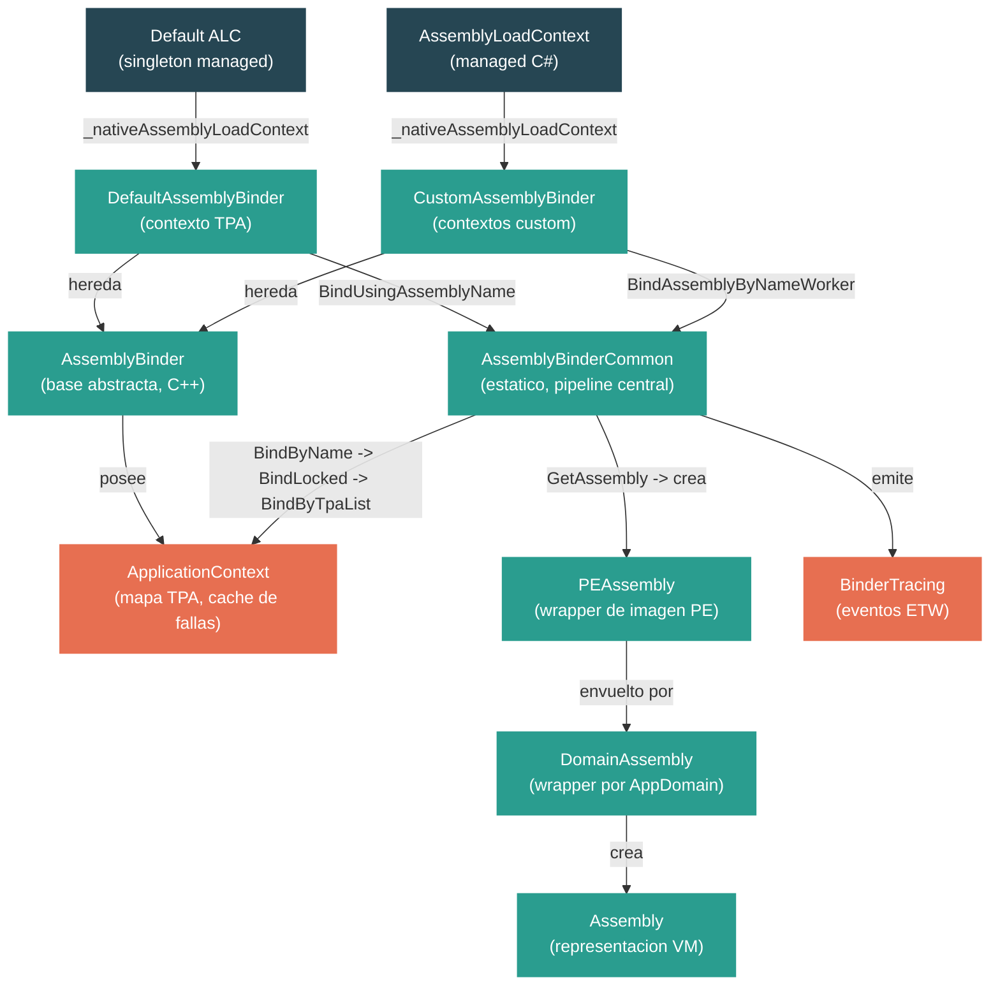

# Nivel 4: Internos — Carga de Assemblies: Binder, ALC y Fusion

> **Perfil objetivo:** Desarrollador que entiende el uso del `AssemblyLoadContext` a nivel managed y ahora quiere seguir el pipeline de binding nativo dentro de CoreCLR
> **Esfuerzo estimado:** 6 horas
> **Prerrequisitos:** [Modulo 1.5 — Fundamentos de assemblies](01-foundations-assemblies.md), Modulo 4.1
> [English version](../en/04-internals-assembly-loading.md)

---

## Objetivos de Aprendizaje

Al finalizar este modulo vas a poder:

1. Describir la jerarquia de tres niveles del binder: `AssemblyBinder` (base), `DefaultAssemblyBinder` y `CustomAssemblyBinder`.
2. Trazar el pipeline completo de resolucion de binding desde `BindAssembly` a traves de `BindByName`, `BindLocked`, `BindByTpaList` y el fallback a app paths.
3. Explicar como el `AssemblyLoadContext` managed se mapea al `CustomAssemblyBinder` (o `DefaultAssemblyBinder`) nativo a traves de `_nativeAssemblyLoadContext`.
4. Describir como `PEAssembly`, `DomainAssembly` y `Assembly` (nativo) representan assemblies cargados en la VM.
5. Explicar las reglas de compatibilidad de versiones y como se produce `FUSION_E_REF_DEF_MISMATCH`.
6. Usar eventos de binder tracing (`AssemblyLoadStart`/`AssemblyLoadStop`, `ResolutionAttempted`) y variables de entorno para diagnosticar fallas de binding.

---

## Mapa Conceptual



---

## Leccion 1: La Arquitectura del Assembly Binder

### Que vas a aprender

La jerarquia de clases nativas que impulsa cada resolucion de assembly en CoreCLR: `AssemblyBinder`, `DefaultAssemblyBinder` y `CustomAssemblyBinder`.

### El concepto

Cada vez que tu codigo managed dice `Assembly.Load(...)` o el JIT encuentra una referencia de tipo faltante, la solicitud eventualmente llega a codigo nativo C++ en el subsistema del **binder**. El binder no es una sola clase, sino una jerarquia con una clara division de responsabilidades:

**`AssemblyBinder`** (`src/coreclr/vm/assemblybinder.h`) es la clase base abstracta. Define el contrato:

```cpp
class AssemblyBinder
{
public:
    HRESULT BindAssemblyByName(AssemblyNameData* pAssemblyNameData, BINDER_SPACE::Assembly** ppAssembly);
    virtual HRESULT BindUsingPEImage(PEImage* pPEImage, bool excludeAppPaths, BINDER_SPACE::Assembly** ppAssembly) = 0;
    virtual HRESULT BindUsingAssemblyName(BINDER_SPACE::AssemblyName* pAssemblyName, BINDER_SPACE::Assembly** ppAssembly) = 0;
    virtual AssemblyLoaderAllocator* GetLoaderAllocator() = 0;
    virtual bool IsDefault() = 0;
    // ...
};
```

Cada binder posee un `ApplicationContext` (a traves de `m_appContext`), que contiene la lista TPA, los app paths, un cache de contexto de ejecucion con assemblies ya cargados y un cache de fallas. El binder tambien tiene un `INT_PTR m_ptrAssemblyLoadContext` — este es el GCHandle que apunta de vuelta al objeto `AssemblyLoadContext` managed.

**`DefaultAssemblyBinder`** (`src/coreclr/binder/inc/defaultassemblybinder.h`) es el binder para el contexto de carga por defecto — el que carga assemblies del framework y de la aplicacion al inicio. Existe exactamente uno por proceso. Su `IsDefault()` devuelve `true`. Se configura con:
- **Lista TPA** (Trusted Platform Assemblies) — la lista separada por punto y coma de rutas completas a assemblies del framework
- **Platform Resource Roots** — directorios donde se encuentran assemblies satelite del framework
- **App Paths** — directorios adicionales para buscar assemblies de la aplicacion

**`CustomAssemblyBinder`** (`src/coreclr/binder/inc/customassemblybinder.h`) se crea para cada `AssemblyLoadContext` definido por el usuario. Mantiene un puntero al `DefaultAssemblyBinder` (`m_pDefaultBinder`) para poder caer de vuelta al contexto por defecto. Tambien rastrea su `AssemblyLoaderAllocator` para contextos coleccionables.

La relacion clave: una instancia managed de `AssemblyLoadContext` se mapea a exactamente una instancia nativa de `AssemblyBinder` (ya sea `DefaultAssemblyBinder` o `CustomAssemblyBinder`).

### En el codigo fuente

La clase base esta en `src/coreclr/vm/assemblybinder.h`. Nota el metodo `GetAppContext()` que devuelve el `ApplicationContext` privado del binder:

```cpp
inline BINDER_SPACE::ApplicationContext* GetAppContext()
{
    return &m_appContext;
}
```

El `DefaultAssemblyBinder` esta definido en `src/coreclr/binder/inc/defaultassemblybinder.h` e implementado en `src/coreclr/binder/defaultassemblybinder.cpp`. Mira `BindAssemblyByNameWorker`:

```cpp
HRESULT DefaultAssemblyBinder::BindAssemblyByNameWorker(
    BINDER_SPACE::AssemblyName *pAssemblyName,
    BINDER_SPACE::Assembly **ppCoreCLRFoundAssembly,
    bool excludeAppPaths)
{
    // CoreLib debe ser enlazado usando BindToSystem
    _ASSERTE(!pAssemblyName->IsCoreLib());

    hr = AssemblyBinderCommon::BindAssembly(this,
                                            pAssemblyName,
                                            excludeAppPaths,
                                            ppCoreCLRFoundAssembly);
    // ...
}
```

Nota que delega a `AssemblyBinderCommon::BindAssembly` — la clase estatica que hace el trabajo pesado. `DefaultAssemblyBinder` no implementa la logica de binding en si; orquesta llamadas al pipeline comun y maneja el fallback managed cuando el binding falla.

El `CustomAssemblyBinder` (en `src/coreclr/binder/customassemblybinder.cpp`) documenta su orden de resolucion en comentarios:

```
// 1) Buscar el assembly dentro del LoadContext mismo. Si se encuentra, usarlo.
// 2) Invocar la implementacion del metodo Load del LoadContext. Si se encuentra, usarlo.
// 3) Buscar el assembly dentro del DefaultBinder (excepto para solicitudes de satelite).
// 4) Invocar el metodo ResolveSatelliteAssembly del LoadContext (para solicitudes de satelite).
// 5) Invocar el evento Resolving del LoadContext. Si se encuentra, usarlo.
// 6) Lanzar excepcion.
```

### Ejercicio practico

1. Abri `src/coreclr/vm/assemblybinder.h` y lista todos los metodos virtuales. Para cada uno, anota si devuelve un HRESULT o un puntero.
2. Abri `src/coreclr/binder/inc/defaultassemblybinder.h`. Compara su interfaz publica con `customassemblybinder.h`. Que metodo tiene `CustomAssemblyBinder` que `DefaultAssemblyBinder` no? (Pista: busca `SetupContext` y `PrepareForLoadContextRelease`.)
3. Busca `SetAssemblyLoadContext` en `assemblybinder.h`. Aca es donde se establece el enlace managed-a-nativo. Traza hacia atras: donde se llama esto durante la construccion del `AssemblyLoadContext`?

### Puntos clave

- `AssemblyBinder` es la base abstracta; `DefaultAssemblyBinder` maneja el contexto por defecto (TPA); `CustomAssemblyBinder` maneja los ALCs creados por el usuario.
- Ambos binders concretos delegan la logica de binding central a `AssemblyBinderCommon`.
- Cada binder posee un `ApplicationContext` que cachea resultados de binding y mantiene rutas de probe.
- El campo `m_ptrAssemblyLoadContext` es el puente de vuelta al mundo managed.

---

## Leccion 2: Pipeline de Resolucion de Binding

### Que vas a aprender

La secuencia paso a paso de como `AssemblyBinderCommon` resuelve un nombre de assembly a una imagen PE cargada, incluyendo probing de TPA, app paths y manejo de recursos satelite.

### El concepto

Cuando una solicitud de binding llega a `AssemblyBinderCommon::BindAssembly`, se ejecuta un pipeline cuidadosamente orquestado. Esta es la secuencia completa:

**Paso 1: Adquirir el lock del contexto de aplicacion.** El binding se serializa por `ApplicationContext` usando una seccion critica. Esto previene condiciones de carrera cuando multiples hilos intentan cargar el mismo assembly.

**Paso 2: `BindByName`.** Esta es la resolucion de nivel superior basada en nombre:
- Primero, revisar el **cache de fallas**. Si este nombre de assembly fallo previamente en el binding, devolver la falla cacheada inmediatamente. Esto evita buscar repetidamente en el sistema de archivos assemblies que no existen.
- Validar la arquitectura (x64, ARM64, etc.).
- Llamar a `BindLocked`.

**Paso 3: `BindLocked`.** Intenta dos estrategias en orden:
1. **`FindInExecutionContext`** — buscar el nombre del assembly en la tabla hash del `ExecutionContext`. Si se encuentra, realizar una verificacion de compatibilidad de version. Si la version ya cargada satisface la solicitud, devolverla. Si no, devolver `FUSION_E_APP_DOMAIN_LOCKED` (o `FUSION_E_REF_DEF_MISMATCH` para assemblies TPA).
2. **`BindByTpaList`** — si el assembly no se encontro en el contexto de ejecucion, buscar en el sistema de archivos.

**Paso 4: `BindByTpaList`.** Aca es donde ocurre el probing real del sistema de archivos, en el siguiente orden:

Para **assemblies satelite** (cultura no neutral):
1. Buscar en el bundle de archivo unico (si aplica)
2. Buscar en Platform Resource Roots
3. Buscar en App Paths (subdirectorios de cultura)

Para **assemblies regulares**:
1. Buscar en el bundle de archivo unico usando `AssemblyProbeExtension::Probe`
2. Buscar el nombre simple del assembly en el **mapa TPA** (`SimpleNameToFileNameMap`). La lista TPA es una tabla hash pre-parseada que mapea nombres simples a rutas completas de archivos — esto no es un escaneo de directorio sino una busqueda directa.
3. Si no esta en TPA (o ref-def mismatch en TPA), buscar en **App Paths** usando `BindAssemblyByProbingPaths`.

**Paso 5: `RegisterAndGetHostChosen`.** Despues de encontrar un candidato, registrarlo en el contexto de ejecucion. Si otro hilo enlazo el mismo assembly concurrentemente (la version del contexto cambio), reintentar todo el binding desde el inicio.

**Paso 6: Compatibilidad de version.** En cada etapa donde se encuentra un assembly, `IsCompatibleAssemblyVersion` verifica si la version encontrada satisface la solicitud. La regla es directa: cada componente de version (major, minor, build, revision) del assembly encontrado debe ser mayor o igual al componente solicitado. Un componente solicitado no especificado coincide con cualquier valor.

### En el codigo fuente

El punto de entrada esta en `src/coreclr/binder/assemblybindercommon.cpp`, comenzando en `BindAssembly`:

```cpp
HRESULT AssemblyBinderCommon::BindAssembly(
    AssemblyBinder      *pBinder,
    AssemblyName        *pAssemblyName,
    bool                 excludeAppPaths,
    Assembly           **ppAssembly)
{
    // El tracing ocurre fuera del lock del binder
    BinderTracing::ResolutionAttemptedOperation tracer{pAssemblyName, pBinder, 0, hr};

Retry:
    {
        CRITSEC_Holder contextLock(pApplicationContext->GetCriticalSectionCookie());
        IF_FAIL_GO(BindByName(pApplicationContext, pAssemblyName, ...));
        kContextVersion = pApplicationContext->GetVersion();
    } // lock liberado

    // RegisterAndGetHostChosen puede devolver S_FALSE para indicar reintento
    hr = RegisterAndGetHostChosen(pApplicationContext, kContextVersion, &bindResult, &hostBindResult);
    if (hr == S_FALSE)
    {
        bindResult.Reset();
        goto Retry;
    }
    // ...
}
```

El patron `goto Retry` es deliberado: asegura que bajo alta concurrencia, el loop de binding converge. Por diseno, cada reintento o tiene exito o encuentra el assembly que otro hilo ya cargo.

La busqueda TPA en `BindByTpaList` es una busqueda en tabla hash, no un recorrido de directorio:

```cpp
SimpleNameToFileNameMap * tpaMap = pApplicationContext->GetTpaList();
const SimpleNameToFileNameMapEntry *pTpaEntry = tpaMap->LookupPtr(simpleName.GetUnicode());
```

Por eso la lista TPA debe estar completamente poblada al inicio — el binder nunca escanea directorios en busca de assemblies de plataforma.

### Ejercicio practico

1. En `src/coreclr/binder/assemblybindercommon.cpp`, encuentra la funcion `BindByTpaList`. Lee el comentario de bloque arriba de ella (comenzando en la linea ~804). Diagrama el orden de probe en papel.
2. Pone un breakpoint (o agrega un printf) en `FindInExecutionContext`. Carga el mismo assembly dos veces desde codigo managed. Observa que la segunda carga encuentra el cache del contexto de ejecucion y retorna inmediatamente.
3. Encontra la clase `FailureCache` en `src/coreclr/binder/inc/failurecache.hpp`. Que estructura de datos usa? (Es un `SHash`.) Por que es importante cachear fallas para el rendimiento de inicio?

### Puntos clave

- El binding se serializa por `ApplicationContext` usando un lock de seccion critica.
- El cache de fallas evita probes repetidos al sistema de archivos para assemblies faltantes.
- La resolucion TPA es una busqueda en tabla hash (O(1)), no un escaneo de directorio.
- El probing de app paths es una busqueda lineal a traves de directorios configurados.
- El binding concurrente se maneja con un loop de reintento con versionado del contexto.

---

## Leccion 3: AssemblyLoadContext a Nivel de la VM

### Que vas a aprender

Como la clase managed `System.Runtime.Loader.AssemblyLoadContext` se conecta al `CustomAssemblyBinder` o `DefaultAssemblyBinder` nativo, y como fluyen los callbacks en ambas direcciones.

### El concepto

El `AssemblyLoadContext` managed (en `System.Private.CoreLib`) es la API publica con la que interactuan los desarrolladores. Pero es un wrapper delgado sobre el binder nativo. Entender el puente entre managed y nativo es critico para depurar problemas de binding.

**Construccion: Managed a Nativo.** Cuando llamas a `new AssemblyLoadContext("MiContexto")`, el constructor encadena a:

```csharp
_nativeAssemblyLoadContext = InitializeAssemblyLoadContext(thisHandlePtr, representsTPALoadContext, isCollectible);
```

Este P/Invoke (`AssemblyNative_InitializeAssemblyLoadContext`) hace lo siguiente en codigo nativo:
1. Crea una instancia de `CustomAssemblyBinder` (o devuelve el `DefaultAssemblyBinder` existente si `representsTPALoadContext` es true).
2. Llama a `SetAssemblyLoadContext()` en el binder, pasando el GCHandle al objeto managed.
3. Devuelve el puntero nativo del binder como `IntPtr`, que se almacena en `_nativeAssemblyLoadContext`.

Esto establece un enlace bidireccional: managed tiene un puntero nativo; nativo tiene un GCHandle a managed.

**Solicitudes de carga: Nativo llama a Managed.** Cuando el binder nativo no puede resolver un assembly a traves de sus propias rutas (TPA, app paths), hace un callback al codigo managed. La funcion clave es `RuntimeInvokeHostAssemblyResolver`, declarada al inicio de `assemblybindercommon.cpp`:

```cpp
extern HRESULT RuntimeInvokeHostAssemblyResolver(
    INT_PTR pAssemblyLoadContextToBindWithin,
    BINDER_SPACE::AssemblyName *pAssemblyName,
    DefaultAssemblyBinder *pDefaultBinder,
    AssemblyBinder *pBinder,
    BINDER_SPACE::Assembly **ppLoadedAssembly);
```

Esta funcion usa el GCHandle (`pAssemblyLoadContextToBindWithin`) para obtener el objeto ALC managed e invoca su override de `Load()`. Si `Load()` devuelve null, cae al evento `Resolving`.

Para el `DefaultAssemblyBinder`, la secuencia de callback es:
1. Intentar binding nativo (TPA + app paths)
2. Si falla, inicializar el ALC por defecto managed si es necesario
3. Llamar a `RuntimeInvokeHostAssemblyResolver` que invoca el evento managed `Resolving`

Para el `CustomAssemblyBinder`, la secuencia (documentada en el fuente) es:
1. Buscar en el contexto de ejecucion de este binder
2. Llamar al override managed `Load()`
3. Caer de vuelta al `DefaultAssemblyBinder` (busqueda TPA, excluyendo app paths para no-satelite)
4. Llamar a `ResolveSatelliteAssembly()` managed (para assemblies satelite)
5. Disparar evento managed `Resolving`
6. Lanzar `FileNotFoundException`

**Coleccionabilidad.** Cuando un `AssemblyLoadContext` se crea con `isCollectible: true`, el `CustomAssemblyBinder` nativo se aloca usando un `AssemblyLoaderAllocator` dedicado. Cuando el ALC managed se descarga, `PrepareForLoadContextRelease` convierte el GCHandle debil en uno fuerte (previniendo GC prematuro), y `ReleaseLoadContext` eventualmente destruye el binder nativo y su loader allocator, liberando toda la memoria asociada con los assemblies cargados.

### En el codigo fuente

El lado managed vive en dos archivos:

- `src/libraries/System.Private.CoreLib/src/System/Runtime/Loader/AssemblyLoadContext.cs` — logica portable: constructor, eventos, `LoadFromAssemblyName`, `Unload`, maquina de estados.
- `src/coreclr/System.Private.CoreLib/src/System/Runtime/Loader/AssemblyLoadContext.CoreCLR.cs` — P/Invokes especificos de CoreCLR.

En el archivo especifico de CoreCLR, nota las declaraciones `LibraryImport`:

```csharp
[LibraryImport(RuntimeHelpers.QCall, EntryPoint = "AssemblyNative_InitializeAssemblyLoadContext")]
private static partial IntPtr InitializeAssemblyLoadContext(IntPtr ptrAssemblyLoadContext,
    [MarshalAs(UnmanagedType.Bool)] bool fRepresentsTPALoadContext,
    [MarshalAs(UnmanagedType.Bool)] bool isCollectible);

[LibraryImport(RuntimeHelpers.QCall, EntryPoint = "AssemblyNative_LoadFromPath", StringMarshalling = StringMarshalling.Utf16)]
private static partial void LoadFromPath(IntPtr ptrNativeAssemblyBinder, string? ilPath, string? niPath,
    ObjectHandleOnStack retAssembly);
```

El parametro `IntPtr ptrNativeAssemblyBinder` en `LoadFromPath` es el campo `_nativeAssemblyLoadContext` — el puntero crudo al objeto C++ `AssemblyBinder`.

El campo `_nativeAssemblyLoadContext` esta declarado en el archivo portable:

```csharp
private readonly IntPtr _nativeAssemblyLoadContext;
```

Nota el comentario: "Si modificas este campo, tambien debes actualizar la estructura `AssemblyLoadContextBaseObject` en `object.h`." Esto es porque la VM accede a este campo directamente desde C++ mediante offsets conocidos en el layout del objeto managed.

### Ejercicio practico

1. Abri `AssemblyLoadContext.cs` y encontra el constructor que llama a `InitializeAssemblyLoadContext`. Traza el parametro `representsTPALoadContext` — cuando es `true`? (Pista: busca la subclase `DefaultAssemblyLoadContext`.)
2. Busca `RuntimeInvokeHostAssemblyResolver` en el directorio `src/coreclr/vm/`. Encontra donde invoca el metodo managed `Load`. Que pasa si `Load` devuelve null?
3. Crea un `AssemblyLoadContext` custom y sobreescribi `Load`. Pone un breakpoint en `CustomAssemblyBinder::BindUsingAssemblyName` (nativo) y en tu metodo managed `Load`. Observa la secuencia de llamadas: nativo -> managed -> nativo.

### Puntos clave

- El `AssemblyLoadContext` managed tiene un `IntPtr` crudo al `AssemblyBinder` nativo.
- El binder nativo tiene un GCHandle apuntando de vuelta al ALC managed.
- Las solicitudes de carga fluyen primero-nativo: el binder intenta sus propias rutas antes de llamar a overrides managed.
- Los ALCs coleccionables usan un `AssemblyLoaderAllocator` dedicado que puede destruirse al descargar.
- El override `Load()` se invoca via `RuntimeInvokeHostAssemblyResolver` cuando el binding nativo falla.

---

## Leccion 4: PEAssembly y Objetos Assembly

### Que vas a aprender

Como la VM internamente representa un assembly cargado a traves de los objetos en capas `PEAssembly`, `DomainAssembly` y `Assembly`.

### El concepto

Cuando el binder resuelve exitosamente un assembly a un archivo en disco (o un array de bytes en memoria), la VM debe crear estructuras de datos internas para representarlo. Hay tres capas, cada una con una responsabilidad distinta:

**`PEAssembly`** (`src/coreclr/vm/peassembly.h`) es la representacion de mas bajo nivel. Envuelve un `PEImage` (el archivo PE mapeado en memoria) y proporciona acceso a:
- Metadata (via `IMDInternalImport`)
- Headers PE e informacion de layout
- Validacion de tipo de maquina (x64 vs ARM64 vs MSIL)
- Nombre para mostrar y ruta

Un `PEAssembly` puede crearse de multiples fuentes:
1. Un HMODULE (para DLLs IJW/nativas cargadas por el SO)
2. Una ruta en disco (el caso mas comun)
3. Un array de bytes (para `Assembly.Load(byte[])`)
4. Dinamico/reflection-emit (placeholder, sin PE real)

El comentario en `peassembly.h` explica: "Aunque un PEAssembly usualmente es un archivo PE en disco, no siempre es el caso. Por lo tanto, es una decision consciente no exportar acceso al archivo PE directamente."

**`Assembly`** (`src/coreclr/vm/assembly.hpp` / `assembly.cpp`) es la representacion a nivel de VM del assembly. Posee:
- El `Module` (que contiene la metadata y las tablas de metodos)
- El `PEAssembly`
- Atributos de seguridad y declaraciones de assemblies amigos
- Un puntero de vuelta a su `DomainAssembly`

El contador global `g_cAssemblies` rastrea cuantos assemblies existen en el proceso.

**`DomainAssembly`** (`src/coreclr/vm/domainassembly.h`) es el wrapper por AppDomain. En .NET moderno (un solo AppDomain), hay exactamente un `DomainAssembly` por `Assembly`. Su constructor crea el `Assembly`:

```cpp
DomainAssembly::DomainAssembly(PEAssembly* pPEAssembly, LoaderAllocator* pLoaderAllocator, AllocMemTracker* memTracker)
    : m_pAssembly(NULL)
{
    NewHolder<Assembly> assembly = Assembly::Create(pPEAssembly, memTracker, pLoaderAllocator);
    assembly->SetDomainAssembly(this);
    m_pAssembly = assembly.Extract();
}
```

Nota que `Assembly::Create` es la fabrica, y `DomainAssembly` inmediatamente se enlaza via `SetDomainAssembly`.

**Niveles de carga.** La carga de assemblies no es atomica — progresa a traves de etapas rastreadas por el enum `FileLoadLevel` en `assemblyspec.hpp`:

```
FILE_LOAD_CREATE          // Lock + FileLoadLock creado
FILE_LOAD_ALLOCATE        // DomainAssembly y Assembly alocados
FILE_LOAD_BEGIN
FILE_LOAD_BEFORE_TYPE_LOAD
FILE_LOAD_EAGER_FIXUPS
FILE_LOAD_DELIVER_EVENTS
FILE_LOADED               // Cargado pero no activo
FILE_ACTIVE               // Completamente activo (constructores ejecutados)
```

Esta carga por etapas previene deadlocks de dependencias circulares: un assembly puede estar en estado `FILE_LOADED` (sus tipos son visibles) antes de `FILE_ACTIVE` (su inicializador de modulo se ejecuto).

### En el codigo fuente

En el subsistema del binder, tambien hay una clase `BINDER_SPACE::Assembly` (en `src/coreclr/binder/inc/assembly.hpp`) — no la confundas con el `Assembly` de la VM. El assembly del binder es un handle liviano que contiene el `PEImage` y el `AssemblyName`. Es el "objeto resultado" del binder que se pasa hacia arriba a la VM, que luego crea la cadena completa `PEAssembly` -> `Assembly` -> `DomainAssembly`.

La validacion en `peassembly.cpp` incluye verificaciones de arquitectura:

```cpp
static void ValidatePEFileMachineType(PEAssembly *pPEAssembly)
{
    DWORD peKind;
    DWORD actualMachineType;
    pPEAssembly->GetPEKindAndMachine(&peKind, &actualMachineType);

    if (actualMachineType == IMAGE_FILE_MACHINE_I386 && ((peKind & (peILonly | pe32BitRequired)) == peILonly))
        return;    // La imagen esta marcada como agnositca de CPU.

    if (actualMachineType != IMAGE_FILE_MACHINE_NATIVE && actualMachineType != IMAGE_FILE_MACHINE_NATIVE_NI)
    {
        COMPlusThrow(kBadImageFormatException, IDS_CLASSLOAD_WRONGCPU, name.GetUnicode());
    }
}
```

Por eso cargar un assembly x64 en ARM64 falla con `BadImageFormatException` — la verificacion ocurre a nivel de `PEAssembly`.

### Ejercicio practico

1. Abri `src/coreclr/vm/domainassembly.h`. Nota que `DomainAssembly` esta marcado como `final` — no puede heredarse. Por que es apropiado para .NET moderno (un solo AppDomain)?
2. Busca `Assembly::Create` en `src/coreclr/vm/assembly.cpp`. Lista los parametros que recibe. Que hace el `AllocMemTracker`?
3. En `src/coreclr/vm/assemblyspec.hpp`, lee el enum `FileLoadLevel`. Dibuja un diagrama de estados mostrando las transiciones. Cuando se vuelve visible el assembly para otro codigo? Cuando se ejecuta el inicializador de modulo?

### Puntos clave

- `PEAssembly` envuelve la imagen PE cruda y la metadata. Es la salida del binder.
- `Assembly` (VM) es la representacion del runtime que posee el Module y los datos del sistema de tipos.
- `DomainAssembly` conecta el AppDomain con el Assembly. En .NET moderno, es 1:1.
- La carga progresa a traves de niveles por etapas (`FILE_LOAD_CREATE` a `FILE_ACTIVE`) para manejar dependencias circulares.
- No confundas `BINDER_SPACE::Assembly` (resultado del binder) con el `Assembly` de la VM (objeto del runtime).

---

## Leccion 5: Binding de Versiones y Resolucion de Conflictos

### Que vas a aprender

Como el binder maneja desajustes de version, que significa `FUSION_E_REF_DEF_MISMATCH` y las reglas para determinar compatibilidad de assembly.

### El concepto

Los conflictos de version estan entre los problemas mas comunes de carga de assemblies. El binder tiene reglas explicitas para cuando un assembly encontrado satisface una solicitud.

**La funcion de compatibilidad.** `IsCompatibleAssemblyVersion` en `assemblybindercommon.cpp` implementa una comparacion componente por componente:

```
Para cada componente de version (Major, Minor, Build, Revision):
  - Si el componente solicitado no esta especificado -> compatible (coincidencia comodin)
  - Si el componente encontrado no esta especificado pero el solicitado si -> incompatible
  - Si solicitado > encontrado -> incompatible
  - Si solicitado < encontrado -> compatible (version mayor satisface)
  - Si iguales -> verificar siguiente componente
```

Esto significa: **una version mayor del assembly encontrado siempre satisface una solicitud de version menor**, siempre que todos los componentes especificados coincidan o superen. Un assembly que solicita version 2.0 se satisface con version 3.0, pero no con version 1.5.

**Ref-Def mismatch.** Cuando `BindLocked` encuentra un assembly en el contexto de ejecucion pero la verificacion de version falla, produce `FUSION_E_APP_DOMAIN_LOCKED`. Para assemblies TPA, esto se convierte en `FUSION_E_REF_DEF_MISMATCH`:

```cpp
bool isCompatible = IsCompatibleAssemblyVersion(pAssemblyName, pAssembly->GetAssemblyName());
hr = isCompatible ? S_OK : FUSION_E_APP_DOMAIN_LOCKED;

// El binder TPA devuelve FUSION_E_REF_DEF_MISMATCH para version incompatible
if (hr == FUSION_E_APP_DOMAIN_LOCKED && isTpaListProvided)
    hr = FUSION_E_REF_DEF_MISMATCH;
```

La distincion importa: `FUSION_E_APP_DOMAIN_LOCKED` significa "una version diferente ya esta cargada en este contexto" (falla permanente). `FUSION_E_REF_DEF_MISMATCH` significa "el assembly encontrado no coincide con la referencia" (puede disparar fallback al resolvedor managed).

**TPA gana sobre App Paths.** Cuando un assembly con el mismo nombre simple existe tanto en TPA como en App Paths, el binder aplica una regla de precedencia: si el nombre completo del assembly TPA (nombre simple + cultura + public key token) coincide con el assembly de la app, TPA gana. Si los nombres difieren (assembly completamente diferente, mismo nombre simple), se usa el assembly de la app.

**`AssemblySpec` y `AssemblyName`.** Dos clases relacionadas pero diferentes participan en el binding:
- `BINDER_SPACE::AssemblyName` (en `src/coreclr/binder/inc/assemblyname.hpp`) — la representacion propia del binder de una identidad de assembly, usada a lo largo del pipeline de binding.
- `AssemblySpec` (en `src/coreclr/vm/assemblyspec.hpp`) — la solicitud de binding a nivel de VM. Envuelve un `BaseAssemblySpec` y agrega el contexto de `AppDomain`, assembly padre y binder de fallback.

`AssemblySpec` incluye el concepto de binder de fallback: cuando un assembly emitido por reflexion solicita una carga, el `m_pFallbackBinder` se configura para asegurar que se use el contexto de carga del assembly que solicita.

### En el codigo fuente

La logica de compatibilidad de versiones esta al inicio de `src/coreclr/binder/assemblybindercommon.cpp`:

```cpp
bool IsCompatibleAssemblyVersion(AssemblyName *pRequestedName, AssemblyName *pFoundName)
{
    AssemblyVersion *pRequestedVersion = pRequestedName->GetVersion();
    AssemblyVersion *pFoundVersion = pFoundName->GetVersion();

    if (!pRequestedVersion->HasMajor())
        return true; // Version solicitada no especificada coincide con cualquiera

    if (!pFoundVersion->HasMajor() || pRequestedVersion->GetMajor() > pFoundVersion->GetMajor())
        return false;

    if (pRequestedVersion->GetMajor() < pFoundVersion->GetMajor())
        return true;

    // ... repetir para Minor, Build, Revision
}
```

La funcion `TestCandidateRefMatchesDef` realiza coincidencia de identidad (nombre, cultura, public key token) sin version. Se usa para verificar que un assembly TPA realmente corresponde al assembly solicitado antes de aplicar la verificacion de version.

En `src/coreclr/vm/assemblyspec.hpp`, nota el enum `FileLoadLevel` que rastrea las etapas de carga del assembly. La etapa `FILE_LOAD_ALLOCATE` es donde `AssemblySpec` transiciona a un par `DomainAssembly`/`Assembly` real. Antes de eso, el spec puede fallar en cualquier punto sin dejar estado parcialmente cargado.

### Ejercicio practico

1. Escribi una prueba pequena: crea dos assemblies con el mismo nombre pero diferentes versiones. Carga la version menor primero via el ALC por defecto, luego intenta cargar la version mayor. Que error obtenes?
2. Invierte el experimento: carga la version mayor primero, luego solicita la version menor. Tiene exito? (Si — la mayor satisface a la menor.)
3. En `assemblybindercommon.cpp`, encontra la ruta de codigo en `BindByTpaList` donde `fPartialMatchOnTpa` se pone en `true`. Bajo que condicion el binder prefiere el assembly TPA sobre un assembly de app path?

### Puntos clave

- Versiones mayores satisfacen solicitudes de versiones menores (compatible hacia adelante).
- `FUSION_E_APP_DOMAIN_LOCKED` = version incorrecta ya cargada en este contexto.
- `FUSION_E_REF_DEF_MISMATCH` = la identidad del assembly encontrado no coincide con la referencia (dispara fallback).
- TPA toma precedencia sobre app paths cuando el nombre completo del assembly coincide.
- `AssemblySpec` (VM) y `BINDER_SPACE::AssemblyName` (binder) representan identidad de assembly en capas diferentes.

---

## Leccion 6: Diagnosticos — Binder Tracing

### Que vas a aprender

Como usar eventos ETW, variables de entorno y las clases `BinderTracing` para diagnosticar fallas de binding de assemblies.

### El concepto

Las fallas de binding de assemblies son notoriamente dificiles de diagnosticar. El subsistema del binder proporciona multiples capas de instrumentacion de diagnostico.

**Eventos ETW.** El mecanismo de tracing principal usa Event Tracing for Windows (ETW) y EventPipe (multiplataforma). Dos clases de eventos enmarcan cada operacion de binding:

- **`AssemblyLoadStart`** — se dispara cuando comienza el binding. Incluye el nombre del assembly solicitado, el assembly que solicita y el nombre del ALC.
- **`AssemblyLoadStop`** — se dispara cuando el binding se completa. Incluye el nombre del assembly resultado, la ruta y si fue cacheado.

Entre estos, por cada etapa de resolucion, un evento **`ResolutionAttempted`** se dispara, indicando que etapa se intento y si tuvo exito. Las etapas corresponden al enum `BinderTracing::ResolutionAttemptedOperation::Stage`:

```cpp
enum class Stage : uint16_t
{
    FindInLoadContext = 0,
    AssemblyLoadContextLoad = 1,
    ApplicationAssemblies = 2,
    DefaultAssemblyLoadContextFallback = 3,
    ResolveSatelliteAssembly = 4,
    AssemblyLoadContextResolvingEvent = 5,
    AppDomainAssemblyResolveEvent = 6,
};
```

Esto significa que una sola operacion de binding puede disparar hasta 7 eventos `ResolutionAttempted` (uno por etapa), mas los brackets de inicio/fin.

**Clases `BinderTracing`.** Hay dos clases principales en `src/coreclr/binder/inc/bindertracing.h`:

- `AssemblyBindOperation` — envuelve los eventos de inicio/fin. Creada con un `AssemblySpec`, dispara `AssemblyLoadStart` en el constructor y `AssemblyLoadStop` en el destructor (patron RAII).
- `ResolutionAttemptedOperation` — rastrea las etapas. Su metodo `GoToStage()` dispara el evento de la etapa anterior (asumida como fallida) y avanza a la siguiente.

**Variables de entorno.** Para depuracion rapida sin herramientas ETW:
- `DOTNET_AssemblyLoadContextDebug=1` — habilita salida de diagnostico del ALC managed.
- `DOTNET_TraceTPA=1` — muestra la lista TPA durante el inicio.

**`dotnet-trace` y `PerfView`.** Para diagnosticos de grado produccion:
```bash
dotnet-trace collect --providers Microsoft-Windows-DotNETRuntime:4 --process-id <PID>
```
La keyword de provider `4` (Loader) habilita todos los eventos de carga de assemblies. El archivo `.nettrace` resultante se puede abrir en PerfView o Visual Studio.

**Tracing managed.** El ALC managed tambien emite tracing desde `AssemblyLoadContext.CoreCLR.cs`:

```csharp
[LibraryImport(RuntimeHelpers.QCall, EntryPoint = "AssemblyNative_TraceResolvingHandlerInvoked")]
[return: MarshalAs(UnmanagedType.Bool)]
internal static partial bool TraceResolvingHandlerInvoked(string assemblyName, string handlerName,
    string? alcName, string? resultAssemblyName, string? resultAssemblyPath);
```

Estos metodos QCall disparan eventos en cada punto donde se invoca un handler managed, proporcionando visibilidad completa en la porcion managed de la resolucion.

**Eventos `PathProbed`.** Cada probe al sistema de archivos (busqueda TPA, escaneo de app path, busqueda de satelite) dispara un evento `PathProbed` con la ruta intentada y el HRESULT. Esto te permite reconstruir la secuencia exacta de directorios que el binder busco.

### En el codigo fuente

La implementacion del tracing esta en `src/coreclr/binder/bindertracing.cpp`. La funcion `FireAssemblyLoadStart`:

```cpp
void FireAssemblyLoadStart(const BinderTracing::AssemblyBindOperation::BindRequest &request)
{
    if (!EventEnabledAssemblyLoadStart())
        return;

    GUID activityId = GUID_NULL;
    GUID relatedActivityId = GUID_NULL;
    ActivityTracker::Start(&activityId, &relatedActivityId);

    FireEtwAssemblyLoadStart(
        GetClrInstanceId(),
        request.AssemblyName,
        request.AssemblyPath,
        request.RequestingAssembly,
        request.AssemblyLoadContext,
        request.RequestingAssemblyLoadContext,
        &activityId,
        &relatedActivityId);
}
```

Nota el guard `EventEnabledAssemblyLoadStart()` — el tracing tiene cero overhead cuando ningun listener esta conectado. El `ActivityTracker` proporciona IDs de actividad para correlacionar pares inicio/fin entre hilos.

El metodo `ResolutionAttemptedOperation::GoToStage` muestra el patron de transicion de etapas:

```cpp
void GoToStage(Stage stage)
{
    // Moverse a una etapa diferente solo deberia pasar si la etapa actual fallo.
    TraceStage(m_stage, m_hr, m_pFoundAssembly);
    m_stage = stage;
    m_exceptionMessage.Clear();
}
```

### Ejercicio practico

1. Ejecuta una aplicacion .NET simple con `dotnet-trace`:
   ```bash
   dotnet-trace collect --providers Microsoft-Windows-DotNETRuntime:4 -- dotnet run
   ```
   Abri el trace en PerfView. Encontra los eventos `AssemblyLoadStart`/`AssemblyLoadStop`. Cuantos assemblies se cargan durante el inicio de una app "Hello World"?

2. Provoca deliberadamente una falla de binding referenciando una version de assembly inexistente. Recolecta un trace y examina los eventos `ResolutionAttempted`. Que etapas se intentan antes de la falla?

3. En `src/coreclr/binder/bindertracing.cpp`, encontra la funcion `FireAssemblyLoadStop`. Nota que lee el nombre para mostrar y la ruta del assembly resultado. Que pasa si `resultAssembly` es null (binding fallido)?

4. Busca llamadas a `PathProbed` en `assemblybindercommon.cpp`. Conta cuantos valores diferentes de `PathSource` existen. Mapea cada uno a la etapa de probe que representa.

### Puntos clave

- Los eventos ETW/EventPipe enmarcan cada operacion de binding con pares inicio/fin y eventos de resolucion por etapa.
- Las clases `BinderTracing` usan RAII — la construccion dispara inicio, la destruccion dispara fin.
- Los eventos `ResolutionAttempted` se disparan por cada etapa fallida, proporcionando un registro paso a paso del intento de binding.
- Los eventos `PathProbed` registran cada ruta del sistema de archivos que el binder verifico.
- El tracing tiene cero overhead cuando ningun listener esta conectado, gracias a los guards `EventEnabled*()`.
- Usa `dotnet-trace` con keyword de provider `4` (Loader) para capturar diagnosticos de binding en produccion.

---

## Resumen y Que Sigue

En este modulo trazaste el pipeline completo de carga de assemblies desde el `AssemblyLoadContext` managed a traves del subsistema del binder nativo hasta la creacion de objetos de la VM.

**Puntos clave para recordar:**

1. **Tres clases de binder:** `AssemblyBinder` (base abstracta) -> `DefaultAssemblyBinder` (contexto TPA) -> `CustomAssemblyBinder` (ALCs de usuario). Ambos binders concretos delegan a `AssemblyBinderCommon`.

2. **El pipeline de binding:** `BindAssembly` -> `BindByName` (verificacion de cache de fallas) -> `BindLocked` (busqueda en contexto de ejecucion) -> `BindByTpaList` (bundle -> mapa TPA -> app paths).

3. **Puente managed-nativo:** El campo managed `_nativeAssemblyLoadContext` contiene el puntero al binder nativo. El campo nativo `m_ptrAssemblyLoadContext` contiene un GCHandle al ALC managed. Las solicitudes de carga fluyen primero-nativo con fallback managed.

4. **Cadena de objetos VM:** `BINDER_SPACE::Assembly` (resultado del binder) -> `PEAssembly` (wrapper de imagen PE) -> `Assembly` (representacion VM) -> `DomainAssembly` (wrapper por dominio).

5. **Reglas de version:** Versiones mayores satisfacen solicitudes menores. `FUSION_E_REF_DEF_MISMATCH` dispara fallback a resolvedores managed.

6. **Diagnosticos:** Eventos ETW en cada etapa, `PathProbed` por cada verificacion del sistema de archivos, `ResolutionAttempted` por cada etapa de resolucion.

### Lectura adicional

| Recurso | Ubicacion |
|---------|-----------|
| Codigo fuente del binder | `src/coreclr/binder/` |
| Objetos assembly de la VM | `src/coreclr/vm/assembly.cpp`, `peassembly.h`, `domainassembly.h` |
| ALC managed | `src/libraries/System.Private.CoreLib/src/System/Runtime/Loader/AssemblyLoadContext.cs` |
| P/Invokes del ALC en CoreCLR | `src/coreclr/System.Private.CoreLib/src/System/Runtime/Loader/AssemblyLoadContext.CoreCLR.cs` |
| Documento de diseno del assembly binder | `docs/design/features/assembly-loading.md` (si existe) |
| `AssemblySpec` | `src/coreclr/vm/assemblyspec.hpp` |
| Binder tracing | `src/coreclr/binder/bindertracing.cpp`, `src/coreclr/binder/inc/bindertracing.h` |

### Proximo modulo

El Modulo 4.7 explorara el **Type Loader** — como la VM resuelve referencias de tipo, construye estructuras `MethodTable` y maneja instanciacion generica una vez que los assemblies estan cargados.
