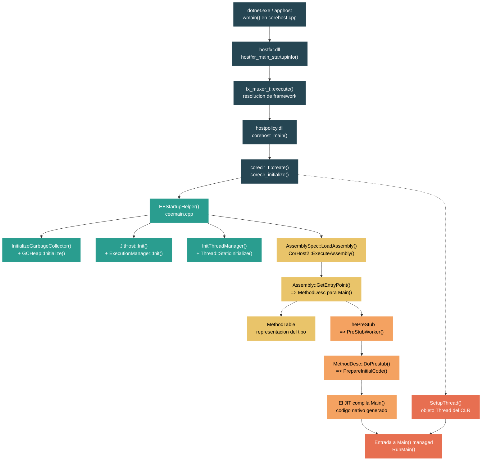

# Nivel 4: Internals — CLR Startup: De `dotnet` a `Main()`

> **Perfil objetivo:** Desarrollador que entiende la mecanica del CLR, el comportamiento del JIT y el tuning del GC, y quiere trazar la ejecucion a traves de la cadena nativa del host hasta el motor del runtime
> **Esfuerzo estimado:** 8 horas
> **Prerrequisitos:** Nivel 3 completo (Modelo de Memoria, GC, Threading, Native Interop)
> [English version](../en/04-internals-clr-startup.md)

---

## Objetivos de Aprendizaje

Al finalizar este modulo vas a poder:

1. Trazar la cadena de llamadas nativas completa desde `wmain()` de `dotnet.exe` a traves de hostfxr, hostpolicy y hasta `coreclr_initialize`.
2. Identificar las funciones clave en `ceemain.cpp` que componen `EEStartupHelper()` y explicar el orden de inicializacion del GC, JIT, thread manager, sistema de tipos y debugger.
3. Describir como se localiza el assembly de entrada, se carga via `AssemblySpec::LoadAssembly`, y como `CorHost2::ExecuteAssembly` conecta con el codigo managed.
4. Explicar el rol de `MethodTable` en la representacion de un tipo en runtime y como `Assembly::GetEntryPoint()` resuelve al `MethodDesc` de `Main()`.
5. Recorrer el mecanismo del prestub -- desde `ThePreStub` pasando por `PreStubWorker` hasta `MethodDesc::DoPrestub` -- y explicar como se compila `Main()` just-in-time en la primera llamada.
6. Describir como `SetupThread()` crea el objeto Thread del CLR para el thread principal del SO, que hace `InitializationForManagedThreadInNative`, y como ocurre la transicion a codigo managed.
7. Usar `DOTNET_TRACE_HOST` y SOS/WinDbg/LLDB para observar la secuencia de startup en un proceso vivo.
8. Explicar la diferencia entre `coreclr_initialize` (bootstrap del runtime) y `coreclr_execute_assembly` (ejecucion del assembly) en la API de hosting.

---

## Mapa Conceptual



---

## Curriculum

### Leccion 1 — La Cadena del Host Nativo: dotnet.exe a coreclr_initialize

#### Que vas a aprender

Cuando escribis `dotnet MyApp.dll`, multiples bibliotecas nativas cooperan en una cadena precisa antes de que el CLR siquiera arranque. Entender esta cadena es esencial para diagnosticar fallos de startup, escenarios de hosting personalizado y despliegue single-file.

#### El concepto

La arquitectura del host de .NET tiene tres capas distintas, cada una como una biblioteca nativa compartida separada:

1. **El ejecutable host** (`dotnet.exe` o `apphost`) -- el punto de entrada del proceso del SO. Resuelve la ubicacion de `hostfxr` y llama a esa biblioteca.
2. **hostfxr** (`hostfxr.dll`/`libhostfxr.so`) -- el resolvedor de frameworks. Lee `runtimeconfig.json`, resuelve versiones de framework, encuentra `hostpolicy` y llama a esa biblioteca.
3. **hostpolicy** (`hostpolicy.dll`/`libhostpolicy.so`) -- la capa de politica del runtime. Construye la lista TPA (Trusted Platform Assemblies), resuelve dependencias y llama a `coreclr_initialize` para arrancar el CLR.

Esta separacion existe para que el host pueda parchearse independientemente del runtime, y para que diferentes modos de hosting (self-contained, framework-dependent, bundles single-file) compartan la misma logica central.

#### En el codigo fuente

**Punto de entrada: `src/native/corehost/corehost.cpp`**

El SO llama a `wmain()` (Windows) o `main()` (Unix) en la linea 310/312:

```cpp
// Punto de entrada del proceso
#if defined(_WIN32)
int __cdecl wmain(const int argc, const pal::char_t* argv[])
#else
int main(const int argc, const pal::char_t* argv[])
#endif
{
    trace::setup();
    // ...
    int exit_code = exe_start(argc, argv);
    // ...
}
```

La funcion `exe_start()` (linea 121) resuelve la ruta de la biblioteca hostfxr usando `hostfxr_resolver_t`, y despues llama a `hostfxr_main_startupinfo()`:

```cpp
int exe_start(const int argc, const pal::char_t* argv[])
{
    // Resuelve ruta del host, ruta de la app...
    hostfxr_resolver_t fxr{app_root};
    // ...
    rc = hostfxr_main_startupinfo(argc, argv, host_path_cstr, dotnet_root_cstr, app_path_cstr);
}
```

**hostfxr: `src/native/corehost/fxr/hostfxr.cpp`**

La funcion `hostfxr_main_startupinfo` (linea 52) delega a `fx_muxer_t::execute()`:

```cpp
SHARED_API int HOSTFXR_CALLTYPE hostfxr_main_startupinfo(...)
{
    trace_hostfxr_entry_point(_X("hostfxr_main_startupinfo"));
    host_startup_info_t startup_info(host_path, dotnet_root, app_path);
    return fx_muxer_t::execute(pal::string_t(), argc, argv, startup_info, nullptr, 0, nullptr);
}
```

**Resolucion de framework: `src/native/corehost/fxr/fx_muxer.cpp`**

`fx_muxer_t::execute()` (linea 548) detecta el modo de operacion (apphost, dotnet muxer, etc.), parsea argumentos y llama a `handle_exec_host_command()`, que eventualmente carga hostpolicy y llama a `corehost_main`.

**hostpolicy: `src/native/corehost/hostpolicy/hostpolicy.cpp`**

`corehost_main()` (linea 410) inicializa el contexto de hostpolicy y llama a `run_app()`, que primero asegura que el runtime se cree via `create_coreclr()`.

**Creacion de CoreCLR: `src/native/corehost/hostpolicy/coreclr.cpp`**

`coreclr_t::create()` (linea 29) se enlaza a la biblioteca compartida de coreclr y despues llama a `coreclr_initialize` -- la API C exportada por `src/coreclr/dlls/mscoree/exports.cpp`. Este es el punto de traspaso de la capa del host al motor del CLR.

#### Ejercicio practico

1. **Traza la cadena del host con variables de entorno:**
   ```bash
   # En Windows (cmd):
   set DOTNET_TRACE_HOST=1
   dotnet MyApp.dll

   # En Linux/macOS:
   DOTNET_TRACE_HOST=1 dotnet MyApp.dll
   ```
   Observa las lineas de salida con prefijo `--- Invoked hostfxr_main_startupinfo` e `--- Invoked hostpolicy`. Cada linea mapea a un punto de entrada de funcion que acabas de leer.

2. **Pone un breakpoint en el traspaso:** Usando WinDbg o LLDB, adjunta a un proceso .NET en startup y pone breakpoints en `coreclr_initialize`. Observa el call stack -- deberias ver la cadena completa: `exe_start` -> `hostfxr_main_startupinfo` -> `fx_muxer_t::execute` -> `corehost_main` -> `create_coreclr` -> `coreclr_initialize`.

3. **Inspeccionalas propiedades pasadas a coreclr_initialize:** En la funcion `create_coreclr()` en `hostpolicy.cpp` (linea 48), las `coreclr_properties` se loguean cuando el tracing esta habilitado. Estas incluyen `TRUSTED_PLATFORM_ASSEMBLIES`, `APP_PATHS` y otra configuracion critica. Pone `DOTNET_TRACE_HOST=1` y busca nombres de propiedades en la salida.

#### Punto clave

La cadena de startup es un diseno en capas deliberado: cada biblioteca tiene una unica responsabilidad (resolver host -> resolver framework -> resolver dependencias -> inicializar CLR). Esta separacion permite que el host se parchee independientemente y soporta diversos modos de despliegue.

#### Concepto erroneo comun

Muchos desarrolladores creen que `dotnet.exe` carga directamente el CLR. En realidad, tres bibliotecas nativas separadas se cargan secuencialmente, cada una realizando trabajo de resolucion. En despliegues self-contained, el apphost (una copia renombrada del ejecutable host) tiene la ruta del assembly managed embebida directamente en su imagen binaria (ver el marcador `EMBED_HASH_FULL_UTF8` en `corehost.cpp`).

---

### Leccion 2 — EEStartup: Bootstrap del Runtime

#### Que vas a aprender

Una vez que se llama a `coreclr_initialize`, el motor de ejecucion (EE) del CLR debe inicializar docenas de subsistemas en un orden preciso. Esta leccion traza `EEStartupHelper()` -- la funcion que le da vida a todo el runtime.

#### El concepto

El startup del EE es una inicializacion secuencial de un solo thread. Un spin lock (`g_EEStartupLock`) asegura que solo un thread realice el startup. La funcion `EnsureEEStarted()` adquiere este lock, verifica si el startup ya se completo, y si no, llama a `EEStartup()` que delega a `EEStartupHelper()`.

El orden de inicializacion importa: no podes inicializar el JIT antes de que exista el GC (porque las allocations del JIT pueden disparar GC), y no podes crear objetos Thread antes de que el thread manager este inicializado.

#### En el codigo fuente

**Archivo: `src/coreclr/vm/ceemain.cpp`**

`EnsureEEStarted()` (linea 258) es el punto de entrada publico:

```cpp
HRESULT EnsureEEStarted()
{
    // ...
    DangerousNonHostedSpinLockHolder lockHolder(&g_EEStartupLock);
    if (!g_fEEStarted && !g_fEEInit && SUCCEEDED(g_EEStartupStatus))
    {
        g_dwStartupThreadId = GetCurrentThreadId();
        EEStartup();
        // ...
    }
}
```

`EEStartupHelper()` (linea 593) es donde ocurre el trabajo real. Aca esta el orden de inicializacion con numeros de linea aproximados:

| Paso | Linea | Funcion/Accion | Proposito |
|------|-------|----------------|-----------|
| 1 | 617 | `GetSystemInfo()` | Cachear info de CPU |
| 2 | 632 | `EEConfig::Setup()` | Parsear configuracion del runtime |
| 3 | 647 | `PendingTypeLoadTable::Init()` | Infraestructura de carga de tipos |
| 4 | 649 | `ExecutableAllocator::StaticInitialize()` | Allocator para codigo JIT |
| 5 | 656 | `Thread::StaticInitialize()` | Statics del subsistema de threads |
| 6 | 662 | `JITInlineTrackingMap::StaticInitialize()` | Tracking de inlining del JIT |
| 7 | 670 | `TieredCompilationManager::StaticInitialize()` | Tiered compilation |
| 8 | 690 | `InitThreadManager()` | Thread manager completo |
| 9 | 695 | `EventPipeAdapter::Initialize()` | Pipeline de diagnosticos |
| 10 | 802 | `StubManager::InitializeStubManagers()` | Infraestructura de stub dispatch |
| 11 | 806 | `PEImage::Startup()` | Carga de imagenes PE |
| 12 | 810 | `CoreLibBinder::Startup()` | Enlazar tipos de System.Private.CoreLib |
| 13 | 819 | `InitializeGarbageCollector()` | Crear subsistema del GC |
| 14 | 834 | `SystemDomain::Attach()` | Crear el AppDomain por defecto |
| 15 | 838 | `ExecutionManager::Init()` | Code manager para la salida del JIT |
| 16 | 844 | `JitHost::Init()` | Interfaz del host del compilador JIT |
| 17 | 858 | `InitializeDebugger()` | Soporte de debugger managed |
| 18 | 878 | `InitPreStubManager()` | Dispatch del prestub |
| 19 | 892 | `SyncBlockCache::Start()` | Sincronizacion de objetos |
| 20 | 897 | `g_pGCHeap->Initialize()` | Inicializar el heap del GC |
| 21 | 927 | `SetupThread()` | Crear objeto Thread para el thread de startup |

Nota que el GC se crea en dos fases: `InitializeGarbageCollector()` crea las estructuras de datos del subsistema, y `g_pGCHeap->Initialize()` (linea 897) inicializa el heap -- esta separacion es necesaria porque los write barriers deben configurarse entre las dos fases (lineas 888-889).

#### Ejercicio practico

1. **Lee la secuencia de startup completa:** Abri `src/coreclr/vm/ceemain.cpp` empezando en la linea 593 y lee `EEStartupHelper()` hasta el final. Nota los macros `IfFailGo` -- cualquier fallo salta a `ErrExit` y aborta el startup.

2. **Usa ETW para observar eventos de startup:**
   ```bash
   dotnet-trace collect --providers Microsoft-Windows-DotNETRuntime:0x80000:5 -- dotnet MyApp.dll
   ```
   Busca los eventos `EEStartupStart_V1` y `EEStartupEnd_V1` -- estos marcan toda la ejecucion de `EEStartupHelper()`.

3. **Pone breakpoints en la ruta de startup:** Con WinDbg adjuntado al inicio del proceso:
   ```
   bp coreclr!EEStartupHelper
   bp coreclr!InitializeGarbageCollector
   bp coreclr!SetupThread
   ```
   Avanza paso a paso y observa el orden. Nota que el ID del thread se mantiene igual durante todo el proceso -- el startup es de un solo thread.

#### Punto clave

`EEStartupHelper()` es la funcion mas importante en el bootstrap del CLR. Inicializa aproximadamente 20 subsistemas en una secuencia cuidadosamente ordenada. Entender este orden explica por que ciertas operaciones fallan si se intentan demasiado temprano (por ejemplo, no podes hacer allocations managed hasta despues de que `g_pGCHeap->Initialize()` se complete).

#### Concepto erroneo comun

Los desarrolladores suelen pensar que el GC "arranca" en un unico punto. En realidad, la inicializacion del GC se divide entre `InitializeGarbageCollector()` (crea estructuras de datos), inicializacion de write barriers (helpers del JIT) y `g_pGCHeap->Initialize()` (hace el heap utilizable). Solo despues de que los tres se completen pueden ocurrir allocations managed.

---

### Leccion 3 — Carga de Assemblies en el Startup

#### Que vas a aprender

Despues de que el runtime se inicializa, el host llama a `coreclr_execute_assembly` para ejecutar la aplicacion. Esto dispara una cadena que carga el assembly de entrada, resuelve sus dependencias y se prepara para encontrar el metodo `Main()`.

#### El concepto

La carga de assemblies en el startup sigue una ruta especifica:

1. hostpolicy llama a `coreclr_t::execute_assembly()`, que llama a la funcion exportada `coreclr_execute_assembly` del CLR.
2. Dentro del CLR, esto mapea a `CorHost2::ExecuteAssembly()`, que opera sobre el AppDomain por defecto.
3. `AssemblySpec::LoadAssembly()` carga la imagen PE, lee sus metadatos y crea un objeto `Assembly` con su `Module`.
4. El token de entry point del assembly (almacenado en los metadatos CLI del header PE) se resuelve a un `MethodDesc`.

#### En el codigo fuente

**Lado de hostpolicy: `src/native/corehost/hostpolicy/hostpolicy.cpp`**

`run_app_for_context()` (linea 204) llama a `coreclr->execute_assembly()`:

```cpp
int run_app_for_context(const hostpolicy_context_t &context, int argc, const pal::char_t **argv)
{
    // Convierte args a strings del CLR...
    unsigned int exit_code;
    auto hr = context.coreclr->execute_assembly(
        (int32_t)argv_local.size(),
        argv_local.data(),
        managed_app.data(),
        &exit_code);
    // ...
}
```

**Lado del CLR: `src/coreclr/dlls/mscoree/exports.cpp`**

`coreclr_execute_assembly` (linea 473) traduce argumentos de strings y llama a `host->ExecuteAssembly()`.

**CorHost2: `src/coreclr/vm/corhost.cpp`**

`CorHost2::ExecuteAssembly()` (linea 256) realiza el trabajo principal:

```cpp
HRESULT CorHost2::ExecuteAssembly(DWORD dwAppDomainId, LPCWSTR pwzAssemblyPath, ...)
{
    // Asegurar que exista un Thread para el thread actual del SO
    Thread *pThread = GetThreadNULLOk();
    if (pThread == NULL)
    {
        pThread = SetupThreadNoThrow(&hr);
    }
    // ...
    Assembly *pAssembly = AssemblySpec::LoadAssembly(pwzAssemblyPath);
    // ...
    arguments = SetCommandLineArgs(pwzAssemblyPath, argc, argv);
    DWORD retval = pAssembly->ExecuteMainMethod(&arguments, false);
}
```

Nota los tres pasos criticos: (1) asegurar que exista un objeto Thread, (2) cargar el assembly, (3) ejecutar Main.

**Entry del assembly: `src/coreclr/vm/assembly.cpp`**

`Assembly::GetEntryPoint()` (linea 1428) lee el token de entry point de los metadatos PE del modulo y lo resuelve a un `MethodDesc`. Este token es el campo `EntryPointToken` en el header CLI.

#### Ejercicio practico

1. **Examina el token de entry point de un assembly:**
   ```bash
   dotnet tool install -g dotnet-ildasm  # o usa ildasm en Windows
   ildasm MyApp.dll /metadata /header
   ```
   Busca `Entry Point Token` en el header CLI. Este es el token de metadatos que `Assembly::GetEntryPoint()` resuelve.

2. **Usa SOS para inspeccionar el assembly cargado:**
   ```
   # En WinDbg con SOS cargado:
   !DumpDomain
   !DumpAssembly <direccion>
   !DumpModule <direccion_del_modulo>
   ```
   Observa el metodo de entry point del modulo. Compara el token que encontraste con `ildasm` con el que reporta SOS.

3. **Pone un breakpoint en la carga del assembly:**
   ```
   bp coreclr!AssemblySpec::LoadAssembly
   ```
   Cuando se dispare, examina el argumento de la ruta del assembly. Despues continua y pone `bp coreclr!Assembly::GetEntryPoint` para ver la resolucion del entry point.

#### Punto clave

La carga de assemblies en el startup no es una simple operacion de "abrir archivo". Involucra mapeo de la imagen PE, parseo de metadatos, resolucion de identidad del assembly y creacion de estructuras de datos del runtime (`Assembly`, `Module`, `PEAssembly`). El token de entry point en el header CLI es el puente de metadatos entre el archivo PE y el sistema de tipos del CLR.

#### Concepto erroneo comun

El assembly de entrada no es cargado por el host. El host pasa un string con la ruta del archivo a `coreclr_execute_assembly`. La carga real -- parseo PE, enlace de metadatos y creacion del objeto Assembly -- ocurre enteramente dentro del CLR via `AssemblySpec::LoadAssembly()`.

---

### Leccion 4 — Carga de Tipos y Creacion de MethodTable

#### Que vas a aprender

Antes de que se pueda llamar a `Main()`, el CLR debe cargar el tipo que lo contiene. Esto dispara el cargador de tipos, que crea la representacion fundamental en runtime de un tipo: la `MethodTable`. Entender MethodTables es esencial porque son la estructura de datos "caliente" que el runtime usa durante cada llamada a metodo, chequeo de tipo y dispatch virtual.

#### El concepto

Cuando el CLR encuentra un tipo por primera vez (por ejemplo, la clase que contiene `Main()`), el cargador de tipos:

1. Lee los metadatos del tipo (campos, metodos, interfaces, clase base).
2. Crea un `EEClass` -- la estructura de datos "fria" con informacion de tiempo de compilacion.
3. Crea una `MethodTable` -- la estructura de datos "caliente" con informacion de dispatch en runtime.
4. Organiza las entradas de `MethodDesc` para cada metodo, incluyendo slots virtuales y slots de interface.
5. Construye el descriptor de GC para que el collector sepa cuales campos son referencias.

La MethodTable es apuntada por la primera palabra (tamano de puntero) de cada objeto managed en el heap del GC. Es la tabla central de dispatch del sistema de tipos.

#### En el codigo fuente

**Definicion de MethodTable: `src/coreclr/vm/methodtable.h`**

La MethodTable incluye (entre muchas otras cosas):
- El array de slots vtable (para dispatch virtual)
- Mapa de interfaces (para dispatch de interface)
- Puntero al `EEClass` (datos frios)
- Informacion de GC
- Tamano base para allocation de objetos

**ceemain.cpp** describe las estructuras de datos clave en las lineas 43-51:

```
// #MajorDataStructures. Las principales estructuras de datos del runtime son
//     * code:Thread - el estado adicional del thread que necesita el runtime.
//     * code:AppDomain - La version managed de un proceso
//     * code:Assembly - La unidad de deployment y versionado
//     * code:Module - representa un Module (DLL o EXE).
//     * code:MethodTable - la parte 'caliente' de un tipo (necesaria durante ejecucion normal)
//     * code:EEClass - la parte 'fria' de un tipo (usada durante compilacion, interop, ...)
//     * code:MethodDesc - representa un Method
//     * code:FieldDesc - representa un Field.
```

**Carga de tipos: `src/coreclr/vm/clsload.cpp`**

El cargador de clases (`ClassLoader`) procesa los metadatos y construye la MethodTable. El metodo `ClassLoader::LoadTypeDefThrowing()` es el punto de entrada principal para cargar un tipo por su token de metadatos.

**methodtable.cpp: `src/coreclr/vm/methodtable.cpp`**

Este archivo contiene los metodos de instancia de MethodTable -- helpers de allocation, dispatch de interfaces, acceso a info de GC, etc. Los includes del archivo (lineas 1-60) revelan sus dependencias: `clsload.hpp`, `method.hpp`, `class.h`, `field.h`, `gcdesc.h`, `jitinterface.h`, `virtualcallstub.h`.

#### Ejercicio practico

1. **Dumpea una MethodTable con SOS:**
   ```
   # En WinDbg/LLDB con SOS:
   !Name2EE MyApp.dll MyApp.Program
   !DumpMT -md <direccion de MethodTable>
   ```
   Esto muestra cada slot de metodo, su estado de JIT y la direccion del MethodDesc. Busca la entrada de `Main` y nota si muestra "PreJIT", "JIT" o "NONE" (aun no compilado).

2. **Inspecciona la relacion EEClass-a-MethodTable:**
   ```
   !DumpClass <direccion de EEClass>
   ```
   El EEClass apunta de vuelta a la MethodTable. Nota la informacion de layout de campos en el EEClass versus la tabla de dispatch en la MethodTable.

3. **Observa la carga de tipos con ETW:**
   ```bash
   dotnet-trace collect --providers Microsoft-Windows-DotNETRuntime:0x8:5 -- dotnet MyApp.dll
   ```
   Los eventos `TypeLoadStart` y `TypeLoadStop` te muestran cada tipo cargado durante el startup, incluyendo el tipo de entrada.

#### Punto clave

La MethodTable es la estructura de datos accedida con mas frecuencia en el CLR. Cada header de objeto apunta a una, cada llamada a metodo consulta una, y cada chequeo de tipo lee una. La separacion entre MethodTable (caliente, dispatch de runtime) y EEClass (fria, metadatos/interop) es una optimizacion de performance deliberada -- manteniendo los datos del hot path compactos y cache-friendly.

#### Concepto erroneo comun

Los desarrolladores suelen pensar en "un tipo" como una unica estructura de datos. En el CLR, un tipo cargado esta representado por al menos tres estructuras distintas: el token de metadatos (en el archivo PE), el `EEClass` (datos frios de tiempo de compilacion) y la `MethodTable` (datos calientes de runtime). La MethodTable es lo que el runtime realmente usa durante la ejecucion.

---

### Leccion 5 — El Prestub y la Primera Compilacion JIT

#### Que vas a aprender

Cuando se llama a `Main()` por primera vez, su codigo nativo aun no existe. El punto de entrada del metodo es un pequeno trozo de codigo llamado **prestub** que dispara la compilacion JIT. Esta leccion traza la ruta desde el prestub a traves del compilador JIT hasta el codigo nativo final.

#### El concepto

Cada metodo en el CLR tiene un punto de entrada desde el momento en que su MethodTable se crea, incluso si el metodo nunca ha sido compilado. Este punto de entrada es un **precode** -- un stub pequeno que, cuando se llama, redirige a `ThePreStub`. El prestub es un stub de assembly generado por el runtime que:

1. Guarda el estado de registros en un `TransitionBlock`.
2. Llama a `PreStubWorker()` en C++.
3. `PreStubWorker` llama a `MethodDesc::DoPrestub()`, que dispara la compilacion JIT.
4. Despues de la compilacion, el precode se parchea para apuntar directamente al codigo compilado por el JIT.
5. Las llamadas subsiguientes saltan el prestub por completo y van directo al codigo nativo.

Este es un ejemplo clave de **compilacion lazy** -- los metodos se compilan solo cuando se llaman por primera vez, distribuyendo el costo del JIT a lo largo de la vida de la aplicacion en lugar de concentrarlo en el startup.

#### En el codigo fuente

**Entrada del prestub: `src/coreclr/vm/prestub.cpp`**

`PreStubWorker()` (linea 1832) es la funcion C++ llamada por el stub de assembly del prestub:

```cpp
extern "C" PCODE STDCALL PreStubWorker(TransitionBlock* pTransitionBlock, MethodDesc* pMD)
{
    // ...
    if (CURRENT_THREAD == NULL || !CURRENT_THREAD->PreemptiveGCDisabled())
    {
        pbRetVal = PreStubWorker_Preemptive(pTransitionBlock, pMD, CURRENT_THREAD);
    }
    else
    {
        // Caso tipico: modo cooperativo
        PrestubMethodFrame frame(pTransitionBlock, pMD);
        // ...
        pbRetVal = pMD->DoPrestub(pDispatchingMT, CallerGCMode::Coop);
    }
}
```

`MethodDesc::DoPrestub()` (linea 2146) es la funcion central:

```cpp
PCODE MethodDesc::DoPrestub(MethodTable *pDispatchingMT, CallerGCMode callerGCMode)
{
    // Chequeos de debug, GC stress...
    STRESS_LOG1(LF_CLASSLOADER, LL_INFO10000, "DoPrestub: method %p\n", this);

    // Verificar code versioning (tiered compilation)
#ifdef FEATURE_CODE_VERSIONING
    if (IsVersionable())
    {
        pCode = GetCodeVersionManager()->PublishVersionableCodeIfNecessary(this, ...);
        // ...
    }
#endif

    // Si ya fue compilado por el JIT, solo hacer backpatch
    if (!ShouldCallPrestub())
    {
        pCode = DoBackpatch(pMT, pDispatchingMT, true);
        goto Return;
    }

    // CREACION DE CODIGO
    if (IsIL() || IsNoMetadata())
    {
        pCode = PrepareInitialCode(callerGCMode);
    }
    // ...
}
```

La llamada a `PrepareInitialCode()` es lo que finalmente invoca al compilador JIT (RyuJIT). Despues de la compilacion, el precode del metodo se parchea atomicamente para apuntar al nuevo codigo nativo via `GetOrCreatePrecode()->SetTargetInterlocked(pCode)`.

**El comentario en ceemain.cpp** (lineas 82-84) resume la arquitectura del prestub:

```
// * Precode - Cada metodo necesita un punto de entrada para que otro codigo lo llame
//     incluso si ese codigo nativo no existe todavia. Para soportar esto los metodos
//     pueden tener code:Precode que es un punto de entrada que existe y llamara al
//     compilador JIT si el codigo no existe todavia.
```

#### Ejercicio practico

1. **Observa el prestub con SOS antes y despues del JIT:**
   ```
   # Antes de que se llame a Main():
   !DumpMT -md <MethodTable>
   # Nota el estado "NONE" del JIT para Main

   # Pone breakpoint:
   bp coreclr!PreStubWorker

   # Despues de continuar pasado el breakpoint:
   !DumpMT -md <MethodTable>
   # Ahora Main muestra estado "JIT" con una direccion de codigo
   ```

2. **Traza la compilacion JIT con ETW:**
   ```bash
   dotnet-trace collect --providers Microsoft-Windows-DotNETRuntime:0x10:5 -- dotnet MyApp.dll
   ```
   El evento `MethodJittingStarted` se dispara por cada metodo compilado por el JIT, incluyendo `Main()`. Nota el timestamp -- para una app simple, `Main` es uno de los primeros metodos compilados por el JIT.

3. **Usa `DOTNET_JitDisasm` para ver el codigo generado:**
   ```bash
   # En Windows (cmd):
   set DOTNET_JitDisasm=Program:Main
   dotnet MyApp.dll

   # En Linux/macOS:
   DOTNET_JitDisasm="Program:Main" dotnet MyApp.dll
   ```
   Esto imprime el codigo assembly generado por RyuJIT para `Main()`. Este es el codigo nativo que reemplaza al prestub despues de la primera llamada.

4. **Examina tiered compilation:** Por defecto, los metodos se compilan primero en Tier 0 (rapido, menos optimizado) y despues se recompilan en Tier 1 (completamente optimizado). Pone `DOTNET_TieredCompilation=0` para forzar que todos los metodos se compilen al nivel mas alto de optimizacion en la primera llamada, y compara la salida del JIT.

#### Punto clave

El prestub es el puente entre "el metodo existe en metadatos" y "el metodo tiene codigo nativo." Cada metodo empieza con un prestub, y la primera llamada paga el costo del JIT. Despues de la compilacion, el prestub se reemplaza atomicamente con un salto directo al codigo nativo. Este modelo de compilacion lazy significa que el startup solo paga por los metodos que realmente se llaman.

#### Concepto erroneo comun

El JIT no compila todos los metodos en el startup. Solo los metodos que realmente se llaman disparan la ruta prestub -> JIT. En una aplicacion grande, la mayoria de los metodos nunca se llaman durante el startup y permanecen como prestubs. La precompilacion ReadyToRun (R2R) cambia esta ecuacion al proveer codigo precompilado que evita el prestub para metodos compilados AOT.

---

### Leccion 6 — Inicializacion del Thread y Entrada a Managed

#### Que vas a aprender

El paso final antes de que `Main()` se ejecute es configurar el thread managed. El CLR necesita un objeto `Thread` que envuelva al thread del SO, provea cooperacion con el GC, frames de manejo de excepciones y un equivalente managed de `System.Threading.Thread`. Esta leccion cubre como el thread principal transiciona de codigo nativo a managed.

#### El concepto

Cuando `CorHost2::ExecuteAssembly()` se ejecuta, esta corriendo en el thread del SO que llamo a `coreclr_execute_assembly`. Este thread todavia no tiene un objeto `Thread` del CLR. La transicion involucra:

1. **`SetupThread()`** -- Crea un objeto `Thread` del CLR, lo asocia con el thread actual del SO y lo registra en el `ThreadStore`.
2. **Transicion de modo GC** -- El thread empieza en modo preemptive (el GC puede ejecutarse sin su cooperacion) y transiciona a modo cooperative al entrar en codigo managed.
3. **`InitializationForManagedThreadInNative()`** -- Realiza inicializacion especifica del thread managed (por ejemplo, autorelease pool en macOS).
4. **`RunMain()`** -- Realmente invoca el metodo `Main()` managed a traves del mecanismo de dispatch de llamadas del EE.

#### En el codigo fuente

**Creacion del thread: `src/coreclr/vm/threads.cpp`**

`SetupThread()` (linea 597) crea el objeto Thread del CLR:

```cpp
Thread* SetupThread()
{
    Thread* pThread;
    if ((pThread = GetThreadNULLOk()) != NULL)
        return pThread;  // Ya configurado

    // Primera vez que vemos este thread en el runtime:
    pThread = new Thread();
    SetupTLSForThread();
    pThread->InitThread();
    pThread->PrepareApartmentAndContext();
    ThreadStore::AddThread(pThread);
    SetThread(pThread);
    // ...
}
```

Detalles clave:
- `SetupTLSForThread()` configura Thread Local Storage para que el runtime pueda encontrar rapidamente el objeto Thread desde cualquier ruta de codigo.
- `ThreadStore::AddThread()` registra el thread para que el GC pueda enumerarlo y suspenderlo.
- `SetThread()` almacena el puntero del Thread en TLS.

**Inicializacion del thread principal en ceemain.cpp** (linea 927):

Despues de que `g_pGCHeap->Initialize()` se completa, se llama a `SetupThread()` para crear el objeto Thread para el thread de startup:

```cpp
_ASSERTE(GetThreadNULLOk() == NULL);
SetupThread();
```

Esta asercion confirma que no existe ningun objeto Thread antes de este punto -- aunque `EEStartupHelper` estuvo ejecutando codigo, lo hacia sin un Thread managed (en un modo especial de startup).

**Entrada a codigo managed: `src/coreclr/vm/assembly.cpp`**

`Assembly::ExecuteMainMethod()` (linea 1338) es el puente:

```cpp
INT32 Assembly::ExecuteMainMethod(PTRARRAYREF *stringArgs, bool captureException)
{
    Thread *pThread = GetThread();
    pThread->SetBackground(FALSE);  // El thread principal es foreground

    GCX_COOP();  // Entrar en modo cooperative del GC

    pMeth = GetEntryPoint();  // Resolver MethodDesc de Main()

    // Establecer el root assembly
    AppDomain::GetCurrentDomain()->SetRootAssembly(pMeth->GetAssembly());

    // Inicializar la representacion managed del thread
    Thread::InitializationForManagedThreadInNative(pThread);

    // Ejecutar hooks de startup managed
    RunManagedStartup();

    // Ejecutar Main()
    hr = RunMain(pMeth, &iRetVal, stringArgs, captureException);

    Thread::CleanUpForManagedThreadInNative(pThread);
}
```

Nota el macro `GCX_COOP()` -- este transiciona el thread a modo cooperative, lo que significa que el GC debe esperar a que este thread llegue a un safe point antes de recolectar. Este es el modo estandar para ejecutar codigo managed.

**`InitializationForManagedThreadInNative`** (threads.cpp linea 1806):

```cpp
void Thread::InitializationForManagedThreadInNative(_In_ Thread* pThread)
{
#ifdef FEATURE_OBJCMARSHAL
    GCX_COOP_THREAD_EXISTS(pThread);
    UnmanagedCallersOnlyCaller createAutoreleasePool(...);
    createAutoreleasePool.InvokeThrowing();
#endif
}
```

En plataformas no-Apple esto es esencialmente un no-op, pero en macOS/iOS configura el pool de autorelease de Objective-C para interop.

#### Ejercicio practico

1. **Observa la configuracion del thread con SOS:**
   ```
   # Pausa despues de SetupThread:
   bp coreclr!Assembly::ExecuteMainMethod
   g
   !Threads
   ```
   Deberias ver un thread managed (el thread principal) con su ID de thread del SO. Nota la columna de modo GC.

2. **Observa la transicion del modo GC:**
   ```
   bp coreclr!Assembly::ExecuteMainMethod
   g
   # En este punto, examina el modo GC del thread:
   !Thread
   # Deberia mostrar "Preemptive" en la entrada de la funcion
   # Avanza pasado GCX_COOP():
   # Deberia mostrar "Cooperative"
   ```

3. **Traza la llamada a RunMain:**
   ```bash
   dotnet-trace collect --providers Microsoft-Windows-DotNETRuntime:0x10:5 -- dotnet MyApp.dll
   ```
   Busca el evento `MethodJittingStarted` para `Main` -- este se dispara durante `RunMain()` cuando el prestub dispara la compilacion JIT del metodo de entrada.

4. **Verifica los hooks de startup:** La llamada a `RunManagedStartup()` ejecuta hooks de startup registrados via `DOTNET_STARTUP_HOOKS`. Crea una DLL de startup hook simple y configura la variable de entorno para observar como se carga antes de `Main()`:
   ```bash
   set DOTNET_STARTUP_HOOKS=MyStartupHook.dll
   dotnet MyApp.dll
   ```

#### Punto clave

La transicion de codigo nativo a managed no es una simple llamada a funcion. Requiere crear un objeto Thread del CLR, registrarlo con el thread store del GC, transicionar al modo GC cooperative y configurar el estado del lado managed. La funcion `Assembly::ExecuteMainMethod` es la orquestadora que trae todas estas piezas juntas y finalmente llama a `RunMain()` para entrar al metodo `Main()` de tu aplicacion.

#### Concepto erroneo comun

El "thread principal" no es especial para el CLR -- es un thread del SO como cualquier otro, envuelto en un objeto Thread del CLR via `SetupThread()`. Lo que lo hace el "thread principal" es que `Assembly::ExecuteMainMethod()` llama a `pThread->SetBackground(FALSE)`, marcandolo como un thread foreground. El proceso se mantiene vivo mientras cualquier thread foreground este ejecutandose.

---

## Guia de Lectura del Codigo Fuente

Los archivos a continuacion estan listados en orden de prioridad de lectura para este modulo. La calificacion de estrellas indica dificultad: mas estrellas significa mas complejidad de C++ y conocimientos previos requeridos.

| Estrellas | Archivo | Que buscar |
|-----------|---------|-----------|
| ⭐⭐⭐ | `src/native/corehost/corehost.cpp` | `wmain()` / `main()`, `exe_start()` -- el punto de entrada del SO y resolucion del host |
| ⭐⭐⭐ | `src/native/corehost/fxr/hostfxr.cpp` | `hostfxr_main_startupinfo()` -- los puntos de entrada de hostfxr y la delegacion a `fx_muxer_t::execute()` |
| ⭐⭐⭐ | `src/native/corehost/hostpolicy/hostpolicy.cpp` | `corehost_main()`, `run_app()`, `run_app_for_context()` -- el flujo de hostpolicy desde init hasta ejecucion del assembly |
| ⭐⭐⭐ | `src/native/corehost/hostpolicy/coreclr.cpp` | `coreclr_t::create()`, `execute_assembly()` -- el puente a la API C del CLR |
| ⭐⭐⭐⭐ | `src/coreclr/dlls/mscoree/exports.cpp` | `coreclr_initialize()`, `coreclr_execute_assembly()` -- funciones exportadas del CLR |
| ⭐⭐⭐⭐ | `src/coreclr/vm/corhost.cpp` | `CorHost2::ExecuteAssembly()` -- el punto de entrada de ejecucion del assembly managed |
| ⭐⭐⭐⭐⭐ | `src/coreclr/vm/ceemain.cpp` | `EEStartupHelper()` -- la funcion de mas de 800 lineas que inicializa todo el runtime |
| ⭐⭐⭐⭐ | `src/coreclr/vm/assembly.cpp` | `Assembly::ExecuteMainMethod()`, `GetEntryPoint()` -- resolucion y ejecucion del metodo de entrada |
| ⭐⭐⭐⭐⭐ | `src/coreclr/vm/prestub.cpp` | `PreStubWorker()`, `MethodDesc::DoPrestub()` -- el mecanismo del prestub y trigger del JIT |
| ⭐⭐⭐⭐ | `src/coreclr/vm/threads.cpp` | `SetupThread()`, `InitializationForManagedThreadInNative()` -- creacion del thread y entrada managed |
| ⭐⭐⭐⭐ | `src/coreclr/vm/methodtable.cpp` | Operaciones generales de MethodTable -- la representacion central de tipos del runtime |
| ⭐⭐⭐ | `src/coreclr/vm/methodtable.h` | Definicion de la estructura MethodTable -- slots vtable, mapa de interfaces, tamano base |

---

## Herramientas para Explorar el Startup del CLR

### DOTNET_TRACE_HOST

La forma mas simple de observar la cadena del host:

```bash
# Windows cmd:
set DOTNET_TRACE_HOST=1
dotnet MyApp.dll

# Linux/macOS:
DOTNET_TRACE_HOST=1 dotnet MyApp.dll
```

La salida incluye mensajes de traza con timestamp de corehost, hostfxr y hostpolicy mostrando cada entrada de funcion, resolucion de ruta y configuracion de propiedades.

### Extension de Debugger SOS

SOS (Son of Strike) provee comandos con conocimiento del CLR en WinDbg y LLDB:

```
# Cargar SOS (WinDbg):
.loadby sos coreclr

# Comandos clave para analisis de startup:
!Threads          - Listar todos los threads managed
!DumpDomain       - Mostrar AppDomain y assemblies cargados
!DumpAssembly     - Mostrar detalles del assembly
!DumpModule       - Mostrar metadatos del modulo
!DumpMT -md       - Mostrar MethodTable con todos los slots de metodos
!Name2EE          - Resolver un nombre de tipo managed a estructuras del EE
!DumpStack        - Mostrar stack managed + nativo intercalado
!bpmd             - Poner breakpoint en un metodo managed
```

### WinDbg / LLDB para Debugging Nativo

Para trazar la cadena de startup nativa:

```
# WinDbg: Parar en la inicializacion del CLR
bp coreclr!EnsureEEStarted
bp coreclr!EEStartupHelper
bp coreclr!coreclr_execute_assembly

# Equivalente en LLDB:
b EnsureEEStarted
b EEStartupHelper
b coreclr_execute_assembly
```

### ETW / EventPipe

Eventos de startup del runtime:

```bash
# Recolectar eventos de startup:
dotnet-trace collect --providers Microsoft-Windows-DotNETRuntime:0xFFFF:5 -- dotnet MyApp.dll

# Keywords clave de eventos:
# 0x10    - Eventos de JIT (MethodJittingStarted)
# 0x8     - Eventos del Loader (TypeLoad, AssemblyLoad)
# 0x80000 - Eventos de Startup (EEStartup)
```

### DOTNET_JitDisasm

Ver la salida del JIT para metodos especificos:

```bash
# Windows:
set DOTNET_JitDisasm=Program:Main
# Linux/macOS:
DOTNET_JitDisasm="Program:Main"
```

---

## Autoevaluacion

Despues de completar este modulo, deberias poder responder:

1. **Traza la cadena:** Nombra las cuatro bibliotecas nativas involucradas en el startup (desde la entrada del SO hasta el init del CLR) y la funcion clave que provee cada una.
2. **Orden de EEStartup:** Por que se debe llamar a `InitializeGarbageCollector()` antes de `SystemDomain::Attach()`? Por que los write barriers deben inicializarse entre `InitializeGarbageCollector()` y `g_pGCHeap->Initialize()`?
3. **Carga de assemblies:** Cual es la diferencia entre `coreclr_initialize` y `coreclr_execute_assembly`? Cual de los dos dispara `EEStartupHelper`?
4. **MethodTable:** Por que la representacion de tipos esta dividida entre MethodTable y EEClass? A cual apunta el header de un objeto del heap del GC?
5. **Prestub:** Un metodo ya fue compilado por el JIT. Describe que pasa en la segunda llamada a ese metodo -- pasa por el prestub de nuevo?
6. **Setup del thread:** En que punto del startup se crea el primer objeto Thread del CLR? Que funcion lo crea?
7. **Modos del GC:** Que es "modo cooperative" y por que el thread debe estar en modo cooperative para ejecutar codigo managed?
8. **Debugging:** Pones `DOTNET_TRACE_HOST=1` y ves salida de hostfxr pero no de hostpolicy. Que te dice esto sobre donde fallo el startup?

---

## Conexiones con Otros Modulos

| Modulo | Relacion |
|--------|----------|
| [Nivel 3: GC](03-advanced-gc.md) | La Leccion 2 muestra cuando y como se inicializa el GC durante EEStartup. El heap del GC debe estar listo antes de cualquier allocation managed. |
| [Nivel 3: Threading](03-advanced-threading.md) | La Leccion 6 cubre como se crea el Thread principal. Todos los threads managed pasan por una ruta similar de `SetupThread` -> `HasStarted`. |
| [Nivel 3: Native Interop](03-advanced-native-interop.md) | Toda la cadena del host (Lecciones 1-3) es codigo C++ nativo usando abstracciones de plataforma. Las APIs `coreclr_initialize` / `coreclr_execute_assembly` son las mismas que usan los hosts personalizados. |
| [Nivel 3: Diagnosticos](03-advanced-diagnostics.md) | ETW/EventPipe se inicializan durante EEStartup (Leccion 2). Las herramientas de diagnostico usadas a lo largo de este modulo (dotnet-trace, SOS) se cubren en detalle ahi. |
| Nivel 4: JIT Internals (proximo) | La Leccion 5 traza la ejecucion hasta la llamada al compilador JIT. El modulo de internals del JIT continuara desde `PrepareInitialCode()` hacia el pipeline de compilacion de RyuJIT. |
| Nivel 4: Sistema de Tipos Internals (proximo) | La Leccion 4 introduce MethodTable y EEClass. El modulo de internals del sistema de tipos cubrira el cargador de tipos completo, instanciacion de generics y dispatch de interfaces en profundidad. |

---

## Glosario

| Termino | Definicion |
|---------|-----------|
| **apphost** | Una copia renombrada del ejecutable host nativo que tiene la ruta de la DLL managed objetivo embebida en su imagen binaria. Creado por `dotnet publish`. |
| **hostfxr** | Host framework resolver -- la biblioteca nativa que lee `runtimeconfig.json` y resuelve versiones de framework. |
| **hostpolicy** | Biblioteca de politica del host -- construye la lista de Trusted Platform Assemblies y llama a `coreclr_initialize`. |
| **coreclr_initialize** | La API C exportada por la biblioteca compartida de CoreCLR que arranca el Execution Engine. |
| **coreclr_execute_assembly** | La API C que carga y ejecuta el punto de entrada de un assembly managed. |
| **EEStartup** | Execution Engine Startup -- la funcion en `ceemain.cpp` que inicializa todos los subsistemas del CLR. |
| **EEClass** | La representacion "fria" de un tipo cargado, que contiene metadatos, layout de campos y datos de interop. |
| **MethodTable** | La representacion "caliente" de un tipo cargado, que contiene la vtable, mapa de interfaces e info de GC. El header de cada objeto managed apunta a su MethodTable. |
| **MethodDesc** | La representacion en runtime de un metodo -- contiene token de metadatos, estado de JIT y puntero al codigo nativo. |
| **Prestub / Precode** | Un pequeno stub de codigo que sirve como punto de entrada de un metodo antes de la compilacion JIT. Llamarlo dispara el JIT. |
| **PreStubWorker** | La funcion C++ llamada por el stub de assembly del prestub. Llama a `MethodDesc::DoPrestub()` para disparar la compilacion. |
| **TPA** | Trusted Platform Assemblies -- la lista plana de rutas de assemblies desde las cuales el runtime puede cargar. Construida por hostpolicy. |
| **Modo cooperative** | Modo del GC donde el thread debe llegar a un safe point antes de que el GC pueda proceder. Requerido para ejecutar codigo managed. |
| **Modo preemptive** | Modo del GC donde el GC puede proceder sin esperar al thread. Usado cuando se ejecuta codigo nativo. |
| **TransitionBlock** | Una estructura que guarda el estado de registros cuando se transiciona entre stubs nativos y codigo C++ del runtime. |
| **SystemDomain** | El dominio raiz en el CLR que posee el AppDomain por defecto y los assemblies compartidos (del sistema). |

---

## Referencias

1. **Book of the Runtime (BOTR):** `docs/design/coreclr/botr/` -- Documentacion de diseno oficial de los internals del CLR.
2. **BOTR: Intro al CLR:** `docs/design/coreclr/botr/botr-faq.md` -- Referenciado en `ceemain.cpp` linea 41.
3. **BOTR: Cargador de Tipos:** `docs/design/coreclr/botr/type-loader.md` -- Referenciado en `ceemain.cpp` linea 99.
4. **BOTR: Threading:** `docs/design/coreclr/botr/threading.md` -- Referenciado en `ceemain.cpp` linea 92.
5. **Diseno del host:** `docs/design/features/host-components.md` -- Arquitectura de dotnet host, hostfxr, hostpolicy.
6. **API de hosting nativo:** `docs/design/features/native-hosting.md` -- Especificacion de la API `coreclr_initialize` / `coreclr_execute_assembly`.
7. **Debugging con SOS:** `docs/workflow/debugging/coreclr/debugging-runtime.md` -- Como usar SOS con WinDbg/LLDB.
8. **Tabla de contenidos de ceemain.cpp:** `src/coreclr/vm/ceemain.cpp` lineas 26-110 -- Guia con hipervinculos a todo el codebase del runtime.
