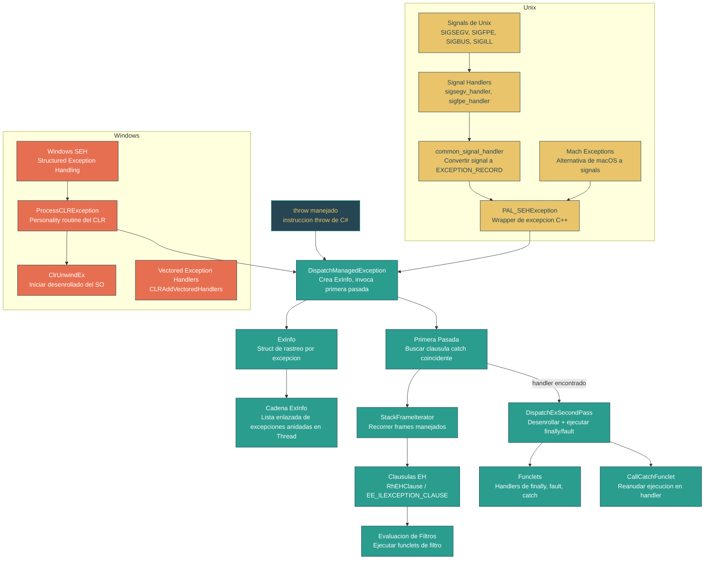

# Nivel 4: Internos -- Maquinaria de Exception Handling

> **Perfil objetivo:** Ingeniero de runtime o contribuidor avanzado que quiere comprender como el CLR despacha, rastrea y desenrolla excepciones a nivel nativo
> **Esfuerzo estimado:** 6 horas
> **Prerrequisitos:** Modulo 1.4 (Flujo de control), Modulo 4.1 (Arranque del CLR)
> [English version](../en/04-internals-exceptions.md)

---

## Objetivos de Aprendizaje

Al completar este modulo, vas a poder:

1. **Describir** el modelo de dos pasadas (encontrar handler, luego desenrollar) usado por el CLR y explicar por que cada pasada existe.
2. **Trazar** el camino del codigo desde un `throw` manejado a traves de `DispatchManagedException`, la creacion de `ExInfo`, la busqueda del handler en la primera pasada, y el desenrollado en la segunda pasada via `DispatchExSecondPass`.
3. **Explicar** como SEH en Windows se integra con el CLR a traves de `ProcessCLRException`, la personality routine, y `ClrUnwindEx`.
4. **Explicar** como el PAL (Platform Abstraction Layer) mapea signals de Unix (SIGSEGV, SIGFPE, etc.) a estructuras `EXCEPTION_RECORD` via `common_signal_handler` y `PAL_SEHException`.
5. **Navegar** la cadena de `ExInfo` en un `Thread`, entendiendo como se rastrean excepciones anidadas y relanzadas, y que representan los campos `StackRange`, `ExceptionFlags` y `EHClauseInfo`.
6. **Leer** el codigo de stack walking (`StackFrameIterator`, `CrawlFrame`) usado durante el despacho de excepciones y entender como se emparejan las clausulas EH (`RhEHClause`, `EE_ILEXCEPTION_CLAUSE`).
7. **Evaluar** el costo de rendimiento del exception handling a nivel nativo y explicar por que las excepciones se consideran costosas.

---

## Mapa Conceptual



---

## Leccion 1: Vision General del Exception Handling -- El Modelo de Dos Pasadas

### Por que dos pasadas?

El CLR usa un modelo de despacho de excepciones de **dos pasadas**, el mismo modelo fundamental utilizado por la infraestructura SEH de Windows:

1. **Primera pasada (busqueda):** Recorre el stack buscando una clausula `catch` coincidente. Ejecuta funclets de filtro si existen. El stack **no se modifica** durante esta fase.
2. **Segunda pasada (desenrollado):** Una vez que se encuentra un handler, recorre el stack nuevamente desde el punto del throw hasta el handler, ejecutando bloques `finally` y `fault` en el camino, y luego transfiere el control al handler `catch`.

Este diseno existe porque:

- Los filtros necesitan inspeccionar el stack en su **estado original** antes de cualquier stack unwinding. Un filtro que llame a `Environment.StackTrace` o examine variables locales debe ver el stack sin modificar.
- El debugger necesita una notificacion de primera oportunidad con el stack completo intacto.
- Si no se encuentra ningun handler, el runtime puede disparar fail-fast con la cadena de llamadas completa para diagnosticos.

### El punto de entrada: DispatchManagedException

Cuando el codigo manejado ejecuta un `throw`, el codigo compilado por el JIT eventualmente llama a `DispatchManagedException`. Hay varias sobrecargas, pero la central es:

```cpp
// src/coreclr/vm/exceptionhandling.cpp, linea ~1565
VOID DECLSPEC_NORETURN DispatchManagedException(
    OBJECTREF throwable,
    CONTEXT* pExceptionContext,
    EXCEPTION_RECORD* pExceptionRecord,
    ExKind exKind)
```

Esta funcion:

1. Crea un struct `ExInfo` en el stack, vinculandolo a la cadena de excepciones del thread.
2. Construye un `EXCEPTION_RECORD` con codigo `EXCEPTION_COMPLUS` si no se suministro ninguno.
3. Invoca el codigo manejado de la primera pasada via `Ex.RhThrowEx(throwable, &exInfo)`.
4. Al retornar de la primera pasada (handler encontrado), llama a `DispatchExSecondPass(&exInfo)`.
5. **Nunca retorna** -- o reanuda en el handler catch o termina el proceso.

### Exploracion del Codigo Fuente

Abri `src/coreclr/vm/exceptionhandling.cpp` y busca `DispatchManagedException` (alrededor de la linea 1565). Observa:

- El `ExInfo` se construye con el thread actual, el exception record, el contexto y el tipo de excepcion.
- En Windows, existe manejo especial para `STATUS_LONGJUMP` para soportar longjmp cruzando frames manejados.
- El codigo `EXCEPTION_COMPLUS` es el marcador interno del CLR que distingue excepciones manejadas de las nativas.

> **Archivo clave:** `src/coreclr/vm/exceptionhandling.h` -- declara todos los puntos de entrada (`ProcessCLRException`, `DispatchManagedException`, `DispatchExSecondPass`, `CallDescrWorkerUnwindFrameChainHandler`).

### Ejercicios

1. Abri `src/coreclr/vm/exceptionhandling.cpp` y encuentra el contador `g_exceptionCount` (alrededor de la linea 128). Donde se incrementa? Que evento ETW dispara el runtime cuando se lanza una excepcion?
2. Lee el bloque de comentarios que empieza en la linea 74 de `exceptionhandling.cpp` sobre funciones y funclets. Con tus palabras, explica por que las clausulas catch se "extraen fuera de linea" y que informacion se pierde.
3. Busca la constante `EXCEPTION_COMPLUS` en el codebase. Como determina `IsComPlusException` si un `EXCEPTION_RECORD` vino del codigo manejado?

---

## Leccion 2: SEH en Windows -- Structured Exception Handling

### Como funciona SEH en Windows (repaso breve)

Windows provee Structured Exception Handling a nivel del sistema operativo. Los conceptos clave son:

- **EXCEPTION_RECORD**: Una estructura que describe la excepcion (codigo, direccion, flags, parametros).
- **Personality routine**: Un callback por funcion registrado en las tablas de stack unwinding. El SO lo llama durante ambas pasadas para que el runtime maneje excepciones de ese frame.
- **Dos pasadas**: El dispatcher del SO llama a las personality routines con el flag `EXCEPTION_UNWINDING` limpio (primera pasada) o activo (segunda pasada).

### ProcessCLRException: La Personality Routine del CLR

Cada metodo compilado por el JIT tiene `ProcessCLRException` registrada como su personality routine a traves de las tablas de stack unwinding generadas por `codeman.cpp`:

```cpp
// src/coreclr/vm/exceptionhandling.cpp, linea ~559
EXTERN_C EXCEPTION_DISPOSITION __cdecl
ProcessCLRException(
    IN     PEXCEPTION_RECORD   pExceptionRecord,
    IN     PVOID               pEstablisherFrame,
    IN OUT PCONTEXT            pContextRecord,
    IN OUT PDISPATCHER_CONTEXT pDispatcherContext)
```

Durante la **primera pasada** (busqueda), `ProcessCLRException`:

1. Ignora breakpoints (`STATUS_BREAKPOINT`, `STATUS_SINGLE_STEP`) -- esos pertenecen al debugger.
2. Hace fail-fast en excepciones de estado corrupto del proceso.
3. Llama a `ClrUnwindEx` para disparar la segunda pasada del SO, o `CallRtlUnwind` en x86.

Durante la **segunda pasada** (desenrollado):

1. Obtiene el `ExInfo` actual del estado de excepciones del thread.
2. Verifica la intercepcion del debugger.
3. Crea el throwable desde el `EXCEPTION_RECORD` via `ExInfo::CreateThrowable`.
4. Llama a `DispatchManagedException(oref, pContextRecord, pExceptionRecord)` para entrar en la logica de despacho propia del CLR.

La idea clave es que en Windows, el SO impulsa el despacho inicial. El CLR **se engancha** al mecanismo del SO a traves de la personality routine, y luego toma el control.

### Vectored Exception Handlers

Durante la inicializacion (`InitializeExceptionHandling`, alrededor de la linea 162), el CLR tambien instala vectored exception handlers via `CLRAddVectoredHandlers()`. Estos manejan:

- Excepciones de hardware (violaciones de acceso, division por cero) que ocurren en codigo compilado por el JIT.
- Conversion de codigos de excepcion de Windows a tipos de excepcion manejados.

### Exploracion del Codigo Fuente

En `src/coreclr/vm/exceptionhandling.cpp`:

- Busca `ProcessCLRException` (linea ~559). Nota la guarda `#ifndef HOST_UNIX` -- esta funcion solo se ejecuta en Windows.
- Observa la division primera-pasada / segunda-pasada: `if (!(pExceptionRecord->ExceptionFlags & EXCEPTION_UNWINDING))`.
- Busca donde `pDispatcherContext->LanguageHandler` se establece a `ProcessCLRException` (alrededor de la linea 1842) -- asi es como la personality routine se registra en las tablas de stack unwinding para funclets.

En `src/coreclr/vm/codeman.cpp`:

- Busca `ProcessCLRException` para encontrar donde la personality routine se emite en el heap de codigo (alrededor de la linea 2599).

### Ejercicios

1. Traza que pasa cuando se lanza una `DivideByZeroException` por hardware (no por un `throw` manejado). Empezando desde el dispatcher de excepciones de Windows, como fluye el control a traves del VEH, `ProcessCLRException`, y hacia `DispatchManagedException`?
2. En `ProcessCLRException`, que hace el flag `TSNC_SkipManagedPersonalityRoutine` y por que es necesario?
3. Que es `INVALID_RESUME_ADDRESS` (definida en `exceptionhandling.h` como `0x000000000000bad0`) y por que la usa el CLR?

---

## Leccion 3: Exception Handling del PAL en Unix -- Manejo Basado en Signals

### El desafio en Unix

Los sistemas Unix no tienen equivalente a SEH de Windows. En cambio:

- Los **fallos de hardware** (desreferencia nula, instruccion ilegal, etc.) se entregan como **signals POSIX** (SIGSEGV, SIGILL, SIGFPE, SIGBUS).
- El **stack unwinding** usa `libunwind` en lugar de tablas de desenrollado del SO (aunque el formato es compatible).
- **macOS** tiene un mecanismo alternativo a traves de **Mach exceptions** en lugar de signals para algunos tipos de excepcion.

El **PAL (Platform Abstraction Layer)** en `src/coreclr/pal/` conecta esta brecha, convirtiendo signals en estructuras `EXCEPTION_RECORD` que el resto del runtime puede procesar uniformemente.

### Registro de Signal Handlers

Durante la inicializacion del PAL, `SEHInitializeSignals` (en `src/coreclr/pal/src/exception/signal.cpp`, linea ~166) registra handlers para:

| Signal | Handler | Excepcion mapeada |
|--------|---------|-----------------|
| SIGSEGV | `sigsegv_handler` | `NullReferenceException` o `StackOverflowException` |
| SIGFPE | `sigfpe_handler` | `DivideByZeroException` o `ArithmeticException` |
| SIGBUS | `sigbus_handler` | `AccessViolationException` |
| SIGILL | `sigill_handler` | `ExecutionEngineException` |
| SIGTRAP | `sigtrap_handler` | Breakpoint del debugger |
| SIGABRT | `sigabrt_handler` | Abort del proceso |

Detalles clave:

- SIGSEGV se ejecuta en un **stack alternativo** (`SA_ONSTACK`) para que el stack overflow pueda manejarse incluso cuando el stack principal esta agotado.
- Se asigna un stack dedicado para el handler de stack overflow (`g_stackOverflowHandlerStack`) dimensionado para manejar la ruta minima de recuperacion.
- En macOS, se define `HAVE_MACH_EXCEPTIONS` y se usan ports de Mach exceptions en lugar de signals para algunos fallos.

### common_signal_handler: El Punto de Conversion

Todos los signal handlers individuales convergen en `common_signal_handler` (linea ~1104):

```cpp
static bool common_signal_handler(
    int code, siginfo_t *siginfo, void *sigcontext,
    int numParams, ...)
```

Esta funcion:

1. Convierte el `siginfo_t` y el `ucontext` nativo en un `EXCEPTION_RECORD` y `CONTEXT` compatibles con Windows.
2. Usa `CONTEXTGetExceptionCodeForSignal` para mapear el codigo del signal a un codigo de excepcion de Windows.
3. Construye un `PAL_SEHException` (una excepcion C++ que envuelve el EXCEPTION_RECORD y CONTEXT).
4. Llama al handler de excepciones de hardware registrado (`g_hardwareExceptionHandler`), que es `HandleHardwareException` en la VM.

### PAL_SEHException y el Puente de Excepciones C++

En Unix, el PAL usa **excepciones C++** (`throw`/`catch`) como mecanismo de stack unwinding entre frames nativos. La clase `PAL_SEHException` envuelve un `EXCEPTION_RECORD` y `CONTEXT`:

```
Signal se dispara --> signal handler --> common_signal_handler
    --> PAL_SEHException construido
    --> throw de C++ se propaga a traves de frames nativos
    --> Capturado en el limite manejado/nativo
    --> DispatchManagedException(PAL_SEHException&, isHardwareException)
```

La sobrecarga `DispatchManagedException(PAL_SEHException&, bool)` (linea ~956) captura el contexto y convierte la excepcion del PAL en un throwable manejado antes de entrar en la ruta de despacho estandar.

### Mach Exceptions en macOS

En macOS, algunas excepciones de hardware se entregan via Mach exception ports en lugar de signals. El archivo `src/coreclr/pal/src/exception/machexception.cpp` implementa:

- Un port de excepciones dedicado (`s_ExceptionPort`) que recibe mensajes de excepcion del kernel.
- Un loop de mensajes que convierte los mensajes de Mach exceptions al mismo formato `PAL_SEHException`.
- Logica de redireccion para excepciones que no pertenecen al CLR.

### Exploracion del Codigo Fuente

- Abri `src/coreclr/pal/src/exception/signal.cpp` y busca `SEHInitializeSignals` (linea ~166). Traza las llamadas a `handle_signal` para cada tipo de signal.
- Busca `sigsegv_handler` (linea ~674) y observa la logica de deteccion de stack overflow -- como determina el handler si el SIGSEGV es un stack overflow vs. una desreferencia nula?
- En `common_signal_handler` (linea ~1104), observa como el `ucontext` nativo se convierte a un `CONTEXT` via `CONTEXTFromNativeContext`.
- Mira `src/coreclr/pal/src/exception/seh.cpp` y busca `SEHInitialize` -- nota que simplemente delega a `SEHInitializeSignals`.

### Ejercicios

1. En `signal.cpp`, el handler de SIGSEGV usa `SA_ONSTACK`. Por que es critico este flag para el manejo de stack overflow? Que pasaria sin el?
2. Busca la constante `StackOverflowFlag` (linea ~132). Como se combina con SIGSEGV para indicar un stack overflow vs. una referencia nula?
3. Que signals el PAL explicitamente **no** maneja (mira los comentarios sobre SIGKILL, SIGSTOP)? Por que?
4. En macOS, explica por que se prefieren las Mach exceptions sobre los signals para algunos tipos de excepcion.

---

## Leccion 4: La Cadena ExInfo -- Rastreo de Excepciones en Vuelo

### La Estructura ExInfo

Cada excepcion en vuelo es rastreada por un struct `ExInfo` (definido en `src/coreclr/vm/exinfo.h`). Esta es la estructura central de contabilidad del runtime durante el despacho de excepciones:

```cpp
struct ExInfo
{
    PTR_ExInfo     m_pPrevNestedInfo;    // ExInfo anterior en la cadena
    OBJECTHANDLE   m_hThrowable;         // Handle al objeto excepcion lanzado
    DAC_EXCEPTION_POINTERS m_ptrs;       // EXCEPTION_RECORD + CONTEXT
    EHClauseInfo   m_EHClauseInfo;       // Info del funclet actual
    ExceptionFlags m_ExceptionFlags;     // Flags de estado
    DWORD          m_ExceptionCode;      // Codigo de excepcion
    StackRange     m_ScannedStackRange;  // Limites bajo/alto del stack desenrollado
    CONTEXT*       m_pExContext;         // Contexto para el iterador de frames
    OBJECTREF      m_exception;          // Referencia al objeto excepcion
    ExKind         m_kind;               // Software, hardware, relanzamiento
    uint8_t        m_passNumber;         // 1 o 2
    uint32_t       m_idxCurClause;       // Indice de la clausula EH actual
    StackFrameIterator m_frameIter;      // Estado del recorredor de stack
    Frame*         m_pFrame;             // Frame explicito inicial
    PCODE          m_pCatchHandler;      // Direccion del handler catch
    TADDR          m_handlingFrameSP;    // SP del frame manejando la excepcion
    EE_ILEXCEPTION_CLAUSE m_ClauseForCatch; // Clausula catch encontrada en pasada 1
    // ... campos adicionales para debugger, Watson, ARM64, etc.
};
```

### La Cadena: Excepciones Anidadas

El campo `m_pPrevNestedInfo` vincula estructuras `ExInfo` en una **lista simplemente enlazada** por thread, ordenada de la mas reciente a la mas antigua. Esta cadena maneja:

- **Excepciones anidadas:** Una excepcion lanzada dentro de un bloque `finally` o `fault` crea un nuevo `ExInfo` vinculado al externo.
- **Excepciones relanzadas:** Un `throw;` (sin operando) crea un nuevo `ExInfo` pero comparte estado con el original.

La cadena se gestiona a traves de:

- **Constructor de `ExInfo`:** Vincula el nuevo ExInfo al tracker actual del thread.
- **`ExInfo::PopExInfos(Thread*, void* targetSp)`:** Remueve entradas de ExInfo cuyo SP esta por debajo del objetivo durante el stack unwinding.

### StackRange: Rastreo del Progreso

La clase `StackRange` dentro de `ExInfo` rastrea que frames del stack se han procesado:

- `m_sfLowBound` / `m_sfHighBound`: El rango de stack pointers escaneados durante el despacho de excepciones.
- `IsSupersededBy(StackFrame sf)`: Retorna true si el frame de una nueva excepcion esta dentro o por encima del rango existente (la excepcion anidada supera a la externa).
- `CombineWith(...)`: Fusiona el rango escaneado de un tracker anidado con su padre cuando la excepcion anidada escapa.

### Tipos de Excepcion (ExKind)

El enum `ExKind` (en `src/coreclr/vm/exkind.h`) clasifica la excepcion:

- `Throw`: throw manejado normal.
- `HardwareFault` / `InstructionFaultFlag`: Generada por hardware (desreferencia nula, division por cero).
- `Rethrow`: Una sentencia `throw;`.

Esta clasificacion afecta como el runtime registra el stack trace (los relanzamientos preservan la traza original) y como se manejan las excepciones de hardware (el contexto de la instruccion que fallo difiere de un throw por software).

### Diferencias de Plataforma en ExInfo

Nota la compilacion condicional en `ExInfo`:

```cpp
#ifdef TARGET_UNIX
    BYTE m_padding[2 * sizeof(void*) + sizeof(DWORD)];
#else
    EHWatsonBucketTracker m_WatsonBucketTracker;
```

En Windows, `ExInfo` incluye datos de Watson (reporte de errores) para agrupamiento de crashes. En Unix, esto se reemplaza con padding para mantener los offsets de campos consistentes -- el codigo manejado de EH accede a estos structs por offset, asi que el layout debe coincidir entre plataformas.

### Exploracion del Codigo Fuente

- Abri `src/coreclr/vm/exinfo.h` y lee la estructura `ExInfo` (linea ~42). Nota la clase interna `StackRange` y el puntero de cadena `m_pPrevNestedInfo`.
- Busca `PopExInfos` en `exceptionhandling.cpp` -- como decide que entradas de ExInfo remover?
- Busca `ExKind` en `src/coreclr/vm/exkind.h` para ver todos los flags de tipo de excepcion.

### Ejercicios

1. Dibuja la cadena de `ExInfo` para el siguiente escenario: El metodo A lanza la excepcion E1, el bloque `finally` del metodo B lanza E2, y E2 se captura en el metodo C. Cuantos nodos ExInfo existen en cada punto?
2. Por que el layout de campos de `ExInfo` debe tener padding identico en Windows y Unix? Que se romperia si los offsets fueran diferentes?
3. Busca el campo `m_passNumber`. Cuando hace la transicion de 1 a 2? Que codigo realiza esta transicion?

---

## Leccion 5: Stack Walking para el Despacho de Excepciones

### El Iterador de Frames del Stack

El despacho de excepciones requiere recorrer el call stack dos veces (primera pasada y segunda pasada). El CLR usa `StackFrameIterator` (embebido en cada `ExInfo`) para enumerar frames manejados:

- **`SfiInitWorker`**: Inicializa el iterador desde el contexto de la excepcion.
- **`SfiNextWorker`**: Avanza al siguiente frame manejado, cruzando limites nativo-a-manejado segun sea necesario.

Cada frame esta representado por un `CrawlFrame` (definido en `src/coreclr/vm/stackwalk.h`), que abstrae:

- **Metodos sin frame (compilados por JIT):** Desenrollados usando metadatos de las tablas de stack unwinding del JIT.
- **Metodos con frame:** Objetos `Frame` explicitos pusheados al stack por el runtime (stubs de P/Invoke, transiciones de GC, etc.).

### Emparejamiento de Clausulas EH

Para cada frame manejado, el runtime enumera las clausulas EH del metodo para encontrar un handler coincidente. Las estructuras de clausulas son:

**`RhEHClause`** (en `exinfo.h`):
```cpp
struct RhEHClause
{
    RhEHClauseKind _clauseKind;   // Typed, Fault, Filter, Unused
    unsigned _tryStartOffset;      // Offset IL donde empieza el try
    unsigned _tryEndOffset;        // Offset IL donde termina el try
    BYTE *_filterAddress;          // Direccion del funclet de filtro (si es filtro)
    BYTE *_handlerAddress;         // Direccion del funclet handler
    void *_pTargetType;            // Tipo de excepcion a coincidir (si es tipado)
    BOOL _isSameTry;               // Multiples handlers para el mismo try
};
```

**`EE_ILEXCEPTION_CLAUSE`** (usada por el JIT manager):
- Refleja la tabla de exception handling del IL desde los metadatos del metodo.
- Enumerada via `InitializeEHEnumeration` / `GetNextEHClause` en el `IJitManager`.

### El Algoritmo de Emparejamiento (Primera Pasada)

Para cada frame durante la primera pasada:

1. Obtener el PC de control (el instruction pointer en el punto de la excepcion o el sitio de llamada).
2. Enumerar todas las clausulas EH del metodo, ordenadas de **adentro hacia afuera** (la mas anidada primero).
3. Para cada clausula, verificar si el PC de control cae dentro del rango `[tryStartOffset, tryEndOffset)`.
4. Si es un **catch tipado**: Verificar si el tipo de la excepcion lanzada es asignable al tipo objetivo de la clausula.
5. Si es un **filtro**: Invocar el funclet de filtro. Si retorna `EXCEPTION_EXECUTE_HANDLER`, tenemos una coincidencia.
6. Las clausulas **fault/finally** se omiten durante la primera pasada (se ejecutan durante la segunda pasada).

Cuando se encuentra una coincidencia, el `ExInfo` registra:

- `m_pCatchHandler`: Direccion del funclet catch.
- `m_handlingFrameSP`: Stack pointer del frame que contiene el handler.
- `m_ClauseForCatch`: La clausula coincidente.
- `m_idxCurClause`: Indice de la clausula.

### El Desenrollado (Segunda Pasada): DispatchExSecondPass

`DispatchExSecondPass` (linea ~4286) realiza la segunda pasada:

```cpp
void DECLSPEC_NORETURN DispatchExSecondPass(ExInfo *pExInfo)
{
    // Re-inicializar iterador desde el contexto de la excepcion
    // Recorrer frames desde el punto del throw hasta el frame handler
    for (; isValid && (SP <= handlingFrameSP); ...)
    {
        // Ejecutar funclets finally/fault para cada frame
        InvokeSecondPass(pExInfo, startIdx);
    }
    // Transferir al handler catch
    CallCatchFunclet(pExInfo->m_exception, pCatchHandler, ...);
    UNREACHABLE();
}
```

Observaciones clave:

- La segunda pasada re-recorre el stack desde el punto del throw, no desde el frame actual.
- `InvokeSecondPass` invoca funclets `finally` y `fault` para cada frame entre el throw y el handler.
- `CallCatchFunclet` transfiere el control al handler catch y **nunca retorna** a esta funcion.
- Los frames explicitos (stubs de P/Invoke, etc.) se remueven via `PopExplicitFrames` durante el stack unwinding.

### Funclets: El Codigo Detras de las Clausulas EH

Los bloques `catch`, `finally`, `fault` y `filter` compilados por el JIT se emiten como **funclets** -- piezas separadas de codigo ubicadas fisicamente despues del cuerpo principal del metodo pero logicamente parte de el. El comentario en la linea 74 de `exceptionhandling.cpp` explica:

> "Todos los funclets se extraen fuera de linea de la funcion principal. Las clausulas finally se extraen fuera de linea y se reemplazan por llamadas a los funclets. Las clausulas catch, sin embargo, simplemente se extraen fuera de linea."

Esto significa:

- El JIT debe duplicar entradas de clausulas EH para cubrir funclets que estan logicamente protegidos por bloques try externos.
- El ordenamiento de clausulas (de adentro hacia afuera) es critico -- la personality routine depende de esto.
- Los funclets comparten el mismo frame del stack que su metodo padre, pero el runtime debe gestionar cuidadosamente el estado de registros.

### Exploracion del Codigo Fuente

- En `exceptionhandling.cpp`, busca `DispatchExSecondPass` (linea ~4286). Traza como `SfiInitWorker` y `SfiNextWorker` impulsan el recorrido de la segunda pasada.
- En `src/coreclr/vm/stackwalk.h`, lee la clase `CrawlFrame` (linea ~45) y su descripcion del patron "metodos virtuales del pobre".
- En `src/coreclr/vm/codeman.cpp`, busca `InitializeEHEnumeration` para ver como se leen las tablas de clausulas EH desde los metadatos del JIT.

### Ejercicios

1. Por que la segunda pasada necesita re-recorrer el stack desde el punto del throw en lugar de continuar desde donde paro la primera pasada?
2. En el modelo de funclets, por que deben duplicarse las clausulas EH para funclets anidados dentro de bloques try? Dibuja un ejemplo con try/catch/finally anidados para ilustrar.
3. Que pasa si un bloque `finally` lanza una excepcion durante la segunda pasada? Traza la ruta del codigo -- como maneja la cadena ExInfo esta excepcion anidada?
4. Busca donde se llama `CallCatchFunclet`. Por que el comentario dice `UNREACHABLE()` despues?

---

## Leccion 6: Impacto en el Rendimiento -- Por Que las Excepciones Son Costosas

### La Ruta Feliz de Costo Cero

El exception handling moderno del CLR esta disenado para **cero costo en la ruta sin excepciones**:

- No hay overhead en tiempo de ejecucion cuando se entran bloques `try` -- no hay registros, no hay manipulacion del stack.
- Los metadatos de EH (tablas de clausulas, informacion de stack unwinding) se almacenan en datos estaticos de solo lectura.
- Las guard pages (para deteccion de stack overflow) se configuran una vez por thread.

El costo esta completamente en la **ruta de excepcion**.

### Que Hace Costosa la Ruta de Excepcion

Cuando se lanza una excepcion, el runtime debe:

1. **Capturar contexto** (`RtlCaptureContext` o equivalente): Guardar todos los registros de la CPU. Esta es una captura completa de contexto incluyendo registros de punto flotante y SIMD.

2. **Asignar e inicializar ExInfo**: Construir la estructura de rastreo, vincularla a la cadena, crear un object handle para el throwable.

3. **Stack walk de primera pasada**: Recorrer cada frame entre el punto del throw y el handler:
   - Para cada frame manejado: buscar el `EECodeInfo`, enumerar clausulas EH, realizar verificaciones de tipo.
   - Para filtros: invocar una llamada de funclet (incluyendo overhead de transicion GC).
   - Incrementar `g_exceptionCount` y disparar eventos ETW.

4. **Stack walk de segunda pasada**: Recorrer el stack de nuevo:
   - Para cada frame: ejecutar funclets `finally` y `fault`.
   - Remover frames explicitos, actualizar raices de GC.
   - En Windows: interactuar con el mecanismo de stack unwinding del SO (`RtlUnwindEx`).
   - En Unix: propagarse a traves de frames nativos usando excepciones C++.

5. **Captura del stack trace**: Construir la cadena de stack trace manejada involucra otro stack walk, asignaciones de strings y resolucion de simbolos.

6. **Costos entre dominios**: En Windows, computacion de buckets de Watson. Notificaciones de primera oportunidad al debugger. Callbacks del profiler.

### El Impacto en la Ruta Caliente

Aunque las excepciones no cuestan nada cuando no se lanzan, su presencia afecta al JIT:

- **Los metodos con try/catch no pueden hacerse inline** en algunos casos (el JIT evita hacer inline de metodos con exception handling en ciertas configuraciones).
- **Asignacion de registros**: El JIT debe asegurar que las variables que viven a traves de limites `try` se derramen al stack o se almacenen en registros preservados por el callee, porque los funclets pueden necesitar acceder a ellas.
- **Layout de codigo**: Los funclets se emiten fuera de linea, lo que puede afectar la localidad del cache de instrucciones.

### Caracteristicas de Rendimiento Windows vs. Unix

| Aspecto | Windows | Unix |
|---------|---------|------|
| Mecanismo de primera pasada | Despacho SEH impulsado por el SO | Stack walk impulsado por el CLR |
| Cruce de frames nativos | El SO maneja nativamente | Propagacion via excepciones C++ |
| Deteccion de stack overflow | Guard page + VEH | SIGSEGV + stack alternativo |
| Tablas de stack unwinding | Secciones PE `.pdata` / `.xdata` | Secciones DWARF `.eh_frame` |
| Reporte de errores | Integracion con Watson | Ninguno (padding para compat de layout) |

En Unix, cruzar frames nativos durante la propagacion de excepciones requiere construir y lanzar una excepcion C++ (`PAL_SEHException`), lo que agrega el costo del exception handling de C++ (stack unwinding DWARF, llamadas a destructores) sobre el procesamiento propio del CLR.

### Medir el Costo de Excepciones

El runtime rastrea excepciones via:

- `g_exceptionCount` (en `exceptionhandling.cpp`, linea ~128): Contador atomico incrementado por cada excepcion.
- **Eventos ETW**: `ExceptionThrown_V1` disparado por `ETW::ExceptionLog::ExceptionThrown` con tipo de excepcion, mensaje y stack.
- **Contadores de rendimiento**: Disponibles a traves de `dotnet-counters` (proveedor `System.Runtime`, `exception-count`).

### Ejercicios

1. Usando el contador `g_exceptionCount` como punto de partida, busca donde se llama `UpdatePerformanceMetrics`. Que informacion lleva el evento ETW?
2. Un desarrollador argumenta "las excepciones son de costo cero en .NET." Escribe una refutacion precisa explicando que es y que no es de costo cero.
3. Compara el costo de stack unwinding en Windows (donde el SO hace el trabajo pesado via `RtlUnwindEx`) vs. Unix (donde el CLR debe usar excepciones C++ para cruzar frames nativos). Cual tiene mas overhead para un call stack mixto manejado/nativo?
4. Un metodo critico de rendimiento usa excepciones para flujo de control (ej., capturando `FormatException` en un loop de parseo). Estima las categorias de overhead de la lista anterior y sugiere un patron alternativo.

---

## Referencia de Archivos Fuente Clave

| Archivo | Proposito |
|---------|-----------|
| `src/coreclr/vm/exceptionhandling.cpp` | Despacho central de excepciones: `ProcessCLRException`, `DispatchManagedException`, `DispatchExSecondPass` |
| `src/coreclr/vm/exceptionhandling.h` | Declaraciones de funciones de despacho, `CLRUnwindStatus`, `EHFuncletType` |
| `src/coreclr/vm/excep.h` | `ThrowCallbackType`, enum `LFH`, `NULL_AREA_SIZE`, declaraciones utilitarias |
| `src/coreclr/vm/excep.cpp` | `IsExceptionFromManagedCode`, helpers para determinar origen de excepcion |
| `src/coreclr/vm/exinfo.h` | Struct `ExInfo`, `RhEHClause`, `RhEHClauseKind`, `StackRange` |
| `src/coreclr/vm/exkind.h` | Enum `ExKind` (Throw, HardwareFault, Rethrow, etc.) |
| `src/coreclr/vm/stackwalk.h` | `CrawlFrame`, infraestructura de stack walking |
| `src/coreclr/vm/codeman.cpp` | Enumeracion de clausulas EH, registro de personality routine |
| `src/coreclr/pal/src/exception/signal.cpp` | Signal handlers de Unix, `common_signal_handler` |
| `src/coreclr/pal/src/exception/seh.cpp` | Inicializacion de SEH del PAL, `PAL_SetHardwareExceptionHandler` |
| `src/coreclr/pal/src/exception/seh-unwind.cpp` | Stack unwinding basado en libunwind para Unix |
| `src/coreclr/pal/src/exception/machexception.cpp` | Manejo de Mach exceptions en macOS |

---

## Lista de Autoevaluacion

- [ ] Puedo diagramar el modelo de excepciones de dos pasadas y explicar por que ambas pasadas son necesarias.
- [ ] Puedo trazar un `throw` manejado desde la sentencia C# a traves de `DispatchManagedException` hasta `CallCatchFunclet`.
- [ ] Entiendo como `ProcessCLRException` se integra con SEH de Windows como la personality routine del CLR.
- [ ] Puedo explicar como los signals de Unix se convierten en estructuras `EXCEPTION_RECORD` a traves del PAL.
- [ ] Puedo describir la cadena ExInfo y como se rastrean las excepciones anidadas.
- [ ] Entiendo como el `StackFrameIterator` y las tablas de clausulas EH trabajan juntos para encontrar handlers catch.
- [ ] Puedo articular por que las excepciones son costosas y listar las categorias especificas de costo.
- [ ] Puedo comparar las rutas de exception handling de Windows y Unix e identificar sus diferencias clave.

---

## Lectura Adicional

- [ECMA-335 Particion I, Seccion 12.4.2](https://www.ecma-international.org/publications-and-standards/standards/ecma-335/) -- Exception Handling del CLI
- [Documentacion de Windows SEH](https://learn.microsoft.com/es-es/windows/win32/debug/structured-exception-handling)
- `docs/design/coreclr/botr/` en el repositorio -- Capitulos del Book of the Runtime sobre exception handling
- [Rendimiento de excepciones .NET](https://learn.microsoft.com/es-es/dotnet/standard/exceptions/best-practices) -- Mejores practicas para el uso de excepciones
