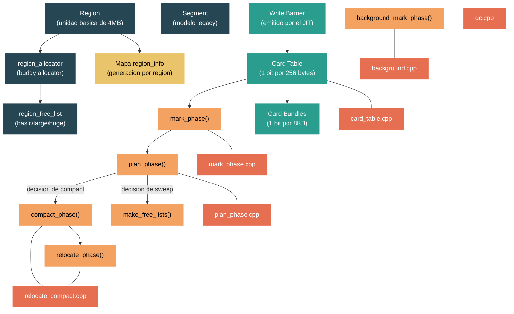

# Nivel 4: Internals -- GC Internals: Regions, Mark Phase y Write Barriers

> **Perfil objetivo:** Desarrollador de runtime o contribuidor que necesita navegar el codigo fuente del GC, entender sus estructuras de datos internas y razonar sobre el comportamiento del recolector a nivel de C++
> **Esfuerzo estimado:** 12 horas
> **Prerequisitos:** [Modulo 3.2 -- GC en Nivel 3](03-advanced-gc.md), [Modulo 4.2 -- Type System](04-internals-type-system.md)
> **Dificultad del codigo fuente:** ⭐⭐⭐⭐⭐ -- `gc.cpp` y sus archivos companeros suman mas de 40,000 lineas de C++ con macros condicionales por todas partes. Este modulo te da un mapa, no una cobertura exhaustiva.
> [English version](../en/04-internals-gc-deep.md)

---

## Objetivos de Aprendizaje

Al finalizar este modulo vas a poder:

1. Describir el modelo de heap basado en regions (`USE_REGIONS`), como se asignan las regions, como se mapean dinamicamente a generaciones, y como difiere del modelo legacy de segments.
2. Trazar la mark phase a traves de `gc_heap::mark_phase()`, entendiendo el escaneo de roots, el mark stack, las mark lists, y como se descubren referencias entre generaciones.
3. Explicar el rol de los write barriers y card tables en el seguimiento de escrituras a generaciones mas antiguas, incluyendo el bitwise region write barrier introducido para el modelo de regions.
4. Recorrer la plan phase para entender los plug trees, el calculo de gaps y la decision de compaction vs sweep.
5. Describir como la compaction mueve objetos y actualiza referencias, y como los objetos con pinning restringen la compaction.
6. Delinear el ciclo de vida del Background GC (BGC): concurrent marking, colecciones ephemeral durante BGC, y concurrent sweeping.

---

## Mapa Conceptual



---

## Nota sobre Navegar el Codigo Fuente del GC

Antes de entrar en las lecciones, necesitas entender la estructura fisica. El codigo fuente del GC fue dividido desde un unico y monolitico `gc.cpp` (que alguna vez tuvo ~37,000 lineas) en multiples archivos:

| Archivo | Proposito |
|---------|-----------|
| `src/coreclr/gc/gc.cpp` | Estructuras de datos centrales, inicializacion, funciones auxiliares. Todavia ~8,800 lineas. Incluye los otros `.cpp`. |
| `src/coreclr/gc/mark_phase.cpp` | `mark_phase()`, `mark_through_cards_for_segments()`, operaciones del mark stack |
| `src/coreclr/gc/plan_phase.cpp` | `plan_phase()`, construccion de plug trees, decisiones sweep-vs-compact |
| `src/coreclr/gc/relocate_compact.cpp` | `relocate_phase()`, `compact_phase()`, movimiento de objetos |
| `src/coreclr/gc/background.cpp` | `background_mark_phase()`, `background_sweep()`, ciclo de vida del BGC |
| `src/coreclr/gc/collect.cpp` | `gc1()`, `garbage_collect()` -- el orquestador de colecciones de nivel superior |
| `src/coreclr/gc/card_table.cpp` | Operaciones de card table y card bundle |
| `src/coreclr/gc/regions_segments.cpp` | Tabla de mapeo de segments, mapeo region-a-generacion |
| `src/coreclr/gc/region_allocator.cpp` | `region_allocator` -- el buddy allocator para memoria de regions |
| `src/coreclr/gc/region_free_list.cpp` | Gestion de regions libres (listas basic/large/huge) |
| `src/coreclr/gc/sweep.cpp` | `make_free_lists()`, operaciones de sweep |
| `src/coreclr/gc/allocation.cpp` | Paths de asignacion de objetos, adquisicion de segments/regions |
| `src/coreclr/gc/gcpriv.h` | Todas las estructuras internas: `gc_heap`, `heap_segment`, `dynamic_data`, `region_info` |
| `src/coreclr/gc/gcconfig.h` | Todas las perillas de configuracion (macro `GC_CONFIGURATION_KEYS`) |
| `src/coreclr/gc/gcinterface.h` | Interfaz `IGCHeap`, `WriteBarrierParameters`, numeros de version |

El codigo esta extensamente protegido por macros `#ifdef`. Las mas importantes:

| Macro | Significado |
|-------|-------------|
| `USE_REGIONS` | Heap basado en regions (por defecto desde .NET 8). Sin ella, se obtienen segments legacy. |
| `MULTIPLE_HEAPS` | Server GC con heaps por CPU |
| `BACKGROUND_GC` | Soporte de GC en segundo plano (concurrente) |
| `FEATURE_CARD_MARKING_STEALING` | Work-stealing para escaneo de card tables en Server GC |

Al leer el codigo fuente, vas a encontrar frecuentemente bloques pareados `#ifdef USE_REGIONS` / `#else`. El path de regions es el moderno; el else es legacy. Concentrate en el path `USE_REGIONS`.

---

## Curriculo

### Leccion 1 -- Regions vs Segments: El Nuevo GC Basado en Regions

#### Lo que vas a aprender

.NET 8 cambio el modelo de heap del GC por defecto de **segments** a **regions**. Este es uno de los cambios arquitecturales mas significativos del GC en la historia del runtime. Entender regions es la clave para entender todo lo demas en este modulo.

#### El modelo legacy de segments (pre-.NET 8)

En el modelo antiguo, cada generacion era duena de uno o mas **segments** grandes -- bloques contiguos de memoria virtual, tipicamente de 256MB en sistemas de 64 bits. Los segments se enlazaban en una lista, y cada segment pertenecia a exactamente una generacion. La promocion significaba mover objetos de un segment (o rango dentro de un segment) a otro.

El problema: los segments eran grandes e inflexibles. Un segment de Gen0 que tenia algunos objetos con pinning de larga vida no podia ser reclamado. La memoria se comprometia en bloques grandes y se devolvia lentamente al SO.

#### El modelo de regions

Bajo `USE_REGIONS`, el heap se divide en **regions** pequenas de tamano fijo. El tamano basico por defecto es 4MB (configurable via `GCRegionSize`). La idea clave: **la generacion de una region no es fija**. Una region que empieza como Gen0 puede ser promovida a Gen1 o Gen2 sin mover ningun objeto -- el GC simplemente actualiza una tabla de mapeo.

El `region_allocator` en `src/coreclr/gc/region_allocator.cpp` administra el espacio de direcciones global. Funciona como un buddy allocator con un bitmap:

```cpp
// region_allocator.cpp
bool region_allocator::init (uint8_t* start, uint8_t* end, size_t alignment,
                             uint8_t** lowest, uint8_t** highest)
{
    region_alignment = alignment;
    large_region_alignment = LARGE_REGION_FACTOR * alignment;  // 8x basico = 32MB
    global_region_start = (uint8_t*)align_region_up ((size_t)actual_start);
    // ...
    size_t total_num_units = (global_region_end - global_region_start) / region_alignment;
    total_free_units = (uint32_t)total_num_units;
    uint32_t* unit_map = new (nothrow) uint32_t[total_num_units];
    // ...
}
```

El allocator mantiene un `unit_map` donde cada entrada representa una region basica. Los bloques ocupados y libres se rastrean escribiendo su tamano en las entradas de inicio y fin de cada bloque (un esquema de boundary-tag). El `LARGE_REGION_FACTOR` es 8, lo que significa que las regions grandes (para LOH) son 8x el tamano basico (32MB por defecto).

#### Tres tipos de regions libres

Las regions vienen en tres tamanos, gestionadas por listas libres separadas en `region_free_list`:

```cpp
// gcpriv.h
enum free_region_kind
{
    basic_free_region,    // 4MB (SOH)
    large_free_region,    // 32MB (LOH)
    huge_free_region,     // >32MB (asignaciones muy grandes)
    count_free_region_kinds = 3,
};
```

Cada `gc_heap` mantiene su propio array `free_regions[count_free_region_kinds]`. Las regions que ya no se necesitan van a estas listas libres en vez de ser descomprometidas inmediatamente. Envejecen en la lista libre (rastreado por `age_in_free` en la estructura `heap_segment`) y eventualmente se descomprimen si no se reutilizan:

```cpp
// gcpriv.h, dentro de class heap_segment
#define AGE_IN_FREE_TO_DECOMMIT_BASIC 20  // 20 GCs antes de descomprometer una region basica
#define AGE_IN_FREE_TO_DECOMMIT_LARGE 5
#define AGE_IN_FREE_TO_DECOMMIT_HUGE  2
```

#### El mapeo region-a-generacion

Cada region conoce su generacion actual (`gen_num`) y su generacion planeada despues del GC (`plan_gen_num`). Esta informacion se codifica en el enum `region_info` usando empaquetado de bits:

```cpp
// gcpriv.h
enum region_info : uint8_t
{
    // 2 bits mas bajos: numero de generacion actual
    RI_GEN_0 = 0x0,
    RI_GEN_1 = 0x1,
    RI_GEN_2 = 0x2,
    RI_GEN_MASK = 0x3,

    // flags en los bits del medio
    RI_SIP = 0x4,         // Sweep In Plan
    RI_DEMOTED = 0x8,     // La region fue degradada a una generacion mas joven

    // 2 bits superiores: numero de generacion planeada
    RI_PLAN_GEN_SHR = 0x6,
    RI_PLAN_GEN_0 = 0x00,
    RI_PLAN_GEN_1 = 0x40,
    RI_PLAN_GEN_2 = 0x80,
    RI_PLAN_GEN_MASK = 0xC0,
};
```

El GC mantiene un array plano `map_region_to_generation_skewed` indexado por `address >> min_segment_size_shr`. Esto permite al write barrier determinar la generacion de cualquier puntero con un unico shift y busqueda en tabla -- sin recorrer punteros.

#### Demotion: regions yendo hacia atras

Con segments, los objetos solo podian ser promovidos (joven a viejo). Con regions, la **demotion** es posible: una region de Gen2 con mayormente objetos muertos puede ser reclasificada como Gen1 o incluso Gen0. El flag `RI_DEMOTED` rastrea esto. Esta es una ventaja importante: el GC puede reclamar regions de Gen2 sin hacer una coleccion completa de Gen2.

#### La estructura heap_segment (reutilizada para regions)

A pesar del nombre, la clase `heap_segment` en `gcpriv.h` (linea ~6202) se reutiliza para regions:

```cpp
class heap_segment
{
public:
    uint8_t*    allocated;       // fin de objetos asignados
    uint8_t*    committed;       // fin de memoria comprometida
    uint8_t*    reserved;        // fin de memoria reservada
    uint8_t*    used;            // marca de agua alta
    uint8_t*    mem;             // inicio de memoria utilizable
    size_t      flags;           // 12 bits de flags
    PTR_heap_segment next;       // lista enlazada
    uint8_t*    background_allocated;  // para BGC

#ifdef USE_REGIONS
    size_t      survived;
    uint8_t     gen_num;
    bool        swept_in_plan_p;
    int         plan_gen_num;
    int         age_in_free;      // cuanto tiempo en lista libre
    uint8_t*    free_list_head;   // lista libre por region
    // ...
#endif
};
```

#### Ejercicio de exploracion del codigo fuente

1. Abri `src/coreclr/gc/region_allocator.cpp` y lee la funcion `init()`. Segui como funcionan `make_busy_block()` y `make_free_block()` -- este es un allocator de boundary-tag.
2. En `gcpriv.h`, encontra el enum `region_info` y el enum `free_region_kind`. Nota como `region_free_list` gestiona los tres tipos.
3. En `gcconfig.h`, encontra `GCRegionSize` y `GCRegionRange`. Estas son las perillas de configuracion para regions que el usuario puede ajustar.
4. Busca `get_region_gen_num` en `gc.cpp` para ver como el runtime busca la generacion de una region a partir de una direccion arbitraria.

---

### Leccion 2 -- La Mark Phase: Recorrido del Grafo de Objetos

#### Lo que vas a aprender

La mark phase es donde el GC descubre que objetos estan vivos. Es la fase mas critica en rendimiento -- cada objeto alcanzable debe ser visitado, y el recorrido debe ser correcto incluso mientras se manejan objetos con pinning, punteros interiores y (en BGC) mutaciones concurrentes.

#### Punto de entrada

La mark phase comienza en `gc_heap::mark_phase()` en la linea 2892 de `mark_phase.cpp`:

```cpp
void gc_heap::mark_phase (int condemned_gen_number)
{
    assert (settings.concurrent == FALSE);  // solo mark no concurrente

    ScanContext sc;
    sc.thread_number = heap_number;
    sc.promotion = TRUE;
    sc.concurrent = FALSE;

    BOOL full_p = (condemned_gen_number == max_generation);
    // ...
}
```

La funcion recibe el numero de generacion condenada. Para una coleccion de Gen0, `condemned_gen_number` es 0; para un GC completo, es `max_generation` (2).

#### Fase 1: Inicializar datos de generacion

La mark phase comienza limpiando estadisticas por generacion:

```cpp
for (int gen_idx = 0; gen_idx <= gen_to_init; gen_idx++)
{
    dynamic_data* dd = dynamic_data_of (gen_idx);
    dd_begin_data_size (dd) = generation_size (gen_idx) -
                               dd_fragmentation (dd) -
#ifdef USE_REGIONS
                               0;  // no se necesita ajuste de objeto inicial para regions
#else
                               get_generation_start_size (gen_idx);
#endif
    dd_survived_size (dd) = 0;
    dd_pinned_survived_size (dd) = 0;
    // ...
}
```

Nota la diferencia con `USE_REGIONS`: con regions, no hay un "objeto inicial" por generacion que restar.

#### Fase 2: Escanear roots

Despues de la inicializacion, la mark phase escanea cada categoria de roots, drenando la cola de marcado despues de cada una:

```cpp
// 1. Sized refs (si es GC completo)
GCScan::GcScanSizedRefs(GCHeap::Promote, condemned_gen_number, max_generation, &sc);
drain_mark_queue();

// 2. Stack roots
GCScan::GcScanRoots(GCHeap::Promote, condemned_gen_number, max_generation, &sc);
drain_mark_queue();

// 3. Roots del Background GC (si BGC esta corriendo concurrentemente)
scan_background_roots (GCHeap::Promote, heap_number, &sc);
drain_mark_queue();

// 4. Cola de finalizacion
finalize_queue->GcScanRoots(GCHeap::Promote, heap_number, 0);
drain_mark_queue();
```

El callback `GCHeap::Promote` es el corazon del marcado. Para cada referencia root, verifica si el objeto esta en el rango de la generacion condenada y, si es asi, lo marca (establece un bit en el mark array para BGC, o establece el bit de marca en el header del objeto para GC en primer plano).

#### Fase 3: Referencias entre generaciones via card tables

Para GCs no completos, la mark phase tambien debe encontrar referencias desde generaciones mas antiguas apuntando a las generaciones condenadas. Aqui es donde entran los card tables (cubierto en detalle en la Leccion 3):

```cpp
// mark_phase.cpp, linea ~3240
mark_through_cards_for_segments(mark_object_fn, FALSE THIS_ARG);

// Para cada generacion UOH:
mark_through_cards_for_uoh_objects(mark_object_fn, i, FALSE THIS_ARG);
```

La funcion `mark_through_cards_for_segments()` en la linea 3815 recorre la card table para encontrar cards sucias, luego escanea los objetos en esos rangos de cards buscando referencias a la generacion condenada.

#### El mark stack y la mark queue

Cuando el GC encuentra un objeto marcado, necesita escanear recursivamente las referencias de ese objeto. Para evitar recursion profunda (que podria desbordar el stack con grafos de objetos profundamente anidados), el GC usa un **mark stack** explicito y una **mark queue**:

```cpp
void gc_heap::reset_mark_stack()
{
    // mark_stack_array se usa tanto como cola de plugs con pinning
    // como mark stack durante la mark phase
}
```

La funcion `drain_mark_queue()` procesa objetos en la mark queue, siguiendo sus referencias y marcando objetos transitivamente alcanzables.

#### La optimizacion del mark list

Para colecciones ephemeral (Gen0/Gen1), el GC puede usar un **mark list** -- un array ordenado de punteros a objetos marcados. Esto evita tener que recorrer todo el heap para encontrar objetos marcados durante la plan phase:

```cpp
// Verificado durante plan_phase:
if ((condemned_gen_number < max_generation) &&
    (mark_list_index <= mark_list_end))
{
    // Ordenar el mark list para procesamiento eficiente en plan phase
    _sort (&mark_list[0], mark_list_index - 1, 0);
    use_mark_list = TRUE;
}
```

Si el mark list se desborda (demasiados objetos marcados), la optimizacion se desactiva y la plan phase recurre a caminar objetos directamente.

#### Objetos con pinning durante el marcado

Los objetos con pinning se registran en la **cola de plugs con pinning** (`mark_stack_array` reutilizado). Un "plug" es una secuencia contigua de objetos. Un plug con pinning es un plug que contiene al menos un objeto con pinning y por lo tanto no puede moverse durante la compaction:

```cpp
void gc_heap::set_pinned_info (uint8_t* last_pinned_plug, size_t plug_len, generation* gen)
{
    mark& m = mark_stack_array[mark_stack_tos];
    assert (m.first == last_pinned_plug);
    m.len = plug_len;
    // ...
    mark_stack_tos++;
}
```

#### Ejercicio de exploracion del codigo fuente

1. Abri `mark_phase.cpp` y lee desde la linea 2892 (entrada de `mark_phase`) hasta ~3180 donde ocurre el escaneo de roots. Nota el orden: sized refs, stack roots, background roots, cola de finalizacion.
2. Busca `drain_mark_queue` -- se llama despues de cada categoria de roots. Entender la mark queue es clave para entender como el GC evita la recursion.
3. Encontra `mark_through_cards_for_segments` en la linea 3815 y lee las primeras 50 lineas. Este es el escaneo de card tables que encuentra referencias entre generaciones.
4. Busca las declaraciones de `mark_stack_array` en `gcpriv.h` para entender como el mismo array sirve tanto como mark stack como cola de plugs con pinning.

---

### Leccion 3 -- Write Barriers y Card Tables

#### Lo que vas a aprender

El GC generacional solo puede funcionar eficientemente porque tiene un mecanismo para rastrear **escrituras entre generaciones** -- cuando un puntero en una generacion mas antigua se actualiza para apuntar a un objeto en una generacion mas joven. Sin este rastreo, cada GC necesitaria escanear todo el heap. Los write barriers y card tables son ese mecanismo.

#### Que es un write barrier?

Cada vez que el codigo managed escribe una referencia en un objeto del heap, el JIT (o interprete) emite un **write barrier** -- una pequena secuencia de codigo que notifica al GC de la escritura. En x64, esta es una rutina de ensamblador escrita a mano. El `WriteBarrierManager` en `src/coreclr/vm/writebarriermanager.h` selecciona la barrera apropiada en tiempo de ejecucion:

```cpp
// writebarriermanager.h
enum WriteBarrierType
{
    WRITE_BARRIER_UNINITIALIZED,
    WRITE_BARRIER_PREGROW64,        // heap debajo de ephemeral
    WRITE_BARRIER_POSTGROW64,       // heap encima de ephemeral
    WRITE_BARRIER_SVR64,            // server GC
    WRITE_BARRIER_BYTE_REGIONS64,   // barrera de regions por byte
    WRITE_BARRIER_BIT_REGIONS64,    // barrera de regions por bit (por defecto)
    // ... variantes de write-watch ...
    WRITE_BARRIER_BUFFER
};
```

#### Card tables: la estructura de datos central

Una **card table** es un array de bytes donde cada entrada cubre un rango fijo de direcciones del heap. Historicamente, una card cubria 256 bytes de heap. Cuando el write barrier detecta una escritura entre generaciones, "ensucia" la card correspondiente poniendo un bit.

El layout de la card table se define junto con otros datos contables en `gc.cpp`:

```cpp
// gc.cpp
uint32_t*   gc_heap::card_table;
size_t      gc_heap::card_table_element_layout[total_bookkeeping_elements + 1];
```

La clase `card_table_info` envuelve la card table con metadatos:

```cpp
// gc.cpp
class card_table_info
{
    unsigned    recount;
    uint8_t*    lowest_address;
    size_t      size;
    uint32_t*   next_card_table;  // lista enlazada cuando se redimensiona
    uint8_t*    highest_address;
    short*      brick_table;
    uint32_t*   card_bundle_table;
    uint32_t*   mark_array;       // para Background GC
};
```

Nota: la card table, brick table, card bundle table y mark array se asignan todos como un bloque contiguo y se acceden via offsets desde el puntero de la card table.

#### Card bundles: un segundo nivel de filtrado

Escanear todas las cards en un heap grande es costoso. Los **card bundles** agregan un segundo nivel de indireccion: cada bit en la card bundle table cubre una card word completa (32 cards = 8KB de heap). Durante la mark phase, el GC primero verifica los card bundles para saltar regiones limpias grandes:

```cpp
// card_table.cpp
void gc_heap::card_bundle_set (size_t cardb)
{
    uint32_t bits = (1 << card_bundle_bit (cardb));
    set_bundle_bits (&card_bundle_table [card_bundle_word (cardb)], bits);
}
```

La jerarquia es:
- **Card bundle** (1 bit) cubre 32 cards = 8KB de heap
- **Card** (1 bit en una word uint32_t) cubre 256 bytes de heap
- El GC escanea: bundles -> cards sucias -> objetos en rangos de cards sucias

#### El write barrier para regions

Con el modelo de regions, el write barrier debe determinar si una escritura cruza un limite de generacion. Como las regions pueden ser de cualquier generacion, la barrera necesita buscar las generaciones tanto del origen como del destino. Esto se hace via la `region_to_generation_table`:

```cpp
// gc.cpp
void region_write_barrier_settings (WriteBarrierParameters* args,
                                    gc_heap::region_info* map_region_to_generation_skewed,
                                    uint8_t region_shr)
{
    switch (GCConfig::GetGCWriteBarrier())
    {
    default:
    case GCConfig::WRITE_BARRIER_REGION_BIT:
        // barrera de region bitwise es la opcion por defecto ahora
        args->region_to_generation_table = (uint8_t*)map_region_to_generation_skewed;
        args->region_shr = region_shr;
        args->region_use_bitwise_write_barrier = true;
        break;
    // ...
    }
}
```

La barrera bitwise funciona haciendo un shift de la direccion a la derecha por `region_shr` bits para obtener un indice de region, buscando la generacion en la tabla, y comparando las generaciones de origen y destino. Si el destino es mas joven, la card se ensucia.

#### Como funciona mark_through_cards_for_segments

Durante la mark phase, `mark_through_cards_for_segments()` recorre las cards sucias para encontrar referencias entre generaciones:

```cpp
void gc_heap::mark_through_cards_for_segments (card_fn fn, BOOL relocating ...)
{
    // Recorre desde la generacion mas antigua hacia abajo
    heap_segment* seg = heap_segment_rw (generation_start_segment (oldest_gen));
    uint8_t* beg = get_soh_start_object (seg, oldest_gen);
    uint8_t* end = compute_next_end (seg, low);

    // Para cada card word sucia:
    //   Para cada card sucia en la word:
    //     Recorrer objetos en el rango de la card
    //     Para cada campo de referencia en cada objeto:
    //       Si la referencia apunta a la generacion condenada, llamar fn()
}
```

La funcion escanea segments de generaciones mas antiguas, mirando cards sucias para encontrar objetos que podrian referenciar objetos de generaciones mas jovenes. Durante la relocate phase, la misma funcion se llama con `relocate_address` en vez de `mark_object_fn` para actualizar referencias despues de la compaction.

#### Sincronizacion del write barrier

Cuando el layout del heap cambia (redimensionar, nuevas regions), las constantes embebidas del write barrier deben actualizarse atomicamente. Las funciones `stomp_write_barrier_ephemeral()` y `stomp_write_barrier_resize()` manejan esto, protegidas por `write_barrier_spin_lock`:

```cpp
// gc.cpp
static GCSpinLock write_barrier_spin_lock;

// regions_segments.cpp -- actualizando la barrera durante cambios de region
write_barrier_spin_lock.holding_thread = GCToEEInterface::GetThread();
stomp_write_barrier_ephemeral (new_ephemeral_low, new_ephemeral_high,
                               map_region_to_generation_skewed, (uint8_t)min_segment_size_shr);
write_barrier_spin_lock.lock = -1;
```

#### Ejercicio de exploracion del codigo fuente

1. Abri `src/coreclr/vm/writebarriermanager.h` y lee el enum `WriteBarrierType`. Luego abri `writebarriermanager.cpp` y encontra `NeedDifferentWriteBarrier` para ver como el runtime selecciona el tipo de barrera.
2. En `gc.cpp`, encontra `region_write_barrier_settings()` (linea ~1909) y lee los tres paths: bitwise, bytewise y server.
3. En `card_table.cpp`, lee las operaciones de card bundles (`card_bundle_set`, `card_bundle_clear`). Nota las operaciones atomicas para `MULTIPLE_HEAPS`.
4. En `gcinterface.h`, lee la estructura `WriteBarrierParameters` (linea ~59). Este es el contrato entre el GC y el motor de ejecucion para actualizaciones de barrera.

---

### Leccion 4 -- La Plan Phase: Plug Trees y Decisiones de Compaction

#### Lo que vas a aprender

La plan phase es el "cerebro" del GC. Decide que pasa con cada objeto en las generaciones condenadas: deberia la region hacer sweep (dejando gaps como espacio libre)? Deberia compactarse (mover objetos para eliminar gaps)? O puede toda la region reciclarse? La plan phase construye las estructuras de datos que las fases subsiguientes consumen.

#### Punto de entrada

`gc_heap::plan_phase()` comienza en la linea 3226 de `plan_phase.cpp`:

```cpp
void gc_heap::plan_phase (int condemned_gen_number)
{
    size_t old_gen2_allocated = 0;
    size_t old_gen2_size = 0;

    if (condemned_gen_number == (max_generation - 1))
    {
        old_gen2_allocated = generation_free_list_allocated (generation_of (max_generation));
        old_gen2_size = generation_size (max_generation);
    }

    assert (settings.concurrent == FALSE);
    // ...
}
```

#### Plugs y gaps

El concepto fundamental en la plan phase es el **plug**. Un plug es una secuencia contigua de objetos marcados (sobrevivientes) sin gaps entre ellos. Los espacios entre plugs (que contienen objetos muertos) son **gaps**.

Durante la plan phase, el GC recorre cada region identificando plugs y gaps. Para cada plug, registra:
- Donde empieza el plug
- Su longitud
- Si tiene pinning (no puede moverse)
- El gap antes de el (espacio muerto que puede reclamarse)

#### El mark list en la plan phase

Para colecciones ephemeral, si el mark list no se desbordo, la plan phase usa el mark list ordenado para encontrar rapidamente objetos sobrevivientes en vez de recorrer todo el heap:

```cpp
if ((condemned_gen_number < max_generation) &&
    (mark_list_index <= mark_list_end))
{
    _sort (&mark_list[0], mark_list_index - 1, 0);
    use_mark_list = TRUE;
}
```

#### Sweep In Plan (SIP) -- la optimizacion de regions

Con regions, la plan phase puede tomar una decision por region. Si una region tiene una tasa de supervivencia baja, puede hacerse **sweep in plan** (flag `RI_SIP`) -- el GC construye listas libres directamente durante la plan phase sin necesitar compactar la region. Esto se marca en el `region_info` de la region:

```cpp
// gcpriv.h
RI_SIP = 0x4,  // flag de Sweep In Plan
```

Una region marcada como SIP tiene su brick table reconstruida para apuntar a objetos (no nodos de arbol), y las fases subsiguientes saben saltarla durante la compaction. El campo `swept_in_plan_p` en `heap_segment` rastrea esto:

```cpp
// gcpriv.h, heap_segment
bool swept_in_plan_p;  // Esta region fue swept durante la plan phase
```

#### Planificacion de generacion para regions

Para cada region, la plan phase decide una **generacion planeada** (`plan_gen_num`). Aqui es donde las regions brillan: una region de Gen0 con alta supervivencia se planifica como Gen1 (promocion), mientras que una region de Gen2 con supervivencia muy baja podria planificarse como Gen0 (demotion).

La generacion planeada se almacena tanto en la estructura `heap_segment` como en el mapa `region_info` (los 2 bits superiores, desplazados por `RI_PLAN_GEN_SHR`).

#### La decision de compaction

El GC decide entre sweep y compact basandose en multiples factores:
- **Fragmentacion**: Si hay demasiada fragmentacion, se prefiere compaction
- **Pinning**: Mucho pinning restringe la compaction
- **Presupuesto ephemeral**: Si el GC necesita mas espacio contiguo para las asignaciones de la siguiente generacion
- **Solicitud del usuario**: `GCSettings.LargeObjectHeapCompactionMode = CompactOnce`

La plan phase registra la decision en `settings.compaction` y `settings.sweeping`.

#### Ejercicio de exploracion del codigo fuente

1. Abri `plan_phase.cpp` y lee desde la linea 3226 hasta ~3300. Nota el ordenamiento del mark list y la configuracion por generacion.
2. Busca `swept_in_plan` en `plan_phase.cpp` para ver la logica de decision SIP.
3. En `gcpriv.h`, busca `plan_gen_num` para ver como los numeros de generacion planeados se usan a traves del codigo.
4. Busca `should_compact` o `decide_on_compacting` en el codigo fuente del GC para encontrar la logica de decision de compaction.

---

### Leccion 5 -- Compaction y Relocation

#### Lo que vas a aprender

Cuando la plan phase decide compactar, el GC debe fisicamente mover objetos a nuevas ubicaciones y luego actualizar cada referencia en todo el heap (y todos los roots) para apuntar a las nuevas ubicaciones. Esta es la operacion mas costosa que el GC puede realizar, pero elimina la fragmentacion y restaura la localidad de cache.

#### La relocate phase

`gc_heap::relocate_phase()` en la linea 1395 de `relocate_compact.cpp` actualiza todas las referencias para apuntar a las nuevas ubicaciones de los objetos (calculadas durante la plan phase):

```cpp
void gc_heap::relocate_phase (int condemned_gen_number,
                              uint8_t* first_condemned_address)
{
    ScanContext sc;
    sc.promotion = FALSE;  // estamos reubicando, no promoviendo

    // 1. Reubicar stack roots
    GCScan::GcScanRoots(GCHeap::Relocate, condemned_gen_number, max_generation, &sc);

    // 2. Reubicar sobrevivientes dentro de regions condenadas
    relocate_survivors(condemned_gen_number, first_condemned_address);

    // 3. Reubicar referencias desde generaciones mas antiguas via card tables
    mark_through_cards_for_segments(&gc_heap::relocate_address, TRUE THIS_ARG);

    // 4. Reubicar referencias en UOH
    mark_through_cards_for_uoh_objects(&gc_heap::relocate_address, i, TRUE THIS_ARG);
}
```

La misma funcion `mark_through_cards_for_segments` usada durante el marcado se reutiliza aqui, pero con `relocate_address` como callback en vez de `mark_object_fn`. Este es un diseno elegante: la logica de escaneo de card tables se escribe una vez y se parametriza por la operacion.

#### La compact phase

`gc_heap::compact_phase()` en la linea 1992 mueve fisicamente los objetos:

```cpp
void gc_heap::compact_phase (int condemned_gen_number,
                             uint8_t* first_condemned_address,
                             BOOL clear_cards)
{
    reset_pinned_queue_bos();
    update_oldest_pinned_plug();

    int stop_gen_idx = get_stop_generation_index (condemned_gen_number);
    for (int i = condemned_gen_number; i >= stop_gen_idx; i--)
    {
        generation* condemned_gen = generation_of (i);
        heap_segment* current_heap_segment = get_start_segment (condemned_gen);
#ifdef USE_REGIONS
        if (!current_heap_segment)
            continue;  // generacion vacia (la region fue reciclada)

        size_t current_brick = brick_of (heap_segment_mem (current_heap_segment));
#else
        size_t current_brick = brick_of (first_condemned_address);
#endif
        // Recorrer bricks y mover plugs a sus destinos planeados
        // ...
    }
}
```

La compact phase recorre las regions condenadas usando la **brick table**. Los bricks son estructuras de busqueda pequenas (uno por cada 2KB-4KB de heap) que mapean rangos de direcciones a plug trees. El codigo de compaction sigue las entradas de la brick table, encuentra cada plug, y hace `memcpy` a su nueva ubicacion planeada.

#### Restricciones de pinning

Los objetos con pinning no pueden moverse. Durante la compaction, el GC debe trabajar alrededor de ellos:
1. Los plugs con pinning se dejan en su lugar
2. Otros plugs se mueven para llenar gaps alrededor de plugs con pinning
3. Esto puede dejar fragmentacion alrededor de objetos con pinning

La cola de plugs con pinning (construida durante la mark phase) se consume durante la compaction:

```cpp
void gc_heap::compact_phase (...)
{
    reset_pinned_queue_bos();
    update_oldest_pinned_plug();
    // A medida que encontramos plugs con pinning, los saltamos
    // y planeamos gaps alrededor de ellos
}
```

Por esto los objetos con pinning son costosos: restringen la compaction y pueden causar fragmentacion exactamente en la generacion (a menudo Gen2) donde la fragmentacion es mas danina.

#### Comportamiento de compaction especifico de regions

Con regions, la compaction tiene una optimizacion adicional: si todos los objetos en una region murieron, la region puede **reciclarse** -- devolverse a la lista libre de regions sin ningun copiado. Solo las regions con objetos sobrevivientes necesitan compaction real.

Ademas, las regions que fueron swept in plan (`swept_in_plan_p == true`) se saltan completamente durante la compaction. Sus brick tables ya fueron reconstruidas para apuntar a objetos en vez de nodos de arbol.

#### Compaction del LOH

La compaction del LOH es especial y opcional. Se dispara por `GCSettings.LargeObjectHeapCompactionMode` y se maneja por separado:

```cpp
#ifdef FEATURE_LOH_COMPACTION
    if (loh_compacted_p)
    {
        compact_loh();
    }
#endif
```

#### Ejercicio de exploracion del codigo fuente

1. Abri `relocate_compact.cpp` y lee `relocate_phase()` desde la linea 1395. Nota la simetria con `mark_phase` -- ambos escanean roots, luego escanean generaciones mas antiguas via cards.
2. Lee `compact_phase()` desde la linea 1992. Nota la verificacion especifica de regions `if (!current_heap_segment) continue`.
3. Busca `pinned_plug` en `mark_phase.cpp` para ver como los plugs con pinning se registran durante el marcado.
4. Busca `compact_loh` para entender la compaction del LOH como un path de codigo separado.

---

### Leccion 6 -- Background GC y Coleccion Concurrente

#### Lo que vas a aprender

El Background GC (BGC) permite al GC realizar una coleccion de Gen2 concurrentemente con los hilos del mutador. Esto es critico para aplicaciones sensibles a la latencia porque las colecciones completas de Gen2 en heaps grandes pueden tomar cientos de milisegundos. BGC divide el trabajo en fases concurrentes que corren junto con el codigo de la aplicacion, con breves puntos de suspension.

#### Resumen del ciclo de vida del BGC

Un Background GC procede a traves de estas fases:

1. **Marcado inicial** (STW): Suspender todos los hilos, escanear roots, marcar objetos directamente alcanzables. Pausa breve.
2. **Marcado concurrente**: Reanudar hilos de la aplicacion. Un hilo dedicado de BGC recorre el grafo de objetos. Las escrituras del mutador se rastrean via el mark array (separado de los bits de marca regulares).
3. **Marcado final** (STW): Suspender de nuevo para procesar objetos que fueron modificados durante el marcado concurrente (manejo de overflow).
4. **Sweep concurrente**: Reanudar hilos de la aplicacion. El hilo de BGC hace sweep de las regions de Gen2, construyendo listas libres.

Durante el marcado y sweep concurrentes, **los GCs ephemeral (Gen0/Gen1) todavia pueden ocurrir**. Estos se llaman GCs de primer plano y se coordinan con el hilo de BGC.

#### Punto de entrada: background_mark_phase

La mark phase del BGC comienza en `gc_heap::background_mark_phase()` en la linea 1658 de `background.cpp`:

```cpp
void gc_heap::background_mark_phase ()
{
    verify_mark_array_cleared();

    ScanContext sc;
    sc.promotion = TRUE;
    sc.concurrent = FALSE;  // marcado inicial es STW

    assert (settings.concurrent);

    // Escanear roots (mientras esta suspendido)
    sc.concurrent = TRUE;
    GCScan::GcScanRoots(background_promote_callback,
                        max_generation, max_generation, &sc);

    // Escanear cola de finalizacion
    finalize_queue->GcScanRoots(background_promote_callback, heap_number, 0);
    // ...
}
```

Nota que se usa `background_promote_callback` en vez de `GCHeap::Promote`. El callback de promote en segundo plano usa el **mark array** (un bitmap separado) en vez de los bits de marca del header del objeto, porque los GCs de primer plano pueden estar corriendo concurrentemente y usando los bits de marca regulares.

#### El mark array

El mark array es un bitmap separado de la card table, usado exclusivamente por BGC:

```cpp
// De card_table_info:
uint32_t* mark_array;  // accedido via card_table_mark_array()
```

Durante el marcado concurrente, el hilo de BGC establece bits en el mark array para cada objeto alcanzable. El mark array se asigna como parte del bloque de datos contables de la card table, asi que cubre el mismo rango de direcciones.

#### Marcado concurrente: rastreando mutaciones

Mientras el hilo de BGC esta marcando, los hilos de la aplicacion continuan asignando y modificando objetos. El write barrier es responsable de notificar al BGC de los cambios. Para regions, esto se maneja por el mismo mecanismo de ensuciamiento de cards -- el BGC re-escaneara las cards sucias durante su fase de revision.

El BGC usa `background_overflow_p` (en modo region) para rastrear si el mark stack se desbordo:

```cpp
#ifdef USE_REGIONS
    background_overflow_p = FALSE;
#else
    background_min_overflow_address = MAX_PTR;
    background_max_overflow_address = 0;
#endif
```

Si ocurre un desbordamiento, el BGC debe caminar el heap para encontrar objetos no marcados pero alcanzables.

#### GCs de primer plano durante BGC

Cuando un GC ephemeral se dispara durante BGC (porque el presupuesto de Gen0 se agoto), el GC debe coordinar:
- El GC de primer plano usa bits de marca del header del objeto (no el mark array)
- El GC de primer plano puede promover objetos a Gen1/Gen2
- Ambos GCs deben estar de acuerdo en que objetos estan vivos

Esta coordinacion es una de las partes mas complejas del GC. El flag `settings.concurrent` y varias verificaciones de `background_running_p()` a traves de la mark y plan phases manejan esto.

#### Background sweep

Despues de que el marcado concurrente se completa, el BGC hace sweep de Gen2 para construir listas libres. Esto tambien ocurre concurrentemente:

```cpp
// background.cpp, linea ~3728
void gc_heap::background_sweep()
{
    // Recorrer regions de Gen2, construyendo listas libres para objetos muertos
    // Esto corre mientras los hilos de la aplicacion estan activos
    // ...
}
```

La fase de sweep recorre cada region de Gen2 y crea entradas de lista libre para rangos de objetos muertos. Con regions, regions enteras sin sobrevivientes pueden devolverse a la lista libre de regions.

#### Interaccion de BGC y regions

BGC interactua con el modelo de regions de varias maneras:
- Durante el sweep concurrente, regions enteras sin sobrevivientes pueden reciclarse inmediatamente
- El puntero `background_allocated` en cada `heap_segment` rastrea donde llego la asignacion cuando comenzo el BGC
- Las nuevas asignaciones durante BGC van encima de `background_allocated` y se consideran implicitamente vivas
- Los cambios de generacion de regions deben coordinarse con la vista del BGC del heap

#### Ejercicio de exploracion del codigo fuente

1. Abri `background.cpp` y lee `background_mark_phase()` desde la linea 1658. Nota el escaneo de roots STW inicial, luego la transicion al marcado concurrente.
2. Busca `background_sweep` en `background.cpp` (linea ~3728) y lee el bucle de sweep.
3. En `collect.cpp`, encontra `gc1()` (linea 86) y lee la rama `if (settings.concurrent)` para ver como se lanza el BGC.
4. Busca `background_running_p` a traves del codigo fuente del GC para ver como los GCs de primer plano se coordinan con un BGC activo.

---

## Preguntas de Autoevaluacion

1. Por que el modelo de regions permite demotion (mover una region a una generacion mas joven) mientras que el modelo de segments no? Que lo hace posible?
2. Describi la jerarquia de estructuras de datos que usa el write barrier: que verifica la barrera y que escribe? Como difiere el bitwise region barrier de la verificacion legacy de rango ephemeral?
3. Si ves tiempos de pausa altos de GC de Gen2 pero tasas bajas de promocion a Gen2, que podria estar decidiendo la plan phase, y que ajuste del GC podria ayudar?
4. Explica por que la mark phase llama a `drain_mark_queue()` despues de escanear cada categoria de roots. Que problema resuelve esto?
5. Cual es la diferencia entre un "plug" y un "gap" en la plan phase? Como afectan los plugs con pinning a la eficiencia de la compaction?
6. Por que el Background GC necesita un mark array separado en vez de usar los bits de marca regulares del header del objeto?
7. Una aplicacion usa muchos buffers con pinning para I/O. Bajo el modelo de regions, como afecta esto el comportamiento del GC de forma diferente al modelo de segments?

---

## Mapa de Archivos Fuente Clave

| Archivo | Que contiene |
|---------|-------------|
| `src/coreclr/gc/gc.cpp` | Inicializacion central, estructuras de datos, funciones `stomp_write_barrier_*`, `region_write_barrier_settings()` |
| `src/coreclr/gc/gcpriv.h` | `gc_heap`, `heap_segment`, `region_info`, `free_region_kind`, `dynamic_data`, declaraciones de metodos de fases |
| `src/coreclr/gc/mark_phase.cpp` | `mark_phase()`, `mark_through_cards_for_segments()`, cola de plugs con pinning, mark list |
| `src/coreclr/gc/plan_phase.cpp` | `plan_phase()`, analisis de plugs/gaps, decisiones SIP, planificacion de generacion |
| `src/coreclr/gc/relocate_compact.cpp` | `relocate_phase()`, `compact_phase()`, `compact_loh()` |
| `src/coreclr/gc/background.cpp` | `background_mark_phase()`, `background_sweep()`, logica de marcado concurrente |
| `src/coreclr/gc/collect.cpp` | `gc1()`, `garbage_collect()` -- orquestacion de nivel superior |
| `src/coreclr/gc/card_table.cpp` | Card bundle set/clear, crecimiento de card table |
| `src/coreclr/gc/regions_segments.cpp` | Tabla de mapeo de segments, mapeo region-a-generacion, actualizaciones de write barrier |
| `src/coreclr/gc/region_allocator.cpp` | Buddy allocator para memoria virtual de regions |
| `src/coreclr/gc/region_free_list.cpp` | Gestion de listas libres de regions (basic/large/huge) |
| `src/coreclr/gc/sweep.cpp` | `make_free_lists()`, operaciones de sweep |
| `src/coreclr/gc/gcconfig.h` | `GCRegionSize`, `GCRegionRange`, `GCWriteBarrier`, todas las perillas de configuracion |
| `src/coreclr/gc/gcinterface.h` | `WriteBarrierParameters`, `WriteBarrierOp`, interfaz `IGCHeap` |
| `src/coreclr/vm/writebarriermanager.h` | `WriteBarrierManager`, seleccion de write barrier en tiempo de ejecucion |

---

## Lectura Adicional

- [GC Design Doc (BOTR)](docs/design/coreclr/botr/garbage-collection.md) -- el documento de diseno canonico
- [Regions Design Doc](https://github.com/dotnet/runtime/blob/main/docs/design/coreclr/gc/regions.md) -- justificacion de diseno para el modelo de regions
- [Blog de Maoni Stephens](https://devblogs.microsoft.com/dotnet/author/maoni0/) -- posts de la desarrolladora lider del GC sobre internals
- [.NET GC Internals (MSDN)](https://learn.microsoft.com/en-us/dotnet/standard/garbage-collection/) -- referencia oficial
- [Pro .NET Memory Management (Konrad Kokosa)](https://prodotnetmemory.com/) -- el libro mas detallado sobre internals del GC de .NET
