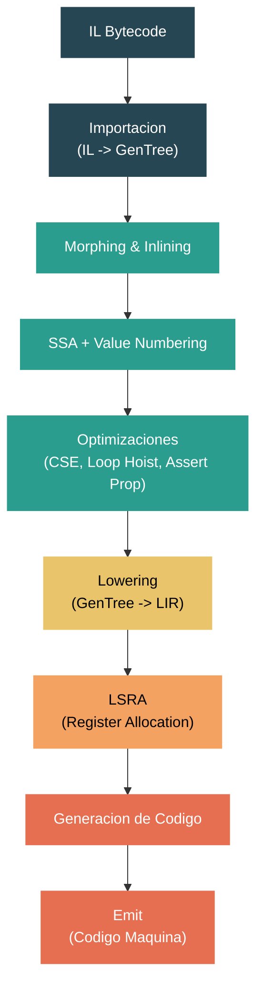

# Nivel 4: Internos — Compilacion JIT: Internos de RyuJIT

> **Perfil objetivo:** Ingeniero de runtime o contribuidor avanzado que necesita entender, depurar o modificar el compilador JIT de .NET
> **Esfuerzo estimado:** 12 horas
> **Prerrequisitos:** Modulos de Nivel 3, [Modulo 4.2](04-internals-type-system.md)
> [English version](../en/04-internals-jit.md)

---

## Objetivos de Aprendizaje

Al finalizar este modulo vas a poder:

1. Trazar el pipeline completo de compilacion desde IL bytecode a traves del IR GenTree hasta codigo nativo, identificando cada fase principal.
2. Explicar el rol del objeto `Compiler` como contexto de compilacion por metodo y como orquesta el pipeline de fases.
3. Leer e interpretar nodos GenTree IR, entendiendo la representacion intermedia basada en arboles y sus tipos de nodo clave.
4. Describir las fases principales de optimizacion -- morphing, inlining, construccion de SSA, value numbering, CSE, loop hoisting y assertion propagation.
5. Explicar como Linear Scan Register Allocation (LSRA) asigna registros fisicos a variables virtuales.
6. Usar las herramientas de diagnostico del JIT (`DOTNET_JitDump`, `DOTNET_JitDisasm`, `DOTNET_JitDiffableDasm`) para inspeccionar y depurar el comportamiento del JIT.

---

## Mapa Conceptual



---

## Una Nota sobre la Complejidad

Esta es una de las areas mas complejas de todo el runtime de .NET. El compilador JIT en `src/coreclr/jit/` consiste en cientos de miles de lineas de C++ distribuidas en mas de 100 archivos fuente. Una sola pasada de compilacion puede recorrer mas de 80 fases distintas. Este modulo provee una vision estructurada del pipeline -- suficiente para orientarte cuando leas el codigo fuente o depures comportamiento del JIT -- pero dominar cada fase llevaria meses de estudio enfocado. No te desanimes si el codigo se siente abrumador al principio; incluso los ingenieros veteranos del runtime consultan la documentacion del JIT regularmente.

---

## Guia de Lectura del Codigo Fuente

| Dificultad | Archivo | Proposito |
|------------|---------|-----------|
| ★★★★ | `src/coreclr/jit/compiler.h` | La clase `Compiler` -- el objeto central de una compilacion JIT |
| ★★★★ | `src/coreclr/jit/compiler.cpp` | `compCompile()` -- el driver maestro del pipeline de fases |
| ★★★★ | `src/coreclr/jit/compphases.h` | Lista completa y ordenada de todas las fases de compilacion |
| ★★★★ | `src/coreclr/jit/gentree.h` | El struct `GenTree` -- el tipo de nodo del IR |
| ★★★★★ | `src/coreclr/jit/importer.cpp` | Import de IL -- convierte bytecode en GenTree |
| ★★★★★ | `src/coreclr/jit/morph.cpp` | Morphing de arboles y optimizaciones globales |
| ★★★★★ | `src/coreclr/jit/optimizer.cpp` | Optimizaciones de loops, pesos de bloques |
| ★★★★★ | `src/coreclr/jit/lsra.h` | Clase `LinearScan` -- register allocation |
| ★★★★ | `src/coreclr/jit/codegencommon.cpp` | Generacion de codigo independiente de arquitectura |
| ★★★★ | `src/coreclr/jit/jitconfigvalues.h` | Todas las perillas de configuracion del JIT |
| ★★★★ | `src/coreclr/jit/flowgraph.cpp` | Manipulacion del grafo de flujo de control |
| ★★★★★ | `src/coreclr/jit/lsra.cpp` | Implementacion de LSRA |

---

## Curriculum

### Leccion 1 — Vision General de la Arquitectura de RyuJIT

#### Que vas a aprender

RyuJIT es el compilador JIT de produccion para CoreCLR. Cada vez que el runtime necesita ejecutar un metodo managed por primera vez (o re-compilarlo para tiered compilation), invoca a RyuJIT para transformar IL bytecode en codigo maquina nativo. Entender la arquitectura general es la base para todo lo demas en este modulo.

#### El objeto Compiler

Abri `src/coreclr/jit/compiler.h`. El comentario inicial te dice el diseno esencial:

```cpp
//  Represents the method data we are currently JIT-compiling.
//  An instance of this class is created for every method we JIT.
//  This contains all the info needed for the method. So allocating a
//  a new instance per method makes it thread-safe.
//  It should be used to do all the memory management for the compiler run.
```

La clase `Compiler` es enorme -- contiene todo el estado para la compilacion de un unico metodo. Cuando el EE (Execution Engine) le pide a RyuJIT compilar un metodo, el punto de entrada es `CILJit::compileMethod()`, que crea una instancia de `Compiler` y llama a su metodo `compCompile()`.

Decisiones clave de diseno:
- **Un Compiler por metodo**: La seguridad de threads viene del aislamiento. Cada metodo recibe su propia instancia de `Compiler` con su propio arena allocator.
- **Arena allocation**: Toda la memoria para una compilacion se asigna desde una unica arena y se libera en bloque cuando la compilacion termina. No hay llamadas individuales a `delete`.
- **Dirigido por fases**: La compilacion avanza a traves de una secuencia fija de fases. Cada fase es un metodo en la clase `Compiler`, invocado via `DoPhase()`.

#### El pipeline de fases

Abri `src/coreclr/jit/compiler.cpp` en la funcion `compCompile()` (alrededor de la linea 4305). El comentario lo dice todo:

```cpp
// This is the most interesting 'toplevel' function in the JIT. It goes through
// the operations of importing, morphing, optimizations and code generation.
```

La funcion llama a `DoPhase()` repetidamente, una vez por cada fase de compilacion. La lista completa de fases esta definida en `src/coreclr/jit/compphases.h`. Estos son los grupos principales:

**1. Import (IL -> GenTree)**
- `PHASE_PRE_IMPORT` -- preparar estructuras de datos
- `PHASE_IMPORTATION` -- la conversion principal de IL a arboles via `fgImport()`
- `PHASE_POST_IMPORT` -- limpieza despues del import

**2. Morph (transformaciones de arboles)**
- `PHASE_MORPH_INIT` -- preparar para morphing
- `PHASE_MORPH_INLINE` -- inlining de metodos callee
- `PHASE_LOCAL_MORPH` -- simplificar accesos a variables locales
- `PHASE_MORPH_GLOBAL` -- morphing global de arboles via `fgMorphBlocks()`

**3. Optimizacion del Grafo de Flujo**
- `PHASE_OPTIMIZE_FLOW` -- simplificacion de flujo de control
- `PHASE_FIND_LOOPS` -- descubrimiento de loops naturales
- `PHASE_CLONE_LOOPS` -- clonacion de loops para optimizacion
- `PHASE_UNROLL_LOOPS` -- unrolling de loops

**4. SSA y Optimizacion de Alto Nivel**
- `PHASE_BUILD_SSA` -- construccion de forma SSA (liveness, dominance frontiers, insercion de phi, renaming)
- `PHASE_VALUE_NUMBER` -- value numbering
- `PHASE_HOIST_LOOP_CODE` -- movimiento de codigo invariante fuera de loops
- `PHASE_VN_COPY_PROP` -- copy propagation basada en VN
- `PHASE_OPTIMIZE_VALNUM_CSES` -- eliminacion de sub-expresiones comunes
- `PHASE_ASSERTION_PROP_MAIN` -- assertion propagation
- `PHASE_OPTIMIZE_BRANCHES` -- optimizacion de branches redundantes

**5. Lowering y Register Allocation**
- `PHASE_RATIONALIZE` -- convertir HIR a LIR (IR lineal)
- `PHASE_LOWERING` -- lowering especifico de plataforma
- `PHASE_LINEAR_SCAN` -- register allocation (LSRA)

**6. Generacion de Codigo**
- `PHASE_GENERATE_CODE` -- emitir instrucciones de maquina
- `PHASE_EMIT_CODE` -- codificar y finalizar el buffer de codigo
- `PHASE_EMIT_GCEH` -- emitir tablas de GC info y EH

#### Los inlinees usan el mismo pipeline

Un detalle sutil pero importante: cuando RyuJIT hace inline de un metodo, crea una instancia *separada* de `Compiler` para el inlinee y lo hace pasar por las fases tempranas (import, algo de morphing). Si el intento de inline tiene exito, los arboles del inlinee se injertan en los arboles del caller. Esto es visible en `compCompile()`:

```cpp
// If we're importing for inlining, we're done.
if (compIsForInlining())
{
    return;
}
```

#### Ejercicio

1. Abri `src/coreclr/jit/compphases.h` y conta el numero total de fases. Nota cuales fases tienen `hasChildren = true` (estas son fases padre que agrupan sub-fases).
2. En `compCompile()`, encontra donde el pipeline se bifurca entre caminos de codigo optimizado y no optimizado. Busca `opts.OptimizationEnabled()`.
3. Busca llamadas a `DoPhase` en `compiler.cpp`. Nota como cada fase retorna un `PhaseStatus` que indica si la fase modifico algo.

---

### Leccion 2 — Import de IL e IR GenTree

#### Que vas a aprender

La fase de import es donde el IL bytecode se convierte en la representacion interna del JIT: un IR basado en arboles llamado GenTree. Entender GenTree es esencial porque cada fase subsiguiente lee y transforma estos arboles.

#### Import de IL

Abri `src/coreclr/jit/importer.cpp`. El encabezado del archivo describe el proceso:

```cpp
//  Imports the given method and converts it to semantic trees
```

El importer recorre las instrucciones IL una por una. Mantiene un stack de evaluacion (reflejando el stack de evaluacion de IL) y convierte cada opcode IL en uno o mas nodos GenTree. Por ejemplo:
- `ldarg.0` empuja un nodo `GT_LCL_VAR` al stack de evaluacion
- `ldfld` desapila una referencia a objeto y crea un nodo `GT_IND` (indireccion)
- `add` desapila dos valores y crea un nodo `GT_ADD`
- `call` crea un nodo `GT_CALL` con los argumentos como hijos

La funcion clave es `impPushOnStack()`, que empuja un nodo GenTree al stack simulado:

```cpp
void Compiler::impPushOnStack(GenTree* tree, typeInfo ti)
{
    stackState.esStack[stackState.esStackDepth].seTypeInfo = ti;
    stackState.esStack[stackState.esStackDepth++].val      = tree;
}
```

El IL de cada basic block se importa en una lista enlazada de nodos `Statement`, donde cada statement contiene un arbol con raiz en un nodo GenTree.

#### La estructura GenTree

Abri `src/coreclr/jit/gentree.h`. El comentario al inicio describe el concepto central:

```cpp
//  This is the node in the semantic tree graph. It represents the operation
//  corresponding to the node, and other information during code-gen.
```

El struct `GenTree` es el nodo fundamental del IR. Cada expresion, operacion y efecto secundario en el JIT se representa como un `GenTree`. Los dos campos mas importantes son:

```cpp
genTreeOps gtOper; // La operacion (GT_ADD, GT_CALL, GT_LCL_VAR, etc.)
var_types  gtType; // El tipo del resultado (TYP_INT, TYP_REF, TYP_FLOAT, etc.)
```

Los nodos GenTree se clasifican por su aridad:

```cpp
enum GenTreeOperKind
{
    GTK_SPECIAL = 0x00, // operador especial
    GTK_LEAF    = 0x01, // operador hoja (sin hijos)
    GTK_UNOP    = 0x02, // operador unario (un hijo)
    GTK_BINOP   = 0x04, // operador binario (dos hijos)
};
```

Las subclases extienden `GenTree` para operaciones especificas:
- `GenTreeOp` -- operaciones binarias (`GT_ADD`, `GT_MUL`, `GT_AND`, etc.) con hijos `gtOp1` y `gtOp2`
- `GenTreeCall` -- llamadas a metodos con listas de argumentos e info de calling convention
- `GenTreeLclVar` -- referencias a variables locales
- `GenTreeIntCon` -- constantes enteras
- `GenTreeIndir` -- indirecciones de memoria (loads/stores)

#### Ejemplo de estructura de arbol

Considera la expresion C# `a + b * c` donde todas son variables locales `int`. Despues del import, RyuJIT la representa asi:

```
       GT_ADD (TYP_INT)
      /              \
GT_LCL_VAR(a)    GT_MUL (TYP_INT)
                /              \
        GT_LCL_VAR(b)    GT_LCL_VAR(c)
```

Cada statement en un basic block contiene un arbol como este. Multiples statements forman la lista de statements del bloque.

#### HIR vs LIR

RyuJIT usa dos formas del IR GenTree:
- **HIR (High-level IR)**: Estructurado como arbol. Los nodos tienen relaciones padre-hijo. Se usa desde el import hasta las fases de optimizacion. Los statements contienen arboles de expresiones.
- **LIR (Linear IR)**: Despues de la rationalizacion (`PHASE_RATIONALIZE`), los arboles se aplanan en una secuencia lineal. Cada nodo aparece exactamente una vez en orden de ejecucion. LIR se usa durante lowering, register allocation y generacion de codigo.

La transicion de HIR a LIR es una de las transformaciones mas importantes del pipeline.

#### Ejercicio

1. Abri `src/coreclr/jit/gentreeopsdef.h` y recorre las definiciones de opcodes `GT_*`. Cuantos opcodes diferentes existen?
2. En `gentree.h`, encontra el struct `GenTreeOp`. Ubica los campos `gtOp1` y `gtOp2` -- estos son los hijos izquierdo y derecho de una operacion binaria.
3. Lee las primeras 100 lineas de `importer.cpp`. Nota como `impPushOnStack` y el switch de opcodes IL trabajan juntos para construir arboles.

---

### Leccion 3 — Fases de Optimizacion

#### Que vas a aprender

Entre el import y la generacion de codigo, RyuJIT ejecuta docenas de fases de optimizacion. Esta leccion cubre las mas importantes. Cada fase transforma el IR GenTree para producir codigo mas rapido.

#### Morphing

El morphing (`src/coreclr/jit/morph.cpp`) es el primer pase de transformacion importante. La funcion `fgMorphInit()` prepara el estado del compiler, luego `fgMorphBlocks()` recorre cada arbol en cada bloque y aplica transformaciones.

El morphing hace muchas cosas:
- **Constant folding**: `3 + 5` se convierte en `8`
- **Strength reduction**: multiplicar por una potencia de dos se convierte en un shift
- **Canonicalizacion**: pone los arboles en una forma estandar para optimizaciones posteriores
- **Formacion de modos de direccionamiento**: combina base + indice + offset en un unico addressing mode
- **Coercion de tipos**: inserta casts donde se necesiten

La fase de morph es una de las partes mas antiguas y grandes del JIT. Se ejecuta antes de que se construya SSA, asi que opera en la forma cruda del arbol.

#### Inlining

El inlining sucede durante `PHASE_MORPH_INLINE` via `fgInline()`. Cuando el JIT encuentra un nodo `GT_CALL`, evalua si el callee es redituable para inlining basandose en:
- Tamano del metodo (conteo de bytes IL)
- Rentabilidad del call site (hot vs. cold path)
- Datos guiados por profile (si estan disponibles)
- Limites de profundidad recursiva

Si el inlining procede, se crea una nueva instancia de `Compiler` para el callee, se importa su IL, y los arboles resultantes se sustituyen por el nodo `GT_CALL`. Las clases `InlineStrategy` e `InlinePolicy` (en `src/coreclr/jit/inline.h`) controlan las heuristicas.

#### Construccion de SSA

Despues del morphing, si las optimizaciones estan habilitadas, el JIT construye la forma SSA (Static Single Assignment) durante `PHASE_BUILD_SSA`. Esta es una tecnica estandar de compiladores donde cada variable se asigna exactamente una vez, y se insertan funciones phi en los puntos de merge del flujo de control.

La construccion de SSA tiene cuatro sub-fases:
1. **Analisis de liveness** (`PHASE_BUILD_SSA_LIVENESS`) -- determinar que variables estan vivas en cada punto del programa
2. **Computo de dominance frontier** (`PHASE_BUILD_SSA_DF`) -- computar donde se necesitan funciones phi
3. **Insercion de phi** (`PHASE_BUILD_SSA_INSERT_PHIS`) -- insertar nodos phi en puntos de merge
4. **Renaming** (`PHASE_BUILD_SSA_RENAME`) -- renombrar todos los usos de variables a sus versiones SSA

Una vez construido SSA, cada nodo `GT_LCL_VAR` porta un numero SSA que identifica la definicion especifica a la que se refiere.

#### Value Numbering

Value numbering (`PHASE_VALUE_NUMBER`) asigna un "numero de valor" unico a cada expresion. Dos expresiones con el mismo value number tienen la garantia de producir el mismo resultado. Esto habilita muchas optimizaciones posteriores.

Por ejemplo, si `x = a + b` y despues `y = a + b` (sin cambios en `a` o `b`), ambas sumas reciben el mismo value number. CSE puede entonces reemplazar la segunda computacion con una referencia a la primera.

La implementacion de value numbering vive en `src/coreclr/jit/valuenum.h` y `valuenum.cpp`.

#### Common Sub-Expression Elimination (CSE)

CSE (`PHASE_OPTIMIZE_VALNUM_CSES`) identifica expresiones que aparecen multiples veces y las reemplaza con una unica computacion almacenada en una variable temporal. Depende de value numbering para identificar expresiones equivalentes.

La implementacion esta en `src/coreclr/jit/optcse.cpp` y `optcse.h`. La heuristica de CSE pesa el costo de la variable temporal extra (presion de registros) contra los ahorros de evitar computacion redundante.

#### Optimizaciones de Loops

El optimizer (`src/coreclr/jit/optimizer.cpp`) maneja varias transformaciones de loops:

- **Descubrimiento de loops** (`PHASE_FIND_LOOPS`): Identifica loops naturales usando informacion de dominancia. La clase `FlowGraphNaturalLoop` representa un loop detectado.
- **Clonacion de loops** (`PHASE_CLONE_LOOPS`): Crea una copia fast-path de un loop para casos donde se pueden eliminar bounds checks.
- **Unrolling de loops** (`PHASE_UNROLL_LOOPS`): Replica el cuerpo del loop para reducir overhead de iteracion en loops pequenos con conteo fijo.
- **Movimiento de codigo invariante** (`PHASE_HOIST_LOOP_CODE`): Mueve computaciones que no cambian entre iteraciones fuera del loop.
- **Optimizacion de induction variables** (`PHASE_OPTIMIZE_INDUCTION_VARIABLES`): Simplifica y aplica strength reduction a computaciones del contador del loop.

#### Assertion Propagation

Assertion propagation (`PHASE_ASSERTION_PROP_MAIN`) rastrea hechos que se sabe que son verdaderos en varios puntos del programa. Por ejemplo, despues de que un null check tiene exito, se sabe que la variable no es null. Esta informacion se usa para:
- Eliminar null checks redundantes
- Remover bounds checks innecesarios
- Simplificar branches condicionales

#### El loop de optimizacion

Un detalle importante visible en `compCompile()` alrededor de la linea 4736:

```cpp
while (++opts.optRepeatIteration <= opts.optRepeatCount)
{
    // SSA, value numbering, CSE, assertion prop, etc.
}
```

Las optimizaciones basadas en SSA pueden ejecutarse en un loop (`JitOptRepeat`). Cada iteracion puede descubrir nuevas oportunidades de optimizacion creadas por pases previos.

#### Ejercicio

1. En `compphases.h`, lista todas las fases de optimizacion que tienen "loop" en su nombre. Cuantas transformaciones de loop diferentes realiza RyuJIT?
2. Abri `compiler.cpp` alrededor de la linea 4700. Encontra donde se configuran `doSsa`, `doValueNum`, `doCse` y `doAssertionProp`. Nota como cada uno depende del anterior.
3. Busca `JitDoSsa`, `JitDoCopyProp` y `JitDoAssertionProp` en `jitconfigvalues.h`. Estas son las perillas que habilitan/deshabilitan optimizaciones individuales en builds de debug.

---

### Leccion 4 — Register Allocation (LSRA)

#### Que vas a aprender

Despues de las optimizaciones y el lowering, el JIT debe asignar registros fisicos a todas las variables virtuales y temporales. RyuJIT usa Linear Scan Register Allocation (LSRA), un algoritmo bien conocido que balancea calidad de asignacion con velocidad de compilacion.

#### Por que importa el register allocation

Las CPUs modernas pueden acceder a registros ordenes de magnitud mas rapido que a memoria. El trabajo del register allocator es mantener los valores usados mas frecuentemente en registros mientras minimiza el costo de "spilling" (volcar valores al stack cuando los registros se agotan). Un buen register allocator puede hacer una diferencia de 2-5x en el rendimiento del codigo generado.

#### La clase LinearScan

Abri `src/coreclr/jit/lsra.h`. La clase `LinearScan` en la linea 625 es el register allocator principal:

```cpp
class LinearScan : public RegAllocInterface
{
    // This is the main driver
    virtual PhaseStatus doRegisterAllocation();
};
```

LSRA tiene tres sub-fases, visibles en `compphases.h`:
1. `PHASE_LINEAR_SCAN_BUILD` -- construir intervalos
2. `PHASE_LINEAR_SCAN_ALLOC` -- asignar registros
3. `PHASE_LINEAR_SCAN_RESOLVE` -- resolver discrepancias entre bloques

#### Conceptos centrales

**Intervals**: Cada variable o temporal que necesita un registro se representa como un `Interval`. Un interval rastrea el rango de ubicaciones LIR donde el valor esta vivo.

**RefPositions**: Cada uso o definicion de una variable crea un `RefPosition`. Los RefPositions estan ordenados linealmente (de ahi "linear scan") y el allocator los recorre en orden, tomando decisiones de asignacion.

**LsraLocation**: Un ordenamiento linealizado de todos los nodos. Cada nodo recibe dos ubicaciones -- una para usos y defs no finales, y una segunda para el def final (si existe):

```cpp
typedef unsigned int LsraLocation;
```

**Tipos de registro**: Las variables se categorizan en registros enteros, registros float y (en x86/x64 con SIMD) registros de mascara:

```cpp
#define IntRegisterType   TYP_INT
#define FloatRegisterType TYP_FLOAT
#define MaskRegisterType  TYP_MASK
```

#### Como funciona LSRA

1. **Construir intervalos** (`buildIntervals`): Recorrer el LIR en cada bloque. Para cada nodo, crear RefPositions para sus usos y definiciones. Rastrear que variables estan vivas y donde necesitan registros.

2. **Asignar registros** (`allocateRegisters`): Recorrer todos los RefPositions en orden lineal. Para cada uno:
   - Si hay un registro disponible, asignarlo
   - Si no hay registro libre, elegir una victima para spill (desalojar de su registro y almacenar en el stack)
   - Las decisiones de spill usan heuristicas basadas en peso (frecuencia de uso) y distancia al proximo uso

3. **Resolver** (`resolveRegisters`): Despues de la asignacion, bloques adyacentes pueden no coincidir en que registro contiene una variable. La fase de resolucion inserta movimientos (copias o reloads) en los bordes de bloques para asegurar consistencia.

#### Spilling

Cuando hay mas valores vivos que registros disponibles, el allocator debe hacer "spill" de algunos valores a memoria. El spilling inserta:
- Un **store** en el punto de spill (escribir el registro al stack)
- Un **reload** en el punto del proximo uso (leer el stack de vuelta a un registro)

El allocator intenta minimizar los spills en codigo hot y prefiere hacer spill de valores que no seran usados pronto.

#### Ejercicio

1. En `lsra.h`, encontra la clase `Interval` y la clase `RefPosition`. Que campos contienen?
2. Busca `JitLsraStats` y `JitLsraOrdering` en `jitconfigvalues.h`. Estos te permiten ver estadisticas de LSRA y cambiar el ordenamiento de heuristicas.
3. Abri `compphases.h` y encontra `PHASE_LINEAR_SCAN`. Nota sus tres sub-fases.

---

### Leccion 5 — Generacion de Codigo

#### Que vas a aprender

Despues de register allocation, el JIT genera codigo maquina real. Esta es la traduccion final del IR GenTree (ahora en forma LIR con registros fisicos asignados) a la codificacion de instrucciones de la arquitectura objetivo.

#### Lowering: preparando para codegen

Antes de register allocation, la fase de lowering (`src/coreclr/jit/lower.h`, `lower.cpp`) transforma el IR desde una representacion de alto nivel hacia algo mas cercano a instrucciones de maquina:
- Descompone operaciones complejas en secuencias de operaciones mas simples
- Elige modos de direccionamiento (base + indice * escala + offset)
- Selecciona formas especificas de instrucciones de maquina
- Marca nodos con requerimientos de registros (ej., "esto debe estar en RAX")

El lowering es especifico de la plataforma. La clase principal es `Lowering` en `lower.h`, con overrides especificos de plataforma en archivos como `lowerxarch.cpp` y `lowerarmarch.cpp`.

#### El emitter

Abri `src/coreclr/jit/codegencommon.cpp`. Los metodos de generacion de codigo son comunes a todas las arquitecturas. El encabezado describe:

```cpp
// Code Generator Common:
//   Methods common to all architectures and register allocation strategies
```

La codificacion real de instrucciones de maquina la maneja la clase `emitter` (`src/coreclr/jit/emit.h`, `emit.cpp`). El emitter:
- Codifica cada instruccion en bytes
- Resuelve offsets de branches y labels
- Maneja requerimientos de alineacion
- Rastrea GC info para cada instruccion (que registros contienen referencias GC)

El codigo del emitter especifico por arquitectura vive en:
- `emitxarch.cpp` -- x86/x64
- `emitarm.cpp` -- ARM32
- `emitarm64.cpp` -- ARM64

#### El recorrido de codegen

La generacion de codigo (`PHASE_GENERATE_CODE`) recorre el LIR de cada bloque y, para cada nodo GenTree, llama a un metodo `genCodeFor*`. Por ejemplo:
- `GT_ADD` llama a `genCodeForBinary()` que emite una instruccion `add`
- `GT_CALL` llama a `genCallInstruction()` que prepara argumentos, emite la llamada y maneja el valor de retorno
- `GT_STORE_LCL_VAR` emite un mov de un registro a una ubicacion del stack

Despues de la generacion de codigo, `PHASE_EMIT_CODE` finaliza el stream de instrucciones:
- Resuelve targets de branches hacia adelante
- Aplica padding de alineacion de loops
- Produce el buffer final de bytes

`PHASE_EMIT_GCEH` luego genera las tablas de GC info y tablas de exception handling que el runtime usa para stack walking y garbage collection.

#### Generacion de codigo especifica de plataforma

RyuJIT soporta multiples arquitecturas. Los archivos de generacion de codigo estan divididos por plataforma:
- `codegenxarch.cpp` -- especifico de x86/x64
- `codegenarm.cpp` -- especifico de ARM32
- `codegenarm64.cpp` -- especifico de ARM64
- `codegencommon.cpp` -- logica compartida

Cada plataforma tiene su propio conjunto de instrucciones, archivo de registros y calling convention. La fase de lowering y el emitter manejan estas diferencias para que las fases de optimizacion puedan permanecer en gran parte independientes de la plataforma.

#### Ejercicio

1. Abri `src/coreclr/jit/emit.h` y encontra la clase `emitter`. Recorre la estructura de grupo de instrucciones (`insGroup`) que representa un bloque de instrucciones codificadas.
2. Busca `genCodeForBinary` en el codebase. Como difiere entre `codegenxarch.cpp` y `codegenarm64.cpp`?
3. En `compphases.h`, encontra las cuatro fases finales: `PHASE_GENERATE_CODE`, `PHASE_EMIT_CODE`, `PHASE_EMIT_GCEH`, `PHASE_POST_EMIT`. Estos son los ultimos pasos antes de que el codigo nativo se entregue de vuelta al runtime.

---

### Leccion 6 — Configuracion y Depuracion del JIT

#### Que vas a aprender

RyuJIT tiene un conjunto extenso de perillas de configuracion para diagnosticar y depurar el comportamiento del JIT. Son invaluables cuando investigas problemas de rendimiento, verificas que las optimizaciones se activan, o depuras generacion de codigo incorrecta.

#### Arquitectura de perillas de configuracion

Abri `src/coreclr/jit/jitconfigvalues.h`. Este archivo define todas las variables de configuracion del JIT usando macros:

```cpp
// Configs solo de debug
CONFIG_INTEGER(name, key, defaultValue)
CONFIG_STRING(name, key)
CONFIG_METHODSET(name, key)

// Disponibles tambien en builds de release
RELEASE_CONFIG_INTEGER(name, key, defaultValue)
RELEASE_CONFIG_METHODSET(name, key)
```

Los macros `CONFIG_*` definen perillas solo disponibles en builds Debug/Checked. Los macros `RELEASE_CONFIG_*` definen perillas disponibles en todos los builds (incluyendo Release). Las variables de entorno usan el prefijo `DOTNET_` (ej., `DOTNET_JitDisasm`).

#### JitDisasm -- ver el assembly generado

La perilla mas comunmente usada. Disponible en builds de Release:

```bash
# Desensamblar un metodo especifico
DOTNET_JitDisasm="MyClass::MyMethod" dotnet run

# Desensamblar todos los metodos
DOTNET_JitDisasm="*" dotnet run

# Producir salida amigable para diff (sin direcciones, sin valores de punteros)
DOTNET_JitDisasmDiffable=1 DOTNET_JitDisasm="*" dotnet run
```

`JitDisasm` muestra el assembly nativo final para los metodos que coincidan. Esta es la salida que la mayoria de los ingenieros de rendimiento miran.

Opciones adicionales de JitDisasm:
- `DOTNET_JitDisasmSummary=1` -- imprimir un resumen de una linea por cada metodo jiteado (nombre, tamano de codigo)
- `DOTNET_JitDisasmWithCodeBytes=1` -- incluir codificacion hexadecimal de cada instruccion
- `DOTNET_JitDisasmWithAlignmentBoundaries=1` -- mostrar limites de linea de cache

#### JitDump -- la traza completa de compilacion

Disponible solo en builds Debug/Checked, `JitDump` produce una traza extremadamente verbosa de todo el proceso de compilacion:

```bash
DOTNET_JitDump="MyClass::MyMethod" dotnet run 2>jitdump.txt
```

El dump incluye:
- El IL bytecode
- El IR GenTree importado despues de cada fase
- Numeros SSA y value numbers
- Tablas de intervalos de LSRA y decisiones de asignacion
- El codigo generado final

Un `JitDump` para un solo metodo puede tener miles de lineas. Es la herramienta principal para entender *por que* el JIT tomo una decision especifica.

Perillas relacionadas:
- `DOTNET_JitDumpASCII=1` -- usar solo ASCII en dumps de arboles (default)
- `DOTNET_JitDumpVerboseTrees=1` -- display de arboles mas detallado
- `DOTNET_JitDumpBeforeAfterMorph=1` -- mostrar cada arbol antes y despues del morphing

#### JitDumpFg -- visualizacion del grafo de flujo

Para entender el flujo de control:

```bash
# Volcar grafo de flujo en formato DOT para Graphviz
DOTNET_JitDumpFg="MyClass::MyMethod" DOTNET_JitDumpFgDot=1 dotnet run
```

Esto produce archivos `.dot` que se pueden visualizar con Graphviz, mostrando basic blocks, aristas y estructura de loops. Podes controlar de que fase volcar el grafo de flujo:

```bash
DOTNET_JitDumpFgPhase="optclone" dotnet run
```

#### Diagnosticos de LSRA

```bash
# Mostrar estadisticas de LSRA (1=texto, 2=csv, 3=resumen)
DOTNET_JitLsraStats=1 dotnet run

# Cambiar ordenamiento de heuristicas de LSRA
DOTNET_JitLsraOrdering="ABCDE" dotnet run
```

#### Perillas de control de optimizaciones (builds Debug/Checked)

Estas te permiten deshabilitar selectivamente optimizaciones para aislar bugs:

```bash
DOTNET_JitDoSsa=0               # Deshabilitar construccion de SSA
DOTNET_JitDoValueNumber=0       # Deshabilitar value numbering
DOTNET_JitDoCopyProp=0          # Deshabilitar copy propagation
DOTNET_JitDoAssertionProp=0     # Deshabilitar assertion propagation
DOTNET_JitDoRedundantBranchOpts=0  # Deshabilitar opt de branches redundantes
DOTNET_JitDoLoopHoisting=0      # Deshabilitar loop hoisting
```

Esto es extremadamente util para bisectar bugs del JIT: si deshabilitar una optimizacion especifica hace desaparecer un bug, sabes que fase investigar.

#### AltJit -- usar un JIT alternativo

```bash
# Usar un DLL de JIT diferente para metodos especificos
DOTNET_AltJit="MyMethod" DOTNET_AltJitName="clrjit2.dll" dotnet run
```

Esto se usa para A/B testing de cambios en el JIT.

#### Flujo de trabajo practico de depuracion

1. **Investigacion de rendimiento**: Empeza con `DOTNET_JitDisasm` para ver el codigo generado. Compara con `DOTNET_JitDiffableDasm=1` para obtener salida amigable para diff en comparaciones antes/despues.

2. **Verificacion de optimizaciones**: Usa `DOTNET_JitDump` para trazar las fases de optimizacion. Verifica si CSE, inlining o loop hoisting se activaron como se esperaba.

3. **Bug de codegen**: Usa las perillas de control de optimizaciones para bisectar que fase introdujo el bug. Luego usa `DOTNET_JitDump` enfocado en esa fase.

4. **Problemas de register allocation**: Usa `DOTNET_JitLsraStats` y el dump de LSRA en `JitDump` para entender las decisiones de spilling.

#### Ejercicio

1. Escribi un programa C# simple con un loop ajustado. Ejecutalo con `DOTNET_JitDisasm="*"` y examina el assembly generado.
2. Ejecuta el mismo programa con `DOTNET_JitDump="*"` (build Debug/Checked). Encontra la salida de la fase SSA y la salida de value numbering en el dump.
3. Busca `RELEASE_CONFIG_*` en `jitconfigvalues.h`. Estas son las perillas disponibles en builds de produccion -- son las mas importantes para diagnosticos del mundo real.

---

## Resumen

RyuJIT transforma IL bytecode en codigo maquina nativo a traves de un pipeline de mas de 80 fases. El objeto central `Compiler` administra todo el estado para la compilacion de un unico metodo. El IL se importa en un IR basado en arboles (GenTree), se optimiza a traves de morphing, construccion de SSA, value numbering, CSE, transformaciones de loop y assertion propagation, luego se baja a una forma lineal, se le asignan registros via LSRA, y finalmente se emite como codigo maquina.

Los archivos clave para recordar:
- `compiler.h` / `compiler.cpp` -- la clase `Compiler` y el driver de fases `compCompile()`
- `compphases.h` -- la lista ordenada de todas las fases
- `gentree.h` -- el nodo del IR GenTree
- `importer.cpp` -- import de IL
- `morph.cpp` -- morphing de arboles
- `optimizer.cpp` -- optimizaciones de loops
- `lsra.h` / `lsra.cpp` -- register allocation
- `jitconfigvalues.h` -- perillas de diagnostico

---

## Lectura Adicional

- [RyuJIT Overview](https://github.com/dotnet/runtime/blob/main/docs/design/coreclr/jit/ryujit-overview.md) -- el documento oficial de diseno del JIT
- [JIT Dump Output](https://github.com/dotnet/runtime/blob/main/docs/design/coreclr/jit/viewing-jit-dumps.md) -- como leer la salida de JitDump
- `docs/design/coreclr/jit/` -- la coleccion completa de documentos de diseno del JIT
- [Diseno de LSRA](https://github.com/dotnet/runtime/blob/main/docs/design/coreclr/jit/lsra-detail.md) -- documentacion detallada de LSRA

---

## Glosario

| Termino | Definicion |
|---------|-----------|
| **RyuJIT** | El compilador JIT de produccion usado por CoreCLR |
| **GenTree** | La representacion intermedia (IR) basada en arboles usada por RyuJIT |
| **HIR** | High-level IR -- forma estructurada como arbol usada durante optimizacion |
| **LIR** | Linear IR -- forma aplanada usada durante lowering y codegen |
| **SSA** | Static Single Assignment -- cada variable definida exactamente una vez |
| **Value Numbering** | Asigna IDs a expresiones; IDs iguales significan valores iguales |
| **CSE** | Common Sub-Expression Elimination -- evita computacion redundante |
| **LSRA** | Linear Scan Register Allocation -- asigna registros fisicos |
| **Interval** | Concepto de LSRA: el rango de vida de un valor que necesita un registro |
| **RefPosition** | Concepto de LSRA: un punto donde un valor se define o usa |
| **Spilling** | Desalojar un registro a memoria cuando los registros se agotan |
| **Lowering** | Transformar el IR para acercarse a instrucciones de maquina |
| **Emitter** | El componente que codifica instrucciones de maquina en bytes |
| **Morphing** | Pase temprano de transformacion de arboles (constant folding, canonicalizacion) |
| **Tiered compilation** | Compilar metodos primero a baja calidad (rapido), luego a alta calidad (lento) si estan hot |
