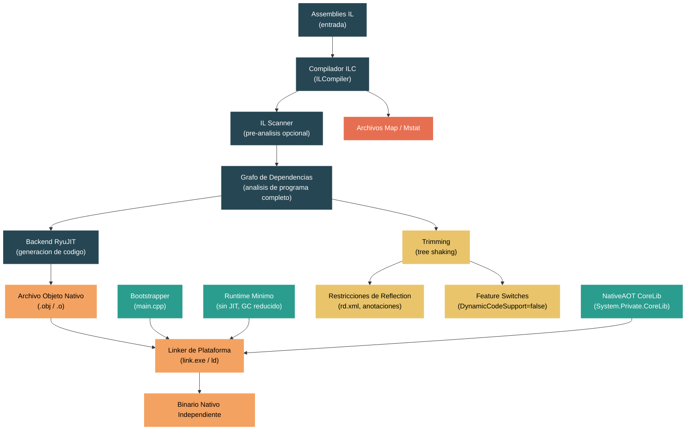

# Nivel 4: Internos -- Compilacion NativeAOT

> **Perfil objetivo:** Desarrollador que quiere entender como las aplicaciones .NET se compilan anticipadamente en ejecutables nativos independientes, incluyendo el pipeline del compilador ILC, el runtime minimo y las diferencias respecto a JIT y ReadyToRun
> **Esfuerzo estimado:** 8 horas
> **Prerrequisitos:** [Modulo 4.3 -- Compilacion JIT](04-internals-jit.md), [Modulo 4.9 -- ReadyToRun](04-internals-r2r.md)
> [English version](../en/04-internals-nativeaot.md)

---

## Objetivos de Aprendizaje

Al finalizar este modulo vas a poder:

1. Explicar donde se ubica NativeAOT en relacion con JIT y ReadyToRun, articulando las ventajas y desventajas de la compilacion completamente anticipada (sin JIT, sin carga dinamica, menor huella de memoria, arranque mas rapido).
2. Trazar el pipeline del compilador ILC desde la entrada de IL hasta el grafo de dependencias y la generacion del archivo objeto nativo, identificando los roles del scanner, el framework de dependencias y el backend RyuJIT.
3. Describir la arquitectura del runtime minimo de NativeAOT -- que incluye de CoreCLR, que elimina, y como el bootstrapper inicializa el proceso.
4. Explicar como el analisis de programa completo y el trimming eliminan codigo inalcanzable, y como las dependencias condicionales y dinamicas del grafo de dependencias habilitan un tree shaking preciso.
5. Identificar que funcionalidades de reflection y dinamicas funcionan bajo NativeAOT, cuales requieren anotaciones o rd.xml, y cuales son fundamentalmente incompatibles, aplicando atributos `DynamicallyAccessedMembers` y feature switches para resolver advertencias.
6. Publicar una aplicacion NativeAOT usando `dotnet publish`, analizar el tamano del binario con archivos map/mstat, y diagnosticar problemas comunes de despliegue.

---

## Mapa Conceptual



---

## Curriculum

### Leccion 1 -- NativeAOT vs JIT vs ReadyToRun: Donde encaja NativeAOT

#### Que vas a aprender

NativeAOT es la tercera estrategia de compilacion en el ecosistema .NET, junto con JIT (just-in-time) y ReadyToRun (R2R). Cada una hace compromisos fundamentalmente distintos. Entender donde encaja NativeAOT -- y que sacrifica -- es esencial antes de profundizar en sus mecanismos internos.

#### El espectro de compilacion

| Propiedad | JIT | ReadyToRun | NativeAOT |
|-----------|-----|------------|-----------|
| Cuando se compila el codigo | En runtime, metodo a metodo | Anticipadamente + fallback a JIT | Completamente anticipado |
| Runtime requerido | CoreCLR completo | CoreCLR completo | Runtime minimo reducido |
| Generacion dinamica de codigo | Completa (`Reflection.Emit`, `DynamicMethod`) | Completa | **No soportada** |
| Carga de assemblies | Completa (`Assembly.Load`, plugins) | Completa | **No soportada** |
| Despliegue | Dependiente de framework o autocontenido | Autocontenido con imagenes R2R | Ejecutable nativo unico |
| Tiempo de arranque | Mas lento (JIT en primera llamada) | Rapido (rutas calientes pre-compiladas) | **Mas rapido** (sin JIT en absoluto) |
| Rendimiento en estado estable | Maximo (PGO, compilacion escalonada) | Bueno | Bueno (optimizaciones de programa completo) |
| Tamano del binario | Mas pequeno (solo IL) | Mayor (IL + codigo nativo) | **Mas pequeno autocontenido** (sin IL, con trimming) |
| Reflection | Completa | Completa | **Restringida** (requiere anotaciones) |

#### La filosofia de diseno en el codigo fuente

El documento de diseno oficial en `docs/design/coreclr/botr/ilc-architecture.md` abre con este enfoque:

> ILC (IL Compiler) es un compilador anticipado que transforma programas en CIL (Common Intermediate Language) a un lenguaje destino o conjunto de instrucciones para ejecutarse en un runtime reducido de CoreCLR.

La frase clave es "runtime reducido de CoreCLR." NativeAOT no inventa un runtime nuevo desde cero. Reutiliza el GC, threading y manejo de excepciones de CoreCLR, pero elimina el compilador JIT, el cargador de tipos (para tipos no conocidos en tiempo de compilacion) y el lector de metadatos que soporta la carga dinamica de assemblies.

#### Lo que NativeAOT te da

1. **Ejecutable nativo unico**: No se necesita el host `dotnet`. La salida es un EXE o biblioteca compartida indistinguible de un binario C/C++.
2. **Arranque rapido**: Medido en milisegundos de un digito bajo para "Hello World" -- no hay compilacion JIT al iniciar.
3. **Menor uso de memoria**: Sin metadatos IL en memoria, sin compilador JIT cargado, sin sistema de tipos para generacion de tipos en runtime.
4. **Depuracion nativa**: Se puede depurar con `gdb`, `lldb`, `WinDbg` o el depurador nativo de Visual Studio con stepping completo a nivel de fuente.
5. **Rendimiento predecible**: Sin calentamiento JIT, sin recompilacion escalonada -- la primera llamada es tan rapida como la milesima.

#### Lo que NativeAOT te quita

1. **Sin `Reflection.Emit` ni `DynamicMethod`**: No se puede generar codigo en runtime.
2. **Sin `Assembly.LoadFile` / `Assembly.Load`**: No se pueden cargar assemblies nuevos dinamicamente.
3. **Reflection restringida**: Solo los tipos/miembros que el compilador puede descubrir estaticamente (o que vos explicitamente enraices) estan disponibles via reflection.
4. **Sin interop COM en plataformas no-Windows** (limitado incluso en Windows).
5. **Binario potencialmente mas grande que despliegues dependientes de framework**: El runtime y todas las bibliotecas se enlazan dentro.

#### La arquitectura de alto nivel

La documentacion de NativeAOT en `docs/workflow/building/coreclr/nativeaot.md` describe cinco componentes principales:

1. **El compilador AOT (ILC)** -- construido sobre una base de codigo compartida con crossgen2 en `src/coreclr/tools/aot/`. Donde crossgen2 genera modulos R2R para el CoreCLR completo, ILC genera archivos objeto nativos para el runtime reducido.
2. **El runtime minimo** -- archivos especificos de NativeAOT en `src/coreclr/nativeaot/Runtime/`, mas codigo compartido de `src/coreclr/`. Se construye como una biblioteca estatica.
3. **El bootstrapper** -- en `src/coreclr/nativeaot/Bootstrap/`. Contiene el `main()` nativo que inicializa el runtime y despacha al codigo managed.
4. **Las bibliotecas core** -- `System.Private.CoreLib`, `System.Private.Reflection.*`, `System.Private.TypeLoader` en `src/coreclr/nativeaot/`.
5. **Integracion MSBuild** -- en `src/coreclr/nativeaot/BuildIntegration/`. Los archivos `.targets` que se enganchan en `dotnet publish`.

#### Ejercicio de exploracion del codigo fuente

1. Lee `docs/design/coreclr/botr/ilc-architecture.md` -- los primeros tres parrafos explican la distincion entre compilacion anticipada y JIT y por que ambas siguen siendo valiosas.
2. Abri `docs/workflow/building/coreclr/nativeaot.md` y lee la seccion "High Level Overview". Nota como describe a ILC generando "estructuras de datos auto-descriptivas para una version reducida de CoreCLR."
3. Lista el contenido de `src/coreclr/nativeaot/` y asocia cada directorio con los cinco componentes mencionados arriba.

---

### Leccion 2 -- El Pipeline del Compilador ILC

#### Que vas a aprender

ILC (IL Compiler) toma los assemblies IL de tu aplicacion y todas las bibliotecas referenciadas como entrada, y produce un unico archivo objeto nativo. Esta leccion traza el pipeline completo: desde el parseo de argumentos de linea de comandos, pasando por la construccion del grafo de dependencias, el escaneo de IL, la generacion de codigo, y la escritura del objeto.

#### El driver de compilacion

El punto de entrada es `src/coreclr/tools/aot/ILCompiler/Program.cs`. La clase `Program` parsea las opciones de linea de comandos definidas en `ILCompilerRootCommand.cs`:

```csharp
namespace ILCompiler
{
    internal sealed class Program
    {
        private readonly ILCompilerRootCommand _command;
        // ...
        public int Run()
        {
            string outputFilePath = Get(_command.OutputFilePath);
            // ...
        }
    }
}
```

La clase `ILCompilerRootCommand` en la misma ruta define un conjunto amplio de opciones. Algunas claves:

- `--out` / `-o`: Ruta del archivo de salida
- `--optimize` / `-O`: Habilita optimizaciones (implica IL scanning)
- `--scan`: Usa el IL scanner para generacion de codigo optimizado
- `--rdxml`: Archivos RD.XML que enraizan tipos adicionales para reflection
- `--descriptor`: Archivos ILLink.Descriptor para directivas de trimming
- `--dgmllog`: Serializa el grafo de dependencias a DGML para depuracion
- `--map`: Genera un archivo map mostrando que se emitio
- `--mstat`: Genera estadisticas de tamano

El driver configura un `CompilationBuilder`, que es la fabrica para todo el pipeline de compilacion. El builder permite al driver conectar politicas para generacion de vtables, metadatos de reflection, devirtualizacion, y mas.

#### El framework de analisis de dependencias

El corazon de ILC es el analisis de dependencias. Ubicado en `src/coreclr/tools/aot/ILCompiler.DependencyAnalysisFramework/`, este framework construye un grafo dirigido donde:

- **Nodos objeto** representan artefactos que se convierten en bytes en la salida (cuerpos de metodos compilados, estructuras de metadatos de tipos, entradas de vtable).
- **Nodos de dependencia generales** representan propiedades abstractas del programa ("el metodo virtual X se llama en algun lugar") que influyen en que nodos objeto existen.

Las aristas representan una relacion "requiere". La clase `Compilation` en `src/coreclr/tools/aot/ILCompiler.Compiler/Compiler/Compilation.cs` conecta todo:

```csharp
public abstract class Compilation : ICompilation
{
    protected readonly DependencyAnalyzerBase<NodeFactory> _dependencyGraph;
    protected readonly NodeFactory _nodeFactory;
    // ...
    protected Compilation(
        DependencyAnalyzerBase<NodeFactory> dependencyGraph,
        NodeFactory nodeFactory,
        IEnumerable<ICompilationRootProvider> compilationRoots,
        // ...)
    {
        _dependencyGraph.ComputeDependencyRoutine += ComputeDependencyNodeDependencies;
        NodeFactory.AttachToDependencyGraph(_dependencyGraph);

        var rootingService = new RootingServiceProvider(nodeFactory, _dependencyGraph.AddRoot);
        foreach (var rootProvider in compilationRoots)
            rootProvider.AddCompilationRoots(rootingService);
        // ...
    }
}
```

La compilacion comienza con **raices** (tipicamente el metodo `Main()`, mas lo que se enraice via rd.xml o descriptores). El grafo se expande siguiendo dependencias hasta alcanzar un punto fijo.

#### Tres tipos de dependencias

El documento de arquitectura de ILC describe tres tipos de aristas de dependencia, cada uno con un proposito distinto:

1. **Dependencias estaticas**: Si el nodo A esta en el grafo y declara que necesita al nodo B, entonces B tambien esta en el grafo. Este es el tipo mas comun.
2. **Dependencias condicionales**: El nodo A depende del nodo B, pero **solo si** el nodo C tambien esta en el grafo. Esto impulsa la optimizacion de vtables -- un slot de vtable para `Bar::VirtualMethod` solo se necesita si `Foo::VirtualMethod` realmente se llama en algun lugar.
3. **Dependencias dinamicas**: El nodo A puede inspeccionar otros nodos en el grafo e inyectar nuevas dependencias basandose en lo que encuentra. Se usan con moderacion (principalmente para metodos virtuales genericos) porque son costosas.

#### El directorio DependencyAnalysis

El directorio `src/coreclr/tools/aot/ILCompiler.Compiler/Compiler/DependencyAnalysis/` contiene mas de 150 tipos de nodos. Algunos importantes:

- `EETypeNode.cs` / `ConstructedEETypeNode.cs`: Las estructuras `MethodTable` que describen tipos en runtime.
- `MethodCodeNode.cs`: Un cuerpo de metodo compilado.
- `GCStaticsNode.cs`: Campos estaticos que contienen referencias de GC.
- `ReflectionInvokeMapNode.cs`: Metadatos que habilitan la invocacion por reflection.
- `FrozenStringNode.cs`: Literales de cadena pre-asignados en el heap congelado.
- `VTableSliceNode.cs`: Las entradas de vtable de un tipo.

#### El IL Scanner

Antes de la compilacion completa, ILC puede ejecutar un paso opcional de **IL scanner**. La clase `ILScanner` en `src/coreclr/tools/aot/ILCompiler.Compiler/Compiler/ILScanner.cs` construye el mismo grafo de dependencias que la compilacion real, pero sin generar codigo nativo:

```csharp
internal sealed class ILScanner : Compilation, IILScanner
{
    // Analiza IL sin generar codigo maquina
    // Construye un superconjunto conservador del grafo de dependencias
    // Los resultados alimentan la compilacion real para optimizacion
}
```

El grafo del scanner es un superconjunto estricto del grafo de la compilacion real porque no modela optimizaciones como inlining y devirtualizacion. Pero las conclusiones que produce son valiosas: puede asignar numeros estables de slots de vtable, determinar que interfaces se usan realmente, e identificar que instanciaciones genericas existen. Estos resultados permiten que la compilacion real genere mejor codigo (por ejemplo, inlining de busquedas en vtable).

El flag `--scan` habilita el escaneo; `-O` (optimizar) lo implica.

#### Generacion de codigo con RyuJIT

ILC reutiliza **RyuJIT** -- el mismo compilador JIT usado por CoreCLR -- como su backend de generacion de codigo. La diferencia es que en vez de emitir codigo en un buffer de memoria en runtime, RyuJIT emite codigo reubicable en un nodo objeto. El backend esta en `src/coreclr/tools/aot/ILCompiler.RyuJit/`.

ILC tambien soporta un backend LLVM para WebAssembly (en la rama experimental `runtimelab`).

#### Escritura de objetos

La fase final serializa todos los nodos objeto marcados en un archivo objeto nativo de la plataforma:
- **COFF** (`.obj`) con informacion de debug CodeView en Windows
- **ELF** (`.o`) con informacion de debug DWARF en Linux
- **Mach-O** (`.o`) con informacion de debug DWARF en macOS

El linker nativo de la plataforma (`link.exe`, `ld`, `clang`) luego enlaza este archivo objeto con el bootstrapper y la biblioteca estatica del runtime para producir el ejecutable final.

#### Ejercicio de exploracion del codigo fuente

1. Abri `src/coreclr/tools/aot/ILCompiler/ILCompilerRootCommand.cs` y lee las primeras 100 lineas. Conta cuantos campos `Option<>` hay -- cada uno es un switch del compilador.
2. Abri `src/coreclr/tools/aot/ILCompiler.Compiler/Compiler/Compilation.cs` y busca el constructor. Traza como se agregan raices via `ICompilationRootProvider`.
3. Lista `src/coreclr/tools/aot/ILCompiler.Compiler/Compiler/DependencyAnalysis/` y nota cuantos tipos de nodos existen (mas de 150). Lee los nombres para tener una idea de que artefactos aparecen en la salida.
4. Abri `src/coreclr/tools/aot/ILCompiler.Compiler/Compiler/ILScanner.cs` y lee el comentario de documentacion de la clase explicando que construye un "superconjunto conservador" del grafo de dependencias.

---

### Leccion 3 -- El Runtime Minimo

#### Que vas a aprender

NativeAOT no incluye el runtime completo de CoreCLR. Usa una version reducida que elimina el JIT, el cargador de tipos (para tipos desconocidos) y el lector de metadatos IL, pero conserva el GC, threading, manejo de excepciones y recorrido de stack. Esta leccion examina la arquitectura del runtime minimo y como el bootstrapper pone todo en marcha.

#### El bootstrapper: de `main()` al codigo managed

El archivo `src/coreclr/nativeaot/Bootstrap/main.cpp` es el punto de entrada nativo para todo ejecutable NativeAOT. Es un archivo compacto de ~265 lineas que hace tres cosas criticas:

1. **Inicializa el runtime** llamando a `RhInitialize()`.
2. **Registra el modulo del OS** -- informando al runtime sobre el layout de memoria de las secciones de codigo managed, stubs de unboxing y funciones de la biblioteca de clases.
3. **Despacha al codigo managed** via `__managed__Main(argc, argv)`.

El registro de modulo es particularmente interesante. ILC coloca el codigo managed compilado en secciones del linker con nombres especiales (`.managedcode$A` hasta `.managedcode$Z` en Windows, `__managedcode` en Unix). El bootstrapper pasa las direcciones de estas secciones al runtime para que conozca el rango de memoria del codigo managed:

```cpp
if (!RhRegisterOSModule(
    osModule,
    (void*)&__managedcode_a, (uint32_t)((char *)&__managedcode_z - (char*)&__managedcode_a),
    (void*)&__unbox_a, (uint32_t)((char *)&__unbox_z - (char*)&__unbox_a),
    (void **)&c_classlibFunctions, _countof(c_classlibFunctions)))
{
    return -1;
}
```

Para bibliotecas compartidas (DLLs / `.so`), se usa un camino diferente: la directiva de preprocesador `NATIVEAOT_DLL` selecciona `__managed__Startup()` en lugar de `__managed__Main`, y la inicializacion se difiere via `RhSetRuntimeInitializationCallback`.

#### Que incluye el runtime minimo

El codigo fuente del runtime vive en `src/coreclr/nativeaot/Runtime/`. Archivos clave:

| Archivo | Proposito |
|---------|-----------|
| `RuntimeInstance.cpp` / `.h` | La instancia singleton del runtime, gestiona el almacen de threads y registro de modulos |
| `MiscHelpers.cpp` | Helpers de bajo nivel: spin waits, yields, enumeracion de modulos |
| `GCHelpers.cpp` | Integracion con GC: asignacion, write barriers |
| `EHHelpers.cpp` | Despacho de manejo de excepciones |
| `StackFrameIterator.cpp` | Recorrido de stack para GC y excepciones |
| `MethodTable.cpp` | Operaciones minimas de MethodTable (identidad de tipo, casting) |
| `ObjectLayout.cpp` / `.h` | Definiciones de header y layout de objetos |
| `TypeManager.cpp` | Gestiona metadatos de tipo cargados desde el modulo compilado |
| `CachedInterfaceDispatch_Aot.cpp` | Despacho de interfaces usando stubs cacheados |
| `FinalizerHelpers.cpp` | Gestion del thread finalizador |
| `ThunksMapping.cpp` | Pools de thunks para stubs de despacho generados en runtime |

El runtime tambien tiene directorios especificos por plataforma (`amd64/`, `arm64/`, `arm/`) que contienen helpers en lenguaje ensamblador para transiciones entre codigo managed y nativo, GC write barriers y despacho de excepciones.

#### Que NO incluye el runtime minimo

- **Sin compilador JIT**: No hay `clrjit.dll` / `libclrjit.so`. Todo el codigo se compila anticipadamente.
- **Sin lector de IL**: El runtime no puede parsear metadatos ECMA-335 de assemblies.
- **Sin cargador de tipos completo**: Los tipos no conocidos en tiempo de compilacion no pueden construirse en runtime (con una excepcion -- la biblioteca `System.Private.TypeLoader` provee soporte limitado de instanciacion generica).
- **Sin `System.Reflection.Emit`**: No hay infraestructura para emitir IL o codigo nativo en runtime.
- **Sin APIs de profiling/depuracion** como `ICorProfiler` o `ICorDebug`.

#### El GC en NativeAOT

NativeAOT usa el mismo codigo fuente de GC que CoreCLR (`src/coreclr/gc/`). Sin embargo, la integracion de build en `src/coreclr/nativeaot/Runtime/` selecciona una configuracion especifica. Los archivos `clrgc.enabled.cpp` y `clrgc.disabled.cpp` controlan si se enlaza el GC completo o un stub minimo.

Por defecto, NativeAOT soporta tanto los modos Workstation como Server GC, y el sistema `RhConfig` (en `RhConfig.cpp` / `RhConfig.h`) lee variables de entorno al iniciar para configurar el comportamiento del GC.

#### El System.Private.CoreLib de NativeAOT

NativeAOT tiene su propia variante de CoreLib en `src/coreclr/nativeaot/System.Private.CoreLib/`. Archivos como `Activator.NativeAot.cs`, `GC.NativeAot.cs` y `Array.NativeAot.cs` proveen implementaciones especificas de NativeAOT para APIs core. Por ejemplo, `Activator.NativeAot.cs` implementa `CreateInstance<T>()` usando intrinsicos del compilador en lugar de reflection en runtime:

```csharp
public static unsafe T CreateInstance<
    [DynamicallyAccessedMembers(DynamicallyAccessedMemberTypes.PublicParameterlessConstructor)] T>()
{
    // Obtiene el puntero al constructor por defecto del tipo.
    // Si T no tiene constructor por defecto, el intrinsico retorna un puntero marcador.
    IntPtr defaultConstructor = DefaultConstructorOf<T>();
    // ...
}
```

Esto muestra un tema recurrente: NativeAOT reemplaza descubrimiento en runtime con resolucion en tiempo de compilacion. El compilador conoce la direccion del constructor en tiempo de compilacion y la graba directamente en el codigo.

La CoreLib de NativeAOT tambien tiene su propia implementacion de reflection en `src/coreclr/nativeaot/System.Private.Reflection.Execution/` que trabaja contra tablas de metadatos pre-generadas en lugar de leer metadatos IL sobre la marcha.

#### Ejercicio de exploracion del codigo fuente

1. Lee `src/coreclr/nativeaot/Bootstrap/main.cpp` de principio a fin. Traza el camino desde `wmain`/`main` a traves de `InitializeRuntime()` hasta `__managed__Main`. Nota la magia de secciones del linker para los limites del modulo.
2. Lista `src/coreclr/nativeaot/Runtime/` y categoriza los archivos `.cpp` en helpers de GC, manejo de excepciones, sistema de tipos y gestion de threads.
3. Abri `src/coreclr/nativeaot/System.Private.CoreLib/src/System/Activator.NativeAot.cs` y compara su implementacion de `CreateInstance<T>` con la que encontrarias en la CoreLib regular. Nota el intrinsico `DefaultConstructorOf<T>()`.
4. Explora `src/coreclr/nativeaot/Runtime/RhConfig.h` para ver que variables de entorno lee el runtime minimo al iniciar.

---

### Leccion 4 -- Trimming y Optimizacion de Programa Completo

#### Que vas a aprender

Una de las caracteristicas mas poderosas de NativeAOT es el analisis de programa completo: como ILC ve cada assembly que el programa jamas usara, puede eliminar agresivamente codigo y datos inalcanzables. Este es el trimming (tree shaking) que hace que los binarios NativeAOT sean pequenos. Esta leccion explica como el grafo de dependencias habilita un trimming preciso y que optimizaciones de programa completo aplica ILC.

#### Como funciona el trimming: es el grafo de dependencias

A diferencia del ILLinker (que opera sobre assemblies IL y elimina tipos/miembros no usados como un paso separado), el trimming de NativeAOT esta **incorporado en la compilacion misma**. El grafo de dependencias solo contiene nodos que son transitivamente alcanzables desde las raices. Cualquier cosa fuera del grafo simplemente no existe en la salida.

Esto es mas preciso que el trimming a nivel de IL porque el grafo se construye durante la compilacion, lo que significa:

1. **La devirtualizacion** reduce el conjunto de metodos alcanzables: si el compilador puede probar que una llamada virtual solo apunta a una implementacion, reemplaza la llamada virtual con una directa. La implementacion alternativa no usada nunca entra al grafo.
2. **El seguimiento de instanciaciones genericas** significa que solo los `List<int>` y `List<string>` especificos que tu codigo usa se compilan -- no toda instanciacion posible.
3. **Las dependencias condicionales** (Leccion 2) aseguran que los slots de vtable solo se generen cuando el metodo virtual realmente se llama.

#### La optimizacion de vtable en detalle

El documento de arquitectura de ILC provee un ejemplo detallado. Considera:

```csharp
abstract class Foo
{
    public abstract void VirtualMethod();
    public virtual void UnusedVirtualMethod() { }
}

class Bar : Foo
{
    public override void VirtualMethod() { }
    public override void UnusedVirtualMethod() { }
}
```

Si `UnusedVirtualMethod` nunca se llama en ningun lugar del programa, la dependencia condicional del `ConstructedEETypeNode` de `Bar` a `Bar::UnusedVirtualMethod` nunca se activa. El cuerpo del metodo nunca se compila, y el slot de vtable nunca se emite. Esto es algo que un runtime basado en JIT no puede hacer -- siempre debe incluir cada metodo virtual en la vtable porque nuevo codigo podria cargarse en runtime.

#### El VTableSliceProvider

La clase `VTableSliceProvider` es una de las politicas conectables mencionadas en la arquitectura de ILC. El driver de compilacion puede elegir entre:

- **Vtables completas**: Cada metodo virtual declarado en la jerarquia de tipos obtiene un slot (seguro pero desperdiciador).
- **Vtables perezosas**: Solo los metodos virtuales con uso confirmado obtienen slots (agresivo, requiere conocimiento de programa completo del scanner).

En la practica, NativeAOT con `-O` usa el scanner para construir vtables perezosas, luego usa los resultados del scanner para asignar numeros de slot estables para la compilacion real.

#### Tipos sealed y devirtualizacion

ILC tiene visibilidad de programa completo y puede determinar que un tipo es efectivamente sealed incluso cuando no esta declarado como `sealed`. Si ningun tipo en todo el programa sobreescribe un metodo virtual particular, ILC puede devirtualizar la llamada. El archivo `VirtualMethodCallHelper.cs` en el directorio `Compiler` participa en este analisis.

#### Feature switches

NativeAOT deshabilita varias caracteristicas del runtime por defecto para reducir el tamano del binario. Los targets de MSBuild en `src/coreclr/nativeaot/BuildIntegration/Microsoft.NETCore.Native.targets` establecen estos valores por defecto:

```xml
<PropertyGroup>
  <EventSourceSupport Condition="$(EventSourceSupport) == ''">false</EventSourceSupport>
  <DynamicCodeSupport Condition="'$(DynamicCodeSupport)' == ''">false</DynamicCodeSupport>
  <UseSizeOptimizedLinq Condition="'$(UseSizeOptimizedLinq)' == ''">true</UseSizeOptimizedLinq>
</PropertyGroup>
```

Cuando `DynamicCodeSupport` es `false`, el compilador sustituye cuerpos de metodos que usarian `Reflection.Emit` con implementaciones que lanzan `PlatformNotSupportedException`. Esto se hace a traves de las clases `SubstitutionProvider` y `SubstitutedILProvider` en el compilador, que pueden reemplazar cuerpos de metodos basandose en valores de feature switches.

Los archivos `BodySubstitution.cs` y `BodySubstitutionParser.cs` manejan el parseo de archivos XML de sustitucion que el linker y el compilador NativeAOT comparten.

#### Analizando el tamano del binario

ILC provee varias herramientas para entender que termino en el binario:

- **Archivo map** (`<IlcGenerateMapFile>true</IlcGenerateMapFile>`): Un archivo XML que lista cada nodo objeto, su tamano y su seccion. Muestra exactamente que contribuye al binario.
- **Archivo mstat** (`<IlcGenerateMstatFile>true</IlcGenerateMstatFile>`): Un assembly .NET estructurado que codifica informacion de tamano sobre tipos, metodos y blobs. Mas compacto y parseable por maquina que el archivo map.
- **Grafo DGML** (`<IlcGenerateDgmlFile>true</IlcGenerateDgmlFile>`): Un archivo de visualizacion de grafo mostrando el grafo de dependencias. Util para responder "por que se incluyo este metodo?"

#### Ejercicio de exploracion del codigo fuente

1. Abri `src/coreclr/nativeaot/BuildIntegration/Microsoft.NETCore.Native.targets` y busca los valores por defecto de feature switches. Nota como `DynamicCodeSupport` es `false` por defecto.
2. Lista `src/coreclr/tools/aot/ILCompiler.Compiler/Compiler/` y busca archivos relacionados con sustitucion: `SubstitutionProvider.cs`, `SubstitutedILProvider.cs`, `BodySubstitution.cs`. Lee las primeras 30 lineas de cada uno.
3. Abri `src/coreclr/tools/aot/ILCompiler.Compiler/Compiler/DependencyAnalysis/VTableSliceNode.cs` y observa como los slices de vtable se modelan como nodos de dependencia.
4. Lee `src/coreclr/nativeaot/docs/optimizing.md` para opciones de targeting de conjuntos de instrucciones que influyen en la calidad de la generacion de codigo.

---

### Leccion 5 -- Reflection y Funcionalidades Dinamicas en NativeAOT

#### Que vas a aprender

El cambio conceptual mas dificil para desarrolladores que migran a NativeAOT es el modelo restringido de reflection. Como no hay metadatos IL en runtime ni capacidad de cargar codigo nuevo, el compilador debe pre-generar todos los metadatos de reflection. Esta leccion explica que funciona, que no funciona, y como hacer que tu codigo sea compatible con NativeAOT.

#### Que funciona sin cambios

Muchos patrones comunes de reflection son analizables estaticamente y funcionan de serie:

- `typeof(Foo)` -- el compilador ve la referencia al tipo e incluye sus metadatos.
- `Activator.CreateInstance<T>()` donde `T` se conoce en tiempo de compilacion.
- Expresiones `nameof()`.
- `Type.GetType("MyNamespace.MyType")` donde el string es una constante en tiempo de compilacion del mismo assembly.
- Lectura de atributos via `GetCustomAttributes()` en tipos/miembros que el compilador puede ver.
- Bibliotecas de serializacion que usan source generators (por ejemplo, `System.Text.Json` con `JsonSerializerContext`).

#### Que requiere anotaciones

Cuando el compilador no puede determinar estaticamente que tipos o miembros seran accedidos via reflection, debes proveer pistas. El mecanismo principal es el atributo `[DynamicallyAccessedMembers]`:

```csharp
// Le dice al compilador: cualquier tipo que fluya hacia 'type', preserva sus constructores publicos
void CreateInstance([DynamicallyAccessedMembers(DynamicallyAccessedMemberTypes.PublicConstructors)] Type type)
{
    Activator.CreateInstance(type);
}
```

El analisis de flujo de datos del compilador (en `src/coreclr/tools/aot/ILCompiler.Compiler/Compiler/Dataflow/`) rastrea como los valores `Type` fluyen a traves del programa. Archivos como `FlowAnnotations.cs`, `MethodBodyScanner.cs` y `HandleCallAction.cs` implementan este analisis. Cuando el analisis encuentra un patron que no puede resolver estaticamente, emite una advertencia de trimming (por ejemplo, `IL2026`, `IL2057`, `IL2075`).

#### El escape con rd.xml

Para casos donde las anotaciones son insuficientes (por ejemplo, bibliotecas de terceros que no podes modificar), NativeAOT soporta archivos rd.xml. El formato esta documentado en `src/coreclr/nativeaot/docs/rd-xml-format.md`:

```xml
<Directives xmlns="http://schemas.microsoft.com/netfx/2013/01/metadata">
  <Application>
    <Assembly Name="MyLibrary">
      <Type Name="MyNamespace.MyType" Dynamic="Required All" />
    </Assembly>
  </Application>
</Directives>
```

Esto le dice a ILC que enraice todos los metodos de `MyNamespace.MyType`, asegurando que se compilen y sus metadatos esten disponibles para reflection. El archivo `RdXmlRootProvider.cs` en `src/coreclr/tools/aot/ILCompiler/` parsea estos archivos y los agrega como raices de compilacion.

ILC tambien soporta archivos XML descriptor de ILLink (via `--descriptor`) y archivos XML de sustitucion (via `--substitution`), compartiendo el mismo formato que el ILLinker.

#### Que fundamentalmente NO funciona

Estas funcionalidades son incompatibles con el modelo de mundo cerrado de NativeAOT:

- **`System.Reflection.Emit`**: No se puede emitir IL en runtime. Las bibliotecas que usan esto (como algunos serializadores antiguos, ORMs o compilacion de expression trees) deben migrar a source generators.
- **`Assembly.LoadFile` / `Assembly.LoadFrom`**: No se pueden cargar assemblies nuevos.
- **`Type.MakeGenericType` con tipos no vistos en tiempo de compilacion**: Si el compilador nunca ve `List<Foo>`, no puede generar codigo para ello. Sin embargo, si la instanciacion es estaticamente alcanzable en algun lugar del programa, funciona.
- **`DllImport` dinamico** (cargar bibliotecas nativas por nombre en runtime con `NativeLibrary.Load` funciona, pero `DllImport` con `EntryPoint` requiere que el simbolo sea resoluble en tiempo de enlace).

#### Feature switches para bibliotecas

Las bibliotecas pueden declarar feature switches que NativeAOT respeta. Cuando una caracteristica esta deshabilitada, el compilador sustituye la verificacion con un `false` constante, y el trimmer elimina el codigo inalcanzable. Esto se configura via items `RuntimeHostConfigurationOption` en MSBuild:

```xml
<RuntimeHostConfigurationOption Include="System.Linq.Expressions.CanEmitObjectArrayDelegate"
                                Value="false"
                                Trim="true" />
```

El atributo `Trim="true"` le dice al compilador que el valor es fijo en tiempo de compilacion, habilitando la eliminacion de codigo muerto.

#### Las advertencias del analisis de trimming

NativeAOT y el ILLinker comparten la misma infraestructura de advertencias. Los codigos de advertencia clave:

| Codigo | Significado |
|--------|-------------|
| `IL2026` | Se llama a un metodo con `[RequiresUnreferencedCode]` |
| `IL2057` | String de `Type.GetType` no reconocido |
| `IL2070`-`IL2075` | Discrepancia en anotacion `DynamicallyAccessedMembers` |
| `IL2104` | Assembly con `[UnconditionalSuppressMessage]` a nivel de assembly |
| `IL3050` | Se llama a un metodo con `[RequiresDynamicCode]` |

El flag `--notrimwarn` de ILC suprime las advertencias del analisis de trimming. La propiedad MSBuild `<IlcTreatWarningsAsErrors>` (por defecto hereda de `$(TreatWarningsAsErrors)`) controla si se tratan como errores.

#### Ejercicio de exploracion del codigo fuente

1. Abri `src/coreclr/tools/aot/ILCompiler.Compiler/Compiler/Dataflow/FlowAnnotations.cs` y lee el resumen de la clase. Este es el punto de entrada para el analisis de flujo de datos que rastrea `DynamicallyAccessedMembers`.
2. Lee `src/coreclr/nativeaot/docs/rd-xml-format.md` de principio a fin. Intenta escribir un rd.xml que enraice todos los metodos de un tipo hipotetico `MyApp.Services.UserService`.
3. Abri `src/coreclr/tools/aot/ILCompiler/RdXmlRootProvider.cs` y observa como las directivas rd.xml se convierten en raices de compilacion.
4. Explora `src/coreclr/nativeaot/System.Private.CoreLib/src/System/Reflection/` y nota los archivos de reflection especificos de NativeAOT. Compara `Assembly.NativeAot.cs` con su contraparte de CoreCLR para ver como las consultas de reflection se resuelven contra tablas pre-generadas.

---

### Leccion 6 -- Compilacion y Despliegue de NativeAOT

#### Que vas a aprender

Esta leccion cubre el lado practico: como publicar una aplicacion NativeAOT, como la integracion MSBuild orquesta ILC y el linker de plataforma, como analizar el binario resultante y como diagnosticar problemas comunes.

#### Publicacion con NativeAOT

El camino mas simple es agregar `<PublishAot>true</PublishAot>` a tu `.csproj`:

```xml
<PropertyGroup>
  <PublishAot>true</PublishAot>
</PropertyGroup>
```

Luego publica con un identificador de runtime:

```bash
dotnet publish -r win-x64 -c Release
```

Esto dispara los targets de MSBuild en `src/coreclr/nativeaot/BuildIntegration/Microsoft.NETCore.Native.targets`. El proceso de publicacion:

1. **Compilacion IL**: `dotnet build` compila tu C# a IL como siempre.
2. **Invocacion de ILC**: Los targets invocan `ilc` (el compilador ILC) con un archivo de respuesta que contiene todos los assemblies, referencias y flags del compilador.
3. **Generacion de archivo objeto**: ILC produce un archivo `.obj` (Windows) o `.o` (Unix).
4. **Enlace nativo**: Los targets invocan el linker de plataforma (`link.exe` en Windows, `clang`/`gcc` en Linux/macOS) para enlazar el archivo objeto con el bootstrapper, la biblioteca estatica del runtime minimo y cualquier biblioteca nativa.
5. **Salida**: Un ejecutable nativo independiente aparece en el directorio de publicacion.

#### El archivo de respuesta

Cuando ILC se ejecuta, lee un archivo de respuesta (`.ilc.rsp`) que contiene todos sus argumentos. Podes encontrar este archivo en `obj/<Configuration>/<TFM>/<RID>/native/` despues de publicar. Es util para depuracion -- podes modificarlo y re-ejecutar `ilc` directamente.

#### Compilacion cross-architecture

NativeAOT soporta compilar para ARM64 desde un host x64 y viceversa, tanto en Windows como en Linux:

```bash
dotnet publish -r win-arm64 -c Release
```

La compilacion cross-OS (por ejemplo, Linux desde Windows) **no** esta soportada. El documento `compiling.md` en `src/coreclr/nativeaot/docs/` describe la configuracion de compilacion cruzada, incluyendo la configuracion de sysroot para Linux.

#### Produccion de bibliotecas compartidas

NativeAOT puede producir bibliotecas compartidas (`.dll`/`.so`/`.dylib`) en lugar de ejecutables:

```xml
<PropertyGroup>
  <OutputType>Library</OutputType>
  <PublishAot>true</PublishAot>
  <NativeLib>Shared</NativeLib>
</PropertyGroup>
```

Los metodos marcados con `[UnmanagedCallersOnly]` se exportan como puntos de entrada invocables desde C. El bootstrapper usa el camino `NATIVEAOT_DLL`, llamando a `__managed__Startup()` al cargar en lugar de `__managed__Main()`.

#### Diagnosticando el tamano del binario

Para una app "Hello World", un binario NativeAOT en Linux x64 pesa aproximadamente 1-3 MB (dependiendo de la configuracion de trimming y optimizacion). Para aplicaciones reales, tamanos de 10-30 MB son tipicos. Usa estas propiedades de diagnostico para entender que contribuye al tamano:

```xml
<PropertyGroup>
  <IlcGenerateMapFile>true</IlcGenerateMapFile>
  <IlcGenerateMstatFile>true</IlcGenerateMstatFile>
  <IlcGenerateDgmlFile>true</IlcGenerateDgmlFile>
</PropertyGroup>
```

El **archivo map** es el mas util de inmediato. Es un archivo XML que lista cada nodo objeto que se emitio, con su tamano y seccion. Busca entradas grandes para encontrar lo que abulta.

El **archivo mstat** provee estadisticas agregadas sobre tipos y metodos. La propiedad `IlcGenerateMetadataLog` genera un log CSV de todos los metadatos que se emitieron para reflection.

#### Problemas comunes y soluciones

| Problema | Causa | Solucion |
|----------|-------|----------|
| Advertencias `IL2026` / `IL3050` | El codigo usa reflection o codigo dinamico | Agrega `[DynamicallyAccessedMembers]`, usa source generators, o agrega entradas rd.xml |
| `MissingMetadataException` en runtime | Tipo/metodo no preservado para reflection | Enraiza el tipo en rd.xml o usa `[DynamicDependency]` |
| Binario grande | Funcionalidades no usadas incluidas | Configura feature switches (`EventSourceSupport=false`, etc.), revisa el archivo map buscando los mayores contribuyentes |
| Errores de enlace | Bibliotecas nativas faltantes | Instala prerequisitos especificos de plataforma (build-essential, clang, etc.) |
| `PlatformNotSupportedException` | Funcionalidad deshabilitada por defecto | Verifica si un feature switch esta deshabilitando la ruta de codigo; configuralo a `true` si es necesario |
| Tiempo de publicacion lento | Compilacion completa cada vez | Usa la optimizacion `--scan`; considera compilacion multi-archivo para desarrollo (no para distribucion) |

#### Optimizando para tamano vs velocidad

La propiedad `IlcInstructionSet` controla que conjuntos de instrucciones de CPU se utilizan:

```xml
<!-- Apuntar a CPUs x64 modernas -->
<IlcInstructionSet>avx2,bmi2,fma,pclmul,popcnt,aes</IlcInstructionSet>

<!-- Apuntar a lo que soporte la maquina de build -->
<IlcInstructionSet>native</IlcInstructionSet>
```

La propiedad `OptimizationPreference` controla la direccion de optimizacion:

```xml
<OptimizationPreference>Speed</OptimizationPreference>  <!-- favorecer velocidad en runtime -->
<OptimizationPreference>Size</OptimizationPreference>    <!-- favorecer tamano del binario -->
```

#### Compilando el toolchain desde el codigo fuente

Para contribuyentes que trabajan en NativeAOT mismo, el comando de build es:

```bash
# Windows
build.cmd clr.aot+libs -rc Debug -lc Release

# Linux / macOS
./build.sh clr.aot+libs -rc Debug -lc Release
```

Esto compila el compilador ILC, el runtime minimo y las bibliotecas de clases. El documento `docs/workflow/building/coreclr/nativeaot.md` provee el flujo de trabajo completo para desarrolladores, incluyendo como sobreescribir `IlcToolsPath` para probar una build local del compilador contra tu proyecto.

#### Ejercicio de exploracion del codigo fuente

1. Abri `src/coreclr/nativeaot/BuildIntegration/Microsoft.NETCore.Native.targets` y traza los targets de MSBuild que invocan ILC y el linker de plataforma. Nota el target `IlcCompile` y como construye el archivo de respuesta.
2. Publica un "Hello World" simple con `<PublishAot>true</PublishAot>` y examina el archivo de respuesta `.ilc.rsp` generado. Nota los assemblies y flags pasados al compilador.
3. Habilita `<IlcGenerateMapFile>true</IlcGenerateMapFile>` y examina el XML map generado. Busca los cuerpos de metodos y estructuras de datos mas grandes.
4. Lee `src/coreclr/nativeaot/docs/troubleshooting.md` para la lista completa de switches de diagnostico.

---

## Referencia Rapida de Archivos Clave

| Ruta | Descripcion |
|------|-------------|
| `src/coreclr/tools/aot/ILCompiler/` | Driver del compilador ILC (punto de entrada, parseo de linea de comandos) |
| `src/coreclr/tools/aot/ILCompiler.Compiler/Compiler/` | Compilador central: analisis de dependencias, trimming, scanning |
| `src/coreclr/tools/aot/ILCompiler.Compiler/Compiler/DependencyAnalysis/` | 150+ tipos de nodos modelando los artefactos de salida |
| `src/coreclr/tools/aot/ILCompiler.DependencyAnalysisFramework/` | Framework generico de grafo de dependencias |
| `src/coreclr/tools/aot/ILCompiler.RyuJit/` | Backend de generacion de codigo RyuJIT para ILC |
| `src/coreclr/nativeaot/Runtime/` | Runtime minimo (C/C++): helpers de GC, EH, recorrido de stack |
| `src/coreclr/nativeaot/Bootstrap/main.cpp` | Bootstrapper con `main()` nativo |
| `src/coreclr/nativeaot/System.Private.CoreLib/` | Implementaciones de CoreLib especificas de NativeAOT |
| `src/coreclr/nativeaot/System.Private.Reflection.Execution/` | Reflection contra metadatos pre-generados |
| `src/coreclr/nativeaot/System.Private.TypeLoader/` | Instanciacion limitada de tipos en runtime |
| `src/coreclr/nativeaot/BuildIntegration/` | Targets MSBuild para integracion con `dotnet publish` |
| `src/coreclr/nativeaot/docs/` | Documentacion de usuario de NativeAOT (rd.xml, optimizacion, troubleshooting) |
| `docs/design/coreclr/botr/ilc-architecture.md` | Documento de diseno de la arquitectura del compilador ILC |
| `docs/workflow/building/coreclr/nativeaot.md` | Flujo de trabajo de desarrollador para compilar NativeAOT desde el fuente |

---

## Preguntas de Autoevaluacion

1. **Conceptual**: Por que NativeAOT puede eliminar cuerpos de metodos virtuales no usados mientras que JIT no puede? Que mecanismo en el grafo de dependencias habilita esto?
2. **Trazado**: Partiendo desde `Main()`, traza como ILC descubre que `List<int>.Add` necesita ser compilado. Que nodos y aristas aparecerian en el grafo de dependencias?
3. **Practica**: Recibis una advertencia `IL2026` sobre `System.Text.Json.JsonSerializer.Serialize`. Cuales son tus tres opciones para resolverla en un build NativeAOT?
4. **Arquitectura**: Explica el rol del IL scanner. Por que ejecutarlo es opcional, y cuando lo saltarias?
5. **Depuracion**: Tu binario NativeAOT pesa 25 MB para lo que deberia ser una aplicacion simple. Describe los pasos de diagnostico que tomarias usando archivos map y mstat.
6. **Compromisos**: Un companero propone usar NativeAOT para una aplicacion basada en plugins que carga assemblies dinamicamente. Que le aconsejas, y que alternativas le sugeris?

---

## Lecturas Adicionales

- [Arquitectura del Compilador ILC (BOTR)](../../docs/design/coreclr/botr/ilc-architecture.md) -- el documento de diseno definitivo
- [Flujo de Trabajo de Desarrollo NativeAOT](../../docs/workflow/building/coreclr/nativeaot.md) -- compilacion y testing desde el fuente
- [Documentacion de Usuario NativeAOT](../../src/coreclr/nativeaot/docs/README.md) -- compilacion, optimizacion, troubleshooting
- [Referencia de Formato RD.XML](../../src/coreclr/nativeaot/docs/rd-xml-format.md) -- enraizar tipos para reflection
- [Documentacion Oficial de Microsoft](https://learn.microsoft.com/dotnet/core/deploying/native-aot/) -- guia de publicacion y despliegue
- [Sistema de Tipos Managed (BOTR)](../../docs/design/coreclr/botr/managed-type-system.md) -- sistema de tipos compartido entre ILC y crossgen2
