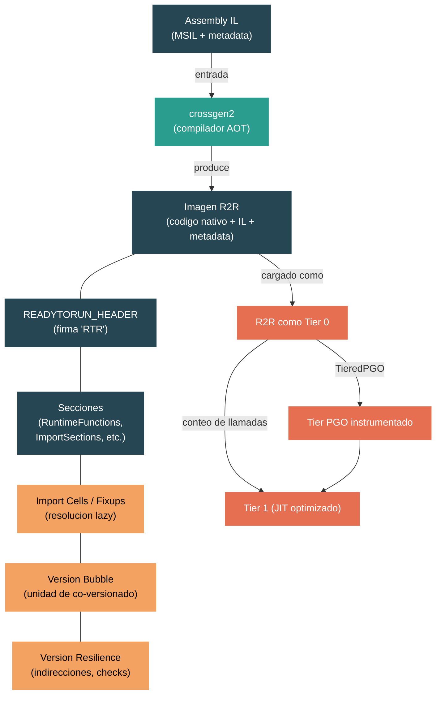

# Nivel 4: Internos — ReadyToRun (R2R) y Crossgen2

> **Perfil objetivo:** Ingeniero de runtime o especialista en rendimiento que necesita entender como .NET logra arranque rapido mediante compilacion ahead-of-time preservando version resilience
> **Esfuerzo estimado:** 6 horas
> **Prerequisitos:** [Modulo 4.3 — Compilacion JIT](04-internals-jit.md), [Modulo 4.4 — Tiered Compilation](04-internals-tiered-compilation.md)
> [English version](../en/04-internals-r2r.md)

---

## Objetivos de Aprendizaje

Al finalizar este modulo vas a poder:

1. Explicar el problema de latencia de arranque que motiva la compilacion ahead-of-time y como ReadyToRun difiere tanto del AOT tradicional como del enfoque legacy NGEN.
2. Describir el formato de archivo R2R a nivel estructural: READYTORUN_HEADER, secciones, import cells, y como el codigo nativo coexiste con IL completo y metadata dentro de un solo assembly.
3. Seguir el pipeline de compilacion de crossgen2 desde los assemblies MSIL de entrada, pasando por el analisis de dependencias, la generacion de codigo con RyuJIT, hasta la emision de la imagen R2R.
4. Articular el contrato de version resilience, incluyendo version bubbles, indirecciones cross-module, tipos de fixup, y las restricciones en el layout de value types.
5. Explicar como el codigo pre-compilado R2R participa en el pipeline de tiered compilation -- como sirve de Tier 0, cuando y como se promueve a Tier 1 optimizado, y como PGO interactua con R2R.
6. Usar `PublishReadyToRun`, imagenes composite, y propiedades MSBuild relacionadas para compilar aplicaciones con R2R y medir la mejora en el arranque.

---

## Mapa Conceptual



---

## Curriculo

### Leccion 1 — Por que compilacion Ahead-of-Time

#### Lo que vas a aprender

Cada vez que una aplicacion .NET arranca, el compilador JIT debe convertir IL a codigo nativo antes de que cualquier metodo se pueda ejecutar. Para aplicaciones grandes con miles de metodos, este "impuesto JIT" agrega latencia de arranque significativa y consumo de energia. ReadyToRun existe para pre-compilar metodos con anticipacion para que el runtime pueda ejecutar codigo nativo inmediatamente, sin esperar la compilacion JIT.

#### El problema en terminos concretos

Considera una aplicacion ASP.NET tipica. Al arrancar, el framework carga cientos de assemblies y llama miles de metodos antes de que se pueda servir la primera solicitud HTTP. Sin R2R, cada una de esas llamadas a metodos dispara la compilacion JIT. El JIT debe:

1. Parsear el stream de bytes IL
2. Construir una representacion intermedia
3. Ejecutar pasadas de optimizacion
4. Emitir codigo maquina
5. Instalar el codigo y parchear los call sites

Incluso con el modo quick-jit de Tiered Compilation (Tier 0 sin optimizar), esto agrega latencia medible. Para aplicaciones cliente, funciones en la nube y microservicios en contenedores, el tiempo de arranque afecta directamente la experiencia del usuario y los costos de cold-start.

#### Por que no simplemente usar AOT tradicional?

La compilacion ahead-of-time tradicional (como NativeAOT o compilacion C++) produce un binario nativo auto-contenido. Ese enfoque funciona bien cuando controlas toda la aplicacion, pero tiene una limitacion fundamental: **el codigo compilado es fragil**. Si cualquier dependencia cambia el layout de sus tipos, agrega un campo, o modifica una tabla de metodos virtuales, el codigo pre-compilado se invalida.

El ecosistema .NET depende del versionado independiente de librerias. Deberias poder actualizar `System.Text.Json` sin recompilar cada libreria que depende de el. El AOT tradicional no puede soportar esto -- graba en el codigo suposiciones sobre layouts exactos de tipos, offsets de vtable, y posiciones de campos.

#### NGEN vs ReadyToRun

.NET tenia una solucion anterior llamada NGEN (Native Image Generator). NGEN producia imagenes nativas, pero las trataba como un **cache** -- si algo cambiaba, toda la imagen NGEN se descartaba y regeneraba. Esto funcionaba para escenarios de escritorio pero era inadecuado para despliegue:

- Las imagenes NGEN eran especificas de la maquina y se generaban al momento de la instalacion
- No podian distribuirse en paquetes NuGet
- Cualquier actualizacion del framework invalidaba todas las imagenes NGEN

El documento de diseno en `docs/design/coreclr/botr/readytorun-overview.md` (linea 23-25) captura la distincion clave:

> A native file format carries a strong guarantee that the file will continue to run despite updates and improvements to the runtime or framework.

ReadyToRun resuelve esto produciendo imagenes nativas que son **version resilient** -- continuan funcionando incluso cuando las dependencias se actualizan, al costo de algo de overhead de indireccion para referencias cross-module.

#### Ejercicio de exploracion del codigo fuente

1. Abri `docs/design/coreclr/botr/readytorun-overview.md` y lee las secciones "Motivation" y "Problem Constraints" (lineas 1-35). Nota como el documento enmarca R2R como darle al codigo managed las caracteristicas de despliegue del codigo unmanaged.
2. Abri `src/coreclr/inc/readytorun.h` y busca la constante `READYTORUN_SIGNATURE` (`0x00525452`). Decodifica el ASCII: `R`, `T`, `R` -- "RTR" por ReadyToRun.
3. Mira los comentarios de historial de version en `readytorun.h` (lineas 27-58). Nota como los incrementos de version major indican cambios de formato incompatibles mientras que las versiones minor agregan secciones compatibles hacia atras.

---

### Leccion 2 — El formato de archivo ReadyToRun

#### Lo que vas a aprender

Un assembly R2R es un archivo PE CLI estandar con datos nativos extra injertados. Retiene el IL y metadata completos del assembly original -- lo que significa que el JIT siempre puede hacer fallback a IL para cualquier metodo que no fue pre-compilado o cuyo codigo pre-compilado es rechazado en runtime.

#### El READYTORUN_HEADER

El punto de entrada a todos los datos R2R es la estructura `READYTORUN_HEADER`, definida en `src/coreclr/inc/readytorun.h` (lineas 70-77):

```cpp
struct READYTORUN_HEADER
{
    DWORD                   Signature;      // READYTORUN_SIGNATURE (0x00525452)
    USHORT                  MajorVersion;
    USHORT                  MinorVersion;

    READYTORUN_CORE_HEADER  CoreHeader;
};
```

El `CoreHeader` contiene un campo `Flags` y `NumberOfSections`, seguido por un array ordenado de entradas `READYTORUN_SECTION`. Cada seccion tiene un `Type` (enum `ReadyToRunSectionType`) y un `IMAGE_DATA_DIRECTORY` apuntando a los datos de la seccion.

Para imagenes R2R de archivo unico, el campo `ManagedNativeHeader` del header CLI apunta a esta estructura. Para imagenes composite (multiples assemblies compilados juntos), el header se localiza mediante el simbolo de exportacion `RTR_HEADER`.

#### Secciones clave

El enum `ReadyToRunSectionType` (lineas 101-136) define las secciones. Las mas importantes:

| Seccion | Proposito |
|---------|-----------|
| `RuntimeFunctions` (102) | Mapea rangos de codigo nativo a metodos. El runtime usa esto para encontrar info de GC y handlers de excepciones para un instruction pointer dado. |
| `MethodDefEntryPoints` (103) | Vincula tokens de definicion de metodos a sus entry points nativos pre-compilados. |
| `ImportSections` (101) | Contiene "import cells" -- slots del tamano de un puntero que se resuelven lazily en runtime para apuntar a metodos, tipos, o rutinas helper externas. |
| `AvailableTypes` (108) | Una tabla hash de tipos definidos en la imagen, usada para busqueda rapida de tipos. |
| `InstanceMethodEntryPoints` (109) | Entry points para metodos genericos instanciados. |
| `ManifestMetadata` (112) | Metadata adicional para assemblies referenciados por la imagen R2R. |
| `ComponentAssemblies` (115) | En imagenes composite, apunta a sub-headers por assembly. |

#### Import sections y delay loading

La estructura `READYTORUN_IMPORT_SECTION` (lineas 187-195) es central para version resilience:

```cpp
struct READYTORUN_IMPORT_SECTION
{
    IMAGE_DATA_DIRECTORY         Section;          // Las import cells
    ReadyToRunImportSectionFlags Flags;            // Eager vs. lazy
    ReadyToRunImportSectionType  Type;             // Que tipo de imports
    BYTE                         EntrySize;
    DWORD                        Signatures;       // RVA a firmas de fixup
    DWORD                        AuxiliaryData;    // Info GC para llamadas helper
};
```

Cada import cell es un slot del tamano de un puntero. Inicialmente, las celdas eager se resuelven al cargar el modulo, mientras que las celdas lazy apuntan a un delay-load helper. Cuando el codigo nativo necesita llamar a un metodo en otro modulo, hace una llamada indirecta a traves de una import cell:

```asm
CALL [PTR_TARGET_METHOD]    ; llamada indirecta via import cell
```

La primera vez que se ejecuta, el delay-load helper resuelve el destino, parchea la celda, y transfiere el control. Las llamadas subsiguientes van directamente a traves del puntero parcheado -- una sola indireccion.

#### El fallback a IL

Como la imagen R2R retiene IL y metadata completos, el runtime siempre puede hacer fallback a compilacion JIT si:

- Un metodo no fue pre-compilado (compilacion parcial con el flag `--partial`)
- El codigo pre-compilado falla un check de version resilience al momento de la carga
- Un check de instruction set falla (el codigo fue compilado para AVX2 pero la CPU solo soporta SSE4.2)

Este fallback esta implementado en `src/coreclr/vm/prestub.cpp`. El metodo `GetPrecompiledR2RCode` (linea 466) primero intenta encontrar codigo R2R; si falla, el camino normal del JIT toma el control.

#### Ejercicio de exploracion del codigo fuente

1. Abri `src/coreclr/inc/readytorun.h` y lee las estructuras `READYTORUN_HEADER`, `READYTORUN_CORE_HEADER`, y `READYTORUN_SECTION`. Nota como el array de secciones esta ordenado por tipo para busqueda binaria.
2. Lee el enum `ReadyToRunSectionType`. Conta cuantas secciones se han agregado a traves de las versiones -- nota como cada adicion solo incrementa la version minor, preservando compatibilidad hacia atras.
3. Abri `src/coreclr/vm/readytoruninfo.cpp` y lee `ReadyToRunCoreInfo::FindSection` (linea 74). Realiza un recorrido lineal del array ordenado de secciones. Considera por que un recorrido lineal es aceptable aca (pista: tipicamente hay menos de 20 secciones).
4. Abri `src/coreclr/vm/readytoruninfo.h` y examina la clase `ReadyToRunCoreInfo` (lineas 27-49). Nota el flag `m_fForbidLoadILBodyFixups` -- esto previene que se procesen nuevos fixups despues de cierto punto en la carga.

---

### Leccion 3 — Arquitectura de Crossgen2

#### Lo que vas a aprender

Crossgen2 es la herramienta que produce imagenes R2R. Es una aplicacion managed escrita en C# que usa RyuJIT como su backend de generacion de codigo. Entender su arquitectura te ayuda a razonar sobre que optimizaciones son posibles en tiempo AOT y cuales deben diferirse al runtime.

#### El pipeline de compilacion

El punto de entrada de crossgen2 es `src/coreclr/tools/aot/crossgen2/Program.cs`. La interfaz de linea de comandos esta definida en `Crossgen2RootCommand.cs`, que expone un conjunto rico de opciones incluyendo:

- `--composite`: Compilar multiples assemblies en una sola imagen R2R
- `--inputbubble`: Definir un version bubble que abarca multiples assemblies
- `--opt-cross-module`: Habilitar inlining cross-module selectivo
- `--partial`: Solo compilar metodos para los cuales todas las restricciones de version resilience se pueden satisfacer
- `--resilient`: Continuar la compilacion incluso si algunos metodos fallan

La compilacion es orquestada por `ReadyToRunCodegenCompilation` en `src/coreclr/tools/aot/ILCompiler.ReadyToRun/Compiler/ReadyToRunCodegenCompilation.cs`. El pipeline procede asi:

1. **Carga de entrada**: Los assemblies MSIL y sus referencias se cargan en el sistema de tipos
2. **Determinacion de raices**: Se establecen las raices de compilacion -- todos los metodos en los assemblies de entrada (o un subconjunto basado en datos de perfil)
3. **Analisis de dependencias**: Un analizador de dependencias basado en grafos camina desde las raices, descubriendo todos los metodos, tipos, y fixups necesarios
4. **Compilacion**: Cada metodo se compila con RyuJIT a codigo nativo, con referencias cross-module codificadas como fixups en vez de direcciones directas
5. **Emision**: El codigo nativo, tablas de fixup, info de GC, tablas de excepciones, e info de debug se ensamblan en la imagen R2R de salida

#### El grafo de dependencias

Crossgen2 usa un framework de analisis de dependencias (`ILCompiler.DependencyAnalysisFramework`) para determinar que debe incluirse en la salida. Cuando RyuJIT compila un metodo, reporta dependencias: "este metodo llama a ese metodo", "este codigo referencia ese tipo", "este metodo necesita un fixup para ese offset de campo".

El `ReadyToRunCodegenNodeFactory` en `src/coreclr/tools/aot/ILCompiler.ReadyToRun/Compiler/DependencyAnalysis/ReadyToRunCodegenNodeFactory.cs` crea los nodos del grafo. Cada metodo compilado se convierte en un nodo `MethodWithGCInfo`. Cada referencia externa se convierte en un nodo de import en la seccion de import apropiada.

#### Grupos de modulos de compilacion

La clase `ReadyToRunCompilationModuleGroupBase` en `src/coreclr/tools/aot/ILCompiler.ReadyToRun/Compiler/ReadyToRunCompilationModuleGroupBase.cs` determina que esta "adentro" y que esta "afuera" de la unidad de compilacion. Esta decision determina:

- Si una llamada a metodo puede ser directa o debe pasar por una import cell
- Si el layout de un tipo se puede asumir fijo o necesita un check en runtime
- Si el inlining a traves de limites de modulo esta permitido

El metodo `GetReadyToRunFlags()` (linea 140) establece flags como `READYTORUN_FLAG_MultiModuleVersionBubble` y `READYTORUN_FLAG_UnrelatedR2RCode` basandose en la configuracion de compilacion.

#### RyuJIT como backend

Crossgen2 no tiene su propio generador de codigo. Aloja RyuJIT (el mismo compilador JIT usado en runtime) a traves de la capa `JitInterface` en `src/coreclr/tools/aot/ILCompiler.ReadyToRun/JitInterface/`. La diferencia critica con la compilacion JIT en runtime es que la interfaz JIT de crossgen2 responde preguntas de manera diferente:

- "Cual es el offset de este campo?" -- Para tipos cross-bubble, la respuesta es "No se; emiti un fixup."
- "Puedo hacer inline de este metodo?" -- Para metodos cross-bubble sin `[NonVersionable]`, la respuesta es "No."
- "Cual es el slot de vtable para esta virtual?" -- Para virtuales cross-bubble, la respuesta es "Usa un fixup."

Aca es donde se impone version resilience en tiempo de compilacion: la interfaz JIT previene que el generador de codigo grabe suposiciones que podrian no cumplirse en runtime.

#### Ejercicio de exploracion del codigo fuente

1. Abri `src/coreclr/tools/aot/crossgen2/Crossgen2RootCommand.cs` y navega la lista completa de opciones de linea de comandos. Nota opciones como `--inputbubble`, `--composite`, `--compilebubblegenerics`, y `--resilient`. Considera que implica cada una sobre la estrategia de compilacion.
2. Lista los archivos en `src/coreclr/tools/aot/ILCompiler.ReadyToRun/Compiler/`. Identifica las clases que contienen "ReadyToRun" en su nombre -- cada una representa un aspecto distinto del proceso de compilacion AOT.
3. Abri `src/coreclr/tools/aot/ILCompiler.ReadyToRun/Compiler/ReadyToRunCompilationModuleGroupBase.cs` y busca el metodo `GetReadyToRunFlags()`. Segui como los flags se determinan a partir de la configuracion de compilacion.
4. Lista los archivos en `src/coreclr/tools/aot/ILCompiler.ReadyToRun/Compiler/DependencyAnalysis/ReadyToRun/`. Este directorio contiene los tipos de nodo que componen el grafo de dependencias R2R.

---

### Leccion 4 — Version Resilience

#### Lo que vas a aprender

Version resilience es la caracteristica definitoria de ReadyToRun. Es lo que separa a R2R de la compilacion AOT tradicional. Esta leccion explora los mecanismos que permiten que el codigo nativo pre-compilado continue funcionando incluso cuando los tipos y metodos de los que depende cambian entre el momento de compilacion y el runtime.

#### El problema fundamental

Cuando el JIT compila codigo en runtime, tiene informacion perfecta: conoce el layout exacto de cada tipo, el offset exacto de cada campo, el slot de vtable exacto de cada metodo virtual. Puede hacer inline de metodos, desvirtualizar llamadas, y computar constantes. Toda esta informacion es actual porque viene de la misma sesion de runtime.

El codigo R2R se compila con anticipacion, potencialmente contra una version diferente de sus dependencias que la presente en runtime. Si `System.Text.Json` agrega un campo privado a una clase interna, o si `System.Collections` cambia el layout de vtable de una coleccion generica, el codigo R2R debe seguir funcionando correctamente.

#### Version bubbles

El concepto de **version bubble** es la herramienta principal para manejar la tension entre rendimiento y resiliencia. Un version bubble es un conjunto de assemblies que se garantiza que se actualizan juntos como una unidad.

Dentro de un version bubble, el compilador puede hacer todas las mismas suposiciones que haria el JIT: llamadas directas, metodos inlined, offsets de campos conocidos. A traves de version bubbles, cada suposicion debe pasar por una indireccion o un check en runtime.

El documento de descripcion general (`docs/design/coreclr/botr/readytorun-overview.md`, lineas 97-109) establece el principio clave:

> Code of methods and types that do NOT span version bubbles does NOT pay a performance penalty.

En la practica, el SDK de .NET en si es un unico version bubble -- todos los assemblies del framework (`System.Runtime`, `System.Collections`, `System.Net.Http`, etc.) se compilan juntos. El codigo de la aplicacion tipicamente esta en un version bubble separado del framework.

#### Tipos de fixup

Cuando el codigo R2R necesita referenciar algo fuera de su version bubble, usa un **fixup**. El enum `ReadyToRunFixupKind` en `src/coreclr/inc/readytorun.h` (lineas 249-315) define cada tipo de fixup:

```cpp
enum ReadyToRunFixupKind
{
    READYTORUN_FIXUP_TypeHandle              = 0x10,
    READYTORUN_FIXUP_MethodEntry             = 0x13,
    READYTORUN_FIXUP_FieldHandle             = 0x12,
    READYTORUN_FIXUP_VirtualEntry            = 0x16,
    READYTORUN_FIXUP_NewObject               = 0x1C,
    READYTORUN_FIXUP_FieldBaseOffset         = 0x26,
    READYTORUN_FIXUP_FieldOffset             = 0x27,
    READYTORUN_FIXUP_Check_TypeLayout        = 0x2A,
    READYTORUN_FIXUP_Check_FieldOffset       = 0x2B,
    READYTORUN_FIXUP_Check_VirtualFunctionOverride = 0x33,
    // ... muchos mas
};
```

Cada tipo de fixup representa un tipo diferente de referencia cross-bubble. Algunos ejemplos:

- **`MethodEntry`**: "Necesito un puntero al metodo X." Se resuelve lazily via el delay-load helper.
- **`FieldBaseOffset`**: "Necesito el tamano base de la clase Y para poder acceder a campos en una subclase." Se resuelve eagerly al cargar la imagen a un valor `uint32`.
- **`Check_TypeLayout`**: "Verifica que el tipo Z tiene el mismo layout (tamano, alineacion, mapa GC) que cuando compile este codigo. Si no, descarta mi codigo pre-compilado para los metodos que dependen de este tipo."
- **`Verify_TypeLayout`**: Similar a `Check_TypeLayout`, pero un mismatch causa una falla dura en runtime en vez de un fallback silencioso al JIT.

Los fixups `Check_` son particularmente interesantes. Implementan una estrategia de "confia pero verifica": el compilador genera codigo asumiendo un layout particular, pero embebe un check que el runtime valida al momento de la carga. Si el check falla, el codigo pre-compilado para ese metodo se rechaza y el runtime hace fallback a compilacion JIT.

#### Patron de acceso a campos cross-bubble

El documento de descripcion general describe el codigo generado para acceder a un campo a traves de un version bubble (`docs/design/coreclr/botr/readytorun-overview.md`, lineas 179-186):

```asm
MOV TMP, [SIZE_OF_BASECLASS]                   ; cargar tamano de clase base desde celda de fixup
MOV EAX, [RCX + TMP + subfield_OffsetInSubClass] ; acceder campo con offset dinamico

.data
SIZE_OF_BASECLASS: UINT32  ; rellenado al momento de carga con el tamano real de la clase base
```

Esto es una instruccion extra comparado con la version compilada por JIT (que tendria un offset constante en tiempo de compilacion). El costo extra es minimo -- menos del 1% incluso en loops ajustados -- y es un excelente candidato para CSE (eliminacion de subexpresiones comunes) cuando se acceden multiples campos de la misma clase.

#### Llamadas a metodos cross-bubble

Para llamadas no-virtuales cross-bubble, el patron es una llamada indirecta a traves de una import cell:

```asm
CALL [PTR_TARGET_METHOD]     ; llamada indirecta via import cell resuelta lazily

.data
PTR_TARGET_METHOD: PTR = DELAY_LOAD_HELPER  ; inicialmente apunta al resolver
```

En la primera llamada, el delay-load helper resuelve el metodo destino, parchea la import cell con la direccion real, y transfiere el control. Todas las llamadas subsiguientes pasan por una sola indireccion de puntero -- identico al costo de rendimiento de llamar a una funcion DLL en codigo unmanaged.

#### Despacho virtual: VSD y version resilience

Para llamadas a metodos virtuales a traves de version bubbles, R2R usa Virtual Stub Dispatch (VSD). VSD asigna una import cell **por call site** en vez de por destino. La celda inicialmente apunta a un stub de lookup, que se especializa progresivamente:

1. Primera llamada: stub de lookup generico, resuelve el destino, parchea la celda a un stub monomorfico
2. Stub monomorfico: verifica el tipo de `this`, despacha directamente si coincide, hace fallback a lookup polimorfico si no
3. Stub polimorfico: usa una tabla hash para multiples tipos

VSD es naturalmente version resilient porque nunca asume un layout de vtable fijo. El documento de descripcion general nota (linea 286):

> Interface dispatch is version resilient with no performance penalty.

#### Restricciones de value types

Los value types (structs) presentan el desafio de versionado mas dificil porque se "inlinean" dondequiera que se usan. La especificacion R2R introduce una restriccion mas alla de lo que IL permite (`docs/design/coreclr/botr/readytorun-overview.md`, lineas 84-86):

> It is a breaking change to change the number or type of any (including private) fields of a public value type (struct).

Esta restriccion existe porque el layout del struct esta grabado en la convencion de llamada, el layout del stack frame, y la asignacion de registros de cualquier codigo que usa el struct. Hacer esto resiliente requeriria indirigir cada acceso al struct, lo que negaria el beneficio de rendimiento de usar structs en primer lugar.

#### El camino de resolucion de fixups en runtime

Cuando el runtime carga un modulo R2R, el procesamiento de fixups ocurre en `src/coreclr/vm/prestub.cpp`. La funcion `DynamicHelperFixup` (linea 3257) maneja la resolucion retrasada de fixups:

```cpp
PCODE DynamicHelperFixup(TransitionBlock * pTransitionBlock,
                          TADDR * pCell,
                          DWORD sectionIndex,
                          Module * pModule,
                          ReadyToRunFixupKind * pKind, ...)
```

Lee la firma de fixup de la import section, decodifica el tipo y destino, resuelve el destino a traves del sistema de tipos, y parchea la import cell. El `ReadyToRunFixupKind` determina que accion tomar: cargar un type handle, resolver un entry point de metodo, computar un offset de campo, o verificar una suposicion de layout.

#### Ejercicio de exploracion del codigo fuente

1. Abri `src/coreclr/inc/readytorun.h` y lee el enum `ReadyToRunFixupKind` completo (lineas 249-315). Nota el patron de fixups `Check_*` vs `Verify_*`. Considera cuando usarias cada uno: `Check_` para degradacion elegante, `Verify_` para capturar cambios de ruptura incompatibles.
2. Abri `src/coreclr/vm/prestub.cpp` y busca `DynamicHelperFixup` (linea 3257). Lee el switch statement que maneja diferentes tipos de fixup. Nota como los fixups de campo, metodo, y tipo tienen caminos de resolucion distintos.
3. Lee `docs/design/coreclr/botr/readytorun-overview.md`, secciones sobre "Instance Field access" (linea 171) y "Non-Virtual Method Calls" (linea 215). Presta atencion al analisis de rendimiento para cada patron de indireccion.
4. Abri `src/coreclr/vm/readytoruninfo.h` y busca la clase `VersionResilientStringHash` (linea 113). Esta implementacion de hash especializada se usa para busquedas de tipos y metodos en imagenes R2R -- debe producir hashes identicos a traves de diferentes versiones del runtime.

---

### Leccion 5 — Interaccion de R2R con Tiered Compilation

#### Lo que vas a aprender

ReadyToRun y Tiered Compilation son funcionalidades complementarias. R2R provee codigo inicial rapido, y Tiered Compilation lo reemplaza con codigo JIT optimizado para metodos calientes. Entender su interaccion es esencial para razonar sobre el rendimiento de la aplicacion desde el arranque hasta el estado estable.

#### R2R como Tier 0

Cuando el runtime carga un metodo desde una imagen R2R, el codigo pre-compilado sirve como el codigo inicial del metodo -- efectivamente reemplazando el quick-jit Tier 0 que normalmente se generaria. El metodo `GetPrecompiledR2RCode` en `src/coreclr/vm/prestub.cpp` (linea 466) maneja esta busqueda:

```cpp
PCODE MethodDesc::GetPrecompiledR2RCode(PrepareCodeConfig* pConfig)
{
    PCODE pCode = (PCODE)NULL;
    Module * pModule = GetModule();
    if (pModule->IsReadyToRun())
    {
        pCode = pModule->GetReadyToRunInfo()->GetEntryPoint(this, pConfig, TRUE);
    }
    // ... fallback de busqueda de genericos ...
    return pCode;
}
```

Si se encuentra codigo R2R, se usa directamente. Si no, el metodo cae al camino de compilacion JIT.

#### Finalizacion del tier de optimizacion

La funcion `FinalizeOptimizationTierForTier0Load` en `prestub.cpp` (linea 1261) determina como el codigo R2R encaja en el pipeline de tiering:

```cpp
bool PrepareCodeConfig::FinalizeOptimizationTierForTier0Load()
{
    switch (GetCodeVersion().GetOptimizationTier())
    {
        case NativeCodeVersion::OptimizationTier0:
            break;  // Caso normal: se promovera

        case NativeCodeVersion::OptimizationTierOptimized:
            shouldTier = false;  // Codigo R2R es final
            break;

        case NativeCodeVersion::OptimizationTier0Instrumented:
            // Ajustar de vuelta -- codigo R2R no esta instrumentado
            GetCodeVersion().SetOptimizationTier(NativeCodeVersion::OptimizationTier0);
            break;
    }
    // ...
}
```

En el caso comun, el codigo R2R comienza en `OptimizationTier0` y es elegible para promocion. El runtime instala contadores de llamadas igual que lo haria para codigo JIT-compilado en Tier 0. Cuando un metodo se vuelve "caliente" (su contador de llamadas alcanza el umbral), se encola para recompilacion en un tier superior.

#### R2R con PGO (Profile-Guided Optimization)

Cuando TieredPGO esta habilitado, la interaccion se vuelve mas matizada. El codigo en `src/coreclr/vm/tieredcompilation.cpp` (linea 273) muestra el manejo especial:

```cpp
if (ExecutionManager::IsReadyToRunCode(currentNativeCodeVersion.GetNativeCode()))
{
    // Definitivamente no queremos usar tier instrumentado sin optimizar para R2R caliente:
    // 1) Producira muchas compilaciones nuevas para metodos pequenos inlined en R2R
    // 2) Regresion de rendimiento notable de R2R rapido a Tier0 instrumentado lento
    nextTier = NativeCodeVersion::OptimizationTier1Instrumented;
}
```

Para metodos R2R, el runtime salta el tier instrumentado sin optimizar (Tier 0 Instrumented) y va directamente a Tier 1 Instrumented. La justificacion es pragmatica:

1. El codigo R2R ya esta optimizado a un grado razonable -- caer a codigo instrumentado sin optimizar seria una regresion visible
2. Las imagenes R2R frecuentemente inlinean metodos helper pequenos; el tier sin optimizar necesitaria re-expandir esos inlines, disparando muchas compilaciones nuevas
3. El codigo Tier 1 Instrumented es mas costoso de compilar pero se ejecuta mucho mas rapido que Tier 0 Instrumented

El camino completo de tiering para un metodo R2R con PGO habilitado es:

```
Codigo R2R (Tier 0) -> Tier 1 Instrumented -> Tier 1 Optimized (con datos PGO)
```

Sin PGO:

```
Codigo R2R (Tier 0) -> Tier 1 Optimized
```

#### Metodos que optan por no participar en tiering

Algunos metodos R2R pueden marcarse como `OptimizationTierOptimized`, significando que el codigo R2R se considera final y no ocurre mas tiering. Esto se usa para metodos donde el codigo R2R ya esta totalmente optimizado (por ejemplo, dentro de un unico version bubble donde todas las optimizaciones fueron posibles en tiempo de compilacion) o donde re-JITear no proveeria ningun beneficio.

#### Busqueda de metodos genericos

R2R maneja los genericos de manera especial. La funcion `GetPrecompiledR2RCode` muestra una busqueda en multiples pasos:

1. Verificar el modulo propio del metodo buscando codigo R2R
2. Para instanciaciones genericas, verificar una "ubicacion generica alternativa" computada a partir del primer argumento generico (aca es donde crossgen2 coloca codigo generico cross-module)
3. Verificar la lista enlazada de "modulos R2R no relacionados" -- modulos que contienen instanciaciones genericas no asociadas naturalmente con ningun assembly particular

Esta busqueda en tres pasos es necesaria porque un metodo generico como `List<MiTipo>.Add()` podria ser compilado en la imagen R2R del assembly de `MiTipo` en vez del assembly de `System.Collections`.

#### Ejercicio de exploracion del codigo fuente

1. Lee `src/coreclr/vm/prestub.cpp`, funcion `GetPrecompiledR2RCode` (linea 466). Segui la busqueda generica en tres pasos. Considera por que existe la lista de "modulos R2R no relacionados" y que implica para el tiempo de arranque.
2. Lee `FinalizeOptimizationTierForTier0Load` (linea 1261 en prestub.cpp). Nota el caso `OptimizationTier0Instrumented` -- ajusta de vuelta a Tier 0 normal porque el codigo R2R no esta instrumentado.
3. Abri `src/coreclr/vm/tieredcompilation.cpp` y busca la logica de seleccion de tier PGO especifica para R2R (alrededor de linea 273). Segui el arbol de decision: que tier se selecciona para metodos R2R vs. metodos solo-IL?
4. Busca `IsEligibleForTieredCompilation` en `src/coreclr/vm/method.cpp` (alrededor de linea 3051). Nota que el check de elegibilidad difiere cuando el modulo del metodo es R2R.

---

### Leccion 6 — Compilando con ReadyToRun

#### Lo que vas a aprender

Ahora que entendes el formato, el compilador, y el soporte de runtime, esta leccion cubre el lado practico: como producir imagenes R2R, cuando usar imagenes composite, y como medir el impacto.

#### PublishReadyToRun

La forma mas simple de habilitar R2R es la propiedad MSBuild `PublishReadyToRun`:

```xml
<PropertyGroup>
    <PublishReadyToRun>true</PublishReadyToRun>
</PropertyGroup>
```

O en la linea de comandos:

```bash
dotnet publish -c Release -p:PublishReadyToRun=true
```

Esto invoca crossgen2 durante el paso de publicacion. El SDK pasa los assemblies de la aplicacion a crossgen2 junto con todos los assemblies del framework referenciados. La salida reemplaza los assemblies IL originales con versiones R2R que contienen tanto codigo nativo como el IL original.

La integracion de build esta definida en `eng/testing/tests.readytorun.targets` en este repositorio. Para la integracion publica del SDK, la propiedad `PublishReadyToRun` dispara la invocacion de crossgen2 como un paso de publicacion.

#### Imagenes composite

Por defecto, crossgen2 compila cada assembly independientemente (modo de archivo unico). Con `--composite`, multiples assemblies se compilan en un solo binario R2R. Esto habilita optimizaciones cross-module dentro del composite:

```bash
crossgen2 --composite -o output.dll assembly1.dll assembly2.dll assembly3.dll
```

Las imagenes composite tratan todos los assemblies de entrada como un unico version bubble. Esto significa:

- El inlining cross-module es posible entre los assemblies componentes
- Las llamadas directas reemplazan las indirecciones de import cell
- Los offsets de campos se pueden hardcodear
- Los checks de layout de tipo son innecesarios

La contrapartida es que todos los assemblies componentes deben actualizarse juntos. Si alguno cambia, todo el composite debe recompilarse.

En el SDK, podes habilitar el modo composite con:

```xml
<PropertyGroup>
    <PublishReadyToRun>true</PublishReadyToRun>
    <PublishReadyToRunComposite>true</PublishReadyToRunComposite>
</PropertyGroup>
```

#### Opciones de crossgen2 para escenarios avanzados

El archivo `Crossgen2RootCommand.cs` revela varias opciones avanzadas:

- **`--inputbubble`**: Extiende el version bubble para incluir assemblies referenciados. Los metodos en assemblies de entrada pueden optimizarse contra assemblies referenciados como si estuvieran en el mismo modulo.
- **`--compilebubblegenerics`**: Compilar instanciaciones genericas que involucran tipos de multiples modulos dentro del bubble. Sin esto, los genericos cross-module se difieren al JIT.
- **`--opt-cross-module`**: Habilitar inlining cross-module para assemblies especificos. Toma una lista de nombres de assembly cuyos metodos pueden ser inlined.
- **`--partial`**: Solo compilar metodos para los cuales todas las restricciones de version resilience se pueden satisfacer. Los metodos con dependencias irresolubles se dejan como IL. Este es el valor por defecto para assemblies del framework.
- **`--embed-pgo-data`**: Embeber datos de profile-guided optimization (de archivos MIBC) en la imagen R2R. El runtime usa esto para tomar mejores decisiones de tiering.
- **`--hot-cold-splitting`**: Dividir cuerpos de metodos en partes hot y cold. El codigo hot se coloca junto para mejor utilizacion de la cache de instrucciones.

#### Midiendo el impacto

Para medir la mejora de arranque con R2R, usa el siguiente enfoque:

1. **Linea base**: Publicar sin R2R y medir tiempo de arranque
   ```bash
   dotnet publish -c Release -o out-nor2r
   time ./out-nor2r/MyApp
   ```

2. **R2R**: Publicar con R2R y medir
   ```bash
   dotnet publish -c Release -p:PublishReadyToRun=true -o out-r2r
   time ./out-r2r/MyApp
   ```

3. **R2R Composite**: Publicar con modo composite
   ```bash
   dotnet publish -c Release -p:PublishReadyToRun=true -p:PublishReadyToRunComposite=true -o out-composite
   time ./out-composite/MyApp
   ```

Para medicion mas precisa, usa `dotnet-trace` para capturar eventos:

```bash
dotnet-trace collect --providers Microsoft-Windows-DotNETRuntime:0x4000080018:5 -- ./out-r2r/MyApp
```

Los eventos `JitCompilationStart` van a mostrar cuantos metodos todavia se estan JIT-compilando durante el arranque. Con R2R, este numero deberia caer dramaticamente -- idealmente a cerca de cero para los assemblies del framework.

Metricas clave para comparar:
- **Tiempo a la primera solicitud** (para aplicaciones web)
- **Numero de compilaciones JIT durante arranque** (via eventos `JitCompilationStart`)
- **Tamano de assembly** (las imagenes R2R son mas grandes porque contienen tanto codigo nativo como IL)
- **Working set** (el codigo R2R se mapea en memoria, asi que solo las paginas tocadas se cargan)

#### Compromisos de tamano

Las imagenes R2R son significativamente mas grandes que los assemblies solo-IL porque contienen tanto el IL/metadata original como el codigo nativo pre-compilado. Incrementos tipicos de tamano son 2-3x. Para despliegues sensibles al tamano:

- Usa `--partial` para solo pre-compilar metodos calientes (guiado por datos PGO)
- Usa `--strip-debug-info` para remover informacion de debug de la imagen R2R
- Considera el modo composite, que puede compartir codigo helper entre assemblies

#### Ejercicio de exploracion del codigo fuente

1. Abri `eng/testing/tests.readytorun.targets` y lee como la infraestructura de testing invoca crossgen2.
2. Abri `src/coreclr/tools/aot/crossgen2/Crossgen2RootCommand.cs` y estudia las opciones `--composite`, `--inputbubble`, y `--partial`. Considera como estas opciones se mapean a los conceptos de version bubble de la Leccion 4.
3. Compila una aplicacion de consola pequena con y sin `PublishReadyToRun`. Compara los tamanos de archivo de los assemblies de salida. Usa `dotnet-trace` o `DOTNET_JitDisasm` para verificar que los metodos del framework no se estan JIT-compilando en el caso R2R.
4. Si tenes este repositorio compilado, proba ejecutar crossgen2 directamente en un solo assembly:
   ```bash
   dotnet src/coreclr/tools/aot/crossgen2/crossgen2.dll --reference <framework-dlls> -o output.dll input.dll
   ```

---

## Resumen

ReadyToRun resuelve el problema de latencia de arranque de la compilacion JIT pre-compilando metodos con anticipacion mientras preserva la capacidad de actualizar librerias independientemente. Las decisiones arquitecturales clave son:

1. **Retener IL y metadata completos** en la imagen de salida, habilitando fallback JIT para cualquier metodo
2. **Usar indirecciones (import cells)** para todas las referencias cross-version-bubble, con resolucion lazy via delay-load helpers
3. **Embeber fixups de verificacion** (`Check_*` y `Verify_*`) que validan suposiciones de tiempo de compilacion en runtime
4. **Tratar a los version bubbles como el limite de optimizacion** -- codigo dentro de un bubble no paga overhead de resiliencia; codigo cruzando bubbles paga una indireccion por referencia
5. **Integrarse con tiered compilation** para que el codigo R2R sirva como un tier inicial rapido, con el JIT produciendo reemplazos optimizados para metodos calientes

La herramienta crossgen2 implementa esto alojando RyuJIT en un contexto AOT, donde la interfaz JIT impone version resilience negandose a responder preguntas sobre tipos cross-bubble. El resultado es un formato que le da al codigo managed las caracteristicas de despliegue del codigo unmanaged: directamente ejecutable, actualizable independientemente, y claramente definido.

---

## Referencia Rapida

| Concepto | Ubicacion en el Codigo Fuente |
|----------|-------------------------------|
| Estructura del header R2R | `src/coreclr/inc/readytorun.h` (lineas 60-77) |
| Enum de tipos de seccion | `src/coreclr/inc/readytorun.h` (lineas 101-136) |
| Enum de tipos de fixup | `src/coreclr/inc/readytorun.h` (lineas 249-315) |
| Info R2R en runtime | `src/coreclr/vm/readytoruninfo.h`, `readytoruninfo.cpp` |
| Busqueda de codigo R2R | `src/coreclr/vm/prestub.cpp`, `GetPrecompiledR2RCode` (linea 466) |
| Resolucion de fixups | `src/coreclr/vm/prestub.cpp`, `DynamicHelperFixup` (linea 3257) |
| Seleccion de tier para R2R | `src/coreclr/vm/tieredcompilation.cpp` (linea 273) |
| Punto de entrada de crossgen2 | `src/coreclr/tools/aot/crossgen2/Program.cs` |
| Opciones CLI de crossgen2 | `src/coreclr/tools/aot/crossgen2/Crossgen2RootCommand.cs` |
| Orquestacion de compilacion | `src/coreclr/tools/aot/ILCompiler.ReadyToRun/Compiler/ReadyToRunCodegenCompilation.cs` |
| Logica de grupo de modulos | `src/coreclr/tools/aot/ILCompiler.ReadyToRun/Compiler/ReadyToRunCompilationModuleGroupBase.cs` |
| Diseno del formato R2R | `docs/design/coreclr/botr/readytorun-overview.md` |
| Especificacion del formato R2R | `docs/design/coreclr/botr/readytorun-format.md` |

---

## Lecturas Adicionales

- [ReadyToRun Overview (BOTR)](../../docs/design/coreclr/botr/readytorun-overview.md) -- El documento de diseno cubriendo motivacion, filosofia de version resilience, y estrategias de generacion de codigo
- [ReadyToRun Format (BOTR)](../../docs/design/coreclr/botr/readytorun-format.md) -- La especificacion detallada del formato binario
- [Modelo de Compilacion Crossgen2](../../docs/design/coreclr/botr/ilc-architecture.md) -- Arquitectura del pipeline de compilacion ILC/crossgen2
- [Dynamic PGO y Tiers Instrumentados](../../docs/design/features/DynamicPgo-InstrumentedTiers.md) -- Como PGO interactua con el tiering de R2R
