# Nivel 4: Internos -- Internos del Thread Pool y Work Stealing

> **Perfil objetivo:** Desarrollador que quiere entender como el thread pool de .NET decide cuantos threads ejecutar, como fluyen los work items a traves de las colas, y como el algoritmo de hill climbing encuentra el conteo optimo de threads usando procesamiento de senales
> **Esfuerzo estimado:** 6 horas
> **Prerequisitos:** [Modulo 3.4 -- Primitivas de Threading](03-advanced-threading.md), [Modulo 2.3 -- Async/Await](02-practitioner-async-await.md)
> [English version](../en/04-internals-threadpool.md)

---

## Objetivos de Aprendizaje

Al finalizar este modulo seras capaz de:

1. Describir la arquitectura de `PortableThreadPool` -- como se crean, gestionan y retiran los worker threads, incluyendo el rol del gate thread y el semaforo LIFO.
2. Explicar el diseno de colas de dos niveles: la cola global basada en `ConcurrentQueue` y las colas locales `WorkStealingQueue` por thread, incluyendo la ruta rapida de enqueue y el orden de prioridad del dequeue.
3. Trazar el algoritmo de work stealing paso a paso -- como un thread inactivo elige un indice aleatorio y roba del head de la deque local de otro thread mientras el dueno hace pop desde el tail.
4. Explicar como el algoritmo de hill climbing usa analisis de Fourier (el algoritmo de Goertzel) para extraer una senal del ruido del throughput, y como ajusta el conteo de threads basandose en la relacion de fase entre las ondas de conteo de threads y las ondas de throughput.
5. Describir como la IO completion se integra con el thread pool en Windows (IO completion ports, poller threads) y como los callbacks asincrono vuelven a entrar al work queue.
6. Usar las variables de entorno `DOTNET_ThreadPool_*` y `dotnet-counters` para monitorear y ajustar el comportamiento del thread pool en produccion.

---

## Mapa Conceptual

```mermaid
graph TD
    classDef concept fill:#264653,stroke:#264653,color:#ffffff
    classDef source fill:#2a9d8f,stroke:#2a9d8f,color:#ffffff
    classDef tool fill:#e76f51,stroke:#e76f51,color:#ffffff
    classDef perf fill:#e9c46a,stroke:#e9c46a,color:#000000

    TP["PortableThreadPool<br/>(singleton)"]:::concept
    WORKER["WorkerThread<br/>(thread administrado)"]:::concept
    GATE["GateThread<br/>(deteccion de inanicion)"]:::concept
    HC["HillClimbing<br/>(ajuste basado en senales)"]:::concept
    TC["ThreadCounts<br/>(estado empaquetado en ulong)"]:::concept
    WQ["ThreadPoolWorkQueue<br/>(hub de despacho)"]:::concept
    GQ["Cola Global<br/>(ConcurrentQueue)"]:::concept
    LQ["WorkStealingQueue<br/>(deque por thread)"]:::concept
    WSL["WorkStealingQueueList<br/>(arreglo de deques)"]:::concept
    ITEM["IThreadPoolWorkItem<br/>(interfaz Execute)"]:::concept
    SEM["LowLevelLifoSemaphore<br/>(orden de despertar LIFO)"]:::concept
    IO["IOCompletionPoller<br/>(IOCP en Windows)"]:::concept
    BLOCK["Ajuste de Bloqueo<br/>(bloqueo cooperativo)"]:::concept

    PTP_CS["PortableThreadPool.cs"]:::source
    WT_CS["PortableThreadPool.WorkerThread.cs"]:::source
    GT_CS["PortableThreadPool.GateThread.cs"]:::source
    HC_CS["PortableThreadPool.HillClimbing.cs"]:::source
    WQ_CS["ThreadPoolWorkQueue.cs"]:::source
    IO_CS["PortableThreadPool.IO.Windows.cs"]:::source

    COUNTERS["dotnet-counters<br/>(metricas del pool)"]:::tool
    TRACE["dotnet-trace<br/>(eventos ThreadPool)"]:::tool
    ENV["DOTNET_ThreadPool_*<br/>(config por entorno)"]:::tool

    TP --> WORKER
    TP --> GATE
    TP --> HC
    TP --> TC
    TP --> IO
    TP --> BLOCK
    WORKER --> SEM
    WORKER --> WQ
    WQ --> GQ
    WQ --> LQ
    WQ --> WSL
    LQ --> ITEM
    GQ --> ITEM
    GATE --> HC

    TP --- PTP_CS
    WORKER --- WT_CS
    GATE --- GT_CS
    HC --- HC_CS
    WQ --- WQ_CS
    IO --- IO_CS

    TP --- COUNTERS
    TP --- TRACE
    TP --- ENV
```



---

## Vista General de la Arquitectura

El thread pool de .NET no es un simple "conjunto fijo de threads." Es un sistema dinamico y auto-ajustable construido a partir de varios componentes cooperantes:

| Componente | Archivo | Responsabilidad |
|---|---|---|
| `PortableThreadPool` | `PortableThreadPool.cs` | Singleton que posee todo el estado: conteo de threads, min/max threads, utilizacion de CPU. |
| `WorkerThread` | `PortableThreadPool.WorkerThread.cs` | Crea threads del SO, ejecuta el bucle de despacho, gestiona timeouts y salida. |
| `GateThread` | `PortableThreadPool.GateThread.cs` | Thread periodico de fondo (500 ms) para deteccion de inanicion y medicion de CPU. |
| `HillClimbing` | `PortableThreadPool.HillClimbing.cs` | Algoritmo basado en teoria de senales que ajusta `NumThreadsGoal`. |
| `ThreadCounts` | `PortableThreadPool.ThreadCounts.cs` | `ulong` empaquetado con tres campos: `NumProcessingWork`, `NumExistingThreads`, `NumThreadsGoal`. |
| `ThreadPoolWorkQueue` | `ThreadPoolWorkQueue.cs` | Hub de despacho: colas globales, deques locales, work stealing, el bucle `Dispatch()`. |
| `IOCompletionPoller` | `PortableThreadPool.IO.Windows.cs` | Integracion con IOCP de Windows para IO completion asincrono. |

*Todos los archivos estan bajo `src/libraries/System.Private.CoreLib/src/System/Threading/`.*

---

## Curriculo

### Leccion 1 -- Arquitectura del Thread Pool

#### Que vas a aprender

Como `PortableThreadPool` esta estructurado como singleton, como se crean y retiran los worker threads, y el rol del semaforo LIFO y el gate thread.

#### El concepto

El portable thread pool (la implementacion administrada usada por .NET moderno) es un singleton:

```csharp
public static readonly PortableThreadPool ThreadPoolInstance = new PortableThreadPool();
```

Su constructor inicializa `_minThreads` a `Environment.ProcessorCount` y `_maxThreads` a `short.MaxValue` (32,767) en 64 bits, o 1,023 en 32 bits. Estos son los limites dentro de los cuales opera el algoritmo de hill climbing.

**Thread Counts -- el corazon de la gestion de estado:**

Todo el estado mutable de conteo de threads se empaqueta en un unico `ulong` via el struct `ThreadCounts`:

```csharp
private struct ThreadCounts
{
    // Empaquetado en un unico ulong para operaciones atomicas
    private ulong _data;

    public short NumProcessingWork { get; set; }    // bits 0-15
    public short NumExistingThreads { get; set; }   // bits 16-31
    public short NumThreadsGoal { get; set; }       // bits 32-47
    // bit 63: flag IsSaturated
}
```

Este diseno permite al pool leer o hacer compare-and-swap atomicamente en los tres contadores a la vez, evitando los clasicos bugs TOCTOU (time-of-check-time-of-use) que plagan el estado multi-campo.

**Ciclo de vida de un worker thread:**

1. **Creacion**: `CreateWorkerThread()` crea un thread en background con `UnsafeStart()` (sin flujo de `ExecutionContext`) y lo registra como thread del pool.

2. **Bucle de espera**: Cada worker se bloquea en un `LowLevelLifoSemaphore`. Cuando llega trabajo, el pool senaliza el semaforo, despertando al thread bloqueado mas recientemente (orden LIFO). El despertar LIFO es deliberado -- mantiene relevantes las caches de CPU calientes y permite que los threads poco usados expiren por timeout.

3. **Despacho**: El worker despertado llama a `WorkerDoWork()`, que limpia el flag `_hasOutstandingThreadRequest` y llama a `ThreadPoolWorkQueue.Dispatch()`.

4. **Timeout y salida**: Si un worker espera mas de `ThreadPoolThreadTimeoutMs` (por defecto: 20 segundos) sin ser senalizado, sale del pool -- pero solo despues de verificar que `NumExistingThreads > NumProcessingWork` para evitar salida prematura mientras hay trabajo pendiente.

**El gate thread:**

Un thread separado de larga vida que se despierta cada 500 ms para:
- Medir la utilizacion de CPU
- Detectar inanicion (si hay un thread request pendiente y no se ha despachado trabajo recientemente)
- Gestionar ajustes de bloqueo cooperativo (cuando llamadas como `Monitor.Wait` bloquean threads del pool)

Cuando se detecta inanicion, el gate thread incrementa forzosamente `NumThreadsGoal` en uno y le avisa a hill climbing:

```csharp
HillClimbing.ThreadPoolHillClimber.ForceChange(
    newNumThreadsGoal,
    HillClimbing.StateOrTransition.Starvation);
```

#### En el codigo fuente

Abri `src/libraries/System.Private.CoreLib/src/System/Threading/PortableThreadPool.cs` y mira:

- Lineas 14-28: `MaxPossibleThreadCount`, `DefaultMaxWorkerThreadCount` -- limites por plataforma
- Lineas 30-31: `CpuUtilizationHigh` (95%) y `CpuUtilizationLow` (80%) -- umbrales que controlan las decisiones de hill climbing
- Lineas 84-118: El struct `CacheLineSeparated` -- cada campo esta en su propia linea de cache para prevenir false sharing entre threads
- Lineas 135-170: El constructor -- inicializacion de min/max, `NumThreadsGoal` inicial = `_minThreads`

Abri `src/libraries/System.Private.CoreLib/src/System/Threading/PortableThreadPool.WorkerThread.cs`:

- Lineas 48-63: El `LowLevelLifoSemaphore` -- creado con capacidad `MaxPossibleThreadCount` y un spin count configurable
- Lineas 67-76: `CreateWorkerThread()` -- nota `UnsafeStart()` para evitar capturar `ExecutionContext`
- Lineas 78-131: `WorkerThreadStart()` -- el bucle externo que espera en el semaforo y gestiona timeout
- Lineas 133-158: `WorkerDoWork()` -- el bucle interno que despacha work items

#### Ejercicio practico

1. Abri `PortableThreadPool.ThreadCounts.cs` y estudia el metodo `TryIncrementProcessingWork()`. Dibuja un diagrama mostrando como funciona el flag "Saturated" (bit 63): cuando `NumProcessingWork >= NumThreadsGoal`, el metodo establece el flag en vez de incrementar. Que pasa despues cuando se llama a `TryDecrementProcessingWork()`? Por que es necesario este enfoque de dos fases?

2. Establece `DOTNET_ThreadPool_ThreadTimeoutMs=5000` y escribi una aplicacion de consola que encole 100 work items rapidos, luego duerma 10 segundos. Usa `ThreadPool.ThreadCount` para observar threads creandose y luego expirando. Compara con el timeout por defecto de 20 segundos.

3. Examina `CacheLineSeparated` y conta cuantas lineas de cache (64 bytes cada una) ocupa. Por que `_hasOutstandingThreadRequest` esta separado de `counts`? Que pasaria si compartieran una linea de cache?

#### Conclusiones clave

- El thread pool empaqueta tres contadores de 16 bits en un unico `ulong` para gestion atomica del estado.
- El despertar LIFO del semaforo mantiene calientes las caches y deja que los threads frios expiren naturalmente.
- El gate thread provee una red de seguridad: si los work items dejan de despacharse, fuerza mas threads sin importar la opinion de hill climbing.

---

### Leccion 2 -- La Cola de Trabajo

#### Que vas a aprender

La arquitectura de colas de dos niveles: `ConcurrentQueue` global para enqueue entre threads y deques `WorkStealingQueue` por thread para operaciones locales rapidas. Tambien vas a entender el orden de prioridad del dequeue.

#### El concepto

Cuando llamas a `ThreadPool.QueueUserWorkItem(callback)`, el work item termina en `ThreadPoolWorkQueue.Enqueue()`:

```csharp
public void Enqueue(object callback, bool forceGlobal)
{
    ThreadPoolWorkQueueThreadLocals? tl;
    if (!forceGlobal && (tl = ThreadPoolWorkQueueThreadLocals.threadLocals) != null)
    {
        tl.workStealingQueue.LocalPush(callback);
    }
    else
    {
        workItems.Enqueue(callback);  // ConcurrentQueue<object> global
    }

    ThreadPool.EnsureWorkerRequested();
}
```

**El arbol de decision:**

- Si el thread actual ya es un worker del pool y `forceGlobal` es false, el item va a la **deque local** de ese thread (su `WorkStealingQueue`). Esta es la ruta rapida -- sin contencion con otros threads.
- De lo contrario, el item va a la **cola global** (`workItems`), que es un `ConcurrentQueue<object>`.

En maquinas con muchos cores (> 32 procesadores), se crean **colas globales asignables** adicionales para reducir la contencion:

```csharp
private static readonly int s_assignableWorkItemQueueCount =
    Environment.ProcessorCount <= 32 ? 0 :
        (Environment.ProcessorCount + 15) / 16;
```

Cada worker thread se asigna a una de estas colas, distribuyendo la presion de escritura.

**El orden de prioridad del dequeue:**

Cuando un worker thread llama a `Dequeue()`, verifica las colas en este orden especifico:

1. **Su propia deque local** (`tl.workStealingQueue.LocalPop()`) -- orden LIFO (pop desde el tail)
2. **Cola global de alta prioridad** (`highPriorityWorkItems`) -- usada por el runtime para completions de timers y continuaciones de Tasks
3. **Cola global asignada** (`tl.assignedGlobalWorkItemQueue`) -- solo en maquinas con muchos cores
4. **Cola global principal** (`workItems`) -- orden FIFO
5. **Otras colas globales asignables** -- empezando en un indice aleatorio para evitar manada
6. **Deques locales de otros threads** (work stealing) -- robar del head, empezando en indice aleatorio

Este orden esta cuidadosamente disenado: trabajo local primero (cache caliente, sin contencion), luego trabajo global (equidad FIFO), luego robo (ultimo recurso, entre threads).

**Por que LIFO para local, FIFO para global:**

- LIFO local explota la localidad temporal -- el item mas recientemente agregado probablemente tiene la cache mas caliente.
- FIFO global previene inanicion -- los items que llegaron primero se procesan primero.
- Robar del head de la deque de otro thread toma el item mas viejo (mas frio), minimizando la interferencia de cache con el thread dueno.

#### En el codigo fuente

Abri `src/libraries/System.Private.CoreLib/src/System/Threading/ThreadPoolWorkQueue.cs`:

- Lineas 30-31: Declaracion de la clase `ThreadPoolWorkQueue`
- Lineas 32-97: `WorkStealingQueueList` -- gestion estatica de todas las deques por thread, usando reemplazo de arreglo basado en CAS
- Lineas 418-452: Declaraciones de campos de colas -- `workItems`, `highPriorityWorkItems`, colas asignables
- Lineas 572-603: `Enqueue()` -- el punto de entrada mostrando la decision local-vs-global
- Lineas 699-786: `Dequeue()` -- la cadena completa de prioridad, incluyendo el bucle de work stealing al final

Nota la interfaz `IThreadPoolWorkItem` en `IThreadPoolWorkItem.cs` -- es una interfaz de un solo metodo:

```csharp
public interface IThreadPoolWorkItem
{
    void Execute();
}
```

Cada work item en el pool implementa esta interfaz. `Task` tambien funciona como work item a traves de una ruta de codigo diferente (el `Debug.Assert` en la linea 574 confirma que un callback es o un `IThreadPoolWorkItem` o un `Task`, nunca ambos).

#### Ejercicio practico

1. Lee el metodo `Enqueue()` y traza que pasa cuando una llamada `Task.Run(() => ...)` se hace desde un thread que no es del pool vs. desde dentro de otro work item del pool. En cual cola termina cada uno?

2. Mira el calculo de `s_assignableWorkItemQueueCount`. En una maquina de 128 cores, cuantas colas asignables se crearian? Como se relaciona `ProcessorsPerAssignableWorkItemQueue` (16) con el nivel esperado de contencion?

3. En el metodo `Dequeue()`, encontra el bucle de work stealing (alrededor de la linea 764). El bucle empieza en un indice aleatorio `(randomValue % c)` y envuelve alrededor. Por que es importante la aleatorizacion aca? Que pasaria si todos los threads inactivos siempre empezaran a robar desde el indice 0 de las colas?

#### Conclusiones clave

- El diseno de colas de dos niveles (deques locales + FIFO global) es la base del rendimiento del thread pool.
- Las deques locales son LIFO para calidez de cache; las colas globales son FIFO para equidad.
- En maquinas con muchos cores, multiples colas globales reducen la contencion.
- El orden de prioridad del dequeue es: local, global de alta prioridad, global asignada, global principal, otras globales, robar.

---

### Leccion 3 -- Work Stealing

#### Que vas a aprender

La estructura de datos `WorkStealingQueue` es una deque (cola doblemente terminada) libre de locks. El thread dueno empuja y extrae del tail (LIFO, sin lock en la ruta rapida), mientras que los threads que roban toman del head (FIFO, con un `SpinLock`). Esta leccion explica el protocolo de sincronizacion en detalle.

#### El concepto

La `WorkStealingQueue` esta basada en la clasica deque de Chase-Lev, adaptada para .NET:

```
        head                                    tail
         |                                       |
         v                                       v
  +------+------+------+------+------+------+------+
  | item | item | item | item | item | item | item |
  +------+------+------+------+------+------+------+
         ^                                       ^
     robar aca                             push/pop aca
     (FIFO, con lock)                      (LIFO, sin lock)
```

**Campos clave:**

```csharp
internal volatile object?[] m_array = new object[INITIAL_SIZE]; // 32 slots
private volatile int m_mask = INITIAL_SIZE - 1;                 // para modulo bitwise
private volatile int m_headIndex = START_INDEX;                 // puntero de robo
private volatile int m_tailIndex = START_INDEX;                 // puntero de push/pop
private SpinLock m_foreignLock = new SpinLock(false);           // protege el head
```

El tamano del arreglo siempre es potencia de dos, asi que `index & m_mask` da el slot del arreglo -- sin division modulo costosa.

**LocalPush (el thread dueno):**

```csharp
public void LocalPush(object obj)
{
    int tail = m_tailIndex;
    if (tail < m_headIndex + m_mask)  // al menos 2 slots disponibles
    {
        m_array[tail & m_mask] = obj;
        m_tailIndex = tail + 1;       // escritura volatile publica el item
    }
    else
    {
        // Ruta de contencion: lock, posiblemente duplicar el arreglo
    }
}
```

La ruta rapida requiere cero sincronizacion -- solo una escritura volatile a `m_tailIndex`. El almacenamiento al slot del arreglo ocurre antes de la actualizacion del tail porque `m_tailIndex` es volatile, proveyendo semanticas acquire/release.

**LocalPop (el thread dueno):**

```csharp
private object? LocalPopCore()
{
    int tail = m_tailIndex;
    tail--;
    Interlocked.Exchange(ref m_tailIndex, tail);  // barrera completa

    if (m_headIndex <= tail)
    {
        // Ruta rapida: sin carrera con ladrones
        int idx = tail & m_mask;
        object? obj = Volatile.Read(ref m_array[idx]);
        m_array[idx] = null;
        return obj;
    }
    else
    {
        // Ruta lenta: carrera con un ladron en el ultimo elemento
        // Tomar el foreign lock para resolver
    }
}
```

El `Interlocked.Exchange` es critico: asegura que el decremento del tail sea visible para los threads que roban antes de que el dueno lea el item. Sin esta barrera, un ladron podria no ver el tail decrementado e intentar robar el mismo item que el dueno esta extrayendo.

**TrySteal (un thread externo):**

```csharp
public object? TrySteal(ref bool missedSteal)
{
    if (CanSteal)  // m_headIndex < m_tailIndex
    {
        bool taken = false;
        m_foreignLock.TryEnter(ref taken);
        if (taken)
        {
            int head = m_headIndex;
            Interlocked.Exchange(ref m_headIndex, head + 1);  // barrera completa

            if (head < m_tailIndex)
            {
                int idx = head & m_mask;
                object? obj = Volatile.Read(ref m_array[idx]);
                m_array[idx] = null;
                return obj;
            }
            else
            {
                m_headIndex = head;  // restaurar, la cola esta vacia
            }
        }
        missedSteal = true;  // no pudo obtener el lock
    }
    return null;
}
```

Observaciones clave:
- El robo usa `TryEnter` (no-bloqueante) -- si el lock esta tomado por otro ladron, el thread solo marca `missedSteal = true` y sigue adelante. Esto previene efectos convoy.
- El flag `missedSteal` es usado por el bucle de despacho: si un robo fallo por contencion, el pool asegura que otro worker thread vuelva e intente de nuevo.
- El `Interlocked.Exchange` en `m_headIndex` crea la barrera de memoria necesaria para que la lectura subsiguiente de `m_tailIndex` sea fresca.

**El escaneo aleatorizado:**

Cuando un thread no tiene trabajo local y las colas globales estan vacias, roba:

```csharp
WorkStealingQueue[] queues = WorkStealingQueueList.Queues;
int c = queues.Length;
int maxIndex = c - 1;
for (int i = (int)(randomValue % (uint)c); c > 0; i = i < maxIndex ? i + 1 : 0, c--)
{
    WorkStealingQueue otherQueue = queues[i];
    if (otherQueue != localWsq && otherQueue.CanSteal)
    {
        workItem = otherQueue.TrySteal(ref missedSteal);
        if (workItem != null) return workItem;
    }
}
```

Comenzar desde un indice aleatorio previene el "efecto manada" -- sin aleatorizacion, todos los threads inactivos convergerian en la misma victima, creando un punto caliente de contencion en el `m_foreignLock` de una sola deque.

#### En el codigo fuente

Abri `src/libraries/System.Private.CoreLib/src/System/Threading/ThreadPoolWorkQueue.cs`:

- Lineas 99-115: Declaraciones de campos de `WorkStealingQueue` -- el arreglo de la deque, indices head/tail, foreign lock
- Lineas 117-180: `LocalPush()` -- ruta rapida y la ruta lenta de duplicacion de arreglo
- Lineas 273-334: `LocalPop()` / `LocalPopCore()` -- el pop LIFO con barrera
- Lineas 337-384: Propiedad `CanSteal` y `TrySteal()` -- el robo FIFO con `SpinLock`
- Lineas 764-783: El escaneo de work stealing en `Dequeue()` con inicio aleatorizado

#### Ejercicio practico

1. Dibuja los indices head y tail para un `WorkStealingQueue` a traves de esta secuencia de operaciones:
   - Thread A hace `LocalPush(x1)`, `LocalPush(x2)`, `LocalPush(x3)`
   - Thread B hace `TrySteal()` -- cual item obtiene?
   - Thread A hace `LocalPop()` -- cual item obtiene?
   - Verifica que el item restante sea `x2`.

2. En `LocalPopCore()`, hay una carrera cuando solo queda un elemento. El dueno decrementa el tail, luego verifica si `head <= tail`. Un ladron incrementa el head. Dibuja el intercalado donde ambos piensan que obtuvieron el ultimo item, y explica como el `m_foreignLock` lo resuelve.

3. En builds de debug, `START_INDEX` se establece a `int.MaxValue`. Encontra el metodo `LocalPush_HandleTailOverflow()`. Por que funciona el truco de enmascaramiento de bits para resetear indices sin mover items en el arreglo?

#### Conclusiones clave

- La `WorkStealingQueue` es una deque de Chase-Lev: el dueno empuja/extrae del tail (ruta rapida sin lock), los ladrones toman del head (con `SpinLock`).
- `Interlocked.Exchange` provee las barreras de memoria que hacen correcto el protocolo.
- Los indices de inicio aleatorizados para el escaneo de robo previenen contencion de manada.
- `missedSteal` asegura que ningun work item se pierda cuando ocurre contencion en el lock.

---

### Leccion 4 -- El Algoritmo de Hill Climbing

#### Que vas a aprender

Esta es la parte intelectualmente mas interesante del thread pool. Hill climbing usa procesamiento de senales -- especificamente el algoritmo de Goertzel para Transformada Discreta de Fourier -- para determinar si agregar o quitar threads mejora el throughput, incluso en presencia de ruido. Esta leccion explica el algoritmo completo.

#### El concepto

El problema fundamental: cuantos threads deberia ejecutar el pool? Muy pocos y dejas CPU inactivo. Muchos y desperdicias memoria, causas cambios de contexto excesivos, y de hecho podrias disminuir el throughput debido a contencion en locks.

**El enfoque ingenuo (y por que falla):**

Un algoritmo simple de hill climbing haria:
1. Agregar un thread.
2. Medir el throughput.
3. Si el throughput mejoro, agregar otro. Si no, quitar uno.

Esto falla porque el throughput es ruidoso. Picos de latencia de red, pausas del GC y otros procesos inyectan variacion aleatoria. Un algoritmo ingenuo oscilaria salvajemente, confundiendo ruido con senal.

**El enfoque de .NET: extraccion de senal via inyeccion de onda:**

El thread pool deliberadamente varia el conteo de threads en un patron de onda periodica y luego usa analisis de Fourier para ver si el throughput varia a la misma frecuencia. La idea clave:

> Si cambiar el conteo de threads a frecuencia F causa que el throughput cambie a frecuencia F, entonces los cambios en el conteo de threads estan afectando el throughput. Si el throughput varia a frecuencia F sin importar lo que hagamos con el conteo de threads, eso es solo ruido.

**Paso a paso:**

1. **Inyeccion de onda**: El algoritmo alterna el conteo de threads entre `controlSetting` y `controlSetting + waveMagnitude` con un periodo de `_wavePeriod` (por defecto: 4 muestras). Esto crea una onda cuadrada en la senal de conteo de threads.

2. **Recoleccion de muestras**: Cada `_currentSampleMs` (10-200 ms, aleatorizado), el algoritmo registra el throughput (completions/segundo) y el conteo de threads.

3. **Algoritmo de Goertzel**: Despues de recolectar suficientes muestras (al menos `_wavePeriod * 3`), el algoritmo computa el componente de Fourier de la senal de throughput a la frecuencia de la onda usando el algoritmo de Goertzel (una DFT eficiente de frecuencia unica):

   ```csharp
   private Complex GetWaveComponent(double[] samples, int numSamples, double period)
   {
       double w = 2 * Math.PI / period;
       // Algoritmo de Goertzel: http://en.wikipedia.org/wiki/Goertzel_algorithm
   }
   ```

4. **Estimacion de ruido**: El algoritmo tambien computa los componentes de Fourier en frecuencias adyacentes. Estos representan ruido -- potencia de senal en frecuencias que no estamos inyectando deliberadamente. El nivel promedio de ruido determina nuestra confianza en la medicion.

5. **Analisis de fase**: El calculo clave es la relacion entre la onda de throughput y la onda de conteo de threads:

   ```csharp
   ratio = (throughputWaveComponent - (_targetThroughputRatio * threadWaveComponent))
           / threadWaveComponent;
   ```

   - Si la parte real de `ratio` es positiva, agregar threads mejora el throughput.
   - Si es negativa, agregar threads perjudica el throughput.
   - Si la relacion es mayormente imaginaria (90 grados fuera de fase), el efecto es indeterminado.

6. **Movimiento ponderado por confianza**: La direccion del movimiento se escala por la confianza (relacion senal-a-ruido):

   ```csharp
   double move = Math.Min(1.0, Math.Max(-1.0, ratio.Real));
   move *= Math.Min(1.0, Math.Max(0.0, confidence));
   ```

7. **Ganancia no lineal**: Movimientos pequenos (cerca del optimo) se atenuan, mientras que movimientos grandes (lejos del optimo) se amplifican:

   ```csharp
   move = Math.Pow(Math.Abs(move), _gainExponent) * (move >= 0.0 ? 1 : -1) * gain;
   ```

   Esto da arranque rapido sin oscilaciones salvajes cerca del objetivo.

8. **Compuerta de utilizacion de CPU**: Incluso si el algoritmo quiere agregar threads, se niega si la utilizacion de CPU excede el 95%:

   ```csharp
   if (move > 0.0 && threadPoolInstance._cpuUtilization > CpuUtilizationHigh)
       move = 0.0;
   ```

**La maquina de estados:**

El algoritmo rastrea su estado para diagnosticos y logging:

| Estado | Significado |
|---|---|
| `Warmup` | No hay suficientes muestras aun para analisis de frecuencia |
| `Initializing` | El conteo de threads fue cambiado externamente; reseteando el control setting |
| `ClimbingMove` | Operacion normal: moviendose basado en la relacion throughput/thread |
| `Stabilizing` | La magnitud de la onda de threads es muy pequena para detectar una senal |
| `Starvation` | El gate thread forzo un incremento en el conteo de threads |
| `ThreadTimedOut` | Un worker expiro y salio |
| `CooperativeBlocking` | El ajuste de bloqueo agrego threads |

**Intervalos de muestreo aleatorizados:**

El intervalo de muestreo se aleatoriza entre `_sampleIntervalMsLow` (10 ms) y `_sampleIntervalMsHigh` (200 ms):

```csharp
_currentSampleMs = _randomIntervalGenerator.Next(_sampleIntervalMsLow, _sampleIntervalMsHigh + 1);
```

Esto previene correlacion con otros eventos periodicos (GC, thread pools de otros procesos, ticks de timers) que podrian producir senales falsas.

#### En el codigo fuente

Abri `src/libraries/System.Private.CoreLib/src/System/Threading/PortableThreadPool.HillClimbing.cs`:

- Lineas 14-79: Declaraciones de campos -- todas las constantes de ajuste y arreglos de historial de muestras
- Lineas 81-111: Constructor -- carga todos los valores de config desde environment/AppContext
- Lineas 113-162: Punto de entrada `Update()` -- acumula muestras y verifica precision
- Lineas 173-230: Registro de muestras y configuracion del analisis de Fourier
- Lineas 231-277: Computacion de Goertzel y estimacion de ruido, calculo de relacion y confianza
- Lineas 280-345: Calculo del movimiento, ganancia no lineal, compuerta de CPU, computacion del nuevo conteo de threads
- Lineas 367-382: Retorno del nuevo conteo de threads e intervalo de muestreo aleatorizado

Abri `src/libraries/System.Private.CoreLib/src/System/Threading/PortableThreadPool.HillClimbing.Complex.cs` para el struct `Complex` usado en los calculos de Fourier.

#### Ejercicio practico

1. Hill climbing recolecta muestras de throughput. Si la onda de conteo de threads tiene un periodo de 4 muestras y el algoritmo requiere al menos `_wavePeriod * WaveHistorySize` (4 * 8 = 32) muestras, cuanto tiempo toma (en tiempo real) antes de que el algoritmo pueda hacer su primer ajuste, asumiendo un intervalo de muestreo de 100 ms? Que pasa durante este periodo de warmup?

2. El `_targetThroughputRatio` (por defecto: 0.15) se sustrae de la relacion cruda. Esto es un sesgo hacia agregar threads. Por que? Que pasa con una carga CPU-bound donde mas threads solo incrementan los cambios de contexto? Como el calculo de confianza previene la sobrecorreccion?

3. Establece `DOTNET_HillClimbing_Disable=1` y ejecuta una carga que mezcle trabajo CPU-bound e IO-bound. Compara el comportamiento del conteo de threads (via `ThreadPool.ThreadCount` sondeado cada 100 ms) con y sin hill climbing. Cuando hill climbing esta deshabilitado, el pool depende enteramente de la deteccion de inanicion -- observa el patron de escalera de 500 ms.

4. Lee el filtro de precision en la linea 155:

   ```csharp
   if (_totalSamples > 0 && ((currentThreadCount - 1.0) / numCompletions) >= _maxSampleError)
   ```

   Por que el error es proporcional a `threadCount / completions`? Que escenario del mundo real causaria alto error (muchos threads, pocas completions)?

#### Conclusiones clave

- Hill climbing inyecta una onda deliberada en el conteo de threads y usa analisis de Fourier para detectar si el throughput responde a la misma frecuencia.
- El algoritmo de Goertzel computa eficientemente un unico componente de frecuencia sin necesidad de una FFT completa.
- La ponderacion por confianza previene que el algoritmo persiga ruido.
- La ganancia no lineal da arranque rapido y convergencia estable.
- La compuerta del 95% de CPU previene sobre-suscripcion de threads en cargas compute-bound.

---

### Leccion 5 -- IO Completion e Integracion Asincrona

#### Que vas a aprender

Como las IO completions asincronas vuelven a entrar al thread pool, el rol de los IO completion ports en Windows, y como los poller threads conectan el modelo de IO asincrono del SO con el thread pool administrado.

#### El concepto

Cuando haces `await` a una operacion de IO asincrona (ej., `HttpClient.GetAsync()`), el thread pool esta involucrado en dos puntos:
1. **Antes del await**: El codigo que llama se ejecuta en un thread del pool (u otro contexto).
2. **Despues del await**: El callback de IO completion debe ejecutarse en *algun* thread. Ese thread viene del pool.

En Windows, el puente es el **IO Completion Port (IOCP)**:

```csharp
nint port = Interop.Kernel32.CreateIoCompletionPort(
    new IntPtr(-1), IntPtr.Zero, UIntPtr.Zero, numConcurrentThreads);
```

El portable thread pool crea **IO completion poller threads** dedicados que esperan en el IOCP:

```csharp
private static int DetermineIOCompletionPollerCount()
{
    int processorsPerPoller = AppContextConfigHelper.GetInt32Config(
        "System.Threading.ThreadPool.ProcessorsPerIOPollerThread", 12, false);
    return (Environment.ProcessorCount - 1) / processorsPerPoller + 1;
}
```

En una maquina de 12 cores, hay 1 poller thread. En una de 48 cores, hay 4.

**El flujo de IO:**

1. Una operacion asincrona de socket/archivo se inicia y se asocia con el IOCP.
2. Cuando el SO completa la IO, publica un paquete de completion al IOCP.
3. Un thread `IOCompletionPoller` desencola la completion y, por defecto, publica la continuacion como un work item de vuelta al `ThreadPoolWorkQueue`.
4. Un worker thread regular lo toma y ejecuta la continuacion.

**Por que no ejecutar continuaciones en el poller thread?**

Por defecto, las continuaciones se despachan a worker threads porque el poller thread debe volver a sondear rapidamente. Si una continuacion se bloquea, detendria al poller y retrasaria todas las IO completions subsiguientes en ese puerto.

Sin embargo, la configuracion `DOTNET_SYSTEM_NET_SOCKETS_INLINE_COMPLETIONS=1` permite que las continuaciones se ejecuten directamente en el poller thread. Esto puede reducir la latencia (evitando un salto de thread) pero arriesga inanicion del poller si las continuaciones se bloquean:

```csharp
private static readonly bool UnsafeInlineIOCompletionCallbacks =
    Environment.GetEnvironmentVariable("DOTNET_SYSTEM_NET_SOCKETS_INLINE_COMPLETIONS") == "1";
```

**En Unix:**

Linux usa `epoll`, macOS usa `kqueue`. El `SocketAsyncEngine` los maneja, pero el concepto es el mismo: poller threads dedicados vigilando la disponibilidad de IO, publicando continuaciones de vuelta al thread pool.

#### En el codigo fuente

Abri `src/libraries/System.Private.CoreLib/src/System/Threading/PortableThreadPool.IO.Windows.cs`:

- Lineas 13-16: Handles de puertos IOCP, por instancia
- Lineas 18-30: `DetermineIOCompletionPortCount()` -- numero de handles IOCP (por defecto: 1)
- Lineas 32-76: `DetermineIOCompletionPollerCount()` -- numero de poller threads por puerto
- Lineas 78-99: `InitializeIOOnWindows()` / `CreateIOCompletionPort()` -- creacion real del IOCP

#### Ejercicio practico

1. Escribi un programa que haga 1,000 requests HTTP concurrentes usando `HttpClient`. Monitorealos con `dotnet-counters`:
   ```
   dotnet-counters monitor --counters System.Runtime[threadpool-thread-count,threadpool-completed-items-count,threadpool-queue-length]
   ```
   Observa la relacion entre IO pendiente, conteo de threads y longitud de la cola.

2. Intenta establecer `DOTNET_SYSTEM_NET_SOCKETS_INLINE_COMPLETIONS=1` y compara la latencia (usando un stopwatch por request) con el comportamiento por defecto. Bajo que nivel de carga el inlining ayuda? Cuando perjudica?

3. Sobre el calculo de `DetermineIOCompletionPollerCount()`: en un servidor de 128 cores ejecutando una API de alto throughput, cuantos poller threads se crean por defecto? Cuando querrias aumentar `ProcessorsPerIOPollerThread`?

#### Conclusiones clave

- Las IO completions llegan en poller threads dedicados y se re-publican en el work queue por defecto.
- Hacer inline de continuaciones de IO puede reducir la latencia pero arriesga detener los poller threads.
- El numero de poller threads escala con el conteo de procesadores: aproximadamente 1 por cada 12 cores por defecto.
- En Windows, IOCP es el mecanismo del kernel; en Linux, `epoll`; en macOS, `kqueue`.

---

### Leccion 6 -- Configuracion y Monitoreo

#### Que vas a aprender

El thread pool expone docenas de perillas via variables de entorno y configuraciones de AppContext, mas telemetria rica a traves de EventSource y `dotnet-counters`. Esta leccion cataloga las mas importantes y explica cuando usarlas.

#### El concepto

**Variables de configuracion principales:**

| Variable | Defecto | Proposito |
|---|---|---|
| `DOTNET_ThreadPool_ForceMinWorkerThreads` | 0 (usar ProcessorCount) | Sobreescribir conteo minimo de threads |
| `DOTNET_ThreadPool_ForceMaxWorkerThreads` | 0 (usar max de plataforma) | Sobreescribir conteo maximo de threads |
| `DOTNET_ThreadPool_ThreadTimeoutMs` | 20000 | Cuanto espera un worker inactivo antes de salir |
| `DOTNET_ThreadPool_ThreadsToKeepAlive` | 0 | Numero de threads que nunca expiran (-1 = todos) |
| `DOTNET_ThreadPool_UnfairSemaphoreSpinLimit` | 9 | Iteraciones de spin antes de que un worker se bloquee en el semaforo |
| `DOTNET_ThreadPool_DisableStarvationDetection` | false | Deshabilitar la heuristica de inanicion del gate thread |
| `DOTNET_ThreadPool_DebugBreakOnWorkerStarvation` | false | Entrar al debugger en inanicion (diagnostico) |
| `DOTNET_ThreadPool_CpuUtilizationIntervalMs` | 1 (cada periodo del gate) | Intervalo de muestreo de CPU; 0 deshabilita el rastreo de CPU |

**Configuracion de hill climbing:**

| Variable | Defecto | Proposito |
|---|---|---|
| `DOTNET_HillClimbing_Disable` | false | Deshabilitar hill climbing completamente |
| `DOTNET_HillClimbing_WavePeriod` | 4 | Periodo de la onda de conteo de threads (en muestras) |
| `DOTNET_HillClimbing_MaxWaveMagnitude` | 20 | Amplitud maxima de la onda inyectada |
| `DOTNET_HillClimbing_WaveHistorySize` | 8 | Numero de periodos de onda a analizar |
| `DOTNET_HillClimbing_Bias` | 15 | Sesgo hacia agregar threads (centesimos) |
| `DOTNET_HillClimbing_TargetSignalToNoiseRatio` | 300 | SNR requerida para movimientos confiables (centesimos) |
| `DOTNET_HillClimbing_MaxChangePerSecond` | 4 | Limitador de tasa para cambios de conteo de threads |
| `DOTNET_HillClimbing_SampleIntervalLow` | 10 | Intervalo minimo de muestreo (ms) |
| `DOTNET_HillClimbing_SampleIntervalHigh` | 200 | Intervalo maximo de muestreo (ms) |
| `DOTNET_HillClimbing_GainExponent` | 200 | Ganancia no lineal (centesimos; 2.0 = cuadratica) |
| `DOTNET_HillClimbing_ErrorSmoothingFactor` | 1 | Suavizado para estimacion de ruido (centesimos) |
| `DOTNET_HillClimbing_MaxSampleErrorPercent` | 15 | Error maximo aceptable de muestra antes de acumular mas datos |

**Configuracion de IO:**

| Variable | Defecto | Proposito |
|---|---|---|
| `DOTNET_ThreadPool_IOCompletionPortCount` | 1 | Numero de handles IOCP (solo Windows) |
| `DOTNET_SYSTEM_NET_SOCKETS_THREAD_COUNT` | (auto) | Sobreescribir numero exacto de IO poller threads |
| `DOTNET_SYSTEM_NET_SOCKETS_INLINE_COMPLETIONS` | 0 | Hacer inline de IO continuations en poller threads |

**Monitoreo con `dotnet-counters`:**

```bash
dotnet-counters monitor -p <pid> --counters \
  "System.Runtime[threadpool-thread-count,threadpool-completed-items-count,threadpool-queue-length,threadpool-io-thread-count]"
```

Metricas clave:

| Contador | Que significa |
|---|---|
| `threadpool-thread-count` | Numero actual de worker threads |
| `threadpool-completed-items-count` | Work items completados por segundo (throughput) |
| `threadpool-queue-length` | Numero de work items pendientes en todas las colas |
| `threadpool-io-thread-count` | Numero de IO completion threads |

**Monitoreo con `dotnet-trace`:**

El thread pool emite eventos ETW/EventPipe via `NativeRuntimeEventSource`:

- `ThreadPoolWorkerThreadStart` / `ThreadPoolWorkerThreadStop`
- `ThreadPoolWorkerThreadWait`
- `ThreadPoolWorkerThreadAdjustmentSample` -- muestra cruda de throughput
- `ThreadPoolWorkerThreadAdjustmentAdjustment` -- cambio de conteo de threads con razon
- `ThreadPoolWorkerThreadAdjustmentStats` -- estadisticas detalladas de hill climbing

Para capturar un trace:

```bash
dotnet-trace collect -p <pid> --providers "Microsoft-Windows-DotNETRuntime:0x10000:5"
```

El keyword `0x10000` es el `ThreadingKeyword` que habilita eventos del thread pool.

**Escenarios comunes de ajuste:**

1. **Codigo sync-over-async** (llamar `.Result` en tasks): El pool detecta inanicion cada 500 ms y agrega un thread. Si necesitas 100 threads bloqueados, toma 50 segundos llegar. Solucion: establecer `ThreadPool.SetMinThreads(100, 100)` como curita, pero la solucion real es eliminar el sync-over-async.

2. **Cargas en rafaga**: Hill climbing esta optimizado para estado estable. Para cargas en rafaga, el retraso de arranque puede ser notable. Establecer un `ForceMinWorkerThreads` mas alto mantiene los threads calientes.

3. **Alta utilizacion de CPU**: Si la CPU esta al 95%+, hill climbing se niega a agregar threads incluso si la cola esta creciendo. Esto usualmente es correcto (mas threads solo agregarian contencion), pero si el uso de CPU es de procesos externos, podrias necesitar deshabilitar la compuerta de CPU estableciendo `DOTNET_ThreadPool_CpuUtilizationIntervalMs=0`.

#### En el codigo fuente

La carga de configuracion esta distribuida por los archivos fuente:

- `PortableThreadPool.cs` lineas 33-36: `ForcedMinWorkerThreads`, `ForcedMaxWorkerThreads`
- `PortableThreadPool.cs` lineas 53-66: `ThreadPoolThreadTimeoutMs`
- `PortableThreadPool.WorkerThread.cs` lineas 17-43: `ThreadsToKeepAlive`, spin count del semaforo
- `PortableThreadPool.HillClimbing.cs` lineas 81-111: Todos los parametros de hill climbing
- `PortableThreadPool.GateThread.cs` lineas 25-39: Deteccion de inanicion y config de utilizacion de CPU

#### Ejercicio practico

1. Crea un benchmark que simule un escenario sync-over-async:
   ```csharp
   for (int i = 0; i < 200; i++)
       ThreadPool.QueueUserWorkItem(_ => Task.Delay(1000).Result);
   ```
   Monitorea el arranque del conteo de threads a lo largo del tiempo. Luego establece `DOTNET_ThreadPool_ForceMinWorkerThreads=200` y observa la diferencia.

2. Captura un `dotnet-trace` con eventos del thread pool desde un servidor web bajo carga. Abrilo en PerfView o convertilo con `dotnet-trace convert` a formato SpeedScope. Encontra los eventos `ThreadPoolWorkerThreadAdjustmentAdjustment` y traza como hill climbing reacciono a los cambios de carga.

3. Escribi un script que monitoree `threadpool-queue-length` a lo largo del tiempo. Si la longitud de la cola es consistentemente > 0 y `threadpool-thread-count` no esta aumentando, que podria estar pasando? (Pista: verifica la utilizacion de CPU y si la compuerta del 95% esta bloqueando hill climbing.)

#### Conclusiones clave

- El thread pool tiene un rico conjunto de perillas de configuracion, pero la mayoria de las aplicaciones no deberian necesitar ajustarlas.
- `dotnet-counters` da visibilidad en tiempo real de la salud del thread pool.
- `dotnet-trace` con el `ThreadingKeyword` captura eventos detallados de decisiones de hill climbing.
- El escenario mas comun de ajuste es sync-over-async, donde `SetMinThreads` es una curita y eliminar el codigo bloqueante es la solucion real.

---

## Resumen

El thread pool de .NET es un sistema sofisticado que balancea responsividad, throughput y eficiencia de recursos:

1. **Arquitectura**: Un singleton `PortableThreadPool` gestiona worker threads via un semaforo LIFO, con un gate thread proveyendo seguridad contra inanicion.

2. **Colas de trabajo**: Dos niveles -- colas globales FIFO para equidad, deques locales LIFO para calidez de cache.

3. **Work stealing**: Una deque de Chase-Lev permite a threads inactivos robar de las colas locales de threads ocupados, con escaneo aleatorizado para evitar contencion.

4. **Hill climbing**: El algoritmo intencionalmente inyecta ondas de conteo de threads y usa analisis de Fourier para detectar la relacion causal entre conteo de threads y throughput -- extrayendo senal del ruido.

5. **Integracion de IO**: Poller threads dedicados conectan la IO asincrona del SO (IOCP, epoll, kqueue) con el work queue administrado.

6. **Configuracion**: Docenas de perillas permiten control granular, pero los valores por defecto funcionan bien para la mayoria de las cargas.

El thread pool encarna un tema recurrente en la programacion de sistemas: el algoritmo correcto no es el mas complejo, sino el que degrada graciosamente bajo incertidumbre. El uso de hill climbing de procesamiento de senales para distinguir causalidad de correlacion, el semaforo LIFO que naturalmente retira threads frios, y la deque de work stealing que balancea paralelismo sin coordinacion centralizada -- estas son elecciones de ingenieria que se han refinado a lo largo de muchos anos y permanecen entre los subsistemas mas elegantes del runtime de .NET.

---

## Lectura Adicional

- Archivos fuente en `src/libraries/System.Private.CoreLib/src/System/Threading/`:
  - `PortableThreadPool.cs`, `PortableThreadPool.WorkerThread.cs`, `PortableThreadPool.GateThread.cs`
  - `PortableThreadPool.HillClimbing.cs`, `PortableThreadPool.HillClimbing.Complex.cs`
  - `ThreadPoolWorkQueue.cs`, `PortableThreadPool.IO.Windows.cs`
  - `PortableThreadPool.ThreadCounts.cs`, `PortableThreadPool.Blocking.cs`
- [El Thread Pool de .NET (documentacion de MSDN)](https://learn.microsoft.com/en-us/dotnet/standard/threading/the-managed-thread-pool)
- [Explicacion del algoritmo de Hill Climbing (Joe Duffy)](https://joeduffyblog.com/)
- [Paper de la deque Chase-Lev: "Dynamic Circular Work-Stealing Deque"](https://doi.org/10.1145/1073970.1073974)
- [Algoritmo de Goertzel (Wikipedia)](https://en.wikipedia.org/wiki/Goertzel_algorithm)
- `docs/workflow/testing/` -- como ejecutar tests de threading en el repositorio
