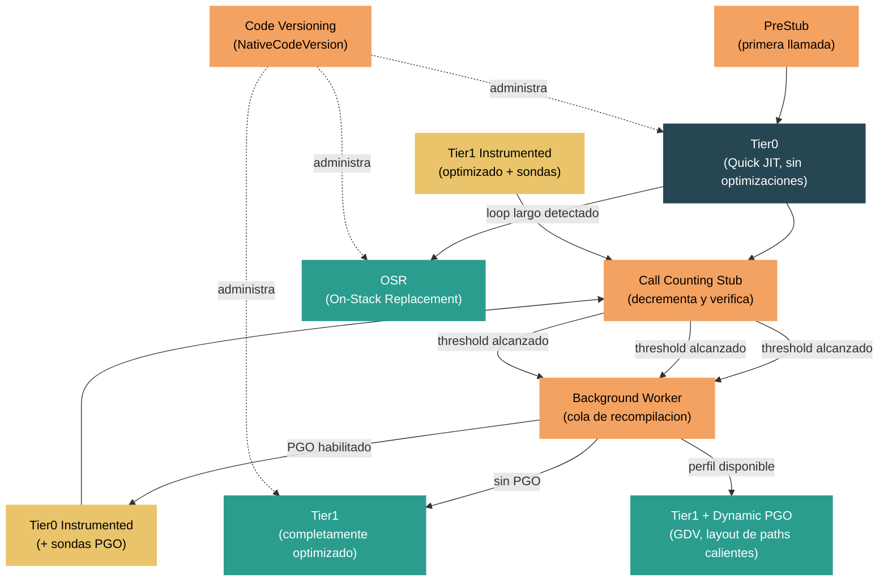

# Nivel 4: Internos — Tiered Compilation y Dynamic PGO

> **Perfil objetivo:** Desarrollador o contribuidor al runtime que quiere entender como el runtime de .NET optimiza el codigo progresivamente en tiempo de ejecucion, desde Tier0 con JIT rapido hasta Tier1 completamente optimizado con Profile-Guided Optimization
> **Esfuerzo estimado:** 6 horas
> **Prerrequisitos:** [Modulo 4.3](04-internals-jit.md) (Compilador JIT)
> [English version](../en/04-internals-tiered-compilation.md)

---

## Objetivos de Aprendizaje

Al finalizar este modulo vas a poder:

1. Explicar por que existe tiered compilation y describir el compromiso entre startup y throughput que Tier0 y Tier1 resuelven.
2. Describir como funcionan los call counting stubs, incluyendo el mecanismo de threshold y el tiering delay que protege el arranque de la aplicacion.
3. Explicar como la infraestructura de code versioning permite que multiples versiones nativas del mismo metodo coexistan de forma segura.
4. Trazar el pipeline de Dynamic PGO desde la instrumentacion en Tier0, pasando por la recoleccion de datos de perfil, hasta la compilacion optimizada en Tier1 con guarded devirtualization.
5. Describir On-Stack Replacement (OSR) y como habilita el tiering para metodos con loops de larga duracion.
6. Configurar y diagnosticar tiered compilation usando variables de entorno `DOTNET_*` y eventos ETW/EventPipe.

---

## Mapa Conceptual



---

## Programa de Estudio

### Leccion 1 — Por que Tiered Compilation

#### Que vas a aprender

Antes de .NET Core 3.0, el JIT tenia una decision binaria: compilar un metodo con optimizaciones completas (compilacion lenta, ejecucion rapida) o con optimizaciones minimas (compilacion rapida, ejecucion lenta). Tiered compilation resuelve este conflicto permitiendo que el runtime compile un metodo multiples veces, empezando rapido y optimizando progresivamente los metodos que importan.

#### El compromiso startup vs throughput

Cuando una aplicacion arranca, cientos o miles de metodos necesitan compilarse con JIT. La mayoria solo se ejecutan un punado de veces durante la inicializacion. Gastar tiempo en optimizacion completa para estos metodos desperdicia tiempo de arranque. Sin embargo, los loops internos calientes de tu aplicacion se benefician enormemente del inlining, loop unrolling, register allocation y otras optimizaciones costosas.

Tiered compilation divide la diferencia:

- **Tier0 (Quick JIT)**: Compila rapido con optimizaciones minimas. El codigo se ejecuta pero no esta completamente optimizado. Esto permite que la aplicacion arranque rapidamente.
- **Tier1 (Optimizado)**: Para metodos que demuestran ser "calientes" mediante call counting, recompila con optimizaciones completas. El codigo optimizado reemplaza la version de Tier0.

#### El enum de optimization tier

El conjunto completo de tiers esta definido en `src/coreclr/vm/codeversion.h`:

```cpp
enum OptimizationTier
{
    OptimizationTier0,              // Quick JIT, sin optimizaciones
    OptimizationTier1,              // Completamente optimizado
    OptimizationTier1OSR,           // Optimizado, ingresado via On-Stack Replacement
    OptimizationTierOptimized,      // Pre-optimizado (R2R, optimizacion agresiva)
    OptimizationTier0Instrumented,  // Tier0 + sondas de instrumentacion PGO
    OptimizationTier1Instrumented,  // Tier1 + sondas de instrumentacion PGO
};
```

Nota que `OptimizationTierOptimized` se usa para metodos que no son elegibles para tiered compilation -- reciben una unica compilacion optimizada. Esto incluye metodos con el atributo `[MethodImpl(MethodImplOptions.AggressiveOptimization)]` y codigo precompilado ReadyToRun (R2R).

#### Seleccion del tier inicial

El metodo `TieredCompilationManager::GetInitialOptimizationTier` en `src/coreclr/vm/tieredcompilation.cpp` decide en que tier comienza un metodo:

```cpp
NativeCodeVersion::OptimizationTier TieredCompilationManager::GetInitialOptimizationTier(
    PTR_MethodDesc pMethodDesc)
{
    if (!pMethodDesc->IsEligibleForTieredCompilation())
    {
        return NativeCodeVersion::OptimizationTierOptimized;
    }
    return (NativeCodeVersion::OptimizationTier)g_pConfig->TieredCompilation_DefaultTier();
}
```

Un metodo es elegible para tiered compilation si:
- Tiered compilation esta habilitado globalmente (`DOTNET_TieredCompilation=1`, el default)
- El metodo no esta marcado con `AggressiveOptimization`
- El metodo es un metodo managed (no un stub nativo, intrinseco, etc.)

#### El pipeline de tiering en resumen

El pipeline completo para un solo metodo se ve asi:

1. **Primera llamada**: El metodo llega al PreStub, se compila con JIT en Tier0 (rapido, sin optimizar).
2. **Call counting**: Se instala un call counting stub que decrementa un contador en cada invocacion.
3. **Threshold alcanzado**: Cuando el contador llega a cero, el metodo se encola para promocion.
4. **Recompilacion en background**: Un thread en segundo plano compila el metodo en un tier superior.
5. **Activacion del codigo**: El nuevo codigo optimizado reemplaza el entry point anterior.

Con Dynamic PGO habilitado (el default desde .NET 8), hay un paso adicional de instrumentacion entre Tier0 y Tier1 que recolecta datos de perfil.

#### Ejercicio de exploracion del codigo fuente

1. Abri `src/coreclr/vm/codeversion.h` y busca el enum `OptimizationTier`. Nota los seis tiers distintos y como `OptimizationTier1OSR` es separado de `OptimizationTier1`.
2. Abri `src/coreclr/vm/tieredcompilation.cpp` y lee el bloque de comentarios en las lineas 17-51 titulado "Overall workflow." Esta es la descripcion autoritativa del pipeline de tiering.
3. Abri `src/coreclr/inc/clrconfigvalues.h` y busca `TieredCompilation`. Nota que su valor por defecto es `1` (habilitado).

---

### Leccion 2 — Call Counting y Promocion

#### Que vas a aprender

El runtime necesita un mecanismo para determinar que metodos son lo suficientemente "calientes" como para justificar la recompilacion. Esto se hace mediante call counting -- cada metodo en Tier0 recibe un pequeno stub de conteo que decrementa un contador en cada invocacion. Cuando el contador llega a cero, el metodo es promovido a un tier superior.

#### Arquitectura del call counting

El sistema de call counting esta implementado en `src/coreclr/vm/callcounting.h` y `src/coreclr/vm/callcounting.cpp`. El header contiene un documento de diseno extenso en sus comentarios iniciales. Los componentes clave son:

**CallCountingInfo**: Una estructura de datos asociada con cada `NativeCodeVersion` que esta siendo contado. Contiene el conteo de llamadas restantes y un puntero al stub de conteo.

```cpp
CallCountingManager::CallCountingInfo::CallCountingInfo(
    NativeCodeVersion codeVersion,
    CallCount callCountThreshold)
    : m_codeVersion(codeVersion),
      m_callCountingStub(nullptr),
      m_remainingCallCount(callCountThreshold),
      m_stage(Stage::StubIsNotActive)
{
}
```

**CallCountingStub**: Una pieza pequena de codigo de maquina escrito a mano que:
1. Decrementa el campo `m_remainingCallCount`
2. Si no es cero, salta directamente al codigo nativo del metodo
3. Si es cero, llama a `OnCallCountThresholdReachedStub` para disparar la promocion

En x64, hay dos variantes del stub: un stub corto que usa branches relativos al IP (cuando el codigo destino esta dentro de 2GB de rango) y un stub largo para destinos lejanos. Otras arquitecturas usan un solo tipo de stub.

#### El threshold del call count

El threshold esta configurado en `src/coreclr/inc/clrconfigvalues.h`:

```cpp
// Builds de debug usan un threshold bajo para testeo mas rapido
#ifdef _DEBUG
    #define TC_CallCountThreshold (2)
    #define TC_CallCountingDelayMs (1)
#else
    #define TC_CallCountThreshold (30)
    #define TC_CallCountingDelayMs (100)
#endif

RETAIL_CONFIG_DWORD_INFO(EXTERNAL_TC_CallCountThreshold,
    W("TC_CallCountThreshold"), TC_CallCountThreshold,
    "Number of times a method must be called in tier 0 after which it is "
    "promoted to the next tier.")
```

En builds de release, un metodo debe ser llamado **30 veces** antes de ser promovido. Esto se puede ajustar con `DOTNET_TC_CallCountThreshold`.

#### El tiering delay

Durante el arranque de la aplicacion, muchos metodos se llaman por primera vez en rapida sucesion. Promoverlos a todos inmediatamente inundaria la cola de compilacion en background y competiria con trabajo critico del startup. Para resolver esto, el runtime implementa un **tiering delay**.

Cuando se llama al primer metodo en Tier0, `HandleCallCountingForFirstCall` crea una lista de metodos pendientes de call counting e inicia un background worker:

```cpp
void TieredCompilationManager::HandleCallCountingForFirstCall(MethodDesc* pMethodDesc)
{
    // ...
    SArray<MethodDesc *> *methodsPendingCounting = m_methodsPendingCountingForTier1;
    if (methodsPendingCounting != nullptr)
    {
        methodsPendingCounting->Append(pMethodDesc);
        ++m_countOfNewMethodsCalledDuringDelay;
        // ...
    }
}
```

El delay es de **100ms** por defecto (`DOTNET_TC_CallCountingDelayMs`). Durante esta ventana, los nuevos metodos se encolan pero sus call counting stubs aun no se instalan. Una vez que el delay expira, el call counting se activa para todos los metodos encolados simultaneamente.

En maquinas con un solo procesador, el delay se multiplica por un factor configurable (`DOTNET_TC_DelaySingleProcMultiplier`) para evitar competir con el thread de la aplicacion por tiempo de CPU.

#### El flujo de promocion

Cuando un call counting stub se dispara (el contador llega a cero), la secuencia es:

1. `OnCallCountThresholdReachedStub` (helper en assembly) llama al runtime
2. `CallCountingManager::OnCallCountThresholdReached` encola la finalizacion del call counting
3. El thread background worker procesa la finalizacion, llamando a `AsyncPromoteToTier1`
4. `AsyncPromoteToTier1` crea un nuevo `NativeCodeVersion` en el tier destino y lo agrega a `m_methodsToOptimize`
5. El background worker llama a `OptimizeMethod` que compila con JIT y activa la nueva version

#### Ejercicio de exploracion del codigo fuente

1. Abri `src/coreclr/vm/callcounting.h` y lee el comentario "Outline of phases" al inicio. Segui las tres fases: iniciar call counting, threshold alcanzado, y limpieza.
2. Abri `src/coreclr/vm/callcounting.cpp` y busca `CallCountingInfo::CallCountingInfo`. Nota como `m_remainingCallCount` se inicializa con el threshold.
3. Abri `src/coreclr/inc/clrconfigvalues.h` y busca todas las entradas de configuracion `TC_*`. Nota las diferencias de threshold entre debug y release.

---

### Leccion 3 — Code Versioning

#### Que vas a aprender

Tiered compilation significa que un solo metodo puede tener multiples versiones de codigo nativo vivas simultaneamente -- una version Tier0 todavia ejecutandose en algunos threads, una version Tier1 lista para activarse, y quizas una version instrumentada en el medio. La infraestructura de code versioning administra estas versiones coexistentes de forma segura.

#### NativeCodeVersion

La abstraccion central es `NativeCodeVersion` en `src/coreclr/vm/codeversion.h`. Cada instancia representa una version compilada de un metodo:

```cpp
class NativeCodeVersion
{
public:
    PCODE GetNativeCode() const;       // El puntero al codigo compilado
    bool IsFinalTier() const;          // Es este el ultimo tier?

    enum OptimizationTier
    {
        OptimizationTier0,
        OptimizationTier1,
        OptimizationTier1OSR,
        OptimizationTierOptimized,
        OptimizationTier0Instrumented,
        OptimizationTier1Instrumented,
    };

    OptimizationTier GetOptimizationTier() const;
    void SetOptimizationTier(OptimizationTier tier);
};
```

Un `NativeCodeVersion` puede ser la version "default" (la compilacion original almacenada directamente en el `MethodDesc`) o una version "no-default" rastreada mediante objetos `NativeCodeVersionNode` en una lista enlazada.

#### ILCodeVersion

Por encima de `NativeCodeVersion` esta `ILCodeVersion`, que representa una version especifica del IL de un metodo. En operacion normal hay solo una version de IL por metodo, pero ReJIT (recompilacion dirigida por el profiler) puede crear versiones adicionales de IL. Cada `ILCodeVersion` puede tener multiples hijos `NativeCodeVersion` -- por ejemplo, uno en Tier0 y otro en Tier1.

La jerarquia es:

```
MethodDesc
  -> ILCodeVersion (default)
       -> NativeCodeVersion (Tier0)
       -> NativeCodeVersion (Tier0 Instrumented)
       -> NativeCodeVersion (Tier1 + PGO)
  -> ILCodeVersion (ReJIT #1)  [si hay profiler adjunto]
       -> NativeCodeVersion (Tier0)
       -> NativeCodeVersion (Tier1)
```

#### CodeVersionManager

El `CodeVersionManager` es el coordinador central. Es dueno del lock que protege todas las estructuras de datos de code versioning. Tanto el tiered compilation manager como el call counting manager adquieren este lock al modificar code versions.

Operaciones clave:
- `AddNativeCodeVersion`: Crea un nuevo nodo de code version nativa para un metodo en un tier dado
- `SetActiveNativeCodeVersion`: Cambia cual version de un metodo esta actualmente "activa" (es decir, la que se llama en nuevas invocaciones)

#### Como se actualizan los entry points del codigo

Cuando una nueva version Tier1 esta lista, el runtime necesita redirigir las futuras llamadas al nuevo codigo. Esto se hace a traves del **precode** del metodo -- un pequeno stub en una direccion estable que hace un salto indirecto al codigo nativo actual. Actualizar el destino del precode es una escritura atomica de puntero, asi que es seguro incluso mientras otros threads estan llamando a la version anterior.

El metodo `ActivateCodeVersion` en `src/coreclr/vm/tieredcompilation.cpp` maneja esto:

```cpp
void TieredCompilationManager::OptimizeMethod(NativeCodeVersion nativeCodeVersion)
{
    if (CompileCodeVersion(nativeCodeVersion))
    {
        ActivateCodeVersion(nativeCodeVersion);
    }
}
```

Los threads que ya estan ejecutando el codigo viejo de Tier0 continuaran ejecutandolo hasta que retornen. Las nuevas llamadas pasan por el precode actualizado y aterrizan en el codigo de Tier1. No es necesario pausar o sincronizar threads para la transicion.

#### La verificacion IsFinalTier

Antes de encolar un metodo para promocion, el runtime verifica `IsFinalTier()`:

```cpp
_ASSERTE(!currentNativeCodeVersion.IsFinalTier());
```

Una code version es "final" si esta en `OptimizationTier1`, `OptimizationTier1OSR`, o `OptimizationTierOptimized`. Estas versiones no seran promovidas mas. Los tiers instrumentados (`Tier0Instrumented`, `Tier1Instrumented`) no son finales -- existen solo para recolectar datos de perfil y seran promovidos una vez que se recolecten los datos.

#### Ejercicio de exploracion del codigo fuente

1. Abri `src/coreclr/vm/codeversion.h` y traza la jerarquia de clases: `NativeCodeVersion` -> `NativeCodeVersionNode` -> `MethodDescVersioningState` -> `CodeVersionManager`.
2. En el mismo archivo, busca `IsFinalTier()` y verifica cuales optimization tiers se consideran finales.
3. Abri `src/coreclr/vm/tieredcompilation.cpp` y busca `OptimizeMethod`. Traza la llamada a `CompileCodeVersion` y `ActivateCodeVersion`.

---

### Leccion 4 — Dynamic PGO

#### Que vas a aprender

Dynamic Profile-Guided Optimization (Dynamic PGO) es la funcionalidad mas impactante de tiered compilation. En lugar de saltar directamente de Tier0 a Tier1, el runtime inserta un tier instrumentado que recolecta datos de perfil en tiempo de ejecucion -- probabilidades de branches, frecuencias de call targets, distribuciones de tipos. El JIT de Tier1 luego usa estos datos para tomar decisiones de optimizacion dramaticamente mejores.

#### El pipeline de Dynamic PGO

Con Dynamic PGO habilitado (`DOTNET_TieredPGO=1`, el default desde .NET 8), el camino de promocion para un metodo tipico se convierte en:

1. **Tier0**: Quick JIT, sin optimizaciones, sin instrumentacion
2. **Call count threshold alcanzado**: El metodo se encola para promocion
3. **Tier0 Instrumented** (o Tier1 Instrumented para codigo R2R): El metodo se recompila con sondas de instrumentacion insertadas
4. **Call count threshold alcanzado de nuevo**: El metodo se encola para la promocion final
5. **Tier1 + datos PGO**: El metodo se compila con optimizaciones completas, usando los datos de perfil recolectados

La logica de seleccion de tier esta en `TieredCompilationManager::AsyncPromoteToTier1`:

```cpp
if (g_pConfig->TieredPGO())
{
    if (currentNativeCodeVersion.GetOptimizationTier() == NativeCodeVersion::OptimizationTier0 &&
        g_pConfig->TieredPGO_InstrumentOnlyHotCode())
    {
        if (ExecutionManager::IsReadyToRunCode(currentNativeCodeVersion.GetNativeCode()))
        {
            // R2R -> tier instrumentado optimizado (para evitar regresion)
            nextTier = NativeCodeVersion::OptimizationTier1Instrumented;
        }
        else
        {
            // JIT Tier0 -> tier instrumentado sin optimizar (mejores perfiles)
            nextTier = NativeCodeVersion::OptimizationTier0Instrumented;
        }
    }
}
```

Nota la distincion entre codigo R2R y codigo compilado por JIT:
- **Codigo R2R** va a `Tier1Instrumented` (optimizado + sondas) porque caer de R2R rapido a codigo instrumentado lento sin optimizar causaria una regresion notable.
- **Codigo JIT Tier0** va a `Tier0Instrumented` (sin optimizar + sondas) porque produce mejores datos de perfil -- el JIT puede instrumentar inlinees ya que aun no ha hecho inlining de nada.

#### Instrumentacion de perfiles en el JIT

La instrumentacion de perfiles del JIT esta implementada en `src/coreclr/jit/fgprofile.cpp`. Cuando compila un tier instrumentado, el JIT inserta dos tipos de sondas:

**Sondas de conteo de edges**: El `EfficientEdgeCountInstrumentor` inserta contadores en los edges del flujo de control. En lugar de instrumentar cada edge (lo cual seria costoso), usa un algoritmo de arbol de expansion minimo -- solo los edges que no estan en el arbol necesitan contadores, y los conteos de edges del arbol pueden reconstruirse matematicamente.

```cpp
schemaElem.InstrumentationKind = m_compiler->opts.compCollect64BitCounts
    ? ICorJitInfo::PgoInstrumentationKind::EdgeLongCount
    : ICorJitInfo::PgoInstrumentationKind::EdgeIntCount;
```

**Sondas de perfil de tipo/metodo**: Para llamadas virtuales e invocaciones de delegates, el JIT inserta sondas que registran los tipos y metodos reales vistos en cada call site. Estos son los datos que habilitan guarded devirtualization (GDV).

#### PgoManager: almacenamiento y recuperacion de datos de perfil

La clase `PgoManager` en `src/coreclr/vm/pgo.h` y `src/coreclr/vm/pgo.cpp` es responsable de almacenar y recuperar datos de PGO. Cada `LoaderAllocator` tiene sus propios datos de PGO, y los datos estan indexados por `MethodDesc`.

```cpp
class PgoManager
{
public:
    static HRESULT getPgoInstrumentationResults(
        MethodDesc* pMD,
        BYTE **pAllocatedData,
        ICorJitInfo::PgoInstrumentationSchema** ppSchema,
        UINT32 *pCountSchemaItems,
        BYTE** pInstrumentationData,
        ICorJitInfo::PgoSource* pPgoSource);

    static HRESULT allocPgoInstrumentationBySchema(
        MethodDesc* pMD,
        ICorJitInfo::PgoInstrumentationSchema* pSchema,
        UINT32 countSchemaItems,
        BYTE** pInstrumentationData);
};
```

Cuando el JIT compila un metodo instrumentado, llama a `allocPgoInstrumentationBySchema` para asignar memoria para los contadores. Durante la ejecucion instrumentada, los contadores se incrementan directamente in-place. Cuando el metodo es luego promovido a Tier1, el JIT llama a `getPgoInstrumentationResults` para leer los datos recolectados.

El JIT verifica si los datos de perfil estan disponibles y son confiables en `src/coreclr/jit/fgprofile.cpp`:

```cpp
bool Compiler::fgHaveProfileData()
{
    return (fgPgoSchema != nullptr);
}

bool Compiler::fgHaveTrustedProfileWeights()
{
    switch (fgPgoSource)
    {
        case ICorJitInfo::PgoSource::Dynamic:  // de instrumentacion
        case ICorJitInfo::PgoSource::Blend:    // fuentes combinadas
        case ICorJitInfo::PgoSource::Text:     // de archivo de texto
            return true;
        default:
            return false;
    }
}
```

#### Guarded devirtualization (GDV)

La optimizacion mas visible habilitada por Dynamic PGO es **guarded devirtualization**. Cuando el perfil de tipos en un call site virtual muestra que un tipo particular domina (ej., el 95% de las llamadas van a `ConcreteClass.Method`), el JIT genera una verificacion de tipo seguida de una llamada directa:

```csharp
// Antes de GDV (dispatch virtual)
obj.VirtualMethod();

// Despues de GDV (pseudo-codigo que genera el JIT)
if (obj.GetType() == typeof(ConcreteClass))
    ConcreteClass.Method(obj);  // llamada directa, puede ser inlined
else
    obj.VirtualMethod();        // fallback a dispatch virtual
```

La llamada directa puede luego ser inlined, lo que desbloquea optimizaciones adicionales como constant folding y eliminacion de codigo muerto dentro del cuerpo inlined. Esta es a menudo la mayor ganancia de rendimiento de Dynamic PGO.

#### Ejercicio de exploracion del codigo fuente

1. Abri `src/coreclr/vm/tieredcompilation.cpp` y busca el metodo `AsyncPromoteToTier1`. Traza el bloque `#ifdef FEATURE_PGO` para entender como el runtime elige entre `Tier0Instrumented` y `Tier1Instrumented`.
2. Abri `src/coreclr/jit/fgprofile.cpp` y busca `EfficientEdgeCountInstrumentor`. Lee como instrumenta edges en lugar de bloques.
3. Abri `src/coreclr/vm/pgo.h` y lee la interfaz de la clase `PgoManager`. Nota los metodos `getPgoInstrumentationResults` y `allocPgoInstrumentationBySchema`.
4. En `src/coreclr/jit/fgprofile.cpp`, busca `ClassProfile` y `MethodProfile` para ver como se agregan las sondas de perfil de tipos.

---

### Leccion 5 — On-Stack Replacement (OSR)

#### Que vas a aprender

Tiered compilation tiene un punto ciego: metodos con loops de larga duracion. Un metodo que entra en un loop cerrado en Tier0 pasara todo su tiempo en la version sin optimizar -- el call counting solo se dispara cuando el metodo es llamado, no mientras se esta ejecutando. On-Stack Replacement (OSR) resuelve esto permitiendo que el runtime reemplace el codigo de un metodo en ejecucion mientras sigue ejecutandose, en medio del loop.

#### El problema: atrapados en Tier0 por loops

Considera un metodo como:

```csharp
void ProcessAll(List<Item> items)
{
    foreach (var item in items)  // puede iterar millones de veces
    {
        Process(item);
    }
}
```

En Tier0, este loop se ejecuta sin ninguna optimizacion. El call counting stub solo se dispara cuando se llama a `ProcessAll` en si. Si `ProcessAll` se llama una vez con un millon de items, pasara toda su ejecucion en codigo de Tier0 -- el threshold de call counting nunca se alcanza desde dentro del loop.

#### Patchpoints

OSR funciona insertando **patchpoints** en los back-edges de los loops durante la compilacion en Tier0. Un patchpoint es una llamada al helper `JIT_HELP_PATCHPOINT` en un offset de IL especifico. El helper rastrea cuantas veces se ha alcanzado el patchpoint.

La estructura `PerPatchpointInfo` en `src/coreclr/vm/onstackreplacement.h` rastrea el estado:

```cpp
struct PerPatchpointInfo
{
    PCODE m_osrMethodCode;      // El entry point del metodo OSR (NULL inicialmente)
    LONG m_patchpointCount;     // Contador de hits
    LONG m_flags;               // patchpoint_triggered, patchpoint_invalid

    enum
    {
        patchpoint_triggered = 0x1,
        patchpoint_invalid = 0x2
    };
};
```

Cada vez que se ejecuta el back-edge del loop, el contador del patchpoint se incrementa. Dos valores de configuracion controlan el comportamiento (de `src/coreclr/inc/clrconfigvalues.h`):

```
DOTNET_OSR_CounterBump = 1000   // Valor de recarga del contador cuando se alcanza un patchpoint
DOTNET_OSR_HitLimit = 10        // Numero de callbacks antes de disparar OSR
```

Una vez que se alcanza el hit limit, el runtime compila con JIT una version OSR del metodo. Esta version se compila en `OptimizationTier1OSR` e incluye el conjunto completo de optimizaciones. La version OSR esta especializada para ingresar en el offset de IL especifico del patchpoint, con todas las variables locales y el estado del stack transferidos desde el frame de Tier0.

#### OnStackReplacementManager

El `OnStackReplacementManager` en `src/coreclr/vm/onstackreplacement.h` administra el mapeo de patchpoints a su estado por-patchpoint. Usa una tabla hash indexada por la combinacion de la direccion de inicio de la funcion y el offset de IL:

```cpp
class OnStackReplacementManager
{
public:
    static void StaticInitialize();
    PerPatchpointInfo* GetPerPatchpointInfo(PCODE funcStart, int ilOffset);

private:
    JitPatchpointTable m_jitPatchpointTable;
};
```

Se inicializa al arranque del runtime en `ceemain.cpp`:

```cpp
OnStackReplacementManager::StaticInitialize();
```

#### La transicion OSR

Cuando el patchpoint se dispara y el metodo OSR esta listo, la transicion ocurre:

1. El helper del patchpoint en Tier0 detecta que `m_osrMethodCode` ahora tiene un valor
2. El runtime construye un nuevo stack frame para el metodo OSR, transfiriendo los valores de las variables locales
3. La ejecucion salta al metodo OSR en el offset de IL del patchpoint
4. El frame de Tier0 se abandona (se limpiara cuando se desenrolle el stack)

La estructura `PatchpointInfo` (definida bajo `FEATURE_ON_STACK_REPLACEMENT` en `codeversion.h`) captura el mapeo de ubicaciones de variables locales entre los frames de Tier0 y OSR, asegurando que todo el estado se preserve durante la transicion.

#### Quick JIT para loops

Por defecto, Tier0 Quick JIT maneja metodos con loops. Esto se controla con `DOTNET_TC_QuickJitForLoops` (default: `1` en builds que no son debug). Cuando esta habilitado, los metodos con loops se compilan en Tier0 con patchpoints. Cuando esta deshabilitado, los metodos con loops saltan Tier0 completamente y van directo a compilacion optimizada.

#### Ejercicio de exploracion del codigo fuente

1. Abri `src/coreclr/vm/onstackreplacement.h` y lee la estructura `PerPatchpointInfo`. Nota los campos `m_patchpointCount` y `m_osrMethodCode`.
2. Abri `src/coreclr/vm/onstackreplacement.cpp` y lee `GetPerPatchpointInfo`. Traza como crea entradas de rastreo de patchpoints de forma lazy.
3. En `src/coreclr/inc/clrconfigvalues.h`, busca `OSR_CounterBump` y `OSR_HitLimit`. Considera por que el hit limit es 10 en lugar de 1 -- compilar un metodo OSR es costoso, y el runtime quiere estar seguro de que el loop es genuinamente de larga duracion antes de invertir en ello.

---

### Leccion 6 — Configuracion y Diagnosticos

#### Que vas a aprender

Tiered compilation y Dynamic PGO exponen un rico conjunto de opciones de configuracion y eventos de diagnostico. Esta leccion cubre las configuraciones mas importantes, como observar el comportamiento de tiering en aplicaciones reales, y como solucionar problemas comunes.

#### Variables de configuracion esenciales

Todas las configuraciones de tiered compilation estan definidas en `src/coreclr/inc/clrconfigvalues.h`. Las mas importantes:

| Variable | Default | Descripcion |
|----------|---------|-------------|
| `DOTNET_TieredCompilation` | `1` | Switch principal para tiered compilation |
| `DOTNET_TC_QuickJit` | `1` | Habilitar Tier0 quick JIT (si se deshabilita, todos los metodos van directo a optimizado) |
| `DOTNET_TC_QuickJitForLoops` | `1` (release) | Permitir quick JIT para metodos con loops (habilita OSR) |
| `DOTNET_TC_CallCountThreshold` | `30` (release) | Numero de llamadas antes de la promocion |
| `DOTNET_TC_CallCountingDelayMs` | `100` (release) | Tiering delay de startup en milisegundos |
| `DOTNET_TieredPGO` | `1` | Habilitar instrumentacion Dynamic PGO |
| `DOTNET_TieredPGO_InstrumentOnlyHotCode` | `1` | Solo instrumentar metodos que alcanzan el call count threshold |
| `DOTNET_OSR_CounterBump` | `1000` | Valor de recarga del contador cuando se alcanza un patchpoint |
| `DOTNET_OSR_HitLimit` | `10` | Numero de callbacks del patchpoint antes de disparar OSR |

#### Deshabilitar tiered compilation

Para depuracion o benchmarking, podes querer deshabilitar el tiering completamente:

```bash
# Deshabilitar todo tiered compilation -- cada metodo compilado con optimizaciones completas
export DOTNET_TieredCompilation=0

# Deshabilitar solo Dynamic PGO -- seguir usando tiering pero saltar instrumentacion
export DOTNET_TieredPGO=0

# Deshabilitar Quick JIT -- cada metodo va directo a optimizado (sin Tier0)
export DOTNET_TC_QuickJit=0
```

Tene en cuenta que `DOTNET_TieredCompilation=0` aumentara significativamente el tiempo de arranque, ya que cada metodo recibe optimizacion completa en la primera llamada.

#### Observar tiering con ETW/EventPipe

El runtime emite eventos ETW (Windows) y EventPipe (multiplataforma) para tiered compilation. Los eventos clave son:

**TieredCompilation/Pause y Resume**: Se emiten cuando el tiering delay comienza y termina.

**MethodJittingStarted**: Incluye el optimization tier, permitiendote distinguir compilaciones de Tier0 vs. Tier1.

**MethodLoad / MethodLoadVerbose**: Incluye el campo `OptimizationTier`, indicandote en que tier esta el codigo cargado.

Para capturar eventos de tiering:

```bash
# Capturar eventos del JIT incluyendo informacion de tier
dotnet-trace collect --process-id <PID> \
    --providers Microsoft-Windows-DotNETRuntime:0x10:5
```

La mascara de keywords JIT `0x10` captura eventos de compilacion JIT. El nivel verbose 5 incluye el optimization tier.

#### Usando dotnet-counters para metricas de tiering

```bash
dotnet-counters monitor --process-id <PID> \
    --counters System.Runtime[methods-jitted-count,time-in-jit,il-bytes-jitted]
```

Presta atencion a:
- **`methods-jitted-count`** aumentando en rafagas: Esto indica que el tiering delay ha expirado y un lote de metodos esta siendo promovido.
- **`time-in-jit`** con picos: La recompilacion en background a Tier1 esta ocurriendo.

#### Dumps de diagnostico del JIT

Para investigacion profunda, el JIT puede volcar su representacion intermedia. Configura:

```bash
# Volcar la salida del JIT para un metodo especifico
export DOTNET_JitDump=NombreDelMetodo

# Mostrar optimization tier en la salida del dump del JIT
export DOTNET_JitDisasmTiers=1
```

El dump del JIT mostrara que tier se esta compilando y, para Tier1, si los datos de PGO estaban disponibles:

```
; Tier-1 compilation
; optimized using Dynamic PGO
; edge weights are valid
; 2 classes profiled at 1 call site
```

#### Solucion de problemas en escenarios comunes

**Escenario: El arranque de la aplicacion es lento**
- Verifica si tiered compilation esta deshabilitado (`DOTNET_TieredCompilation=0`). Volvelo a habilitar.
- Si muchos metodos tienen loops, asegurate de que `TC_QuickJitForLoops` este habilitado.
- Considera aumentar `TC_CallCountingDelayMs` si la compilacion en background esta interfiriendo con el startup.

**Escenario: El rendimiento en estado estable es peor de lo esperado**
- Asegurate de que `DOTNET_TieredPGO=1` (default) -- Dynamic PGO mejora significativamente la calidad de Tier1.
- Verifica que los metodos calientes esten realmente alcanzando Tier1. Usa eventos ETW para verificar.
- Si los metodos no estan alcanzando el call count threshold, considera bajar `TC_CallCountThreshold`.

**Escenario: Un metodo especifico no esta siendo optimizado**
- Verifica que es elegible para tiered compilation (no `AggressiveOptimization`, no es un stub).
- Revisa si es un metodo con muchos loops que podria necesitar OSR en lugar de promocion basada en call counting.
- Usa `DOTNET_JitDump=NombreDelMetodo` para ver en que tier se compila.

#### Ejercicio de exploracion del codigo fuente

1. Abri `src/coreclr/inc/clrconfigvalues.h` y busca todas las entradas `TC_`, `TieredPGO`, y `OSR_`. Conta el numero total de opciones de configuracion relacionadas con tiering.
2. En `src/coreclr/vm/tieredcompilation.cpp`, busca `ETW::CompilationLog::TieredCompilation`. Nota donde se emiten los eventos de Pause y Resume.
3. Proba ejecutar una aplicacion .NET simple con `DOTNET_TC_CallCountThreshold=2` y `DOTNET_JitDisasmTiers=1` para observar la promocion rapida.

---

## Preguntas de Autoevaluacion

1. Por que el runtime usa un tiering delay durante el startup en lugar de instalar call counting stubs inmediatamente?
2. Un metodo se llama 1,000 veces por segundo pero nunca fue promovido a Tier1. Que podria explicar esto?
3. Por que el codigo R2R va a `Tier1Instrumented` mientras que el codigo JIT Tier0 va a `Tier0Instrumented` durante Dynamic PGO?
4. Explica como guarded devirtualization (GDV) usa datos de perfil de tipos para convertir una llamada virtual en una llamada directa.
5. Un metodo contiene un loop `while (true)` que se ejecuta durante minutos. Sin OSR, en que tier se ejecuta? Con OSR, describe la transicion.
6. Observas que `DOTNET_TieredPGO=0` mejoro el rendimiento para un workload especifico. Que podria explicar esto?
7. Como asegura la infraestructura de code versioning que los threads ejecutando codigo viejo de Tier0 no se vean afectados cuando se activa el codigo de Tier1?

---

## Mapa de Archivos Fuente Clave

| Archivo | Que contiene |
|---------|-------------|
| `src/coreclr/vm/tieredcompilation.h` | Declaracion de la clase `TieredCompilationManager` -- orquesta el pipeline de tiering |
| `src/coreclr/vm/tieredcompilation.cpp` | Implementacion: tiering delay, cola de promocion, background worker, `OptimizeMethod` |
| `src/coreclr/vm/callcounting.h` | `CallCountingManager` y documento de diseno del call counting stub |
| `src/coreclr/vm/callcounting.cpp` | Creacion del call counting stub, manejo de threshold alcanzado, limpieza de stubs |
| `src/coreclr/vm/codeversion.h` | `NativeCodeVersion`, `ILCodeVersion`, `CodeVersionManager` -- infraestructura de code versioning |
| `src/coreclr/vm/codeversion.cpp` | Implementacion de code versioning, `AddNativeCodeVersion` |
| `src/coreclr/vm/pgo.h` | `PgoManager` -- almacena y recupera datos de perfil para Dynamic PGO |
| `src/coreclr/vm/pgo.cpp` | Gestion de datos PGO, importacion/exportacion en formato de texto |
| `src/coreclr/jit/fgprofile.cpp` | Instrumentacion de perfiles del lado del JIT: conteos de edges, perfiles de tipos, sondas GDV |
| `src/coreclr/vm/onstackreplacement.h` | `OnStackReplacementManager`, `PerPatchpointInfo` |
| `src/coreclr/vm/onstackreplacement.cpp` | Rastreo y gestion de patchpoints de OSR |
| `src/coreclr/inc/clrconfigvalues.h` | Todas las opciones de configuracion `DOTNET_*` para tiering, PGO, y OSR |

---

## Lectura Adicional

- [Documento de diseno de Tiered Compilation](docs/design/coreclr/botr/tiered-compilation.md) -- el documento de diseno original
- [Blog post de Dynamic PGO](https://devblogs.microsoft.com/dotnet/performance_improvements_in_net_7/#pgo) -- explicacion detallada del equipo de .NET
- [Diseno de On-Stack Replacement](docs/design/coreclr/botr/on-stack-replacement.md) -- documento de diseno de OSR
- [Configuracion del Runtime .NET](https://learn.microsoft.com/en-us/dotnet/core/runtime-config/compilation) -- documentacion oficial para configuraciones del JIT y tiering
- [Blog posts de Andy Ayers sobre PGO](https://devblogs.microsoft.com/dotnet/author/andya/) -- del ingeniero que implemento Dynamic PGO
