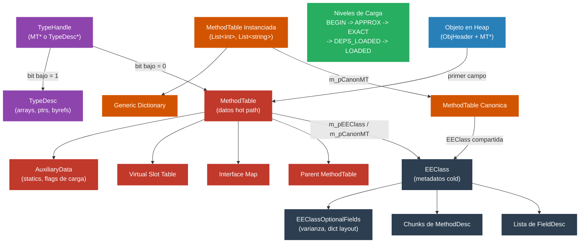

# Nivel 4: Internos -- El Sistema de Tipos: MethodTable, EEClass y TypeDesc

> **Perfil objetivo:** Contributor del runtime o debugger avanzado que necesita entender como el CLR representa los tipos en memoria a nivel de la VM nativa
> **Esfuerzo estimado:** 10 horas
> **Prerrequisitos:** [Modulo 4.1](04-internals-jit.md), modulos de Nivel 3
> [English version](../en/04-internals-type-system.md)
> **Dificultad:** Nivel de lectura de codigo fuente 4-5 de 5

---

## Objetivos de Aprendizaje

Al finalizar este modulo vas a poder:

1. Diagramar el layout en memoria de un objeto managed en el GC heap, incluyendo el ObjHeader, el puntero a MethodTable y los datos de campos de instancia.
2. Enumerar los campos criticos de una MethodTable y explicar que codifica cada uno: flags, base size, cantidad de slots virtuales, cantidad de interfaces, puntero al padre y la union EEClass/CanonMT.
3. Explicar por que el runtime separa los metadatos de tipo entre MethodTable (hot) y EEClass (cold), y listar los datos que viven en cada lado de la division.
4. Describir como TypeDesc y sus subclases (ParamTypeDesc, TypeVarTypeDesc, FnPtrTypeDesc) representan tipos que no son clases ni structs simples.
5. Trazar los cinco niveles de carga de clases (CLASS_LOAD_BEGIN hasta CLASS_LOADED) y explicar por que la carga multi-fase es necesaria para tipos recursivos y genericos.
6. Explicar como las instanciaciones de tipos genericos producen MethodTables por instanciacion, cuando se comparten EEClasses entre instanciaciones compatibles, y como los generic dictionaries proveen datos especificos de instanciacion al codigo compartido.

---

## Mapa Conceptual



---

## Curriculum

### Leccion 1 -- Layout de Objetos en Memoria

#### Que vas a aprender

Cada objeto managed en el GC heap tiene un layout preciso y predecible. Entender este layout es esencial para debuggear corrupcion de memoria, interpretar la salida de SOS/DAC, y leer el codigo fuente del GC. El layout es mas simple de lo que la mayoria piensa.

#### El object header

Todo objeto en el heap esta precedido por un **ObjHeader**, que se encuentra en un _offset negativo_ desde la referencia al objeto. En `src/coreclr/vm/object.h` (linea 86-93), el tamano esta definido:

```cpp
#ifdef TARGET_64BIT
#define OBJHEADER_SIZE      (sizeof(DWORD) /* m_alignpad */ + sizeof(DWORD) /* m_SyncBlockValue */)
#else
#define OBJHEADER_SIZE      sizeof(DWORD) /* m_SyncBlockValue */
#endif
```

En sistemas de 64 bits, el ObjHeader ocupa 8 bytes (4 bytes de padding de alineacion + 4 bytes de sync block index). En 32 bits, son 4 bytes. El sync block index se usa para adjuntar datos adicionales a un objeto -- estado de locks, informacion de COM interop, hash codes. La mayoria de los objetos tienen un sync block index de cero, lo que significa que no se ha asignado ningun SyncBlock.

Cuando el codigo dice "referencia al objeto" se refiere a un puntero al inicio de la estructura `Object`, que esta _despues_ del ObjHeader. El GC ve el ObjHeader en un offset negativo.

#### El puntero a MethodTable

El primer campo en la referencia al objeto es el puntero a MethodTable, definido en `src/coreclr/vm/object.h` (linea 126-131):

```cpp
class Object
{
  protected:
    PTR_MethodTable m_pMethTab;
    // ... los campos de instancia siguen
};
```

Este unico puntero es lo que permite al runtime determinar el tipo de cualquier objeto. El GC lo usa para conocer el tamano y el layout GC del objeto. El dispatch de metodos virtuales lee el vtable desde ahi. El casting lo verifica. Reflection lo sigue hasta los metadatos.

Durante el GC, el bit mas bajo de `m_pMethTab` puede ser temporalmente seteado como mark bit (`MARKED_BIT = 0x1`). El accessor `GetMethodTable()` hace assert de que este bit este limpio durante la operacion normal; `GetGCSafeMethodTable()` lo enmascara.

#### Calculo del tamano de objetos

El comentario en `object.h` (linea 67-73) explica la formula universal de tamano:

```
MT->GetBaseSize() + (OBJECTTYPEREF->GetSizeField() * MT->GetComponentSize())
```

Para objetos de tamano fijo (clases y structs ordinarios), `ComponentSize` es cero, asi que el tamano es simplemente `BaseSize`. Para arrays y strings, `ComponentSize` es el tamano por elemento, y `GetSizeField()` retorna la cantidad de elementos desde el campo `m_NumComponents` que esta inmediatamente despues de `m_pMethTab`.

El tamano minimo de objeto esta definido como:

```cpp
#define MIN_OBJECT_SIZE     (2*TARGET_POINTER_SIZE + OBJHEADER_SIZE)
```

En 64 bits, eso es 24 bytes (8 ObjHeader + 8 puntero a MethodTable + 8 minimo). Esto asegura que incluso un objeto vacio sea lo suficientemente grande para el mecanismo de free-list del GC.

#### Juntando todo: diagrama de layout en memoria

```
             ┌──────────────────────────┐
             │  ObjHeader (sync block)  │  <- offset negativo desde obj ref
             │  (4 u 8 bytes)           │
obj ref ──>  ├──────────────────────────┤
             │  MethodTable*            │  <- m_pMethTab (tamano de puntero)
             ├──────────────────────────┤
             │  [m_NumComponents]       │  <- solo para arrays/strings
             ├──────────────────────────┤
             │  Campo de instancia 1    │
             │  Campo de instancia 2    │
             │  ...                     │
             └──────────────────────────┘
```

#### Ejercicio de exploracion del codigo fuente

1. Abri `src/coreclr/vm/object.h` y lee la clase `Object`. Nota que `m_pMethTab` es el unico campo declarado -- los datos de instancia son dispuestos por el type loader mas alla de los campos fijos.
2. Busca `OBJHEADER_SIZE` y `OBJECT_BASESIZE` en el mismo archivo. Verifica los tamanos para tu plataforma.
3. Abri `src/coreclr/vm/syncblk.h` y mira la clase `ObjHeader`. Nota que vive en el offset `-OBJHEADER_SIZE` desde el objeto.

---

### Leccion 2 -- MethodTable: El Descriptor de Tipos del Runtime

#### Que vas a aprender

MethodTable es la estructura de datos central del sistema de tipos del CLR. Es la estructura "hot" -- la que se accede en virtualmente toda operacion que involucre un objeto. El comentario en la linea 947-956 de `methodtable.h` lo resume:

> A MethodTable is the fundamental representation of type in the runtime. It is this structure that objects point at. It holds the size and GC layout of the type, as well as the dispatch table for virtual dispatch.

#### Campos criticos

Los campos privados de MethodTable se declaran a partir de la linea 3951 de `src/coreclr/vm/methodtable.h`. Estos son los mas importantes:

| Campo | Tipo | Proposito |
|-------|------|-----------|
| `m_dwFlags` | `DWORD` | Flags principales. El WORD bajo es component size para arrays/strings (`HasComponentSize()`). |
| `m_BaseSize` | `DWORD` | Tamano total asignado incluyendo ObjHeader, para objetos de tamano fijo. |
| `m_dwFlags2` | `DWORD` | Flags secundarias (`WFLAGS2_ENUM`). |
| `m_wNumVirtuals` | `WORD` | Cantidad de slots de metodos virtuales. |
| `m_wNumInterfaces` | `WORD` | Cantidad de interfaces implementadas. |
| `m_pParentMethodTable` | `PTR_MethodTable` | MethodTable de la clase padre (null para `System.Object`). |
| `m_pModule` | `PTR_Module` | El modulo que define este tipo. |
| `m_pAuxiliaryData` | `PTR_MethodTableAuxiliaryData` | Statics, flags de estado de carga y slots no virtuales. |
| `m_pEEClass` / `m_pCanonMT` | union | Apunta a EEClass (MT canonica) o a la MethodTable canonica (genericos instanciados). |
| `m_pPerInstInfo` / `m_ElementTypeHnd` | union | Diccionarios genericos o tipo de elemento de array. |
| `m_pInterfaceMap` | `PTR_InterfaceInfo` | Array de `InterfaceInfo_t` por cada interfaz implementada. |

Despues de los campos fijos, la MethodTable contiene datos de longitud variable en este orden:

1. **Virtual slot table** -- una entrada del tamano de un puntero por metodo virtual
2. **Optional members** -- datos poco frecuentes (info extra de interfaces)
3. **PerInstInfo** -- punteros a diccionarios genericos (para tipos genericos)
4. **Interface map** -- array de `InterfaceInfo_t`
5. **Instanciacion generica y diccionario** -- argumentos de tipo y lookups cacheados

#### La union EEClass/CanonMT

Este es uno de los detalles de diseno mas importantes del runtime. El campo `m_pCanonMT` (que comparte almacenamiento con `m_pEEClass`) usa el bit mas bajo para discriminar:

```cpp
enum LowBits {
    UNION_EECLASS     = 0,   // puntero a EEClass. Esta MT es la MT canonica.
    UNION_METHODTABLE = 1,   // puntero a la MethodTable canonica.
};
```

- Si el bit bajo es 0, esta MethodTable ES la canonica, y el puntero va directamente a su EEClass.
- Si el bit bajo es 1, esta es una MethodTable de generico instanciado, y el puntero (con el bit bajo enmascarado) lleva a la MethodTable canonica, que a su vez apunta a la EEClass compartida.

El accessor inline en `methodtable.inl` (linea 27-56) muestra la busqueda en dos pasos:

```cpp
FORCEINLINE PTR_EEClass MethodTable::GetClassWithPossibleAV()
{
    TADDR addr = m_pCanonMT;
    LowBits lowBits = union_getLowBits(addr);
    if (lowBits == UNION_EECLASS)
    {
        return PTR_EEClass(addr);
    }
    else
    {
        TADDR canonicalMethodTable = union_getPointer(addr);
        return PTR_MethodTable(canonicalMethodTable)->m_pEEClass;
    }
}
```

#### El virtual slot table

El dispatch de metodos virtuales funciona indexando en el vtable embebido en la MethodTable. La cantidad de slots es `m_wNumVirtuals`. Cada slot contiene un puntero al entry point de un MethodDesc. El dispatch de interfaces usa un mecanismo diferente (Virtual Stub Dispatch), pero el vtable es la base para las llamadas virtuales de jerarquia de clases.

#### AuxiliaryData: donde vive el estado de carga

La estructura `MethodTableAuxiliaryData` (linea 315 de `methodtable.h`) contiene flags por tipo que cambian durante la vida del tipo:

- `enum_flag_Initialized` -- el constructor estatico de la clase ya se ejecuto
- `enum_flag_IsNotFullyLoaded` -- el tipo todavia se esta cargando
- `enum_flag_HasApproxParent` -- el puntero al padre es aproximado (todavia no es exacto)
- `enum_flag_DependenciesLoaded` -- todas las dependencias de tipo estan cargadas

Esta separacion de la MethodTable es intencional: estas flags se escriben durante la inicializacion de clases y la carga, mientras que los campos centrales de la MethodTable son efectivamente inmutables despues de que la carga se completa.

#### Ejercicio de exploracion del codigo fuente

1. Abri `src/coreclr/vm/methodtable.h`, anda a la linea 3951, y lee las declaraciones de campos privados hasta la linea 4014. Mapea cada campo a la tabla de arriba.
2. En `methodtable.inl`, lee `GetClassWithPossibleAV()` y `GetClass()`. Entende el esquema de tagging del bit bajo.
3. Busca `cdac_data<MethodTable>` al final de `methodtable.h` (linea 4140). Esto te da los offsets exactos usados por la capa de acceso a datos de diagnostico -- util para desarrollo de herramientas de debugging.

---

### Leccion 3 -- EEClass: Los Metadatos de Tipo Compartidos

#### Que vas a aprender

La division entre MethodTable y EEClass es una de las decisiones arquitectonicas mas importantes del CLR. El comentario al inicio de `class.h` (linea 10-20) es explicito sobre la motivacion:

> NOTE: Even though EEClass is considered to contain cold data (relative to MethodTable), these data structures *are* touched (especially during startup as part of soft-binding). As a result, and given the number of EEClasses allocated for large assemblies, the size of this structure can have a direct impact on performance, especially startup performance.

#### Por que la division?

El runtime separa los metadatos de tipo en dos niveles:

1. **MethodTable (hot):** Datos accedidos en toda operacion con objetos -- layout GC, dispatch virtual, casting. Vive en el working set.
2. **EEClass (cold):** Datos accedidos solo durante reflection, carga de clases, debugging y operaciones poco comunes. Se mantiene fuera del working set para reducir la presion de memoria.

La guia de diseno de `class.h` (linea 681-693) es clara:

> At compile-time, we are happy to touch both MethodTable and EEClass. However, at runtime we want to restrict ourselves to the MethodTable. This is critical for common code paths, where we want to keep the EEClass out of our working set.

Si estas escribiendo codigo de runtime y llamas a `GetClass()`, deberias detenerte y preguntarte si realmente necesitas datos de EEClass, o si la MethodTable ya tiene lo que necesitas.

#### Campos de EEClass

Los campos privados (linea 1669-1711 de `class.h`) incluyen:

| Campo | Tipo | Proposito |
|-------|------|-----------|
| `m_rpOptionalFields` | `PTR_EEClassOptionalFields` | Puntero a campos raramente usados (varianza, layout de diccionario, COM interop). |
| `m_pMethodTable` | `PTR_MethodTable` | Puntero de vuelta a la MethodTable canonica. Usado solo por SOS/debugging. |
| `m_pFieldDescList` | `PTR_FieldDesc` | Array de descriptores de campo para todos los campos del tipo. |
| `m_pChunks` | `PTR_MethodDescChunk` | Lista enlazada de chunks de MethodDesc que contienen todos los descriptores de metodos. |
| `m_dwAttrClass` | `DWORD` | Atributos de TypeDef del metadata (sealed, abstract, interface, visibilidad). |
| `m_VMFlags` | `DWORD` | Flags especificas del runtime (tiene finalizer, tiene layout, etc.). |
| `m_NormType` | `BYTE` | El `CorElementType` normalizado de este tipo. |
| `m_cbBaseSizePadding` | `BYTE` | Bytes de padding incluidos en el BaseSize de la MethodTable. |
| `m_NumInstanceFields` | `WORD` | Cantidad de campos de instancia. |
| `m_NumMethods` | `WORD` | Cantidad total de metodos. |
| `m_NumStaticFields` | `WORD` | Cantidad de campos estaticos. |
| `m_NumNonVirtualSlots` | `WORD` | Cantidad de slots de metodos no virtuales. |

#### EEClassOptionalFields

Para mantener la EEClass chica, los datos raramente necesitados se mueven a `EEClassOptionalFields` (linea 604-665 de `class.h`). Esto incluye:

- `m_pDictLayout` -- El DictionaryLayout para tipos genericos, que describe que slots son necesarios mas alla de los argumentos de tipo.
- `m_pVarianceInfo` -- Anotaciones de varianza por parametro de tipo (covariante, contravariante, ninguna). Solo se asigna para tipos genericos con varianza.

Una EEClass solo asigna este bloque opcional si necesita al menos uno de estos campos.

#### Comparticion de EEClass con genericos

Una consecuencia clave de la division MethodTable/EEClass: para tipos genericos, la EEClass se **comparte** entre instanciaciones compatibles. De `class.h` (linea 667-676):

> For most types there is a one-to-one mapping between MethodTable* and EEClass*. However this is not the case for instantiated types where code and representation are shared between compatible instantiations (e.g. List<string> and List<object>). Then a single EEClass structure is shared between multiple MethodTable structures.

Esto significa que `List<string>` y `List<object>` tienen MethodTables diferentes pero apuntan a la misma EEClass. La MethodTable contiene los datos especificos de la instanciacion (argumentos de tipo, interface map con interfaces instanciadas), mientras que la EEClass contiene lo que es comun (descriptores de metodos, descriptores de campos, flags de atributos).

#### La asignacion de EEClass

Las instancias de EEClass se asignan en el `LoaderHeap` (linea 35-53 de `class.cpp`):

```cpp
void *EEClass::operator new(size_t size, LoaderHeap *pHeap, AllocMemTracker *pamTracker)
{
    void *p = pamTracker->Track(pHeap->AllocMem(S_SIZE_T(size)));
    return p;
}
```

La memoria viene de VirtualAlloc y nunca se libera individualmente -- vive mientras el LoaderAllocator (y por lo tanto el Assembly o AssemblyLoadContext) este vivo. Por eso la descarga requiere AssemblyLoadContext: no hay desasignacion por tipo.

#### Ejercicio de exploracion del codigo fuente

1. Abri `src/coreclr/vm/class.h` y lee el bloque de comentarios de la linea 667 a la 713. Esta es la explicacion definitiva de la relacion EEClass/MethodTable.
2. Lee las declaraciones de campos privados de la linea 1669-1711. Comparalos con la tabla de arriba.
3. Abri `src/coreclr/vm/class.h` linea 604 y lee `EEClassOptionalFields`. Nota como `m_pDictLayout` y `m_pVarianceInfo` se almacenan ahi para mantener la EEClass base chica.

---

### Leccion 4 -- TypeDesc: Arrays, Punteros y Parametros de Tipo

#### Que vas a aprender

No todo tipo en el CLR puede ser representado por una MethodTable. La jerarquia de TypeDesc maneja los "casos borde" que en realidad son bastante comunes: tipos byref, tipos puntero, tipos function pointer y parametros de tipo generico.

#### TypeHandle: la identidad universal de tipo

Antes de sumergirnos en TypeDesc, necesitas entender TypeHandle. De `typehandle.h` (linea 53-63):

> A TypeHandle is the FUNDAMENTAL concept of type identity in the CLR. Two types are equal if and only if their type handles are equal. A TypeHandle is a pointer-sized structure that encodes everything you need to know about what kind of type you are dealing with.

Un TypeHandle puede apuntar a:

1. **Una MethodTable** -- para clases, structs, arrays e instanciaciones genericas
2. **Un TypeDesc** -- para byrefs, punteros, function pointers y parametros de tipo generico

La desambiguacion se hace con el bit bajo. Si el bit bajo esta seteado (lo cual es imposible para un puntero normalmente alineado), el TypeHandle es un TypeDesc. El TypeDesc mismo almacena un `CorElementType` en su byte bajo para discriminar mas.

#### La clase base TypeDesc

Definida en `src/coreclr/vm/typedesc.h` (linea 31-213), TypeDesc es una base compacta:

```cpp
class TypeDesc
{
public:
    // 8 bits bajos: discriminador CorElementType
    // Bits superiores: flags (IsCollectible, IsNotFullyLoaded, HasTypeEquivalence, etc.)
    DWORD _typeAndFlags;

    // Handle del objeto de tipo en runtime
    RUNTIMETYPEHANDLE _exposedClassObject;
};
```

El `CorElementType` almacenado en el byte bajo te dice exactamente que tipo de TypeDesc es:
- `ELEMENT_TYPE_BYREF` -- un byref (`ref int`)
- `ELEMENT_TYPE_PTR` -- un puntero (`int*`)
- `ELEMENT_TYPE_FNPTR` -- un function pointer (`delegate*<int, void>`)
- `ELEMENT_TYPE_VAR` -- un parametro de tipo generico a nivel de clase (`T` en `class Foo<T>`)
- `ELEMENT_TYPE_MVAR` -- un parametro de tipo generico a nivel de metodo (`T` en `void Bar<T>()`)

#### ParamTypeDesc: byrefs y punteros

Para tipos que modifican otro tipo (byref, puntero), `ParamTypeDesc` (linea 228-278) agrega un solo campo:

```cpp
class ParamTypeDesc : public TypeDesc {
protected:
    TypeHandle m_Arg;  // El tipo siendo modificado (ej: "int" para "int*")
};
```

Entonces `int*` es un ParamTypeDesc con `CorElementType = ELEMENT_TYPE_PTR` y `m_Arg = TypeHandle(int)`. De forma similar, `ref string` es un ParamTypeDesc con `ELEMENT_TYPE_BYREF` y `m_Arg = TypeHandle(string)`.

Nota que los arrays NO se representan con ParamTypeDesc. Los arrays tienen MethodTables completas (con slots de vtable para `IList<T>`, etc.). El comentario en `typedesc.h` es explicito:

> ParamTypeDescs only include byref, array and pointer types. They do NOT include instantiations of generic types, which are represented by MethodTables.

#### TypeVarTypeDesc: variables de tipo generico

Para parametros genericos como `T` en `List<T>`, `TypeVarTypeDesc` (linea 300-398) almacena:

```cpp
class TypeVarTypeDesc : public TypeDesc
{
    PTR_Module m_pModule;           // Modulo que contiene la definicion generica
    mdToken m_typeOrMethodDef;      // Token TypeDef o MethodDef del propietario
    mdGenericParam m_token;         // Token de metadata GenericParam
    unsigned int m_index;           // Posicion (base 0) en la lista de parametros de tipo
    TypeHandle* m_constraints;      // Array cacheado de tipos de restriccion
    DWORD m_numConstraintsWithFlags;// Cantidad de restricciones + flags sobre el estado de carga
};
```

El `CorElementType` distingue entre parametros de tipo a nivel de clase (`ELEMENT_TYPE_VAR`) y a nivel de metodo (`ELEMENT_TYPE_MVAR`). Las restricciones se cargan de forma lazy y se cachean para uso futuro.

#### FnPtrTypeDesc: function pointers

C# 9 introdujo function pointers (`delegate*<int, string, void>`). Se representan con `FnPtrTypeDesc` (linea 428-514):

```cpp
class FnPtrTypeDesc : public TypeDesc
{
    PTR_Module m_pLoaderModule;
    DWORD m_NumArgs;
    BYTE m_CallConv;
    TypeHandle m_RetAndArgTypes[1]; // Longitud variable: [0]=tipo retorno, [1..N]=tipos de args
};
```

#### Ejercicio de exploracion del codigo fuente

1. Abri `src/coreclr/vm/typehandle.h` y lee las lineas 53-80. Entende la discriminacion de dos casos (MethodTable vs. TypeDesc).
2. Abri `src/coreclr/vm/typedesc.h` y lee la clase base `TypeDesc` (linea 31-213). Segui la codificacion de `_typeAndFlags`.
3. En el mismo archivo, lee `ParamTypeDesc` (linea 228-278) y `TypeVarTypeDesc` (linea 300-398). Nota como las restricciones para parametros genericos se cargan de forma lazy.

---

### Leccion 5 -- Niveles de Carga de Tipos

#### Que vas a aprender

La carga de tipos no es atomica. Un tipo pasa por multiples niveles bien definidos antes de ser completamente usable. Este enfoque por fases es necesario para manejar definiciones de tipos recursivas, dependencias mutuas y validacion de restricciones genericas -- todo sin deadlocks ni estados inconsistentes.

#### Los cinco niveles de carga

`src/coreclr/vm/classloadlevel.h` define toda la progresion:

```cpp
enum ClassLoadLevel
{
    CLASS_LOAD_BEGIN,           // Placeholder antes de que el tipo se cree
    CLASS_LOAD_APPROXPARENTS,   // Tipo creado, padre/interfaces aproximados
    CLASS_LOAD_EXACTPARENTS,    // Tipos de padre e interfaces exactos, jerarquia cargada
    CLASS_DEPENDENCIES_LOADED,  // Todos los tipos dependientes completamente cargados
    CLASS_LOADED,               // Nivel final: restricciones verificadas, completamente usable
};
```

#### CLASS_LOAD_BEGIN

Este es el placeholder inicial antes de que el tipo haya sido creado o localizado. Todavia no existe una MethodTable.

#### CLASS_LOAD_APPROXPARENTS

El tipo ha sido creado (MethodTable y EEClass asignadas), pero los argumentos de tipo generico en la clase padre y las interfaces estan rellenados con informacion **aproximada**. Por ejemplo, si estamos cargando `MyList<int>` que extiende `List<int>`, el padre podria ser temporalmente `List<__Canon>` (el representante canonico) en lugar del `List<int>` exacto.

En este nivel, el contenido del vtable y el diccionario estan basados en argumentos de tipo aproximados. El bit `enum_flag_HasApproxParent` esta seteado en AuxiliaryData.

#### CLASS_LOAD_EXACTPARENTS

Los argumentos genericos para la clase padre y las interfaces son ahora exactos. Toda la jerarquia (cadena de padres y lista de interfaces) esta cargada al menos a este nivel. Sin embargo, otros tipos dependientes (como tipos de campos o argumentos genericos usados en otros lados) pueden estar todavia en un nivel inferior.

El bit `enum_flag_HasApproxParent` se limpia.

#### CLASS_DEPENDENCIES_LOADED

El tipo en si y todos sus dependientes (jerarquia de padres, argumentos genericos, MethodTable canonica, etc.) estan completamente cargados. Para instanciaciones genericas, las restricciones **todavia no** fueron verificadas. Este nivel es el estado "estructuralmente completo".

#### CLASS_LOADED

Este es el nivel final. Es una fase de verificacion de solo lectura que no cambia ningun estado mas alla de voltear el bit `IsFullyLoaded()`. La verificacion incluye:

- Verificacion de restricciones genericas (los argumentos de tipo satisfacen sus restricciones?)
- Verificaciones de acceso para tipos de campos value-type
- Deteccion de ciclos genericos recursivos expansivos

El comentario en `classloadlevel.h` explica por que esta separado:

> This is a "read-only" verification phase that changes no state other than to flip the IsFullyLoaded() bit. We use this phase to do conformity checks (which can't be done in an earlier phase) on the class in a recursion-proof manner.

#### Por que carga multi-fase?

Considera este escenario:

```csharp
class A<T> : B<A<T>> { }
class B<U> { }
```

Para cargar `A<int>`, necesitamos su padre `B<A<int>>`, que requiere `A<int>` como argumento de tipo. Sin carga multi-fase, esto seria recursion infinita o deadlock.

El enfoque por fases rompe el ciclo: podemos crear `A<int>` en APPROXPARENTS con un padre aproximado, y luego volver y setear el padre exacto una vez que existe suficiente estructura. El `RecursionGraph` en `src/coreclr/vm/generics.h` esta especificamente disenado para detectar ciclos problematicos (expansivos) mientras permite los seguros.

#### Tracking del nivel de carga en las estructuras de datos

- **MethodTable** trackea su nivel de carga via bits de `MethodTableAuxiliaryData::m_dwFlags`: `enum_flag_IsNotFullyLoaded`, `enum_flag_DependenciesLoaded`, `enum_flag_HasApproxParent`.
- **TypeDesc** trackea su nivel de carga via `_typeAndFlags`: `enum_flag_IsNotFullyLoaded`, `enum_flag_DependenciesLoaded`.

Ambos proveen un metodo `GetLoadLevel()` que lee estas flags y retorna el `ClassLoadLevel` apropiado.

#### Ejercicio de exploracion del codigo fuente

1. Lee `src/coreclr/vm/classloadlevel.h` en su totalidad (son solo 71 lineas). Memoriza los cinco niveles.
2. Busca `IsNotFullyLoaded` en `methodtable.h` para ver como se verifican las flags de carga.
3. Lee el comentario de `RecursionGraph` en `src/coreclr/vm/generics.h` (linea 27-80). Entende por que los ciclos expansivos se rechazan pero los ciclos no expansivos como `A<T> : B<A<T>>` se permiten.

---

### Leccion 6 -- Instanciacion de Tipos Genericos en la VM

#### Que vas a aprender

La instanciacion de tipos genericos es donde todas las piezas se juntan. Cuando escribis `List<int>` en C#, el runtime crea una nueva MethodTable para `List<int>` que es distinta de `List<string>`. Pero para ahorrar memoria y tiempo de JIT, el runtime comparte tanto como sea posible entre instanciaciones compatibles.

#### MethodTables canonicas

Para cada definicion de tipo generico, existe una MethodTable **canonica**. Para `List<T>`, la MethodTable canonica es `List<__Canon>`, donde `__Canon` (tambien conocido como `System.__Canon`) es un tipo interno especial que representa "cualquier tipo referencia".

La MethodTable canonica:
- Apunta directamente a la EEClass compartida (bit bajo = 0 en la union `m_pEEClass`)
- Contiene las entradas de vtable compartidas (codigo que funciona para cualquier instanciacion compatible)
- Es el tipo usado para compartir codigo entre todas las instanciaciones de tipo referencia

Cuando se crea `List<string>`, su MethodTable almacena un puntero taggeado a `List<__Canon>`:

```cpp
m_pCanonMT = (TADDR)pCanonicalMT | MethodTable::UNION_METHODTABLE;
```

Para obtener la EEClass, el runtime sigue el camino de dos saltos: MT instanciada -> MT canonica -> EEClass.

#### Cuando se comparte codigo?

La comparticion de codigo sigue estas reglas:
- **Todas las instanciaciones de tipo referencia comparten codigo** con la instanciacion canonica. `List<string>`, `List<object>` y `List<Exception>` comparten los mismos cuerpos de metodos compilados por el JIT.
- **Las instanciaciones de value type obtienen codigo unico.** `List<int>` tiene sus propios cuerpos de metodos porque `int` tiene un tamano y layout GC diferente al de los tipos referencia.
- **Las instanciaciones mixtas se comparten donde sea posible.** `Dictionary<string, int>` comparte codigo con `Dictionary<object, int>` pero no con `Dictionary<string, long>`.

La EEClass se comparte cuando el contenido del vtable se comparte. Como todas las instanciaciones de tipo referencia comparten el mismo codigo, comparten la misma EEClass. Las instanciaciones de value type que requieren codigo diferente obtienen su propia MethodTable pero pueden compartir la EEClass si el layout del vtable es identico.

El comentario en `methodtable.h` (linea 130-143) explica:

> Generic type instantiations are represented by MethodTables, i.e. a new MethodTable gets allocated for each such instantiation. The entries in these tables (i.e. the code) are, however, often shared. In particular, a MethodTable's vtable contents (and hence method descriptors) may be shared between compatible instantiations.

#### Diccionarios genericos

Cuando el codigo compartido necesita hacer algo especifico de la instanciacion (como `new T()` o `typeof(T)`), no puede hardcodear la respuesta porque el codigo se comparte entre instanciaciones. En cambio, busca la respuesta en un **generic dictionary**.

La estructura del diccionario esta definida en `src/coreclr/vm/genericdict.h`. El comentario en la linea 18-44 explica:

> A dictionary is a cache of handles associated with particular instantiations of generic classes and generic methods, containing:
> - the instantiation itself (a list of TypeHandles)
> - handles created on demand at runtime when code shared between multiple instantiations needs to lookup an instantiation-specific handle

Las entradas del diccionario pueden ser:
- `TypeHandle` -- para argumentos de tipo y tokens TypeSpec
- `MethodDesc*` -- para lookups de metodos
- `FieldDesc*` -- para lookups de campos
- Punteros a codigo -- para caching de entry-points

La clase `DictionaryLayout` (compartida via el `m_pDictLayout` de EEClassOptionalFields) describe la estructura de slots:

```cpp
class DictionaryLayout
{
    WORD m_numSlots;  // cantidad actual de slots no-argumento-de-tipo
    // ...
};
```

En builds DEBUG, el diccionario empieza con solo 1 slot para ejercitar la logica de expansion. En builds release, empieza con 4.

#### PerInstInfo: la cadena de diccionarios

Cada MethodTable generica tiene un campo `m_pPerInstInfo` que apunta a un array de punteros a diccionarios -- uno por cada nivel de la jerarquia de clases que sea generico. Esta es la estructura `GenericsDictInfo`:

```cpp
struct GenericsDictInfo
{
    WORD m_wNumDicts;    // Total de diccionarios incluyendo heredados
    WORD m_wNumTyPars;   // Parametros de tipo para este tipo (NO incluyendo los del padre)
};
```

Si `MyList<T>` extiende `List<T>`, entonces `MyList<int>` tiene dos diccionarios en su PerInstInfo: uno para `List<int>` y uno para `MyList<int>`.

#### Instanciacion del interface map

Para tipos genericos, el interface map se instancia por MethodTable. De `methodtable.h` (linea 144-148):

> For generic types the interface map lists generic interfaces.
> For instantiated types the interface map lists instantiated interfaces.
> e.g. for `C<T> : I<T>, J<string>`, the interface map for `C` lists `I` and `J`, while the interface map for `C<int>` lists `I<int>` and `J<string>`.

Cada `InterfaceInfo_t` en el mapa contiene un `PTR_MethodTable` apuntando a la MethodTable de la interfaz instanciada.

#### El MethodTableBuilder

La construccion real de MethodTables a partir del metadata la maneja la clase `MethodTableBuilder` (declarada en `src/coreclr/vm/class.h` linea 614 como friend de EEClass, y definida en `src/coreclr/vm/methodtablebuilder.h`). Esta es una de las clases mas complejas de todo el runtime, responsable de:

- Enumerar metodos y campos desde metadata
- Computar el layout del vtable
- Resolver implementaciones de interfaces
- Manejar layout explicito (StructLayout)
- Configurar el diccionario generico
- Validar seguridad de tipos

Si necesitas entender como nace una MethodTable, `MethodTableBuilder` es el lugar donde mirar. Pero anda con cuidado -- son miles de lineas de logica intrincada.

#### Ejercicio de exploracion del codigo fuente

1. En `src/coreclr/vm/methodtable.h`, encuentra las constantes `UNION_EECLASS` y `UNION_METHODTABLE` (linea 3978-3981). Entende como el campo de puntero unico cumple doble funcion.
2. Abri `src/coreclr/vm/genericdict.h` y lee las lineas 18-44 (el comentario de overview del diccionario). Segui el enum `DictionaryEntryKind` para entender que se puede cachear.
3. Mira la struct `GenericsDictInfo` en `methodtable.h` (linea 282-295). Nota como `m_wNumDicts` cuenta los diccionarios heredados.
4. (Avanzado) Abri `src/coreclr/vm/methodtablebuilder.h` y escanea la declaracion de la clase. Nota las estructuras anidadas `bmt*` que representan estado intermedio durante la construccion de tipos.

---

## Referencia de Archivos Fuente Clave

| Archivo | Que contiene |
|---------|-------------|
| `src/coreclr/vm/object.h` | Layout de objetos, tamanos de ObjHeader, formula de tamano GC |
| `src/coreclr/vm/methodtable.h` | Clase MethodTable, flags, layout de campos, miembros opcionales |
| `src/coreclr/vm/methodtable.inl` | Accessors inline (GetClass, GetCanonicalMethodTable) |
| `src/coreclr/vm/methodtable.cpp` | Metodos de MethodTable, MethodDataCache |
| `src/coreclr/vm/class.h` | EEClass, EEClassOptionalFields, comentarios MethodTable/EEClass |
| `src/coreclr/vm/class.cpp` | Asignacion y destruccion de EEClass |
| `src/coreclr/vm/typedesc.h` | TypeDesc, ParamTypeDesc, TypeVarTypeDesc, FnPtrTypeDesc |
| `src/coreclr/vm/typehandle.h` | TypeHandle (la identidad universal de tipo) |
| `src/coreclr/vm/classloadlevel.h` | Enum ClassLoadLevel y descripciones de fases |
| `src/coreclr/vm/genericdict.h` | Dictionary, DictionaryLayout, DictionaryEntryKind |
| `src/coreclr/vm/generics.h` | RecursionGraph, helpers de carga de genericos |
| `src/coreclr/vm/methodtablebuilder.h` | MethodTableBuilder (construccion de tipos desde metadata) |

---

## Lectura Adicional

- **Book of the Runtime (BotR):** [Type System Overview](https://github.com/dotnet/runtime/blob/main/docs/design/coreclr/botr/type-system.md) -- el documento de diseno canonico del sistema de tipos del CLR. Este modulo provee detalle a nivel de codigo fuente que complementa el overview arquitectonico del BotR.
- **BotR Type Loader Design:** [Type Loader](https://github.com/dotnet/runtime/blob/main/docs/design/coreclr/botr/type-loader.md) -- explicacion detallada del pipeline de carga de clases y como funciona MethodTableBuilder.
- **Debugging con SOS:** Ejecuta `!DumpMT -md <address>` y `!DumpClass <address>` en WinDbg/LLDB con SOS para ver los campos de MethodTable y EEClass para objetos en vivo. Cruza la salida con las tablas de campos de este modulo.

---

## Lista de Auto-Evaluacion

- [ ] Puedo dibujar el layout en memoria de un objeto del heap desde el ObjHeader hasta los campos de instancia sin mirar notas.
- [ ] Puedo listar cinco campos criticos de MethodTable y explicar que hace cada uno.
- [ ] Puedo explicar por que `GetClass()` es una operacion de dos saltos para instanciaciones genericas.
- [ ] Entiendo la justificacion de la division hot/cold y puedo nombrar tres datos de cada lado.
- [ ] Puedo describir cuando dos instanciaciones genericas comparten la misma EEClass.
- [ ] Puedo listar los cinco niveles de carga de clases en orden y explicar por que existe APPROXPARENTS.
- [ ] Puedo explicar que es un generic dictionary y por que el codigo compartido necesita uno.
- [ ] Conozco la diferencia entre TypeHandle, MethodTable y TypeDesc.
