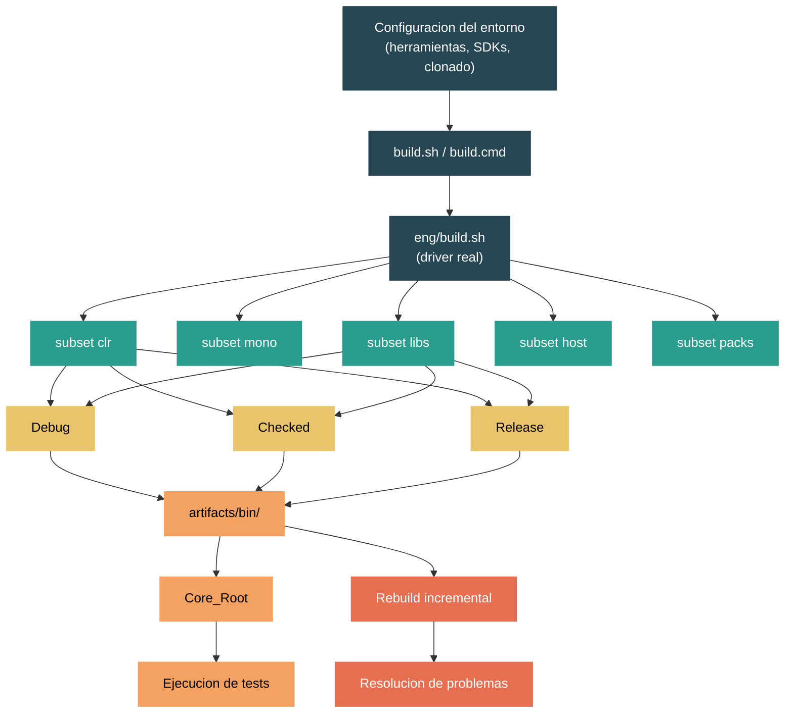

# Nivel 5: Experto / Contribuidor -- Compilar el Runtime desde el Codigo Fuente

> **Perfil objetivo:** Desarrollador listo para contribuir a `dotnet/runtime` que necesita compilar, iterar y probar localmente
> **Esfuerzo estimado:** 8 horas
> **Prerrequisitos:** Nivel 4 completo
> [English version](../en/05-expert-building.md)

---

## Objetivos de Aprendizaje

Al finalizar este modulo vas a poder:

1. Configurar un entorno de build en Windows, Linux o macOS con todas las herramientas y dependencias necesarias.
2. Explicar el sistema de subsets -- `clr`, `mono`, `libs`, `host`, `packs` -- y como se combinan con `+`.
3. Ejecutar un build completo de CoreCLR + Libraries y entender la estructura de artefactos de salida.
4. Elegir los flags de configuration correctos (`-rc`, `-lc`, `-hc`, `-c`) y los niveles de configuration (Debug, Checked, Release) para tu flujo de trabajo.
5. Realizar rebuilds incrementales rapidos despues de modificar CoreLib, una libreria individual o codigo nativo del runtime.
6. Diagnosticar y corregir errores de build comunes: desajustes de SDK, warnings-as-errors y artefactos obsoletos.

---

## Mapa Conceptual



---

## Guia de Lectura del Codigo Fuente

| Dificultad | Archivo | Proposito |
|------------|---------|-----------|
| ★★ | `build.sh` | Punto de entrada -- delega a `eng/build.sh` (o `build.cmd` a `eng/build.ps1` en Windows) |
| ★★ | `build.cmd` | Punto de entrada en Windows -- invoca `eng/build.ps1` via PowerShell |
| ★★★ | `eng/build.sh` | El driver de build real. Parsea todos los flags CLI e invoca MSBuild |
| ★★★★ | `eng/Subsets.props` | Define todos los subsets (`clr`, `mono`, `libs`, etc.) y sus sub-componentes |
| ★★ | `global.json` | Fija la version del SDK y las versiones del tooling de Arcade |
| ★★★ | `eng/Versions.props` | Version del producto, major/minor/patch, etiquetas de prerelease |
| ★★ | `docs/workflow/requirements/windows-requirements.md` | Prerrequisitos de build en Windows |
| ★★ | `docs/workflow/requirements/linux-requirements.md` | Prerrequisitos de build en Linux |
| ★★ | `docs/workflow/requirements/macos-requirements.md` | Prerrequisitos de build en macOS |
| ★★★ | `docs/workflow/building/coreclr/README.md` | Guia de build de CoreCLR -- rutas de salida, Core_Root, compilacion cruzada |
| ★★★ | `docs/workflow/building/libraries/README.md` | Guia de build de Libraries -- flujo de trabajo diario, flags de framework |
| ★★ | `docs/workflow/building/mono/README.md` | Guia de build de Mono -- escenarios moviles, WASM |
| ★★ | `CLAUDE.md` | Vision general del repositorio y comandos de build canonicos |

---

## Curriculo

### Leccion 1 -- Prerrequisitos y Configuracion del Entorno

#### Lo que vas a aprender

Antes de compilar el runtime, necesitas un entorno correcto. Una herramienta faltante o una version incorrecta del SDK es la causa mas comun de fallos de build para contribuidores primerizos. Esta leccion te guia por lo que se requiere en cada plataforma y como el repositorio gestiona su propio SDK.

#### El concepto

El repositorio `dotnet/runtime` requiere toolchains nativos especificos de la plataforma (compiladores C/C++, CMake, linkers) ademas del SDK de .NET. El repositorio fija su propia version de SDK en `global.json`, asi que no necesitas instalar un SDK de .NET por separado -- el sistema de build descarga la version exacta que necesita en el directorio `.dotnet/` en la raiz del repo.

Sin embargo, *si* necesitas el toolchain nativo. Los requisitos difieren segun la plataforma:

**Windows:**
- Visual Studio 2022 (17.8+) con las cargas de trabajo "Desarrollo de escritorio .NET" y "Desarrollo de escritorio con C++"
- Git para Windows con rutas largas habilitadas (`git config --system core.longpaths true`)
- Rutas largas habilitadas a nivel del sistema operativo
- El repo incluye un archivo `.vsconfig` que podes importar en el Visual Studio Installer

**Linux (Debian/Ubuntu):**
- `build-essential`, `clang`, `cmake` (3.26+), `lld`, `llvm`, `ninja-build`
- Librerias: `libicu-dev`, `libkrb5-dev`, `liblttng-ust-dev`, `libssl-dev`
- Script auxiliar: `eng/common/native/install-dependencies.sh`

**macOS:**
- Xcode developer tools
- `cmake` (3.26+), `icu4c`, `pkg-config`, `python3`, `ninja` (instalables via Homebrew)
- Script auxiliar: `eng/common/native/install-dependencies.sh`

#### En el codigo fuente

Abri `global.json` en la raiz del repositorio:

```json
{
  "sdk": {
    "version": "11.0.100-preview.3.26170.106",
    "allowPrerelease": true,
    "rollForward": "major"
  },
  "tools": {
    "dotnet": "11.0.100-preview.3.26170.106"
  }
}
```

El campo `sdk.version` es el SDK de .NET exacto que el build requiere. Cuando ejecutas `build.sh` o `build.cmd`, la infraestructura de build de Arcade verifica `.dotnet/dotnet` (o `.dotnet/dotnet.exe` en Windows). Si el SDK correcto no esta ahi, lo descarga automaticamente. La politica `rollForward: "major"` da flexibilidad, pero el build siempre apunta a la version fijada.

Ahora abri `eng/Versions.props`:

```xml
<PropertyGroup>
    <ProductVersion>11.0.0</ProductVersion>
    <MajorVersion>11</MajorVersion>
    <MinorVersion>0</MinorVersion>
    <PatchVersion>0</PatchVersion>
    <PreReleaseVersionLabel>preview</PreReleaseVersionLabel>
    <PreReleaseVersionIteration>4</PreReleaseVersionIteration>
</PropertyGroup>
```

Esto te dice que el producto apunta a .NET 11 Preview 4. Cada artefacto generado desde el repo llevara esta version.

#### Ejercicio practico

1. Clona el repositorio si todavia no lo hiciste: `git clone https://github.com/dotnet/runtime.git`
2. Verifica los prerrequisitos de tu plataforma consultando el documento correspondiente en `docs/workflow/requirements/`.
3. En Linux/macOS, ejecuta `eng/common/native/install-dependencies.sh` y verifica que complete sin errores.
4. En Windows, abri el Visual Studio Installer e importa el archivo `.vsconfig` desde la raiz del repo.
5. Lee `global.json` y anota la version del SDK. Confirma que `.dotnet/` todavia no existe (el build lo creara) o que contiene el SDK correcto.

#### Conclusion clave

El sistema de build es auto-bootstrapping para el SDK de .NET -- no lo instalas vos mismo. Pero los toolchains nativos (compilador C++, CMake, linker) deben instalarse manualmente. Tene esto resuelto antes de intentar tu primer build.

#### Concepto erroneo comun

"Necesito instalar el SDK de .NET desde la pagina oficial de descarga." No -- el repo descarga su propio SDK en `.dotnet/`. Instalar un SDK a nivel del sistema puede causar conflictos de versiones. Despues de compilar, configura tu PATH: `export PATH="$(pwd)/.dotnet:$PATH"` para usar el SDK local del repo.

---

### Leccion 2 -- Entendiendo los Build Subsets

#### Lo que vas a aprender

El repositorio `dotnet/runtime` es enorme -- un build completo de todo tarda mas de una hora. El sistema de subsets te permite compilar solo los componentes en los que estas trabajando. Entender los subsets es esencial para iterar productivamente.

#### El concepto

Un **subset** es un grupo nombrado de proyectos dentro del repositorio. Los subsets principales de nivel superior son:

| Subset | Que compila |
|--------|------------|
| `clr` | Runtime de CoreCLR: VM nativa, JIT, GC, CoreLib, ILC, herramientas nativas |
| `mono` | Runtime de Mono: para moviles, WASM, escenarios embebidos |
| `libs` | Librerias de clases administradas (BCL): System.Collections, System.Net.Http, etc. |
| `host` | Ejecutables nativos del host: `dotnet`, `hostfxr`, `hostpolicy` |
| `packs` | Paquetes NuGet e instaladores para distribucion |
| `tools` | Herramientas de soporte como ILLink y cDAC |

Combinas subsets con `+`:

```bash
./build.sh clr+libs          # CoreCLR y librerias
./build.sh mono+libs          # Mono y librerias
./build.sh clr+libs+host      # CoreCLR, librerias y host
```

Cuando no pasas ningun subset, el default es `clr+mono+libs+tools+host+packs` -- todo.

Cada subset de nivel superior se expande en sub-subsets mas granulares. Por ejemplo, `clr` se expande a:

```
clr.native + clr.corelib + clr.tools + clr.nativecorelib + clr.packages
+ clr.nativeaotlibs + clr.crossarchtools + host.native
```

Podes apuntar a sub-subsets individuales para rebuilds quirurgicos:

```bash
./build.sh clr.corelib        # Solo CoreLib administrado
./build.sh clr.jit            # Solo el compilador JIT
./build.sh libs.sfx           # Solo las librerias del shared framework
```

#### En el codigo fuente

Abri `eng/Subsets.props`. El archivo comienza con un comentario claro:

```xml
<!--
    This file defines the list of projects to build and divides them into subsets.
    Examples:
      ./build.sh host.native         -- builds only the .NET host
      ./build.sh libs+host.native    -- builds the .NET host and also managed libraries
      ./build.sh -test host.tests    -- builds and executes installer test projects
-->
```

Los subsets por default se definen alrededor de la linea 72:

```xml
<DefaultSubsets>clr+mono+libs+tools+host+packs</DefaultSubsets>
```

La logica de expansion comienza alrededor de la linea 175:

```xml
<_subset>$(_subset.Replace('+clr+', '+$(DefaultCoreClrSubsets)+'))</_subset>
<_subset>$(_subset.Replace('+mono+', '+$(DefaultMonoSubsets)+'))</_subset>
<_subset>$(_subset.Replace('+libs+', '+$(DefaultLibrariesSubsets)+'))</_subset>
<_subset>$(_subset.Replace('+host+', '+$(DefaultHostSubsets)+'))</_subset>
<_subset>$(_subset.Replace('+packs+', '+$(DefaultPacksSubsets)+'))</_subset>
```

Es un simple reemplazo de cadenas -- cuando decis `clr`, el sistema de build lo reemplaza con la lista completa de sub-subsets de CoreCLR. La propiedad `DefaultCoreClrSubsets` se define alrededor de la linea 111:

```xml
<DefaultCoreClrSubsets>clr.native+clr.corelib+clr.tools+clr.nativecorelib+clr.packages
  +clr.nativeaotlibs+clr.crossarchtools+host.native</DefaultCoreClrSubsets>
```

Debajo de eso, el archivo define items `SubsetName` que describen cada sub-subset:

```xml
<SubsetName Include="Clr" Description="The full CoreCLR runtime." />
<SubsetName Include="Clr.Runtime" Description="The CoreCLR .NET runtime." />
<SubsetName Include="Clr.Jit" Description="The JIT for the CoreCLR .NET runtime." />
<SubsetName Include="Clr.Native" Description="All CoreCLR native non-test components." />
```

#### Ejercicio practico

1. Abri `eng/Subsets.props` y encontra la propiedad `DefaultSubsets`. Observa como cambia para targets moviles (`TargetsMobile`).
2. Ejecuta `./build.sh -subset help` (o `build.cmd -subset help` en Windows) para ver la lista completa de subsets disponibles en la consola.
3. Rastrea que pasa cuando especificas `clr+libs`: segui la cadena de reemplazo de cadenas en `Subsets.props` y anota la lista completa de sub-subsets que se van a compilar.
4. Encontra la propiedad `DefaultLibrariesSubsets`. Observa que incluye `libs.native+libs.sfx+libs.oob+libs.pretest`.

#### Conclusion clave

Los subsets son el mecanismo principal para controlar que compilas. Para el trabajo diario con librerias, `clr+libs` es tu baseline. Para trabajo en la VM de CoreCLR, a menudo solo necesitas `clr`. Siempre usa el subset mas especifico posible para minimizar el tiempo de build.

#### Concepto erroneo comun

"Necesito compilar `mono` cada vez." A menos que estes trabajando en Mono o targets moviles/WASM, nunca necesitas el subset `mono`. De manera similar, raramente necesitas `host` o `packs` a menos que estes trabajando en el instalador o creando paquetes distribuibles.

---

### Leccion 3 -- Tu Primer Build: CoreCLR + Libraries

#### Lo que vas a aprender

Esta leccion te guia paso a paso por el build baseline mas comun -- el runtime de CoreCLR mas las librerias administradas. Vas a entender que produce el build y donde se ubican los artefactos.

#### El concepto

El primer build canonico para un contribuidor que trabaja en CoreCLR o las librerias es:

```bash
# Linux/macOS
./build.sh clr+libs -rc release

# Windows
build.cmd clr+libs -rc release
```

Esto compila:
- Runtime de CoreCLR en configuration Release (codigo nativo optimizado, sin assertions de debug)
- Libraries en configuration Debug (el default, con soporte completo de depuracion)

Esta combinacion es el flujo de trabajo diario recomendado porque:
1. Raramente modificas el codigo nativo del runtime, asi que un build Release evita la sobrecarga de assertions de debug en cada ejecucion de tests de librerias.
2. El codigo de librerias es sobre lo que vas a iterar mas seguido, asi que la configuration Debug te da informacion de depuracion completa.
3. Es la misma combinacion que usa el CI para la mayoria de las pruebas de librerias.

**Tiempo esperado:** Un build limpio en una maquina moderna (8+ nucleos, SSD) tarda aproximadamente 20-40 minutos. Los builds subsiguientes son mucho mas rapidos porque el sistema de build cachea resultados intermedios.

#### El pipeline de build

Cuando ejecutas `./build.sh clr+libs -rc release`, esto es lo que pasa:

1. `build.sh` en la raiz del repo es un wrapper delgado que delega a `eng/build.sh`.
2. `eng/build.sh` parsea tus flags e invoca MSBuild con las propiedades apropiadas.
3. MSBuild evalua `eng/Subsets.props` para expandir `clr+libs` en sub-subsets.
4. Cada sub-subset se compila en orden de dependencias:
   - `clr.native` -- compila el runtime nativo en C++ (VM, GC, JIT)
   - `clr.corelib` -- compila `System.Private.CoreLib` (la mitad administrada de CoreLib)
   - `clr.nativecorelib` -- compila la mitad nativa de CoreLib (crossgen2 para crear la imagen R2R)
   - `clr.tools` -- compila Crossgen2, ILC y otras herramientas administradas
   - `libs.native` -- compila shims nativos para las librerias
   - `libs.sfx` -- compila las librerias del shared framework (el BCL principal)
   - `libs.oob` -- compila las librerias out-of-band (distribuidas via NuGet)
   - `libs.pretest` -- prepara el layout del test host

#### Ubicaciones de artefactos

Despues de un build exitoso, los directorios de salida clave son:

| Ruta | Contenido |
|------|-----------|
| `artifacts/bin/coreclr/<OS>.<Arch>.<Config>/` | Binarios nativos de CoreCLR: `libcoreclr.so`, `corerun`, `System.Private.CoreLib.dll` |
| `artifacts/bin/runtime/<TFM>-<OS>-<Config>-<Arch>/` | Salida combinada de runtime + librerias |
| `artifacts/obj/` | Archivos intermedios de build (se pueden borrar sin riesgo para builds limpios) |
| `artifacts/log/` | Logs de build |
| `.dotnet/` | El SDK de .NET local del repo |

El binario mas importante es `corerun` (o `corerun.exe` en Windows) -- es un host minimo que carga CoreCLR y ejecuta un assembly administrado directamente, evitando el host `dotnet` completo. Es la herramienta principal para ejecutar tests del runtime.

#### Ejercicio practico

1. Ejecuta el build baseline:
   ```bash
   # Linux/macOS
   ./build.sh clr+libs -rc release

   # Windows
   build.cmd clr+libs -rc release
   ```
2. Mientras compila, observa la salida. Nota las transiciones de fase: restaurando paquetes NuGet, compilando codigo nativo (CMake/make), compilando codigo administrado (MSBuild).
3. Cuando termine, explora el directorio `artifacts/bin/coreclr/`. Encontra `corerun` y `System.Private.CoreLib.dll`.
4. Configura el SDK local del repo:
   ```bash
   export PATH="$(pwd)/.dotnet:$PATH"
   ```
5. Verifica que el SDK funciona: `dotnet --version` deberia imprimir la version de `global.json`.

#### Conclusion clave

`./build.sh clr+libs -rc release` es el primer build canonico. Tipicamente tarda 20-40 minutos en un repo limpio. Despues de esto, podes iterar en librerias individuales usando `dotnet build` directamente sin volver a ejecutar el script de build completo.

#### Concepto erroneo comun

"Deberia compilar todo en Debug." Compilar el codigo nativo de CoreCLR en Debug es extremadamente lento en ejecucion porque habilita comprobaciones de assertions costosas en cada operacion. Para desarrollo de librerias, `-rc release` (runtime en Release) con librerias en Debug es el punto optimo. Solo usa `-rc debug` o `-rc checked` cuando necesites depurar el runtime en si mismo.

---

### Leccion 4 -- Flags de Configuration

#### Lo que vas a aprender

El sistema de build soporta tres niveles de configuration (Debug, Checked, Release) y cuatro flags de configuration separados para diferentes componentes. Elegir la combinacion correcta evita desperdiciar horas en builds innecesariamente lentos o perder informacion de diagnostico.

#### El concepto

**Tres niveles de configuration:**

| Configuration | Assertions | Optimizaciones nativas | Optimizaciones administradas | Caso de uso |
|--------------|-----------|----------------------|----------------------------|-------------|
| **Debug** | Habilitadas | Deshabilitadas | Deshabilitadas | Depurar codigo nativo del runtime |
| **Checked** | Habilitadas | Habilitadas | N/A (solo CoreCLR) | Ejecutar tests del runtime -- rapido con redes de seguridad |
| **Release** | Deshabilitadas | Habilitadas | Habilitadas | Benchmarks de rendimiento, desarrollo de librerias |

**Checked** es unico de CoreCLR. Mantiene las comprobaciones de assertions activas (detectando bugs temprano) pero habilita las optimizaciones del compilador en el codigo nativo (para que el runtime ejecute a velocidad razonable). Esta es la configuration que usa el CI para ejecutar la suite de tests de CoreCLR.

**Cuatro flags de configuration:**

| Flag | Corto | Controla | Default |
|------|-------|----------|---------|
| `-runtimeConfiguration` | `-rc` | Runtime nativo de CoreCLR/Mono | Debug |
| `-librariesConfiguration` | `-lc` | Librerias administradas (BCL) | Debug |
| `-hostConfiguration` | `-hc` | Host nativo (`dotnet`, `hostfxr`) | Debug |
| `-configuration` | `-c` | Default para todos los subsets sin calificar | Debug |

El flag `-c` establece el default para cualquier componente que no tenga un flag especifico. Los flags especificos (`-rc`, `-lc`, `-hc`) sobreescriben `-c` para su componente respectivo.

#### En el codigo fuente

Abri `eng/build.sh` y mira la salida de uso (lineas 24-42):

```
--configuration (-c)            Build configuration: Debug, Release or Checked.
                                Checked is exclusive to the CLR subset.
--hostConfiguration (-hc)       Host build configuration: Debug, Release or Checked.
--librariesConfiguration (-lc)  Libraries build configuration: Debug or Release.
--runtimeConfiguration (-rc)    Runtime build configuration: Debug, Release or Checked.
```

Observa que `-lc` solo acepta Debug o Release (no Checked) -- Checked es un concepto especifico de CoreCLR que controla el comportamiento de assertions nativas.

#### Recetas de build comunes

Estas son las compilaciones recomendadas de `CLAUDE.md` para diferentes flujos de trabajo:

| Flujo de trabajo | Comando | Por que |
|-----------------|---------|---------|
| Desarrollo de librerias | `./build.sh clr+libs -rc release` | Runtime rapido, librerias depurables |
| Depuracion de CoreCLR | `./build.sh clr+libs` | Runtime en Debug (default), librerias en Debug |
| Suite de tests del runtime | `./build.sh clr+libs -lc release -rc checked` | Runtime Checked (assertions + optimizacion), librerias Release (tests rapidos) |
| Benchmarks de rendimiento | `./build.sh clr+libs -rc release -lc release` | Todo optimizado |
| Compilar instaladores | `./build.sh clr+libs+host -rc release -lc release` | Build Release completo incluyendo host |
| Desarrollo de CoreLib | `./build.sh clr+libs -rc checked` | Runtime Checked con assertions para detectar bugs en CoreLib |
| Librerias WASM | `./build.sh mono+libs -os browser` | Runtime Mono para target del navegador |

#### La advertencia del apphost

Un detalle sutil de `docs/workflow/building/coreclr/README.md`:

> Cuando se compila CoreCLR, el `apphost` tambien se construye como parte del build. Sin embargo, `apphost` pertenece al subset `host`. Esto significa que si solo pasas el flag `runtimeConfiguration` y/o `librariesConfiguration`, el `apphost` se compilara en `Debug`. Esto resulta en problemas al intentar compilar los tests.

La solucion: cuando compilas para tests, siempre incluye `-c` junto con `-rc`:

```bash
./build.sh clr+libs -rc checked -c release
```

#### Ejercicio practico

1. Compila CoreCLR en configuration Checked con librerias en Release:
   ```bash
   ./build.sh clr+libs -rc checked -lc release
   ```
2. Compara los nombres de los directorios de salida. Deberias ver directorios como `artifacts/bin/coreclr/linux.x64.Checked/` y `artifacts/bin/runtime/net11.0-linux-Release-x64/`.
3. Encontra `corerun` en la salida del build Checked y ejecutalo sin argumentos -- deberia imprimir un mensaje de uso.
4. Recompila con solo `-c debug` (sin `-rc` ni `-lc`) y observa que todos los componentes usan Debug por default.

#### Conclusion clave

Usa `-rc` para controlar el runtime, `-lc` para las librerias, y `-c` como default general. La configuration diaria mas productiva para desarrollo de librerias es `-rc release` con librerias en Debug por default. Para desarrollo de tests del runtime, usa `-rc checked -lc release`.

#### Concepto erroneo comun

"Checked es simplemente Debug con otro nombre." No -- Checked tiene las optimizaciones del compilador nativo habilitadas, lo que lo hace significativamente mas rapido que Debug. Lo unico que conserva de Debug son las comprobaciones de assertions. Un build Checked puede ser 3-5x mas rapido que Debug para cargas de trabajo intensivas del runtime mientras sigue detectando violaciones de assertions.

---

### Leccion 5 -- Builds Incrementales e Iteracion

#### Lo que vas a aprender

Despues del build inicial de 20-40 minutos, casi nunca deberias necesitar ejecutar el build completo de nuevo. Esta leccion te ensena a recompilar solo lo que cambio, reduciendo los tiempos de iteracion de minutos a segundos.

#### El concepto

El soporte incremental del sistema de build varia segun el componente:

**1. Modificar una libreria administrada** -- Usa `dotnet build` directamente:

```bash
cd src/libraries/System.Collections/src
dotnet build
```

Esto tarda segundos, no minutos. El comando `dotnet build` usa el runtime ya compilado y solo recompila la libreria modificada. Tambien podes compilar y ejecutar tests:

```bash
cd src/libraries/System.Collections
dotnet build
dotnet build /t:test ./tests/System.Collections.Tests.csproj
```

**2. Modificar System.Private.CoreLib** -- Usa un rebuild dirigido:

CoreLib abarca multiples directorios y tiene componentes tanto administrados como nativos. Cuando cambias codigo de CoreLib, usa este comando:

```bash
./build.sh clr.corelib+clr.nativecorelib+libs.pretest -rc checked
```

Esto recompila el CoreLib administrado, crea la imagen nativa y actualiza el test host -- tipicamente 2-5 minutos en vez de 20-40.

**3. Modificar codigo nativo del runtime (C++)** -- Recompila el subset nativo:

```bash
./build.sh clr.native -rc checked
```

Si solo cambiaste el JIT:

```bash
./build.sh clr.jit -rc checked
```

**4. Ejecutar tests del runtime de CoreCLR** -- Genera Core_Root y luego ejecuta tests individuales:

```bash
# Generar el layout de Core_Root (una sola vez despues del build)
src/tests/build.sh -generatelayoutonly x64 Checked

# Establecer CORE_ROOT
export CORE_ROOT=$(pwd)/artifacts/tests/coreclr/linux.x64.Checked/Tests/Core_Root

# Ejecutar un test individual
cd artifacts/tests/coreclr/linux.x64.Checked/<ruta-del-test>/
$CORE_ROOT/corerun <NombreDelTest>.dll
# Codigo de salida 100 = aprobado
```

#### El bucle interno para desarrollo de librerias

El ciclo de iteracion mas rapido para trabajo con librerias:

```bash
# Baseline de una sola vez (si no se hizo antes):
./build.sh clr+libs -rc release

# Iteracion diaria:
export PATH="$(pwd)/.dotnet:$PATH"
cd src/libraries/System.Text.Json/src
dotnet build                                    # recompilar la libreria
cd ../tests
dotnet build /t:test                           # compilar y ejecutar tests
```

Los usuarios de Visual Studio tambien pueden abrir una solucion directamente:

```bash
# Windows
build.cmd -vs System.Text.Json
```

Esto genera y abre una solucion filtrada que incluye solo los proyectos relevantes, dandote soporte completo del IDE con IntelliSense.

#### En el codigo fuente

El comportamiento incremental esta controlado por el mecanismo estandar de verificacion de actualizaciones de MSBuild. Cada archivo `.csproj` o `.proj` del proyecto declara sus entradas y salidas. MSBuild omite el build si todas las salidas son mas nuevas que todas las entradas.

Para codigo nativo, el propio sistema de build incremental de CMake maneja el rastreo de dependencias a nivel de archivo. El subset `clr.native` invoca CMake, que solo recompila los archivos `.cpp` que cambiaron (o cuyos headers cambiaron).

#### Ejercicio practico

1. Despues de tu build baseline, haz un cambio trivial en una libreria (ej., agrega un comentario a un archivo en `src/libraries/System.Collections/src/`).
2. Recompila solo esa libreria con `dotnet build` desde el directorio `src/`. Anota el tiempo.
3. Ejecuta los tests: `dotnet build /t:test` desde el directorio `tests/`. Observa que tests se ejecutan.
4. Ahora haz un cambio en `src/libraries/System.Private.CoreLib/src/System/Object.cs` (agrega un comentario). Recompila CoreLib:
   ```bash
   ./build.sh clr.corelib+clr.nativecorelib+libs.pretest -rc checked
   ```
5. Compara el tiempo de rebuild de una libreria individual (paso 2) vs CoreLib (paso 4).

#### Conclusion clave

Despues del build baseline, usa `dotnet build` para cambios en librerias (segundos) y sub-subsets dirigidos como `clr.corelib` o `clr.jit` para cambios en el runtime (minutos). Nunca vuelvas a ejecutar el build completo `clr+libs` a menos que hayas bajado cambios significativos del upstream.

#### Concepto erroneo comun

"Necesito ejecutar `./build.sh` cada vez que cambio una libreria." No. El script de build es para orquestacion de nivel superior. Para desarrollo de librerias individuales, `dotnet build` es mas rapido porque solo recompila el proyecto individual y usa el runtime ya compilado como dependencia. El script de build se vuelve necesario solo cuando cambias infraestructura transversal o necesitas recompilar el runtime en si.

---

### Leccion 6 -- Resolucion de Problemas en el Build

#### Lo que vas a aprender

Los fallos de build son inevitables, especialmente despues de bajar cambios nuevos o cambiar de rama. Esta leccion cubre los fallos mas comunes y sus soluciones, para que dediques tu tiempo a contribuir en vez de pelear con el sistema de build.

#### El concepto

Los fallos de build en `dotnet/runtime` caen en unas pocas categorias comunes:

**1. Warnings tratados como errores**

Por default, el build trata los warnings como errores. Esto es estricto a proposito para el CI, pero puede bloquearte durante el desarrollo activo. Para deshabilitarlo:

```bash
export TreatWarningsAsErrors=false
./build.sh clr+libs -rc release
```

O pasalo como propiedad de MSBuild:

```bash
./build.sh clr+libs -rc release /p:TreatWarningsAsErrors=false
```

**2. Desajuste de version del SDK**

Si ves errores sobre versiones de SDK faltantes o herramientas incompatibles, el SDK local del repo puede estar obsoleto:

```bash
# Borra el SDK local y deja que el build lo re-descargue
rm -rf .dotnet
./build.sh clr+libs -rc release
```

En Windows:
```cmd
rmdir /s /q .dotnet
build.cmd clr+libs -rc release
```

**3. Artefactos obsoletos despues de cambio de rama o pull importante**

Despues de `git pull` o cambiar de rama, los artefactos intermedios pueden quedar inconsistentes:

```bash
# Opcion nuclear: limpiar todo
git clean -xdf
./build.sh clr+libs -rc release
```

O de forma mas quirurgica:

```bash
# Limpiar solo los artefactos de build
rm -rf artifacts/bin artifacts/obj
./build.sh clr+libs -rc release
```

**4. Fallos de restauracion de NuGet**

Problemas de red o de fuentes de paquetes:

```bash
# Limpiar la cache de NuGet y reintentar
dotnet nuget locals all --clear
./build.sh clr+libs -rc release
```

**5. Fallos de CMake o del build nativo**

Si la compilacion nativa falla (especialmente despues de actualizar Visual Studio o los compiladores del sistema):

```bash
# Limpiar artefactos nativos de build especificamente
rm -rf artifacts/obj/coreclr
./build.sh clr.native -rc release
```

En Windows, asegurate de que las cargas de trabajo correctas de Visual Studio sigan instaladas despues de las actualizaciones.

**6. Problemas de rutas largas (Windows)**

El repo tiene estructuras de directorio profundas. Asegurate de que las rutas largas esten habilitadas:

```powershell
git config --system core.longpaths true
```

Y habilita las rutas largas en Windows mismo via el registro o Politicas de Grupo.

#### Herramientas de diagnostico

Cuando un build falla y la salida de consola no es suficiente, usa estos enfoques:

- **Log binario**: Agrega `-bl` para obtener un log detallado de MSBuild en `artifacts/log/`:
  ```bash
  ./build.sh clr+libs -rc release -bl
  ```
  Abri el archivo `.binlog` con el [MSBuild Structured Log Viewer](https://msbuildlog.com/) para una vista jerarquica y buscable de todo el build.

- **Salida detallada**: Aumenta la verbosidad de MSBuild:
  ```bash
  ./build.sh clr+libs -rc release -v detailed
  ```

- **Logs de build**: Revisa `artifacts/log/` para archivos de log por proyecto que a menudo contienen mas detalle que la salida de consola.

#### En el codigo fuente

El comportamiento de `TreatWarningsAsErrors` se establece en los archivos `Directory.Build.props` del repo y puede sobreescribirse con la variable de entorno. El archivo `CLAUDE.md` en la raiz del repo lo documenta:

```
### Disabling warnings-as-errors during development
export TreatWarningsAsErrors=false
```

La logica de bootstrapping del SDK vive en `eng/common/tools.sh` (Linux/macOS) y `eng/common/tools.ps1` (Windows). Estos scripts leen `global.json` y descargan el SDK correspondiente si no esta presente.

#### Ejercicio practico

1. Provoca intencionalmente un warning en un archivo de libreria (ej., declara una variable sin usar en codigo de `src/libraries/System.Collections/src/`).
2. Intenta compilar -- confirma que el build falla con "warning as error."
3. Establece `export TreatWarningsAsErrors=false` y recompila -- confirma que ahora tiene exito con un warning.
4. Revierte tu cambio y elimina la variable de entorno.
5. Ejecuta `./build.sh clr+libs -rc release -bl` y abri el archivo `.binlog` resultante para explorar la estructura del build.
6. Practica el flujo de build limpio: borra `artifacts/`, recompila y observa la diferencia de tiempo vs un build incremental.

#### Conclusion clave

La mayoria de los fallos de build caen en cinco categorias: warnings-as-errors, desajuste de SDK, artefactos obsoletos, problemas de NuGet y problemas del toolchain nativo. Conocer la solucion para cada uno ahorra horas. En caso de duda, `git clean -xdf` seguido de un build fresco resuelve casi todo -- solo te cuesta 20-40 minutos.

#### Concepto erroneo comun

"Si el build falla, algo esta fundamentalmente roto." La mayoria de los fallos de build son ambientales o relacionados con artefactos, no bugs de codigo. Antes de investigar profundamente, proba: (1) `export TreatWarningsAsErrors=false`, (2) borra `artifacts/obj/` y reintenta, (3) borra `.dotnet/` y reintenta. Estos tres pasos resuelven el 90% de los problemas de build de primera vez.

---

## Herramientas y Entorno

| Herramienta | Proposito | Donde obtenerla |
|-------------|-----------|----------------|
| `build.sh` / `build.cmd` | Punto de entrada para todos los builds | Raiz del repo |
| `corerun` | Host minimo para ejecutar codigo administrado contra tu build | `artifacts/bin/coreclr/<OS>.<Arch>.<Config>/` |
| `.dotnet/dotnet` | SDK local del repo para `dotnet build`, `dotnet test` | Se descarga automaticamente durante el primer build |
| MSBuild Structured Log Viewer | Analizar archivos `.binlog` de builds con `-bl` | [msbuildlog.com](https://msbuildlog.com/) |
| CMake | Requerido para builds nativos de C++ | Gestor de paquetes de la plataforma o cmake.org |
| Ninja | Backend rapido de build nativo (usado por CMake) | Gestor de paquetes de la plataforma |

---

## Autoevaluacion

Responde estas preguntas para verificar tu comprension:

1. Cual es el comando de build baseline recomendado para desarrollo de librerias? Por que se prefiere `-rc release` sobre el default?
2. A que se expande el subset `clr` en `eng/Subsets.props`? Nombra al menos cuatro sub-subsets.
3. En que difiere la configuration Checked de Debug y Release? Cuando elegirias cada una?
4. Despues de cambiar un archivo en `src/libraries/System.Text.Json/src/`, cual es la forma mas rapida de recompilar y probar?
5. Que controla `global.json` y por que no deberias instalar el SDK de .NET a nivel del sistema para desarrollo del runtime?
6. Bajas cambios nuevos y el build falla con "error CS8032: An instance of analyzer cannot be created." Que deberias probar primero?
7. Que es `Core_Root` y como lo generas?
8. Queres depurar un fallo de assertion de CoreCLR. Que configuration de build deberias usar y por que?

---

## Conexiones

| Direccion | Modulo | Relacion |
|-----------|--------|----------|
| Prerrequisito | [4.1 Inicio del CLR](04-internals-clr-startup.md) | Entender `corerun` y el comportamiento del host |
| Siguiente | [5.2 Infraestructura de Tests del Runtime](05-expert-testing.md) | Usa la salida del build de este modulo para ejecutar tests |
| Siguiente | [5.5 Agregar una Nueva API de BCL](05-expert-new-api.md) | Builds de librerias y estructura ref/src |
| Relacionado | [5.3 Contribuir un Cambio al JIT](05-expert-jit-contribution.md) | Usa el subset `clr.jit` para rebuilds dirigidos del JIT |
| Relacionado | [5.6 El Runtime de Mono](05-expert-mono.md) | Usa el subset `mono+libs` |
| Relacionado | [5.7 WebAssembly](05-expert-wasm.md) | Usa el subset `mono+libs -os browser` |

---

## Glosario

| Termino | Definicion |
|---------|-----------|
| **Subset** | Un grupo nombrado de proyectos en el sistema de build, definido en `eng/Subsets.props`. Controla que se compila. |
| **CoreCLR** | El motor de ejecucion principal de .NET, escrito en C/C++, incluyendo el JIT, GC y sistema de tipos. |
| **Mono** | Un runtime alternativo liviano usado para escenarios moviles, WASM y embebidos. |
| **CoreLib** | `System.Private.CoreLib` -- la libreria administrada fundamental que contiene `Object`, `String`, `Array`, etc. Abarca tres directorios en el repo. |
| **Core_Root** | Un directorio de layout de tests que contiene el runtime, todas las librerias y herramientas de test. La forma principal de ejecutar tests de CoreCLR. |
| **corerun** | Un host nativo minimo que carga CoreCLR directamente, evitando el host `dotnet` completo. Usado para testing. |
| **Checked** | Una configuration de build especifica de CoreCLR: optimizaciones nativas habilitadas, assertions habilitadas. Mas rapido que Debug, mas seguro que Release. |
| **Arcade** | La infraestructura de build compartida (SDKs de MSBuild, scripts) usada en los repositorios de .NET. Vive en `eng/common/`. |
| **TFM** | Target Framework Moniker, ej., `net11.0`. Identifica que version de .NET apunta el codigo. |
| **R2R** | ReadyToRun -- imagenes nativas compiladas anticipadamente que aceleran el inicio. CoreLib siempre se compila como R2R. |
| **Log binario (.binlog)** | Un formato de log estructurado de MSBuild que captura cada evaluacion, target y tarea. Invaluable para depurar problemas de build. |

---

## Referencias

| Recurso | Tipo | Relevancia |
|---------|------|-----------|
| [Compilar CoreCLR](docs/workflow/building/coreclr/README.md) | Docs del repo | Guia detallada de build de CoreCLR |
| [Compilar Libraries](docs/workflow/building/libraries/README.md) | Docs del repo | Flujo de trabajo de build e iteracion diaria de librerias |
| [Compilar Mono](docs/workflow/building/mono/README.md) | Docs del repo | Build de Mono para moviles y WASM |
| [Requisitos de Windows](docs/workflow/requirements/windows-requirements.md) | Docs del repo | Prerrequisitos de herramientas en Windows |
| [Requisitos de Linux](docs/workflow/requirements/linux-requirements.md) | Docs del repo | Prerrequisitos de paquetes en Linux |
| [Requisitos de macOS](docs/workflow/requirements/macos-requirements.md) | Docs del repo | Prerrequisitos de herramientas en macOS |
| [README de Workflow](docs/workflow/README.md) | Docs del repo | Vision general de todos los flujos de trabajo de build y test |
| [MSBuild Structured Log Viewer](https://msbuildlog.com/) | Herramienta | Analizar logs binarios de builds fallidos |
| [.NET Source Browser](https://source.dot.net/) | Herramienta | Buscar el codigo fuente del runtime en linea |
| [CLAUDE.md](CLAUDE.md) | Docs del repo | Comandos de build y convenciones canonicas |

---

*Este modulo es la puerta de entrada para contribuir a dotnet/runtime. Una vez que puedas compilar e iterar con confianza, todo lo demas del Nivel 5 se vuelve practico.*

*Ultima actualizacion: 2026-04-14*
