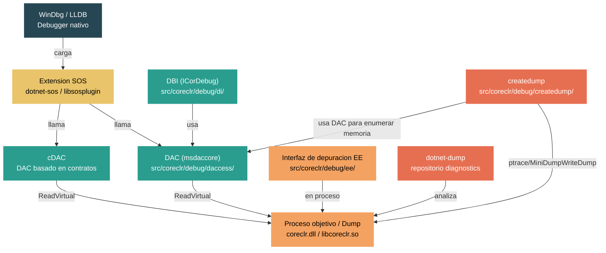

# Nivel 5: Experto — Depuracion del Runtime con SOS, LLDB y WinDbg

> **Perfil objetivo:** Contributor del runtime o ingeniero de rendimiento que necesita depurar el CLR a nivel nativo -- inspeccionar objetos managed desde un debugger nativo, analizar crash dumps y entender el DAC
> **Esfuerzo estimado:** 8 horas
> **Prerequisitos:** Modulo 4.1 (Arranque del CLR), Modulo 5.1
> [English version](../en/05-expert-debugging.md)

---

## Objetivos de Aprendizaje

Al finalizar este modulo seras capaz de:

1. Describir la arquitectura de depuracion de cuatro capas del CLR: la interfaz de depuracion del motor de ejecucion (EE), el Data Access Component (DAC), la interfaz de depuracion (DBI/ICorDebug) y SOS.
2. Instalar y cargar SOS en WinDbg y LLDB, y ejecutar comandos fundamentales para inspeccionar un proceso .NET en vivo.
3. Usar comandos SOS (`DumpObj`, `DumpMT`, `DumpHeap`, `GCRoot`, `ClrStack`) para inspeccionar estado managed desde un debugger nativo.
4. Colocar breakpoints en codigo del VM (por ejemplo, `MethodDesc::DoPrestub`, `JIT_New`), recorrer la compilacion JIT paso a paso y correlacionar frames managed con nativos.
5. Generar crash dumps con `createdump` y `dotnet-dump`, y analizar dumps de produccion para diagnosticar fallas comunes (stack overflow, violacion de acceso, deadlock).
6. Explicar que es el DAC, por que existe, como los tipos `PTR_` permiten la inspeccion fuera de proceso, y como el cDAC (DAC basado en contratos) esta evolucionando la arquitectura.

---

## Mapa Conceptual



---

## Curriculum

### Leccion 1 — La Arquitectura de Depuracion: DAC, DBI, SOS y la Interfaz de Depuracion del EE

#### Lo que vas a aprender

Antes de poder depurar el runtime de .NET de forma efectiva, necesitas entender como encajan los componentes de depuracion. A diferencia de la depuracion tipica de aplicaciones, la depuracion managed requiere una arquitectura especializada porque los objetos se mueven en memoria (GC), los tipos se cargan de forma perezosa y el codigo se compila JIT en tiempo de ejecucion.

#### El concepto

La arquitectura de depuracion de .NET tiene cuatro capas principales:

**1. La Interfaz de Depuracion del Motor de Ejecucion (`src/coreclr/debug/ee/`)**

Este es el soporte de depuracion en proceso. La clase `Debugger` (declarada en `debugger.h`) se ejecuta en un hilo auxiliar dentro del proceso objetivo. Maneja la insercion de breakpoints, el paso a paso, la evaluacion de funciones y se comunica con el proceso del debugger a traves de un canal de eventos IPC. Archivos clave:

- `debugger.cpp` / `debugger.h` -- la clase principal `Debugger`, el Controlador del Runtime
- `controller.cpp` -- `DebuggerController` administra breakpoints y steppers
- `funceval.cpp` -- evaluacion de funciones (la capacidad de llamar metodos managed desde el debugger)
- `rcthread.cpp` -- el hilo del Controlador del Runtime que procesa eventos de depuracion

La interfaz de depuracion del EE responde a eventos como "modulo cargado", "breakpoint alcanzado" o "excepcion lanzada" y los comunica al debugger fuera de proceso.

**2. El Data Access Component (DAC) (`src/coreclr/debug/daccess/`)**

El DAC es una compilacion especial de partes del runtime que puede leer el estado del runtime fuera de proceso -- desde otro proceso o desde un archivo de dump. Se compila a partir de las mismas fuentes que el runtime pero con la definicion de preprocesador `DACCESS_COMPILE`. Esto significa que reutiliza los algoritmos reales del runtime para recorrer estructuras de datos, pero todo acceso a memoria pasa por llamadas `ReadVirtual` a una interfaz de data target.

El DAC produce `msdaccore.dll` (Windows) o `libmscordaccore.so` (Linux) / `libmscordaccore.dylib` (macOS). Archivos clave:

- `daccess.cpp` -- la implementacion de `ClrDataAccess`, punto de entrada del DAC
- `request.cpp` -- implementa `ISOSDacInterface`, la superficie de API que SOS llama
- `dacimpl.h` -- header central con macros de conversion de direcciones (`TO_CDADDR`, `CLRDATA_ADDRESS_TO_TADDR`)
- `enummem.cpp` -- enumeracion de regiones de memoria para generacion de minidumps
- `dacdbiimpl.cpp` -- implementacion del lado DAC de la interfaz DBI

**3. La Interfaz de Depuracion (DBI) (`src/coreclr/debug/di/`)**

DBI implementa la familia de interfaces COM `ICorDebug`, que es la API publica de depuracion managed usada por Visual Studio y otros debuggers. Se ejecuta en el proceso del debugger y usa el DAC para inspeccion fuera de proceso. Archivos clave:

- `process.cpp` -- `CordbProcess`, la representacion del objetivo en el lado del debugger
- `module.cpp` -- `CordbModule`, representa ensamblados cargados
- `rsthread.cpp` -- `CordbThread`, inspeccion de hilos
- `shimprocess.cpp` -- la capa shim que conecta APIs de depuracion antiguas y nuevas

**4. SOS (Son of Strike)**

SOS es una extension de debugger que provee comandos legibles para inspeccionar estado managed. Vive en el [repositorio diagnostics](https://github.com/dotnet/diagnostics) (no en el repositorio del runtime) y llama al DAC a traves de `ISOSDacInterface`. SOS es lo que usas cuando escribis `!DumpObj` en WinDbg o `sos DumpObj` en LLDB.

#### En el codigo fuente

La relacion entre estos componentes es visible en la estructura de directorios:

```
src/coreclr/debug/
    ee/           -- Soporte de depuracion en proceso (Debugger, DebuggerController)
    daccess/      -- DAC: acceso a datos fuera de proceso
    di/           -- DBI: implementacion de ICorDebug
    inc/          -- Headers compartidos (dacdbiinterface.h, dbgipcevents.h)
    createdump/   -- Utilidad de generacion de crash dumps
    debug-pal/    -- Abstraccion de plataforma para primitivas de depuracion
    shared/       -- Codigo de transporte compartido (dbgtransportsession.cpp)
    runtimeinfo/  -- Estructuras de informacion del runtime exportadas para debuggers
```

En `src/coreclr/debug/daccess/request.cpp`, podes ver como se manejan las solicitudes de SOS. Toda funcion que sirve a SOS usa los macros `SOSDacEnter()` / `SOSDacLeave()`:

```cpp
#define SOSDacEnter()   \
    DAC_ENTER();        \
    HRESULT hr = S_OK;  \
    EX_TRY              \
    {

#define SOSDacLeave()   \
    }                   \
    EX_CATCH            \
    {                   \
        if (!DacExceptionFilter(GET_EXCEPTION(), this, &hr)) \
        {               \
            EX_RETHROW; \
        }               \
    }                   \
    EX_END_CATCH        \
    DAC_LEAVE();
```

Este patron asegura que todas las operaciones del DAC estan debidamente protegidas -- se adquiere el mutex del DAC, las excepciones se capturan y traducen a HRESULTs, y cualquier error al leer memoria del objetivo se maneja de forma elegante en lugar de hacer que el debugger falle.

#### Ejercicio practico

1. Compila una configuracion Debug de CoreCLR: `build.cmd -s clr -c Debug` (Windows) o `./build.sh -s clr -c Debug` (Linux/macOS).
2. Despues de compilar, localiza el binario del DAC en `artifacts/bin/coreclr/<os>.<arch>.Debug/`:
   - Windows: `mscordaccore.dll`
   - Linux: `libmscordaccore.so`
   - macOS: `libmscordaccore.dylib`
3. Tambien localiza `createdump` en el mismo directorio.
4. Abri `src/coreclr/debug/daccess/dacimpl.h` y lee los macros de conversion de direcciones al inicio (lineas 21-100). Identifica `TO_CDADDR`, `CLRDATA_ADDRESS_TO_TADDR` y `CORDB_ADDRESS_TO_TADDR`. Nota el comentario sobre extension de signo vs. extension de ceros.

#### Conclusion clave

La depuracion managed es fundamentalmente diferente de la depuracion nativa porque el estado del runtime es opaco para un debugger nativo estandar. La arquitectura de cuatro capas -- EE (en proceso), DAC (lector fuera de proceso), DBI (API publica) y SOS (comandos amigables) -- existe para cerrar esta brecha. El DAC es la pieza mas critica: permite a las herramientas leer estructuras de datos del runtime desde un proceso muerto (archivo de dump) usando los mismos algoritmos que usa el runtime en vivo.

---

### Leccion 2 — Configuracion de SOS: Instalacion, Carga y Comandos Basicos

#### Lo que vas a aprender

SOS es tu herramienta principal para inspeccionar estado managed desde un debugger nativo. Esta leccion cubre como instalarlo, cargarlo en WinDbg y LLDB, y ejecutar tus primeros comandos contra un proceso .NET en vivo.

#### El concepto

SOS (Son of Strike -- una referencia a "Lightning Strike", el nombre clave original del proyecto CLR) es una extension de debugger que traduce estructuras de datos de bajo nivel del runtime en salida legible. Se mantiene en el repositorio [dotnet/diagnostics](https://github.com/dotnet/diagnostics) y se distribuye como herramienta global (`dotnet-sos`) o incluido con WinDbg.

**Metodos de instalacion:**

```bash
# Metodo 1: Instalar como herramienta global (recomendado para LLDB)
dotnet tool install -g dotnet-sos
dotnet-sos install

# Metodo 2: WinDbg (versiones recientes) viene con SOS incluido
# Solo abri un proceso .NET y los comandos SOS estan disponibles automaticamente

# Metodo 3: Carga manual (para compilaciones personalizadas de SOS)
# En LLDB:
plugin load /path/to/libsosplugin.so    # Linux
plugin load /path/to/libsosplugin.dylib  # macOS

# En WinDbg:
.load /path/to/sos.dll
```

**Carga en WinDbg:**

En WinDbg moderno (WinDbg Preview / WinDbgX), SOS se carga automaticamente al adjuntarse o abrir un dump de un proceso .NET. Para versiones anteriores o compilaciones personalizadas:

```
0:000> .loadby sos coreclr
0:000> !DumpDomain
```

El comando `.loadby` carga `sos.dll` desde el mismo directorio que `coreclr.dll` en el proceso objetivo.

**Carga en LLDB:**

Despues de `dotnet-sos install`, LLDB esta configurado para cargar SOS automaticamente. Para sesiones manuales:

```
(lldb) plugin load /path/to/libsosplugin.so
(lldb) sos Help
```

Nota: solo LLDB es compatible con SOS en Linux/macOS. GDB no soporta el plugin de SOS.

#### Comandos esenciales de SOS

Este es el conjunto de comandos fundamental que deberias conocer:

| Comando | Proposito |
|---------|-----------|
| `Help` | Listar todos los comandos SOS |
| `ClrStack` | Mostrar la pila de llamadas managed del hilo actual |
| `ClrStack -a` | Mostrar la pila managed con parametros y variables locales |
| `DumpObj <dir>` | Mostrar los campos de un objeto managed |
| `DumpMT <dir>` | Mostrar informacion del MethodTable para un tipo |
| `DumpHeap -stat` | Resumen de todos los objetos managed en el heap |
| `DumpHeap -type <nombre>` | Encontrar objetos de un tipo especifico |
| `GCRoot <dir>` | Encontrar que mantiene vivo a un objeto |
| `Threads` | Listar todos los hilos managed |
| `PrintException` | Mostrar la excepcion actual |
| `DumpStack` | Mostrar pila mixta nativa+managed |
| `DumpDomain` | Mostrar todos los AppDomains y ensamblados cargados |
| `EEHeap -gc` | Mostrar el layout y tamano del heap del GC |
| `VerifyHeap` | Validar la integridad del heap del GC |
| `IP2MD <dir>` | Mapear un puntero de instruccion a un MethodDesc |
| `DumpIL <MethodDesc>` | Mostrar el IL de un metodo |
| `DumpLog` | Mostrar el stress log (compilaciones Debug) |

#### Ejercicio practico: Tu primera sesion con SOS

**En Windows con WinDbg:**

1. Compila y ejecuta una aplicacion .NET de consola simple que asigne objetos en un bucle (para mantenerla activa):
   ```csharp
   var list = new List<string>();
   for (int i = 0; ; i++)
   {
       list.Add($"Item {i}");
       if (i % 10000 == 0)
       {
           Console.WriteLine($"Count: {list.Count}");
           Thread.Sleep(1000);
       }
   }
   ```
2. Adjunta WinDbg al proceso: **File > Attach to Process**.
3. Interrumpi la ejecucion (Ctrl+Break) y ejecuta:
   ```
   0:000> !Threads
   0:000> ~0s
   0:000> !ClrStack
   0:000> !DumpHeap -stat
   0:000> !DumpHeap -type System.String -stat
   ```
4. Elegi una direccion de la salida de `DumpHeap` e inspeccionala:
   ```
   0:000> !DumpObj <direccion>
   ```

**En Linux con LLDB:**

1. Inicia la misma aplicacion bajo LLDB:
   ```bash
   lldb -- /path/to/corerun /path/to/App.dll
   ```
2. Despues de `dotnet-sos install`, inicia el proceso:
   ```
   (lldb) process launch -s
   (lldb) process handle -s false SIGUSR1
   (lldb) breakpoint set -n coreclr_execute_assembly
   (lldb) process continue
   ```
3. Una vez que el breakpoint se active:
   ```
   (lldb) process continue
   ```
   Espera a que la aplicacion este corriendo, luego interrumpi con Ctrl+C:
   ```
   (lldb) sos Threads
   (lldb) sos ClrStack
   (lldb) sos DumpHeap -stat
   ```

#### Conclusion clave

SOS es el puente esencial entre debuggers nativos y estado managed. En Windows, WinDbg lo carga automaticamente; en Linux/macOS, instalalo con `dotnet-sos install` y usa LLDB. Los comandos son sensibles a mayusculas en LLDB. Domina el conjunto basico (`ClrStack`, `DumpObj`, `DumpHeap`, `GCRoot`, `Threads`) y podras diagnosticar la mayoria de los problemas managed desde un debugger nativo.

---

### Leccion 3 — Inspeccion de Estado Managed: DumpObj, DumpMT, DumpHeap y GCRoot

#### Lo que vas a aprender

Esta leccion profundiza en los comandos SOS mas importantes para entender el estado de objetos managed. Vas a aprender a trazar desde una referencia de objeto hasta su tipo, examinar sus campos, encontrar todos los objetos de un tipo dado en el heap y determinar que mantiene enraizado a un objeto.

#### El concepto

Cuando el CLR asigna un objeto managed, tiene un layout preciso en memoria:

```
+-------------------+
| Object Header     |  <-- indice del sync block, hash code, info de lock
+-------------------+
| MethodTable ptr   |  <-- primer campo del objeto; apunta a info del tipo
+-------------------+
| Campo 1           |
| Campo 2           |
| ...               |
+-------------------+
```

Todo objeto comienza con un puntero a su `MethodTable` (el descriptor de tipo del runtime). SOS usa este puntero para interpretar el resto de la memoria del objeto. Por eso `DumpObj` funciona: lee el puntero al MethodTable, busca el layout de campos y muestra los campos por nombre y tipo.

#### DumpObj en profundidad

```
0:000> !DumpObj 00007ff8a0012340
Name:        System.Collections.Generic.List`1[[System.String]]
MethodTable: 00007ff87c5e6a80
EEClass:     00007ff87c5e4d10
Tracked Type: false
Size:        32(0x20) bytes
File:        System.Private.CoreLib.dll
Fields:
      MT    Field   Offset                 Type VT     Attr    Value Name
7ff87c4e...  400... 8     System.String[]   0 instance 7ff8a00... _items
7ff87c4b...  400... 16    System.Int32      1 instance       42 _size
7ff87c4b...  400... 20    System.Int32      1 instance       43 _version
```

Informacion clave:
- **MethodTable** -- la direccion del descriptor de tipo. Pasalo a `!DumpMT` para ver detalles del tipo.
- **EEClass** -- el descriptor de tipo estatico (compartido entre instanciaciones del mismo tipo generico). Contiene listas de metodos, mapas de interfaces, etc.
- **Size** -- el tamano total del objeto en bytes, incluyendo el puntero al MethodTable.
- **Fields** -- para cada campo: el MethodTable del tipo del campo, el offset, si es tipo valor (VT=1) o referencia (VT=0) y el valor actual.

#### DumpMT en profundidad

```
0:000> !DumpMT -md 00007ff87c5e6a80
EEClass:         00007ff87c5e4d10
Module:          00007ff87c481000
Name:            System.Collections.Generic.List`1[[System.String]]
mdToken:         0000000002000...
File:            System.Private.CoreLib.dll
BaseSize:        0x20
ComponentSize:   0x0
DomainNeutral:   false
Number of IFaces in IFaceMap: 8
--------------------------------------
MethodDesc Table
   Entry       MethodDesc    JIT Name
7ff87c5e6b10 7ff87c5e5a20   NONE System.Object.Finalize()
7ff87c5e6b18 7ff87c5e5a28    JIT System.Object.ToString()
...
7ff87c5e6c20 7ff87c5e5b48    JIT System.Collections.Generic.List`1.Add(System.String)
```

El flag `-md` muestra la tabla de MethodDesc -- cada metodo, si ha sido compilado por el JIT y la direccion del punto de entrada. Esto es invaluable para entender si el codigo esta siendo compilado y que implementaciones de metodos estan en uso.

#### DumpHeap: Encontrando objetos en el heap

```
0:000> !DumpHeap -stat
Statistics:
      MT    Count    TotalSize Class Name
7ff87c4e...    15,000    360,000 System.String
7ff87c4b...     1,200     28,800 System.Int32[]
7ff87c5e...         1         32 System.Collections.Generic.List`1[[System.String]]
...
Total 16,201 objects, 388,832 bytes

0:000> !DumpHeap -type System.String
         Address          MT     Size
00007ff8a0012380 7ff87c4e... 46
00007ff8a00123b0 7ff87c4e... 48
...
```

Usa `-stat` para un resumen, `-type <nombre>` para encontrar instancias de un tipo especifico y `-mt <dir>` para encontrar todas las instancias de un MethodTable especifico.

#### GCRoot: Por que un objeto esta vivo?

```
0:000> !GCRoot 00007ff8a0012340
Thread 1234:
    rsp:00000012abcdef -> 00007ff8a0012340 (System.Collections.Generic.List`1[[System.String]])

Found 1 unique roots (run '!GCRoot -all' for all roots).
```

`GCRoot` recorre el conjunto de raices del GC (raices de pila, campos estaticos, tablas de handles, cola del finalizador) y muestra cada cadena que mantiene al objeto vivo. Este es el comando mas importante para diagnosticar fugas de memoria.

#### Ejercicio practico

1. Adjuntate o abri un dump de un proceso .NET que haya estado corriendo por un tiempo.
2. Ejecuta `!DumpHeap -stat` e identifica el tipo mas numeroso.
3. Elegi una instancia: `!DumpHeap -mt <MT> -max 1` y anota la direccion.
4. Inspeccionala: `!DumpObj <dir>`.
5. Si tiene campos de tipo referencia, segui uno: `!DumpObj <valor_campo>`.
6. Ahora verifica si el objeto original esta enraizado: `!GCRoot <dir>`.
7. Examina el MethodTable: `!DumpMT -md <MT>`. Encuentra un metodo marcado "JIT" y anota su direccion de MethodDesc.
8. Usa `!DumpIL <MethodDesc>` para ver el IL de ese metodo.

#### Conclusion clave

La combinacion de `DumpHeap` (encontrar objetos), `DumpObj` (inspeccionar un objeto), `DumpMT` (entender su tipo) y `GCRoot` (entender por que esta vivo) forma el ciclo de investigacion central para cualquier pregunta sobre memoria o estado managed. Estos comandos funcionan porque el DAC puede leer el puntero al MethodTable de cada objeto y usar los propios algoritmos de layout de tipos del runtime para interpretar la memoria.

---

### Leccion 4 — Depuracion de Codigo JIT y del Runtime: Breakpoints en el VM

#### Lo que vas a aprender

Cuando necesitas depurar el runtime en si -- no solo codigo managed, sino el codigo C++ del VM que hace que el codigo managed funcione -- necesitas tecnicas diferentes. Esta leccion cubre como colocar breakpoints en el JIT, recorrer la compilacion de metodos paso a paso y correlacionar frames managed con codigo nativo.

#### El concepto

El codigo C++ del runtime vive en `coreclr.dll` (o `libcoreclr.so`). Cuando adjuntas un debugger nativo, podes colocar breakpoints en cualquier funcion exportada o con simbolos. Los escenarios mas comunes para depuracion del runtime son:

1. **Trazar compilacion JIT** -- detenerse cuando un metodo esta a punto de ser compilado
2. **Trazar asignacion de objetos** -- detenerse cuando se asignan objetos
3. **Trazar comportamiento del GC** -- detenerse en disparadores o recolecciones del GC
4. **Trazar carga de tipos** -- detenerse cuando se cargan tipos

#### Objetivos clave para breakpoints

| Funcion | Archivo | Que hace |
|---------|---------|----------|
| `MethodDesc::DoPrestub` | `src/coreclr/vm/prestub.cpp` | Se llama cuando un metodo se invoca por primera vez (antes del JIT) |
| `PreStubWorker` | `src/coreclr/vm/prestub.cpp` | El worker del prestub que dispara la compilacion JIT |
| `jitNativeCode` | `src/coreclr/vm/jitinterface.cpp` | Entrada al compilador JIT |
| `Compiler::compCompile` | `src/coreclr/jit/compiler.cpp` | El metodo principal de compilacion del JIT |
| `JIT_New` | `src/coreclr/vm/jithelpers.cpp` | Asigna un nuevo objeto managed |
| `JIT_NewArr1` | `src/coreclr/vm/jithelpers.cpp` | Asigna un nuevo arreglo managed |
| `GCHeap::GarbageCollect` | Fuente del GC | Dispara una recoleccion del GC |
| `EEStartupHelper` | `src/coreclr/vm/ceemain.cpp` | Arranque del runtime |
| `MethodTable::DoFullyLoad` | `src/coreclr/vm/methodtable.cpp` | Carga de tipos |
| `coreclr_execute_assembly` | `src/coreclr/hosts/corerun/` | Ejecucion de ensamblados |

#### Flujo de trabajo: Recorriendo la compilacion JIT paso a paso

**En WinDbg:**

```
0:000> bp coreclr!MethodDesc::DoPrestub
0:000> g
Breakpoint 0 hit
coreclr!MethodDesc::DoPrestub:
0:000> ?? ((coreclr!MethodDesc*)this)->m_pszDebugMethodName
char * "Main"
0:000> ?? ((coreclr!MethodDesc*)this)->m_pszDebugClassName
char * "Program"
```

Los campos `m_pszDebugMethodName` y `m_pszDebugClassName` existen solo en compilaciones Debug y son extremadamente utiles para breakpoints condicionales:

```
0:000> bp coreclr!MethodDesc::DoPrestub ".if (poi(@@(this->m_pszDebugMethodName)) == 'M') { } .else { gc }"
```

**En LLDB:**

```
(lldb) breakpoint set -n MethodDesc::DoPrestub
(lldb) process continue
Process stopped: MethodDesc::DoPrestub
(lldb) p this->m_pszDebugMethodName
(const char *) "Main"
(lldb) p this->m_pszDebugClassName
(const char *) "Program"
```

#### Flujo de trabajo: Trazando una asignacion

Para entender de donde vienen los objetos de un tipo especifico:

```
0:000> bp coreclr!JIT_New
0:000> g
Breakpoint 0 hit
0:000> !DumpMT @rcx
Name:        MyApp.Customer
0:000> !ClrStack
```

En `JIT_New`, el primer argumento (`rcx` en x64 Windows, `rdi` en x64 Linux) es el MethodTable del tipo que se esta asignando. Podes usar `!DumpMT` para verificar si es el tipo que te interesa y `!ClrStack` para ver que metodo managed disparo la asignacion.

#### Correlacionando frames managed y nativos

Usa `!DumpStack` para ver frames managed y nativos intercalados. Tambien podes usar `!IP2MD <puntero_de_instruccion>` para mapear cualquier puntero de instruccion de un stack trace nativo a su MethodDesc:

```
0:000> !IP2MD 00007ff8`1234abcd
MethodDesc:   00007ff8a000beef
Method Name:  MyApp.Program.ProcessData(Int32)
Class:        00007ff8a000bc00
MethodTable:  00007ff8a000bd20
mdToken:      0000000006000005
Module:       00007ff8a0001000
IsJitted:     yes
CodeAddr:     00007ff8`12349000
```

#### Usando variables de entorno DOTNET para trazado

Antes de recurrir a un debugger, a menudo podes obtener informacion util a traves de los diagnosticos del runtime:

```bash
# Trazar decisiones de compilacion JIT
export DOTNET_JitDisasm="Main"           # Mostrar desensamblado JIT para un metodo especifico
export DOTNET_JitDump="Main"             # Dump completo del JIT (extremadamente verboso)
export DOTNET_JitDiffableDasm=1          # Desensamblado en formato amigable para diffs

# Trazar carga de tipos
export DOTNET_TypeLoaderLog=1

# Trazar resolucion del host
export DOTNET_TRACE_HOST=1

# Trazar actividad del GC
export DOTNET_GCLog=gc.log
```

Estas variables de entorno estan disponibles en compilaciones Debug y Checked. Las compilaciones Release soportan solo un subconjunto.

#### Ejercicio practico

1. Compila el runtime en configuracion Debug: `build.cmd -s clr -c Debug`.
2. Inicia tu aplicacion de prueba bajo WinDbg o LLDB usando `corerun`:
   - WinDbg: `windbg corerun.exe MyApp.dll`
   - LLDB: `lldb -- ./corerun MyApp.dll`
3. Coloca un breakpoint en `MethodDesc::DoPrestub`.
4. Ejecuta y observa. Cada vez que el breakpoint se active, inspecciona `this->m_pszDebugMethodName` para ver que metodo se esta compilando.
5. Coloca un breakpoint condicional que solo se detenga para tu metodo `Main`.
6. Cuando estes detenido en `DoPrestub`, entra a la funcion paso a paso y traza el camino a traves de `PrepareInitialCode` hasta el JIT.

#### Conclusion clave

El runtime es un programa C++ y podes depurarlo con tecnicas estandar de depuracion nativa. El truco esta en saber donde colocar breakpoints y como interpretar el estado. Las compilaciones Debug del runtime incluyen campos extra (`m_pszDebugMethodName`, etc.) que hacen esto dramaticamente mas facil. Siempre compila el subconjunto clr en configuracion Debug o Checked cuando hagas trabajo de desarrollo del runtime.

---

### Leccion 5 — Analisis de Crash Dumps: createdump, dotnet-dump y Depuracion de Produccion

#### Lo que vas a aprender

Los crashes de produccion requieren analisis post-mortem. Esta leccion cubre como el runtime de .NET genera crash dumps, los diferentes tipos de dump y como analizarlos usando tanto debuggers nativos como herramientas solo-managed.

#### El concepto

Cuando un proceso .NET falla (excepcion no manejada, violacion de acceso, stack overflow), el runtime puede generar automaticamente un archivo de dump. En todas las plataformas, esto lo maneja `createdump`, una utilidad dedicada en `src/coreclr/debug/createdump/`.

**Como funciona createdump:**

1. La PAL (Platform Abstraction Layer) del runtime intercepta la senal/excepcion fatal.
2. Hace fork (Linux/macOS) o invoca `createdump` (Windows) como proceso hijo.
3. `createdump` se adjunta al proceso que esta fallando via ptrace (Linux) o usa `MiniDumpWriteDump` (Windows).
4. Carga el DAC y llama a `ICLRDataEnumMemoryRegions` para enumerar todas las regiones de memoria managed que deben incluirse.
5. Escribe el dump en el formato nativo de la plataforma (core ELF en Linux, core Mach-O en macOS, minidump de Windows en Windows).

El punto clave es que `createdump` usa el DAC para determinar que regiones de memoria contienen estado managed. Por eso los dumps de .NET pueden ser mucho mas pequenos que los core dumps completos y aun asi contener suficiente informacion para depuracion managed.

#### Tipos de dump

| Valor | Tipo | Que incluye |
|-------|------|-------------|
| 1 | MiniDumpNormal | Solo stack traces, heap del GC minimo |
| 2 | MiniDumpWithPrivateReadWriteMemory | Heaps del GC + stack traces (por defecto) |
| 3 | MiniDumpFilterTriage | Minimo, para pipelines de reportes de crash |
| 4 | MiniDumpWithFullMemory | Todo -- como un core dump completo |

#### Configurando la generacion automatica de dumps

```bash
# Habilitar dump automatico al fallar
export DOTNET_DbgEnableMiniDump=1

# Establecer tipo de dump (2 = con heaps del GC, recomendado para depuracion managed)
export DOTNET_DbgMiniDumpType=2

# Establecer ubicacion del dump (usa %p para PID, %e para nombre del ejecutable)
export DOTNET_DbgMiniDumpName=/tmp/coredump.%p

# Habilitar salida de diagnostico de createdump mismo
export DOTNET_CreateDumpDiagnostics=1

# Tambien generar un reporte de crash en JSON
export DOTNET_EnableCrashReport=1
```

#### Usando dotnet-dump para analisis solo-managed

`dotnet-dump` es una herramienta de analisis de dumps solo-managed multiplataforma. No requiere un debugger nativo y se ejecuta en cualquier plataforma:

```bash
# Instalar
dotnet tool install -g dotnet-dump

# Recopilar un dump de un proceso en ejecucion
dotnet-dump collect -p <pid>

# Analizar un dump
dotnet-dump analyze /tmp/coredump.12345
```

Dentro del REPL de `dotnet-dump`, tenes todos los comandos SOS:

```
> clrstack
> dumpheap -stat
> dumpobj 0x7ff8a0012340
> gcroot 0x7ff8a0012340
> printexception
> threads
```

#### Flujo de trabajo: Analizando un crash dump

**Paso 1: Obtener la excepcion**

```
0:000> !PrintException
Exception object: 00007ff8a0099000
Exception type:   System.NullReferenceException
Message:          Object reference not set to an instance of an object.
InnerException:   <none>
StackTrace (generated):
    SP               IP               Function
    000000129ABCDEF0 00007FF812345678 MyApp.dll!MyApp.DataProcessor.Transform()+0x42
```

**Paso 2: Examinar el hilo que fallo**

```
0:000> !ClrStack -a
OS Thread Id: 0x1234 (0)
        Child SP               IP Call Site
000000129ABCDEF0 00007FF812345678 MyApp.DataProcessor.Transform()
    PARAMETERS:
        this (0x000000129ABCDF00) = 0x00007ff8a0098000
    LOCALS:
        0x000000129ABCDF10 = 0x0000000000000000  <-- null!
```

**Paso 3: Inspeccionar el objeto**

```
0:000> !DumpObj 0x00007ff8a0098000
Name:        MyApp.DataProcessor
Fields:
      MT    Field   Offset  Type      VT  Attr    Value Name
7ff87c4e...  4000001 8       System.Object 0 instance 0000000000000000 _data
```

Ahora podes ver que `_data` es null, lo que causo la `NullReferenceException`.

**Paso 4: Entender el panorama general**

```
0:000> !Threads
0:000> !EEHeap -gc
0:000> !VerifyHeap
```

Verifica si el heap esta corrupto, si hay hilos en deadlock y el estado general de la memoria.

#### En el codigo fuente

La implementacion de createdump en `src/coreclr/debug/createdump/` es relativamente directa:

- `main.cpp` / `createdumpmain.cpp` -- punto de entrada, parseo de argumentos
- `crashinfo.cpp` -- recopila el estado del proceso (hilos, registros, modulos)
- `crashinfounix.cpp` -- especifico de Linux: lee de `/proc/<pid>/maps`, usa ptrace
- `createdumpwindows.cpp` -- especifico de Windows: usa MiniDumpWriteDump
- `dumpwriterelf.cpp` -- escribe el formato de core dump ELF
- `dumpwritermacho.cpp` -- escribe el formato de core dump Mach-O
- `datatarget.cpp` -- implementa `ICorDebugDataTarget` para leer memoria del proceso

#### Ejercicio practico

1. Crea una aplicacion .NET que va a fallar:
   ```csharp
   object? obj = null;
   Console.WriteLine(obj!.ToString()); // NullReferenceException
   ```
2. Ejecutala con generacion de dump habilitada:
   ```bash
   export DOTNET_DbgEnableMiniDump=1
   export DOTNET_DbgMiniDumpType=2
   export DOTNET_DbgMiniDumpName=/tmp/crash.dmp
   dotnet run
   ```
3. Abri el dump:
   - WinDbg: `windbg -z /tmp/crash.dmp`
   - LLDB: `lldb --core /tmp/crash.dmp`
   - dotnet-dump: `dotnet-dump analyze /tmp/crash.dmp`
4. Usa `!PrintException`, `!ClrStack -a` y `!DumpObj` para rastrear la referencia nula.

#### Conclusion clave

La utilidad `createdump` usa el DAC para enumerar regiones de memoria managed, produciendo dumps que son mucho mas pequenos que los core dumps completos mientras retienen todo el estado managed necesario para depuracion. Configura `DOTNET_DbgEnableMiniDump=1` y `DOTNET_DbgMiniDumpType=2` en produccion para capturar crash dumps automaticamente. Usa `dotnet-dump` para analisis multiplataforma cuando no tengas un debugger nativo disponible.

---

### Leccion 6 — DAC: El Data Access Component en Profundidad

#### Lo que vas a aprender

El DAC es la base que hace posible toda la depuracion managed. Esta leccion examina como funciona a nivel de implementacion: como los tipos `PTR_` habilitan la lectura de memoria fuera de proceso, como opera el cache del DAC y como el nuevo cDAC (DAC basado en contratos) esta evolucionando la arquitectura.

#### El concepto

El desafio fundamental de la depuracion fuera de proceso es este: el codigo C++ del runtime contiene algoritmos que saben como recorrer sus propias estructuras de datos (MethodTables, MethodDescs, heaps del GC, etc.), pero ese codigo normalmente se ejecuta en proceso. La solucion del DAC es elegante: compilar el mismo codigo del runtime en una DLL separada, pero redefinir los tipos de punteros para que cada acceso a memoria pase por una llamada `ReadVirtual` a la interfaz de data target del debugger.

**Como funcionan los tipos PTR_:**

En una compilacion normal (sin DAC):

```cpp
typedef DPTR(class MethodTable) PTR_MethodTable;
// se expande a:
typedef MethodTable* PTR_MethodTable;
```

En una compilacion DAC:

```cpp
typedef DPTR(class MethodTable) PTR_MethodTable;
// se expande a:
typedef __DPtr<MethodTable> PTR_MethodTable;
```

`__DPtr<MethodTable>` es una clase template que almacena una direccion del objetivo (un `TADDR` -- un entero simple). Cuando lo desreferencias (operador `->` o `*`), el template:

1. Busca en el cache del DAC esta direccion del objetivo
2. Si no la encuentra, llama a `ReadVirtual` en el data target para leer `sizeof(MethodTable)` bytes del proceso objetivo
3. Almacena el resultado en el cache del DAC, indexado por direccion del objetivo
4. Devuelve un puntero del host a la copia en cache

Esto significa que codigo como:

```cpp
MethodTable* pMT = pObj->GetMethodTable();
DWORD flags = pMT->GetFlags();
```

funciona de manera identica tanto en el runtime como en el DAC. En el runtime, es simple seguimiento de punteros. En el DAC, cada `->` dispara un `ReadVirtual` del proceso objetivo y devuelve un puntero a una copia local en cache.

#### El cache del DAC

El DAC mantiene una tabla hash de entradas `DAC_INSTANCE`, cada una conteniendo:

- La direccion del objetivo
- El tamano de los datos
- La copia marshaled (del lado del host) de los datos

Entre eventos de detencion/continuacion del debugger, el cache es valido. Cuando el objetivo se reanuda, el cache se vacia porque el GC puede haber movido objetos, nuevos tipos pueden haberse cargado, etc.

#### Puntos de entrada del DAC

Hay dos superficies de API principales que el DAC expone:

1. **`ISOSDacInterface`** (en `request.cpp`) -- usada por SOS. Funciones como `GetObjectData`, `GetMethodTableData`, `GetThreadStoreData` que devuelven datos estructurados sobre objetos del runtime.

2. **`ICorDebugDataTarget`** (en `dacdbiimpl.cpp`) -- usada por DBI (ICorDebug). Una API mas granular para el debugger de Visual Studio.

Cada funcion en `request.cpp` que sirve a SOS sigue este patron:

```cpp
HRESULT ClrDataAccess::GetObjectData(CLRDATA_ADDRESS addr, struct DacpObjectData *objectData)
{
    SOSDacEnter();
    // ... leer del objetivo usando tipos PTR_ ...
    SOSDacLeave();
    return hr;
}
```

#### La definicion DACCESS_COMPILE

La definicion clave del preprocesador que controla la compilacion del DAC es `DACCESS_COMPILE`. Cuando esta establecida:

- Los tipos `PTR_` se convierten en templates `__DPtr<>` (marshaling fuera de proceso)
- Los macros `GVAL_DECL` / `SVAL_DECL` exponen variables globales/estaticas a traves de la tabla del DAC
- El codigo protegido por `#ifndef DACCESS_COMPILE` se excluye (operaciones invasivas que escriben en la memoria del objetivo)
- Los contratos `SUPPORTS_DAC` se aplican

#### La tabla del DAC

Las variables globales a las que el DAC necesita acceder se registran en `src/coreclr/inc/dacvars.h`. En tiempo de compilacion, sus direcciones se recopilan en una tabla (`g_dacTable`) que se exporta desde la DLL del runtime. Cuando el DAC se carga, lee esta tabla del objetivo para saber donde vive cada variable global en el espacio de direcciones del objetivo.

#### La evolucion: cDAC (DAC basado en contratos)

El DAC tradicional tiene un acoplamiento fuerte con el layout interno del runtime: debe compilarse a partir de las mismas fuentes exactas y coincidir exactamente con el binario del runtime. Esto crea desafios de versionado. El nuevo **cDAC** (Data Access Component basado en contratos) aborda esto a traves de contratos de datos.

En `src/coreclr/debug/daccess/cdac.h`, podes ver la clase `CDAC`:

```cpp
class CDAC final
{
public:
    static CDAC Create(uint64_t descriptorAddr, ICorDebugDataTarget *pDataTarget,
                       IUnknown* legacyImpl);
    void CreateSosInterface(IUnknown** sos);
    void CreateDacDbiInterface(IUnknown** dbi);
};
```

El cDAC lee un descriptor de contrato embebido en el binario del runtime que describe layouts de datos y algoritmos. Esto significa que un unico lector cDAC puede funcionar con multiples versiones del runtime, siempre y cuando los contratos sean compatibles. Las definiciones de contratos viven en `docs/design/datacontracts/` y cubren areas como:

- `Object.md` -- como leer objetos managed
- `RuntimeTypeSystem.md` -- como recorrer informacion de tipos
- `ExecutionManager.md` -- como mapear direcciones de codigo a metodos
- `GC.md` -- como recorrer el heap del GC

Los descriptores de datos que alimentan estos contratos estan en `src/coreclr/debug/datadescriptor-shared/`.

#### Ejercicio practico

1. Abri `src/coreclr/inc/daccess.h` y lee el gran bloque de comentarios al inicio. Encuentra las definiciones de `DPTR`, `VPTR`, `GPTR`, `GVAL`, `SPTR` y `SVAL`. Entiende que en una compilacion sin DAC, `DPTR(Foo)` es simplemente `Foo*`.

2. Abri `src/coreclr/debug/daccess/request.cpp` y encontra la funcion `GetObjectData`. Traza como:
   - Toma una `CLRDATA_ADDRESS` (direccion del objetivo de un objeto)
   - La convierte a un `PTR_Object` usando `OBJECTREF_TO_OBJECT`
   - Lee el puntero al MethodTable del objeto
   - Rellena la estructura `DacpObjectData`

3. Abri `src/coreclr/inc/dacvars.h` y mira las declaraciones de variables globales. Estos son los "puntos de entrada" al espacio de direcciones del objetivo -- los puntos de partida desde los cuales el DAC puede alcanzar todas las estructuras de datos del runtime.

4. Explora `docs/design/datacontracts/Object.md` para ver como el contrato cDAC describe el layout de objetos. Compara con el enfoque tradicional del DAC en `request.cpp`.

#### Conclusion clave

El DAC es una de las piezas de ingenieria mas inteligentes del runtime de .NET. Al redefinir tipos de punteros en tiempo de compilacion, transforma el propio codigo de recorrido de estructuras de datos del runtime en un lector fuera de proceso. Entender los tipos `PTR_` y `DACCESS_COMPILE` es esencial para cualquier contributor del runtime, porque cualquier codigo que toque estructuras de datos del runtime debe ser "DACizado" para seguir siendo depurable. El cDAC representa la direccion futura, desacoplando las herramientas del debugger de la version exacta del binario del runtime a traves de contratos de datos auto-descriptivos.

---

## Resumen y Lectura Adicional

### Lo que aprendiste

1. La arquitectura de depuracion de .NET tiene cuatro capas: interfaz de depuracion del EE (en proceso), DAC (acceso a datos fuera de proceso), DBI (API ICorDebug) y SOS (comandos amigables).
2. SOS se instala via `dotnet-sos install` y provee comandos como `DumpObj`, `DumpHeap`, `GCRoot` y `ClrStack` para inspeccionar estado managed desde debuggers nativos.
3. El ciclo de investigacion central es: encontrar objetos (`DumpHeap`), inspeccionarlos (`DumpObj`), entender sus tipos (`DumpMT`), rastrear sus raices (`GCRoot`).
4. El runtime es un programa C++ que podes depurar con tecnicas estandar. Los objetivos clave para breakpoints incluyen `MethodDesc::DoPrestub`, `JIT_New` y `Compiler::compCompile`.
5. `createdump` usa el DAC para generar dumps dirigidos que incluyen estado managed. Configura `DOTNET_DbgEnableMiniDump=1` para crash dumps de produccion.
6. El DAC funciona redefiniendo tipos `PTR_` para realizar llamadas `ReadVirtual`, permitiendo que los propios algoritmos del runtime se ejecuten fuera de proceso.

### Archivos fuente para explorar

| Archivo | Por que importa |
|---------|----------------|
| `src/coreclr/debug/daccess/dacimpl.h` | Macros de conversion de direcciones, tipos de instancias del DAC |
| `src/coreclr/debug/daccess/request.cpp` | API del DAC para SOS (`ISOSDacInterface`) |
| `src/coreclr/debug/daccess/daccess.cpp` | Implementacion de `ClrDataAccess` |
| `src/coreclr/debug/ee/debugger.h` | Soporte de depuracion en proceso (clase `Debugger`) |
| `src/coreclr/debug/ee/controller.cpp` | Administracion de breakpoints y steppers |
| `src/coreclr/debug/createdump/crashinfo.cpp` | Generacion de dumps: recopilacion del estado del proceso |
| `src/coreclr/debug/di/process.cpp` | DBI: representacion del proceso en el lado del debugger |
| `src/coreclr/inc/daccess.h` | Macros `DPTR`, `VPTR`, `GPTR` |
| `src/coreclr/inc/dacvars.h` | Declaraciones de variables globales para la tabla del DAC |
| `docs/design/coreclr/botr/dac-notes.md` | Documento detallado de diseno del DAC |
| `docs/design/datacontracts/Object.md` | Contrato cDAC para objetos managed |

### Recursos de aprendizaje relacionados

- [BOTR: DAC Notes](https://github.com/dotnet/runtime/blob/main/docs/design/coreclr/botr/dac-notes.md) -- el documento definitivo de diseno del DAC
- [Documentacion de SOS](https://github.com/dotnet/diagnostics/blob/main/documentation/sos-debugging-extension.md) -- referencia completa de comandos SOS
- [Repositorio dotnet/diagnostics](https://github.com/dotnet/diagnostics) -- SOS, dotnet-dump, dotnet-trace y otras herramientas de diagnostico
- [Generacion de minidumps multiplataforma](https://github.com/dotnet/runtime/blob/main/docs/design/coreclr/botr/xplat-minidump-generation.md) -- como funciona createdump en cada plataforma
- [Diseno de contratos de datos](https://github.com/dotnet/runtime/tree/main/docs/design/datacontracts) -- las especificaciones de contratos del cDAC

### Preguntas de autoevaluacion

1. Cual es la diferencia entre el DAC y SOS? Cual depende del otro?
2. Por que el binario del DAC debe coincidir exactamente con el binario del runtime? Como aborda esto el cDAC?
3. En codigo DAC, cual es la diferencia entre `TADDR`, `PTR_VOID` y `PTR_MethodTable`? Cuando usarias cada uno?
4. Tenes un dump donde `!VerifyHeap` reporta corrupcion. Que otros comandos ejecutarias para diagnosticar el problema?
5. Un cliente reporta que su servicio .NET 9 se cae cada 4 horas sin generar un archivo de dump. Que variables de entorno le dirias que configure?
6. Agregaste un campo nuevo a `MethodDesc` en el runtime. Que mas tenes que hacer para asegurar que el DAC y SOS sigan funcionando correctamente?
7. Explica el camino desde que escribis `!DumpObj 0x7ff8a0012340` en WinDbg hasta que se leen los bytes reales del proceso objetivo.
