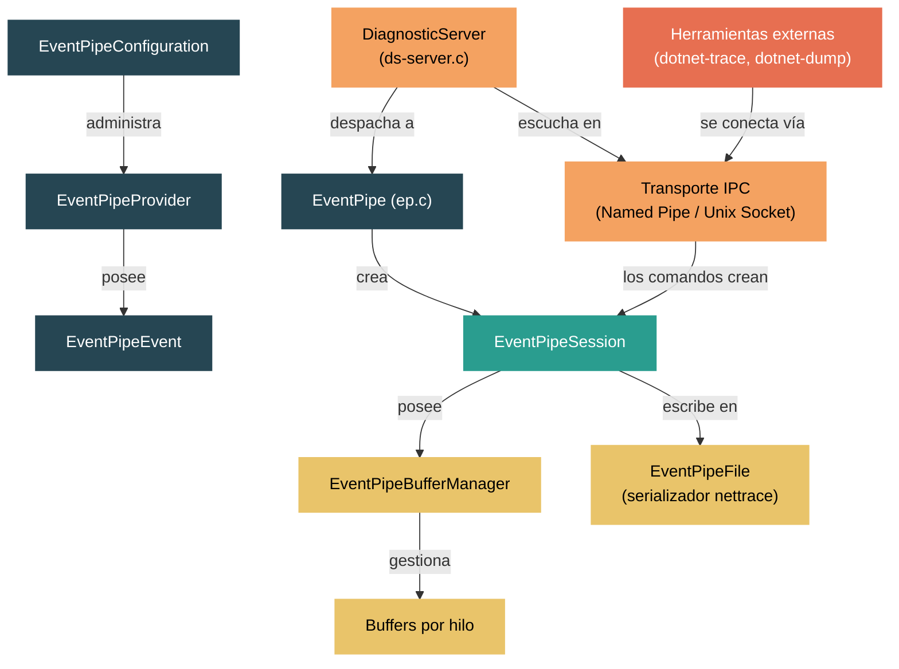

# Nivel 5: Experto / Contribuidor — El EventPipe y el Diagnostic Server

> **Perfil objetivo:** Contribuidor del runtime que necesita comprender, extender o depurar la infraestructura de diagnóstico fuera de proceso
> **Esfuerzo estimado:** 6 horas
> **Prerrequisitos:** [Módulo 3.9: Diagnósticos en Nivel 3](03-advanced-diagnostics.md), [Módulo 5.1](05-expert-contribution-workflow.md)
> [English version](../en/05-expert-eventpipe.md)

---

## Objetivos de Aprendizaje

Al finalizar este módulo vas a poder:

1. Describir la arquitectura completa de EventPipe: providers, events, sessions, buffers y el streaming thread.
2. Explicar cómo el Diagnostic Server acepta conexiones IPC y despacha conjuntos de comandos (EventPipe, Dump, Profiler, Process).
3. Rastrear el ciclo de vida de una session de EventPipe desde su creación hasta la escritura de eventos y el flush final.
4. Comprender el sistema de buffers por hilo, el buffer manager, y cómo los eventos se serializan al formato nettrace.
5. Agregar un nuevo evento al runtime dentro de la infraestructura de EventPipe de punta a punta.
6. Explicar cómo las herramientas externas (`dotnet-trace`, `dotnet-dump`, `dotnet-monitor`) se comunican con el runtime a través del protocolo IPC de diagnóstico.

---

## Mapa Conceptual



---

## Guía de Lectura de Código Fuente

| Dificultad | Archivo | Propósito |
|------------|---------|-----------|
| ★★★★ | `src/native/eventpipe/ep.h` | Globales de EventPipe, estado, arreglo de sessions |
| ★★★★ | `src/native/eventpipe/ep.c` | `ep_enable()`, `ep_disable()`, `write_event()` -- el corazón de EventPipe |
| ★★★★ | `src/native/eventpipe/ep-provider.h` | Struct `EventPipeProvider` -- keywords, nivel, lista de events |
| ★★★★ | `src/native/eventpipe/ep-event.h` | `EventPipeEvent` -- ID de evento, keywords, nivel, metadata, máscara de habilitación |
| ★★★★ | `src/native/eventpipe/ep-session.h` | `EventPipeSession` -- tipo de session, buffer manager, streaming thread |
| ★★★★★ | `src/native/eventpipe/ep-buffer-manager.h` | `EventPipeBufferManager` -- lista de buffers por hilo, sequence points |
| ★★★★ | `src/native/eventpipe/ep-buffer.h` | `EventPipeBuffer` -- buffer circular escritura/solo lectura, lista enlazada |
| ★★★★ | `src/native/eventpipe/ep-config.h` | `EventPipeConfiguration` -- registro singleton de providers |
| ★★★★★ | `src/native/eventpipe/ds-server.c` | Bucle principal del Diagnostic Server, despacho de comandos |
| ★★★★ | `src/native/eventpipe/ds-protocol.h` | `DiagnosticsIpcHeader` -- formato de cable: magic, commandset, commandid |
| ★★★★ | `src/native/eventpipe/ds-types.h` | Enumeraciones de conjuntos de comandos (Dump, EventPipe, Profiler, Process) |
| ★★★★ | `src/native/eventpipe/ds-eventpipe-protocol.h` | Payloads de los comandos CollectTracing / StopTracing |
| ★★★★ | `src/native/eventpipe/ds-ipc.h` | Fábrica de streams IPC, abstracción de puertos |
| ★★★★ | `src/native/eventpipe/ds-ipc-pal-namedpipe.h` | Implementación del transporte con named pipes (Windows) |
| ★★★★ | `src/native/eventpipe/ds-ipc-pal-socket.h` | Implementación del transporte con Unix domain sockets |
| ★★★★ | `src/native/eventpipe/README.md` | Guía oficial del código, macros de tipos de datos, patrones de getter/setter |
| ★★★★ | `src/coreclr/vm/eventpipeadapter.h` | Adaptador C++ de CoreCLR que envuelve la biblioteca compartida en C |
| ★★★★ | `src/coreclr/vm/eventpipeinternal.h` | Puntos de entrada QCall desde `EventPipeInternal` en managed |
| ★★★★ | `src/coreclr/vm/diagnosticserveradapter.h` | Adaptador de CoreCLR para init/shutdown del Diagnostic Server |
| ★★★★ | `src/coreclr/vm/eventing/eventpipe/ep-rt-coreclr.h` | Implementaciones específicas de CoreCLR para los contratos `ep-rt-*` |

---

## Programa de Estudio

### Lección 1 — Arquitectura de EventPipe

#### Lo que vas a aprender

EventPipe es el subsistema de eventos en proceso y multiplataforma del runtime de .NET. Originalmente el runtime dependía de ETW (Event Tracing for Windows), pero EventPipe fue creado para que el mismo trazado estructurado funcionara en Linux, macOS y todas las demás plataformas donde .NET se ejecuta. La implementación está escrita en C (no C++) para que pueda ser compartida entre los runtimes CoreCLR y Mono.

#### Contexto histórico

El código fue originalmente C++ dentro de CoreCLR. Luego fue reescrito en C y extraído a `src/native/eventpipe/` para que tanto CoreCLR como Mono pudieran enlazarse contra él. Cada runtime proporciona una capa delgada de "adaptador de runtime" que implementa primitivas específicas de plataforma (locks, hilos, asignaciones de memoria) definidas por los headers `ep-rt-*`. El adaptador de CoreCLR vive en `src/coreclr/vm/eventing/eventpipe/`, y el de Mono en `src/mono/mono/eventpipe/`.

#### La máquina de estados global

Abrí `src/native/eventpipe/ep.h`. Las primeras líneas después de los includes revelan el estado global:

```c
extern volatile EventPipeState _ep_state;
extern volatile EventPipeSession *_ep_sessions [EP_MAX_NUMBER_OF_SESSIONS];
extern volatile uint32_t _ep_number_of_sessions;
extern volatile uint64_t _ep_allow_write;
```

EventPipe opera como una máquina de estados con tres estados: `NOT_INITIALIZED`, `INITIALIZED` y `SHUTTING_DOWN`. El arreglo `_ep_sessions` contiene hasta `EP_MAX_NUMBER_OF_SESSIONS` sessions concurrentes (actualmente 64). La máscara de bits `_ep_allow_write` controla cuáles sessions están aceptando eventos activamente -- cada bit corresponde a un índice de session.

#### Tipos fundamentales

La arquitectura está construida alrededor de cinco tipos fundamentales:

1. **`EventPipeConfiguration`** (singleton, `ep-config.h`): El registro global de todos los providers. Mantiene una lista enlazada de objetos `EventPipeProvider` y posee un "provider de configuración" especial usado para eventos de metadata.

2. **`EventPipeProvider`** (`ep-provider.h`): Un espacio de nombres para eventos. Cada provider tiene un nombre (ej., `"Microsoft-DotNETCore-SampleProfiler"`), keywords actuales, nivel, una lista de eventos y un callback que se dispara cuando el provider es habilitado/deshabilitado.

3. **`EventPipeEvent`** (`ep-event.h`): Un tipo de evento específico dentro de un provider. Lleva un ID de evento, versión, keywords, nivel, metadata (esquema) y una máscara de bits `enabled_mask` que indica cuáles sessions lo tienen habilitado.

4. **`EventPipeSession`** (`ep-session.h`): Representa una session de trazado activa. Posee un `BufferManager` para el almacenamiento en memoria, un streaming thread para sessions IPC/archivo, y registra el conjunto de configuraciones de provider que controlan qué eventos están activos.

5. **`EventPipeBufferManager`** (`ep-buffer-manager.h`): Gestiona las listas de buffers por hilo, los sequence points para ordenamiento por timestamp, y la lógica de lectura que drena los buffers hacia el serializador.

#### La ruta de escritura (ruta rápida)

Cuando el código del runtime llama a `ep_write_event()` (o el managed `EventSource.WriteEvent`), la ruta rápida es:

1. Verificar la `enabled_mask` del evento -- si es cero, retornar inmediatamente (no hay listeners activos).
2. Para cada bit de session activa, llamar al buffer manager de la session.
3. El buffer manager encuentra el buffer del hilo actual (o asigna uno nuevo).
4. La instancia del evento se serializa directamente en el buffer.
5. No se toman locks en la ruta de escritura bajo condiciones normales -- el diseño por hilo hace que las escrituras sean lock-free.

Este diseño es crítico para el rendimiento: escribir un evento cuando nadie está escuchando es esencialmente una única carga atómica que lee cero y retorna.

#### Ejercicios

1. **Rastrear la secuencia de init**: En `ep.c`, encontrá `ep_init()`. Listá los pasos de inicialización (init de config, init del sample profiler, etc.) y notá cuándo se permite que los hilos empiecen.
2. **Contar las sessions**: Leé `ep.h` y encontrá `EP_MAX_NUMBER_OF_SESSIONS`. ¿Por qué es una constante en tiempo de compilación en lugar de dinámica?
3. **Seguir una escritura**: Comenzando desde `write_event()` en `ep.c`, rastreá la ruta de código hasta `ep_buffer_manager_write_event()`. Identificá dónde se localiza el buffer del hilo.

---

### Lección 2 — El Diagnostic Server

#### Lo que vas a aprender

El Diagnostic Server es un subsistema separado de EventPipe. Es un servidor RPC basado en IPC que se ejecuta dentro del proceso .NET, escuchando comandos de herramientas externas. Crear sessions de EventPipe es solo uno de los varios comandos que soporta.

#### Capa de transporte IPC

El servidor se comunica a través de mecanismos IPC específicos de plataforma:

- **Windows**: Named pipes en `\\.\pipe\dotnet-diagnostic-{pid}` (ver `ds-ipc-pal-namedpipe.h`)
- **Linux/macOS**: Unix domain sockets en `$TMPDIR/dotnet-diagnostic-{pid}-{disambiguation}-socket` (ver `ds-ipc-pal-socket.h`)
- **Browser (WASM)**: Transporte basado en WebSocket (ver `ds-ipc-pal-websocket.h`)

El transporte está abstraído detrás del tipo `DiagnosticsIpc` y el `IpcStreamFactory`, que gestiona múltiples puertos de escucha y maneja el polling de conexiones entrantes.

#### El protocolo de cable

Abrí `src/native/eventpipe/ds-protocol.h`. Cada mensaje comienza con un `DiagnosticsIpcHeader`:

```c
struct _DiagnosticsIpcHeader {
    uint8_t magic [14];     // "DOTNET_IPC_V1\0"
    uint16_t size;          // tamaño total del paquete (header + payload)
    uint8_t commandset;     // qué subsistema atacar
    uint8_t commandid;      // comando específico dentro del conjunto
    uint16_t reserved;
};
```

El header tiene exactamente 20 bytes. Después viene un payload de longitud variable cuyo esquema depende del comando.

#### Conjuntos de comandos

Abrí `src/native/eventpipe/ds-types.h`. El servidor soporta cuatro conjuntos de comandos:

| CommandSet | ID | Propósito |
|---|---|---|
| `DS_SERVER_COMMANDSET_DUMP` | `0x01` | Generar core dumps (`dotnet-dump`) |
| `DS_SERVER_COMMANDSET_EVENTPIPE` | `0x02` | Iniciar/detener sessions de trazado (`dotnet-trace`) |
| `DS_SERVER_COMMANDSET_PROFILER` | `0x03` | Adjuntar/iniciar profiler |
| `DS_SERVER_COMMANDSET_PROCESS` | `0x04` | Info del proceso, variables de entorno, reanudar runtime |

Dentro del conjunto de comandos de EventPipe, hay múltiples versiones del comando `CollectTracing` (0x02 hasta 0x06), cada una agregando nuevos campos como control de stackwalk, rundown keywords y filtrado de eventos. El comando `StopTracing` es `0x01`.

#### Bucle principal del servidor

El diagnostic server se ejecuta en su propio hilo. En `ds-server.c`, la función `ds_server_init()` configura la fábrica de streams IPC e inicia el listener. El bucle principal:

1. Llama a `ds_ipc_stream_factory_get_next_available_stream()` para hacer polling de conexiones entrantes.
2. Al recibir una conexión, lee el `DiagnosticsIpcHeader`.
3. Despacha según el `commandset`: llama a `ds_eventpipe_protocol_helper_handle_ipc_message()`, `ds_dump_protocol_helper_handle_ipc_message()`, `ds_profiler_protocol_helper_handle_ipc_message()`, o `ds_process_protocol_helper_handle_ipc_message()`.
4. Cada handler parsea su payload específico, ejecuta el comando y envía una respuesta.

#### El handshake de conexión/advertise

Cuando el diagnostic server empieza a escuchar, puede operar en dos modos:

- **Modo listen** (por defecto): El servidor crea un named pipe o socket y espera que las herramientas se conecten.
- **Modo connect** (reverso): El servidor se conecta activamente a un endpoint especificado. La herramienta (como `dotnet-monitor`) escucha, y el runtime se conecta hacia afuera. Esto se configura vía `DOTNET_DiagnosticPorts`.

En modo connect, el servidor envía primero un **mensaje de advertise**, que incluye un cookie (GUID) y la información del proceso. La herramienta usa este cookie para correlacionar respuestas.

#### Pausa en el inicio

El servidor soporta pausar el runtime al inicio mediante `ds_server_pause_for_diagnostics_monitor()`. Cuando `DOTNET_DiagnosticPorts` especifica modo `suspend`, el runtime se bloquea hasta que una herramienta externa envía un comando `ResumeRuntime`. Esto es crítico para recolectar eventos desde el inicio del proceso (ej., eventos de carga de assemblies, eventos del JIT).

#### Ejercicios

1. **Encontrar el nombre del pipe**: En `ds-ipc-pal-namedpipe.c`, encontrá dónde se construye la ruta del named pipe. ¿Cuál es el formato?
2. **Mapear el despacho**: En `ds-server.c`, encontrá el switch statement (o cadena de ifs) que despacha según el command set. Listá todos los conjuntos de comandos manejados.
3. **Conexión reversa**: Buscá `DOTNET_DiagnosticPorts` en el codebase. ¿Cómo parsea el runtime la variable de entorno para configurar puertos en modo connect?

---

### Lección 3 — Providers de Eventos y Sessions

#### Lo que vas a aprender

Esta lección cubre cómo los providers registran eventos, cómo las sessions especifican qué eventos habilitar, y cómo el ciclo de habilitación/deshabilitación se propaga a través del sistema.

#### Registro de providers

Los providers se crean a través de `ep_config_create_provider()` en `ep-config.h`. La función:

1. Asigna un nuevo `EventPipeProvider` con el nombre y callback dados.
2. Lo agrega a la lista de providers de la configuración.
3. Si ya hay sessions activas que solicitan este nombre de provider, el provider se habilita inmediatamente.

Hay dos formas en que los providers llegan a existir:

- **Providers definidos por el runtime**: Creados durante la inicialización del runtime para eventos incorporados (GC, JIT, loader, etc.). Estos se registran antes de que exista cualquier session.
- **Providers de EventSource managed**: Creados cuando código managed instancia un `EventSource`. El QCall `EventPipeInternal_CreateProvider` hace de puente entre código managed y nativo.

#### Definición de eventos

Los eventos se agregan a un provider vía `ep_provider_add_event()` (`ep-provider.c`). Cada evento necesita:

- **Event ID**: Único dentro del provider.
- **Keywords**: Máscara de bits para filtrado (ej., `GCKeyword = 0x1`, `LoaderKeyword = 0x8`).
- **Level**: Verbosidad desde `LogAlways(0)` hasta `Critical(1)`, `Error(2)`, `Warning(3)`, `Informational(4)`, `Verbose(5)`.
- **Metadata**: Esquema serializado que describe el nombre del evento y tipos de parámetros.

La metadata es generada por `ep_metadata_generator_generate_event_metadata()` en `ep-metadata-generator.h`. Produce un blob binario que codifica el nombre del evento, parámetros (pares tipo + nombre) y versión.

#### Creación de sessions

Cuando se llama a `ep_enable()` (ya sea desde el diagnostic server o en proceso), este:

1. Genera un índice de session (0-63).
2. Crea un `EventPipeSession` con la configuración solicitada:
   - **Tipo de session**: `FILE` (escribir a disco), `IPC` (transmitir a herramienta), `LISTENER` (callback en proceso) o `SYNCHRONOUS` (callback sincrónico).
   - **Tamaño del buffer circular**: Presupuesto de memoria en MB.
   - **Formato de serialización**: Actualmente nettrace v4.
   - **Configuraciones de providers**: Qué providers habilitar, con qué keywords y nivel.
3. Crea un `EventPipeBufferManager` para la session.
4. Llama a `ep_config_enable()` que recorre todos los providers registrados y habilita los eventos que coinciden.
5. Establece el bit de la session en `_ep_allow_write` para empezar a aceptar eventos.
6. Para sessions IPC/FILE, crea un streaming thread que periódicamente hace flush de los buffers.

#### La cascada de habilitación

Cuando una session habilita un provider, el sistema:

1. Encuentra todos los objetos `EventPipeEvent` que pertenecen a ese provider.
2. Para cada evento, calcula si debe habilitarse basándose en la coincidencia de keywords y nivel.
3. Establece el bit de `enabled_mask` del evento para esta session.
4. Invoca la función callback del provider, notificándole sobre el nuevo nivel/keywords. Así es como `EventSource` en código managed se entera de que hay listeners activos.

La ruta de deshabilitación hace lo inverso: limpia los bits de `enabled_mask` e invoca el callback con estado deshabilitado.

#### Configuración de providers por session

El `EventPipeSessionProviderList` (`ep-session-provider.h`) almacena las configuraciones de providers por session. Cada entrada especifica:

```
provider_name: "Microsoft-Windows-DotNETRuntime"
keywords: 0x1      (GCKeyword)
level: Informational (4)
filter_data: ""     (string opcional pasado al callback del provider)
```

Cuando una session se crea con múltiples configuraciones de provider, el sistema habilita cada una independientemente. Las keywords y nivel efectivos de un provider son la unión a través de todas las sessions activas.

#### Ejercicios

1. **Coincidencia de keywords**: En `ep-provider.c`, encontrá `provider_compute_event_enable_mask()`. Explicá el algoritmo: ¿cómo se combinan keywords y nivel para determinar si un evento está habilitado para una session dada?
2. **Callback del provider**: Buscá el tipo `EventPipeCallback`. ¿Qué parámetros recibe el callback? ¿Cómo usa managed `EventSource` esto para activar su propiedad `IsEnabled`?
3. **Múltiples sessions**: Si la Session A habilita `GCKeyword` en `Informational` y la Session B habilita `GCKeyword` en `Verbose`, ¿qué eventos se escriben? ¿A cuál(es) session(es)?

---

### Lección 4 — El Sistema de Buffers de EventPipe

#### Lo que vas a aprender

El sistema de buffers es el núcleo crítico de rendimiento de EventPipe. Debe manejar escritura de eventos de alto rendimiento desde muchos hilos con mínima contención, mientras mantiene garantías de ordenamiento de eventos para los lectores.

#### Objetivos de diseño

1. **Escrituras lock-free**: La ruta de escritura (ruta rápida) no debe tomar locks globales.
2. **Memoria acotada**: El buffer circular tiene un límite de tamaño configurable.
3. **Lecturas ordenadas**: Los eventos deben emitirse al archivo de salida en orden de timestamp, aunque se originen en diferentes hilos.

#### Arquitectura de buffers por hilo

Abrí `src/native/eventpipe/ep-buffer-manager.h`. El `EventPipeBufferManager` mantiene:

```c
struct _EventPipeBufferManager {
    dn_list_t *thread_session_state_list;  // lista de estados por hilo
    dn_list_t *sequence_points;             // marcadores de ordenamiento temporal
    ep_rt_wait_event_handle_t rt_wait_event; // señal para el hilo lector
    ep_rt_spin_lock_handle_t rt_lock;       // protege asignación de buffers
    EventPipeSession *session;
    // ... estado del hilo lector ...
};
```

Cada hilo que escribe eventos obtiene su propio `EventPipeThreadSessionState` y `EventPipeBufferList`. La lista de buffers es una lista enlazada intrusiva de objetos `EventPipeBuffer`, ordenada del más antiguo (cabeza) al más nuevo (cola).

#### Ciclo de vida del buffer

Un `EventPipeBuffer` individual (`ep-buffer.h`) tiene un ciclo de vida simple:

1. **WRITABLE**: El buffer está asignado a un hilo específico. Solo ese hilo escribe en él. El buffer tiene un puntero `current` que avanza a medida que se escriben eventos, hasta un puntero `limit`.
2. **READ_ONLY**: Cuando el buffer está lleno (o durante el flush), el buffer manager lo convierte a solo lectura. Un hilo lector puede entonces iterar sobre los eventos.

La transición de WRITABLE a READ_ONLY está protegida por el lock del buffer manager, pero las escrituras individuales dentro de un buffer WRITABLE no lo están -- solo el hilo propietario escribe en él.

```c
struct _EventPipeBuffer {
    ep_timestamp_t creation_timestamp;
    EventPipeThread *writer_thread;
    uint8_t *buffer;       // inicio de la asignación
    uint8_t *current;      // siguiente posición de escritura
    uint8_t *limit;        // fin de la asignación
    EventPipeBuffer *prev_buffer;
    EventPipeBuffer *next_buffer;
    volatile uint32_t state;  // WRITABLE o READ_ONLY
    uint32_t event_sequence_number;
};
```

Los eventos se escriben como objetos `EventPipeEventInstance` directamente en la memoria del buffer. Cada instancia está alineada a 8 bytes (`EP_BUFFER_ALIGNMENT_SIZE`), con el payload de datos inmediatamente después del header.

#### Estrategia de asignación de buffers

Cuando un hilo necesita escribir un evento y su buffer actual está lleno (o no tiene ninguno), `buffer_manager_allocate_buffer_for_thread()` en `ep-buffer-manager.c`:

1. Intenta reservar memoria contra el presupuesto de buffer circular de la session usando `buffer_manager_try_reserve_buffer()`.
2. Si se excede el presupuesto, retorna `NULL` -- el evento se descarta (la escritura se "suspende").
3. Si hay espacio disponible, asigna un nuevo buffer y lo inserta en la cola de la lista de buffers del hilo.

El tamaño del buffer es al menos el tamaño del evento solicitado, limitado a un mínimo y máximo.

#### Sequence points y lectura ordenada

Los eventos llegan en orden por hilo pero el lector debe emitirlos en orden global de timestamp. El buffer manager usa **sequence points** para resolver esto:

1. Periódicamente (o cuando se fuerza), el streaming thread crea un sequence point.
2. Un sequence point captura la posición actual del buffer y número de secuencia para cada hilo activo.
3. Al leer, el lector avanza a través de eventos en todos los hilos hasta el siguiente sequence point, eligiendo el evento con el timestamp más pequeño en cada paso (estilo merge-sort).

Este enfoque evita el ordenamiento global durante las escrituras (costoso) y en su lugar agrupa el trabajo de ordenamiento en el hilo lector (que no está en la ruta rápida).

#### El streaming thread

Para tipos de session IPC y FILE, la session crea un hilo dedicado de streaming que:

1. Duerme hasta ser despertado por un temporizador o el `rt_wait_event`.
2. Recorre todas las listas de buffers por hilo.
3. Convierte los buffers llenos a READ_ONLY.
4. Lee eventos en orden de timestamp a través de todos los hilos.
5. Los serializa a `EventPipeFile` que escribe el formato nettrace.
6. Devuelve los buffers leídos al pool libre.

El `EventPipeFile` (`ep-file.h`) es el serializador. Gestiona tres tipos de bloques:
- **EventBlock**: Lotes de datos de eventos.
- **MetadataBlock**: Definiciones de esquema de eventos.
- **StackBlock**: Datos de call stacks comprimidos.

#### Ejercicios

1. **Dimensionamiento de buffers**: En `ep-buffer-manager.c`, encontrá el código de asignación de buffers. ¿Cuál es el tamaño mínimo de buffer? ¿Cómo se limita el tamaño?
2. **Eventos descartados**: Seguí la ruta de código cuando `buffer_manager_try_reserve_buffer()` retorna false. ¿Cómo señala el sistema que se están descartando eventos?
3. **Recorrido de sequence points**: En el buffer manager, encontrá el código que itera eventos entre hilos en orden de timestamp. Describí el algoritmo.

---

### Lección 5 — Agregar un Nuevo Evento al Runtime

#### Lo que vas a aprender

Esta lección es una guía práctica para agregar un nuevo evento al runtime de .NET. Esta es una de las contribuciones más comunes al subsistema EventPipe.

#### Panorama del pipeline de eventos

Los eventos del runtime en CoreCLR fluyen a través de múltiples capas:

```
Código nativo del runtime (C/C++)
   -> Macros FireEtw* (eventing/EtwEvents.h)
      -> ETW en Windows (si está habilitado)
      -> Escritura al provider de EventPipe (si hay session activa)
         -> Buffer por hilo
            -> Streaming thread -> salida nettrace
```

Las macros `FireEtw*` son generadas por código a partir de archivos XML de manifiesto de eventos. Cuando agregás un nuevo evento, modificás el manifiesto y el sistema de build regenera las macros.

#### Guía paso a paso

**Paso 1: Definir el evento en el manifiesto**

Los archivos de manifiesto de eventos se encuentran típicamente en `src/coreclr/vm/ClrEtwAll.man` (o definiciones equivalentes de event source). Definís:

- Event ID (único dentro del provider)
- Nombre del evento
- Keywords (a qué categoría pertenece)
- Level (verbosidad)
- Parámetros (campos tipados)

**Paso 2: Agregar el evento al EventSource managed (si es necesario)**

Si el evento también debe poder escribirse desde código managed, agregás un método correspondiente a la clase `EventSource` apropiada. Para eventos internos del runtime, este paso puede omitirse.

**Paso 3: Disparar el evento desde código del runtime**

En el punto del código del runtime donde el evento debe emitirse, llamá a la macro generada `FireEtw<NombreDelEvento>()`. Por ejemplo:

```cpp
// En src/coreclr/vm/gchelpers.cpp o similar
FireEtwGCAllocationTick_V4(
    AllocationAmount,
    AllocationKind,
    GetClrInstanceId(),
    AllocationAmount64,
    TypeID,
    TypeName,
    HeapIndex,
    Address,
    ObjectSize);
```

**Paso 4: Registrar en el provider de EventPipe**

El sistema de build genera automáticamente el código de registro del provider de EventPipe a partir del manifiesto. El código generado:

1. Crea un `EventPipeProvider` para el nombre del provider (ej., `"Microsoft-Windows-DotNETRuntime"`).
2. Llama a `ep_provider_add_event()` para cada evento definido en el manifiesto.
3. Genera el blob de metadata que describe el esquema del evento.

**Paso 5: Testear el evento**

Escribí un test que:

1. Inicie una session de EventPipe habilitando el provider/keyword relevante.
2. Active la ruta de código que dispara el evento.
3. Lea los eventos de la session y verifique que el evento aparece con los datos correctos.

Los tests de EventPipe viven en `src/tests/tracing/eventpipe/`. Un test típico:

```csharp
// Crear una session habilitando nuestro provider
var providers = new List<EventPipeProvider>
{
    new EventPipeProvider("Microsoft-Windows-DotNETRuntime",
        EventLevel.Informational, (long)ClrTraceEventParser.Keywords.GC)
};

using (var session = EventPipeSession.Create(providers))
{
    // Activar el evento
    GC.Collect();

    // Leer eventos de la session
    var source = new EventPipeEventSource(session.EventStream);
    source.Clr.GCStart += (data) => { /* validar */ };
    source.Process();
}
```

#### Trabajar con el código generado

La infraestructura de generación de eventos usa varios archivos:

- **Archivos de manifiesto**: Descripciones XML de eventos, providers, keywords y tareas.
- **Headers generados**: El build produce macros `FireEtw*` que manejan el despacho dual a ETW y EventPipe.
- **Targets de build**: Targets de MSBuild/CMake que invocan las herramientas de generación.

Importante: nunca editéis a mano los archivos generados (`.g.cs`, headers generados). Siempre modificá los manifiestos fuente y reconstruí.

#### Agregar un evento de EventSource solo managed

Para eventos puramente managed (no internos al runtime), el proceso es más simple:

```csharp
[EventSource(Name = "MyCustom-EventSource")]
public sealed class MyEventSource : EventSource
{
    public static readonly MyEventSource Log = new();

    [Event(1, Level = EventLevel.Informational, Keywords = Keywords.General)]
    public void MyOperation(string operationName, int duration)
    {
        if (IsEnabled())
            WriteEvent(1, operationName, duration);
    }

    public static class Keywords
    {
        public const EventKeywords General = (EventKeywords)0x0001;
    }
}
```

Internamente, `EventSource` crea automáticamente un `EventPipeProvider` y objetos `EventPipeEvent` a través de los QCalls `EventPipeInternal_CreateProvider` y `EventPipeInternal_DefineEvent`.

#### Ejercicios

1. **Encontrar un evento real**: En `src/coreclr/vm/gchelpers.cpp` o `src/coreclr/vm/jitinterface.cpp`, encontrá una llamada `FireEtw*`. Rastreala hasta su definición de evento.
2. **Generación de metadata**: Leé `ep_metadata_generator_generate_event_metadata()` en `ep-metadata-generator.h`. ¿Qué formato binario usa la metadata para los tipos de parámetros?
3. **Puente QCall**: Leé la función `EventPipeInternal_DefineEvent` en `src/coreclr/vm/eventpipeinternal.cpp`. ¿Qué parámetros recibe? ¿Cómo llama a `ep_provider_add_event()`?

---

### Lección 6 — Protocolo de Herramientas de Diagnóstico

#### Lo que vas a aprender

Esta lección explica cómo las herramientas externas de diagnóstico se comunican con el runtime, cubriendo el viaje completo de ida y vuelta de una session típica de `dotnet-trace collect`.

#### Arquitectura del lado de la herramienta

Las herramientas de diagnóstico de .NET (`dotnet-trace`, `dotnet-dump`, `dotnet-counters`, `dotnet-monitor`) usan todas el paquete NuGet `Microsoft.Diagnostics.NETCore.Client`, que implementa el lado cliente del protocolo IPC de diagnóstico. La clase clave es `DiagnosticsClient`:

```csharp
var client = new DiagnosticsClient(processId);
// Iniciar una session de EventPipe
using var session = client.StartEventPipeSession(providers);
// Leer el stream nettrace
using var source = new EventPipeEventSource(session.EventStream);
```

#### El flujo completo de recolección de traza

Esta es la secuencia completa cuando `dotnet-trace collect -p <pid>` se ejecuta:

**1. Descubrimiento**
La herramienta enumera endpoints de diagnóstico buscando named pipes o archivos socket `dotnet-diagnostic-{pid}`.

**2. Conexión**
La herramienta abre la conexión IPC. Del lado del servidor, `ds_ipc_stream_factory_get_next_available_stream()` la acepta.

**3. Comando CollectTracing**
La herramienta envía un `DiagnosticsIpcHeader` con:
- `commandset = 0x02` (EventPipe)
- `commandid = 0x06` (CollectTracing5, la última versión)

Seguido del `EventPipeCollectTracingCommandPayload`:
```c
struct _EventPipeCollectTracingCommandPayload {
    uint8_t *incoming_buffer;
    dn_vector_t *provider_configs;
    uint32_t circular_buffer_size_in_mb;
    EventPipeSerializationFormat serialization_format;
    bool rundown_requested;
    bool stackwalk_requested;
    uint64_t rundown_keyword;
    EventPipeSessionType session_type;
};
```

**4. Creación de la session**
El servidor llama a `ep_enable()` con las opciones deserializadas, creando la session, el buffer manager y el streaming thread.

**5. Respuesta**
El servidor envía de vuelta una respuesta con el `SessionID` (uint64).

**6. Streaming de eventos**
El streaming thread en el runtime escribe datos en formato nettrace al stream IPC. La herramienta lee del mismo stream, acumulando datos en un archivo `.nettrace`.

**7. Comando Stop**
Cuando el usuario presiona Ctrl+C (o expira una duración), la herramienta envía un comando `StopTracing`:
- `commandset = 0x02` (EventPipe)
- `commandid = 0x01`
- Payload: `SessionID`

**8. Rundown**
Antes de detenerse, si se solicitó rundown, el runtime dispara un lote de eventos describiendo el estado actual (assemblies cargados, métodos compilados por JIT, etc.). Esto provee al decodificador el contexto necesario para resolver nombres de métodos y assemblies.

**9. Limpieza**
La session se deshabilita, los buffers se hacen flush y se liberan, y la conexión IPC se cierra.

#### El formato nettrace

Los datos en streaming usan el formato de serialización **nettrace**, también conocido como el formato "FastSerialization". Consiste en:

1. **Header de archivo**: Bytes mágicos, versión del serializador, versión mínima del lector.
2. **Stream de objetos**: Una secuencia de objetos serializados:
   - **MetadataBlock**: Definiciones de esquema de eventos (nombre del provider, nombre del evento, tipos de parámetros).
   - **EventBlock**: Datos de eventos en lotes con headers comprimidos.
   - **StackBlock**: Datos de call stacks comprimidos referenciados por instancias de eventos.
   - **SequencePointBlock**: Marcadores para ordenamiento temporal.
3. **NullReference**: Sentinela de fin de stream.

El formato está diseñado para streaming: los bloques pueden decodificarse independientemente, y el lector no necesita buscar hacia atrás.

#### Protocolo de recolección de dumps

Cuando `dotnet-dump collect` se ejecuta:

1. Se conecta al IPC de diagnóstico.
2. Envía `DS_SERVER_COMMANDSET_DUMP` / `DS_DUMP_COMMANDID_GENERATE_CORE_DUMP3`.
3. El payload incluye la ruta del archivo de salida, tipo de dump (mini, heap, triage, full) y flags.
4. El runtime genera el dump y envía una respuesta de éxito/fallo.

#### El protocolo de attach de profiler

Los comandos `DS_SERVER_COMMANDSET_PROFILER` permiten adjuntar una DLL de profiler a un proceso en ejecución:

1. `ATTACH_PROFILER`: Especifica el CLSID del profiler, ruta y datos opcionales del cliente.
2. `STARTUP_PROFILER`: Configura un profiler para cargarse al inicio (vía modo `suspend` de `DOTNET_DiagnosticPorts`).

#### dotnet-monitor: monitoreo continuo

`dotnet-monitor` usa el modo de conexión reversa. En lugar de conectarse a un proceso, escucha en un puerto y los procesos se conectan a él. El flujo:

1. `dotnet-monitor` inicia y crea un endpoint de escucha.
2. El runtime, configurado con `DOTNET_DiagnosticPorts=<endpoint>,connect`, se conecta al inicio.
3. El runtime envía un mensaje de advertise con información del proceso y un cookie.
4. `dotnet-monitor` puede entonces enviar comandos (iniciar/detener trazas, solicitar dumps, etc.) en cualquier momento.

Esta arquitectura es crítica para entornos containerizados donde la herramienta de monitoreo puede ser un sidecar que no puede predecir IDs de proceso.

#### Ejercicios

1. **Versionado del protocolo**: Mirá la enumeración `EventPipeCommandId` en `ds-types.h`. Hay comandos `COLLECT_TRACING` hasta `COLLECT_TRACING_5`. ¿Qué nuevas capacidades se agregaron en cada versión?
2. **Construir un cliente mínimo**: Usando la información de esta lección, delineá la secuencia de bytes que enviarías por un named pipe para iniciar una session simple de EventPipe habilitando `"Microsoft-Windows-DotNETRuntime"` a nivel Informational.
3. **Conexión reversa**: Encontrá dónde se genera el cookie de advertise (`ds_ipc_advertise_cookie_v1_init` en `ds-protocol.c`). ¿Qué contiene el cookie y por qué es necesario?

---

## Conclusiones Clave

1. **EventPipe es código C compartido** -- el directorio `src/native/eventpipe/` es compilado tanto por CoreCLR como Mono, con cada runtime proporcionando su propia capa adaptadora `ep-rt-*`.
2. **El Diagnostic Server es separado de EventPipe** -- es un servidor de comandos IPC de propósito general que soporta gestión de sessions de EventPipe junto con generación de dumps, attach de profiler e inspección de procesos.
3. **Los buffers por hilo eliminan la contención de escritura** -- el sistema de buffers está diseñado para que escribir un evento nunca bloquee las escrituras de otro hilo, haciendo la ruta rápida casi lock-free.
4. **Las sessions son la unidad de control** -- cada session especifica independientemente qué providers/eventos están activos, tiene su propio presupuesto de buffers y su propio streaming thread.
5. **Agregar eventos es dirigido por manifiestos** -- el pipeline de generación de código produce las macros de despacho dual (ETW + EventPipe) a partir de manifiestos XML, así que modificás el manifiesto en lugar de escribir código de eventos a mano.
6. **El protocolo de diagnóstico es versionado y extensible** -- CollectTracing ha evolucionado a través de 5 versiones, cada una compatible hacia atrás, agregando nuevas capacidades sin romper herramientas anteriores.

---

## Lecturas Adicionales

- [README oficial de EventPipe](../../src/native/eventpipe/README.md) -- guía de navegación de código para la implementación en C
- [Especificación del protocolo IPC de diagnóstico](https://github.com/dotnet/diagnostics/blob/main/documentation/design-docs/ipc-protocol.md) -- la documentación canónica del protocolo
- [Documento de diseño de EventPipe](https://learn.microsoft.com/dotnet/core/diagnostics/eventpipe) -- panorama en Microsoft Learn
- [Documentación de dotnet-trace](https://learn.microsoft.com/dotnet/core/diagnostics/dotnet-trace) -- la herramienta principal de diagnóstico
- [Documentación de dotnet-monitor](https://learn.microsoft.com/dotnet/core/diagnostics/dotnet-monitor) -- arquitectura de monitoreo continuo
- [`src/coreclr/vm/eventing/eventpipe/`](../../src/coreclr/vm/eventing/eventpipe/) -- capa adaptadora del runtime CoreCLR
