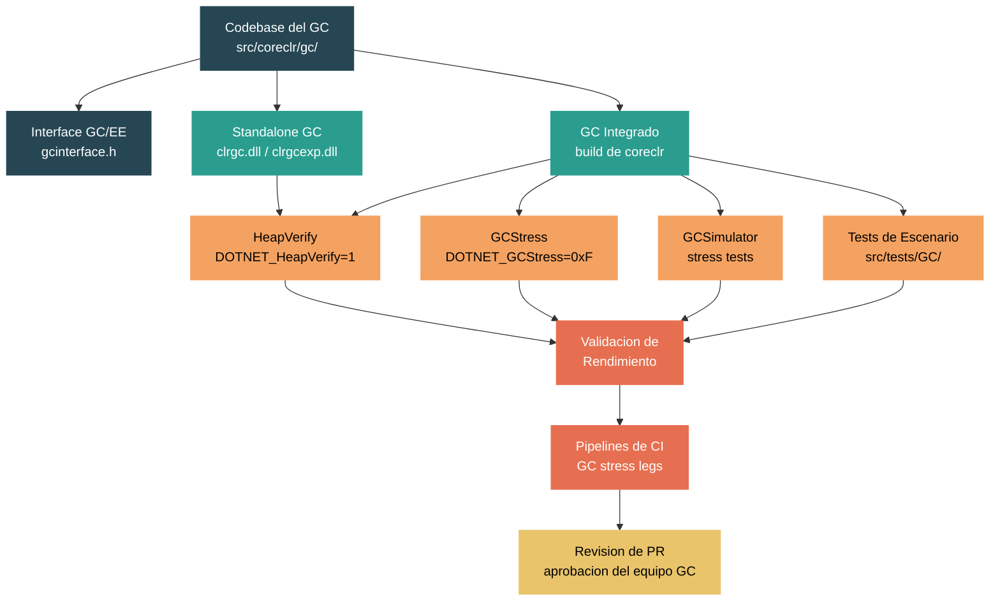

# Nivel 5: Experto / Contribuidor -- Contribuir un Cambio al GC

> **Perfil objetivo:** Contribuidor del runtime preparandose para enviar su primer (o quinto) pull request tocando el GC. Ya entiendes los internos del GC del Modulo 4.5; ahora necesitas saber como construir, probar, validar y entregar un cambio sin romper cada aplicacion .NET del planeta.
> **Esfuerzo estimado:** 12 horas
> **Prerrequisitos:** [Modulo 4.5 -- GC Profundo](04-internals-gc-deep.md), Modulo 5.1 (Sistema de Build), Modulo 5.2 (Infraestructura de Testing)
> **Dificultad del codigo fuente:** Extrema -- el GC es el subsistema mas critico en correccion del runtime. Un error de un byte en un write barrier o en la fase de marcado puede corromper silenciosamente el heap y hacer fallar aplicaciones horas despues.
> [English version](../en/05-expert-gc-contribution.md)

---

## Objetivos de Aprendizaje

Al finalizar este modulo podras:

1. Navegar el codebase completo del GC (`src/coreclr/gc/`) con confianza, sabiendo que archivo posee cada fase, como se compila condicionalmente el codigo, y donde estan los limites de la interface publica.
2. Construir el GC tanto en modo integrado como standalone, habilitando ciclos de iteracion rapidos.
3. Usar HeapVerify, GCStress y los stress tests del GC para validar cambios antes de enviar un PR.
4. Ejecutar el GCSimulator y los tests de escenario focalizados para detectar regresiones.
5. Comprender las expectativas de revision de PR especificas para cambios al GC -- que buscan los revisores, que pipelines de CI se ejecutan, y que validacion de rendimiento se espera.
6. Evaluar el radio de impacto de un cambio al GC y elegir la estrategia de testing adecuada.

---

## Por Que los Cambios al GC Son Unicamente Peligrosos

Antes de entrar al curriculo, hay que comprender por que las contribuciones al GC exigen un cuidado extraordinario:

- **Corrupcion silenciosa.** Un bug en el GC puede no causar un fallo inmediato. Puede corromper una sola referencia de objeto que solo se lee minutos, horas o dias despues. La corrupcion de heap es la categoria mas dificil de diagnosticar.
- **Radio de impacto universal.** Toda aplicacion managed usa el GC. Una regresion no afecta una sola biblioteca -- afecta todo, desde ASP.NET Core hasta juegos de Unity.
- **Peligros de concurrencia.** El GC interactua con todos los hilos del proceso. Background GC corre concurrentemente con los hilos mutadores. Server GC corre multiples hilos GC en paralelo. Las condiciones de carrera pueden reproducirse solo bajo timing especifico en hardware especifico.
- **Matriz de plataformas.** El GC corre en Windows, Linux, macOS, Android, iOS y WebAssembly. Existen write barriers especificos por arquitectura para x64, ARM64, x86 y ARM. Un cambio a un camino compartido no debe romper ninguna plataforma.

La infraestructura de testing descrita en este modulo existe especificamente para atrapar estos problemas. Usala toda.

---

## Mapa Conceptual



---

## Curriculo

### Leccion 1 -- La Estructura del Codebase del GC

#### Que vas a aprender

Como esta organizado el codigo fuente del GC, que hace cada archivo y como funciona el modelo de compilacion condicional.

#### Mapa de archivos

El GC vive completamente dentro de `src/coreclr/gc/`. El Modulo 4.5 presento los archivos principales; aca esta el inventario completo que un contribuidor necesita:

| Archivo | Lineas (aprox.) | Proposito |
|---------|-----------------|-----------|
| `gc.cpp` | 8,800 | Estructuras de datos centrales, helpers, ifdefs de features. Incluye los otros `.cpp` via el mecanismo `gcwks.cpp`/`gcsvr.cpp`. |
| `mark_phase.cpp` | 4,200 | `mark_phase()`, pila de marcado, listas de marcado, integracion con escaneo de raices |
| `plan_phase.cpp` | 8,400 | `plan_phase()`, arboles de plug, calculo de gaps, decision compact/sweep, manejo de objetos pinned |
| `sweep.cpp` | 600 | `make_free_lists()`, construccion de objetos libres |
| `background.cpp` | 4,600 | Ciclo de vida de BGC: marcado concurrente, GCs efimeros foreground durante BGC, sweep concurrente |
| `collect.cpp` | 1,700 | `garbage_collect()`, `gc1()` -- orquestacion de recoleccion de nivel superior |
| `allocation.cpp` | 5,900 | Caminos de asignacion de objetos, contextos de asignacion, adquisicion de segmentos/regiones |
| `card_table.cpp` | 2,000 | Operaciones de card table y card bundles para seguimiento de referencias entre generaciones |
| `relocate_compact.cpp` | 2,300 | `relocate_phase()`, `compact_phase()`, reubicacion de objetos |
| `regions_segments.cpp` | 2,400 | Tabla de mapeo de segmentos, mapeo region-a-generacion |
| `region_allocator.cpp` | 500 | Allocator buddy para bloques de memoria de regiones |
| `region_free_list.cpp` | 500 | Gestion de lista de regiones libres (basic/large/huge) |
| `memory.cpp` | 500 | Helpers de bajo nivel para commit/decommit de memoria |
| `finalization.cpp` | 700 | Operaciones de la cola de finalizacion |
| `init.cpp` | 1,550 | Inicializacion del GC, deteccion de write watch |
| `diagnostics.cpp` | 1,800 | Verificacion de heap, salida diagnostica, helpers de ETW |
| `dynamic_heap_count.cpp` | 1,500 | Ajuste dinamico del conteo de heaps (DATAS) |
| `dynamic_tuning.cpp` | 2,900 | Tuning de BGC, lazo servo para seguimiento de meta de memoria |
| `no_gc.cpp` | 930 | Soporte de region No-GC |
| `interface.cpp` | 2,750 | Implementacion de `IGCHeap`, integracion de GCStress |
| `gcconfig.h` | 200 | Todas las perillas de configuracion via macro `GC_CONFIGURATION_KEYS` |
| `gcpriv.h` | ~7,000+ | El header privado gigante: `gc_heap`, `heap_segment`, `dynamic_data`, todos los tipos internos |
| `gcinterface.h` | ~600 | Interface publica del GC: `IGCHeap`, `gc_alloc_context`, tipos de handles, numeros de version |
| `gcinterface.ee.h` | ~300 | `IGCToCLR` e `IGCToCLREventSink` -- lo que el GC llama de vuelta en el EE |

**Total entre los archivos de fase y gc.cpp: mas de 45,000 lineas de C++.**

#### El modelo de compilacion

El GC se compila dos veces -- una para workstation GC y otra para server GC:

```cpp
// gcwks.cpp
namespace WKS {
#include "gcimpl.h"
#include "gcpriv.h"
// ... todos los includes de fases ...
}

// gcsvr.cpp
#define SERVER_GC 1
namespace SVR {
#include "gcimpl.h"
#include "gcpriv.h"
// ... todos los includes de fases ...
}
```

Esto significa que cada funcion en gc.cpp y sus archivos companeros existe en dos copias (namespaces WKS y SVR). Cuando `MULTIPLE_HEAPS` esta definido (server GC), los campos per-heap son miembros de instancia; cuando no (workstation), se convierten en `static` -- controlado por las macros `PER_HEAP_FIELD` en `gcpriv.h`:

```cpp
#ifdef MULTIPLE_HEAPS
#define PER_HEAP_FIELD
#define PER_HEAP_FIELD_MAINTAINED
// ... campos de instancia
#else
#define PER_HEAP_FIELD static
#define PER_HEAP_FIELD_MAINTAINED static
// ... campos static
#endif
```

#### Macros ifdef clave

| Macro | Significado | Valor por defecto |
|-------|-------------|-------------------|
| `USE_REGIONS` | Heap basado en regiones (vs segmentos legacy) | Activo desde .NET 8 para la mayoria de targets |
| `MULTIPLE_HEAPS` | Server GC | Definido en el build SVR |
| `BACKGROUND_GC` | GC concurrente/background | Activo por defecto |
| `FEATURE_SVR_GC` | Feature de Server GC disponible | Activo para la mayoria de plataformas |
| `VERIFY_HEAP` | Codigo de verificacion de heap compilado | Activo para builds standalone, debug/checked |
| `STRESS_HEAP` | Soporte de GCStress compilado | Activo para builds checked |
| `GC_CONFIG_DRIVEN` | Comportamiento extra dirigido por configuracion | Activo para builds standalone |
| `BUILD_AS_STANDALONE` | Construyendo como DLL cargable | Solo standalone GC |
| `FEATURE_CONSERVATIVE_GC` | Escaneo conservativo de stack | Activo para standalone, interpreter |

#### Ejercicio de exploracion del codigo

1. Abri `src/coreclr/gc/gcsvr.cpp` y `src/coreclr/gc/gcwks.cpp`. Observa como incluyen el mismo conjunto de archivos bajo diferentes namespaces.
2. En `gcpriv.h`, busca `PER_HEAP_FIELD_MAINTAINED` y nota como los campos estan anotados por su categoria de ciclo de vida (maintained, single-GC, alloc-only, init-only, diagnostic-only). Este sistema de anotaciones te ayuda a entender que debe preservarse entre GCs.
3. Abri `CMakeLists.txt` en el directorio gc. Nota como la lista `GC_SOURCES` se ensambla y como `FEATURE_STANDALONE_GC` agrega `clrgc` y `clrgcexp` como targets de biblioteca compartida.

---

### Leccion 2 -- La Interface GC/EE

#### Que vas a aprender

Como el GC se comunica con el execution engine a traves de interfaces versionadas, y por que esto importa para tus cambios.

#### El limite de la interface

El GC y el execution engine (EE) se comunican a traves de dos interfaces formalmente versionadas definidas en `gcinterface.h`:

```cpp
// gcinterface.h
#define GC_INTERFACE_MAJOR_VERSION 5
#define GC_INTERFACE_MINOR_VERSION 8

#define EE_INTERFACE_MAJOR_VERSION 4
```

- **`IGCHeap`** (lado GC): La interface que el EE llama hacia el GC. Definida en `gcinterface.h`. Los metodos incluyen `Alloc()`, `GarbageCollect()`, `GetGcLatencyMode()`, `WaitForFullGCApproach()`, y docenas mas.
- **`IGCToCLR`** (lado EE): La interface que el GC llama hacia el EE. Definida en `gcinterface.ee.h`. Los metodos incluyen `SuspendEE()`, `RestartEE()`, `GcScanRoots()`, `GcEnumAllocContexts()`, `StompWriteBarrier()`.
- **`IGCToCLREventSink`**: La interface de eventos para los eventos ETW del GC. Tambien en `gcinterface.ee.h`.

#### Disciplina de versiones

Los cambios que rompen `IGCHeap` requieren incrementar `GC_INTERFACE_MAJOR_VERSION`. Las adiciones que no rompen incrementan la version menor. Este versionado existe porque el GC puede cargarse como una DLL standalone (`clrgc.dll`), lo que significa que el GC y el EE pueden estar en diferentes niveles de version. Si agregas un nuevo metodo a `IGCHeap`, debes incrementar la version menor. Si cambias la firma de un metodo existente, debes incrementar la version mayor.

#### El camino del standalone GC

Cuando se carga un standalone GC (via `DOTNET_GCName` o `DOTNET_GCPath`), el runtime carga la DLL del GC y llama a `GC_VersionInfo` para verificar compatibilidad:

```cpp
// gcload.cpp -- simplificado
void LoadGC(const char* path)
{
    GC_VersionInfoFunction versionInfo = GetProcAddress(lib, "GC_VersionInfo");
    VersionInfo vi;
    versionInfo(&vi);
    if (vi.MajorVersion != GC_INTERFACE_MAJOR_VERSION)
        FAIL("Version de interface GC incompatible");
    // diferencia en version menor esta OK
}
```

El standalone GC usa `gcenv.ee.standalone.inl` para implementar los callbacks del EE a traves de punteros a funcion en lugar de llamadas directas.

#### Que significa esto para tus cambios

- Si tu cambio es puramente interno al GC (ej., cambiar como `plan_phase` calcula los gaps de pin), no se necesita cambio de interface.
- Si tu cambio agrega un nuevo flag de asignacion o un nuevo metodo a `IGCHeap`, debes actualizar la version de la interface y potencialmente la clase managed `GC` en `System.Private.CoreLib`.
- Si tu cambio modifica `WriteBarrierParameters` o el contrato del write barrier, afecta tanto al GC como al JIT. Este es un cambio cross-component que requiere coordinacion con los revisores del JIT.

#### El GCSample: un EE minimo

El directorio `src/coreclr/gc/sample/` contiene `GCSample.cpp` -- un programa minimo que inicializa el GC sin el runtime completo de CoreCLR. Implementa versiones simplificadas de todos los callbacks de `IGCToCLR`:

```cpp
// GCSample.cpp -- demuestra inicializacion standalone del GC
// - SuspendEE/RestartEE trivial (single-threaded, nada que suspender)
// - GcScanRoots trivial (sin raices de stack)
// - GcEnumAllocContexts trivial (un solo contexto de asignacion)
```

Este ejemplo es invaluable para entender el contrato minimo que el GC requiere de su host. Si tu cambio agrega un nuevo callback, deberias actualizar GCSample tambien.

#### Ejercicio de exploracion del codigo

1. Lee `src/coreclr/gc/gcinterface.h` desde el principio. Nota las constantes de version, luego desplazate a la clase `IGCHeap` (alrededor de la linea 600+). Conta cuantos metodos tiene -- esta es la superficie completa del API.
2. Lee `src/coreclr/gc/gcinterface.ee.h`. Nota como `IGCToCLR` tiene `SuspendEE()`, `RestartEE()`, `GcScanRoots()` -- los callbacks esenciales que el GC necesita.
3. Abri `src/coreclr/gc/sample/GCSample.cpp` y `gcenv.ee.cpp`. Segui como funciona una asignacion de objeto minima sin ningun runtime.

---

### Leccion 3 -- Construir y Probar Cambios al GC

#### Que vas a aprender

Como construir el GC rapidamente para iteracion rapida, y como ejecutar el conjunto de tests base.

#### El build completo (primera vez)

Antes de hacer cualquier cambio al GC, necesitas un build completo como linea base. El GC es parte de `coreclr`, asi que:

```bash
# Windows
./build.cmd clr+libs+host

# Linux/macOS
./build.sh clr+libs+host
```

Esto toma hasta 40 minutos. Despues de que complete, configura el SDK:

```bash
export PATH="$(pwd)/.dotnet:$PATH"
```

#### Rebuild rapido: solo CoreCLR

Despues de tu build base, cuando modifiques archivos fuente del GC, solo necesitas reconstruir el subset `clr`:

```bash
# Configuracion checked (incluye VERIFY_HEAP, STRESS_HEAP)
./build.sh clr -rc checked

# Configuracion release (para tests de rendimiento)
./build.sh clr -rc release
```

La configuracion checked es esencial durante el desarrollo porque compila el soporte de verificacion de heap (`VERIFY_HEAP`) y GCStress (`STRESS_HEAP`). Siempre desarrolla primero en checked, luego valida en release.

#### Build del standalone GC

El standalone GC se construye como una biblioteca compartida separada. Esto esta definido en `CMakeLists.txt`:

```cmake
# De src/coreclr/gc/CMakeLists.txt
if(FEATURE_STANDALONE_GC)
  # clrgcexp: standalone + regiones (USE_REGIONS)
  add_library_clr(clrgcexp SHARED ${GC_SOURCES})
  target_compile_definitions(clrgcexp PRIVATE -DUSE_REGIONS)

  # clrgc: standalone + segmentos (legacy)
  add_library_clr(clrgc SHARED ${GC_SOURCES})

  add_definitions(-DBUILD_AS_STANDALONE)
  add_definitions(-DFEATURE_CONSERVATIVE_GC)
  add_definitions(-DVERIFY_HEAP)
  add_definitions(-DGC_CONFIG_DRIVEN)
endif()
```

Nota que el build standalone siempre habilita `VERIFY_HEAP` y `GC_CONFIG_DRIVEN`. Hay dos DLLs:
- `clrgcexp.dll` -- modo regiones (`USE_REGIONS`)
- `clrgc.dll` -- modo segmentos legacy

Para probar con el standalone GC:

```bash
# Apunta el runtime a tu standalone GC
export DOTNET_GCName=clrgcexp
# o
export DOTNET_GCPath=/ruta/a/clrgcexp.so
```

#### Ejecutar el conjunto de tests del GC

Los tests del GC viven en `src/tests/GC/`. La estructura de directorios es:

```
src/tests/GC/
  API/            -- Tests del API publico del GC (GC.Collect, GC.GetGeneration, etc.)
  Coverage/       -- Helpers de cobertura de codigo
  Features/       -- Tests especificos de features (BGC, finalizer, LOH compaction, pinning, etc.)
  LargeMemory/    -- Tests que requieren mucha memoria
  Performance/    -- Benchmarks de rendimiento
  Regressions/    -- Tests de regresion para bugs especificos
  Scenarios/      -- Tests de escenarios complejos (GCSimulator, stress, etc.)
  Stress/         -- Framework de stress test y tests
```

Para construir y ejecutar tests del GC:

```bash
# Construir la infraestructura de tests (desde la raiz del repo)
src/tests/build.sh -GenerateLayoutOnly x64 Release

# Configurar Core_Root
export CORE_ROOT=$(pwd)/artifacts/tests/coreclr/$(uname -s).x64.Release/Tests/Core_Root

# Ejecutar un test especifico
cd artifacts/tests/coreclr/$(uname -s).x64.Release/GC/<RutaDelTest>/
$CORE_ROOT/corerun <NombreDelTest>.dll
# Codigo de salida 100 = paso
```

#### El ciclo de desarrollo

Un ciclo de desarrollo productivo del GC se ve asi:

1. **Editar** el codigo fuente del GC en `src/coreclr/gc/`.
2. **Reconstruir** con `./build.sh clr -rc checked` (2-5 minutos dependiendo de lo que cambio).
3. **Ejecutar HeapVerify** en un test simple para verificar correccion basica (ver Leccion 4).
4. **Ejecutar GCStress** en un conjunto mas amplio para atrapar problemas sutiles (ver Leccion 4).
5. **Ejecutar el conjunto de tests del GC** para atrapar regresiones.
6. **Perfilar** con un build release si tu cambio es sensible al rendimiento.
7. Repetir.

#### Deshabilitar warnings-as-errors durante desarrollo

```bash
export TreatWarningsAsErrors=false
```

Esto es util durante la fase temprana de prototipado pero debe eliminarse antes de enviar un PR.

#### Ejercicio de exploracion del codigo

1. Abri `src/coreclr/gc/CMakeLists.txt` y segui como se ensambla `GC_SOURCES`. Nota como los targets del standalone GC (`clrgc`, `clrgcexp`) solo se construyen cuando `FEATURE_STANDALONE_GC` esta activo.
2. Ejecuta `ls src/tests/GC/Features/` y nota los directorios de tests especificos por feature. Si tu cambio toca BGC, deberias ejecutar `Features/BackgroundGC/`. Si toca finalizacion, ejecuta `Features/Finalizer/`.
3. Construi el GC en modo checked y confirma que el build tiene exito antes de hacer cambios. Esta es tu linea base conocida como buena.

---

### Leccion 4 -- GC Stress Testing

#### Que vas a aprender

Los modos de GCStress, los niveles de HeapVerify, y como usarlos para encontrar bugs en tus cambios antes de que alguien mas lo haga.

#### HeapVerify: la primera linea de defensa

HeapVerify recorre todo el managed heap y valida su integridad estructural. Se controla con la variable de entorno `DOTNET_HeapVerify` (o `COMPlus_HeapVerify` para runtimes mas antiguos). Los valores son flags de bitmask definidos en `gcconfig.h`:

```cpp
enum HeapVerifyFlags {
    HEAPVERIFY_NONE             = 0,
    HEAPVERIFY_GC               = 1,    // Verificar heap al principio y fin de cada GC
    HEAPVERIFY_BARRIERCHECK     = 2,    // Verificar correccion del write barrier
    HEAPVERIFY_SYNCBLK          = 4,    // Verificar escaneo de sync blocks

    // Flags de mitigacion (reducen overhead):
    HEAPVERIFY_NO_RANGE_CHECKS  = 0x10, // Omitir verificacion de limites
    HEAPVERIFY_NO_MEM_FILL      = 0x20, // Omitir llenado de memoria liberada con patron
    HEAPVERIFY_POST_GC_ONLY     = 0x40, // Solo verificar despues del GC (no antes)
    HEAPVERIFY_DEEP_ON_COMPACT  = 0x80  // Verificacion profunda solo en GCs que compactan
};
```

**Uso recomendado durante el desarrollo:**

```bash
# Verificacion completa de heap (lenta pero exhaustiva)
export DOTNET_HeapVerify=1

# Heap + verificacion de write barrier
export DOTNET_HeapVerify=3

# Solo post-GC (mas rapida para heaps grandes)
export DOTNET_HeapVerify=0x41

# Verificacion completa con checks profundos de compactacion
export DOTNET_HeapVerify=0x81
```

HeapVerify esta implementado en `diagnostics.cpp`. Cuando esta habilitado, `verify_heap()` se llama al entrar y salir del GC (ver `collect.cpp` lineas 450+ donde se llaman `verify_heap(FALSE)` y `verify_heap(TRUE)`). Recorre cada objeto en el heap, verifica punteros a method tables, valida tamanos de objetos, comprueba que las referencias apunten a objetos validos, y verifica la integridad de objetos libres.

**Como atrapa bugs:** Si tu cambio causa que una referencia de objeto apunte a memoria liberada, o que un card table pierda una referencia entre generaciones, HeapVerify lo detectara en el proximo GC. Cuanto antes lo habilites, mas cerca de la causa raiz estara el fallo.

#### GCStress: forzar GC en cada oportunidad

GCStress fuerza recolecciones de basura en cada asignacion o en puntos de sondeo GC insertados por el JIT. Se controla con `DOTNET_GCStress` y solo esta disponible en builds checked/debug (requiere `STRESS_HEAP`). Los valores son:

| Valor | Significado |
|-------|-------------|
| `0x1` | GC en cada asignacion |
| `0x2` | GC en cada punto de sondeo GC emitido por el JIT |
| `0x4` | GC en cada transicion GC emitida por el JIT (stress mas fuerte) |
| `0x8` | GC con recorrido de stack unico en cada punto de stress |
| `0xF` | Todo lo anterior (stress maximo) |

**Importante:** GCStress es extremadamente lento. Un test que corre en 1 segundo normalmente puede tardar 10 minutos bajo GCStress. Usalo en tests chicos y focalizados, no en todo el conjunto de tests.

```bash
# Stress basico del GC en asignaciones
export DOTNET_GCStress=1

# Stress completo del GC (muy lento)
export DOTNET_GCStress=0xF

# Ejecutar un test focalizado bajo GC stress
$CORE_ROOT/corerun MiTestGC.dll
```

La integracion de GCStress vive en `src/coreclr/gc/interface.cpp`:

```cpp
// interface.cpp (simplificado)
if (GCStress<cfg_any>::IsEnabled())
{
    // Forzar un GC aca
}
```

Nota el comentario en `gc.h`:

```cpp
// GCStress does not currently work with Standalone GC
```

Esto significa que debes probar GCStress con el build checked integrado (no standalone).

#### Combinando HeapVerify y GCStress

La combinacion de debugging mas poderosa es ejecutar ambos juntos:

```bash
export DOTNET_GCStress=1
export DOTNET_HeapVerify=3
$CORE_ROOT/corerun TestPequeno.dll
```

Esto fuerza un GC en cada asignacion y verifica la integridad del heap en cada GC. Es increiblemente lento pero atrapa los bugs mas sutiles. Si falta un caso en un write barrier, si una fase de marcado se saltea una referencia, o si la fase de plan calcula mal un limite de plug -- esta combinacion lo encontrara.

#### El conjunto de stress tests del GC

Los stress tests dedicados en `src/tests/GC/Stress/Tests/` ejercitan patrones especificos:

| Test | Que estresa |
|------|-------------|
| `GCSimulator.cs` | Patrones de tiempo de vida de objetos configurables, asignacion/recoleccion multihilo |
| `GCVariant.cs` | Comportamiento del GC bajo diferentes configuraciones |
| `StressAllocator.cs` | Throughput puro de asignacion y disparo de GC |
| `pinstress.cs` | Manejo de objetos pinned durante GC |
| `allocationwithpins.cs` | Asignacion mixta con patrones de pinning |
| `concurrentspin2.cs` | GC concurrente con hilos haciendo spinning |
| `LargeObjectAlloc*.cs` | Patrones de asignacion de LOH (4 variantes) |
| `ExpandHeap.cs` | Expansion y contraccion del heap |
| `plug.cs` / `PlugGaps.cs` | Fragmentacion y manejo de plugs |
| `doubLinkStay.cs` / `SingLinkStay.cs` | Patrones de tiempo de vida con listas enlazadas |
| `RedBlackTree.cs` / `DirectedGraph.cs` | Estructuras de grafos de objetos complejas |

El framework de stress en `src/tests/GC/Stress/Framework/` provee un harness de confiabilidad (`ReliabilityFramework.cs`) que puede ejecutar tests repetidamente con parametros configurables.

#### Que ejecutar para tu cambio

| Tipo de cambio | Testing minimo |
|----------------|----------------|
| Cambio en fase de marcado | HeapVerify=3 + GCStress=1 en GCSimulator, mas tests de `Features/BackgroundGC/` |
| Cambio en plan/compact | HeapVerify=0x81 (profundo en compact) + pinstress + PlugGaps |
| Cambio en camino de asignacion | StressAllocator + allocationwithpins + LargeObjectAlloc* |
| Cambio en write barrier | HeapVerify=3 (check de barrier) + conjunto completo de tests GC + GCStress=0xF en tests chicos |
| Cambio en finalizacion | `Features/Finalizer/` + `Scenarios/FinalNStruct/` |
| Cambio en gestion de regiones | ExpandHeap + GCSimulator (modo server) |
| Cambio en card table | HeapVerify=2 + GCStress=1 + `Features/BackgroundGC/` |

#### Ejercicio de exploracion del codigo

1. En `src/coreclr/gc/gcconfig.h`, encuentra el enum `HeapVerifyFlags` (alrededor de la linea 190). Lee el comentario de cada flag.
2. En `src/coreclr/gc/diagnostics.cpp`, busca `verify_heap`. Lee como recorre objetos y valida method tables.
3. En `src/coreclr/gc/collect.cpp`, encuentra donde se llama a `verify_heap` (alrededor de la linea 450). Nota que se ejecuta antes y despues del GC, controlado por `HEAPVERIFY_POST_GC_ONLY`.
4. Abri `src/tests/GC/Stress/Tests/GCSimulator.cs` y lee las primeras 100 lineas para entender el modelo de simulacion de tiempos de vida.

---

### Leccion 5 -- Simulacion y Validacion del GC

#### Que vas a aprender

Como usar el GCSimulator, los tests de escenario, y las perillas de configuracion del GC para validar correccion bajo condiciones variadas.

#### El GCSimulator

El GCSimulator (`src/tests/GC/Stress/Tests/GCSimulator.cs`) es un test managed que crea cargas de trabajo configurables para ejercitar el GC. Modela objetos con diferentes categorias de tiempo de vida:

```csharp
public enum LifeTimeENUM
{
    Short,    // objetos que mueren jovenes (recoleccion Gen0)
    Medium,   // objetos que sobreviven a Gen1
    Long      // objetos que viven hasta Gen2
}
```

Los objetos se almacenan en contenedores (arrays o arboles binarios), y una `LifeTimeStrategy` determina cuando los objetos deben ser reemplazados (eliminados). Esto simula patrones de asignacion del mundo real donde algunos objetos son de vida corta (datos de request) y otros de vida larga (caches, singletons).

El proyecto GCSimulator esta en `src/tests/GC/Scenarios/GCSimulator/` y la variante de stress esta en `src/tests/GC/Stress/Tests/GCSimulator.csproj`.

#### Tests de escenario

El directorio `src/tests/GC/Scenarios/` contiene tests de escenario focalizados:

| Directorio | Tests |
|------------|-------|
| `GCSimulator/` | Simulador de asignacion configurable |
| `GCStress/` | Escenarios de stress managed |
| `GCBench/` | Cargas de trabajo de benchmark |
| `ServerModel/` | Escenarios de Server GC |
| `Affinity/` | Manejo de afinidad de procesador |
| `DoublinkList/`, `SingLinkList/`, `BinTree/` | Diferentes estructuras de grafos |
| `Rootmem/` | Escenarios de seguimiento de raices |
| `Resurrection/` | Resurreccion de objetos desde finalizadores |
| `FragMan/` | Gestion de fragmentacion |
| `WeakReference/` | Comportamiento de referencias debiles durante GC |
| `NDPin/` | Pinning en interop nativo/managed |
| `LeakGen/`, `MinLeakGen/`, `LeakWheel/` | Escenarios de deteccion de fugas |

#### Tests especificos por feature

El directorio `src/tests/GC/Features/` contiene tests para features especificos del GC:

| Directorio | Feature |
|------------|---------|
| `BackgroundGC/` | Comportamiento de GC concurrente/background |
| `Finalizer/` | Orden y timing de finalizacion |
| `Pinning/` | Manejo de objetos pinned |
| `LOHCompaction/` | Compactacion del Large Object Heap |
| `LOHFragmentation/` | Comportamiento de fragmentacion del LOH |
| `HeapExpansion/` | Escenarios de crecimiento del heap |
| `KeepAlive/` | Comportamiento de `GC.KeepAlive` |
| `SustainedLowLatency/` | Comportamiento del modo de baja latencia |
| `PartialCompaction/` | Comportamiento de compactacion parcial |
| `Bridge/` | GC bridge (Xamarin/Android) |

#### Testing dirigido por configuracion

El GC tiene perillas de configuracion extensivas (ver `gcconfig.h`). Al validar un cambio, deberias probar con diferentes configuraciones para asegurar que tu cambio funciona a traves de los modos:

```bash
# Server GC
export DOTNET_gcServer=1

# Workstation GC (por defecto)
export DOTNET_gcServer=0

# Forzar compactacion en cada GC
export DOTNET_gcForceCompact=1

# Reducir umbral de LOH (mas objetos van al LOH)
export DOTNET_GCLOHThreshold=10000

# Modo GC conservativo
export DOTNET_gcConservative=1

# Habilitar logging del GC
export DOTNET_GCLogEnabled=1
export DOTNET_GCLogFile=gc.log
export DOTNET_GCLogFileSize=1000000

# Limite duro del heap (probar memoria restringida)
export DOTNET_GCHeapHardLimit=0x10000000  # 256MB
```

#### Logging del GC para debugging

Cuando estas rastreando un bug en tu cambio, el logging del GC produce salida detallada sobre cada recoleccion:

```bash
export DOTNET_GCLogEnabled=1
export DOTNET_GCLogFile=gc_debug.log
export DOTNET_GCLogFileSize=10000000  # 10MB
```

El log muestra detalles por GC: generacion condenada, razones de la condena, tamanos de heap antes y despues, cantidades de promocion, y tiempos. Esta es tu herramienta de debugging principal cuando HeapVerify atrapa un problema y necesitas entender que estaba haciendo el GC cuando las cosas salieron mal.

#### El log de configuracion

Tambien hay un log de configuracion que vuelca toda la configuracion activa del GC:

```bash
export DOTNET_GCConfigLogEnabled=1
export DOTNET_GCConfigLogFile=gc_config.log
```

Esto es util para confirmar que tu entorno de test esta configurado de la forma que vos pensas.

#### Matriz de validacion multi-configuracion

Antes de enviar un PR, ejecuta tus tests a traves de esta matriz minima:

| Configuracion | Variables de entorno |
|---------------|---------------------|
| Workstation GC + HeapVerify | `DOTNET_HeapVerify=1` |
| Server GC + HeapVerify | `DOTNET_gcServer=1 DOTNET_HeapVerify=1` |
| Workstation + GCStress | `DOTNET_GCStress=1 DOTNET_HeapVerify=1` |
| Workstation + ForceCompact | `DOTNET_gcForceCompact=1 DOTNET_HeapVerify=1` |
| Server GC + multiples heaps | `DOTNET_gcServer=1 DOTNET_GCHeapCount=4 DOTNET_HeapVerify=1` |

Si tu cambio afecta BGC, agrega:

| Configuracion | Variables de entorno |
|---------------|---------------------|
| BGC habilitado (por defecto) | `DOTNET_gcConcurrent=1 DOTNET_HeapVerify=1` |
| BGC deshabilitado | `DOTNET_gcConcurrent=0 DOTNET_HeapVerify=1` |

#### Ejercicio de exploracion del codigo

1. Lista `src/tests/GC/Scenarios/` y elige tres directorios de escenario. Abri el archivo `.cs` en cada uno y lee las primeras 50 lineas para entender que patron de carga de trabajo prueba cada uno.
2. En `gcconfig.h`, lee toda la macro `GC_CONFIGURATION_KEYS`. Presta atencion a que perillas tienen nombres publicos `System.GC.*` (estas son la superficie de API soportada) versus las que son solo internas (NULL para la clave publica).
3. Ejecuta un test managed simple (ej., un Hello World) con `DOTNET_GCLogEnabled=1` y lee el log generado. Familiarizate con el formato del log antes de necesitar debuggear un problema real.

---

### Leccion 6 -- El Proceso de PR para Cambios al GC

#### Que vas a aprender

Cuales son las expectativas de revision para pull requests del GC, como CI valida los cambios al GC, y como estructurar tu PR para el exito.

#### El equipo de revision

Los cambios al GC en dotnet/runtime son revisados por el equipo de GC. El revisor principal es tipicamente el lider del equipo GC (historicamente Maoni Stephens, la arquitecta del GC). Los PRs del GC reciben mas escrutinio que la mayoria de los otros cambios en el repositorio por el radio de impacto descrito al principio de este modulo.

Espera multiples rondas de revision. Esto es normal y saludable -- no es una senal de que tu cambio esta mal.

#### Estructurando tu PR

Un pull request del GC deberia incluir:

1. **Descripcion clara del problema que se resuelve.** Cual es el bug, problema de rendimiento, o falta de feature? Enlaza a los issues relacionados.

2. **Explicacion del enfoque.** Por que esta solucion sobre alternativas? Para cambios no triviales, explica el diseno.

3. **Alcance del cambio.** Explicitamente declara que modos del GC se ven afectados:
   - Workstation vs Server
   - Background vs no concurrente
   - Regiones vs segmentos
   - Que plataformas

4. **Resultados de tests.** Como minimo:
   - Resultados de HeapVerify=1 en escenarios afectados
   - Resultados de GCStress en tests chicos focalizados
   - Antes/despues para cambios sensibles al rendimiento
   - Resultados de pipelines de CI

5. **Datos de rendimiento (si aplica).** Para cambios que podrian afectar throughput o latencia:
   - Distribuciones de tiempos de pausa del GC
   - Throughput de asignacion
   - Uso de memoria
   - Usa los benchmarks de rendimiento del GC en `src/tests/GC/Performance/`

#### Pipelines de CI para el GC

Cuando envias un PR tocando `src/coreclr/gc/`, CI automaticamente ejecuta varias patas de tests:

- **Patas de GC stress:** Ejecutan subconjuntos del conjunto de tests con `DOTNET_GCStress` habilitado.
- **Patas de verificacion de heap:** Ejecutan con `DOTNET_HeapVerify` habilitado.
- **Patas de Server GC:** Ejecutan con server GC habilitado.
- **Multiples plataformas:** Windows x64, Linux x64, Linux ARM64 como minimo.

Mira estas patas cuidadosamente. Un fallo en una pata de GC stress casi nunca es un test flaky -- casi siempre es un bug real.

#### Patrones comunes de feedback de revision

Basado en los patrones del codigo del GC, los revisores comunmente preguntan sobre:

1. **Seguridad de hilos.** Es tu cambio seguro cuando multiples hilos GC estan corriendo (server GC)? Es seguro cuando un BGC esta en progreso y un GC efimero lo interrumpe?

2. **Correccion region vs segmento.** Tu cambio funciona bajo ambos `USE_REGIONS` y el camino legacy? Nota que tanto `clrgc.dll` (segmentos) como `clrgcexp.dll` (regiones) se construyen y prueban.

3. **Implicaciones del write barrier.** Si cambias como se disponen los objetos o como se rastrean las generaciones, el write barrier sigue funcionando correctamente?

4. **Orden de finalizacion.** Si tu cambio afecta decisiones de liveness de objetos, podria cambiar el orden de finalizacion de formas que rompan aplicaciones existentes?

5. **Regresion de memoria.** Tu cambio aumenta el uso de memoria base? Incluso un overhead chico per-objeto multiplicado por millones de objetos puede ser significativo.

6. **Interaccion con configuracion.** Tu cambio interactua correctamente con el conjunto completo de perillas de configuracion del GC? Considera casos borde como `GCHeapHardLimit`, `gcForceCompact`, y `gcConservative`.

#### Validacion de rendimiento

Para cambios sensibles al rendimiento, el equipo de revision puede pedirte que ejecutes los benchmarks de rendimiento del GC:

```bash
# Construir tests de rendimiento
cd src/tests/GC/Performance/Tests
dotnet build

# Ejecutar con diferentes configuraciones
$CORE_ROOT/corerun GCPerfTest.dll
```

Adicionalmente, el equipo de .NET mantiene infraestructura interna de laboratorio de rendimiento que ejecuta microbenchmarks y cargas de trabajo del mundo real. Los cambios mayores al GC tipicamente pasan por este laboratorio antes de mergearse.

#### La lista de verificacion de seguridad

Antes de marcar tu PR como listo para revision, verifica:

- [ ] Construido y ejecutado en configuracion checked con `VERIFY_HEAP`
- [ ] Ejecutado con `DOTNET_HeapVerify=1` en escenarios de test relevantes
- [ ] Ejecutado con `DOTNET_GCStress=1` en al menos un test chico
- [ ] Probado con Server GC y Workstation GC (si el cambio afecta codigo compartido)
- [ ] Probado con `gcConcurrent=1` y `gcConcurrent=0` (si el cambio toca caminos de BGC)
- [ ] Ejecutado el conjunto de tests del GC (`src/tests/GC/`)
- [ ] Sin nuevas advertencias del compilador introducidas
- [ ] Version de interface incrementada si `IGCHeap` o `IGCToCLR` fue modificado
- [ ] GCSample actualizado si se agrego un nuevo callback al EE
- [ ] Mensaje de commit explica que cambio y por que

#### Una palabra sobre cambios incrementales

Los cambios grandes al GC son extremadamente dificiles de revisar y extremadamente riesgosos. Si tu feature involucra un cambio significativo, considera:

1. **Dividir en fases.** Entrega el scaffolding primero (nueva perilla de configuracion, nueva estructura de datos), luego el cambio de comportamiento.
2. **Feature flags.** Protege el nuevo comportamiento detras de una perilla de configuracion para que pueda habilitarse/deshabilitarse sin un cambio de codigo.
3. **Reversibilidad.** Que sea facil revertir. Si tu cambio esta detras de un flag, la reversion es simplemente cambiar el valor por defecto.

El GC tiene muchos bloques `#ifdef` y perillas de configuracion precisamente por este enfoque incremental.

#### Ejercicio de exploracion del codigo

1. Busca en el issue tracker de GitHub de dotnet/runtime PRs cerrados con "gc" en el titulo. Lee las descripciones de PR y los comentarios de revision en 2-3 PRs mergeados del GC para entender la cultura de revision.
2. Mira las `GC_CONFIGURATION_KEYS` en `gcconfig.h` y nota cuantas features experimentales estan detras de flags (especialmente las perillas `BGCFLTuning*`). Este es el enfoque incremental en accion.
3. Abri `src/coreclr/gc/gc.h` y lee el comentario sobre que GCStress no funciona con el standalone GC. Entende que implica esto para tu estrategia de testing.

---

## Referencia Rapida de Archivos Clave

| Ruta | Por que lo necesitas |
|------|---------------------|
| `src/coreclr/gc/gc.cpp` | Codigo central del GC, punto de entrada para entender estructuras de datos |
| `src/coreclr/gc/gcpriv.h` | Todos los tipos internos: `gc_heap`, `heap_segment`, campos per-heap |
| `src/coreclr/gc/gcinterface.h` | Interface publica del GC, numeros de version |
| `src/coreclr/gc/gcinterface.ee.h` | Interface del lado EE que el GC llama |
| `src/coreclr/gc/gcconfig.h` | Todas las perillas de configuracion |
| `src/coreclr/gc/collect.cpp` | Orquestacion de recoleccion de nivel superior |
| `src/coreclr/gc/diagnostics.cpp` | Implementacion de verificacion de heap |
| `src/coreclr/gc/interface.cpp` | Implementacion de `IGCHeap`, hooks de GCStress |
| `src/coreclr/gc/CMakeLists.txt` | Configuracion de build, targets de standalone GC |
| `src/coreclr/gc/sample/GCSample.cpp` | Host minimo de standalone GC |
| `src/tests/GC/Stress/Tests/` | Stress tests (GCSimulator, pinstress, etc.) |
| `src/tests/GC/Features/` | Tests especificos por feature |
| `src/tests/GC/Scenarios/` | Tests de escenario |
| `docs/design/coreclr/botr/garbage-collection.md` | Documento de diseno del GC (BOTR) |

---

## Resumen

Contribuir un cambio al GC es una de las contribuciones de mayor impacto que podes hacer al runtime de .NET -- y una de las de mayor riesgo. Los puntos clave de este modulo:

1. **Conoce el layout del codebase.** Los 19+ archivos en `src/coreclr/gc/` estan organizados por fase (mark, plan, sweep, compact, background) y por preocupacion (allocation, regions, configuration, diagnostics). Las macros `#ifdef` crean una matriz de caminos de compilacion.

2. **Respeta la interface.** La interface GC/EE esta versionada y debe tratarse como un contrato. La compatibilidad con el standalone GC es un requisito duro.

3. **Construi en modo checked.** Esto es innegociable. Los builds checked incluyen la infraestructura de verificacion y stress que atrapa bugs.

4. **Usa HeapVerify y GCStress agresivamente.** HeapVerify atrapa corrupcion estructural. GCStress amplifica bugs dependientes de timing. Juntos son tu red de seguridad.

5. **Proba a traves de configuraciones.** Workstation, server, concurrente, no concurrente, compactando, haciendo sweep -- tu cambio debe funcionar en todos los modos.

6. **El radio de impacto es universal.** Un bug del GC afecta a toda aplicacion .NET. El proceso de revision y los requisitos de testing existen para proteger a millones de usuarios. Abraza el escrutinio.

---

## Lectura Adicional

- `docs/design/coreclr/botr/garbage-collection.md` -- el capitulo del GC del Book of the Runtime
- [Blog de Maoni Stephens](https://maoni0.medium.com/) -- escritos de la arquitecta del GC sobre decisiones de diseno
- _The Garbage Collection Handbook_ (Jones, Hosking, Moss) -- fundamentos academicos
- _Pro .NET Memory Management_ (Kokosa) -- inmersion profunda practica en el GC de .NET
- `docs/coding-guidelines/` -- guias generales de contribucion
- `docs/workflow/building/coreclr/` -- instrucciones detalladas de build de CoreCLR
- `docs/workflow/testing/coreclr/` -- instrucciones detalladas de testing de CoreCLR
