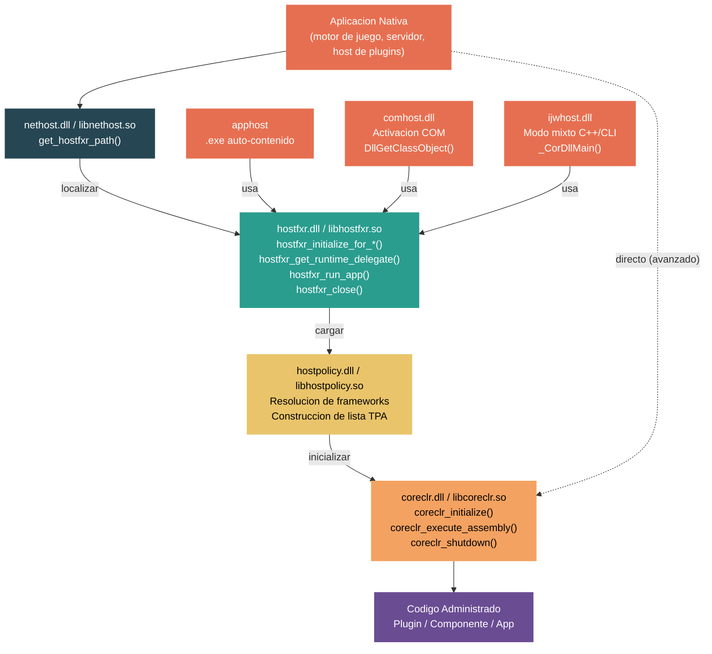

# Nivel 5: Experto / Contribuidor — Hosting Personalizado y la API de Native Hosting

> **Perfil objetivo:** Desarrollador que integra el CLR en aplicaciones nativas -- motores de juegos, shells de escritorio, procesos de servidor o frameworks de plugins que hospedan codigo administrado .NET
> **Esfuerzo estimado:** 6 horas
> **Prerequisitos:** [Modulo 4.1: Inicio del CLR](04-internals-clr-startup.md), [Modulo 3.10: Interop Nativo](03-advanced-native-interop.md)
> [English version](../en/05-expert-hosting.md)

---

## Objetivos de Aprendizaje

Al finalizar este modulo seras capaz de:

1. Describir la arquitectura de hosting de cuatro capas (nethost, hostfxr, hostpolicy, coreclr) y la responsabilidad de cada capa.
2. Usar la biblioteca `nethost` para descubrir runtimes .NET instalados y localizar `hostfxr` desde una aplicacion nativa.
3. Inicializar los componentes de hosting usando `hostfxr_initialize_for_runtime_config` y `hostfxr_initialize_for_dotnet_command_line`, y explicar cuando usar cada uno.
4. Cargar ensamblados administrados y obtener punteros a funciones nativas hacia metodos administrados via `hostfxr_get_runtime_delegate` y el delegado `load_assembly_and_get_function_pointer`.
5. Explicar como `apphost` se personaliza para despliegues auto-contenidos y de archivo unico, y como construir un host nativo personalizado.
6. Describir como `comhost` e `ijwhost` aprovechan la API de hosting para activacion COM y escenarios de modo mixto C++/CLI.
7. Usar la API de bajo nivel `coreclr_initialize` / `coreclr_execute_assembly` / `coreclr_shutdown` para integracion directa del runtime cuando la API de alto nivel no es adecuada.
8. Depurar fallos de hosting usando `DOTNET_TRACE_HOST`, callbacks de escritura de errores y depuradores nativos.

---

## Mapa Conceptual



---

## Plan de Estudios

### Leccion 1 -- El Panorama de la API de Hosting: Cuatro Capas

#### Lo que vas a aprender

La API de hosting de .NET esta organizada en cuatro bibliotecas nativas distintas que forman una pila por capas. Entender cual capa usar -- y cuando -- es la primera decision que todo host nativo debe tomar.

#### El concepto

Las cuatro capas, de la mas externa a la mas interna:

| Capa | Biblioteca | Responsabilidad |
|------|-----------|-----------------|
| **nethost** | `nethost.dll` / `libnethost.so` | Descubrir runtimes instalados. Localizar `hostfxr`. |
| **hostfxr** | `hostfxr.dll` / `libhostfxr.so` | Inicializar contexto de hosting. Resolver frameworks. Proveer delegados del runtime. Ejecutar aplicaciones. |
| **hostpolicy** | `hostpolicy.dll` / `libhostpolicy.so` | Procesar `.deps.json`. Construir lista TPA. Cargar `coreclr`. |
| **coreclr** | `coreclr.dll` / `libcoreclr.so` | Inicializar el motor de ejecucion. JIT, GC, sistema de tipos. Ejecutar codigo administrado. |

La mayoria de los hosts nativos interactuan solamente con **nethost** y **hostfxr**. Las capas hostpolicy y coreclr se cargan y administran de forma transparente por hostfxr. El uso directo de coreclr esta reservado para escenarios avanzados de integracion donde necesitas control total sobre la configuracion del runtime.

La razon de diseno de esta estratificacion esta documentada en `docs/design/features/native-hosting.md`:

> "La propuesta es agregar una nueva biblioteca host `nethost` que puede ser usada por el host nativo para localizar facilmente `hostfxr`. En el futuro la biblioteca tambien podria incluir APIs faciles de usar para escenarios comunes."

Cada host .NET integrado (apphost, comhost, ijwhost) es esencialmente un envoltorio delgado que localiza hostfxr y llama a sus APIs. Un host nativo personalizado sigue el mismo patron.

#### En el codigo fuente

**Header de nethost: `src/native/corehost/nethost/nethost.h`**

Toda la superficie publica de nethost es una sola funcion:

```c
NETHOST_API int NETHOST_CALLTYPE get_hostfxr_path(
    char_t * buffer,
    size_t * buffer_size,
    const struct get_hostfxr_parameters *parameters);
```

**Header de hostfxr: `src/native/corehost/hostfxr.h`**

La superficie de la API de hostfxr incluye inicializacion, gestion de propiedades, adquisicion de delegados y limpieza:

```c
// Typedefs principales de punteros a funciones:
hostfxr_initialize_for_dotnet_command_line_fn  // Inicializar para ejecutar una app
hostfxr_initialize_for_runtime_config_fn       // Inicializar para cargar componentes
hostfxr_get_runtime_property_value_fn          // Leer propiedades del runtime
hostfxr_set_runtime_property_value_fn          // Establecer propiedades (antes de cargar el runtime)
hostfxr_get_runtime_delegate_fn                // Obtener delegados para cargar/llamar codigo administrado
hostfxr_run_app_fn                             // Ejecutar una aplicacion administrada
hostfxr_close_fn                               // Cerrar contexto del host
```

**Header de coreclr: `src/coreclr/hosts/inc/coreclrhost.h`**

La API de bajo nivel de coreclr proporciona control directo del runtime:

```c
coreclr_initialize(...)        // Crear host CLR, crear dominio de aplicacion, iniciar el runtime
coreclr_execute_assembly(...)  // Ejecutar el punto de entrada Main() de un ensamblado
coreclr_create_delegate(...)   // Obtener puntero a funcion nativa hacia metodo administrado
coreclr_shutdown(...)          // Detener el CLR y descargar el dominio de aplicacion
```

**Tipos de delegados: `src/native/corehost/hostfxr.h` lineas 27-38**

El enum `hostfxr_delegate_type` define los delegados de runtime disponibles:

```c
enum hostfxr_delegate_type
{
    hdt_com_activation,
    hdt_load_in_memory_assembly,
    hdt_winrt_activation,
    hdt_com_register,
    hdt_com_unregister,
    hdt_load_assembly_and_get_function_pointer,  // Principal para hosts personalizados
    hdt_get_function_pointer,                     // .NET 5+
    hdt_load_assembly,                            // .NET 8+
    hdt_load_assembly_bytes,                      // .NET 8+
};
```

#### Ejercicio practico

1. **Mapea las capas en tu sistema de archivos:** En una maquina con .NET instalado, localiza las cuatro bibliotecas. En Windows con una instalacion tipica:
   ```
   nethost:    C:\Program Files\dotnet\packs\Microsoft.NETCore.App.Host.win-x64\<ver>\runtimes\win-x64\native\nethost.dll
   hostfxr:    C:\Program Files\dotnet\host\fxr\<ver>\hostfxr.dll
   hostpolicy: C:\Program Files\dotnet\shared\Microsoft.NETCore.App\<ver>\hostpolicy.dll
   coreclr:    C:\Program Files\dotnet\shared\Microsoft.NETCore.App\<ver>\coreclr.dll
   ```
   En Linux, reemplaza `.dll` con `.so` y busca bajo `/usr/share/dotnet/`.

2. **Lee el documento de diseno:** Abre `docs/design/features/native-hosting.md` y lee la seccion "Longer term vision". Nota el modelo de cuatro pasos: Localizar componentes de hosting -> Inicializar contexto del host -> Cargar codigo administrado -> Acceder/ejecutar codigo administrado. Compara esto con las cuatro capas.

3. **Examina un host integrado:** Mira `src/native/corehost/apphost/standalone/hostfxr_resolver.cpp`. El apphost es un host minimo que resuelve hostfxr y lo llama. Tu host personalizado seguira este mismo patron.

#### Conclusion clave

La arquitectura de cuatro capas existe para que los hosts nativos puedan trabajar con artefactos producidos por el SDK (runtimeconfig.json, deps.json) sin reimplementar la resolucion de frameworks. A menos que tengas una razon muy especifica para saltear las capas superiores, siempre comenza con nethost + hostfxr.

#### Error conceptual comun

Muchos desarrolladores intentan cargar `coreclr.dll` directamente y llamar `coreclr_initialize`. Si bien esto funciona, significa que debes manejar manualmente la resolucion de frameworks, construccion de la lista TPA y todas las propiedades del runtime. La API de hostfxr hace todo esto automaticamente leyendo tu `.runtimeconfig.json`.

---

### Leccion 2 -- nethost: Encontrando el Runtime

#### Lo que vas a aprender

El primer paso en cualquier escenario de hosting nativo es localizar la biblioteca hostfxr en la maquina de destino. La biblioteca `nethost` proporciona una unica funcion multiplataforma para lograr esto.

#### El concepto

`nethost` esta disenado para ser redistribuido con tu aplicacion nativa. Es una biblioteca pequena y estable con una sola exportacion: `get_hostfxr_path()`. La funcion busca un runtime .NET instalado en el siguiente orden:

1. Si `dotnet_root` esta especificado en los parametros, busca bajo esa ruta.
2. Si `assembly_path` esta especificado, busca como si ese ensamblado fuera un apphost (util para layouts auto-contenidos).
3. En caso contrario, usa variables de entorno (`DOTNET_ROOT`) y registro global (registro de Windows, `/etc/dotnet/install_location` en Linux).

La funcion devuelve la ruta completa a `hostfxr.dll` / `libhostfxr.so`. Tu host nativo luego carga esta biblioteca dinamicamente y resuelve los punteros a funcion que necesita.

#### En el codigo fuente

**Header: `src/native/corehost/nethost/nethost.h`**

La estructura de parametros controla el comportamiento de busqueda:

```c
struct get_hostfxr_parameters {
    size_t size;
    const char_t *assembly_path;  // Opcional: ruta al ensamblado del componente
    const char_t *dotnet_root;    // Opcional: directorio raiz .NET explicito
};
```

**Implementacion: `src/native/corehost/nethost/nethost.cpp` lineas 20-59**

La implementacion primero valida las entradas, luego delega a `fxr_resolver`:

```cpp
NETHOST_API int NETHOST_CALLTYPE get_hostfxr_path(
    char_t * buffer,
    size_t * buffer_size,
    const struct get_hostfxr_parameters *parameters)
{
    if (buffer_size == nullptr)
        return StatusCode::InvalidArgFailure;

    trace::setup();
    error_writer_scope_t writer_scope(swallow_trace);
    // ...
    if (parameters != nullptr && parameters->dotnet_root != nullptr)
    {
        // Usar dotnet root explicito
        if (!fxr_resolver::try_get_path_from_dotnet_root(dotnet_root, &fxr_path))
            return StatusCode::CoreHostLibMissingFailure;
    }
    else
    {
        // Usar variables de entorno/registro global
        if (!fxr_resolver::try_get_path(root_path, &dotnet_root, &fxr_path))
            return StatusCode::CoreHostLibMissingFailure;
    }
    // Copiar fxr_path al buffer...
}
```

Nota el escritor de errores `swallow_trace` en la linea 14 -- nethost suprime intencionalmente la salida de traza porque esta ejecutandose dentro de un proceso que no le pertenece. El host puede optar por habilitar el tracing por separado.

#### Ejercicio practico

1. **Escribe un host nativo minimo que localice hostfxr.** Esta es la base de todo lo que sigue:

   ```c
   // locate_hostfxr.c
   #include <stdio.h>
   #include <nethost.h>

   int main()
   {
       char_t buffer[1024];
       size_t buffer_size = sizeof(buffer) / sizeof(char_t);

       int rc = get_hostfxr_path(buffer, &buffer_size, NULL);
       if (rc != 0)
       {
           printf("Fallo al localizar hostfxr: 0x%x\n", rc);
           return 1;
       }

       printf("hostfxr encontrado en: %ls\n", buffer);  // %s en Linux
       return 0;
   }
   ```

   Enlaza contra `nethost.lib` (Windows) o `libnethost.a` (Linux/macOS). Los headers y la biblioteca estan en el paquete NuGet `Microsoft.NETCore.App.Host.<rid>` bajo `runtimes/<rid>/native/`.

2. **Prueba con dotnet_root explicito:** Modifica el ejemplo para pasar un `get_hostfxr_parameters` con `dotnet_root` apuntando a una instalacion .NET especifica. Verifica que encuentra el hostfxr bajo esa ruta.

3. **Prueba con assembly_path:** Crea una aplicacion publicada auto-contenida (`dotnet publish -r <rid> --self-contained`). Pasa la ruta del ensamblado de salida como `assembly_path`. Observa que `get_hostfxr_path` ahora devuelve el hostfxr del layout auto-contenido en lugar de la instalacion global.

4. **Maneja el caso de buffer muy pequeno:** Pasa un `buffer_size` de 1. La funcion devuelve `0x80008098` (`HostApiBufferTooSmall`) y establece `buffer_size` al tamano requerido. Asigna el buffer correcto y reintenta.

#### Conclusion clave

`nethost` es deliberadamente minimalista -- una funcion, sin estado, sin dependencia del runtime. Existe para que tu aplicacion nativa no necesite codificar rutas de instalacion de .NET ni implementar la logica de descubrimiento del runtime.

#### Error conceptual comun

`nethost` no carga el runtime. Solo localiza `hostfxr`. Despues de que `get_hostfxr_path` tiene exito, debes cargar dinamicamente la ruta de biblioteca retornada (via `LoadLibrary`/`dlopen`) y resolver los punteros a funcion de hostfxr vos mismo.

---

### Leccion 3 -- hostfxr: Inicializando y Ejecutando Codigo Administrado

#### Lo que vas a aprender

Una vez que cargaste `hostfxr`, usas su API para inicializar un contexto de hosting, opcionalmente configurar propiedades del runtime, y luego ejecutar una aplicacion administrada o cargar componentes administrados y llamar a sus metodos desde codigo nativo.

#### El concepto

Hay dos caminos de inicializacion, cada uno para un escenario diferente:

| Funcion | Escenario | Usar cuando... |
|---------|-----------|----------------|
| `hostfxr_initialize_for_dotnet_command_line` | Ejecutar una aplicacion | Queres ejecutar el punto de entrada `Main()` de una app administrada en proceso. |
| `hostfxr_initialize_for_runtime_config` | Cargar componentes | Queres cargar ensamblados administrados y llamar metodos especificos desde codigo nativo. |

Ambas devuelven un `hostfxr_handle` que representa el contexto del host inicializado. Reglas clave:

- **Ninguna de las funciones carga el runtime.** Solo preparan la configuracion (resolver frameworks, procesar deps.json, computar propiedades del runtime).
- **Solo el primer contexto en el proceso** puede establecer propiedades del runtime. Los contextos subsiguientes son "secundarios" y de solo lectura.
- **Debes llamar `hostfxr_close`** en cada handle que obtengas.

Despues de la inicializacion, podes:
- Llamar `hostfxr_run_app` para ejecutar la aplicacion administrada (bloquea hasta que la app termina), o
- Llamar `hostfxr_get_runtime_delegate` para obtener punteros a funciones para cargar y llamar codigo administrado.

El tipo de delegado mas comunmente usado es `hdt_load_assembly_and_get_function_pointer`, que carga un ensamblado administrado en un `AssemblyLoadContext` aislado y devuelve un puntero a funcion nativa hacia un metodo estatico especificado.

#### En el codigo fuente

**Tipos de inicializacion de hostfxr: `src/native/corehost/hostfxr.h` lineas 83-88**

```c
struct hostfxr_initialize_parameters
{
    size_t size;
    const char_t *host_path;     // Ruta al ejecutable del host nativo
    const char_t *dotnet_root;   // Ruta a la raiz de instalacion .NET
};
```

**Delegado del runtime para cargar componentes: `src/native/corehost/hostfxr.h` lineas 259-283**

`hostfxr_get_runtime_delegate` inicia el runtime (si no esta ya iniciado) y devuelve un puntero a funcion para el tipo de delegado solicitado. Para `hdt_load_assembly_and_get_function_pointer`, el delegado devuelto tiene esta firma:

```c
int load_assembly_and_get_function_pointer(
    const char_t *assembly_path,      // Ruta al ensamblado administrado
    const char_t *type_name,          // Nombre de tipo calificado con ensamblado
    const char_t *method_name,        // Nombre del metodo estatico
    const char_t *delegate_type_name, // Tipo delegado, o NULL por defecto, o -1 para UnmanagedCallersOnly
    void         *reserved,           // Debe ser NULL
    void        **delegate);          // Salida: puntero a funcion nativa
```

**Codigo de prueba mostrando el flujo completo: `src/native/corehost/test/nativehost/host_context_test.cpp`**

La suite de pruebas en este archivo demuestra la secuencia completa de la API, incluyendo inicializacion paralela desde multiples hilos, inspeccion de propiedades y creacion de contextos secundarios.

#### Ejercicio practico

1. **Construi un host de componentes completo.** Este es el patron canonico para hospedar plugins .NET:

   ```c
   // Paso 1: Localizar hostfxr (de la Leccion 2)
   get_hostfxr_path(buffer, &buffer_size, NULL);
   void *lib = load_library(buffer);

   // Paso 2: Obtener punteros a funciones de hostfxr
   hostfxr_initialize_for_runtime_config_fn init_fptr =
       get_export(lib, "hostfxr_initialize_for_runtime_config");
   hostfxr_get_runtime_delegate_fn get_delegate_fptr =
       get_export(lib, "hostfxr_get_runtime_delegate");
   hostfxr_close_fn close_fptr =
       get_export(lib, "hostfxr_close");

   // Paso 3: Inicializar para carga de componentes
   hostfxr_handle cxt = NULL;
   int rc = init_fptr(L"MyPlugin.runtimeconfig.json", NULL, &cxt);
   // rc == 0: primer contexto. rc == 1: runtime ya cargado (contexto secundario).

   // Paso 4: Obtener el delegado load_assembly_and_get_function_pointer
   load_assembly_and_get_function_pointer_fn load_and_get = NULL;
   rc = get_delegate_fptr(cxt, hdt_load_assembly_and_get_function_pointer,
                          (void**)&load_and_get);

   // Paso 5: Cargar un ensamblado administrado y obtener un puntero a funcion
   typedef int (CORECLR_DELEGATE_CALLTYPE *plugin_entry_fn)(void *arg, int arg_size);
   plugin_entry_fn plugin_entry = NULL;
   rc = load_and_get(
       L"MyPlugin.dll",
       L"MyPlugin.PluginClass, MyPlugin",
       L"Entry",
       NULL,      // tipo delegado por defecto
       NULL,      // reservado
       (void**)&plugin_entry);

   // Paso 6: Llamar al metodo administrado!
   int result = plugin_entry(NULL, 0);

   // Paso 7: Limpieza
   close_fptr(cxt);
   ```

2. **Establece propiedades del runtime antes de cargar:** Entre los pasos 3 y 4, usa `hostfxr_set_runtime_property_value` para configurar el comportamiento del runtime:
   ```c
   hostfxr_set_runtime_property_value_fn set_prop =
       get_export(lib, "hostfxr_set_runtime_property_value");
   set_prop(cxt, L"STARTUP_HOOKS", L"MyStartupHook.dll");
   set_prop(cxt, L"System.GC.Server", L"true");
   ```
   Esto solo esta permitido en el primer contexto del host antes de que el runtime cargue.

3. **Usa UnmanagedCallersOnly:** En lugar de pasar `NULL` como tipo de delegado, pasa `UNMANAGEDCALLERSONLY_METHOD` (valor `-1` casteado a `const char_t*`). El metodo administrado objetivo debe estar decorado con `[UnmanagedCallersOnly]` y usar tipos blittables. Esto evita el overhead de marshalling del interop basado en delegados.

4. **Registra un escritor de errores:** Antes de la inicializacion, registra un callback para capturar mensajes de error:
   ```c
   hostfxr_set_error_writer_fn set_writer =
       get_export(lib, "hostfxr_set_error_writer");
   set_writer(my_error_callback);
   ```
   El escritor de errores es por hilo y recibira mensajes tanto de hostfxr como de hostpolicy.

5. **Ejecuta una aplicacion administrada en proceso:** Usa `hostfxr_initialize_for_dotnet_command_line` + `hostfxr_run_app` para ejecutar una aplicacion .NET completa dentro de tu proceso nativo. Nota que `hostfxr_run_app` bloquea hasta que la app administrada termina y solo puede llamarse una vez por proceso.

#### Conclusion clave

La API de hostfxr proporciona un modelo de dos fases: inicializar (resolver frameworks, preparar configuracion) y luego ejecutar (cargar codigo administrado o ejecutar app). Esta separacion le da al host nativo una ventana para inspeccionar y modificar propiedades del runtime entre las dos fases. Para escenarios de hosting de componentes, el delegado `load_assembly_and_get_function_pointer` es el mecanismo principal para llamar codigo administrado desde codigo nativo.

#### Error conceptual comun

Llamar `hostfxr_initialize_for_runtime_config` no carga el runtime. El runtime se carga de forma perezosa la primera vez que llamas `hostfxr_get_runtime_delegate` o `hostfxr_run_app`. Esto significa que podes inicializar el contexto, modificar propiedades e incluso cerrarlo sin que el runtime se haya cargado nunca.

---

### Leccion 4 -- Hosts de Aplicacion Personalizados: apphost, Auto-Contenido y Archivo Unico

#### Lo que vas a aprender

El `apphost` es el ejecutable nativo provisto por .NET que actua como punto de entrada para aplicaciones publicadas. Entender como funciona es esencial para construir hosts personalizados que necesiten capacidades similares -- despliegue auto-contenido, paquetes de archivo unico o manejo personalizado de errores.

#### El concepto

Cuando ejecutas `dotnet publish`, el SDK produce un `apphost` -- un ejecutable nativo (`.exe` en Windows, binario ELF en Linux) con la ruta del ensamblado objetivo incrustada directamente en su imagen binaria. El apphost es una copia del ejecutable host generico con dos personalizaciones:

1. **Ruta del ensamblado incrustada:** Una cadena placeholder en el binario se sobreescribe con la ruta relativa al DLL administrado (ej., `MyApp.dll`).
2. **Marcador de paquete incrustado:** Para despliegues de archivo unico, un marcador en un offset conocido del binario indica la ubicacion de los ensamblados empaquetados.

El flujo de ejecucion del apphost es:
1. Leer la ruta del ensamblado incrustada desde la imagen binaria.
2. Localizar hostfxr (usando la misma logica `fxr_resolver` que usa nethost).
3. Llamar `hostfxr_main_startupinfo` con la ruta del host, raiz de dotnet y ruta de la app.
4. hostfxr toma el control desde aqui -- resolviendo frameworks, cargando hostpolicy e iniciando el runtime.

Para despliegues auto-contenidos, el apphost encuentra hostfxr junto a si mismo (en el directorio de salida de publicacion) en lugar de en una instalacion global de .NET. Para despliegues de archivo unico, el marcador de paquete le indica a la infraestructura del host que extraiga o mapee los ensamblados empaquetados desde el ejecutable unico.

#### En el codigo fuente

**Marcador de paquete: `src/native/corehost/apphost/bundle_marker.cpp`**

El marcador de paquete es una estructura incrustada en el binario del apphost en tiempo de compilacion. Para apps de archivo unico, el SDK escribe el offset real del paquete aqui:

```cpp
static int64_t bundle_marker()
{
    // Contiene el bundle_header_offset si este es un paquete de archivo unico
    // En caso contrario contiene un valor centinela (0)
}
```

**Manejo de errores especifico de Windows: `src/native/corehost/apphost/apphost.windows.cpp`**

El apphost de Windows incluye deteccion de reconocimiento de GUI y reporte al Event Log:

```cpp
bool is_gui_application()
{
    // Lee el subsistema PE del header del modulo
    UINT16 subsystem = reinterpret_cast<IMAGE_NT_HEADERS*>(...)->OptionalHeader.Subsystem;
    return subsystem == IMAGE_SUBSYSTEM_WINDOWS_GUI;
}
```

Si el apphost es una aplicacion GUI y encuentra un error de inicio, muestra un cuadro de mensaje en lugar de imprimir a stderr. Los errores tambien se escriben en el Windows Event Log.

**Entrada principal: `src/native/corehost/corehost.cpp`**

La funcion `exe_start()` (usada por apphost) lee la ruta de la app incrustada, resuelve hostfxr y lo llama. La variante de apphost independiente en `src/native/corehost/apphost/standalone/hostfxr_resolver.cpp` maneja el caso donde hostfxr se localiza relativo al propio apphost (layout auto-contenido).

#### Ejercicio practico

1. **Examina un binario de apphost:** Publica una app simple y abri el `.exe` resultante en un editor hexadecimal. Busca el nombre de tu DLL (ej., `MyApp.dll`) -- aparece como una cadena incrustada. Este es el placeholder que fue sobreescrito durante `dotnet publish`.

2. **Construi un host personalizado con dialogos de error GUI:** Escribe un host nativo de Windows que, ante un fallo, muestre un `MessageBox` en lugar de escribir a stderr. Usa el mismo patron que `apphost.windows.cpp`:
   ```c
   if (is_gui_application())
       MessageBox(NULL, error_message, L"Error de Inicio", MB_ICONERROR);
   else
       fprintf(stderr, "%ls\n", error_message);
   ```

3. **Compara la resolucion dependiente de framework vs auto-contenida:** Publica la misma app de ambas formas:
   ```bash
   dotnet publish -o fd_out
   dotnet publish -r win-x64 --self-contained -o sc_out
   ```
   Ejecuta ambas con `DOTNET_TRACE_HOST=1`. Compara las rutas de resolucion de hostfxr. En el caso auto-contenido, hostfxr se encuentra junto al ejecutable. En el caso dependiente de framework, se encuentra en la instalacion global de .NET.

4. **Examina la estructura de paquete de archivo unico:** Publica una app de archivo unico:
   ```bash
   dotnet publish -r win-x64 --self-contained /p:PublishSingleFile=true -o sf_out
   ```
   El ejecutable resultante contiene todos los ensamblados empaquetados despues del binario nativo. Establece `DOTNET_TRACE_HOST=1` y observa los mensajes de traza de extraccion/mapeo del paquete.

#### Conclusion clave

El apphost no es una caja negra -- es un programa nativo directo que incrusta una ruta, localiza hostfxr y llama a un unico punto de entrada. Entender su estructura te permite construir hosts personalizados con modelos de despliegue identicos (auto-contenido, archivo unico) mientras agregas tu propia logica de inicializacion, manejo de errores o arquitectura de plugins.

#### Error conceptual comun

Una creencia comun es que el despliegue de archivo unico requiere un runtime especial. En realidad, se usa el mismo runtime -- la diferencia esta enteramente en la capa del host. El apphost contiene un marcador de paquete que le indica a hostpolicy que lea los ensamblados desde los datos incrustados del ejecutable en lugar de desde disco. El runtime en si no cambia.

---

### Leccion 5 -- Hosting COM e IJW

#### Lo que vas a aprender

Dos hosts especializados -- `comhost` e `ijwhost` -- aprovechan la API de hosting para escenarios de interop especificos. Entender su implementacion revela como la API de hosting soporta modelos de activacion diversos mas alla de simples llamadas por punteros a funcion.

#### El concepto

**comhost** es un DLL nativo que actua como servidor COM para clases administradas .NET. Permite a clientes COM nativos activar objetos .NET via mecanismos COM estandar (`CoCreateInstance`, `DllGetClassObject`). El flujo de trabajo:

1. La infraestructura COM llama `DllGetClassObject` en el DLL de comhost.
2. comhost lee un mapa de CLSIDs incrustado en el DLL (mapeando CLSIDs COM a nombres de tipos administrados).
3. comhost usa la API de hostfxr para inicializar el runtime y obtener un delegado `get_function_pointer`.
4. Llama a `Internal.Runtime.InteropServices.ComActivator` en System.Private.CoreLib para crear el objeto COM administrado.
5. La fabrica de clases se devuelve al cliente COM.

**ijwhost** maneja ensamblados C++/CLI de modo mixto (interop It Just Works). Cuando un DLL de modo mixto se carga, el loader llama `_CorDllMain` (exportado por ijwhost) en lugar del `DllMain` regular. ijwhost:

1. Valida que el PE tiene un header administrado.
2. Parchea las entradas de la vtable con thunks de arranque que dispararan la inicializacion del runtime en la primera llamada.
3. Cuando un metodo administrado se llama por primera vez, el thunk carga el runtime, carga el ensamblado en memoria y resuelve el metodo administrado.

Ambos hosts comparten el patron de usar `load_fxr_and_get_delegate` -- un helper que localiza hostfxr, inicializa un contexto desde un `.runtimeconfig.json` adyacente al DLL del host, y obtiene un delegado del runtime.

#### En el codigo fuente

**comhost: `src/native/corehost/comhost/comhost.cpp`**

El punto de entrada de activacion COM en la linea 196:

```cpp
COM_API HRESULT STDMETHODCALLTYPE DllGetClassObject(
    _In_ REFCLSID rclsid,
    _In_ REFIID riid,
    _Outptr_ LPVOID FAR* ppv)
{
    // 1. Buscar CLSID en el mapa incrustado
    clsid_map map;
    RETURN_HRESULT_IF_EXCEPT(map = comhost::get_clsid_map());
    clsid_map::const_iterator iter = map.find(rclsid);
    if (iter == std::end(map))
        return CLASS_E_CLASSNOTAVAILABLE;

    // 2. Obtener delegado de activacion COM via hostfxr
    com_delegates act;
    int ec = get_com_delegate(hostfxr_delegate_type::hdt_com_activation, &app_path, act, &load_context);

    // 3. Llamar al ComActivator administrado para crear la fabrica de clases
    com_activation_context cxt { rclsid, riid, app_path.c_str(), ... };
    act.delegate(&cxt, load_context);

    // 4. Consultar la fabrica de clases por la interfaz solicitada
    hr = classFactory->QueryInterface(riid, ppv);
}
```

comhost tambien implementa `DllRegisterServer`/`DllUnregisterServer` (lineas 561-665) para registro COM, escribiendo entradas CLSID en el registro de Windows.

**Mapa de CLSIDs: `src/native/corehost/comhost/clsidmap.cpp`**

El mapa de CLSIDs es una estructura JSON incrustada en el DLL de comhost en tiempo de compilacion. Mapea CLSIDs COM a nombres de tipos administrados calificados con ensamblado.

**ijwhost: `src/native/corehost/ijwhost/ijwhost.cpp`**

El punto de entrada de modo mixto en la linea 69:

```cpp
IJW_API BOOL STDMETHODCALLTYPE _CorDllMain(HINSTANCE hInst, DWORD dwReason, LPVOID lpReserved)
{
    PEDecoder pe(hInst);

    if (dwReason == DLL_PROCESS_ATTACH)
    {
        if (!pe.HasCorHeader())
            return FALSE;
        // Instalar thunks de arranque que dispararan la carga del runtime
        if (!patch_vtable_entries(pe))
            return FALSE;
    }
    // ...
    if (dwReason == DLL_PROCESS_DETACH)
        release_bootstrap_thunks(pe);
}
```

Los thunks de arranque (`src/native/corehost/ijwhost/bootstrap_thunk_chunk.cpp`) son pequenos fragmentos de codigo que interceptan llamadas a metodos administrados. En la primera llamada, el thunk dispara `get_load_in_memory_assembly_delegate` que carga el ensamblado de modo mixto via hostfxr.

**Contenido del directorio ijwhost:**

```
ijwhost.cpp           - Entrada principal (_CorDllMain)
ijwhost.h             - Declaraciones
ijwthunk.cpp          - Logica de parcheo de thunks
bootstrap_thunk_chunk.cpp/h - Asignacion de thunks ejecutables
pedecoder.cpp/h       - Analisis de imagen PE
corhdr.h              - Definiciones de header COR
amd64/                - Codigo de thunks especifico de x64
arm64/                - Codigo de thunks especifico de ARM64
i386/                 - Codigo de thunks especifico de x86
```

#### Ejercicio practico

1. **Examina el flujo de activacion COM:** Crea una clase administrada visible a COM:
   ```csharp
   [ComVisible(true)]
   [Guid("12345678-1234-1234-1234-123456789ABC")]
   public class MyComObject : IMyInterface
   {
       public int DoWork() => 42;
   }
   ```
   Publica con `<EnableComHosting>true</EnableComHosting>`. Examina el `.comhost.dll` generado y su `.runtimeconfig.json` adyacente. Registra con `regsvr32 MyLib.comhost.dll`.

2. **Traza la activacion COM:** Establece `DOTNET_TRACE_HOST=1` antes de activar el objeto COM desde un cliente nativo. Observa la inicializacion de hostfxr, carga del runtime y llamada al delegado administrado.

3. **Lee el mapa de CLSIDs:** El mapa de CLSIDs esta incrustado en el DLL de comhost. Usa una herramienta para extraer cadenas del DLL y encontra el mapeo JSON `{"clsid": "...", "assembly": "...", "type": "..."}`.

4. **Examina la arquitectura de ijwhost:** Mira los thunks de arranque en `src/native/corehost/ijwhost/amd64/` (o tu arquitectura objetivo). Cada thunk preserva registros, llama al cargador de metodos administrados, y luego salta a la direccion del metodo resuelto. Esto es analogo al mecanismo de prestub del CLR del Modulo 4.1.

#### Conclusion clave

comhost e ijwhost demuestran que la API de hosting es lo suficientemente flexible para soportar modelos de activacion fundamentalmente diferentes -- fabricas de clases COM y parcheo de vtable de C++/CLI -- usando el mismo mecanismo subyacente de hostfxr. Ambos siguen el patron: localizar hostfxr, inicializar contexto desde runtimeconfig.json adyacente, obtener un delegado, llamar codigo administrado.

#### Error conceptual comun

comhost no implementa COM en si mismo. Es un shim nativo delgado que satisface los requerimientos de la infraestructura COM (`DllGetClassObject`, `DllRegisterServer`) y delega al clase administrada `ComActivator` en System.Private.CoreLib. La creacion real del objeto COM y el marshalling ocurren en codigo administrado.

---

### Leccion 6 -- Avanzado: Hosting Directo de coreclr

#### Lo que vas a aprender

Para maximo control sobre el runtime -- especificando listas TPA exactas, evitando la resolucion de frameworks o integrando .NET en entornos donde la pila de hosting estandar no esta disponible -- podes usar la API de bajo nivel de coreclr directamente.

#### El concepto

La API de coreclr (`coreclrhost.h`) proporciona cinco funciones:

| Funcion | Proposito |
|---------|-----------|
| `coreclr_initialize` | Crear host CLR, crear dominio de aplicacion, iniciar el runtime |
| `coreclr_set_error_writer` | Registrar callback de errores |
| `coreclr_execute_assembly` | Ejecutar el `Main()` de un ensamblado administrado |
| `coreclr_create_delegate` | Obtener puntero a funcion nativa hacia metodo administrado |
| `coreclr_shutdown` / `coreclr_shutdown_2` | Detener el CLR y descargar el dominio de aplicacion |

Usar esta API significa que sos responsable de:
- Localizar `coreclr.dll`/`libcoreclr.so` vos mismo.
- Construir la lista completa de Trusted Platform Assemblies (TPA) -- cada ensamblado de framework que el runtime necesita.
- Establecer todas las propiedades del runtime (`TRUSTED_PLATFORM_ASSEMBLIES`, `APP_PATHS`, `NATIVE_DLL_SEARCH_DIRECTORIES`, etc.).
- Gestionar el ciclo de vida del runtime (no hay resolucion de frameworks, no hay procesamiento de deps.json, no hay soporte de runtimeconfig.json).

Este enfoque es apropiado para:
- **Motores de juegos** que integran .NET como runtime de scripting con un conjunto fijo de ensamblados conocidos.
- **Entornos embebidos minimos** donde la pila completa de hosting del SDK .NET no esta disponible.
- **Sandboxing personalizado** donde necesitas control preciso sobre que ensamblados estan disponibles.

#### En el codigo fuente

**API de coreclr: `src/coreclr/hosts/inc/coreclrhost.h`**

La funcion `coreclr_initialize` crea el runtime:

```c
CORECLR_HOSTING_API(coreclr_initialize,
    const char* exePath,                // Ruta al ejecutable del host
    const char* appDomainFriendlyName,  // Nombre descriptivo para el dominio de app
    int propertyCount,                  // Numero de pares clave-valor de propiedades
    const char** propertyKeys,          // Claves de propiedades
    const char** propertyValues,        // Valores de propiedades
    void** hostHandle,                  // Salida: handle del host
    unsigned int* domainId);            // Salida: ID del dominio de app
```

Las propiedades criticas que debes establecer:

```c
const char *propertyKeys[] = {
    "TRUSTED_PLATFORM_ASSEMBLIES",       // Lista separada por punto y coma de todos los ensamblados de framework
    "APP_PATHS",                          // Rutas para buscar ensamblados de aplicacion
    "NATIVE_DLL_SEARCH_DIRECTORIES",     // Rutas para resolucion de bibliotecas nativas
    "APP_CONTEXT_BASE_DIRECTORY",        // Directorio base de la aplicacion
};
```

**Puente de hostpolicy: `src/native/corehost/hostpolicy/coreclr.cpp` lineas 29-80**

La funcion `coreclr_t::create()` muestra exactamente como hostpolicy llama a `coreclr_initialize`:

```cpp
pal::hresult_t coreclr_t::create(
    const pal::string_t& libcoreclr_path,
    const char* exe_path,
    const char* app_domain_friendly_name,
    const coreclr_property_bag_t &properties,
    std::unique_ptr<coreclr_t> &inst)
{
    if (!coreclr_bind(libcoreclr_path))
    {
        trace::error(_X("Failed to bind to CoreCLR at '%s'"), libcoreclr_path.c_str());
        return StatusCode::CoreClrBindFailure;
    }

    // Convertir la bolsa de propiedades a arrays paralelos de clave/valor
    // ...

    hr = coreclr_contract.coreclr_initialize(
        exe_path,
        app_domain_friendly_name,
        propertyCount,
        keys.data(),
        values.data(),
        &host_handle,
        &domain_id);
}
```

Esto es exactamente lo que escribirias en un host directo personalizado -- la unica diferencia es que hostpolicy ya calculo los valores de las propiedades a partir de archivos deps.json.

**coreclr_create_delegate: `src/coreclr/hosts/inc/coreclrhost.h` lineas 104-124**

```c
CORECLR_HOSTING_API(coreclr_create_delegate,
    void* hostHandle,
    unsigned int domainId,
    const char* entryPointAssemblyName,  // Nombre simple del ensamblado (no ruta)
    const char* entryPointTypeName,      // Nombre de tipo completamente calificado
    const char* entryPointMethodName,    // Nombre del metodo
    void** delegate);                     // Salida: puntero a funcion
```

A diferencia de `load_assembly_and_get_function_pointer` de hostfxr, esta funcion usa nombres de ensamblado (no rutas) y resuelve tipos desde ensamblados ya cargados.

#### Ejercicio practico

1. **Construi un host directo minimo.** Este ejemplo demuestra el escenario de motor de juegos / entorno embebido:

   ```c
   // direct_host.c - Integracion minima de coreclr
   #include "coreclrhost.h"

   int main()
   {
       // 1. Cargar biblioteca coreclr
       void *coreclr_lib = load_library("ruta/a/coreclr.dll");
       coreclr_initialize_ptr init = get_export(coreclr_lib, "coreclr_initialize");
       coreclr_create_delegate_ptr create_del = get_export(coreclr_lib, "coreclr_create_delegate");
       coreclr_shutdown_ptr shutdown = get_export(coreclr_lib, "coreclr_shutdown");

       // 2. Construir lista TPA (debe incluir TODOS los ensamblados de framework)
       char tpa_list[65536] = {0};
       build_tpa_list("ruta/a/shared/Microsoft.NETCore.App/<ver>/", tpa_list);

       // 3. Inicializar el runtime
       const char *keys[] = {
           "TRUSTED_PLATFORM_ASSEMBLIES",
           "APP_PATHS",
       };
       const char *values[] = {
           tpa_list,
           "ruta/a/mi/app/",
       };

       void *host_handle;
       unsigned int domain_id;
       init("direct_host", "MyDomain", 2, keys, values, &host_handle, &domain_id);

       // 4. Obtener puntero a funcion hacia metodo administrado
       typedef int (*plugin_fn)(int);
       plugin_fn managed_add;
       create_del(host_handle, domain_id,
                  "MyPlugin", "MyPlugin.Calculator", "Add",
                  (void**)&managed_add);

       // 5. Llamar codigo administrado!
       int result = managed_add(42);

       // 6. Cerrar
       shutdown(host_handle, domain_id);
   }
   ```

2. **Construi la lista TPA correctamente.** La TPA debe incluir cada ensamblado que el runtime necesita. Enumera todos los archivos `.dll` en el directorio del framework compartido:
   ```c
   void build_tpa_list(const char *framework_dir, char *tpa_list)
   {
       // Para cada .dll en framework_dir:
       //   agregar ruta completa + ";" (o ":" en Unix) a tpa_list
   }
   ```
   Que falte un solo ensamblado de framework causara `FileNotFoundException` misteriosos en tiempo de ejecucion.

3. **Compara hostfxr vs hosting directo.** Ejecuta el mismo codigo administrado a traves de ambos enfoques. Con `DOTNET_TRACE_HOST=1`, observa que la ruta de hostfxr produce salida de traza extensa de la resolucion de frameworks y procesamiento de deps.json. La ruta directa de coreclr no tiene tal salida -- estas por tu cuenta.

4. **Escenario de motor de juegos:** Imagina un motor de juegos que carga scripts .NET como plugins. Cada plugin es un DLL administrado en un directorio conocido. El motor de juegos:
   - Inicializa coreclr una vez al inicio con una lista TPA que contiene el framework y un ensamblado API compartido.
   - Para cada plugin, llama `coreclr_create_delegate` para obtener punteros a funcion hacia puntos de entrada conocidos (`OnLoad`, `OnUpdate`, `OnDestroy`).
   - Llama estos punteros a funcion en el hilo del game loop.
   - Llama `coreclr_shutdown` al salir.

   Asi es precisamente como motores como Unity (historicamente) y motores de juegos personalizados integran el CLR.

5. **Gestion del ciclo de vida:** Llama `coreclr_shutdown_2` en lugar de `coreclr_shutdown` para obtener el codigo de salida retenido -- el ultimo codigo de salida establecido por el codigo administrado via `Environment.ExitCode`.

#### Conclusion clave

El hosting directo de coreclr te da maximo control al costo de maxima responsabilidad. Debes manejar todo lo que hostfxr/hostpolicy normalmente hacen: localizar ensamblados, construir la lista TPA, establecer propiedades. Usa este enfoque solo cuando tengas una buena razon para evitar la pila de hosting estandar -- tipicamente cuando integras .NET en una aplicacion no-.NET con un conjunto fijo y conocido de ensamblados.

#### Error conceptual comun

`coreclr_initialize` no solo "inicia" el runtime -- ejecuta la secuencia completa de `EEStartupHelper()` del Modulo 4.1 (inicializacion del GC, JIT, sistema de tipos, gestor de hilos). Una vez inicializado, el runtime no puede re-inicializarse en el mismo proceso. `coreclr_shutdown` cierra el runtime permanentemente; no podes inicializarlo de nuevo.

---

## Guia de Lectura del Codigo Fuente

Los archivos a continuacion estan listados en orden de prioridad de lectura para este modulo. La calificacion con estrellas indica dificultad: mas estrellas significa mayor complejidad de C++ y conocimiento prerequisito.

| Estrellas | Archivo | Que buscar |
|-----------|---------|------------|
| ++ | `src/native/corehost/nethost/nethost.h` | La unica exportacion `get_hostfxr_path` -- toda la superficie de la API de nethost |
| ++ | `src/native/corehost/hostfxr.h` | Todos los typedefs de punteros a funciones de hostfxr -- inicializacion, propiedades, delegados, limpieza |
| ++ | `src/coreclr/hosts/inc/coreclrhost.h` | La API de hosting de bajo nivel de coreclr -- 5 funciones para integracion directa |
| +++ | `src/native/corehost/nethost/nethost.cpp` | Implementacion de nethost -- delegacion a fxr_resolver, supresion de trazas |
| +++ | `src/native/corehost/apphost/bundle_marker.cpp` | Estructura del marcador de paquete para despliegue de archivo unico |
| +++ | `src/native/corehost/apphost/apphost.windows.cpp` | Comportamiento especifico de Windows del apphost -- deteccion GUI, Event Log |
| +++ | `src/native/corehost/apphost/standalone/hostfxr_resolver.cpp` | Como el apphost localiza hostfxr en layouts auto-contenidos |
| ++++ | `src/native/corehost/hostpolicy/coreclr.cpp` | Como hostpolicy conecta con coreclr_initialize -- conversion de la bolsa de propiedades |
| ++++ | `src/native/corehost/comhost/comhost.cpp` | Flujo de activacion COM -- DllGetClassObject, mapa CLSID, llamadas a delegados administrados |
| ++++ | `src/native/corehost/ijwhost/ijwhost.cpp` | Hosting de modo mixto C++/CLI -- _CorDllMain, thunks de arranque |
| ++++ | `src/native/corehost/test/nativehost/host_context_test.cpp` | Escenarios de prueba completos para la API de hosting -- init paralelo, inspeccion de propiedades |
| +++++ | `docs/design/features/native-hosting.md` | Especificacion de diseno completa -- justificacion, reglas de sincronizacion, compatibilidad de versiones |

---

## Herramientas para Explorar la API de Hosting

### DOTNET_TRACE_HOST

La herramienta de depuracion mas importante para escenarios de hosting:

```bash
# Windows cmd:
set DOTNET_TRACE_HOST=1
MyNativeHost.exe

# Linux/macOS:
DOTNET_TRACE_HOST=1 ./my_native_host
```

Esto produce salida de traza con marcas de tiempo desde hostfxr y hostpolicy mostrando cada paso de resolucion, valor de propiedad y punto de decision.

### Callback de Escritor de Errores

Registra un callback para capturar errores programaticamente:

```c
hostfxr_set_error_writer_fn set_writer =
    get_export(hostfxr_lib, "hostfxr_set_error_writer");

void my_error_handler(const char_t *message) {
    log_to_file("ERROR HOSTFXR: %s\n", message);
}

set_writer(my_error_handler);
```

El escritor de errores es por hilo. El escritor previamente registrado se devuelve para que puedas encadenar o restaurar.

### Puntos de Interrupcion en Depurador Nativo

Para trazar el flujo de hosting con WinDbg o LLDB:

```
# Interrumpir en llamadas de la API de hosting:
bp nethost!get_hostfxr_path
bp hostfxr!hostfxr_initialize_for_runtime_config
bp hostfxr!hostfxr_get_runtime_delegate
bp hostpolicy!corehost_main
bp coreclr!coreclr_initialize

# Equivalentes en LLDB:
b get_hostfxr_path
b hostfxr_initialize_for_runtime_config
b coreclr_initialize
```

### Diagnostico del Entorno

```bash
# Windows:
dotnet --info                # Mostrar runtimes y SDKs instalados
dotnet --list-runtimes       # Solo runtimes instalados
dotnet --list-sdks           # Solo SDKs instalados

# Equivalente programatico via hostfxr:
hostfxr_get_dotnet_environment_info(NULL, NULL, my_callback, my_context);
```

---

## Autoevaluacion

Despues de completar este modulo, deberias poder responder:

1. **Seleccion de capa:** Tu motor de juegos necesita cargar DLLs de plugins .NET y llamar metodos especificos. Que capa de la API de hosting deberias usar -- nethost+hostfxr, o coreclr directo? Cuales son las ventajas y desventajas?
2. **Caminos de inicializacion:** Explica la diferencia entre `hostfxr_initialize_for_dotnet_command_line` y `hostfxr_initialize_for_runtime_config`. Cuando usarias cada uno?
3. **Propiedades del runtime:** Queres habilitar GC de servidor para tu runtime hospedado. En que punto de la secuencia de hosting podes establecer esta propiedad? Que pasa si intentas establecerla despues de que el runtime ha cargado?
4. **Contextos secundarios:** Un componente COM se activa mientras tu host nativo ya tiene el runtime corriendo. Que pasa cuando se llama `hostfxr_initialize_for_runtime_config`? Que codigo de retorno indica este escenario?
5. **Construccion de TPA:** Estas usando la API directa de coreclr. Tu codigo administrado lanza `FileNotFoundException` para `System.Text.Json`. Cual es la causa mas probable?
6. **Hosting COM:** Traza la ruta de llamada desde una llamada nativa `CoCreateInstance` a traves de comhost hasta el `ComActivator` administrado. Cuantas capas de hosting estan involucradas?
7. **Manejo de errores:** Tu host personalizado inicializa exitosamente pero `hostfxr_get_runtime_delegate` devuelve un codigo distinto de cero. Como diagnosticarias esto? Nombra dos enfoques de depuracion.
8. **Ciclo de vida:** Se puede llamar `coreclr_initialize` dos veces en el mismo proceso? Y `hostfxr_initialize_for_runtime_config`?

---

## Conexiones con Otros Modulos

| Modulo | Relacion |
|--------|----------|
| [Nivel 4: Inicio del CLR](04-internals-clr-startup.md) | La Leccion 6 retoma exactamente donde comienza el Modulo 4.1. `coreclr_initialize` dispara la misma secuencia `EEStartupHelper()` cubierta alli. |
| [Nivel 3: Interop Nativo](03-advanced-native-interop.md) | La API de hosting es en si misma una frontera de interop nativo. Los metodos `UnmanagedCallersOnly` (usados con `hdt_load_assembly_and_get_function_pointer`) se cubren en el modulo de interop. |
| [Nivel 4: Carga de Ensamblados](04-internals-assembly-loading.md) | El delegado `load_assembly_and_get_function_pointer` crea un `AssemblyLoadContext` aislado. El modulo de carga de ensamblados cubre los internos de ALC y resolucion de dependencias. |
| [Nivel 4: NativeAOT](04-internals-nativeaot.md) | Las bibliotecas compiladas con NativeAOT pueden hospedarse sin el CLR en absoluto -- exportan funciones nativas directamente. Esta es una alternativa a la API de hosting para algunos escenarios de integracion. |
| [Nivel 2: Hosting](02-practitioner-hosting.md) | El modelo de hosting administrado (Generic Host, `IHostBuilder`) se ejecuta sobre la infraestructura de hosting nativo cubierta aqui. |

---

## Glosario

| Termino | Definicion |
|---------|-----------|
| **nethost** | Biblioteca nativa pequena y redistribuible cuyo unico proposito es localizar `hostfxr` en el sistema. Se distribuye con el paquete NuGet `Microsoft.NETCore.App.Host.<rid>`. |
| **hostfxr** | Host framework resolver. Lee `.runtimeconfig.json`, resuelve referencias de frameworks, proporciona la API principal de hosting. |
| **hostpolicy** | Biblioteca de politica del host. Procesa `.deps.json`, construye la lista TPA, carga `coreclr`. Se gestiona transparentemente por hostfxr. |
| **host context** | Handle opaco (`hostfxr_handle`) que representa un estado de hosting inicializado. Debe cerrarse con `hostfxr_close`. |
| **primer host context** | El primer contexto inicializado en un proceso. Puede establecer propiedades del runtime y cargara el runtime. Todos los contextos subsiguientes son secundarios. |
| **host context secundario** | Cualquier contexto inicializado despues del primero. Solo lectura para propiedades, debe ser compatible con el runtime en ejecucion. |
| **TPA** | Trusted Platform Assemblies. Lista separada por punto y coma de rutas completas a cada ensamblado que el runtime tiene permitido cargar desde el contexto por defecto. |
| **apphost** | El ejecutable nativo producido por `dotnet publish`. Contiene una ruta incrustada al DLL administrado y un marcador de paquete para archivo unico. |
| **comhost** | DLL nativo que actua como servidor COM. Mapea CLSIDs a tipos administrados via un mapa JSON incrustado. |
| **ijwhost** | DLL nativo que habilita ensamblados C++/CLI de modo mixto. Parchea entradas de vtable con thunks de arranque. |
| **marcador de paquete** | Una estructura en el binario del apphost que indica si (y donde) los ensamblados empaquetados estan incrustados para despliegue de archivo unico. |
| **delegado del runtime** | Un puntero a funcion obtenido via `hostfxr_get_runtime_delegate`. Diferentes tipos de delegado soportan diferentes operaciones (cargar ensamblado, obtener puntero a funcion, activacion COM). |
| **UnmanagedCallersOnly** | Un atributo .NET que marca un metodo estatico como directamente invocable desde codigo nativo sin marshalling de delegados. Se usa con el tipo de delegado `UNMANAGEDCALLERSONLY_METHOD`. |
| **load_assembly_and_get_function_pointer** | El delegado principal del runtime para hosting de componentes. Carga un ensamblado en un ALC aislado y devuelve un puntero a funcion hacia un metodo administrado. |
| **coreclr_initialize** | API C de bajo nivel exportada por coreclr que inicializa el Motor de Ejecucion. Requiere configuracion manual de TPA y propiedades. |
| **escritor de errores** | Una funcion callback por hilo que recibe mensajes de error de hostfxr y hostpolicy. Se registra via `hostfxr_set_error_writer`. |

---

## Referencias

1. **Diseno de Native Hosting:** `docs/design/features/native-hosting.md` -- La especificacion autoritativa de la API de hosting, incluyendo reglas de sincronizacion y compatibilidad de versiones.
2. **Diseno de Componentes del Host:** `docs/design/features/host-components.md` -- Arquitectura de la capa de host de .NET (apphost, hostfxr, hostpolicy).
3. **Diseno de Activacion COM:** `docs/design/features/COM-activation.md` -- Como funciona el hosting COM en .NET.
4. **Diseno de Activacion IJW:** `docs/design/features/IJW-activation.md` -- Como funciona el hosting de modo mixto C++/CLI.
5. **Header de nethost:** `src/native/corehost/nethost/nethost.h` -- La API completa de nethost.
6. **Header de hostfxr:** `src/native/corehost/hostfxr.h` -- La API completa de hostfxr con comentarios de documentacion.
7. **Header de hosting de coreclr:** `src/coreclr/hosts/inc/coreclrhost.h` -- La API de integracion de bajo nivel de coreclr.
8. **Header de coreclr_delegates:** `src/native/corehost/coreclr_delegates.h` -- Firmas de punteros a funcion para delegados del runtime.
9. **Tutorial oficial:** [Escribir un host .NET personalizado](https://learn.microsoft.com/dotnet/core/tutorials/netcore-hosting) -- Guia paso a paso de Microsoft.
10. **Paquete NuGet:** `Microsoft.NETCore.App.Host.<rid>` -- Contiene headers de nethost, bibliotecas y el binario plantilla del apphost.
