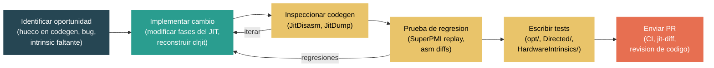

# Nivel 5: Experto -- Contribuir un Cambio al JIT

> **Perfil objetivo:** Desarrollador .NET experimentado o ingeniero de compiladores listo para contribuir una optimizacion, correccion de errores o nuevo intrinsic a RyuJIT
> **Esfuerzo estimado:** 12 horas
> **Prerrequisitos:** [Modulo 4.3 -- Internals del JIT](04-internals-jit.md), Modulo 5.1, Modulo 5.2
> [English version](../en/05-expert-jit-contribution.md)

---

## Objetivos de Aprendizaje

Al finalizar este modulo seras capaz de:

1. Clasificar los tipos comunes de cambios al JIT (optimizacion, correccion de errores, nuevo intrinsic, mejora de lowering) e identificar en que parte del pipeline pertenece cada uno.
2. Configurar un flujo de trabajo eficiente de desarrollo del JIT que reconstruya solo la DLL del JIT para iteracion rapida.
3. Usar `DOTNET_JitDisasm` y `DOTNET_JitDump` para inspeccionar codegen antes/despues y rastrear el IR a traves de las fases del compiler.
4. Usar SuperPMI para pruebas basadas en replay y generacion de diffs de ensamblador para medir el impacto de un cambio.
5. Escribir y organizar tests del JIT siguiendo las convenciones del repositorio y verificar que se ejecuten correctamente.
6. Navegar el proceso de PR para cambios al JIT, incluyendo expectativas del CI, reportes de jit-diff y normas de revision de codigo.

---

## Mapa Conceptual



---

## Guia de Lectura del Codigo Fuente

| Dificultad | Archivo / Directorio | Proposito |
|------------|---------------------|-----------|
| ★★★★ | `src/coreclr/jit/` (305 archivos) | Todo el codigo fuente del JIT |
| ★★★★ | `src/coreclr/jit/jitconfigvalues.h` | Todos los knobs de configuracion del JIT (JitDisasm, JitDump, JitStress, etc.) |
| ★★★★ | `src/coreclr/jit/compiler.h` | La clase `Compiler` -- contexto central de compilacion |
| ★★★★ | `src/coreclr/jit/compphases.h` | Lista completa y ordenada de fases de compilacion |
| ★★★★★ | `src/coreclr/jit/optimizer.cpp` | Optimizaciones de bucles, clonacion de bloques |
| ★★★★★ | `src/coreclr/jit/morph.cpp` | Transformacion de arboles y optimizaciones globales |
| ★★★★ | `src/coreclr/jit/assertionprop.cpp` | Propagacion de aserciones |
| ★★★★ | `src/coreclr/jit/valuenum.cpp` | Numeracion de valores |
| ★★★★ | `src/coreclr/jit/codegenxarch.cpp` | Generacion de codigo x64 |
| ★★★★ | `src/coreclr/jit/hwintrinsic.h` | Definiciones de hardware intrinsics |
| ★★★★ | `src/coreclr/tools/superpmi/readme.md` | Arquitectura y uso de SuperPMI |
| ★★★★ | `src/coreclr/scripts/superpmi.py` | Script de automatizacion de SuperPMI |
| ★★★★ | `src/coreclr/scripts/superpmi.md` | Documentacion de superpmi.py |
| ★★★★ | `docs/design/coreclr/jit/viewing-jit-dumps.md` | Como inspeccionar la salida del JIT |
| ★★★★ | `docs/design/coreclr/jit/ryujit-overview.md` | Vision general de la arquitectura de RyuJIT |
| ★★★ | `src/tests/JIT/opt/` | Suites de tests de optimizacion del JIT |
| ★★★ | `src/tests/JIT/Directed/` | Tests dirigidos del JIT |
| ★★★ | `src/tests/JIT/HardwareIntrinsics/` | Tests de hardware intrinsics |

---

## Plan de Estudio

### Leccion 1 -- Anatomia de un Cambio al JIT

#### Lo que vas a aprender

Antes de escribir codigo, necesitas entender el panorama de los cambios al JIT. El codigo fuente de RyuJIT en `src/coreclr/jit/` consiste en mas de 300 archivos fuente que implementan un pipeline de compilacion con mas de 80 fases distintas. Los cambios a esta base de codigo caen en unas pocas categorias bien definidas, cada una con sus propios patrones y expectativas.

#### Categorias de cambios al JIT

**1. Mejoras de optimizacion**

Estas son el tipo mas comun de contribucion al JIT. Notas que el JIT produce codigo suboptimo para cierto patron y agregas o mejoras un paso de optimizacion. Ejemplos incluyen:

- Mejorar heuristicas de desenrollado de bucles (ver `PHASE_UNROLL_LOOPS` y `JitUnrollLoopMaxIterationCount` en `jitconfigvalues.h`)
- Mejorar CSE (eliminacion de sub-expresiones comunes) en `optcse.cpp`
- Mejor eliminacion de almacenamientos muertos (`PHASE_VN_BASED_DEAD_STORE_REMOVAL`)
- Eliminacion mejorada de ramas redundantes (`PHASE_OPTIMIZE_BRANCHES`)
- Mejor clonacion u hoisting de bucles (en `optimizer.cpp`)

Un cambio de optimizacion tipicamente modifica codigo dentro de una fase existente o agrega logica a un paso existente. Debe producir codegen mediblemente mejor para el patron objetivo sin regresionar otros patrones.

**2. Correcciones de errores**

Los bugs del JIT se manifiestan como miscompilaciones (codigo generado incorrecto), crashes (aserciones en builds Debug/Checked) o bloqueos. Una correccion de error del JIT tipicamente:

- Identifica la fase exacta donde el IR sale mal (usando JitDump)
- Corrige la transformacion especifica que produce el IR o codegen incorrecto
- Agrega un test de regresion que habria detectado el bug

Las correcciones de errores son frecuentemente el punto de entrada mas directo para nuevos contribuidores porque el problema ya esta bien definido: hay un caso de prueba que produce resultados incorrectos, y necesitas hacerlo correcto.

**3. Nuevos hardware intrinsics**

Cuando aparecen nuevos conjuntos de instrucciones de CPU (o los existentes necesitan mas cobertura), el JIT debe aprender a reconocerlos y emitirlos. Esto involucra:

- Agregar entradas a `hwintrinsic.h` y al correspondiente `hwintrinsiclistxarch.h` (o el equivalente de arm64)
- Implementar la importacion del intrinsic en `hwintrinsicxarch.cpp`
- Agregar logica de lowering y codegen
- Agregar soporte en el emisor para la nueva codificacion de instrucciones

**4. Mejoras de lowering y codegen**

Estos cambios operan en las fases del back-end. La fase de lowering (`PHASE_LOWERING`) transforma el IR GenTree de alto nivel en formas que mapean directamente a instrucciones de maquina. Las mejoras aqui pueden incluir:

- Combinar multiples nodos de IR en una sola instruccion de maquina
- Mejor seleccion de modos de direccionamiento
- Mejoras en la seleccion de instrucciones para patrones especificos

#### Donde viven los cambios en el pipeline

El pipeline de compilacion definido en `src/coreclr/jit/compphases.h` procede a traves de estos grupos principales. Saber donde pertenece tu cambio es critico:

| Etapa del Pipeline | Fases Clave | Tipo de Cambio Tipico |
|-------------------|-------------|----------------------|
| Import | `PHASE_IMPORTATION` | Reconocimiento de nuevos intrinsics |
| Morph | `PHASE_MORPH_INLINE`, `PHASE_MORPH_GLOBAL` | Simplificacion de patrones, folding |
| Optimizacion de Flujo | `PHASE_FIND_LOOPS`, `PHASE_CLONE_LOOPS`, `PHASE_UNROLL_LOOPS` | Optimizaciones de bucles |
| SSA/VN | `PHASE_BUILD_SSA`, `PHASE_VALUE_NUMBER` | Mejoras de analisis |
| Opt. Alto Nivel | `PHASE_OPTIMIZE_VALNUM_CSES`, `PHASE_HOIST_LOOP_CODE`, `PHASE_ASSERTION_PROP_MAIN` | Optimizaciones nuevas/mejoradas |
| Lowering | `PHASE_LOWERING` | Seleccion de instrucciones |
| Asignacion de Registros | `PHASE_LINEAR_SCAN` | Heuristicas de asignacion |
| Generacion de Codigo | `PHASE_GENERATE_CODE` | Nueva codificacion de instrucciones |

#### Knobs de configuracion como herramienta de descubrimiento

El JIT expone cientos de knobs de configuracion definidos en `src/coreclr/jit/jitconfigvalues.h`. Estos son invaluables para entender que se puede ajustar y para aislar comportamiento. Las macros de declaracion de knobs te dicen si una configuracion esta disponible en Release o solo en builds Debug/Checked:

```cpp
// Disponible en builds Release:
RELEASE_CONFIG_INTEGER(JitCloneLoopsSizeLimit, "JitCloneLoopsSizeLimit", 400)

// Disponible solo en builds Debug/Checked:
CONFIG_INTEGER(JitNoCSE, "JitNoCSE", 0)          // Desactiva CSE
CONFIG_INTEGER(JitNoHoist, "JitNoHoist", 0)       // Desactiva loop hoisting
CONFIG_INTEGER(JitNoUnroll, "JitNoUnroll", 0)     // Desactiva loop unrolling
CONFIG_INTEGER(JitNoForwardSub, "JitNoForwardSub", 0)
```

Podes desactivar optimizaciones individuales usando `DOTNET_JitNoCSE=1`, `DOTNET_JitNoHoist=1`, etc. Esto es extremadamente util para diagnosticar cual paso de optimizacion es responsable de una miscompilacion.

#### Ejercicio

1. Abri `src/coreclr/jit/jitconfigvalues.h` y busca cinco knobs de configuracion que desactiven optimizaciones especificas (busca patrones `JitNo*`).
2. Abri `src/coreclr/jit/compphases.h` e identifica a cual grupo de fases (Import, Morph, SSA, Lowering, CodeGen) pertenece cada una de esas optimizaciones desactivadas.
3. Mira el directorio `src/tests/JIT/opt/`. Lista los subdirectorios y relaciona cada uno con un paso de optimizacion en `compphases.h`.

---

### Leccion 2 -- Preparando el Entorno para Desarrollo del JIT

#### Lo que vas a aprender

Construir todo el runtime toma 30-40 minutos. Para desarrollo productivo del JIT, necesitas un flujo de trabajo que reconstruya solo la DLL del JIT y ejecute tu test en segundos. Esta leccion cubre los comandos de build, la configuracion del entorno y los patrones de iteracion rapida que los desarrolladores del JIT usan a diario.

#### El build base

Antes de hacer cualquier cambio, necesitas un build completo. En Windows:

```cmd
build.cmd clr+libs -rc checked
```

En Linux/macOS:

```bash
./build.sh clr+libs -rc checked
```

El flag `-rc checked` construye CoreCLR en la configuracion Checked, que incluye aserciones y salida diagnostica (`JitDump`, `JitStress`) que son esenciales para el desarrollo del JIT. La configuracion Release elimina todo esto por rendimiento. La mayoria del trabajo en el JIT usa Checked.

Este build base toma tiempo, pero solo necesitas hacerlo una vez (o cuando traigas cambios mayores de upstream).

#### Reconstruyendo solo el JIT

Despues de modificar archivos fuente del JIT, **no** necesitas reconstruir todo. El JIT es una biblioteca compartida independiente (`clrjit.dll` en Windows, `libclrjit.so` en Linux, `libclrjit.dylib` en macOS). Reconstrui solo el subconjunto del JIT:

```cmd
:: Windows
build.cmd clr.jit -rc checked
```

```bash
# Linux/macOS
./build.sh clr.jit -rc checked
```

Esto toma aproximadamente 30-60 segundos dependiendo de tu maquina. La salida queda en:

```
artifacts/bin/coreclr/<os>.<arch>.Checked/clrjit.dll
```

#### Configurando el entorno de prueba

Para ejecutar tu programa de prueba contra el runtime construido localmente, usa `corerun` desde Core_Root:

```bash
# Generar el layout de Core_Root (una vez despues del build base)
src/tests/build.sh -GenerateLayoutOnly x64 Checked

# Apuntar a Core_Root
export CORE_ROOT=$(pwd)/artifacts/tests/coreclr/<os>.x64.Checked/Tests/Core_Root
```

En Windows, usa `set` en lugar de `export`. Ahora podes ejecutar cualquier assembly .NET con el runtime construido localmente:

```bash
$CORE_ROOT/corerun MiTest.dll
```

#### El ciclo de iteracion rapida

Este es el ciclo de desarrollo que debes internalizar:

```
1. Editar codigo fuente del JIT en src/coreclr/jit/
2. Reconstruir: build.cmd clr.jit -rc checked     (~30-60 seg)
3. Ejecutar test: $CORE_ROOT/corerun MiTest.dll    (~1-2 seg)
4. Inspeccionar: set DOTNET_JitDisasm=MiMetodo      (ver codegen)
5. Repetir
```

Si tambien necesitas la salida diagnostica interna del JIT, usa un build Checked y configura `DOTNET_JitDump`:

```bash
# Mostrar dump del IR para un metodo especifico
export DOTNET_JitDump=MiMetodo
$CORE_ROOT/corerun MiTest.dll > jitdump.txt 2>&1
```

#### Desactivando warnings-como-errores durante el desarrollo

Mientras iteras en un cambio, quizas quieras suprimir que los warnings sean tratados como errores:

```bash
export TreatWarningsAsErrors=false
```

Recorda corregir todos los warnings antes de enviar tu PR.

#### Consideraciones multiplataforma

El codigo fuente del JIT es en gran parte compartido entre arquitecturas, pero el codigo especifico de plataforma vive en archivos dedicados:

- `codegenxarch.cpp`, `codegenarm64.cpp` -- generacion de codigo por arquitectura
- `emitxarch.cpp`, `emitarm64.cpp` -- codificacion de instrucciones por arquitectura
- `lowerxarch.cpp`, `lowerarm64.cpp` -- lowering por arquitectura
- `targetamd64.h`, `targetarm64.h` -- constantes especificas del target

Si tu cambio toca codigo compartido, deberias pensar si afecta a todos los targets o solo a uno. Si cambia un archivo especifico de arquitectura, solo necesita pruebas en esa plataforma (aunque el CI verificara todas las plataformas).

#### Ejercicio

1. Construi el runtime en configuracion Checked. Medi el tiempo del build completo.
2. Hace un cambio trivial de espacio en blanco en `src/coreclr/jit/morph.cpp` y reconstrui usando `build.cmd clr.jit -rc checked` (o `build.sh`). Medi el tiempo de este build incremental.
3. Escribi un programa C# pequeno con un metodo que puedas identificar por nombre. Compilalo con `dotnet build`. Ejecutalo con `$CORE_ROOT/corerun` y verifica que funcione.
4. Configura `DOTNET_JitDisasm=<NombreDeTuMetodo>` y confirma que ves la salida de ensamblador.

---

### Leccion 3 -- Usando JitDisasm y JitDump

#### Lo que vas a aprender

El JIT provee dos modos principales de salida diagnostica: `JitDisasm` (que muestra el ensamblador final generado) y `JitDump` (que muestra la evolucion completa del IR a traves de cada fase). Dominar ambos es esencial para entender que hace el JIT, verificar que tu cambio funciona y diagnosticar bugs.

#### JitDisasm -- inspeccionando el codigo generado

`DOTNET_JitDisasm` esta disponible en todos los builds (Release, Checked y Debug). Imprime el codigo de ensamblador que el JIT genera para los metodos especificados. La documentacion completa esta en `docs/design/coreclr/jit/viewing-jit-dumps.md`.

**Uso basico:**

```bash
# Desensamblar un metodo especifico
export DOTNET_JitDisasm=MiMetodo

# Desensamblar todos los metodos
export DOTNET_JitDisasm=*

# Desensamblar metodos que coincidan con un patron
export DOTNET_JitDisasm="MiClase:*"
```

**Configuraciones acompanantes utiles:**

```bash
# Hacer la salida amigable para diff (reemplazar valores de punteros con placeholders estables)
export DOTNET_JitDisasmDiffable=1

# Mostrar solo compilaciones optimizadas (omitir Tier-0)
export DOTNET_JitDisasmOnlyOptimized=1

# Imprimir un resumen de todos los metodos compilados por el JIT
export DOTNET_JitDisasmSummary=1

# Mostrar limites de alineacion
export DOTNET_JitDisasmWithAlignmentBoundaries=1

# Mostrar bytes de codigo junto al desensamblado
export DOTNET_JitDisasmWithCodeBytes=1
```

**Flujo de trabajo antes/despues:**

Cuando estas desarrollando una optimizacion, tipicamente queres comparar el codegen antes y despues de tu cambio. El flujo de trabajo es:

```bash
# 1. Construir el JIT base
build.cmd clr.jit -rc checked
# 2. Guardar el desensamblado base
export DOTNET_JitDisasm=MetodoObjetivo
export DOTNET_JitDisasmDiffable=1
$CORE_ROOT/corerun Test.dll > antes.asm 2>&1

# 3. Hacer tu cambio, reconstruir
build.cmd clr.jit -rc checked
# 4. Capturar el nuevo desensamblado
$CORE_ROOT/corerun Test.dll > despues.asm 2>&1

# 5. Compararlos
diff antes.asm despues.asm
```

#### Patrones de nombre de metodo

La variable `DOTNET_JitDisasm` acepta patrones ricos de nombres de metodo como documenta `viewing-jit-dumps.md`:

- `Main` -- cualquier metodo llamado Main
- `MiClase:MiMetodo` -- calificado por clase
- `*Canon*` -- coincidencia con comodines
- `miassembly!*` -- alcance por assembly (usa el separador `!`)
- `MiClase:MiMetodo(int,int)` -- calificado por firma
- `MiClase[int]:MiMetodo` -- con instanciacion generica

#### JitDump -- rastreando la compilacion completa

`DOTNET_JitDump` esta disponible solo en builds Debug y Checked. Produce un dump enormemente detallado del IR en cada fase. Asi es como rastrear exactamente lo que el JIT le hace a un metodo:

```bash
export DOTNET_JitDump=MiMetodo
$CORE_ROOT/corerun Test.dll > jitdump.txt 2>&1
```

El archivo de salida puede tener cientos de miles de lineas para un solo metodo. Muestra:

1. **Encabezados de fase**: `*************** Starting PHASE Importation` -- marcando el inicio de cada fase
2. **Arboles IR**: La representacion GenTree despues de cada fase que modifica el IR
3. **Listas de BasicBlock**: El grafo de flujo de control
4. **Informacion SSA**: Numeracion de variables SSA, nodos phi
5. **Numeros de valor**: Asignaciones de VN para expresiones
6. **Detalles de LSRA**: Decisiones de asignacion de registros
7. **Codegen final**: El codigo de maquina emitido

#### Leyendo un JitDump

El patron clave para usar JitDump es buscar la fase que te interesa. Por ejemplo, si estas trabajando en CSE, busca:

```
*************** Starting PHASE Optimize Valnum CSEs
```

Luego mira los arboles IR antes y despues de esa fase. Cada arbol se muestra en formato jerarquico:

```
[000015] ---XG+------         *  CALL      int    Program:Compute(int):int
[000013] ----------- arg0 in rcx +--*  LCL_VAR   int    V01 arg1
```

Las columnas muestran: ID del nodo del arbol, flags, operador, tipo y operandos.

#### Controles adicionales de JitDump

```bash
# Volcar informacion SSA detallada
export DOTNET_JitDumpVerboseSsa=1

# Volcar el flowgraph en formato DOT (visualizable con Graphviz)
export DOTNET_JitDumpFg=MiMetodo
export DOTNET_JitDumpFgDir=/tmp/fgdumps
export DOTNET_JitDumpFgDot=1

# Mostrar cada arbol antes y despues del morphing
export DOTNET_JitDumpBeforeAfterMorph=1
```

#### La extension Disasmo para Visual Studio

Para desarrolladores que trabajan en Visual Studio, la extension [Disasmo](https://github.com/EgorBo/Disasmo) provee una interfaz grafica para ver el desensamblado del JIT sin usar la linea de comandos. Muestra el codigo generado para cualquier metodo directamente en el IDE.

#### Ejercicio

1. Escribi un metodo C# que contenga un bucle simple sumando un arreglo. Ejecutalo con `DOTNET_JitDisasm` configurado con el nombre de tu metodo. Identifica el bucle en el ensamblador generado.
2. Ejecuta el mismo metodo con `DOTNET_JitDump` y redirigilo a un archivo. Abri el archivo y busca la seccion `PHASE_FIND_LOOPS`. Verifica que el JIT identifico tu bucle.
3. Agrega `DOTNET_JitDumpBeforeAfterMorph=1` y busca un arbol que fue simplificado durante el morphing.
4. Proba `DOTNET_JitNoUnroll=1` para desactivar el desenrollado de bucles y compara el codegen con y sin el.

---

### Leccion 4 -- SuperPMI: Pruebas Basadas en Replay

#### Lo que vas a aprender

SuperPMI (Super Program Method Information) es la herramienta principal del equipo del JIT para pruebas de regresion y analisis de diffs. Te permite reproducir miles de compilaciones de metodos del mundo real contra tu JIT modificado sin ejecutar ningun codigo managed. Entender SuperPMI es innegociable para contribuciones al JIT.

#### Que es SuperPMI

SuperPMI funciona en dos fases, como se describe en `src/coreclr/tools/superpmi/readme.md`:

1. **Recoleccion**: Durante la ejecucion normal de .NET, una DLL shim intercepta toda la comunicacion entre el JIT y el runtime (la interfaz EE). Registra cada pregunta que el JIT hace y las respuestas del runtime en archivos `.MC` (method context). Estos se fusionan en archivos `.MCH`.

2. **Reproduccion**: SuperPMI carga una DLL del JIT directamente y reproduce cada compilacion de metodo registrada, proporcionando las respuestas EE guardadas. No se necesita runtime. Esto significa que podes probar tu cambio al JIT contra miles de compilaciones de metodos en minutos.

Las herramientas viven en `src/coreclr/tools/superpmi/`:

```
superpmi/              -- el driver de replay
superpmi-shared/       -- utilidades compartidas
superpmi-shim-collector/ -- la DLL shim de recoleccion
superpmi-shim-counter/   -- cuenta compilaciones
superpmi-shim-simple/    -- shim simple de pass-through
mcs/                   -- herramienta de manipulacion de archivos MCH
```

#### El script superpmi.py

En la practica, raramente usas las herramientas de SuperPMI directamente. En su lugar, usa `src/coreclr/scripts/superpmi.py`, que automatiza la recoleccion, replay y generacion de diffs. La documentacion completa esta en `src/coreclr/scripts/superpmi.md`.

**Replay (verificacion de aserciones):**

```bash
# Reproducir todos los contextos pre-recolectados contra tu JIT
# Esto verifica que no haya aserciones/crashes en tu JIT modificado
python3 src/coreclr/scripts/superpmi.py replay
```

El script automaticamente:
- Encuentra tu JIT construido en el directorio de artefactos
- Descarga colecciones MCH pre-computadas de Azure (si no estan ya cacheadas)
- Ejecuta el replay de SuperPMI contra tu JIT
- Reporta cualquier falla de aserciones

**ASM diffs (comparacion de codegen):**

```bash
# Comparar codegen entre el JIT base y tu JIT modificado
python3 src/coreclr/scripts/superpmi.py asmdiffs
```

Este es el comando mas importante para trabajo de optimizacion. Hace lo siguiente:
- Determina un JIT base (descargado del sistema de rolling build basado en tu punto de bifurcacion desde `main`)
- Compila cada contexto de metodo con ambos JITs (base y diff)
- Reporta que metodos producen codegen diferente
- Puede generar diffs detallados por metodo para analisis

**Opciones utiles:**

```bash
# Usar un archivo MCH especifico
python3 src/coreclr/scripts/superpmi.py replay -mch_files ruta/a/coleccion.mch

# Filtrar a colecciones especificas
python3 src/coreclr/scripts/superpmi.py asmdiffs -filter tests

# Especificar un JIT base personalizado
python3 src/coreclr/scripts/superpmi.py asmdiffs -base_jit_path ruta/a/base/clrjit.dll

# Pasar opciones del JIT durante replay
python3 src/coreclr/scripts/superpmi.py replay -jitoption JitStress=1
```

#### Entendiendo la salida de asm diffs

Cuando `asmdiffs` encuentra diferencias, reporta estadisticas como:

```
Total methods: 250,000
Methods with diffs: 42
    Improvements: 38  (el tamano de codigo disminuyo)
    Regressions:  4   (el tamano de codigo aumento)
```

Un buen cambio de optimizacion muestra muchas mejoras y cero regresiones. Si tenes regresiones, necesitas investigar cada una para determinar si son compensaciones aceptables o indican un problema.

El script tambien puede generar archivos de diff detallados. Cada diff muestra el ensamblador base y modificado lado a lado, facilitando ver exactamente que cambio.

#### SuperPMI en CI

Cuando envias un PR que toca codigo del JIT, el pipeline de CI automaticamente ejecuta replay y asmdiffs de SuperPMI. Los resultados aparecen como un comentario en el PR. Asi es como los revisores evaluan el impacto de tu cambio a traves de un amplio conjunto de metodos del mundo real. Las regresiones en asmdiffs del CI seran examinadas minuciosamente por los revisores.

#### Recoleccion manual

Si necesitas recolectar datos de SuperPMI para un escenario especifico (por ejemplo, tu caso de prueba particular), podes hacer una recoleccion manual:

```bash
# Recolectar contextos mientras ejecutas un escenario
python3 src/coreclr/scripts/superpmi.py collect -output_mch_path mi_coleccion.mch -- \
    $CORE_ROOT/corerun MiTest.dll
```

Esto produce un archivo MCH que contiene todas las compilaciones de metodos que ocurrieron durante tu ejecucion de prueba. Luego podes hacer replay contra esta coleccion dirigida.

#### Ejercicio

1. Ejecuta `python3 src/coreclr/scripts/superpmi.py replay` contra tu build Checked. Verifica que no haya fallas de aserciones.
2. Hace un cambio trivial al JIT (por ejemplo, ajustar un umbral constante) y ejecuta `python3 src/coreclr/scripts/superpmi.py asmdiffs`. Observa el formato de salida del diff.
3. Lee `src/coreclr/tools/superpmi/readme.md` en su totalidad. Identifica los roles de las herramientas `superpmi`, `mcs` y `superpmi-shim-collector`.
4. Ejecuta `python3 src/coreclr/scripts/superpmi.py list-collections` para ver que colecciones pre-computadas estan disponibles para tu plataforma.

---

### Leccion 5 -- Escribiendo Tests del JIT

#### Lo que vas a aprender

Cada cambio al JIT necesita tests. La infraestructura de tests bajo `src/tests/JIT/` es grande y tiene convenciones especificas. Esta leccion cubre la organizacion de tests, como escribir tests efectivos del JIT y como verificar que realmente se ejecutan.

#### Organizacion del directorio de tests

El directorio `src/tests/JIT/` esta organizado por categoria de test:

| Directorio | Proposito |
|-----------|---------|
| `opt/` | Tests especificos de optimizacion (CSE, hoisting, inlining, bucles, etc.) |
| `Directed/` | Tests dirigidos para caracteristicas especificas (arreglos, structs, patrones IL, etc.) |
| `HardwareIntrinsics/` | Tests para APIs de hardware intrinsics |
| `Regression/` | Tests historicos de regresion (organizados por era: `JitBlue/`, `Dev14/`, etc.) |
| `RyuJIT/` | Tests especificos de RyuJIT |
| `Generics/` | Tests de tipos/metodos genericos |
| `SIMD/` | Tests de tipos SIMD |
| `Stress/` | Tests de estres |
| `Performance/` | Benchmarks de rendimiento |
| `superpmi/` | Infraestructura de recoleccion y test de SuperPMI |
| `Intrinsics/` | Tests de metodos intrinsicos |
| `Math/` | Tests de funciones matematicas |
| `PGO/` | Tests de optimizacion guiada por perfil |
| `IL_Conformance/` | Tests de conformidad con la especificacion IL |

Dentro de `opt/`, hay subdirectorios para pasos de optimizacion individuales:

```
opt/AssertionPropagation/   opt/CSE/            opt/Cloning/
opt/DSE/                    opt/Devirtualization/ opt/ForwardSub/
opt/GuardedDevirtualization/ opt/HeadTailMerge/   opt/Hoisting/
opt/Inline/                 opt/InstructionCombining/ opt/Loops/
opt/ObjectStackAllocation/  opt/RedundantBranch/  opt/SSA/
opt/ValueNumbering/         opt/Vectorization/    ...
```

#### Estructura de un test

Un test tipico del JIT es un programa C# con un metodo `Main` que retorna `100` en caso de exito (esta es la convencion -- codigo de salida 100 significa que paso). Aca hay un ejemplo del patron:

```csharp
// Licensed to the .NET Foundation under one or more agreements.
// The .NET Foundation licenses this file to you under the MIT license.

using System;
using System.Runtime.CompilerServices;
using Xunit;

public class MiTestDeOpt
{
    [MethodImpl(MethodImplOptions.NoInlining)]
    static int TestPatron(int[] arr)
    {
        // El patron de codigo que estas probando
        int suma = 0;
        for (int i = 0; i < arr.Length; i++)
        {
            suma += arr[i];
        }
        return suma;
    }

    [Fact]
    public static int TestEntryPoint()
    {
        int[] arr = { 1, 2, 3, 4, 5 };
        int resultado = TestPatron(arr);
        if (resultado != 15)
        {
            return 0; // fallo
        }
        return 100; // paso
    }
}
```

Convenciones clave:

- **`[MethodImpl(MethodImplOptions.NoInlining)]`**: Previene que el metodo bajo prueba sea inlineado, asegurando que se compile como un metodo independiente. Esto es critico porque el inlining lo fusionaria con el caller y no podrias inspeccionarlo con `JitDisasm`.
- **Retornar 100 para exito**: La infraestructura de tests verifica el codigo de salida 100.
- **`[Fact]` en el punto de entrada**: El runner de tests usa convenciones de xUnit.
- **Agregar a archivos existentes cuando sea posible**: Las convenciones de testing especifican agregar tests nuevos a archivos de test existentes en lugar de crear nuevos.

#### Tests a nivel de IL

Para patrones que no pueden expresarse en C#, o donde necesitas control preciso sobre el IL, escribi tests en IL directamente. Estos viven en `src/tests/JIT/Directed/IL/` y en otros lugares:

```il
.assembly extern mscorlib {}
.assembly MiTest {}

.class public auto ansi TestClass extends [mscorlib]System.Object
{
    .method public hidebysig static int32 Main() cil managed
    {
        .entrypoint
        // Tu IL aqui
        ldc.i4 100
        ret
    }
}
```

#### Asegurandose de que los tests esten listados en el proyecto

Verifica si el directorio donde estas agregando un test tiene un `.csproj` que liste archivos fuente explicitamente. Si es asi, debes agregar tu nuevo archivo. Si usa un patron de comodin (`**/*.cs`), tu archivo sera incluido automaticamente.

#### Construyendo y ejecutando tests

```bash
# Construir un proyecto de test especifico
cd src/tests/JIT/opt/CSE/
dotnet build

# Ejecutar un proyecto de test especifico
dotnet build /t:test ./tests/CSETest.csproj

# Construir tests de CoreCLR (genera Core_Root)
src/tests/build.sh x64 Checked

# Ejecutar un solo test con corerun (codigo de salida 100 = paso)
$CORE_ROOT/corerun ruta/a/MiTest.dll
echo $?   # Deberia imprimir 100
```

#### Categorias y prioridad de tests

Los tests tienen niveles de prioridad. Los tests de Prioridad 0 se ejecutan en el pipeline de CI estandar. Los tests de Prioridad 1 requieren el flag `-priority1`:

```bash
src/tests/build.sh -Test ruta/a/test.csproj x64 Checked -priority1
```

Los tests de optimizacion nuevos normalmente entran como Prioridad 0 a menos que sean costosos de ejecutar.

#### Usando filtros y contando tests

Despues de ejecutar tu test, siempre verifica que realmente se ejecuto. La infraestructura de tests puede silenciosamente omitir tests. Usa filtros y verifica los conteos de salida:

```bash
# Ejecutar con filtro y verificar conteo
dotnet test --filter "FullyQualifiedName~MiTestDeOpt" --logger "console;verbosity=detailed"
```

#### Ejercicio

1. Navega a `src/tests/JIT/opt/` y elegir un subdirectorio que coincida con una optimizacion que te interese. Lee dos o tres tests existentes para entender las convenciones.
2. Escribi un test simple que verifique que una optimizacion conocida del JIT funciona. Usa `[MethodImpl(MethodImplOptions.NoInlining)]` en el metodo bajo prueba. Retorna 100 en caso de exito.
3. Construi y ejecuta tu test con `$CORE_ROOT/corerun`. Verifica el codigo de salida 100.
4. Ejecuta el mismo test con `DOTNET_JitDisasm` para confirmar que la optimizacion que esperas esta presente en el codigo generado.

---

### Leccion 6 -- El Proceso de PR para Cambios al JIT

#### Lo que vas a aprender

Enviar un cambio al JIT es mas que pushear codigo. El repositorio dotnet/runtime tiene un proceso de revision exhaustivo para cambios al JIT, con verificaciones automaticas de CI, diffs de SuperPMI y una comunidad comprometida de revisores. Esta leccion recorre el ciclo de vida completo de un PR para una contribucion al JIT.

#### Antes de abrir un PR

**1. Verificar la correctitud localmente**

Ejecuta tus tests nuevos y los tests relevantes existentes:

```bash
# Ejecutar tu test especifico
$CORE_ROOT/corerun MiTest.dll
# Esperado: codigo de salida 100

# Ejecutar replay de SuperPMI para verificar aserciones
python3 src/coreclr/scripts/superpmi.py replay
```

**2. Verificar regresiones**

Ejecuta asmdiffs de SuperPMI para entender el impacto completo en codegen:

```bash
python3 src/coreclr/scripts/superpmi.py asmdiffs
```

Documenta los resultados. Los buenos PRs de optimizacion muestran:
- Mejoras claras en el patron objetivo
- Sin regresiones, o regresiones bien entendidas y aceptables
- Tamano de codigo neutral o positivo en general

**3. Limpiar tu codigo**

- Elimina artefactos de depuracion (`printf`, knobs temporales)
- Segui el estilo de codificacion en `.editorconfig` (llaves Allman, cuatro espacios, `_camelCase` para campos)
- Agrega el encabezado de archivo a cualquier archivo nuevo
- Escribi comentarios claros explicando logica no obvia
- Asegurate de que los warnings esten limpios (`TreatWarningsAsErrors` debe pasar)

#### Abriendo el PR

**Titulo**: Mantenelo bajo 70 caracteres, descriptivo del cambio. Ejemplos:
- "JIT: Improve CSE for hoisted bounds checks"
- "JIT: Fix assertion failure in loop cloning"
- "JIT: Add Avx512 Compress intrinsic"

**Descripcion**: Incluye:
- **Que** hace el cambio (1-2 oraciones)
- **Por que** -- que hueco en codegen o bug lo motivo
- **Antes/despues** -- incluye salida de JitDisasm mostrando la mejora (para optimizaciones)
- **Resultados de SuperPMI** -- cambios en tamano de codigo, numero de diffs
- **Plan de prueba** -- que tests se agregaron o usaron para verificar

Ejemplo de estructura de descripcion de PR:

```markdown
## Resumen
Mejorar la clonacion de bucles para manejar verificaciones de limites de arreglos
que son invariantes del bucle pero previamente se perdian porque el arreglo
se cargaba a traves de un acceso a campo.

## Motivacion
Patron del hot path de JsonReader en ASP.NET. El JIT estaba emitiendo una
verificacion de limites dentro del bucle aunque la longitud del arreglo no cambia.

## Mejora de codegen
<fragmentos de JitDisasm antes/despues>

## Resultados de SuperPMI
- libraries.pmi: 12 mejoras, 0 regresiones, -48 bytes total
- benchmarks.run: 3 mejoras, 0 regresiones, -16 bytes total
```

#### Verificaciones de CI para PRs del JIT

Cuando abris un PR que toca `src/coreclr/jit/`, el sistema de CI ejecuta:

1. **Build**: El JIT se construye en todas las plataformas soportadas (Windows x64, Linux x64, Linux arm64, macOS arm64, etc.)
2. **Tests de JIT stress**: La suite de tests se ejecuta con varios modos de `JitStress` habilitados
3. **Replay de SuperPMI**: Asegura que no se disparen aserciones
4. **Asmdiffs de SuperPMI**: Genera diffs entre tu cambio y el baseline, publicado como comentario en el PR
5. **Tests de Prioridad 0**: Suite de tests estandar
6. **Verificaciones de formato**: Verificacion del estilo de codigo

El comentario de asmdiffs en tu PR es uno de los artefactos mas importantes. Los revisores lo examinaran para entender el alcance y el impacto de tu cambio.

#### Expectativas de revision de codigo

Los cambios al JIT son tipicamente revisados por miembros del equipo del JIT. La retroalimentacion comun de revision incluye:

- **Preocupaciones de orden de fases**: "Esta optimizacion depende de ejecutarse despues de value numbering?"
- **Casos limite**: "Que pasa cuando el bucle tiene un try/catch adentro?"
- **Paridad Debug/Checked**: "Esto funciona correctamente en builds Release y Checked?"
- **Impacto multiplataforma**: "Verificaste esto en ARM64?"
- **Cobertura de tests**: "Podes agregar un test que cubra el patron especifico del reporte del bug?"
- **Datos de rendimiento**: "Como se ven los diffs de SuperPMI para benchmarks?"

Prepararate para multiples rondas de revision. Los cambios al JIT afectan a cada aplicacion .NET, asi que la barra de correctitud es alta.

#### Despues del merge

Despues de que tu PR se fusione:
- El cambio entra en el pipeline de build nocturno
- Puede ser incluido en colecciones de SuperPMI para verificaciones de regresion futuras
- Si se encuentran problemas, el equipo del JIT puede revertirlo y pedir una correccion

#### Normas de la comunidad

La comunidad del JIT en dotnet/runtime valora:
- **Mensajes de commit claros** que expliquen el "por que"
- **PRs incrementales** -- preferi cambios pequenos y enfocados sobre cambios grandes y amplios
- **Decisiones basadas en datos** -- siempre incluye diffs de SuperPMI para cambios de optimizacion
- **Interaccion respetuosa** -- los revisores son voluntarios; responde a la retroalimentacion constructivamente
- **Seguimiento de issues** -- vincula tu PR al issue relevante de GitHub

#### Ejercicio

1. Explora PRs recientes que fueron fusionados y que modifican `src/coreclr/jit/`. Busca un PR de optimizacion y uno de correccion de errores. Estudia sus descripciones, cobertura de tests y comentarios de diffs de SuperPMI.
2. Busca un issue de GitHub etiquetado `area-CodeGen-coreclr` y `good-first-issue` (o `help wanted`). Lee la discusion para entender el problema.
3. Redacta una descripcion de PR para un cambio hipotetico al JIT: elige cualquier optimizacion que hayas notado durante las lecciones anteriores y escribi lo que incluirias en el PR.
4. Lee el comentario de asmdiffs del CI en un PR existente del JIT. Entende que significan los numeros (metodos totales, metodos con diffs, mejoras vs. regresiones).

---

## Recorrido de Principio a Fin: Contribuyendo una Optimizacion

Esta seccion une las seis lecciones en una narrativa completa. Vamos a recorrer el proceso de contribuir una optimizacion hipotetica de principio a fin.

### Paso 1: Identificar la oportunidad

Notas que para un patron de codigo especifico -- digamos, un bucle que verifica `array.Length` en la condicion y tambien lo usa en el cuerpo -- el JIT emite cargas redundantes de `Length`. Lo verificas con:

```bash
export DOTNET_JitDisasm=ProcessArray
export DOTNET_JitDisasmDiffable=1
$CORE_ROOT/corerun Test.dll > antes.asm 2>&1
```

Ves el campo `Length` cargado dos veces en el bucle caliente. Sospechas que la propagacion de aserciones o CSE deberia capturar esto.

### Paso 2: Diagnosticar con JitDump

```bash
export DOTNET_JitDump=ProcessArray
$CORE_ROOT/corerun Test.dll > jitdump.txt 2>&1
```

Buscas en el dump `PHASE_OPTIMIZE_VALNUM_CSES` y descubris que CSE identifica la expresion comun pero elige no promoverla porque un umbral heuristico no se cumple.

### Paso 3: Implementar la correccion

Modificas la heuristica en `src/coreclr/jit/optcse.cpp` (o el archivo que corresponda). Reconstruis:

```bash
build.cmd clr.jit -rc checked
```

### Paso 4: Verificar la mejora en codegen

```bash
export DOTNET_JitDisasm=ProcessArray
export DOTNET_JitDisasmDiffable=1
$CORE_ROOT/corerun Test.dll > despues.asm 2>&1
diff antes.asm despues.asm
```

Confirmas que la carga redundante fue eliminada.

### Paso 5: Verificacion de regresion con SuperPMI

```bash
python3 src/coreclr/scripts/superpmi.py replay
python3 src/coreclr/scripts/superpmi.py asmdiffs
```

El replay no muestra fallas de aserciones. Los asmdiffs muestran mejoras y ninguna regresion.

### Paso 6: Escribir un test

Agregas un test al directorio apropiado bajo `src/tests/JIT/opt/CSE/` (o la optimizacion que hayas modificado). El test ejercita el patron especifico y retorna 100 en caso de exito.

### Paso 7: Enviar el PR

Pusheas tu rama, abris un PR con una descripcion clara incluyendo codegen antes/despues y resultados de SuperPMI, y esperas el CI. Respondes a la retroalimentacion de los revisores, iteras segun sea necesario, y eventualmente el cambio se fusiona.

---

## Resumen

Contribuir al compiler JIT de .NET es demandante pero profundamente gratificante. Las habilidades clave son:

1. **Entender el pipeline** -- saber donde pertenece tu cambio entre las 80+ fases
2. **Iteracion rapida** -- reconstruir solo `clr.jit` y probar con `corerun`
3. **Dominio de diagnosticos** -- usar `JitDisasm` para codegen y `JitDump` para trazas completas del IR
4. **Fluidez con SuperPMI** -- replay para correctitud, asmdiffs para medicion de impacto
5. **Disciplina de testing** -- cada cambio necesita un test, siguiendo las convenciones del repositorio
6. **Compromiso con la comunidad** -- PRs claros, afirmaciones basadas en datos, respuesta receptiva a la retroalimentacion

El equipo del JIT mantiene un compiler de clase mundial que corre en miles de millones de dispositivos. Tus contribuciones hacen .NET mas rapido para todos.

---

## Lectura Adicional

- `docs/design/coreclr/jit/ryujit-overview.md` -- Arquitectura de RyuJIT
- `docs/design/coreclr/jit/ryujit-tutorial.md` -- Tutorial de RyuJIT
- `docs/design/coreclr/jit/viewing-jit-dumps.md` -- Guia completa de diagnosticos del JIT
- `docs/design/coreclr/jit/JitOptimizerPlanningGuide.md` -- Guia de planificacion del optimizador
- `src/coreclr/tools/superpmi/readme.md` -- Arquitectura de SuperPMI
- `src/coreclr/scripts/superpmi.md` -- Documentacion de superpmi.py
- Documentos de diseno en `docs/design/coreclr/jit/` cubriendo temas especificos: inlining, optimizaciones de bucles, manejo de structs, barreras GC, guarded devirtualization y mas
