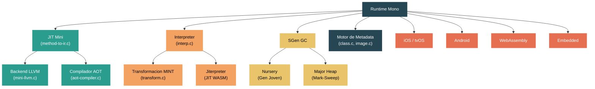

# Nivel 5: Experto — El Runtime Mono: Arquitectura y Diferencias

> **Perfil objetivo:** Ingeniero de runtime, especialista en plataformas o contribuidor que necesita entender Mono como el motor de ejecucion alternativo de .NET y cuando usarlo en lugar de CoreCLR
> **Esfuerzo estimado:** 10 horas
> **Prerrequisitos:** Modulos de Nivel 4 (comprension de CoreCLR), particularmente [Modulo 4.5: Compilacion JIT](04-internals-jit.md) y [Modulo 4.4: GC en Profundidad](04-internals-gc-deep.md)
> [English version](../en/05-expert-mono.md)

---

## Objetivos de Aprendizaje

Al finalizar este modulo vas a poder:

1. Describir la arquitectura de Mono y sus cuatro subsistemas principales: el JIT mini, el interpreter, SGen GC y el motor de metadata.
2. Comparar Mono y CoreCLR en dimensiones clave -- diseno del JIT, estrategia de GC, compilacion AOT, plataformas objetivo y compromisos de rendimiento.
3. Explicar como el JIT de Mono (mini) compila CIL a codigo nativo, y como su backend LLVM opcional proporciona optimizaciones mas profundas.
4. Describir el diseno de recoleccion generacional de SGen incluyendo la asignacion en el nursery, el colector mark-sweep del major heap y las write barriers con card table.
5. Explicar el rol del interpreter de Mono, su pipeline de transformacion de opcodes MINT, la ejecucion con tiering y el jiterpreter (JIT sobre interpreter para WASM).
6. Identificar las plataformas donde Mono es el runtime principal -- iOS, Android, tvOS, WebAssembly y embedded -- y las restricciones tecnicas que lo hacen la opcion correcta.

---

## Mapa Conceptual



---

## Por que Dos Runtimes?

El repositorio dotnet/runtime contiene dos motores de ejecucion distintos: CoreCLR y Mono. Esto no es un accidente ni deuda tecnica -- cada runtime existe porque sobresale en escenarios donde el otro no puede operar. CoreCLR esta optimizado para cargas de trabajo de servidor y escritorio con su poderoso compilador RyuJIT y GC sofisticado. Mono esta optimizado para entornos restringidos -- dispositivos moviles, WebAssembly y plataformas donde la compilacion JIT esta prohibida por el sistema operativo (iOS) o es imposible por diseno (WASM sin extensiones especificas).

Entender *ambos* runtimes es esencial para cualquier persona que contribuya al ecosistema .NET, porque los cambios en codigo compartido (System.Private.CoreLib, la BCL) deben funcionar correctamente en ambos motores.

---

## Guia de Lectura del Codigo Fuente

| Dificultad | Archivo | Proposito |
|------------|---------|-----------|
| ★★★★ | `src/mono/mono/mini/mini.h` | Header central del JIT de Mono -- define `MonoInst`, contexto de compilacion |
| ★★★★ | `src/mono/mono/mini/driver.c` | Punto de entrada del JIT de Mono -- `mono_jit_exec_internal()`, seleccion de modo de ejecucion |
| ★★★★★ | `src/mono/mono/mini/method-to-ir.c` | Conversion CIL-a-IR -- el equivalente de Mono al importer de RyuJIT |
| ★★★★★ | `src/mono/mono/mini/mini-llvm.c` | Backend LLVM -- traduce IR de Mono a IR de LLVM para optimizacion profunda |
| ★★★★ | `src/mono/mono/mini/aot-compiler.c` | Compilador Ahead-of-Time -- genera codigo nativo en tiempo de build |
| ★★★★ | `src/mono/mono/sgen/sgen-gc.h` | Header principal de SGen GC -- estructuras de datos del GC generacional |
| ★★★★ | `src/mono/mono/sgen/sgen-nursery-allocator.c` | Asignacion en el nursery (gen joven) con TLABs |
| ★★★★ | `src/mono/mono/sgen/sgen-marksweep.c` | Colector del major heap -- mark-sweep con asignacion por bloques |
| ★★★★★ | `src/mono/mono/mini/interp/interp.c` | Loop principal del interpreter -- ejecuta opcodes MINT |
| ★★★★ | `src/mono/mono/mini/interp/transform.c` | Pipeline de transformacion CIL-a-MINT |
| ★★★★ | `src/mono/mono/mini/interp/tiering.c` | Tiering del interpreter -- re-transformacion optimizada de metodos calientes |
| ★★★★★ | `src/mono/mono/mini/interp/jiterpreter.c` | Jiterpreter -- JIT de WebAssembly para trazas calientes del interpreter |
| ★★★★ | `src/mono/mono/metadata/class.c` | Sistema de tipos -- carga y layout de clases |
| ★★★★ | `src/mono/mono/metadata/image.c` | Carga de imagenes de assembly/modulo |
| ★★★ | `src/mono/System.Private.CoreLib/src/System/GC.Mono.cs` | Superficie managed del GC especifica de Mono |

---

## Curriculum

### Leccion 1 — Vision General de la Arquitectura de Mono

#### Que vas a aprender

Mono es un runtime de .NET con una larga historia -- fue creado originalmente por Ximian en 2001 (podes ver los headers de copyright originales en `src/mono/mono/mini/interp/interp.c`), luego desarrollado por Novell, despues Xamarin, y ahora Microsoft. Fue integrado al repositorio dotnet/runtime para compartir la misma BCL y herramientas con CoreCLR. A pesar de esta unificacion, Mono conserva su propio compilador JIT, recolector de basura, interpreter, sistema de tipos y pipeline AOT.

#### Los cuatro pilares

La arquitectura de Mono se apoya en cuatro subsistemas principales:

**1. El JIT Mini** (`src/mono/mono/mini/`)

El JIT de Mono se llama "mini" (un nombre historico de cuando reemplazo al compilador "JIT" original). Su trabajo central es el mismo que RyuJIT: convertir bytecode CIL a codigo maquina nativo. El archivo clave es `method-to-ir.c`, que transforma instrucciones CIL en el IR interno de Mono -- una secuencia de nodos `MonoInst`. A diferencia del IR GenTree basado en arboles de RyuJIT, el IR de Mono es una secuencia lineal de instrucciones que mapea mas directamente a operaciones de maquina.

Abri `src/mono/mono/mini/mini.h` y observa como `MonoInst` esta definido como el nodo fundamental del IR. El pipeline de compilacion procede: CIL -> IR MonoInst -> lowering especifico de arquitectura -> emision de codigo nativo.

El soporte de arquitecturas esta dividido en archivos por plataforma:
- `mini-amd64.c`, `mini-arm64.c`, `mini-arm.c`, `mini-riscv.c`, `mini-ppc.c`, `mini-s390x.c`, `mini-wasm.c`
- Archivos de trampoline correspondientes: `tramp-amd64.c`, `tramp-arm64.c`, etc.
- Archivos de descripcion de CPU: `cpu-amd64.mdesc`, `cpu-arm64.mdesc`, `cpu-wasm.mdesc`, etc.

**2. El Interpreter** (`src/mono/mono/mini/interp/`)

Mono incluye un interpreter completo de CIL que puede ejecutar codigo managed sin generar codigo maquina nativo. Esto es critico para plataformas donde la compilacion JIT es imposible (iOS prohibe memoria escribible+ejecutable, WASM historicamente no tenia soporte de JIT). El interpreter transforma CIL en un conjunto de opcodes intermedios llamado MINT (Mono INTerpreter opcodes), definido en `mintops.def`, y luego los ejecuta en un loop de despacho en `interp.c`.

**3. SGen GC** (`src/mono/mono/sgen/`)

SGen ("Simple Generational") es el recolector de basura de Mono. Como el GC de CoreCLR, es generacional, pero su diseno es bastante diferente. SGen tiene un nursery (generacion joven) con asignacion basada en TLABs y un major heap que usa un colector mark-sweep organizado en bloques de tamano fijo. El nursery puede configurarse en dos modos: simple y split.

**4. El Motor de Metadata** (`src/mono/mono/metadata/`)

El subsistema de metadata maneja la carga de assemblies (`image.c`), la resolucion de tipos (`class.c`, `class-init.c`), el layout de objetos en memoria (`class-setup-vtable.c`) y la gestion del sistema de tipos. Lee imagenes PE/COFF y tablas de metadata ECMA-335. Esto es analogo al sistema de tipos de CoreCLR en `src/coreclr/vm/`, pero implementado en C en lugar de C++.

#### Como se conectan

Cuando Mono arranca, `driver.c` inicializa el runtime y selecciona el modo de ejecucion:

```c
static void mono_runtime_set_execution_mode (int mode);
static void mono_runtime_set_execution_mode_full (int mode, gboolean override);
```

El modo de ejecucion determina si los metodos se compilan con JIT, se interpretan o se ejecutan desde codigo AOT pre-compilado. Mono soporta modo mixto, donde algunos metodos usan el JIT y otros usan el interpreter -- una capacidad que CoreCLR no tiene.

#### System.Private.CoreLib: el puente con el runtime

Mono tiene su propio codigo CoreLib especifico del runtime en `src/mono/System.Private.CoreLib/src/System/`. Estos archivos siguen la convencion de nombres `*.Mono.cs` -- por ejemplo, `GC.Mono.cs`, `Object.Mono.cs`, `String.Mono.cs`, `RuntimeType.Mono.cs`. Implementan la misma superficie de API publica que sus contrapartes de CoreCLR (`*.CoreCLR.cs`), pero llaman al runtime nativo de Mono via atributos `[MethodImpl(MethodImplOptions.InternalCall)]`.

El codigo compartido, agnostico del runtime, vive en `src/libraries/System.Private.CoreLib/`. Cuando editas codigo compartido de CoreLib, debes asegurarte de que compile y funcione correctamente con *ambos* runtimes.

#### Ejercicio

1. Abri `src/mono/mono/mini/driver.c` y encontra la funcion `mono_runtime_set_execution_mode`. Que modos de ejecucion soporta Mono?
2. Compara `src/mono/System.Private.CoreLib/src/System/GC.Mono.cs` con `src/coreclr/System.Private.CoreLib/src/System/GC.CoreCLR.cs`. Observa como ambos definen la misma clase parcial `GC` pero con diferentes declaraciones de internal call.
3. Lista los archivos especificos de arquitectura en `src/mono/mono/mini/` (los archivos `mini-*.c`). Cuantas arquitecturas objetivo soporta Mono?

---

### Leccion 2 — Mono vs CoreCLR: Comparacion de Caracteristicas

#### Que vas a aprender

Entender cuando usar cada runtime requiere entender sus compromisos. Esta leccion proporciona una comparacion sistematica a traves de cada dimension principal.

#### Estrategias de compilacion

| Aspecto | CoreCLR | Mono |
|---------|---------|------|
| JIT principal | RyuJIT (altamente optimizante, 80+ fases) | JIT Mini (compilacion mas rapida, menos pasadas de optimizacion) |
| Tiered compilation | Tier-0 (opts minimas) -> Tier-1 (opts completas) | Interpreter -> JIT (tiering del interpreter disponible) |
| AOT | NativeAOT (compilacion estatica completa, toolchain separado) | Mono AOT (compatible con fallback a JIT, opcion de backend LLVM) |
| Soporte LLVM | No (usa su propio codegen) | Si -- backend LLVM opcional para codigo AOT profundamente optimizado |
| Interpreter | No | Si -- interpreter completo de CIL con transformacion MINT |
| Modo mixto | No | Si -- interpreter + JIT coexisten en el mismo proceso |

**Punto clave**: El RyuJIT de CoreCLR es un JIT mas sofisticado que produce codigo mejor optimizado para cargas de trabajo de servidor/escritorio. El JIT mini de Mono compila mas rapido pero con menos optimizaciones -- sacrifica rendimiento pico por velocidad de arranque y menor overhead de memoria. En plataformas donde el JIT es imposible, el interpreter y el compilador AOT de Mono llenan el vacio.

#### Recoleccion de basura

| Aspecto | GC de CoreCLR | SGen de Mono |
|---------|--------------|--------------|
| Arquitectura | Generacional (Gen0/Gen1/Gen2) + LOH + POH | Generacional (nursery + major heap) |
| Gen joven | Segmento efimero con bump allocation | Nursery con TLABs, dos modos (simple/split) |
| Gen vieja | Mark-sweep-compact con regiones (o segmentos) | Mark-sweep con bloques de tamano fijo |
| Compactacion | Si (puede compactar Gen2) | No hay compactacion completa (solo mark-sweep para major heap) |
| Concurrente | Background GC para Gen2 | Mark concurrente para colecciones major |
| Modo servidor | Si (heaps por CPU) | Sin modo servidor dedicado |
| Configuracion | Extensa (`GCConserveMemory`, `GCHeapCount`, etc.) | Superficie de configuracion mas simple |

**Punto clave**: El GC de CoreCLR esta disenado para cargas de trabajo de servidor con heaps grandes, ofreciendo compactacion, modo servidor con heaps por CPU y extensas perillas de ajuste. SGen esta disenado para heaps mas chicos tipicos de escenarios moviles y embedded, priorizando pausas bajas y bajo overhead de memoria.

#### Plataformas objetivo

| Plataforma | CoreCLR | Mono |
|------------|---------|------|
| Windows (x64, ARM64) | Principal | Soportado |
| Linux (x64, ARM64) | Principal | Soportado |
| macOS (x64, ARM64) | Principal | Soportado |
| iOS / tvOS | No soportado | **Principal** (AOT requerido) |
| Android | No soportado | **Principal** (JIT o AOT) |
| WebAssembly | No soportado | **Principal** (interpreter + jiterpreter) |
| Embedded / restringido | No es el foco | **Principal** |

**Punto clave**: CoreCLR domina en servidor y escritorio. Mono domina en movil, cliente web y embedded. La eleccion esta principalmente guiada por la plataforma objetivo, no por preferencia.

#### Compromisos de rendimiento

- **Tiempo de arranque**: Mono con interpreter tiene arranque casi instantaneo (sin delay de compilacion). CoreCLR con tiered compilation arranca en Tier-0 (JIT rapido) y promueve a Tier-1 (optimizado) con el tiempo.
- **Rendimiento pico**: El codigo Tier-1 de RyuJIT de CoreCLR tipicamente supera al JIT mini de Mono. Mono con LLVM AOT puede igualar o superar a CoreCLR para cargas de trabajo especificas.
- **Huella de memoria**: El interpreter de Mono tiene una huella de memoria de codigo menor (sin buffers de codigo nativo). El diseno mas simple de SGen usa menos metadata de GC. Esto importa en movil y WASM.
- **Tamano de binario**: Mono AOT produce binarios mas chicos que NativeAOT para la misma aplicacion, lo cual es critico para limites de tamano en apps moviles y tamanos de descarga WASM.

#### Ejercicio

1. Construi una app simple "Hello World" de consola y compara la salida de `./build.sh clr+libs` vs `./build.sh mono+libs`. Nota los diferentes artefactos producidos en `artifacts/`.
2. Mira el archivo `cpu-wasm.mdesc` en `src/mono/mono/mini/`. Este archivo define la descripcion de maquina para WebAssembly como arquitectura objetivo -- un concepto que no existe en CoreCLR. Por que Mono necesita esto?
3. Abri `src/mono/System.Private.CoreLib/src/System/Threading/` y comparalo con `src/coreclr/System.Private.CoreLib/src/System/Threading/`. Nota las diferentes primitivas de threading.

---

### Leccion 3 — El JIT de Mono (Mini)

#### Que vas a aprender

El JIT de Mono, historicamente llamado "mini", es un compilador JIT metodo-por-metodo. Es mas simple y rapido que RyuJIT, optimizado para compilacion rapida en lugar de calidad pico de codigo. Esta leccion cubre su pipeline de compilacion y el backend LLVM opcional.

#### El pipeline de compilacion

La funcion principal de compilacion vive en `src/mono/mono/mini/method-to-ir.c`. El header del archivo describe su proposito:

```c
/**
 * \file
 * Convert CIL to the JIT internal representation
 */
```

Las etapas del pipeline son:

**1. Import de CIL (`method-to-ir.c`)**

El bytecode CIL se decodifica instruccion por instruccion y se convierte en una secuencia de nodos `MonoInst`. Cada `MonoInst` representa una operacion en el IR de Mono. A diferencia del GenTree basado en arboles de RyuJIT, el IR de Mono es plano -- mas parecido a una secuencia de instrucciones de tres direcciones.

**2. Pasadas de optimizacion**

Despues del import, Mono aplica un conjunto de pasadas de optimizacion. Son mas simples que las 80+ fases de RyuJIT:
- **Eliminacion de abc** (`abcremoval.c`): Eliminacion de chequeos de limites de arrays
- **Optimizacion de branches** (`branch-opts.c`): Simplificacion de branches condicionales
- **Constant folding** (`cfold.c`): Evaluar expresiones constantes en tiempo de compilacion
- **Eliminacion de codigo muerto**: Remover instrucciones inalcanzables
- **Optimizaciones basadas en SSA** (cuando estan habilitadas)

**3. Lowering especifico de arquitectura**

El IR optimizado se baja a instrucciones especificas de la arquitectura objetivo. Cada arquitectura tiene un archivo `mini-<arch>.c`:
- `mini-amd64.c` -- generacion de codigo x86-64
- `mini-arm64.c` -- generacion de codigo AArch64
- `mini-wasm.c` -- generacion de codigo WebAssembly
- Y mas: ARM32, RISC-V, PPC, S390x

**4. Asignacion de registros (`mini-codegen.c`)**

Mono usa un asignador de registros mas simple que el LSRA de RyuJIT. Realiza asignacion linear scan en una sola pasada sobre el flujo de instrucciones.

**5. Emision de codigo**

El codigo maquina nativo se emite directamente en un buffer de codigo. La emision especifica de arquitectura se maneja en los mismos archivos `mini-<arch>.c`.

#### El backend LLVM

Una de las caracteristicas distintivas de Mono es su backend LLVM opcional. Abri `src/mono/mono/mini/mini-llvm.c`:

```c
/**
 * \file
 * llvm "Backend" for the mono JIT
 */
```

Cuando el backend LLVM esta activo, en lugar de bajar el IR de Mono directamente a codigo maquina, el JIT traduce nodos `MonoInst` a IR de LLVM. LLVM entonces aplica su suite completa de optimizaciones -- vectorizacion de loops, auto-vectorizacion, inlining agresivo y optimizaciones a nivel de maquina que el backend propio de Mono no puede igualar.

El backend LLVM es particularmente importante para la compilacion AOT. Cuando se construye para iOS o Android con optimizacion completa, el compilador AOT de Mono usa LLVM para producir codigo nativo de alta calidad en tiempo de build.

Archivos clave para la integracion con LLVM:
- `mini-llvm.c` -- la traduccion principal de IR de Mono a IR de LLVM
- `mini-llvm-cpp.cpp` -- wrappers en C++ para la API C++ de LLVM
- `llvm-jit.cpp` -- JIT basado en LLVM (a diferencia de AOT)
- `llvmonly-runtime.c` -- soporte de runtime cuando se ejecuta en modo solo-LLVM

#### Compilacion AOT

El compilador AOT de Mono (`src/mono/mono/mini/aot-compiler.c`) pre-compila assemblies a codigo nativo en tiempo de build. Esto es fundamentalmente diferente del NativeAOT de CoreCLR:

- **Mono AOT**: Compila assemblies individuales. Puede coexistir con fallback a JIT/interpreter. Usa el mismo pipeline del JIT mini (opcionalmente con backend LLVM) pero escribe en archivos objeto en lugar de memoria.
- **NativeAOT**: Compilacion de programa completo. Produce un ejecutable nativo independiente. No es posible el fallback a JIT.

Mono AOT se usa en plataformas que prohiben la compilacion JIT (iOS) y para mejorar el tiempo de arranque en plataformas que lo permiten (Android). La salida AOT incluye:
- Codigo nativo pre-compilado para cada metodo
- Metadata para reflection y generics
- Trampolines para transiciones entre codigo AOT y no-AOT

El codigo AOT especifico para WASM vive en `aot-runtime-wasm.c`, manejando las restricciones unicas del entorno de ejecucion WebAssembly.

#### Ejercicio

1. Abri `src/mono/mono/mini/method-to-ir.c` y busca `CEE_ADD` (la instruccion CIL de adicion). Segui como crea un `MonoInst` para la adicion. Compara esto con como RyuJIT importa `CEE_ADD` en `src/coreclr/jit/importer.cpp`.
2. Lista todos los archivos `cpu-*.mdesc` en `src/mono/mono/mini/`. Estos archivos de descripcion de maquina definen los patrones de instrucciones para cada arquitectura objetivo. Lee los comentarios del header en `cpu-amd64.mdesc`.
3. En `mini-llvm.c`, busca `LLVMBuildAdd`. Esto muestra donde el IR de Mono se traduce a la instruccion `add` de LLVM. Como difiere esto del camino de generacion directa de codigo en `mini-amd64.c`?

---

### Leccion 4 — SGen: El Recolector de Basura de Mono

#### Que vas a aprender

SGen (Simple Generational GC) es el recolector de basura de Mono. Aunque comparte el concepto generacional con el GC de CoreCLR, su implementacion difiere significativamente. Entender SGen es esencial para diagnosticar el comportamiento de memoria en plataformas que usan Mono.

#### Vision general de la arquitectura

Abri `src/mono/mono/sgen/sgen-gc.h`. El header del archivo describe:

```c
/**
 * \file
 * Simple generational GC.
 */
```

SGen divide el heap managed en dos espacios:

**El Nursery (generacion joven)**

Todos los objetos nuevos se asignan en el nursery. Cuando el nursery se llena, una coleccion menor copia los objetos sobrevivientes al major heap. La implementacion del nursery vive en `sgen-nursery-allocator.c`.

Detalles clave de diseno del codigo fuente:
```c
/*
 * The young generation is divided into fragments. This is because
 * we can hand one fragments to a thread for lock-less fast alloc and
 * because the young generation ends up fragmented anyway by pinned objects.
 */
```

SGen usa Thread-Local Allocation Buffers (TLABs) para asignacion rapida y sin locks. Cada thread recibe un fragmento del nursery y asigna desde el usando simple avance de puntero (bump allocation). Esto es similar en concepto a los contextos de asignacion de CoreCLR, pero la implementacion es diferente.

Dos modos de nursery estan disponibles:
- **Nursery simple** (`sgen-simple-nursery.c`): Colector de copia estandar
- **Nursery split** (`sgen-split-nursery.c`): Divide el nursery en dos mitades para diferente comportamiento de envejecimiento

La politica de limpieza del nursery (`NurseryClearPolicy` en `sgen-gc.h`) controla cuando se pone a cero la memoria liberada:
```c
typedef enum {
    CLEAR_AT_GC,
    CLEAR_AT_TLAB_CREATION,
    CLEAR_AT_TLAB_CREATION_DEBUG
} NurseryClearPolicy;
```

Limpiar en la creacion de TLAB es mas rapido pero mas complejo. Limpiar en tiempo de GC es mas seguro para depuracion.

**El Major Heap (generacion vieja)**

Los objetos de larga vida que sobreviven las colecciones del nursery se promueven al major heap. Abri `src/mono/mono/sgen/sgen-marksweep.c`:

```c
/**
 * \file
 * The Mark & Sweep major collector.
 */
```

El colector major usa un algoritmo mark-sweep basado en bloques. Constantes clave:

```c
#define MS_BLOCK_SIZE_MIN (1024 * 16)  // 16KB tamano minimo de bloque

#ifndef TARGET_WASM
#define MS_BLOCK_ALLOC_NUM  32  // Asignar 32 bloques de una vez
#else
#define MS_BLOCK_ALLOC_NUM  1   // WASM: un bloque a la vez (sin munmap parcial)
#endif
```

Nota el ajuste especifico para WASM: como WebAssembly no soporta `munmap` en rangos parciales de memoria, el asignador debe trabajar con bloques individuales en lugar de grupos contiguos.

#### Card tables y write barriers

SGen usa una card table (`sgen-cardtable.c`) para rastrear referencias del major heap al nursery. Cuando codigo de la generacion vieja escribe una referencia a un objeto de la generacion joven, la write barrier marca la tarjeta correspondiente como sucia. Durante colecciones menores, solo las tarjetas sucias necesitan escanearse en lugar del major heap completo.

#### Pinning

Cuando codigo nativo mantiene referencias a objetos managed, esos objetos no pueden moverse durante la coleccion. El subsistema de pinning de SGen (`sgen-pinning.c`) maneja esto marcando objetos como "pinned" -- se quedan en su lugar y el colector trabaja alrededor de ellos. El asignador del nursery crea fragmentos entre objetos pinned:

```c
/*
 * scan starts is an array of pointers to objects equally spaced in the allocation area
 * They let use quickly find pinned objects from pinning pointers.
 */
```

#### Large Object Space (LOS)

Los objetos demasiado grandes para bloques regulares se asignan en el Large Object Space (`sgen-los.c`). Estos siempre se recolectan durante colecciones major y nunca se mueven.

#### Finalizacion y referencias debiles

`sgen-fin-weak-hash.c` maneja la interaccion entre el GC y los finalizadores. Los objetos con finalizadores requieren tratamiento especial durante la coleccion -- no pueden reclamarse hasta que su finalizador se ejecute. SGen mantiene colas de objetos finalizables y procesa referencias debiles durante la fase de marcado.

#### Como SGen difiere del GC de CoreCLR

| Aspecto | SGen | GC de CoreCLR |
|---------|------|---------------|
| Generaciones | 2 (nursery + major) | 3 (Gen0 + Gen1 + Gen2) + LOH + POH |
| Coleccion de gen joven | Colector de copia (mueve sobrevivientes) | Marcar dentro del segmento efimero, luego compactar |
| Coleccion de gen vieja | Mark-sweep (sin compactacion) | Mark-sweep-compact (puede compactar) |
| Asignacion | TLABs en fragmentos del nursery | Contextos de asignacion en segmento efimero |
| Modo servidor | No hay | Heaps por CPU |
| Background | Mark concurrente para colecciones major | Coleccion background de Gen2 |
| Ajuste | Mas simple, menos perillas | Configuracion extensa |
| Lenguaje de implementacion | C | C++ |

#### Ejercicio

1. Abri `src/mono/mono/sgen/sgen-alloc.c` y encontra el camino rapido de asignacion. Como funciona la asignacion con bump-pointer en TLABs?
2. Lee el archivo `sgen-conf.h`. Que parametros ajustables expone SGen? Compara la cantidad de opciones de configuracion con las del GC de CoreCLR.
3. Busca `SGEN_HEAVY_BINARY_PROTOCOL` en `sgen-conf.h`. Esta funcionalidad de depuracion registra eventos detallados del GC. Como la habilitarias?
4. Abri `sgen-marksweep.c` y encontra donde `MS_BLOCK_ALLOC_NUM` se define de manera diferente para WASM. Por que WASM no puede asignar bloques en grupos?

---

### Leccion 5 — El Interpreter de Mono

#### Que vas a aprender

El interpreter de Mono es uno de sus diferenciadores mas importantes respecto a CoreCLR. Ejecuta codigo managed sin generar codigo maquina nativo, lo cual es esencial para plataformas que prohiben la compilacion JIT. Esta leccion cubre la arquitectura del interpreter, el sistema de opcodes MINT, la optimizacion por tiering y la innovacion del jiterpreter para WebAssembly.

#### Por que un interpreter?

Tres restricciones tecnicas impulsan la necesidad de un interpreter:

1. **iOS y plataformas similares** imponen politicas de memoria W^X (Write XOR Execute). Las aplicaciones no pueden asignar memoria que sea a la vez escribible y ejecutable. La compilacion JIT es imposible porque requiere escribir codigo maquina en memoria y luego ejecutarlo.
2. **WebAssembly** (historicamente) no tenia mecanismo para generacion de codigo en tiempo de ejecucion. Aunque propuestas mas nuevas de WASM agregan algo de capacidad JIT, el interpreter sigue siendo el modo de ejecucion base.
3. **Hot reload y depurabilidad**: El interpreter puede ejecutar codigo modificado inmediatamente sin recompilacion, habilitando .NET Hot Reload en Mono.

#### El sistema de opcodes MINT

Abri `src/mono/mono/mini/interp/mintops.def`. Este archivo define el conjunto completo de opcodes MINT (Mono INTerpreter). Los bytecodes CIL no se ejecutan directamente -- se transforman a opcodes MINT que son mas eficientes para la interpretacion.

El pipeline de transformacion vive en `src/mono/mono/mini/interp/transform.c`:

```c
/**
 * \file
 * transform CIL into different opcodes for more
 * efficient interpretation
 */
```

El transformador:
1. Lee bytecodes CIL del cuerpo IL del metodo
2. Los convierte a opcodes MINT con offsets de slots de stack pre-calculados
3. Resuelve tokens de metadata a punteros de runtime
4. Aplica optimizaciones especificas del interpreter (formacion de superinstrucciones, propagacion de constantes)

El sistema de tipos del stack para MINT esta definido en `interp-internals.h`:

```c
#define MINT_TYPE_I1 0
#define MINT_TYPE_U1 1
#define MINT_TYPE_I2 2
#define MINT_TYPE_U2 3
#define MINT_TYPE_I4 4
#define MINT_TYPE_I8 5
#define MINT_TYPE_R4 6
#define MINT_TYPE_R8 7
#define MINT_TYPE_O  8   // referencia a objeto
#define MINT_TYPE_VT 9   // value type
```

#### El loop principal del interpreter

Abri `src/mono/mono/mini/interp/interp.c`. El loop principal de despacho lee opcodes MINT y los ejecuta. El interpreter mantiene su propio stack de evaluacion (separado del stack nativo del thread) con un tamano por defecto de 1MB:

```c
#define INTERP_STACK_SIZE (1024*1024)
#define INTERP_REDZONE_SIZE (8*1024)
```

Los valores en el stack del interpreter estan representados por la union `stackval`, que puede contener enteros de 32 bits, enteros de 64 bits, floats, doubles, referencias a objetos o punteros a almacenamiento de value types.

El interpreter soporta operaciones SIMD (`interp-simd.c`) y optimizaciones de intrinsics (`interp-intrins.c`) para reducir la brecha de rendimiento con el codigo compilado por JIT.

#### Tiering del interpreter

El interpreter de Mono incluye un sistema de tiering (`src/mono/mono/mini/interp/tiering.c` y `tiering.h`). Cuando el contador de entradas de un metodo supera un umbral, el interpreter lo re-transforma con optimizaciones mas agresivas:

```c
#define INTERP_TIER_ENTRY_LIMIT 1000
```

El sistema de tiering:
1. Cuenta las entradas al metodo
2. Cuando un metodo supera `INTERP_TIER_ENTRY_LIMIT` invocaciones, dispara la re-transformacion
3. Crea un nuevo `InterpMethod` con `optimized = TRUE`
4. Parchea todos los sitios de llamada para apuntar al nuevo metodo optimizado

Del codigo fuente en `tiering.c`:
```c
static InterpMethod*
tier_up_method (InterpMethod *imethod, ThreadContext *context)
{
    g_assert (enable_tiering);
    InterpMethod *new_imethod = get_tier_up_imethod (imethod);
    // ... re-transformar con optimizaciones ...
}
```

Esto es conceptualmente similar a la tiered compilation de CoreCLR, pero opera enteramente dentro del interpreter -- no se genera codigo JIT. La transformacion optimizada aplica propagacion de constantes mas agresiva, eliminacion de codigo muerto y fusion de superinstrucciones.

#### El jiterpreter: JIT sobre interpreter para WebAssembly

Una de las piezas mas innovadoras del interpreter de Mono es el **jiterpreter** (`src/mono/mono/mini/interp/jiterpreter.c` y `jiterpreter.h`). Existe exclusivamente para la plataforma WebAssembly (`#if HOST_BROWSER`).

El jiterpreter funciona identificando trazas calientes en el loop de despacho del interpreter y compilandolas a funciones WebAssembly en tiempo de ejecucion. Es esencialmente un JIT de trazas que se asienta sobre el interpreter:

```c
// mono_interp_tier_prepare_jiterpreter will return these special values
// TRAINING indicates that the hit count is not high enough yet
#define JITERPRETER_TRAINING 0
// NOT_JITTED indicates that the trace was not jitted
#define JITERPRETER_NOT_JITTED 1
```

Como funciona:
1. El interpreter ejecuta opcodes MINT normalmente
2. Los backwards branches calientes y las entradas de metodos se detectan via contadores
3. Cuando se alcanza un umbral, se analiza la traza de opcodes MINT
4. Se genera una funcion WebAssembly que implementa directamente la traza
5. Las ejecuciones futuras de esa traza llaman a la funcion WASM compilada en lugar de interpretar

El jiterpreter cierra la brecha entre la portabilidad del interpreter y el rendimiento de la compilacion JIT, especificamente para la plataforma WASM. Usa la capacidad de Emscripten de compilar C a WASM para generar estas funciones en tiempo de ejecucion.

Estructuras clave del jiterpreter:
```c
typedef struct {
    guint16 opcode;
    guint16 relative_fn_ptr;
    guint32 trace_index;
} JiterpreterOpcode;
```

El jiterpreter mantiene tablas para diferentes tipos de trazas (de `jiterpreter.h`):
- `JITERPRETER_TABLE_TRACE` -- trazas generales del interpreter
- `JITERPRETER_TABLE_JIT_CALL` -- wrappers de llamadas compiladas por JIT
- `JITERPRETER_TABLE_INTERP_ENTRY_STATIC_*` -- puntos de entrada para metodos estaticos

#### Ejecucion en modo mixto

Mono soporta de manera unica la ejecucion del interpreter y el JIT lado a lado en el mismo proceso. Un metodo puede ser interpretado mientras llama a un metodo compilado por JIT, y viceversa. Esto habilita escenarios como:
- Codigo compilado por AOT llamando a codigo cargado dinamicamente (que corre en el interpreter)
- Hot Reload cambiando la implementacion de un metodo (el interpreter ejecuta el nuevo codigo, el codigo JIT continua para metodos sin cambios)
- Calentamiento gradual del JIT junto con ejecucion del interpreter

#### Ejercicio

1. Abri `src/mono/mono/mini/interp/mintops.def` y conta la cantidad de opcodes MINT definidos. Compara esto con la cantidad de opcodes CIL (alrededor de 220). Por que el interpreter podria tener mas opcodes que CIL?
2. En `interp.c`, busca el codigo principal de despacho. Como despacha el interpreter entre opcodes (switch statement, computed goto, u otra cosa)?
3. Lee `jiterpreter.c` y encontra donde se incluye `emscripten.h`. Esto confirma que el jiterpreter es especifico de WebAssembly. Busca `JITERPRETER_TRAINING` para ver como funciona la fase de entrenamiento.
4. En `tiering.c`, encontra `get_tier_up_imethod`. Que campos se copian del viejo `InterpMethod` al nuevo? Por que se establece `optimized` en `TRUE`?

---

### Leccion 6 — Objetivos de Mono: Movil, WASM y Embedded

#### Que vas a aprender

La propuesta de valor principal de Mono es ejecutar .NET en plataformas donde CoreCLR no puede operar. Esta leccion cubre los requisitos tecnicos especificos y las adaptaciones para cada plataforma objetivo principal de Mono.

#### iOS y tvOS

Las plataformas Apple imponen politicas estrictas de firma de codigo y memoria W^X (Write XOR Execute):
- Las aplicaciones no pueden asignar memoria como escribible y ejecutable a la vez
- Todo el codigo ejecutable debe estar presente en el bundle firmado de la aplicacion
- La compilacion JIT esta prohibida en tiempo de ejecucion

La respuesta de Mono: **Compilacion AOT completa** en tiempo de build usando el backend LLVM para optimizacion. El compilador AOT de Mono (`aot-compiler.c`) pre-compila cada metodo a codigo nativo ARM64, que se incluye en el bundle de la aplicacion. El interpreter sirve como fallback para codigo que no puede compilarse por AOT (metodos genericos virtuales con argumentos de tipo especificos no conocidos en tiempo de build, codigo con mucha reflection).

La infraestructura de build para plataformas Apple vive en:
- `src/mono/msbuild/` -- integracion MSBuild para builds de iOS/tvOS/macCatalyst
- Codigo de runtime especifico de plataforma en `mini-darwin.c` -- inicializacion especifica de Darwin (macOS/iOS)

#### Android

Android permite la compilacion JIT, asi que Mono tiene mas flexibilidad:
- **Modo por defecto**: Compilacion JIT con el JIT mini
- **Modo AOT**: Pre-compilacion opcional para arranque mas rapido (usado por apps .NET MAUI)
- **Modo mixto**: AOT para codigo del framework + JIT para codigo de la aplicacion
- **Interpreter**: Disponible como fallback

Consideraciones especificas de Android:
- Menor disponibilidad de memoria que en escritorio -- el diseno compacto de SGen ayuda
- Soporte de arquitecturas ARM y ARM64 via `mini-arm.c` y `mini-arm64.c`
- Integracion con Bionic libc de Android en lugar de glibc

#### WebAssembly (WASM)

WebAssembly es uno de los objetivos mas distintivos de Mono. El soporte de WASM abarca multiples directorios:
- `src/mono/browser/` -- Integracion de runtime especifica del navegador (interop con JavaScript, acceso al DOM)
- `src/mono/wasm/` -- Infraestructura de build WASM, assets de test, definiciones de workloads
- `src/mono/mono/mini/mini-wasm.c` -- Backend de arquitectura WASM para el JIT mini
- `src/mono/mono/mini/exceptions-wasm.c` -- Manejo de excepciones especifico de WASM
- `src/mono/mono/mini/tramp-wasm.c` -- Trampolines WASM
- `src/mono/mono/mini/cpu-wasm.mdesc` -- Descripcion de maquina WASM

Modos de ejecucion WASM:
1. **Solo interpreter**: El modo por defecto. CIL se transforma a MINT y se interpreta. Sin generacion de codigo nativo.
2. **AOT + interpreter**: Los assemblies del framework se compilan por AOT a WASM. El codigo de aplicacion puede interpretarse o compilarse por AOT.
3. **Jiterpreter**: Las trazas calientes del interpreter se compilan a funciones WASM en tiempo de ejecucion, mejorando significativamente el rendimiento para codigo computacional.

Adaptaciones de GC especificas para WASM (de `sgen-marksweep.c`):
```c
#ifndef TARGET_WASM
#define MS_BLOCK_ALLOC_NUM  32
#else
#define MS_BLOCK_ALLOC_NUM  1   // WASM: no puede liberar rangos parciales de memoria
#endif
```

Adaptaciones del interpreter especificas para WASM (de `interp-internals.h`):
```c
#ifdef TARGET_WASM
#define INTERP_NO_STACK_SCAN 1
#endif
```

Esto deshabilita el escaneo del stack en WASM porque el stack de WebAssembly no es directamente accesible por codigo de usuario. El interpreter debe rastrear las raices del GC explicitamente.

#### WASI (WebAssembly System Interface)

El directorio `src/mono/wasi/` contiene soporte para ejecutar .NET sobre WASI -- el estandar de interfaz de sistema para WebAssembly fuera del navegador. Esto habilita cargas de trabajo WASM del lado del servidor usando Mono.

#### Building para cada plataforma

El sistema de build usa flags de subset para apuntar a diferentes plataformas:

```bash
# CoreCLR para servidor/escritorio (el default)
./build.sh clr+libs

# Mono para uso general
./build.sh mono+libs

# Mono para WebAssembly (navegador)
./build.sh mono+libs -os browser

# Mono para Android
./build.sh mono+libs -os android -arch arm64

# Mono para iOS (con AOT)
./build.sh mono+libs -os iossimulator -arch arm64
```

#### La matriz de modos de ejecucion de Mono

| Plataforma | JIT | Interpreter | AOT | Jiterpreter | Modo Mixto |
|------------|-----|-------------|-----|-------------|------------|
| Escritorio (Linux/Win/Mac) | Si | Si | Si | No | Si |
| Android | Si | Si | Si | No | Si |
| iOS / tvOS | No (prohibido) | Si (fallback) | Si (requerido) | No | AOT + interp |
| WebAssembly | No | Si (default) | Si | Si | AOT + interp + jiterp |
| WASI | No | Si | Si | No | AOT + interp |

#### Cuando elegir Mono vs CoreCLR

**Elegi CoreCLR cuando:**
- Construyas aplicaciones de servidor (ASP.NET Core, gRPC, microservicios)
- Construyas aplicaciones de escritorio en Windows/Linux/macOS
- El rendimiento pico sea la prioridad
- Necesites Server GC con heaps por CPU
- Necesites compactacion del GC para procesos de larga vida

**Elegi Mono cuando:**
- El objetivo sea iOS, tvOS o macCatalyst (CoreCLR no esta disponible)
- El objetivo sea Android (Mono es el runtime oficial para .NET MAUI)
- Construyas aplicaciones Blazor WebAssembly
- El tamano del binario y la huella de memoria sean restricciones criticas
- Necesites soporte de interpreter para Hot Reload o carga dinamica de codigo
- El objetivo sean dispositivos embedded o IoT con recursos limitados

En la mayoria de los casos, la eleccion la hace la plataforma objetivo, no el desarrollador. El SDK de .NET y el sistema de workloads selecciona automaticamente el runtime apropiado.

#### Ejercicio

1. Construi el runtime WASM: `./build.sh mono+libs -os browser`. Examina la salida en `artifacts/bin/mono/browser.wasm.Release/` para ver que artefactos produce Mono para WASM.
2. Abri `src/mono/mono/mini/mini-wasm.c` y compara su tamano con `mini-amd64.c`. Por que el backend WASM es significativamente mas simple?
3. Lee `src/mono/browser/README.md` para una vision general de la capa de integracion con el navegador. Que APIs de JavaScript expone?
4. Examina los archivos `src/mono/wasm/features.md` y `src/mono/wasm/threads.md` para documentacion sobre caracteristicas especificas de WASM y soporte de threading.

---

## Resumen

Mono no es un runtime "menor" -- es un motor de ejecucion construido con proposito para plataformas y escenarios donde CoreCLR no puede operar. Sus cuatro subsistemas principales -- el JIT mini, el interpreter, SGen GC y el motor de metadata -- trabajan juntos para proveer ejecucion de .NET en iOS, Android, WebAssembly y dispositivos embedded.

Las decisiones arquitectonicas clave que distinguen a Mono:
- **El interpreter** habilita la ejecucion en plataformas que prohiben la compilacion JIT (iOS, WASM) y potencia Hot Reload
- **El backend LLVM** proporciona codigo AOT profundamente optimizado para plataformas moviles
- **El diseno compacto de SGen** se adapta a las restricciones de memoria de entornos moviles y WASM
- **El jiterpreter** innova sobre el modelo del interpreter compilando trazas calientes a WASM por JIT
- **La ejecucion en modo mixto** (JIT + interpreter en un proceso) provee una flexibilidad que ningun otro runtime .NET ofrece

Archivos clave para recordar:
- `src/mono/mono/mini/method-to-ir.c` -- el compilador central CIL-a-IR
- `src/mono/mono/mini/mini-llvm.c` -- el backend LLVM
- `src/mono/mono/mini/aot-compiler.c` -- el compilador AOT
- `src/mono/mono/sgen/sgen-gc.h` -- definiciones del GC SGen
- `src/mono/mono/mini/interp/interp.c` -- el loop principal del interpreter
- `src/mono/mono/mini/interp/jiterpreter.c` -- el jiterpreter para WASM
- `src/mono/System.Private.CoreLib/` -- puente managed especifico del runtime Mono

---

## Lecturas Adicionales

- `docs/design/mono/` -- Documentos de diseno de Mono dentro del repositorio del runtime
- [Documentacion del proyecto Mono](https://www.mono-project.com/docs/) -- documentacion historica de Mono
- `src/mono/wasm/features.md` -- documentacion de caracteristicas especificas de WASM
- `src/mono/wasm/threads.md` -- documentacion de threading en WASM
- [Documentacion de Blazor WebAssembly](https://learn.microsoft.com/aspnet/core/blazor/) -- el principal consumidor de Mono WASM

---

## Glosario

| Termino | Definicion |
|---------|-----------|
| **Mini** | El compilador JIT de Mono (nombre historico de cuando reemplazo al compilador "JIT" original) |
| **MonoInst** | El tipo de nodo IR en el JIT de Mono -- una representacion lineal de instrucciones |
| **Backend LLVM** | Backend opcional del JIT de Mono que traduce IR a IR de LLVM para optimizacion profunda |
| **AOT (Mono)** | Compilacion Ahead-of-Time usando el pipeline JIT de Mono, produce codigo nativo en tiempo de build |
| **SGen** | Simple Generational GC -- el recolector de basura de Mono |
| **Nursery** | La generacion joven de SGen -- donde se asignan todos los objetos nuevos |
| **Major heap** | La generacion vieja de SGen -- colector mark-sweep con bloques de tamano fijo |
| **TLAB** | Thread-Local Allocation Buffer -- fragmento del nursery por thread para asignacion sin locks |
| **MINT** | Opcodes del Mono Interpreter -- el conjunto de opcodes transformados ejecutados por el interpreter |
| **Jiterpreter** | JIT de trazas especifico de WASM que compila trazas calientes del interpreter a funciones WebAssembly |
| **Modo mixto** | Ejecutar el interpreter y el JIT lado a lado en el mismo proceso de Mono |
| **W^X** | Write XOR Execute -- politica de seguridad en iOS/tvOS que prohibe la compilacion JIT |
| **Pinning** | Marcar objetos como inmovibles durante el GC -- critico para interop nativo |
| **Card table** | Bitmap que rastrea referencias de viejo-a-joven para GC menor eficiente |
| **WASI** | WebAssembly System Interface -- estandar para ejecutar WASM fuera del navegador |
