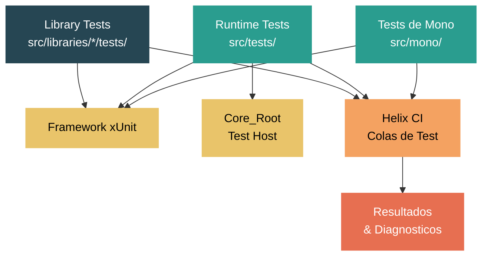

# Nivel 5: Experto / Contribuidor -- La Infraestructura de Test del Runtime

> **Perfil objetivo:** Desarrollador listo para contribuir tests e investigar fallos en el repositorio dotnet/runtime
> **Esfuerzo estimado:** 6 horas
> **Prerrequisitos:** [Modulo 5.1](05-expert-build-system.md), familiaridad basica con xUnit
> [English version](../en/05-expert-testing.md)

---

## Objetivos de Aprendizaje

Al finalizar este modulo vas a poder:

1. Distinguir entre las tres categorias principales de tests (library tests, runtime tests de CoreCLR, tests de Mono) y navegar sus estructuras de directorios.
2. Compilar y ejecutar library tests usando `dotnet build /t:Test`, aplicar filtros de xUnit y verificar que tus tests realmente se ejecutaron.
3. Compilar el Core_Root test host, generar layouts de test, y ejecutar runtime tests individuales con `corerun`.
4. Escribir nuevos tests siguiendo las convenciones de xUnit del repositorio tanto para proyectos de library tests como de runtime tests.
5. Entender como los tests se empaquetan y despachan a colas de Helix en CI, y leer resultados de tests en CI.
6. Reproducir fallos de CI localmente, diagnosticar tests inestables y manejar timeouts de tests.

---

## Mapa Conceptual



---

## Guia de Lectura del Codigo Fuente

| Dificultad | Ruta | Proposito |
|------------|------|-----------|
| ★★ | `docs/workflow/testing/libraries/testing.md` | Guia de library tests -- build, ejecucion, filtros |
| ★★ | `docs/workflow/testing/coreclr/testing.md` | Guia de runtime tests de CoreCLR -- Core_Root, prioridades |
| ★★★ | `src/tests/Directory.Build.props` | Propiedades MSBuild para todos los runtime tests (prioridades, rutas) |
| ★★★ | `src/tests/Common/dir.common.props` | Propiedades de build compartidas para proyectos de test |
| ★★★ | `src/tests/Common/XUnitWrapperGenerator/` | Source generator que envuelve runtime tests en runners de xUnit |
| ★★ | `src/tests/Common/CoreCLRTestLibrary/` | Utilidades compartidas: `TestFramework.cs`, `Utilities.cs`, `PlatformDetection.cs` |
| ★★★ | `src/tests/build.cmd` / `build.sh` | Scripts de build de tests -- flags, prioridades, layouts |
| ★★★ | `src/tests/run.sh` / `run.cmd` | Scripts de ejecucion de tests -- modos de stress, ejecucion paralela |
| ★★★★ | `src/tests/Common/helixpublishwitharcade.proj` | Como se empaquetan y envian los tests a colas de Helix |
| ★★ | `eng/testing/` | Templates de runner, configuracion de tests, runners por plataforma |

---

## Curriculum

### Leccion 1 -- Organizacion de Tests: Library Tests vs Runtime Tests vs Tests de Mono

#### Que vas a aprender

El repositorio dotnet/runtime tiene tres categorias fundamentalmente diferentes de tests. Entender a cual pertenece un test determina como lo compilas, lo ejecutas y donde encontras los resultados.

#### Library tests (`src/libraries/*/tests/`)

Los library tests validan las bibliotecas de clases managed (BCL). Cada biblioteca tiene su propio proyecto de test directamente junto a su codigo fuente:

```
src/libraries/System.Collections/
    ref/                          # Assembly de referencia
    src/                          # Implementacion
    tests/                        # Proyecto de test
        System.Collections.Tests.csproj
        BitArray/
        Generic/
        StructuralComparisonsTests.cs
```

Estos tests usan xUnit estandar (`[Fact]`, `[Theory]`, `[InlineData]`) y se ejecutan con la infraestructura normal de `dotnet test`. El proyecto de test apunta a `$(NetCoreAppCurrent)` y referencia un testhost que incluye el runtime y las bibliotecas compilados localmente.

Un `.csproj` tipico de library test se ve asi:

```xml
<Project Sdk="Microsoft.NET.Sdk">
  <PropertyGroup>
    <TargetFramework>$(NetCoreAppCurrent)</TargetFramework>
    <TestRuntime>true</TestRuntime>
  </PropertyGroup>
  <ItemGroup>
    <Compile Include="$(CommonTestPath)System\Collections\CollectionAsserts.cs"
             Link="Common\System\Collections\CollectionAsserts.cs" />
    <!-- archivos fuente de test -->
  </ItemGroup>
</Project>
```

Nota las referencias a `$(CommonTestPath)` -- muchas utilidades de test se comparten entre proyectos de library tests via `src/libraries/Common/tests/`.

#### Runtime tests (`src/tests/`)

Los runtime tests (tambien llamados "tests de CoreCLR") ejercitan el motor del runtime en si: el compilador JIT, el GC, el cargador de tipos, interop, manejo de excepciones y mas. Viven bajo `src/tests/` con esta estructura de primer nivel:

```
src/tests/
    JIT/           # Tests del compilador JIT (la categoria mas grande)
    GC/            # Tests del garbage collector
    Loader/        # Tests de carga de assemblies/tipos
    Interop/       # Tests de interop nativo
    baseservices/  # Servicios core del runtime
    tracing/       # EventPipe, trazado de diagnosticos
    reflection/    # Tests especificos de reflexion
    nativeaot/     # Tests especificos de NativeAOT
    Exceptions/    # Tests de manejo de excepciones
    Regressions/   # Tests de regresion para bugs especificos
    Common/        # Infraestructura y utilidades compartidas
    build.cmd      # Script de build para Windows
    build.sh       # Script de build para Unix
    run.cmd        # Runner de tests para Windows
    run.sh         # Runner de tests para Unix
```

Los runtime tests son diferentes de los library tests en varios aspectos importantes:

1. **Requieren Core_Root**: Una carpeta especial que contiene los binarios del runtime compilado mas las bibliotecas, usada como test host.
2. **Tienen prioridades**: Los tests se etiquetan con `CLRTestPriority` (0, 1, 2). Solo la prioridad 0 se compila por defecto.
3. **Convencion de codigo de retorno**: Los runtime tests individuales tradicionalmente retornan codigo de salida 100 para pasar, cualquier otra cosa para fallar.
4. **Merged test runners**: Multiples proyectos de test se agrupan en "runners fusionados" que los ejecutan secuencialmente en un solo proceso.

#### Tests de Mono

Los tests de Mono reutilizan la infraestructura de library tests pero apuntan al runtime de Mono. Los compilas con:

```bash
./build.sh mono+libs+libs.tests -test
```

Algunos tests tienen anotaciones `[ActiveIssue]` para problemas especificos de Mono, y ciertas categorias de tests se excluyen mediante condiciones de MSBuild sobre `RuntimeFlavor`.

#### Dato clave: que infraestructura de test usar

| Que estas testeando | Ubicacion del test | Como compilar y ejecutar |
|---|---|---|
| Una API managed en una biblioteca BCL | `src/libraries/<Lib>/tests/` | `dotnet build /t:Test` |
| Comportamiento del JIT, calidad de codegen | `src/tests/JIT/` | `src/tests/build.sh` + Core_Root |
| Comportamiento del GC, escenarios de stress | `src/tests/GC/` | `src/tests/build.sh` + Core_Root |
| Carga de tipos, binding de assemblies | `src/tests/Loader/` | `src/tests/build.sh` + Core_Root |
| Interop nativo (P/Invoke, COM) | `src/tests/Interop/` | `src/tests/build.sh` + Core_Root |
| Diagnosticos, EventPipe | `src/tests/tracing/` | `src/tests/build.sh` + Core_Root |

#### Ejercicio

1. Navega a `src/libraries/System.Collections/tests/` y examina el `.csproj`. Cuenta cuantas referencias a `$(CommonTestPath)` usa -- representan clases base de test compartidas.
2. Navega a `src/tests/JIT/` y lista los subdirectorios. Cada uno representa un area principal de testing del JIT.
3. Abre `src/tests/Directory.Build.props` y busca la propiedad `CLRTestPriorityToBuild`. Nota como el valor por defecto es 0.

---

### Leccion 2 -- Ejecutando Library Tests

#### Que vas a aprender

Los library tests son los tests mas comunes con los que vas a interactuar como contribuidor. Esta leccion cubre el flujo completo desde la compilacion hasta la ejecucion con filtros.

#### Prerrequisitos: compilar el runtime y las bibliotecas

Antes de que cualquier library test pueda ejecutarse, necesitas un runtime y bibliotecas compilados:

```bash
# Compilar runtime de CoreCLR (release) + bibliotecas (debug) -- la config tipica de dev
./build.sh -subset clr+libs -rc Release
```

**Importante**: Si recompilas `System.Private.CoreLib`, tambien necesitas ejecutar el subset `libs.pretest` para copiarlo al testhost:

```bash
./build.sh clr.corelib+clr.nativecorelib+libs.pretest -rc checked
```

#### Compilando y ejecutando tests para una biblioteca individual

El flujo recomendado es hacer `cd` al directorio de tests e invocar el target `Test` de MSBuild:

```bash
cd src/libraries/System.Collections/tests
dotnet build /t:Test
```

Este unico comando compila el proyecto de test y ejecuta todos los tests. La salida va a la consola, y un log XML detallado se escribe en `artifacts/bin/System.Collections.Tests/Debug/net10.0/testResults.xml` (el TFM exacto varia).

#### Filtrando tests

Podes filtrar tests en varios niveles de granularidad:

**Por clase:**
```bash
dotnet build /t:Test /p:XUnitOptions="-class Test.ClassUnderTests"
```

**Por metodo (nombre completo):**
```bash
dotnet build /t:Test /p:XunitMethodName=System.Collections.Tests.BitArray_GetSetTests.Get_Set
```

**Por metodo via XUnitOptions:**
```bash
dotnet build /t:test /p:XUnitOptions="-method System.Collections.Tests.BitArray_GetSetTests.Get_Set"
```

#### Ejecutando tests de outer loop

Algunos tests estan marcados como "outer loop" -- son mas lentos o mas exhaustivos y no se ejecutan en el inner loop por defecto:

```bash
dotnet build /t:Test /p:Outerloop=true
```

#### Acelerando la iteracion

Cuando estas iterando sobre un test, dos flags ahorran tiempo:

- `/p:testnobuild=true` -- omite el paso de build (usalo solo si no cambiaste codigo)
- `--no-restore` -- omite el restore de NuGet (usalo si los paquetes no cambiaron)

Combinados:
```bash
dotnet build --no-restore /t:test /p:testnobuild=true /p:XUnitOptions="-method Namespace.Class.Method" tests/FunctionalTests
```

#### Verificando conteos de ejecucion

Un error comun es ejecutar tests filtrados y ver "0 tests executed" sin darse cuenta. Siempre verifica la linea de resumen en la salida:

```
Tests run: 42, Errors: 0, Failures: 0, Skipped: 3
```

Si `Tests run` es 0, tu filtro esta mal o los tests fueron excluidos por una condicion de plataforma/categoria.

#### Ejecutando todos los library tests

Para compilar y ejecutar la suite completa de library tests:

```bash
./build.sh -subset libs.tests -test -c Release
```

Esto es lento (muchas horas). Para propositos de CI, se divide entre maquinas de Helix.

#### Ejercicio

1. Compila y ejecuta los tests de `System.Collections`: `cd src/libraries/System.Collections/tests && dotnet build /t:Test`.
2. Re-ejecuta con un filtro apuntando solo a tests de `BitArray`: `/p:XUnitOptions="-class System.Collections.Tests.BitArray_CtorTests"`. Verifica que el conteo de ejecucion bajo.
3. Proba agregar `/p:testnobuild=true` y confirma que los tests corren mas rapido (sin recompilacion).

---

### Leccion 3 -- Runtime Tests y Core_Root

#### Que vas a aprender

Los runtime tests (bajo `src/tests/`) usan un mecanismo diferente al de los library tests. Se ejecutan contra un directorio especial llamado "Core_Root" que contiene el runtime completamente compilado. Esta leccion te lleva por el flujo completo.

#### Paso 1: Compilar el runtime y las bibliotecas

Los runtime tests necesitan un CoreCLR y bibliotecas compilados:

```bash
# Tipico: runtime Checked + bibliotecas Release
./build.sh clr+libs -rc Checked
```

#### Paso 2: Generar Core_Root

Core_Root es un directorio autocontenido con los binarios del runtime, JIT, GC y todos los assemblies de bibliotecas necesarios. Generalo con:

```bash
# Windows
.\src\tests\build.cmd generatelayoutonly

# Linux/macOS
./src/tests/build.sh -GenerateLayoutOnly
```

La salida aparece en:
```
artifacts/tests/coreclr/<OS>.<Arch>.<Configuration>/Tests/Core_Root/
```

Por ejemplo: `artifacts/tests/coreclr/windows.x64.Debug/Tests/Core_Root/`

#### Paso 3: Compilar tests

**Compilar todos los tests (lento -- evitalo a menos que sea necesario):**
```bash
./src/tests/build.sh
```

**Compilar un proyecto de test individual:**
```bash
./src/tests/build.sh -test:JIT/Directed/ConstantFolding/folding_extends_int32_on_64_bit_hosts.csproj
```

**Compilar un directorio de tests:**
```bash
./src/tests/build.sh -dir:JIT/Directed/ConstantFolding
```

**Compilar un subarbol:**
```bash
./src/tests/build.sh -tree:JIT/Methodical
```

**Incluir tests de prioridad 1 (las prioridades son acumulativas):**
```bash
./src/tests/build.sh -tree:JIT/Methodical -priority1
```

#### Paso 4: Ejecutar tests

**Ejecutar todos los tests compilados:**
```bash
./src/tests/run.sh x64 checked
```

**Ejecutar un test individual:**
```bash
export CORE_ROOT=$(pwd)/artifacts/tests/coreclr/<OS>.x64.Checked/Tests/Core_Root
cd artifacts/tests/coreclr/<OS>.x64.Checked/<ruta-del-test>/
$CORE_ROOT/corerun <NombreDelTest>.dll
```

Para runtime tests que retornan codigo de salida 100, podes verificar:
```bash
$CORE_ROOT/corerun MyTest.dll
echo $?  # Deberia ser 100 para pasar
```

Alternativamente, cada test genera un script `.sh` o `.cmd` que podes ejecutar directamente:
```bash
./MyTest.sh -coreroot=/ruta/a/Core_Root
```

#### Merged test runners

Los runtime tests modernos usan "merged test runners" -- un unico ejecutable que corre multiples assemblies de test secuencialmente. Se identifican por `<Import Project="$(TestSourceDir)MergedTestRunner.targets" />` en el `.csproj`.

Podes filtrar dentro de un merged runner:
```bash
./MergedRunner.sh "Namespace.ClassName.MethodName"
```

El filtro soporta busqueda por subcadena y la sintaxis `FullyQualifiedName=...` o `DisplayName~...`.

#### Tests que requieren aislamiento de proceso

Algunos tests manipulan estado global (variables de entorno, directorio actual) y deben ejecutarse en su propio proceso. Estos estan marcados con:

```xml
<RequiresProcessIsolation>true</RequiresProcessIsolation>
```

El merged runner los lanza como subprocesos automaticamente.

#### Modos de stress

El script `run.sh` soporta varios modos de stress para testing exhaustivo:

```bash
# JIT stress
./src/tests/run.sh x64 checked --jitstress=2

# GC stress
./src/tests/run.sh x64 checked --gcstresslevel=4

# JIT min-opts (deshabilitar optimizaciones)
./src/tests/run.sh x64 checked --jitminopts
```

#### Resultados de tests

Despues de una ejecucion completa, los resultados aparecen en:
- `artifacts/log/TestRun_<Arch>_<Config>.html` -- resumen HTML
- `artifacts/log/TestRunResults_<OS>_<Arch>_<Config>.err` -- lista de fallos
- `artifacts/tests/coreclr/<OS>.<Arch>.<Config>/Reports/` -- logs de salida y error por test

La carpeta de reportes de cada test contiene:
- `<Test>.output.txt` -- toda la salida registrada por el test
- `<Test>.error.txt` -- informacion de crash de `corerun`

#### Ejercicio

1. Genera Core_Root para un build Debug: `./src/tests/build.sh -GenerateLayoutOnly`.
2. Compila un test individual: `./src/tests/build.sh -test:JIT/Directed/ConstantFolding/folding_extends_int32_on_64_bit_hosts.csproj`.
3. Ejecutalo con `corerun` y verifica que el codigo de salida sea 100.
4. Abre `src/tests/JIT/Directed/ConstantFolding/folding_extends_int32_on_64_bit_hosts.cs` y lee el test -- es un test `[Fact]` simple que retorna 100 en caso de exito.

---

### Leccion 4 -- Escribiendo un Nuevo Test

#### Que vas a aprender

Esta leccion cubre las convenciones para escribir tests tanto en la suite de library tests como en la de runtime tests, incluyendo patrones de xUnit, configuracion de proyectos y errores comunes.

#### Escribiendo un library test

Los library tests usan xUnit estandar. Las convenciones del repositorio (de `CLAUDE.md`) son:

1. **Preferir `[Theory]` con `[InlineData]`/`[MemberData]`** sobre multiples metodos `[Fact]` duplicados.
2. **Agregar nuevos tests a archivos de test existentes** en lugar de crear nuevos cuando el alcance lo permite.
3. **No emitir comentarios "Act", "Arrange" o "Assert"**.
4. **No agregar comentarios de regresion** citando numeros de issue/PR a menos que se pida explicitamente.
5. **Asegurar que los archivos nuevos esten listados en el `.csproj`** si otros archivos en esa carpeta lo estan.
6. **Usar filtros y verificar conteos de ejecucion** para confirmar que los tests realmente se ejecutaron.

Un metodo de library test tipico:

```csharp
[Theory]
[InlineData(0)]
[InlineData(1)]
[InlineData(75)]
[InlineData(int.MaxValue)]
public void Count_ReturnsExpectedValue(int count)
{
    var list = new List<int>(Enumerable.Range(0, count));
    Assert.Equal(count, list.Count);
}
```

Cuando agregas un archivo de test nuevo, asegurate de que aparezca en el `.csproj`:

```xml
<ItemGroup>
  <Compile Include="Generic\List\List.Generic.Tests.MyNewFeature.cs" />
</ItemGroup>
```

Algunas bibliotecas usan clases base de test compartidas. Por ejemplo, los tests de colecciones heredan de interfaces como `ICollection.Generic.Tests` definidas en `src/libraries/Common/tests/System/Collections/`. Revisa el proyecto de test existente para ver si hay una clase base que deberias extender.

#### Escribiendo un runtime test

Los runtime tests siguen convenciones ligeramente diferentes. Un test de JIT simple se ve asi (de `src/tests/JIT/Directed/ConstantFolding/`):

```csharp
// Licensed to the .NET Foundation under one or more agreements.
// The .NET Foundation licenses this file to you under the MIT license.

using Xunit;

public class FoldingExtendsInt32On64BitHostsTest
{
    [Fact]
    public static int TestEntryPoint()
    {
        var r1 = 31;
        var s1 = 0b11 << r1;

        if (s1 == 0b11 << 31)
        {
            return 100;  // Paso
        }

        return -1;  // Fallo
    }
}
```

Convenciones clave:
- El punto de entrada `[Fact]` retorna `int` -- 100 significa paso.
- El metodo se llama `TestEntryPoint` (convencion, no requisito).
- El archivo de proyecto es minimo:

```xml
<Project Sdk="Microsoft.NET.Sdk">
  <PropertyGroup>
    <Optimize>True</Optimize>
    <DebugType>None</DebugType>
  </PropertyGroup>
  <ItemGroup>
    <Compile Include="$(MSBuildProjectName).cs" />
  </ItemGroup>
</Project>
```

El `XUnitWrapperGenerator` (un source generator en `src/tests/Common/XUnitWrapperGenerator/`) automaticamente envuelve estos tests en runners compatibles con xUnit.

#### Prioridades de tests

Establece la prioridad del test en el `.csproj`:

```xml
<PropertyGroup>
  <CLRTestPriority>1</CLRTestPriority>
</PropertyGroup>
```

Los tests de prioridad 0 (por defecto) se ejecutan en cada build de CI. Los tests de prioridad 1 se ejecutan con menos frecuencia. Solo agrega prioridad 1+ si el test es lento o cubre casos extremos.

#### Aislamiento de proceso

Si tu test modifica estado global del proceso, marcalo:

```xml
<PropertyGroup>
  <RequiresProcessIsolation>true</RequiresProcessIsolation>
</PropertyGroup>
```

Razones comunes: manipulacion de variables de entorno, metodo `Main` personalizado, carga de bibliotecas nativas, o requerir manifiestos de aplicacion especificos.

#### Utilidades compartidas de test

Los runtime tests pueden usar `CoreCLRTestLibrary` (en `src/tests/Common/CoreCLRTestLibrary/`), que provee:

- `TestFramework.cs` -- helpers de logging y framework de test basico
- `Utilities.cs` -- metodos de utilidad comunes
- `PlatformDetection.cs` -- deteccion de SO/arquitectura
- `Generator.cs` -- generadores de valores aleatorios para fuzzing

Los library tests usan un conjunto separado de utilidades compartidas en `src/libraries/Common/tests/`.

#### Encontrando que runner ejecuta tu test

Despues de agregar un runtime test, necesitas saber que proyecto de merged runner lo incluye:

1. Revisa el `.csproj` del test -- si tiene `<RequiresProcessIsolation>true</RequiresProcessIsolation>` o importa `MergedTestRunner.targets`, se ejecuta a si mismo.
2. De lo contrario, busca en directorios padres un `.csproj` con `<Import Project="$(TestSourceDir)MergedTestRunner.targets" />`. Los items `MergedTestProjectReference` de ese runner incluiran tu test mediante glob patterns.

#### Ejercicio

1. Crea un test hipotetico para un nuevo metodo de `List<T>`. Escribi un `[Theory]` con `[InlineData]` cubriendo casos extremos.
2. Abre `src/tests/JIT/Directed/ConstantFolding/folding_extends_int32_on_64_bit_hosts.csproj` y nota su simplicidad -- solo `<Optimize>` y un unico `<Compile>`. Compara con un `.csproj` de library test.
3. Busca el merged runner para el subarbol `JIT/Directed`. Busca archivos `*.csproj` en `src/tests/JIT/Directed/` que contengan `MergedTestRunner.targets`.

---

### Leccion 5 -- Infraestructura de Test: Helix y CI

#### Que vas a aprender

En CI, los tests de dotnet/runtime no se ejecutan en la maquina de build. Se empaquetan como work items y se despachan a **Helix**, un sistema de ejecucion de tests distribuido. Entender este pipeline es esencial para diagnosticar fallos que solo ocurren en CI.

#### El sistema Helix

Helix es un servicio de ejecucion de tests mantenido por el equipo de .NET (via el SDK de `arcade`). El flujo central es:

1. **Fase de build**: CI compila el runtime y los binarios de test.
2. **Fase de empaquetado**: Los tests se agrupan en "work items" -- archivos comprimidos que contienen binarios de test y un script de ejecucion.
3. **Fase de envio**: Los work items se envian a colas de Helix (ej., `Ubuntu.2204.Amd64.Open`, `Windows.10.Amd64.Open`).
4. **Fase de ejecucion**: Los agentes de Helix en las maquinas destino descargan y ejecutan cada work item.
5. **Fase de reporte**: Los resultados (XML de xUnit) se suben de vuelta y se agregan.

El empaquetado se define en `src/tests/Common/helixpublishwitharcade.proj`. Este proyecto MSBuild crea items `HelixWorkItem` con:
- `PayloadDirectory` o `PayloadArchive` -- los archivos de test
- `Command` -- el comando de shell para ejecutar el test
- Comandos pre/post para configuracion del entorno

#### Colas de Helix

Cada cola representa una combinacion especifica de SO/arquitectura. Ejemplos del archivo del proyecto:

- `Ubuntu.2204.Amd64.Open` -- Ubuntu 22.04, x64
- `Windows.10.Amd64.Open` -- Windows 10, x64
- `OSX.1200.ARM64.Open` -- macOS 12, ARM64

El sufijo `.Open` significa que la cola esta disponible para builds open-source (de la comunidad). Existen colas internas para builds firmados.

#### Escenarios de test en CI

El proyecto de Helix soporta multiples "escenarios" de test configurados mediante propiedades:

| Propiedad | Descripcion |
|-----------|-------------|
| `_Scenarios` | Nombre del escenario de test (ej., `normal`, `jitstress`, `gcstress`) |
| `_RunCrossGen2` | Ejecutar con ReadyToRun/Crossgen2 |
| `_GcSimulatorTests` | Ejecutar tests del simulador de GC |
| `_LongRunningGCTests` | Ejecutar tests de GC de larga duracion |
| `_TieringTest` | Ejecutar tests de tiered compilation |
| `_NativeAotTest` | Ejecutar tests de NativeAOT |

#### Templates de runner

El directorio `eng/testing/` contiene templates de runner para cada plataforma:

```
eng/testing/
    RunnerTemplate.cmd       # Runner de Windows
    RunnerTemplate.sh        # Runner de Linux/macOS
    WasmRunnerTemplate.sh    # WebAssembly
    AndroidRunnerTemplate.sh # Android
    AppleRunnerTemplate.sh   # iOS/tvOS/Mac Catalyst
```

Estos templates se completan con parametros especificos del test durante la fase de empaquetado.

#### Leyendo resultados de tests en CI

Cuando un build de CI falla tests, podes investigar a traves de:

1. **Azure DevOps**: El resumen del build muestra los tests fallidos con su salida.
2. **Logs de Helix**: Cada work item tiene logs descargables incluyendo `console.log` y `testResults.xml`.
3. **Runfo** (https://runfo.azurewebsites.net/): Una herramienta para buscar historiales de fallos de tests a traves de builds.

Busca patrones:
- Un test que falla consistentemente en un SO pero pasa en otros sugiere un bug especifico de plataforma.
- Un test que falla intermitentemente es "flaky" y necesita manejo especial (ver Leccion 6).

#### Library tests en CI

Los library tests tambien se ejecutan a traves de Helix pero usan una ruta de envio diferente. El subset `libs.tests` en la infraestructura de build maneja el empaquetado:

```bash
# Lo que CI efectivamente ejecuta:
./build.sh -subset clr+libs+libs.tests -test -rc Release
```

Cada proyecto de library test se convierte en un work item de Helix separado.

#### Ejercicio

1. Abre `src/tests/Common/helixpublishwitharcade.proj` y busca las definiciones de `HelixWorkItem`. Nota la propiedad `Command` -- esto es lo que realmente se ejecuta en el agente de Helix.
2. Navega `eng/testing/` y examina `RunnerTemplate.sh`. Nota los placeholders que se completan durante el empaquetado.
3. En un fallo de build de CI, practica navegar desde el resumen del build en Azure DevOps hasta los logs del work item de Helix.

---

### Leccion 6 -- Depurando Tests Fallidos

#### Que vas a aprender

Los fallos de tests son inevitables en un repositorio de este tamano. Esta leccion cubre las habilidades practicas para reproducir fallos localmente, entender tests inestables y trabajar con timeouts.

#### Reproduciendo fallos de CI localmente

La habilidad mas importante es reproducir un fallo de CI en tu maquina local. Segui estos pasos:

**Para fallos de library tests:**

```bash
# 1. Compilar la misma configuracion que CI
./build.sh -subset clr+libs -rc Release

# 2. Navegar al proyecto de test
cd src/libraries/<NombreDeBiblioteca>/tests

# 3. Ejecutar el test fallido especifico
dotnet build /t:Test /p:XunitMethodName=Namespace.Clase.MetodoFallido
```

**Para fallos de runtime tests:**

```bash
# 1. Compilar runtime y bibliotecas
./build.sh clr+libs -rc Checked

# 2. Generar Core_Root
./src/tests/build.sh -GenerateLayoutOnly

# 3. Compilar el test especifico
./src/tests/build.sh -test:ruta/al/test.csproj

# 4. Establecer CORE_ROOT y ejecutar
export CORE_ROOT=$(pwd)/artifacts/tests/coreclr/<OS>.x64.Checked/Tests/Core_Root
cd artifacts/tests/coreclr/<OS>.x64.Checked/<ruta-del-test>/
$CORE_ROOT/corerun <NombreDelTest>.dll
```

#### Fallos especificos de plataforma

Si un test falla solo en un SO especifico (ej., Linux ARM64) y no tenes ese hardware:

1. Verifica si existe una imagen Docker para esa plataforma.
2. Busca rutas de codigo especificas de plataforma usando verificaciones de `#if` o `RuntimeInformation`.
3. Verifica si el test tiene atributos `[PlatformSpecific]` o `[SkipOnPlatform]` que podrian estar faltando.
4. A veces el fallo esta en el test mismo -- hace suposiciones sobre separadores de ruta, finales de linea o locale.

#### Usando modos de stress para reproducir fallos intermitentes

CI ejecuta varios modos de stress que pueden exponer bugs dependientes de timing:

```bash
# JIT stress -- fuerza diferentes estrategias de compilacion
./src/tests/run.sh x64 checked --jitstress=2

# GC stress -- dispara el GC en puntos inusuales
./src/tests/run.sh x64 checked --gcstresslevel=4

# Forzar min-opts -- deshabilita optimizaciones del JIT
./src/tests/run.sh x64 checked --jitminopts
```

Para library tests, podes establecer variables de entorno de stress manualmente:

```bash
export DOTNET_GCStress=4
cd src/libraries/<Lib>/tests
dotnet build /t:Test
```

#### Tratando con tests inestables (flaky)

Un test flaky pasa a veces y falla a veces, usualmente debido a timing, contension de recursos o dependencias externas. El repositorio tiene infraestructura para esto:

1. **Atributo `[ActiveIssue]`**: Deshabilita temporalmente un test mientras se investiga el bug subyacente:
   ```csharp
   [ActiveIssue("https://github.com/dotnet/runtime/issues/12345")]
   [Fact]
   public void TestInestable() { ... }
   ```

2. **Exclusiones por categoria**: Los tests pueden excluirse de CI con:
   ```csharp
   [OuterLoop]  // Solo se ejecuta en outer loop, no en cada build de CI
   ```

3. **Filtrado de categorias en CI**:
   ```bash
   ./build.sh -subset libs.tests -test /p:WithoutCategories=IgnoreForCI
   ```

Si descubris un test flaky nuevo, el protocolo es:
1. Crear un issue en GitHub describiendo el patron del fallo.
2. Agregar `[ActiveIssue("url")]` para deshabilitar el test temporalmente.
3. Investigar la causa raiz.
4. Arreglar y remover el `[ActiveIssue]`.

#### Timeouts de tests

Los tests tienen timeouts en multiples niveles:

- **Por test**: xUnit impone timeouts por test para library tests.
- **Por work item**: Helix tiene timeouts por work item (configurados en `helixpublishwitharcade.proj` via `_TimeoutPerTestInMinutes` y `_TimeoutPerTestCollectionInMinutes`).
- **Por build**: El pipeline de CI tiene timeouts globales de build.

Cuando un test hace timeout en CI pero no localmente, las causas comunes son:
- La maquina de CI es mas lenta (compartida, menos memoria).
- Los builds Debug son significativamente mas lentos que los Release.
- Los modos de stress de GC/JIT multiplican el tiempo de ejecucion dramaticamente.

Para diagnosticar, revisa el log del test buscando la ultima operacion antes del timeout, y considera agregar instrumentacion o dividir el test en unidades mas pequenas.

#### Archivos de salida de runtime tests

Para fallos de runtime tests, el directorio de reportes contiene diagnosticos detallados:

```
artifacts/tests/coreclr/<OS>.<Arch>.<Config>/Reports/<RutaDelTest>/
    <NombreDelTest>.output.txt    # Toda la salida del test
    <NombreDelTest>.error.txt     # Informacion de crash/error de corerun
```

El archivo `.error.txt` es particularmente valioso para crashes -- puede contener stack traces nativos, mensajes de assertion o detalles de access violation.

#### Usando variables de entorno de diagnostico

Para fallos relacionados con el JIT, las herramientas de diagnostico ayudan a acotar el problema:

```bash
# Volcar IR del JIT para un metodo especifico
export DOTNET_JitDump="Namespace.Clase:Metodo"

# Mostrar desensamblado de metodos compilados por el JIT
export DOTNET_JitDisasm="Namespace.Clase:Metodo"

# Deshabilitar tiered compilation (simplificar reproduccion)
export DOTNET_TieredCompilation=0
```

Para fallos relacionados con el GC:

```bash
# Habilitar logging detallado del GC
export DOTNET_GCLog=gc.log

# Forzar modos especificos de GC
export DOTNET_gcServer=1
export DOTNET_GCHeapCount=4
```

#### Ejercicio

1. Toma un library test y rompelo intencionalmente (ej., cambia un valor esperado en `Assert.Equal`). Compila y ejecutalo. Observa el formato de la salida del fallo.
2. Ejecuta el mismo test con `/p:Outerloop=true` y compara que tests adicionales aparecen.
3. Establece `export DOTNET_TieredCompilation=0` antes de ejecutar un test, despues removelo y ejecuta de nuevo. Nota cualquier diferencia de comportamiento.
4. Abre `src/tests/Common/helixpublishwitharcade.proj` y busca las propiedades de configuracion de timeout. Considera que valores de timeout serian apropiados para diferentes categorias de tests.

---

## Lista de Autoevaluacion

Antes de seguir adelante, verifica que podes responder estas preguntas:

- [ ] Cual es la diferencia entre `src/libraries/*/tests/` y `src/tests/`?
- [ ] Como ejecutas tests para una biblioteca individual? Cual es el target de MSBuild?
- [ ] Que es Core_Root y por que lo necesitan los runtime tests?
- [ ] Como compilas Core_Root sin compilar todos los tests?
- [ ] Que significa el codigo de salida 100 para un runtime test?
- [ ] Que atributos de xUnit prefiere este repositorio (`[Fact]` vs `[Theory]`)?
- [ ] Que es un merged test runner y como filtras tests dentro de el?
- [ ] Que es Helix y como se despachan los tests hacia el?
- [ ] Como marcas un test flaky y cual es el proceso esperado?
- [ ] Que variables de entorno de diagnostico ayudan a depurar fallos de tests relacionados con el JIT?

---

## Lecturas Adicionales

- `docs/workflow/testing/coreclr/testing.md` -- Documentacion completa de tests de CoreCLR
- `docs/workflow/testing/libraries/testing.md` -- Documentacion completa de library tests
- `docs/workflow/testing/using-corerun-and-coreroot.md` -- Profundizacion sobre `corerun` y Core_Root
- `docs/workflow/testing/coreclr/test-configuration.md` -- Propiedades de configuracion de runtime tests
- `docs/workflow/testing/coreclr/requiresprocessisolation.md` -- Cuando los tests necesitan aislamiento de proceso
- `src/tests/Common/XUnitWrapperGenerator/` -- Source generator que crea wrappers de xUnit para runtime tests

---

## Que Sigue

Con un entendimiento profundo de la infraestructura de test, ahora estas equipado para:
- Validar cualquier cambio que hagas al runtime o las bibliotecas con confianza.
- Contribuir nuevos tests para bugs que encuentres o features que implementes.
- Investigar y arreglar fallos de CI que bloquean PRs.

Continua al proximo modulo del Nivel 5 para aprender sobre el sistema de build en profundidad.
