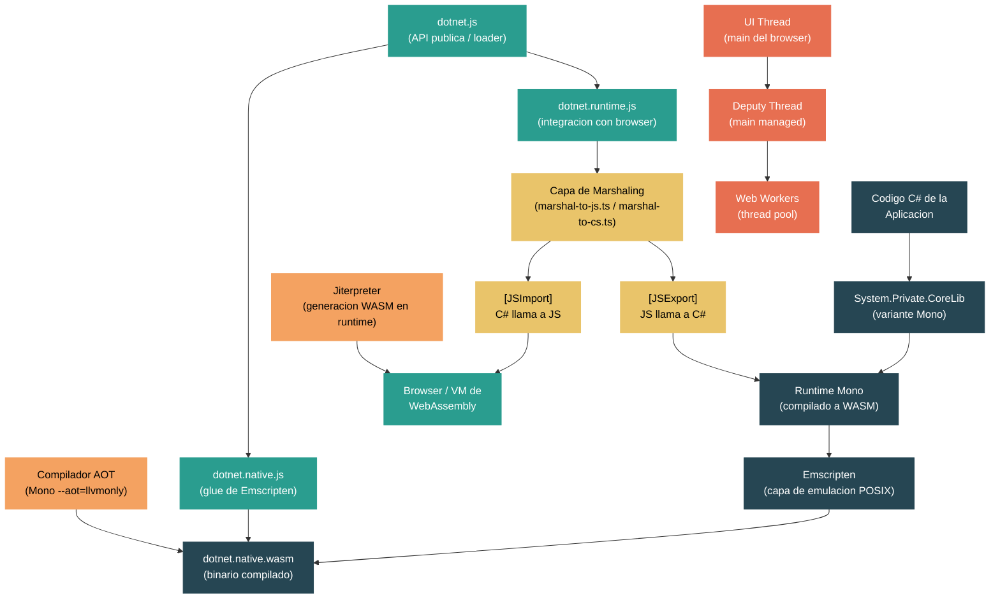

# Nivel 5: Experto / Contribuidor -- WebAssembly y el Runtime del Browser

> **Perfil objetivo:** Desarrollador que quiere entender como .NET se ejecuta dentro del browser via WebAssembly, incluyendo el runtime Mono WASM, el puente de interop con JavaScript, threading en WASM, compilacion AOT para WASM, y como Blazor WebAssembly aprovecha todo esto
> **Esfuerzo estimado:** 8 horas
> **Prerrequisitos:** [Modulo 5.6 -- Mono Runtime](../es/04-internals-nativeaot.md) (se asume familiaridad con Mono)
> [English version](../en/05-expert-wasm.md)

---

## Objetivos de Aprendizaje

Al finalizar este modulo vas a poder:

1. Explicar la arquitectura de .NET en WebAssembly -- como el runtime Mono se compila a un binario `.wasm` via Emscripten y como el host JavaScript lo inicializa dentro de un browser o entorno Node.js.
2. Trazar el ciclo de vida completo de una llamada `[JSImport]` desde C# hacia JavaScript y una llamada `[JSExport]` desde JavaScript hacia codigo managed, identificando las capas de marshaling tanto del lado TypeScript como del lado C#.
3. Describir el pipeline de build para WASM -- desde `dotnet build` pasando por la compilacion Emscripten hasta la estructura de salida `AppBundle/_framework`, incluyendo los roles de `dotnet.js`, `dotnet.native.js`, `dotnet.runtime.js` y `dotnet.native.wasm`.
4. Explicar el modelo de threading en WASM -- como `SharedArrayBuffer` y Web Workers habilitan multi-threading, los roles del UI thread, el deputy thread y el IO thread, y las limitaciones fundamentales que imponen los browsers.
5. Describir por que la compilacion AOT importa para el rendimiento en WASM, como el compilador Mono AOT produce WebAssembly, y como el Jiterpreter optimiza codigo interpretado en tiempo de ejecucion.
6. Articular como Blazor WebAssembly usa el runtime WASM de .NET, como su modelo de componentes despacha entre JS y codigo managed, y que caracteristicas de rendimiento se derivan de esta arquitectura.

---

## Mapa Conceptual



---

## Plan de Estudios

### Leccion 1 --- .NET en WebAssembly: La Arquitectura

#### Lo que vas a aprender

Ejecutar .NET dentro de un browser es algo que en principio no deberia funcionar -- los browsers no tienen concepto de CLR, garbage collectors, ni excepciones managed. Sin embargo, aplicaciones .NET se ejecutan en el browser todos los dias. Esta leccion explica la ingenieria notable que lo hace posible: el runtime Mono compilado a WebAssembly via Emscripten, un host JavaScript que lo inicializa y alimenta, y una arquitectura en capas que conecta dos mundos fundamentalmente diferentes.

#### La vision general: Mono compilado a WebAssembly

El runtime de .NET para browser es el **runtime Mono** (no CoreCLR) compilado como un modulo WebAssembly usando el toolchain [Emscripten](https://emscripten.org/). Emscripten toma codigo fuente C/C++ y produce:

1. **`dotnet.native.wasm`** -- el runtime Mono en si (GC, interprete, sistema de tipos, manejo de excepciones) compilado como binario WebAssembly.
2. **`dotnet.native.js`** -- el "glue" JavaScript de Emscripten que provee emulacion POSIX: sistema de archivos, variables de entorno, manejo de memoria y primitivas de threading.

Sobre esto, el repositorio dotnet/runtime proporciona:

3. **`dotnet.js`** -- la API publica de JavaScript y el loader. Esto es lo que las aplicaciones importan.
4. **`dotnet.runtime.js`** -- la capa de integracion con el browser escrita en TypeScript. Este es el corazon del sistema de interop.
5. **`dotnet.boot.js`** -- un manifiesto de todos los assets con hashes de integridad y flags de configuracion.

El archivo `src/mono/browser/runtime/globals.ts` define la logica de deteccion de entorno que sustenta todo:

```typescript
export const ENVIRONMENT_IS_NODE = typeof process == "object" && ...;
export const ENVIRONMENT_IS_WEB_WORKER = typeof importScripts == "function";
export const ENVIRONMENT_IS_WEB = typeof window == "object" || ...;
export const ENVIRONMENT_IS_SHELL = !ENVIRONMENT_IS_WEB && !ENVIRONMENT_IS_NODE;
```

Esto permite que el mismo runtime opere en browsers, Node.js, V8 shell y web workers.

#### La secuencia de inicio

El proceso de arranque esta orquestado por el loader en TypeScript ubicado en `src/mono/browser/runtime/loader/`. El punto de entrada es `src/mono/browser/runtime/loader/index.ts`:

```typescript
const dotnet: DotnetHostBuilder = new HostBuilder();
dotnet.withConfig(/*! dotnetBootConfig */{});
export { dotnet, exit };
```

La clase `HostBuilder` en `src/mono/browser/runtime/loader/run.ts` implementa una API fluida que las aplicaciones usan:

```javascript
import { dotnet } from './_framework/dotnet.js';
await dotnet.run();
```

Cuando se llama a `run()`, el inicio procede a traves de estas fases, coordinadas por `src/mono/browser/runtime/startup.ts`:

1. **Configuracion** -- `configureRuntimeStartup()` configura la salida de consola y verifica las caracteristicas WASM requeridas (SIMD, manejo de excepciones).
2. **Inicializacion de Emscripten** -- `configureEmscriptenStartup()` se engancha al ciclo de vida del modulo Emscripten (`instantiateWasm`, `preRun`, `postRun`, `onRuntimeInitialized`).
3. **Instanciacion WASM** -- El binario `dotnet.native.wasm` se descarga e instancia via `WebAssembly.instantiateStreaming()`.
4. **Carga de assets** -- Los assemblies managed (`.dll` o Webcil `.wasm`), datos ICU, datos de zona horaria y assemblies satelite se descargan y cargan en el sistema de archivos virtual de Emscripten.
5. **Inicializacion del runtime** -- Se llama a la funcion C `mono_wasm_load_runtime` via el mecanismo "cwraps" de Emscripten, iniciando el runtime Mono.
6. **Binding de exports managed** -- `init_managed_exports()` en `src/mono/browser/runtime/managed-exports.ts` localiza el assembly `System.Runtime.InteropServices.JavaScript` y vincula puntos de entrada managed como `CallEntrypoint` y `BindAssemblyExports`.
7. **Despacho del punto de entrada** -- Se invoca el metodo `Main()` managed via `call_entry_point()`.

#### La capa nativa en C

Los archivos C `src/mono/browser/runtime/driver.c` y `src/mono/browser/runtime/runtime.c` son el puente entre el host TypeScript y la API C de Mono. `runtime.c` contiene codigo compartido usado tanto por el target browser (`HOST_BROWSER`) como WASI (`HOST_WASI`):

```c
#ifdef __EMSCRIPTEN__
#define HOST_BROWSER 1
#else
#define HOST_WASI 1
#endif
```

`driver.c` es especifico del browser. Incluye headers de Emscripten y provee exports como `SystemInteropJS_RegisterGCRoot` que la capa de marshaling JavaScript llama para registrar referencias a objetos managed con el GC.

#### WASI: el otro target WASM

El mismo runtime Mono tambien apunta a WASI (WebAssembly System Interface) para entornos fuera del browser. El directorio `src/mono/wasm/host/wasi/` contiene `WasiEngineHost.cs` y `WasiEngineArguments.cs` para ejecutar .NET en runtimes WASI como wasmtime y wasmer. WASI provee una interfaz de sistema estandarizada sin APIs del browser, habilitando escenarios WASM del lado del servidor y CLI.

#### La version de Emscripten

El archivo `src/mono/browser/emscripten-version.txt` fija la version exacta de Emscripten usada para compilar el runtime. Esto importa porque el soporte de caracteristicas de WebAssembly (SIMD, manejo de excepciones, threads) depende de la version de Emscripten, y los desajustes entre el glue JavaScript y el binario WASM causan errores en tiempo de ejecucion.

#### Ejercicio de exploracion del codigo fuente

1. Abri `src/mono/browser/runtime/loader/index.ts` y observa como crea un `HostBuilder` y exporta el objeto `dotnet`. Este es el punto de entrada de la API publica.
2. Lee las primeras 100 lineas de `src/mono/browser/runtime/startup.ts` y traza los imports -- nota como trae marshalers, profilers, soporte de threads y el jiterpreter.
3. Abri `src/mono/browser/runtime/runtime.c` y observa la division `#ifdef HOST_BROWSER` / `HOST_WASI`. Este unico archivo apunta a ambas plataformas.
4. Lee `src/mono/browser/runtime/globals.ts` e identifica como el runtime detecta si esta ejecutandose en un browser, Node.js, un web worker o un shell.
5. Navega el archivo `src/mono/wasm/features.md` para una lista completa de caracteristicas configurables del browser (threading, SIMD, manejo de excepciones, fetch, WebSocket).

---

### Leccion 2 --- El Puente de Interop con JavaScript

#### Lo que vas a aprender

El aspecto mas notable de .NET en WebAssembly es la capacidad de llamar a JavaScript desde C# y a C# desde JavaScript -- sin fisuras, con marshaling de tipos, cruzando la frontera WASM. Esta leccion disecciona el puente de interop desde ambos lados: los atributos managed `[JSImport]`/`[JSExport]`, el generador de codigo fuente que produce stubs de marshaling, y el runtime TypeScript que ejecuta las llamadas reales.

#### La API managed: JSImport y JSExport

La biblioteca `System.Runtime.InteropServices.JavaScript` en `src/libraries/System.Runtime.InteropServices.JavaScript/` proporciona dos atributos centrales:

**`[JSImport]`** -- marca un metodo `static partial` como proxy de una funcion JavaScript:

```csharp
[JSImport("window.alert")]
public static partial void Alert(string message);

[JSImport("sum", "my-math-module")]
public static partial int Sum(int a, int b);
```

El atributo acepta un nombre de funcion (con notacion de punto para objetos anidados) y un nombre de modulo opcional. Los modulos deben cargarse primero via `JSHost.ImportAsync()`.

**`[JSExport]`** -- marca un metodo como invocable desde JavaScript:

```csharp
[JSExport]
public static string Greet(string name) => $"Hello, {name}!";
```

Ambos atributos estan decorados con `[SupportedOSPlatform("browser")]`, indicando que solo tienen significado en la plataforma browser/WASM.

La clase `JSHost` en `src/libraries/System.Runtime.InteropServices.JavaScript/src/System/Runtime/InteropServices/JavaScript/JSHost.cs` provee los puntos de entrada globales:

- `JSHost.GlobalThis` -- un proxy del `globalThis` de JavaScript
- `JSHost.DotnetInstance` -- un proxy del modulo JavaScript del runtime .NET
- `JSHost.ImportAsync()` -- importa dinamicamente un modulo ES6 para usar con `[JSImport]`

#### El generador de codigo fuente

Los atributos `[JSImport]` y `[JSExport]` no tienen sentido sin el generador de codigo fuente asociado. En tiempo de build, el generador produce stubs de marshaling que:

1. Reservan un stack frame en la pila de marshaling de interop.
2. Marshalan cada argumento desde su tipo .NET a una representacion que el lado JavaScript entiende.
3. Invocan la funcion JavaScript (para imports) o despachan al metodo managed (para exports).
4. Marshalan el valor de retorno de vuelta.

Los tipos de marshaling se definen en `src/libraries/System.Runtime.InteropServices.JavaScript/src/System/Runtime/InteropServices/JavaScript/Marshaling/` y `JSMarshalerType.cs`. Los mapeos de tipos soportados incluyen:

| Tipo C# | Tipo JavaScript | Notas |
|---------|----------------|-------|
| `int`, `float`, `double` | `number` | Transferencia directa de valor |
| `long` | `BigInt` | Requiere soporte de BigInt en el browser |
| `string` | `string` | Codificado en UTF-16 |
| `bool` | `boolean` | |
| `byte[]` | `Uint8Array` | Copia o vista del array |
| `Task` | `Promise` | Puente asincrono |
| `Action` / `Func<>` | `Function` | Wrapping de delegados |
| `JSObject` | Cualquier objeto JS | Handle de proxy opaco |
| `DateTime` | `Date` | |
| `Exception` | `Error` | |

#### El runtime de marshaling en TypeScript

La ejecucion real del interop sucede en el runtime TypeScript en `src/mono/browser/runtime/`. Los archivos clave son:

- **`invoke-js.ts`** -- maneja las llamadas `[JSImport]`. Cuando C# llama a un metodo importado de JS, el runtime resuelve el handle de la funcion, deserializa argumentos desde el stack frame de interop, llama a la funcion JavaScript y marshala el valor de retorno de vuelta.

- **`invoke-cs.ts`** -- maneja las llamadas `[JSExport]`. Cuando JavaScript llama a un metodo C# exportado, la funcion `mono_wasm_bind_cs_function()` crea un wrapper JavaScript que marshala argumentos al formato de interop y despacha al metodo managed.

- **`marshal-to-js.ts`** -- contiene marshalers de tipos C# a tipos JavaScript. La funcion `initialize_marshalers_to_js()` registra un marshaler para cada `MarshalerType` soportado:

```typescript
cs_to_js_marshalers.set(MarshalerType.String, marshal_string_to_js);
cs_to_js_marshalers.set(MarshalerType.Task, marshal_task_to_js);
cs_to_js_marshalers.set(MarshalerType.JSObject, _marshal_js_object_to_js);
// ... 25+ marshalers de tipos
```

- **`marshal-to-cs.ts`** -- contiene los marshalers en la direccion inversa.

- **`cwraps.ts`** -- declara las funciones C exportadas desde el modulo WASM que el runtime TypeScript llama. Este es el binding de bajo nivel entre la capa JavaScript y el runtime C:

```typescript
const fn_signatures: SigLine[] = [
    [false, "mono_wasm_load_runtime", null, ["number", "number", ...]],
    [false, "mono_wasm_add_assembly", "number", ["string", "number", "number"]],
    [true, "mono_wasm_assembly_load", "number", ["string"]],
    // ...
];
```

#### El sistema de GC handles

Cuando un objeto managed cruza la frontera de interop, no se puede pasar como un puntero crudo porque el GC podria moverlo. En cambio, el runtime usa **GC handles** -- identificadores enteros estables que anclan una referencia a un objeto managed. El archivo `src/mono/browser/runtime/gc-handles.ts` maneja estos handles.

De manera similar, los objetos JavaScript se rastrean mediante **JS handles** -- enteros registrados en una tabla del lado JavaScript. La clase `JSObject` en C# contiene un JS handle, y la integracion con el GC asegura que cuando el proxy C# se recolecta, el objeto JavaScript se libera.

#### Como fluye una llamada [JSImport] de punta a punta

1. El codigo C# llama a `Alert("hello")` que es un metodo parcial generado por el source generator.
2. El stub generado reserva un stack frame y marshala el argumento `string` usando la infraestructura de marshaling de interop.
3. El stub llama al runtime, que transiciona al lado JavaScript via `SystemInteropJS_InvokeJSImportST()` en `invoke-js.ts`.
4. El codigo TypeScript resuelve la funcion JavaScript vinculada por su handle de funcion.
5. Los argumentos se deserializan del stack frame usando los marshalers registrados.
6. Se llama a la funcion JavaScript.
7. El valor de retorno se marshala de vuelta al stack frame de C#.
8. El control retorna al llamador managed.

#### Ejercicio de exploracion del codigo fuente

1. Lee `src/libraries/System.Runtime.InteropServices.JavaScript/src/System/Runtime/InteropServices/JavaScript/JSImportAttribute.cs` y `JSExportAttribute.cs`. Nota la decoracion `[SupportedOSPlatform("browser")]`.
2. Abri `src/mono/browser/runtime/invoke-js.ts` y encontra `SystemInteropJS_InvokeJSImportST`. Traza como resuelve el handle de funcion y despacha la llamada.
3. Abri `src/mono/browser/runtime/invoke-cs.ts` y lee `mono_wasm_bind_cs_function`. Observa como construye los marshalers de argumentos y crea un closure para la funcion vinculada.
4. Lee las primeras 60 lineas de `src/mono/browser/runtime/marshal-to-js.ts` y enumera todos los valores de `MarshalerType` registrados. Conta cuantas conversiones de tipos se soportan.
5. Abri `src/mono/browser/runtime/managed-exports.ts` y lee `init_managed_exports()`. Asi es como el runtime JavaScript descubre y vincula la infraestructura de interop del lado managed.

---

### Leccion 3 --- Construyendo para WASM

#### Lo que vas a aprender

Construir una aplicacion .NET para WebAssembly involucra un pipeline unico que va mucho mas alla de `dotnet build`. Esta leccion traza la cadena de build completa: desde tu codigo fuente C# hasta el directorio `AppBundle/_framework` que un servidor web sirve. Vas a entender los roles de Emscripten, Webcil, el workload wasm-tools, y los targets MSBuild que orquestan todo.

#### Vision general del pipeline de build

Cuando construis una aplicacion .NET WASM, el pipeline tiene dos fases principales:

1. **Compilacion managed**: El `dotnet build` estandar compila C# a assemblies IL (`.dll`), igual que cualquier otro target .NET.
2. **Empaquetado WASM**: Los targets MSBuild en `src/mono/wasm/build/` y `src/mono/browser/build/` toman los assemblies IL y el runtime Mono WASM pre-compilado, y los empaquetan en el directorio de salida `AppBundle`.

Para la mayoria de los desarrolladores, el runtime Mono WASM pre-compilado viene como parte del paquete NuGet `Microsoft.NETCore.App.Runtime.Mono.browser-wasm`. No necesitas compilar Mono desde el codigo fuente.

#### Los targets MSBuild

El archivo `src/mono/wasm/build/WasmApp.Common.targets` es el orquestador. Su encabezado documenta docenas de propiedades MSBuild:

```xml
<!-- Propiedades publicas requeridas: -->
<!-- $(EMSDK_PATH) - apunta a la ubicacion del sdk de emscripten -->

<!-- Propiedades publicas (opcionales): -->
<!-- $(WasmAppDir)        - directorio del AppBundle -->
<!-- $(WasmBuildNative)   - Si construir el ejecutable nativo -->
<!-- $(RunAOTCompilation) - Default false -->
<!-- $(WasmEnableThreads) - Habilitar multi-threading -->
<!-- $(WasmEnableSIMD)    - Habilitar WASM SIMD -->
<!-- $(WasmEnableExceptionHandling) - Habilitar WASM EH -->
```

Propiedades clave que controlan el build:

| Propiedad | Default | Efecto |
|-----------|---------|--------|
| `RunAOTCompilation` | `false` | Compilar IL a WASM ahead-of-time |
| `WasmBuildNative` | `false` | Reconstruir el binario nativo de Mono |
| `WasmEnableThreads` | `false` | Habilitar soporte de multi-threading |
| `WasmEnableSIMD` | `true` | Usar instrucciones WASM SIMD |
| `WasmEnableExceptionHandling` | `true` | Usar manejo nativo de excepciones WASM |
| `WasmEnableWebcil` | `true` | Convertir .dll a formato Webcil .wasm |
| `InvariantGlobalization` | `false` | Deshabilitar datos de globalizacion ICU |

#### La estructura de salida

El directorio `_framework` de un `AppBundle` contiene:

```
_framework/
  dotnet.js              -- Punto de entrada de la API publica
  dotnet.native.js       -- Emulacion POSIX de Emscripten
  dotnet.runtime.js      -- Integracion con browser (runtime TypeScript)
  dotnet.boot.js         -- Manifiesto de assets con hashes de integridad
  dotnet.native.wasm     -- Binario compilado del runtime Mono
  System.Private.CoreLib.wasm  -- Biblioteca core (formato Webcil)
  MyApp.wasm             -- Tu assembly de aplicacion (formato Webcil)
  *.wasm                 -- Otros assemblies managed en formato Webcil
```

#### Webcil: assemblies disfrazados de WASM

Por defecto desde .NET 8, los assemblies managed se envuelven en formato **Webcil** -- un contenedor que le da a los archivos `.dll` una extension `.wasm` y headers compatibles con WebAssembly. Esto es puramente una cuestion de empaquetado, no un cambio al IL interno. La motivacion es pragmatica: los firewalls corporativos y los antivirus marcan las descargas de `.dll`, pero los archivos `.wasm` pasan sin problemas. La propiedad `WasmEnableWebcil` controla esto; configurarla en `false` revierte a archivos `.dll` planos.

#### Reconstruccion nativa

Cuando configuras `WasmBuildNative=true` o habilitas AOT (`RunAOTCompilation=true`), el pipeline de build invoca Emscripten para recompilar el runtime Mono. Esto requiere el workload `wasm-tools`:

```bash
dotnet workload install wasm-tools
```

Tambien podes vincular codigo C personalizado al runtime:

```xml
<NativeFileReference Include="mi_lib_nativa.c" />
```

La compilacion con Emscripten se controla con propiedades como `EmccLinkOptimizationFlag`, `EmccCompileOptimizationFlag`, `EmccInitialHeapSize` (default ~32 MB) y `EmccMaximumHeapSize` (default 2 GB).

#### Construyendo desde el codigo fuente (flujo de trabajo de contribuidor)

Los contribuidores que construyen el runtime WASM desde el repositorio dotnet/runtime usan:

```bash
# Construir Mono + bibliotecas para target browser
./build.sh mono+libs -os browser

# Construir con threading habilitado
./build.sh mono+libs -os browser /p:WasmEnableThreads=true
```

Los ejemplos en `src/mono/sample/wasm/` proveen aplicaciones funcionales:

- `browser/` -- aplicacion de browser minima
- `browser-threads/` -- aplicacion de browser multi-threaded
- `browser-advanced/` -- escenarios avanzados de interop
- `console-node/` -- aplicacion de consola Node.js
- `console-v8/` -- aplicacion de V8 shell

#### La division browser vs WASI

El sistema de build produce dos targets distintos:

- **browser** (`-os browser`): Apunta al entorno JavaScript del browser via Emscripten.
- **WASI** (`-os wasi`): Apunta a la interfaz de sistema WASI para runtimes WASM fuera del browser.

Ambos comparten el codigo C del runtime Mono (condicionado con `HOST_BROWSER` / `HOST_WASI` en `runtime.c`) pero divergen en la capa de integracion JavaScript. El target browser incluye el runtime TypeScript completo; WASI tiene un host minimo.

#### Ejercicio de exploracion del codigo fuente

1. Abri `src/mono/wasm/build/WasmApp.Common.targets` y lee la documentacion de propiedades en las primeras 100 lineas. Conta cuantas propiedades configurables existen.
2. Navega el directorio `src/mono/sample/wasm/`. Abri `src/mono/sample/wasm/browser/` y examina su estructura como aplicacion WASM minima.
3. Lee `src/mono/wasm/features.md` para la documentacion completa de caracteristicas incluyendo SIMD, manejo de excepciones, threading, HTTP, WebSocket, globalizacion y AOT.
4. Verifica `src/mono/browser/emscripten-version.txt` para la version fijada de Emscripten.
5. Lista `src/mono/wasm/host/` y lee `Program.cs` para entender el servidor de desarrollo que sirve aplicaciones WASM para testing.

---

### Leccion 4 --- Threading en WASM

#### Lo que vas a aprender

El threading en el browser es profundamente diferente al threading en un sistema operativo de escritorio. No hay threads del OS, no hay memoria compartida por defecto, y el hilo principal del browser nunca debe bloquearse. Sin embargo, .NET en WASM soporta multi-threading a traves de un uso creativo de Web Workers, `SharedArrayBuffer` y la emulacion de pthreads de Emscripten. Esta leccion explica como encaja todo, y por que ciertas cosas simplemente no pueden funcionar como los desarrolladores de escritorio esperan.

#### La restriccion fundamental

El hilo principal del browser ejecuta el event loop que maneja input del usuario, layout, pintado y ejecucion de JavaScript. **Bloquear el hilo principal** (por ejemplo, `Thread.Sleep()`, `Monitor.Enter()`, `Task.Wait()`) congela toda la pestana del browser. Esto no es una limitacion de .NET -- es una restriccion de la arquitectura del browser que aplica a todo el codigo.

WebAssembly hereda esta restriccion. Un modulo WASM ejecutandose en el hilo principal no puede hacer llamadas de bloqueo sincronicas.

#### SharedArrayBuffer y Web Workers

El multi-threading en WASM se basa en dos caracteristicas del browser:

1. **`SharedArrayBuffer`** -- un objeto JavaScript que provee una region de memoria compartida accesible desde multiples workers. Este es el equivalente WebAssembly de la memoria compartida del proceso.
2. **Web Workers** -- contextos de ejecucion JavaScript en segundo plano que corren en threads separados del OS. Cada worker tiene su propio scope global JavaScript pero puede compartir memoria via `SharedArrayBuffer`.

Por razones de seguridad, `SharedArrayBuffer` requiere headers HTTP especificos:

```
Cross-Origin-Embedder-Policy: require-corp
Cross-Origin-Opener-Policy: same-origin
```

Sin estos headers, el browser deshabilita `SharedArrayBuffer` y el multi-threading no esta disponible.

#### La capa de pthreads de Emscripten

Emscripten implementa pthreads POSIX sobre Web Workers y `SharedArrayBuffer`. Cuando Mono llama a `pthread_create()`, Emscripten:

1. Toma un Web Worker pre-asignado de un pool de workers.
2. Comparte la memoria WASM (respaldada por `SharedArrayBuffer`) con el worker.
3. Ejecuta la funcion del thread en el worker.

La configuracion de threading de .NET se habilita con `<WasmEnableThreads>true</WasmEnableThreads>`. Esto compila el runtime Mono con `__EMSCRIPTEN_THREADS__` definido y habilita el simbolo de preprocesador `FEATURE_WASM_MANAGED_THREADS` en las bibliotecas.

#### Los tres threads especiales

El modelo de threading en `src/mono/browser/runtime/pthreads/` define tres roles de thread especiales:

1. **UI Thread** (`ui-thread.ts`) -- este es el hilo principal del browser. Ejecuta el event loop de JavaScript, maneja eventos del DOM y gestiona la creacion de Web Workers. El UI thread nunca debe bloquearse. El archivo `src/mono/browser/runtime/pthreads/ui-thread.ts` maneja el despacho de mensajes desde los workers.

2. **Deputy Thread** (`deputy-thread.ts`) -- un Web Worker que actua como el "hilo principal managed." Cuando los threads estan habilitados, el metodo `Main()` de .NET se ejecuta en el deputy thread, no en el hilo principal del browser. Esto permite al codigo managed usar operaciones de bloqueo (como `Thread.Sleep()`) sin congelar el browser. El deputy thread se crea durante el inicio:

```typescript
export function mono_wasm_start_deputy_thread_async () {
    monoThreadInfo.isDeputy = true;
    monoThreadInfo.threadName = "Managed Main Deputy";
    // ...
    await start_runtime();
    runtimeHelpers.proxyGCHandle = install_main_synchronization_context(...);
}
```

3. **IO Thread** (`io-thread.ts`) -- un worker dedicado para operaciones de I/O asincronicas que necesitan acceso a APIs JavaScript (fetch, WebSocket).

#### Tipos de threads e identificacion

El archivo `src/mono/browser/runtime/pthreads/shared.ts` revela la taxonomia completa de tipos de threads que el runtime rastrea:

```typescript
const threadType = !monoThreadInfo.isRegistered ? "emsc"
    : monoThreadInfo.isUI ? "-UI-"
        : monoThreadInfo.isDeputy ? "dpty"
            : monoThreadInfo.isIo ? "-IO-"
                : monoThreadInfo.isTimer ? "timr"
                    : monoThreadInfo.isLongRunning ? "long"
                        : monoThreadInfo.isThreadPoolGate ? "gate"
                            : monoThreadInfo.isDebugger ? "dbgr"
                                : monoThreadInfo.isThreadPoolWorker ? "pool"
                                    : monoThreadInfo.isExternalEventLoop ? "jsww"
                                        : monoThreadInfo.isBackground ? "back"
                                            : "norm";
```

Esto nos da: UI thread, deputy, IO, timer, larga duracion, gate del thread pool, debugger, workers del thread pool, web workers JS con event loop externo, threads de fondo y threads normales.

#### Interop JS y afinidad de threads

Los objetos JavaScript tienen **afinidad de thread (Web Worker)**. Un `WebSocket` o elemento del DOM creado en un worker no puede usarse desde otro. Esto significa que las llamadas `[JSImport]` y `[JSExport]` estan atadas al thread donde se establecieron.

El `JSSynchronizationContext` (en `src/libraries/System.Runtime.InteropServices.JavaScript/src/System/Runtime/InteropServices/JavaScript/JSSynchronizationContext.cs`) ayuda a manejar esto: despues de un `await`, en lugar de reanudar en cualquier thread del thread pool, la continuacion se reanuda en el thread worker original que posee los objetos JavaScript.

La documentacion `threads.md` en `src/mono/wasm/threads.md` explica:

> Los objetos JavaScript tienen afinidad de thread (web worker). No podes usar DOM, WebSocket o sus promesas en ningun otro web worker que no sea el original. Por eso tenemos JSSynchronizationContext que ayuda al codigo de usuario a permanecer en ese thread.

#### Comunicacion entre threads

Los threads se comunican a traves del sistema `postMessage` de Emscripten, que el runtime .NET envuelve en un protocolo de mensajes estructurado. Los enums `WorkerToMainMessageType` y `MainToWorkerMessageType` definen el vocabulario de mensajes:

- `preload`, `deputyCreated`, `deputyStarted`, `deputyReady` -- coordinacion de inicio
- `killThread` -- terminacion de thread
- `allAssetsLoaded` -- senal de que todos los assemblies managed estan en memoria

#### Limitaciones

El threading en WASM tiene limitaciones significativas comparado con .NET de escritorio:

1. **Sin bloqueo en el UI thread**: `Task.Wait()`, `Thread.Sleep()`, `Monitor.Enter()` en el hilo principal del browser van a generar deadlock o lanzar excepcion.
2. **El pool de workers esta pre-asignado**: Los Web Workers son costosos de crear, asi que Emscripten pre-asigna un pool. Quedarse sin workers causa que la creacion de threads falle.
3. **Sin `Thread.Abort()`**: No soportado en ninguna plataforma .NET moderna, y especialmente no en WASM.
4. **Interop JS limitado al thread propietario**: No podes pasar referencias `JSObject` entre threads.
5. **Headers COOP requeridos**: Sin los headers de seguridad, todo cae de vuelta al modo single-threaded.

#### Ejercicio de exploracion del codigo fuente

1. Lee `src/mono/wasm/threads.md` de principio a fin. Observa la discusion sobre el browser thread, deputy thread, y el FIXME sobre interop JS en threads dedicados.
2. Abri `src/mono/browser/runtime/pthreads/deputy-thread.ts` y traza la secuencia de inicio del deputy thread. Nota como llama a `start_runtime()` e `install_main_synchronization_context()`.
3. Lee `src/mono/browser/runtime/pthreads/shared.ts` y examina la logica de clasificacion de tipos de threads.
4. Abri `src/mono/browser/runtime/pthreads/ui-thread.ts` y encontra el handler de mensajes que procesa mensajes de los worker threads.
5. Lee la seccion de multi-threading de `src/mono/wasm/features.md` para los requisitos de headers de seguridad y limitaciones actuales.

---

### Leccion 5 --- Compilacion AOT para WASM

#### Lo que vas a aprender

Cuando .NET se ejecuta en modo interpretado en WASM, el rendimiento es significativamente menor que JavaScript nativo. La compilacion AOT (ahead-of-time) aborda esto compilando IL directamente en instrucciones WebAssembly, eliminando el overhead del interprete. Esta leccion cubre el pipeline AOT, el Jiterpreter (un punto medio fascinante) y los tradeoffs entre interprete, Jiterpreter y AOT completo.

#### Por que AOT importa para WASM

En escritorio, el compilador JIT traduce IL a codigo maquina nativo en tiempo de ejecucion, logrando rendimiento cercano al nativo. En WASM, no hay JIT -- el motor WebAssembly del browser es el JIT, y solo entiende instrucciones WASM. El runtime Mono en WASM ejecuta IL a traves de su **interprete**, que es significativamente mas lento porque cada opcode IL se despacha a traves de un switch en C compilado a WASM.

La compilacion AOT resuelve esto pre-compilando metodos IL en funciones WASM nativas en tiempo de build. Estas funciones compiladas se incluyen en `dotnet.native.wasm` junto con el runtime, y el JIT WASM del browser puede optimizarlas igual que cualquier otro codigo WebAssembly.

#### Los tres niveles de ejecucion

| Modo | Como funciona | Rendimiento | Tamano de descarga |
|------|--------------|-------------|-------------------|
| **Interprete** | El interprete Mono ejecuta opcodes IL uno por uno | Mas lento (10-100x mas lento que JS nativo) | Mas pequeno |
| **Jiterpreter** | El runtime genera funciones WASM para trazas calientes del interprete | Medio (mejora de 2-10x sobre el interprete) | Ligeramente mas grande |
| **AOT** | IL pre-compilado a WASM en tiempo de build | Mas rapido (acercandose al rendimiento de JS nativo) | Mas grande |

#### Habilitando AOT

AOT se habilita agregando a tu `.csproj`:

```xml
<PropertyGroup>
    <RunAOTCompilation>true</RunAOTCompilation>
</PropertyGroup>
```

Esto es efectivo solo al publicar (`dotnet publish`). Durante builds de desarrollo, se usa el interprete para una iteracion mas rapida.

AOT requiere el workload `wasm-tools`:

```bash
dotnet workload install wasm-tools
```

#### El pipeline de compilacion AOT

Cuando AOT esta habilitado, el pipeline de build:

1. **Compilacion IL**: C# se compila a assemblies IL como siempre.
2. **Compilador Mono AOT**: El compilador Mono AOT (que no debe confundirse con NativeAOT/ILC) procesa cada assembly, traduciendo metodos IL a LLVM IR.
3. **Backend LLVM**: LLVM compila el IR a archivos objeto WebAssembly (`.o`).
4. **Linking con Emscripten**: Emscripten vincula los archivos objeto AOT con el runtime Mono y el glue de Emscripten en un unico `dotnet.native.wasm`.

El compilador Mono AOT usa el modo `--aot=llvmonly` para WASM, lo que significa que todo el codigo pasa por LLVM -- no hay un path de generacion de codigo nativo "mini" como en otras plataformas Mono.

#### El Jiterpreter: generacion WASM en tiempo de ejecucion

El **Jiterpreter** es una de las piezas de ingenieria mas creativas del stack WASM de .NET. Definido en varios archivos en `src/mono/browser/runtime/jiterpreter*.ts`, aborda la brecha de rendimiento cuando no se usa AOT.

La idea central: en lugar de interpretar opcodes IL uno por uno, el Jiterpreter identifica secuencias de opcodes ejecutadas frecuentemente ("trazas") y genera funciones WebAssembly en tiempo de ejecucion que ejecutan esas trazas directamente. Esto es esencialmente un compilador JIT que apunta a WASM, ejecutandose dentro de WASM.

De `src/mono/browser/runtime/jiterpreter.ts`:

```typescript
export const trace = 0;
export const
    traceOnError = false,
    traceAbortLocations = false,
    countCallTargets = false,
    nullCheckCaching = true,
    maxCallHandlerReturnAddresses = 3,
    summaryStatCount = 30;
```

El Jiterpreter funciona:

1. **Monitoreando** el despacho del interprete para identificar trazas calientes (secuencias de opcodes ejecutadas frecuentemente).
2. **Compilando** esas trazas en cuerpos de funciones WebAssembly usando la clase `WasmBuilder`.
3. **Instalando** las funciones compiladas en la tabla de funciones WebAssembly, reemplazando el despacho del interprete para esas trazas.

Las funciones WASM generadas operan directamente sobre la pila y memoria del interprete, evitando el overhead de despacho por opcode.

El Jiterpreter esta habilitado por defecto para builds sin AOT. Se puede deshabilitar con:

```xml
<BlazorWebAssemblyJiterpreter>false</BlazorWebAssemblyJiterpreter>
```

#### PGO del interprete

El archivo `src/mono/browser/runtime/interp-pgo.ts` implementa **optimizacion guiada por perfil del interprete**. Durante la ejecucion, el runtime registra que opcodes del interprete se ejecutan con mas frecuencia. Estos datos de perfil se pueden guardar y cargar en ejecuciones subsiguientes, permitiendo al Jiterpreter compilar inmediatamente los paths calientes sin un periodo de calentamiento.

Habilitalo via la API del `HostBuilder`:

```javascript
await dotnet
    .withInterpreterPgo(true, /* autoSaveDelay */ 30000)
    .run();
```

#### AOT vs tradeoffs de tamano de archivo

Los assemblies compilados con AOT producen archivos `dotnet.native.wasm` mas grandes porque el codigo WASM compilado se embebe directamente. Para una aplicacion Blazor tipica:

- **Solo interprete**: ~2-3 MB para `dotnet.native.wasm`, mas assemblies IL
- **AOT**: ~10-20 MB para `dotnet.native.wasm` (los assemblies IL se pueden podar con `WasmStripILAfterAOT`)

La propiedad `WasmStripILAfterAOT` (default `true`) remueve los cuerpos de metodos IL de los assemblies despues de la compilacion AOT, ya que se usa el codigo nativo en su lugar. Esto reduce el tamano total de descarga pero hace el IL no disponible para reflection o debugging.

#### Trimming de IL

El trimming de IL (`<PublishTrimmed>true</PublishTrimmed>` con `<TrimMode>full</TrimMode>`) remueve codigo no usado antes de la compilacion AOT, reduciendo tanto el tamano de descarga como el tiempo de compilacion AOT. Sin embargo, el trimming puede romper codigo que usa reflection o patrones dinamicos -- las mismas advertencias y mitigaciones de NativeAOT aplican (ver Modulo 4.10).

#### Ejercicio de exploracion del codigo fuente

1. Abri `src/mono/browser/runtime/jiterpreter.ts` y lee las primeras 80 lineas. Nota las constantes de configuracion y los comentarios de filosofia de diseno.
2. Abri `src/mono/browser/runtime/jiterpreter-support.ts` y encontra el tipo `WasmBuilder`. Este es el generador de codigo WASM en tiempo de ejecucion.
3. Lee `src/mono/browser/runtime/interp-pgo.ts` para entender como se recolectan y cargan los datos de perfil del interprete.
4. Navega las secciones de AOT y el Jiterpreter en `src/mono/wasm/features.md` para la documentacion orientada al usuario.
5. Abri `src/mono/wasm/build/WasmApp.Common.targets` y encontra la propiedad `RunAOTCompilation` y settings de AOT relacionados.

---

### Leccion 6 --- Blazor WebAssembly por Dentro

#### Lo que vas a aprender

Blazor WebAssembly es el consumidor mas visible de .NET en WASM. Millones de desarrolladores lo usan sin entender el runtime debajo. Esta leccion conecta los puntos: como el modelo de componentes de Blazor se asienta sobre el runtime WASM, como funciona su puente JS-a-managed, y que caracteristicas de rendimiento se derivan de esta arquitectura.

#### Blazor sobre el runtime WASM

Blazor WebAssembly no es un runtime separado -- es un conjunto de bibliotecas managed que se ejecutan sobre el mismo runtime Mono WASM descrito en este modulo. El framework Blazor:

1. **Descarga e inicializa el runtime .NET** usando el mismo loader `dotnet.js` descrito en la Leccion 1.
2. **Usa `[JSExport]` y `[JSImport]`** para su interop JS, aunque los envuelve en su propia abstraccion `IJSRuntime`.
3. **Ejecuta su pipeline de renderizado de componentes** enteramente en codigo managed sobre el runtime WASM.
4. **Comunica diffs del DOM al browser** via interop JavaScript -- Blazor nunca manipula el DOM directamente desde C#.

#### El ciclo de renderizado

Cuando el estado de un componente Blazor cambia:

1. El `Renderer` managed re-ejecuta el metodo `BuildRenderTree()` del componente.
2. El renderer computa un diff entre los arboles de renderizado viejo y nuevo.
3. El diff se serializa y se envia a JavaScript via el puente de interop.
4. JavaScript aplica el diff al DOM real.

Esto significa que cada actualizacion del DOM cruza la frontera WASM-JavaScript. El costo de este cruce es la razon por la que las aplicaciones Blazor pueden sentirse mas lentas que aplicaciones equivalentes en React o Vue para operaciones intensivas de DOM.

#### La superficie de interop JS

Blazor WebAssembly usa un conjunto especifico de puntos de entrada de interop que el runtime reconoce. Mirando `src/mono/browser/runtime/invoke-cs.ts`, hay incluso un caso especial para los metodos centrales de Blazor:

```typescript
if (WasmEnableThreads && shortClassName === "DefaultWebAssemblyJSRuntime"
    && namespaceName === "Microsoft.AspNetCore.Components.WebAssembly.Services"
    && (methodName === "BeginInvokeDotNet" || methodName === "EndInvokeJS"
        || methodName === "ReceiveByteArrayFromJS")) {
    res_marshaler_type = MarshalerType.DiscardNoWait;
}
```

Esto muestra que el runtime tiene optimizaciones especificas de Blazor incorporadas -- estos tres metodos usan un modo de marshaling `DiscardNoWait` que evita el overhead de marshalar un valor de retorno y esperar su finalizacion, ya que el protocolo de despacho de Blazor maneja los resultados a traves de un path de callback separado.

#### Los tres modelos de hosting de Blazor

Entender el runtime WASM ayuda a clarificar por que Blazor ofrece tres modelos de hosting:

1. **Blazor WebAssembly** -- se ejecuta enteramente en el browser. Tu codigo C# corre sobre el runtime Mono WASM. No se necesita servidor despues de la descarga inicial. Esto es lo que describe este modulo.

2. **Blazor Server** -- se ejecuta en el servidor usando CoreCLR. El browser solo recibe diffs del DOM via SignalR. No involucra WASM.

3. **Blazor United / Auto** (desde .NET 8) -- comienza con renderizado del lado del servidor, luego transiciona a WASM una vez que el runtime se descarga. Esto usa ambos modelos de hosting, haciendo crucial entender el runtime WASM para diagnosticar el comportamiento de transicion.

#### Caracteristicas de rendimiento

La arquitectura del runtime WASM determina directamente el perfil de rendimiento de Blazor:

| Aspecto | Caracteristica | Causa raiz |
|---------|---------------|------------|
| **Carga inicial** | 2-10+ segundos | Descargando ~2-20 MB de runtime + assemblies |
| **Computacional** | Mas lento que JS (interprete) o comparable (AOT) | Overhead de interpretacion de IL o ejecucion WASM nativa |
| **Actualizaciones DOM** | Mas lento que frameworks JS | Cada actualizacion cruza la frontera de interop |
| **Memoria** | Mayor que JS nativo | Runtime .NET completo + GC + assemblies en memoria |
| **Inicio despues de cache** | Rapido | Runtime cacheado por el browser |

#### Optimizando aplicaciones Blazor WASM

Usando el conocimiento de este modulo, podes optimizar aplicaciones Blazor WASM:

1. **Habilitar AOT** para aplicaciones computacionalmente intensivas (ver Leccion 5).
2. **Habilitar IL trimming** para reducir el tamano de descarga.
3. **Usar carga lazy** para assemblies no necesarios en el renderizado inicial.
4. **Habilitar el Jiterpreter** (habilitado por defecto) para builds sin AOT.
5. **Habilitar PGO del interprete** para inicios en caliente mas rapidos.
6. **Minimizar llamadas de interop JS** -- agrupar operaciones del DOM donde sea posible.
7. **Considerar multi-threading** para trabajo CPU-bound (ver Leccion 4), teniendo en cuenta los requisitos de headers COOP.

#### La carpeta `_framework` en una aplicacion Blazor

La carpeta `_framework` de una aplicacion Blazor WASM publicada es identica a la `_framework` generica de WASM descrita en la Leccion 3. Blazor agrega:

- `blazor.boot.json` -- la configuracion de arranque extendida de Blazor (un superset de la informacion de `dotnet.boot.js`).
- `blazor.webassembly.js` -- el punto de entrada JavaScript de Blazor que orquesta el loader `dotnet.js` con inicializacion especifica de Blazor.

#### Ejercicio de exploracion del codigo fuente

1. En `src/mono/browser/runtime/invoke-cs.ts`, encontra la optimizacion `DiscardNoWait` especifica de Blazor. Lee el codigo circundante para entender cuando y por que se activa.
2. Abri `src/mono/browser/runtime/managed-exports.ts` y nota `CallEntrypoint` y `BindAssemblyExports`. El inicio de Blazor llama a estos mismos puntos de entrada.
3. Navega `src/mono/sample/wasm/blazor-frame/` si existe, o `src/mono/sample/wasm/browser-frame/` para ejemplos de como el equipo del runtime testea escenarios similares a Blazor.
4. Relee la estructura de salida en la seccion "Estructura de carpetas del proyecto" de `src/mono/wasm/features.md` y mapeala a la salida publicada de una aplicacion Blazor real.

---

## Referencia Rapida de Archivos Clave

| Ruta | Descripcion |
|------|-------------|
| `src/mono/browser/runtime/` | Runtime TypeScript/JavaScript -- la capa de integracion con el browser |
| `src/mono/browser/runtime/loader/` | Loader: punto de entrada `dotnet.js`, `HostBuilder`, configuracion |
| `src/mono/browser/runtime/startup.ts` | Orquestacion del inicio del runtime |
| `src/mono/browser/runtime/invoke-js.ts` | Despacho de llamadas `[JSImport]` (C# a JS) |
| `src/mono/browser/runtime/invoke-cs.ts` | Despacho de llamadas `[JSExport]` (JS a C#) |
| `src/mono/browser/runtime/marshal-to-js.ts` | Marshalers: tipos C# a tipos JavaScript |
| `src/mono/browser/runtime/marshal-to-cs.ts` | Marshalers: tipos JavaScript a tipos C# |
| `src/mono/browser/runtime/cwraps.ts` | Bindings de funciones C (TypeScript a exports WASM) |
| `src/mono/browser/runtime/managed-exports.ts` | Bindings de metodos managed (TypeScript a exports C#) |
| `src/mono/browser/runtime/pthreads/` | Threading: UI thread, deputy, workers, estado compartido |
| `src/mono/browser/runtime/jiterpreter*.ts` | Jiterpreter: generacion de codigo WASM en runtime |
| `src/mono/browser/runtime/driver.c` | Driver C especifico del browser (GC roots, debugging) |
| `src/mono/browser/runtime/runtime.c` | Runtime C compartido (browser + WASI) |
| `src/mono/wasm/build/` | Targets MSBuild para empaquetado de apps WASM |
| `src/mono/wasm/host/` | Servidor de desarrollo para testing de apps WASM |
| `src/mono/wasm/threads.md` | Documentacion de arquitectura de threading |
| `src/mono/wasm/features.md` | Guia completa de configuracion de caracteristicas |
| `src/mono/sample/wasm/` | Aplicaciones de ejemplo (browser, threads, Node.js) |
| `src/libraries/System.Runtime.InteropServices.JavaScript/` | Biblioteca managed de interop JS (`[JSImport]`, `[JSExport]`) |

---

## Preguntas de Autoevaluacion

1. **Conceptual**: Explica por que se usa el runtime Mono para WASM en lugar de CoreCLR. Que propiedades de Mono lo hacen adecuado para la compilacion a WebAssembly?

2. **Trazado**: Un metodo C# decorado con `[JSImport("fetch")]` es llamado. Traza el camino completo de la llamada desde el callsite managed a traves del stub generado por el source generator, a traves del runtime TypeScript (`invoke-js.ts`, marshaling), hasta la llamada real a `fetch()` de JavaScript.

3. **Arquitectura**: Por que el runtime WASM multi-threaded usa un "deputy thread" para el metodo main managed en lugar de ejecutarlo en el hilo principal del browser? Que saldria mal si se ejecutara en el hilo principal?

4. **Practico**: Estas desplegando una aplicacion Blazor WASM y los usuarios reportan que no funciona en su red corporativa. Ven errores `SharedArrayBuffer is not defined`. Cual es la causa y cuales son tus dos opciones?

5. **Rendimiento**: Explica los tres niveles de ejecucion (interprete, Jiterpreter, AOT) y cuando elegirias cada uno. Un cliente tiene una aplicacion WASM con computo matematico pesado pero necesita carga inicial rapida -- que recomendas?

6. **Pipeline de build**: Describe que sucede diferente durante `dotnet publish` vs `dotnet build` para un proyecto WASM con `<RunAOTCompilation>true</RunAOTCompilation>`. Por que AOT solo se aplica durante publish?

---

## Lectura Adicional

- [Configuracion de Caracteristicas WebAssembly](../../src/mono/wasm/features.md) -- guia completa de todas las propiedades de build WASM
- [Threading en WASM](../../src/mono/wasm/threads.md) -- arquitectura de threading y limitaciones
- [Diseno del Jiterpreter](../../docs/design/mono/jiterpreter.md) -- diseno detallado del generador de codigo WASM en runtime
- [Documentacion de JavaScript Interop](https://learn.microsoft.com/aspnet/core/client-side/dotnet-interop) -- documentacion oficial de Microsoft para `[JSImport]`/`[JSExport]`
- [Documentacion de Blazor WebAssembly](https://learn.microsoft.com/aspnet/core/blazor/) -- documentacion oficial de Blazor
- [Roadmap de WebAssembly](https://webassembly.org/roadmap/) -- soporte del browser para caracteristicas WASM
- [Documentacion de Emscripten](https://emscripten.org/docs/) -- el toolchain que compila Mono a WASM
